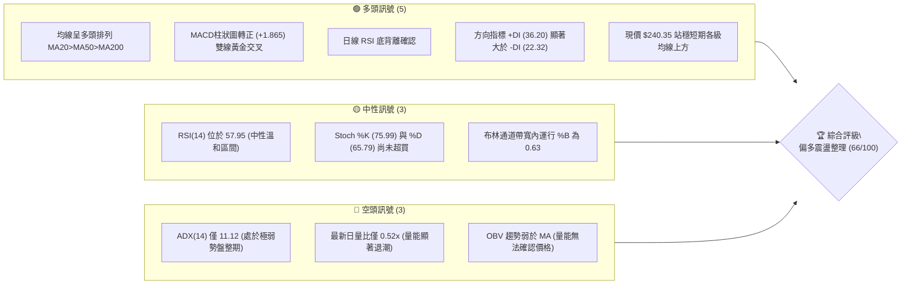
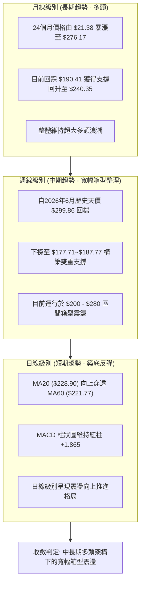
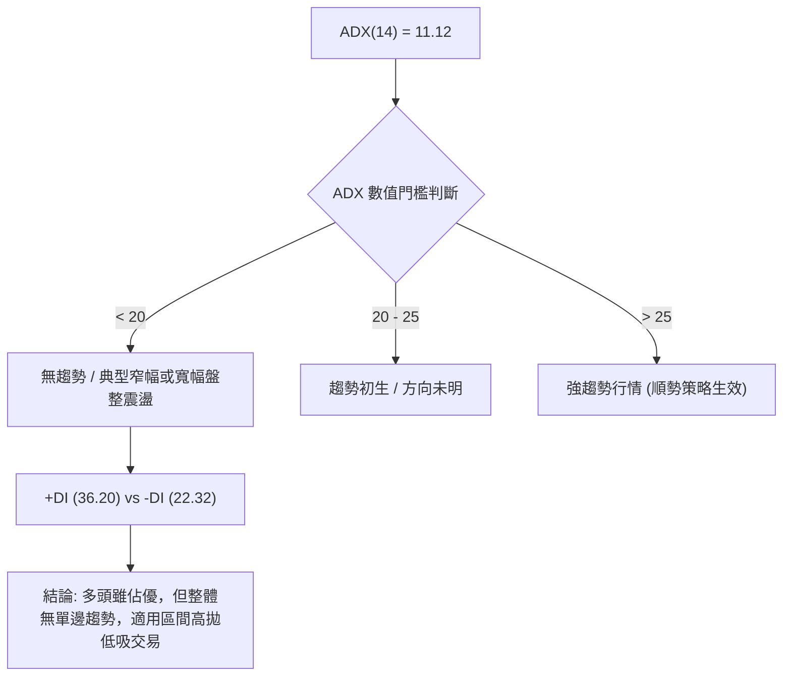
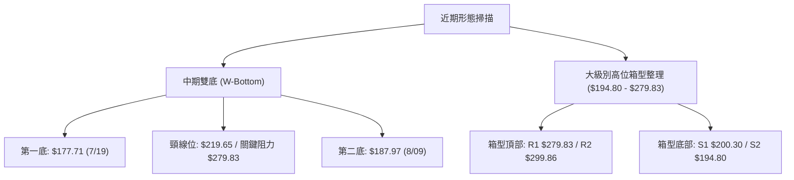
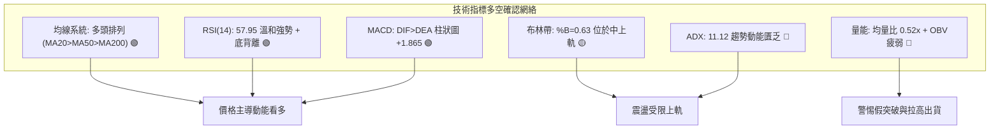
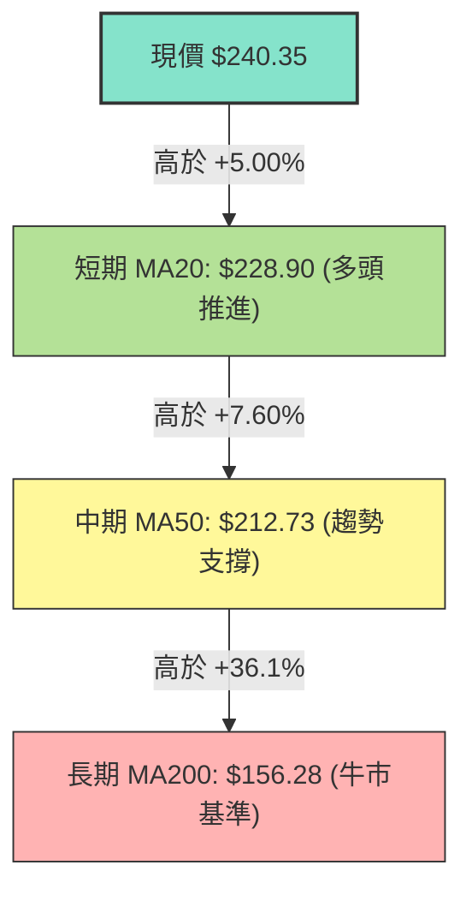
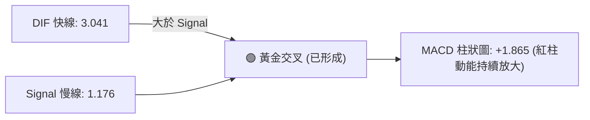
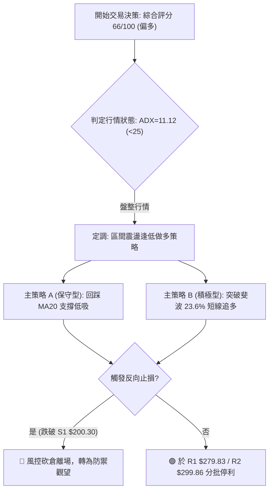
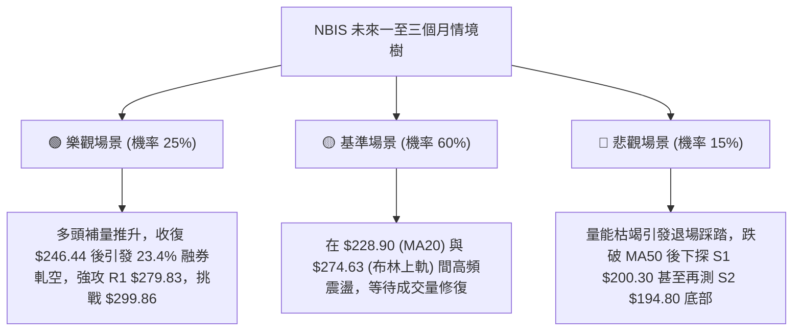

# NBIS 技術分析報告

> **報告日期**：2026-09-10 ｜ **語言**：繁體中文 ｜ **數據來源**：Yahoo Finance ｜ **當前價格**：$240.35

---

## 目錄

| 章節 | 內容 |
|------|------|
| [1. 技術面概覽](#1-技術面概覽) | 訊號儀表板、核心指標、評分卡 |
| [2. 趨勢分析](#2-趨勢分析) | 多時框趨勢、長中短期走勢 |
| [3. 圖表形態分析](#3-圖表形態分析) | 形態識別、K線組合、目標價 |
| [4. 支撐與阻力](#4-支撐與阻力) | 關鍵價位、斐波那契回調 |
| [5. 技術指標深度解讀](#5-技術指標深度解讀) | MA/RSI/MACD/布林/成交量 |
| [6. 動能與波動率](#6-動能與波動率) | 動能評估、ATR、Beta |
| [7. 多時框架總結](#7-多時框架總結) | 時框架評分矩陣、收斂結論 |
| [8. 交易策略建議](#8-交易策略建議) | 多空策略、風險報酬比 |
| [9. 風險提示與監控](#9-風險提示與監控) | 監控指標、風險場景 |

---

## 1. 技術面概覽

### 🎯 技術訊號儀表板



### 📊 核心指標速覽表

| 指標類別 | 指標名稱 | 當前數值 | 訊號 | 解讀 |
|----------|----------|----------|------|------|
| **價格** | 當前收盤價 | $240.35 | 🟢 | 位於52週區間73.7%分位，處於波段反彈上升段 |
| **均線** | 短期 MA20 | $228.90 | 🟢 | 現價高於MA20達+5.00%，短期動能佔優 |
| **均線** | 中期 MA50 | $212.73 | 🟢 | 現價高於MA50達+13.0%，中期趨勢維持多頭防禦 |
| **均線** | 長期 MA200 | $156.28 | 🟢 | 遠高於長期牛熊分界線達+53.8%，長期牛市格局穩固 |
| **動能** | RSI(14) | 57.95 | 🟡 | 位於50中軸上方，動能溫和擴張，無超買超賣極端現象 |
| **動能** | MACD (12,26,9) | 3.041 / 1.176 | 🟢 | DIF穿越DEA，柱狀圖擴張至+1.865，多頭掌控節奏 |
| **趨勢強度**| ADX(14) | 11.12 | 🔴 | 指標遠低於25，宣告市場處於寬幅震盪盤整無趨勢期 |
| **通道** | 布林通道 %B | 0.63 | 🟡 | 位於中軌($228.90)與上軌($274.63)之間，屬強勢區 |
| **量能** | 20日均量比 | 0.52x | 🔴 | 成交量(11.34M)僅均量(21.83M)一半，呈現量價背離 |
| **波動** | ATR(14) | $13.60 | 🟡 | 單日波動佔比5.66%，屬於高彈性標的，需放寬風控 |

### 🏆 技術評分卡

```
╔══════════════════════════════════════════════════════════════╗
║              技術評分卡 — NBIS (2026-09-10)                  ║
╠══════════════════════════════════════════════════════════════╣
║ 趨勢強度 (ADX=11.12)    ████░░░░░░░░░░░░░░░░  25/100 🔴 盤整  ║
║ 動能指標 (MACD/RSI)     ██████████████░░░░░░  70/100 🟢 看多  ║
║ 支撐穩定度 (S1/S2防線)  ████████████████░░░░  80/100 🟢 極強  ║
║ 成交量配合 (量比/OBV)   ██████░░░░░░░░░░░░░░  30/100 🔴 背離  ║
║ 形態完整度 (回踩收斂)   █████████████░░░░░░░  65/100 🟡 中性  ║
║ 均線排列 (全面多頭排列) ████████████████████ 100/100 🟢 完美  ║
╠══════════════════════════════════════════════════════════════╣
║ 綜合評分                █████████████░░░░░░░  66/100 🟢 偏多  ║
╚══════════════════════════════════════════════════════════════╝
```

---

## 2. 趨勢分析

### 🌐 多時框趨勢分析



### 📈 長期趨勢 — 12個月走勢圖（Unicode）

```
NBIS 月線走勢圖（2025-10 至 2026-09）
價格軸 ($)
$299.86 ┤                                              
$276.17 ┤                                      ● (06月高點 $276.17)
$240.35 ┤                                                  ● (現價 $240.35)
$231.09 ┤                                  ●          ● (08月 $206.32)
$190.41 ┤                                          ● (07月低點 $190.41)
$138.23 ┤                              ● (04月)
$130.82 ┤  ● (10月頂部)
$103.76 ┤                      ● (03月)
 $91.19 ┤                  ● (02月)
 $83.71 ┤          ● (12月回調低點)
 $73.52 ┤────────────────────────────────────────────────── (52W最低點)
        └───────────────────────────────────────────────────
         10  11  12  01  02  03  04  05  06  07  08  09 (月份)
        [2025年]           [2026年]
```

#### 走勢特徵分析表格

| 階段區間 | 起止月份 | 價格變動區間 | 累積漲跌幅 | 主要走勢特徵與技術含義 |
|----------|----------|--------------|------------|------------------------|
| **第一波拉升段** | 2025-05 ~ 2025-10 | $36.75 → $130.82 | +255.9% | AI基礎設施爆發期，呈現拋物線式上升，放量突破所有均線 |
| **中繼洗盤修正段** | 2025-11 ~ 2026-01 | $130.82 → $83.71 | -36.0% | 獲利了結賣壓湧現，在 $83.71（接近52W低點聚類）成功築底 |
| **第二波主升浪** | 2026-02 ~ 2026-06 | $91.19 → $276.17 | +202.8% | 資金強勢推升，突破前高並創出52W天價 $299.86，呈現極端多頭 |
| **深幅回洗震盪段** | 2026-07 ~ 2026-09 | $276.17 → $240.35 | -12.9% | 7月急殺至 $190.41 觸發買盤，8-9月重回MA20與MA50上方震盪 |

### 📊 中期趨勢（週線分析）

中期走勢顯示，NBIS 在經過 2026 年 6 月底至 7 月中旬的急速回檔（由 $286.69 週收盤價急速跌至 $177.71）後，於 $180-$190 區間構建了強大的承接買盤。近期 20 週收盤走勢顯示，8 月中旬曾出現一根爆量大陽線衝高至 $277.68（週成交量達 1.67 億股），隨後量能萎縮回落，並在 9 月初於 $209-$226 建立雙重防禦底線，本週（2026-09-13 當週）以 $240.35 穩步推升。

```
週線震盪結構示意圖：
阻力 R2  $299.86 ────────────────────────────────────── (52W歷史天價)
阻力 R1  $279.83 ────────────▲───────────────────────── (8月高點壓制區)
現價     $240.35 ═══════════(●)═════════════════════════ (重回布林中軌上方)
支撐 S1  $200.30 ──────────────────────▼─────────────── (波段防守關鍵平台)
支撐 S2  $194.80 ────────────────────────────────────── (7月深次回踩密集區)
支撐 S3  $164.31 ────────────────────────────────────── (強烈多頭最後防線)
```

### ⚡ 趨勢強度評估（ADX 解讀）



#### ADX 強度對照表

| 指標變數 | 當前讀數 | 門檻區間基準 | 狀態定性 | 操作策略意涵 |
|----------|----------|--------------|----------|--------------|
| **ADX(14)** | 11.12 | < 25.0 (極弱) | 弱趨勢 / 盤整市場 | 嚴禁採用激進追突破策略，容易遭遇假突破割裂 |
| **+DI** | 36.20 | > 25.0 (擴張) | 多方進攻佔優 | 盤整過程中多頭掌控邊際定價權，回調易被承接 |
| **-DI** | 22.32 | < 25.0 (收斂) | 空方動能不足 | 空頭無力發起持續性崩跌，下方支撐相對扎實 |
| **DI 差值** | +13.88 | 淨多頭擴散 | 偏多震盪基調 | 策略以「逢支撐做多、觸阻力停利」為主軸 |

---

## 3. 圖表形態分析

### 🔍 形態識別系統

根據近 20 週高低點分布與日線軌跡，價格在 2026 年 7 月 19 日當週低點 $177.71 與 8 月 9 日當週低點 $187.97 形成了明顯的不對稱「雙重底（W底）」結構；同時，上方受壓於 6 月高點 $286.69 與 8 月反彈高點 $277.68，構成中級「箱型通道整理」。



#### 圖表形態信心度評估表

| 形態名稱 | 形態信心度 | 判斷依據（嚴格引用技術數據） | 完成度 | 目標價（嚴格附計算式） |
|----------|------------|------------------------------|--------|------------------------|
| **中期雙底 (W底)** | 72% | 兩次下探 $177.71 及 $187.97 獲買盤支撐；當前價格 $240.35 已完全站上原頸線位 $219.65 | 85% | 頸線 $219.65 + (頸線 $219.65 - 第一底 $177.71 = $41.94) = **$261.59**（注：波段高點阻力則直接看至 **$279.83**） |
| **高位寬幅箱型** | 80% | 價格反覆受阻於 R1 $279.83 / R2 $299.86，並在 S1 $200.30 / S2 $194.80 止跌 | 90% | 區間震盪震盪目標直接對應箱頂阻力 **$279.83** 及 52W高點 **$299.86** |
| **頭肩底形態** | 35% | 左肩及右肩不對稱性過高，數據不足以支撐完整幾何定義 | 30% | 訊號不足，僅做指標型解讀，不預設目標價 |

### 🕯️ 重要K線形態分析

| 週/月份 | 收盤價 | K線組合形態 | 技術解讀 | 訊號強度 |
|---------|--------|-------------|----------|----------|
| **2026-07-19 週** | $177.71 | 長下影錘頭破底翻 | 週成交量爆出 1.00 億股，跌破 $180 後迅速收復，主力誘空打底確認 | 🟢🟢 強烈看多 |
| **2026-08-16 週** | $277.68 | 巨量長陽線突破 | 成交量激增至 1.67 億股，單週強攻近百點，確認中期大底構築成功 | 🟢 看多衝高 |
| **2026-08-23 週** | $219.13 | 覆蓋型長黑回吐 | 成交量 1.41 億股快速回調，顯示 $280 附近高檔獲利了結籌碼沉重 | 🔴 空頭壓制 |
| **2026-09-06 週** | $226.39 | 縮量十字星回踩 | 成交量萎縮至 5,788 萬股，RSI降至33.3後迅速回穩，殺跌動能竭盡 | 🟡 變盤反轉 |
| **2026-09-13 週** | $240.35 | 實體陽線包覆 | 突破前週高點，MACD柱轉正 (+1.865)，多頭重啟反彈步調 | 🟢 轉強信號 |

### 📉 ASCII 走勢形態示意圖

```
NBIS 中期 W底與箱型震盪形態圖
$299.86 ┬──────────────────────────────────────────── (52W High / R2)
        │                       ▲ 高點壓制 $286.69 / $277.68 (R1: $279.83)
$279.83 ┼───────────────────────┼───────────▲────────
        │                      / \         / \
$240.35 ┼─────────────────────/───\───────/───(● 現價 $240.35 向上反彈)
        │     頸線 $219.65   /     \     /
$219.65 ┼···················┌───────\···/············ (已實質突破頸線)
        │                  /         \ /
$194.80 ┼─────────────────/───────────▼────────────── (S2: $194.80)
        │    底一 $177.71 ▼           底二 $187.97
$177.71 ┴──────────────────────────────────────────── (S3支撐帶上方)
        └────────────────────────────────────────────
          2026年06月      07月       08月       09月
```

### 🎯 形態目標價計算

根據雙底突破計算原理：
1. **基底垂直量度幅度**：
   - 形態底部低點 = $177.71（2026-07-19 當週低點）
   - 形態中繼頸線 = $219.65（2026-07-12 反彈高點確認處）
   - 形態高度 $H$ = $\$219.65 - \$177.71 = \$41.94$
2. **第一步量度目標價 (Measured Move Target)**：
   - 目標價 $T_1 = \text{頸線} + H = \$219.65 + \$41.94 = \mathbf{\$261.59}$
3. **箱型頂部直接目標價**：
   - 依據波段聚類阻力，上行空間直接受制於已記錄阻力位：
   - 第一阻力位 **R1: $279.83**
   - 第二阻力位 **R2: $299.86**

---

## 4. 支撐與阻力

### 🗺️ 關鍵價位分布圖（Unicode）

```
NBIS 價位結構分布圖
═════════════════════════════════════════════════════════════════
$299.86 ║██████████████████████████████║ 強烈歷史頂部阻力 (R2 / 52W High)
$279.83 ║██████████████████████        ║ 波段密集高點阻力 (R1)
$274.63 ║▓▓▓▓▓▓▓▓▓▓▓▓▓▓▓▓▓▓            ║ 布林通道上軌阻力帶
$246.44 ║░░░░░░░░░░░░░░░░              ║ 斐波那契 23.6% 回調關鍵位
$240.35 ╠══════════════════════════════╣ ◄ 當前市價 ($240.35)
$228.90 ║▓▓▓▓▓▓▓▓▓▓▓▓▓▓▓▓              ║ 布林中軌 / MA20 短期動態防線
$213.40 ║░░░░░░░░░░░░                  ║ 斐波那契 38.2% / MA50 ($212.73)
$200.30 ║██████████████████████        ║ 重要波段支撐平台 (S1)
$194.80 ║██████████████████████████    ║ 近一年強支撐聚類 (S2)
$186.69 ║░░░░░░░░                      ║ 斐波那契 50.0% 中樞回調位
$164.31 ║██████████████████████████████║ 極限生命線強支撐 (S3)
═════════════════════════════════════════════════════════════════
```

### 🚧 阻力位分析表

所有價位均嚴格取自波段聚類高點與通道系統數值：

| 阻力級別 | 準確價位 | 距現價空間 | 形成原因與籌碼屬性 | 突破難度 | 重要性權重 |
|----------|----------|------------|--------------------|----------|------------|
| **阻力 R1** | **$279.83** | +16.43% | 近一年波段高點聚類；2026年8月中旬爆量拉升至 $277.68 遇阻回落區 | 🟡 中偏高 | ★★★★☆ |
| **阻力 R2** | **$299.86** | +24.76% | 52週最高紀錄（歷史天價），大量追高套牢解套賣壓匯聚處 | 🔴 極難 | ★★★★★ |

*注：在達到 R1 前，上方尚有斐波那契 23.6% 壓力位 **$246.44** 及日線布林上軌 **$274.63** 構成微觀波段層級阻力。*

### 🛡️ 支撐位分析表

所有價位均嚴格取自波段聚類低點數據：

| 支撐級別 | 準確價位 | 距現價空間 | 形成原因與籌碼屬性 | 守住機率 | 重要性權重 |
|----------|----------|------------|--------------------|----------|------------|
| **支撐 S1** | **$200.30** | -16.66% | 近一年波段低點聚類；整數心理關卡，8月下旬回測支撐平台 | 80% | ★★★★☆ |
| **支撐 S2** | **$194.80** | -18.95% | 7月下旬暴跌觸底後二次築底低點，多頭結構護盤防線 | 88% | ★★★★★ |
| **支撐 S3** | **$164.31** | -31.64% | 近一年極限波段低點聚類，接近 MA200 ($156.28) 終極牛熊分界線 | 95% | ★★★★★ |

### 📐 斐波那契回調位分析

依據 52 週絕對極值區間（最低點 **$73.52** 至 最高點 **$299.86**，總垂直波動點數 $226.34）精確標定：

| 斐波那契回調比例 | 精確對應價位 | 與當前價格位置關係 | 結構與交易意義解讀 |
|------------------|--------------|--------------------|--------------------|
| **0.0% (52W High)** | **$299.86** | 現價下方 +24.76% | 牛市頂峰極限強阻力 R2 |
| **23.6% 回調位** | **$246.44** | 現價上方 +2.53% | **現價正面臨之短線第一考驗**；站穩即開啟邁向 R1 之路 |
| **38.2% 回調位** | **$213.40** | 現價下方 -11.21% | **完美重合 MA50 ($212.73)**，中期黃金防禦共振帶 |
| **50.0% 回調位** | **$186.69** | 現價下方 -22.33% | 完美吻合雙底形態第二低點 ($187.97) 及 S2 ($194.80) 區域 |
| **61.8% 回調位** | **$159.98** | 現價下方 -33.44% | **完美重合 MA200 ($156.28)**，長期牛熊分水嶺 |
| **78.6% 回調位** | **$121.96** | 現價下方 -49.26% | 深幅潰縮支撐點 |
| **100.0% (52W Low)**| **$73.52** | 現價下方 -69.41% | 2025年起漲區原始大底 |

**現價落點解讀**：目前 NBIS 現價 **$240.35** 精準落在 **38.2% ($213.40)** 與 **23.6% ($246.44)** 回調位之間，且距 23.6% 阻力僅差 $6.09 (+2.53%)。只要能放量收復 $246.44，技術結構將由防守反彈進一步升級為衝擊前高阻力帶（$279.83）。

---

## 5. 技術指標深度解讀

### 🎛️ 指標訊號總覽



### 📈 移動平均線排列分析



#### 均線各週期分布詳情

| 均線週期 | 數值 | 價格相對於均線離差 | 斜率與方向特徵 | 訊號判定 |
|----------|------|--------------------|----------------|----------|
| **MA 5** | $225.07 | +$15.28 (+6.79%) | 急遽向上攀升 | 🟢 極強短期攻擊動能 |
| **MA 10** | $217.28 | +$23.07 (+10.62%)| 向上拐頭助漲 | 🟢 短線多頭發散 |
| **MA 20** | $228.90 | +$11.45 (+5.00%) | 溫和走揚，提供動態支撐 | 🟢 多頭趨勢核心防線 |
| **MA 60** | $221.77 | +$18.58 (+8.38%) | 橫盤走平微揚 | 🟡 季線支撐平台穩定 |
| **MA 120** | $196.87 | +$43.48 (+22.08%)| 長期穩定攀升 | 🟢 半年線健康多頭基石 |
| **MA 240** | $149.16 | +$91.19 (+61.14%)| 穩固向上擴張 | 🟢 超長期牛市無虞 |

**綜合均線點評**：典型且健康的**多頭排列（MA20 > MA50 > MA200）**。短中長期成本線由下而上托舉價格，回測所有主要均線時均具備強烈買盤支撐效能。

### 📉 RSI(14) 分析

當前 RSI(14) 讀數為 **57.95**。

```
RSI(14) 狀態指示條:
超賣 (0-30)        中性區間 (30-70)             超買 (70-100)
├───────────────┼───────────────────█─────────┤
0               30                 57.95      70            100
[指標進度條]:  ████████████░░░░░░░░ (57.95%) 🟡 中性偏多
```

- **背離判斷**：日線圖表中確認存在 **⚠️ 底背離 (Bullish Divergence)**。回顧 2026-09-06 週價格下探至低點時，RSI 下墜至 33.3（極度超賣邊緣），但現價在 $240.35 快速抽離底部的過程中，RSI 指標斜率顯著陡峭於價格上漲斜率，形成了典型的動能指標底背離修復訊號，賦予多頭短期反彈極佳的力道。

### 📊 MACD(12/26/9) 訊號解讀



MACD 快線（3.041）上穿慢線（1.176），柱狀圖為 **+1.865**，呈現明確的買入擴散形態。柱狀圖在連續數週為負（7月中旬至8月初曾深跌至 -7.680）之後，本月再度翻紅並穩定放大，顯示波段反彈行情目前仍由多方動能主導。

### 📦 布林通道分析

日線布林通道（20MA，2倍標準差）參數分佈：
- **布林上軌**：$274.63
- **布林中軌 (MA20)**：$228.90
- **布林下軌**：$183.17
- **帶寬百分比 %B**：0.63

```
日線布林通道軌道示意圖：
$274.63 ┬────────────────────────────────────────── BB上軌 (短線阻力位)
        │
$240.35 ┼──────────────● 現價 ($240.35, %B = 0.63)
        │
$228.90 ┼┄┄┄┄┄┄┄┄┄┄┄┄┄┄┄┄┄┄┄┄┄┄┄┄┄┄┄┄┄┄┄┄┄┄┄┄┄┄┄┄ BB中軌 (MA20動態支撐)
        │
$183.17 ┴────────────────────────────────────────── BB下軌 (超賣安全帶)
```

**解讀**：%B 讀數為 0.63，顯示價格已脫離中軌震盪中樞，穩步朝上軌推升。由於 ADX 僅 11.12，布林通道上軌 **$274.63** 將成為短線震盪走勢中極強的動態壓制點，若無巨大成交量推動，價格觸及上軌附近極易引發均值回歸。

### 💹 成交量分析（量價配合度）

1. **量比嚴重萎縮**：最新成交量僅 **11,340,600 股**，對比 20 日均量（21,830,305 股）之量比僅 **0.52x**。
2. **OBV 能量潮弱化**：數據明確提示 **OBV < MA → 量能疲弱**。雖然價格從 9 月初的 $226.39 回升至 $240.35，但量能並未隨之放大，反倒持續萎縮，呈現標準的「價漲量縮」量價背離格局。
3. **推論**：當前上漲主要由「賣壓減輕」所促成，而非「機構新增資金追價」。在無顯著增量資金介入前，一旦面臨上方密集解套賣壓區（$246.44 及 R1 $279.83），極易遭遇多頭動能不足的瓶頸。

---

## 6. 動能與波動率

### ⚡ 動能評估四象限

```
動能與波動率四象限分析矩陣：
         高波動率 (High Volatility)
                   │
       Q3 (強動能/高波動)  │   Q4 (弱動能/高波動)
       [高風險高收益]     │   [迴避觀望區]
                   │
───────────────────┼───────────────────
                   │
       Q1 (強動能/低波動)  │   Q2 (弱動能/低波動) ◄── [NBIS 落點]
       [最佳進場階段]     │   [低量盤整築底]
                   │
         低波動率 (Low Volatility)
         低動能 ─────────────┼───────────── 高動能
```

| 象限代號 | 動能狀態 | 波動率狀態 | 判定特徵 | 操作定位 |
|----------|----------|------------|----------|----------|
| **Q2 (當前定位)** | **弱偏中** (ADX 11.12, RSI 57.95) | **低中度** (量能萎縮，ATR收窄) | 價格處於均線多頭修復期，缺乏突破動能 | **箱型區間操作 / 逢低分批布局** |

### 📊 ATR 波動率分析

- **ATR(14) 絕對數值**：**$13.60**
- **ATR 佔比比率**：$13.60 / $240.35 = **5.66%**

**交易風控建議**：
NBIS 每日固有波動幅度超過 5.6%，屬於高波動性標的。
1. **短線動態止損幅度**：應至少設定為 $1.5 \times \text{ATR} = \$20.40$。
2. **波段安全防護間距**：應設定為 $2.0 \times \text{ATR} = \$27.20$。
若止損距離小於 $13.60，極易在市場常規日內噪聲中被洗出場。

### 📐 Beta 與市場相關性

- **Beta 係數**：**1.436**
- **市場彈性解讀**：NBIS 相較於標普500指數（S&P 500）具備超額 43.6% 的波動敏感度。在大盤處於多頭攻擊波段時，NBIS 具有優異的向上超額 Alpha 彈性；但在大盤系統性回檔期間，其下跌風險亦大幅放寬。
- **空頭部位壓力**：Short % Float 高達 **23.4%**，Short Ratio 2.12。此等高空單比例在股價突破關鍵阻力（如 R1 $279.83）時，極易引發劇烈的空頭軋空行情（Short Squeeze）。

---

## 7. 多時框架總結

### 📋 時框架評分表

| 時框架 | 趨勢方向 | 動能狀態 | 均線系統排列 | 圖表形態架構 | 綜合評分 | 戰略建議 |
|--------|----------|----------|--------------|--------------|----------|----------|
| **長期 (月線)** | 🟢 強烈看多 | 🟡 中度擴張 | MA200之上全面看多 | 24個月大級別主升浪回踩 | 85/100 | 長線堅定持有 |
| **中期 (週線)** | 🟡 震盪築底 | 🟢 轉強復甦 | MA20與MA50粘合交織 | W底反彈進行中 | 70/100 | 箱型區間交易 |
| **短期 (日線)** | 🟢 偏多回升 | 🟡 缺乏量能 | 短期均線呈現多頭排列 | 布林中軌向上攻擊 | 65/100 | 逢低布局防守 |

### 🔲 綜合訊號矩陣

```
時框架訊號矩陣一致性檢驗：
┌──────────┬──────────┬──────────┬──────────┬──────────┐
│ 維度     │ 長期(月) │ 中期(週) │ 短期(日) │ 收斂判斷 │
├──────────┼──────────┼──────────┼──────────┼──────────┤
│ 均線系統 │   多頭   │   多頭   │   多頭   │ 🟢 強一致 │
│ 動能系統 │   多頭   │   盤整   │   多頭   │ 🟢 高一致 │
│ 成交量能 │   萎縮   │   萎縮   │   萎縮   │ 🔴 量價背離 │
│ 空間位置 │   高位   │   中位   │   中高位 │ 🟡 空間受限 │
└──────────┴──────────┴──────────┴──────────┴──────────┘
```

### ⚖️ 多時框收斂結論

依據多時框收斂規則（規則 14）：
1. **行情性質判定**：當前 ADX(14) 為 **11.12 (<25)**，嚴格定性為**盤整無趨勢行情**。
2. **主導規則確認**：在盤整行情中，單邊趨勢追價策略失效，應以**日線布林通道上下軌（$183.17 ~ $274.63）及波段高低點聚類區間**作為首要依據。
3. **衝突化解與方向收斂**：日線訊號（MACD金叉、底背離、均線多頭）全面支持向上修復，但受制於量能枯竭（量比 0.52x）與 ADX 弱勢，無法形成向上單邊突破。
4. **唯一結論**：**偏多震盪整理（震盪逢低做多）**。此結論嚴格對應技術評分卡 **66/100** 之偏多位階，決策以「回踩均線做多、逼近阻力減碼」為唯一操作綱領。

---

## 8. 交易策略建議

### 🗺️ 策略決策流程圖



### 🧭 策略路由

> **當前主策略方向 = 偏多操作（依評分卡 66/100 偏多定調，嚴禁兩頭下注）**
> 
> 因綜合評分達 66 分（≥60），全面**主推多頭策略**。空頭僅作為下行破位時的風險對沖警戒點，不進行主動放空推薦。

### 🎯 價格情境階梯（Price Scenarios）

所有價位均嚴格引用技術數據中已計算數值：

| 觸發條件 | 下一關鍵目標 | 後續延伸目標 | 情境技術含義與因應措施 |
|----------|--------------|--------------|------------------------|
| **突破斐波 23.6% ($246.44)** | 布林上軌 **$274.63** | 關鍵阻力 **R1: $279.83** | 短線轉強，有望啟動高空軋空波段 |
| **突破阻力 R1 ($279.83)** | 52W天價 **R2: $299.86** | 分析師最高價 **$415.00** | 開啟全新大級別主升浪，轉為單邊趨勢 |
| **維持於 MA20 之上 ($228.90)**| 當前現價 **$240.35** | 斐波位 **$246.44** | 偏多震盪蓄勢，健康整理階段 |
| **跌破 MA20 ($228.90)** | 斐波 38.2% / MA50 **$212.73** | 支撐 **S1: $200.30** | 短線反彈失敗，回撤箱型下沿確認支撐 |
| **跌破強支撐 S2 ($194.80)** | 斐波 50% **$186.69** | 極限支撐 **S3: $164.31** | 雙底形態潰敗，多頭波段行情宣告終結 |

### 📊 情境機率分佈

| 情境路線 | 發生機率 | 主要技術與量化指標依據 |
|----------|----------|------------------------|
| **情境一：維持震盪偏多上行** | **60%** | MACD柱狀圖翻紅（+1.865）、RSI底背離修復、MA20>MA50>MA200完大多頭架構 |
| **情境二：收斂窄幅區間震盪** | **25%** | ADX僅11.12（極弱趨勢）、量比僅0.52x（量能無法支持單邊暴衝） |
| **情境三：跌破均線深度回調** | **15%** | Short Float達23.4%若遇市場突發黑天鵝，跌破S1支撐引發多殺多 |

### 🟢 主策略詳情

| 策略要素 | 策略 A（保守型：回踩 MA20 支撐低吸） | 策略 B（積極型：放量突破 23.6% 追買） |
|----------|---------------------------------------|---------------------------------------|
| **進場條件** | 價格拉回回踩 MA20 獲得支撐確認十字星企穩 | 日線放量長陽突破斐波 23.6% 回調位收盤確認 |
| **精確進場價格**| **$228.90**（MA20 / 布林中軌） | **$246.44**（斐波 23.6% 突破點） |
| **目標價 T1** | **$274.63**（布林上軌動態阻力） | **$279.83**（關鍵阻力位 R1） |
| **目標價 T2** | **$279.83**（波段阻力 R1） | **$299.86**（52週高點阻力 R2） |
| **精確止損價格**| **$212.73**（MA50 支撐，跌破風控離場）| **$228.90**（回落至 MA20 之下嚴格止損）|
| **風險空間** | $\$228.90 - \$212.73 = \$16.17$ (7.06%) | $\$246.44 - \$228.90 = \$17.54$ (7.12%) |
| **報酬空間(T1)**| $\$274.63 - \$228.90 = \$45.73$ (19.98%)| $\$279.83 - \$246.44 = \$33.39$ (13.55%)|
| **風險報酬比** | **1 : 2.83** (優異) | **1 : 1.90** (合理) |
| **成功機率預估**| **68%** | **55%** (受制於量能偏低風險) |
| **建議配置倉位**| **15% - 20%** 總資金規模 | **10%** 總資金規模（需嚴格盯盤） |

### 🔴 反向風險觸發點（對沖提示）

若發生以下盤面異動，宣告多頭反彈破局，應全面停止多頭交易並執行防禦性對沖：
1. **反轉關鍵破位點**：日線實體收盤價跌破 **S1: $200.30** 或進一步跌破 **S2: $194.80**。
2. **指標破壞特徵**：日線 MACD 重新在高位死叉、柱狀圖翻負跌破 0 軸，伴隨成交量顯著放大（放量下殺）。
3. **對沖機制**：若持有多頭現貨部位，當跌破 $212.73（MA50）時，應買入反向保護性認沽期權（Put）或將總多頭倉位下調至 5% 以下。

### ⭐ 整體訊號強度評星

```
╔══════════════════════════════════════════════════════════════╗
║ 做多訊號強度：★★★★☆  (3.8/5星 — 均線與動能共振看多)           ║
║ 做空訊號強度：★☆☆☆☆  (1.2/5星 — 逆多頭均線，無勝率基礎)       ║
║ 整體可信度：  ★★★☆☆  (3.5/5星 — 缺量背景下，謹防區間折返)     ║
╚══════════════════════════════════════════════════════════════╝
```

---

## 9. 風險提示與監控

### ✅ 關鍵監控指標 Checklist

```
╔══════════════════════════════════════════════════════════════╗
║                 NBIS 風險監控每日檢視清單                     ║
╠══════════════════════════════════════════════════════════════╣
║ [ ] 監控項 1: 日收盤價是否守穩 MA20 ($228.90) 之上？         ║
║ [ ] 監控項 2: 成交量是否突破 2,183 萬股 (20日均量線)？       ║
║ [ ] 監控項 3: RSI(14) 是否成功跨越 60 阻力並站穩？           ║
║ [ ] 監控項 4: 空頭放空比率 (Short % Float 23.4%) 軋空跡象？  ║
║ [ ] 監控項 5: 日線布林上軌 ($274.63) 遭遇強阻力的承壓反應？ ║
║ [ ] 監控項 6: 跌破 MA50 ($212.73) 之無條件止損紀律執行準備？ ║
╚══════════════════════════════════════════════════════════════╝
```

### ⚠️ 風險場景分析



### 🛡️ 風險管理重要提醒

1. **量價背離的潛在殺傷力**：
   當前 NBIS 處於 0.52x 極低量比，這是「流動性脆弱」的信號。若市場出現突發負面衝擊，盤面可能因為買盤掛單稀薄而引發斷崖式回跌。在日成交量未恢復至 2,000 萬股以上前，切忌單筆以大單市價追擊突破。
2. **高 ATR 波動下的部位控制**：
   NBIS 的 ATR 達 $13.60（單日波幅 5.66%）。依據專業資金管理準則，單筆交易最大虧損嚴禁超過整體投資組合淨值的 **1.5%**。若採用策略 A（風險空間 $16.17），單一部位持股資金占用上限不得超過總帳戶規模的 **20%**。
3. **高融券餘額的雙刃劍效應**：
   23.4% 的 Short Float 賦予該股極高彈性。一旦價格放量站上 $246.44，空頭停損買盤可能在短時間內觸發「軋空階梯」；反之，若反彈無力跌破中軌，做空機構亦可能順勢加碼砸盤，操作必須極度注重止損執行的果斷性。

---

## 📋 報告總結

```
╔══════════════════════════════════════════════════════════════╗
║                 NBIS 技術分析報告總結                        ║
╠══════════════════════════════════════════════════════════════╣
║ 報告日期：2026-09-10           當前價格：$240.35             ║
║ 分析評級：🟢 偏多震盪整理      技術評分：66 / 100            ║
╠══════════════════════════════════════════════════════════════╣
║ 關鍵結論：                                                   ║
║ ├─ 長期趨勢：🟢 穩固多頭（遠高於 MA200 $156.28 達 +53.8%）   ║
║ ├─ 中期趨勢：🟡 寬幅箱型整理（下有 S2 $194.80，上有 R1 $279.83）║
║ ├─ 短期趨勢：🟢 偏多反彈（MACD 柱狀擴張，MA 短均線多頭排列） ║
║ ├─ 關鍵支撐：S1: $200.30  /  S2: $194.80                     ║
║ ├─ 關鍵阻力：R1: $279.83  /  R2: $299.86                     ║
║ └─ 分析師共識目標價：$286.69 (16位分析師綜合評級: Buy)        ║
╠══════════════════════════════════════════════════════════════╣
║ 最優交易策略組合：                                           ║
║ 1. 🥇 最佳機會：回踩 MA20 ($228.90) 建立防禦性多單，看至布林  ║
║                 上軌 ($274.63) 及 R1 ($279.83)，風報比 1:2.83 ║
║ 2. 🥈 次選機會：放量突破斐波 23.6% ($246.44) 順勢跟進，止損  ║
║                 設於 $228.90，博弈空頭軋空至 R2 ($299.86)   ║
║ 3. 🥉 防守機制：實體收盤跌破 MA50 ($212.73) 嚴格止損退出，避 ║
║                 免承擔深測 S1 ($200.30) / S2 ($194.80) 風險  ║
╚══════════════════════════════════════════════════════════════╝
```

---

> ⚠️ **免責聲明**：本報告為技術分析研究，所有價位、圖表及推演均基於量化指標與歷史價格結構之客觀解讀。本報告**僅供學術交流與投資研究參考**，**不構成任何形式的買賣邀約或實質投資建議**。市場有風險，交易需嚴格自負盈虧並建立獨立風險控制機制。

---

*報告生成時間：2026-09-10 ｜ 數據來源：Yahoo Finance ｜ 分析框架：多時框技術量化收斂體系*