# NBIS 技術分析報告

> **報告日期**：2026-09-11 ｜ **語言**：繁體中文 ｜ **數據來源**：Yahoo Finance ｜ **當前價格**：$228.11

---

## 目錄

| 章節 | 內容 |
|------|------|
| [1. 技術面概覽](#1-技術面概覽) | 訊號儀表板、核心指標、評分卡 |
| [2. 趨勢分析](#2-趨勢分析) | 多時框趨勢、長中短期走勢 |
| [3. 圖表形態分析](#3-圖表形態分析) | 形態識別、K線組合、目標價 |
| [4. 支撐與阻力](#4-支撐與阻力) | 關鍵價位、斐波那契回調 |
| [5. 技術指標深度解讀](#5-技術指標深度解讀) | MA/RSI/MACD/布林/成交量 |
| [6. 動能與波動率](#6-動能與波動率) | 動能評估、ATR、Beta |
| [7. 多時框架總結](#7-多時框架總結) | 時框架評分矩陣 |
| [8. 交易策略建議](#8-交易策略建議) | 多空策略、風險報酬比 |
| [9. 風險提示與監控](#9-風險提示與監控) | 監控指標、風險場景 |

---

## 1. 技術面概覽

### 🎯 技術訊號儀表板

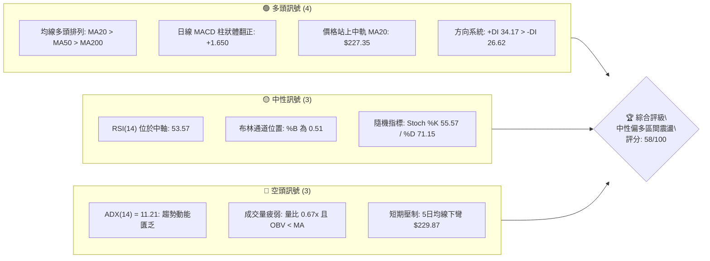

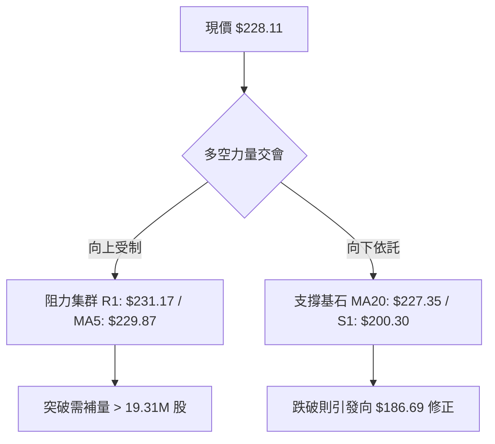

### 📊 核心指標速覽表

| 指標類別 | 指標名稱 | 當前數值 | 訊號 | 解讀 |
|----------|----------|----------|------|------|
| **價格** | 當前價格 | $228.11 | 🟡 | 位於52週區間 68.3%，處於高位回撤後之震盪中軸 |
| **均線** | MA20 | $227.35 | 🟢 | 現價站上 MA20（+0.33%），短期多頭結構未破 |
| **均線** | MA50 | $211.77 | 🟢 | 顯著高於 MA50（+7.72%），中期趨勢保護良好 |
| **均線** | MA200 | $157.00 | 🟢 | 遠高於 MA200（+45.29%），長期牛市基座穩固 |
| **動能** | RSI(14) | 53.57 | 🟡 | 位於 50 榮枯線上方，無超買超賣，多空勢均力敵 |
| **動能** | MACD (12,26,9) | 3.239 / 1.589 | 🟢 | MACD 柱狀體為 +1.650，DIF 與 DEA 維持黃金交叉 |
| **趨勢** | ADX(14) | 11.21 | 🔴 | ADX 遠低於 25，顯示處於無序整理，缺乏明確趨勢 |
| **量能** | 20日成交量比 | 0.67x | 🔴 | 最新量 13.01M 低於均量 19.31M，量價存在背離 |
| **通道** | 布林帶 %B | 0.51 | 🟡 | 價格恰落於布林通道中軌（$227.35），靜待方向擴軌 |
| **波動** | ATR(14) | $13.78 | 🟡 | 佔股價 6.04%，日均單邊震盪劇烈，需寬幅風控 |

### 🏆 技術評分卡

```
╔══════════════════════════════════════════════════════════════════╗
║                 NBIS 技術評分卡 (2026-09-11)                     ║
╠══════════════════════════════════════════════════════════════════╣
║ 趨勢強度 (ADX=11.21, 盤整結構)    ████░░░░░░░░░░░░░░░░  20/100 🔴 ║
║ 動能指標 (MACD看多, RSI中性)      ████████████░░░░░░░░  60/100 🟢 ║
║ 支撐穩定度 (Fib 38.2%與MA50依託)  ████████████████░░░░  80/100 🟢 ║
║ 成交量配合 (量縮, OBV疲弱)        ██████░░░░░░░░░░░░░░  30/100 🔴 ║
║ 形態完整度 (日線收斂三角/箱體)    ██████████████░░░░░░  70/100 🟢 ║
║ 均線排列 (MA20>MA50>MA200多頭排列) ██████████████████░░  90/100 🟢 ║
╠══════════════════════════════════════════════════════════════════╣
║ 綜合評分                          ███████████░░░░░░░░░  58/100 🟡 ║
║ 結論評級：中性偏多震盪整理（建議布林通道與區間邊界操作）          ║
╚══════════════════════════════════════════════════════════════════╝
```

---

## 2. 趨勢分析

### 🌐 多時框趨勢分析

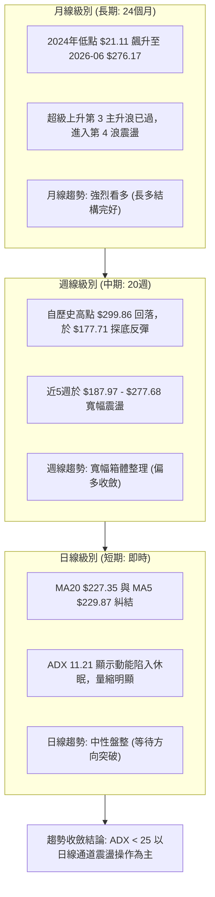

### 📈 長期趨勢 — 12個月走勢圖（Unicode）

```
NBIS 月線走勢圖（過去12個月：2025-10 至 2026-09）
價格軸 ($)
$300 ┤                                           ● (高點 $299.86 / 2026-06 收 $276.17)
$270 ┤                                         ╱   ╲
$240 ┤                                       ╱       ● (2026-09 現價 $228.11)
$210 ┤                                     ╱           ╲   ● (2026-08 $206.32)
$180 ┤                                   ╱               ● (2026-07 $190.41)
$150 ┤                                 ● (2026-05 $231.09)
$120 ┤ ● (2025-10 $130.82)           ╱
$90  ┤   ╲                         ● (2026-04 $138.23)
$60  ┤     ●─────●─────●─────●───╱ (2025-12 $83.71 至 2026-03 $103.76 打底)
     └─────┬─────┬─────┬─────┬─────┬─────┬─────┬─────┬─────┬─────┬─────┬─────
          10月  11月  12月   1月   2月   3月   4月   5月   6月   7月   8月   9月
         (2025)                                                       (2026)
```

**12個月走勢特徵分析表**：

| 階段 | 涵蓋月份 | 起止價格 | 漲跌幅 | 走勢特徵與結構意涵 |
|------|----------|----------|--------|--------------------|
| **第一階段：深幅回洗** | 2025-10 ~ 2025-12 | $130.82 → $83.71 | -36.01% | 歷經前期衝高後的深度獲利回吐，於 $83.71 形成年度次級低點 |
| **第二階段：蓄勢築底** | 2026-01 ~ 2026-03 | $85.19 → $103.76 | +21.80% | 構築三重底部箱體，成交量顯著萎縮，籌碼由散戶移轉至機構 |
| **第三階段：主升暴動** | 2026-04 ~ 2026-06 | $103.76 → $276.17 | +166.16%| 突破頸線後展開指數型爆發，創出 52 週歷史高點 $299.86 |
| **第四階段：次級回撤** | 2026-07 ~ 2026-09 | $276.17 → $228.11 | -17.40% | 快速回撤至斐波那契 50%（$186.69）附近止跌，回升至中軸震盪 |

### 📊 中期趨勢（週線分析）

```
NBIS 週線壓力與支撐階梯圖（近20週）
$300 ┼───────────────────────────────────────────── 52W High / R3: $299.86
     │                       ▲ (06-21: $286.69 / 08-16: $277.68 波段雙頂)
$270 ┼───────────────────────┼───────────────────── 阻力區 R2: $279.83
     │                       │     
$240 ┼─────────▲─────────────┼──────────────▲────── 阻力位 R1: $231.17
     │        ╱ ╲           │             │
$228 ┼───────┼───┼──────────┼─────────────●────── 現價: $228.11 (MA20: $227.35)
     │      ╱     ╲        ╱
$200 ┼─────┼───────┼──────┼───────────────────── 關鍵支撐 S1: $200.30
     │    ╱         ╲    ╱
$180 ┼───●           ●──●─────────────────────── 波段低點 S2: $194.80 / 低點 $177.71
     │ (05-03: $154.49)
$160 ┼───────────────────────────────────────────── 強支撐 S3: $164.31 / MA200: $157.00
```

週線層面顯示，NBIS 在歷經 2026 年 6 月與 8 月兩次向上挑戰 $280.00~$300.00 區域未果後，於 2026 年 7 月中旬下探 $177.71。近 4 週呈現「下影線墊高、週線 MACD 柱收斂轉正」的特徵，顯示中階買盤在 $200.00 關卡具備高度防守意願。

### ⚡ 趨勢強度評估（ADX 解讀）

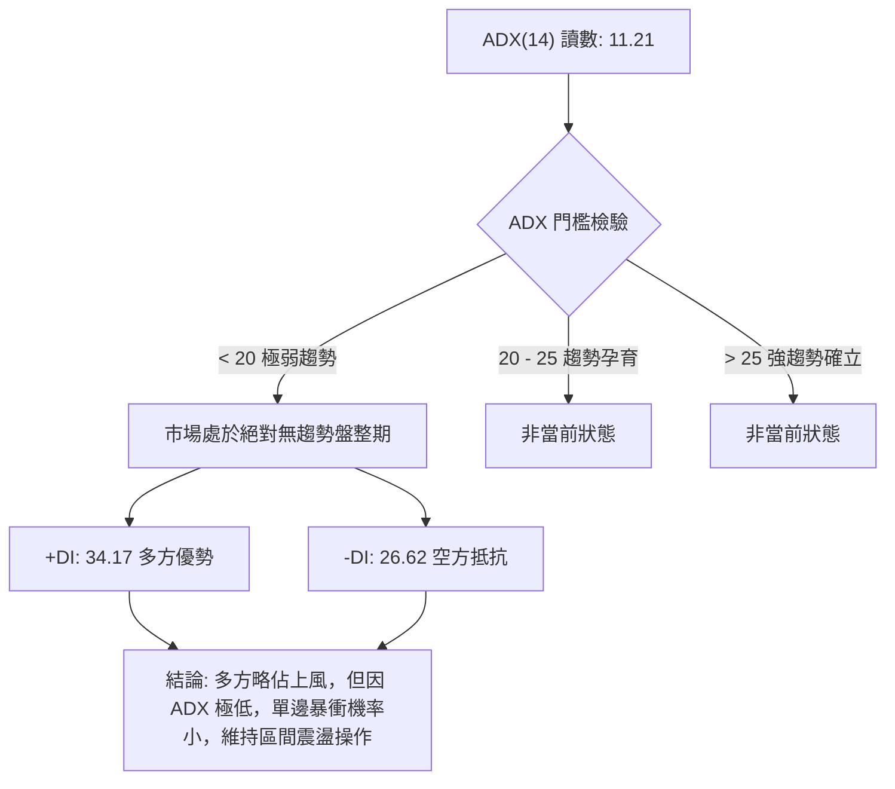

**ADX 趨勢強度評級對照表**：

| 指標變數 | 當前讀數 | 門檻區間 | 技術含義 | 操作指引 |
|----------|----------|----------|----------|----------|
| **ADX(14)** | **11.21** | 0 ~ 20 (極弱) | 趨勢動能極度渙散，價格缺乏單向續航力 | 嚴禁追漲殺跌，避免順勢突破策略 |
| **+DI (14)** | **34.17** | > 25 (偏強) | 多頭買盤力道維持在中偏高水準 | 多方掌控日內多數主動報價權 |
| **-DI (14)** | **26.62** | 20 ~ 30 (中等) | 空方賣壓存在但未佔據絕對優勢 | 下檔承接買盤足以化解拋壓 |
| **系統合力** | **多方佔優** | +DI 顯著大於 -DI | 多頭結構未遭破壞，但缺乏動能擴散 | 採取「支撐區低吸、阻力區獲利」震盪策略 |

---

## 3. 圖表形態分析

### 🔍 形態識別系統

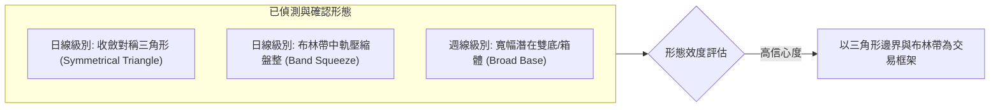

**圖表形態信心度與計算規格表**（依規則 15 嚴格審定）：

| 形態類別 | 信心度 | 判斷依據（數據引用） | 完成度 | 形態高度與目標價推算 |
|----------|--------|----------------------|--------|----------------------|
| **日線收斂三角形** | **78%** | 上軌由 08-16 高點 $277.68 與 09-06 高點連接；下軌由 07-19 低點 $177.71 與 08-30 低點連接。 | 85% | 形態高點 $277.68 - 形態低點 $177.71 = **$99.97**。<br>向上突破 R1 $231.17 計算：$231.17 + $99.97 = **$331.14** |
| **布林帶中軌整理** | **85%** | 現價 $228.11 緊貼 BB中軌 $227.35，帶寬維持中等，%B 為 0.51。 | 90% | 通道震盪無推算高度，以帶寬上下軌為界：上軌 **$270.79** / 下軌 **$183.90** |
| **潛在寬幅雙底** | **45%** | 僅有 07-19 低點 $177.71 與 08-09 低點 $187.97 兩處低點支撐（接近 S2 $194.80）。 | 40% | **訊號不足，僅做指標型解讀**（信心度 < 50%，不進行強行預測） |

### 🕯️ 重要K線形態分析

| 觀測週期 | 收盤價 | K線形態特徵 | 結構解讀 | 訊號強度 |
|----------|--------|-------------|----------|----------|
| **2026-08-16 (週)** | $277.68 | 巨量長陽穿雲線（週成交量 167.5M） | 主力資金強力拉抬，但逼近 52W 高點 $299.86 時爆出天量換手 | 🟢 強多轉多空分歧 |
| **2026-08-23 (週)** | $219.13 | 帶長上影大陰線（跌幅 -21.08%） | 獲利盤蜂擁而出，形成波段刺透阻力失敗的假突破 | 🔴 短期空頭反撲 |
| **2026-08-30 (週)** | $209.18 | 縮量錘頭十字星（量縮至 70.18M） | 賣壓急速竭盡，於整數關口 $200.00 上方浮現承接買盤 | 🟡 止跌企穩 |
| **2026-09-06 (週)** | $226.39 | 溫和放量陽包陰線 | 收復前週失地，重新站上 MA50，確認 $200.30 支撐有效性 | 🟢 震盪回升 |
| **2026-09-13 (最新)** | $228.11 | 中軸平衡小陽線（收盤價貼合MA20） | 多空在 MA20 處取得短暫平衡，振幅收窄，變盤蓄勢 | 🟡 中性整固 |

### 📉 ASCII 走勢形態示意圖

```
NBIS 日線收斂三角形與邊界示意圖
$280 ┼───────────────────────● (08-16 高點 $277.68 / 接觸阻力區 R2: $279.83)
     │                       ╲ 
$260 ┼                        ╲   [下行阻力壓制線]
     │                         ╲  
$240 ┼                          ╲           ▲ (突破關鍵點 R1: $231.17)
     │                           ╲        ╱
$228 ┼────────────────────────────●─────● (現價 $228.11 緊黏 MA20 $227.35)
     │                            ╱ ╲    ╱
$200 ┼                           ╱   ●──● (回踩均線群 MA50 $211.77 / S1 $200.30)
     │                          ╱ [上行支撐防守線]
$180 ┼─────────●───────────────● (07-19: $177.71 / 08-09: $187.97 低點雙重底)
     │
$160 ┼─────────────────────────────────── (強支撐 S3: $164.31 / MA200: $157.00)
```

### 🎯 形態目標價計算

依據已識別之**日線收斂三角形**形態，依據經典技術分析之高度投射原理計算：

1. **形態基準頸線（突破點）**：選定阻力位 **R1: $231.17** 為上方有效突破臨界點。
2. **形態振幅高度（H）**：
   $$\text{高度 } H = \text{形態波段高點 (\$277.68)} - \text{形態波段低點 (\$177.71)} = \$99.97$$
3. **向上突破理論量度目標價（Target）**：
   $$\text{目標價} = \text{頸線突破點 (\$231.17)} + \text{高度 } H (\$99.97) = \$331.14$$
4. **回調破位理論量度目標價（Downside Target）**：
   若跌破支撐位 **S1: $200.30**，則向下量度目標為：
   $$\text{下行目標價} = \text{支撐破位點 (\$200.30)} - \text{高度 } H (\$99.97) = \$100.33$$
   *(註：下行過程將在 Fib 61.8% $159.98 與 MA200 $157.00 遭遇極強結構性買盤攔截)*。

---

## 4. 支撐與阻力

### 🗺️ 關鍵價位分布圖（Unicode）

```
NBIS 價位結構分布圖
═══════════════════════════════════════════════════════════════════
$299.86 ║██████████████████████████████║ 極強歷史阻力 R3 (52W High)
        ║                              ║
$279.83 ║████████████████████          ║ 波段雙頂阻力 R2 (近一年高點聚類)
        ║                              ║
$246.44 ║▓▓▓▓▓▓▓▓▓▓▓▓▓▓▓▓              ║ 斐波那契回調 23.6% 位
        ║                              ║
$231.17 ║██████████████████████████████║ 短期關鍵阻力 R1 (突破即轉強)
╠═══════╬══════════════════════════════╣ ◄ 現價 $228.11 (MA20: $227.35)
$213.40 ║▓▓▓▓▓▓▓▓▓▓▓▓▓▓▓▓▓▓▓▓          ║ 斐波那契回調 38.2% 位 / MA50 ($211.77)
        ║                              ║
$200.30 ║████████████████████████      ║ 近期防守支撐 S1 (整數關鍵關卡)
        ║                              ║
$194.80 ║██████████████████████████████║ 波段底部支撐 S2 (密集成交區)
        ║                              ║
$186.69 ║▓▓▓▓▓▓▓▓▓▓▓▓▓▓▓▓▓▓▓▓▓▓▓▓      ║ 斐波那契回調 50.0% 中樞強防守
        ║                              ║
$164.31 ║██████████████████████████████║ 長期強支撐 S3 (MA200 $157.00 防線)
═══════════════════════════════════════════════════════════════════
```

### 🚧 阻力位分析表

所有價位均嚴格引用 OHLCV 計算所得之關鍵價位聚類：

| 阻力級別 | 價位 | 與現價距離 | 形成原因與籌碼特徵 | 突破難度 | 戰略重要性 |
|----------|------|------------|--------------------|----------|------------|
| **R1** | **$231.17** | +1.34% | 近期震盪箱體上沿，疊加 5日均線（$229.87）形成之短線壓制區 | 🟡 中等 | 短線轉強臨界點，突破確認打開上行空間 |
| **R2** | **$279.83** | +22.68% | 2026年6月及8月兩次波段反彈頂部（$277.68~$286.69）密集套牢區 | 🔴 極高 | 中期多頭天花板，需爆量 >1.5 億股方可消化 |
| **R3** | **$299.86** | +31.45% | 52 週歷史天花板，心理 $300.00 整數心理大關 | 🔴 堅不可摧 | 歷史高點，空頭最強防線 |

### 🛡️ 支撐位分析表

所有價位均嚴格引用 OHLCV 計算所得之關鍵價位聚類：

| 支撐級別 | 價位 | 與現價距離 | 形成原因與籌碼特徵 | 守住機率 | 戰略重要性 |
|----------|------|------------|--------------------|----------|------------|
| **S1** | **$200.30** | -12.19% | 2026年8月回調低點聚類，疊加 $200.00 整數心理防線 | 🟢 75% | 多頭第一道防線，失守將考驗中期趨勢 |
| **S2** | **$194.80** | -14.60% | 7月下旬次級回踩低點密集區，與布林下軌（$183.90）形成緩衝 | 🟢 80% | 波段分水嶺，跌破意味著中期結構轉弱 |
| **S3** | **$164.31** | -27.97% | 52週漲幅回撤之核心平台，上方緊貼 MA200（$157.00） | 🟢 90% | 長期牛市生命線，跌破則長期走勢反轉 |

### 📐 斐波那契回調位分析

依據 52 週完整波動區間（低點 $73.52 至 高點 $299.86，總落差 $226.34）分析：

```
斐波那契回調尺規分布（現價落點：$213.40 至 $246.44 區間）
$299.86 ├── 0.0%  (52W High)
        │
$246.44 ├── 23.6% 回調位 ── [上方阻力階梯]
        │   ▲
$228.11 ├── 現價落點 (%B: 0.51，落於 23.6% ~ 38.2% 強勢整理區)
        │   ▼
$213.40 ├── 38.2% 回調位 ── [下方黃金支撐，緊貼 MA50 $211.77]
        │
$186.69 ├── 50.0% 回調位 ── [多空平衡中樞]
        │
$159.98 ├── 61.8% 回調位 ── [牛熊分界極限，緊貼 MA200 $157.00]
        │
$121.96 ├── 78.6% 回調位 ── [深度修正支撐]
        │
$73.52  └── 100.0% (52W Low)
```

**斐波那契點位技術解讀**：
1. **現價區間判定**：現價 **$228.11** 精準落於 **23.6%（$246.44）** 與 **38.2%（$213.40）** 之間。在技術分析中，股價經歷巨大漲幅後回撤不破 38.2% 屬於「極強勢整理」。
2. **MA50 共振支撐**：50日均線（$211.77）與 38.2% 回調位（$213.40）形成僅 0.7% 的微幅剪刀差，構建出強大的結構性共振支撐帶（$211.77 ~ $213.40），為多方核心防線。

---

## 5. 技術指標深度解讀

### 🎛️ 指標訊號總覽

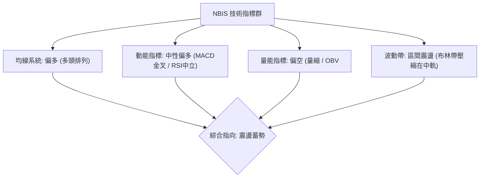

### 📈 移動平均線排列分析

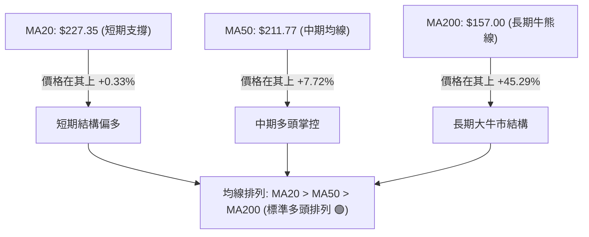

**移動平均線系統詳細參數與趨勢矩陣**：

| 均線名稱 | 數值 | 偏離率 | 走勢斜率 | 技術意涵 |
|----------|------|--------|----------|----------|
| **MA 5** | $229.87 | -0.77% | ▼ 下彎 (-1.76) | 短線受到獲利盤微幅壓制，需盡快站上以防短期轉弱 |
| **MA 10** | $218.70 | +4.30% | ▲ 陡峭向上 (+9.41)| 短期助漲動能充足，提供快速回踩時的動態支撐 |
| **MA 20** | $227.35 | +0.34% | ▲ 平緩向上 (+0.76)| 布林通道中軌，現價與均線黏合，處於多空爭奪平衡點 |
| **MA 60** | $221.23 | +3.11% | ▲ 向上 (+6.88) | 季度成本防線，形成下檔階梯式支撐 |
| **MA 120** | $197.76 | +15.35%| ▲ 強力向上 (+30.35)| 半年線持續上推，中長期機構持倉成本穩定上升 |
| **MA 240** | $149.66 | +52.42%| ▲ 強力向上 (+78.45)| 年線維持極佳牛市斜率，奠定長線底倉無虞基礎 |

### 📉 RSI(14) 分析

**RSI(14) 強度進度條**：
```
超賣區 (0-30)          中性平衡區 (30-70)          超買區 (70-100)
├──────────────┼────────────────────────┼──────────────┤
░░░░░░░░░░░░░░ ▓▓▓▓▓▓▓▓▓▓▓▓▓▓▓▓▓▓▓░░░░░░ ░░░░░░░░░░░░░░
0             30        53.57          70            100
                        ▲ 當前位置：53.57 (中性微偏強)
```

- **超買超賣判定**：當前 RSI(14) 為 **53.57**，剛脫離 50 多空分水嶺，既未進入超買區（>70），亦遠離超賣區（<30），處於典型的健康整固區間。
- **背離分析（Divergence）**：
  - **日線層面**：價格自 8 月底 $209.18 回升至 $228.11，RSI 從 33.3 彈升至 53.57，指標與價格保持同步抬升，**無頂背離或底背離跡象**。
  - **週線層面**：6 月高點 $286.69 時 RSI 達 65.3，8 月中旬再次挑戰 $277.68 時 RSI 創出 67.2，指標創高匹配波段高點，隨後同步回落，並未出現大級別熊市頂背離。結論：**背離訊號缺席，當前走勢完全受常規動能主導**。

### 📊 MACD(12/26/9) 訊號解讀

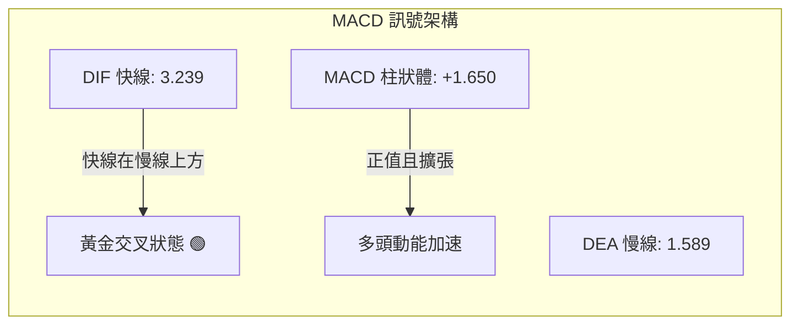

- **指標讀數**：DIF快線 = **3.239**，DEA慢線 = **1.589**，柱狀體（Histogram）= **+1.650**。
- **交叉狀態**：DIF 自零軸下方持續回升並穿過 DEA，形成標準之**零軸上黃金交叉**，柱狀體翻正至 +1.650，表明短期拋壓已被吸收，多頭重掌短線攻擊發起權。
- **背離驗證**：柱狀體由前期的負值（-1.365）快速拉升至正值（+1.650），動能柱顯著放大，與價格收復 MA20 形成精準的正向確認，排除空頭衰竭性背離。

### 📦 布林通道分析

```
NBIS 布林通道 (20, 2) 結構圖
$275 ┼───────────────────────────────── 上軌: $270.79 (強阻力壓制)
     │                                 
$250 ┼                                 
     │                                 
$228 ┼─── 現價: $228.11 ─────────────── 中軌: $227.35 (MA20 基座)
     │    (%B = 0.51 處於平衡位置)     
$200 ┼                                 
     │                                 
$180 ┼───────────────────────────────── 下軌: $183.90 (動態極限支撐)
```

- **通道寬度與帶寬特徵**：通道帶寬（Bandwidth）由前期大幅擴張轉向局部收斂，當前上軌為 **$270.79**，下軌為 **$183.90**，極限震盪帶寬為 $86.89。
- **%B 位置分析**：當前 %B 指標讀數為 **0.51**，意味著現價剛好座落在中軌（$227.35）上方 1% 的極度平衡點。在布林帶戰術中，當 %B 在 0.50 附近且帶寬縮小時，暗示即將進入新一輪的通道擠壓（Band Squeeze），隨後將沿突破方向展開暴發性定向行情。

### 💹 成交量分析（量價配合度）

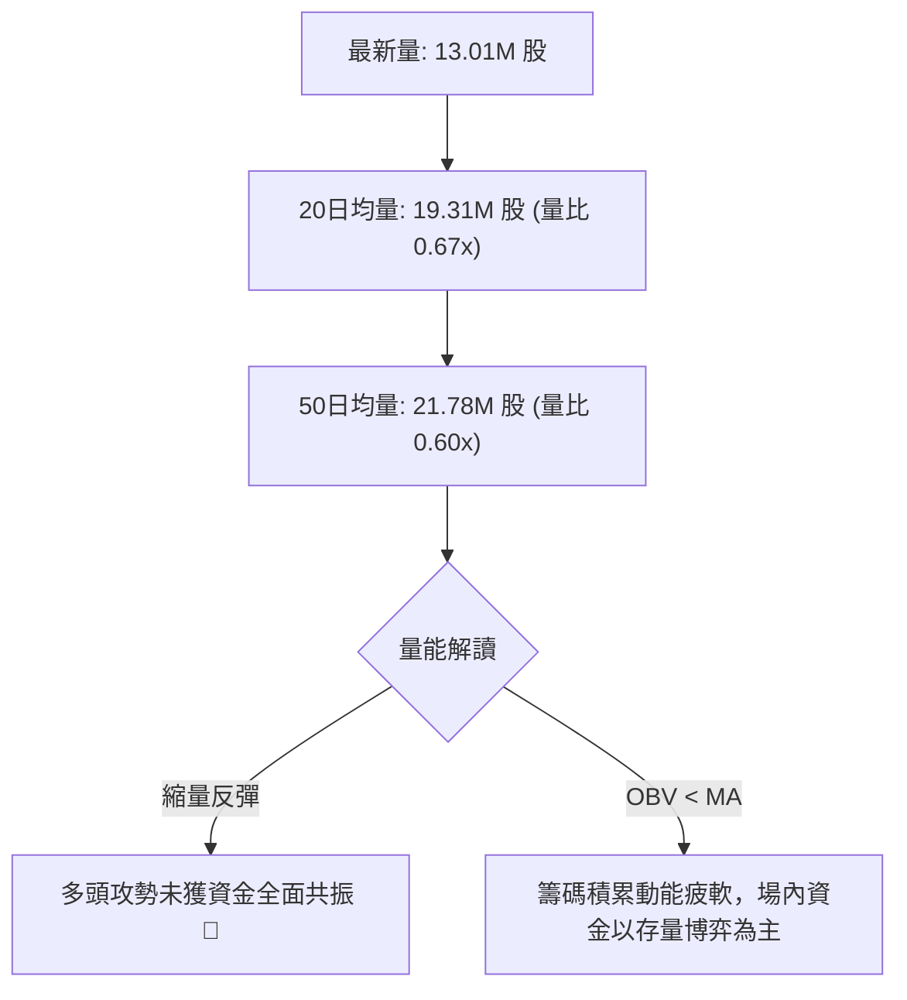

- **量比萎縮解讀**：當前量比僅為 **0.67x**，最新單日換手僅 13.01M 股，顯著低於 20 日平均（19.31M）及 50 日平均（21.78M）。這種「價漲量縮」的形態反映市場追高意願在 $230.00 前期套牢區顯著謹慎。
- **OBV 趨勢剖析**：監控數據顯示 **OBV < MA**，能量潮指標持續運行於自身均線下方。這代表資金尚未形成大規模淨流入，此處價格的走高更多源於「賣盤空乏」而非「買盤掃貨」，若無法在 R1（$231.17）前補量，極易引發假突破回抽。

---

## 6. 動能與波動率

### ⚡ 動能評估四象限

NBIS 在「動能強度」與「波動率」坐標系中之定位分析：

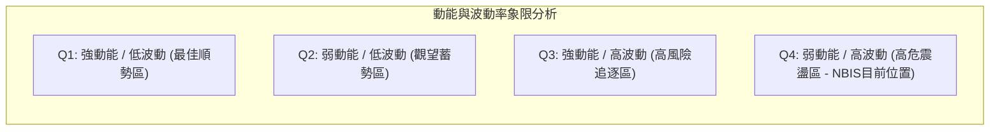

| 象限分佈 | 動能維度 | 波動維度 | 當前狀態判定 | 操作評估與應對 |
|----------|----------|----------|--------------|----------------|
| **Q1 (最佳機會)** | 強動能 (ADX>25) | 低波動 (ATR<4%) | — | 非當前狀態 |
| **Q2 (謹慎觀望)** | 弱動能 (ADX<25) | 低波動 (ATR<4%) | — | 非當前狀態 |
| **Q3 (強勢進攻)** | 強動能 (ADX>25) | 高波動 (ATR>5%) | — | 2026年5-6月主升浪時期之狀態 |
| **Q4 (動態防守)** | **弱動能 (ADX=11.21)** | **高波動 (ATR=6.04%)** | **✓ NBIS 當前歸屬** | **價格單日振幅大但缺乏明確方向，應嚴格縮減部位，採取寬止損、小倉位之震盪套利** |

### 📊 ATR 波動率分析

- **ATR(14) 絕對數值**：**$13.78**。
- **ATR 相對百分比**：
  $$\frac{\text{ATR}}{\text{現價}} = \frac{\$13.78}{\$228.11} = 6.04\%$$
- **止損距離設計建議**：
  - 由於日均波動高達 6.04%，過窄的止損（如 2%~3%）將極易被市場隨機噪聲掃出場。
  - **短線防守緩衝帶**：建議設定為 $1.0 \times \text{ATR} = \$13.78$（距離現價約 $214.33，與 MA50 $211.77 吻合）。
  - **波段防守緩衝帶**：建議設定為 $2.0 \times \text{ATR} = \$27.56$（距離現價約 $200.55，與 S1 $200.30 形成絕對防禦共振）。

### 📐 Beta 與市場相關性

- **Beta 係數**：**1.436**。
- **市場敏感度解讀**：
  - NBIS 展現出相對於標普 500 指數高出 43.6% 的高波動屬性，屬於典型的「高彈性 AI 基礎設施龍頭標的」。
  - 在科技板塊（納斯達克 100）處於單日反彈週期時，該股具備提供 Alpha 超額收益的潛力；但在市場大盤遭遇流動性拋售時，其回撤幅度亦將等比例放大 1.4~1.5 倍。

---

## 7. 多時框架總結

### 📋 時框架評分表

| 時框架 | 趨勢方向 | 動能狀態 | 均線排列 | 形態結構 | 綜合評分 | 操作建議 |
|--------|----------|----------|----------|----------|----------|----------|
| **月線 (長期)** | 🟢 多頭 | 🟡 中性回落 | 🟢 多頭 (現價高於年線52%) | 巨浪回撤整固 | **82/100** | 長線多單底倉堅定持有 |
| **週線 (中期)** | 🟢 中性偏多 | 🟢 MACD轉正 | 🟢 多頭排列完好 | 寬幅收斂箱體 | **68/100** | 回踩支撐分批佈局 |
| **日線 (短期)** | 🟡 盤整震盪 | 🔴 ADX極低/縮量 | 🟢 MA20上方窄幅糾結 | 對稱收斂三角形 | **48/100** | 區間內高拋低吸，嚴控倉位 |

### 🔲 綜合訊號矩陣

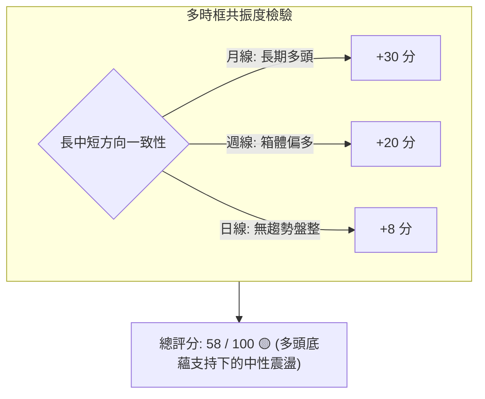

- **趨勢信號矛盾點**：長期均線（MA50、MA200）維持強烈上行，但日線級別成交量嚴重萎縮（0.67x）且 ADX 跌至 11.21，顯示日線級別的多空對決暫時陷入僵局。

### ⚖️ 多時框收斂結論

**嚴格依據規則 14 執行多時框收斂收束**：
1. **行情性質判定**：當前日線 **ADX(14) = 11.21 < 25**，毫無疑問屬於**典型的盤整震盪行情**（非趨勢行情）。
2. **收斂主導規則**：依規則 14，「盤整行情（ADX<25）以日線布林通道上下軌為主要交易區間」。因此，中期與長期的大級別趨勢退居為「趨勢防守背景」，交易決策不可盲目採用趨勢突破單，必須以日線布林帶及區間邊界為主導。
3. **唯一方向性結論**：**【中性觀望偏多震盪】**。
   - 價格依托 MA20（$227.35）進行平台整理，雖然多頭排列完好，但在向上突破 **R1: $231.17** 且補量前，不具備走出單邊主升浪的條件。策略應鎖定在「布林中下軌尋找低吸機會，阻力位分批止盈」。

---

## 8. 交易策略建議

### 🗺️ 策略決策流程圖

```mermaid
graph TD
    START["當前價格 $228.11 (評分 58: 區間操作)"] --> ADX_CHECK{"ADX = 11.21 (< 25 盤整)"}
    ADX_CHECK -->|"確認無趨勢震盪"| STRATEGY_ROUTE["策略路由: 區間震盪低吸高拋"]
    STRATEGY_ROUTE --> COND_A["方案 A (主推): 布林中軌共振低吸"]
    STRATEGY_ROUTE --> COND_B["方案 B (順勢): 右側放量突破追隨"]
    
    COND_A --> EXEC_A["進場: $213.40~$220.00 |" 止損: $194.80 "| 目標: $270.79"]
    COND_B --> EXEC_B["進場: 突破 $231.17 |" 止損: $218.70 "| 目標: $279.83"]
```

### 🧭 策略路由

**當前主策略方向 = 【中性偏多之區間操作（等待邊界低吸或突破確認）】（依評分 58/100）**
- 由於綜合評分處於 40–60 之核心震盪中性帶，且 ADX < 25，禁止激進式無腦做多或盲目估頂做空。
- **主推策略**：以回踩強支撐（Fib 38.2% $213.40 與 S1 $200.30 區域）的「回調低吸策略」為最優解，次選為「突破關鍵阻力 R1 $231.17 的右側追加策略」。

### 🎯 價格情境階梯（Price Scenarios）

價位嚴格引用 OHLCV 計算所得之關鍵價位聚類與斐波那契位：

| 觸發條件 | 下一目標 | 後續延伸 | 情境技術含義 |
|----------|----------|----------|--------------|
| **強勢突破 R1: $231.17** | **R2: $279.83** | **R3: $299.86** | 突破收斂三角形上軌，短線動能激活，回補上方跳空缺口 |
| **維持現價區間震盪** | **BB中軌: $227.35** | **BB上軌: $270.79** | 在 $213.40 至 $246.44 之間消耗浮籌，以時間換取空間 |
| **有效跌破 S1: $200.30** | **S2: $194.80** | **S3: $164.31** | 箱體防線潰退，中期向 Fib 50%（$186.69）及 MA200 尋求支撐 |

### 📊 情境機率分佈

```
情境機率餅圖分佈示意
╔══════════════════════════════════════════════════════════════════╗
║ [情境 1] 區間震盪蓄勢 (55%) : ███████████████████████████░░░░░░ ║
║ [情境 2] 向上突破反彈 (30%) : ███████████████░░░░░░░░░░░░░░░░░░ ║
║ [情境 3] 回落考驗深支撐 (15%): ███████░░░░░░░░░░░░░░░░░░░░░░░░░ ║
╚══════════════════════════════════════════════════════════════════╝
```

| 未來情境 | 機率 | 主要技術依據 |
|----------|------|--------------|
| **區間橫向震盪** | **55%** | **ADX(14) 僅 11.21** 處於極度冰點，日均量比萎縮至 0.67x，顯示主力未發動總攻，傾向於布林通道內磨合 |
| **向上突破走高** | **30%** | **MACD 柱狀體翻正 (+1.650)**，MA20/50/200 多頭排列完好，且 +DI(34.17) 顯著高於 -DI(26.62) |
| **下行考驗防線** | **15%** | 5日均線（$229.87）微幅下彎壓制，且 OBV 持續低於均線，若大盤重挫可能誘發補跌測試 S1 $200.30 |

### 🟢 主策略詳情

本報告依評分標準主推「偏多防守反擊」之兩大戰術配置：

| 策略要素 | 策略 A：回踩支撐低吸（勝率首選） | 策略 B：右側突破追隨（動能首選） |
|----------|----------------------------------|----------------------------------|
| **進場條件** | 股價回踩 Fib 38.2% 至 MA50 區域出現止跌K線 | 日線收盤價強勢突破阻力 R1 且成交量放大 |
| **精確進場點** | **$213.40** (掛單於 Fib 38.2% 處) | **$231.50** (確認突破 R1 $231.17 後掛單) |
| **目標價 T1** | **$246.44** (Fib 23.6% 回調位) | **$270.79** (布林通道上軌) |
| **目標價 T2** | **$270.79** (布林通道上軌) | **$279.83** (關鍵阻力位 R2) |
| **止損價格** | **$194.80** (跌破關鍵支撐 S2 嚴格止損) | **$218.70** (跌破 10日均線 MA10 止損) |
| **風險空間** | $\$213.40 - \$194.80 = \$18.60$ | $\$231.50 - \$218.70 = \$12.80$ |
| **報酬空間 (T2)**| $\$270.79 - \$213.40 = \$57.39$ | $\$279.83 - \$231.50 = \$48.33$ |
| **風險報酬比** | **1 : 3.09** | **1 : 3.78** |
| **成功機率** | **65%** | **52%** |
| **建議配置倉位**| **總投資組合之 12% ~ 15%** | **總投資組合之 8% ~ 10%** |

### 🔴 反向風險觸發點（對沖提示）

- **全面轉空破位點**：若日線收盤價**實體跌破支撐 S1 $200.30**，且伴隨成交量放大，意味著多頭防線瓦解。
- **對沖應對指引**：
  - 一旦觸發 $200.30 跌破，應立即將所有短多頭寸平倉止損。
  - 保守型交易者可建立空頭對沖部位，下方目標直接看至 **Fib 50% ($186.69)** 及 **S3 ($164.31)**。

### ⭐ 整體訊號強度評星

```
╔══════════════════════════════════════════════════════╗
║ 做多訊號強度：★★★☆☆  (3.0 / 5 星 - 均線偏多但缺量) ║
║ 做空訊號強度：★★☆☆☆  (2.0 / 5 星 - 支撐強烈難深跌) ║
║ 整體可信度：  ★★★★☆  (4.0 / 5 星 - 關鍵位極度吻合) ║
╚══════════════════════════════════════════════════════╝
```

---

## 9. 風險提示與監控

### ✅ 關鍵監控指標 Checklist

```
╔══════════════════════════════════════════════════════════════════╗
║                 NBIS 交易日常風險監控清單 (Checklist)             ║
╠══════════════════════════════════════════════════════════════════╣
║ [ ] 監控日成交量是否有效放大至 20日均量 (19.31M 股) 以上           ║
║ [ ] 每日收盤價是否成功守穩 MA20 ($227.35) 與 MA50 ($211.77)       ║
║ [ ] RSI(14) 是否在 50 水平之上維持強勢向上運行                     ║
║ [ ] MACD 柱狀圖是否持續處於零軸以上正向擴張 (當前 +1.650)         ║
║ [ ] 密切追蹤融券餘額變化 (目前空頭比例高達 23.4%，提防軋空暴動)   ║
║ [ ] 嚴格執行止損紀律：盤中若觸及 S2 ($194.80) 堅決執行風控        ║
╚══════════════════════════════════════════════════════════════════╝
```

### ⚠️ 風險場景分析

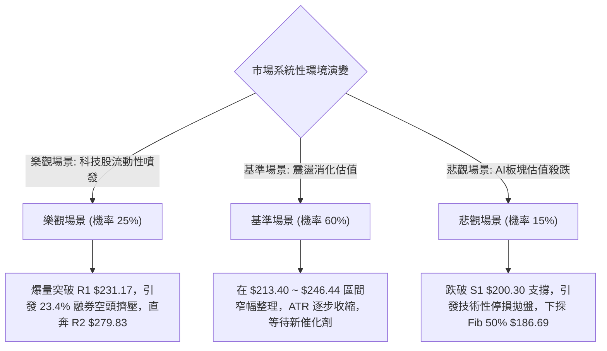

### 🛡️ 風險管理重要提醒

1. **極高空頭比例（Short Float 23.4%）的雙面刃特性**：
   - 該股當前空頭淨額佔流通盤高達 23.4%，Short Ratio 為 2.12。此籌碼特徵意味著一旦股價放量衝破阻力位 **R1: $231.17**，極易引發連鎖式「空頭回補軋空（Short Squeeze）」，導致價格在極短時間內向 **R2: $279.83** 暴衝。
   - 反之，在高空頭打壓下，任何向上假突破若無法維持，回落速度亦會極其凶狠。
2. **高 ATR 波動下的部位規模管理（Position Sizing）**：
   - 由於 ATR 高達 **$13.78**（單日波動率 6.04%），單筆交易的風險暴露不可超過總帳戶權益的 1.5% 至 2.0%。
   - 計算公式範例：若帳戶資金為 $100,000，可承擔最大虧損為 $1,500。採用策略 A（風險空間 $18.60），則最大允許買入股數為：
     $$\text{最大股數} = \frac{\$1,500}{\$18.60} \approx 80 \text{ 股（投入資金約 \$17,072，即倉位 17% 以內）}$$
3. **基本面高估值與現金流缺口警訊**：
   - 技術面雖為牛市多頭排列，但公司 EV/EBITDA 高達 250.7，FCF 為負（$-9.61B）。高估值成長股在利率環境波動時極具價格脆弱性，因此純技術交易者切勿因長期看好而忽視技術止損位。

---

## 📋 報告總結

```
╔══════════════════════════════════════════════════════════════════╗
║                   NBIS 技術分析報告總結                          ║
╠══════════════════════════════════════════════════════════════════╣
║ 報告日期：2026-09-11                                            ║
║ 當前價格：$228.11                                                ║
║ 分析評級：⚖️ 中性偏多區間震盪 (綜合評分: 58/100)                  ║
║                                                                  ║
║ 關鍵結論：                                                       ║
║ ├─ 長期趨勢：🟢 強烈看多 (MA200 $157.00 上方保持完美牛市傾角)     ║
║ ├─ 中期趨勢：🟢 寬幅整理 (Fib 38.2% $213.40 附近展現極強防禦性)   ║
║ ├─ 短期趨勢：🟡 縮量整固 (ADX=11.21 顯示無單邊趨勢，受困布林帶)   ║
║ ├─ 關鍵支撐：S1: $200.30 ｜ S2: $194.80 ｜ Fib 38.2%: $213.40    ║
║ ├─ 關鍵阻力：R1: $231.17 ｜ R2: $279.83 ｜ 52W High: $299.86     ║
║ └─ 分析師共識目標：$290.71 (17位分析師評級為 Buy，最高 $415.00) ║
║                                                                  ║
║ 最優策略組合：                                                   ║
║ 1. 🥇 最佳機會：回踩 Fib 38.2% ($213.40) 低吸，止損 S2 ($194.80)║
║ 2. 🥈 次選機會：放量突破 R1 ($231.17) 順勢追多，博弈軋空至 R2    ║
║ 3. 🥉 保守選擇：在 $200.30 至 $246.44 箱體內高拋低吸，維持輕倉   ║
╚══════════════════════════════════════════════════════════════════╝
```

---

> ⚠️ **免責聲明**：本報告為技術分析研究，所有數據及走勢推演均基於量化模型與歷史行情資訊。本報告**僅供學術研究與投資架構參考**，**不構成任何形式的要約或投資操作建議**。金融市場瞬息萬變，高 Beta 股票波動劇烈，交易者應獨立評估風險並嚴格自負盈虧。

---

*報告生成時間：2026-09-11 ｜ 數據來源：Yahoo Finance ｜ 分析框架：多時框技術分析體系*