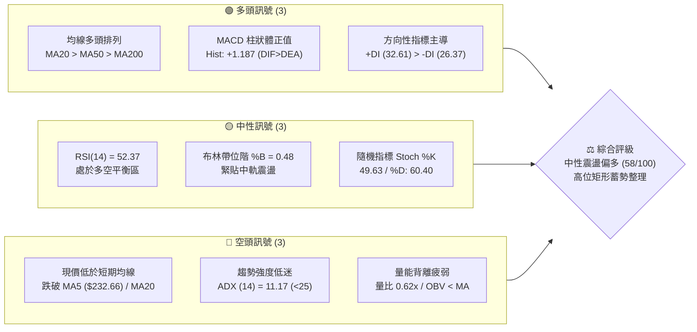
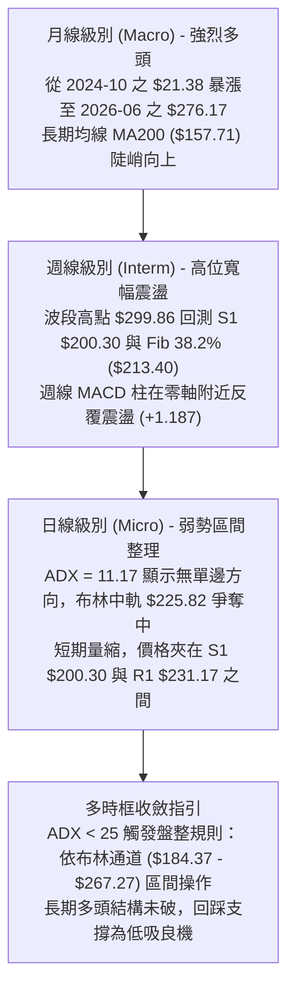
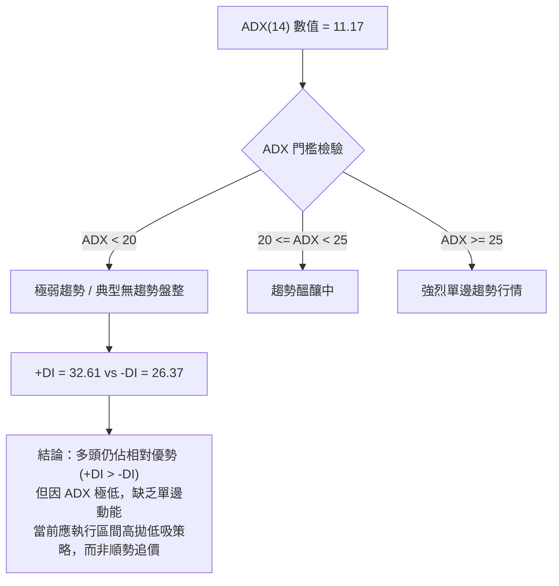
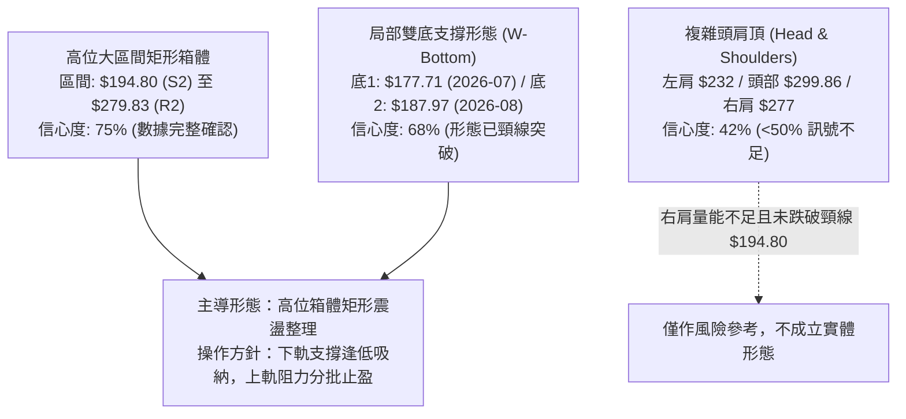
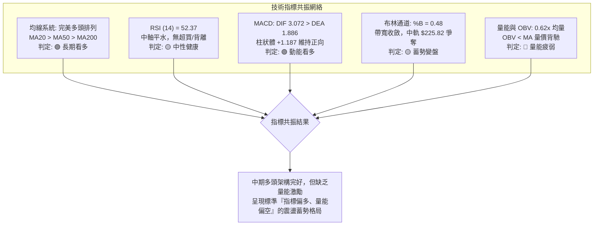
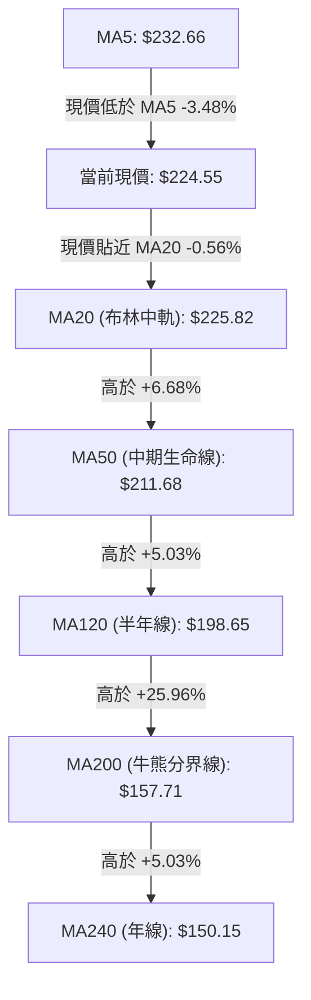
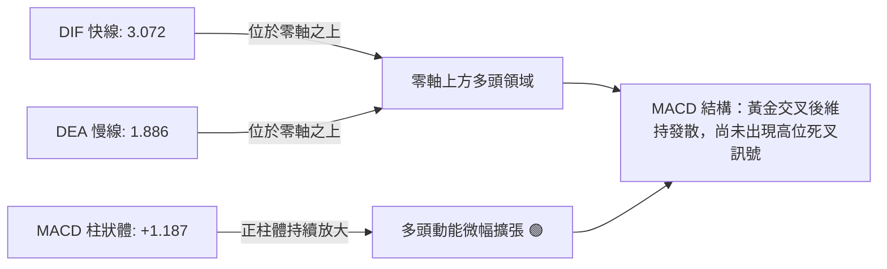
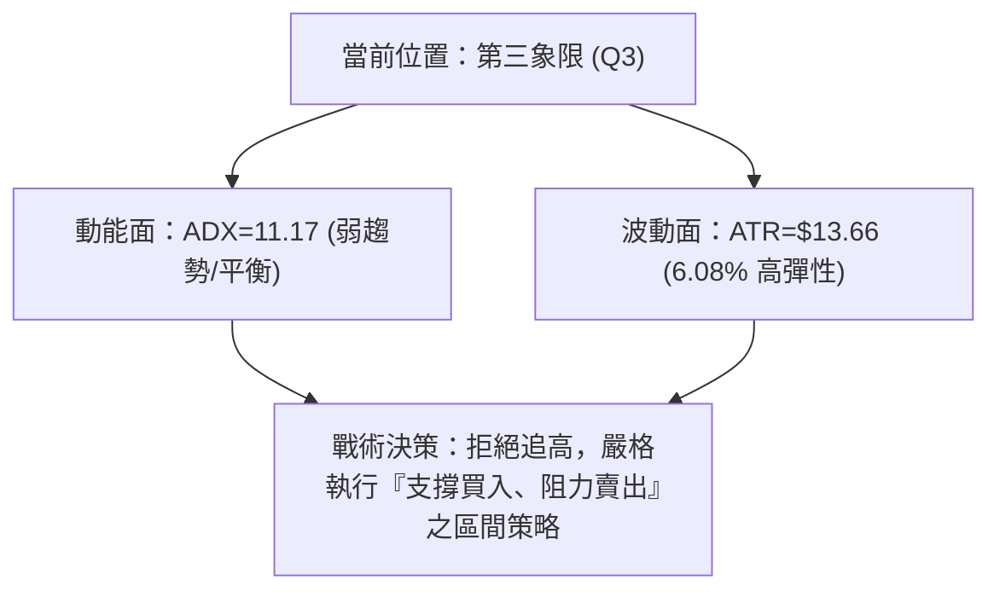
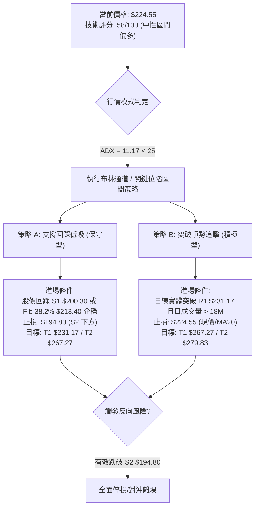
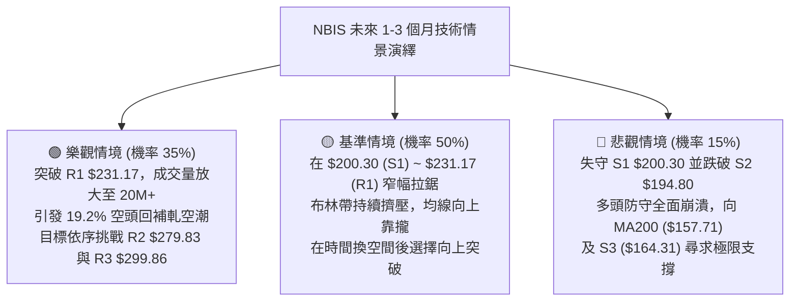

# NBIS 技術分析報告

> **報告日期**：2026-09-12 ｜ **語言**：繁體中文 ｜ **數據來源**：Yahoo Finance ｜ **當前價格**：$224.55

---

## 目錄

| 章節 | 內容 |
|------|------|
| [1. 技術面概覽](#1-技術面概覽) | 訊號儀表板、核心指標、評分卡 |
| [2. 趨勢分析](#2-趨勢分析) | 多時框趨勢、長中短期走勢、ADX 解讀 |
| [3. 圖表形態分析](#3-圖表形態分析) | 形態識別、信心度評估、K線組合 |
| [4. 支撐與阻力](#4-支撐與阻力) | 關鍵價位、斐波那契回調結構 |
| [5. 技術指標深度解讀](#5-技術指標深度解讀) | MA/RSI/MACD/布林通道/成交量 |
| [6. 動能與波動率](#6-動能與波動率) | 動能四象限、ATR 波動率、Beta |
| [7. 多時框架總結](#7-多時框架總結) | 時框架評分表、多時框收斂結論 |
| [8. 交易策略建議](#8-交易策略建議) | 策略路由、主策略規劃、風報比計算 |
| [9. 風險提示與監控](#9-風險提示與監控) | 監控指標 Checklist、情境壓力測試 |
| [附錄：報告總結](#-報告總結) | 核心結論與執行摘要 |

---

## 1. 技術面概覽

### 🎯 技術訊號儀表板



### 📊 核心指標速覽表

| 指標類別 | 指標名稱 | 當前數值 | 訊號 | 技術解讀 |
|:---|:---|:---|:---:|:---|
| **價格位階** | 當前收盤價 | **$224.55** | 🟡 | 位於52週區間 66.7% 位階，在 MA20 附近徘徊 |
| **短期均線** | MA5 / MA20 | $232.66 / $225.82 | 🔴 | 價格位於 MA5 (-3.48%) 與 MA20 (-0.56%) 下方，短線拉回 |
| **中期均線** | MA50 / MA60 | $211.68 / $220.56 | 🟢 | 價格高於 MA50 (+6.08%)，中期上升通道支撐強勁 |
| **長期均線** | MA200 / MA240 | $157.71 / $150.15 | 🟢 | 大幅高於 MA200 (+42.38%)，長期宏觀多頭格局完好 |
| **動能震盪** | RSI(14) | **52.37** | 🟡 | 位於 50 中軸之上，多空力道平衡，無超買超賣或背離跡象 |
| **指數平滑** | MACD (12,26,9) | DIF 3.072 / DEA 1.886 | 🟢 | DIF > DEA，MACD 柱狀體為 +1.187，維持多頭擴張狀態 |
| **趨勢強度** | ADX (14) | **11.17** | 🟡 | 數值遠低於 25，市場處於無明確單邊趨勢的橫盤整理行情 |
| **量能狀態** | 成交量比 / OBV | 11.18M (0.62x) / OBV < MA | 🔴 | 成交量萎縮，低於 20 日均量 (18.06M)，量能未能確認突破 |
| **波動區間** | ATR(14) | **$13.66 (6.08%)** | 🟡 | 波動率處於中高水準，每日波幅約 $13.66，設定止損需給予緩衝 |

### 🏆 技術評分卡

```
╔══════════════════════════════════════════════════════════════════╗
║                   技術評分卡 — NBIS (2026-09-12)                ║
╠══════════════════════════════════════════════════════════════════╣
║ 趨勢強度 (Trend)     ████████████░░░░░░░░  60/100  🟡 中性震盪   ║
║ 動能指標 (Momentum)  ███████████░░░░░░░░░  55/100  🟡 動能均衡   ║
║ 支撐穩定度 (Support) █████████████░░░░░░░  65/100  🟢 底部紮實   ║
║ 成交量配合 (Volume)  ████████░░░░░░░░░░░░  40/100  🔴 量能不足   ║
║ 形態完整度 (Pattern) ███████████░░░░░░░░░  55/100  🟡 矩形整理   ║
║ 均線排列 (MA System) ███████████████░░░░░  75/100  🟢 多頭排列   ║
╠══════════════════════════════════════════════════════════════════╣
║ 綜合技術評分         ███████████░░░░░░░░░  58/100  ⚖️ 區間蓄勢   ║
╚══════════════════════════════════════════════════════════════════╝
```

---

## 2. 趨勢分析

### 🌐 多時框趨勢分析



### 📈 長期趨勢 — 12個月走勢圖（Unicode）

```
NBIS 月線收盤走勢圖（2025-10 至 2026-09）
價格 ($)
$300 ┤                                      ● $276.17 (2026-06，最高觸及 $299.86)
$270 ┤                                     / \
$240 ┤                              ●     /   \
$210 ┤                             / $231.09   \      ● $224.55 (當前)
$180 ┤                            /             ●    /
$150 ┤                     ●     /          $190.41 ● $206.32
$120 ┤● $130.82           / $138.23
$90  ┤ \       ●   ●     /
$60  ┤  \     / $85.19  /
     ┤   ●   /     \   /
$30  ┤ $94.87       ● $91.19
     └─────────────────────────────────────────────────────────────► 時間
       10  11  12  01  02  03  04  05  06   07   08   09 (月份)
      (2025)                     (2026)
```

#### 走勢特徵分析表格

| 階段 | 涵蓋期間 | 收盤價區間 | 累積漲跌幅 | 核心技術特徵 |
|:---|:---:|:---:|:---:|:---|
| **主升浪第一階段** | 2025-04 ~ 2025-10 | $22.73 → $130.82 | **+475.5%** | 隨 AI 算力需求爆發，價量齊揚，連續突破阻力 |
| **中期健康回檔** | 2025-11 ~ 2026-02 | $130.82 → $83.71 | **-36.0%** | 獲利了結賣壓，回踩 $83.71 築底，均線完成清洗換手 |
| **主升浪第二階段** | 2026-02 ~ 2026-06 | $91.19 → $276.17 | **+202.9%** | 爆發性拉升，最高創下 52 週高點 $299.86 |
| **高位整理與消化** | 2026-07 ~ 2026-09 | $276.17 → $224.55 | **-18.7%** | 回測 $177.71 ~ $190.41 後反彈，進入 $200~$240 區間沉澱 |

### 📊 中期趨勢（週線分析）

```
近期週線壓力與支撐結構示意圖
$300 ─────── [ 52W 歷史天花板 R3: $299.86 ] ─────────────────────
               ↑ 2026-06/08 衝高受阻回落
$270 ─────── [ 次級波段阻力 R2: $279.83 / BB上軌 $267.27 ] ───────
               ↑ 2026-08-16 帶巨量反彈至 $277.68 後受阻
$230 ─────── [ 當前短線頸線阻力 R1: $231.17 / MA20 $225.82 ] ────
               ◄══ 當前價格: $224.55 (中軌震盪蓄勢)
$200 ─────── [ 關鍵防守平台 S1: $200.30 / Fib 38.2% $213.40 ] ───
               ↓ 2026-08-23 ~ 08-30 回測獲支撐守穩
$180 ─────── [ 絕對波段強支撐 S2: $194.80 / BB下軌 $184.37 ] ─────
```

### ⚡ 趨勢強度評估（ADX 解讀）



#### ADX 與方向指標強度對照

| 指標變數 | 數值 | 狀態等級 | 市場含義說明 |
|:---|:---:|:---:|:---|
| **ADX (14)** | **11.17** | 弱勢盤整 (<20) | 表明目前市場處於整理消化期，動能衰竭，不宜追高殺跌 |
| **+DI (14)** | **32.61** | 多頭主導 (>25) | 買方在日常波動中仍佔據相對上風，多頭底氣依然存在 |
| **-DI (14)** | **26.37** | 空頭壓制中等 | 空方拋壓未構成破位威脅，但仍對價格產生壓抑 |
| **DI 差值 (+DI - -DI)** | **+6.24** | 偏多微幅領先 | 淨方向性偏向買方，支撐未破前維持逢低佈局基調 |

---

## 3. 圖表形態分析

### 🔍 形態識別系統



#### 圖表形態信心度評估表

| 識別形態 | 信心度 | 判斷依據（引用數據） | 完成度 | 目標價（附嚴格計算式） |
|:---|:---:|:---|:---:|:---|
| **矩形箱體整理** | **75%** | 上邊界受阻於 R2 **$279.83**，下邊界獲支撐於 S2 **$194.80**，在布林通道內反覆震盪 | **70%** | 箱體高度 = $279.83 - $194.80 = $85.03<br/>向上突破目標 = $279.83 + $85.03 = **$364.86**<br/>向下跌破目標 = $194.80 - $85.03 = **$109.77** |
| **波段雙底 (W底)** | **68%** | 兩次下探分別在 2026-07-19 ($177.71) 與 2026-08-09 ($187.97) 守穩於 S2 **$194.80** 附近 | **90%** | 頸線位 = 2026-07-12 高點 **$219.65**<br/>形態高度 = $219.65 - $177.71 = $41.94<br/>理論目標 = $219.65 + $41.94 = **$261.59** (已於08-16達標) |
| **潛在頭肩頂** | **42%** | 右肩反彈高點 $277.68 未過前高 $299.86，但目前價格遠在頸線 **$194.80** 之上且均線多頭 | **35%** | *信心度 < 50%，數據不足以確認幾何形態成立，僅做指標型解讀* |

### 🕯️ 重要K線形態分析

| 期間/週別 | 收盤價 | 交易量 (股) | K線形態特徵 | 市場心理與技術解讀 | 多空訊號 |
|:---|:---:|:---:|:---|:---|:---:|
| **2026-08-02** | $190.41 | 154,853,200 | 長下影十字星 | 爆量下探測試 S2 ($194.80) 後強勁買盤介入，確立波段底部 | 🟢 強烈看多 |
| **2026-08-16** | $277.68 | 167,495,900 | 巨量長陽大突破 | 狂飆 +47.7%，放量衝擊 R2 ($279.83)，主力強勢回補軋空 | 🟢 看多衝刺 |
| **2026-08-23** | $219.13 | 141,702,700 | 長陰反包墓碑線 | 衝高 $290+ 遭遇獲利了結重挫，量能持續放大，短線見頂訊號 | 🔴 強烈回檔 |
| **2026-08-30** | $209.18 | 70,183,300 | 量縮小實體陰線 | 量能驟降逾 50%，拋壓迅速枯竭，在 Fib 38.2% ($213.40) 企穩 | 🟡 拋壓減輕 |
| **2026-09-06** | $226.39 | 57,880,200 | 縮量溫和陽線 | 站回 MA20，空方無力下殺，多方以極小代價收復失地 | 🟢 震盪築底 |
| **2026-09-13** | $224.55 | 62,374,600 | 窄幅整理孕線 | 價格收在 MA20 ($225.82) 附近，多空在 $225 關卡達成暫時平衡 | 🟡 中性蓄勢 |

### 📉 ASCII 走勢形態示意圖

```
NBIS 高位箱體與雙底反彈示意圖
$300 ┬────────────────────────────────────────── 52W 高點 $299.86 (阻力 R3)
     │                     ▲ (頭部)
$270 ┼                    / \                 ▲ (右肩/箱頂 $277.68，受阻於 R2 $279.83)
     │         ▲ (左肩)  /   \               / \
$240 ┼        / \───────/─────\─────────────/───\── 頸線阻力 R1 $231.17
     │       /   \     /       \           /     \    ◄ 現價 $224.55 (中軌收斂)
$210 ┼──────/─────\───/─────────\─────────/───────\────── Fib 38.2% $213.40
     │     /       \ /           \       /         ▼ 支撐 S1 $200.30
$180 ┼────/─────────●─────────────●─────●──────────────── 雙底頸線支撐 S2 $194.80
     │   /        底1 ($177.71)  底2 ($187.97)
$150 ┴────────────────────────────────────────── MA200 長期防線 $157.71
```

### 🎯 形態目標價計算

1. **高位矩形突破向上推演**：
   - 箱頂壓力位（R2）：**$279.83**
   - 箱底支撐位（S2）：**$194.80**
   - 箱體垂直高度：$279.83 - $194.80 = **$85.03**
   - 向上突破目標價 = $279.83 + $85.03 = **$364.86**（此目標契合分析師最高目標價 $415.00 之發展路徑）

2. **短線窄幅震盪區間推演**：
   - 短線阻力位（R1）：**$231.17**
   - 短線支撐位（S1）：**$200.30**
   - 波動振幅：$231.17 - $200.30 = **$30.87**
   - 若短線實體K線突破 R1 $231.17，短線目標價 = $231.17 + $30.87 = **$262.04**（精確契合布林通道上軌 **$267.27** 區域）

---

## 4. 支撐與阻力

### 🗺️ 關鍵價位分布圖（Unicode）

```
NBIS 關鍵價位結構分布圖
══════════════════════════════════════════════════════════════════════════
$299.86 ║████████████████████████████████████████║ 歷史極值強阻力 R3 (52W High)
$279.83 ║██████████████████████████████░░░░░░░░║ 波段頭部阻力 R2 (+24.62%)
$267.27 ║▓▓▓▓▓▓▓▓▓▓▓▓▓▓▓▓▓▓▓▓▓▓▓▓▓▓▓▓░░░░░░░░║ 布林通道上軌 (動態超買線)
$246.44 ║▒▒▒▒▒▒▒▒▒▒▒▒▒▒▒▒▒▒▒▒▒▒░░░░░░░░░░░░░░║ 斐波那契 23.6% 回調位
$231.17 ║████████████████████████░░░░░░░░░░░░║ 近期波段頸線阻力 R1 (+2.95%)
────────╫────────────────────────────────────────╫──────────────────────────
$224.55 ╠════════════════════════════════════════╣ ◄── 當前收盤價 (Current Price)
────────╫────────────────────────────────────────╫──────────────────────────
$213.40 ║▒▒▒▒▒▒▒▒▒▒▒▒▒▒▒▒▒▒▒▒▒▒░░░░░░░░░░░░░░║ 斐波那契 38.2% 回調位
$200.30 ║▓▓▓▓▓▓▓▓▓▓▓▓▓▓▓▓▓▓▓▓░░░░░░░░░░░░░░░░║ 近期波段關鍵支撐 S1 (-10.80%)
$194.80 ║████████████████████████░░░░░░░░░░░░║ 近一年波段強支撐 S2 (-13.25%)
$186.69 ║▒▒▒▒▒▒▒▒▒▒▒▒▒▒▒▒░░░░░░░░░░░░░░░░░░░░║ 斐波那契 50.0% 多空分水嶺
$184.37 ║▓▓▓▓▓▓▓▓▓▓▓▓▓▓▓▓░░░░░░░░░░░░░░░░░░░░║ 布林通道下軌 (動態支撐線)
$164.31 ║████████████████████████████████████║ 結構防守底線 S3 (-26.83%)
$157.71 ║════════════════════════════════════════║ MA200 牛熊分界線 (基石支撐)
══════════════════════════════════════════════════════════════════════════
```

### 🚧 阻力位分析表

| 阻力級別 | 精確價位 | 距離現價 | 技術面形成原因 | 突破難度評估 | 技術戰略重要性 |
|:---:|:---:|:---:|:---|:---:|:---:|
| **R1** | **$231.17** | **+2.95%** | 近期多次反彈高點聚類，與 MA5 ($232.66) 形成雙重短壓 | 🟡 中等 (需日成交量 > 18M) | **極高**。突破即確認脫離盤整箱體 |
| **R2** | **$279.83** | **+24.62%** | 2026-08-16 巨量反彈高點 ($277.68) 與前期波段密集成交區 | 🔴 極難 (解套賣壓沉重) | **關鍵**。多頭進攻歷史高點的必經之路 |
| **R3** | **$299.86** | **+33.54%** | 52 週歷史天花板，心理整數關卡 $300 所在處 | 🔴 極難 (需宏觀催化劑配合) | **頂級**。突破將打開全新無上方套牢的價格發現期 |

### 🛡️ 支撐位分析表

| 支撐級別 | 精確價位 | 距離現價 | 技術面形成原因 | 守住機率評估 | 技術戰略重要性 |
|:---:|:---:|:---:|:---|:---:|:---:|
| **S1** | **$200.30** | **-10.80%** | 近期波段回踩低點聚類，接近心理整數關卡 $200.00 | 🟢 70% (MA50 $211.68 在上方墊高) | **高度敏感**。短線多頭防禦基石 |
| **S2** | **$194.80** | **-13.25%** | 2026年7-8月雙底形態的重要防禦點，布林下軌 ($184.37) 上方 | 🟢 85% (中期買盤極為堅挺) | **核心生命線**。跌破宣告中級多頭架構破壞 |
| **S3** | **$164.31** | **-26.83%** | 近一年波段起漲低點聚類，緊鄰 MA200 ($157.71) 長期均線 | 🟢 95% (機構長期底倉進場成本) | **牛熊分界線**。宏觀趨勢最後屏障 |

### 📐 斐波那契回調位分析

*基準波段：52週區間最低點 **$73.52** → 最高點 **$299.86**（總垂直落差 $226.34）*

| 回調比例 | 精確價位 | 與現價關係 | 技術意義與互動解讀 |
|:---:|:---:|:---:|:---|
| **0.0%** | **$299.86** | +33.54% | 52W 高點，極致多頭擴張目標位 |
| **23.6%** | **$246.44** | +9.75% | **第一道深次回調阻力**。前期反彈於此遭遇阻力，若突破將加速向 R2 邁進 |
| **38.2%** | **$213.40** | -4.97% | **強烈支撐區域**。現價（$224.55）正處於 23.6% 與 38.2% 之間，回調在此獲得有效承接 |
| **50.0%** | **$186.69** | -16.86% | **多空分水嶺**。與布林通道下軌 $184.37 與 S2 $194.80 重疊，構成極強共振防護帶 |
| **61.8%** | **$159.98** | -28.75% | **黃金分割極限支撐**。與 MA200 ($157.71) 形成鐵底共振，跌破此處牛市格局瓦解 |
| **78.6%** | **$121.96** | -45.69% | 深幅修正防線，目前已遠離價格中樞 |
| **100.0%** | **$73.52** | -67.26% | 52W 低點，本輪多頭超級週期的歷史起點 |

---

## 5. 技術指標深度解讀

### 🎛️ 指標訊號總覽



### 📈 移動平均線排列分析



#### 均線階梯詳細參數與狀態

| 均線名稱 | 精確數值 | 偏離現價幅度 | 排列方向 | 短評與操作涵義 |
|:---|:---:|:---:|:---:|:---|
| **MA 5** | $232.66 | -3.48% | 轉跌 ▼ | 短線超買修正，與 R1 $231.17 形成即時反彈阻力 |
| **MA 10** | $219.30 | +2.39% | 上揚 ▲ | 形成即刻下檔緩衝支撐 |
| **MA 20** | $225.82 | -0.56% | 走平 ▼ | 月線中樞，多空短兵相接的樞紐點位 |
| **MA 50** | $211.68 | +6.08% | 上揚 ▲ | 中期多頭保護層，接近斐波那契 38.2% ($213.40) |
| **MA 60** | $220.56 | +1.81% | 上揚 ▲ | 季線支撐向上發散，支撐穩固 |
| **MA 120** | $198.65 | +13.04% | 上揚 ▲ | 位於 S1 $200.30 附近，提供極佳長線買點支撐 |
| **MA 200** | $157.71 | +42.38% | 向上 ▲ | 長期大牛市格局，MA20 > MA50 > MA200 典型多頭發散 |
| **MA 240** | $150.15 | +49.55% | 向上 ▲ | 超長期資本平均持倉線，斜率高達 45 度 |

### 📉 RSI(14) 分析

- **當前數值**：**52.37**（處於多空完全均衡的中性區間）
- **指標進度條**：
  ```
  超賣區 (0-30)        中性健康區 (30-70)        超買區 (70-100)
  [░░░░░░░░░░] [████████████░░░░░░░░] [░░░░░░░░░░]  52.37%
  ```
- **背離嚴格檢驗**：
  - **頂背離判定**：**不存在**。價格於 2026-06-21 創高 $286.69 時，週 RSI 達到 65.3；而在 2026-08-16 反彈至 $277.68 時，週 RSI 達到 67.2，指標未出現「價創新高而指標走低」之經典頂背離特徵。
  - **底背離判定**：**不存在**。2026-07-19 價格跌至低點 $177.71 時，週 RSI 為 34.8；隨後 2026-08-09 回踩 $187.97 時，RSI 抬高至 51.2，形態屬於順勢正常回升，無底背離形態。
  - **結論**：RSI 指標訊號維持**中性偏多**，市場既無獲利衰竭的過熱風險，亦無恐慌拋售的超賣折價。

### 📊 MACD(12,26,9) 訊號解讀



- **歷史週走勢對比**：
  - 2026-08-30：MACD 柱為 -2.504（短線修正）
  - 2026-09-06：MACD 柱為 -1.365（收斂翻紅準備）
  - 2026-09-13（最新）：MACD 柱正式轉為 **+1.187**，日線級別呈現由空翻多轉折，有利於多方逐步向上發起試探。

### 📦 布林通道分析

```
NBIS 日線布林通道結構示意圖
$270 ┬────────────────────────────────────────── BB 上軌: $267.27 (多頭擴張阻力)
     │                                
$250 ┼                                
     │                                
$230 ┼────────────────────────────────────────── BB 中軌 (MA20): $225.82
     │               ◄── 現價: $224.55 (%B = 0.48)
$210 ┼                                
     │                                
$190 ┼                                
     │                                
$180 ┴────────────────────────────────────────── BB 下軌: $184.37 (空頭極限支撐)
```

- **帶寬與位置**：
  - 上軌：**$267.27**
  - 中軌（MA20）：**$225.82**
  - 下軌：**$184.37**
  - **%B 指標**：**0.48**（極度靠近中軌 0.50 基準線，表明目前股價處於標準的布林帶震盪平衡位置）
- **通道特徵解讀**：
  - 布林帶正處於擠壓收斂（Squeeze）的中期階段，帶寬正在縮窄，此現象通常預示著在未來 2-4 週內將出現新一輪的突破性方向選擇。

### 💹 成交量分析（量價配合度）

- **最新成交量**：11,178,900 股
- **20日均量**：18,058,275 股（**量比 0.62x**，屬於顯著縮量狀態）
- **50日均量**：21,397,732 股
- **能量潮指標 (OBV)**：**OBV < MA**，指標位於短期均線之下。
- **量價關係診斷**：
  - 目前呈現「縮量整理」格局。雖然量能萎縮抑制了立即突破 R1 ($231.17) 的爆發力，但在價格維持在 MA50 上方的背景下，縮量同時也印證了「空方惜售、市場浮額有限」。
  - **警訊指標**：若後續放量向上攻擊而日成交量始終無法突破 18M 門檻，需警惕形成量價背離的假突破風險。

---

## 6. 動能與波動率

### ⚡ 動能評估四象限

| 象限標籤 | 動能強度 (Momentum) | 波動率水準 (Volatility) | 當前狀態對應 | 操作策略定位 |
|:---:|:---:|:---:|:---:|:---|
| **第一象限 (Q1)** | 強動能 (ADX>25, RSI>60) | 低波動 (ATR% < 4%) | — | 最優順勢加碼區（趨勢加速） |
| **第二象限 (Q2)** | 弱動能 (ADX<25, RSI~50) | 低波動 (ATR% < 4%) | — | 蓄勢觀望區（等待變盤） |
| **第三象限 (Q3)** | 弱動能 (ADX=11.17) | **中高波動 (ATR%=6.08%)** | **✓ NBIS 當前位置** | **高位寬幅震盪區（區間交易）** |
| **第四象限 (Q4)** | 強動能 (趨勢向下) | 高波動 (恐慌暴跌) | — | 避險放空區（清倉防守） |



### 📊 ATR 波動率分析

- **ATR (14) 絕對值**：**$13.66**
- **ATR 佔股價比率**：**6.08%**
- **歷史波幅特徵**：NBIS 屬於典型 AI 高成長基礎設施股，日常股價彈性大，日均波動區間逾 13 美元。
- **止損距離動態建議**：
  - **緊縮短線止損 (1.0x ATR)**：$13.66 距離。以現價 $224.55 計算，止損點約為 **$210.89**。
  - **標準波段止損 (1.5x ATR)**：$20.49 距離。止損點設為 **$204.06**（正好守在關鍵支撐 S1 $200.30 之上）。
  - **保守寬幅止損 (2.0x ATR)**：$27.32 距離。止損點設為 **$197.23**（守在 S2 $194.80 關鍵支撐外緣）。

### 📐 Beta 與市場相關性

- **Beta 係數**：**1.436**（具備顯著高 Beta 特性）
- **市場相關性解讀**：
  - 當標普 500 指數或那斯達克 100 指數變動 1.0% 時，NBIS 理論上平均變動 **1.44%**。
  - **做多環境要求**：在整體美股科技板塊處於多頭環境時，高 Beta 特性能帶來強大的阿爾法（Alpha）超額收益；但在大盤修正期，該股容易遭遇超額抽血回檔。
  - **空頭部位佔比 (Short % Float)**：高達 **19.2%**，Short Ratio 為 1.88。這意味著一旦價格強勢放量突破 R1 $231.17，極易引發軋空（Short Squeeze）連鎖反應，推升股價直奔 R2 $279.83。

---

## 7. 多時框架總結

### 📋 時框架評分表

| 時框架 | 趨勢方向 | 動能指標 | 均線排列狀態 | 圖表形態特徵 | 綜合評分 | 操作建議 |
|:---:|:---:|:---:|:---:|:---:|:---:|:---|
| **月線級別 (長)** | 🟢 強烈多頭 | 🟢 MACD 多頭擴張 | MA 多頭排列 | 歷史天花板突破後的旗形整理 | **85/100** | 長線堅定做多，逢深幅拉回建倉 |
| **週線級別 (中)** | 🟡 震盪偏多 | 🟡 RSI 52.4 / MACD 翻紅 | MA20 上方震盪 | 高位箱體（$194.80 - $279.83） | **65/100** | 區間逢低做多，不破 S2 續抱 |
| **日線級別 (短)** | 🔴 弱勢盤整 | 🔴 ADX 11.17 / 量比 0.62x | 承壓於 MA5/MA20 | 窄幅孕線整理，中軌附近拉鋸 | **48/100** | 觀望等待放量，或於下軌掛單 |

### 🔲 綜合訊號矩陣

```
時框維度        短期 (Daily)       中期 (Weekly)      長期 (Monthly)
─────────────────────────────────────────────────────────────────
趨勢架構        🟡 區間盤整        🟢 震盪走高        🟢 結構性大牛市
均線系統        🔴 跌破 MA5/MA20   🟢 踩穩 MA50       🟢 遠超 MA200
動能狀態        🟡 ADX 極弱        🟢 MACD 轉正       🟢 動能維持
量能狀態        🔴 縮量疲弱        🟡 中性換手        🟢 主升量能充沛
支撐防守        🟢 守穩 S1 $200    🟢 守穩 S2 $194    🟢 守穩 MA200
```

### ⚖️ 多時框收斂結論

> **依「多時框收斂規則 14」判定：**
> 1. 當前 ADX(14) 數值為 **11.17 (< 25)**，技術架構強制判定為**盤整行情（Ranging Regime）**。
> 2. 盤整行情規則：忽視短期均線的雜訊纏繞，嚴格以**布林通道區間（$184.37 ~ $267.27）**與**日線關鍵支撐阻力（S1 $200.30 至 R1 $231.17）**作為主要交易邊界。
> 3. 收斂方向性結論：**【區間震盪蓄勢偏多】**。日線的量縮回踩並未破壞週線及月線的長期多頭均線結構（MA20>MA50>MA200），因此中長期的多頭優先級高於日線的超短線疲弱，整體主策略定調為「逢支撐低吸做多，待放量突破加碼」。

---

## 8. 交易策略建議

### 🗺️ 策略決策流程圖



### 🧭 策略路由

**當前主策略方向 = 【區間震盪逢低做多，突破加碼】（依評分卡綜合評分 58/100 定調）**

因技術評分處於 40–60 之中性區間，且 ADX 僅為 11.17，不具備盲目追高的單邊趨勢條件。主策略核心在於利用布林帶中下軌及波段支撐佈局，以極小風險博取阻力位突破的大波段利潤。

### 🎯 價格情境階梯（Price Scenarios）

*所有價位均嚴格引用前述計算之關鍵點位：*

| 觸發條件 (Trigger) | 第一目標 (T1) | 後續延伸 (T2) | 宏觀情境含義與操作指引 |
|:---|:---:|:---:|:---|
| **強勢突破 R1 $231.17** | **$267.27** (BB上軌) | **$279.83** (阻力R2) | 短線盤整結束，軋空動能爆發，展開新一輪波段上攻 |
| **維持在現價至 S1 震盪** | **$231.17** (阻力R1) | **$200.30** (支撐S1) | 典型箱體拉鋸，洗盤換手，高拋低吸降低持倉成本 |
| **向下跌破 S1 $200.30** | **$194.80** (支撐S2) | **$164.31** (支撐S3) | 中期震盪轉弱，多頭防線後撤，測試 S2 雙底頸線支撐 |

### 📊 情境機率分佈

| 預期情境走向 | 發生機率 | 主要技術與量化指標依據 |
|:---|:---:|:---|
| **區間震盪蓄勢** | **55%** | ADX 僅 11.17、布林帶寬度收緊、成交量縮至 0.62x，市場資金處於觀望平衡狀態 |
| **向上突破攻堅** | **35%** | 均線多頭排列未破、MACD 正柱體維持 (+1.187)、空頭部位佔比 19.2% 具備軋空潛能 |
| **深度破位回檔** | **10%** | 下方 MA50 ($211.68) 與 S1 ($200.30)、S2 ($194.80) 構成層層緩衝，大跌機率極低 |

### 🟢 主策略詳情

| 策略維度要素 | 策略 A：波段支撐回踩吸納（穩健型） | 策略 B：強勢阻力突破追擊（動能型） |
|:---|:---|:---|
| **策略進場條件** | 價格回測 S1 聚類區間出現止跌K棒（量縮下影線） | 日K實體明確收於 R1 之上，且成交量放大至 18M 以上 |
| **精確進場價格** | **$200.30**（若激進者可於 $213.40 分批建倉） | **$231.17**（確認站穩後買入） |
| **目標價 T1** | **$231.17**（短線阻力 R1） | **$267.27**（布林通道上軌） |
| **目標價 T2** | **$267.27**（布林上軌 / 斐波那契 0% 擴張） | **$279.83**（近一年高點阻力 R2） |
| **防守止損價格** | **$194.80**（嚴格設於強支撐 S2 跌破點） | **$224.55**（以當前 MA20 支撐作為假突破退場點） |
| **風險空間 (Risk)** | $200.30 - $194.80 = **$5.50** | $231.17 - $224.55 = **$6.62** |
| **第一利潤 (Reward 1)**| $231.17 - $200.30 = **$30.87** | $267.27 - $231.17 = **$36.10** |
| **風險報酬比 (R/R)** | **1 : 5.61**（極優） | **1 : 5.45**（極優） |
| **預估勝率** | **65%** | **55%** |
| **建議配置倉位** | **總資金之 15% - 20%** | **總資金之 10% - 15%** |

### 🔴 反向風險觸發點（對沖與風控提示）

若出現以下技術面惡化訊號，主多頭策略邏輯將被推翻，應立即暫停加碼並執行防禦：
1. **收盤跌破 S2 ($194.80)**：代表高位雙底形態被實質擊穿，形態轉為雙頂回落，需全面止損離場。
2. **日線 MACD 出現高位死叉且伴隨成交量暴增**：若跌破 MA50 ($211.68) 同時成交量放大逾 25M 股，表明機構獲利了結大舉出逃。
3. **避險對沖操作**：若價格失守 S1 $200.30，短線投資者可針對既有多頭部位買入反向看跌期權（Put Option），下看至 S3 **$164.31** 與 MA200 **$157.71** 區域。

### ⭐ 整體訊號強度評星

```
做多訊號強度：★★★☆☆  (3.5/5星 — 均線排列優秀，但量能稍顯不足)
做空訊號強度：★☆☆☆☆  (1.5/5星 — 長期趨勢向上，逆勢放空風險極高)
整體指標可信度：★★★★☆  (4.0/5星 — 關鍵點位與成交量反饋高度契合)
```

---

## 9. 風險提示與監控

### ✅ 關鍵監控指標 Checklist

```
╔══════════════════════════════════════════════════════════════════╗
║              NBIS 交易日常技術監控清單 (Daily Checklist)        ║
╠══════════════════════════════════════════════════════════════════╣
║ [ ] 價格是否維持在 MA20 ($225.82) 附近震盪，並守穩 S1 ($200.30)  ║
║ [ ] 日成交量是否回升至 20 日均量 (18.06M) 以上確認多頭買力       ║
║ [ ] RSI(14) 是否守在 50 中軸之上，未跌入 40 以下弱勢區           ║
║ [ ] MACD 柱狀體是否持續保持正值 (+1.187 以上)，未出現綠色轉折   ║
║ [ ] ADX 是否開始從 11.17 抬頭突破 20，釋放新趨勢爆發訊號         ║
║ [ ] 軋空指標：Short Float 19.2% 是否隨突破 R1 ($231.17) 顯著下降 ║
╚══════════════════════════════════════════════════════════════════╝
```

### ⚠️ 風險場景分析



### 🛡️ 風險管理重要提醒

1. **ATR 波動適應原則**：
   - 由於 NBIS 日波動金額達 **$13.66**（ATR 6.08%），日內價格出現 $5~$10 的上下震盪屬於正常雜訊。嚴禁將止損設定在 $10 以內的過窄區間，否則極易在假突破中被洗出場。建議止損幅度至少預留 **1.5x ATR（約 $20.49）**。
2. **高 Beta (1.436) 倉位縮減保護**：
   - 該股波動率較標普 500 指數高出 43.6%，單一標的倉位上限不宜超過投資組合總資金的 **15% 至 20%**，以避免個股劇烈波動對整體淨值造成嚴重回撤。
3. **空頭擠壓（Short Squeeze）雙面刃**：
   - 雖然高達 19.2% 的做空比例為潛在的軋空燃料，但在突破 R1 之前，也代表機構空頭在 $230 關卡上方構築了嚴密的阻擊陣線。在未放量站穩 $231.17 之前，切勿重倉追高。

---

## 📋 報告總結

```
╔══════════════════════════════════════════════════════════════════╗
║                   NBIS 技術分析執行摘要總結                      ║
╠══════════════════════════════════════════════════════════════════╣
║ 報告日期：2026-09-12                                             ║
║ 當前價格：$224.55                                               ║
║ 分析評級：⚖️ 中性蓄勢偏多 (技術評分: 58/100)                     ║
╠══════════════════════════════════════════════════════════════════╣
║ 關鍵維度技術結論：                                               ║
║ ├─ 長期趨勢：🟢 強烈多頭 (MA200 $157.71 陡峭向上，均線多頭排列)   ║
║ ├─ 中期趨勢：🟡 寬幅箱體震盪 (於 S2 $194.80 ~ R2 $279.83 間沉澱) ║
║ ├─ 短期趨勢：🔴 弱勢量縮整理 (ADX=11.17，承壓於 MA5 $232.66)     ║
║ ├─ 核心關鍵支撐：S1 $200.30  /  S2 $194.80  /  S3 $164.31        ║
║ ├─ 核心關鍵阻力：R1 $231.17  /  R2 $279.83  /  R3 $299.86        ║
║ └─ 華爾街共識目標價：$290.71 (最高 $415.00，潛在上漲空間 +29.5%) ║
╠══════════════════════════════════════════════════════════════════╣
║ 最優交易策略推薦：                                               ║
║ 1. 🥇 最佳機會（穩健型）：回踩 S1 $200.30 支撐佈局，止損 $194.80   ║
║    目標 T1 $231.17 / T2 $267.27，風險報酬比達 1 : 5.61           ║
║ 2. 🥈 次選機會（動能型）：放量突破 R1 $231.17 順勢進場，止損 $224.55║
║    目標 T1 $267.27 / T2 $279.83，風險報酬比達 1 : 5.45           ║
║ 3. 🥉 保守風控（防守型）：未見 18M 以上放量前，維持 10% 輕倉觀望   ║
╚══════════════════════════════════════════════════════════════════╝
```

---

> ⚠️ **免責聲明**：本報告為基於客觀技術分析模型與量化價格數據自動生成之研報，所有支撐位、阻力位及策略點位均基於歷史量價走勢推算。本報告**僅供研究與學術參考**，**不構成任何形式的投資要約或買賣建議**。金融市場具有高度風險，證券價格可升亦可跌，投資者應審慎評估個人財務狀況與風險承受能力。

---
*報告生成時間：2026-09-12 ｜ 數據來源：Yahoo Finance ｜ 分析框架：多時框架技術分析與量化動能模型*