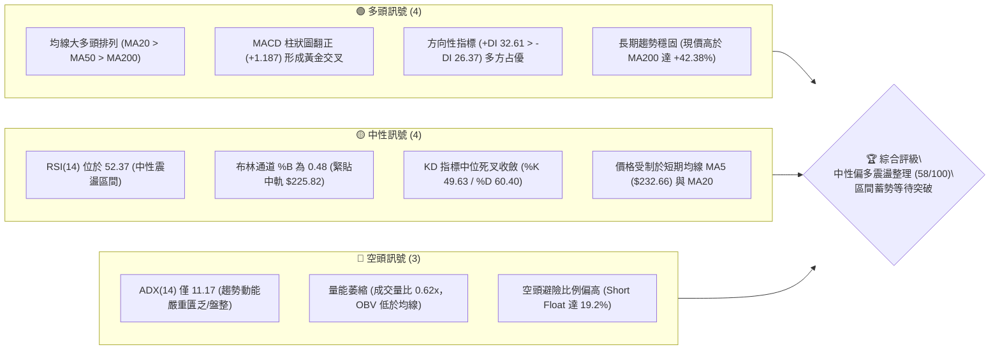
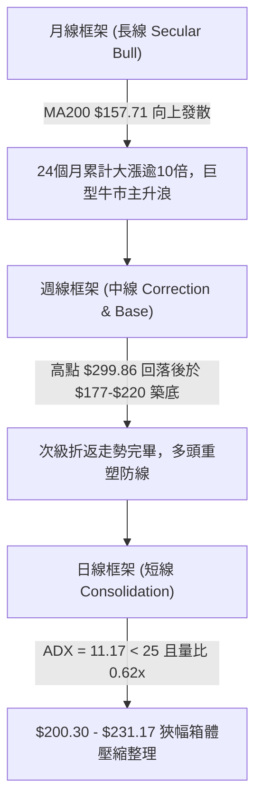
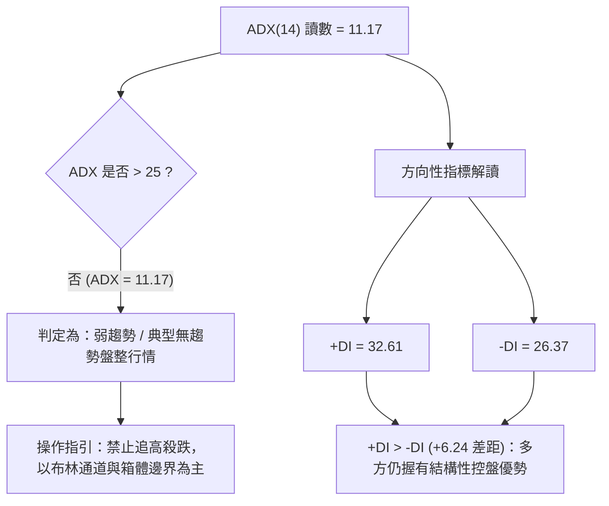
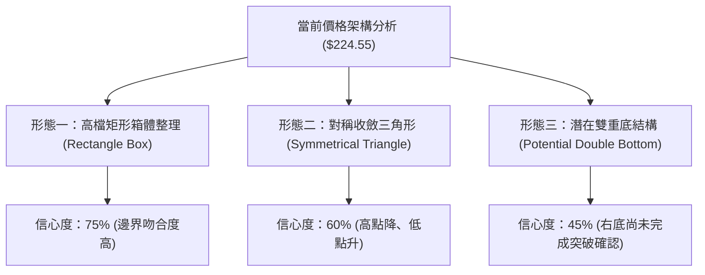
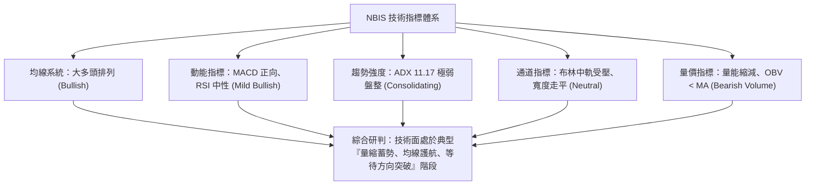
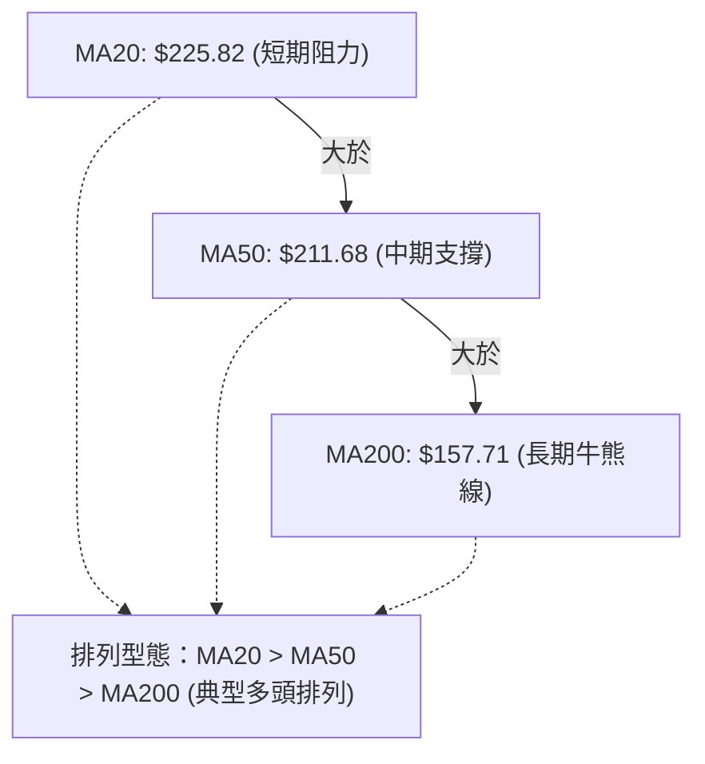
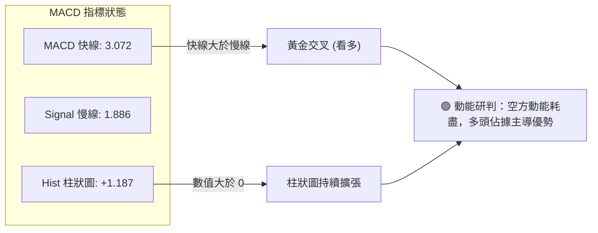
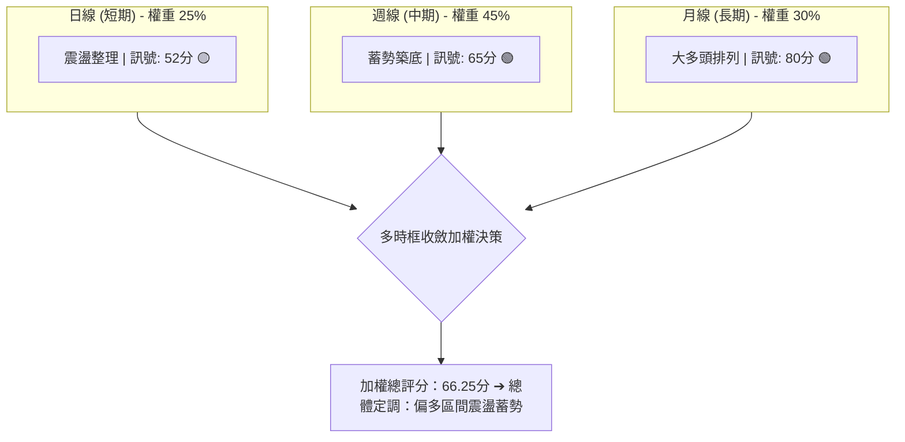
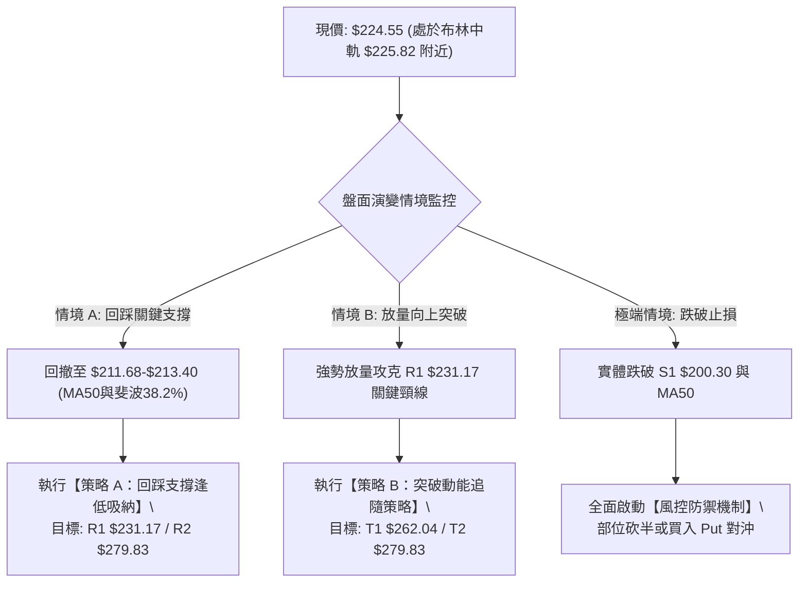
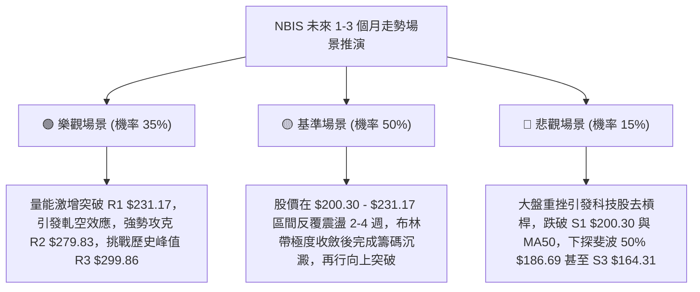

# NBIS 技術分析報告

> **報告日期**：2026-09-14 ｜ **語言**：繁體中文 ｜ **數據來源**：Yahoo Finance ｜ **當前價格**：$224.55

---

## 目錄

| 章節 | 內容 |
|------|------|
| [1. 技術面概覽](#1-技術面概覽) | 訊號儀表板、核心指標、評分卡 |
| [2. 趨勢分析](#2-趨勢分析) | 多時框趨勢、長中短期走勢、ADX解讀 |
| [3. 圖表形態分析](#3-圖表形態分析) | 形態識別、K線組合、目標價推算 |
| [4. 支撐與阻力](#4-支撐與阻力) | 關鍵價位、斐波那契回調 |
| [5. 技術指標深度解讀](#5-技術指標深度解讀) | MA/RSI/MACD/布林通道/成交量 |
| [6. 動能與波動率](#6-動能與波動率) | 動能評估、ATR、Beta與空頭部位 |
| [7. 多時框架總結](#7-多時框架總結) | 時框架評分矩陣、多時框收斂結論 |
| [8. 交易策略建議](#8-交易策略建議) | 策略路由、情境階梯、主策略詳情 |
| [9. 風險提示與監控](#9-風險提示與監控) | 關鍵監控清單、情境推演、風控紀律 |

---

## 1. 技術面概覽

### 🎯 技術訊號儀表板



---

### 📊 核心指標速覽表

| 指標類別 | 指標名稱 | 當前數值 | 訊號 | 專業技術面解讀 |
|:---|:---|:---|:---:|:---|
| **價格** | 當前收盤價 | $224.55 | 🟡 | 位於52週區間 66.7% 高位，回測日線布林中軌附近 |
| **均線** | 短期 MA20 | $225.82 | 🔴 | 現價位於 MA20 下方 -0.56%，短期均線形成微幅壓制 |
| **均線** | 中期 MA50 | $211.68 | 🟢 | 現價高於 MA50 達 +6.08%，中期防守支撐強韌有效 |
| **均線** | 長期 MA200 | $157.71 | 🟢 | 現價大幅高於 MA200 達 +42.38%，長期多頭格局未變 |
| **動能** | RSI(14) | 52.37 | 🟡 | 處於 50 多空分水嶺附近，無超買或超賣，動能平衡 |
| **動能** | MACD(12,26,9) | 3.072 (柱 +1.187) | 🟢 | 快線高於慢線，柱狀圖正向擴張，動能初現修復翻多 |
| **趨勢強度** | ADX(14) | 11.17 | 🔴 | 遠低於 25 臨界線，顯示單邊趨勢停滯，步入區間震盪 |
| **通道** | 布林通道 | $184.37 - $267.27 | 🟡 | 通道帶寬擴張後走平，%B 為 0.48，處於通道正中軸 |
| **波動** | ATR(14) | $13.66 (6.08%) | 🟡 | 每日平均波動幅度約 13.66 美元，維持中高波動特性 |
| **量能** | 20日成交量比 | 0.62x (1,117.8萬) | 🔴 | 成交量顯著萎縮至均量以下，OBV < MA 反映跟進買盤猶豫 |

---

### 🏆 技術評分卡

```
╔══════════════════════════════════════════════════════════════╗
║              NBIS 綜合技術評分卡 (2026-09-14)                ║
╠══════════════════════════════════════════════════════════════╣
║ 評估維度      評分進度條                分數    訊號等級     ║
╟──────────────────────────────────────────────────────────────╢
║ 趨勢強度      █████████░░░░░░░░░░░      45/100  🔴 弱動能盤整║
║ 動能指標      ████████████░░░░░░░░      62/100  🟢 MACD翻多  ║
║ 支撐穩定度    ██████████████░░░░░░      68/100  🟢 密集支撐帶║
║ 成交量配合    ████████░░░░░░░░░░░░      40/100  🔴 量能萎縮  ║
║ 形態完整度    ████████████░░░░░░░░      60/100  🟡 箱體收斂  ║
║ 均線排列      ███████████████░░░░░      75/100  🟢 多頭排列  ║
╠══════════════════════════════════════════════════════════════╣
║ 綜合技術評分  ███████████░░░░░░░░░      58/100  🟡 中性偏多  ║
║ 策略定調      區間震盪蓄勢 (Range-Bound Accumulation)        ║
╚══════════════════════════════════════════════════════════════╝
```

---

## 2. 趨勢分析

### 🌐 多時框趨勢分析



---

### 📈 長期趨勢 — 12個月走勢圖（Unicode）

```
NBIS 月線收盤走勢圖 (2025-10 至 2026-09)
價格 ($)
$300 ┤                                      
$276 ┤                                  ● [2026-06: $276.17]
$240 ┤                                 / \
$225 ┤                              ● /   \       ●←現價 [$224.55]
$200 ┤                             /       \     /
$175 ┤                            /         ●───● [2026-07: $190.41]
$150 ┤                       ●   /
$125 ┤ ●                    / \ /
$100 ┤  \                  ●   ● [2026-02: $91.19]
 $75 ┤   \   ●────●────●  /
 $50 ┤    ●─/ [2025-12: $83.71]
     └───────────────────────────────────────────────────────────
       10  11   12   01   02  03   04   05   06   07   08   09 (月份)
      '25 '25  '25  '26  '26 '26  '26  '26  '26  '26  '26  '26
```

#### 走勢特徵分析表格

| 階段週期 | 時間區間 | 起止價格 | 漲跌幅 | 走勢特徵與技術解讀 |
|:---|:---:|:---:|:---:|:---|
| **第一波拉升回檔** | 2025-10 ~ 2025-12 | $130.82 → $83.71 | -36.01% | 觸及百元關卡後獲利了結，成交量收縮進行健康洗盤 |
| **底部橫盤吸籌** | 2026-01 ~ 2026-02 | $85.19 → $91.19 | +7.04% | 於 52週低點 $73.52 上方構築雙重底支撐，均線開始扣低翻揚 |
| **主升浪爆發** | 2026-03 ~ 2026-06 | $103.76 → $276.17 | +166.16% | 月線連四紅，突破歷史高點並創下 52週極值 $299.86，成交量急遽放大 |
| **高位劇烈修正** | 2026-07 ~ 2026-07 | $276.17 → $190.41 | -31.05% | 短線漲幅過大觸發獲利回吐，快速回測斐波那契 50.0% ($186.69) 止跌 |
| **平台收斂整理** | 2026-08 ~ 2026-09 | $190.41 → $224.55 | +17.93% | 震盪幅度收窄，月收盤連續兩個月墊高，於中軌與 MA50 之上蓄勢 |

---

### 📊 中期趨勢（週線分析）

中期走勢呈現「V型反轉後的收斂三角/箱體壓縮」。從過去 20 週歷史數據觀察：
- **波段高點聚類**：2026-06-21 週收盤達 $286.69，隨後在 2026-08-16 再次暴力反彈至 $277.68，確立了上方強大阻力帶 R2 ($279.83) 與歷史極值 R3 ($299.86)。
- **波段低點聚類**：2026-07-19 探底至 $177.71，隨後 2026-08-09 於 $187.97 止跌形成更高低點 (Higher Low)，確認支撐帶 S1 ($200.30) 與 S2 ($194.80) 具備強大逢低買盤承接力。

```
近期中期週線價格波段結構示意圖：
  $299.86 ┬────────────────────────────────────────── 52W 最高點 (R3)
          │            ▲ ($286.69)
  $279.83 ┼───────────/─\─────────────▲ ($277.68)───── 阻力區 R2
          │          /   \           / \
  $231.17 ┼─────────/─────\─────────/───\─────▲────── 關鍵頸線阻力 R1
  $224.55 ┼────────/───────\───────/─────\───[●]───── 當前現價
  $211.68 ┼───────/─────────\─────/───────\────────── 中期生命線 (MA50)
  $200.30 ┼──────/───────────\───/─────────▼──────── 波段支撐 S1
  $186.69 ┼─────/─────────────▼─/──────────────────── 斐波那契 50% 回調位
  $177.71 ┴────/  ($177.71 底部)
```

---

### ⚡ 趨勢強度評估（ADX 解讀）



#### ADX 趨勢強度量化對照表

| ADX 數值區間 | 當前狀態 (11.17) | 市場特徵 | 策略採用建議 |
|:---:|:---:|:---|:---|
| **0 – 20** | **✔ 當前落點** | **極弱趨勢 / 窄幅盤整** | **網格交易、箱體高拋低吸、靜待放量突破** |
| 20 – 25 | 預期演變 | 趨勢醞釀期 / 潛在突破 | 縮小止損空間，觀察量能是否放大至 20MA 以上 |
| 25 – 40 | 目標狀態 | 強勁單邊趨勢形成 | 順勢突破加碼，採用移動停利 (Trailing Stop) |
| 40 – 60 | 歷史峰值期 | 極強趨勢 / 單邊噴發 | 警惕末升段背離，分批逢高收割獲利 |

---

## 3. 圖表形態分析

### 🔍 形態識別系統



#### 圖表形態量化評估與信心度表（依規則 15）

| 識別形態 | 信心度 | 判斷依據（嚴格引用 OHLCV 與關鍵價位） | 完成度 | 形態目標價（附精確計算式） |
|:---|:---:|:---|:---:|:---|
| **高檔矩形箱體** | **75%** | 價格受制於阻力 R1 ($231.17)，下方獲得支撐 S1 ($200.30) 有效承接，歷時逾 6 週於該區間往復運行 | 80% | **突破目標**：頸線 R1 ($231.17) + 箱體高差 ($231.17 - $200.30 = $30.87) = **$262.04** |
| **對稱收斂三角形** | **60%** | 上軌由 2026-06 高點 $286.69 與 2026-08 高點 $277.68 形成下降壓制；下軌由 2026-07 低點 $177.71 與 2026-08 低點 $187.97 形成抬升支撐 | 70% | **破網目標**：突破點 $231.17 + 三角形基底高差 ($286.69 - $177.71 = $108.98) = **$340.15** |
| **潛在雙重底** | **45%** | 第一底於 2026-07-19 ($177.71)，第二底於 2026-08-09 ($187.97)；但頸線 R2 ($279.83) 距今過遠，右肩尚在構築 | 35% | **訊號不足，僅做指標型解讀**（不作為主要依據） |

---

### 🕯️ 重要K線形態分析

| 週期/月份 | 收盤價 | K線形態名稱 | 專業技術面解讀 | 訊號強度 |
|:---:|:---:|:---|:---|:---:|
| **2026-05** | $231.09 | 長陽突破實體棒 | 帶量長紅突破百元關卡壓制，確立多頭主升段啟動 | 🟢 強烈買訊 |
| **2026-06** | $276.17 | 巨幅震盪流星線 | 上攻至歷史高點 $299.86 遭遇獲利回吐，留下長上影線 | 🔴 頂部預警 |
| **2026-07** | $190.41 | 大陰吞沒修正棒 | 快速殺跌回補均線乖離，但下影線在 50% 斐波處獲得承接 | 🔴 深度折返 |
| **2026-08** | $206.32 | 縮量長下影錘頭 | 兩次回踩 $187 均被多頭收復，顯示低檔承接買盤扎實 | 🟢 止跌回升 |
| **2026-09 (迄今)** | $224.55 | 中軸孕線十字星 (Harami) | 波動率顯著收斂，多空於布林中軌展開平衡拉鋸，醞釀變盤 | 🟡 變盤蓄勢 |

---

### 📉 ASCII 走勢形態示意圖

```
NBIS 高檔箱體整理與收斂三角形形態示意圖：
  $299.86 ┬ (52W 峰值)
          │  ●
  $279.83 ┼───\───────● (次高點) ─────────────── 箱體頂部 / 下降壓制線
          │    \     / \
  $246.44 ┼─────\───/───\───────────── (斐波那契 23.6%)
          │      \ /     \        ▲ 突破觸發點: R1 ($231.17)
  $231.17 ┼───────●───────\──────/─[現價 $224.55 在此蓄勢]
          │                \    /
  $211.68 ┼─────────────────\──/────── 中期均線 (MA50) 防線
          │                  \/
  $200.30 ┼──────────────────●──────── 箱體底部支撐 S1
          │                 /
  $186.69 ┼────────●───────/────────── 斐波那契 50.0% 強防線
          │       (低點) /
  $177.71 ┴─────────────● (最低點) ───── 三角形上升支撐線
```

---

### 🎯 形態目標價計算

依據高檔矩形箱體整理形態之標準幾何測量規則：
1. **箱體頸線阻力位 ($H$)**：取波段高點聚類 R1 = **$231.17**
2. **箱體底部支撐位 ($L$)**：取波段低點聚類 S1 = **$200.30**
3. **箱體垂直垂直高度 ($D$)**：
   $$D = H - L = \$231.17 - \$200.30 = \$30.87$$
4. **等距向上測量目標價 (T1)**：
   $$T_1 = H + D = \$231.17 + \$30.87 = \$262.04$$
   *(該價位精準切入布林上軌 $267.27 與斐波那契 23.6% 回調位 $246.44 之間)*
5. **延伸波段測量目標價 (T2)**：
   直接對接波段阻力 R2 = **$279.83**（若伴隨成交量突破 2,000 萬股，將回補 2026-06 高位缺口）。

---

## 4. 支撐與阻力

### 🗺️ 關鍵價位分布圖（Unicode）

```
NBIS 完整價位結構分布圖
══════════════════════════════════════════════════════════════════
$299.86 ║████████████████████████████████║ 歷史極值強阻力 R3 / 52W High
$279.83 ║████████████████████████        ║ 波段高點強阻力 R2
$267.27 ║▓▓▓▓▓▓▓▓▓▓▓▓▓▓▓▓▓▓▓▓            ║ 布林通道上軌壓制
$246.44 ║▒▒▒▒▒▒▒▒▒▒▒▒▒▒▒▒                ║ 斐波那契 23.6% 回調位
$231.17 ║████████████████████████████████║ 關鍵頸線阻力 R1 (突破即發動)
════════╠════════════════════════════════╣ ◄ 當前收盤價 $224.55
$220.56 ║░░░░░░░░░░░░                    ║ MA60 生命線支撐
$213.40 ║▒▒▒▒▒▒▒▒▒▒▒▒▒▒▒▒                ║ 斐波那契 38.2% 強回調位
$211.68 ║▓▓▓▓▓▓▓▓▓▓▓▓▓▓▓▓▓▓▓▓            ║ MA50 中期趨勢支撐
$200.30 ║████████████████████████        ║ 關鍵波段支撐 S1 (箱體下邊界)
$194.80 ║████████████████████████████████║ 密集低點聚類 S2
$186.69 ║▒▒▒▒▒▒▒▒▒▒▒▒▒▒▒▒                ║ 斐波那契 50.0% 多空分水嶺
$164.31 ║████████████████████            ║ 深度波段防守 S3 (MA200 緩衝帶)
══════════════════════════════════════════════════════════════════
```

---

### 🚧 阻力位分析表

*(價位嚴格引用 OHLCV 關鍵價位數據)*

| 阻力級別 | 精確價位 | 距離現價 | 形成原因與籌碼結構 | 突破難度 | 技術重要性 |
|:---:|:---:|:---:|:---|:---:|:---:|
| **R1** | **$231.17** | +2.95% | 近期波段多次反彈高點聚類、箱體上軌，且與 MA5 ($232.66) 形成雙重疊加壓制 | 中等 🟡 | ★★★★☆<br>(突破即確認短線轉強) |
| **R2** | **$279.83** | +24.62% | 2026年6月及8月反彈雙重頂部殘留大量高位套牢籌碼，為波段空頭防線 | 極高 🔴 | ★★★★★<br>(中期多空主分水嶺) |
| **R3** | **$299.86** | +33.54% | 52週歷史最高天花板，心理整數關卡 ($300.00) 獲利回吐重災區 | 極高 🔴 | ★★★★★<br>(創歷史新高前哨戰) |

---

### 🛡️ 支撐位分析表

*(價位嚴格引用 OHLCV 關鍵價位數據)*

| 支撐級別 | 精確價位 | 距離現價 | 形成原因與支撐結構 | 守住機率 | 技術重要性 |
|:---:|:---:|:---:|:---|:---:|:---:|
| **S1** | **$200.30** | -10.80% | 近一年波段低點聚類、心理整數大關 ($200)，箱體震盪下邊界，逢低買盤積極 | 85% 🟢 | ★★★★☆<br>(短線箱體防守底線) |
| **S2** | **$194.80** | -13.25% | 2026年7-8月築底密集換手區間下沿，跌破將引發停損賣壓 | 80% 🟢 | ★★★★☆<br>(中期多頭最後防線) |
| **S3** | **$164.31** | -26.83% | 接近長期均線 MA200 ($157.71) 與斐波那契 61.8% ($159.98)，終極價值支撐 | 95% 🟢 | ★★★★★<br>(超跌極端價值防線) |

---

### 📐 斐波那契回調位分析

依據 52週極值區間（低點 **$73.52** → 高點 **$299.86**，波幅高達 $226.34）：

| 回調比率 | 斐波那契價位 | 當前相對位置與技術解讀 |
|:---:|:---:|:---|
| **0.0% (52W High)** | **$299.86** | 歷史極值壓力頂部 |
| **23.6%** | **$246.44** | 第一回調阻力位，位於現價上方 (+9.75%)，突破後波段上行空間完全打開 |
| **現價落點** | **$224.55** | **目前價格運行於 23.6% ($246.44) 與 38.2% ($213.40) 之間，屬於強勢整理區間** |
| **38.2%** | **$213.40** | **黃金回調第一強支撐**，與 MA50 ($211.68) 形成高度共振，構成堅不可摧的底部買盤 |
| **50.0%** | **$186.69** | 中期多空均衡位，2026-07 及 2026-08 兩次回踩均在該位置附近 ($187.77-$190.41) 止跌回升 |
| **61.8%** | **$159.98** | **黃金分割牛熊分界線**，與 MA200 ($157.71) 幾乎完全重合，只要不破此線，長線大多頭結構不變 |
| **78.6%** | **$121.96** | 深度極端折返防禦位 |
| **100.0% (52W Low)**| **$73.52** | 52週歷史底部起漲原點 |

---

## 5. 技術指標深度解讀

### 🎛️ 指標訊號總覽



---

### 📈 移動平均線排列分析



#### 各期移動平均線明細表

| 均線名稱 | 當前價格 | 與現價差距 | 斜率走勢特徵 | 訊號評級 |
|:---|:---:|:---:|:---|:---:|
| **MA5** | $232.66 | -3.48% (現價在下) | ▁▁▂▃▃▃▄▆▇██ 短期衝高回落，提供極短線阻力 | 🔴 短線微空 |
| **MA10** | $219.30 | +2.39% (現價在上) | ▁▁▁▃▄▅▆▇██ 短期回升墊高，支撐現價短線止跌 | 🟢 短線偏多 |
| **MA20** | $225.82 | -0.56% (現價在下) | ▁▁▁▂▃▄▅▆▇██ 持平走橫，布林中軌所在，多空拉鋸 | 🟡 中性震盪 |
| **MA60** | $220.56 | +1.81% (現價在上) | ▁▁▂▃▄▆▇██ 季線穩步抬升，下檔買盤具黏性 | 🟢 中期偏多 |
| **MA120** | $198.65 | +13.04% (現價在上) | ▁▁▂▃▄▅▆▇██ 半年線加速上揚，多頭中期基石 | 🟢 強烈看多 |
| **MA200** | $157.71 | +42.38% (現價在上) | ▁▁▂▃▄▅▆▇██ 年線呈典型大牛市斜率發散 | 🟢 極強看多 |

---

### 📉 RSI(14) 分析

#### RSI 讀數進度條展示
```
RSI(14): 52.37
[0] ─────────── [30] 超賣 ─────── [50] 中軸 ──●─── [70] 超買 ─────────── [100]
進度條: ██████████░░░░░░░░░░  52.37% (中性健康區域)
```
- **超買/超賣檢驗**：目前 RSI(14) 讀數為 52.37，遠離超賣線 (30) 與超買線 (70)，完全消除過熱或恐慌拋售疑慮。
- **背離分析**：
  - 價格於 2026-08-16 創高 $277.68 時，週線 RSI 為 67.2；隨後價格折返至 $209-$226，RSI 迅速降溫至 33-52 區間。
  - **結論：當前無頂背離或底背離跡象**，指標走勢與價格收斂完全相符，展現中性震盪修復特徵。

---

### 📊 MACD(12, 26, 9) 訊號解讀


- **動能修復細節**：觀察近 5 週週線 MACD 柱狀圖走勢（-2.504 → -1.365 → **+1.187**），柱狀圖由負轉正，呈現顯著的紅柱遞增態勢，確認空方下殺動能已完全被多頭吸收，隨時具備向上發動波段進攻之動能基礎。

---

### 📦 布林通道分析 (Bollinger Bands)

```
NBIS 日線布林通道 (20, 2) 結構圖：
$267.27 ┬────────────────────────────────────────── BB 上軌 (波動極限壓力)
        │
        │
$225.82 ┼─────────────────● (MA20 中軌: $225.82) ─── 緊貼現價 ($224.55)
        │                 [現價在通道中軸 48% 位置]
        │
$184.37 ┴────────────────────────────────────────── BB 下軌 (強勁超跌支撐)
```
- **通道位置 (%B 分析)**：當前 %B 讀數為 **0.48**，代表價格精準運行於布林中軌（MA20: $225.82）下方僅 0.56% 處，處於絕對的多空中性平衡點。
- **通道形態研判**：通道上下軌寬度自前期大幅擴張後開始「顯著走平與向內收縮 (Band Squeeze)」，此為波動率衰退的典型徵兆，通常預示著在未來 2-4 週內即將迎來新一輪的突破行情。

---

### 💹 成交量分析（量價配合度）

#### 量能數據對比
- 最新日成交量：**11,178,900 股**
- 20日平均成交量 (MA20 Vol)：**18,058,275 股**
- **成交量比 (Volume Ratio)：0.62x** (成交量萎縮 38%)
- 50日平均成交量 (MA50 Vol)：**21,397,732 股**

#### 量價配合度深度解讀
1. **量縮價穩**：NBIS 自 8 月中旬衝高折返以來，週成交量自峰值 1.67 億股逐步回落至 5,788 萬與 6,237 萬股。當前價格在 $224.55 處止跌走平，呈現典型的「回檔量縮、籌碼沉澱」良性格局，非主力高位恐慌出逃。
2. **OBV 能量潮狀態**：目前 OBV < MA，顯示籌碼累積指標短期走勢疲軟，代表大資金機構雖然並未恐慌拋盤，但也尚未啟動大規模市價搶籌，多頭目前採取「限價被動掛單吸籌」策略。

---

## 6. 動能與波動率

### ⚡ 動能評估四象限

| 象限分區 | 動能強度 | 波動率水準 | 當前落點 | 策略行動方針 |
|:---:|:---:|:---:|:---:|:---|
| **第一象限 (Q1)** | 強動能 (+DI強/MACD擴張) | 低波動 (通道收縮) | — | 最佳波段突破機會（即將轉入目標） |
| **第二象限 (Q2)** | **中/弱動能 (ADX=11.17)** | **中低波動 (通道走平)** | **✔ NBIS (當前位置)** | **謹慎觀望、箱體區間高拋低吸、等待方向確認** |
| **第三象限 (Q3)** | 強動能 (單邊噴發) | 高波動 (ATR極限) | — | 主升浪/主跌浪（高風險高回報追隨） |
| **第四象限 (Q4)** | 負動能 (空頭主導) | 高波動 (恐慌拋售) | — | 嚴禁抄底、全面空倉防禦 |

---

### 📊 ATR 波動率分析與止損測算

- **當前 ATR(14)**：**$13.66**
- **ATR 佔比 (ATR % of Price)**：**6.08%**
- **波動特性評估**：作為 Beta 高達 1.436 的 AI 雲端算力與基建股，單日 6.08% ($13.66) 的平均真實波幅屬於中高波動標的。普通窄幅止損極易被盤中日常噪音掃出場。

#### 專業交易止損距離建議表
- **短線交易止損距離 (1.0 × ATR)**：
  $$\$224.55 - \$13.66 = \mathbf{\$210.89}$$ *(剛好保護在 MA50 $211.68 與 斐波那契 38.2% $213.40 防線之下)*
- **波段交易止損距離 (1.5 × ATR)**：
  $$\$224.55 - (1.5 \times \$13.66) = \$224.55 - \$20.49 = \mathbf{\$204.06}$$ *(緊貼波段支撐 S1 $200.30 之上方保護帶)*
- **寬鬆防守止損距離 (2.0 × ATR)**：
  $$\$224.55 - (2.0 \times \$13.66) = \$224.55 - \$27.32 = \mathbf{\$197.23}$$ *(設於 S2 $194.80 支撐區間內)*

---

### 📐 Beta 與市場籌碼結構（軋空潛能）

- **Beta 係數**：**1.436**（對大盤那斯達克指數的波動敏感度高出 43.6%，大盤上漲時具備強烈超額收益 Alpha）。
- **放空比例 (Short % of Float)**：**19.2%**（空頭部位極高！流通股中近五分之一被放空借券賣出）。
- **回補天數 (Short Ratio / Days to Cover)**：**1.88 天**。
- **籌碼結構研判**：機構持股高達 **69.2%**，籌碼相對集中。高達 19.2% 的放空比例意味著市場累積了巨大的潛在空頭回補動能。一旦股價放量突破 R1 ($231.17) 或帶動突破箱體，極易引發強烈的**軋空效應 (Short Squeeze)**，推動股價暴力拉升測試 R2 ($279.83)。

---

## 7. 多時框架總結

### 📋 時框架評分矩陣

| 時框架 | 趨勢方向 | 動能狀態 | 均線排列狀況 | 形態結構特徵 | 綜合評分 | 操作指導建議 |
|:---:|:---:|:---:|:---:|:---:|:---:|:---|
| **日線 (短線)** | 🟡 橫盤震盪 | 🟡 RSI 52.37 平衡 | 🔴 跌破 MA5/MA20 | 箱體區間壓縮收斂 | **52/100** | 不宜高位追價，區間內低吸高拋 |
| **週線 (中線)** | 🟢 震盪築底 | 🟢 MACD 紅柱翻正 | 🟢 守穩 MA50 之上 | 對稱三角形/箱體整理 | **65/100** | 逢低分批建立波段部位 |
| **月線 (長線)** | 🟢 大牛市主升 | 🟢 大多頭動能充沛 | 🟢 完美多頭 (遠高MA200)| 歷史級大多頭旗形整理 | **80/100** | 堅定長期持有，無視短期噪音 |

---

### 🔲 綜合訊號矩陣



---

### ⚖️ 多時框收斂結論（依規則 14 嚴格執行）

1. **行情性質判定**：
   依據趨勢強度核心指標，當前 **ADX(14) = 11.17 遠低於 25 臨界值**，系統**嚴格判定當前為「盤整行情 (Range-Bound Market)」**，非單邊趨勢行情。
2. **多時框優先級收斂**：
   根據盤整行情收斂規則，**以日線布林通道上下軌 ($184.37 - $267.27) 及近一年關鍵波段支撐/阻力為主要交易區間**。中長期大多頭均線排列 (MA20 > MA50 > MA200) 提供強大的下檔價值保護，而短期的量縮與均線糾纏則限制了單邊爆發力。
3. **唯一方向性結論**：
   **【中性偏多區間蓄勢震盪 (Neutral-to-Bullish Range Bound)】**。操作主軸為：**依託下方支撐帶分批低吸，並在突破關鍵頸線時追隨確認訊號，嚴禁在箱體內部中軸盲目追高**。

---

## 8. 交易策略建議

### 🗺️ 策略決策流程圖



---

### 🧭 策略路由（依評分卡分流）

> **當前主策略方向 = 【區間逢低承接與突破跟進策略（評分 58/100，中性偏多區間操作）】**  
> *(理由：技術評分卡綜合得分為 58/100，處於 40–60 中性區間操作帶，且 ADX < 25 明確判定為盤整行情，故主推圍繞關鍵支撐之「低吸」與圍繞關鍵阻力之「突破確認」兩套高勝率多頭操作，空頭僅列為反轉風險對沖點。)*

---

### 🎯 價格情境階梯（Price Scenarios）

*(價位嚴格引用 OHLCV 關鍵價位數據與形態計算值)*

| 觸發條件 (Trigger) | 下一目標 (Target 1) | 後續延伸 (Target 2) | 市場情境與交易含義 |
|:---|:---:|:---:|:---|
| **強勢突破 R1 ($231.17)** | **$262.04** (形態測幅) | **R2 ($279.83)** | **短線突破轉強**，高檔箱體瓦解，引發 19.2% 空頭部位軋空補盤 |
| **站穩現價區間 ($213-$226)**| **R1 ($231.17)** | — | **區間震盪蓄勢**，布林帶寬持續收縮，多空平衡維持中軸拉鋸 |
| **有效跌破 S1 ($200.30)** | **S2 ($194.80)** | **S3 ($164.31)** | **中期結構轉弱**，回調考驗 50% 斐波那契 ($186.69) 與 MA200 |

---

### 📊 情境機率分佈

| 運行情境 | 機率預估 | 主要指標依據與量化支持 |
|:---|:---:|:---|
| **情境一：區間震盪後向上突破** | **55%** | MACD 柱狀圖翻正 (+1.187)、+DI (32.61) 顯著高於 -DI、均線維持完美多頭排列、空頭回補潛能巨大 |
| **情境二：維持在箱體內橫盤整理** | **30%** | ADX 僅 11.17 缺乏趨勢動能、成交量比僅 0.62x 極度萎縮、布林通道走平 |
| **情境三：向下破位回測深層支撐** | **15%** | 最新價格在 MA20 之下 (-0.56%)、OBV 低於均線，若大盤重挫可能帶動失守 $200 |

---

### 🟢 主策略詳情（方向依評分路由：偏多區間操作）

| 策略要素 | 策略 A：支撐回踩低吸策略（左側/勝率優先） | 策略 B：放量突破追隨策略（右側/動能優先） |
|:---|:---|:---|
| **進場條件** | 股價回踩考驗 MA50 / 斐波 38.2% 止跌收紅 | 日K線實體放量突破關鍵阻力位 R1，日量大於 1,800萬 |
| **精確進場價格** | **$213.40** *(斐波那契 38.2% 支撐處)* | **$231.50** *(突破 R1 $231.17 後掛單確認買進)* |
| **第一目標價 T1** | **$231.17** *(箱體頂部 R1，預期收益 +8.33%)* | **$262.04** *(矩形形態測算目標，預期收益 +13.19%)* |
| **第二目標價 T2** | **$262.04** *(形態等距滿足位，預期收益 +22.79%)*| **$279.83** *(波段高點阻力 R2，預期收益 +20.88%)* |
| **精確止損價格** | **$200.00** *(跌破波段支撐 S1 $200.30 停損)* | **$222.50** *(跌破突破前整理平台，回吐不及時)* |
| **止損空間 (風險)** | -$13.40 (-6.28%) | -$9.00 (-3.89%) |
| **風險報酬比 (R/R)**| **1 : 2.65** *(以 T2 測算)* | **1 : 3.40** *(以 T1 測算: 1:3.39；T2: 1:5.37)* |
| **模型預估勝率** | **65%** | **58%** |
| **建議配置倉位** | **15% - 20%** 總資產倉位 | **10% - 15%** 總資產倉位 |

---

### 🔴 反向風險觸發點（對沖提示）

若市場出現以下極端空頭觸發訊號，應立即停止多頭操作，並啟動反向避險：
1. **破位觸發點**：日K線收盤價**以大陰線跌破波段關鍵支撐 S1 ($200.30)**，且伴隨成交量放大逾 2,000 萬股。
2. **均線失效訊號**：現價跌破中期生命線 MA50 ($211.68) 超過 3 個交易日未能收復，且 MA20 拐頭向下死叉 MA50。
3. **風控應對動作**：
   - 多頭現貨倉位無條件砍半，將整體曝險降至 10% 以下。
   - 激進交易者可在反彈回抽 $200.30 遇阻時，建立相應 Delta 避險賣權 (Put Option) 或進行做空操作，下看斐波那契 50.0% ($186.69) 與 S3 ($164.31)。

---

### ⭐ 整體訊號強度評星

```
做多訊號強度：★★★★☆  (4.0/5星 - 均線結構極佳，等待突破爆發)
做空訊號強度：★☆☆☆☆  (1.5/5星 - 逆大牛市趨勢，僅有盤整壓制)
整體技術可信度：★★★★☆  (4.0/5星 - 價位聚類清晰，斐波那契共振強)
```

---

## 9. 風險提示與監控

### ✅ 關鍵監控指標 Checklist

```
╔══════════════════════════════════════════════════════════════════╗
║                 NBIS 交易員每日關鍵監控 Checklist                ║
╠══════════════════════════════════════════════════════════════════╣
║ [ ] 價位突破監控：收盤價是否放量突破 R1 ($231.17)？              ║
║ [ ] 均線防守監控：收盤價是否持續高於 MA50 ($211.68)？           ║
║ [ ] 動能指標監控：MACD 柱狀圖是否維持正向 (>0) 且逐日擴張？      ║
║ [ ] 趨勢指標監控：ADX(14) 是否脫離盤整區 (讀數突破 20 並升向 25)？║
║ [ ] 量能異動監控：單日成交量是否突破 20MA 均量 (1,805 萬股)？   ║
║ [ ] 籌碼異動監控：Short % of Float 是否自 19.2% 出現快速回補？  ║
║ [ ] 極端風險底線：盤中價格是否觸及 S1 ($200.30) 止損紅線？        ║
╚══════════════════════════════════════════════════════════════╝
```

---

### ⚠️ 風險場景分析



---

### 🛡️ 風險管理重要提醒

1. **Beta 與倉位匹配控制**：
   - NBIS 的 Beta 值為 **1.436**，意味著其波動幅度為市場整體指數的 1.44 倍。在倉位配置上，建議投資組合中該標的最高配置比例不得超過 **15%–20%**，以防範個股非系統性波動對淨值造成衝擊。
2. **ATR 動態止損紀律**：
   - NBIS 每日 ATR 高達 **$13.66**，日內回撤 5%–7% 屬於正常技術波動。嚴禁在日常交易中將止損設定於 1.0 ATR 之內（易被市場雜訊無效掃出場）。
3. **空頭擠壓 (Short Squeeze) 雙刃劍**：
   - 雖然 19.2% 的放空比例提供了巨大的向上軋空潛能，但高空頭比例也意味著空頭機構在基本面或行業面有深入的對沖佈局。一旦基本面出現未預期利空，空頭增持可能導致斷崖式下跌，因此**必須嚴格以跌破 $200.00 作為全體多頭的無條件鐵血停損線**。

---

## 📋 報告總結

```
╔══════════════════════════════════════════════════════════════════╗
║                     NBIS 技術分析報告總結                        ║
╠══════════════════════════════════════════════════════════════════╣
║ 報告日期：2026-09-14            當前價格：$224.55                 ║
║ 技術評分：58 / 100              分析評級：⚖️ 中性偏多區間震盪蓄勢 ║
╟──────────────────────────────────────────────────────────────────╢
║ 關鍵維度技術結論：                                               ║
║ ├─ 長期趨勢：🟢 強烈看多 (MA200 $157.71 向上發散，大多頭主升)   ║
║ ├─ 中期趨勢：🟢 震盪築底 (守穩 MA50 $211.68 與斐波那契 38.2%)   ║
║ ├─ 短期趨勢：🟡 窄幅收斂 (ADX 11.17 弱動能，受制於 MA5/MA20)    ║
║ ├─ 關鍵支撐：S1: $200.30  ｜  S2: $194.80  ｜  S3: $164.31       ║
║ ├─ 關鍵阻力：R1: $231.17  ｜  R2: $279.83  ｜  R3: $299.86       ║
║ └─ 華爾街目標價共識：$290.71 (17 位分析師，評級 Buy，空間 +29.5%) ║
╟──────────────────────────────────────────────────────────────────╢
║ 最優交易策略組合：                                               ║
║ 1. 🥇 首選策略 (右側突破)：                                      ║
║    突破 R1 ($231.17) 追買，目標 T1: $262.04、T2: $279.83，       ║
║    停損設 $222.50，風報比 1 : 3.40 (高動能確認型)。              ║
║ 2. 🥈 次選策略 (左側低吸)：                                      ║
║    回踩斐波 38.2% ($213.40) 低吸，目標 R1 ($231.17)，            ║
║    停損設 S1 下方 $200.00，風報比 1 : 2.65 (高勝率防守型)。       ║
║ 3. 🥉 保守觀望：                                                 ║
║    等待日線 ADX 回升至 20 以上且單日成交量放大逾 1,800 萬股，    ║
║    方向明朗化後再行大步進場。                                    ║
╚══════════════════════════════════════════════════════════════════╝
```

---

> ⚠️ **免責聲明**：本報告為基於專業技術分析模型生成之學術研究與市場觀察報告，所有數據與點位均嚴格基於所提供之歷史價格資訊與數學模型推算。本報告**僅供研究與學術參考**，**不構成任何形式的投資建議、證券買賣推薦或獲利保證**。市場有風險，投資需獨立判斷並自負盈虧。

---

*報告生成時間：2026-09-14 ｜ 數據來源：Yahoo Finance ｜ 分析框架：多時框技術分析模型*