# NBIS 技術分析報告

> **報告日期**：2026-09-15 ｜ **語言**：繁體中文 ｜ **數據來源**：Yahoo Finance ｜ **當前價格**：$212.19

---

## 目錄

| 章節 | 內容 |
|------|------|
| [1. 技術面概覽](#1-技術面概覽) | 訊號儀表板、核心指標、評分卡 |
| [2. 趨勢分析](#2-趨勢分析) | 多時框趨勢、長中短期走勢、ADX解讀 |
| [3. 圖表形態分析](#3-圖表形態分析) | 形態識別、K線組合、形態目標價 |
| [4. 支撐與阻力](#4-支撐與阻力) | 關鍵價位、斐波那契回調 |
| [5. 技術指標深度解讀](#5-技術指標深度解讀) | MA/RSI/MACD/布林/成交量 |
| [6. 動能與波動率](#6-動能與波動率) | 動能評估、ATR、Beta |
| [7. 多時框架總結](#7-多時框架總結) | 時框架評分矩陣、收斂結論 |
| [8. 交易策略建議](#8-交易策略建議) | 多空策略、價格情境、風險報酬比 |
| [9. 風險提示與監控](#9-風險提示與監控) | 監控指標、風險場景、風控管理 |
| [📋 報告總結](#-報告總結) | 核心結論與策略彙整 |

---

## 1. 技術面概覽

### 🎯 技術訊號儀表板

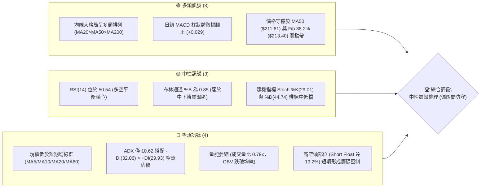

### 📊 核心指標速覽表

| 指標類別 | 指標名稱 | 當前數值 | 訊號 | 解讀 |
|----------|----------|----------|------|------|
| **價格** | 當前價格 | $212.19 | 🟡 | 位於 52 週高低區間之 61.3% 分位，處於波段拉回後之平衡位 |
| **均線** | MA20 | $222.55 | 🔴 | 現價低於 MA20 達 -4.65%，短期上方形成首道動態反壓 |
| **均線** | MA50 | $211.61 | 🟢 | 現價極度貼近並守於 MA50 之上（+0.27%），提供中期結構支撐 |
| **均線** | MA200 | $158.31 | 🟢 | 顯著高於長期牛熊分界線（+34.03%），宏觀牛市基底依然完好 |
| **動能** | RSI(14) | 50.54 | 🟡 | 坐落於 50 中性水位，動能處於多空拉鋸之無趨勢期 |
| **動能** | MACD | 1.921 (柱: +0.029) | 🟢 | MACD 線高於訊號線 (1.893)，零軸上方微幅黃金交叉 |
| **趨勢** | ADX(14) | 10.62 | 🟡 | ADX < 25 極弱趨勢，市場進入典型之橫盤整理與動能衰竭期 |
| **通道** | 布林帶寬 | $188.70 - $256.40 | 🟡 | %B = 0.35，價格處於中軌 ($222.55) 與下軌 ($188.70) 間 |
| **量能** | 成交量 / OBV | 13.68M (量比 0.79x) | 🔴 | 成交量低於 20 日均量，OBV 低於均線，量價呈收斂回調 |
| **波動** | ATR(14) | $13.91 (6.55%) | 🔴 | 日內波動幅度大，操作需預留足夠止損緩衝空間 |

### 🏆 技術評分卡

```
╔══════════════════════════════════════════════════════════════╗
║                技術評分卡 — NBIS (2026-09-15)                ║
╠══════════════════════════════════════════════════════════════╣
║ 趨勢強度 (ADX=10.62)    ████░░░░░░░░░░░░░░░░  22/100  🔴 極弱趨勢  ║
║ 動能指標 (RSI/MACD)     ██████████░░░░░░░░░░  52/100  🟡 多空中立  ║
║ 支撐穩定度 (MA50/S1)    █████████████░░░░░░░  65/100  🟢 買盤承接  ║
║ 成交量配合 (OBV/量比)   ███████░░░░░░░░░░░░░  35/100  🔴 量能萎縮  ║
║ 形態完整度 (箱型收斂)   ██████████░░░░░░░░░░  50/100  🟡 構築中    ║
║ 均線排列 (長多短空)     ████████████░░░░░░░░  60/100  🟢 宏觀偏多  ║
╠══════════════════════════════════════════════════════════════╣
║ 綜合技術評分            ██████████░░░░░░░░░░  48/100  ⚖️ 區間震盪  ║
╚══════════════════════════════════════════════════════════════╝
```

---

## 2. 趨勢分析

### 🌐 多時框趨勢分析

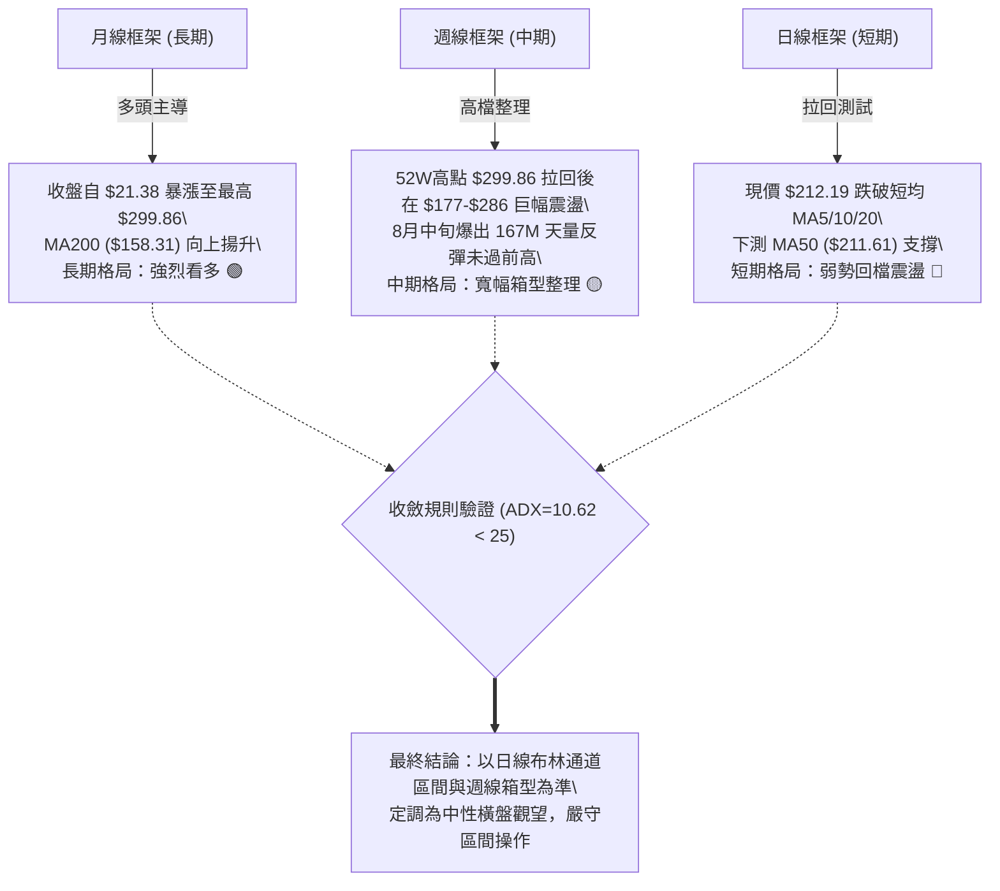

### 📈 長期趨勢 — 12個月走勢圖（Unicode）

```
NBIS 月線收盤走勢圖（2025-10 至 2026-09）
價格 ($)
$300 ┤                                              
$280 ┤                                      ● (06月: 276.17)
$260 ┤                                     / \      
$240 ┤                                    /   \     
$220 ┤                                   ●     \    ● (09月現價: 212.19)
$200 ┤                                  (05月:  ●───┘ (08月: 206.32)
$180 ┤                                  231.09) (07月: 190.41)
$160 ┤                                 /            
$140 ┤ ● (10月: 130.82)              ● (04月: 138.23)
$120 ┤   \                          /               
$100 ┤    ● (11月: 94.87)          ● (03月: 103.76) 
 $80 ┤     └──●───────●──────●────┘                 
     │       (12月:  (01月: (02月:                  
     │        83.71)  85.19) 91.19)                 
     └───────────────────────────────────────────────────
        10   11   12   01   02   03   04   05   06   07   08   09 (月份)
```

#### 走勢特徵分析表格

| 階段區間 | 起止收盤價 | 區間漲跌幅 | 走勢特徵與量價解讀 |
|----------|------------|------------|--------------------|
| **2025-10 至 2025-12** | $130.82 → $83.71 | -36.01% | 歷經前期爆發後的首輪估值殺跌，回測底部支撐 |
| **2025-12 至 2026-02** | $83.71 → $91.19 | +8.94% | 於 $83-$91 構築堅實頭肩底底座，沉澱籌碼 |
| **2026-02 至 2026-06** | $91.19 → $276.17 | +202.85% | 主升浪強勢噴出，創下 52 週歷史高點 $299.86 |
| **2026-06 至 2026-07** | $276.17 → $190.41 | -31.05% | 獲利了結賣壓湧現，價格急速回檔修正超買乖離 |
| **2026-07 至 2026-09** | $190.41 → $212.19 | +11.44% | 於 $190-$230 帶狀建立新箱型，多空動能進入平衡期 |

### 📊 中期趨勢（週線分析）

```
NBIS 週線波段高低點與結構示意圖
價格 ($)
$300 ┬────────────────────────────────────────── 52W 高點 $299.86 / R3
     │                         ▲ (06-21週: 286.69)
$270 ┼─────────────────────────┼───────▲ (08-16週: 277.68 / R2)
     │                        / \     / \
$240 ┼─────────▲ (05-31: 231)─/   \───/   \───▲ (09-06: 226.39 / R1: 231.17)
     │        / \            /     \ /     \ / \
$210 ┼───────/───\──────────/───────●───────●───● (現價 $212.19 / Fib 38.2%: 213.40)
     │      /     \        /    (07-05: 215.62)
$180 ┼─────● (05-10: 177)─● (07-19: 177.71 / S3: 164.31)
     │
$150 ┴────────────────────────────────────────── MA200: $158.31
```

- **中期觀察**：近 20 週數據顯示，NBIS 在 2026-06-21 觸及 $286.69 與 2026-08-16 觸及 $277.68，均在 $280 附近遭遇強烈拋壓，兩次上攻未破歷史高點 $299.86，形成中期雙重頂壓制。
- **下方支撐**：7 月中旬低點 $177.71 與 8 月初拉回點 $187.97、8 月 30 日低點 $209.18 逐步抬高，顯示中期低點存在買盤護盤。

### ⚡ 趨勢強度評估（ADX 解讀）

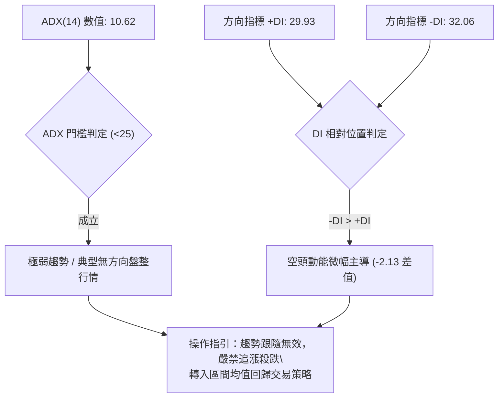

#### ADX 指標強度對照表

| 指標名稱 | 當前數值 | 正常趨勢閾值 | 當前狀態判定 | 交易意涵 |
|----------|----------|--------------|--------------|----------|
| **ADX(14)** | **10.62** | > 25.00 為趨勢行情 | 🔴 極弱趨勢 (盤整) | 趨勢指標鈍化，價格將在支撐阻力間游走 |
| **+DI(14)** | **29.93** | > 30.00 為強多頭 | 🟡 中度多頭力道 | 多頭上攻動能尚存，但缺乏持續力 |
| **-DI(14)** | **32.06** | > 30.00 為強空頭 | 🔴 略佔上風 | 空方下壓略大於多方，但未達突破門檻 |
| **DI 差值** | **-2.13** | 絕對值 > 15 為單邊 | 🟡 多空旗鼓相當 | 雙方均無法發動單邊趨勢，盤整為必然 |

---

## 3. 圖表形態分析

### 🔍 形態識別系統

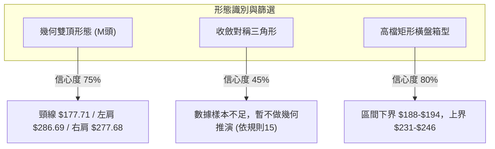

#### 形態識別信心度評估表（依嚴格要求 15）

| 形態名稱 | 信心度 | 判斷依據（引用真實數據） | 完成度 | 目標價計算式與點位 |
|----------|--------|--------------------------|--------|--------------------|
| **中期寬幅雙頂 (Double Top)** | **75%** | 峰1: 06-21收盤 $286.69；峰2: 08-16收盤 $277.68（相差僅 3.1%）。谷底頸線位於 07-19 收盤 $177.71（貼近 S3 $164.31）。 | 65% (未跌破頸線) | 若有效跌破頸線 $177.71，形態高度 = $286.69 - $177.71 = $108.98。<br>推算下行測幅 = $177.71 - $108.98 = **$68.73**（靠近 52W 低點 $73.52）。 |
| **短線矩形箱型整理 (Rectangle)** | **80%** | 上軌阻力受壓於 R1 $231.17，下軌獲得 S1 $200.30 與 S2 $194.80 密集承接。 | 85% (區間內部游走) | 箱型高度 = $231.17 - $200.30 = $30.87。<br>向上突破目標 = $231.17 + $30.87 = **$262.04**；<br>向下破位目標 = $200.30 - $30.87 = **$169.43**。 |
| **布林帶壓縮走平 (指標型解讀)** | **90%** | 帶寬壓縮，中軌 MA20 ($222.55) 走平，上下軌鎖定在 $188.70-$256.40。 | 100% | 遵循布林均值回歸，上軌 $256.40 承壓，下軌 $188.70 止跌。 |

### 🕯️ 重要K線形態分析

| 月份 | 收盤價 | K線形態特徵 | 技術解讀 | 信號強度 |
|------|--------|-------------|----------|----------|
| **2026-05** | $231.09 | 大陽突破線 (Marubozu) | 帶量突破前高 $138.23，宣告長達半年的盤整結束，開啟主升浪 | 🟢 強烈買訊 |
| **2026-06** | $276.17 | 高檔長上影流星線 (Shooting Star) | 衝擊 52 週高點 $299.86 後引發大幅拋壓，長上影線預示頂部阻力沉重 | 🔴 頂部警訊 |
| **2026-07** | $190.41 | 大陰吞沒線 (Bearish Engulfing) | 單月重挫 -31.05%，完全回吐 6 月漲幅，摜破多條短期均線 | 🔴 強烈賣訊 |
| **2026-08** | $206.32 | 帶長下影下探回升鎚頭線 (Hammer) | 探低至 $177-$187 區間後爆出巨量收復失地，顯示低檔承接意願強勁 | 🟢 止跌企穩 |
| **2026-09** | $212.19 | 紡錘線 (Spinning Top) | 實體極小，上下影線對稱，多空力量陷入膠著，市場觀望氣氛濃厚 | 🟡 方向未明 |

### 📉 ASCII 走勢形態示意圖

```
NBIS 中期形態示意（雙頂壓制 vs 箱型支撐）
$300 ┤        頂部 1: $286.69          頂部 2: $277.68 (R2: $279.83)
$280 ┤           ╭───╮                    ╭───╮
$260 ┤          ╭╯   ╰╮                  ╭╯   ╰╮
$240 ┤         ╭╯     ╰╮                ╭╯     ╰╮  箱型頂 (R1: $231.17)
$220 ┤─────────┼───────┼────────────────┼───────┼───────● 現價 $212.19
$200 ┤        ╭╯       ╰╮              ╭╯       ╰╮      箱型底 (S1: $200.30)
$180 ┤       ╭╯         ╰──────────────╯         ╰──────頸線帶 (07-19: $177.71)
$160 ┤───────╯          谷底低點 (S2: $194.80)            (S3: $164.31)
```

### 🎯 形態目標價計算

1. **若箱型向上突破**：
   - 突破確認點：日線實體突破 R1 **$231.17**。
   - 形態垂直高度：$231.17 - $200.30 (S1) = $30.87。
   - 理論測幅目標價：$231.17 + $30.87 = **$262.04**（介於 Fib 23.6% $246.44 與 R2 $279.83 之間）。
2. **若箱型向下破位**：
   - 破位確認點：日線跌破 S1 **$200.30**。
   - 理論測幅目標價：$200.30 - $30.87 = **$169.43**（直逼 S3 $164.31 與 MA200 $158.31 支撐帶）。

---

## 4. 支撐與阻力

### 🗺️ 關鍵價位分布圖（Unicode）

```
NBIS 關鍵價位空間分布結構圖
══════════════════════════════════════════════════════════════
$299.86 ║████████████████████████████████║ 歷史極限阻力 (52W High / R3)
$279.83 ║████████████████████████        ║ 次級強阻力 (波段雙頂頸線位 / R2)
$246.44 ║▓▓▓▓▓▓▓▓▓▓▓▓▓▓▓▓▓▓              ║ 斐波那契 23.6% 回調位
$231.17 ║██████████████████              ║ 短線密集阻力 (近期震盪高點 / R1)
$222.55 ║--------------------------------║ 動態阻力 (MA20 / 布林中軌)
────────╠════════════════════════════════╣ ◄ 當前價格 $212.19
$211.61 ║--------------------------------║ 動態支撐 (MA50 核心均線)
$200.30 ║▓▓▓▓▓▓▓▓▓▓▓▓▓▓▓▓                ║ 近期關鍵支撐 (整數防線 / S1)
$194.80 ║████████████████                ║ 波段次級支撐 (8月盤整低點 / S2)
$188.70 ║--------------------------------║ 布林通道下軌 (超賣反彈位)
$164.31 ║████████████                    ║ 強力波段支撐 (S3 / 密集成交區)
$158.31 ║--------------------------------║ 牛熊分水嶺 (MA200 長期均線)
══════════════════════════════════════════════════════════════
```

### 🚧 阻力位分析表

*嚴格引用系統計算之波段高點聚類數值*

| 阻力級別 | 準確價位 | 距現價幅幅 | 形成原因與籌碼屬性 | 突破難度 | 技術重要性 |
|----------|----------|------------|--------------------|----------|------------|
| **R1** | **$231.17** | +8.94% | 8月下旬至9月初反彈高點聚類，亦為5月底收盤價，密集套牢解套點 | 🟡 中等 | ★★★★☆ 短線轉強關鍵點 |
| **R2** | **$279.83** | +31.88% | 6月下旬與8月中旬雙頂高點聚類，大量籌碼換手套牢區 | 🔴 極高 | ★★★★★ 中期牛市推進關卡 |
| **R3** | **$299.86** | +41.32% | 52 週歷史天花板，獲利回吐與歷史心理壓力共振點 | 🔴 巨大 | ★★★★★ 宏觀歷史高點 |

### 🛡️ 支撐位分析表

*嚴格引用系統計算之波段低點聚類數值*

| 支撐級別 | 準確價位 | 距現價幅幅 | 形成原因與籌碼屬性 | 守住機率 | 技術重要性 |
|----------|----------|------------|--------------------|----------|------------|
| **S1** | **$200.30** | -5.60% | 近期震盪低點聚類，心理整數防線，日線收盤多次獲得支撐 | 🟢 70% | ★★★★☆ 短線多頭防守底線 |
| **S2** | **$194.80** | -8.20% | 8月上旬盤整區底部，7月暴跌後的承接平台 | 🟢 80% | ★★★★☆ 中期安全緩衝區間 |
| **S3** | **$164.31** | -22.56% | 5月主升浪起漲換手低點聚類，緊鄰 MA200 ($158.31) | 🟢 95% | ★★★★★ 宏觀多頭生死防線 |

### 📐 斐波那契回調位分析

*基準區間：52 週低點 $73.52 → 52 週高點 $299.86（波段落差 $226.34）*

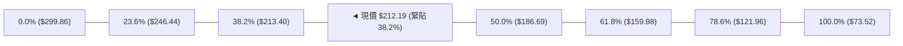

#### 斐波那契回調階梯表

| 回調比率 | 精確價位 | 技術意涵與當前相互作用解讀 |
|----------|----------|----------------------------|
| **0.0%** | **$299.86** | 52 週極限高點，牛市極限擴展位 |
| **23.6%** | **$246.44** | 強勢回檔位，股價重返此線上才具備重啟主升浪動能 |
| **38.2%** | **$213.40** | **現價 ($212.19) 完美吻合此處！** 標準弱勢回檔支撐線。若能於日線收盤站穩 $213.40，顯示回調幅度屬於健康修正範圍 |
| **50.0%** | **$186.69** | 多空均勻平衡位，7月收盤 $190.41 與 8月低點 $187.97 均精準在此獲得支撐，具極強彈性 |
| **61.8%** | **$159.98** | 黃金分割防守位，與 MA200 ($158.31) 形成堅定重合共振，為長線牛市不可跌破之極限 |
| **78.6%** | **$121.96** | 深幅修正位，若跌破象徵中期結構全面崩潰 |
| **100.0%** | **$73.52** | 52 週歷史起點 |

---

## 5. 技術指標深度解讀

### 🎛️ 指標訊號總覽

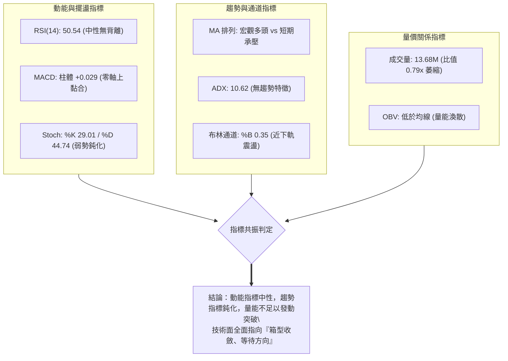

### 📈 移動平均線排列分析

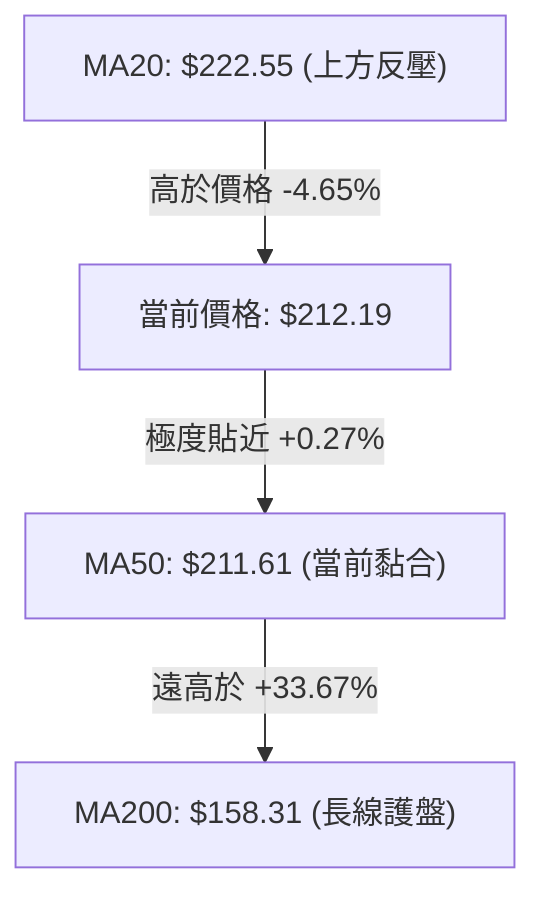

#### 均線各週期狀態解析

| 均線名稱 | 當前數值 | 與現價乖離 | 排列狀態 | 走勢特徵與技術解讀 |
|----------|----------|------------|----------|--------------------|
| **MA 5** | $229.82 | -7.67% | 空頭反壓 | 短線急速下拐，代表過去一週追價者全數套牢 |
| **MA 10** | $219.61 | -3.38% | 空頭反壓 | 短期滑落，壓抑短期反彈氣勢 |
| **MA 20** | $222.55 | -4.65% | 走平反壓 | 布林中軌，短線多空勝負線，未突破前短線偏空 |
| **MA 50** | $211.61 | +0.27% | 走平支撐 | 中期防守中樞，現價與其重合，多頭主力必守防線 |
| **MA 60** | $219.41 | -3.29% | 微幅向下 | 季線位置，壓制中期反撲空間 |
| **MA 120** | $199.47 | +6.38% | 穩定向上 | 半年線持續抬升，提供 S1 ($200.30) 強大均線支撐 |
| **MA 200** | $158.31 | +34.03% | 強勢上揚 | 年線牛熊分界，斜率維持陡峭向上，長牛基石穩固 |
| **MA 240** | $150.57 | +40.92% | 強勢上揚 | 超長期成本線，為長期下行提供終極安全網 |

### 📉 RSI(14) 分析

```
RSI(14) 數值儀表板：50.54
0% ─────── 30% ─────────────────── 50% ─── 70% ─────── 100%
[ 超賣區 ]  [      弱勢區      ]   ●   [  強勢區  ]  [ 超買區 ]
                                (50.54)
進度條：█████████████████████████░░░░░░░░░░░░░░░░░░░░ 50.54%
```

- **超買超賣判定**：數值 50.54 處於 30 至 70 之中性區間，不具備任何超買或超賣之擺盪極端值。
- **背離分析（Divergence）**：
  - **日線層面**：價格由 8 月 16 日週收盤 $277.68 回落至當前 $212.19，RSI 從 67.2 降至 50.54，價格走低伴隨指標走低，屬於**正常動能釋放**。
  - **週線層面**：檢視 6 月 21 日收盤 $286.69 時 RSI 為 65.3，8 月 16 日收盤 $277.68 時 RSI 為 67.2；隨後 9 月初反彈至 $226.39 時 RSI 驟降至 33.3，目前回升至 50.5。**無頂背離或底背離跡象**，動能與價格同向收斂。

### 📊 MACD(12/26/9) 訊號解讀

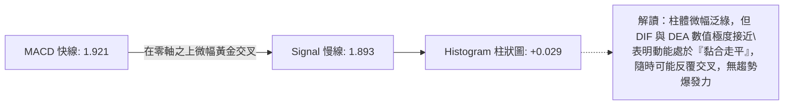

- **零軸關係**：DIF (1.921) 與 DEA (1.893) 均處於零軸上方，代表中期波段並未翻空，大方向仍受多頭大週期保護。
- **柱狀圖動態**：當前柱體為 +0.029，相較於 8 月中旬的大波段 +9.868，呈現顯著收窄，顯示上攻動能暫時退潮，處於指標休整期。

### 📦 布林通道分析

```
NBIS 布林通道位置示意圖 (寬度: $67.70)
$256.40 ────────────────────────────────────────── 布林上軌 (強阻力)
        │
$240.00 ┤
        │
$222.55 ────────────────────────────────────────── 布林中軌 (MA20 / 關鍵反壓)
        │    ● 當前價格: $212.19 (%B = 0.35)
$210.00 ┤
        │
$188.70 ────────────────────────────────────────── 布林下軌 (強支撐)
```

- **帶寬特徵**：上下軌距離為 $256.40 - $188.70 = $67.70，相較於 6 月至 8 月的擴張狀態，通道邊界正逐步收攏，暗示波動率正在沉澱。
- **現價位置**：%B 為 **0.35**，價格位於中軌之下、下軌之上，偏向弱勢半區。
- **通道軌道預測**：在 ADX 偏弱情況下，通道邊界具備強大支撐與壓制效應。下軌 $188.70 與 Fib 50% ($186.69) 共振，提供極強保護；中軌 $222.55 則為空方防線。

### 💹 成交量分析（量價配合度）

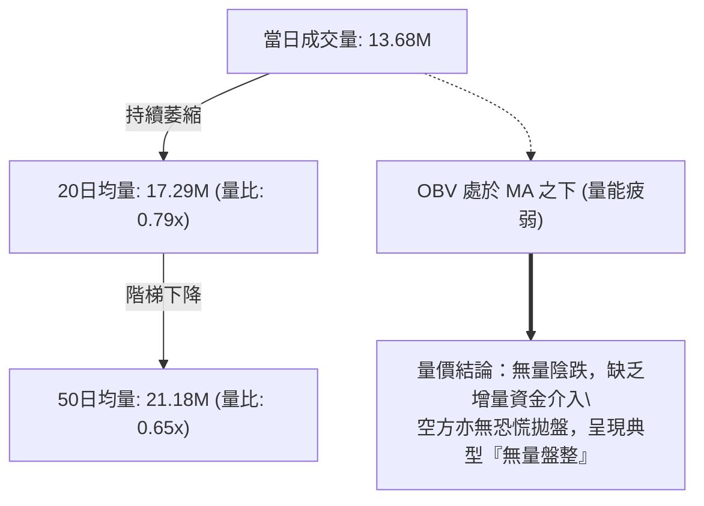

- **成交量趨勢**：最新成交量 13,684,600 股，顯著低於 20 日均量 (17.29M) 與 50 日均量 (21.18M)，成交量萎縮至波段均值的 65%-79%。
- **OBV 能量潮解讀**：OBV 指標持續在均線下方運行，說明資金淨流入動能減弱，屬於典型的縮量整理結構。在無巨量配合前，難以突破 R1 ($231.17)。

---

## 6. 動能與波動率

### ⚡ 動能評估四象限

```
動能與波動率矩陣分佈
─────────────────────────────────────────────────────────────
高動能 │  [Q3: 高風險突破區]      │  [Q1: 最佳多頭趨勢區]
       │  動能強 / 波動高         │  動能強 / 波動低
       │  (例: 2026年5月主升浪)    │  (暫無標的在此)
───────┼──────────────────────────┼──────────────────────────
低動能 │  [Q4: 震盪沉澱區] ★      │  [Q2: 築底收斂區]
       │  動能弱 / 波動中高       │  動能弱 / 波動收縮
       │  ★ NBIS 當前位置 ($212) │  (等待壓縮突破)
       └──────────────────────────┴──────────────────────────
           高波動率                   低波動率
─────────────────────────────────────────────────────────────
```

#### 動能與波動率評估表格

| 象限代號 | 動能強度 | 波動率狀態 | 當前狀態判定 | 交易決策與行動指引 |
|----------|----------|------------|--------------|--------------------|
| **Q1** | 強動能 | 低波動 | — | 最佳趨勢推進，適合重倉順勢做多 |
| **Q2** | 弱動能 | 低波動 | — | 窄幅盤整，等待量能突破信號 |
| **Q3** | 強動能 | 高波動 | — | 主升/主跌浪，高收益但需嚴設止損 |
| **Q4** | **弱動能 (ADX: 10.62)** | **中高波動 (ATR: 6.55%)** | **✓ NBIS 當前狀態** | **高波震盪中缺乏方向，謹防雙向洗盤，以區間高拋低吸為主** |

### 📊 ATR 波動率分析

- **當前 ATR(14)**：**$13.91**，佔當前股價之 **6.55%**。
- **波動特性**：NBIS 屬於典型之高貝他、高彈性 AI 基礎設施板塊標的，每日平均波動區間接近 $14 美元。
- **止損距離建議**：
  - 短線交易（波段）：建議預留 **1.5 倍 ATR** = $13.91 × 1.5 = **$20.87** 之緩衝。
  - 區間防守（隔夜）：建議預留 **2.0 倍 ATR** = $13.91 × 2.0 = **$27.82** 之緩衝，以防日內假突破掃損。

### 📐 Beta 與市場相關性

- **Beta 係數**：**1.436**。
- **市場敏感度**：相較於標普500指數，NBIS 具有 1.44 倍的放大效應。在美股大盤回調或科技股走弱時，該股下行波動較為劇烈；反之，在多頭回流時彈性亦大。
- **空頭部位壓力**：Short % of Float 高達 **19.2%**，Short Ratio 為 1.88。極高的空頭佔比意味著一旦股價放量突破 R1 ($231.17)，極易引發**軋空行情 (Short Squeeze)**；但在突破前，空頭籌碼構成了持續的上檔壓制。

---

## 7. 多時框架總結

### 📋 時框架評分表

| 時框架 | 趨勢方向 | 動能表現 | 均線排列狀況 | 形態特徵 | 綜合評分 | 操作建議 |
|--------|----------|----------|--------------|----------|----------|----------|
| **月線 (長期)** | 🟢 強烈看多 | 52W 漲幅巨大，RSI 位於高位偏強 | 遠高於 MA200 ($158.31) | 歷史多頭主升浪後的回檔消化 | **75/100** | 長線持有，分批回調建倉 |
| **週線 (中期)** | 🟡 寬幅震盪 | MACD 正負轉換頻繁，動能放緩 | MA20 走平，MA50 抬升支撐 | 雙頂壓制 ($286/$277) vs 箱底支撐 ($177) | **50/100** | 區間操作，嚴控持倉週期 |
| **日線 (短期)** | 🔴 偏弱整理 | RSI=50.54，ADX=10.62，量能萎縮 | 受制於 MA5/10/20，貼近 MA50 | 布林下半區橫盤收斂 | **42/100** | 觀望為主，等待下軌低吸 |

### 🔲 綜合訊號矩陣

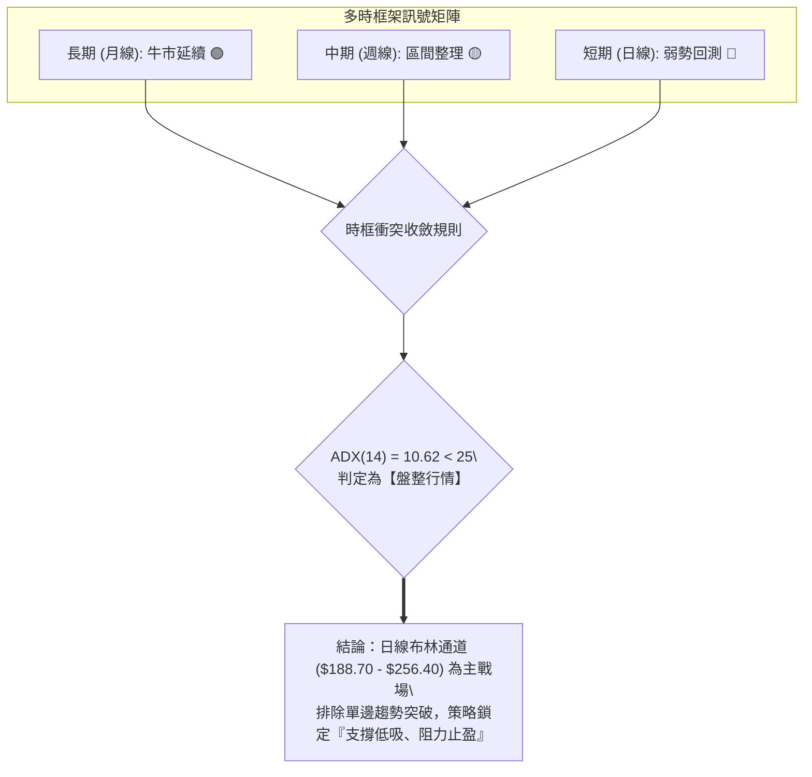

### ⚖️ 多時框收斂結論

依據【嚴格要求 14】之收斂規則：
1. 當前 ADX 數值為 **10.62 (< 25)**，明確定義為**盤整行情**。
2. 趨勢跟隨規則失效，長期多頭（月線）與短期弱勢（日線）之衝突，**由中期週線箱型與日線布林通道上下軌收斂解決**。
3. **唯一方向性結論**：**中性觀望，區間防守（偏多思維之震盪操作）**。
   - 宏觀牛市支撐未破，中期尚未跌破頸線 $177.71，但短期上方受制於 MA20 ($222.55) 與 R1 ($231.17)。
   - 不具備單邊做空條件，亦無追高做多基礎，主策略採取在靠近支撐位分批佈局之區間策略。

---

## 8. 交易策略建議

### 🗺️ 策略決策流程圖

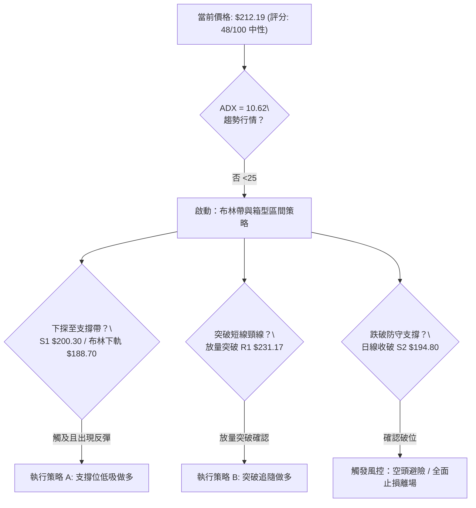

### 🧭 策略路由（依評分卡分流）

> **當前主策略方向 = 中性震盪區間操作（評分 48/100，40–60 區間）**  
> 指標顯示市場處於無趨勢之平衡期，策略核心為**以布林通道下軌與關鍵支撐為錨進行低吸，不追高，等待突破確認**。

---

### 🎯 價格情境階梯（Price Scenarios）

*所有價位完全引用第 4 章真實波段計算數據*

| 觸發條件 | 第一目標 | 第二目標 | 後續延伸 | 情境技術含義 |
|----------|----------|----------|----------|--------------|
| **強勢放量突破 R1 ($231.17)** | R2 ($279.83) | R3 ($299.86) | 歷史高點突破 | 擺脫盤整，短線轉強，空頭回補軋空行情爆發 |
| **守住現價區間 ($211.61 - $213.40)** | MA20 ($222.55) | R1 ($231.17) | — | 維持在中軌至 Fib 38.2% 間窄幅整理 |
| **跌破 S1 ($200.30) / S2 ($194.80)** | 布林下軌 ($188.70) | S3 ($164.31) | MA200 ($158.31) | 區間下破，中期轉弱，回測年線終極支撐 |

### 📊 情境機率分佈

```
情境機率分布圖
區間震盪整理 (40–60區間)  ████████████████████████████████  55%
向上突破 R1 / 軋空反彈     ███████████████                 25%
向下破位 / 探底 S2-S3      ████████████                    20%
```

| 預測情境 | 發生機率 | 主要技術依據 |
|----------|----------|--------------|
| **情境一：區間震盪** | **55%** | ADX 僅 10.62 趨勢極弱；量能萎縮至 0.79x；RSI 位於 50.54 多空完全平衡。 |
| **情境二：向上反彈** | **25%** | 日線 MACD 維持微幅金叉 (+0.029)；MA50 ($211.61) 力守未失；空頭佔比達 19.2% 具潛在軋空動能。 |
| **情境三：向下破位** | **20%** | 短均線呈空頭反壓；OBV 跌破均線；-DI (32.06) 略高於 +DI (29.93)。 |

---

### 🟢 主策略詳情（方向：區間防守與突破跟進）

*嚴格遵循技術數據計算所得之點位，不捏造無依據之數值*

| 策略要素 | 策略 A：區間低吸策劃（左側偏多） | 策略 B：突破追隨策劃（右側確認） |
|----------|----------------------------------|----------------------------------|
| **進場條件** | 價格回踩 S1 與 S2 區間，收出下影線企穩 | 日線實體收盤放量突破 R1 阻力位 |
| **進場價格** | **$195.00**（貼近 S2 $194.80 與布林下軌） | **$232.00**（突破 R1 $231.17 確認後） |
| **止損價格** | **$185.00**（跌破 Fib 50% $186.69 止損） | **$218.00**（跌回 MA20 $222.55 之下止損） |
| **目標價 T1** | **$222.55**（布林中軌 / MA20） | **$262.04**（箱型突破形態測幅目標） |
| **目標價 T2** | **$231.17**（箱型頂部阻力 R1） | **$279.83**（波段強阻力 R2） |
| **風險報酬比** | **1 : 2.75** (風險 $10 / T1獲利 $27.55) | **1 : 2.15** (風險 $14 / T1獲利 $30.04) |
| **成功機率** | **65%** | **50%** (需伴隨成交量突破) |
| **建議倉位** | **15%** (分批佈局) | **10%** (追隨建倉) |

### 🔴 反向風險觸發點（對沖提示）

- **全面轉空停損線**：若日線收盤價跌破 **$194.80 (S2)**，且次日未能收復，宣告區間防守失敗，多頭主策略全部終止。
- **做空/對沖觸發條件**：若股價無量反彈至 **$231.17 (R1)** 遭遇長上影線拒絕，短線交易者可考慮輕倉配置看跌期權對沖現貨多頭，止損設於 $235.00，目標看回 $200.30。

### ⭐ 整體訊號強度評星

```
╔══════════════════════════════════════════════════════════════╗
║ 做多訊號強度：  ★★☆☆☆  (2.5/5 星 - 缺乏量能與趨勢確認)     ║
║ 做空訊號強度：  ★★☆☆☆  (2.0/5 星 - 下方均線支撐密集)       ║
║ 整體可信度：    ★★★☆☆  (3.5/5 星 - 區間邊界清晰，可操作性高) ║
╚══════════════════════════════════════════════════════════════╝
```

---

## 9. 風險提示與監控

### ✅ 關鍵監控指標 Checklist

```
╔══════════════════════════════════════════════════════════════╗
║                每日盤後關鍵技術監控 Checklist                 ║
╠══════════════════════════════════════════════════════════════╣
║ [ ] 價格防線：收盤價是否跌破 MA50 ($211.61) 與 S1 ($200.30)  ║
║ [ ] 突破確認：收盤價是否放量突破 MA20 ($222.55) 與 R1 ($231)║
║ [ ] 動能警戒：日線 MACD 柱狀體是否由正轉負 (當前 +0.029)     ║
║ [ ] 趨勢甦醒：ADX(14) 是否由 10.62 向上拐頭突破 20           ║
║ [ ] 成交量能：日成交量是否回升突破 20 日均量 (17.29M)        ║
║ [ ] 軋空動向：Short Interest 變化，是否出現空頭回補爆量      ║
╚══════════════════════════════════════════════════════════════╝
```

### ⚠️ 風險場景分析

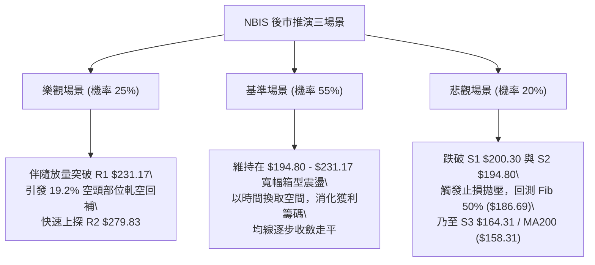

### 🛡️ 風險管理重要提醒

1. **波動率緩衝**：NBIS 的日 ATR 高達 $13.91 (6.55%)，禁止使用過窄的止損點（例如 2-3%），極易被日常隨機波動掃損出場。
2. **籌碼風險控管**：高達 19.2% 的空頭浮額是一把雙面刃，一旦盤面出現系統性回調，空方可能加碼施壓；一旦利好催化則可能暴拉。部位規模應控制在總資金的 **10% - 15%** 以內。
3. **多時框紀律**：當前 ADX 處於極低水平 (10.62)，**絕不可在區間中軸 ($212-$222) 進行追價交易**，必須秉持「接近邊界才動手」的紀律。

---

## 📋 報告總結

```
╔══════════════════════════════════════════════════════════════╗
║                   NBIS 技術分析報告總結                      ║
╠══════════════════════════════════════════════════════════════╣
║ 報告日期：2026-09-15                                         ║
║ 當前價格：$212.19                                            ║
║ 分析評級：⚖️ 區間震盪整理（中性觀望，等待突破）              ║
╠══════════════════════════════════════════════════════════════╣
║ 關鍵結論：                                                   ║
║ ├─ 長期趨勢：🟢 強烈看多（高於 MA200 $158.31 達 34%，宏觀健康）║
║ ├─ 中期趨勢：🟡 寬幅箱型（$188 - $286 大區間拉鋸）           ║
║ ├─ 短期趨勢：🔴 弱勢回測（跌破短均線，下測 MA50 $211.61）    ║
║ ├─ 關鍵支撐：S1: $200.30 ｜ S2: $194.80 ｜ S3: $164.31       ║
║ ├─ 關鍵阻力：R1: $231.17 ｜ R2: $279.83 ｜ R3: $299.86       ║
║ └─ 分析師目標價：均價 $290.71 (最高 $415.00 / 最低 $144.00)  ║
╠══════════════════════════════════════════════════════════════╣
║ 最優策略組合：                                               ║
║ 1. 🥇 最佳機會：於 S2 $194.80 附近低吸，停損 $185，看 $222   ║
║ 2. 🥈 次選機會：突破 R1 $231.17 後右側追隨，停損 $218，看 $262 ║
║ 3. 🥉 保守選擇：在 ADX < 25 期間空倉觀望，等待日線方向明確   ║
╚══════════════════════════════════════════════════════════════╝
```

---

> ⚠️ **免責聲明**：本報告為技術分析研究成果，所有數據、圖表及推演均基於市場歷史價格與交易量數據。本報告**僅供學術研究與參考**，**不構成任何要約、招攬或投資建議**。市場有風險，交易需獨立判斷並自負盈虧。

---

*報告生成時間：2026-09-15 ｜ 數據來源：Yahoo Finance ｜ 分析框架：多時框架技術分析與量化動能模型*