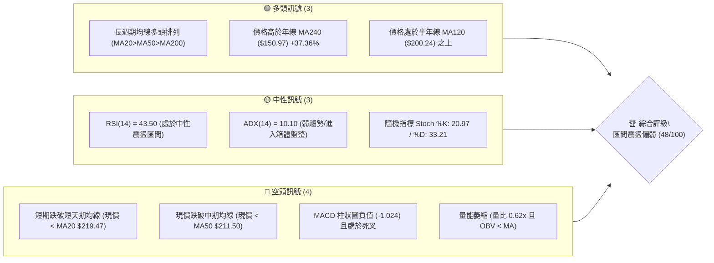
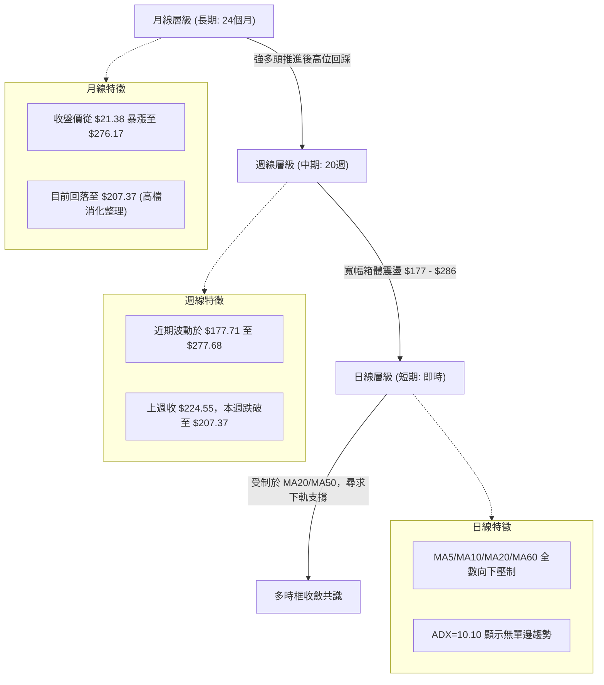
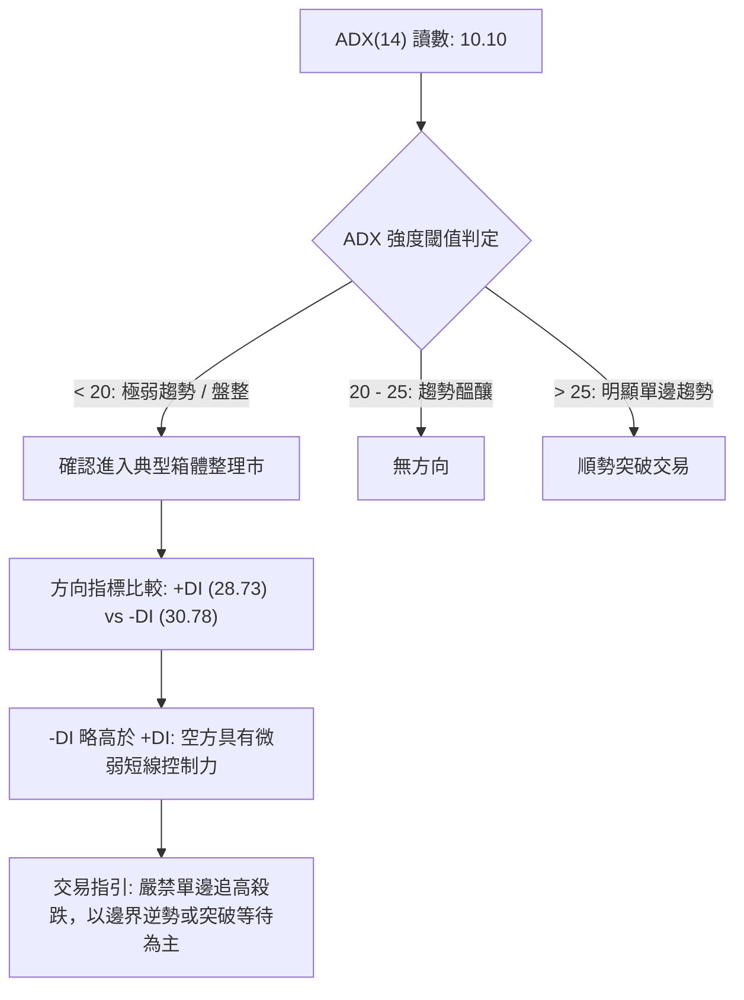
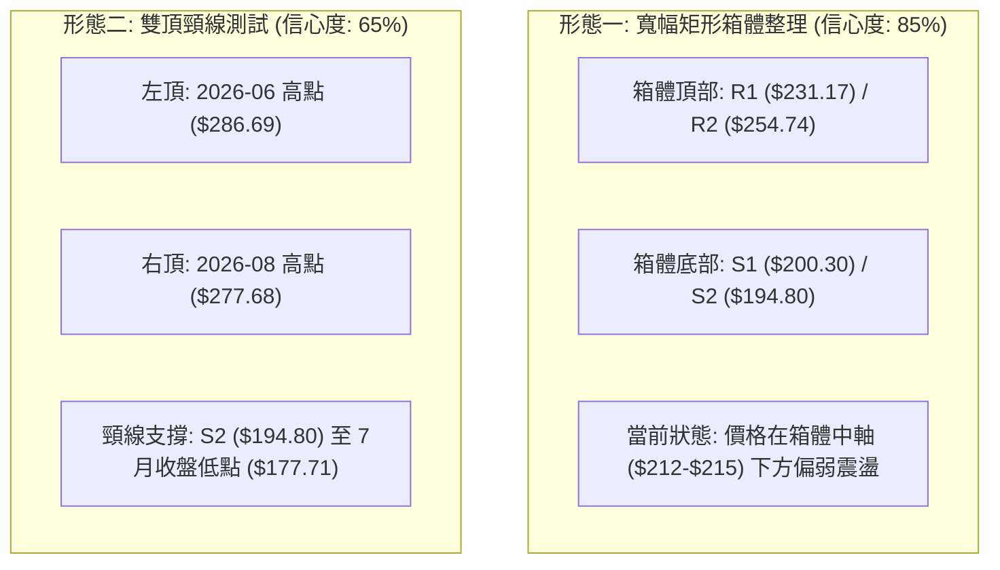
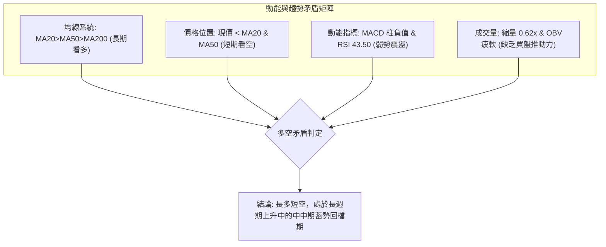
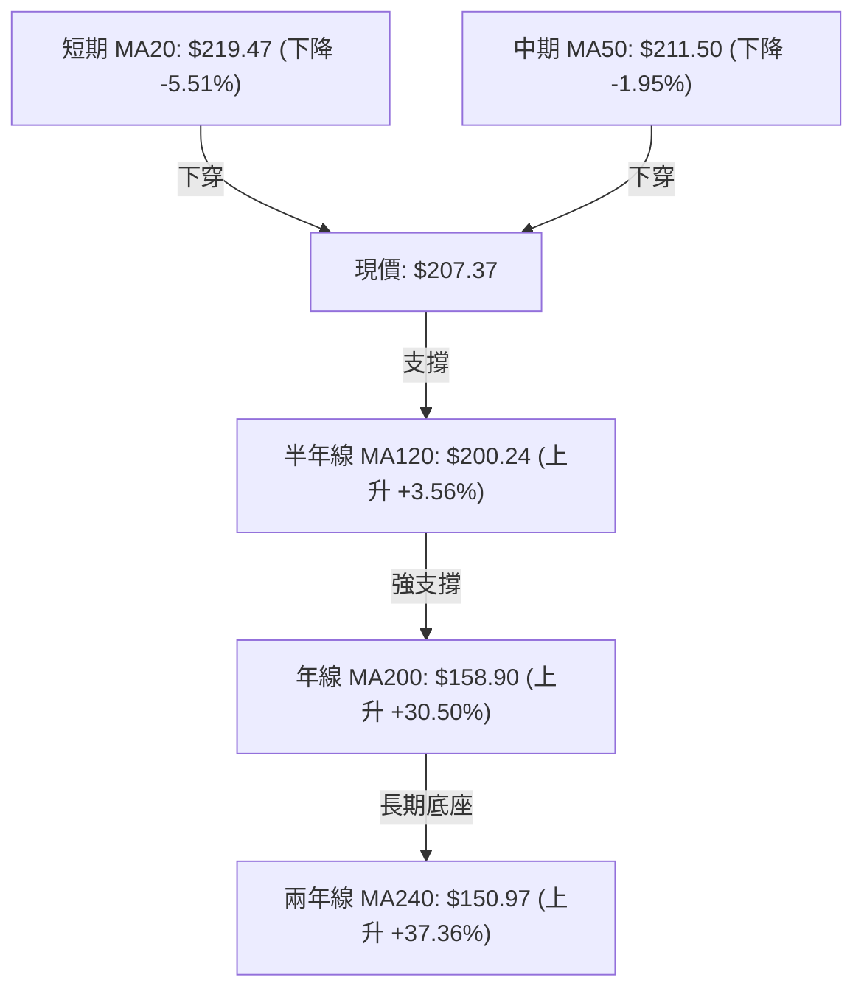
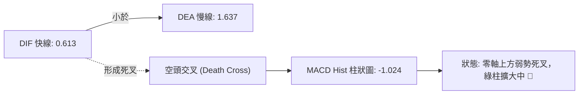
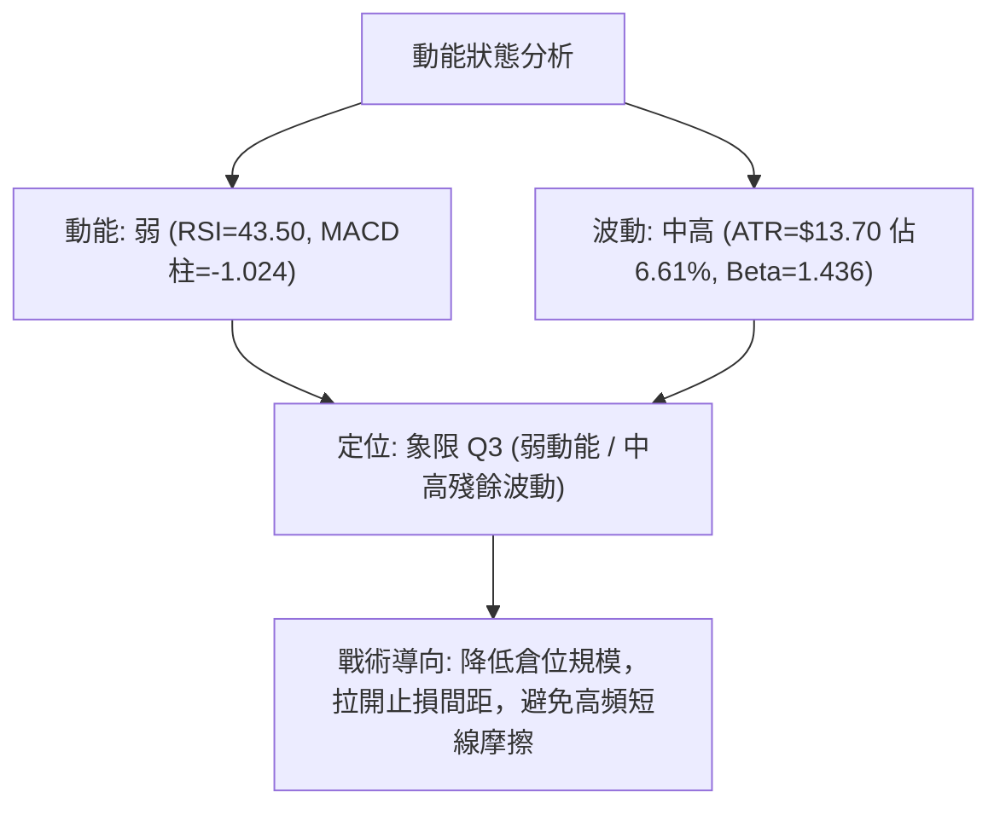
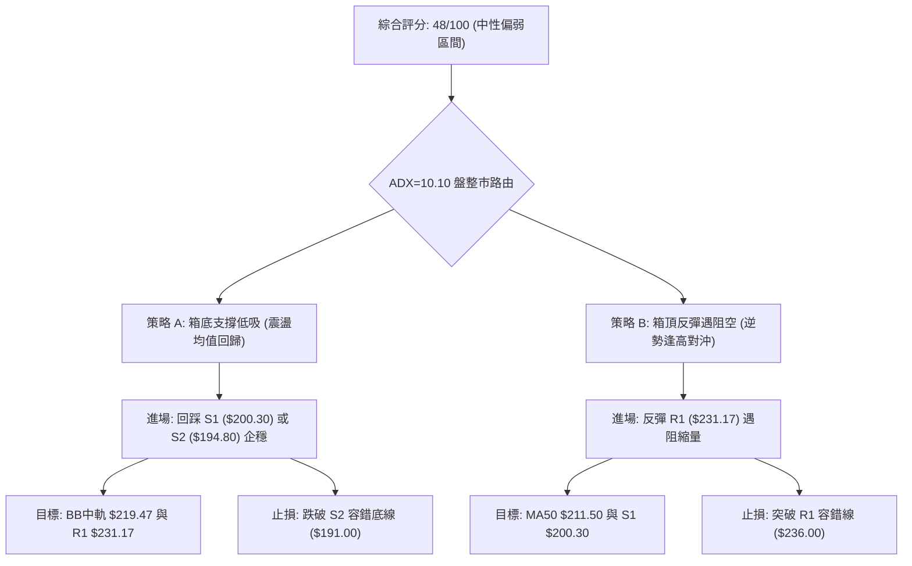
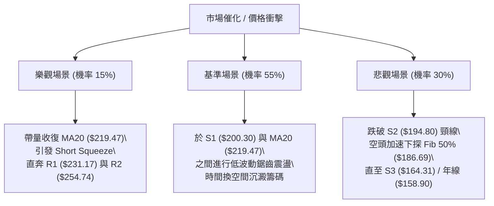

# NBIS 技術分析報告

> **報告日期**：2026-09-16 ｜ **語言**：繁體中文 ｜ **數據來源**：Yahoo Finance ｜ **當前價格**：$207.37

---

## 目錄

| 章節 | 內容 |
|------|------|
| [1. 技術面概覽](#1-技術面概覽) | 訊號儀表板、核心指標、評分卡 |
| [2. 趨勢分析](#2-趨勢分析) | 多時框趨勢、長中短期走勢、ADX解讀 |
| [3. 圖表形態分析](#3-圖表形態分析) | 形態識別、K線組合、目標價計算 |
| [4. 支撐與阻力](#4-支撐與阻力) | 關鍵價位、斐波那契回調結構 |
| [5. 技術指標深度解讀](#5-技術指標深度解讀) | MA/RSI/MACD/布林/成交量/OBV |
| [6. 動能與波動率](#6-動能與波動率) | 動能評估四象限、ATR、Beta量化 |
| [7. 多時框架總結](#7-多時框架總結) | 時框架評分矩陣與收斂結論 |
| [8. 交易策略建議](#8-交易策略建議) | 策略路由、主策略、情境機率階梯 |
| [9. 風險提示與監控](#9-風險提示與監控) | 監控指標Checklist、風險情境路徑 |

---

## 1. 技術面概覽

### 🎯 技術訊號儀表板



### 📊 核心指標速覽表

| 指標類別 | 指標名稱 | 當前數值 | 訊號 | 解讀 |
|----------|----------|----------|------|------|
| **價格** | 當前收盤價 | $207.37 | 🟡 | 位於52週區間 59.1% 位置，自歷史高位顯著修正 |
| **均線** | MA20 (月線) | $219.47 | 🔴 | 現價低於 MA20 (-5.51%)，短期動能承壓 |
| **均線** | MA50 (季線) | $211.50 | 🔴 | 現價低於 MA50 (-1.95%)，跌破中期多空防守線 |
| **均線** | MA200 (年線)| $158.90 | 🟢 | 現價高於 MA200 (+30.50%)，長期牛市基底未破 |
| **動能** | RSI(14) | 43.50 | 🟡 | 處於 40–50 偏弱中性區間，未見超賣或極端背離 |
| **動能** | MACD (12/26/9)| Hist -1.024 | 🔴 | 快線 0.613 低於慢線 1.637，柱狀圖持續處於零軸下方 |
| **趨勢** | ADX (14) | 10.10 | 🟡 | 趨勢強度極弱 (<25)，市場進入典型的低動能盤整期 |
| **通道** | 布林通道 %B | 0.27 | 🟡 | 位於中軌 ($219.47) 與下軌 ($192.95) 之間，偏向弱勢區 |
| **量能** | 成交量 / 20日均量 | 0.62x | 🔴 | 日量 10.42M 顯著低於20日均量 16.83M，OBV 疲軟 |
| **波動** | ATR(14) | $13.70 | 🟡 | 佔股價 6.61%，每日絕對波動幅度依然可觀 |

### 🏆 技術評分卡

```
╔══════════════════════════════════════════════════════════════════╗
║              技術評分卡 — NBIS (2026-09-16)                     ║
╠══════════════════════════════════════════════════════════════════╣
║ 趨勢強度 (Trend)      ████░░░░░░░░░░░░░░░░  20/100  🔴 極弱盤整   ║
║ 動能指標 (Momentum)   ████████░░░░░░░░░░░░  40/100  🟡 空方微佔優 ║
║ 支撐穩定度 (Support)  ██████████████░░░░░░  70/100  🟢 S1/S2穩固  ║
║ 成交量配合 (Volume)   ██████░░░░░░░░░░░░░░  30/100  🔴 嚴重縮量   ║
║ 形態完整度 (Pattern)  ████████████░░░░░░░░  60/100  🟡 寬幅箱體   ║
║ 均線排列 (Moving Avg) ██████████████░░░░░░  70/100  🟢 長期多頭   ║
╠══════════════════════════════════════════════════════════════════╣
║ 綜合評分              █████████░░░░░░░░░░░  48/100  🟡 中性觀望   ║
╚══════════════════════════════════════════════════════════════════╝
```

---

## 2. 趨勢分析

### 🌐 多時框趨勢分析



### 📈 長期趨勢 — 12個月走勢圖（Unicode）

```
NBIS 月線收盤走勢圖（2025-10 至 2026-09）
價格軸 ($)
$300 ┤                                                     
$275 ┤                                         ● $276.17 (06月高點)
$250 ┤                                        / \          
$225 ┤                                  ● $231.09 \        ● $206.32
$200 ┤                                 /           \  ● $190.41 \
$175 ┤                                /             \/           ● $207.37 (現價)
$150 ┤                  ● $138.23    /                             
$125 ┤ ● $130.82       /            /                              
$100 ┤   \   ● $94.87 / ● $103.76  /                               
 $75 ┤    \ /        ● $91.19                                      
 $50 ┤     ● $83.71 (12月低點)                                     
     └─────┬─────┬─────┬─────┬─────┬─────┬─────┬─────┬─────┬─────┬─────┬─────
         25-10 25-11 25-12 26-01 26-02 26-03 26-04 26-05 26-06 26-07 26-08 26-09
```

#### 長期走勢特徵分析表格

| 階段區間 | 起止月份 | 價格變化 ($) | 區間漲跌幅 | 走勢特徵與結構意涵 |
|----------|----------|--------------|------------|--------------------|
| **第 I 階段：衝高回落** | 2025-10 → 2025-12 | $130.82 → $83.71 | -36.01% | 歷經2025年9月翻倍暴漲後的獲利了結回檔，探底尋找支撐。 |
| **第 II 階段：築底蓄勢** | 2025-12 → 2026-02 | $83.71 → $91.19 | +8.94% | 於 $83–$91 區間構築雙底形態，浮額充分洗刷，成交量收縮。 |
| **第 III 階段：主升暴發**| 2026-02 → 2026-06 | $91.19 → $276.17 | +202.85% | 伴隨 AI 全棧基礎設施營收年增 454% 基本面引爆，進入強勢主升浪。 |
| **第 IV 階段：高檔震盪**| 2026-06 → 2026-09 | $276.17 → $207.37 | -24.91% | 自 52 週高點 $299.86 劇烈修正後，於 $190–$230 區間建立寬幅箱體。 |

### 📊 中期趨勢（週線分析）

從近 20 週數據觀察，週線格局表現為「巨幅擴張後的收斂三角形/箱體整理」：
1. **波段高點受阻**：2026-06-21 收於 $286.69，2026-08-16 再次反彈衝擊至 $277.68，均在近一年波段高點聚類阻力區 R3 ($279.83) 附近遇阻回落，形成中期雙頂壓制形態。
2. **波段低點支撐**：2026-07-19 最低探至收盤 $177.71，2026-07-26 收盤 $187.77，隨後 2026-08-02、2026-08-09 連續在 $187–$190 企穩，該區域與斐波那契 50.0% 回調位 ($186.69) 以及近一年波段低點聚類 S2 ($194.80) 高度契合，展現強大承接力道。
3. **當前週線狀態**：最新一週收盤 $207.37，週 RSI 回落至 43.5，週 MACD 柱狀圖轉為負值 (-1.024)，週成交量萎縮至 24,147,400 股，反映中期買盤進攻意願轉弱，籌碼進入沉澱期。

### ⚡ 趨勢強度評估（ADX 解讀）



#### ADX 強度與市場狀態對照表

| 指標 | 數值 | 狀態級別 | 技術意涵 |
|------|------|----------|----------|
| **ADX(14)** | **10.10** | 弱趨勢 / 盤整 (極低值) | 低於 20 基準線，表明過去數週的趨勢完全瓦解，單邊動能停滯。 |
| **+DI (14)** | **28.73** | 中等強度 | 多頭仍保有些許能量，未出現全面性恐慌性拋售。 |
| **-DI (14)** | **30.78** | 中等偏強 | 空頭稍佔優勢，但兩者差值僅 2.05，未達單邊趨勢標準 (>10)。 |
| **趨勢研判結論** | **無趨勢盤整** | **布林通道與箱體主導** | **依多時框收斂規則：ADX<25 時，趨勢指標失效，震盪指標主導。** |

---

## 3. 圖表形態分析

### 🔍 形態識別系統



#### 形態識別與信心度評估表

| 形態名稱 | 信心度 | 判斷依據（引用數據） | 完成度 | 目標價（附嚴格計算式） |
|----------|--------|----------------------|--------|------------------------|
| **寬幅矩形箱體** | **85%** | 上軌聚類於近一年高點 R1 $231.17 與 R2 $254.74；下軌受近一年低點 S1 $200.30 與 S2 $194.80 多次驗證。 | 75% | 箱頂突破目標 = $231.17 + ($231.17 - $194.80) = **$267.54**<br>箱底跌破目標 = $194.80 - ($231.17 - $194.80) = **$158.43** (接近 MA200) |
| **中期次級雙頂** | **65%** | 2026-06-21 收盤 $286.69 與 2026-08-16 收盤 $277.68 形成潛在雙頂，中間低點 2026-07-19 為 $177.71。 | 60% (未跌破頸線) | 若有效跌破頸線 $177.71：<br>形態目標 = $177.71 - ($286.69 - $177.71) = **$68.73** (若破則看52W低點附近) |
| **布林通道中下軌收縮** | **90%** | 指標型形態：帶寬由放大轉收縮，%B 降至 0.27，價格貼近下軌 $192.95。 | 90% | 均值回歸目標 = BB中軌 **$219.47** |

### 🕯️ 重要K線形態分析（近 6 個月關鍵月線）

| 月份 | 收盤價 | K線形態 | 專業技術解讀 | 訊號 |
|------|--------|---------|--------------|------|
| **2026-04** | $138.23 | 大陽線 (突破型) | 實體大陽線脫離底部區，突破多根長期均線，主升浪啟動信號。 | 🟢 強烈買入 |
| **2026-05** | $231.09 | 長陽奔馳 (擴張型) | 漲幅達 +67.18%，量能急遽放大，呈現單邊爆發攻擊。 | 🟢 多頭續抱 |
| **2026-06** | $276.17 | 衝高避雷針 (放量滯漲) | 盤中創 52W 高點 $299.86 後收盤回落至 $276.17，留下影線，獲利盤出逃。 | 🟡 警惕出頂 |
| **2026-07** | $190.41 | 長陰反噬 (洗盤型) | 單月重挫 -31.05%，直接回補過度投機溢價，測試 50% 回調位。 | 🔴 弱勢空頭 |
| **2026-08** | $206.32 | 縮量十字星 / 小陽線 | 價格在 $190–$206 企穩，空方動能減弱，買賣雙方重構平衡。 | 🟡 震盪築底 |
| **2026-09** | $207.37 | 窄幅整理 (當前K線) | 波動率顯著收斂，成交量比驟降至 0.62x，市場等待新的基本面催化劑。 | 🟡 觀望等待 |

### 📉 ASCII 走勢形態示意圖（箱體震盪與均線壓制）

```
NBIS 箱體結構與均線壓制示意圖
價格軸 ($)
$254.74 ┼─────────────────────────────────────────────阻力 R2 (箱體延伸區)
        │
$231.17 ┼───────────────────┬─────────────────────────阻力 R1 (箱頂頸線)
        │                  / \      /\
$219.47 ┼──[MA20/BB中軌]──/───\────/──\────────────────短期壓制線
        │                /     \  /    \
$211.50 ┼──[MA50]───────/───────\/──────\───●──────────中期壓制線 ($207.37 現價)
        │              /                  \ /
$200.30 ┼─────────────●────────────────────●────────────支撐 S1 (近期波段低點)
        │            /                      \
$194.80 ┼───────────●────────────────────────●──────────支撐 S2 (強支撐底線)
        │          /                          \
$164.31 ┼─────────/────────────────────────────●────────支撐 S3 (MA200 長期防線)
        └─────────┴────────────────────────────┴─────────
```

### 🎯 形態目標價計算

根據寬幅箱體形態 ($194.80 – $231.17)，計算相關理論量測目標：
1. **箱體垂直高度 ($H$)**：
   $$H = \text{箱頂 } R1 - \text{箱底 } S2 = \$231.17 - \$194.80 = \$36.37$$
2. **向上有效突破目標價 ($Target_{Up}$)**：
   $$Target_{Up} = R1 + H = \$231.17 + \$36.37 = \$267.54$$
   *(註：此目標價高於 R2 $254.74，位於 R2 與 R3 $279.83 之間)*
3. **向下有效跌破目標價 ($Target_{Down}$)**：
   $$Target_{Down} = S2 - H = \$194.80 - \$36.37 = \$158.43$$
   *(註：此跌破目標價極度接近 200 日均線 MA200 的 \$158.90，具有高度技術自洽性)*

---

## 4. 支撐與阻力

### 🗺️ 關鍵價位分布圖（Unicode）

```
NBIS 價位結構分布圖（OHLCV 精確計算）
══════════════════════════════════════════════════════════════════
$299.86 ║                                                ║ 52週歷史高點 (0.0% Fib)
$279.83 ║████████████████████████████████████████████████║ 強阻力 R3 (+34.94%)
$254.74 ║████████████████████████████████████            ║ 次級阻力 R2 (+22.84%)
$246.44 ║▓▓▓▓▓▓▓▓▓▓▓▓▓▓▓▓▓▓▓▓▓▓▓▓▓▓▓▓▓▓                  ║ 斐波那契 23.6% 回調位
$231.17 ║████████████████████████████████████████████████║ 關鍵阻力 R1 (+11.48%)
$219.47 ║------------------------------------------------║ BB中軌 / MA20
$213.40 ║▓▓▓▓▓▓▓▓▓▓▓▓▓▓▓▓▓▓▓▓▓▓▓▓▓▓▓▓                    ║ 斐波那契 38.2% 回調位
$207.37 ╠════════════════════════════════════════════════╣ ◄ 現價位置 (BB %B = 0.27)
$200.30 ║████████████████████████████                    ║ 近期支撐 S1 (-3.41%)
$194.80 ║████████████████████████████████████████        ║ 強支撐 S2 (-6.06%)
$186.69 ║▓▓▓▓▓▓▓▓▓▓▓▓▓▓▓▓▓▓▓▓▓▓▓▓▓▓▓▓▓▓▓▓▓▓              ║ 斐波那契 50.0% 回調位
$164.31 ║████████████████████████████████████████████████║ 長期強支撐 S3 (-20.76%)
$158.90 ║------------------------------------------------║ 牛熊分水嶺 MA200
$121.96 ║▓▓▓▓▓▓▓▓▓▓▓▓                                    ║ 斐波那契 78.6% 回調位
$73.52  ║                                                ║ 52週歷史低點 (100.0% Fib)
══════════════════════════════════════════════════════════════════
```

### 🚧 阻力位分析表

| 阻力級別 | 價位 ($) | 距離現價 | 形成原因（依 OHLCV 聚類） | 突破難度 | 技術重要性 |
|----------|----------|----------|--------------------------|----------|------------|
| **R1** | **$231.17** | +11.48% | 近一年波段高點聚類；2026-05月收盤價 $231.09 處形成的籌碼沉澱區。 | 🟡 中等 | ★★★★☆<br>箱頂關鍵分水嶺，站穩方能重啟多頭走勢。 |
| **R2** | **$254.74** | +22.84% | 近一年次級反彈高點聚類；介於 Fib 23.6% ($246.44) 上方之成交密集套牢區。 | 🔴 困難 | ★★★☆☆<br>前期套牢籌碼解套壓力區。 |
| **R3** | **$279.83** | +34.94% | 2026-06-21 ($286.69) 與 2026-08-16 ($277.68) 兩次衝頂形成的波段高點天花板。 | 🔴 極高 | ★★★★★<br>歷史雙頂結構，未有天量配合極難逾越。 |

### 🛡️ 支撐位分析表

| 支撐級別 | 價位 ($) | 距離現價 | 形成原因（依 OHLCV 聚類） | 守住機率 | 技術重要性 |
|----------|----------|----------|--------------------------|----------|------------|
| **S1** | **$200.30** | -3.41% | 近一年波段低點聚類；整數心理關卡，與半年線 MA120 ($200.24) 形成共振支撐。 | 70% | ★★★★☆<br>短線多空分界線，失守將考驗箱體底。 |
| **S2** | **$194.80** | -6.06% | 近一年波段核心低點聚類；布林帶下軌 ($192.95) 與 7-8 月週線築底密集成交區。 | 80% | ★★★★★<br>中期箱體底邊界，跌破則箱體結構遭到破壞。 |
| **S3** | **$164.31** | -20.76% | 近一年波段深次回調低點聚類；接近 MA200 ($158.90) 與 Fib 61.8% ($159.98)。 | 90% | ★★★★★<br>長期多頭生命線，多方最後防禦陣地。 |

### 📐 斐波那契回調位分析

依據 52 週絕對極值區間（低點 $73.52 至 高點 $299.86，總跨度 $226.34）分析：
- **0.0% (52W High)**: **$299.86**
- **23.6%**: **$246.44**（強阻力 R2 關鍵緩衝區）
- **38.2%**: **$213.40**
- **50.0%**: **$186.69**（強支撐 S2 關鍵防護墊）
- **61.8%**: **$159.98**（黃金分割關鍵位，與 MA200 $158.90 高度重合）
- **78.6%**: **$121.96**
- **100.0% (52W Low)**: **$73.52**

> **現價位置解讀**：
> 當前收盤價 **$207.37** 精確座落於 **38.2% 回調位 ($213.40)** 與 **50.0% 回調位 ($186.69)** 之間。在技術結構上，此處屬於「典型牛市回撤的中樞平衡區」。價格目前承壓於 38.2% 回調位之下（-2.83%），若不能迅速收復 $213.40，行情勢必將向下回測 50.0% 關鍵中軸 $186.69 及波段支撐 S2 ($194.80)。

---

## 5. 技術指標深度解讀

### 🎛️ 指標訊號總覽



### 📈 移動平均線排列分析



#### 均線各週期狀態與多空含義

| 均線名稱 | 數值 ($) | 與現價偏差 | 20日走勢斜率 | 技術信號 | 解讀與操作指引 |
|----------|----------|------------|--------------|----------|----------------|
| **MA5**  | $222.51  | -6.81%     | ▁▂▂▂▁▁▂▃▅▇█ | 🔴 空頭壓制 | 極短線快速下彎，構成每日動態第一反彈賣壓。 |
| **MA10** | $219.71  | -5.62%     | ▁▁▁▁▁▁▃▄▅▆ | 🔴 空頭壓制 | 與 MA20 形成死叉聚結，阻礙反彈動能。 |
| **MA20** | $219.47  | -5.51%     | ▁▁▁▁▁▁▁▂▃▄ | 🔴 空頭壓制 | 月線扣抵高位，短期趨勢轉空，為布林中軌。 |
| **MA50** | $211.50  | -1.95%     | ▃▄▄▄▃▃▄▅▆▇ | 🔴 跌破防守 | 季線失守，確認中期進入調整行情。 |
| **MA120**| $200.24  | +3.56%     | ▁▁▁▁▁▂▂▂▃▃ | 🟢 支撐良好 | 半年線持續向上傾斜，與 S1 ($200.30) 形成密集托底。 |
| **MA200**| $158.90  | +30.50%    | ▁▁▁▁▂▂▂▃▃▃ | 🟢 牛市基石 | 年線遠在現價下方，長期多頭格局完全未變。 |

### 📉 RSI(14) 分析

```
RSI(14) 當前數值: 43.50
[0] ─────────── [30] ──────●────── [70] ─────────── [100]
      超賣區          43.50 (弱勢區)        超買區
進度條: █████████░░░░░░░░░░░ 43.50%
```

- **背離判斷**：
  - **頂背離**：2026-06 週線收盤 $286.69 時 RSI 為 65.3，隨後 2026-08 週線反彈收盤至 $277.68 時 RSI 達到 67.2，未出現典型頂背離，屬於量價自然衰竭。
  - **底背離**：2026-07-12 低點收盤 $219.65 時 RSI 為 32.2，隨後 2026-07-19 跌至 $177.71 時 RSI 反升至 34.8，曾出現過一次中級「底背離」，推動了 8 月中旬向 $277.68 的猛烈反彈。
  - **當前狀態**：日線數據中未偵測到底背離或頂背離，數值自 52.4 回落至 43.50，屬於在 40–50 中軸下方的弱勢常規震盪，無極端反轉徵兆。

### 📊 MACD(12/26/9) 訊號解讀



- **MACD 解讀**：快線 DIF (0.613) 跌破慢線 DEA (1.637)，柱狀圖讀數為 **-1.024**。儘管雙線均仍在零軸上方（長週期偏多殘餘），但負向柱狀圖持續擴展，說明空頭回調動能仍未釋放完畢，短期切勿盲目抄底。

### 📦 布林通道分析

```
NBIS 布林通道 (20, 2) 結構圖
$245.99 ┼──────────────────────────────── 上軌 (Upper Band)
        │
$219.47 ┼──────────────────────────────── 中軌 (MA20 Middle Band)
        │
$207.37 ┼───────────────●──────────────── 現價 (Current Price) 位於 %B = 0.27
        │
$192.95 ┼──────────────────────────────── 下軌 (Lower Band)
```

- **通道帶寬與形態解讀**：
  - 上軌為 **$245.99**，中軌為 **$219.47**，下軌為 **$192.95**。
  - 當前通道寬度帶為 $53.04 (帶寬約 24.1%)，自 6–7 月的高波動帶寬中逐漸收斂。
  - 現價位於 **%B = 0.27**，處於典型的「弱勢區間（0.2 – 0.5）」。根據盤整市場（ADX<25）運行規律，價格在未實質跌破下軌 $192.95 之前，通道下軌通常具備顯著的均值回歸牽引力。

### 💹 成交量分析（量價配合度）

- **量能萎縮顯著**：最新成交量僅 **10,422,300 股**，對比 20 日均量 16,830,765 股，量比僅為 **0.62x**；若對比 50 日均量 21,087,196 股，縮量更達 50.6%。
- **OBV（能量潮）走勢**：數據確認 `OBV趨勢: OBV < MA → 量能疲弱`。能量潮跌破其均線，代表在近期的回檔震盪中，主動性資金並未大舉逢低吸納，成交量能未能對價格反彈提供量能支撐。縮量回調一方面顯示拋壓有限，但另一方面也印證了缺乏多頭增量資金引領向上突破。

---

## 6. 動能與波動率

### ⚡ 動能評估四象限

| 象限 | 動能維度 (Momentum) | 波動率維度 (Volatility) | NBIS 當前位置 | 策略涵義 |
|------|---------------------|--------------------------|---------------|----------|
| **第一象限 (Q1)** | 強動能 (Bullish) | 低波動 (Low Vol) | — | 最佳主升加碼點，趨勢穩定健康。 |
| **第二象限 (Q2)** | 強動能 (Bullish) | 高波動 (High Vol) | — | 爆發突破行情，伴隨高滑點與高風險。 |
| **第三象限 (Q3)** | **弱動能 (Bearish/Neutral)** | **高波動 (High Vol)** | **✓ (當前所處區間)** | **處於高歷史波動降溫期，動能衰退，以防守為主。** |
| **第四象限 (Q4)** | 弱動能 (Neutral) | 低波動 (Low Vol) | — | 窄幅死水盤，適合期權賣方策略。 |



### 📊 ATR 波動率分析

- **當前 ATR(14)**：精確數值為 **$13.70**，佔當前股價比例達 **6.61%**。
- **止損距離量化建議**：
  - **短線保守止損（1.0 × ATR）**：距進場點至少拉開 **$13.70** 空間。
  - **波段標準止損（1.5 × ATR）**：需拉開 **$20.55** 空間。
  - **結構保護止損（2.0 × ATR）**：需拉開 **$27.40** 空間。
- **ATR 意涵**：NBIS 單日日常波動即超過 $13 美元，任何設置在 $5–$10 內的窄幅止損點極易被日內噪聲洗出場外，必須嚴格依據關鍵價位 S1/S2 配合 ATR 計算安全邊際。

### 📐 Beta 與市場相關性

- **Beta 係數**：**1.436**。
  - 屬於典型的高彈性成長型 AI 科技股。當納斯達克或大盤指數波動 1% 時，NBIS 平均波動幅度為 1.436%。
  - **空頭部位比例（Short % Float）**：高達 **19.2%**，融券放空比率偏高，Short Ratio 為 1.88。這意味著一旦股價觸底引發利多，具備引發局部空頭軋空（Short Squeeze）的潛在可能；但在弱勢盤整中，高空頭比例亦會持續壓制多頭信心。

---

## 7. 多時框架總結

### 📋 時框架評分表

| 時框架 | 趨勢方向 | 動能狀態 | 均線排列 | 形態結構 | 綜合評分 | 操作建議 |
|--------|----------|----------|----------|----------|----------|----------|
| **月線層級 (長期)** | 🟢 多頭上行 | 🟡 高檔整理 | 🟢 完美多頭 (MA20>MA50>MA200) | 歷史主升浪後回踩蓄勢 | **75/100** | 逢低戰略性配置，長線持有。 |
| **週線層級 (中期)** | 🟡 寬幅震盪 | 🔴 柱狀下行 | 🟡 MA20 糾結，MA50 支撐 | 次級雙頂與箱體整理並存 | **45/100** | 觀望箱底支撐驗證，禁止追高。 |
| **日線層級 (短期)** | 🔴 弱勢回踩 | 🔴 MACD死叉 | 🔴 跌破短均線 (MA5/10/20/50) | 逼近布林通道下軌弱勢結構 | **35/100** | 嚴禁右側追多，等待企穩訊號。 |

### 🔲 綜合訊號矩陣

```
┌──────────────┬──────────────────┬──────────────────┬──────────────────┐
│   維度項目   │    短期 (日線)   │    中期 (週線)   │    長期 (月線)   │
├──────────────┼──────────────────┼──────────────────┼──────────────────┤
│ 價格位置     │ 🔴 跌破 MA20/50  │ 🟡 處於波段中樞  │ 🟢 遠高於 MA200  │
│ 動能方向     │ 🔴 MACD負向放大  │ 🔴 週MACD柱微負  │ 🟢 歷史動能未散  │
│ 量能結構     │ 🔴 0.62x 萎縮量  │ 🟡 週成交量收縮  │ 🟢 主升量能充沛  │
│ 波動狀態     │ 🟡 帶寬逐漸收縮  │ 🟡 震盪幅度收窄  │ 🔴 高位回吐中    │
└──────────────┴──────────────────┴──────────────────┴──────────────────┘
```

### ⚖️ 多時框收斂結論

> **依多時框收斂規則（嚴格要求 14）執行終審判定**：
> 1. **行情性質判定**：當前日線 **ADX(14) = 10.10**，遠低於趨勢門檻值 25，明確判定目前處於 **「盤整行情」** 而非單邊趨勢行情。
> 2. **主導規則取捨**：依規則，盤整行情中「趨勢跟隨型」指標（均線交叉、MACD 趨勢延伸）可靠度降低，**應以「布林通道上下軌（$192.95 – $245.99）與箱體關鍵價位（S1/S2 至 R1/R2）」作為交易決策的核心依據**。
> 3. **終審唯一方向性結論**：**【中性觀望，區間低吸高拋偏空防守】（綜合評分 48/100）**。
> 
> 日線的弱勢短跌（日線評分 35）受到週線箱體強支撐（S1 $200.30 與 S2 $194.80）的阻截，在未放量跌破 S2 或放量突破 R1 之前，市場無單邊行情。交易應放棄單邊突破思維，採取嚴格的「下軌邊界試多，上軌受阻離場」之區間震盪策略。

---

## 8. 交易策略建議

### 🗺️ 策略決策流程圖



### 🧭 策略路由

- **當前主策略方向 = 【中性震盪區間操作：以布林帶下軌及 S1/S2 為防守的逢低吸納，配合箱頂 R1 分批停利】（依評分 48/100）**
- **策略邏輯**：綜合評分介於 40–60 之間，ADX 極弱，明確禁止右側追漲殺跌，主打低位邊界埋伏。

### 🎯 價格情境階梯（Price Scenarios）

價位嚴格採用 OHLCV 計算的實體數據：

| 觸發條件 | 下一目標 | 後續延伸 | 情境技術含義 |
|----------|----------|----------|--------------|
| **強勢突破 R1 ($231.17)** | R2 ($254.74) | R3 ($279.83) | 短線擺脫均線壓制，多頭重掌主導權，開啟新波段升勢。 |
| **突破 MA20 ($219.47)**   | R1 ($231.17) | R2 ($254.74) | 回歸布林通道中軌上方，弱勢格局修復為偏強震盪。 |
| **守穩現價 ($207.37) 區間**| BB中軌 ($219.47)| — | 延續 $200–$220 窄幅築底格局，等待變盤。 |
| **跌破 S1 ($200.30)**     | S2 ($194.80) | S3 ($164.31) | 短線支撐破位，下尋布林下軌 $192.95 及 S2 支撐。 |
| **跌破 S2 ($194.80)**     | S3 ($164.31) | MA200 ($158.90)| 中期箱體結構徹底瓦解，回調將朝年線與黃金分割 61.8% 尋求支撐。 |

### 📊 情境機率分佈

| 情境類型 | 預測機率 | 主要技術依據 |
|----------|----------|--------------|
| **情境一：區間震盪蓄勢** | **55%** | **ADX(14)=10.10** 顯示無趨勢特徵；布林通道下軌與 S1/S2 構築密集支撐，下行拋壓大幅收斂（量比 0.62x）。 |
| **情境二：回落再探底** | **30%** | **MACD 柱狀圖負值 (-1.024)** 且快慢線死叉；現價跌破 MA20 及 MA50，短期均線空頭排列壓制。 |
| **情境三：強勢反轉上行** | **15%** | 成交量極度疲弱，能量潮 OBV < MA，上方 MA5/10/20 重重套牢籌碼壓頂，缺乏增量資金直接反轉。 |

### 🟢 主策略詳情（區間操作策略組合）

| 策略要素 | 策略 A（箱底支撐低吸買入 — 首選） | 策略 B（突破追隨買入 — 次選） |
|----------|----------------------------------|------------------------------|
| **交易方向** | 做多（多頭逢低建倉） | 做多（右側突破確認） |
| **進場條件** | 價格回測 S1 ($200.30) 或下探布林下軌處出現縮量止跌K線 | 日線收盤價帶量有效突破箱頂 R1 ($231.17) |
| **進場價格** | **$200.30**（或 S1 附近現價區） | **$232.00**（突破確認後進場） |
| **目標價 T1** | **$219.47** (BB中軌 / MA20) | **$254.74** (阻力位 R2) |
| **目標價 T2** | **$231.17** (阻力位 R1 箱頂) | **$279.83** (阻力位 R3 / 近年高點) |
| **止損價格** | **$191.00** (跌破 S2 $194.80 及布林下軌 $192.95 下方) | **$219.47** (回跌至原中軌壓制位之下) |
| **風險空間** | $9.30 (跌幅 4.64%) | $12.53 (跌幅 5.40%) |
| **報酬空間 (T2)**| $30.87 (漲幅 15.41%) | $47.83 (漲幅 20.62%) |
| **風險報酬比** | **1 : 3.32** | **1 : 3.82** |
| **成功機率** | **60%** | **45%** |
| **建議倉位** | **15% - 20%** (底倉分批) | **10% - 15%** (動能追隨) |

### 🔴 反向風險觸發點（對沖提示）

- **全面破位停損點**：若日線收盤價**跌破 S2 ($194.80)**，意味著寬幅箱體結構徹底破壞，形態將向下跌破目標價 $158.43 尋求支撐，多頭策略必須無條件止損出局或建立空頭對沖部位。
- **做空對沖介入點**：若價格反彈至 **R1 ($231.17)** 遇阻且出現長上影線、成交量無法放大至 20 日均量以上時，可建立輕倉反向空頭對沖，目標看至 **S1 ($200.30)**，止損設於 **$235.50**。

### ⭐ 整體訊號強度評星

```
做多訊號強度：★★☆☆☆  (2/5星 — 短線承壓，僅支撐位具左側價值)
做空訊號強度：★★★☆☆  (3/5星 — 均線與動能偏空，但受限於S1/S2支撐)
整體可信度：  ★★★☆☆  (3/5星 — 盤整市低信噪比，量能嚴重收縮)
```

---

## 9. 風險提示與監控

### ✅ 關鍵監控指標 Checklist

```
╔══════════════════════════════════════════════════════════════════╗
║              NBIS 日常交易風控監控清單 (Checklist)               ║
╠══════════════════════════════════════════════════════════════════╣
║ [ ] 價格跌破支撐 S1 ($200.30)？  若跌破，警惕箱底 S2 測試風險。   ║
║ [ ] 價格跌破強支撐 S2 ($194.80)？若失守，觸發波段停損/全面對沖。 ║
║ [ ] 價格收復布林中軌 ($219.47)？ 若站上，短線翻多信號成立。     ║
║ [ ] 日成交量突破 2,100 萬股？    突破 50 日均量，確認有大資金進場。║
║ [ ] ADX(14) 回升至 25 以上？     單邊行情啟動信號，順勢加碼。   ║
║ [ ] MACD 柱狀圖翻紅 (>0)？       中期動能修復轉強信號。         ║
║ [ ] 空頭比例 (Float 19.2%) 異動？警惕空頭平倉引發的軋空暴漲。   ║
╚══════════════════════════════════════════════════════════════════╝
```

### ⚠️ 風險場景分析



### 🛡️ 風險管理重要提醒

1. **波動性侵蝕風險**：NBIS 的 ATR 高達 **$13.70**（6.61%），日波幅極大。交易者切忌在單筆交易中投入過重槓桿，建議單筆交易承擔之資金風險控制在總資產的 **1.0% – 1.5%** 內。
2. **基本面催化劑風險**：雖然 Nebius Group (NBIS) 展現高達 454.0% 的營收同比爆發力，且分析師平均目標價給出 $290.71（高盛/花旗等偏多），但目前 EPS 仍處於虧損（TTM EPS -0.06，Forward EPS -3.14），自由現金流為負（$-9.61B）。因此在技術面盤整期間，極易受 AI 產業資本支出雜音或財報發布干擾，引發跳空式高波動。
3. **空頭擠壓與流動性陷阱**：高達 19.2% 的空頭浮額比率是雙刃劍。盤整時多空拉鋸頻繁引發「假突破」與「假跌破」，操作上必須以日線實體收盤價作為有效確認信號，盤中毛刺跌破可給予 1.0 × ATR 的緩衝容錯空間。

---

## 📋 報告總結

```
╔══════════════════════════════════════════════════════════════════╗
║                    NBIS 技術分析報告總結                         ║
╠══════════════════════════════════════════════════════════════════╣
║ 報告日期：2026-09-16                                            ║
║ 當前價格：$207.37                                               ║
║ 分析評級：⚖️ 中性觀望 (評分 48/100) — 盤整箱體市               ║
║                                                                  ║
║ 關鍵結論：                                                       ║
║ ├─ 長期趨勢：🟢 強烈多頭 (遠高於年線 MA200 $158.90, +30.50%)     ║
║ ├─ 中期趨勢：🟡 寬幅箱體震盪 (波動於 S2 $194.80 至 R1 $231.17)    ║
║ ├─ 短期趨勢：🔴 弱勢承壓 (跌破短期 MA20 $219.47, ADX=10.10 無勢)║
║ ├─ 關鍵支撐：S1: $200.30  |  S2: $194.80  |  S3: $164.31        ║
║ ├─ 關鍵阻力：R1: $231.17  |  R2: $254.74  |  R3: $279.83        ║
║ └─ 華爾街共識：買入 (17位分析師目標均價 $290.71，潛在空間 +40.2%)║
║                                                                  ║
║ 最優策略組合：                                                   ║
║ 1. 🥇 最佳機會：在 S1 ($200.30) 至 S2 ($194.80) 區間左側分批布局║
║                 低吸多單，止損設 $191.00，博取箱頂均值回歸。    ║
║ 2. 🥈 次選機會：耐心等待日線收盤帶量突破 R1 ($231.17) 後右側跟進║
║                 追多，第一目標看向 R2 ($254.74)。               ║
║ 3. 🥉 保守選擇：空倉觀望。等待 ADX 重新回升至 25 以上確認新方向，║
║                 或等待價格回踩年線 MA200 附近再建立長線倉位。    ║
╚══════════════════════════════════════════════════════════════════╝
```

---

> ⚠️ **免責聲明**：本報告為技術分析研究，所有技術指標、形態識別及支撐阻力點位均基於歷史 OHLCV 數據計算推導。本報告**僅供學術交流與投資研究參考**，**不構成任何形式的要約、招攬或投資建議**。市場有風險，交易決策應基於獨立思考並嚴格執行風險管理。

---

*報告生成時間：2026-09-16 ｜ 數據來源：Yahoo Finance ｜ 分析框架：資深多時框技術分析模型*