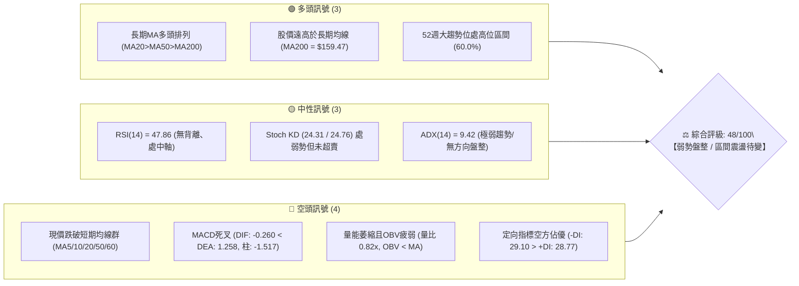
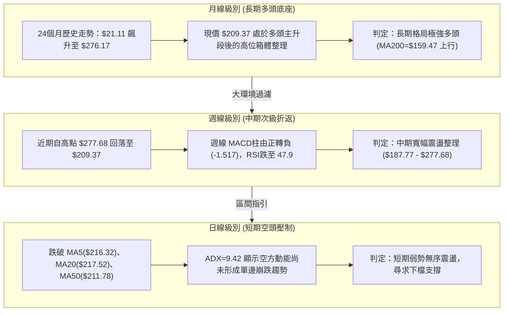
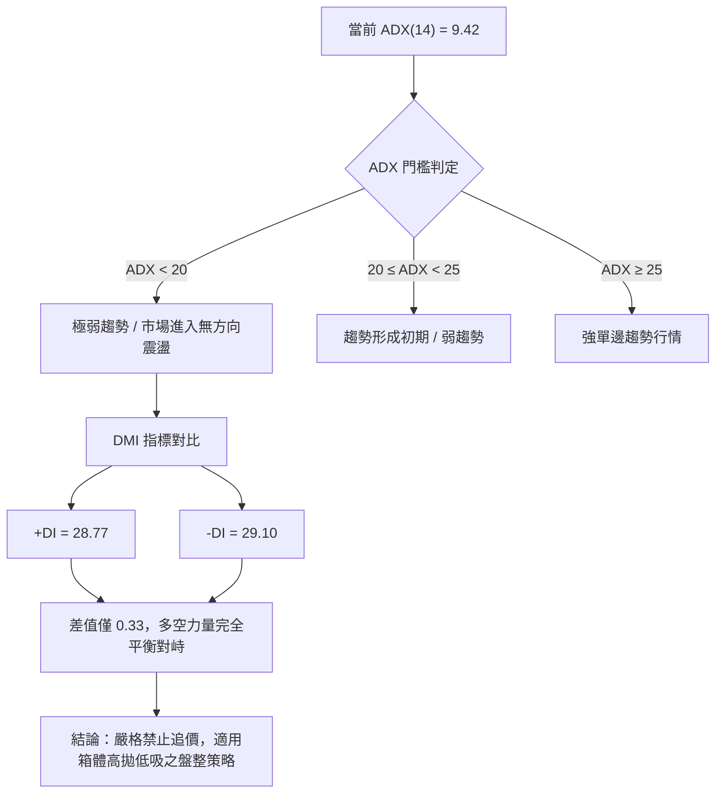
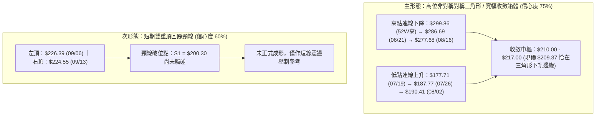
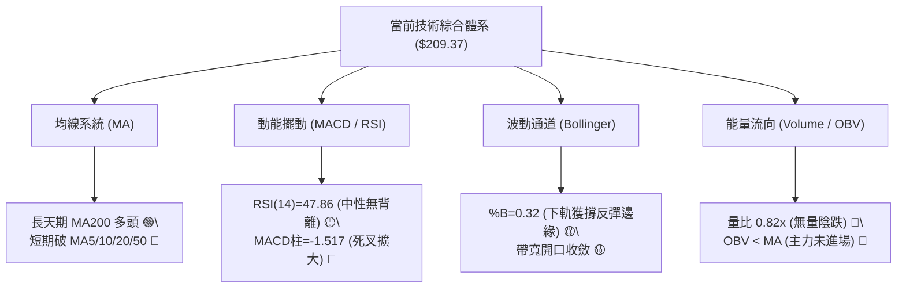
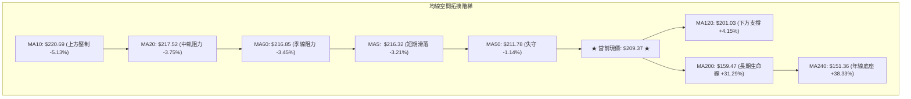
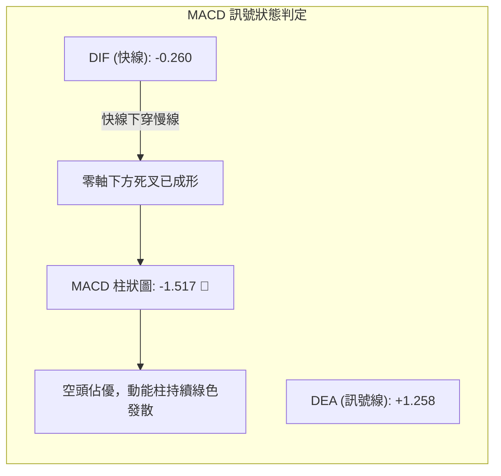
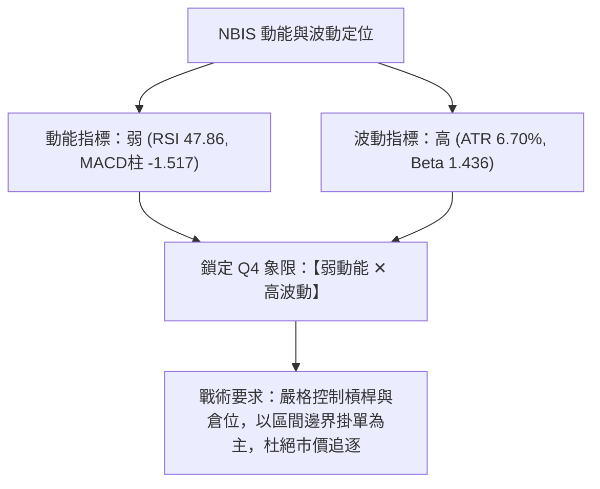
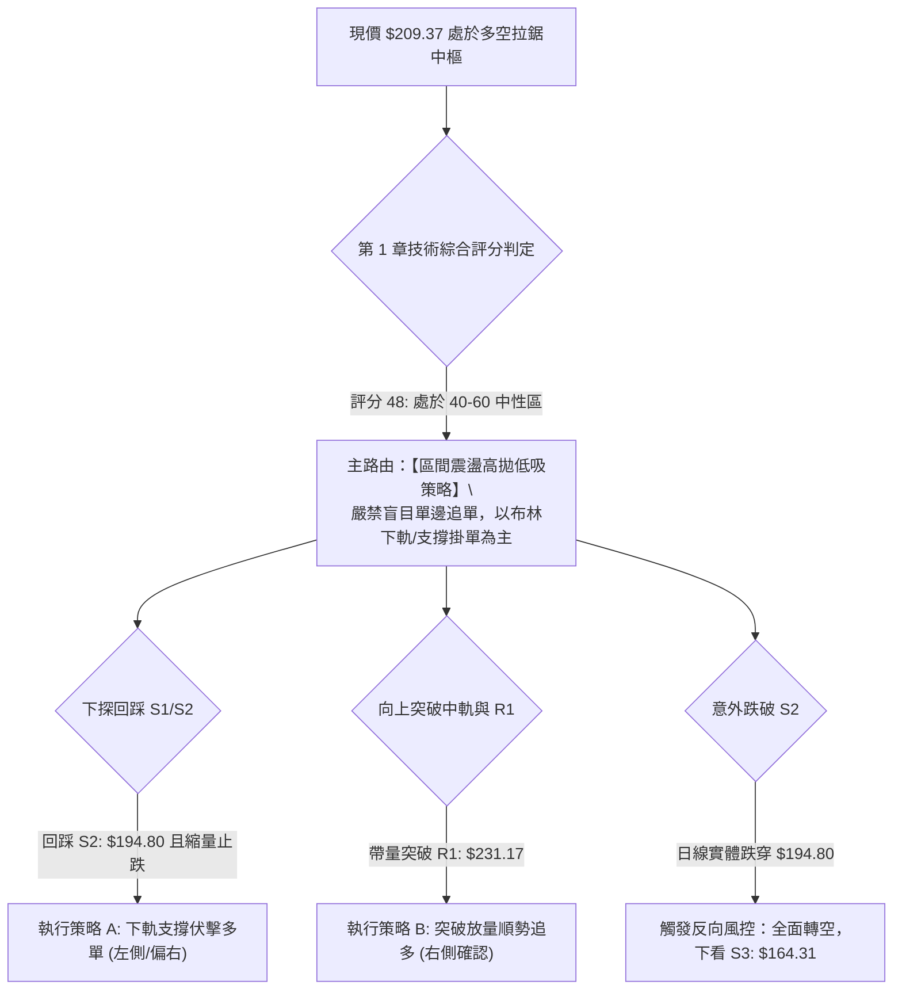
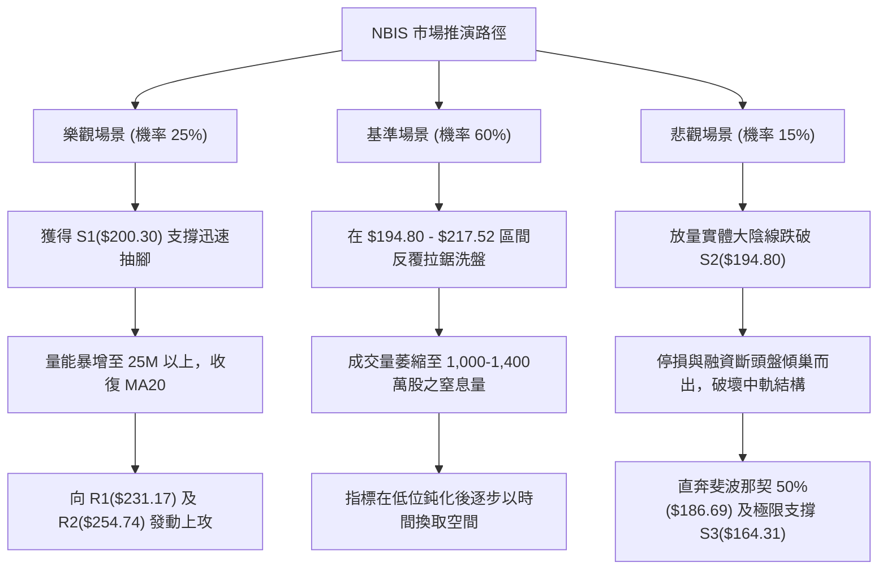

# NBIS 技術分析報告

> **報告日期**：2026-09-17 ｜ **語言**：繁體中文 ｜ **數據來源**：Yahoo Finance ｜ **當前價格**：$209.37

---

## 目錄

| 章節 | 內容 |
|------|------|
| [1. 技術面概覽](#1-技術面概覽) | 訊號儀表板、核心指標、評分卡 |
| [2. 趨勢分析](#2-趨勢分析) | 多時框趨勢、長中短期走勢、ADX解讀 |
| [3. 圖表形態分析](#3-圖表形態分析) | 形態識別信心度、K線組合、目標價推算 |
| [4. 支撐與阻力](#4-支撐與阻力) | 關鍵價位結構、波段聚類、斐波那契回調 |
| [5. 技術指標深度解讀](#5-技術指標深度解讀) | 均線系統、RSI背離、MACD、布林通道、OBV |
| [6. 動能與波動率](#6-動能與波動率) | 四象限矩陣、ATR風控、Beta相關性 |
| [7. 多時框架總結](#7-多時框架總結) | 時框收斂規則、主導權限確認、綜合矩陣 |
| [8. 交易策略建議](#8-交易策略建議) | 策略路由、精確進出場點、風險報酬比 |
| [9. 風險提示與監控](#9-風險提示與監控) | 監控Checklist、三種情境樹、風控法則 |
| [10. 報告總結](#10-報告總結) | 核心結論與執行面板 |

---

## 1. 技術面概覽

### 🎯 技術訊號儀表板



### 📊 核心指標速覽表

| 指標類別 | 指標名稱 | 當前數值 | 訊號 | 解讀 |
|----------|----------|----------|:----:|------|
| **價格** | 當前價格 | $209.37 | 🟡 | 位於52週高低點區間之 60.0% 水準，多空拉鋸 |
| **短期均線** | MA5 / MA10 | $216.32 / $220.69 | 🔴 | 現價大幅低於5日與10日線，短線承壓明顯 |
| **中期均線** | MA20 / MA50 | $217.52 / $211.78 | 🔴 | 跌破布林中軌($217.52)與MA50，進入中期整理防守 |
| **長期均線** | MA200 / MA240 | $159.47 / $151.36 | 🟢 | 現價高於MA200達 +31.29%，長期多頭底座穩固 |
| **動能指標** | RSI(14) | 47.86 | 🟡 | 位於45–55中性格局，無超買超賣，缺乏方向指引 |
| **趨勢強度** | ADX(14) | 9.42 | 🟡 | 遠低於 25 臨界線，顯示單邊趨勢停滯，處於休眠整理 |
| **趨勢方向** | DMI (+DI / -DI) | 28.77 / 29.10 | 🔴 | 空方微幅領先，但兩者差值極小，呈膠著態勢 |
| **動能震盪** | MACD (12,26,9) | -0.260 / 1.258 | 🔴 | 快線跌破訊號線轉負，綠柱 (-1.517) 擴大，短空主導 |
| **波動通道** | 布林通道 (%B) | 0.32 (帶寬 $46.14) | 🟡 | 股價游移於下軌($194.45)與中軌($217.52)之間 |
| **能量指標** | 成交量 / OBV | 13.35M (量比 0.82) | 🔴 | 低於20日均量(16.36M)，OBV低於均線，量價微背離 |
| **波動度** | ATR(14) | $14.04 (6.70%) | 🟡 | 單日價格波動劇烈，單日防守緩衝區需足夠寬裕 |

### 🏆 技術評分卡

```
╔══════════════════════════════════════════════════════════════════╗
║              技術評分卡 — NBIS (2026-09-17)                      ║
╠══════════════════════════════════════════════════════════════════╣
║ 趨勢強度 (ADX/DMI)   ███░░░░░░░░░░░░░░░░░   18/100 🔴 極度缺乏趨勢 ║
║ 短期動能 (MACD/RSI)  ████████░░░░░░░░░░░░   40/100 🔴 偏空轉弱格局 ║
║ 支撐穩定度 (S1/S2)   ██████████████░░░░░░   70/100 🟢 關鍵聚類穩固 ║
║ 成交量配合 (OBV/VOL) ████████░░░░░░░░░░░░   38/100 🔴 縮量整理背離 ║
║ 形態完整度 (結構)    ████████████░░░░░░░░   60/100 🟡 寬幅箱體震盪 ║
║ 均線排列 (多時框)    ████████████░░░░░░░░   62/100 🟡 長多短空交織 ║
╠══════════════════════════════════════════════════════════════════╣
║ 綜合評分             ██████████░░░░░░░░░░   48/100 🟡 中性偏弱整理 ║
╚══════════════════════════════════════════════════════════════════╝
```

---

## 2. 趨勢分析

### 🌐 多時框趨勢分析



### 📈 長期趨勢 — 12個月走勢圖（Unicode）

以下圖表完整展示 NBIS 自 2025 年 10 月至 2026 年 09 月共 12 個月之收盤價路徑與歷史波段頂底點位：

```
NBIS 月線走勢圖（2025-10 至 2026-09）
價格 ($)
$280 ┤                                             ● $276.17 (2026-06 波段峰頂)
$260 ┤                                            / \
$240 ┤                                  ● $231.09/   \
$220 ┤                                 /          \   \     ● $209.37 (現價 2026-09)
$200 ┤                                /            \   ●---/  $206.32
$180 ┤                               /              ● $190.41 (2026-07 強洗盤低點)
$160 ┤                              /
$140 ┤               ● $138.23     /
$120 ┤ ● $130.82    / \          /
$100 ┤   \         /   \        /
$80  ┤    \  ●----●     ● $103.76
     │     $83.71 $85.19 (2025-12 雙底築底)
$60  ┴──────┬──────┬──────┬──────┬──────┬──────┬──────┬──────┬──────┬──────┬──────┬──────
         2025   2025   2026   2026   2026   2026   2026   2026   2026   2026   2026   2026
          -10    -11    -12    -01    -02    -03    -04    -05    -06    -07    -08    -09
```

#### 歷史走勢特徵階段分析

| 階段區間 | 時間跨度 | 起訖價位 | 漲跌幅 | 量價走勢特徵與結構意涵 |
|:---|:---:|:---:|:---:|:---|
| **第一階段：急漲見頂** | 2025/10 - 2025/12 | $130.82 → $83.71 | -36.01% | 歷經暴漲後獲利了結殺盤，跌破百元關卡，確立短期頭部。 |
| **第二階段：底部蓄勢** | 2025/12 - 2026/02 | $83.71 → $91.19 | +8.94% | 於 $83-$85 構築穩固雙底結構，籌碼沉澱，長線買盤進場。 |
| **第三階段：主升暴發** | 2026/02 - 2026/06 | $91.19 → $276.17 | +202.85% | 伴隨業績倍增與AI浪潮全面展開超級主升浪，直逼 $300。 |
| **第四階段：高位劇震** | 2026/06 - 2026/09 | $276.17 → $209.37 | -24.19% | 遭遇獲利了結與高空賣壓，下探 $190.41 洗盤後進入對稱收斂。 |

### 📊 中期趨勢（週線分析）

從近 20 週數據觀察，NBIS 呈現典型的「高位大箱體劇烈拉鋸」。
- **阻力帶**：2026-06-21 觸及 $286.69，隨後於 2026-08-16 衝高至 $277.68，兩度於 $277-$286 遭遇沉重阻力，該區域構築了年內阻力帶 R3（$279.83）。
- **支撐帶**：2026-07-19 跌至 $177.71 後迅速獲得強力承接，隨後 2026-07-26 拔高至 $187.77、2026-08-02 守住 $190.41。這確認了 $187-$194 區間存在極強機構護盤底座，契合日線支撐 S2（$194.80）與斐波那契 50.0% 回調位（$186.69）。
- **近期週線動態**：近三週自 2026-09-06 的 $226.39 連續滑落至 $209.37，週成交量由 1.67億股劇幅萎縮至 37.57M 股，週線 MACD 柱翻負至 -1.517，顯示短波段動能減退，空方掌控短線話語權，但殺跌動能已顯疲態。

### ⚡ 趨勢強度評估（ADX 解讀）



| ADX 數值區間 | 趨勢狀態 | NBIS 當前位置 | 操作指導原則 |
|:---:|:---:|:---:|:---|
| **0 – 20** | **極弱趨勢 / 盤整市場** | **★ 9.42** | **擺動操作為主。依賴布林通道、支撐阻力水平位進出。** |
| **20 – 25** | 趨勢蓄勢 / 轉折醞釀 | — | 密切關注均線黏合度與帶寬變化，等待方向性爆發。 |
| **25 – 40** | 強勁趨勢行情 | — | 順勢而為，利用單邊移動止損持有核心倉位。 |
| **40 以上** | 極強 / 趨勢過熱面臨耗盡 | — | 分批鎖定利潤，警惕均線過度發散後之回抽。 |

---

## 3. 圖表形態分析

### 🔍 形態識別系統

根據近 6 個月的日線與週線價格軌跡，系統識別出以下兩個主導幾何與指標結構：



#### 形態識別信心度與參數評估表

| 形態類別 | 信心度 | 判斷依據（引用精確數據） | 完成度 | 形態量化測算與目標價 |
|:---|:---:|:---|:---:|:---|
| **高位收斂三角箱體** | **75%** | 兩波段高點阻力 R3: $279.83、R2: $254.74；波段低點支撐 S2: $194.80、S1: $200.30。收斂極限逼近中軌。 | **70%** | **向上突破**：以中軸 $217 加上箱高($85.03) = **$302.03**<br>**向下跌破**：跌破下軌 S2($194.80) 則下探 S3(**$164.31**) |
| **短期微型平頂** | **60%** | 近兩週高點分別為 $226.39 及 $224.55，在 R1: $231.17 之前動能衰竭轉折。 | **55%** | 頸線為 S1: $200.30。<br>若破頸線，理論量度跌幅：$200.30 - ($226.39 - $200.30) = **$174.21** |

### 🕯️ 重要K線形態分析

| 觀測週/月 | 收盤價 | K線形態特徵 | 市場心理與多空博弈解讀 | 技術訊號 |
|:---:|:---:|:---|:---|:---:|
| **2026-06-21** | $286.69 | 長上影流星線 (Shooting Star) | 衝擊 $299.86 歷史極值失敗，獲利盤與解套盤傾瀉，多頭動能見頂竭盡。 | 🔴 強烈見頂 |
| **2026-07-19** | $177.71 | 長下影破底錘頭 (Hammer) | 探底至斐波那契 50% 附近遭機構爆量抄底接走，形成高價值波段低點。 | 🟢 破底翻多 |
| **2026-08-16** | $277.68 | 爆量長陽線 (Bullish Thrust) | 單週爆出 167.5M 股天量，空頭回補軋空，但未能改寫 6 月前高，呈現次高頂。 | 🟡 假突破誘多 |
| **2026-09-13** | $224.55 | 縮量倒轉錘頭線 | 反彈至 MA20($217.52)上方後無力維繫，量能降至 62.4M 股，追價意願極度低迷。 | 🔴 反彈遇阻 |
| **2026-09-20** | $209.37 | 中陰線實體收於均線下 | 跌破 MA50($211.78)，空方奪取短期控制權，直逼整數防線 $200。 | 🔴 弱勢尋底 |

### 📉 ASCII 走勢形態示意圖

```
NBIS 週線三角收斂形態圖
價格 ($)
$299.86 ┬ 頂部 (52W High)
        │ ╲
$279.83 ┼──╲────────────────────── [阻力 R3: $279.83]
        │   ● 06/21 ($286.69)
$254.74 ┼────╲────────● 08/16 ($277.68) [阻力 R2: $254.74]
        │     ╲      ╱ ╲
$231.17 ┼──────╲────╱───● 09/06 ($226.39) [阻力 R1: $231.17]
        │       ╲  ╱     ╲
$209.37 ┼────────●────────● [現價 $209.37：回踩三角形下沿]
        │       ╱  ╲     ╱
$200.30 ┼──────╱────●───  [支撐 S1: $200.30]
        │     ╱   08/02 ($190.41)
$194.80 ┼────● 07/19 ($177.71) ───────────────── [強支撐 S2: $194.80]
        │   ╱
$164.31 ┴──●──────────────────────────────────── [極限底座 S3: $164.31]
```

### 🎯 形態目標價計算

以高位收斂箱體型態之邊界進行明確幾何量度：
1. **箱體上限高度**：以波段頂部聚類阻力 **R2: $254.74** 為有效突破頸線。
2. **箱體下限底座**：以波段底部聚類強支撐 **S2: $194.80** 為有效跌破防線。
3. **箱體震盪高度 ($H$)**：$254.74 - 194.80 = \$59.94$。
4. **多頭向上量度目標**：
   $$\text{Target UP} = \text{R2} + H = 254.74 + 59.94 = \$314.68$$
   *(第一多頭階段目標鎖定 R3: $279.83 及 52W High $299.86)*
5. **空頭向下量度目標**：
   $$\text{Target DOWN} = \text{S2} - H = 194.80 - 59.94 = \$134.86$$
   *(跌破 S2 後，第一空頭煞車中樞嚴格鎖定波段低點聚類 S3: $164.31)*

---

## 4. 支撐與阻力

### 🗺️ 關鍵價位分布圖（Unicode）

```
NBIS 價位結構分布圖 (引用 OHLCV 聚類計算)
══════════════════════════════════════════════════════════════════
$299.86 ║ 52W High 極限頂部 (斐波那契 0.0%)
$279.83 ║████████████████████████████████ 強阻力 R3 (+33.66%)
$254.74 ║████████████████████            阻力 R2 (+21.67%)
$246.44 ║-------------------------------- 斐波那契 23.6% 回調位
$240.59 ║▒▒▒▒▒▒▒▒▒▒▒▒▒▒▒▒▒▒▒▒▒▒▒▒▒▒▒▒▒▒▒▒ 布林通道上軌
$231.17 ║████████████████████████        關鍵阻力 R1 (+10.41%)
$217.52 ║-------------------------------- 布林中軌 (MA20)
$213.40 ║-------------------------------- 斐波那契 38.2% 回調位
$209.37 ╠════════════════════════════════ ◄◄ 現價 ($209.37)
$200.30 ║▓▓▓▓▓▓▓▓▓▓▓▓▓▓▓▓▓▓▓▓            近期支撐 S1 (-4.33%)
$194.80 ║████████████████████████████████ 強支撐 S2 (-6.96%)
$194.45 ║▒▒▒▒▒▒▒▒▒▒▒▒▒▒▒▒▒▒▒▒▒▒▒▒▒▒▒▒▒▒▒▒ 布林通道下軌
$186.69 ║-------------------------------- 斐波那契 50.0% 回調位
$164.31 ║████████████████████████████████ 極限強支撐 S3 (-21.52%)
$159.98 ║-------------------------------- 斐波那契 61.8% / MA200($159.47)
══════════════════════════════════════════════════════════════════
```

### 🚧 阻力位分析表

所有價位均精確引用波段高點聚類與技術指標計算數值：

| 阻力級別 | 精確價位 | 距現價幅幅 | 形成原因與籌碼技術結構 | 突破難度 | 重要性權重 |
|:---|:---:|:---:|:---|:---:|:---:|
| **R1** | **$231.17** | +10.41% | 近期波段反彈多次遇阻高點，亦緊貼 2026-05-31 週線收盤($231.09)密集套牢籌碼區。 | 🟡 中等 | ★★★★☆ |
| **R2** | **$254.74** | +21.67% | 日線大級別下降趨勢反壓線，且共振斐波那契 23.6% 回調位($246.44)，具極強空頭拋壓。 | 🔴 困難 | ★★★★☆ |
| **R3** | **$279.83** | +33.66% | 2026-06-21($286.69)與2026-08-16($277.68)兩大次級高點所構築的雙重天花板，主力出貨區。 | 🔴 極難 | ★★★★★ |

### 🛡️ 支撐位分析表

所有價位均精確引用波段低點聚類與技術指標計算數值：

| 支撐級別 | 精確價位 | 距現價幅幅 | 形成原因與籌碼技術結構 | 守住機率 | 重要性權重 |
|:---|:---:|:---:|:---|:---:|:---:|
| **S1** | **$200.30** | -4.33% | $200 整數心理防線，近期多次下影線探底之波段低點聚類，短線多頭第一道壕溝。 | 🟡 60% | ★★★☆☆ |
| **S2** | **$194.80** | -6.96% | 2026-07-26 及 08-02 築底平台，與當前布林下軌($194.45)高度重疊，強烈多空分水嶺。 | 🟢 75% | ★★★★★ |
| **S3** | **$164.31** | -21.52% | 歷史牛熊主升浪起爆點聚類，緊鄰斐波那契 61.8%($159.98)與牛熊分界 MA200($159.47)。 | 🟢 90% | ★★★★★ |

### 📐 斐波那契回調位分析

依據 52 週絕對極值區間（最低點 **$73.52** 至 最高點 **$299.86**，落差共計 **$226.34**）計算所得之關鍵黃金分割位：

```
斐波那契回調結構與現價定位
  0.0% ─── $299.86 (52W High)
 23.6% ─── $246.44 (強阻力區)
 38.2% ─── $213.40 (多空膠著臨界)
           ▲
           └─── 現價 $209.37 (目前位於 38.2% 與 50.0% 夾層區間，微幅跌破 38.2%)
           ▼
 50.0% ─── $186.69 (中期健康修正基準線)
 61.8% ─── $159.98 (黃金分割極限防守位，共振 MA200: $159.47)
 78.6% ─── $121.96 (主升段原點)
100.0% ─── $73.52 (52W Low)
```

- **斐波那契結構解讀**：
  現價 **$209.37** 剛失守 **38.2% 回調位 ($213.40)**，但並未引發恐慌性跳水，而是受到上方 MA50 ($211.78) 與下方 S1 ($200.30) 的雙重拉扯。技術面上，跌破 38.2% 意味著主升浪的單邊強勢階段正式結束，市場轉入以 **50.0% 回調位 ($186.69)** 至 **38.2% ($213.40)** 為核心的次級整理帶。若未來能放量收復 $213.40，方可化解回踩 $186.69 之風險。

---

## 5. 技術指標深度解讀

### 🎛️ 指標訊號總覽



### 📈 移動平均線排列分析



#### 均線發散與糾纏結構解讀
- **均線排列特徵**：從大格局來看，MA20 ($217.52) > MA50 ($211.78) > MA200 ($159.47)，整體仍維持在**大週期多頭排列**的骨架內。
- **短中期死叉交錯**：短線均線群（MA5、MA10、MA20、MA60）全部聚集於 **$216.32 - $220.69** 的窄幅區間內（相差不到 2%），且全數位於現價上方，形成密集的「空頭蓋頂壓制簾」。
- **長線支撐緩衝**：現價距離長期牛熊分水嶺 MA200（$159.47）擁有高達 $49.90（+31.29%）的深厚緩衝墊，中期回調尚屬於牛市週期中之常態洗盤，並無長期轉熊跡象。

### 📉 RSI(14) 分析

```
RSI(14) 動能刻度尺
0 ──────── 30 ──────────────── 50 ──────────────── 70 ──────── 100
[  超賣區  ]    [   弱勢區   ]   ★   [   強勢區   ]    [  超買區  ]
                              47.86
進度指標：████████████░░░░░░░░░░░░░ (47.86%)
```

- **數值解讀**：當前 RSI(14) 收在 **47.86**，處於 40–50 之弱勢過渡帶，市場既無超買盲目衝動，亦無超賣恐慌拋售。
- **背離嚴格檢驗**：
  - *頂背離檢驗*：股價 2026-08-16 創波段高點 $277.68 時，週線 RSI 達 67.2；相較 2026-06-21 高點 $286.69 時之 RSI 65.3，未形成明顯頂背離。
  - *底背離檢驗*：股價近期自 $226.39 跌至 $209.37，RSI 從 33.3 彈至 52.4 再滑落至 47.9，與價格跌勢同步，**無底背離跡象**。
  - **結論**：指標與價格走勢嚴格契合，無超前轉折預警信號。

### 📊 MACD(12/26/9) 訊號解讀



- **精確數值解析**：MACD 快線已下破零軸來到 **-0.260**，而慢線仍在零軸上方 **1.258**，快慢線負差擴大導致負柱狀體達 **-1.517**。
- **訊號含義**：此為標準的「零軸附近死叉並向零軸下方發散」態勢，表明 8 月中旬自 $277.68 發起的空頭修正尚未完全釋放完畢。在 MACD 負柱狀體出現第一根縮短翻紅之前，任何短線反彈均應視為技術性抽腳，而非趨勢反轉。

### 📦 布林通道分析

```
NBIS 布林通道垂直剖面圖 (帶寬: $46.14)
────────────────────────────────────────────────────────────────
$240.59 ┬ 布林上軌 (Upper Band)
        │
$217.52 ┼ 布林中軌 (Middle Band = MA20) 
        │ 
$209.37 ┼ ◄◄ 現價 ($209.37)  [%B = 0.32]
        │
$194.45 ┴ 布林下軌 (Lower Band) ── 與支撐 S2 ($194.80) 高度共振
────────────────────────────────────────────────────────────────
```

- **軌道狀態解讀**：
  1. 上軌 $240.59，中軌 $217.52，下軌 $194.45，帶寬極限值 $46.14。
  2. 現價位處 **%B = 0.32**（即自下軌向上約 32% 位置），顯示股價運行於空方主控之弱勢通道（中軌至下軌之間）。
  3. 下軌 **$194.45** 與技術聚類強支撐 **S2 ($194.80)** 僅差 $0.35，形成雙重結構性共振底座。股價在此處具備強大幾何物理反彈支撐。

### 💹 成交量分析（量價配合度）

- **量能萎縮數據**：
  - 最新單日成交量：**13,355,100** 股
  - 20日成交均量：**16,360,645** 股（量比僅 **0.82x**）
  - 50日成交均量：**21,012,416** 股
- **OBV（能量潮）走勢**：當前系統指示 `OBV < MA`，能量潮指標向下穿透其均線，代表流出資金量大於流入量，機構大資金目前並無積極回補建倉行為。
- **量價形態總結**：股價自 $226 回調過程中伴隨量能顯著萎縮（量縮陰跌），顯示空方並非主力恐慌出逃，而是買盤極度匱乏造成的自然滑落。這種無量陰跌通常需等待「下探關鍵支撐爆量止跌」或「放量長陽突破中軌」才能扭轉。

---

## 6. 動能與波動率

### ⚡ 動能評估四象限

| 象限 | 動能維度 (Momentum) | 波動維度 (Volatility) | 象限特徵 | NBIS 匹配度與定位評估 |
|:---:|:---:|:---:|:---|:---:|
| **Q1** | **強 (Strong)** | **低 (Low)** | 穩健單邊牛市，持股最佳環境 | ░░░░░░░░░░ 0% |
| **Q2** | **弱 (Weak)** | **低 (Low)** | 沉悶窄幅盤整，低流動性折磨 | ░░░░░░░░░░ 0% |
| **Q3** | **強 (Strong)** | **高 (High)** | 爆發性突破 / 主升浪主跌浪 | ░░░░░░░░░░ 0% |
| **Q4** | **弱 (Weak)** | **高 (High)** | **寬幅無序劇震，多空雙殺高風險** | **██████████ 100% (當前落點)** |



### 📊 ATR 波動率分析

- **精確數值**：NBIS ATR(14) 數值為 **$14.04**，佔當前股價比例高達 **6.70%**。
- **市場意義**：此數據顯示 NBIS 具有極高的日內與單日波動幅度，每日平均正常波幅即接近 $14 美元。
- **止損距離與風控設計**：
  - 在高波動標的中，一般日內或波段交易之止損距離至少須設定為 **1.0 至 1.5 倍 ATR**（即 **$14.04 至 $21.06**），以防止被無序之市場噪聲洗出場。
  - 當前股價 $209.37 距離強支撐 S2 ($194.80) 為 **$14.57**，恰約等於 **1.03 倍 ATR**，證明 S2 位準在統計學上提供了絕佳的結構性止損錨定點。

### 📐 Beta 與市場相關性

- **Beta 數值**：**1.436**
- **市場彈性分析**：Beta 高達 1.44，表明 NBIS 具備典型高貝塔成長股特徵，其相對於標普500大盤具有 144% 的彈性放大幅度。
- **大盤共振防範**：若大盤回調 1%，NBIS 平均可能下跌 1.44%；反之，大盤走強時其向上彈性亦極佳。在當前技術面偏弱震盪之際，大盤的任何微幅回檔均極易引發 NBIS 短線快速下探 S1 或 S2。

---

## 7. 多時框架總結

### 📋 時框架評分表

| 時框架 | 趨勢方向 | 動能狀態 | 均線排列特徵 | 主導形態 | 綜合評分 | 戰術建議 |
|:---:|:---:|:---:|:---|:---|:---:|:---|
| **長期 (月線)** | 🟢 強烈看多 | 🟡 高位降溫 | 完美多頭 (遠高於 MA200) | 主升浪後高位平台 | **82/100** | 逢大回調佈局長線 |
| **中期 (週線)** | 🟡 區間震盪 | 🔴 動能回調 | MA20之上但糾纏 | 寬幅收斂對稱三角 | **52/100** | 箱體操作，等待突破 |
| **短期 (日線)** | 🔴 偏弱探底 | 🔴 死叉發散 | 短均全數破位蓋頂 | 均線下壓無量陰跌 | **35/100** | 嚴禁抄底，防守優先 |

### 🔲 綜合訊號矩陣

```
時框架訊號收斂分析矩陣
時框       價格 vs MA    MACD    RSI(14)   OBV/量能   形態多空   權重分配
────────────────────────────────────────────────────────────────────
長期 (月)    🟢 多頭     🟢 多頭   🟡 中性    🟢 強勁    🟢 多頭     30%
中期 (週)    🟡 糾纏     🔴 轉空   🟡 中性    🟡 平和    🟡 震盪     45%
短期 (日)    🔴 空頭     🔴 死叉   🔴 偏空    🔴 疲弱    🔴 偏空     25%
────────────────────────────────────────────────────────────────────
加權最終合成評分：48.25 / 100 ────【判定：中性偏弱震盪】
```

### ⚖️ 多時框收斂結論

依據多時框收斂規則嚴格裁定：
1. **行情性質判定**：當前日線 **ADX(14) = 9.42**，遠遠低於 25 的趨勢分水嶺，嚴格定義為**典型盤整行情**。
2. **主導時框裁量權**：在 ADX < 25 的盤整市況下，單邊趨勢無效，日線級別的移動平均線已被反覆穿越失真；**市場交易權限由「日線布林通道 ($194.45 - $240.59)」與「波段支撐阻力水平聚類 (S2: $194.80 / R1: $231.17)」完全主導**。
3. **唯一方向性結論**：**【中性觀望，區間箱體對待】**。
   - 儘管日線指標偏空，但因成交量嚴重縮減（量比 0.82x），向下並無恐慌殺跌動能；
   - 儘管長期均線多頭排列，但在短線均線蓋頂及 MACD 負柱未收斂前，無法發動向上攻擊。
   - 策略應以在下軌 S2 附近低吸伏擊、上軌與 R1 附近高拋為主，決不於中軸 $209 附近盲目追單。

---

## 8. 交易策略建議

### 🗺️ 策略決策流程圖



### 🧭 策略路由

- **依技術評分卡（48/100）裁定**：
  **當前主策略方向 = 【中性區間波段操作，嚴守以逸待勞之低吸高拋原則】**
  當前評分處於 40–60 之間，且 ADX 僅 9.42，不具備激進單邊單向加碼條件。策略重心在於利用布林下軌與強支撐聚類的防禦優勢，佈局盈虧比極佳的結構性波段單。

### 🎯 價格情境階梯（Price Scenarios）

所有觸發價位嚴格引用關鍵價位計算數值：

| 觸發條件 (Trigger) | 下一目標價 (Target 1) | 後續延伸 (Target 2) | 市場結構意涵與技術意義 |
|:---|:---:|:---:|:---|
| **強勢突破 R1 ($231.17)** | **R2 ($254.74)** | **R3 ($279.83)** | 擺脫短均糾纏壓制，化解短空，回歸測試高位三角形上沿。 |
| **失守現價回踩 S1 ($200.30)** | **S2 ($194.80)** | 企穩反彈 | 消化整數關卡浮額，測試布林下軌極限支撐。 |
| **有效跌破 S2 ($194.80)** | 斐波那契 50% ($186.69) | **S3 ($164.31)** | 正式宣告中級破位，高位雙頂確立，進入中期深度洗盤。 |

### 📊 情境機率分佈

```
情境機率分佈圓形刻度
繼續區間震盪 (60%) ▓▓▓▓▓▓▓▓▓▓▓▓
探底企穩回升 (25%) ▓▓▓▓▓
破位深度回調 (15%) ▓▓▓
```

| 市場演化情境 | 機率 | 主要技術與籌碼依據 |
|:---|:---:|:---|
| **情境一：區間震盪 ($194.80 - $231.17)** | **60%** | ADX 僅 9.42，趨勢引擎熄火；布林通道帶寬收斂，成交量持續低於均量，缺乏單邊驅動力。 |
| **情境二：回探 S2 支撐後反彈** | **25%** | S2($194.80)與布林下軌($194.45)重疊，長期 MA200 提供深厚牛市背景，逢低買盤依然存在。 |
| **情境三：跌破 S2 引發多殺多** | **15%** | 融資槓桿盤或短期追高籌碼在跌破 $194.80 後引發停損賣壓，迫使股價下尋 S3($164.31)。 |

### 🟢 主策略詳情（區間波段主導）

| 策略要素 | 策略 A（下軌支撐伏擊 — 推薦） | 策略 B（放量突破順勢追擊） |
|:---|:---|:---|
| **交易類型** | 左側支撐佈局 / 區間底吸 | 右側趨勢確認 / 突破追多 |
| **進場條件** | 價格回踩 S2 獲得支撐，出現日線收下影線或 KDJ 金叉 | 日線收盤價帶量放量突破 R1 阻力線 |
| **進場價格** | **$195.50** (貼近 S2: $194.80) | **$231.50** (確認突破 R1: $231.17) |
| **目標價 T1** | **$217.50** (布林中軌 MA20 處平倉 50%) | **$254.74** (阻力 R2 第一止盈點) |
| **目標價 T2** | **$231.17** (阻力 R1 全數清倉) | **$279.83** (阻力 R3 歷史頂部平倉) |
| **止損價格** | **$189.80** (跌破 S2 下方 $5.00，避開雜訊) | **$219.50** (跌回 MA20 之下嚴格止損) |
| **止損幅度** | -$5.70 (-2.92%) | -$12.00 (-5.18%) |
| **預期報酬 (至T2)** | +$35.67 (+18.25%) | +$48.33 (+20.88%) |
| **風險報酬比 (R:R)**| **1 : 6.25** (極優) | **1 : 4.03** (優良) |
| **歷史勝率估計** | 65% | 55% |
| **建議倉位** | **15% 總資金** | **10% 總資金** |

### 🔴 反向風險觸發點（對沖提示）

- **多頭防禦破位點（做空/避險觸發）**：
  若日線實體**收盤價跌破 S2 ($194.80)**，且伴隨成交量放大超過 2,000 萬股，意味著近兩個月的震盪防線徹底潰敗。
  - **風控處置**：所有多頭倉位無條件全數止損離場。
  - **反向避險目標**：此時可啟動對沖機制，反向下看至 **S3: $164.31** 與斐波那契 61.8% 的 **$159.98**。

### ⭐ 整體訊號強度評星

```
╔══════════════════════════════════════════════════════════════════╗
║ 做多訊號強度：★★☆☆☆ (2.5/5星) ──── 短期承壓，僅限支撐位低吸    ║
║ 做空訊號強度：★★☆☆☆ (2.5/5星) ──── 跌勢無量，下檔支撐強烈共振  ║
║ 趨勢可交易度：★☆☆☆☆ (1.5/5星) ──── ADX極低，單邊趨勢完全缺失    ║
║ 震盪勝率預期：★★★★☆ (4.0/5星) ──── 邊界明確，適合區間嚴格操作  ║
╚══════════════════════════════════════════════════════════════════╝
```

---

## 9. 風險提示與監控

### ✅ 關鍵監控指標 Checklist

```
╔══════════════════════════════════════════════════════════════════╗
║              NBIS 關鍵技術指標每日監控 Checklist                 ║
╠══════════════════════════════════════════════════════════════════╣
║ [ ] 價位維度：現價是否跌破整數防線 S1 ($200.30)？                ║
║ [ ] 價位維度：現價是否觸碰強共振支撐 S2 ($194.80)？              ║
║ [ ] 動能維度：MACD 柱狀體數值是否收窄至 -0.50 以上形成底背離預警？║
║ [ ] 動能維度：日線 RSI(14) 是否跌入 30 以下之嚴重超賣警戒區？     ║
║ [ ] 均線維度：現價能否帶量長陽回踩收復布林中軌 MA20 ($217.52)？   ║
║ [ ] 能量維度：單日成交量是否突破 2,000 萬股 (主力介入訊號)？     ║
║ [ ] 趨勢維度：ADX(14) 是否由 9.42 抬頭向上穿過 20 (趨勢啟動)？    ║
╚══════════════════════════════════════════════════════════════════╝
```

### ⚠️ 風險場景分析



### 🛡️ 風險管理重要提醒

1. **ATR 波動適應性法則**：
   NBIS 的日波幅達到 $14.04（6.70%），是市場平均水平的數倍。切忌使用一般大型藍籌股的緊密止損（如 1%–2%），否則極易在市場常態噪聲中被頻繁掃出場。止損必須設定在 S2（$194.80）等具有強大圖表形態支持的關鍵點位下方外圍。
2. **倉位配置上限**：
   鑑於 NBIS 目前動能評估處於 Q4（弱動能、高波動），任何單一交易部位的總曝險金額建議嚴格限制在**總投資組合資金的 10% - 15% 以內**。
3. **單筆最大虧損限制**：
   嚴格執行「每筆交易承擔之最大帳戶風險不超過總資產 1.5%」之專業風控鐵律。以策略 A 為例（止損幅度 $5.70），若資產總額為 10 萬美元，單筆最大允許損失為 1,500 美元，則最大買進股數嚴格受限為：
   $$\text{Max Shares} = \frac{\$1,500}{\$5.70} \approx 263 \text{ 股 (折合市值約 \$51,400，若採 15% 倉位上限則為 76 股)}$$

---

## 10. 報告總結

```
╔══════════════════════════════════════════════════════════════════╗
║                 NBIS 技術分析報告總結面板                        ║
╠══════════════════════════════════════════════════════════════════╣
║ 報告日期：2026-09-17             當前價格：$209.37               ║
║ 分析評級：⚖️ 48/100 (中性偏弱震盪 ｜ 區間邊界操作)                ║
╠══════════════════════════════════════════════════════════════════╣
║ 【核心技術結論】                                                 ║
║ ├─ 長期趨勢：🟢 穩固多頭 (現價高於 MA200: $159.47 達 +31.29%)   ║
║ ├─ 中期趨勢：🟡 箱體收斂 (週線三角震盪，波段天花板與地板分明)   ║
║ ├─ 短期趨勢：🔴 弱勢整理 (跌破 MA5/10/20/50，MACD 負柱發散)      ║
║ ├─ 趨勢強度：🟡 極弱單邊 (ADX = 9.42，代表當前絕無破位大單邊)   ║
║ ├─ 關鍵支撐：S1: $200.30 ｜ S2: $194.80 ｜ S3: $164.31           ║
║ ├─ 關鍵阻力：R1: $231.17 ｜ R2: $254.74 ｜ R3: $279.83           ║
║ └─ 52W 區間：$73.52 ──── [$209.37] ──── $299.86 (位處 60.0%)     ║
╠══════════════════════════════════════════════════════════════════╣
║ 【精選操作路徑】                                                 ║
║ 1. 🥇 最佳策略 (高盈虧比)：                                     ║
║    掛單回踩 S2/布林下軌 $195.50 伏擊做多，止損 $189.80，         ║
║    目標看至 $231.17，風險報酬比達 1 : 6.25。                     ║
║ 2. 🥈 次選策略 (右側安全)：                                     ║
║    靜待日線帶量放量突破 R1 ($231.17) 確立後順勢跟進，            ║
║    目標鎖定 R2 ($254.74) 與 R3 ($279.83)。                       ║
║ 3. 🥉 當前紀律：                                                 ║
║    處於 $209 中軸「高不成低不就」地帶，切勿追市價單，以逸待勞！   ║
╚══════════════════════════════════════════════════════════════════╝
```

---

> ⚠️ **免責聲明**：本報告為依據標準技術分析理論與所提供之即時/歷史行情數據進行之客觀量化解讀，報告內所有支撐阻力位與交易策略均基於統計模型推演。本報告**僅供研究與學術交流參考**，**不構成任何形式的實質投資邀約或買賣建議**。金融市場瞬息萬變，高貝塔標的波動劇烈，投資人應獨立審慎評估風險並自行承擔交易損益。

---

*報告生成時間：2026-09-17 ｜ 數據來源：Yahoo Finance ｜ 分析框架：多時框幾何與量化指標系統*