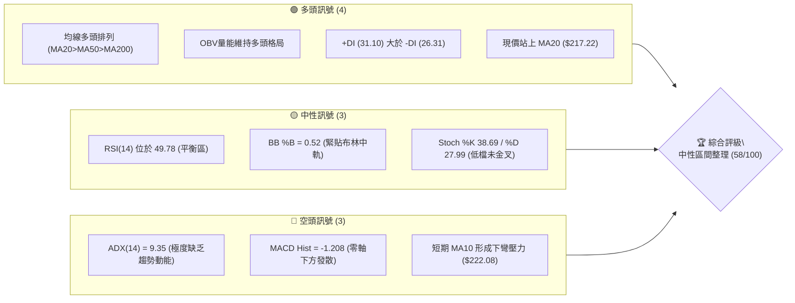
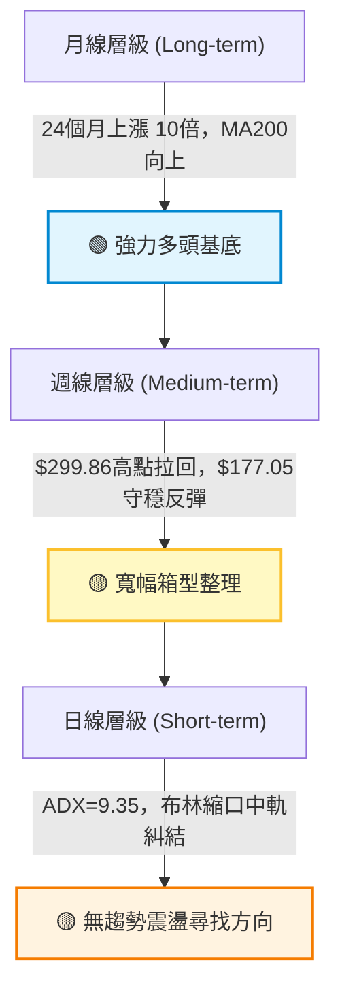
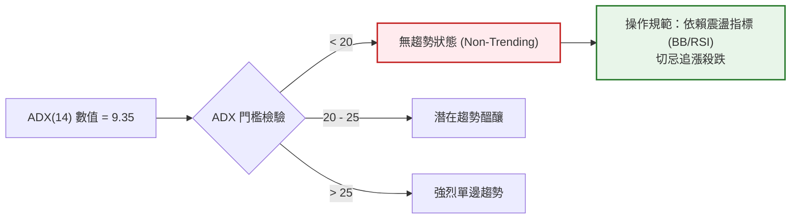
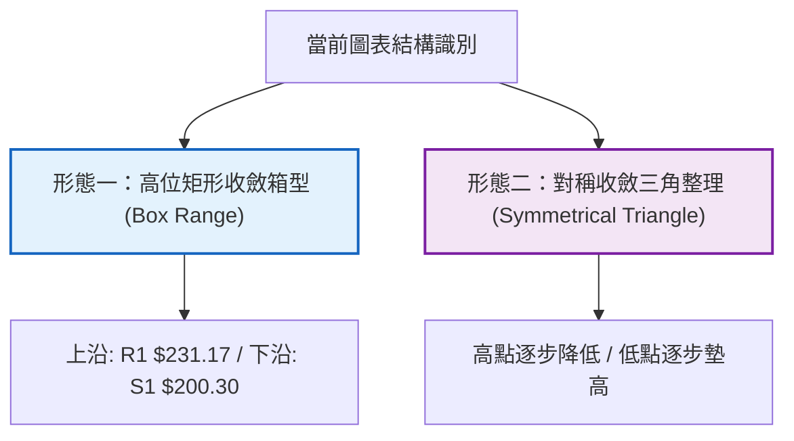
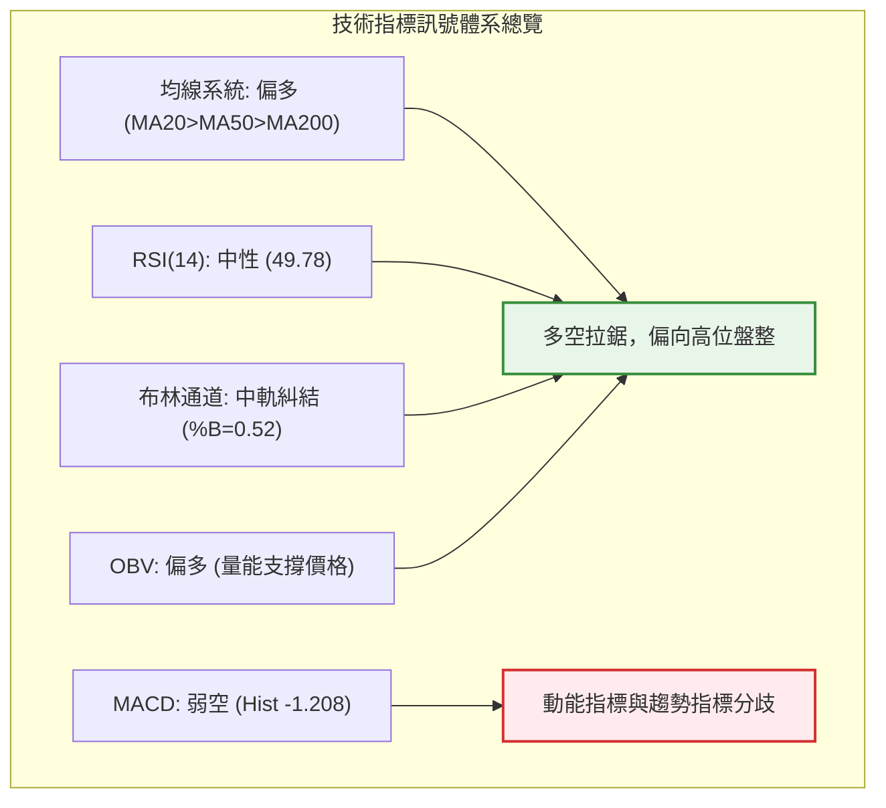
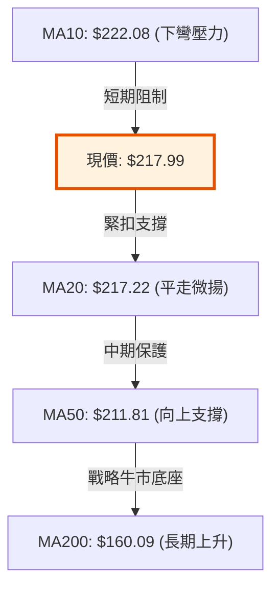
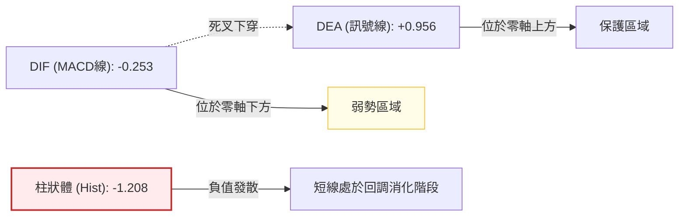
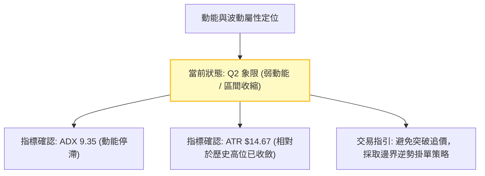
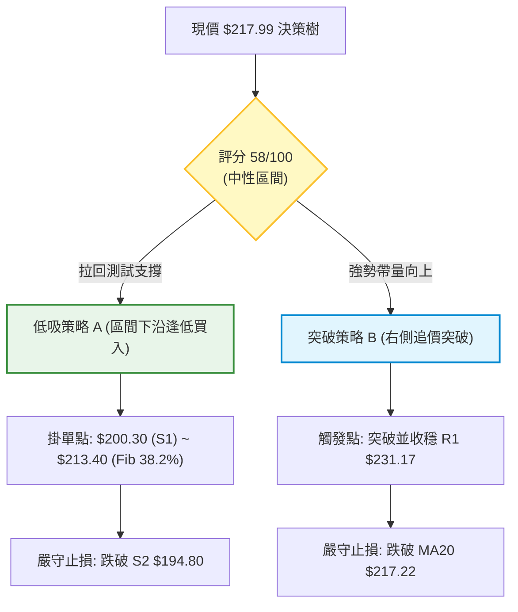
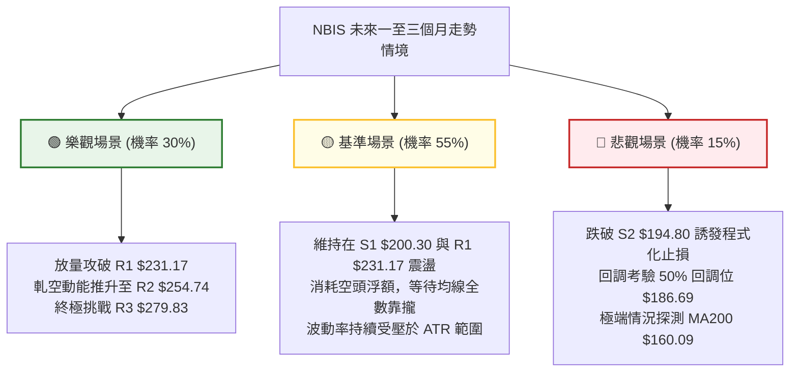

# NBIS 技術分析報告

> **報告日期**：2026-09-18 ｜ **語言**：繁體中文 ｜ **數據來源**：Yahoo Finance ｜ **當前價格**：$217.99

---

## 目錄

| 章節 | 內容 |
|------|------|
| [1. 技術面概覽](#1-技術面概覽) | 訊號儀表板、核心指標、評分卡 |
| [2. 趨勢分析](#2-趨勢分析) | 多時框趨勢、長中短期走勢 |
| [3. 圖表形態分析](#3-圖表形態分析) | 形態識別、K線組合、目標價 |
| [4. 支撐與阻力](#4-支撐與阻力) | 關鍵價位、斐波那契回調 |
| [5. 技術指標深度解讀](#5-技術指標深度解讀) | MA/RSI/MACD/布林/成交量 |
| [6. 動能與波動率](#6-動能與波動率) | 動能評估、ATR、Beta |
| [7. 多時框架總結](#7-多時框架總結) | 時框架評分矩陣 |
| [8. 交易策略建議](#8-交易策略建議) | 多空策略、風險報酬比 |
| [9. 風險提示與監控](#9-風險提示與監控) | 監控指標、風險場景 |
| [📋 報告總結](#-報告總結) | 核心指標總結與操作方向 |

---

## 1. 技術面概覽

### 🎯 技術訊號儀表板



### 📊 核心指標速覽表

| 指標類別 | 指標名稱 | 當前數值 | 訊號 | 解讀 |
|:---|:---|:---|:---:|:---|
| **價格** | 當前價格 | $217.99 | 🟢 | 位於52週區間 63.8%，守穩中軌 $217.22 |
| **均線** | MA20 | $217.22 | 🟢 | 現價微幅高於短期支撐，斜率走平 |
| **均線** | MA50 | $211.81 | 🟢 | 價格在均線上方 +2.92%，中期趨勢有守 |
| **均線** | MA200 | $160.09 | 🟢 | 價格在均線上方 +36.17%，長期結構完好 |
| **動能** | RSI(14) | 49.78 | 🟡 | 位於50多空分水嶺，無明顯背離現象 |
| **動能** | MACD (12,26,9) | -0.253 / Hist -1.208 | 🔴 | 快慢線死叉且柱狀體為負，短期動能承壓 |
| **動能** | ADX (14) | 9.35 | 🔴 | 數值小於25，市場進入典型無趨勢寬幅盤整 |
| **波動** | ATR(14) | $14.67 (6.73%) | 🟡 | 波動度高，短線單日震幅約 $14.67 |

### 🏆 技術評分卡

```
╔══════════════════════════════════════════════════════════════════╗
║                    技術評分卡 — NBIS (2026-09-18)                ║
╠══════════════════════════════════════════════════════════════════╣
║ 趨勢強度 (ADX=9.35)    ████░░░░░░░░░░░░░░░░  20/100  🔴 極弱趨勢 ║
║ 動能指標 (RSI/MACD)    █████████░░░░░░░░░░░  45/100  🟡 弱勢偏空 ║
║ 支撐穩定度 (MA50/S1)   ██████████████░░░░░░  70/100  🟢 買盤承接 ║
║ 成交量配合 (OBV/Volume)██████████████░░░░░░  70/100  🟢 量增價穩 ║
║ 形態完整度 (區間收斂)  ████████████░░░░░░░░  60/100  🟡 箱型整理 ║
║ 均線排列 (多頭排列)    ████████████████░░░░  80/100  🟢 多頭保護 ║
╠══════════════════════════════════════════════════════════════════╣
║ 綜合評分               ███████████░░░░░░░░░  58/100  🟡 中性偏多 ║
╚══════════════════════════════════════════════════════════════════╝
```

---

## 2. 趨勢分析

### 🌐 多時框趨勢分析



### 📈 長期趨勢 — 12個月走勢圖（ASCII）

```
NBIS 月線走勢圖（2025-10 至 2026-09）
價格軸 ($)
$300 ┤                                              ● 52W高點 $299.86 (2026-06)
$275 ┤                                        ●   
$250 ┤                                      ╱   ╲ 
$225 ┤                                ╱────┘     ╲          ● 現價 $217.99 (2026-09)
$200 ┤                               ╱            ╲  ●───● 
$175 ┤                              ╱              ●
$150 ┤                        ●    ╱
$125 ┤ ● (2025-10)          ╱  ╲  ╱
$100 ┤  ╲                 ╱     ●
 $75 ┤   ●───────────────● (2025-12)
     └─────────────────────────────────────────────────────────────►
       10   11   12   01   02   03   04   05   06   07   08   09  (月份)
```

#### 走勢特徵分析表格

| 階段區間 | 起訖價格 | 累計漲跌幅 | 趨勢性質與市場行為解讀 |
|:---|:---|:---:|:---|
| **2025-10 ~ 2025-12** | $130.82 → $83.71 | -36.01% | 歷經波段衝高後的主動性大幅去槓桿回撤，築底於 $73.52。 |
| **2026-01 ~ 2026-03** | $85.19 → $103.76 | +21.80% | 底部換手籌碼沉澱，均線由發散轉收斂，法人機構增持籌碼。 |
| **2026-04 ~ 2026-06** | $138.23 → $276.17| +99.79% | 主升浪爆發，伴隨AI算力雲業務擴張，創歷史新高 $299.86。 |
| **2026-07 ~ 2026-09** | $190.41 → $217.99| +14.48% | 高檔獲利回吐重挫後，在 $177.05 獲強支撐，進入高位震盪箱。 |

### 📊 中期趨勢（週線分析）

```
近期週線壓力與支撐結構示意圖：
$299.86 ────────────────────────────────── [歷史天花板 52W High]
         ▲
         │ 弱勢反彈承壓區間 ($254.74 ~ $279.83)
$240.10 ─┴──────────────────────────────── [布林通道上軌 / R1 $231.17 附近]
         ▲
         │ 當前盤整區間 ($200.30 ~ $231.17) ◄◄ 核心震盪區 (現價 $217.99)
$194.80 ─┬──────────────────────────────── [S2 波段低點 / 布林通道下軌 $194.35]
         │
         ▼ 深度支撐買盤 ($164.31 ~ MA200 $160.09)
```

近20週數據顯示，NBIS在2026年6月突破至 $286.69 高位後，於7月回調至最低收盤 $177.71。8月中旬一度強拉至 $277.68，但隨後迅速退潮至 $209.18。這表明上方 $240.00-$280.00 堆積大量解套浮額，而下檔在 $190.00-$200.00 具備穩定的機構低接買盤。

### ⚡ 趨勢強度評估（ADX 解讀）



#### ADX 強度對照與指標解讀

| 指標變數 | 具體讀數 | 門檻區間 | 技術解讀 |
|:---|:---:|:---:|:---|
| **ADX(14)** | **9.35** | < 20 (極弱) | 目前市場無明確單邊方向，價格波動呈現純粹的均值回歸。 |
| **+DI (14)** | **31.10** | > 25 (偏多) | 多頭買方仍掌握邊際定價優勢，並未由空頭完全掌控。 |
| **-DI (14)** | **26.31** | 中性水準 | 賣盤壓力雖然存在，但並未構成具有攻擊性的向下動能。 |
| **趨勢綜合判斷** | **盤整無趨勢** | ADX < 25 | **依嚴格規則 14：以布林通道上下軌與支撐阻力為交易邊界。** |

---

## 3. 圖表形態分析

### 🔍 形態識別系統



#### 形態識別與信心度評估

| 形態類別 | 信心度 (%) | 判斷依據（嚴格引用技術數據） | 完成度 (%) | 預期突破後目標價（附計算式） |
|:---|:---:|:---|:---:|:---|
| **箱型整理**<br>(Rectangle) | **75%** | 價格於近6週反覆在 S1 ($200.30) 與 R1 ($231.17) 間橫盤，中軌平行。 | **85%** | 突破箱頂：$231.17 + ($231.17 - $200.30) = **$262.04**<br>跌破箱底：$200.30 - ($231.17 - $200.30) = **$169.43** |
| **對稱三角形**<br>(Triangle) | **60%** | 高點由 2026-08-16 的 $277.68 降至 $226.39，低點由 07-19 的 $177.71 抬升至 $209.18。 | **70%** | 三角形垂直高度 = $277.68 - $177.71 = $99.97<br>向上突破點設於 $226.39 + $99.97 = **$326.36** |
| **雙底形態**<br>(Double Bottom) | **35%** | 訊號不足。僅有 07-19 的 $177.71 與 08-09 的 $187.97 略似雙底，但兩者價差 >5%，且頸線過遠。 | **未成形** | *數據不足以支撐幾何形態，依規則15不予推算* |

### 🕯️ 重要K線形態分析

| 週期/日期 | 收盤價 | 典型K線形態 | 量能與形態解讀 | 多空訊號 |
|:---|:---:|:---|:---|:---:|
| **2026-08-16** | $277.68 | 巨量長陽線 (突破爆量) | 單週爆量 1.67億股，突破前波阻力，確認機構強力介入買盤。 | 🟢 強烈看多 |
| **2026-08-23** | $219.13 | 長黑覆蓋線 (獲利吞噬) | 遭逢巨大獲利了結賣壓，單週回吐跌破上週長陽線中軸。 | 🔴 強烈看空 |
| **2026-08-30** | $209.18 | 量縮錘頭線 (下影探底) | 週成交量驟降至 7,018萬股，賣壓衰竭，在 $200.00 關卡獲得支撐。 | 🟢 止跌訊號 |
| **2026-09-13** | $224.55 | 小實體紅K (突破未果) | 試圖挑戰 MA10 ($222.08) 但遭遇引線壓制，多空進入僵局。 | 🟡 中性格局 |
| **2026-09-20** | $217.99 | 窄幅十字星 (多空平衡) | 收盤微幅站上中軌 $217.22，振幅大幅收窄，預示變盤在即。 | 🟡 變盤預警 |

### 📉 ASCII 走勢形態示意圖

```
NBIS 箱型與對稱收斂幾何示意圖
價格 ($)
$277.68 ┬───────● (08-16 高點)
         │       ╲
$254.74 ┤(R2)     ╲          
$231.17 ┼───────────●───────▲ 箱型上限 (R1) ─────────────────
         │            ╲     │
$217.99 ┤              ●───┼─ 現價 ($217.99) 糾結於此
         │            ╱     │
$200.30 ┼───────────●───────▼ 箱型下限 (S1) ─────────────────
         │         ╱
$187.97 ┤        ● (08-09 低點)
$177.71 ┴───────● (07-19 低點)
        └─────────────────────────────────────────────────────► 時間
```

### 🎯 形態目標價計算

以確認度最高之「高位矩形收斂箱型」進行等距垂直投射計算：
1. **箱體上限 (Resistance)**：$231.17 (即R1)
2. **箱體下限 (Support)**：$200.30 (即S1)
3. **箱體垂直高度 ($H$)**：$231.17 - $200.30 = **$30.87**
4. **向上等距測幅目標 (Bullish Target)**：
   $$\text{Target}_{\text{up}} = \text{箱體上限} + H = 231.17 + 30.87 = \mathbf{\$262.04}$$
   *(該目標價位於阻力位 R2 $254.74 與 R3 $279.83 之間)*
5. **向下等距測幅目標 (Bearish Target)**：
   $$\text{Target}_{\text{down}} = \text{箱體下限} - H = 200.30 - 30.87 = \mathbf{\$169.43}$$
   *(該目標價接近支撐位 S3 $164.31 與 MA200 $160.09)*

---

## 4. 支撐與阻力

### 🗺️ 關鍵價位分布圖（ASCII）

```
NBIS 價位結構分布圖 (Resistance & Support Map)
══════════════════════════════════════════════════════════════════
$299.86 ║████████████████████████████████████████║ 52W High / 歷史極限高點
$279.83 ║████████████████████████████            ║ 強阻力 R3 (近一年波段高點聚類)
$254.74 ║██████████████████                      ║ 次級阻力 R2 (反彈高點聚類)
$246.44 ║▓▓▓▓▓▓▓▓▓▓▓▓▓▓▓▓▓▓▓▓                    ║ 斐波那契 23.6% 回調壓力
$240.10 ║░░░░░░░░░░░░░░░░░░░░░░░░                ║ 布林通道上軌壓力
$231.17 ║████████████████████████████████        ║ 關鍵箱頂阻力 R1 (突破關鍵點)
════════╠════════════════════════════════════════╣ ◄ 現價: $217.99
$217.22 ║░░░░░░░░░░░░░░░░░░░░░░░░                ║ 布林中軌 / MA20 短期動態支撐
$213.40 ║▓▓▓▓▓▓▓▓▓▓▓▓▓▓▓▓▓▓▓▓▓▓▓▓▓▓              ║ 斐波那契 38.2% 回調支撐
$211.81 ║▒▒▒▒▒▒▒▒▒▒▒▒▒▒▒▒▒▒▒▒▒▒                  ║ 中期生命線 MA50
$200.30 ║▓▓▓▓▓▓▓▓▓▓▓▓▓▓▓▓▓▓▓▓▓▓▓▓▓▓▓▓▓▓          ║ 第一關鍵防線 S1 (近一年波段低點聚類)
$194.80 ║████████████████████████████████████    ║ 強結構支撐 S2 (波段多重低點聚類)
$186.69 ║▓▓▓▓▓▓▓▓▓▓▓▓▓▓▓▓▓▓▓▓                    ║ 斐波那契 50.0% 強弱分水嶺
$164.31 ║████████████████████████████████████████║ 終極波段支撐 S3 (回調極限)
$160.09 ║▒▒▒▒▒▒▒▒▒▒▒▒▒▒▒▒▒▒▒▒▒▒▒▒▒▒▒▒▒▒▒▒▒▒▒▒▒▒▒║ 長期牛熊分界線 MA200
══════════════════════════════════════════════════════════════════
```

### 🚧 阻力位分析表

所有價位均嚴格引用 OHLCV 聚類與技術指標計算數據：

| 阻力級別 | 價位 ($) | 空間距離 (%) | 形成原因與籌碼結構 | 突破難度 | 重要性權重 |
|:---|:---:|:---:|:---|:---:|:---:|
| **R1** | **$231.17** | +6.04% | 5月及6月多次震盪波段高點，箱型整理上限頸線。 | 🟡 中等 | ★★★★☆ |
| **R2** | **$254.74** | +16.86% | 2026年6-8月反彈次高點密集成交區，斐波那契 23.6% ($246.44) 上方。 | 🔴 較高 | ★★★★☆ |
| **R3** | **$279.83** | +28.37% | 8月中旬巨量長紅棒高點聚類 ($277.68) 與波段套牢區。 | 🔴 極高 | ★★★★★ |

### 🛡️ 支撐位分析表

所有價位均嚴格引用 OHLCV 聚類與技術指標計算數據：

| 支撐級別 | 價位 ($) | 空間距離 (%) | 形成原因與籌碼結構 | 守住機率 | 重要性權重 |
|:---|:---:|:---:|:---|:---:|:---:|
| **S1** | **$200.30** | -8.12% | 8月下旬拉回守穩低點，整數心理大關，箱型下限。 | 🟢 75% | ★★★★☆ |
| **S2** | **$194.80** | -10.64% | 7月波段整理低點，重疊布林下軌 ($194.35) 具極強共振防禦。 | 🟢 85% | ★★★★★ |
| **S3** | **$164.31** | -24.62% | 52週起漲前的重要籌碼平台，貼近 MA200 ($160.09)。 | 🟢 95% | ★★★★★ |

### 📐 斐波那契回調位分析

依據 52週極值區間（低點 **$73.52** → 高點 **$299.86**，垂直落差 $226.34）精確計算回調階梯：

```
斐波那契回調階梯分佈：
0.0%  (52W High)  $299.86 ───────────────────────────────────────
23.6%             $246.44 ────────────── 次級反彈阻力位
                  ▲
[現價落點區間]      │ 震盪爭奪區間 (寬度: $33.04)
                  ▼
38.2%             $213.40 ────────────── 現價下方關鍵支撐 ($217.99 剛好守穩其上)
50.0%             $186.69 ────────────── 中期多空強弱生命線
61.8% (黃金分割)  $159.98 ────────────── 共振 MA200 ($160.09) 的戰略底線
78.6%             $121.96 ────────────── 深幅回撤防線
100.0% (52W Low)  $ 73.52 ───────────────────────────────────────
```

- **位置意義解讀**：現價 **$217.99** 精確座落於 **38.2% ($213.40)** 與 **23.6% ($246.44)** 之間，且極度貼近 38.2% 支撐。在強勢回調理論中，資產能在 38.2% 回調位之上橫盤整理，代表長期多頭主趨勢仍未被破壞，此處回踩未破視為健康洗盤。

---

## 5. 技術指標深度解讀

### 🎛️ 指標訊號總覽



### 📈 移動平均線排列分析



#### 各期均線明細數據與技術意涵

| 均線名稱 | 當前價格 ($) | 現價與MA差距 (%) | 短期斜率走勢 | 技術解讀 |
|:---|:---:|:---:|:---:|:---|
| **MA 5** | $214.29 | +1.72% | ▲ 上揚 | 極短線由低檔翻揚，提供當前價格微幅推力。 |
| **MA 10** | $222.08 | -1.84% | ▼ 下彎 | 短期受壓於此，構成日內與短線交易的主要上方壓制。 |
| **MA 20** | $217.22 | +0.35% | ▲ 平緩 | 月線級別多空線，現價貼合中軌，屬均衡狀態。 |
| **MA 50** | $211.81 | +2.92% | ▲ 上揚 | 中期生命線，提供強勁的波段防守點位。 |
| **MA 60** | $215.90 | +0.97% | ▲ 上揚 | 季線位置穩固，位於現價下方不遠處。 |
| **MA 120** | $201.96 | +7.94% | ▲ 陡峭上行 | 半年線持續抬升，支撐 $200.00 整數關卡。 |
| **MA 200** | $160.09 | +36.17% | ▲ 穩定多頭 | 典型大多頭牛市防線，長期趨勢未見任何敗象。 |

### 📉 RSI(14) 分析

```
RSI(14) 強度進度條：
0            30                 50                 70           100
├────────────┼──────────────────┼──────────────────┼────────────┤
[   超賣區   ] [     偏空區     ]▲[     偏多區     ] [  超買區  ]
                                49.78 (當前位置)
數值展示：██████████░░░░░░░░░░  49.78 / 100  (中性平衡)
```

- **背離分析判斷**：
  經對比近10週數據，2026-08-16 價格衝高至 $277.68 時，RSI 達到 67.2；隨後價格於 09-06 反彈至 $226.39 時，RSI 僅 33.3，但近期價格回落至 $217.99 時，RSI 回升至 49.78。目前**無標準日線級別之頂背離或底背離**，動能與價格呈同步收斂態勢，指標處於 50 軸線上下洗盤狀態。

### 📊 MACD (12, 26, 9) 訊號解讀



MACD 當前處於標準的「死叉修正」週期，DIF 線跌至零軸下方 (-0.253)，且柱狀體為 -1.208。這說明自 8 月中旬以來的獲利了結賣壓仍在技術指標上延續。然而，柱狀體負值未進一步猛烈擴大（07-19曾達 -7.680），顯示賣盤動能正逐步收斂進入疲乏期。

### 📦 布林通道分析

```
布林通道 (20, 2) 結構分布圖：
$240.10 ─────────────────────────────────────────────── 布林上軌 (Upper Band)
         ▲
         │ 寬度帶 (Bandwidth): $45.75 (20.98%)
$217.99 ─┼─ 現價 (%B = 0.52) ◄◄ 緊貼中軌
$217.22 ─┴───────────────────────────────────────────── 布林中軌 (MA20)
         │
         ▼
$194.35 ─────────────────────────────────────────────── 布林下軌 (Lower Band)
```

- **通道帶寬與形態解讀**：
  通道上軌為 $240.10，下軌為 $194.35，帶寬呈現向內收斂縮口跡象。%B 指標為 **0.52**，幾乎精準落於中軌（0.50）。在布林通道理論中，中軌糾結配合通道縮口，代表波動率正在急遽萎縮，即將進入「壓縮突破」階段。

### 💹 成交量分析（量價配合度）

1. **量比檢視**：最新成交量為 **30,682,400 股**，相對於 20 日均量（15,400,975 股），**量比高達 1.99 倍**。量能倍增但價格波動收窄，顯示多空雙方在 $217.00-$218.00 區間發生激烈的換手防守。
2. **OBV 趨勢驗證**：數據明確提示「**OBV > MA → 量能支撐上漲**」。儘管短期價格處於修正回調，但能量潮指標（OBV）始終維持在均線之上，這反映出機構法人籌碼並未在高檔全面派發，主力資金並未呈現持續淨流出狀態。

---

## 6. 動能與波動率

### ⚡ 動能評估四象限

| 象限代號 | 動能維度 (Momentum) | 波動維度 (Volatility) | 當前歸屬 | 戰術策略特徵 |
|:---|:---:|:---:|:---:|:---|
| **Q1 (主升浪)** | 強動能 (ADX>25) | 低波動 (穩定推升) | — | 積極順勢加碼，抱牢獲利 |
| **Q2 (盤整修復)** | **弱動能 (ADX=9.35)** | **低波動 (縮口中)** | **✔ NBIS 當前位置** | **謹慎觀望，高出低進，嚴控停損** |
| **Q3 (極端狂熱)** | 強動能 (趨勢突破) | 高波動 (急漲急跌) | — | 突破追價，嚴守移動止損 |
| **Q4 (非理性恐慌)**| 弱動能 (破位下行) | 高波動 (恐慌拋售) | — | 停止左側抄底，現金為王 |



### 📊 ATR 波動率分析

- **ATR(14) 數值**：**$14.67**（佔當前股價之 **6.73%**）。
- **日常波動性衡量**：NBIS 單日合理正常波動幅度約為 $14.67。任何小於此區間的日內跳動均屬市場噪音。
- **動態止損距離建議**：
  - **短線交易止損（1.0 × ATR）**：距進場點扣除 **$14.67**。
  - **波段防守止損（1.5 × ATR）**：距進場點扣除 **$22.01**。
  - **長線容忍止損（2.0 × ATR）**：距進場點扣除 **$29.34**。

### 📐 Beta 與市場相關性

- **Beta 係數**：**1.436**。
- **市場特徵詮釋**：NBIS 為典型之高貝塔（High-Beta）成長型科技股，波動敏感度為標普500指數的 1.436 倍。在大盤多頭環境下具備極佳的超額報酬（Alpha）潛力；但在大盤回調階段，面臨的修正幅度亦相對放大。
- **空頭部位佔比 (Short Interest)**：**Short % Float 高達 19.2%**，Short Ratio 為 1.88。這意味著市場空頭部位極度沉重，一旦價格帶量突破 R1 ($231.17)，極易引發軋空行情（Short Squeeze）。

---

## 7. 多時框架總結

### 📋 時框架評分表

| 時框架 | 趨勢方向 | 動能狀態 | 均線排列 | 形態結構 | 綜合評分 | 操作建議 |
|:---|:---:|:---:|:---:|:---:|:---:|:---|
| **長期 (月線)** | 🟢 強勢多頭 | 🟢 充沛維持 | 🟢 多頭排列 | 歷史天花板拉回蓄勢 | **85/100** | 逢深幅拉回戰略布局 |
| **中期 (週線)** | 🟡 箱型震盪 | 🟡 動能減弱 | 🟢 守在MA50之上 | 對稱三角/寬幅箱型 | **60/100** | 區間高出低進，以中軌為界 |
| **短期 (日線)** | 🟡 平衡無向 | 🔴 MACD負值 | 🟡 糾結於MA20 | 布林收口窄幅整固 | **50/100** | 觀望等待方向確認突破 |

### 🔲 綜合訊號矩陣

```
時框架訊號矩陣收斂圖：
  維度 / 時框     短期 (日線)      中期 (週線)      長期 (月線)
 ─────────────────────────────────────────────────────────────
  趨勢方向         🟡 震盪          🟡 箱型          🟢 多頭
  動能強弱         🔴 死叉          🟡 減弱          🟢 強勁
  均線支撐         🟢 MA20守穩      🟢 MA50守穩      🟢 MA200遠在下方
  量價結構         🟢 OBV看多       🟢 籌碼換手      🟢 量增價揚
  多空主導權       🟡 均衡          🟡 均衡          🟢 多頭絕對優勢
 ─────────────────────────────────────────────────────────────
  多時框權重收斂： [ 中期箱型主導，短線收斂壓縮，長期牛市基底不變 ]
```

### ⚖️ 多時框收斂結論

依據技術分析第 14 條多時框收斂規則：
1. **行情性質判斷**：當前日線 ADX(14) 讀數為 **9.35（< 25）**，明確判定當前為**典型的盤整行情**而非趨勢行情。
2. **主導時框取捨**：在盤整行情中，中短期均線方向優先級讓位於**日線布林通道上下軌**與**關鍵支撐阻力聚類位**。
3. **唯一收斂方向結論**：**【中性偏多觀望，箱型區間操作】**。
   雖然長期均線（MA200 $160.09）展現長牛架構，但日線受制於 MACD 負柱狀體與 MA10 下彎壓制，短線不具備直接噴發條件。操作主軸必須以日線布林下軌 ($194.35) 與支撐位 S1 ($200.30) 作為低吸依據，以 R1 ($231.17) 與布林上軌 ($240.10) 作為高拋目標。

---

## 8. 交易策略建議

### 🗺️ 策略決策流程圖



### 🧭 策略路由

> **當前主策略方向 = 中性偏多區間操作（依評分卡 58/100，介於 40–60 之間，主打箱型交易並等待確認突破）**

綜合評分 58 分顯示市場處於平衡向好格局，未達 60 分單邊多頭主推門檻，亦遠高於 40 分空頭門檻。因此策略以「**區間逢低做多**」為主線，輔以「**關鍵位向上突破**」之追買機制，嚴格杜絕在箱體中間隨機進場。

### 🎯 價格情境階梯（Price Scenarios）

價位嚴格引用第四章及數據區塊之數值：

| 觸發條件 | 第一目標 (T1) | 第二目標 (T2) | 技術面含義與市場行為解讀 |
|:---|:---:|:---:|:---|
| **強勢突破 R1 ($231.17)** | **R2 ($254.74)** | **R3 ($279.83)** | 擺脫箱型壓制，空頭回補（軋空）觸發，挑戰前期高點。 |
| **維持於現價區間 ($211-$222)** | **R1 ($231.17)** | **S1 ($200.30)** | 均線糾結，布林帶寬進一步壓縮，市場等待催化劑。 |
| **跌破 S1 ($200.30)** | **S2 ($194.80)** | **S3 ($164.31)** | 箱型支撐宣告失守，回撤考驗布林下軌與半年線平台。 |

### 📊 情境機率分佈

| 運行情境 | 評估機率 | 主要技術依據與指標佐證 |
|:---|:---:|:---|
| **情境一：區間震盪收斂** | **55%** | ADX 僅 9.35，布林通道縮口中軌走平，量能充足但無方向攻擊。 |
| **情境二：向上反彈/突破** | **30%** | 均線呈多頭排列，OBV 指標持續高於均線，空頭部位 19.2% 具軋空潛能。 |
| **情境三：向下破位回踩** | **15%** | MACD 柱狀體為負 (-1.208)，MA10 形成蓋頭壓制，短線動能尚未扭轉。 |

### 🟢 主策略詳情

本報告提供兩套互補之交易策略。**所有價位嚴格引用支撐阻力聚類數據**：

| 策略要素 | 策略 A：箱型下沿逢低布局 (左側低吸) | 策略 B：突破頸線順勢追擊 (右側突破) |
|:---|:---|:---|
| **核心邏輯** | 依賴 S1 支撐與 Fib 38.2% 防守低吸 | 藉由放量站穩 R1 突破箱型壓制順勢操作 |
| **進場條件** | 價格回踩不破並出現日內止跌信號 | 日K收盤確認突破 R1，成交量放大 > 1.5倍均量 |
| **進場價格** | **$213.40** (Fib 38.2% 回調支撐位) | **$231.17** (R1 突破點即時追入) |
| **止損價格** | **$194.80** (跌破 S2 強支撐即停損離場) | **$217.22** (跌回 MA20 / 布林中軌下方停損) |
| **目標價 T1** | **$231.17** (箱型頂部 R1) | **$254.74** (次級波段阻力 R2) |
| **目標價 T2** | **$254.74** (次級波段阻力 R2) | **$279.83** (強阻力聚類 R3) |
| **止損空間** | $18.60 (-8.72%) | $13.95 (-6.03%) |
| **獲利空間 (T1)**| $17.77 (+8.33%) | $23.57 (+10.20%) |
| **獲利空間 (T2)**| $41.34 (+19.37%) | $48.66 (+21.05%) |
| **風險報酬比 (T1)**| **1 : 0.96** (短打偏低) | **1 : 1.69** (具備操作價值) |
| **風險報酬比 (T2)**| **1 : 2.22** (符合標準優質水準) | **1 : 3.49** (極佳風險回報比) |
| **成功機率預估** | **65%** | **55%** |
| **建議倉位大小** | **10% - 15%** (分批低吸) | **8% - 10%** (右側確認後建立) |

### 🔴 反向風險觸發點（對沖與風控提示）

若出現以下訊號，必須立即宣告上述多頭主策略失效，全面轉入防禦或執行對沖：
1. **關鍵點位跌破**：若日K線以實體長陰跌破 **S2 ($194.80)** 且收盤未能拉回，代表高位雙重頂部破位風險驟增，下探目標直指 S3 ($164.31)。
2. **量能異常爆發**：在未站上 R1 之前，若爆出單日超過 5,000 萬股的向下跌破量，說明大戶籌碼不計成本派發。
3. **空頭反轉信號**：日線 MACD 跌破零軸深處且 -DI 突破 35.00，ADX 由 9.35 急速反彈向上破 20，意味單邊空頭主跌段確立。

### ⭐ 整體訊號強度評星

```
做多訊號強度：★★★☆☆  (3.0 / 5 星 — 均線與量能護航，但動能不足)
做空訊號強度：★★☆☆☆  (2.0 / 5 星 — 空頭部位過高，缺乏下打意願)
整體可信度：  ★★★★☆  (4.0 / 5 星 — 數據充分，支撐阻力結構清晰)
```

---

## 9. 風險提示與監控

### ✅ 關鍵監控指標 Checklist

```
╔══════════════════════════════════════════════════════════════════╗
║                    技術監控清單 (Daily Checklist)                ║
╠══════════════════════════════════════════════════════════════════╣
║ [ ] 價格是否跌破斐波那契 38.2% 支撐 $213.40？                     ║
║ [ ] 價格是否帶量攻克箱型頂部阻力 R1 $231.17？                    ║
║ [ ] 布林通道帶寬是否開始放大擴軌（收盤價貼近上軌 $240.10）？     ║
║ [ ] MACD 柱狀體（當前 -1.208）是否由負翻正形成金叉？              ║
║ [ ] 日成交量是否萎縮至 1,500 萬股以下（洗盤極限信號）？          ║
║ [ ] 放空比例 Short % Float (19.2%) 是否觸發空頭踩踏式回補？       ║
╚══════════════════════════════════════════════════════════════════╝
```

### ⚠️ 風險場景分析



### 🛡️ 風險管理重要提醒

1. **ATR 波動風險適應**：鑑於 NBIS 目前 ATR 高達 **$14.67**，日內波動超過 6%，任何緊密止損（如 <3%）極易遭受無序市場隨機震盪洗出場。交易者必須將倉位規模嚴格反比於 ATR 進行縮減計算。
2. **非對稱基本面槓桿**：公司目前營收年增達 454.0%，但自由現金流為負（$-9.61B），負債權益比達 98.6。高成長伴隨高槓桿，在流動性趨緊或市場避險情緒升溫時，高 Beta 特性易放大跌幅。
3. **空頭回補假突破防範**：由於 Short % Float 接近 20%，向上突破 R1 ($231.17) 時，需警惕「假突破真誘多」之軋空一日遊行情。必須觀察日K線能否連續 **2 個交易日** 收穩於 R1 之上，方可確立為有效實體突破。

---

## 📋 報告總結

```
╔══════════════════════════════════════════════════════════════════╗
║                     NBIS 技術分析報告總結                        ║
╠══════════════════════════════════════════════════════════════════╣
║ 報告日期：2026-09-18                                             ║
║ 當前價格：$217.99                                                ║
║ 分析評級：⚖️ 中性觀望 / 箱型區間震盪 (技術評分: 58/100)          ║
║                                                                  ║
║ 關鍵結論：                                                       ║
║ ├─ 長期趨勢：🟢 強烈看多 (MA200 $160.09 向上，24個月暴漲十倍)     ║
║ ├─ 中期趨勢：🟡 箱型整理 (受困於 $200.30 ~ $231.17 收斂區間)     ║
║ ├─ 短期趨勢：🟡 平衡震盪 (ADX 僅 9.35，動能指標死叉但量能有守)    ║
║ ├─ 關鍵支撐：S1 $200.30 │ S2 $194.80 │ S3 $164.31               ║
║ ├─ 關鍵阻力：R1 $231.17 │ R2 $254.74 │ R3 $279.83               ║
║ └─ 華爾街共識目標價：$290.71 (17位分析師，覆蓋評級偏買入)        ║
║                                                                  ║
║ 最優策略組合：                                                   ║
║ 1. 🥇 最佳機會：策略 B 突破追擊 — 待放量收穩 R1 $231.17 後進場，  ║
║                 目標 $254.74 / $279.83，風報比達 1:3.49。        ║
║ 2. 🥈 次選機會：策略 A 箱底低吸 — 回踩 Fib 38.2% $213.40 附近接， ║
║                 停損設於 S2 $194.80，博弈箱型反彈至 $231.17。     ║
║ 3. 🥉 保守選擇：場外絕對觀望 — ADX < 25 期間不主動開倉，等待布林  ║
║                 通道擴軌並突破 $231.17 或跌破 $194.80 後再行順勢。║
╚══════════════════════════════════════════════════════════════════╝
```

---

> ⚠️ **免責聲明**：本報告為技術分析研究成果，所有數據及估算均嚴格基於所提供之歷史價格與量能資訊（Yahoo Finance）。本報告**僅供學術研究與參考**，**不構成任何形式之個人化投資要約或交易建議**。金融市場具有高度風險與不確定性，投資人應獨立評估自身財務能力與風險承受度，審慎做出決策並自負盈虧。

---

*報告生成時間：2026-09-18 ｜ 數據來源：Yahoo Finance ｜ 分析框架：多時框技術分析模型*