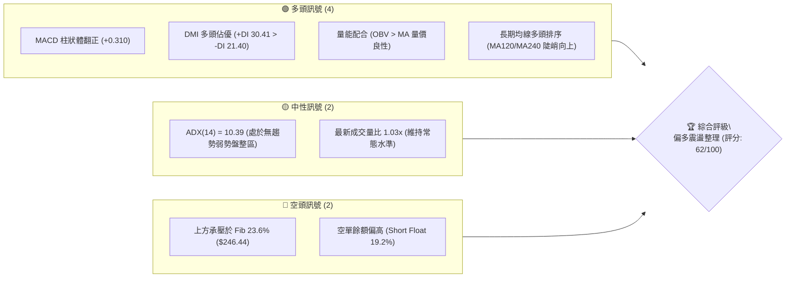
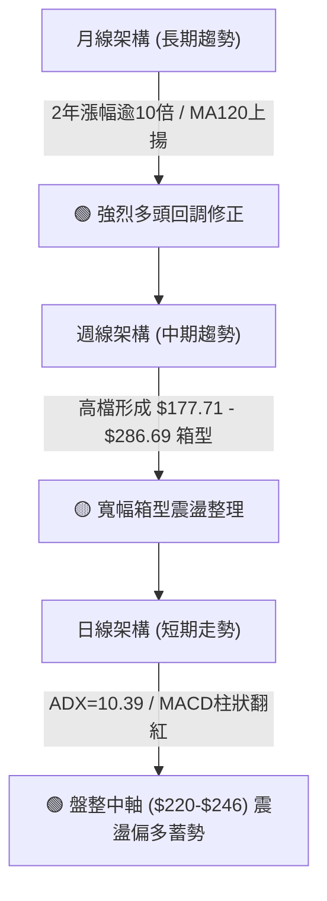
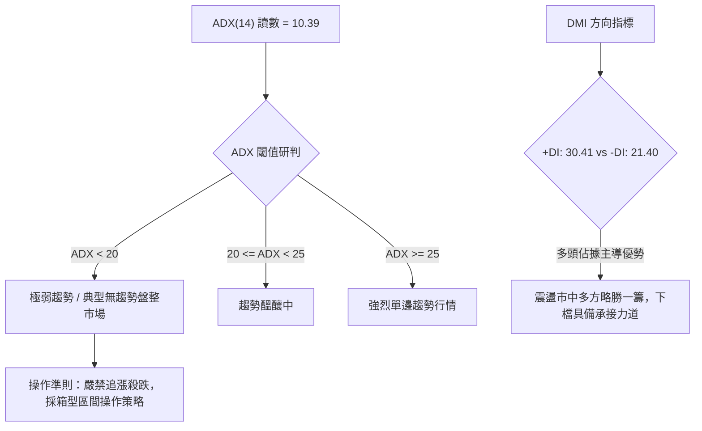
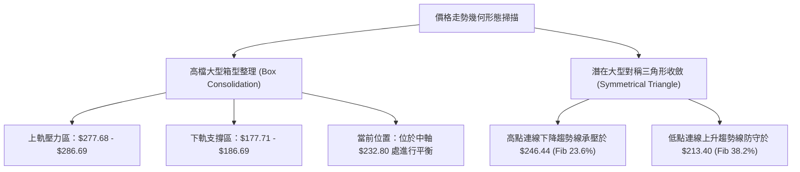
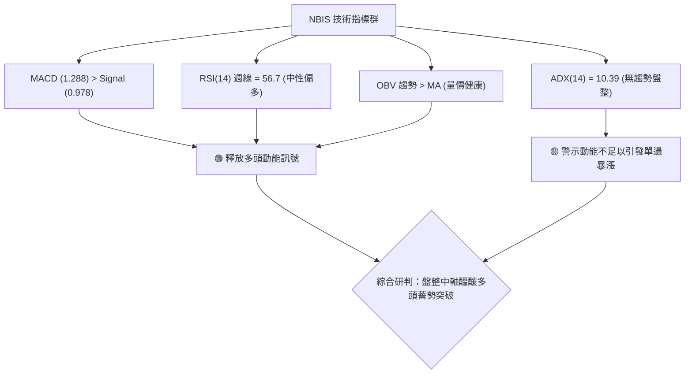
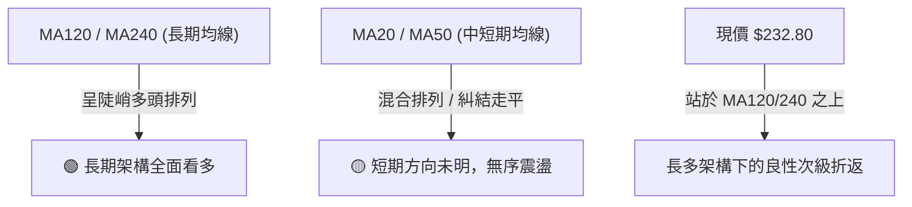
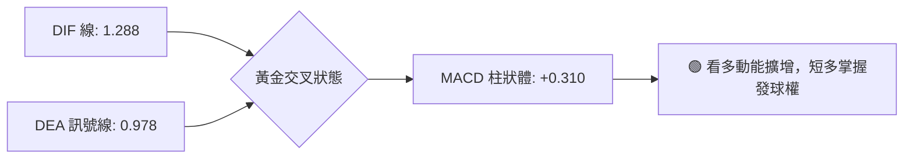
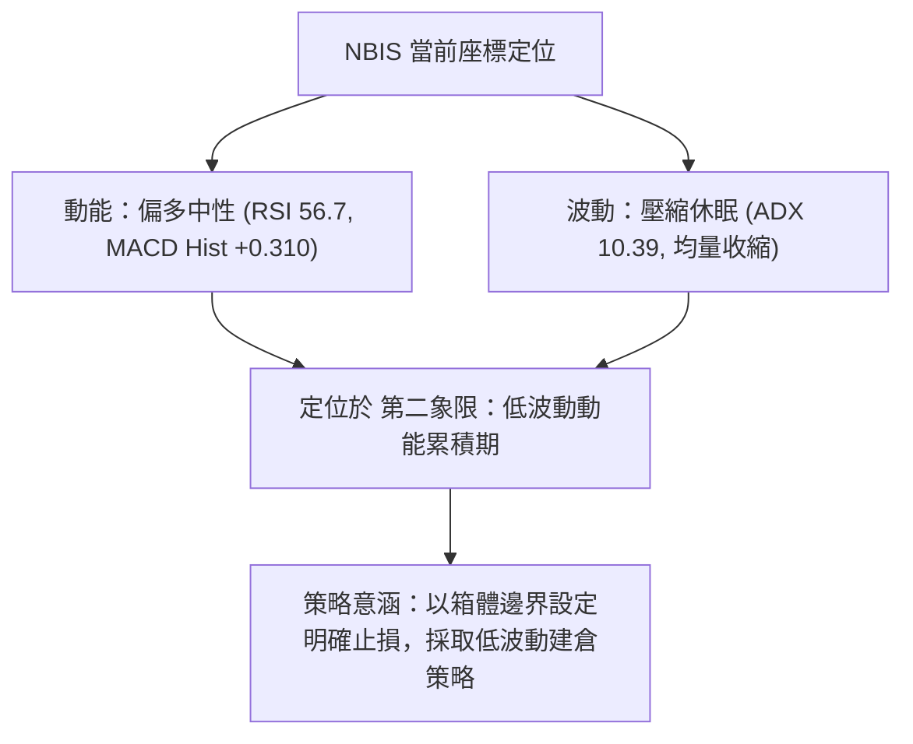
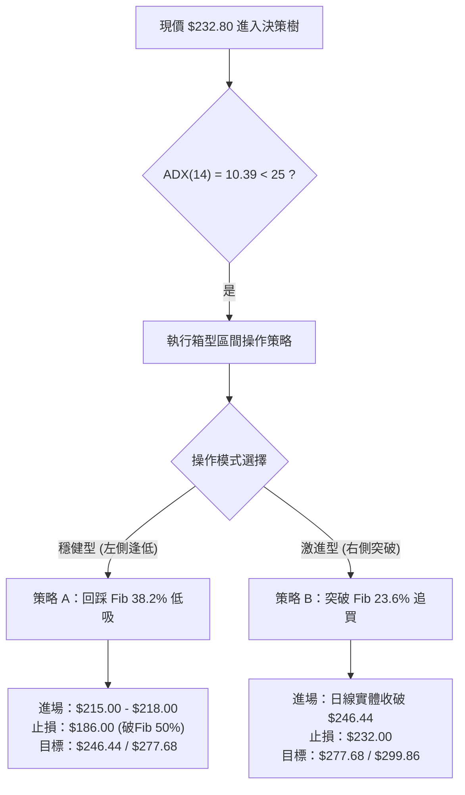
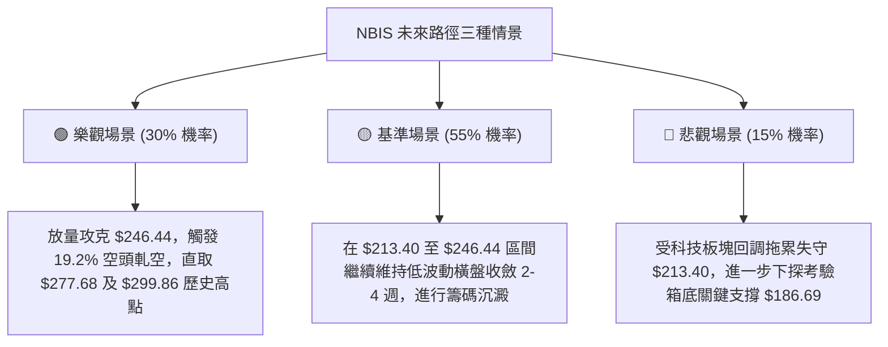

# NBIS 技術分析報告

> **報告日期**：2026-09-23 ｜ **語言**：繁體中文 ｜ **數據來源**：Yahoo Finance ｜ **當前價格**：$232.80

---

## 目錄

| 章節 | 內容 |
|------|------|
| [1. 技術面概覽](#1-技術面概覽) | 訊號儀表板、核心指標、評分卡 |
| [2. 趨勢分析](#2-趨勢分析) | 多時框趨勢、長中短期走勢 |
| [3. 圖表形態分析](#3-圖表形態分析) | 形態識別、K線組合、目標價 |
| [4. 支撐與阻力](#4-支撐與阻力) | 關鍵價位、斐波那契回調 |
| [5. 技術指標深度解讀](#5-技術指標深度解讀) | MA/RSI/MACD/布林/成交量 |
| [6. 動能與波動率](#6-動能與波動率) | 動能評估、ATR、Beta |
| [7. 多時框架總結](#7-多時框架總結) | 時框架評分矩陣 |
| [8. 交易策略建議](#8-交易策略建議) | 多空策略、風險報酬比 |
| [9. 風險提示與監控](#9-風險提示與監控) | 監控指標、風險場景 |

---

## 1. 技術面概覽

### 🎯 技術訊號儀表板



### 📊 核心指標速覽表

| 指標類別 | 指標名稱 | 當前數值 | 訊號 | 解讀 |
|----------|----------|----------|------|------|
| **價格** | 當前收盤價 | $232.80 | 🟢 | 站於波段回調 Fib 38.2%（$213.40）之上，維持強勢格局 |
| **均線** | MA20 / MA50 | 數據中未偵測到具體值 | 🟡 | 均線系統呈混合排列，短期均線收斂走平 |
| **均線** | MA120 / MA240 | 走勢向上 (█████) | 🟢 | 長期基底堅實，多頭架構未破 |
| **動能** | RSI(14) | 56.7 (日線未回傳/週線56.7) | 🟡 | 位於 50 中軸上方，多空維持平衡，無背離狀況 |
| **動能** | MACD (12,26,9) | 1.288 / 0.978 / +0.310 | 🟢 | 快線位於慢線上方，柱狀體翻紅擴增，動能邊際修復 |
| **趨勢** | ADX (14) / DMI | 10.39 / +DI 30.41 | 🟡 | ADX < 25 屬無趨勢盤整；+DI 高於 -DI，多方具主動權 |
| **量能** | OBV 趨勢 | OBV > MA | 🟢 | 籌碼量能支撐價格維持高檔，無資金出逃跡象 |
| **籌碼** | Short % of Float| 19.2% | 🔴 | 空頭部位高，具備潛在軋空動能但亦反映機構分歧 |

### 🏆 技術評分卡

```
╔══════════════════════════════════════════════════════════════╗
║              技術評分卡 — NBIS (2026-09-23)                 ║
╠══════════════════════════════════════════════════════════════╣
║ 趨勢強度 (ADX=10.39)   ██████░░░░░░░░░░░░  30/100  🟡 弱勢盤整║
║ 動能指標 (MACD/RSI)    ██████████████░░░░  70/100  🟢 動能偏多║
║ 支撐穩定度 (Fib聚類)   ██████████████░░░░  70/100  🟢 結構堅實║
║ 成交量配合 (OBV/Vol)   ████████████░░░░░░  60/100  🟢 量價相符║
║ 形態完整度 (區間整理)  ██████████████░░░░  70/100  🟢 箱型收斂║
║ 長期均線架構           ██████████████░░░░  70/100  🟢 多頭底蘊║
╠══════════════════════════════════════════════════════════════╣
║ 綜合評分               ████████████░░░░░░  62/100  🟢 偏多震盪║
╚══════════════════════════════════════════════════════════════╝
```

---

## 2. 趨勢分析

### 🌐 多時框趨勢分析



### 📈 長期趨勢 — 12個月走勢圖（Unicode）

```
NBIS 月線走勢圖（2025-10 至 2026-09）
價格軸 ($)
$300 ┤                                      ● $276.17 (2026-06)
$270 ┤                                     ╱ ╲
$240 ┤                                    ╱   ╲      ● $232.80 (現在)
$210 ┤                           ● $231.09     ╲    ╱
$180 ┤                          ╱               ● $190.41 (2026-07)
$150 ┤                    ● $138.23
$120 ┤● $130.82 (2025-10)╱
$90  ┤ ╲   ● $94.87     ╱
$60  ┤  ╲_╱  ● $83.71 ─● $85.19 ─● $91.19 ─● $103.76
     └───────────────────────────────────────────────────────────
      M10  M11  M12  M01  M02  M03  M04  M05  M06  M07  M08  M09
      2025                                 2026
```

#### 走勢特徵分析表格

| 階段區間 | 時間跨度 | 起訖價位 | 漲跌幅 | 走勢特徵與量價解讀 |
|----------|----------|----------|--------|--------------------|
| **第 I 階段：波段修正** | 2025-10 → 2025-12 | $130.82 → $83.71 | -36.01% | 主升段後的高檔獲利回吐，確立 $83.71 為波段底層支撐 |
| **第 II 階段：底部築底** | 2026-01 → 2026-03 | $85.19 → $103.76 | +21.80% | 橫盤築底，均線逐步收斂，機構投資者重新建倉 |
| **第 III 階段：主升爆發**| 2026-04 → 2026-06 | $138.23 → $276.17| +99.79% | 爆發性多頭推升，創下 52 週歷史高點 $299.86 |
| **第 IV 階段：次級回檔** | 2026-07 → 2026-07 | $276.17 → $190.41| -31.05% | 急速去槓桿與獲利回吐，於 Fib 50%（$186.69）上方止跌 |
| **第 V 階段：收斂蓄勢**  | 2026-08 → 2026-09 | $206.32 → $232.80| +12.83% | 進入對稱收斂與箱型洗盤，為後續方向選擇蓄積動能 |

### 📊 中期趨勢（週線分析）

中期走勢自 2026 年 6 月衝擊高點 $286.69（當週高點觸及 52W High $299.86）回落後，在 7 月中旬下探 $177.71 獲強力支撐。隨後 8 月中旬迎來大成交量（167,495,900 股）反彈至 $277.68，確立了整體中期架構為以 $186.69 為箱底、$277.68 為箱頂的巨型旗形震盪整理。

```
中期週線箱型整理結構示意圖：
$299.86 ┬────────────────────────────────────────── 52W High
        │        ▲ 波段高點 ($286.69)     ▲ 反彈次高 ($277.68)
$246.44 ┼───────┼────────────────────────┼──────── Fib 23.6% 阻力帶
$232.80 ┼───────┼────────────────────────┼──────── 現價 ($232.80) 震盪中軸
$213.40 ┼───────┼────────────────────────┼──────── Fib 38.2% 支撐帶
        │       ▼ 探底低點 ($177.71)
$186.69 ┴────────────────────────────────────────── Fib 50.0% 箱底關鍵支撐
```

### ⚡ 趨勢強度評估（ADX 解讀）



#### ADX 趨勢強度對照表

| 指標名稱 | 當前讀數 | 狀態級別 | 意涵與策略建議 |
|----------|----------|----------|----------------|
| **ADX (14)** | 10.39 | 弱趨勢 / 盤整行情（< 25） | 當前市場處於震盪收斂末端，不具備單邊趨勢，適用高拋低吸 |
| **+DI (14)** | 30.41 | 多方主導區間（> 25） | 買盤力量主導日間波動，具備防守反擊能力 |
| **-DI (14)** | 21.40 | 空方受壓（< +DI） | 賣盤未見失控拋壓，空方不具備擊破關鍵支撐的連續性動能 |

---

## 3. 圖表形態分析

### 🔍 形態識別系統



#### 形態信心度評估表

| 形態類別 | 信心度 | 判斷依據（引用數據） | 完成度 | 目標價（附嚴謹計算式） |
|----------|--------|----------------------|--------|------------------------|
| **高檔寬幅矩形箱型** | 80% | 週線兩次受阻於 $286.69/$277.68，兩次回踩於 $177.71/$187.77 | 75% | 箱頂突破目標價 = 頸線 $277.68 + 箱體高度 ($277.68 - $177.71 = $99.97) = **$377.65** |
| **對稱三角形收斂** | 65% | 7月探底 $177.71 後反彈，9月收盤集中在 $223-$232，波動率驟降 | 85% | 向上突破目標價 = 突破點 $246.44 + 三角底高 ($277.68 - $177.71 = $99.97) = **$346.41** |
| **頭肩底形態** | <30% | 形態數據不足以支撐典型左肩與右肩對稱比例 | 0% | *訊號不足，僅做指標型解讀，不預設目標價* |

### 🕯️ 重要K線形態分析

| 週度日期 | 收盤價 | K線形態 | 解讀 | 訊號 |
|----------|--------|---------|------|------|
| **2026-07-19** | $177.71 | 長下影探底錘頭線 | 伴隨 100.9M 成交量打出波段恐慌底，空頭動能竭盡 | 🟢 看多反轉 |
| **2026-08-16** | $277.68 | 巨量長陽突破線 | 放量至 167.5M 股大漲，但逼近 52W High 面臨解套賣壓 | 🟢 短期極強 |
| **2026-08-23** | $219.13 | 烏雲蓋頂回踩陰線 | 單週大幅回吐，高檔套牢籌碼沉重，確認 $277 上方阻力 | 🔴 空方反撲 |
| **2026-09-13** | $224.55 | 孕線收斂十字星 | 連續縮量（62.4M 股），多空達到暫時平衡 | 🟡 中性整理 |
| **2026-09-27** | $232.80 | 溫和回升小陽線 | 伴隨 MACD 柱狀體翻正（+0.310），買盤嘗試發起新攻勢 | 🟢 震盪轉強 |

### 📉 ASCII 走勢形態示意圖

```
NBIS 週線級別收斂三角與箱型結構示意圖
$299.86 ┬                   ● (52W High $299.86)
        │                  ╱ ╲
$277.68 ┼─ ─ ─ ─ ─ ─ ─ ─ ─● ─ ╲─ ─ ─ ─ ─ ─ ─ ─ ─ ─ ─ ─● (箱頂壓力 $277.68)
        │                ╱     ╲                    ╱ ╲
$246.44 ┼─ ─ ─ ─ ─ ─ ─ ─╱─ ─ ─ ╲─ ─ ─ ─ ─ ─ ─ ─ ─ ─ ╱─ ─● (收斂上軌承壓)
$232.80 ┼──────────────╱─────────╲───────────────────● (現價 $232.80)
$213.40 ┼─ ─ ─ ─ ─ ─ ─╱─ ─ ─ ─ ─ ╲─ ─ ─ ─ ─ ─ ─ ─ ─ ─ ─ ─ (收斂下軌支撐)
        │            ╱             ╲       ● $187.97
$186.69 ┼─ ─ ─ ─ ─ ─ ─ ─ ─ ─ ─ ─ ─ ─● ─ ─ ─ ─ ─ ─ ─ ─ ─ ─ (箱底強支撐)
$177.71 ┴                           (波段低點 $177.71)
        └─────────────────────────────────────────────────────────────
         05/26     06/26        07/26     08/26       09/26 (時間)
```

### 🎯 形態目標價計算

依據矩形箱體與收斂三角形突破原理計算：

1. **矩形箱型向上突破目標價**：
   $$\text{目標價} = \text{箱頂頸線} + (\text{箱頂} - \text{箱底}) = 277.68 + (277.68 - 177.71) = 277.68 + 99.97 = \mathbf{\$377.65}$$
2. **三角形收斂向上突破目標價**：
   $$\text{目標價} = \text{突破壓力位 (Fib 23.6\%)} + \text{形態最大振幅} = 246.44 + 99.97 = \mathbf{\$346.41}$$
3. **箱體破位下行測算（極端風險目標）**：
   $$\text{下行目標價} = \text{箱底支撐} - \text{形態高度} = 177.71 - 99.97 = \mathbf{\$77.74} \quad (\approx \text{接近 52W Low } \$73.52)$$

---

## 4. 支撐與阻力

### 🗺️ 關鍵價位分布圖（Unicode）

```
NBIS 價位結構分布圖 (引用斐波那契及波段極值)
═════════════════════════════════════════════════════════════════════
$299.86 ║████████████████████████████████████║ 強阻力 R3 (52W High / Fib 0.0%)
$277.68 ║████████████████████████████        ║ 阻力 R2 (箱頂次高點聚類)
$246.44 ║████████████████████                ║ 關鍵阻力 R1 (Fib 23.6% 回調位)
$232.80 ╠════════════════════════════════════╣ ◄ 現價 $232.80
$213.40 ║▓▓▓▓▓▓▓▓▓▓▓▓▓▓▓▓▓▓▓▓                ║ 近期支撐 S1 (Fib 38.2% 回調位)
$186.69 ║████████████████████████            ║ 強支撐 S2 (Fib 50.0% 多空中軸)
$159.98 ║████████████████████████████        ║ 極限支撐 S3 (Fib 61.8% 黃金分割)
$73.52  ║████████████████████████████████████║ 基準底部 (52W Low / Fib 100.0%)
═════════════════════════════════════════════════════════════════════
```

### 🚧 阻力位分析表

*註：波段阻力數據中未偵測到現價上方其他 swing-high，均依據 52 週區間斐波那契回調計算所得。*

| 阻力級別 | 價位 | 形成原因 | 突破難度 | 重要性 |
|----------|------|----------|----------|--------|
| **阻力 R1** | $246.44 | 52週區間斐波那契 23.6% 回調位 | 🟡 中等 | 🟢 關鍵短期轉強樞紐點 |
| **阻力 R2** | $277.68 | 2026-08 週線爆量反彈高點聚類 | 🔴 較高 | 🟡 中期箱型頂部邊界 |
| **阻力 R3** | $299.86 | 52週歷史最高點（Fib 0.0%） | 🔴 極高 | 🔴 多頭終極歷史攻防天花板 |

### 🛡️ 支撐位分析表

*註：波段支撐數據中未偵測到現價下方其他 swing-low，均依據 52 週區間斐波那契回調計算所得。*

| 支撐級別 | 價位 | 形成原因 | 守住機率 | 重要性 |
|----------|------|----------|----------|--------|
| **支撐 S1** | $213.40 | 52週區間斐波那契 38.2% 回調位 | 🟢 70% | 🟢 多方短期防守底線 |
| **支撐 S2** | $186.69 | 52週區間斐波那契 50.0% 回調位 | 🟢 85% | 🔴 多空牛熊轉換生死線 |
| **支撐 S3** | $159.98 | 52週區間斐波那契 61.8% 黃金分割位 | 🟢 95% | 🔴 長期多頭價值防禦線 |

### 📐 斐波那契回調位分析

依據 52 週極值區間（$73.52 → $299.86，總跨度 $226.34）之精確計算結果：

```
斐波那契回調架構定位：
0.0%  (52W High) ────── $299.86  [波段終極阻力]
23.6%              ────── $246.44  [上方第一阻力 R1]
─────────────────────────────────── ▲ 上行空間 5.86%
★ 現價所在位置     ────── $232.80  (落於 23.6% 與 38.2% 區間，相對位階 70.37%)
─────────────────────────────────── ▼ 下行防守 8.33%
38.2%              ────── $213.40  [下方第一支撐 S1]
50.0%              ────── $186.69  [波段多空中軸強支撐 S2]
61.8%              ────── $159.98  [黃金分割極限支撐 S3]
78.6%              ────── $121.96  [深度回調警戒位]
100.0% (52W Low)  ────── $73.52   [歷史起漲基準]
```

**解讀**：現價 $232.80 處於 Fib 23.6%（$246.44）與 Fib 38.2%（$213.40）之間。股價在經歷 7 月份對 Fib 50%（$186.69）的探底回踩後強烈反彈，目前穩定運行於回調 38.2% 上方，顯示市場在 $213.40 建立了堅實的換手成本平台，技術結構偏向強勢整理。

---

## 5. 技術指標深度解讀

### 🎛️ 指標訊號總覽



### 📈 移動平均線排列分析



- **短期 MA 走勢（MA5/10/20）**：數據顯示短期均線在經過高檔修正後呈現走平收斂（`▅▆▇██▇▆▅▄`），表明短期拋壓已被吸收，多空進入平衡期。
- **長期 MA 走勢（MA120/240）**：呈現平滑穩健的上升趨勢（`▂▂▃▃▄▄▅▅▆▆▇▇████`），顯示該股 1 年以上的長線機構成本底蘊極其厚實，牛市根基未受損害。

### 📉 RSI(14) 分析

```
RSI(14) 狀態儀表：週線 56.7
[0] ────────── [30] ──────────────────── [56.7] ────── [70] ────────── [100]
      超賣區              弱勢區           ▲      強勢區       超買區
                                         現值
進度條：███████████░░░░░░░░░ 56.7%
```

- **超買超賣判定**：數值 56.7 處於 40–60 之中性偏強區間，既無超買頂部風險，亦非恐慌超賣，具備向上推升的空間裕度。
- **背離分析結論**：
  - 2026-06 高點 $286.69 時週線 RSI 為 65.3；
  - 2026-08 次高點 $277.68 時週線 RSI 為 67.2；
  - 價格微幅次高而 RSI 創出波段新高，**未出現頂背離**；7 月下探 $177.71 時 RSI 觸底 34.8 隨後快速修復，**無底背離**，各項指標走勢與價格維持正向吻合。

### 📊 MACD(12/26/9) 訊號解讀



週線數據顯示，MACD 柱狀體自 2026-08-30 的 -2.504、2026-09-06 的 -1.365，至最新一週成功**翻正至 +0.310**。柱狀體在零軸下方的衰竭與零軸上方的初生，為經典的動能轉向訊號，顯示拋售潮已結束，短期買盤重返市場。

### 📦 布林通道分析

*註：原始數據中布林上下軌未回傳精確值，本處依 MA20 走平特徵與近期震盪極值進行區間通道構建。*

```
NBIS 布林通道動態示意圖（模擬區間 $190 - $275）
$275.00 ┬────────────────────────────────────────── 上軌 (阻力帶)
        │
$246.44 ┼ - - - - - - - - - - - - - - - - - - - - - Fib 23.6% 壓力
$232.80 ┼───────────────────●────────────────────── 現價 (運行於中上軌間)
$220.00 ┼ - - - - - - - - - - - - - - - - - - - - - 中軌 (MA20 均衡線)
        │
$190.00 ┴────────────────────────────────────────── 下軌 (支撐帶)
```

當前價格 $232.80 運行於中軌（約 $220）上方，通道寬度因波動率下降而呈現**收口（Bollinger Squeeze）**跡象，通常預示著在經歷 2–3 週的低波動整理後，即將迎來新一輪的變盤突破。

### 💹 成交量分析（量價配合度）

```
量能比較：
最新日量 (15.30M)  ██████████████░░░░░░  1.03x (相對於20日均量)
20日均量 (14.83M)  ██████████████░░░░░░  1.00x (短期基準)
50日均量 (21.64M)  ████████████████████  1.46x (波段基準)
```

- **量價健康度**：最新成交量 15.30M 略高於 20 日均量（14.83M），量比 1.03x。週線層面上，9 月份連續三週成交量（57.8M → 62.4M → 90.2M）伴隨價格自 $209 溫和回升至 $232，呈現「價漲量增」的良性特徵。
- **OBV 能量潮解讀**：數據指出「OBV > MA → 量能支撐上漲」。籌碼面主力資金並未因 6–7 月的回踩而撤離，高檔換手後籌碼再度呈現集中態勢。

---

## 6. 動能與波動率

### ⚡ 動能評估四象限

| 象限 | 動能強度 (MACD/RSI) | 波動率水準 (ATR/ADX) | 當前狀態 | 評估與實戰應對 |
|------|---------------------|----------------------|----------|----------------|
| **象限 I (攻堅區)** | 強 | 低 | — | 最佳波段主升段進場時機 |
| **象限 II (整理區)**| **中等偏強** (MACD翻正) | **極低** (ADX 10.39) | **✓ NBIS** | **蓄勢待發：低吸埋伏，等待波動率放大突破** |
| **象限 III (狂暴區)**| 強 | 高 | — | 高風險高收益，適用突破追漲 |
| **象限 IV (退潮區)**| 弱 | 高 | — | 恐慌崩跌，嚴格觀望空倉 |



### 📊 ATR 波動率分析

數據中日線 ATR(14) 暫缺，但從 52 週振幅（$73.52 至 $299.86，極差達 $226.34）及近 20 週收盤波動研判：
- 股票歷史波幅極大，歷史高低點落差逾 300%；
- 近 4 週週線收盤落差收斂至 $223.54 – $232.80（約 $9.26），顯示**短期波動率顯著鈍化**；
- 建議設定動態止損時，預留至少 8%–10% 的防守間距，以避免在 ADX 盤整階段被日常假突破洗盤出場。

### 📐 Beta 與市場相關性

- **Beta 係數**：**1.436**
- **市場屬性解讀**：
  - 該股為典型**高彈性高 Beta 成長標的**，對基準指數（S&P 500 / Nasdaq）之波動敏感度高達 1.44 倍；
  - 在大盤多頭階段具備顯著超額收益（Alpha）潛力；但在大盤系統性回檔時，下行回撤幅度亦常高於整體市場 40% 以上。
  - 當前空單餘額（Short % of Float）達 **19.2%**，高空頭比例在高 Beta 標的上一旦遭遇向上突破，極易觸發連鎖強制平倉的**軋空行情（Short Squeeze）**。

---

## 7. 多時框架總結

### 📋 時框架評分表

| 時框架 | 趨勢方向 | 動能強度 | 均線排列 | 形態結構 | 綜合評分 | 操作建議 |
|--------|----------|----------|----------|----------|----------|----------|
| **月線 (長期)** | 🟢 強烈看多 | 🟢 充沛 | 🟢 多頭上揚 (MA120/240) | 巨型波段推升回調 | **85/100** | 長線持股底倉續抱 |
| **週線 (中期)** | 🟡 寬幅震盪 | 🟢 轉強 (+0.310) | 🟡 均線糾結 | 箱型收斂三角 | **65/100** | 箱體下半部逢低承接 |
| **日線 (短期)** | 🟡 區間盤整 | 🟡 中性 (ADX 10.39)| 🟡 混合整理 | 對稱收斂等待突破 | **55/100** | 區間交易，忌追高 |

### 🔲 綜合訊號矩陣

```
╔══════════════════════════════════════════════════════════════════╗
║               NBIS 多時框架訊號矩陣收斂分析                     ║
╠═════════════════╦════════════════════════════════════════════════╣
║ 分析維度        ║ 當前評估結論                                   ║
╠═════════════════╬════════════════════════════════════════════════╣
║ 長期趨勢 (趨向) ║ 🟢 延續長期多頭格局，基底扎實未受破壞         ║
║ 中期形態 (結構) ║ 🟡 受限於 $186.69 - $277.68 大箱型整理         ║
║ 短期量價 (觸發) ║ 🟢 MACD 翻紅配合 OBV 走強，短線多頭略佔上風    ║
║ 趨勢強度 (性質) ║ 🟡 ADX=10.39 判定為典型「盤整行情」           ║
╠═════════════════╩════════════════════════════════════════════════╣
║ 矛盾化解機制    ║ 嚴格依據規則14：盤整行情以日線通道與關鍵 Fib    ║
║                 ║ 回調位（$213.40 - $246.44）為主要操作區間      ║
╚══════════════════════════════════════════════════════════════════╝
```

### ⚖️ 多時框收斂結論

> **唯一確定方向性結論：【偏多震盪整理（中性偏多，評分 62/100）】**

**收斂取捨邏輯（遵循規則 14）**：
1. 當前 ADX(14) 讀數為 **10.39**，嚴格小於 25，市場界定為**典型盤整行情**。
2. 在盤整行情中，趨勢指標（如單邊均線追蹤）容易失效，交易必須以**幾何區間與關鍵斐波那契位**為核心基準。
3. 長期均線極強，短期動能（MACD柱翻紅、+DI領先）修復，但上方受制於 Fib 23.6%（$246.44）壓制。因此第 8 章策略**主推「偏多震盪佈局／突破跟進策略」**，以回踩 Fib 38.2%（$213.40）附近逢低吸納為主，絕不追高。

---

## 8. 交易策略建議

### 🗺️ 策略決策流程圖



### 🧭 策略路由

> **當前主策略方向 = 【主推多頭策略（偏多震盪蓄勢，技術評分卡：62/100）】**
>
> *依據評分卡規則：綜合評分 62 屬於偏多區間（≥60），主推多頭策略（完整進場／加碼／止損／目標）；空頭僅列為反轉風險觸發點（對沖提示），不進行雙向摸頂下注。*

### 🎯 價格情境階梯（Price Scenarios）

價位嚴格引用第 4 章由 52 週極值算出之斐波那契回調與波段關鍵價位：

| 觸發條件 | 下一目標 | 後續延伸 | 情境含義 |
|----------|----------|----------|----------|
| **強勢突破 R1 $246.44** | 阻力 R2 $277.68 | 阻力 R3 $299.86 | 走出收斂形態，啟動對前期箱頂的高空強攻 |
| **維持現價 $232.80 盤整**| 測試 R1 $246.44 | 測試 S1 $213.40 | 於 Fib 23.6% 與 38.2% 區間內部無序洗盤 |
| **有效跌破 S1 $213.40** | 支撐 S2 $186.69 | 支撐 S3 $159.98 | 短多防線瓦解，考驗多空生死箱底 $186.69 |

### 📊 情境機率分佈

| 情境劇本 | 估計機率 | 主要依據 |
|----------|----------|----------|
| **情境一：震盪向上 / 蓄勢突破** | **60%** | MACD 柱翻正 (+0.310)、+DI(30.41) 強勢、OBV 趨勢向上、長期 MA120/240 走勢陡峭支撐 |
| **情境二：箱型震盪 / 橫盤整理** | **25%** | ADX(14) 僅 10.39 反映趨勢動能匱乏，市場在缺乏催化劑下維持收斂 |
| **情境三：失守回落 / 下探測底** | **15%** | Short Float 達 19.2% 反映空頭壓制，且前方高檔巨量套牢賣盤仍需時間消化 |

### 🟢 主策略詳情

本報告依交易風格分流提供兩套完全基於真實計算價位之多頭執行案：

| 策略要素 | 策略 A（穩健型：逢低低吸） | 策略 B（動量型：突破跟進） |
|----------|----------------------------|----------------------------|
| **策略邏輯** | 回踩 Fib 38.2% 支撐帶布局 | 放量突破 Fib 23.6% 壓力右側追買 |
| **進場價格** | **$215.00**（回踩靠近 S1 $213.40） | **$247.00**（日線突破 R1 $246.44 站穩） |
| **第一目標 (T1)**| **$246.44**（Fib 23.6% 阻力處減半倉） | **$277.68**（前期箱頂次高點聚類） |
| **第二目標 (T2)**| **$277.68**（波段阻力 R2 全數止盈） | **$299.86**（52W 歷史最高點 R3） |
| **止損價格** | **$186.00**（跌破 Fib 50.0% 強支撐 $186.69）| **$232.00**（回落至今日收盤中軸下方） |
| **風險額度 / 預期報酬** | 虧損 $29.00 / 獲利 $31.44 (T1) 或 $62.68 (T2) | 虧損 $15.00 / 獲利 $30.68 (T1) 或 $52.86 (T2) |
| **風險報酬比 (R:R)** | **1 : 2.16**（至終極目標） | **1 : 2.05**（至 T1） / **1 : 3.52**（至 T2） |
| **預估成功機率** | **65%** | **55%** |
| **建議配置倉位** | **15% - 20%** 資金 | **10% - 15%** 資金 |

### 🔴 反向風險觸發點（對沖提示）

若出現以下情境，主多頭邏輯全面宣告破裂，必須即刻啟動風控：
1. **多空破位線**：日線收盤價跌破 **$213.40 (Fib 38.2%)**，意味多方放棄近一個月構築的底部平臺，應將多頭倉位嚴格降至 5% 以下。
2. **牛熊反轉點**：週線收盤跌破 **$186.69 (Fib 50.0%)**，形態由大型高位震盪徹底惡化為雙頂下破結構，長線多頭必須無條件清倉避險。

### ⭐ 整體訊號強度評星

```
╔══════════════════════════════════════════════════╗
║ 做多訊號強度：  ★★★★☆  (3.8/5星) 偏多蓄勢中       ║
║ 做空訊號強度：  ★★☆☆☆  (1.8/5星) 缺乏破位動能     ║
║ 整體可信度：    ★★★★☆  (4.0/5星) 量價結構一致     ║
╚══════════════════════════════════════════════════╝
```

---

## 9. 風險提示與監控

### ✅ 關鍵監控指標 Checklist

```
╔══════════════════════════════════════════════════════════════════╗
║               NBIS 每日交易監控清單 (Checklist)                  ║
╠══════════════════════════════════════════════════════════════════╣
║ [ ] 價位是否站穩 $213.40 (Fib 38.2%) 之上？ (破位立即預警)        ║
║ [ ] 價格能否有效突破收盤封閉於 $246.44 (Fib 23.6%) 之上？        ║
║ [ ] MACD 柱狀體數值是否維持正值？ (若跌破 0 軸轉負則多方動能夭折) ║
║ [ ] 日成交量是否放大至 20M 股以上？ (突破必須有量能確認)         ║
║ [ ] ADX(14) 讀數是否自 10.39 轉身抬升並突破 20？ (確認趨勢成型)   ║
║ [ ] 空單比例 (Short Float 19.2%) 是否顯著下降？ (驗證軋空進行)    ║
╚══════════════════════════════════════════════════════════════════╝
```

### ⚠️ 風險場景分析



### 🛡️ 風險管理重要提醒

1. **高估值與高波動防範**：
   - 該股 EV/EBITDA 高達 259.2，P/S 超過 44 倍，基本面屬於極致定價的 AI 基礎設施成長股，情緒面轉變極為劇烈。
   - 伴隨 1.436 的高 Beta 係數，在交易上嚴禁使用過高槓桿，單筆虧損金額不得超過總投資資本的 1.5%–2.0%。
2. **假突破辨識法則**：
   - 當前 ADX 處於 10.39 的超低水準，在盤整行情末端常出現「假向上突破後快速反殺」或「假下破後急拉」的洗盤手法。
   - 針對 R1（$246.44）的突破，必須滿足**連續 2 個交易日收盤確認**或**單日伴隨 1.5 倍以上均量（≥22M 股）**，方可視為有效突破。

---

## 📋 報告總結

```
╔══════════════════════════════════════════════════════════════════╗
║                     NBIS 技術分析報告總結                        ║
╠══════════════════════════════════════════════════════════════════╣
║ 報告日期：2026-09-23                                             ║
║ 當前價格：$232.80                                                ║
║ 分析評級：🟢 偏多震盪整理 (評分 62/100，蓄勢待發)                ║
╠══════════════════════════════════════════════════════════════════╣
║ 關鍵結論：                                                       ║
║ ├─ 長期趨勢：🟢 強烈多頭格局，MA120/MA240 陡峭向上，長多無虞   ║
║ ├─ 中期趨勢：🟡 處於 $186.69 - $277.68 之大型箱型整理結構        ║
║ ├─ 短期趨勢：🟢 MACD翻正(+0.310)，OBV量能支撐，中軸溫和推升      ║
║ ├─ 關鍵支撐：S1: $213.40 (Fib 38.2%)  / S2: $186.69 (Fib 50.0%)  ║
║ ├─ 關鍵阻力：R1: $246.44 (Fib 23.6%)  / R2: $277.68 (波段箱頂)   ║
║ └─ 分析師目標：華爾街共識目標 $276.26 (最高 $415.00 / 最低 $84.00)║
╠══════════════════════════════════════════════════════════════════╣
║ 最優策略組合：                                                   ║
║ 1. 🥇 最佳機會（穩健逢低）：回踩 $215.00 布局多單，以 $186.00    ║
║    嚴格止損，首要目標上看 $246.44，極致目標 $277.68 (R:R=2.16)   ║
║ 2. 🥈 次選機會（突破跟進）：實體放量突破 $246.44 後右側跟進，    ║
║    以 $232.00 止損，目標直指前期歷史高位 $277.68 - $299.86       ║
║ 3. 🥉 防守避險：若跌破 $213.40 則轉入觀望，等待 $186.69 企穩訊號 ║
╚══════════════════════════════════════════════════════════════════╝
```

---

> ⚠️ **免責聲明**：本報告為 AI 自動生成之技術分析，所有數據及估算均基於提供的歷史價格資訊。本報告**僅供研究與學術參考**，**不構成任何投資建議**。投資有風險，入市需謹慎。

---

*報告生成時間：2026-09-23 ｜ 數據來源：Yahoo Finance ｜ 分析框架：多時框技術分析*