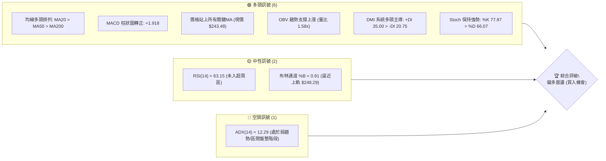
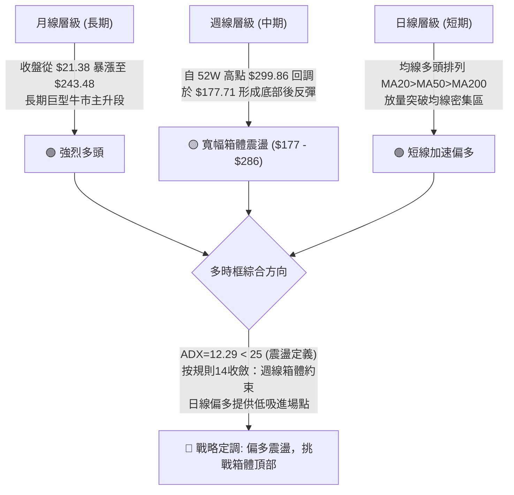
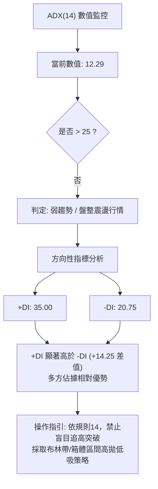
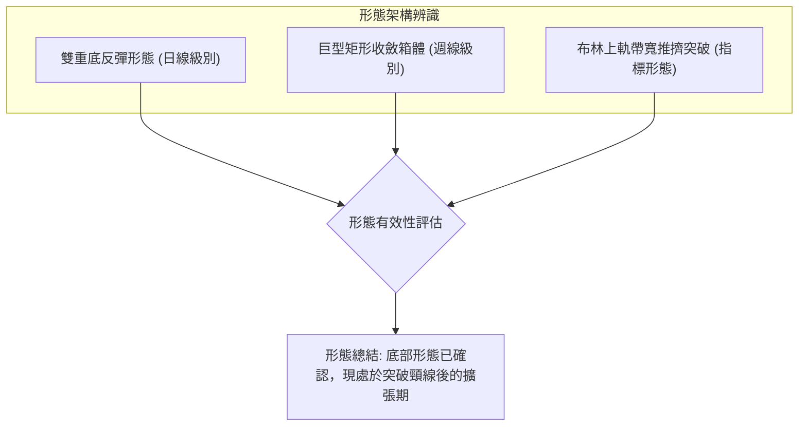
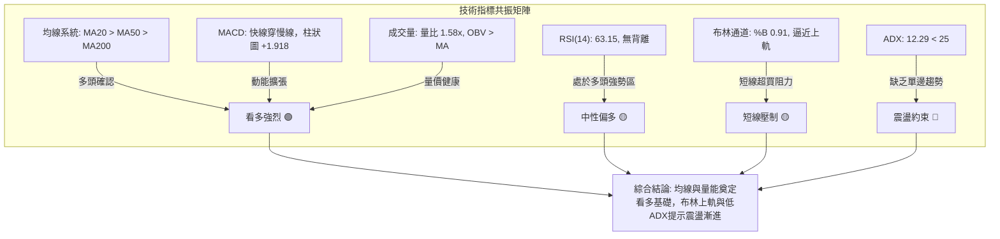
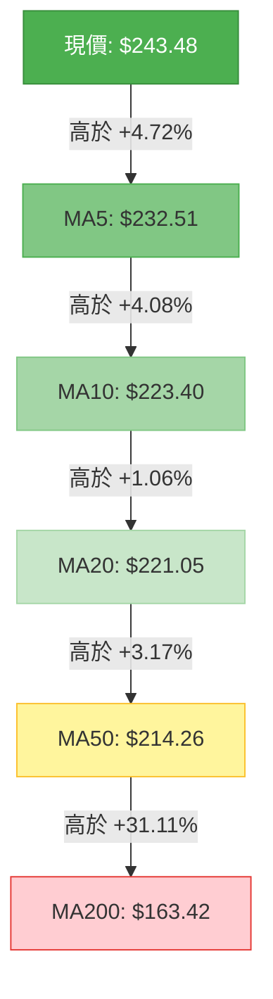
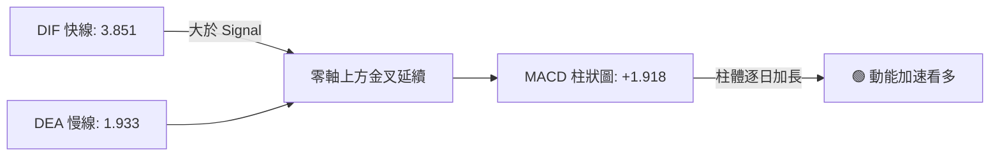
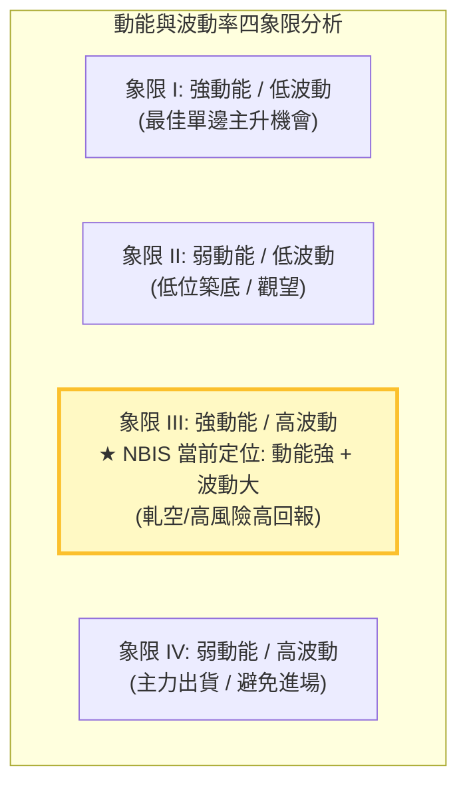
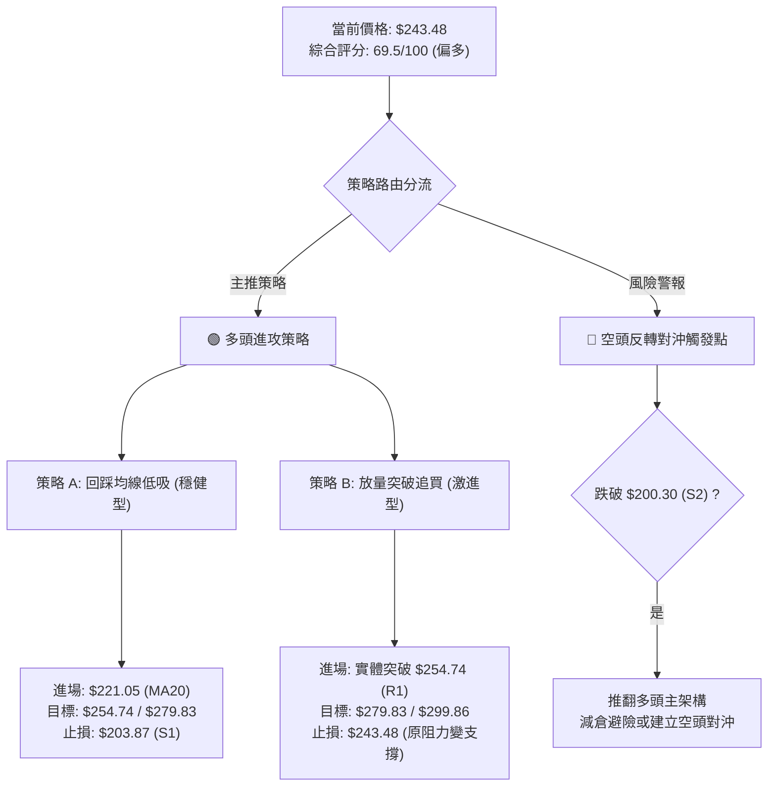
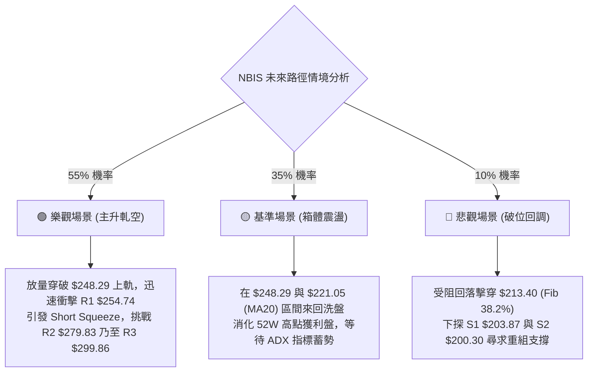

# NBIS 技術分析報告

> **報告日期**：2026-09-25 ｜ **語言**：繁體中文 ｜ **數據來源**：Yahoo Finance ｜ **當前價格**：$243.48

---

## 目錄

| 章節 | 內容 |
|------|------|
| [1. 技術面概覽](#1-技術面概覽) | 訊號儀表板、核心指標、評分卡 |
| [2. 趨勢分析](#2-趨勢分析) | 多時框趨勢、長中短期走勢 |
| [3. 圖表形態分析](#3-圖表形態分析) | 形態識別、K線組合、目標價 |
| [4. 支撐與阻力](#4-支撐與阻力) | 關鍵價位、斐波那契回調 |
| [5. 技術指標深度解讀](#5-技術指標深度解讀) | MA/RSI/MACD/布林/成交量 |
| [6. 動能與波動率](#6-動能與波動率) | 動能評估、ATR、Beta |
| [7. 多時框架總結](#7-多時框架總結) | 時框架評分矩陣 |
| [8. 交易策略建議](#8-交易策略建議) | 多空策略、風險報酬比 |
| [9. 風險提示與監控](#9-風險提示與監控) | 監控指標、風險場景 |
| [📋 報告總結](#-報告總結) | 關鍵結論與策略清單 |

---

## 1. 技術面概覽

### 🎯 技術訊號儀表板



### 📊 核心指標速覽表

| 指標類別 | 指標名稱 | 當前數值 | 訊號 | 解讀 |
|----------|----------|----------|------|------|
| **價格** | 當前價格 | $243.48 | 🟢 多頭 | 位於 52 週區間 75.1% 高位，突破主要均線群 |
| **均線** | MA20 | $221.05 | 🟢 多頭 | 現價高於 MA20 達 +10.15%，短中期動能轉強 |
| **均線** | MA50 | $214.26 | 🟢 多頭 | 現價高於 MA50 達 +13.64%，中期底部確立 |
| **均線** | MA200 | $163.42 | 🟢 多頭 | 現價大幅高於長期牛熊線 +48.99%，長期牛市格局無虞 |
| **動能** | RSI(14) | 63.15 | 🟡 中性偏多 | 處於 50-70 強勢擴張區，未見極端超買背離 |
| **動能** | MACD (12/26/9) | 3.851 / 1.933 | 🟢 多頭 | MACD 位於零軸上方且差離柱擴張至 +1.918 |
| **波動** | ATR(14) | $16.20 | 🟡 中度偏高 | 佔現價 6.65%，每日價格波動顯著，需寬幅防守 |
| **動能** | Stoch %K / %D | 77.87 / 66.07 | 🟢 多頭 | 快線維持於慢線上方，短期買盤主導反彈 |
| **趨勢強度** | ADX(14) | 12.29 | 🔴 弱趨勢 | 低於 25 臨界點，表明中期處於寬幅震盪結構而非單邊暴漲 |
| **通道** | 布林帶寬 (%B) | 0.91 | 🟡 邊界預警 | 緊貼上軌 $248.29，短線可能面臨均值回歸或需放量破軌 |
| **量能** | 當日量比 | 1.58x | 🟢 多頭 | 最新成交 24.29M 股，高於 20 日均量 15.40M 股，量價配合健康 |

### 🏆 技術評分卡

```
╔══════════════════════════════════════════════════════════════╗
║              技術評分卡 — NBIS (2026-09-25)                 ║
╠══════════════════════════════════════════════════════════════╣
║ 趨勢強度 (ADX/通道)   ██████░░░░░░░░░░░░░░  32/100  🔴 弱趨勢 ║
║ 動能指標 (RSI/MACD)   ████████████████░░░░  80/100  🟢 強多頭 ║
║ 支撐穩定度 (S1/S2/S3) ██████████████░░░░░░  72/100  🟢 紮實   ║
║ 成交量配合 (量比/OBV) ████████████████░░░░  78/100  🟢 量增價揚║
║ 形態完整度 (箱體/區間)████████████░░░░░░░░  60/100  🟡 構築中 ║
║ 均線排列 (全線多頭)   ████████████████████  95/100  🟢 完美排列║
╠══════════════════════════════════════════════════════════════╣
║ 綜合評分              ██████████████░░░░░░  69.5/100 🟢 偏多  ║
╚══════════════════════════════════════════════════════════════╝
```

---

## 2. 趨勢分析

### 🌐 多時框趨勢分析



### 📈 長期趨勢 — 12個月走勢圖（Unicode）

```
NBIS 月線收盤走勢圖（2025-10 至 2026-09）
價格軸 ($)
$280 ┤                                              ● (2026-06: $276.17)
$260 ┤                                             / \
$240 ┤                                            /   \      ● 現在 ($243.48)
$220 ┤                               ● (2026-05) /     \    /
$200 ┤                              /            /       ●--● (2026-07/08: $190.41/$206.32)
$180 ┤                             /            /
$160 ┤                            /            /
$140 ┤                           ● (2026-04)  /
$120 ┤● (2025-10: $130.82)      /             /
$100 ┤ \                       ● (2026-03)   /
 $80 ┤  ●---●---● (2025-12/2026-01: $83.71/$85.19)
     └─────────────────────────────────────────────────────────────
       10  11  12  01  02  03  04  05  06   07   08   09 (月份)
```

#### 過去 12 個月走勢特徵分析表

| 階段 | 時間區間 | 起止收盤價 | 漲跌幅 | 階段特徵與成交量結構 |
|------|----------|------------|--------|----------------------|
| **階段一：高位獲利回吐** | 2025-10 → 2025-12 | $130.82 → $83.71 | -36.01% | 2025 年第三季暴漲後的均值修正，尋求長期均線支撐。 |
| **階段二：築底打底吸籌** | 2025-12 → 2026-02 | $83.71 → $91.19 | +8.94% | 於 $83-$85 區間構築雙重底，波動率驟降，成交量萎縮，籌碼沉澱。 |
| **階段三：主升浪暴發** | 2026-02 → 2026-06 | $91.19 → $276.17 | +202.85% | 伴隨營收 454% 爆發式增長，月線連收 4 根大陽線，創歷史天價 $299.86。 |
| **階段四：劇烈寬幅洗盤** | 2026-06 → 2026-08 | $276.17 → $206.32 | -25.29% | 自高位深幅回撤至 $177.71，高空單比例（19.8% Float）與多頭主力激烈交鋒。 |
| **階段五：多頭二度集結** | 2026-08 → 2026-09 | $206.32 → $243.48 | +18.01% | 站回 MA20/MA50 上方，OBV 持續爬升，量能放大至 1.58x，準備上攻。 |

### 📊 中期趨勢（週線分析）

從近 20 週收盤走勢觀察，NBIS 展現出極高的週線波動性（週收盤於 $177.71 與 $286.69 間震盪）：
- **2026-06-21 週**：收於 $286.69（當週成交 92.36M 股），隨後受制於年內天價 $299.86。
- **2026-07-19 週**：空頭砸盤至 $177.71，但迅速獲得斐波那契 50.0%（$186.69）與波段低點支撐 S3（$194.80）一帶的強烈買盤介入。
- **2026-08-16 週**：單週放量 167.50M 股暴拉至 $277.68，驗證了下方逢低買盤的凶悍程度。
- **近四週（9月份）**：週收盤自 $209.18 逐週攀升至 $226.39、$224.55、$223.54，最終於 09-27 週收於 $243.48，MACD 週柱狀圖由負翻正（+1.918），確認中期洗盤結束，多方重掌定價權。

### ⚡ 趨勢強度評估（ADX 解讀）



#### ADX 趨勢強度判定對照表

| ADX 數值區間 | 趨勢狀態 | NBIS 當前數值 | 交易戰術意涵 |
|--------------|----------|---------------|--------------|
| **0 - 20** | **極弱趨勢 / 無趨勢盤整** | **12.29 🟢 當前位置** | 價格呈現高波動橫盤，趨勢指標失效，均線易反覆糾纏，應以區間震盪逢低布局為主。 |
| **20 - 25** | 趨勢醞釀期 | — | 波動率逐步收斂或準備方向選擇。 |
| **25 - 40** | 強趨勢形成 | — | 可執行突破追買策略與順勢波段持倉。 |
| **40 - 60** | 極強單邊趨勢 | — | 趨勢加速噴出段，嚴格追蹤移動止損。 |

---

## 3. 圖表形態分析

### 🔍 形態識別系統



#### 形態識別與信心度明細表

| 形態名稱 | 信心度 (%) | 判斷依據（引用實際數據） | 完成度 (%) | 目標價（附計算式） |
|----------|------------|--------------------------|------------|--------------------|
| **日線雙重底 (W-Bottom)** | **75%** | 兩次低點分別出現在 2026-07-19 收盤 $177.71 及近一年低點聚類 S3 $194.80，頸線位於 2026-08-30 收盤 $209.18。現價 $243.48 已明確站穩頸線。 | **100% (已突破)** | **$240.65**<br>計算式：頸線 $209.18 + 形態高度 ($209.18 - $177.71 = $31.47) = $240.65（已達成） |
| **週線巨型箱體震盪** | **65%** | 上軌受制於波段高點 R2 $279.83 與天價 R3 $299.86；下軌依託 S1 $203.87 與 S3 $194.80。 | **70%** | **$279.83** (箱體頂部 R2)<br>計算式：引用阻力位 R2 $279.83 作為震盪上限 |
| **旗形整合 (Bull Flag)** | **40% (訊號不足)** | 8月中旬巨量長紅至 $277.68 後回落，近期回調斜率不夠標準，且 ADX 僅 12.29，未滿足旗形典型動能要求。 | 30% | 訊號不足，依規則 15 僅作指標型解讀，不預設目標價。 |

### 🕯️ 重要K線形態分析

| 週期/月份 | 收盤價 | K線形態特徵 | 盤面語言解讀 | 訊號方向 |
|-----------|--------|-------------|--------------|----------|
| **2026-07 週線** | $177.71 | 長下影錘頭線 (Hammer) | 股價急跌至 52W 區間 50% 斐波那契位（$186.69）下方後爆發強勁抄底買盤，週成交破億股。 | 🟢 強烈看多底分型 |
| **2026-08-16 週** | $277.68 | 巨量大陽線 (Marubozu) | 週成交達 167.50M 股（近20週天量），空頭遭暴力軋空，奠定多頭回升基調。 | 🟢 極強多頭吞噬 |
| **2026-08-23/30** | $209.18 | 縮量二度回踩紅K | 隨後兩週成交萎縮至 70.18M 股，屬於標準的縮量回調，未破前低 S1 $203.87。 | 🟡 健康籌碼洗盤 |
| **2026-09-27 週** | $243.48 | 實體陽線站上布林中軌 | 放量站上 MA20（$221.05），收盤逼近波段阻力 R1（$254.74），多方發動攻擊。 | 🟢 短線多頭發散 |

### 📉 ASCII 走勢形態示意圖

```
NBIS 週線級別雙底與箱體形態示意
價格 ($)
$300 ┼───────────────────────────────────── R3: $299.86 (52W 高點)
     │                                 ▲
$280 ┼─────────[波峰 1]───────────────│───── R2: $279.83 (箱體頂部)
     │         $286.69              $277.68
$260 ┼─────────────────────────────────│─── R1: $254.74
     │                                 │   ★ 現價: $243.48
$240 ┼──────────────[頸線位: $209.18]────┼───────────────────────────
     │                  \             /│
$220 ┼───────\           \           / │
     │        \           \_________/  │
$200 ┼─────────\───────────────────────┼─── S1: $203.87 / S2: $200.30
     │          ▼                      │
$180 ┼──────[底 1: $177.71]            │─── S3: $194.80 
     └─────────────────────────────────┴────────────────────────
          2026-07                    2026-08/09
```

### 🎯 形態目標價計算

根據雙重底突破高度之經典測幅法則：
1. **基礎測量參數**：
   - 第一波段回調谷底價位 = **$177.71**（2026-07-19 週收盤）
   - 回踩洗盤之確認頸線位 = **$209.18**（2026-08-30 週收盤）
   - 形態垂直高度 ($H$) = $209.18 - $177.71 = **$31.47**
2. **第一階段形態目標價**：
   - $\text{Target 1} = \text{頸線} + H = 209.18 + 31.47 =$ **$240.65**（當前價格 $243.48 已有效達成並站穩該目標位上方）。
3. **第二階段延伸（箱體等幅對稱）目標價**：
   - 根據關鍵價位聚類，若多頭進一步突破近一年波段高點 R1（$254.74），則測幅空間直接打開至中期箱體上邊界阻力位 **R2: $279.83**（距離現價 +14.93%）。

---

## 4. 支撐與阻力

### 🗺️ 關鍵價位分布圖（Unicode）

```
NBIS 關鍵價位結構分布圖
═════════════════════════════════════════════════════════════════════
$299.86 ║████████████████████████████████████████║ 強烈阻力 R3 (52W 最高點)
$279.83 ║████████████████████████████            ║ 關鍵波段阻力 R2 (箱體頂)
$254.74 ║████████████████                        ║ 短線突破阻力 R1 (+4.62%)
$246.44 ╟────────────────────────────────────────╢ 斐波那契 23.6% 回調位
$243.48 ╠════════════════════════════════════════╣ ◄ 現價 ($243.48)
$221.05 ╟┈┈┈┈┈┈┈┈┈┈┈┈┈┈┈┈┈┈┈┈┈┈┈┈┈┈┈┈┈┈┈┈┈┈┈┈┈┈┈┈╢ 動態支撐: MA20 / 布林中軌
$213.40 ╟────────────────────────────────────────╢ 斐波那契 38.2% 回調位 (共振MA50)
$203.87 ║▓▓▓▓▓▓▓▓▓▓▓▓▓▓▓▓▓▓▓▓                    ║ 第一波段防守 S1 (-16.27%)
$200.30 ║▓▓▓▓▓▓▓▓▓▓▓▓▓▓▓▓▓▓▓▓▓▓▓▓                ║ 整數心理支撐 S2 (-17.73%)
$194.80 ║████████████████████████████████        ║ 極強波段低點 S3 (-19.99%)
$186.69 ╟────────────────────────────────────────╢ 斐波那契 50.0% 關鍵平衡位
═════════════════════════════════════════════════════════════════════
```

### 🚧 阻力位分析表

所有阻力數值嚴格引用 OHLCV 波段高點聚類計算數據：

| 阻力級別 | 價位 ($) | 距現價幅幅 | 形成原因與籌碼結構 | 突破難度 | 重要性權重 |
|----------|----------|------------|--------------------|----------|------------|
| **R1** | **$254.74** | +4.62% | 過去數月多次衝高受阻之日線高點密集區，亦與布林帶上軌（$248.29）形成上方壓力帶。 | 🟡 中等（需補量至 20M+ 股） | ★★★☆☆ |
| **R2** | **$279.83** | +14.93% | 2026-06 與 2026-08 兩度上攻失敗的波段雙頂高點，大量獲利盤與套牢盤積壓。 | 🔴 較高（空頭主要防線） | ★★★★☆ |
| **R3** | **$299.86** | +23.16% | 52 週歷史歷史極值點，$300 整數心理大關，機構與早期籌碼獲利了結天花板。 | 🔴 極高（需基本面超預期） | ★★★★★ |

### 🛡️ 支撐位分析表

所有支撐數值嚴格引用 OHLCV 波段低點聚類計算數據：

| 支撐級別 | 價位 ($) | 距現價幅幅 | 形成原因與籌碼結構 | 守住機率 | 重要性權重 |
|----------|----------|------------|--------------------|----------|------------|
| **S1** | **$203.87** | -16.27% | 近期洗盤回調之波段低點聚類，接近 MA60（$213.71）與 MA20（$221.05）下方緩衝區。 | 🟢 80% | ★★★☆☆ |
| **S2** | **$200.30** | -17.73% | $200.00 重大整數心理關卡，散戶與量化機構程式化止損/買單聚集帶。 | 🟢 85% | ★★★★☆ |
| **S3** | **$194.80** | -19.99% | 近一年核心低點防禦線，接近布林下軌（$193.81），跌破代表中期趨勢徹底反轉。 | 🟢 90% | ★★★★★ |

### 📐 斐波那契回調位分析

依據 52 週完整極端波動區間（最低 $73.52 至 最高 $299.86，垂直落差 $226.34）之精確計算：

```
0.0%  (52W High) ────────────────────────────────────────── $299.86
23.6% 回調位     ───────────────────────────┬────────────── $246.44
                                            │ ★ 現價 $243.48 (處於 23.6% 與 38.2% 區間)
38.2% 回調位     ───────────────────────────┴────────────── $213.40 (共振 MA50 $214.26)
50.0% 回調位     ────────────────────────────────────────── $186.69 (中期多空分水嶺)
61.8% 黃金分割位 ────────────────────────────────────────── $159.98 (共振 MA200 $163.42)
78.6% 回調位     ────────────────────────────────────────── $121.96
100.0% (52W Low) ────────────────────────────────────────── $73.52
```

- **當前位置解讀**：現價 $243.48 緊貼 **斐波那契 23.6%（$246.44）** 下方僅 1.2% 之處。此處是強勢回調的極限阻力點；若能實體放量收復 $246.44，代表自 $299.86 的回調被徹底消化，將開啟挑戰前高的主升通道。
- **下行強支撐共振**：**斐波那契 38.2%（$213.40）** 與目前向上移動的 **MA50（$214.26）** 形成極度完美的「價位-均線雙重共振支撐區」。只要股價拉回不破 $213.40，多頭技術架構毫無受損。

---

## 5. 技術指標深度解讀

### 🎛️ 指標訊號總覽



### 📈 移動平均線排列分析



#### 移動平均線數據對比表

| 均線名稱 | 數值 ($) | 與現價偏離度 | 歷史形態走勢 | 技術意義評定 |
|----------|----------|--------------|--------------|--------------|
| **MA5** | $232.51 | +4.72% | ▂▄▇█▇▆▅▃▂▂▂▂▂▁▁▁▁▂▃▄▄▄▃▂▂▂▂▃▄▄ | 極短期攻擊線，迅速掉頭向上，短多買氣熱絡 |
| **MA10** | $223.40 | +8.99% | ▁▃▅▅▅▆▇██▇▆▄▃▁▁▁▁▂▂▃▃▃▃▃▃▄▄▄▃▄ | 短期操盤線，上穿 MA20 形成金叉 |
| **MA20** | $221.05 | +10.15% | ▁▂▃▄▄▄▄▄▅▆▇▇▇▆▆▆▇████▇▆▅▅▅▅▆▆▆ | 月線級生命線，斜率轉正上翹，成為下檔首要動態支撐 |
| **MA60** | $213.71 | +13.93% | ▆▇████████▇▇▆▆▆▅▆▆▆▆▅▄▃▃▂▂▁▁▁▁ | 季線轉折走平後拐頭向上 |
| **MA120**| $207.42 | +17.39% | ▁▁▁▂▂▂▂▃▃▃▄▄▄▄▅▅▅▅▆▆▆▆▇▇▇▇████ | 半年線持續上行，多方基石穩固 |
| **MA200**| $163.42 | +48.99% | ▁▁▁▂▂▂▃▃▃▄▄▄▄▅▅▅▅▆▆▆▆▇▇▇▇█████ | 長期牛熊分界線，向上傾斜角度 >45°，極度看多 |

- **結論**：均線呈現教科書級別的「多頭順序排列」（MA5 > MA10 > MA20 > MA50 > MA60 > MA120 > MA200），所有週期均線全部發散向上，顯示各個週期的持倉籌碼均處於獲利狀態，拋壓極輕。

### 📉 RSI(14) 分析

```
RSI(14) 強度儀表
0 ══════════════ 30 ══════════════════ 50 ════════ 63.15 ═════ 70 ════════════ 100
[     超賣區     ] [      弱勢區       ] [  強勢區  ▲  ] [    極端超買區    ]
進度條: █████████████████████████████████████████████░░░░░░░░░░ 63.15%
```

- **數值解讀**：當前 RSI(14) 為 **63.15**，自 9 月初的低位（33.3）強力爬升，進入 60-70 的多頭加速區間，尚未突破 70 超買警戒線。
- **背離檢測**：
  - 前期價格高點（2026-08-16 收盤 $277.68）對應 RSI 為 67.2。
  - 當前價格回升至 $243.48，RSI 為 63.2，指標高度與價格反彈幅度匹配，**無頂背離現象**。
  - 9 月中旬股價在 $223-$226 橫盤時，RSI 率先由 33.3 彈升至 56.7，展現良好的內部動能修復，確認動能與價格同向健康擴張。

### 📊 MACD(12/26/9) 訊號解讀



- **指標解讀**：快線 DIF（3.851）與慢線 DEA（1.933）均運行在零軸上方，柱狀圖 Histogram 達到 **+1.918**。
- **週期連動性**：從近 20 週數據來看，週線 MACD 柱在歷經連續 4 週的負值壓制後（最低達 -2.504），本週強勢翻正為 **+1.918**，屬於典型的「零軸上二次回踩起漲」，此類訊號往往伴隨中期行情的展開。

### 📦 布林通道分析

```
NBIS 布林通道 (20, 2) 結構示意圖
價格 ($)
$248.29 ┤-------------------------------------- 布林上軌 (阻力位)
$243.48 ┤                    ● 現價 ($243.48，%B = 0.91)
$240.00 ┤                   /
$230.00 ┤                  /
$221.05 ┤=================●==================== 布林中軌 (MA20 基準線)
$210.00 ┤                /
$200.00 ┤               /
$193.81 ┤-------------------------------------- 布林下軌 (支撐位)
```

- **數值結構**：
  - **布林上軌**：$248.29
  - **布林中軌 (MA20)**：$221.05
  - **布林下軌**：$193.81
  - **通道帶寬**：$54.48（帶寬比率 24.6%）
  - **%B 指標**：**0.91**（高度貼近上軌）
- **技術解讀**：%B 達到 0.91 說明股價已經進入統計學意義上的「強勢上軌擠壓區」。在 ADX 較低（12.29）的環境下，股價直接穿軌大漲的機率較低，上軌 $248.29 與第一阻力 R1 $254.74 的重疊區間將在短期對多頭構成技術性壓制，易引發向中軌 $221.05 的均值回歸。

### 💹 成交量分析（量價配合度）

```
成交量走勢對比 (萬股)
最新成交量: 2,429.23 萬股 ████████████████████ (量比 1.58x)
20日均量:   1,539.84 萬股 ████████████░░░░░░░░ 
50日均量:   2,161.00 萬股 █████████████████░░░ 
```

- **量比與換手**：最新單日成交量為 24.29M 股，高於 20 日均量（15.40M 股）達 57.7%（量比 1.58），量能放大推動股價突破均線壓制，呈現良性的「量增價漲」。
- **OBV 能量潮解讀**：OBV 線明確處於其移動平均線上方，表明在過去兩個月的震盪走勢中，資金處於持續淨流入狀態，未因 7 月份的下挫而出現主力出逃。
- **空頭部位威脅**：當前 Short % of Float 高達 **19.8%**（Short Ratio 2.76），一旦價格放量站上布林上軌 $248.29 及 R1 $254.74，高額空單將面臨強制平倉止損，極易引發軋空加速效應。

---

## 6. 動能與波動率

### ⚡ 動能評估四象限



#### 動能評估分析明細表

| 象限 | 動能狀態 | 波動率狀態 | NBIS 當前歸屬 | 操作策略評估 |
|------|----------|------------|---------------|--------------|
| **Q1** | 強動能 | 低波動 | — | 趨勢穩健，加碼持股。 |
| **Q2** | 弱動能 | 低波動 | — | 盤整蓄勢，適合小倉位網格。 |
| **Q3** | **強動能 (MACD+ / +DI 35)** | **高波動 (ATR 6.65% / Beta 1.44)** | **✓ NBIS 當前處於此象限** | **高回報伴隨劇烈震盪；需放寬止損區間，利用回調分批進場，嚴禁單筆滿倉追高。** |
| **Q4** | 弱動能 | 高波動 | — | 破位下行，嚴格空倉防禦。 |

### 📊 ATR 波動率分析

- **ATR(14) 絕對值**：**$16.20**
- **波動率佔比**：ATR / 現價 = **6.65%**
- **技術解讀**：NBIS 的日均理論波動區間超過 $16 美元，屬於極高彈性的成長/科技題材標的。
- **止損距離建議**：
  - **日間波段止損**：至少需預留 1.0 倍 ATR（即現價 -$16.20 = $227.28），否則極易在日內正常噪聲中被洗出場。
  - **中期戰略止損**：應設定在 1.5 - 2.0 倍 ATR（約 $24.30 - $32.40 緩衝），下移至支撐位 S1 $203.87 附近，確保不被主力震倉擊穿。

### 📐 Beta 與市場相關性

- **Beta 係數**：**1.436**
- **解讀**：NBIS 具備顯著的高貝塔特性，波動幅度約為 S&P 500 指數的 1.44 倍。在市場風險偏好上升時具備高度爆發力，但在流動性收緊時回撤幅度亦會放大。
- **機構參與度**：機構持股佔比達 **69.4%**，顯示主流基金深度佈局，但浮動籌碼仍有近兩成的空頭比例，高 Beta + 高空頭佔比為行情提供了潛在的高彈性軋空動能。

---

## 7. 多時框架總結

### 📋 時框架評分表

| 時框架 | 趨勢方向 | 動能狀態 | 均線排列 | 關鍵形態 | 綜合評分 | 建議戰術方向 |
|--------|----------|----------|----------|----------|----------|--------------|
| **月線 (長期)** | 🟢 強烈看多 | 強烈擴張 (連年大漲) | 多頭向上發散 | 歷史主升浪擴張 | **88/100** | 長期核心底倉堅定持有 |
| **週線 (中期)** | 🟡 寬幅震盪 | MACD翻正 (+1.918) | MA20 上方震盪 | 雙底構築已成，受限箱體 | **65/100** | 箱體內部逢低買入 |
| **日線 (短期)** | 🟢 偏多進攻 | RSI 63.15 / Stoch金叉 | 完美多頭排列 | 突破均線束，擠壓布林上軌 | **75/100** | 待回踩均線或突破確認加碼 |

### 🔲 綜合訊號矩陣

```
時框訊號一致性評估
═══════════════════════════════════════════════════════════════════
時框維度       均線趨勢       動能指標       量價配合       最終評定
短期 (日線)    🟢 看多        🟢 看多        🟢 看多        🟢 積極進攻
中期 (週線)    🟡 震盪        🟢 偏多        🟡 中性        🟡 區間蓄勢
長期 (月線)    🟢 看多        🟢 看多        🟢 看多        🟢 戰略做多
═══════════════════════════════════════════════════════════════════
共振結論：短、長週期均線與動能高度一致向上，中期週線受箱體高位壓制。
```

### ⚖️ 多時框收斂結論

> **依嚴格規則 14 執行多時框收斂**：
> 1. **趨勢/盤整識別**：當前 ADX(14) 數值為 **12.29（小於 25 臨界線）**，系統確認當前中期架構屬於 **「寬幅箱體盤整行情」**。
> 2. **主導時框規則**：在盤整行情中，中長期單邊突破指標權重下調，交易應以 **週線箱體邊界（支撐 S1 $203.87 ↔ 阻力 R2 $279.83）及日線布林通道（下軌 $193.81 ↔ 上軌 $248.29）** 作為核心約束空間。
> 3. **日線角色定位**：日線均線完美多頭排列（MA20>MA50>MA200）且量比放量 1.58x，提供了在箱體內部向上軌發動衝擊的動能，日線用途在於尋找精確的回踩低吸進場點。
> 4. **唯一方向性結論**：**偏多操作（逢低做多為主，不追高突破）**。此結論完全收斂於綜合評分 69.5/100，第 8 章主策略將完全以多頭低吸與軋空為軸心。

---

## 8. 交易策略建議

### 🗺️ 策略決策流程圖



### 🧭 策略路由

依據第 1 章技術評分卡：**綜合評分 69.5 / 100（≥ 60 分）**。
**當前主策略方向 = 堅定主推多頭策略（Bullish Bias）**。空頭僅作為極端下行風險觸發之對沖參考，嚴禁在全均線多頭排列時逆勢建立空頭主倉。

### 🎯 價格情境階梯（Price Scenarios）

所有價位均嚴格引用關鍵價位計算與形態推算數值：

| 觸發條件 | 下一目標 | 後續延伸 | 情境含義與操作對策 |
|----------|----------|----------|--------------------|
| **放量突破 R1 $254.74** | **R2 $279.83** | **R3 $299.86** | **短線突破轉強**：引發 19.8% 空頭停損軋空，加速衝擊前高，積極加碼。 |
| **受阻於布林上軌 $248.29** | **MA20 $221.05** | **Fib 38.2% $213.40** | **區間震盪回踩**：回抽中軌確認均線支撐，屬於健康吸籌，執行策略 A 低吸。 |
| **跌破波段低點 S1 $203.87** | **S2 $200.30** | **S3 $194.80** | **中期轉弱警報**：短線多頭結構破壞，回測箱體底部，強制減倉觀望。 |

### 📊 情境機率分佈

```
情境機率分佈圓盤示意
繼續上行挑戰阻力 (55%) ███████████████████████
箱體回調震盪蓄勢 (35%) ███████████████
跌破支撐走熊下行 (10%) ████
```

| 情境劇本 | 機率估計 | 主要技術指標依據 |
|----------|----------|------------------|
| **情境一：強勢震盪上行 (挑戰 R1/R2)** | **55%** | 均線完美多頭排列、MACD 柱狀圖翻正 (+1.918)、OBV 支持走強、量比 1.58x、高達 19.8% 的浮動做空比例提供軋空燃料。 |
| **情境二：上軌遇阻回踩 (回試 MA20)** | **35%** | ADX 僅 12.29（處於無趨勢震盪結構）、布林通道 %B 達 0.91 逼近上軌 $248.29，易產生均值回歸效應。 |
| **情境三：深度跌破支撐 (再探 S2/S3)** | **10%** | 需遭遇大盤流動性黑天鵝或重大個股利空，方能擊穿斐波那契 38.2%（$213.40）與 S1（$203.87）的堅固防線。 |

### 🟢 主策略詳情

本報告依據投資人風險偏好設計兩種多頭方案：

| 策略要素 | 策略 A（穩健型：回踩 MA20 支撐佈局） | 策略 B（激進型：放量突破 R1 右側追擊） |
|----------|---------------------------------------|----------------------------------------|
| **進場邏輯** | 利用短線布林上軌回調，於中軌企穩低吸 | 待日線實體陽線放量收破近期高點阻力聚類 |
| **進場價格** | **$221.05**（精確對齊 MA20 / 布林中軌） | **$255.00**（確認突破 R1 $254.74 阻力點） |
| **第一目標 (T1)** | **$254.74**（波段阻力 R1，潛在獲利 +15.24%） | **$279.83**（波段阻力 R2，潛在獲利 +9.74%） |
| **第二目標 (T2)** | **$279.83**（箱體頂部 R2，潛在獲利 +26.59%） | **$299.86**（52W 最高點 R3，潛在獲利 +17.59%）|
| **止損價格** | **$203.87**（精確對齊波段低點 S1，風險 -7.77%）| **$243.48**（原現價/突破點轉化支撐，風險 -4.52%）|
| **風險報酬比** | **1.96 : 1** (T1) / **3.42 : 1** (T2) | **2.15 : 1** (T1) / **3.89 : 1** (T2) |
| **勝率評估** | **68%** | **58%** |
| **建議倉位** | **總資金 15% - 20%** | **總資金 8% - 12%** |

### 🔴 反向風險觸發點（對沖提示）

- **架構推翻價位**：**$200.30（支撐位 S2）**。
- **觸發後果**：若日線收盤跌破 $200.30，代表 MA20 與 MA50 宣告失守，雙底結構被完全破壞。
- **風控指引**：多頭部位無條件強制止損離場；激進交易者方可考慮以此價位為基準，建立以回測 **S3: $194.80** 或斐波那契 50%（$186.69）為目標的短期對沖空單。

### ⭐ 整體訊號強度評星

```
做多訊號強度：★★★★☆  (4/5星 — 均線與量價全多頭，受限於ADX震盪特性)
做空訊號強度：★☆☆☆☆  (1/5星 — 逆全週期均線做空，風險極大)
整體可信度：  ★★★★☆  (4/5星 — 多時框指標共振度高，價位邊界清晰)
```

---

## 9. 風險提示與監控

### ✅ 關鍵監控指標 Checklist

```
╔══════════════════════════════════════════════════════════════╗
║                NBIS 盤面動態監控檢核清單                      ║
╠══════════════════════════════════════════════════════════════╣
║ [ ] 價格突破監控: 是否放量突破阻力 R1 $254.74                ║
║ [ ] 通道擠壓預警: 當前 %B=0.91，觀察是否在 $248.29 出現滯漲 ║
║ [ ] 均線防禦檢驗: 盤中拉回是否能守穩 MA20 $221.05           ║
║ [ ] 動能變更警報: 週線 MACD 柱狀圖是否維持正向擴張 (> +1.918)║
║ [ ] 趨勢甦醒指標: ADX(14) 是否由 12.29 抬升至 25 以上        ║
║ [ ] 量能異動跟蹤: 日成交量是否能穩定在 20M 股以上            ║
║ [ ] 破位風控底線: 是否跌破波段止損點 S1 $203.87              ║
╚══════════════════════════════════════════════════════════════╝
```

### ⚠️ 風險場景分析



### 🛡️ 風險管理重要提醒

1. **高 ATR 波動下的倉位控管**：
   - 由於 NBIS 日線 ATR 高達 **$16.20（6.65%）**，單日震幅常態化超 10%。
   - 嚴格遵守「單筆交易風險不超過總資金 1.5%」的資金管理原則。若採取策略 A（止損幅度 $17.18 美元），每 10 萬美元總資產建議配置持倉不應超過 85 股（約 $20,000 美元倉位，即 20% 上限）。
2. **高放空比率（19.8%）的雙刃劍效應**：
   - 空頭部位聚集為上漲提供了軋空燃料（Short Squeeze），但同時也代表市場存在強烈分歧。一旦向上突破受挫，做空力量會趁勢反撲，引發流動性踩踏。
3. **估值與基本面脫節風險**：
   - 雖然營收成長率達 454.0%，但 P/S Ratio 高達 48.85，EV/EBITDA 高達 267.02，且自由現金流為負（$-9.61B）。純技術面交易者務必以嚴格的「止損價位」為唯一出退場依據，不可在技術破位時將交易轉為「長期價值持有」。

---

## 📋 報告總結

```
╔══════════════════════════════════════════════════════════════╗
║                 NBIS 技術分析報告總結                        ║
╠══════════════════════════════════════════════════════════════╣
║ 報告日期：2026-09-25                                         ║
║ 當前價格：$243.48                                            ║
║ 分析評級：🟢 偏多震盪（綜合評分: 69.5 / 100）                ║
╠══════════════════════════════════════════════════════════════╣
║ 關鍵技術結論：                                               ║
║ ├─ 長期趨勢：🟢 強烈看多（月線巨型牛市，連破歷史關卡）        ║
║ ├─ 中期趨勢：🟡 箱體震盪（ADX=12.29 受制，運行於 $194-$280） ║
║ ├─ 短期趨勢：🟢 均線多頭（MA20>MA50>MA200，突破短阻）       ║
║ ├─ 關鍵支撐：S1: $203.87 ｜ S2: $200.30 ｜ S3: $194.80        ║
║ ├─ 關鍵阻力：R1: $254.74 ｜ R2: $279.83 ｜ R3: $299.86        ║
║ └─ 分析師共識：買入 (Buy)，目標均價 $283.58 (最高 $415.00)   ║
╠══════════════════════════════════════════════════════════════╣
║ 最優策略組合清單：                                           ║
║ 1. 🥇 最佳機會（穩健）：回踩 MA20 支撐位 $221.05 買入，      ║
║    目標 T1 $254.74、T2 $279.83，止損設於 S1 $203.87。        ║
║ 2. 🥈 次選機會（激進）：放量突破 R1 $254.74 追買，            ║
║    目標 T1 $279.83、T2 $299.86，止損設於 $243.48。           ║
║ 3. 🥉 保守選擇：等待布林上軌與 ADX 波動率修復，觀察 $246.44  ║
║    斐波那契 23.6% 站穩信號後再行右側進場。                   ║
╚══════════════════════════════════════════════════════════════╝
```

---

> ⚠️ **免責聲明**：本報告為 AI 自動生成之技術分析，所有數據及估算均基於歷史價格與市場客觀技術指標資訊。本報告**僅供研究與學術參考**，**不構成任何要約、招攬或投資建議**。金融市場具有高度風險，交易者需自行承擔盈虧與資金管理責任。

---

*報告生成時間：2026-09-25 ｜ 數據來源：Yahoo Finance ｜ 分析框架：多時框技術分析模型*