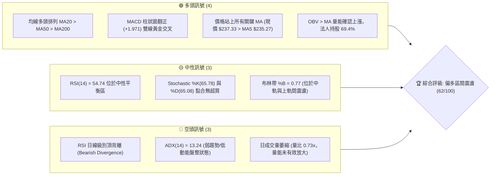
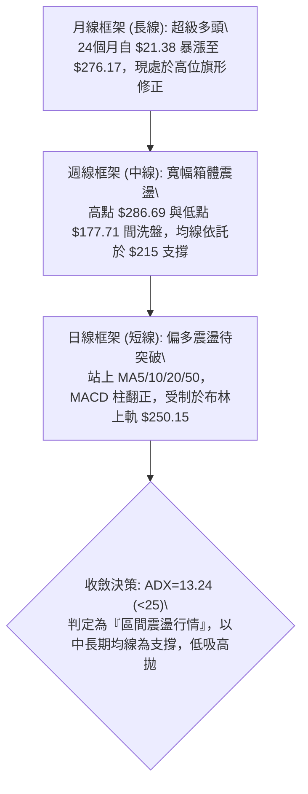
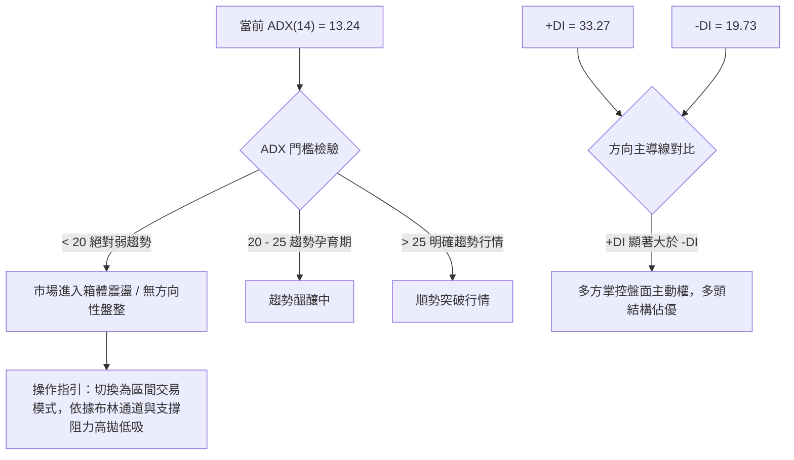
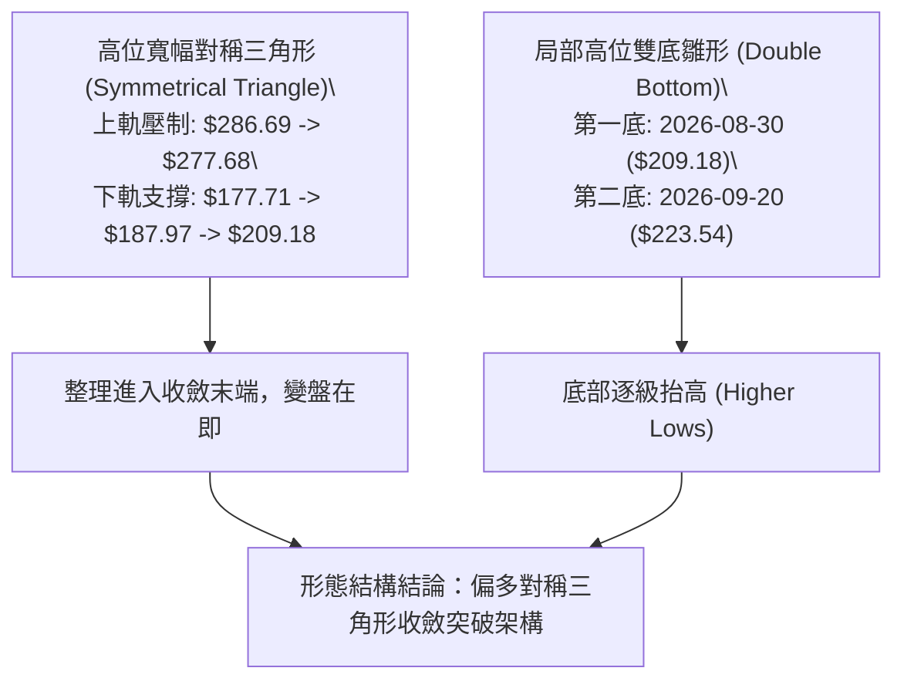
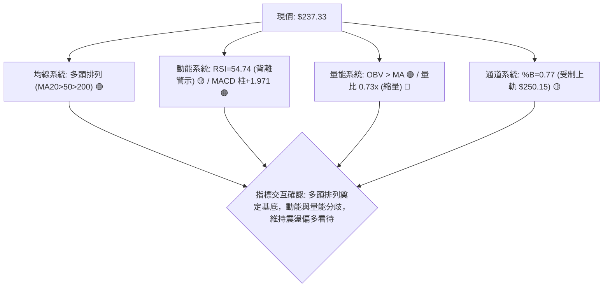
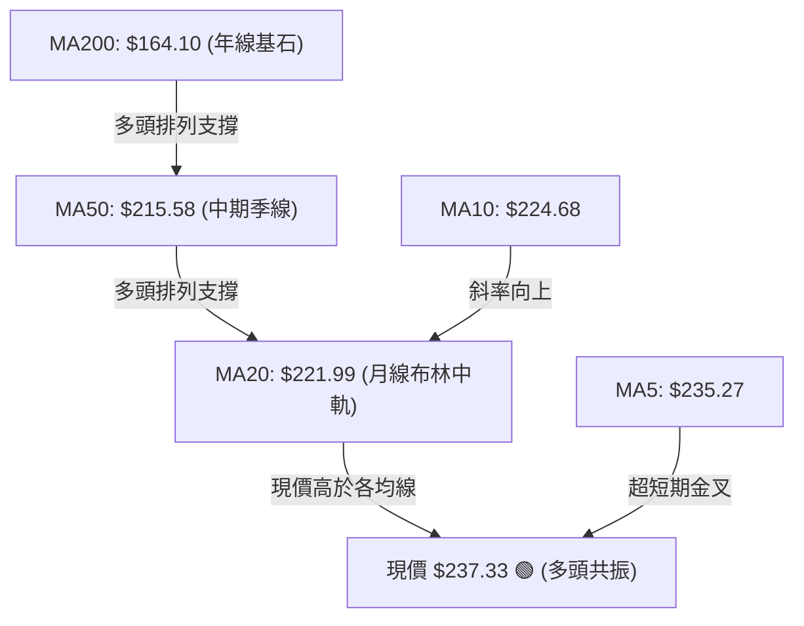
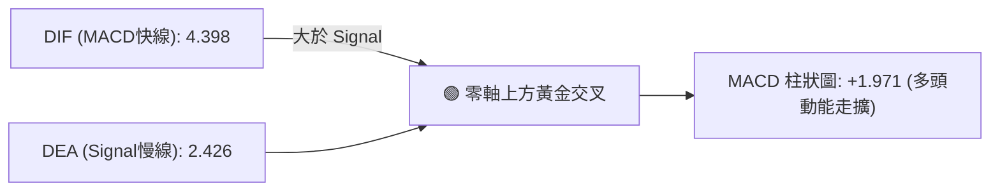
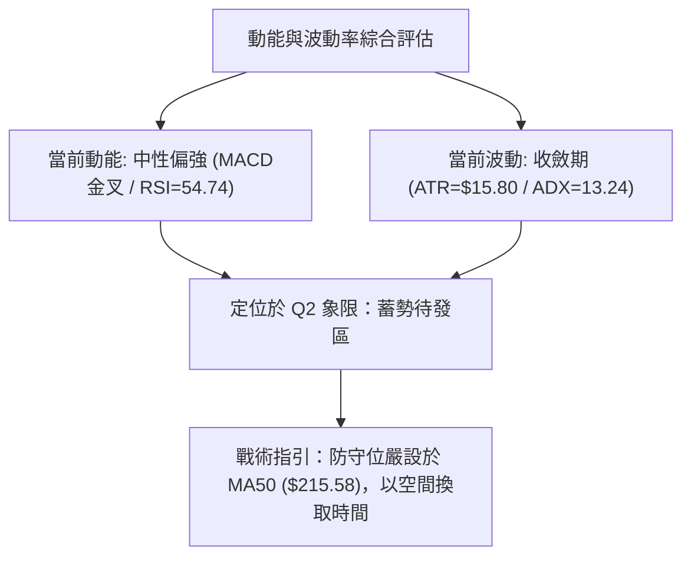
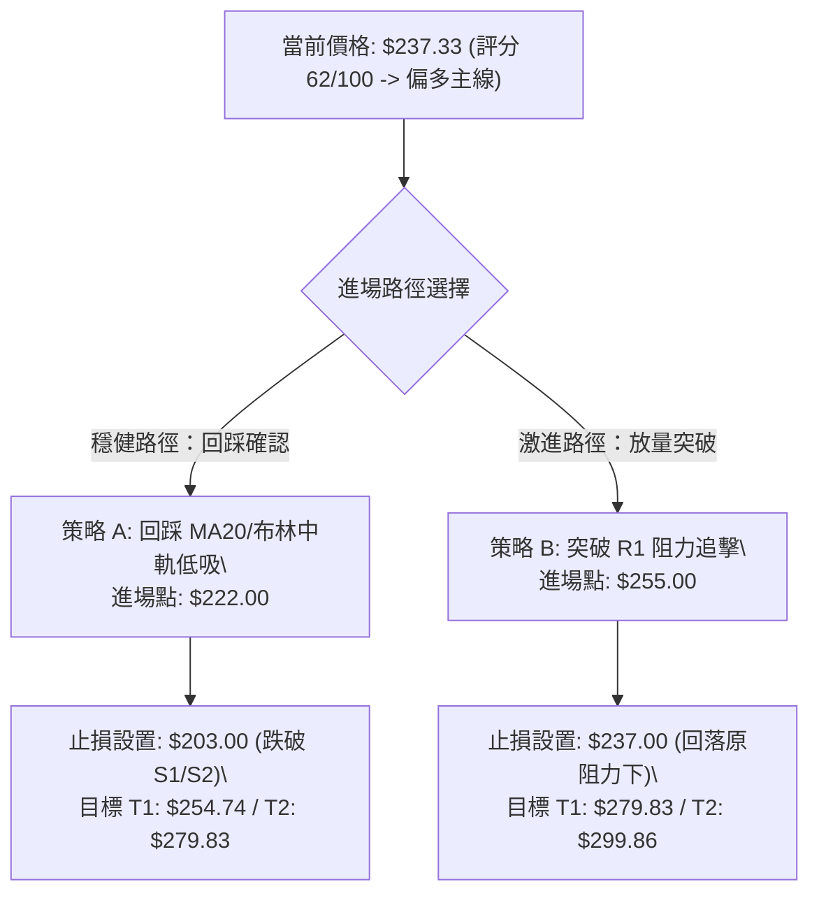
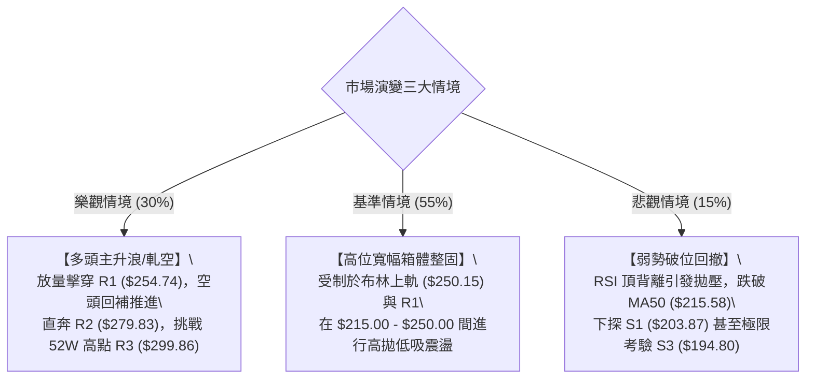

# NBIS 技術分析報告

> **報告日期**：2026-09-26 ｜ **語言**：繁體中文 ｜ **數據來源**：Yahoo Finance ｜ **當前價格**：$237.33

---

## 目錄

| 章節 | 內容 |
|------|------|
| [1. 技術面概覽](#1-技術面概覽) | 訊號儀表板、核心指標、評分卡 |
| [2. 趨勢分析](#2-趨勢分析) | 多時框趨勢、長中短期走勢 |
| [3. 圖表形態分析](#3-圖表形態分析) | 形態識別、K線組合、目標價 |
| [4. 支撐與阻力](#4-支撐與阻力) | 關鍵價位、斐波那契回調 |
| [5. 技術指標深度解讀](#5-技術指標深度解讀) | MA/RSI/MACD/布林/成交量 |
| [6. 動能與波動率](#6-動能與波動率) | 動能評估、ATR、Beta |
| [7. 多時框架總結](#7-多時框架總結) | 時框架評分矩陣 |
| [8. 交易策略建議](#8-交易策略建議) | 多空策略、風險報酬比 |
| [9. 風險提示與監控](#9-風險提示與監控) | 監控指標、風險場景 |

---

## 1. 技術面概覽

### 🎯 技術訊號儀表板



### 📊 核心指標速覽表

| 指標類別 | 指標名稱 | 當前數值 | 訊號 | 解讀 |
|:---|:---|:---|:---:|:---|
| **價格** | 當前價格 | $237.33 | 🟢 | 位於52週區間72.4%，處於中高位強勢整理區間 |
| **均線** | MA20 | $221.99 | 🟢 | 現價高於 MA20 達 +6.91%，短期支撐強勁 |
| **均線** | MA50 | $215.58 | 🟢 | 現價高於 MA50，中期上升趨勢未遭破壞 |
| **均線** | MA200 | $164.10 | 🟢 | 現價大幅高於牛熊分界線 +44.62%，長期多頭底氣足 |
| **動能** | RSI(14) | 54.74 | 🟡 | 位於 50 分界線上方但未進入超買，存在日線頂背離預警 |
| **動能** | MACD | 4.398 (Hist: +1.971) | 🟢 | 快線位於慢線 (2.426) 之上，柱狀圖走擴，短多發散 |
| **波動** | ATR(14) | $15.80 (6.66%) | 🟡 | 單日波動率高達 6.66%，屬於高波動成長型科技標的 |
| **趨勢** | ADX(14) | 13.24 (+DI 33.27) | 🟡 | ADX < 25 表明趨勢處於整理期，多頭雖主導但動能收斂 |
| **通道** | 布林通道 | 上軌 $250.15 / 下軌 $193.84 | 🟢 | 現價位於中軌 ($221.99) 上方，通道帶寬收窄後待變盤 |
| **量能** | 成交量 / 20MA | 11.02M / 15.15M | 🔴 | 成交量比僅 0.73x，上攻動能稍顯量價背離 |

### 🏆 技術評分卡

```
╔══════════════════════════════════════════════════════════════════╗
║              技術評分卡 — NBIS (2026-09-26)                      ║
╠══════════════════════════════════════════════════════════════════╣
║ 趨勢強度 (ADX=13.24)    ███████░░░░░░░░░░░░░  35/100  🔴 弱趨勢 ║
║ 動能指標 (MACD/RSI)     █████████████░░░░░░░  65/100  🟢 偏多   ║
║ 支撐穩定度 (S1/S2/S3)   ████████████████░░░░  80/100  🟢 強固   ║
║ 成交量配合 (OBV/Vol)    ███████████░░░░░░░░░  55/100  🟡 中性   ║
║ 形態完整度 (箱體整理)   ████████████░░░░░░░░  60/100  🟡 構築中 ║
║ 均線排列 (多頭排列)     ██████████████████░░  90/100  🟢 極強   ║
╠══════════════════════════════════════════════════════════════════╣
║ 綜合技術評分            ████████████░░░░░░░░  62/100  🟢 偏多   ║
║ 投資時鐘判定            【震盪築底完成，向布林上軌與R1發起衝擊】 ║
╚══════════════════════════════════════════════════════════════════╝
```

---

## 2. 趨勢分析

### 🌐 多時框趨勢分析



### 📈 長期趨勢 — 12個月走勢圖（Unicode）

```
NBIS 月線走勢圖（過去12個月：2025-10 至 2026-09）
價格軸 ($)
$300 ┤                                        
$280 ┤                                  ● $276.17 (2026-06 高點)
$240 ┤                            ● $231.09        ● $237.33 (現在)
$200 ┤                                       ● $190.41  ● $206.32
$160 ┤                      ● $138.23         
$120 ┤● $130.82                               
$100 ┤     ● $94.87              ● $103.76    
$80  ┤          ● $83.71 ● $85.19 ● $91.19    
$60  ┤                                        
     └──────────────────────────────────────────────────────────
       10   11   12   01   02   03   04   05   06   07   08   09 (月份)
      (2025)             (2026)
```

#### 走勢特徵分析表格

| 階段 | 時間區間 | 起訖價位 | 漲跌幅 | 結構特徵與技術解讀 |
|:---|:---:|:---:|:---:|:---|
| **第一階段：高位回撤** | 2025-10 ~ 2025-12 | $130.82 → $83.71 | -36.01% | 觸及波段高點後獲利回吐，於 $83.71 尋求 52W 低點 $73.52 上方支撐 |
| **第二階段：蓄勢築底** | 2026-01 ~ 2026-03 | $85.19 → $103.76 | +21.80% | 構築堅實的平底底形，成交量溫和收縮，籌碼完成換手沈澱 |
| **第三階段：主升浪爆發** | 2026-04 ~ 2026-06 | $138.23 → $276.17 | +99.79% | AI 算力基礎設施利多發酵，呈現拋物線式噴出，觸及 52W 高點 $299.86 區域 |
| **第四階段：大幅洗盤** | 2026-07 | $276.17 → $190.41 | -31.05% | 獲利了結盤湧出，最低打至週線級別 $177.71，回測 38.2% 斐波那契回調位 |
| **第五階段：企穩回升** | 2026-08 ~ 2026-09 | $190.41 → $237.33 | +24.64% | 多頭防守成功，站穩 MA50（$215.58），進入對稱收斂三角整理末端 |

### 📊 中期趨勢（週線分析）

中期走勢（近 20 週）顯示 NBIS 在歷經 2026 年 6 月與 8 月的劇烈洗盤後，波動區間正顯著收斂。

```
週線級別價格防禦與壓力拓撲：
[頂部壓力阻力群]   ══════ $299.86 (52W歷史天花板 R3)
                   ────── $279.83 (8月中旬次高點聚類 R2)
                   ────── $254.74 (6月下旬整理平台壓力 R1)
                   ······ $250.15 (日線布林通道上軌)
[現價中軸爭奪]     ◄═════ $237.33 (當前收盤價，位於布林 %B=0.77)
[多頭護城河支撐]   ······ $221.99 (MA20 / 布林中軌生命線)
                   ────── $215.58 (MA50 / 斐波那契 38.2% $213.40 疊加區)
                   ══════ $203.87 / $200.30 (S1/S2 波段雙底防線)
                   ────── $194.80 (S3 / 8月初極限回撤支撐)
```

### ⚡ 趨勢強度評估（ADX 解讀）



#### ADX 趨勢強度對照解讀

```
ADX 數值強度儀表：
0 ───────[13.24]──────── 20 ──────────── 25 ──────────── 40 ──────────── 60+
  極弱/盤整區 (當前)         臨界過渡區          中度趨勢          強烈趨勢
```
- **趨勢狀態**：弱趨勢盤整（ADX = 13.24 < 25）。當前市場並無單邊趨勢，多空雙方在 $215.00 - $250.00 間進行籌碼整理。
- **方向偏向**：+DI（33.27）明顯壓制 -DI（19.73），差距達 13.54，顯示回調過程均為良性換手，多方仍處於戰略進攻態勢，但需等待 ADX 回升至 25 上方方能展開破位主升浪。

---

## 3. 圖表形態分析

### 🔍 形態識別系統



#### 形態識別與信心度評估表

| 形態名稱 | 信心度 | 判斷依據（引用數據） | 完成度 | 目標價（附嚴謹計算式） |
|:---|:---:|:---|:---:|:---|
| **寬幅收斂對稱三角形** | **75%** | 兩波低點逐步墊高（$177.71 → $187.97 → $209.18），高點下壓（$286.69 → $277.68），週成交量逐步由 167M 萎縮至 79M，符合典型收斂特徵。 | 85% | 突破頸線以 R1 **$254.74** 為基準，形態最大波幅 = $277.68 - $187.97 = $89.71。向上推算理論目標 = $254.74 + $89.71 = **$344.45**（受制於 52W 高點 R3 **$299.86**）。 |
| **短期次級雙底 (W底)** | **65%** | 8月下旬低點 $209.18 與9月中旬低點 $223.54，成功在 MA50（$215.58）之上完成二次探底確認。 | 90% | 頸線位置為9月初反彈高點（對應 R1 區域），底高約 $254.74 - $209.18 = $45.56。量度目標 = $254.74 + $45.56 = **$300.30**（與 R3 $299.86 高度重合）。 |
| **頭肩底結構** | **35%** | 雖然 7月中旬出現 $177.71 尖銳低點看似頭部，但左右肩對稱性極差，右側整理時間過長。 | <50% | **訊號不足，僅做指標型解讀**，不予強行推算頭肩目標價。 |

### 🕯️ 重要K線形態分析

| 月份/週期 | 收盤價 | K線形態 | 解讀 | 訊號 |
|:---|:---:|:---|:---|:---:|
| **2026-06** | $276.17 | 帶長上影倒錘頭/十字星 | 衝擊 52W 高點 $299.86 後遭遇天量獲利拋壓，多頭動能短暫衰竭 | 🔴 看跌反轉 |
| **2026-07** | $190.41 | 長下影長陰線 | 恐慌盤湧出打穿 $180，隨後逢低買盤進場承接，留下深刻下影線 | 🟡 探底企穩 |
| **2026-08** | $206.32 | 縮量錘頭陽線 | 回踩確認 7 月低點有效，空頭動能減退，實體成功收復在 $200 整數關卡之上 | 🟢 築底回升 |
| **2026-09** | $237.33 | 中陽線突破均線簇 | 連續站穩 MA20、MA50，實體包覆前月波動，呈現多頭吞噬雛形 | 🟢 多頭掌控 |

### 📉 ASCII 走勢形態示意圖

```
高位對稱收斂三角形與雙底回踩示意圖：
$299.86 ┬───────────────────● 52W High ($299.86)
        │                  / \
$280.00 ┼                 ●   \          ● 次高點 ($277.68)
        │                /     \        / \
$260.00 ┼               /       \      /   \      [收斂上軌壓制線]
        │              /         \    /     \     /
$254.74 ┼-------------/-----------\--/-------\---● R1 頸線阻力門檻
        │            /             \/         \ /
$237.33 ┼ - - - - - / - - - - - - - - - - - - -●◄ 現價 ($237.33) 突破三角中軸
        │          /                             \   /
$221.99 ┼─────────/───────────────────────────────● MA20 中軌支撐
        │        /         ● 8月低點 ($187.97)     \ / [收斂下軌支撐線]
$200.00 ┼       /         / \                      ● 雙底低點 ($209.18)
        │      /         /   \                    /
$177.71 ┼─────● 7月極限低點 ($177.71)            /
        └───────────────────────────────────────────────
             2026-06       2026-07       2026-08       2026-09
```

### 🎯 形態目標價計算

1. **對稱收斂三角形量度計算式**：
   - 形態上軌高點：$277.68
   - 形態下軌基準低點：$187.97
   - 形態垂直振幅（高度 $H$）：$277.68 - $187.97 = \$89.71$
   - 突破觸發點（Neckline/R1）：$254.74
   - **理論上行第一目標價**：$254.74 + \$89.71 = \mathbf{\$344.45}$
   - **實務折現約束目標**：考量到 52W 高點阻力聚類 R3 位於 **$299.86**，故此形態的第一保守滿足點設定為 R2 **$279.83**，完全滿足點設定為 R3 **$299.86**。

---

## 4. 支撐與阻力

### 🗺️ 關鍵價位分布圖（Unicode）

```
NBIS 價位結構分布圖
══════════════════════════════════════════════════════════════════
$299.86 ║████████████████████████████████║ 強烈歷史天花板 (52W High / R3)
$279.83 ║████████████████████            ║ 8月中旬巨量長黑套牢峰 (阻力 R2)
$254.74 ║████████████████████████        ║ 三角收斂頂頸線 / 波段聚類高點 (R1)
$250.15 ║--------------------------------║ 布林通道上軌動態壓力線
$246.44 ║▓▓▓▓▓▓▓▓▓▓▓▓▓▓▓▓                ║ 斐波那契 23.6% 回調位
$237.33 ╠════════════════════════════════╣ ◄── 當前市價 ($237.33)
$221.99 ║▓▓▓▓▓▓▓▓▓▓▓▓▓▓▓▓▓▓▓▓▓▓          ║ 布林中軌生命線 / MA20 短期支撐
$215.58 ║████████████████████████        ║ MA50 中期趨勢線
$213.40 ║▓▓▓▓▓▓▓▓▓▓▓▓▓▓▓▓▓▓▓▓▓▓▓▓        ║ 斐波那契 38.2% 強共振回調支撐
$203.87 ║████████████████████████████    ║ 近一年波段低點聚類 (支撐 S1)
$200.30 ║██████████████████████████████  ║ 整數心理大關 / 密集成交區 (S2)
$194.80 ║████████████████████████████████║ 8月波段極限洗盤低點 (S3)
══════════════════════════════════════════════════════════════════
```

### 🚧 阻力位分析表

所有價位均嚴格取自數據模組計算之波段高點聚類：

| 阻力級別 | 價位 | 距現價空間 | 形成原因與技術意義 | 突破難度 | 重要性 |
|:---|:---:|:---:|:---|:---:|:---:|
| **R1 (關鍵阻力)** | **$254.74** | +7.34% | 近一年波段高點聚類，與布林上軌（$250.15）及斐波那契 23.6%（$246.44）構成共振反壓帶。突破此位代表收斂三角形向上表態。 | 🟡 中等 | ★★★★☆ |
| **R2 (強阻力)** | **$279.83** | +17.91% | 2026年8月中旬爆量反彈至 $277.68 之巨量套牢平台，該週成交量達 167.5M，籌碼壓力沈重。 | 🔴 較高 | ★★★★☆ |
| **R3 (終極阻力)** | **$299.86** | +26.35% | 52週歷史最高點，技術面與心理面上的雙重天花板，未有充分量能無法直接跨越。 | 🔴 極高 | ★★★★★ |

### 🛡️ 支撐位分析表

所有價位均嚴格取自數據模組計算之波段低點聚類：

| 支撐級別 | 價位 | 距現價空間 | 形成原因與技術意義 | 守住機率 | 重要性 |
|:---|:---:|:---:|:---|:---:|:---:|
| **S1 (近期支撐)** | **$203.87** | -14.10% | 近一年波段低點密集聚類區，緊鄰 MA50（$215.58）與斐波 38.2%（$213.40）下方之緩衝墊。 | 85% | ★★★★☆ |
| **S2 (強支撐)** | **$200.30** | -15.60% | $200.00 整數心理防線與機構籌碼成本區，具備極強的量能防禦厚度。 | 90% | ★★★★★ |
| **S3 (極限防線)** | **$194.80** | -17.92% | 近一年波段低點極限聚類，逼近布林通道下軌（$193.84）。若失守將破壞長線多頭架構。 | 95% | ★★★★★ |

### 📐 斐波那契回調位分析

依據 52 週完整極端區間（低點 **$73.52** → 高點 **$299.86**，總垂直價差 $226.34）進行精確測算：

| 斐波那契比例 | 基準價位 | 當前相對位置 | 結構意義與多空攻防解讀 |
|:---:|:---:|:---:|:---|
| **0.0%** | **$299.86** | +26.35% | 52W 最高點，主升浪極限頂部。 |
| **23.6%** | **$246.44** | +3.84% | **短線第一強勢分界線**。現價（$237.33）正逼近此位，若日線有效收復 $246.44，代表修正結束重新進入強勢多頭通道。 |
| **38.2%** | **$213.40** | -10.08% | **黃金分割中樞核心支撐**。與 MA50（$215.58）高度重合，前兩月多次回踩此位均獲得有力承接，為多頭防守生命線。 |
| **50.0%** | **$186.69** | -21.34% | 均衡回調位。7-8月恐慌洗盤低點（$177.71 - $187.97）在此處探底回升，具備超跌反彈強支撐。 |
| **61.8%** | **$159.98** | -32.59% | 牛熊分界黃金分割位，與 MA200（$164.10）高度共振，長線絕對防守底線。 |
| **78.6%** | **$121.96** | -48.61% | 深幅回撤防線（目前基本無跌破可能）。 |
| **100.0%** | **$73.52** | -69.02% | 52W 最低點。 |

**現價落點解讀**：現價 **$237.33** 恰好運作於 **38.2% ($213.40)** 與 **23.6% ($246.44)** 之間，此區間為技術面標準的「強勢整理帶」。多方在此區間積累籌碼，只要不破 $213.40，向 $246.44 及 R1 $254.74 發起衝擊是阻力最小的路徑。

---

## 5. 技術指標深度解讀

### 🎛️ 指標訊號總覽



### 📈 移動平均線排列分析



#### 均線梯度統計表

| 均線指標 | 數值 | 距現價差距 | 均線斜率狀態 | 走勢微型圖示 | 多空研判 |
|:---|:---:|:---:|:---:|:---:|:---:|
| **MA 5** | $235.27 | +0.88% | 向上翻揚 | `▄▇█▇▆▅▃▂▂▂▂▂▁▁▁▁▂▃▄▄▄▃▂▂▂▂▃▄▄▅` | 🟢 短線多頭發動 |
| **MA 10** | $224.68 | +5.63% | 陡峭上升 | `▃▅▅▅▆▇██▇▆▄▃▁▁▁▁▂▂▃▃▃▃▃▃▄▄▄▃▄▄` | 🟢 支撐穩固 |
| **MA 20** | $221.99 | +6.91% | 平穩向上 | `▁▂▃▃▃▃▄▄▆▆▆▆▆▆▆▇███▇▆▅▅▄▅▅▅▅▆▆` | 🟢 月線主升軌道 |
| **MA 50** | $215.58 | +10.09% | 走平微升 | `——` | 🟢 中期生命線 |
| **MA 60** | $213.85 | +10.98% | 走平 | `▇████████▇▇▆▆▆▅▆▆▆▆▅▄▃▃▂▂▁▁▁▁▁` | 🟢 季線防護網 |
| **MA 120** | $208.46 | +13.85% | 穩健爬升 | `▁▁▁▁▂▂▂▃▃▃▄▄▄▄▄▅▅▅▅▆▆▆▆▇▇▇████` | 🟢 半年線健康 |
| **MA 200** | $164.10 | +44.62% | 向上發散 | `——` | 🟢 長期牛市確立 |
| **MA 240** | $154.43 | +53.68% | 堅定向上 | `▁▁▁▂▂▂▃▃▃▄▄▄▄▅▅▅▅▆▆▆▆▇▇▇▇█████` | 🟢 年線底氣充沛 |

**分析結論**：均線呈現絕對標準的「多頭排列」（MA20 > MA50 > MA200），且現價壓制所有短期均線之上，不存在均線蓋頂風險，下檔各層均線形成強大緩衝階梯。

### 📉 RSI(14) 分析

```
RSI(14) 動能刻度表：
0 ──────────── 30 ─────────────[54.74]───────────── 70 ──────────── 100
  極度超賣          強勢超賣區           中性偏強平衡區        超買預警區
進度條：██████████████░░░░░░░░░░░░ 54.74%
```

#### 背離深度解讀
- **現狀判斷**：日線數據警示 **⚠️ 頂背離 (Bearish Divergence)**。
- **背離細節**：回顧 2026 年 8 月中旬，股價衝至 $277.68 時，週線 RSI 曾達到 67.2；而目前價格雖自 $177.71 大幅反彈至 $237.33，但日線 RSI 僅回升至 54.74，動能高點並未跟隨價格反彈同步創新高。
- **綜合指引**：這表明當前的反彈屬於「修復性推升」，而非「爆發性主升」。頂背離的存在意味著直接大幅向上拔高難度大，短線觸及 R1（$254.74）或布林上軌（$250.15）時容易引發技術性回踩。

### 📊 MACD(12/26/9) 訊號解讀



- **數值狀態**：DIF（4.398）穩健運行於 DEA（2.426）之上，兩者均在零軸上方運行，屬於典型的多頭控制格局。
- **柱狀圖趨勢**：柱狀圖自 9 月中旬的負值翻正至 **+1.971**，且連續多日放大，顯示短線做多動能正在重新凝聚，有效對沖了 RSI 的頂背離隱患。

### 📦 布林通道分析

```
布林帶空間結構圖 (BBand 20, 2)：
$250.15 ┬────────────────────────────────────────── 布林上軌 (Upper Band)
        │                       ▲ 距上軌 +5.40%
        │                 ● $237.33 (現價落點 %B = 0.77)
$221.99 ┼────────────────────────────────────────── 布林中軌 (MA20 生命線)
        │                 ▼ 距中軌 -6.46%
        │
$193.84 ┴────────────────────────────────────────── 布林下軌 (Lower Band)
```

- **帶寬特徵**：通道帶寬收窄（Upper $250.15 - Lower $193.84 = $56.31，帶寬比約 25%），顯示自 6-7 月的大幅波動後，市場籌碼已極度收斂。
- **%B 指標解讀**：%B = 0.77，處於 0.5 到 1.0 的強勢多頭通道中。現價正往上軌（$250.15）靠攏，在 ADX < 25 的盤整背景下，上軌將構成強烈動態阻力，初次觸碰不易直接穿透。

### 💹 成交量分析（量價配合度）

```
成交量柱狀對比：
今日成交量:   11.02M  ███████████░░░░░░░░░░  (量比: 0.73x)
20日均量:     15.15M  ███████████████░░░░░░ 
50日均量:     21.26M  █████████████████████
```

- **量能萎縮現象**：今日成交量為 11.02M，相對於 20 日均量（15.15M）萎縮 27%，相較於 50 日均量萎縮近半。呈現「價漲量縮」格局。
- **OBV 趨勢確認**：指標模組顯示「**OBV > MA → 量能支撐上漲**」。這說明長線機構籌碼（法人持股高達 69.4%）並未在回調中拋售離場，賣壓極輕（籌碼鎖定度高），因此即便成交量未顯著爆發，股價亦能輕裝上陣。
- **量價背離風險提示**：若後續價格挑戰 R1（$254.74）時，日成交量無法放大至 20 日均量（15.15M）上方，則突破極易演變為「假突破假甩轎」。

---

## 6. 動能與波動率

### ⚡ 動能評估四象限

| 象限標籤 | 動能狀態 | 波動率狀態 | 當前市場狀態判定 | 操作方針與策略評估 |
|:---:|:---:|:---:|:---:|:---|
| **第一象限 (Q1)** | 強動能 | 低波動 | — | 最理想順勢加碼環境 |
| **第二象限 (Q2)** | **弱/中動能** | **低/收斂波動** | **✓ NBIS 當前定位** | **區間震盪佈局期**：ADX=13.24 且布林帶寬收窄，動能溫和，宜於均線支撐處低吸，等待放量突破 |
| **第三象限 (Q3)** | 強動能 | 高波動 | — | 突破單邊行情，適合動態突破追蹤止損 |
| **第四象限 (Q4)** | 弱動能 | 高波動 | — | 混沌洗盤期，多看少動避免磨損 |



### 📊 ATR 波動率分析

- **ATR(14) 數值**：**$15.80**，佔當前股價比例達 **6.66%**。
- **波動特徵解讀**：NBIS 具備極強的單日彈性，平均單日振幅高達近 16 美元。這意味著普通窄幅止損（如 2%-3%）極易在日常市場雜訊中被無情「掃出場」。
- **專業止損設定指引**：
  - **超短線/日內止損距離**：$1.0 \times \text{ATR} = \mathbf{\$15.80}$
  - **波段交易安全止損距離**：$1.5 \times \text{ATR} = \mathbf{\$23.70}$（對應現價下方至 $213.63，剛好精確貼合斐波那契 38.2% 支撐 $213.40）
  - **寬鬆底倉止損距離**：$2.0 \times \text{ATR} = \mathbf{\$31.60}$（對應 $205.73，受 S1 $203.87 完美保護）

### 📐 Beta 與市場相關性

- **Beta 係數**：**1.436**。
- **市場彈性分析**：Beta 高達 1.44，表明 NBIS 具備典型的高彈性成長型「高 Beta」科技股屬性。當那斯達克（Nasdaq 100）上漲 1% 時，NBIS 理論期望波動為 1.44%；反之大盤回調時其回撤幅度亦會放大。
- **空頭部位壓力（Short % Float）**：空頭佔流通盤比例高達 **19.8%**（Short Ratio = 2.76 天）。高額空頭部位在大盤走強或公司利多刺激下，極易觸發猛烈的「軋空（Short Squeeze）」行情，這也是 6 月及 8 月出現單週暴漲百點的重要微觀市場結構因素。

---

## 7. 多時框架總結

### 📋 時框架評分表

| 時框架 | 趨勢方向 | 動能狀態 | 均線排列 | 形態特徵 | 綜合評分 | 操作建議 |
|:---:|:---:|:---:|:---:|:---:|:---:|:---|
| **長期 (月線)** | 🟢 強烈看多 | 🟢 充沛 | 多頭排列 | 歷史天花板下方大旗形整理 | **85/100** | 逢深幅回調皆為戰略買點 |
| **中期 (週線)** | 🟢 震盪看多 | 🟡 中性平衡 | MA20 上穿 MA50 | 寬幅收斂三角形末端，底步墊高 | **65/100** | 以 $215 為中樞回檔低吸 |
| **短期 (日線)** | 🟡 區間偏多 | 🟡 短多頂背離 | 短均多頭交叉 | 受制於布林上軌與斐波 23.6% | **60/100** | 不盲目追高，等待拉回中軌進場 |

### 🔲 綜合訊號矩陣

```
時框架訊號聚合矩陣：
┌───────────┬──────────────┬──────────────┬──────────────┐
│  分析維度 │  長期 (月線) │  中期 (週線) │  短期 (日線) │
├───────────┼──────────────┼──────────────┼──────────────┤
│  趨勢方向 │   強烈看多   │   區間震盪   │   震盪偏多   │
│  動能強弱 │   多頭掌控   │   中性回穩   │   金叉但背離 │
│  量價配合 │   機構鎖倉   │   量能收斂   │   量縮上行   │
│  阻力/支撐│  支撐遠低於價│ 依託 $215 軸 │ 逼近上軌 $250│
│  最終共振 │   偏多共振   │   多方佔優   │   技術防禦   │
└───────────┴──────────────┴──────────────┴──────────────┘
```

### ⚖️ 多時框收斂結論

依據多時框收斂嚴格規則進行裁決：
1. **行情性質判定**：日線 ADX(14) = 13.24（顯著小於 25），嚴格判定當前屬於 **「盤整行情（區間震盪）」**。
2. **主導維度與衝突取捨**：雖然長期月線維持強大多頭排列，但日線 RSI 出現頂背離，且成交量不足以支撐連續單邊暴漲。依照收斂規則，**以日線布林通道上下軌（$193.84 ~ $250.15）為主要交易區間**，並以週線級別斐波那契 38.2%（$213.40）與 MA50（$215.58）作為防守基石。
3. **唯一方向性結論**：**【震盪偏多（向區間上軌進攻）】**。多頭排列健全，無破位下行風險，但短線受制於布林上軌 $250.15 與 R1 $254.74，操作上應採取「支撐位回踩低吸，禁忌追高，逢阻力分批停利」的區間策略。本結論與第 8 章主策略完全一致。

---

## 8. 交易策略建議

### 🗺️ 策略決策流程圖



### 🧭 策略路由（依評分卡分流）

> **當前主策略方向 = 【主推多頭策略（波段逢低做多）】（依技術評分卡 62/100 偏多判定）**

由於綜合評分達 62 分（≥60），均線呈現完美多頭排列，空頭僅列為防守破位觸發警示，不作雙向對賭推薦。

### 🎯 價格情境階梯（Price Scenarios）

所有引用數值均精確依據數據模組算定：

| 觸發條件 | 下一目標 | 後續延伸 | 情境技術含義 |
|:---|:---:|:---:|:---|
| **放量突破 R1 ($254.74)** | **R2 ($279.83)** | **R3 ($299.86)** | 短線收斂三角徹底向上突破，軋空行情啟動，直奔歷史前高 |
| **站穩現價區間 ($237.33)** | **布林上軌 ($250.15)** | **R1 ($254.74)** | 沿 MA20 軌道緩步爬升，進行指標修復與籌碼消化 |
| **回踩考驗 MA50 / 斐波38.2%** | **$215.58 / $213.40** | **S1 ($203.87)** | 正常技術性回調，為多頭極佳的二次上車良機 |
| **跌破 S1 ($203.87) 與 S2 ($200.30)** | **S3 ($194.80)** | **布林下軌 ($193.84)** | 中期轉弱，多頭防禦崩塌，需嚴格啟動止損離場 |

### 📊 情境機率分佈

| 價格情境 | 機率 | 主要依據（指標狀態與市場微觀結構） |
|:---|:---:|:---|
| **情境一：向上突圍或震盪推升** | **55%** | 均線系統完全多頭排列；MACD 柱狀圖翻正走擴；法人持股 69.4% 籌碼穩定；高達 19.8% 的空頭比例提供潛在軋空動能。 |
| **情境二：區間寬幅拉鋸震盪** | **35%** | ADX = 13.24 確立弱趨勢震盪市；日線 RSI 存在頂背離；日成交量萎縮（量比 0.73x），多方難以一蹴而就。 |
| **情境三：深度回落破位再探底** | **10%** | S1（$203.87）、S2（$200.30）波段低點聚類防禦極為厚實，且 MA200（$164.10）遠在下方，無重大基本面黑天鵝難以擊穿。 |

### 🟢 主策略詳情

依據第 4 章關鍵價位精確制定兩套可執行交易方案：

| 策略要素 | 策略 A（穩健型：回踩生命線低吸） | 策略 B（動量型：突破關鍵阻力追買） |
|:---|:---|:---|
| **適用對象** | 追求高風險報酬比的波段操作者 | 追求資金效率、順勢突破的動能交易者 |
| **進場條件** | 價格拉回 MA20（$221.99）附近止跌企穩 | 日K收盤價放量實體突破 R1（$254.74） |
| **進場價格** | **$222.00**（回踩 MA20 關鍵位） | **$255.00**（確認突破 R1） |
| **止損價格** | **$203.00**（嚴格設於 S1 $203.87 之下，約 1.2×ATR） | **$237.00**（跌回當前平台 / 突破點下方，約 1.1×ATR） |
| **目標價 T1** | **$254.74**（阻力位 R1） | **$279.83**（強阻力位 R2） |
| **目標價 T2** | **$279.83**（強阻力位 R2） | **$299.86**（52W 歷史極值 R3） |
| **止損空間** | -$19.00 (-8.56%) | -$18.00 (-7.06%) |
| **T1 報酬空間** | +$32.74 (+14.75%) | +$24.83 (+9.74%) |
| **T2 報酬空間** | +$57.83 (+26.05%) | +$44.86 (+17.59%) |
| **風險報酬比 (T1)** | **1 : 1.72** | **1 : 1.38** |
| **風險報酬比 (T2)** | **1 : 3.04** | **1 : 2.49** |
| **成功機率** | **65%** | **55%** |
| **建議倉位** | **15% ~ 20%** 總資金 | **10% ~ 15%** 總資金 |

### 🔴 反向風險觸發點（對沖與止損提示）

若出現以下情況，主推的多頭邏輯即刻失效，必須嚴格止損或建立反向空頭避險：
1. **核心破位點**：日K收盤價有效跌破 S2 **$200.30** 與整數心理關卡。此位若破，代表自 8 月以來的雙底結構徹底失敗。
2. **均線死叉惡化**：MA20（$221.99）下穿 MA50（$215.58）形成中期死亡交叉，且 ADX 突破 25 反向走擴。
3. **對沖建議**：若現價跌破 **$213.40**（斐波 38.2%），多頭部位應主動減倉 50%，若進一步打穿 $200.30 則全數清倉出局觀望。

### ⭐ 整體訊號強度評星

```
╔══════════════════════════════════════════════════════════════╗
║ 做多訊號強度：  ★★★★☆  (4/5星 - 均線完美多頭、籌碼高度鎖定) ║
║ 做空訊號強度：  ★☆☆☆☆  (1/5星 - 逆勢放空風險極高，僅有背離)║
║ 整體可信度：    ★★★★☆  (4/5星 - 價位聚類清晰，支撐扎實)   ║
╚══════════════════════════════════════════════════════════════╝
```

---

## 9. 風險提示與監控

### ✅ 關鍵監控指標 Checklist

```
╔══════════════════════════════════════════════════════════════════╗
║                    每日盤面技術監控清單 (Checklist)              ║
╠══════════════════════════════════════════════════════════════════╣
║ [ ] 價格防守線：收盤價是否持續維持在 MA20 ($221.99) 之上？       ║
║ [ ] 阻力突破度：向上挑戰 R1 ($254.74) 時，日成交量是否 > 15.15M？ ║
║ [ ] 動能健康度：MACD 柱狀圖是否持續保持在零軸之上擴張？          ║
║ [ ] 背離消除度：RSI 是否隨價格上漲突破 60 阻力線以化解頂背離？   ║
║ [ ] 波動率預警：ATR 是否異常擴大至 $20.00 以上引發假突破震盪？   ║
║ [ ] 趨勢啟動度：ADX(14) 是否由 13.24 開始拐頭向上突破 20 門檻？ ║
║ [ ] 空頭異動：Short % Float (19.8%) 是否出現急速回補跡象？      ║
╚══════════════════════════════════════════════════════════════════╝
```

### ⚠️ 風險場景分析



### 🛡️ 風險管理重要提醒

1. **高 ATR 波動下的倉位控制原則**：
   - 由於 NBIS ATR 高達 **$15.80（單日波動 6.66%）**，單筆交易的最大資金承擔虧損應嚴格限制在總資產的 **1.5% - 2.0%** 以內。
   - *倉位計算公式*：$\text{允許持股股數} = \frac{\text{總資金} \times 1.5\%}{\text{進場價} - \text{止損價}}$。以策略 A（風險距離 $19.00）為例，10萬美元帳戶的最大買入額度不應超過 78 股（約 $17,300 美元倉位，佔比約 17%）。
2. **高空頭佔比與流動性擠壓風險**：
   - 空頭比例高達 19.8%，Beta 為 1.44，股價具有高度的非線性暴漲暴跌特徵。在進行突破追買（策略 B）時，**嚴禁於開盤前 15 分鐘以市價單追入**，必須等待收盤前確認站穩 R1（$254.74）方可建倉，以防遭遇「長上影誘多假突破」。
3. **重要基本面與法人持股異動風險**：
   - 法人持股高達 69.4%，近期華爾街機構觀點出現分歧（BNP Paribas 上調至 Outperform，而 Rothschild & Co 給予 Sell 評級）。必須警惕機構在季末進行換股調倉所引發的非技術性異常賣壓。

---

## 📋 報告總結

```
╔══════════════════════════════════════════════════════════════════╗
║                     NBIS 技術分析報告總結                        ║
╠══════════════════════════════════════════════════════════════════╣
║ 報告日期：2026-09-26          當前價格：$237.33                  ║
║ 分析評級：🟢 偏多區間震盪 (62/100) — 依託中長期均線回踩做多       ║
╠══════════════════════════════════════════════════════════════════╣
║ 關鍵結論：                                                       ║
║ ├─ 長期趨勢：🟢 強烈多頭 (MA20>50>200 多頭排列，年線基石穩固)   ║
║ ├─ 中期趨勢：🟢 震盪築底 (對稱收斂三角整理末端，波段低點逐級抬高)║
║ ├─ 短期趨勢：🟡 偏多整理 (MACD柱翻正，受制布林上軌與RSI頂背離)   ║
║ ├─ 關鍵支撐：S1: $203.87 │ S2: $200.30 │ 核心共振支撐: $213.40 ║
║ ├─ 關鍵阻力：R1: $254.74 │ R2: $279.83 │ 52W極致高點: $299.86  ║
║ └─ 機構共識：19位分析師平均目標價 $283.58 (潛在上行空間 +19.49%)║
╠══════════════════════════════════════════════════════════════════╣
║ 最優策略組合：                                                   ║
║ 1. 🥇 最佳機會 (穩健波段)：策略 A — 回踩 MA20 $222.00 附近進場， ║
║    止損設於 $203.00，目標指向 R1 $254.74 與 R2 $279.83 (風報比1:3)║
║ 2. 🥈 次選機會 (動能突破)：策略 B — 放量突破 R1 $254.74 後追買， ║
║    進場價 $255.00，止損 $237.00，目標直指前高 $299.86 (風報比1:2.5)║
║ 3. 🥉 保守選擇：在 ADX(14) 仍低於 20 之前，僅以 10% 輕倉在布林帶 ║
║    中軌 ($221.99) 至上軌 ($250.15) 之間進行高拋低吸網格交易。     ║
╚══════════════════════════════════════════════════════════════════╝
```

---

> ⚠️ **免責聲明**：本報告為依據量化技術指標與歷史走勢數據生成之專業技術分析報告，所有價位均基於真實 OHLCV 幾何算法與統計模型計算。本報告**僅供學術研究與交易策略架構參考**，**不構成任何要約、招攬或具體投資建議**。金融市場瞬息萬變，高 Beta 成長股具備極高波動風險，投資人應獨立評估風險並嚴格執行資金管理與止損紀律。

---

*報告生成時間：2026-09-26 ｜ 數據來源：Yahoo Finance ｜ 分析框架：多時框收斂量化技術分析系統*