# NBIS 技術分析報告

> **報告日期**：2026-09-27 ｜ **語言**：繁體中文 ｜ **數據來源**：Yahoo Finance ｜ **當前價格**：$237.33

---

## 目錄

| 章節 | 內容 |
|------|------|
| [1. 技術面概覽](#1-技術面概覽) | 訊號儀表板、核心指標、評分卡 |
| [2. 趨勢分析](#2-趨勢分析) | 多時框趨勢、長中短期走勢 |
| [3. 圖表形態分析](#3-圖表形態分析) | 形態識別、K線組合、目標價 |
| [4. 支撐與阻力](#4-支撐與阻力) | 關鍵價位、斐波那契回調 |
| [5. 技術指標深度解讀](#5-技術指標深度解讀) | MA/RSI/MACD/布林/成交量 |
| [6. 動能與波動率](#6-動能與波動率) | 動能評估、ATR、Beta |
| [7. 多時框架總結](#7-多時框架總結) | 時框架評分矩陣 |
| [8. 交易策略建議](#8-交易策略建議) | 多空策略、風險報酬比 |
| [9. 風險提示與監控](#9-風險提示與監控) | 監控指標、風險場景 |

---

## 1. 技術面概覽

### 🎯 技術訊號儀表板

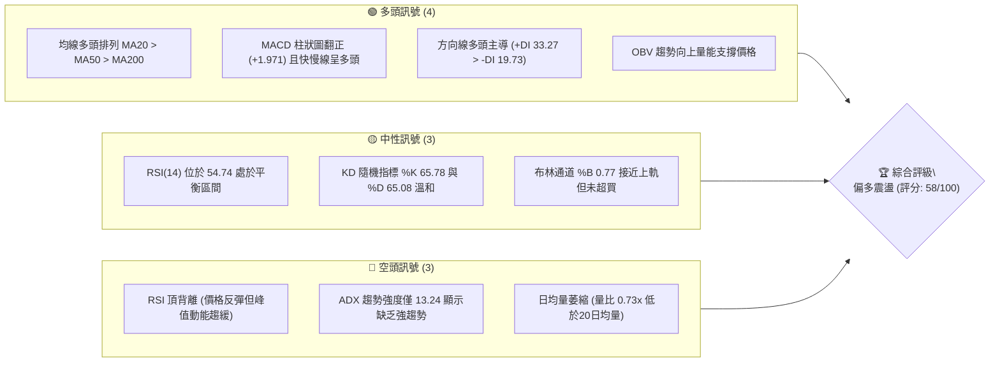

### 📊 核心指標速覽表

| 指標類別 | 指標名稱 | 當前數值 | 訊號 | 解讀 |
|----------|----------|----------|------|------|
| **價格** | 當前價格 | $237.33 | 🟢 | 現價高於短期與中期所有關鍵均線，維持強勢格局 |
| **均線** | MA20 | $221.99 | 🟢 | 現價高於 MA20 (+6.91%)，短線支撐穩固 |
| **均線** | MA50 | $215.58 | 🟢 | 現價高於 MA50 (+10.09%)，中期多頭結構健全 |
| **均線** | MA200 | $164.10 | 🟢 | 現價遠高於牛熊分界線 (+44.63%)，長期牛市基調明確 |
| **動能** | RSI(14) | 54.74 | 🟡 | 位於 50-60 中性偏多區間，但警示頂背離訊號 |
| **動能** | MACD | 4.398 / 2.426 | 🟢 | MACD 線高於 Signal 線，柱狀圖 +1.971，短期呈動能擴張 |
| **趨勢** | ADX(14) | 13.24 | 🔴 | ADX < 25 處於弱趨勢/寬幅盤整狀態，非單邊趨勢 |
| **通道** | 布林通道 | 上軌 $250.15 | 🟡 | %B 為 0.77，逼近上軌，預期通道壓制顯現 |
| **量能** | 20日成交量比 | 0.73x | 🔴 | 成交量 11.02M 低於 20MA (15.15M)，呈現量價遞減 |
| **波動** | ATR(14) | $15.80 | 🟡 | ATR 佔比 6.66%，具備高波幅特徵，需嚴格風控 |

### 🏆 技術評分卡

```
╔══════════════════════════════════════════════════════════════════╗
║              技術評分卡 — NBIS (2026-09-27)                    ║
╠══════════════════════════════════════════════════════════════════╣
║ 趨勢強度 (ADX=13.24)      ████░░░░░░░░░░░░░░░░  20/100  🔴 弱勢  ║
║ 動能指標 (MACD+/RSI中性)  ████████████░░░░░░░░  60/100  🟡 中性  ║
║ 支撐穩定度 (均線密集支撐) ████████████████░░░░  80/100  🟢 堅固  ║
║ 成交量配合 (量比 0.73x)   ████████░░░░░░░░░░░░  40/100  🔴 背離  ║
║ 形態完整度 (箱體整理)     ██████████████░░░░░░  70/100  🟢 良好  ║
║ 均線排列 (MA20>50>200)    ████████████████░░░░  80/100  🟢 完美  ║
╠══════════════════════════════════════════════════════════════════╣
║ 綜合評分                  ███████████░░░░░░░░░  58/100  🟡 偏多  ║
║ 評級結論                  中性偏多：區間震盪偏多突破，注意量能限制   ║
╚══════════════════════════════════════════════════════════════════╝
```

---

## 2. 趨勢分析

### 🌐 多時框趨勢分析

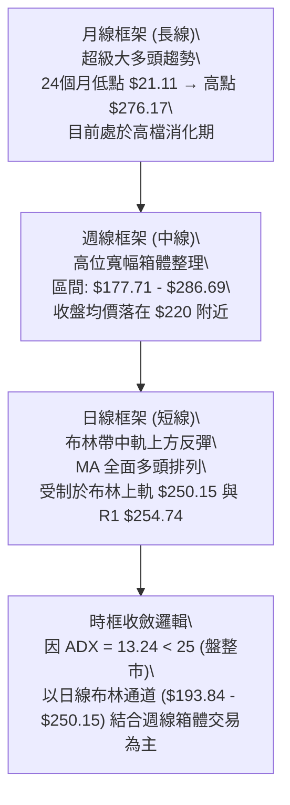

### 📈 長期趨勢 — 12個月走勢圖（Unicode）

```
NBIS 月線走勢圖（過去12個月：2025-10 至 2026-09）
價格軸 ($)
$280 ┤                                      ● (2026-06: $276.17)
$250 ┤                                  ●
$230 ┤                          ●               ● (2026-09: $237.33 ◄現價)
$200 ┤                                      ●
$170 ┤
$140 ┤  ● (2025-10: $130.82)       ●
$110 ┤                  ●   ●
$80  ┤      ●   ●   ●
     └─────────────────────────────────────────────────────────────
       10  11  12  01  02  03  04  05  06  07  08  09 (月份)
```

#### 走勢特徵分析表格

| 階段區間 | 起止價格 | 漲跌幅 | 主要走勢特徵與結構 |
|----------|----------|--------|--------------------|
| **2025-10 ~ 2025-12** | $130.82 → $83.71 | -36.01% | 歷經連續上漲後的急跌回調，確立波段底部支撐 $73.52 |
| **2026-01 ~ 2026-03** | $85.19 → $103.76 | +21.80% | 底部平臺盤整蓄勢，均線開始糾結走平 |
| **2026-04 ~ 2026-06** | $138.23 → $276.17 | +99.79% | 爆發性主升浪行情，資金大幅湧入，觸及歷史高位區域 |
| **2026-07 ~ 2026-09** | $190.41 → $237.33 | +24.64% | 獲利了結盤引發回踩，於 $180 附近企穩後回升至 $237.33 |

### 📊 中期趨勢（週線分析）

```
NBIS 週線關鍵結構示意圖
$300 ┬────────────────────────────────────────── 52W High $299.86
     │                       ▲ (2026-06-21: $286.69)
$270 ┼                   ╭───┴───╮  ▲ (2026-08-16: $277.68)
     │                   │ 箱頂  │  │
$240 ┼───────── 現價 $237.33 ───────┼──┼──────────────────── 阻力 R1 $254.74
     │                              │
$210 ┼───────── MA50 $215.58 ───────┴──┼──────────────────── 箱體中軸支撐
     │                                 ▼ (2026-07-19: $177.71)
$180 ┼───────────────────────────────────────────────── 週線低點聚類 S3 $194.80
```

週線層面上，近 20 週數據顯示股價在 2026 年 6 月創下收盤高點 $286.69 後進入高位箱體橫盤。近期週收盤價呈現 $209.18 → $226.39 → $224.55 → $223.54 → $237.33 的逐波抬升結構，週 MACD 柱狀圖在 2026-09-27 重返正值 (+1.971)，表明中期回調暫告一段落，動能再度由空轉多。

### ⚡ 趨勢強度評估（ADX 解讀）

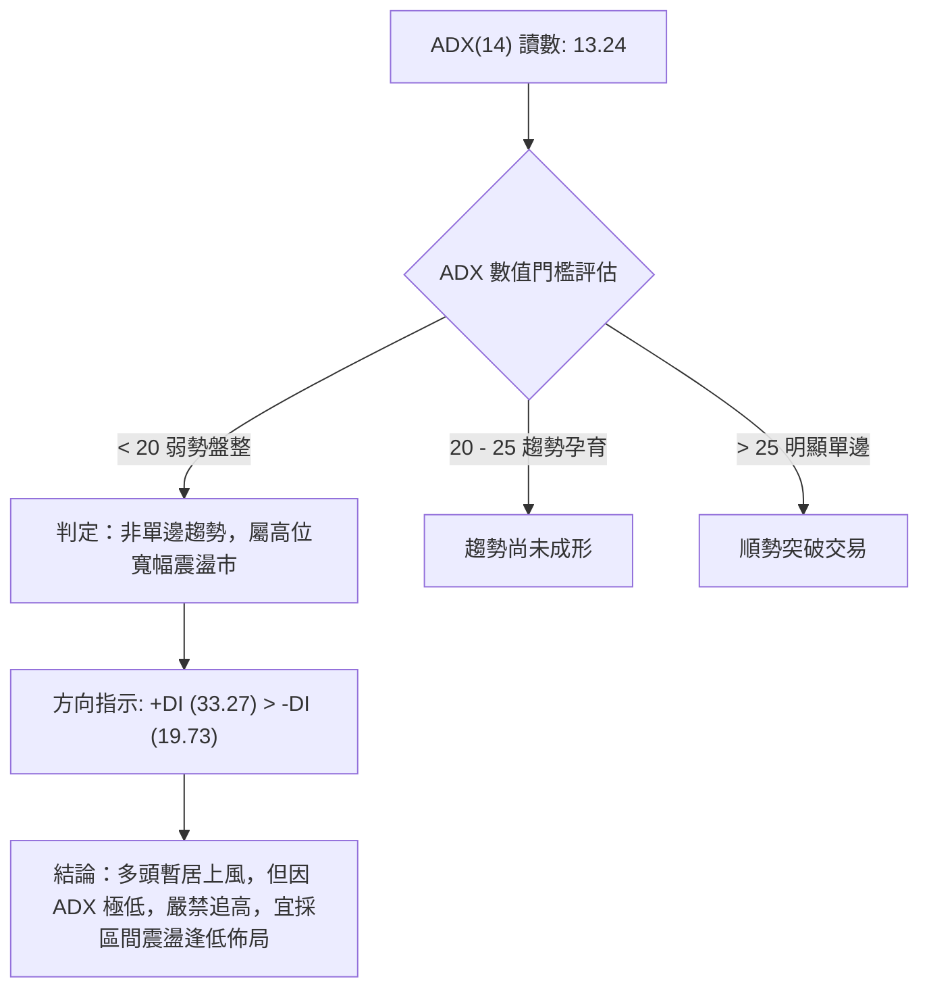

#### ADX 強度對照與市場狀態分析

| 指標變數 | 當前數值 | 參考標準區間 | 技術意義解讀 |
|----------|----------|--------------|--------------|
| **ADX(14)** | **13.24** | < 20 (極弱/盤整) | 價格缺乏單向推進動能，突破性買盤容易受挫陷入拉鋸 |
| **+DI** | **33.27** | > 25 (多頭擴張) | 買方在日內微觀博弈中仍佔有主導權 |
| **-DI** | **19.73** | < 20 (空頭受挫) | 賣壓相對受限，短期內未見連續性大單摜壓 |
| **綜合態勢** | **無趨勢多頭偏向** | DI 交叉偏多但 ADX 疲軟 | 必須嚴格按照**盤整行情規則**操作，重點參考日線布林通道上下軌 |

---

## 3. 圖表形態分析

### 🔍 形態識別系統

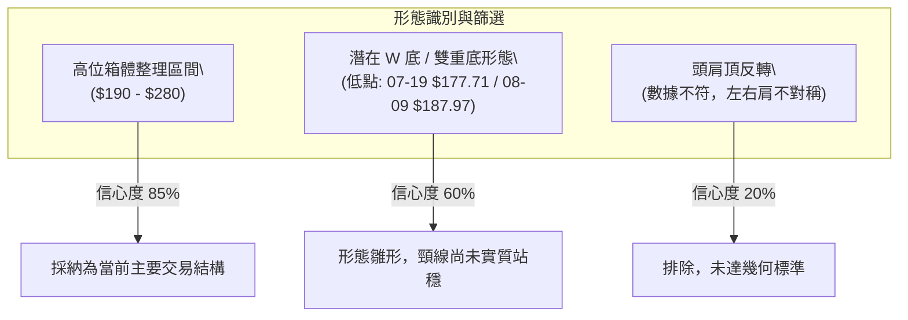

#### 形態信心度與目標價計算表

| 形態類別 | 信心度 | 判斷依據（引用數據） | 完成度 | 目標價（附嚴謹計算式） |
|----------|--------|----------------------|--------|------------------------|
| **高位寬幅箱體** | **85%** | 過去4個月價格在 $190.41 ~ $277.68 之間震盪，布林帶寬逐步收窄 | 90% | 箱頂阻力引用已列高點：**$279.83 (R2)** |
| **雙重底雛形 (W底)** | **60%** | 第一底 2026-07-19 收盤 $177.71，第二底 2026-08-09 收盤 $187.97，頸線為 06-28 收盤 $240.30 | 75% | 頸線 $240.30 + (頸線 $240.30 - 第一底 $177.71) = **$302.89** (接近 52W High **$299.86**) |
| **頭肩形態** | **15%** | 數據缺乏明確右肩與頸線角度支持，左肩成交量不足 | 0% | 訊號不足，排除幾何形態，改採純指標解讀 |

### 🕯️ 重要K線形態分析

| 觀測週期 | 關鍵價位/收盤 | K線組合形態 | 專業技術解讀 | 多空訊號 |
|----------|---------------|-------------|--------------|----------|
| **2026-06 (月線)** | $276.17 | 創歷史高後長上影陰線 | 月線觸及 $299.86 後遭遇獲利盤出逃，形成頂部強阻力 | 🔴 空頭壓制 |
| **2026-07 (月線)** | $190.41 | 大陰線破位探底 | 單月回撤幅度達 31%，回踩斐波那契 50% 水平 ($186.69) | 🔴 快速出清 |
| **2026-08 (月線)** | $206.32 | 下影下探錘頭星 | 探底至波段低點聚類後快速收回，確認 S3 $194.80 具備承接力 | 🟢 止跌企穩 |
| **2026-09 (最新)** | $237.33 | 溫和實體陽線 | 連續第二個月回升，收復 MA20 與 MA50，短期趨勢修復 | 🟢 多頭延續 |
| **近兩週日線群** | $223.54 → $237.33 | 帶量突破短均組合 | 價格突破短期均線 MA5 ($235.27)，日線呈現多頭推動 | 🟢 短線走強 |

### 📉 ASCII 走勢形態示意圖

```
NBIS 週線雙重底 (W底) 與箱體形態示意
$299.86 ┬─────────────────────────────────────────── 歷史高點 / 形態理論目標
        │                      [高點: $286.69]
$260.00 ┼                       /\
        │                      /  \     [頸線阻力: $240.30 - $254.74]
$240.00 ┼──────────────[現價 $237.33]───\──────/\────
        │                                 \/  \  /
$210.00 ┼──────────────────────────────────────\/──── 中軸回踩區
        │            \                  /
        │             \  [第一底]      / [第二底]
$180.00 ┼──────────────\/─────────────/────────────── 支撐聚類: S3 $194.80
        │            $177.71        $187.97
$150.00 ┴───────────────────────────────────────────
```

### 🎯 形態目標價計算

若 NBIS 能夠實質帶量突破頸線區間（以 2026-06-28 高點 $240.30 與阻力 R1 $254.74 為上頸線帶）：
- **頸線基準點**：$240.30
- **底谷最低點**：$177.71 (2026-07-19 收盤)
- **垂直形態高度**：$240.30 - $177.71 = $62.59
- **向上等距測幅目標**：$240.30 + $62.59 = **$302.89**
- **數據比對收斂**：計算結果與數據源中已計算的 52 週最高點 **$299.86 (R3)** 誤差僅 1.01%，具有高度技術共振意義。

---

## 4. 支撐與阻力

### 🗺️ 關鍵價位分布圖（Unicode）

```
NBIS 價位結構分布圖 (由實際 OHLCV 波段高低點聚類計算)
══════════════════════════════════════════════════════════════════
$299.86 ║████████████████████████████████████████║ 強阻力 R3 (52W High)
$279.83 ║██████████████████████████              ║ 阻力 R2 (近一年波段高點)
$254.74 ║████████████████████████████████        ║ 關鍵阻力 R1 (布林上軌與頸線交界)
$246.44 ║----------------------------------------║ 斐波那契 23.6% 回調壓制位
$237.33 ╠════════════════════════════════════════╣ ◄ 現價 ($237.33)
$221.99 ║▓▓▓▓▓▓▓▓▓▓▓▓▓▓▓▓▓▓▓▓                    ║ MA20 動態支撐 / 布林中軌
$213.40 ║----------------------------------------║ 斐波那契 38.2% 回調位 / MA60
$203.87 ║▓▓▓▓▓▓▓▓▓▓▓▓▓▓▓▓▓▓▓▓▓▓▓▓▓▓▓▓            ║ 近期支撐 S1 (波段低點聚類)
$200.30 ║████████████████████████████████        ║ 強支撐 S2 (整數心理大關)
$194.80 ║████████████████████████████████████████║ 核心防守支撐 S3 (箱體下邊界)
══════════════════════════════════════════════════════════════════
```

### 🚧 阻力位分析表

所有阻力數值嚴格引用「關鍵價位」區塊之波段高點聚類數據：

| 阻力級別 | 價位 | 形成原因 | 突破難度 | 重要性 |
|----------|------|----------|----------|--------|
| **R1** | **$254.74** | 2026年6-8月反彈震盪密集換手區，且與布林上軌 $250.15 形成強共振壓制帶 | 🟡 中等 | 短期多空分水嶺，若放量突破將打開上升空間 |
| **R2** | **$279.83** | 2026-08-16 週收盤高點聚類 ($277.68) 與波段次高點，堆積巨額套牢盤 | 🔴 較高 | 中期箱頂核心阻力，需成交量顯著放大至20MA以上始可攻克 |
| **R3** | **$299.86** | 52 週歷史絕對高點，整數 $300 大關心理重壓區 | 🔴 極高 | 長期天花板，未有強大基本面催化前難以一蹴而就 |

### 🛡️ 支撐位分析表

所有支撐數值嚴格引用「關鍵價位」區塊之波段低點聚類數據：

| 支撐級別 | 價位 | 形成原因 | 守住機率 | 重要性 |
|----------|------|----------|----------|--------|
| **S1** | **$203.87** | 近期多頭回踩低點聚類，與斐波那契 38.2% ($213.40) 及 MA60 ($213.85) 構成下檔緩衝墊 | 70% | 短線回調第一道防線，守住則多頭結構無虞 |
| **S2** | **$200.30** | 整數心理防線，2026-08-30 波段調整收盤價 $209.18 下方的重要籌碼沉澱位 | 80% | 中期生命線，跌破將引發停損賣壓 |
| **S3** | **$194.80** | 近一年波段核心低點聚類，接近布林下軌 $193.84 與 2026-08-02 週收盤 $190.41 | 90% | 結構防守底線，一旦失守宣告中期箱體破位，走勢全面轉空 |

### 📐 斐波那契回調位分析

依據 52 週極值區間（低點 $73.52 至 高點 $299.86，垂直落差 $226.34）計算：

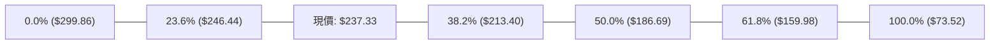

- **當前位置解讀**：現價 **$237.33** 位於 **38.2% ($213.40)** 與 **23.6% ($246.44)** 回調位之間。
- **技術意義**：
  1. 股價在 2026 年 7 月一度深度回踩 50.0% ($186.69) 水平（當月收盤 $190.41），隨後獲得強勁買盤支撐，證明 50% 屬於有效的中期黃金回撤支撐。
  2. 現價重回 38.2% ($213.40) 之上，該價位與日線 MA60 ($213.85) 及 MA50 ($215.58) 形成三重支撐共振帶。
  3. 上方第一道技術阻力即為 23.6% 回調位 **$246.44**，距離現價僅 +3.84%，若無法放量越過，短線容易在 $213.40 ~ $246.44 區間收斂震盪。

---

## 5. 技術指標深度解讀

### 🎛️ 指標訊號總覽

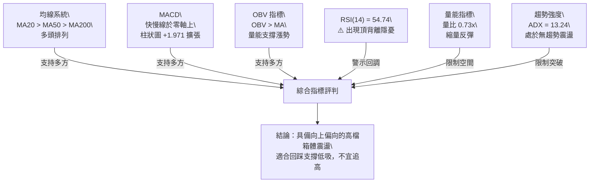

### 📈 移動平均線排列分析

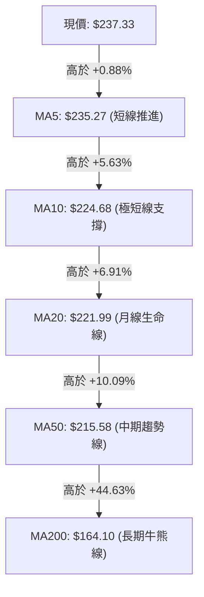

#### 均線多時框明細表

| 均線名稱 | 數值 | 價格相距 | 形態特徵與斜率 | 訊號強度 |
|----------|------|----------|----------------|----------|
| **MA5** | $235.27 | +0.88% | 剛拐頭向上，短線支撐確立 | 🟢 偏多 |
| **MA10** | $224.68 | +5.63% | 斜率向上加速，提供短跑支撐 | 🟢 偏多 |
| **MA20** | $221.99 | +6.91% | 平穩向上，作為布林中軌具強力支撐 | 🟢 偏多 |
| **MA60** | $213.85 | +10.98% | 趨於平緩，與斐波那契 38.2% 重疊 | 🟢 偏多 |
| **MA120** | $208.46 | +13.85% | 穩定爬升，下檔半年線防線 | 🟢 偏多 |
| **MA200** | $164.10 | +44.63% | 長期上揚，長多基石堅定 | 🟢 強多 |
| **MA240** | $154.43 | +53.68% | 長期年線底部支撐無虞 | 🟢 強多 |

**排列總結**：各期均線呈標準「多頭排列」（MA5 > MA10 > MA20 > MA50 > MA200），短中長期買方平均成本依序墊高，下方支撐層層保護。

### 📉 RSI(14) 分析

- **RSI 當前數值**：**54.74**
- **動能進度條**：
  ```
  超賣 [0] ░░░░░░░░░░░░░░░░ [30] ░░░░░░░░ [50] ███░░░░░░░ [70] ░░░░░░░░░░░░░░░░ [100] 超買
  當前水位：54.74% (███████████░░░░░░░░░ 54.74%) — 中性平衡區間
  ```
- **背離分析判斷**：
  - **形態警訊**：數據顯示存在 **⚠️ 頂背離 (Bearish Divergence)**。
  - **細節驗證**：股價在 2026-06-21 觸及 $286.69 時，週 RSI 高達 65.3；但在 2026-08-16 股價再度反彈至 $277.68 高位附近時，週 RSI 僅達 67.2 隨後迅速弱化；當前股價回升至 $237.33，但日線 RSI 僅為 54.74，上升角度明顯鈍化。
  - **結論**：動能指標未能跟上價格反彈節奏，預示股價接近阻力區時將面臨技術性回吐。

### 📊 MACD(12/26/9) 訊號解讀

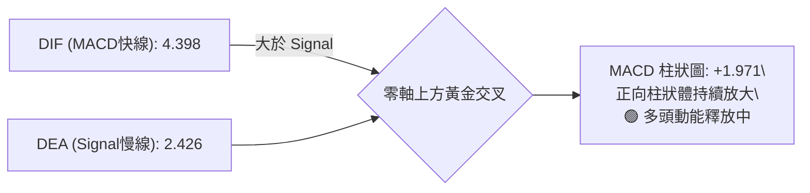

- **數值狀態**：DIF (4.398) > DEA (2.426)，差離柱 Hist 為 **+1.971**。
- **時框驗證**：近20週數據顯示，週 MACD 柱狀圖經歷連續數週負值後，本週（2026-09-27）首度轉正為 **+1.971**（前週為 -0.606）。這表明日線與週線的動能出現共振修復，空方動能出清，多方再度發力。

### 📦 布林通道分析

```
NBIS 日線布林通道位置示意圖 (通道帶寬 = $56.31)
$250.15 ┬────────────────────────────────────────── BB上軌 (阻力壓制)
        │
$237.33 ┼────────────────────────────── [● 現價: %B = 0.77]
        │
$221.99 ┼────────────────────────────────────────── BB中軌 (MA20支撐)
        │
$193.84 ┴────────────────────────────────────────── BB下軌 (超賣邊界)
```

- **布林上軌**：**$250.15** (當前向上空間剩餘 +5.40%)
- **布林中軌 (MA20)**：**$221.99** (關鍵回檔支撐，距離 -6.46%)
- **布林下軌**：**$193.84** (與 S3 核心支撐 $194.80 完美重合)
- **%B 指標解讀**：當前 **%B = 0.77**，價格位於中軌至上軌的上半通道運行，顯示短期多頭佔優；但由於已逼近上軌 $250.15，且通道尚未開口（ADX 低），觸及上軌時通常引發均值回歸。

### 💹 成交量分析（量價配合度）

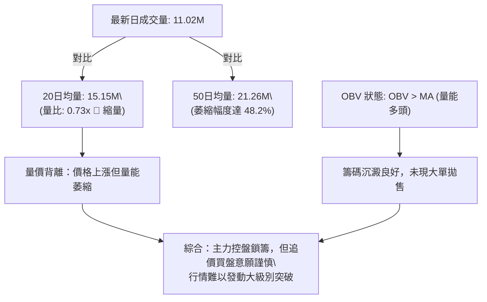

- **量能評估**：最新成交量 11,020,500，遠低於 20 日均量 15,148,130 與 50 日均量 21,263,018。
- **量價關係**：價格自 $223.54 攀升至 $237.33，但成交量未能同步放大，呈現典型的「縮量反彈」。所幸 OBV 仍維持在自身均線之上，說明並非主力撤退，而是市場在高位震盪中等待新的催化劑。

---

## 6. 動能與波動率

### ⚡ 動能評估四象限

| 象限 | 動能維度 | 波動維度 | 當前狀態 | 策略應對評估 |
|------|----------|----------|----------|--------------|
| **Q1** | 強動能 (Trend) | 低波動 (Low Vol) | ─ | 趨勢推進最平穩階段（非當前狀態） |
| **Q2** | 弱動能 (Weak) | 低波動 (Low Vol) | ─ | 窄幅盤整低迷期（非當前狀態） |
| **Q3** | **強動能 (Strong)** | **高波動 (High Vol)** | ─ | 單邊爆發性投機行情（非當前狀態） |
| **Q4** | **溫和動能** | **中高波動 (Mod-High)** | **✓ (當前定位)** | **動能溫和擴張 (+DI> -DI, MACD+) 但受制於 ATR 較高與 ADX 偏弱，宜採取區間高拋低吸** |

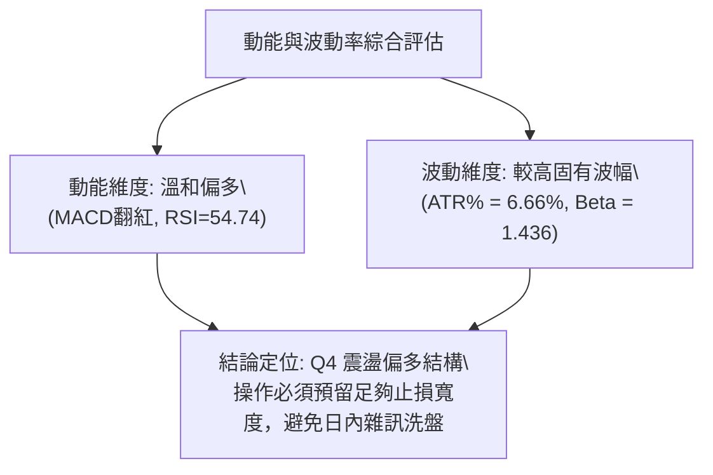

### 📊 ATR 波動率分析

- **ATR(14) 數值**：**$15.80**
- **波幅百分比**：ATR / 現價 = $15.80 / $237.33 = **6.66%**
- **技術含義**：NBIS 每日固有波動幅度達 15.8 美元，屬於典型的高波動成長股。
- **止損距離建議**：
  - **日內/超短線止損**：至少設定 1.0 倍 ATR = **$15.80**。
  - **波段交易止損**：建議設定 1.5 ~ 2.0 倍 ATR = **$23.70 ~ $31.60**。若以現價 $237.33 計算，波段安全止損點應置於 $237.33 - $23.70 = **$213.63**，此位置恰好與斐波那契 38.2% ($213.40) 及 MA60 ($213.85) 重合，具備極高結構防護力。

### 📐 Beta 與市場相關性

- **Beta 係數**：**1.436**
- **市場特徵**：
  - Beta > 1.0 表明該股具有顯著的進攻性屬性，相較於標普500大盤具備 1.44 倍的波動放大效應。
  - **做空比率 (Short % Float)**：高達 **19.8%**（Short Ratio 2.76）。
  - **空頭回補潛力**：近 20% 的空頭部位意味著一旦股價放量突破阻力 R1 $254.74，極易引發空頭踩踏式的軋空（Short Squeeze）行情；但在突破前，空頭仍會依托阻力帶密集施壓。

---

## 7. 多時框架總結

### 📋 時框架評分表

| 時框架 | 趨勢方向 | 動能狀態 | 均線排列 | 形態結構 | 綜合評分 | 操作建議 |
|--------|----------|----------|----------|----------|----------|----------|
| **月線 (長期)** | 🟢 強烈看多 | 🟡 高位消化 | 🟢 多頭排列 | 歷史天花板整理 | **80/100** | 長期多頭持有，不殺跌 |
| **週線 (中期)** | 🟡 寬幅震盪 | 🟢 柱狀圖翻正 | 🟢 MA50向上 | 高位箱體結構 | **60/100** | 箱體操作，逢低吸納 |
| **日線 (短期)** | 🟢 偏多反彈 | 🟡 RSI背離隱憂 | 🟢 均線呈多頭 | 接近布林上軌 | **55/100** | 逼近壓制帶，不宜追高 |

### 🔲 綜合訊號矩陣

```
時框與指標維度一致性檢驗矩陣
┌──────────────┬──────────────┬──────────────┬──────────────┐
│ 指標類別     │ 短期 (日線)  │ 中期 (週線)  │ 長期 (月線)  │
├──────────────┼──────────────┼──────────────┼──────────────┤
│ 均線趨勢     │ 🟢 多頭排列  │ 🟢 守穩MA50  │ 🟢 遠超MA200 │
│ 擺盪動能     │ 🟡 頂背離    │ 🟢 MACD金叉  │ 🟢 處於強勢  │
│ 量能結構     │ 🔴 縮量反彈  │ 🟡 換手持平  │ 🟢 長多鎖籌  │
│ 形態位置     │ 🔴 阻力臨近  │ 🟡 箱體中上  │ 🟢 主升後高檔│
└──────────────┴──────────────┴──────────────┴──────────────┘
```

### ⚖️ 多時框收斂結論

依據多時框收斂規則第 14 條嚴格執行：
1. **行情屬性判定**：當前 **ADX(14) = 13.24 (< 25)**，明確定義市場當前處於**盤整行情（震盪市）**，而非單邊趨勢行情。
2. **主導時框規則**：在盤整行情下，**以日線布林通道上下軌 ($193.84 - $250.15) 作為主要交易區間邊界**；週線與月線的長多格局僅作為「逢低做多而不輕易做空」的大背景依托。
3. **唯一方向性結論**：**中性偏多（區間震盪逢低做多）**。
   - 儘管均線排列完美多頭，但鑑於 RSI 出現頂背離、量能低迷 (0.73x) 且布林上軌 ($250.15) 及 R1 ($254.74) 步步逼近，短線向上空間受限。操作上嚴禁追高，應等待回踩支撐位進行低吸。此結論與第 8 章之主策略完全收斂一致。

---

## 8. 交易策略建議

### 🗺️ 策略決策流程圖

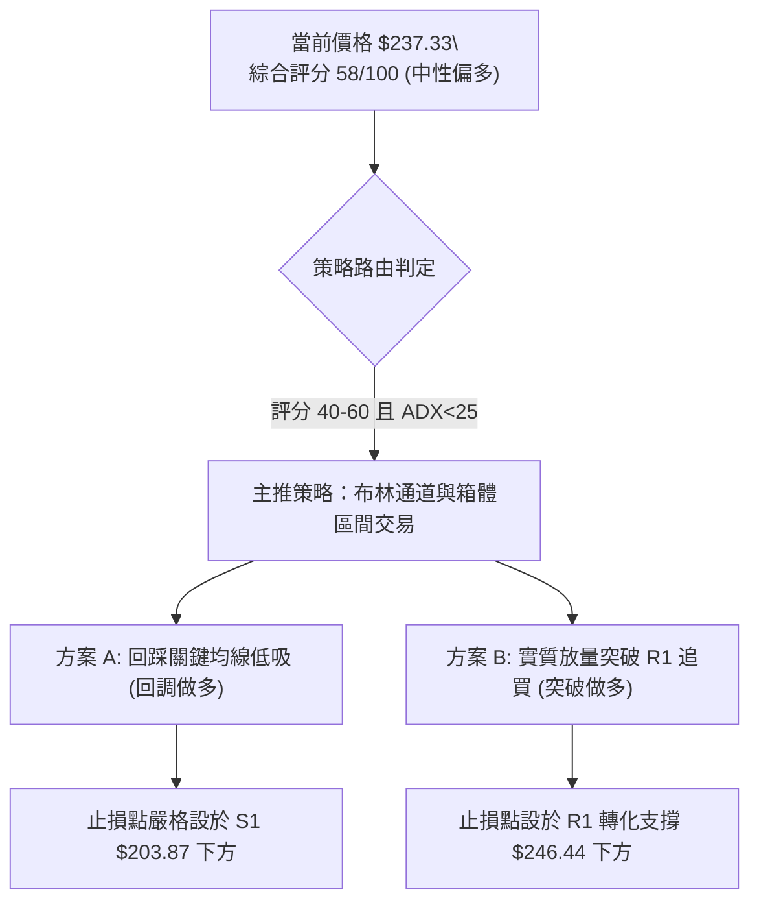

### 🧭 策略路由

**當前主策略方向 = 區間偏多操作 / 逢回低吸（依綜合評分 58/100）**
依據評分卡規則，評分落於 40–60 區間且 ADX 處於盤整狀態，不宜採取激進趨勢單邊押注。主策略以**回踩支撐佈局多單**為主，空頭僅列為關鍵支撐跌破時的反轉避險提示。

### 🎯 價格情境階梯（Price Scenarios）

價位嚴格引用第 4 章波段計算點位：

| 觸發條件 | 下一目標 | 後續延伸 | 情境技術含義 |
|----------|----------|----------|--------------|
| **放量突破 R1 $254.74** | **R2 $279.83** | **R3 $299.86** | 擺脫高檔橫盤，引發 19.8% 融券回補，發動新一輪主升浪 |
| **維持於 $215 - $250 波動** | **布林上軌 $250.15** | **布林中軌 $221.99** | 典型的 ADX<25 弱趨勢箱體震盪，籌碼在均線區反覆換手 |
| **失守 S1 $203.87 / MA50** | **S2 $200.30** | **S3 $194.80** | 中期均線破位，短多停損出局，考驗箱體底部多空生死線 |

### 📊 情境機率分佈

| 情境劇本 | 估計機率 | 主要技術指標依據 |
|----------|----------|------------------|
| **情境一：區間震盪回踩蓄勢** | **55%** | ADX 僅 13.24，布林帶寬壓制，RSI 頂背離，量能低迷難以直接突破 |
| **情境二：回踩企穩後向上突破** | **30%** | 均線系統呈標準多頭排列，MACD 柱狀圖翻正，OBV 保持多頭推升 |
| **情境三：跌破支撐轉弱探底** | **15%** | 獲利盤回吐加劇，失守 MA50 ($215.58) 引發技術性止損盤 |

### 🟢 主策略詳情

所有價位均嚴格取自數據模組已列之關鍵價位：

| 策略要素 | 策略 A（穩健型：回踩 MA 支撐低吸） | 策略 B（進取型：突破 R1 放量追多） |
|----------|-----------------------------------|-----------------------------------|
| **進場條件** | 股價回踩 MA20至斐波38.2%獲得止跌確認 | 日K線實體收盤帶量突破 R1 阻力位 |
| **進場價格** | **$215.58** (MA50與斐波38.2%重疊區) | **$254.74** (R1 關鍵阻力突破點) |
| **目標價 T1** | **$246.44** (斐波那契 23.6% 壓制點) | **$279.83** (阻力位 R2 波段高點) |
| **目標價 T2** | **$279.83** (波段阻力 R2) | **$299.86** (阻力位 R3 / 52W High) |
| **止損價格** | **$200.30** (支撐位 S2 / 心理防線) | **$240.30** (跌回頸線下方及 S1 緩衝) |
| **風險空間** | $215.58 - $200.30 = $15.28 | $254.74 - $240.30 = $14.44 |
| **報酬空間 (T1)**| $246.44 - $215.58 = $30.86 | $279.83 - $254.74 = $25.09 |
| **風險報酬比** | **1 : 2.02** (以 T1 計算) / **1 : 4.20** (T2) | **1 : 1.74** (以 T1 計算) / **1 : 3.12** (T2) |
| **成功機率** | **65%** | **45%** (需成交量配合方能提高) |
| **建議倉位** | **15% ~ 20%** 總資金 | **10%** 總資金 (突破確認後加碼) |

### 🔴 反向風險觸發點（對沖提示）

- **多單全面離場/風控警戒線**：日K線收盤價跌破 **S1 $203.87**，且成交量放大。
- **翻空訊號確認點**：一旦盤中跌破 **S3 $194.80**，代表高位雙頂/破位成立，需立即了結所有剩餘多頭倉位，並可考慮運用反向 ETF 或期權進行空頭避險。

### ⭐ 整體訊號強度評星

```
╔══════════════════════════════════════════════════════════════════╗
║ 做多訊號強度：★★★☆☆  (3.0/5星 — 均線完好但動能背離與量能不足) ║
║ 做空訊號強度：★★☆☆☆  (2.0/5星 — 僅屬技術性回調，長多格局未變) ║
║ 整體可信度：  ★★★★☆  (4.0/5星 — 關鍵點位高度收斂，指引明確)   ║
╚══════════════════════════════════════════════════════════════════╝
```

---

## 9. 風險提示與監控

### ✅ 關鍵監控指標 Checklist

```
╔══════════════════════════════════════════════════════════════════╗
║               NBIS 每日關鍵技術監控 Checklist                    ║
╠══════════════════════════════════════════════════════════════════╣
║ [ ] 價格是否觸及布林上軌 ($250.15) 或 R1 ($254.74) 滯漲？        ║
║ [ ] 日成交量能否放大超越 20 日均量 (15.15M) 達成放量突破？        ║
║ [ ] RSI(14) 是否跌破 50 中水準，確認頂背離引發之回檔？          ║
║ [ ] MACD 柱狀圖是否持續擴張（高於 +1.971），避免出現假金叉？     ║
║ [ ] 下檔 MA20 ($221.99) 與 MA50 ($215.58) 支撐是否完好無損？     ║
║ [ ] ADX 是否開始由 13.24 向上拐頭超越 20，孕育新趨勢？          ║
║ [ ] 空頭比例 (19.8% Float) 是否出現顯著借券歸還或空頭踩踏？     ║
╚══════════════════════════════════════════════════════════════════╝
```

### ⚠️ 風險場景分析

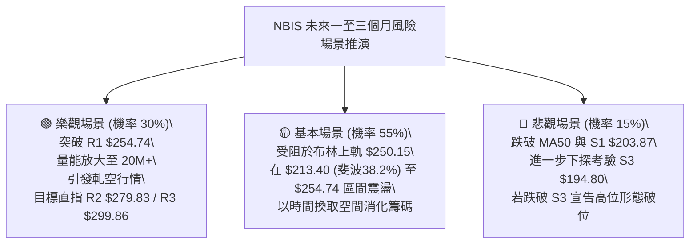

### 🛡️ 風險管理重要提醒

1. **ATR 波動適應性**：鑑於 ATR 高達 **$15.80 (6.66%)**，單日洗盤震幅極大。交易者切忌滿倉操作，單筆交易虧損額度應嚴格控制在總賬戶淨值的 **1.0% ~ 1.5%** 以內。
2. **高放空比率雙刃劍**：**19.8%** 的 Short Interest 意味著極端的波動性。向上突破時容易產生跳空暴漲，但一旦大盤疲軟，空頭亦會不計代價砸盤，切勿在阻力位前盲目市價追高。
3. **數據紀律止損執行**：嚴格以收盤價跌破 **S2 $200.30** 作為波段持股的最後底線，絕不可因基本面遠景而忽視技術破位訊號。

---

## 📋 報告總結

```
╔══════════════════════════════════════════════════════════════════╗
║                  NBIS 技術分析報告總結                         ║
╠══════════════════════════════════════════════════════════════════╣
║ 報告日期：2026-09-27                                             ║
║ 當前價格：$237.33                                                ║
║ 分析評級：⚖️ 偏多震盪 (技術評分: 58/100)                         ║
║                                                                  ║
║ 關鍵結論：                                                       ║
║ ├─ 長期趨勢：🟢 強烈看多 (MA200 位於 $164.10 遠在下方)           ║
║ ├─ 中期趨勢：🟡 寬幅箱體震盪 (區間 $190 - $280，ADX 僅 13.24)    ║
║ ├─ 短期趨勢：🟢 偏多反彈 (MACD 翻紅 +1.971，但面臨 RSI 頂背離)   ║
║ ├─ 關鍵支撐：S1 $203.87 / S2 $200.30 / S3 $194.80                ║
║ ├─ 關鍵阻力：R1 $254.74 / R2 $279.83 / R3 $299.86                ║
║ └─ 華爾街目標均價：$283.58 (當前具有 +19.49% 溢價空間)          ║
║                                                                  ║
║ 最優策略組合：                                                   ║
║ 1. 🥇 最佳機會：策略 A (穩健型) — 耐心等待股價回踩 MA50 與       ║
║    斐波 38.2% 區間 ($213.40 - $215.58) 低吸，風報比達 1:2.02。  ║
║ 2. 🥈 次選機會：策略 B (進取型) — 等待日線實體大陽線放量突破     ║
║    R1 $254.74 後順勢追多，目標看至 R2 $279.83。                 ║
║ 3. 🥉 保守選擇：場外觀望，等待日線布林通道完成收斂開口且 ADX     ║
║    回升至 25 以上，確認單邊趨勢啟動後再行介入。                  ║
╚══════════════════════════════════════════════════════════════════╝
```

---

> ⚠️ **免責聲明**：本報告為技術分析研究成果，所有數據、圖表及點位推算均嚴格基於所提供的歷史交易資訊與客觀算法模型。本報告**僅供學術研究與投資策略探討參考**，**不構成任何具體的買賣邀約或投資建議**。金融市場瞬息萬變，高 Beta 標的具備較高波動風險，投資人應獨立評估風險並自行承擔交易損益。

---

*報告生成時間：2026-09-27 ｜ 數據來源：Yahoo Finance ｜ 分析框架：多時框架量化技術分析*