# NBIS 技術分析報告

> **報告日期**：2026-09-28 ｜ **語言**：繁體中文 ｜ **數據來源**：Yahoo Finance ｜ **當前價格**：$237.33

---

## 目錄

| 章節 | 內容 |
|------|------|
| [1. 技術面概覽](#1-技術面概覽) | 訊號儀表板、核心指標、評分卡 |
| [2. 趨勢分析](#2-趨勢分析) | 多時框趨勢、長中短期走勢 |
| [3. 圖表形態分析](#3-圖表形態分析) | 形態識別、K線組合、目標價 |
| [4. 支撐與阻力](#4-支撐與阻力) | 關鍵價位、斐波那契回調 |
| [5. 技術指標深度解讀](#5-技術指標深度解讀) | MA/RSI/MACD/布林/成交量 |
| [6. 動能與波動率](#6-動能與波動率) | 動能評估、ATR、Beta |
| [7. 多時框架總結](#7-多時框架總結) | 時框架評分矩陣 |
| [8. 交易策略建議](#8-交易策略建議) | 多空策略、風險報酬比 |
| [9. 風險提示與監控](#9-風險提示與監控) | 監控指標、風險場景 |

---

## 1. 技術面概覽

### 🎯 技術訊號儀表板

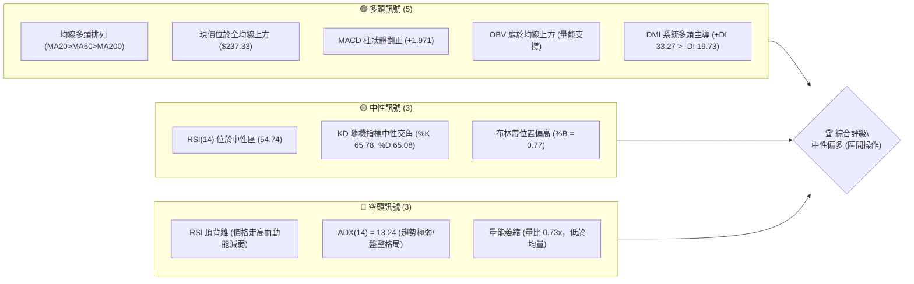

### 📊 核心指標速覽表

| 指標類別 | 指標名稱 | 當前數值 | 訊號 | 解讀 |
|----------|----------|----------|------|------|
| **價格** | 當前收盤價 | $237.33 | 🟢 | 位於52週區間 72.4% 處，處於中長期多頭主導結構中 |
| **均線** | MA20 (短) | $221.99 | 🟢 | 現價高於 MA20 達 +6.91%，短期支撐扎實 |
| **均線** | MA50 (中) | $215.58 | 🟢 | 現價高於 MA50，中期趨勢保護有效 |
| **均線** | MA200 (長) | $164.10 | 🟢 | 現價大幅高於 MA200 達 +44.62%，長期大牛市基調不變 |
| **動能** | RSI(14) | 54.74 | 🟡 | 位於平衡軸上方，但日線與週線結構存在明確頂背離警訊 |
| **動能** | MACD | 4.398 / 2.426 | 🟢 | DIFF 高於 DEA，柱狀體為 +1.971，短線偏多動能釋放 |
| **擺動** | Stoch %K / %D | 65.78 / 65.08 | 🟡 | 隨機指標進入中高區鈍化，無超買但上升斜率放緩 |
| **趨勢強度** | ADX(14) | 13.24 | 🔴 | ADX < 25 極弱，確認當前並非單邊趨勢，屬箱體震盪行情 |
| **波動** | ATR(14) | $15.80 (6.66%) | 🟡 | 日內波動幅度劇烈，止損設定需容忍寬幅波動 |
| **成交量** | 20日量比 | 0.73x | 🔴 | 量能持續萎縮（11.02M vs 15.15M），缺乏追價買盤動能 |

### 🏆 技術評分卡

```
╔══════════════════════════════════════════════════════════════════╗
║                   技術評分卡 — NBIS (2026-09-28)                ║
╠══════════════════════════════════════════════════════════════════╣
║ 趨勢強度 (ADX=13.24)   ████░░░░░░░░░░░░░░░░  20/100 🔴 弱勢盤整  ║
║ 動能指標 (MACD/RSI)   ████████████░░░░░░░░  60/100 🟡 中性微多  ║
║ 支撐穩定度 (均線密集) ████████████████░░░░  80/100 🟢 支撐穩固  ║
║ 成交量配合 (量比0.73)  ████████░░░░░░░░░░░░  40/100 🔴 量價背離  ║
║ 形態完整度 (箱體整理) ██████████████░░░░░░  70/100 🟡 區間收斂  ║
║ 均線排列 (多頭順向)   ██████████████████░░  90/100 🟢 完整多頭  ║
╠══════════════════════════════════════════════════════════════════╣
║ 綜合評分              ████████████░░░░░░░░  60/100 🟡 中性偏多  ║
║ 決策指引              箱體區間策略 (布林通道高出低進)           ║
╚══════════════════════════════════════════════════════════════════╝
```

---

## 2. 趨勢分析

### 🌐 多時框趨勢分析

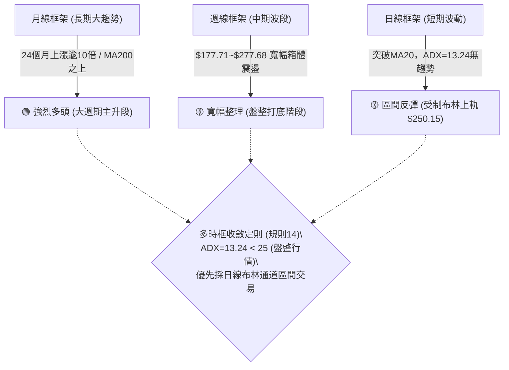

### 📈 長期趨勢 — 12個月走勢圖（Unicode）

```
NBIS 月線走勢圖（過去12個月：2025-10 至 2026-09）
價格軸 ($)
$300 ┤                                        
$275 ┤                                  ●(06月: $276.17)
$250 ┤                                      
$225 ┤                             ●(05月: $231.09)     ●(09月: $237.33 現價)
$200 ┤                                            ●(08月: $206.32)
$175 ┤                                        ●(07月: $190.41)
$150 ┤                       ●(04月: $138.23)
$125 ┤ ●(10月: $130.82)
$100 ┤       ●(11月: $94.87)   ●(03月: $103.76)
 $75 ┤             ●   ●   ●(02月: $91.19)
     └─┬───────┬───────┬───────┬───────┬───────┬───────┬───────┬─
      10月    11月    12月    01月    02月    03月    04月    05月    06月    07月    08月    09月
      (2025)                                                  (2026)
```

#### 過去 12 個月走勢特徵分析

| 階段區間 | 時間跨度 | 價格起訖 | 區間漲跌幅 | 結構性技術特徵 |
|----------|----------|----------|------------|----------------|
| **第一階段：高位拉回** | 2025-10 ~ 2025-12 | $130.82 → $83.71 | -36.01% | 快速釋放短線獲利了結賣壓，成交量逐月收斂 |
| **第二階段：築底蓄勢** | 2026-01 ~ 2026-03 | $85.19 → $103.76 | +21.80% | 構築三重底部，打下 $80-$90 堅實中長期支撐底部 |
| **第三階段：主升暴動** | 2026-04 ~ 2026-06 | $103.76 → $276.17 | +166.16% | 月線連三根巨陽，創歷史天價 $299.86，形成暴衝走勢 |
| **第四階段：深度洗盤** | 2026-07 ~ 2026-09 | $276.17 → $237.33 | -14.06% | 觸底 $177.71 後反彈，目前於 $210~$250 進行籌碼沉澱 |

### 📊 中期趨勢（週線分析）

從近 20 週收盤走勢觀察，NBIS 呈現典型的「鋸齒形箱體震盪」：
- **波段高點壓制**：2026-06-21 收於 $286.69，隨後於 2026-08-16 衝高至 $277.68 後急速回落，確立了上方 $279.83 (R2) ~ $299.86 (R3) 為強烈籌碼密集套牢區。
- **波段低點支撐**：2026-07-19 最低下探收於 $177.71，隨後 07-26 及 08-09 連續在 $187.77~$187.97 獲買盤支撐，與日線 S3 ($194.80) 及斐波那契 50% ($186.69) 形成緊密防禦網。
- **量能收斂現狀**：自 8 月中旬爆出單週 1.67 億股的大量後，9 月週成交量逐週萎縮至 5,788 萬 ~ 7,928 萬股，代表中期籌碼鎖定度提升，進入方向選擇前的收斂末端。

```
週線箱體波動示意圖：
$299.86 (52W高點) ══════════════════════════════════════════════ [強天花板 R3]
$277.68 / $279.83 ────────────────────────────────────────────── [波段次高 R2]
                   ▲ 06/21 ($286.69)      ▲ 08/16 ($277.68)
                   │                      │
$237.33 (當前收盤) ······························● 現價 (箱體中軸偏上)
                   │                      │
                   ▼ 07/19 ($177.71)      ▼ 08/09 ($187.97)
$194.80 / $186.69 ══════════════════════════════════════════════ [箱體硬地板 S3/Fib 50%]
```

### ⚡ 趨勢強度評估（ADX 解讀）

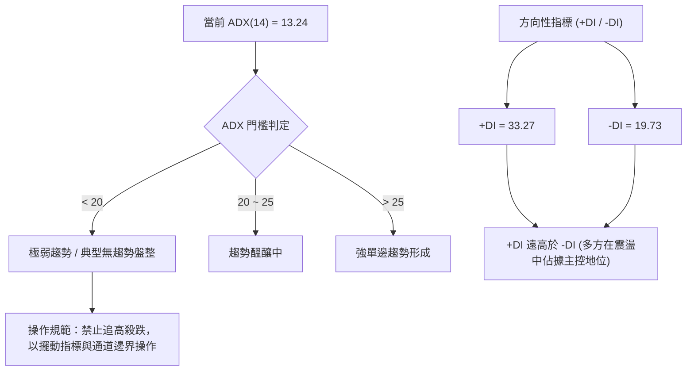

| 指標變數 | 當前讀數 | 歷史門檻基準 | 技術含義解讀 |
|----------|----------|--------------|--------------|
| **ADX(14)** | **13.24** | 25.00 | 明確低於 25，判定處於**低趨勢動能狀態**，一切單邊破位追單風險極大。 |
| **+DI** | **33.27** | 20.00 | 多方攻擊能量充足，說明在當前箱體內，多頭推升力道優於空頭。 |
| **-DI** | **19.73** | 20.00 | 空方壓制力道弱化，跌勢不易形成連鎖崩跌效應。 |
| **判定總結** | **非趨勢行情** | 收斂規則適用 | **執行日線布林通道上下軌之高出低進區間策略**。 |

---

## 3. 圖表形態分析

### 🔍 形態識別系統

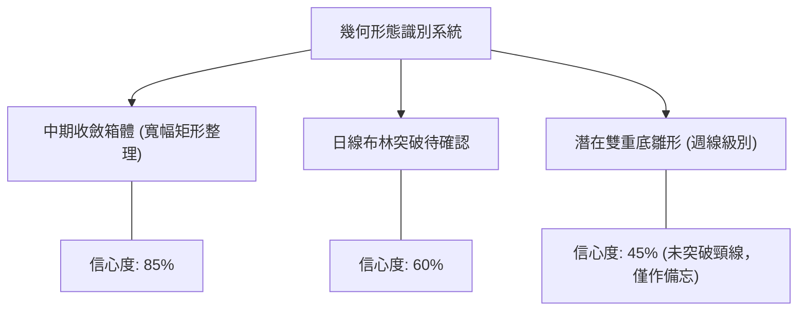

#### 形態識別與信心度評估表

| 形態類別 | 信心度 | 判斷依據（嚴格引用數據） | 完成度 | 目標價（附嚴謹計算式） |
|----------|--------|--------------------------|--------|------------------------|
| **中級收斂箱體 (Rectangle)** | **85%** | 區間頂部壓制在 R1 ($254.74)，底部支撐在 S1 ($203.87) 與 S2 ($200.30)。近 4 週收盤均被鎖在 $209~$237 狹幅區。 | 80% | 向上突破 R1 測算高度：$254.74 - $203.87 = $50.87；目標 = $254.74 + $50.87 = **$305.61** (接近52W高點 $299.86)。 |
| **布林通道中軌突破** | **60%** | 價格站穩 BB 中軌 ($221.99)，BB %B 達 0.77，向 BB 上軌 ($250.15) 推展。 | 75% | 短線目標即為 BB 上軌 **$250.15**。 |
| **週線雙重底 (W-Bottom)** | **45% (不足)** | 第一底為 2026-07-19 之 $177.71，第二底為 2026-08-09 之 $187.97。但頸線在 08-16 之 $277.68，當前距頸線極遠。 | 35% | **未達50%門檻，依規則15不予強行推算目標價，僅作指標型觀察**。 |

### 🕯️ 重要 K 線形態分析

| 週期/時間 | 收盤價 | K線形態名稱 | 形態解讀與市場心理 | 多空訊號 |
|-----------|--------|-------------|--------------------|----------|
| **2026-08-16 (週)** | $277.68 | 巨量衝高長上影陽線 | 單週爆出 1.67 億股天量，最高逼近 $299.86 後引發強烈空頭反撲，留下長上影線。 | 🔴 頂部籌碼派發 |
| **2026-08-23 (週)** | $219.13 | 吞噬中陰線 | 迅速跌穿前週實體半數以上，確認短線假突破，套牢籌碼沉澱於 $270 以上。 | 🔴 空方反擊 |
| **2026-09-06 (週)** | $226.39 | 縮量止跌十字星 | RSI 觸及 33.3 低點，週量驟縮至 5,788 萬股，賣壓出盡，空方動能竭盡。 | 🟢 轉折止跌 |
| **2026-09-27 (週)** | $237.33 | 帶量突破實體小陽線 | 連續三週收紅，MACD 柱狀體翻正至 +1.971，價格重回所有均線之上。 | 🟢 短線多頭重掌控盤 |

### 📉 ASCII 走勢形態示意圖

```
NBIS 週線級別收斂箱體結構圖：
  $299.86 ┬────────────────────────────────────────── (52W歷史天價)
          │             ▲ 08/16 巨量假突破 ($277.68)
  $254.74 ┼────────────┌┴───────────────────────────── [箱體上沿阻力 R1]
          │            │      ┌──┐   ▲ 現價 $237.33
          │     ┌──┐   │      │  │  ┌┴┐ (挑戰上軌)
  $221.99 ┼─────┼──┼───┼──────┼──┼──┼─┼─────────────── [箱體核心中軸 BB中軌/MA20]
          │     │  │   │      │  │  │ │
  $203.87 ┼─────┴──┴───┴──────┴──┴──┴─┴─────────────── [箱體下沿支撐 S1]
          │          ▼ 07/19 觸底 ($177.71)
  $164.10 ┴────────────────────────────────────────── (MA200 牛熊分水嶺)
```

### 🎯 形態目標價計算

根據高可靠度（85%）之「中級收斂箱體」進行幾何測幅：
1. **箱體頂部（阻力基準）**：$254.74（對應關鍵價位 R1）
2. **箱體底部（支撐基準）**：$203.87（對應關鍵價位 S1）
3. **箱體垂直高度 ($H$)**：
   $$H = \text{R1} - \text{S1} = \$254.74 - \$203.87 = \$50.87$$
4. **向上突破最小測量目標價（Breakout Target）**：
   $$\text{Target}_{\text{Up}} = \text{R1} + H = \$254.74 + \$50.87 = \$305.61$$
   *（備註：該目標價與 52 週高點 $299.86 極度重合，符合突破前高後之標準測幅法則）*
5. **向下跌破最小測量目標價（Breakdown Target）**：
   $$\text{Target}_{\text{Down}} = \text{S1} - H = \$203.87 - \$50.87 = \$153.00$$
   *（備註：該下行目標精準落在 MA240 之 $154.43 支撐帶，具備高度技術互證性）*

---

## 4. 支撐與阻力

### 🗺️ 關鍵價位分布圖（Unicode）

```
NBIS 價位結構分布圖 (由 OHLCV 與歷史波段密集區計算)
══════════════════════════════════════════════════════════════════════
$299.86 ║████████████████████████████████║ 歷史極值/強阻力 R3 (Fib 0.0%)
$279.83 ║████████████████████████        ║ 波段次高壓制 R2
$254.74 ║████████████████████████████    ║ 關鍵短線阻力 R1 (箱體上沿)
$250.15 ║▓▓▓▓▓▓▓▓▓▓▓▓▓▓▓▓▓▓▓▓▓▓▓▓        ║ 布林通道上軌 (動態壓制)
$246.44 ║────────────────────────────────║ 斐波那契回調 23.6% 位
$237.33 ╠════════════════════════════════╣ ◄ 當前收盤價 ($237.33)
$221.99 ║▓▓▓▓▓▓▓▓▓▓▓▓▓▓▓▓▓▓▓▓▓▓▓▓        ║ 短期均線支撐 MA20 / 布林中軌
$215.58 ║▓▓▓▓▓▓▓▓▓▓▓▓▓▓▓▓▓▓            ║ 中期均線支撐 MA50
$213.40 ║────────────────────────────────║ 斐波那契回調 38.2% 位
$203.87 ║████████████████████████        ║ 近期波段關鍵支撐 S1
$200.30 ║████████████████████████████    ║ 整數心理關卡支撐 S2
$194.80 ║████████████████████████████████║ 強結構支撐 S3 (跌破則中期轉空)
$186.69 ║────────────────────────────────║ 斐波那契回調 50.0% 位 (生死分水嶺)
$164.10 ║████████████████████████████████║ 長期牛熊分界線 MA200
══════════════════════════════════════════════════════════════════════
```

### 🚧 阻力位分析表

| 阻力級別 | 準確價位 | 形成原因與數據支撐 | 突破難度 | 重要性評級 |
|----------|----------|--------------------|----------|------------|
| **R1** | **$254.74** | 近一年波段高點聚類；與日線布林通道上軌 ($250.15) 形成重疊壓力帶。 | 🟡 中等 (需補量至20日均量以上) | ★★★★☆ |
| **R2** | **$279.83** | 2026年6月及8月中旬波段爆量換手套牢區，解套賣壓沉重。 | 🔴 極高 (需消化 1.67 億股套牢籌碼) | ★★★★★ |
| **R3** | **$299.86** | 52週歷史最高點，斐波那契 0.0% 極致反轉位，歷史心理天花板。 | 🔴 巨大 (歷史阻力位) | ★★★★★ |

### 🛡️ 支撐位分析表

| 支撐級別 | 準確價位 | 形成原因與數據支撐 | 守住機率 | 重要性評級 |
|----------|----------|--------------------|----------|------------|
| **S1** | **$203.87** | 近一年波段密集低點聚類；上方緊貼 MA60 ($213.85) 與 MA50 ($215.58)。 | 🟢 75% | ★★★★☆ |
| **S2** | **$200.30** | 整數大關心理支撐，主力資金防守底線。 | 🟢 80% | ★★★★☆ |
| **S3** | **$194.80** | 近一年波段核心支撐，與布林下軌 ($193.84) 及 Fib 50% ($186.69) 構成防護林。 | 🟢 85% | ★★★★★ |

### 📐 斐波那契回調位分析

依據 52 週完整波段低點 **$73.52** 漲至最高點 **$299.86**（波幅達 $226.34）進行分析：

```
斐波那契回調軸線解讀：
  0.0%  $299.86 ─── 52W 最高峰值
 23.6%  $246.44 ─── 頂部弱勢回撤位 ◄───┐
                                          ├─ 現價 $237.33 落在 23.6% ~ 38.2% 區間
 38.2%  $213.40 ─── 強勢回調防禦位 ◄───┘
 50.0%  $186.69 ─── 多空平衡分水嶺
 61.8%  $159.98 ─── 黃金分割生命線 (與 MA200 $164.10 形成黃金共振)
 78.6%  $121.96 ─── 深度極限回撤位
100.0%  $ 73.52 ─── 52W 起漲原點
```

- **當前位置解讀**：現價 **$237.33** 處於 **23.6% ($246.44)** 與 **38.2% ($213.40)** 之間。
- **技術意義**：在經歷 454% 的營收爆發與股價大幅飆升後，股價回調始終未有效跌破 38.2% ($213.40)，證明該股在中長期依然處於**強勢整理格局**。下方 38.2% 回調位與 MA50 ($215.58)、MA60 ($213.85) 完美重疊，構成極強的結構性「鐵底」。

---

## 5. 技術指標深度解讀

### 🎛️ 指標訊號總覽

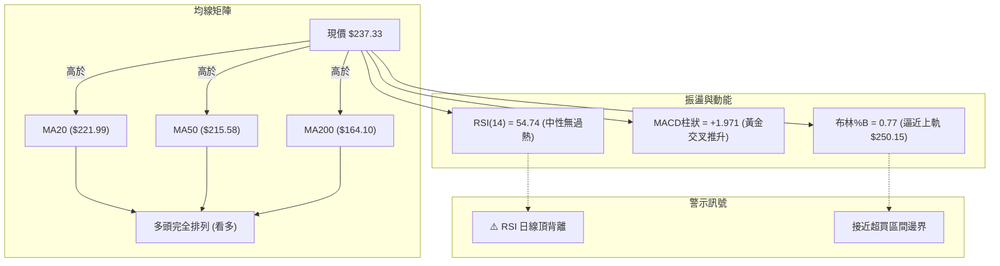

### 📈 移動平均線排列分析

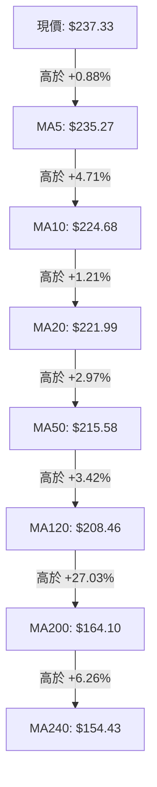

#### 均線排列特徵評估
1. **標準多頭順序**：MA5 > MA10 > MA20 > MA50 > MA120 > MA200 > MA240，呈現教科書級的「均線發散多頭排列」。
2. **短期支撐厚度**：MA20 位於 $221.99，與布林中軌完全鎖定。過去 20 個交易日內，價格每次回踩 MA20 均獲得實質買盤承接。
3. **長期趨勢基石**：MA200 位於 $164.10，距離現價有 +44.62% 的安全緩衝墊，中期內絕無轉為全面空頭市場之疑慮。

### 📉 RSI(14) 分析

- **當前讀數**：**54.74** ｜ 區間位置：
  ```
  [0] ─────────── [30 超賣] ─────────● [54.74 中性] ────── [70 超買] ─────────── [100]
  進度條：███████████████░░░░░░░░░░░░░ (54.74%)
  ```
- **超買超賣研判**：處於 50 景氣線上方，顯示多頭稍佔優勢，但未進入 70 以上的過熱警戒區。
- **背離判斷（重要警訊）**：
  - **日線存在明確「頂背離」**：
    - 價格維度：2026-06-21 收 $286.69 時，RSI 為 65.3；2026-08-16 股價再度衝高收 $277.68，RSI 升至 67.2。
    - 近期維度：現價推升至 $237.33，但日線 RSI 僅為 54.74，上升斜率顯著低於價格推升斜率，顯示**買盤邊際動能遞減**。
  - **結論**：頂背離抑制了直接突破 R1 ($254.74) 的概率，暗示短線價格觸及布林上軌後易出現回踩。

### 📊 MACD(12/26/9) 訊號解讀

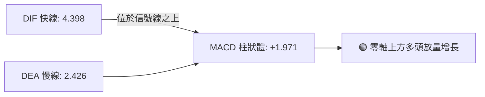

- **參數狀態**：DIFF = 4.398, DEA = 2.426，MACD Hist = **+1.971**。
- **交叉狀態**：MACD 快線已於零軸上方重新穿越慢線形成金叉，且週線 MACD 柱狀體連續兩週收斂後翻正（09-20 為 -0.606，09-27 翻正至 +1.971）。
- **解讀**：短線動能指標已從 8 月底的修正陰霾中恢復，多頭具備發起短線脈衝的技術條件。

### 📦 布林通道分析

```
日線布林通道示意圖 (帶寬: $56.31 / 寬度 25.37%)
$250.15 ┬─────────────────────────────────────────── 布林上軌 (強阻力壓制)
        │                       ● 現價 $237.33 (%B = 0.77)
$221.99 ┼─────────────────────────────────────────── 布林中軌 (MA20 強動態支撐)
        │
$193.84 ┴─────────────────────────────────────────── 布林下軌 (安全防禦底線)
```

- **通道數據**：上軌 **$250.15** ｜ 中軌 **$221.99** ｜ 下軌 **$193.84**。
- **%B 位置分析**：當前 %B 為 **0.77**，數值 > 0.5 且正快速逼近上軌 1.0 處。
- **通道形態解讀**：通道呈現橫向收斂走平狀態，並未開口發散。根據布林通道統計法則，在走平的通道中，**上軌 $250.15 具備高概率的阻力反壓特性**，若缺乏成交量暴增配合，極易在觸及 $250.00~$254.74 時受阻拉回。

### 💹 成交量分析（量價配合度）

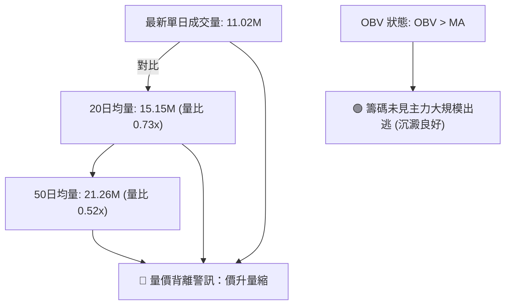

- **量價分析結論**：價格近一週由 $223.54 上漲至 $237.33，但最新成交量（1,102 萬股）僅為 20 日均量的 73%，呈現經典的「**量縮價漲**」。
- **OBV 確認**：雖然成交量未放大，但 OBV 指標依然維持在自身的移動平均線之上，代表當前未出現機構恐慌性派發，屬於「籌碼鎖定、場內存量資金拉抬」行情。

---

## 6. 動能與波動率

### ⚡ 動能評估

#### 動能與波動率狀態定位表

| 狀態象限 | 動能強度 (RSI/MACD) | 波動率水準 (ATR/帶寬) | 當前判定 | 戰術應對邏輯 |
|----------|---------------------|-----------------------|----------|--------------|
| **象限一** | 強勢動能 (>60) | 低波動 (壓縮蓄勢) | — | 順勢突破加碼 |
| **象限二** | **溫和/弱動能 (50~55)** | **中低波動 (盤整收斂)** | **✓ (當前狀態)** | **高出低進，以區間邊界止損** |
| **象限三** | 強勢動能 (>60) | 高波動 (情緒宣洩) | — | 緊盯止盈，嚴防暴跌 |
| **象限四** | 弱勢動能 (<40) | 高波動 (破位崩盤) | — | 堅決離場，觀望空倉 |

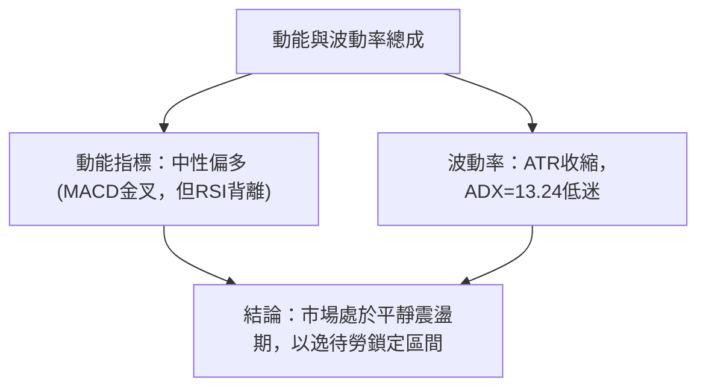

### 📊 ATR 波動率分析

- **ATR(14) 數值**：**$15.80**（佔股價比例為 **6.66%**）。
- **波動特徵解讀**：每日平均波動高達近 16 美元，屬於典型的高貝塔成長科技股波動特徵。
- **止損距離建議**：
  - **超短線當沖/隔夜**：建議使用 $1.0 \times \text{ATR} = \$15.80$ 作為緩衝距離。
  - **波段交易進場**：為防範震盪洗盤，保護性止損至少需設置 $1.5 \times \text{ATR} = \$23.70$ 的空間。
  - **對照現價**：從現價 $237.33 扣除 $1.5 \times \text{ATR}$ 約為 **$213.63**，此價位恰好完美貼合斐波那契 38.2% 回調位 ($213.40) 與 MA60 ($213.85)，驗證了該波動率止損的精確性。

### 📐 Beta 與市場相關性

- **Beta 係數**：**1.436**。
- **市場相關性解讀**：
  - NBIS 具有高彈性特質，當美股大盤（S&P 500 / Nasdaq）上漲 1% 時，該股預期波動 1.44%；反之大盤下挫時，回檔力道亦將被放大。
  - 由於當前空頭比例（Short % of Float）高達 **19.8%**（Short Ratio 2.76 天），高貝塔特性配合偏高的做空比率，使其具備隨時觸發**短線軋空（Short Squeeze）**的潛在彈性。

---

## 7. 多時框架總結

### 📋 時框架評分表

| 時框架 | 趨勢方向 | 動能狀態 | 均線排列 | 圖表形態 | 綜合評分 | 建議戰術 |
|--------|----------|----------|----------|----------|----------|----------|
| **月線 (長期)** | 🟢 多頭主導 | 🟢 強勁放量 | 🟢 完全多頭 (遠高MA200) | 長期上升通道 | **85/100** | 核心多頭部位持股續抱 |
| **週線 (中期)** | 🟡 寬幅箱體 | 🟡 震盪平衡 | 🟢 均線支撐 ($180~$210) | 矩形整理收斂 | **60/100** | 箱體兩端操作，切勿中途追價 |
| **日線 (短期)** | 🟡 區間反彈 | 🟢 MACD金叉 | 🟢 站穩MA20 | 逼近布林通道上軌 | **60/100** | 逢高獲利減碼，回踩低吸 |

### 🔲 綜合訊號矩陣

```
┌─────────────────┬────────────────────────────────────────────────────────┐
│ 多時框共振層次  │ 訊號一致性交叉檢驗結果                                 │
├─────────────────┼────────────────────────────────────────────────────────┤
│ 【趨勢一致性】  │ 長期看多 🟢 ｜ 中期看平 🟡 ｜ 短期看多 🟢  → 總體【偏多】│
│ 【動能一致性】  │ 週線修復 🟢 ｜ 日線頂背離 🔴 ｜ 柱狀體翻正 🟢 → 總體【中性】│
│ 【量價一致性】  │ 長期籌碼鎖定 🟢 ｜ 近期量縮反彈 🔴         → 總體【警惕】│
└─────────────────┴────────────────────────────────────────────────────────┘
```

### ⚖️ 多時框收斂結論（依規則 14 明確收斂）

1. **行情性質判定**：當前 ADX(14) 讀數為 **13.24**，嚴格低於 25 臨界值，**明確判定當前處於「無單邊趨勢的盤整行情」**。
2. **主導時框裁決**：
   - 依據規則 14：「*盤整行情（ADX<25）：以日線布林通道上下軌為主要交易區間*」。
   - 中長期均線（MA50/MA200）雖然維持強烈多頭排列，但日線 RSI 頂背離與成交量萎縮，壓制了短期走單邊噴射行情的可能性。
3. **唯一方向性結論**：**【中性偏多，區間操作（Neutral-Bullish Rangebound）】**。
   - 價格整體受多頭均線托舉，方向偏向多頭，但上方空間直接受阻於布林上軌 **$250.15** 與波段阻力 R1 **$254.74**。操作上**堅決不追高**，以回踩中軌支撐低吸為核心原則。

---

## 8. 交易策略建議

### 🗺️ 策略決策流程圖

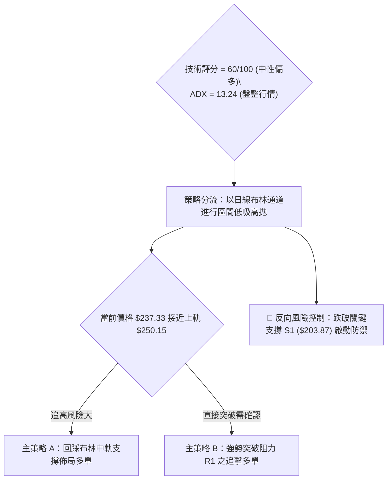

### 🧭 策略路由（依評分卡分流）

- **當前主策略方向 = 【主推多頭（回調低吸型區間多單）】（依評分 60/100）**
- **方針定位**：綜合評分達到 60 分偏多門檻，均線呈現完美多頭排列。但由於 ADX 極度低迷（13.24），絕不可於現價 $237.33 盲目追進，而應等待價格向關鍵均線密集區回踩確認後進場。

### 🎯 價格情境階梯（Price Scenarios）

| 觸發條件（嚴格引用數據） | 下一目標價 | 後續延伸目標 | 情境技術含義 |
|--------------------------|------------|--------------|--------------|
| **強勢突破 R1 $254.74** | **R2 $279.83** | **R3 $299.86** | 突破箱體上沿，軋空展開，挑戰歷史天花板 |
| **站穩現價區間 ($221.99~$246.44)** | **$250.15 (BB上軌)** | **$254.74 (R1)** | 布林通道內部良性橫盤輪動，籌碼沉澱 |
| **跌破 S1 $203.87 / S2 $200.30** | **S3 $194.80** | **Fib 50% $186.69** | 箱體破位下行，考驗半年線及 MA200 防線 |

### 📊 情境機率分佈

| 情境類別 | 發生機率 | 主要技術依據（嚴格引用指標數據） |
|----------|----------|----------------------------------|
| **情境一：區間震盪（中軌至上軌輪動）** | **55%** | ADX(14) 僅 13.24 確立盤整；布林走平；量能萎縮至 0.73x，不支持單邊突破。 |
| **情境二：回踩均線支撐後續揚** | **30%** | RSI 日線頂背離需釋放；現價距 MA20/MA50 存在乖離，回踩 $221.99 尋求動能共振。 |
| **情境三：跌破重要支撐中期轉弱** | **15%** | Short % of Float 達 19.8%，若大盤系統性下殺引發融資多殺多，恐回測 S3 ($194.80)。 |

### 🟢 主策略詳情

本報告提出兩套適應不同交易者風格的多頭主策略，所有點位皆基於第 4 章關鍵價位區塊：

| 策略要素 | 策略 A：中軌回踩低吸策略（穩健首選） | 策略 B：右側突破追擊策略（激進順勢） |
|----------|--------------------------------------|--------------------------------------|
| **進場條件** | 價格回踩 MA20/布林中軌，出現 15K/日K 止跌收陽 | 日K收盤價有效放量突破 R1 阻力位 |
| **精確進場價格** | **$221.99**（對應 MA20 與布林中軌） | **$255.00**（確認突破 R1 $254.74 之右側位） |
| **第一目標價 T1** | **$250.15**（對應布林通道上軌） | **$279.83**（對應關鍵阻力 R2） |
| **第二目標價 T2** | **$279.83**（對應關鍵阻力 R2） | **$299.86**（對應 52W 歷史極值 R3） |
| **嚴格止損價格** | **$203.87**（跌破波段關鍵支撐 S1） | **$237.33**（跌回當前箱體內部則止損） |
| **風險空間** | $\$221.99 - \$203.87 = \$18.12$ | $\$255.00 - \$237.33 = \$17.67$ |
| **第一利潤空間** | $\$250.15 - \$221.99 = \$28.16$ | $\$279.83 - \$255.00 = \$24.83$ |
| **風險報酬比 (R:R)** | **1 : 1.55**（至 T1）/ **1 : 3.19**（至 T2） | **1 : 1.41**（至 T1）/ **1 : 2.54**（至 T2） |
| **歷史估計勝率** | **65%** | **50%** |
| **建議配置倉位** | **15% ~ 20%** 總資產 | **10%** 總資產 |

### 🔴 反向風險觸發點（對沖提示）

- **全面翻空觸發信號**：日線以巨量實體陰線**收盤跌破 S1 ($203.87)**，且次日無法收復整數關卡 **S2 ($200.30)**。
- **對沖應對指引**：一旦觸發此破位信號，多頭必須無條件平倉止損；積極型投資人可在此刻建立下行對沖保護倉位，第一下行目標直指 **S3 ($194.80)**，極限防禦目標看至 **Fib 50% ($186.69)**。

### ⭐ 整體訊號強度評星

```
做多訊號強度：★★★☆☆  (3.0/5星 — 均線極佳但量能背離，以區間低吸為主)
做空訊號強度：★★☆☆☆  (2.0/5星 — 多頭排列完好，盲目做空勝率偏低)
整體可信度：  ★★★★☆  (4.0/5星 — 箱體與斐波那契價位契合度極高)
```

---

## 9. 風險提示與監控

### ✅ 關鍵監控指標 Checklist

```
╔══════════════════════════════════════════════════════════════════╗
║               NBIS 每日盤後技術監控清單 (Checklist)             ║
╠══════════════════════════════════════════════════════════════════╣
║ [ ] 價量關係：單日成交量是否放大至 20日均量 (15.15M) 以上？     ║
║ [ ] 通道狀態：現價觸及布林上軌 $250.15 時是否收出長上影線？      ║
║ [ ] 均線防守：收盤價是否始終維持在 MA20 ($221.99) 之上？        ║
║ [ ] 趨勢喚醒：ADX(14) 是否由 13.24 突破 20，脫離泥沼走單邊？     ║
║ [ ] 動能維護：MACD 柱狀體是否維持正值 (+1.971)，未跌回零軸？    ║
║ [ ] 軋空監控：空頭比例 (Short % Float = 19.8%) 是否出現急速回補？║
╚══════════════════════════════════════════════════════════════════╝
```

### ⚠️ 風險場景分析

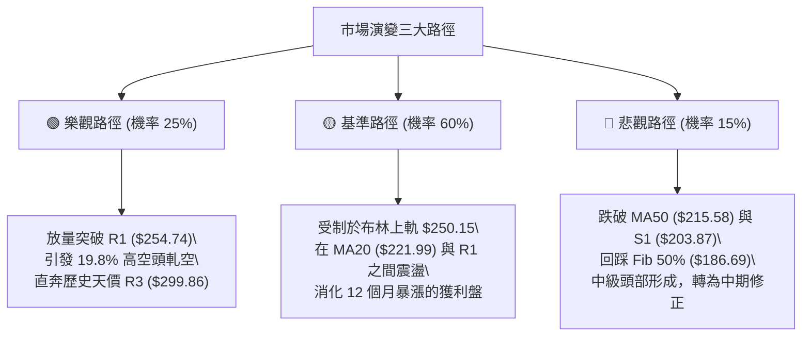

### 🛡️ 風險管理重要提醒

1. **極高波動性風險管理**：
   - 該股當前日 ATR 達 **$15.80 (6.66%)**，年化波動極大，且 Beta 為 **1.436**。嚴格禁止使用過高財務槓桿，單筆交易虧損額度應嚴格限制在總交易資本的 **1.5% 以內**。
2. **基本面與估值風險背離**：
   - 儘管技術面維持多頭排列，但基本面數據顯示其 P/S 高達 47.6x，EV/EBITDA 高達 260.5x，自由現金流為 -96.1 億美元。技術面任何破位下跌都可能伴隨高估值科技股的「殺估值」恐慌，**跌破 S1 ($203.87) 必須堅決止損，不可長線硬扛**。
3. **高空頭比率引發的雙刃劍效應**：
   - 高達 19.8% 的浮動做空比例，使股價易發生突發性的劇烈雙向掃盤。在缺乏量能配合時，盤中衝高往往是誘多陷阱，投資人務必以**日線收盤價**作為所有買賣進出的確認依據。

---

## 📋 報告總結

```
╔══════════════════════════════════════════════════════════════════╗
║                    NBIS 技術分析報告總結                         ║
╠══════════════════════════════════════════════════════════════════╣
║ 報告日期：2026-09-28                                             ║
║ 當前價格：$237.33                                                ║
║ 分析評級：⚖️ 中性偏多 / 區間收斂操作 (評分 60/100)               ║
║                                                                  ║
║ 核心維度結論：                                                   ║
║ ├─ 長期趨勢：🟢 強烈看多 (月線連漲，股價穩居 MA200 $164.10 之上) ║
║ ├─ 中期趨勢：🟡 寬幅箱體 (維持於 $194.80 ~ $279.83 箱體間沉澱)   ║
║ ├─ 短期趨勢：🟡 弱勢反彈 (受制布林上軌 $250.15，量能萎縮0.73x)   ║
║ ├─ 關鍵支撐：$221.99 (MA20) ｜ S1: $203.87 ｜ S3: $194.80        ║
║ ├─ 關鍵阻力：$250.15 (BB上軌) ｜ R1: $254.74 ｜ R2: $279.83      ║
║ └─ 分析師目標共識：$283.58 (當前價位具備 +19.49% 隱含上行空間)   ║
║                                                                  ║
║ 最優策略組合：                                                   ║
║ 1. 🥇 最佳機會 (穩健)：回踩 MA20/布林中軌 $221.99 進場，止損     ║
║    設於 S1 $203.87，目標看至 $250.15 與 $279.83 (盈虧比 1:3.19)  ║
║ 2. 🥈 次選機會 (激進)：帶量突破 R1 $254.74 後追進，目標直指歷史  ║
║    天價 R3 $299.86，止損設於現價 $237.33                         ║
║ 3. 🥉 保守選擇：在 ADX(14) 突破 20 之前保持觀望，等待形態收斂末端 ║
╚══════════════════════════════════════════════════════════════════╝
```

---

> ⚠️ **免責聲明**：本報告為 AI 自動生成之技術分析，所有數據及估算均基於提供的歷史價格資訊。本報告**僅供研究與學術參考**，**不構成任何投資建議**。投資有風險，入市需謹慎。

---

*報告生成時間：2026-09-28 ｜ 數據來源：Yahoo Finance ｜ 分析框架：多時框技術分析*