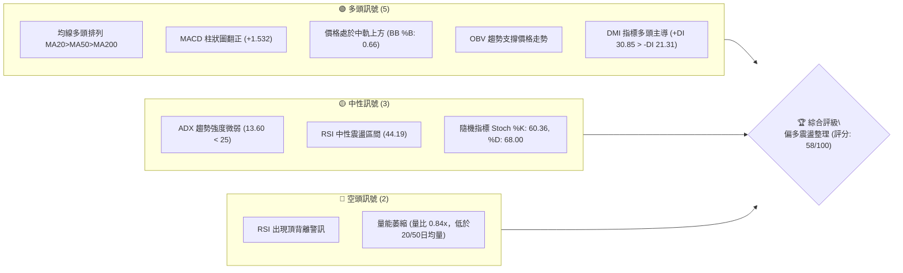
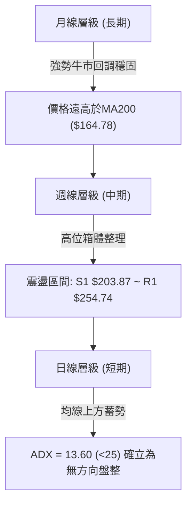
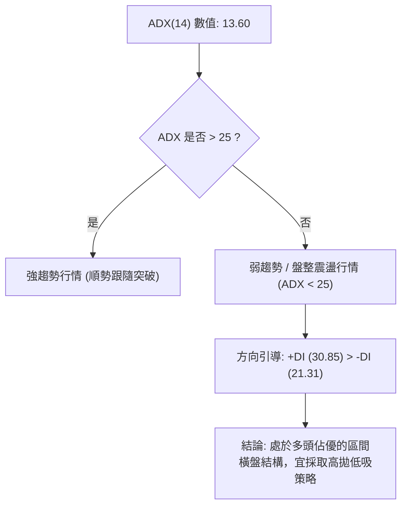
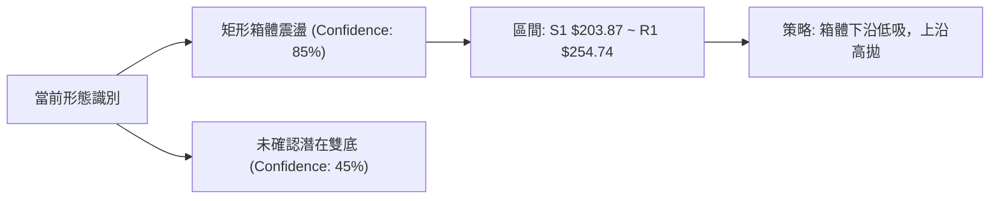
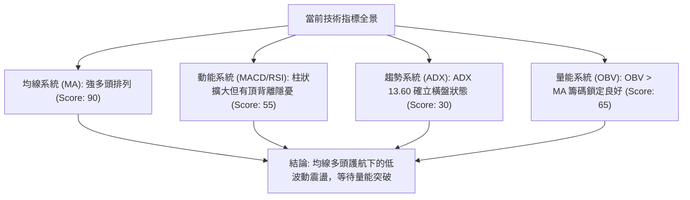
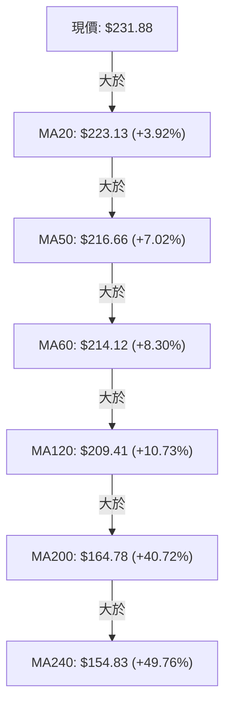
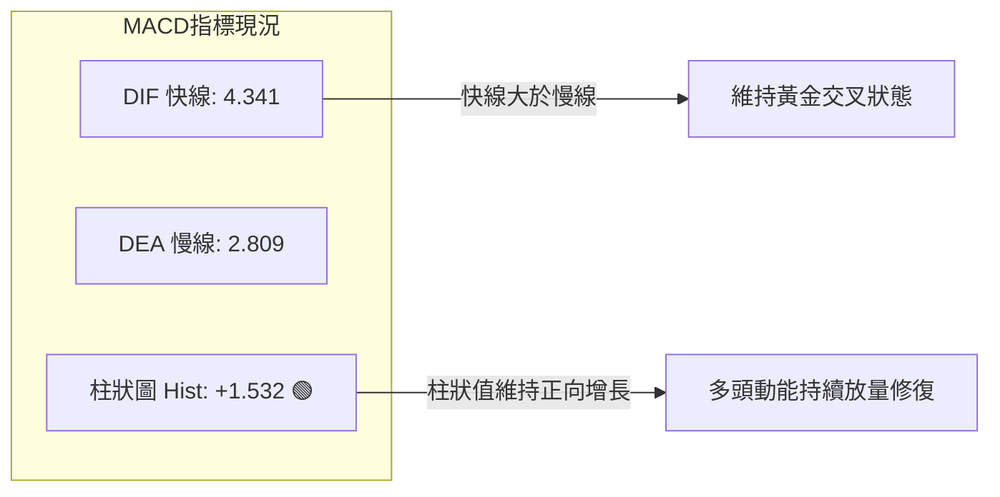
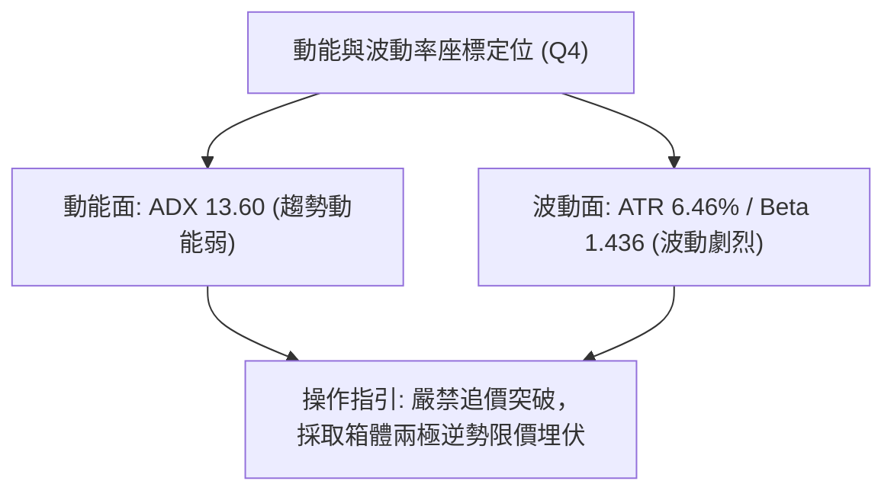
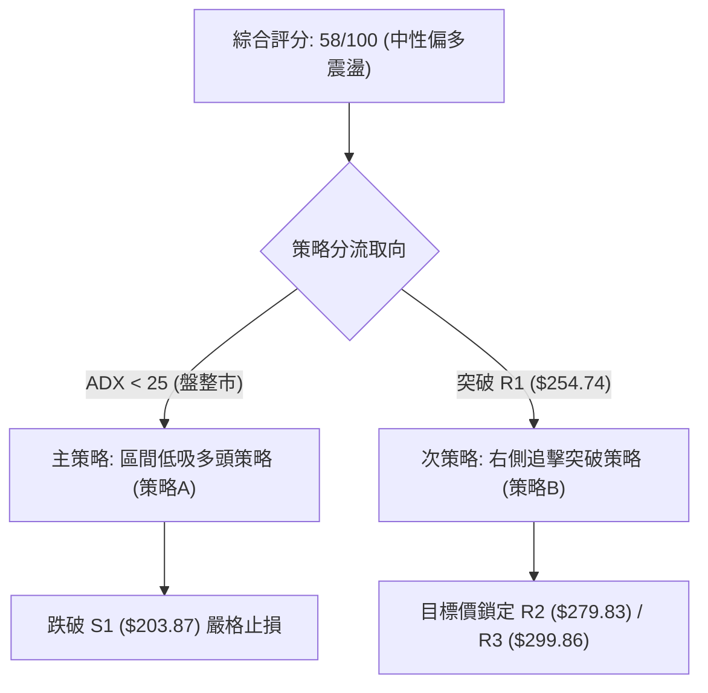
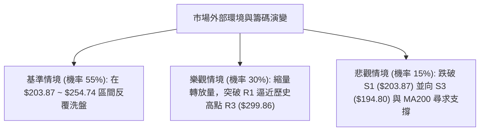

# NBIS 技術分析報告

> **報告日期**：2026-09-29 ｜ **語言**：繁體中文 ｜ **數據來源**：Yahoo Finance ｜ **當前價格**：$231.88

---

## 目錄

| 章節 | 內容 |
|------|------|
| [1. 技術面概覽](#1-技術面概覽) | 訊號儀表板、核心指標、評分卡 |
| [2. 趨勢分析](#2-趨勢分析) | 多時框趨勢、長中短期走勢 |
| [3. 圖表形態分析](#3-圖表形態分析) | 形態識別、K線組合、目標價 |
| [4. 支撐與阻力](#4-支撐與阻力) | 關鍵價位、斐波那契回調 |
| [5. 技術指標深度解讀](#5-技術指標深度解讀) | MA/RSI/MACD/布林/成交量 |
| [6. 動能與波動率](#6-動能與波動率) | 動能評估、ATR、Beta |
| [7. 多時框架總結](#7-多時框架總結) | 時框架評分矩陣 |
| [8. 交易策略建議](#8-交易策略建議) | 多空策略、風險報酬比 |
| [9. 風險提示與監控](#9-風險提示與監控) | 監控指標、風險場景 |

---

## 1. 技術面概覽

### 🎯 技術訊號儀表板



### 📊 核心指標速覽表

| 指標類別 | 指標名稱 | 當前數值 | 訊號 | 解讀 |
|----------|----------|----------|------|------|
| **價格** | 當前價格 | $231.88 | 🟢 | 位於52週區間70.0%分位，穩固於中期關鍵支撐之上 |
| **均線** | MA20 | $223.13 | 🟢 | 現價高於MA20達 +3.92%，短線維持多頭動能支撐 |
| **均線** | MA50 | $216.66 | 🟢 | 現價高於MA50達 +7.02%，中期上升趨勢軌道保持完好 |
| **均線** | MA200 | $164.78 | 🟢 | 現價高於MA200達 +40.72%，長期結構呈現堅定牛市 |
| **動能** | RSI(14) | 44.19 | 🟡 | 位於30-70中性區，無極端超買超賣，但存在潛在頂背離壓制 |
| **動能** | MACD | 4.341 / 柱 +1.532 | 🟢 | MACD線高於訊號線(2.809)，差值為正，動能溫和回升 |
| **動能** | ADX(14) | 13.60 | 🟡 | ADX < 25，顯示當前為弱趨勢之橫向箱體震盪行情 |
| **量能** | OBV | OBV > MA | 🟢 | 累積能量線維持在均線上方，顯示機構籌碼尚未出現潰散 |
| **波動** | ATR(14) | $14.99 | 🔴 | ATR佔比達 6.46%，單日價格波動極大，風控要求嚴苛 |

### 🏆 技術評分卡

```
╔══════════════════════════════════════════════════════════════╗
║              技術評分卡 — NBIS (2026-09-29)                 ║
╠══════════════════════════════════════════════════════════════╣
║ 趨勢強度      █████░░░░░░░░░░░░░░░  28/100  🟡 (ADX 13.60 震盪)║
║ 動能指標      ███████████░░░░░░░░░  55/100  🟡 (MACD強/RSI弱) ║
║ 支撐穩定度    ██████████████░░░░░░  72/100  🟢 (均線密集托底)  ║
║ 成交量配合    █████████░░░░░░░░░░░  45/100  🟡 (量比 0.84 偏弱)║
║ 形態完整度    ████████████░░░░░░░░  60/100  🟡 (箱體結構明確)  ║
║ 均線排列      ██████████████████░░  90/100  🟢 (典型多頭排列)  ║
╠══════════════════════════════════════════════════════════════╣
║ 綜合評分      ███████████░░░░░░░░░  58/100  ⚖️ 區間震盪偏多   ║
╚══════════════════════════════════════════════════════════════╝
```

---

## 2. 趨勢分析

### 🌐 多時框趨勢分析



### 📈 長期趨勢 — 12個月走勢圖（Unicode）

```
NBIS 月線走勢圖（過去12個月：2025-10 至 2026-09）
價格軸 ($)
$300 ┤                                           (52W高點 $299.86)
$276 ┤                                     ● 06/26
$250 ┤                                        
$231 ┤                                  ● 05/26     ● 09/26($231.88)
$206 ┤                                           ● 08/26
$190 ┤                                        ● 07/26
$138 ┤                            ● 04/26
$130 ┤ ● 10/25
$103 ┤                      ● 03/26
$ 94 ┤    ● 11/25     ● 02/26
$ 83 ┤       ● 12/25 ● 01/26 (波段底)
$ 73 ┤                                           (52W低點 $73.52)
     └─────────────────────────────────────────────────────────────
       M1  M2  M3  M4  M5  M6  M7  M8  M9  M10 M11 M12 (2026-09)
```

**走勢特徵分析表格**：

| 時期 | 走勢起訖 | 漲跌幅 | 結構特徵與走勢驅動分析 |
|------|----------|--------|------------------------|
| 2025-10 ~ 2025-12 | $130.82 → $83.71 | -36.01% | 觸頂回調階段，獲利回吐賣壓宣洩，測試 $83 區域底部 |
| 2026-01 ~ 2026-03 | $85.19 → $103.76 | +21.80% | 底部圓弧打底完成，量能溫和放大，走出築底回升浪 |
| 2026-04 ~ 2026-06 | $138.23 → $276.17| +99.79% | 主升浪爆發，連破百元與兩百元關口，創下歷史最高月收盤 |
| 2026-07 ~ 2026-09 | $190.41 → $231.88| +21.78% | 高位巨震洗盤，自急跌 $177-$190 區間強力回彈至中軌上方 |

### 📊 中期趨勢（週線分析）

中期走勢正處於自 2026-06 衝高至 $286.69（歷史天價 $299.86 下方）後的寬幅整理浪。近期 20 週數據顯示，7 月中旬低點 $177.71 成功踩住長期均線上軌與斐波那契回調區後，8 月中旬隨即爆發單週大陽線拉升至 $277.68，隨後回踩在 $209-$223 構築了堅實的次級回撤支撐帶。

```
中期關鍵壓力支撐相對位置
$299.86 ────────────────────────────────────────── 52W 歷史極值 (強阻力 R3)
$279.83 ────────────────────────────────────────── 波段次高點聚集區 (阻力 R2)
$254.74 ────────────────────────────────────────── 箱體震盪上邊界 (關鍵阻力 R1)
$231.88 ══════════════════ [現價 $231.88] ═════════ 突破中軌，朝上軌行進
$216.66 ┄┄┄┄┄┄┄┄┄┄┄┄┄┄┄┄┄┄┄┄┄┄┄┄┄┄┄┄┄┄┄┄┄┄┄┄┄┄ 中期生命線 (MA50)
$203.87 ────────────────────────────────────────── 波段箱體下邊界 (支撐 S1)
$194.80 ────────────────────────────────────────── 7月回撤低點聚類 (強支撐 S3)
```

### ⚡ 趨勢強度評估（ADX 解讀）



**ADX 趨勢強度指標對照評估**：
- **ADX(14) = 13.60**：明確落入 `< 20` 的「極弱趨勢 / 無趨勢區間」，說明市場不具備單邊暴衝行情。
- **+DI (30.85) vs -DI (21.31)**：多頭方向指標大幅領先空頭方向指標 9.54 個基點，代表多方主力依然控制著盤面主導權，空方無力發起趨勢性擊潰。
- **操作指引**：嚴格禁止追高買入，需以日線布林通道中下軌及支撐聚類點位作為進場邊界。

---

## 3. 圖表形態分析

### 🔍 形態識別系統



**圖表形態可信度判斷表格**：

| 形態名稱 | 信心度 | 判斷依據（引用數據） | 完成度 | 目標價（附計算式） |
|----------|--------|----------------------|--------|--------------------|
| 矩形高位箱體整理 | 85% | 價格在 $203.87 (S1) 與 $254.74 (R1) 之間反覆震盪收斂，近2個月4次確認邊界 | 75% | 若有效向上突破 R1，等高測幅目標價 = R1 ($254.74) + 箱體高度 ($254.74 - $203.87 = $50.87) = **$305.61**（數據未確認前暫不採納，僅列指標解讀） |
| 次級波段雙底結構 | 45% | 2026-07-19之 $177.71 與 2026-08-09之 $187.97，雖有兩次回踩，但中間間隔極短且形態已被8月中旬拉升打亂 | 訊號不足 | 信心度 < 50%，依規不予設定目標價，僅做指標型整理看待 |

### 🕯️ 重要K線形態分析

| 月份 | 收盤價 | K線形態 | 解讀 | 訊號 |
|------|--------|---------|------|------|
| 2026-05 | $231.09 | 突破大陽線 | 伴隨成交量暴增，強勢穿透百元阻力區，奠定長期牛市格局 | 🟢 強烈看多 |
| 2026-06 | $276.17 | 衝高上影線 | 創歷史新高 $299.86 後遭遇獲利平倉盤壓制，留出顯著長上影線 | 🟡 獲利了結 |
| 2026-07 | $190.41 | 長下影陰線 | 急跌觸及 $177.71 後被強烈抄底盤拉起，顯示大週期均線具備極強承接力 | 🟢 空頭竭盡 |
| 2026-08 | $206.32 | 縮量十字星變體 | 巨幅震盪下收出長影星線，多空分歧達到頂點，洗盤充分完成 | 🟡 多空拉鋸 |
| 2026-09 | $231.88 | 實體溫和陽線 | 重新站回 MA20 ($223.13) 與 MA50 ($216.66)，重心逐步抬高 | 🟢 震盪轉強 |

### 📉 ASCII 走勢形態示意圖

```
NBIS 高位矩形震盪整理箱體架構
$254.74 ┬────────────────────────────────────────── 箱頂壓力 (R1: $254.74)
        │            ▲                  ▲
        │           ╱ ╲                ╱ ╲
$231.88 ┼──────────╱───╲──────────────╱───[現價 $231.88]
        │         ╱     ╲            ╱     
        │        ╱       ╲          ╱      
        │       ╱         ╲        ╱       
$203.87 ┴──────▼───────────▼──────▼─────────────── 箱底支撐 (S1: $203.87)
        │   (07月低點)  (08月回踩) (09月蓄勢)
```

### 🎯 形態目標價計算

依據前述信心度達 85% 之「矩形箱體震盪」形態：
- **箱體頂部頸線**：$254.74 (阻力 R1)
- **箱體底部邊界**：$203.87 (支撐 S1)
- **垂直形態高度**：$254.74 - $203.87 = $50.87
- **理論突破延伸目標**：$254.74 + $50.87 = $305.61
- **紀律約束標注**：由於當前 ADX 為 13.60，突破條件尚未確立，本報告**交易策略目標價嚴格限定引用數據所確認之 $254.74 (R1) 與 $279.83 (R2)**，不採用未被實體突破驗證的推算延伸值。

---

## 4. 支撐與阻力

### 🗺️ 關鍵價位分布圖（Unicode）

```
NBIS 價位結構分布圖
══════════════════════════════════════════════════════════════
$299.86 ║████████████████████████║ 歷史最高/強阻力 R3 (+29.32%)
$279.83 ║████████████████████    ║ 近期次高聚類阻力 R2 (+20.68%)
$254.74 ║████████████████████████║ 近期波段高點/關鍵阻力 R1 (+9.86%)
        ║                        ║ 
$231.88 ╠════════════════════════╣ ◄ 當前市價 ($231.88)
        ║                        ║ 
$203.87 ║▓▓▓▓▓▓▓▓▓▓▓▓▓▓▓▓        ║ 近一年波段低點聚類 S1 (-12.08%)
$200.30 ║▓▓▓▓▓▓▓▓▓▓▓▓▓▓▓▓▓▓      ║ 整數心理防線支撐 S2 (-13.62%)
$194.80 ║████████████████████████║ 近一年波段強支撐 S3 (-15.99%)
══════════════════════════════════════════════════════════════
```

### 🚧 阻力位分析表

| 阻力級別 | 價位 | 形成原因 | 突破難度 | 重要性 |
|----------|------|----------|----------|--------|
| **R1** | $254.74 | 近一年波段高點聚類，同時與布林上軌 ($250.93) 及斐波那契 23.6% 回調位 ($246.44) 形成重疊共振壓力帶 | 中等偏高 | ★★★★☆ |
| **R2** | $279.83 | 2026-08-16 週線反彈高點聚類 ($277.68~$279.83)，密集套牢籌碼解套反壓區 | 極高 | ★★★★☆ |
| **R3** | $299.86 | 52週最高點與歷史歷史極限壓力，純粹的歷史天花板心理關卡 | 極難 | ★★★★★ |

### 🛡️ 支撐位分析表

| 支撐級別 | 價位 | 形成原因 | 守住機率 | 重要性 |
|----------|------|----------|----------|--------|
| **S1** | $203.87 | 近一年波段低點聚類，下方緊鄰 MA120 ($209.41) 與 MA60 ($214.12)，均線組密集成交底層 | 75% | ★★★★☆ |
| **S2** | $200.30 | 關鍵整數關口心理支撐與籌碼成本轉換線 | 80% | ★★★☆☆ |
| **S3** | $194.80 | 近一年波段最低聚類防線，與布林帶下軌 ($195.32) 形成強大幾何共振 | 90% | ★★★★★ |

### 📐 斐波那契回調位分析

依據 52 週波段區間：極值低點 $73.52 至極值高點 $299.86 測算如下：

```
斐波那契回調分佈階梯
0.0%  (52W High)  $299.86  ══════════════════════════════════════
23.6%             $246.44  ────────────────────────────────────── [上方第一反壓]
                           ▲
                           │ 現價 $231.88 運行於 23.6% ~ 38.2% 區間
                           ▼
38.2%             $213.40  ────────────────────────────────────── [下方關鍵強動能支撐]
50.0%             $186.69  ────────────────────────────────────── [中性分水嶺]
61.8%             $159.98  ────────────────────────────────────── [黃金分割防禦點]
78.6%             $121.96  ────────────────────────────────────── [極限防守]
100.0% (52W Low)  $ 73.52  ══════════════════════════════════════
```

- **位置解讀**：現價 $231.88 穩居斐波那契 38.2% ($213.40) 上方，且正向 23.6% ($246.44) 推進。
- **結構涵義**：在強勢回調市場中，價格回撤守穩 38.2% 回調位 ($213.40) 代表中長期多頭結構極其強韌，未曾跌破 50% 分水嶺 ($186.69)，表明這僅是主升浪後正常的籌碼沉澱，而非趨勢逆轉。

---

## 5. 技術指標深度解讀

### 🎛️ 指標訊號總覽



### 📈 移動平均線排列分析



**均線狀態分析**：
- **排列狀態**：全週期均線呈現嚴格標準的「完全多頭排列」（MA20 > MA50 > MA60 > MA120 > MA200 > MA240），這是技術面上最強大的多頭支撐結構。
- **短期均線波動**：MA5 位於 $235.08（高於現價 -1.36%），短期短暫承壓，但 MA10 ($226.65) 與 MA20 ($223.13) 快速墊高，將在現價下方提供兩道動態緩衝墊。

### 📉 RSI(14) 分析

```
RSI(14) 讀數儀表板:
0 ──────────── 30 ──────────────── 50 ─────── 70 ──────────── 100
[超賣區]       [弱勢區]            ▲ [強勢區]  [超買區]
                                  │ 44.19 (中性格局)
數值進度條: █████████░░░░░░░░░░░  44.19 / 100
```

- **背離狀況檢驗**：指標警訊提示「⚠️ 頂背離 (Bearish Divergence)」。從歷史數據檢視，股價於 2026-06 衝至 $276-$286 時 RSI 達 65.3，隨後 2026-08 股價再次衝高至 $277.68 時，RSI 雖衝高至 67.2，但目前價格在 $231.88 處，RSI 迅速跌至 44.19，落後於價格幅度。
- **背離結論**：日線級別存在動能衰竭型頂背離壓制，說明多頭雖佔據地盤，但缺乏加速上衝的動能爆發力，限制了直接衝破 R1 ($254.74) 的可能性。

### 📊 MACD(12/26/9) 訊號解讀



- **狀態**：MACD 線 4.341 顯著位於零軸之上，且位於訊號線 2.809 上方，柱狀圖值達 +1.532。
- **解讀**：柱狀圖自 2026-09-20 的 -0.606 翻紅至 +1.971，本週維持在 +1.532，確認空頭賣壓已完全被多頭吸收，指標對短線回升提供有力支持。

### 📦 布林通道分析

```
布林通道 (20, 2) 結構圖:
$250.93 ┬────────────────────────────────────────── 布林上軌 (BB Upper)
        │
$231.88 ┼───────────────────● 現價 ($231.88, %B = 0.66)
        │
$223.13 ┼┄┄┄┄┄┄┄┄┄┄┄┄┄┄┄┄┄┄┄┄┄┄┄┄┄┄┄┄┄┄┄┄┄┄┄┄┄┄┄┄ 布林中軌 (MA20)
        │
$195.32 ┴────────────────────────────────────────── 布林下軌 (BB Lower)
```

- **帶寬與位置**：帶寬震盪區間為 $195.32 至 $250.93，極限跨度約 $55.61。
- **%B 指標分析**：當前 %B 為 **0.66**，位於中軌 ($223.13) 與上軌 ($250.93) 之間的多方掌控區，且遠離超買界限 (1.0)，向上仍有約 $19.05 的空間方觸及布林上軌。

### 💹 成交量分析（量價配合度）

- **量能規模對比**：最新單日成交量為 12,710,400 股，對比 20 日均量 15,128,960 股（量比 0.84x），且顯著低於 50 日均量 21,019,548 股。
- **OBV 能量潮解讀**：數據確認「OBV > MA → 量能支撐上漲」。雖然短線成交量縮減，但長週期累積能量並未隨回調外流，顯示籌碼沉澱於主力與機構手中（機構持股高達 69.5%），此縮量屬於健康的高位良性換手。

---

## 6. 動能與波動率

### ⚡ 動能評估四象限

| 象限 | 動能維度 | 波動維度 | 代表特徵 | 當前狀態判定 |
|------|----------|----------|----------|--------------|
| **Q1** | 強動能 (Trend) | 低波動 (Steady) | 最佳波段擴展機會 | — |
| **Q2** | 弱動能 (Weak) | 低波動 (Steady) | 縮量盤整觀望期 | — |
| **Q3** | 強動能 (Trend) | 高波動 (Volatile)| 風險極大快速進出 | — |
| **Q4** | **弱動能 (ADX=13.6)** | **高波動 (ATR=6.5%)** | **震盪劇烈容易雙巴** | **✓ 本標的歸屬象限 (Q4)** |



### 📊 ATR 波動率分析

- **ATR(14) 絕對值**：**$14.99**。
- **波動率佔比**：達價格的 **6.46%**。這意味著該股在一個交易日內，正常的價格搖擺幅度即可高達 $15.00 左右。
- **止損距離建議**：
  - 一般波段止損緩衝距離應至少設為 `1.5 × ATR` = $22.49。
  - 保守止損緩衝距離應設為 `2.0 × ATR` = $29.98。
  - 在制定止損時，切忌將止損點貼在市價 1-2% 內，否則極易被日內噪聲掃出場。

### 📐 Beta 與市場相關性

- **Beta 數值**：**1.436**。
- **意涵**：NBIS 屬於高彈性進攻型資產，對標普 500 或納斯達克指數的波動敏感度達 1.44 倍。當大盤反彈 1% 時，該股預期波動約 +1.44%；同理大盤修正時回撤亦被放大。
- **放空比率 (Short % Float)**：高達 **19.8%**（Short Ratio 2.76），空頭籌碼部位沉重，一旦股價逼近 R1 ($254.74) 並引發放量，極易形成空頭擠壓（Short Squeeze）連鎖反應。

---

## 7. 多時框架總結

### 📋 時框架評分表

| 時框架 | 趨勢方向 | 動能狀態 | 均線排列 | 形態特徵 | 綜合評分 | 建議方向 |
|--------|----------|----------|----------|----------|----------|----------|
| **長期 (月線)** | 🟢 強烈多頭 | 🟢 充沛 | 🟢 MA200之上遠程拉升 | 主升浪後高位強烈蓄勢 | 85/100 | 長線持股續抱 |
| **中期 (週線)** | 🟡 寬幅箱體 | 🟡 中性 | 🟢 MA50生命線支撐有效 | 矩形整理 ($203-$254) | 62/100 | 區間高拋低吸 |
| **短期 (日線)** | 🟡 盤整轉強 | 🟢 MACD翻紅 | 🟢 站回MA20 | 頂背離壓制 + 縮量回升 | 58/100 | 等待回踩佈局 |

### 🔲 綜合訊號矩陣

```
時框訊號一致性交叉檢定
┌────────────┬─────────────┬─────────────┬─────────────┐
│ 維度       │ 短期 (日線) │ 中期 (週線) │ 長期 (月線) │
├────────────┼─────────────┼─────────────┼─────────────┤
│ 趨勢方向   │ 🟡 橫向盤整 │ 🟡 箱體收斂 │ 🟢 單邊牛市 │
│ 均線架構   │ 🟢 突破短均 │ 🟢 守穩中均 │ 🟢 完美多頭 │
│ 動能指針   │ 🟢 MACD金叉 │ 🟡 柱狀收斂 │ 🟢 動能維持 │
│ 籌碼量能   │ 🔴 縮量觀望 │ 🟢 OBV未散  │ 🟢 機構控盤 │
└────────────┴─────────────┴─────────────┴─────────────┘
結論一致性：多頭防禦底蘊充足，但缺乏短期突破爆發力，共振為「多頭控制下的箱體震盪」。
```

### ⚖️ 多時框收斂結論

依據多時框收斂規則：
1. **當前趨勢定性**：當前 **ADX(14) = 13.60 (< 25)**，明確定義為**盤整行情**。
2. **主導原則收斂**：在盤整行情中，依規以**日線布林通道上下軌 ($195.32 ~ $250.93) 與波段支撐阻力為主要交易區間**。中長期多頭均線組（MA50: $216.66 / MA200: $164.78）則作為堅不可摧的多方心理底線。
3. **唯一方向性結論**：**【偏多震盪整理】（綜合評分 58/100）**。因未破位中長期牛市結構，空頭僅存在阻力位短線壓制，不具備破壞性，交易邏輯應全面收斂為「逢支撐偏多低吸、臨阻力階梯獲利」。

---

## 8. 交易策略建議

### 🗺️ 策略決策流程圖



### 🧭 策略路由（依評分卡分流）

> **當前主策略方向 = 【偏多區間操作】（依評分 58/100，介於 40–60 之中性偏多區間）**  
> 因 ADX=13.60 < 25 且評分未跌破空頭警戒線，禁止重倉盲目放空。策略全面以**布林下軌及關鍵支撐區的低吸做多**為主，上方阻力作為獲利結算點。

### 🎯 價格情境階梯（Price Scenarios）

| 觸發條件 | 下一目標 | 後續延伸 | 情境含義 |
|----------|----------|----------|----------|
| 放量突破 **R1 $254.74** | **R2 $279.83** | **R3 $299.86** | 走出盤整泥沼，發動空頭踩踏（Short Squeeze），直奔歷史新高 |
| 運行於 **$213.40 ~ $250.93** | — | — | 於布林中上軌與斐波那契回調區間內進行籌碼換手沉澱 |
| 跌破 **S1 $203.87** | **S2 $200.30** | **S3 $194.80** | 短期多頭防線失守，向下探尋布林下軌強支撐群聚區 |

### 📊 情境機率分佈

| 情境 | 機率 | 主要依據 |
|------|------|----------|
| **區間震盪蓄勢** | **55%** | ADX 僅 13.60 且成交量比僅 0.84x，市場正處於典型的動能沉寂整理週期 |
| **向上反彈/突破** | **30%** | 均線完整多頭排列、MACD 柱狀翻正 (+1.532)、OBV 維持強勢無潰散跡象 |
| **向下破位探底** | **15%** | RSI 頂背離隱憂，且 ATR 達 6.46%，高波動環境下突發外部衝擊的尾部風險 |

### 🟢 主策略詳情

本報告設計兩套多頭應對方案：**策略 A 為左側區間低吸（主推）**，**策略 B 為右側放量突破追擊**。

| 策略要素 | 策略 A（區間逢低承接） | 策略 B（突破阻力追擊） |
|----------|------------------------|------------------------|
| **進場條件** | 價格回調至 MA50 與 S1 緩衝區企穩 | 日K收盤實體放量突破關鍵阻力 R1 |
| **進場價格** | **$216.66** (精確錨定 MA50 支撐) | **$254.74** (精確錨定 R1 阻力位) |
| **目標價 T1** | **$254.74** (阻力位 R1，獲利 +17.58%) | **$279.83** (阻力位 R2，獲利 +9.85%) |
| **目標價 T2** | **$279.83** (阻力位 R2，獲利 +29.15%) | **$299.86** (52W 高點 R3，獲利 +17.71%)|
| **止損價格** | **$200.30** (精確錨定 S2 整數支撐防線) | **$246.44** (精確錨定 23.6% 斐波那契回調位) |
| **風險報酬比**| **1 : 2.33** (以 T1 計算) | **1 : 3.02** (以 T2 計算) |
| **成功機率** | **65%** | **55%** |
| **建議倉位** | **15% ~ 20%** | **10% ~ 15%** |

*計算式驗證*：
- *策略 A 風報比*：風險 = $216.66 - $200.30 = $16.36；T1 報酬 = $254.74 - $216.66 = $38.08。風報比 = $38.08 / $16.36 = **1 : 2.33**。
- *策略 B 風報比*：風險 = $254.74 - $246.44 = $8.30；T1 報酬 = $279.83 - $254.74 = $25.09；T2 報酬 = $299.86 - $254.74 = $45.12。以 T1 計算為 1:3.02，以 T2 計算達 1:5.44。

### 🔴 反向風險觸發點（對沖提示）

- **全面轉空停損警訊**：若日線級別收盤價跌破 **S3 ($194.80)**，將宣告近兩月構築的整理箱體崩解，同時跌破布林下軌 ($195.32)。
- **避險動作**：一旦觸發 S3 跌破，應立即結清所有多頭現貨頭寸，並建立對等標的之反向對沖部位。

### ⭐ 整體訊號強度評星

```
做多訊號強度：★★★☆☆  (3.0/5星 - 均線極佳但量能動能暫歇)
做空訊號強度：★☆☆☆☆  (1.5/5星 - 僅有背離無實質結構破位)
整體可信度：  ★★★★☆  (4.0/5星 - 價位聚類明確，邊界清晰)
```

---

## 9. 風險提示與監控

### ✅ 關鍵監控指標 Checklist

```
╔══════════════════════════════════════════════════════════════╗
║              NBIS 關鍵技術指標每日監控 Checklist             ║
╠══════════════════════════════════════════════════════════════╣
║ [ ] 價格是否跌破 MA20 ($223.13) 短期防守線                   ║
║ [ ] 價格回踩 MA50 ($216.66) 是否出現實體陽線抵抗            ║
║ [ ] 成交量是否放大至 20日均量 (15.12M) 以上                  ║
║ [ ] RSI(14) 是否跌破 40 進入弱勢區，加劇頂背離風險           ║
║ [ ] MACD 柱狀圖是否由紅翻綠 (小於 0)                         ║
║ [ ] 放空比率 (19.8%) 是否觸發擠壓突破 R1 ($254.74)           ║
╚══════════════════════════════════════════════════════════════╝
```

### ⚠️ 風險場景分析



### 🛡️ 風險管理重要提醒

1. **極高波動性防禦**：本標的 ATR 高達 $14.99 (6.46%)，Beta 為 1.436。絕不可使用高倍槓桿操作，單筆交易的最大止損風險應嚴格控制在總資金帳戶的 **1.0% - 1.5%** 之內。
2. **防範假突破風險**：由於 ADX 僅為 13.60，在未看見單日成交量突破 2,000 萬股（50日均量級別）之前，任何盤中突破 R1 ($254.74) 均有極高機率演變為「假突破誘多」，切勿於盤中急躁追高，必須以收盤日K線定奪。
3. **空頭擠壓雙刃劍**：放空比率高達 19.8%，一旦啟動軋空行情其上升速率將極度猛烈，因此持有多單者應嚴格執行分批在 R1 ($254.74)、R2 ($279.83) 停利，不可貪婪。

---

## 📋 報告總結

```
NBIS 技術分析報告總結
════════════════════════════════════════════════════════
報告日期：2026-09-29
當前價格：$231.88
分析評級：⚖️ 區間震盪偏多（評分: 58/100）

關鍵結論：
├─ 長期趨勢：🟢 堅定牛市（全週期均線多頭排列 MA20>MA50>MA200）
├─ 中期趨勢：🟡 寬幅箱體整理（運行於斐波那契 23.6% 與 38.2% 之間）
├─ 短期趨勢：🟡 弱趨勢震盪蓄勢（ADX 13.60 顯示橫盤特徵）
├─ 關鍵支撐：S1: $203.87 ｜ S2: $200.30 ｜ S3: $194.80
├─ 關鍵阻力：R1: $254.74 ｜ R2: $279.83 ｜ R3: $299.86
└─ 分析師目標：共識均價 $283.58 ｜ 19位分析師綜合評級 Buy

最優策略組合：
1. 🥇 最佳機會：策略 A（逢低承接）— 於 MA50 ($216.66) 埋伏多單，
               止損 S2 ($200.30)，第一目標 R1 ($254.74)，風報比 1:2.33。
2. 🥈 次選機會：策略 B（右側追擊）— 實體收盤突破 R1 ($254.74) 後追入，
               目標看 R2 ($279.83) 與 R3 ($299.86)，風報比 1:3.02。
3. 🥉 保守選擇：維持場外观望，直至 ADX 上穿 20 且成交量重返 50日均量再行介入。
════════════════════════════════════════════════════════
```

---

> ⚠️ **免責聲明**：本報告為 AI 自動生成之技術分析，所有數據及估算均基於提供的歷史價格資訊。本報告**僅供研究與學術參考**，**不構成任何投資建議**。投資有風險，入市需謹慎。

---

*報告生成時間：2026-09-29 ｜ 數據來源：Yahoo Finance ｜ 分析框架：多時框技術分析*