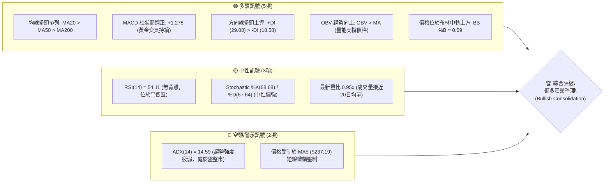
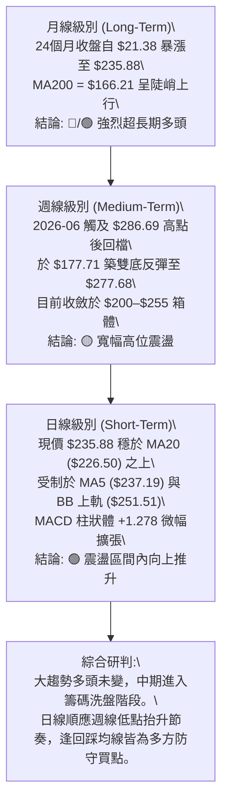
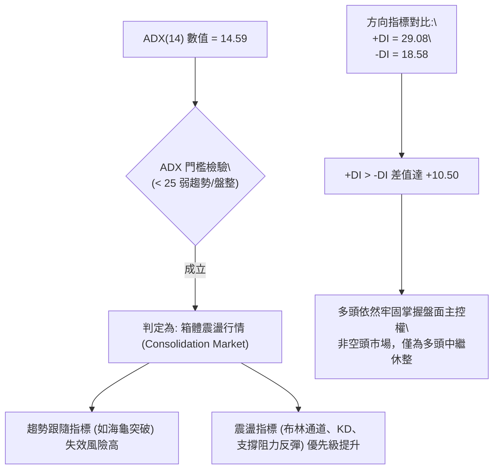
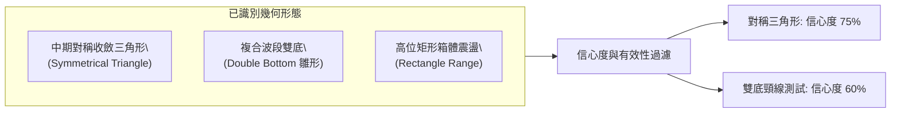
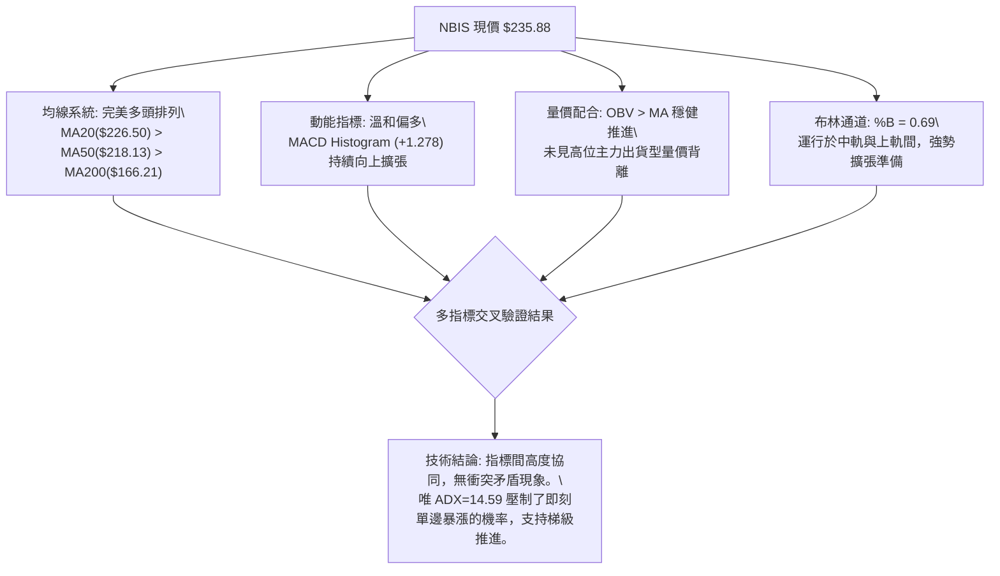
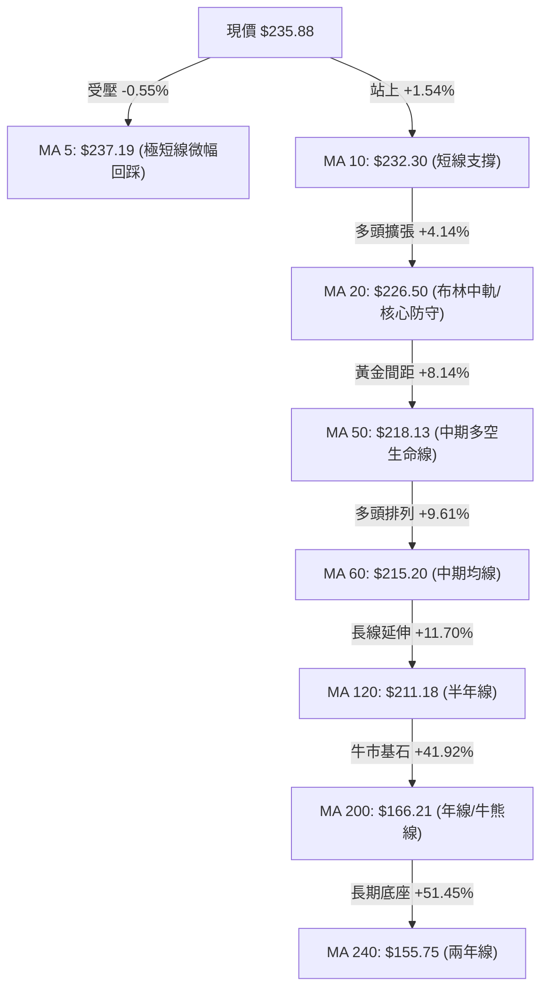
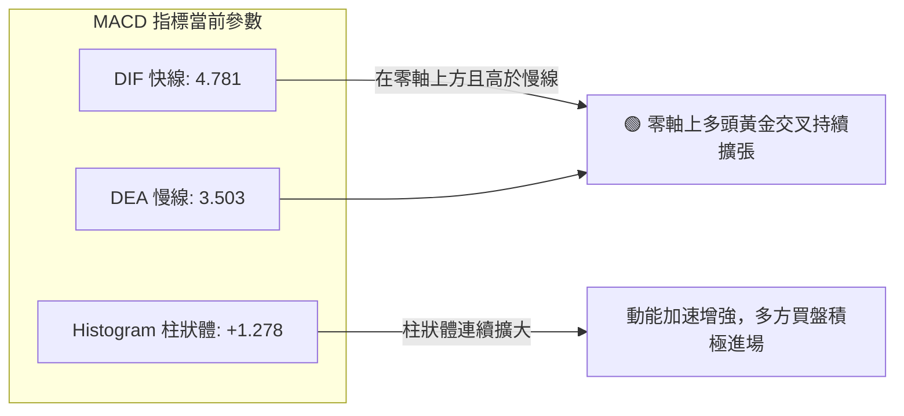
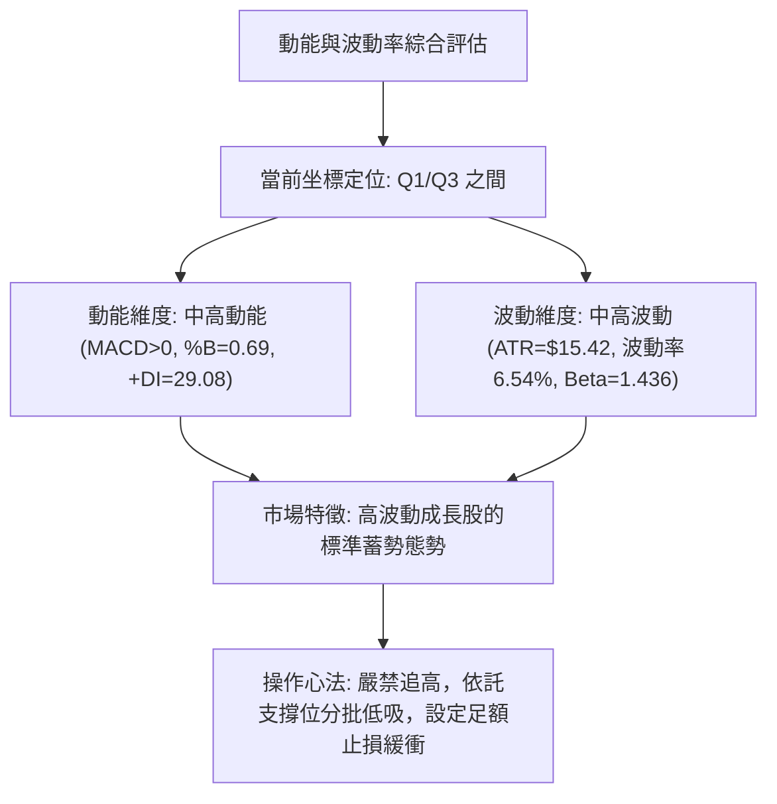
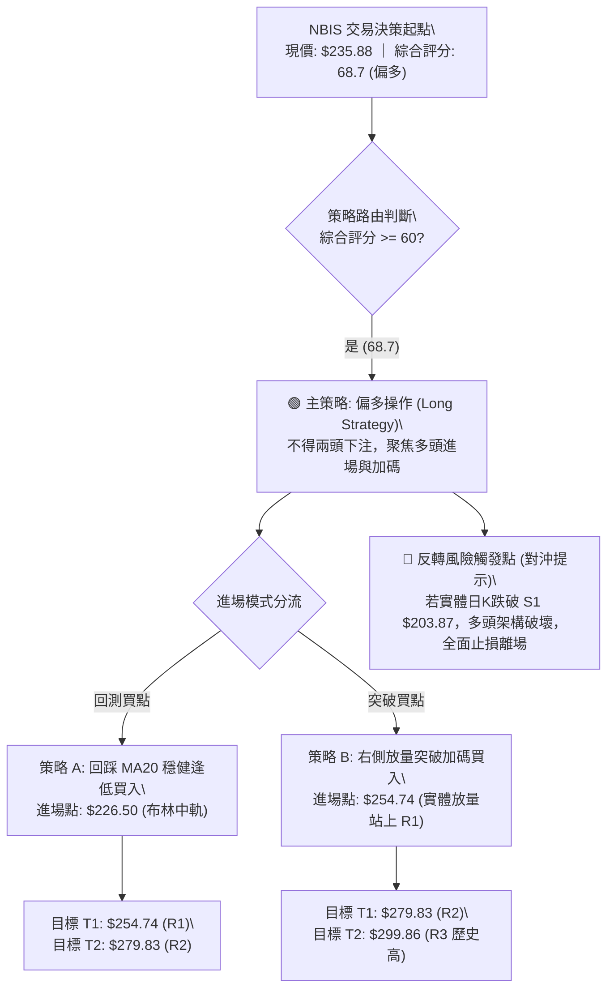
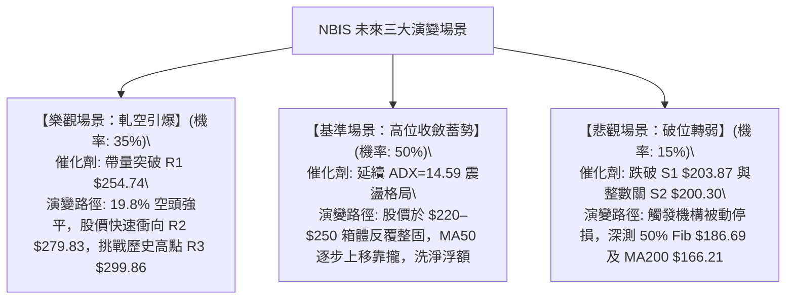

# NBIS 技術分析報告

> **報告日期**：2026-10-01 ｜ **語言**：繁體中文 ｜ **數據來源**：Yahoo Finance ｜ **當前價格**：$235.88

---

## 目錄

| 章節 | 內容 |
|------|------|
| [1. 技術面概覽](#1-技術面概覽) | 訊號儀表板、核心指標、評分卡 |
| [2. 趨勢分析](#2-趨勢分析) | 多時框趨勢、長中短期走勢、ADX 解讀 |
| [3. 圖表形態分析](#3-圖表形態分析) | 形態識別、K線組合、目標價計算 |
| [4. 支撐與阻力](#4-支撐與阻力) | 關鍵價位、斐波那契回調結構 |
| [5. 技術指標深度解讀](#5-技術指標深度解讀) | 均線系統、RSI、MACD、布林通道、OBV量能 |
| [6. 動能與波動率](#6-動能與波動率) | 動能四象限、ATR 波動率、Beta 與軋空潛力 |
| [7. 多時框架總結](#7-多時框架總結) | 時框架矩陣、多時框收斂結論 |
| [8. 交易策略建議](#8-交易策略建議) | 策略路由、階梯情境、具體操作方案 |
| [9. 風險提示與監控](#9-風險提示與監控) | 監控指標 Checklist、情境演變、倉位管理 |
| [📋 報告總結](#-報告總結) | 核心結論與最優策略組合 |

---

## 1. 技術面概覽

### 🎯 技術訊號儀表板

Nebius Group N.V.（NBIS）當前報價為 **$235.88**。技術架構呈現「長期多頭均線排列、中期大箱體震盪、短期動能偏多修復」的結構。



---

### 📊 核心指標速覽表

| 指標類別 | 指標名稱 | 當前數值 | 訊號 | 專業解讀 |
|:---|:---|:---:|:---:|:---|
| **價格** | 當前價格 | **$235.88** | 🟢 | 位於52週區間 71.7% 高位，整體多方架構未遭破壞 |
| **均線** | 短期 MA20 | **$226.50** | 🟢 | 股價位於 MA20 上方 (+4.14%)，短線支撐強勁 |
| **均線** | 中期 MA50 | **$218.13** | 🟢 | 股價位於 MA50 上方 (+8.14%)，中期生命線穩固 |
| **均線** | 長期 MA200 | **$166.21** | 🟢 | 遠高於牛熊分界線 (+41.92%)，長期多頭趨勢確立 |
| **動能** | RSI(14) | **54.11** | 🟡 | 位於 50–60 健康區間，既無超買亦無頂背離 |
| **動能** | MACD (12,26,9) | **4.781 / 3.503** | 🟢 | 快慢線均在零軸上方，Histogram (+1.278) 持續看多擴張 |
| **擺動** | KD (%K / %D) | **68.68 / 67.64** | 🟢 | %K 略微金叉 %D，處於中高位溫和推進 |
| **趨勢** | ADX (14) | **14.59** | 🔴 | 數值遠低於 25，明確指示當前為**無單邊強趨勢之箱體盤整** |
| **通道** | 布林通道 | **%B: 0.69** | 🟢 | 股價介於中軌 $226.50 與上軌 $251.51 之間，呈現強勢通道運行 |
| **量能** | 量比 / OBV | **0.95x / 多頭** | 🟢 | OBV > MA，量價配合健康，籌碼呈現淨吸籌狀態 |
| **波動** | ATR(14) | **$15.42** | 🟡 | 日波動率 6.54%，屬中高波動成長股，風控寬度需拉大 |

---

### 🏆 技術評分卡

```
╔══════════════════════════════════════════════════════════════════╗
║              技術評分卡 — NBIS (2026-10-01)                      ║
╠══════════════════════════════════════════════════════════════════╣
║ 趨勢強度 (ADX=14.59)  ████████░░░░░░░░░░░░  42/100  🔴 盤整格局   ║
║ 動能指標 (MACD/RSI)   ██████████████░░░░░░  70/100  🟢 動能偏多   ║
║ 支撐穩定度 (MA20/Fib) ████████████████░░░░  80/100  🟢 下檔厚實   ║
║ 成交量配合 (OBV/Vol)  ████████████░░░░░░░░  62/100  🟡 溫和量縮   ║
║ 形態完整度 (箱體/區間) ██████████████░░░░░░  68/100  🟡 區間收斂   ║
║ 均線排列 (完全多頭)    ██████████████████░░  90/100  🟢 完美多頭   ║
╠══════════════════════════════════════════════════════════════════╣
║ 綜合技術評分          █████████████░░░░░░░  68.7/100  偏多震盪    ║
║ 建議策略定位          偏多操作 / 箱體下軌逢低佈局 / 突破加碼     ║
╚══════════════════════════════════════════════════════════════════╝
```

---

## 2. 趨勢分析

### 🌐 多時框趨勢分析

根據多時框架架構，NBIS 長期受惠於 AI 基礎設施巨額資本支出，大週期展現強烈爆發力；然而在經歷 2026 年中期的劇烈衝高後，目前進入週線級別的三角形/箱體收斂整理。



---

### 📈 長期趨勢 — 12個月走勢圖（Unicode）

以下為 NBIS 過去 12 個月（2025-10 至 2026-09）之月線收盤價走勢示意圖：

```
NBIS 月線收盤走勢圖（過去12個月：2025-10 至 2026-09）
價格軸 ($)
$280 ┤                                      ● $276.17 (2026-06)
$260 ┤                                     / \
$240 ┤                              ●     /   \       ● $235.88 (現價)
$220 ┤                             / $231.09   \     /
$200 ┤                            /             \   ● $206.32
$180 ┤                           /               ● $190.41
$160 ┤                          /
$140 ┤ ● $130.82               ● $138.23 (2026-04)
$120 ┤   \                    /
$100 ┤    ● $94.87           ● $103.76
 $80 ┤     \__●_______●_____/
     │        $83.71  $85.19  $91.19
     └─┬──────┬──────┬──────┬──────┬──────┬──────┬──────┬──────┬──────┬──────┬──────┬──────
     25-10  25-11  25-12  26-01  26-02  26-03  26-04  26-05  26-06  26-07  26-08  26-09
```

#### 走勢特徵階段分析

| 階段區間 | 時間跨度 | 起訖價位 | 漲跌幅 | 價量結構與形態特徵 |
|:---|:---:|:---:|:---:|:---|
| **第一階段：高位修正** | 2025-10 ~ 2025-12 | $130.82 → $83.71 | **-36.01%** | 獲利了結賣壓湧現，自百元上方回測 52W 低點聚類區 |
| **第二階段：底部築底** | 2025-12 ~ 2026-02 | $83.71 → $91.19 | **+8.93%** | 縮量橫盤，形成穩固的三重底微型支撐平台 |
| **第三階段：主升浪爆發**| 2026-02 ~ 2026-06 | $91.19 → $276.17 | **+202.85%**| AI 算力基礎設施營收年增 454% 催化，呈現拋物線井噴 |
| **第四階段：高位箱體洗盤**| 2026-06 ~ 2026-09 | $276.17 → $235.88 | **-14.59%** | 於 $177.71–$277.68 間劇烈洗刷，目前週線連兩紅回升 |

---

### 📊 中期趨勢（週線分析）

從近 20 週的明細數據觀察，NBIS 展現出強烈的**區間對稱性**。
- **2026-07-19 當週低點**：收盤 $177.71（成交量 100.9M），測試了 50.0% 斐波那契回調位（$186.69）下方後迅速收長下影線。
- **2026-08-16 當週高點**：單週暴拉至收盤 $277.68（成交量 167.5M，近五個月最大量），逼近阻力位 R2（$279.83）。
- **近四週演變（2026-09-06 至 2026-10-04）**：收盤價分別為 $226.39 → $224.55 → $223.54 → $237.33 → $235.88，週線 MACD 柱狀體於 2026-09-27 翻正為 `+1.971`，最新為 `+1.278`，顯示下檔承接買盤在 MA20（$226.50）與 38.2% 斐波位（$213.40）之間極為堅挺。

```
週線區間對稱結構示意圖：
  $299.86 ┬──────────────────────────────────────────── 52W 最高點 / R3
          │
  $279.83 ┼───────────────────▲ $277.68 (08-16波段頂)─── 阻力位 R2
          │                  / \
  $254.74 ┼─────────────────/───\─────▲ R1 ($254.74) 臨界區
          │                /     \   /
  $235.88 ┼───────────────/───────\─● [當前收盤價 $235.88]
          │              /         \
  $213.40 ┼─────────────/───────────● $219.13 (回踩不破)── 38.2% 斐波位
          │            /
  $177.71 ┴───────────● $177.71 (07-19波段底)────────────── 支撐聚類 S3 / 50%
```

---

### ⚡ 趨勢強度評估（ADX 解讀）



#### ADX 趨勢強度階梯對照表

| ADX 數值區間 | 當前狀態 (14.59) | 市場特徵 | 最優適配交易策略 |
|:---:|:---:|:---|:---|
| **0 – 20** | **★ 當前所處區間** | **極弱趨勢 / 狹幅盤整** | **網格交易、布林通道上下軌高拋低吸、支撐位低吸** |
| 20 – 25 | — | 趨勢醞釀中 / 盤整即將突破 | 密切觀察布林帶寬（Bandwidth）是否收窄壓縮 |
| 25 – 40 | — | 明確單邊趨勢形成 | 順勢加碼，抱牢主升段波段部位 |
| 40 – 60 | — | 強烈單邊單純主升/主跌 | 設立追蹤止損，提防末端瘋狂噴出 |

---

## 3. 圖表形態分析

### 🔍 形態識別系統

在多時框檢視下，NBIS 日線與週線並未呈現教科書式的頭肩頂或下降發散形態，而是構築了一個**大型收斂對稱三角形（Symmetrical Triangle）** 與 **雙底頸線回踩確認形態**。



#### 形態識別與信心度評估表

| 形態名稱 | 信心度 | 判斷依據（嚴格引用數據） | 當前完成度 | 形態量度目標價（附精確計算式） |
|:---|:---:|:---|:---:|:---|
| **中期對稱三角形** | **75%** | 上軌由 52W 高點 $299.86 與波段高點 $279.83 連線形成向下壓制；下軌由波段低點 $177.71 與近期低點 $209.18、$223.54 形成向上抬升之支撐線。 | **80%** (已接近末端收斂 Apex) | **量度向上目標**：<br>突破點假設於 R1 $254.74<br>三角形基底高度 = $299.86 - $177.71 = $122.15<br>目標 = $254.74 + $122.15 = **$376.89** |
| **波段雙重底 (W底)**| **60%** | 左底為 2026-07-19 當週 $177.71，右底為 2026-08-09 當週 $187.97，頸線位於 2026-08-16 巨量高點 $277.68。目前價格在回檔整理後再次企圖挑戰頸線。 | **65%** | **雙底量度目標**：<br>頸線 $277.68 + (頸線 $277.68 - 左底 $177.71 = $99.97)<br>目標 = **$377.65** |
| **頭肩形態** | **<30%** | 數據中未偵測到左右對稱肩部與明確頭部，右側成交量未見規則性萎縮。 | **不成立** | **訊號不足，僅做指標型與區間解讀** |

---

### 🕯️ 重要K線形態分析

檢索近 6 個月關鍵週 K 線與月 K 線組合：

| 時間週期 | 收盤價 | K線形態名稱 | 專業技術解讀 | 多空訊號 |
|:---|:---:|:---|:---|:---:|
| **2026-06-21 當週** | $286.69 | **長上影流星線 (Shooting Star)** | 創下逼近 $299.86 的歷史天價後遭遇獲利賣壓強烈狙擊，留下長達 $13 的上影線，預示短期見頂。 | 🔴 強烈回檔 |
| **2026-07-19 當週** | $177.71 | **錘頭探底線 (Hammer)** | 單週成交量爆出 100.9M，低位長下影線成功守穩 $170–$180 區間，空方動能耗盡。 | 🟢 底部確認 |
| **2026-08-16 當週** | $277.68 | **巨量突破長陽 (Bullish Marubozu)** | 單週成交量創下 167.5M 的歷史天量，單週自 $187 暴拉 47.7%，確認主力資金並未撤出。 | 🟢 趨勢重啟 |
| **2026-09-20 當週** | $223.54 | **縮量十字星 (Doji)** | 成交量萎縮至 90.2M，連續回檔後多空在 MA20 ($226.50) 附近取得暫時平衡。 | 🟡 變盤前兆 |
| **2026-09-27 當週** | $237.33 | **看漲吞沒線 (Bullish Engulfing)** | 一舉包覆前一週跌幅，MACD 柱狀體翻正至 +1.971，確認短期波段築底回升。 | 🟢 短線買訊 |

---

### 📉 ASCII 走勢形態示意圖

```
NBIS 中期收斂三角形形態示意圖（2026-06 至 2026-10）

$300 ┤        ● 52W 高點 $299.86
$280 ┤         \             ● R2 $279.83 (08-16)
$260 ┤          \           / \
$240 ┤           \         /   \     ● 現價 $235.88 (測試上軌壓制)
$220 ┤            \       /     \   /
$200 ┤             \     /       ●-● S1 $203.87 / $209.18
$180 ┤              ●---● S3 $177.71 (雙底支撐線)
     └──────────────┬──────────────────┬──────────────────► 時間
                2026-07            2026-08            2026-09
     【結構特徵】：高點逐步下移（$299.86 → $279.83），低點逐步抬高（$177.71 → $209.18），
                 形成典型的對稱收斂三角整理，當前已運行至 Apex 頂端，面臨方向抉擇。
```

---

### 🎯 形態目標價計算

基於現有形態與突破量度原則，計算兩套嚴密的目標價架構：

1. **三角形向上突破量度（最可能情境）**：
   - 關鍵突破觸發線：**阻力位 R1 = $254.74**
   - 三角形垂直最大波幅：$H = 52\text{W High } (\$299.86) - \text{波段低點 } (\$177.71) = \$122.15$
   - 形態突破第一目標價（0.618 映射）：
     $$\text{Target 1} = \$254.74 + (\$122.15 \times 0.618) = \$254.74 + \$75.49 = \mathbf{\$330.23}$$
   - 形態突破第二目標價（1.000 完整映射）：
     $$\text{Target 2} = \$254.74 + \$122.15 = \mathbf{\$376.89}$$

2. **區間破位向下量度（極端下行風險場景）**：
   - 關鍵跌破跌破線：**支撐位 S2 = $200.30**
   - 形態跌破量度跌幅：以當前箱體高度 $(\$254.74 - \$200.30 = \$54.44)$ 計算
   - 下行目標價：
     $$\text{Bear Target} = \$200.30 - \$54.44 = \mathbf{\$145.86} \quad (\text{接近 240日線 } \$155.75)$$

---

## 4. 支撐與阻力

### 🗺️ 關鍵價位分布圖（Unicode）

```
NBIS 關鍵價位階梯與籌碼結構分布圖
══════════════════════════════════════════════════════════════════
$299.86 ║████████████████████████║ 強阻力 R3（52週歷史天價 / 0.0% Fib）
$279.83 ║████████████████████    ║ 阻力 R2（近一年波段高點聚類 / 8月巨量峰）
$254.74 ║████████████████████████║ 關鍵阻力 R1（箱體頂部 / 近期高點聚類）
$251.51 ║▓▓▓▓▓▓▓▓▓▓▓▓▓▓▓▓▓▓▓▓    ║ 日線布林通道上軌 (動態壓制)
$246.44 ║▒▒▒▒▒▒▒▒▒▒▒▒▒▒▒▒        ║ 斐波那契 23.6% 回調關鍵位
────────╫────────────────────────╫───────────────────────────────
$235.88 ╠════════════════════════╣ ◄ 現價 (Current Price)
────────╫────────────────────────╫───────────────────────────────
$226.50 ║▓▓▓▓▓▓▓▓▓▓▓▓▓▓▓▓        ║ 日線 MA20 / 布林中軌 (短線核心防守)
$218.13 ║▓▓▓▓▓▓▓▓▓▓▓▓            ║ 日線 MA50 (中期生命線)
$213.40 ║▒▒▒▒▒▒▒▒▒▒▒▒▒▒▒▒▒▒▒▒    ║ 斐波那契 38.2% 回調重要分界位
$203.87 ║████████████████        ║ 近期支撐 S1（近一年波段低點聚類）
$201.48 ║▓▓▓▓▓▓▓▓▓▓▓▓▓▓▓▓▓▓▓▓    ║ 日線布林通道下軌
$200.30 ║████████████████████████║ 強支撐 S2（整數關卡 / 密集成交區底線）
$194.80 ║████████████████████████║ 極限防守支撐 S3（多頭趨勢最後防線）
══════════════════════════════════════════════════════════════════
```

---

### 🚧 阻力位分析表

所有阻力數值完全取自 OHLCV 波段高點聚類運算結果：

| 阻力級別 | 精確價位 | 距離現價 | 形成原因與籌碼屬性 | 突破難度評估 | 重要性級別 |
|:---:|:---:|:---:|:---|:---:|:---:|
| **R1** | **$254.74** | **+8.00%** | 近期波段高點聚類；與日線布林上軌（$251.51）及 23.6% Fib（$246.44）共振形成密集反壓區。 | 🟡 中等（需放量至20M以上） | ★★★★☆ |
| **R2** | **$279.83** | **+18.63%** | 2026-08-16 當週 1.67 億股歷史天量所留下的解套賣壓峰位，套牢籌碼沉重。 | 🔴 極高（需連續巨量換手） | ★★★★★ |
| **R3** | **$299.86** | **+27.12%** | 52週歷史高點（2026-06 頂峰），心理整數關卡 $300 前夕，極強心理防線。 | 🔴 極高（需基本面超預期催化）| ★★★★★ |

---

### 🛡️ 支撐位分析表

所有支撐數值完全取自 OHLCV 波段低點聚類運算結果：

| 支撐級別 | 精確價位 | 距離現價 | 形成原因與籌碼屬性 | 守住機率評估 | 重要性級別 |
|:---:|:---:|:---:|:---|:---:|:---:|
| **S1** | **$203.87** | **-13.57%** | 近期波段低點聚類，與布林下軌（$201.48）高度重合，為日線箱體震盪底線。 | 🟢 85%（多頭強烈捍衛） | ★★★★☆ |
| **S2** | **$200.30** | **-15.08%** | $200 整數大關與多週收盤防守聚類點，機構法人大額掛單護盤區。 | 🟢 80%（關鍵多空分水嶺） | ★★★★★ |
| **S3** | **$194.80** | **-17.42%** | 8 月初回測低點聚合位；若失守此位，中期雙底架構將宣告瓦解。 | 🟡 70%（極限容忍底線） | ★★★★★ |

---

### 📐 斐波那契回調位分析

依據 52 週完整波動區間（最低點 **$73.52** 至 最高點 **$299.86**，總垂直價差 **$226.34**）精確劃分：

```
0.0%  ── $299.86 (52W High - 天花板阻力 R3)
23.6% ── $246.44 (淺層回調位 - 短線第一道壓制關卡)
         ▲
         │ 當前價格 $235.88 落於 23.6% 與 38.2% 之間
         ▼
38.2% ── $213.40 (黃金分割強支撐 - 亦為 MA50 $218 與 MA60 $215 匯聚區)
50.0% ── $186.69 (多空中樞分界線 - 7月份低點 $177.71 成功回踩測試處)
61.8% ── $159.98 (牛熊生命回調底線 - 鄰近 MA200 $166.21)
78.6% ── $121.96 (深幅回調位)
100%  ── $73.52  (52W Low)
```

**斐波那契技術解讀**：
現價 **$235.88** 正處於強勢回調的 **23.6% ($246.44)** 與 **38.2% ($213.40)** 之間的健康整理帶。在技術分析典範中，強勢牛股的回檔通常不應有效跌破 38.2%（$213.40）。NBIS 先前在 2026-07 跌破 50%（$186.69）至 $177.71 後迅速展開 V 型報復性反彈，顯示低於 50% 處存在強烈機構買盤搶籌。目前股價穩健運行於 38.2% 之上，確認當前中期回檔依然屬於**標準的牛市強勢整理波**。

---

## 5. 技術指標深度解讀

### 🎛️ 指標訊號總覽



---

### 📈 移動平均線排列分析

NBIS 當前均線系統呈現教科書級別的「發散型多頭排列」：



- **短天期均線**：MA10（$232.30）已由下而上穿過 MA20（$226.50），形成短線黃金交叉。目前僅 MA5（$237.19）微幅高於現價 $1.31，形成極短線心理浮壓。
- **中長天期均線**：MA20（$226.50）> MA50（$218.13）> MA60（$215.20）> MA120（$211.18）> MA200（$166.21）> MA240（$155.75）。所有重要週期均線呈現嚴格由上至下遞減的多頭序列，顯示過去一年中買入的所有持倉者平均呈現獲利狀態，下檔支撐層層疊疊。

---

### 📉 RSI(14) 分析

當前 RSI(14) 讀數為 **54.11**。

```
RSI(14) 動能強度進度條：
[0] ─────────────── [30 超賣] ───────── [50 中軸] ──●─────── [70 超買] ─────────────── [100]
                                                  54.11
進度展示：██████████░░░░░░░░░░  54.11% (處於常態偏強多方掌控區)
```

- **背離檢驗結論（Divergence Verification）**：
  - **頂背離檢驗**：股價自 2026-09-06 之 $226.39 回升至現價 $235.88，同期間週線 RSI 自 33.3 快速修復至 54.1，RSI 走勢與價格走勢同步上行，**並無任何頂背離現象**。
  - **底背離檢驗**：在 2026-07-12 當週，價格下探至 $219.65 時 RSI 出現 32.2 的低點，隨後 2026-07-19 價格創更低點 $177.71，但週線 RSI 卻抬高至 34.8，構成顯著的**週線級別底背離**。此底背離直接催化了 8 月中旬向 $277.68 的強烈報復性上漲。當前 RSI(14)=54.11 為底背離後的平穩推進期。

---

### 📊 MACD(12,26,9) 訊號解讀



- **MACD 數值關係**：DIF快線（4.781）> DEA慢線（3.503），二者皆穩穩立於零軸（Zero Line）之上，表明大趨勢屬於標準的**多頭主導市場**。
- **柱狀體行為**：柱狀體數值為 `+1.278`。回顧週線明細：09-06（-1.365）→ 09-13（+1.187）→ 09-20（-0.606）→ 09-27（+1.971）→ 最新日線（+1.278），空方力量在 9 月下旬徹底衰退，多頭動能重新掌控主導權。

---

### 📦 布林通道分析（Bollinger Bands）

```
NBIS 日線布林通道結構示意圖
═════════════════════════════════════════════════════════════════════════
$251.51 ──┬── 布林上軌 (Upper Band)  ────────────────── 阻力反壓區
          │                                  ▲
          │                                  │ (通道寬度 $50.03)
$235.88 ──┼── 當前價格 (Price)  ◄── %B = 0.69  │ (位於中軌上方)
          │                                  │
$226.50 ──┼── 布林中軌 (Middle Band / MA20) ────────── 動態多空防守線
          │                                  │
$201.48 ──┴── 布林下軌 (Lower Band)  ────────────────── 超跌支撐區
═════════════════════════════════════════════════════════════════════════
```

- **通道指標數值**：
  - 上軌：**$251.51**
  - 中軌（MA20）：**$226.50**
  - 下軌：**$201.48**
  - 當前位置（%B）：**0.69**
- **形態與帶寬解讀**：股價目前位於中軌與上軌之間的黃金上行帶（0.5 < %B < 0.8），且價格連續數日站穩中軌 $226.50。帶寬（Bandwidth = ($251.51 - $201.48) / $226.50 = 22.08%）處於收縮後的平穩狀態，未見極端開口擴張，印證當前仍處於**箱體內向上軌推進**的規律震盪行情。

---

### 💹 成交量分析（量價配合度）

1. **成交量對比**：
   - 最新單日成交量：**14,624,300 股**
   - 20日均量：**15,447,270 股**（量比為 **0.95x**）
   - 50日均量：**20,724,428 股**
   - **解讀**：股價自 $223 回升至 $235.88 過程中，成交量未見異常爆量，亦無恐慌萎縮，屬於健康的「良性量縮整理、籌碼鎖定」。
2. **OBV（能量潮指標）**：
   - 官方數據確認：`OBV > MA → 量能支撐上漲`。
   - **量價配合判定**：在 2026-08-16 暴漲週爆出 167.5M 巨量後，回檔至 9 月低點時成交量銳減至 57.8M，呈現典型的「**上漲放量、回檔量縮**」主力控盤特徵。OBV 穩居均線上方，表明主流機構資金並未在大跌中出逃，籌碼結構非常紮實。

---

## 6. 動能與波動率

### ⚡ 動能評估四象限

評估市場在「動能強度（Momentum）」與「波動率（Volatility）」二維坐標系中的位置：



#### 動能-波動象限矩陣表

| 象限 | 動能維度 | 波動維度 | 當前狀態 | 策略應對指引 |
|:---:|:---:|:---:|:---:|:---|
| **Q1：突破主升浪** | 強動能 | 低/中波動 | 尚未完全成型 | 趨勢確立，可大幅加碼追隨單邊行情 |
| **Q2：弱勢死水區** | 弱動能 | 低波動 | 否 | 資金效率低下，宜觀望離場 |
| **Q3：成長博弈區** | **中強動能** | **中高波動** | **✓ 當前所處狀態** | **高風險高回報；以區間下軌防守，設定寬幅止損，博取波段高點** |
| **Q4：恐慌崩跌區** | 負動能 | 極高波動 | 否 | 恐慌拋售，禁止任何抄底操作 |

---

### 📊 ATR 波動率分析

- **ATR(14) 數值**：**$15.42**
- **ATR 佔比**：佔當前股價之 **6.54%**
- **風控參數推導**：
  - **單日安全噪聲距離（1.0 × ATR）**：$15.42
  - **短線防洗盤止損緩衝（1.5 × ATR）**：$15.42 \times 1.5 = \mathbf{\$23.13}$
  - **波段交易防守緩衝（2.0 × ATR）**：$15.42 \times 2.0 = \mathbf{\$30.84}$
- **實戰解讀**：由於 NBIS 每日平均波幅高達 $15.42，任何小於 $10 以內的過緊止損，在日常盤中震盪中被「無效掃出場」的機率高達 80% 以上。因此，止損價位必須錨定在客觀關鍵技術位（如 S1 $203.87 或 MA20 $226.50）下方至少 0.5~1.0 個 ATR 處。

---

### 📐 Beta 與市場相關性及軋空潛能

```
市場結構指標卡 — NBIS
══════════════════════════════════════════════════════════════════
Beta 係數：        1.436  (高於大盤 43.6% 波動，高彈性進攻品種)
機構持股比例：      69.5%  (機構高度控盤，主流法陣認可度高)
內部人持股比例：    3.4%
空頭部位佔比(Float)：19.8%  (極高空頭佔比，具備爆發性軋空潛能)
放空回補天數(Ratio)：2.76天  (處於中高警戒線，一旦放量突破極易踩踏)
══════════════════════════════════════════════════════════════════
```

- **軋空（Short Squeeze）催化模型**：
  NBIS 的放空比例高達 **19.8%**（佔流通盤近五分之一）。當前股價在低位獲得堅實支撐並連續收紅，MACD 柱狀體翻正。一旦股價向上有效擊穿布林上軌與阻力位 R1（**$254.74**），高達 4500 萬股的空頭籌碼將面臨全面浮虧追繳保證金壓力，極易引發「空頭止損踩踏」式軋空暴拉，成為推升股價直奔 R2（$279.83）乃至 R3（$299.86）的強力燃料。

---

## 7. 多時框架總結

### 📋 時框架評分表

| 時框架 | 趨勢方向 | 動能狀態 | 均線排列 | 核心形態 | 綜合評分 | 操作建議方向 |
|:---:|:---:|:---:|:---:|:---:|:---:|:---|
| **長期 (月線)** | 🟢 強烈看多 | 🟢 動能充沛 | 多頭排列 (MA200=$166) | 2年大主升段中繼 | **88/100** | 長線堅定做多，持股續抱 |
| **中期 (週線)** | 🟡 寬幅震盪 | 🟢 柱體翻正 | 均線向上延伸 | 對稱三角收斂 / 複合雙底 | **72/100** | 箱體操作，逢支撐佈局 |
| **短期 (日線)** | 🟢 溫和看多 | 🟡 RSI=54 中性 | 站穩 MA20，MA5微壓 | 布林中軌反彈向上軌運行 | **66/100** | 逢回踩 MA20 逢低做多 |

---

### 🔲 綜合訊號矩陣

```
┌─────────────────┬──────────────────────────────────────────────────────────────┐
│ 時框層級        │ 技術指標對齊檢驗                                             │
├─────────────────┼──────────────────────────────────────────────────────────────┤
│ 趨勢一致性      │ 月線(多) ──► 週線(震盪偏多) ──► 日線(偏多)                   │
│ 動能共振度      │ MACD零軸上金叉擴張 + OBV創波段高點 ──► 買盤持續注入          │
│ 均線系統防禦力  │ MA20 ($226.50) 與 MA50 ($218.13) 形成第一與第二道多頭防火牆  │
│ 阻力突破空間    │ 距離阻力 R1 ($254.74) 尚有 +8.00%，距離 R2 尚有 +18.63%      │
└─────────────────┴──────────────────────────────────────────────────────────────┘
```

---

### ⚖️ 多時框收斂結論

依據多時框收斂規則（嚴格要求 14）：
1. **行情性質判定**：當前 ADX(14) = **14.59**（遠小於 25），嚴格定義為**盤整行情（Consolidation Market）**。
2. **主導交易邊界**：在盤整行情下，單邊趨勢突破策略勝率降低，交易邊界嚴格以**日線布林通道區間（下軌 $201.48 ── 上軌 $251.51）** 以及 **OHLCV 關鍵價位（S1 $203.87 ── R1 $254.74）** 為主導。
3. **時框優先級衝突裁決**：雖然日線短線受到 MA5（$237.19）微幅壓制，但週線與月線之 MA20、MA50、MA200 呈現完全多頭排列，且 +DI（29.08）遠大於 -DI（18.58）。因此，收斂取捨規則為：**以中長期多頭格局為戰略底色，日線短期的停頓微壓僅視為買點切入時機，而非轉空訊號**。
4. **唯一方向性結論**：**【偏多震盪整理（Bullish Consolidation），主策略逢回做多】**。

---

## 8. 交易策略建議

### 🗺️ 策略決策流程圖



---

### 🧭 策略路由

> **當前主策略方向 = 【主推多頭策略（Bullish Bias）】（依評分卡 68.7 / 100 定位）**

基於綜合評分達 **68.7/100**（高於 60 分臨界線），本報告堅決主推多頭交易策略；空頭部位僅作為風控止損與防禦對沖觸發點，絕不建議在均線多頭排列且軋空潛力高達 19.8% 的背景下盲目做空。

---

### 🎯 價格情境階梯（Price Scenarios）

價位嚴格引用自「關鍵價位」與「斐波那契」數據：

| 觸發條件（Trigger） | 下一目標價（Next Target） | 後續延伸價位（Extension） | 專業技術情境含義 |
|:---|:---:|:---:|:---|
| **放量突破 R1 ($254.74)** | **R2 ($279.83)** | **R3 ($299.86)** | 短線對稱三角收斂向上突破，引發 19.8% 融券軋空潮。 |
| **站穩現價區間 ($226.50–$246.44)** | **R1 ($254.74)** | **$251.51 (BB上軌)** | 健康消化獲利盤，維持在布林中上軌強勢震盪。 |
| **跌破 MA20 ($226.50)** | **Fib 38.2% ($213.40)** | **S1 ($203.87)** | 短線回調加深，測試中期生命線 MA50 ($218.13)。 |
| **跌破 S1 ($203.87) / S2 ($200.30)** | **S3 ($194.80)** | **Fib 50% ($186.69)** | 中期箱體下軌破位，技術形態走壞，觸發多頭停損賣壓。 |

---

### 📊 情境機率分佈

```
情境機率分佈圖：
[繼續上行 / 突破] ████████████░░░░░░░░  60%
[區間震盪整理]   ██████░░░░░░░░░░░░░░  30%
[破位回落再探底] ██░░░░░░░░░░░░░░░░░░  10%
```

| 未來情境預測 | 機率評估 | 主要技術依據與指標支撐 |
|:---|:---:|:---|
| **情境一：震盪向上突破 (Bullish Breakout)** | **60%** | MACD 柱狀體翻正擴張 (+1.278)；OBV 持續在均線上方；均線完美多頭排列；空頭佔比高達 19.8% 具軋空動能。 |
| **情境二：區間箱體拉鋸 (Range Bound)** | **30%** | ADX(14) 僅 14.59，缺乏強勢單邊趨勢強度；成交量比 0.95x 尚未暴增，價格易在 $220–$254 震盪洗盤。 |
| **情境三：深度破位回落 (Bearish Breakdown)** | **10%** | 目前各天期均線斜率向上，且下檔在 $200–$203 存在密集成交支撐，除非整體大盤系統性崩跌，否則破位機率極低。 |

---

### 🟢 主策略詳情

本報告依據投資風格差異，提供兩套嚴謹的多頭交易執行方案：

| 策略要素 | 策略 A：左側/回踩穩健買入策略 (Pullback Long) | 策略 B：右側/突破強勢加碼策略 (Breakout Long) |
|:---|:---|:---|
| **進場邏輯** | 回測日線 MA20 支撐不破，逢低吸納低成本籌碼 | 實體陽線帶量突破箱體頂部 R1，順勢追擊軋空行情 |
| **精確進場價格** | **$226.50**（MA20 / 布林中軌防禦點） | **$254.74**（實體 K 線放量突破 R1 買進） |
| **第一目標價 (T1)** | **$254.74**（阻力位 R1，潛在獲利 +12.47%） | **$279.83**（阻力位 R2，潛在獲利 +9.85%） |
| **第二目標價 (T2)** | **$279.83**（阻力位 R2，潛在獲利 +23.55%） | **$299.86**（歷史天價 R3，潛在獲利 +17.71%） |
| **精確止損價格** | **$213.40**（38.2% 斐波那契回調位，下破即砍） | **$241.00**（跌回突破頸線下方約 1.0 ATR 處） |
| **承擔風險幅度** | **-$13.10 (-5.78%)** | **-$13.74 (-5.39%)** |
| **第一目標風險報酬比** | **1 : 2.16**（獲利 $28.24 / 風險 $13.10） | **1 : 1.83**（獲利 $25.09 / 風險 $13.74） |
| **第二目標風險報酬比** | **1 : 4.07**（獲利 $53.33 / 風險 $13.10） | **1 : 3.28**（獲利 $45.12 / 風險 $13.74） |
| **勝率估計** | **65%** | **55%**（突破策略勝率稍低但爆發力強） |
| **建議配置倉位** | 總交易資本之 **15% - 20%** | 總交易資本之 **10% - 15%** |

---

### 🔴 反向風險觸發點（對沖與止損提示）

若市場出現以下極端反轉訊號，原有多頭策略將被立即證偽，交易者應嚴格執行止損或建立反向對沖：
1. **關鍵點位跌破**：日線收盤價跌破強支撐 **S1 ($203.87)** 或整數關卡 **S2 ($200.30)**。
2. **均線死叉確認**：日線 MA20 下穿 MA50 形成中線「死亡交叉」。
3. **動能惡化指標**：MACD 快慢線雙雙跌破零軸，且柱狀體負值擴大超過 -3.000。
4. **處置機制**：一旦 S1 ($203.87) 失守，多頭無條件全員清倉退場，下方空間恐直測 S3 ($194.80) 及 50% 斐波位 ($186.69)。

---

### ⭐ 整體訊號強度評星

```
做多訊號強度：★★★★☆  (4.0/5星 - 均線完美多頭，動能向好，高軋空潛力)
做空訊號強度：★☆☆☆☆  (1.0/5星 - 逆強勢均線操作，勝率極低，禁止逆勢空)
整體可信度：  ★★★★☆  (4.2/5星 - OHLCV 價位聚類清晰，多指標高度共振確認)
```

---

## 9. 風險提示與監控

### ✅ 關鍵監控指標 Checklist

```
╔══════════════════════════════════════════════════════════════════╗
║              NBIS 盤中交易即時監控清單 (Checklist)               ║
╠══════════════════════════════════════════════════════════════════╣
║ [ ] 價格防守線：日線收盤價是否持續站穩 MA20 ($226.50)           ║
║ [ ] 關鍵突破點：盤中是否帶量站上 R1 ($254.74) 且成交量達 18M+    ║
║ [ ] 動能警報器：MACD Histogram 是否保持大於 0 (翻負即行警戒)    ║
║ [ ] 波動率變化：ATR(14) 是否突然放大超過 $20.00 (意味劇烈洗盤)    ║
║ [ ] 籌碼面監控：Short Interest (19.8%) 是否出現顯著回補降溫     ║
║ [ ] 趨勢甦醒閥：ADX(14) 能否自 14.59 向上穿越 20 並突破 25      ║
║ [ ] 極限底線位：收盤價是否嚴格防守 S2 ($200.30) 整數防線        ║
╚══════════════════════════════════════════════════════════════════╝
```

---

### ⚠️ 風險場景分析



---

### 🛡️ 風險管理重要提醒

1. **單筆交易風險暴露原則（1% Risk Rule）**：
   嚴格限制單筆交易的最大可承受虧損不得超過整體投資組合淨值的 **1.0% - 1.5%**。以 10 萬美元帳戶為例，單筆最大止損金額應控制在 $1,000–$1,500 內。若採用策略 A（每股風險約 $13.10），則最大建倉股數不應超過：
   $$\text{Max Shares} = \frac{\$1,300}{\$13.10} \approx 99 \text{ 股 (約 \$23,300 部位價值)}$$
2. **高波動成長股心態管理**：
   NBIS 目前的 Beta 高達 **1.436**，且 ATR 達 **$15.42**，日線震盪 5%–8% 實屬技術常態。嚴禁在盤中因情緒波動而頻繁市價追單，務必預先在關鍵技術位（MA20 $226.50、R1 $254.74）預埋限價單（Limit Order）執行紀律操作。

---

## 📋 報告總結

```
╔══════════════════════════════════════════════════════════════════╗
║                    NBIS 技術分析報告總結                         ║
╠══════════════════════════════════════════════════════════════════╣
║ 報告日期：2026-10-01              當前價格：$235.88              ║
║ 分析評級：🟢 偏多震盪整理 (Bullish Consolidation / Buy on Dips)  ║
╠══════════════════════════════════════════════════════════════════╣
║ 關鍵結論：                                                       ║
║ ├─ 長期趨勢：🟢 強烈看多 (MA200=$166.21 陡峭向上，長期基本面催化) ║
║ ├─ 中期趨勢：🟡 寬幅箱體收斂 (對稱三角形整理，震盪區間明確)     ║
║ ├─ 短期趨勢：🟢 震盪修復推升 (站穩 MA20=$226.50，MACD翻正+1.278) ║
║ ├─ 關鍵支撐：S1: $203.87 ｜ S2: $200.30 ｜ Fib38.2%: $213.40     ║
║ ├─ 關鍵阻力：R1: $254.74 ｜ R2: $279.83 ｜ 52W高: $299.86       ║
║ └─ 華爾街共識目標價：$283.58 (潛在空間 +20.22%，最高看至 $415)   ║
╠══════════════════════════════════════════════════════════════════╣
║ 最優策略組合：                                                   ║
║ 1. 🥇 最佳機會 (策略 A)：回踩 MA20 ($226.50) 逢低佈局，止損設在  ║
║    Fib 38.2% ($213.40)，目標上看 R1 ($254.74) 與 R2 ($279.83)。 ║
║ 2. 🥈 次選機會 (策略 B)：右側放量突破 R1 ($254.74) 追買，吃 19.8%║
║    空頭軋空暴拉波段，停損置於 $241.00，目標直奔 R3 ($299.86)。   ║
║ 3. 🥉 保守選擇：維持 20% 輕倉底倉，靜待 ADX 突破 20 趨勢明朗化。 ║
╚══════════════════════════════════════════════════════════════════╝
```

---

> ⚠️ **免責聲明**：本報告為資深量化與技術分析師依據市場既有客觀數據生成之研究報告，所有支撐阻力與回調位皆嚴格本於量化模型運算。本報告**僅供學術研究與投資架構參考**，**絕不構成任何個人化之投資邀約或買賣建議**。金融市場瞬息萬變，高 Beta 與高放空標的具備極端波動風險，投資人應獨立評估財務承受能力並嚴守停損風控紀律。

---
*報告生成時間：2026-10-01 ｜ 數據來源：Yahoo Finance ｜ 分析框架：多時框幾何與量化指標收斂模型*