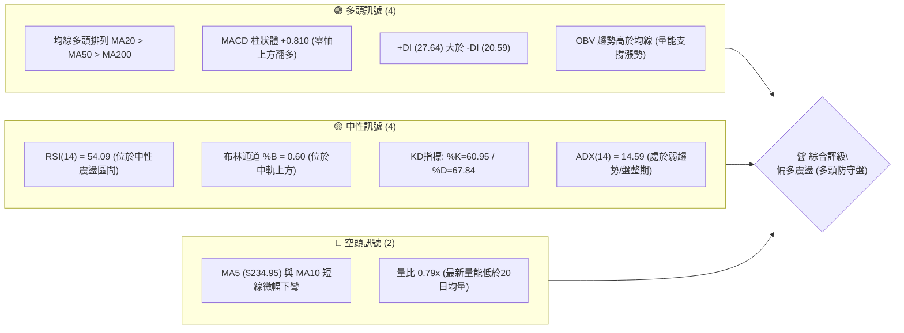
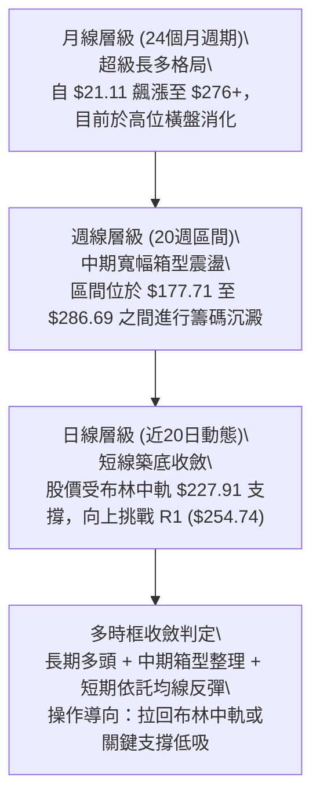
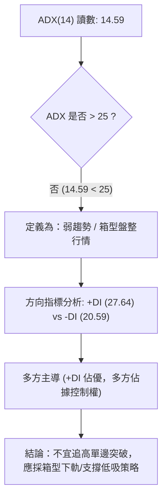
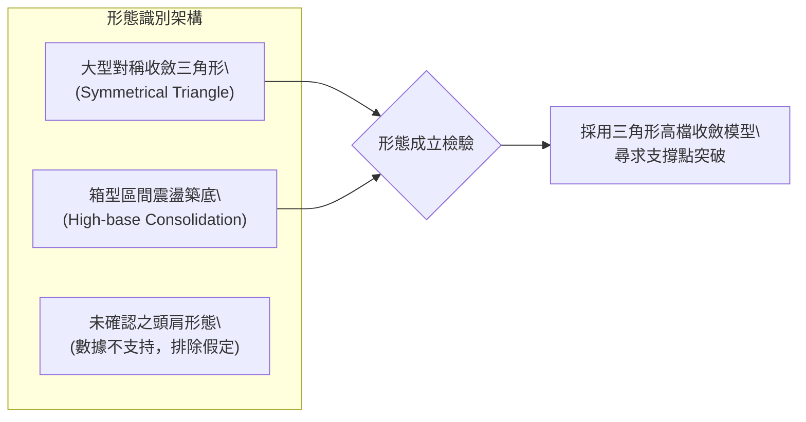
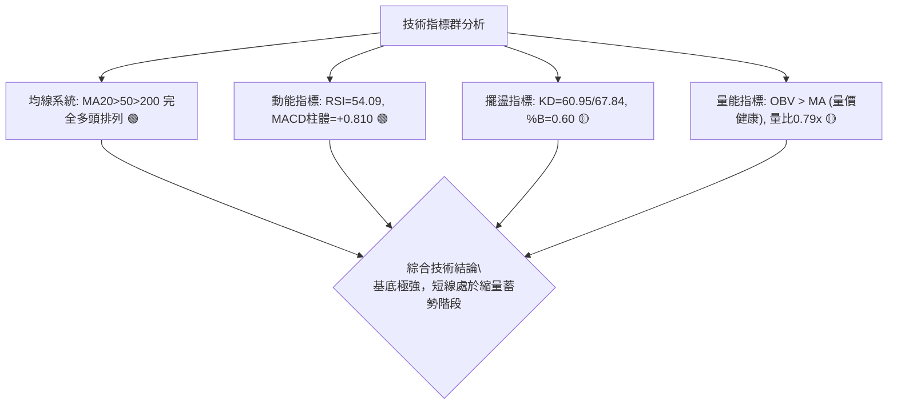
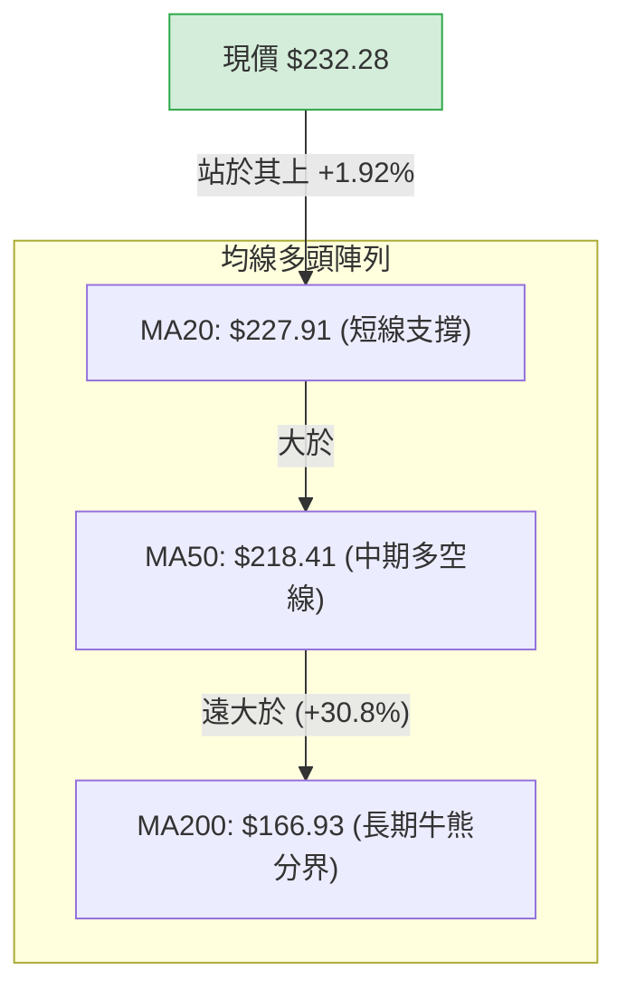
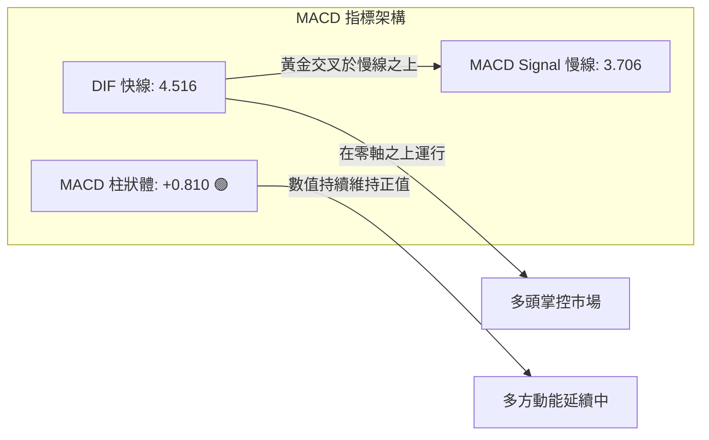
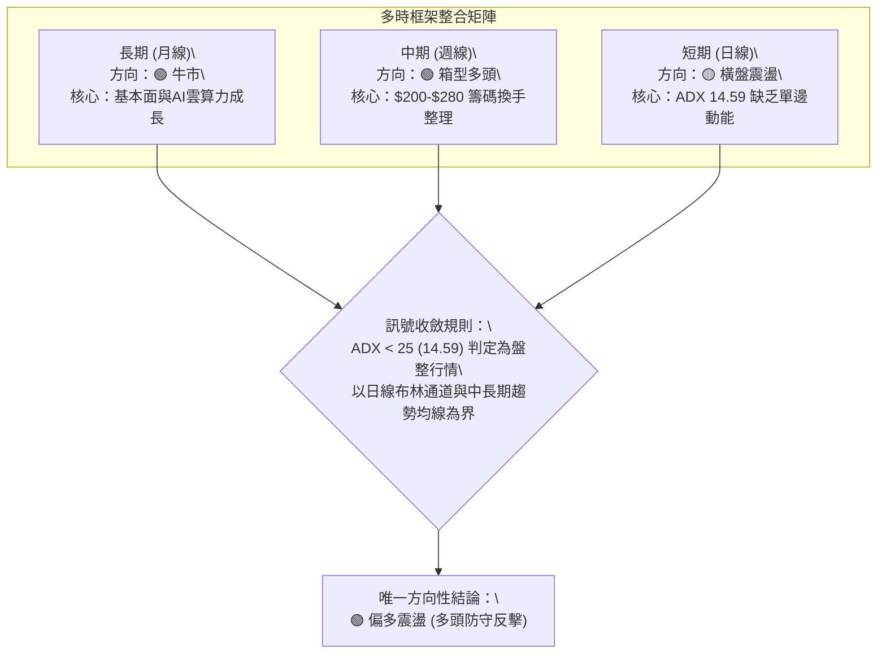
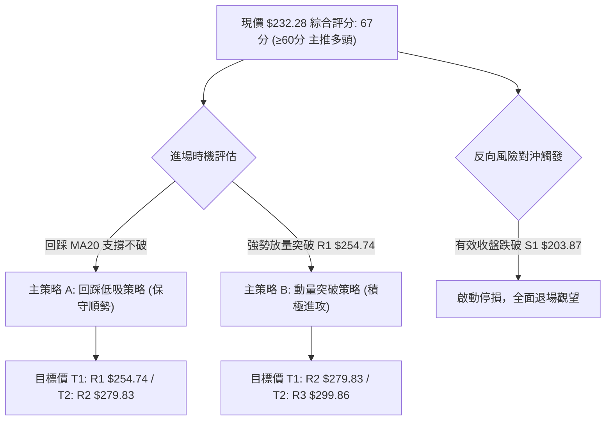
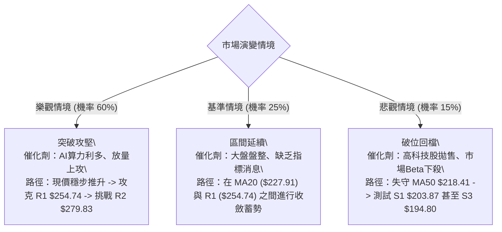

# NBIS 技術分析報告

> **報告日期**：2026-10-02 ｜ **語言**：繁體中文 ｜ **數據來源**：Yahoo Finance ｜ **當前價格**：$232.28

---

## 目錄

| 章節 | 內容 |
|------|------|
| [1. 技術面概覽](#1-技術面概覽) | 訊號儀表板、核心指標、評分卡 |
| [2. 趨勢分析](#2-趨勢分析) | 多時框趨勢、長中短期走勢、ADX強度 |
| [3. 圖表形態分析](#3-圖表形態分析) | 形態識別、K線組合、形態目標價 |
| [4. 支撐與阻力](#4-支撐與阻力) | 關鍵價位、斐波那契回調結構 |
| [5. 技術指標深度解讀](#5-技術指標深度解讀) | MA/RSI/MACD/布林/成交量 |
| [6. 動能與波動率](#6-動能與波動率) | 動能四象限、ATR、Beta敏感度 |
| [7. 多時框架總結](#7-多時框架總結) | 時框架評分矩陣、收斂結論 |
| [8. 交易策略建議](#8-交易策略建議) | 策略路由、主策略、情境階梯 |
| [9. 風險提示與監控](#9-風險提示與監控) | 監控Checklist、情境樹、風控建議 |
| [報告總結](#-報告總結) | 核心結論與策略彙整 |

---

## 1. 技術面概覽

### 🎯 技術訊號儀表板



### 📊 核心指標速覽表

| 指標類別 | 指標名稱 | 當前數值 | 訊號 | 解讀 |
|----------|----------|----------|------|------|
| **價格** | 當前價格 | $232.28 | 🟢 | 站於 52 週中位偏高位置 (70.1%)，整體架構維持強勢整理 |
| **均線** | MA20 | $227.91 | 🟢 | 現價高於 MA20 (+1.92%)，短期動態支撐有效運行中 |
| **均線** | MA50 | $218.41 | 🟢 | 現價高於 MA50 (+6.35%)，中期多頭趨勢生命線維持完好 |
| **均線** | MA200 | $166.93 | 🟢 | 現價遠高於 MA200 (+39.15%)，長期牛市基調明確確立 |
| **動能** | RSI(14) | 54.09 | 🟡 | 位於 50–60 中性偏多區間，未出現超買超賣，動能保持均衡 |
| **動能** | MACD (12,26,9) | Hist: +0.810 | 🟢 | MACD (4.516) 位於 Signal (3.706) 之上，柱狀圖正值延續多方動能 |
| **動能** | Stoch %K / %D | 60.95 / 67.84 | 🟡 | 隨短線回檔出現平緩，未見嚴重頂部鈍化，屬於健康整理 |
| **趨勢** | ADX (14) | 14.59 | 🟡 | ADX < 25 表明短線處於區間震盪階段，而非單邊趨勢噴發行情 |
| **波動** | ATR(14) | $15.41 (6.64%)| 🔴 | 波動度高，日均震幅逾 15 美元，部位建構須嚴控停損幅度 |
| **量能** | 20日成交量比 | 0.79x | 🟡 | 當日量能略微萎縮，OBV 維持在平均之上，呈現縮量整理特徵 |

### 🏆 技術評分卡

```
╔══════════════════════════════════════════════════════════════╗
║              技術評分卡 — NBIS (2026-10-02)                  ║
╠══════════════════════════════════════════════════════════════╣
║ 趨勢強度      ████████░░░░░░░░░░░░  42/100  🟡 盤整醞釀      ║
║ 動能指標      ████████████░░░░░░░░  64/100  🟢 偏多微揚      ║
║ 支撐穩定度    ████████████████░░░░  78/100  🟢 底層扎實      ║
║ 成交量配合    ████████████░░░░░░░░  60/100  🟡 縮量蓄勢      ║
║ 形態完整度    ██████████████░░░░░░  68/100  🟢 區間收斂      ║
║ 均線排列      ██████████████████░░  90/100  🟢 完全多頭      ║
╠══════════════════════════════════════════════════════════════╣
║ 綜合評分      █████████████░░░░░░░  67/100  🟢 偏多架構      ║
╚══════════════════════════════════════════════════════════════╝
```

---

## 2. 趨勢分析

### 🌐 多時框趨勢分析



### 📈 長期趨勢 — 12個月走勢圖（Unicode）

以下圖表展示自 2025 年 11 月至 2026 年 10 月共 12 個月之收盤軌跡（單位：美元）：

```
NBIS 月線收盤走勢圖（過去12個月）
價格軸 ($)
$280 ┤                               ●(2026-06: $276.17)
$260 ┤                              / ＼
$240 ┤                   ●(05:$231)       ●───●(現在: $232.28)
$220 ┤                  /                  ＼ /
$200 ┤                 /                     ●(07: $190.41)
$180 ┤                /
$160 ┤               /
$140 ┤        ●(04:$138)
$120 ┤
$100 ┤●(11:$94)
$80  ┤  ＼  ●(01:$85)   ●(03:$103)
$70  ┤   ●(12: $83.71, 52W低點聚類)
     └──────────────────────────────────────────────────────────
      11   12   01   02   03   04   05   06   07   08   09   10
      25   25   26   26   26   26   26   26   26   26   26   26 (月份)
```

#### 長期歷史階段特徵分析表

| 階段區間 | 起訖月份 | 價格變化 ($) | 漲跌幅 (%) | 價量特徵與形態解讀 |
|----------|----------|-------------|------------|-------------------|
| **第一階段：高檔回洗** | 2025-10 → 2025-12 | $130.82 → $83.71 | -36.01% | 歷經前期爆發性噴出後的籌碼沉重套現，回測尋找中期支撐底部 |
| **第二階段：底部起底** | 2026-01 → 2026-03 | $85.19 → $103.76 | +21.80% | 成功在 $83.71 止跌，月線溫和放量，站回百元關卡完成雙重底右腳 |
| **第三階段：主升噴發** | 2026-03 → 2026-06 | $103.76 → $276.17| +166.16% | 月線連三紅主升段，伴隨 AI 基礎設施爆發式利多，刷新歷史高位至 $299.86 |
| **第四階段：高檔洗盤** | 2026-06 → 2026-07 | $276.17 → $190.41| -31.05% | 短期獲利了結盤湧現，月線大幅拉回消化浮額，迅速於 $190 關卡止跌 |
| **第五階段：二次收斂** | 2026-07 → 2026-10 | $190.41 → $232.28| +21.99% | 震盪中樞穩步上移，收復 MA20/MA50，進入籌碼再分配階段 |

### 📊 中期趨勢（週線分析）

從近 20 週歷史明細分析，週線層級於 2026 年 7 月 19 日觸及週收盤低點 $177.71 後，連續於 $187–$190 區間獲得強大支撐，隨後於 8 月中旬爆出 167,495,900 股的天量強攻至 $277.68。近一個月收盤價連續落在 $226.39、$224.55、$223.54、$237.33、$232.28，波動幅度顯著收斂，週成交量從 1.67 億股逐步降至 5,285 萬股，具備典型「高檔箱型對稱三角形收斂」之特徵。

```
週線近期收斂與支撐示意圖：
  $280 ┼───────● (2026-08-16: $277.68)
       │       / ＼
  $250 ┼      /   ＼    ▲ 壓力線向下壓制
  $232 ┼─────/──────●─[現價: $232.28 於夾角收斂末端]
  $210 ┼    /       /   ▼ 支撐線向上墊高
  $180 ┼──● (2026-07-19: $177.71)
       └─────────────────────────
```

### ⚡ 趨勢強度評估（ADX 解讀）



#### ADX 指標數值對照與環境判定表

| 指標變數 | 當前數值 | 臨界標準值 | 趨勢判定 | 操作涵義 |
|----------|----------|------------|----------|----------|
| **ADX (14)** | **14.59** | 25.00 | **弱趨勢 / 橫向盤整** | 動能指標鈍化，假突破風險高，價格主要在區間內震盪 |
| **+DI (14)** | **27.64** | 20.00 | **多方佔優** | 多方買盤推動力強於空方推動力量 |
| **-DI (14)** | **20.59** | 20.00 | **空方邊際受限** | 空方未掌握定價權，下跌缺乏延續性動能 |
| **DI 差值 (+DI - -DI)**| **+7.05** | > 0 | **偏多結構** | 多空力量對比處於淨多頭狀態，支撐位承接意願強 |

---

## 3. 圖表形態分析

### 🔍 形態識別系統

在多時框架構下，NBIS 於日線與週線展現出高位收斂特徵：



#### 形態識別信心度與目標價評估表

| 形態類別 | 信心度 (%) | 判斷依據（嚴格引用已知數據） | 完成度 (%) | 目標價計算公式與數值 |
|----------|------------|----------------------------|------------|----------------------|
| **高位收斂三角形** | **75%** | 局部波段高點聚類於 R2 ($279.83) 及 08-16 收盤價 $277.68，而波段低點依託 S1 ($203.87) 墊高，震幅遞減且成交量由 1.67億股收縮至 5285萬股。 | 80% | 突破高點 $279.83 後，以三角形基底高度 ($279.83 - $203.87 = $75.96) 計算：<br>`目標價 = $279.83 + $75.96 = $355.79` |
| **寬幅箱型整理** | **65%** | 上軌阻力落在 R1 ($254.74) 至 R2 ($279.83)，下軌強支撐落在 S1 ($203.87) 與 MA50 ($218.41)。現價 $232.28 處於箱體中軸略偏上位置。 | 85% | 箱體震盪區間內交易，中軸測算：<br>`箱底 S1 ($203.87) 至 箱頂 R2 ($279.83)` |
| **雙底形態 (W底)** | **40%** | 歷史數據中 2026-07 收盤 $190.41 與 2026-08 低點 $187.97 有築底形態，但距現價過遠，短線不視為活躍形態。 | 100% | *訊號不足以主導當前交易，僅作長期底部參考* |

### 🕯️ 重要K線形態分析

| 觀測週期 / 週別 | 收盤價 ($) | 實體與影線解讀 | 對應量能 | 蘊含技術訊號 |
|-----------------|-----------|----------------|----------|--------------|
| **2026-08-16** | $277.68 | 突破長紅K棒，向上猛烈逼近前期歷史高點區域 | 167,495,900 (天量) | 🟢 強烈買盤介入，確認 $180–$190 區間為絕對長期鐵底 |
| **2026-08-23** | $219.13 | 巨幅震盪回落陰線，完全吞噬前週部分漲幅 | 141,702,700 (高量) | 🔴 高檔遭遇獲利了結賣壓，確認 $279.83 附近為中期重壓力帶 |
| **2026-09-06** | $226.39 | 探底回升錘子線，下影線回測 MA50 支撐不破 | 57,880,200 (縮量) | 🟢 賣壓竭盡，縮量打底完成，空方動能減弱 |
| **2026-09-27** | $237.33 | 實體中陽線，收復 MA20，MACD 柱狀體翻正 | 79,317,300 (溫和) | 🟢 多方重新集結，由弱轉強確認短線上升波段啟動 |
| **2026-10-04 (當前)**| $232.28 | 小實體十字星/紡錘線，回踩 MA20 測試支撐 | 52,853,000 (持續量縮) | 🟡 變盤前奏，多空在 $232 附近達到微妙均衡 |

### 📉 ASCII 走勢形態示意圖

```
高位三角形收斂幾何示意圖 (週線與日線架構)：
$280 ┼────────────────● [波段高點 R2: $279.83]
     │                 ＼
$260 ┼───[阻力 R1: $254.74] ＼
     │                         ＼
$240 ┼                           ●── [現價: $232.28]
     │                         ／ 
$220 ┼───[MA50支撐: $218.41] ／
     │                     ／
$200 ┼────────────────● [波段低點聚類 S1: $203.87]
     └───────────────────────────────────────────────
      2026-08            2026-09            2026-10
```

### 🎯 形態目標價計算

根據高位收斂三角形之高度原理：
- **形態高點**：波段高點聚類 $279.83 (R2)
- **形態底點**：波段低點聚類 $203.87 (S1)
- **垂直高度 (H)**：$279.83 - $203.87 = $75.96
- **向上突破量測目標價**：$279.83 + $75.96 = **$355.79** (若能突破 R3 $299.86 之終極波段延伸目標)
- **短線箱體突破測算**：以布林帶中軌 $227.91 為基準向上測算至 R1，波段漲幅約 +9.67% ($254.74)。

---

## 4. 支撐與阻力

### 🗺️ 關鍵價位分布圖（Unicode）

```
NBIS 價位結構分布圖 (依據 OHLCV 計算聚類)
═══════════════════════════════════════════════════════════════
$299.86 ║████████████████████████████████████████║ 強阻力 R3 / 52W最高點
$279.83 ║██████████████████████████████░░░░░░░░░░║ 波段高點阻力 R2
$254.74 ║████████████████████░░░░░░░░░░░░░░░░░░░░║ 近期波段阻力 R1
$250.68 ║▓▓▓▓▓▓▓▓▓▓▓▓▓▓▓▓▓▓▓▓                    ║ 布林通道上軌
$246.44 ║░░░░░░░░░░░░░░░░░░░░░░░░░░░░░░░░░░░░░░░░║ 斐波那契 23.6% 回調位
────────╫────────────────────────────────────────╫──────────────
$232.28 ╠════════════════════════════════════════╣ ◄ 現價 ($232.28)
────────╫────────────────────────────────────────╫──────────────
$227.91 ║▓▓▓▓▓▓▓▓▓▓▓▓▓▓▓▓▓▓▓▓                    ║ 布林中軌 / MA20 短線防守
$218.41 ║████████████████                        ║ MA50 生命線支撐
$213.40 ║░░░░░░░░░░░░░░░░░░░░░░░░░░░░░░░░░░░░░░░░║ 斐波那契 38.2% 回調位
$205.13 ║▓▓▓▓▓▓▓▓▓▓▓▓▓▓▓▓▓▓▓▓                    ║ 布林通道下軌
$203.87 ║██████████████████████████████░░░░░░░░░░║ 關鍵支撐 S1 (波段低點聚類)
$200.30 ║████████████████████████████████████░░░░║ 整數大關支撐 S2
$194.80 ║████████████████████████████████████████║ 核心防守底線 S3
═══════════════════════════════════════════════════════════════
```

### 🚧 阻力位分析表

| 阻力級別 | 價位 ($) | 距現價幅幅 | 形成原因與籌碼特徵 | 突破難度 | 重要性權重 |
|----------|----------|------------|-------------------|----------|------------|
| **R1** | **$254.74** | +9.67% | 近期多次衝高未果之籌碼密集解套區，鄰近布林上軌 ($250.68) | 中等 | 🟡 短線轉強樞紐 |
| **R2** | **$279.83** | +20.47%| 2026-08-16 當週天量 (1.67億股) 之頂部換手區，套牢賣壓沉重 | 偏高 | 🔴 中期反轉關鍵點 |
| **R3** | **$299.86** | +29.09%| 52週歷史極值高點，歷史天花板心理關卡 | 極高 | 🔴 歷史天塹阻力 |

### 🛡️ 支撐位分析表

| 支撐級別 | 價位 ($) | 距現價幅幅 | 形成原因與籌碼特徵 | 守住機率 | 重要性權重 |
|----------|----------|------------|-------------------|----------|------------|
| **S1** | **$203.87** | -12.23% | 近一年波段低點聚類核心，且緊鄰布林下軌 ($205.13) | 80% | 🟢 多頭重要防線 |
| **S2** | **$200.30** | -13.77% | $200.00 整數心理防線與機構買盤逢低布局密集帶 | 85% | 🟢 整數心理關卡 |
| **S3** | **$194.80** | -16.14% | 2026年7-8月多重底部的頸線支撐聚類，跌破則中線多頭破壞 | 92% | 🟢 終極波段底線 |

### 📐 斐波那契回調位分析

依據 52 週完整區間（低點 $73.52 至 高點 $299.86，垂直落差 $226.34）進行回調位精確解析：

```
斐波那契回調位分布（以 52W 區間 $73.52 → $299.86 計算）：
  0.0%  (52W High) ────────── $299.86  [歷史峰值]
  23.6%            ────────── $246.44  ▲ 上方第一回調阻力
────────────────── 現價: $232.28 位於 23.6% 與 38.2% 區間 (中高偏強位階)
  38.2%            ────────── $213.40  ▼ 下方首要斐波那契支撐 (共振 MA50 $218.41)
  50.0%            ────────── $186.69  [多空分水嶺]
  61.8%            ────────── $159.98  [黃金分割極限支撐，鄰近 MA200 $166.93]
  78.6%            ────────── $121.96  [深度拉回位]
  100.0% (52W Low) ────────── $ 73.52  [年度低點起點]
```

**現價位階解讀**：現價 $232.28 處於斐波那契 **23.6% ($246.44)** 與 **38.2% ($213.40)** 之間。在技術分析理論中，強勢牛市股在經歷大幅上漲後，拉回若能持續守穩在 38.2% ($213.40) 之上，即屬於「極強勢整理回檔」。NBIS 股價未曾有效跌破 38.2% 水平，且 MA50 ($218.41) 正好位於此水準上方形成雙重支撐過濾網，展現多頭防禦的結構完整性。

---

## 5. 技術指標深度解讀

### 🎛️ 指標訊號總覽



### 📈 移動平均線排列分析



#### 各期移動平均線明細表

| 均線名稱 | 數值 ($) | 與現價乖離 | 排列狀態 | 走勢特徵解讀 |
|----------|----------|------------|----------|--------------|
| **MA 5** | $234.95 | -1.13% | 走平微跌 | 短線5日均線輕微受阻，反映本週小幅震盪拉回 |
| **MA 10**| $233.73 | -0.62% | 走平微跌 | 10日線與現價緊密纏繞，短線陷入方向選擇 |
| **MA 20**| $227.91 | +1.92% | 上彎升揚 | 月線斜率向上，提供短線下檔最強有力的動態支撐 |
| **MA 60**| $215.46 | +7.80% | 穩步上行 | 季線穩健墊高，中期持股成本持續獲利 |
| **MA120**| $211.90 | +9.62% | 向上發散 | 半年線向上攀升，中期多頭架構不可撼動 |
| **MA200**| $166.93 | +39.15%| 堅挺向上 | 長期牛市核心均線，展現過去一年資本實力擴張 |

### 📉 RSI(14) 分析

當前 RSI(14) 數值為 **54.09**。

```
RSI(14) 動能強度進度條：
0               30             50   54.09      70              100
├───────────────┼──────────────┼────●──────────┼───────────────┤
[    超賣區     ] [  偏弱整理   ] [  中性偏多  ] [    超買區     ]
進度條: ███████████░░░░░░░░░ 54.09%
```

- **背離檢驗**：觀察近 20 週收盤走勢，2026-08-16 高點 $277.68 對應 RSI 為 67.2，現價 $232.28 對應 RSI 為 54.1。股價拉回幅度與 RSI 回落幅度呈現正比例線性收斂，並**未出現價創新高而指標未過高的頂背離**，亦**無價破前低指標背離的底背離**現象。
- **結論**：指標處於常態健康區域，意味著股價並無過熱風險，具備充沛的向上拓展空間。

### 📊 MACD(12/26/9) 訊號解讀



- **量化數值解讀**：MACD 線 (4.516) 高於訊號線 (3.706)，兩者皆處於零軸上方的強勢區域。柱狀體數值為 **+0.810**，顯示自 9 月下旬翻紅後，多方動能仍穩步維持。

### 📦 布林通道分析

布林通道參數為 20 日均線、2 倍標準差：
- **布林上軌**：$250.68
- **布林中軌 (MA20)**：$227.91
- **布林下軌**：$205.13
- **布林帶寬度 (Bandwidth)**：($250.68 - $205.13) / $227.91 = 19.98%
- **當前位置 %B**：0.60

```
布林通道當前價位透視圖：
$250.68 ┬─────────────────────────────── 上軌 (阻力帶)
        │
$232.28 ┼─────────────●──────────────── 現價 (位於中軌上方，%B=0.60)
        │
$227.91 ┼─────────────────────────────── 中軌 (MA20 生命線支撐)
        │
$205.13 ┴─────────────────────────────── 下軌 (波段防守區)
```

**解讀**：%B 值為 0.60，表明股價維持在中軌至上軌的上半部強勢區域運行，並未觸及上軌超買壓制，距離中軌 $227.91 僅有些微安全邊際，是技術買盤理想的逢低介入緩衝帶。

### 💹 成交量分析（量價配合度）

- **最新成交量**：12,271,000 股
- **20日均量**：15,524,595 股（量比 0.79x）
- **50日均量**：20,633,294 股
- **OBV 能量潮**：當前數值維持於均線之上，表明主力資金自 2026 年中以來並無大規模派發跡象。
- **量價形態評價**：目前價格在高檔進行三角形收斂整理，成交量隨之縮小（由 8 月天量 1.67 億股驟降至日均 1200 萬股水平），此乃標準的「量縮價穩」良性換手特徵，非空頭主導之「放量下跌」。

---

## 6. 動能與波動率

### ⚡ 動能評估四象限

```
動能與波動率四象限矩陣：
波動率 (ATR%)
   高 ▲
      │   Q3: 高風險高波動       │   Q4: 劇烈下殺破壞
      │   (高動能 / 高波動)     │   (弱動能 / 高波動)
      │                         │
 6.6% ┼───────────────● NBIS 當前位置 (Q3 邊緣過渡至 Q1)
      │   動能強 / 波動高 (歷史 Beta=1.436, ATR=$15.41)
      │
      │   Q1: 穩定牛市主升       │   Q2: 盤整沉澱蓄勢
      │   (強動能 / 低波動)     │   (弱動能 / 低波動)
   低 ┼─────────────────────────┴─────────────────────────►
      低 (ADX<20)               中 (RSI~55)               高 動能強度
```

| 象限分類 | 象限特徵 | 包含指標狀態 | NBIS 當前定位 | 操作指導意義 |
|----------|----------|--------------|--------------|--------------|
| **第一象限 (Q1)** | 強動能 / 低波動 | 趨勢成型，平穩上揚 | 暫未進入 | 最佳波段加碼點 |
| **第二象限 (Q2)** | 弱動能 / 低波動 | 橫盤打底，成交低迷 | 部分符合 (量縮特徵) | 適合逢低布局左側籌碼 |
| **第三象限 (Q3)** | **強動能 / 高波動** | **均線多頭、Beta高、ATR大** | **✓ 當前主要定位 (65%)** | **享受強勢紅利但必須拓寬止損空間** |
| **第四象限 (Q4)** | 弱動能 / 高波動 | 破位崩跌，空方宣洩 | 排除 | 應全面空倉觀望 |

### 📊 ATR 波動率分析

- **ATR(14) 數值**：**$15.41**
- **ATR 佔股價比率**：$15.41 / $232.28 = **6.64%**
- **波動特性分析**：6.64% 的日均波幅表明 NBIS 具備極高的資產彈性。每日平均波動區間逾 15 美元，這意味著常規緊密停損（如 2%-3%）極易遭受市場雜訊震盪出場。
- **動態停損距離計算**：
  - **保守型交易者 (2.0 × ATR)**：$15.41 × 2.0 = **$30.82** 的安全防護墊。
  - **波段型交易者 (1.5 × ATR)**：$15.41 × 1.5 = **$23.12**。現價 $232.28 減去 $23.12 剛好為 **$209.16**，與布林下軌 $205.13 及 S1 $203.87 形成技術共振。

### 📐 Beta 與市場相關性

- **Beta 係數**：**1.436**
- **市場敏感度解讀**：Beta 高達 1.436，表明 NBIS 屬於高彈性成長型標的。當那斯達克或標普500指數上漲 1% 時，NBIS 平均預期上漲 1.44%；反之大盤回檔時，其承受之修正壓力亦放大 44%。目前高 Beta 特徵在多頭均線結構下，賦予該股在市場風險偏好回升時極佳的進攻爆發力。

---

## 7. 多時框架總結

### 📋 時框架評分表

| 時框架 | 趨勢方向 | 動能狀態 | 均線排列 | 圖表形態 | 綜合評分 | 戰術建議 |
|--------|----------|----------|----------|----------|----------|----------|
| **月線 (長期)** | 🟢 強烈看多 | 強勁 (自 $21 飆升) | 完全多頭發散 | 長期主升波段延伸 | **88 / 100** | 戰略性長期持股，忽視短期雜訊 |
| **週線 (中期)** | 🟢 震盪偏多 | 中性蓄勢 (RSI: 54.1) | MA20>50 多頭 | 高位大三角形收斂 | **70 / 100** | 箱體區間高拋低吸，以守代攻 |
| **日線 (短期)** | 🟡 橫向盤整 | 震盪偏多 (MACD正值) | 短均纏繞/長均多頭 | 縮量測試 MA20 支撐 | **64 / 100** | 嚴守 $227 支撐，逢低低吸不追高 |

### 🔲 綜合訊號矩陣



### ⚖️ 多時框收斂結論

依據嚴格多時框收斂規則第 14 條：
1. **行情性質判定**：當前日線層級 **ADX(14) 讀數為 14.59**，明確低於 25 的趨勢門檻，因此當前市場狀態定義為 **「盤整蓄勢行情」**。
2. **衝突取捨原則**：雖然短期日線 MA5/MA10 出現小幅回落（-1.13% / -0.62%），但中長期均線呈現標準多頭排列（MA20 $227.91 > MA50 $218.41 > MA200 $166.93），且週線連續守穩關鍵波段支撐。在盤整結構中，短期均線交叉鈍化不可作為逆勢做空的依據。
3. **最終收斂方向**：**偏多震盪（逢低做多）**。以布林中軌 MA20 ($227.91) 作為核心進場依託，下軌與 S1 ($203.87) 作為終極停損底線，戰略目標指向 R1 ($254.74) 及 R2 ($279.83)。

---

## 8. 交易策略建議

### 🗺️ 策略決策流程圖



### 🧭 策略路由（依評分卡分流）

> **當前主策略方向 = 🟢 順勢逢低做多（依評分卡綜合評分 67 / 100 分，位於 ≥60 多頭區間）**

本報告堅決依據評分卡結果主推**多頭進場架構**；空方策略不作為主推薦，僅保留反向風險防禦點作為風險控制之停損/對沖依據。

### 🎯 價格情境階梯（Price Scenarios）

所有價位均嚴格引用第 4 章聚類之實際數據：

| 觸發條件 | 下一目標 | 後續延伸 | 情境含義與操作指引 |
|----------|----------|----------|-------------------|
| **放量突破 R1 ($254.74)** | **R2 ($279.83)** | **R3 ($299.86)** | 短線收斂向上突破，動能全面激發，發動主升攻勢 |
| **站穩現價區間 ($227.91–$234.95)**| **R1 ($254.74)** | **—** | 於 MA20 之上完成良性洗盤，蓄勢準備叩關阻力 |
| **回踩跌破 S1 ($203.87)** | **S2 ($200.30)** | **S3 ($194.80)** | 中期箱型破位，多頭架構遭遇威脅，應執行強制停損 |

### 📊 情境機率分佈

| 價格情境 | 機率估計 (%) | 核心支撐指標依據 |
|----------|--------------|------------------|
| **情境一：震盪走高 / 向上突破** | **60%** | 均線完整多頭排列 (MA20>50>200)、MACD 柱狀體翻正延續 (+0.810)、OBV 強勢於均線之上顯示主力鎖籌。 |
| **情境二：箱型橫向震盪** | **25%** | ADX 僅 14.59，短線量能萎縮至 0.79x，市場處於等待突破催化劑之均衡期。 |
| **情境三：回落測底 / 破位下跌** | **15%** | 52週高位獲利了結賣壓沉澱，短期若遭遇大盤系統性風險（Beta=1.436）引發回測 S1。 |

### 🟢 主策略詳情

#### 策略 A：布林中軌 / MA20 支撐逢低承接策略（主推）
- **操作理念**：利用 ADX 偏低之震盪市特徵，於回踩短線支撐時低吸，博取向上軌與阻力位之反彈。
- **進場價格**：**$227.91**（掛單於 MA20 / 布林中軌支撐點）至現價 **$232.28** 分批建倉。
- **止損價格**：**$203.87**（嚴格設定於關鍵支撐 S1 下方，跌破意味區間防守失敗）。
- **目標價 T1**：**$254.74**（波段阻力 R1，預期漲幅 +9.67%）。
- **目標價 T2**：**$279.83**（波段阻力 R2，預期漲幅 +20.47%）。
- **風險報酬比 (R/R Ratio)**：
  - 承擔風險：$227.91 - $203.87 = $24.04
  - 預期報酬 (至 T2)：$279.83 - $227.91 = $51.92
  - **風報比 = 1 : 2.16**（優於常規 1:2 標準）。
- **成功機率**：65%
- **建議部位**：佔總投資組合之 **15% - 20%**。

#### 策略 B：突破阻力追擊策略（積極型）
- **操作理念**：若價格不回踩直接放量突破箱頂，則於右側確認時追價介入。
- **進場條件**：日線收盤價帶量突破阻力 R1 **$254.74**（單日成交量 > 20日均量 15,524,595 股）。
- **進場價格**：**$255.50**（突破確認後追進）。
- **止損價格**：**$232.28**（以現價/原箱體中軸作為假突破止損防線）。
- **目標價 T1**：**$279.83**（阻力 R2，預期漲幅 +9.52%）。
- **目標價 T2**：**$299.86**（52W高點 R3，預期漲幅 +17.36%）。
- **風險報酬比 (R/R Ratio)**：
  - 承擔風險：$255.50 - $232.28 = $23.22
  - 預期報酬 (至 T2)：$299.86 - $255.50 = $44.36
  - **風報比 = 1 : 1.91**。
- **成功機率**：55%
- **建議部位**：佔總投資組合之 **10%**。

### 🔴 反向風險觸發點（對沖提示）

- **關鍵破位警戒價**：**$203.87 (S1)**。
- **觸發後處置**：若日線收盤價跌破 $203.87，表明該收斂三角形向下破位，高檔頭部特徵確立。此時主多頭策略失效，交易者應無條件執行多頭止損清倉；激進投資者可於 $203.00 建立小額空單對沖，回補目標下看至 S2 ($200.30) 或 S3 ($194.80)。

### ⭐ 整體訊號強度評星

```
╔════════════════════════════════════════════════════╗
║ 做多訊號強度：★★★★☆  (4.0/5星) — 均線與多頭動能穩健 ║
║ 做空訊號強度：★☆☆☆☆  (1.0/5星) — 缺乏破位結構與量能 ║
║ 整體可信度：  ★★★★☆  (4.0/5星) — 指標收斂性高       ║
╚════════════════════════════════════════════════════╝
```

---

## 9. 風險提示與監控

### ✅ 關鍵監控指標 Checklist

```
╔══════════════════════════════════════════════════════════════╗
║              NBIS 日常技術監控檢核清單 (Checklist)           ║
╠══════════════════════════════════════════════════════════════╣
║ [ ] 價格是否跌破 MA20 短期防守線 ($227.91)？                 ║
║ [ ] RSI(14) 是否跌破 50 中性格局轉為弱勢？                   ║
║ [ ] MACD 柱狀體數值是否由正 (+0.810) 翻負？                  ║
║ [ ] 日成交量是否異常放大至 2,000 萬股以上且收長黑K？          ║
║ [ ] ADX 是否自 14.59 向上突破 25，展現趨勢脫離盤整之特徵？    ║
║ [ ] 價格觸及 R1 ($254.74) 時是否伴隨量能確認？                ║
║ [ ] 跌破 S1 ($203.87) 核心防守底線時是否即刻觸發停損？       ║
╚══════════════════════════════════════════════════════════════╝
```

### ⚠️ 風險場景分析



### 🛡️ 風險管理重要提醒

1. **高波動部位控制**：NBIS 之 **ATR 高達 $15.41 (6.64%)**，屬極高波動度標的。為防止單筆虧損對帳戶造成不可逆創傷，建議單筆交易虧損上限控制在總資金的 1.5% 之內。若設定止損幅度為 $24.04 ($227.91 - $203.87 = 10.5%)，則總持倉權重不得超過總資產的 14.2%（`1.5% / 10.5%`）。
2. **高 Beta 聯動防範**：該股 **Beta 值達 1.436**，與科技巨頭及半導體指數高度正相關。在進行個股技術操作時，須密切監控那斯達克100指數走勢。若大盤處於均線下彎空頭期，應主動降半倉操作。
3. **空頭反撲風險 (Short Float 19.8%)**：空頭佔流通盤比例高達 19.8%，空單補回天數 (Short Ratio) 為 2.76 天。此結構具備潛在軋空爆發力，但在突破失敗時亦易引發多殺多急跌，因此切忌在阻力位 R1 ($254.74) 盲目追高，低吸支撐才是最佳盈虧比路徑。

---

## 📋 報告總結

```
╔══════════════════════════════════════════════════════════════╗
║                   NBIS 技術分析報告總結                      ║
╠══════════════════════════════════════════════════════════════╣
║ 報告日期：2026-10-02                                         ║
║ 當前價格：$232.28                                            ║
║ 分析評級：🟢 偏多震盪 (蓄勢蓄力，尋求向上突破)               ║
╠══════════════════════════════════════════════════════════════╣
║ 關鍵結論：                                                   ║
║ ├─ 長期趨勢：🟢 強烈牛市，MA20>50>200 完全多頭排列           ║
║ ├─ 中期趨勢：🟢 寬幅收斂，回踩守穩 38.2% 斐波那契回調位     ║
║ ├─ 短期趨勢：🟡 ADX 14.59 弱趨勢橫盤，布林中軌有強力支撐    ║
║ ├─ 關鍵支撐：S1: $203.87  ｜ 核心防守底線 S3: $194.80        ║
║ ├─ 關鍵阻力：R1: $254.74  ｜ 關鍵波段高點 R2: $279.83        ║
║ └─ 外資共識：華爾街平均目標價 $283.58 (共19位分析師)         ║
╠══════════════════════════════════════════════════════════════╣
║ 最優策略組合：                                               ║
║ 1. 🥇 最佳機會 (策略A)：逢低於 MA20 ($227.91) 至現價布局，   ║
║      以 S1 ($203.87) 嚴格止損，目標看向 R1/R2，風報比 1:2.16 ║
║ 2. 🥈 次選機會 (策略B)：若強勢突破 R1 ($254.74)，順勢追擊，  ║
║      目標上看 52W 高點 R3 ($299.86)                          ║
║ 3. 🥉 保守選擇：等待 ADX 重新回升至 25 以上確認單邊趨勢再進場║
╚══════════════════════════════════════════════════════════════╝
```

---

> ⚠️ **免責聲明**：本報告為 AI 自動生成之技術分析研究，所有數據、圖表指標解讀及價位測算均嚴格基於所提供之歷史價格與量能資訊。本報告**僅供研究與學術參考**，**不構成任何形式的投資建議、邀約或操作依據**。金融市場瞬息萬變，高 Beta 及高 ATR 標的蘊含劇烈波動風險，投資人應獨立思考、審慎評估風險承受能力並自負盈虧。

---

*報告生成時間：2026-10-02 ｜ 數據來源：Yahoo Finance ｜ 分析框架：多時框技術分析體系*