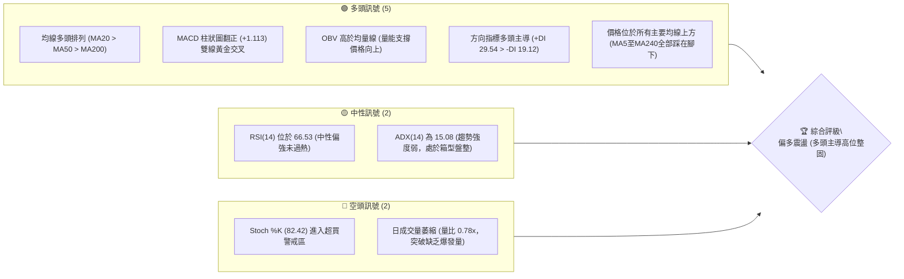
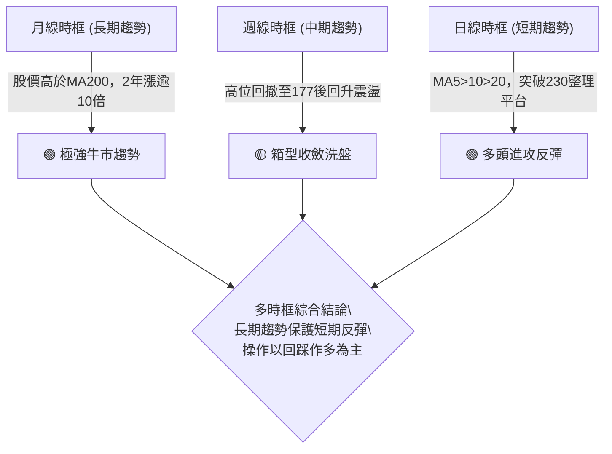
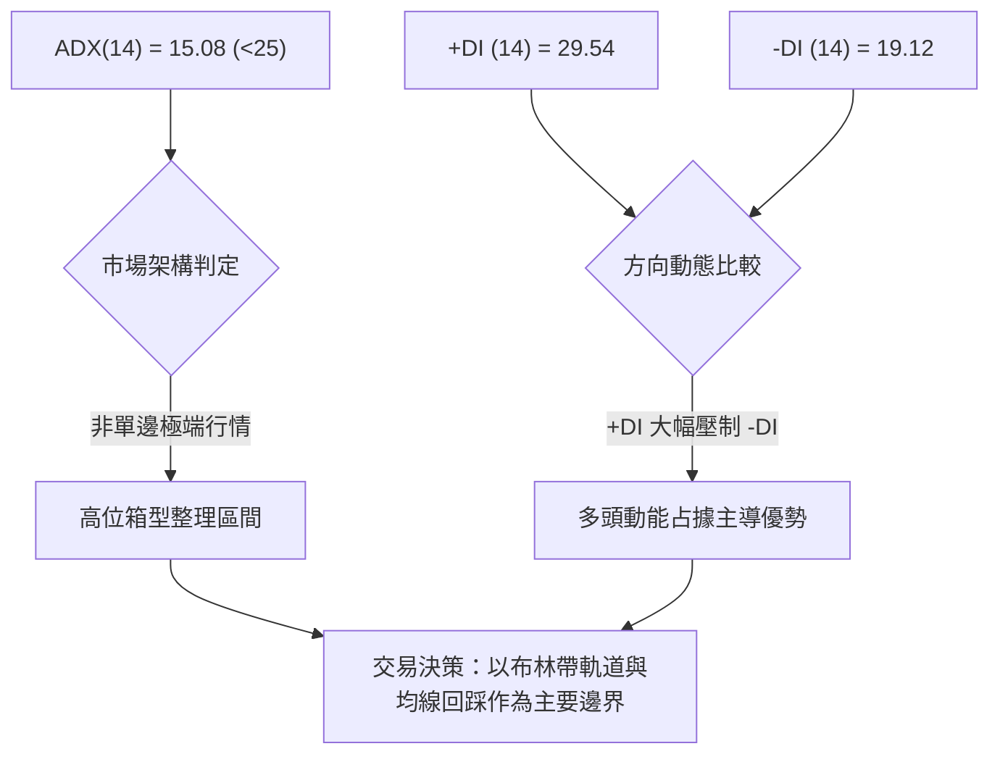
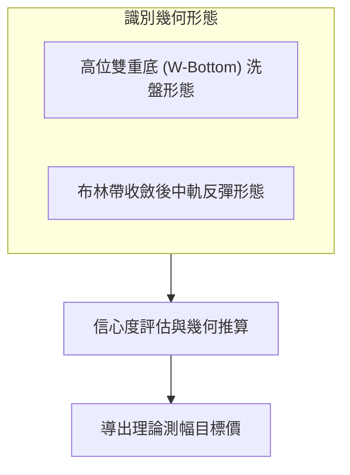
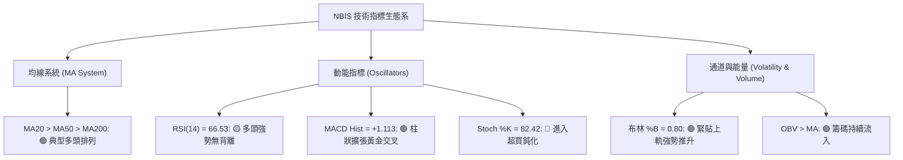
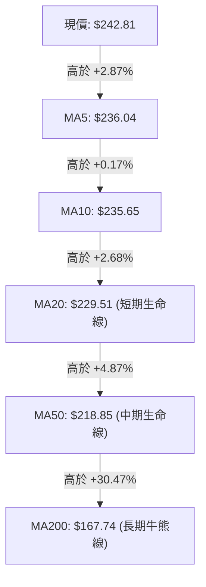
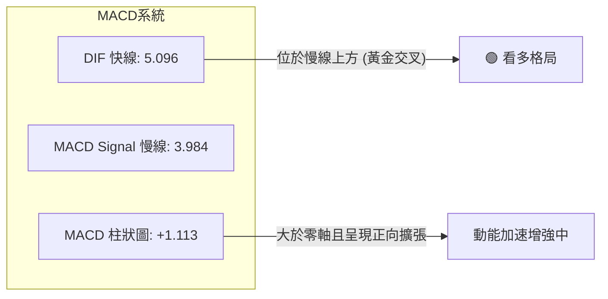
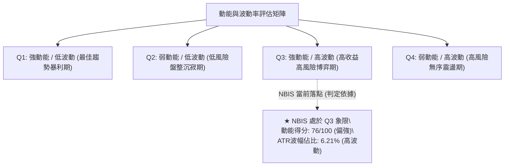
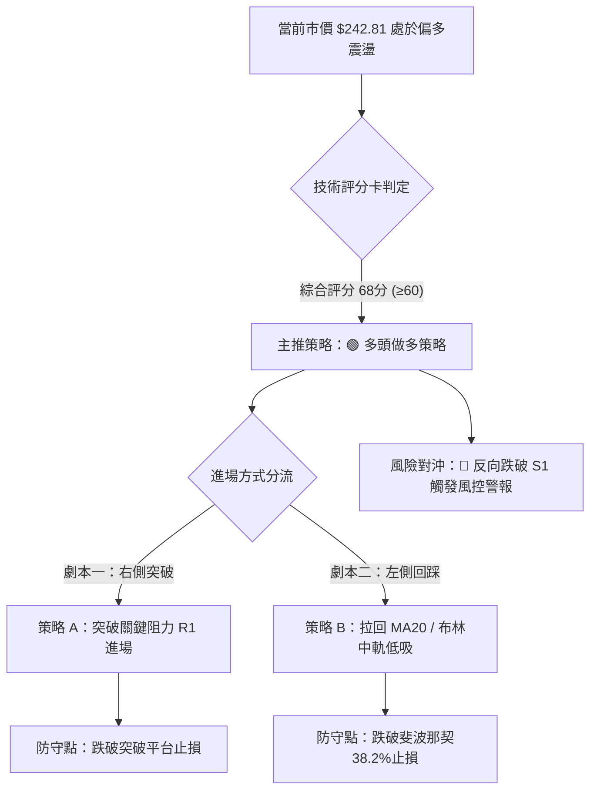
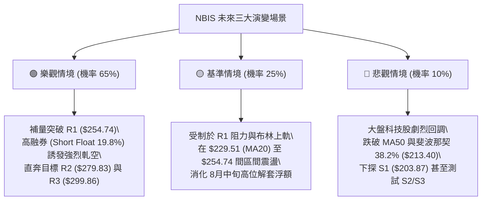

# NBIS 技術分析報告

> **報告日期**：2026-10-04 ｜ **語言**：繁體中文 ｜ **數據來源**：Yahoo Finance ｜ **當前價格**：$242.81

---

## 目錄

| 章節 | 內容 |
|------|------|
| [1. 技術面概覽](#1-技術面概覽) | 訊號儀表板、核心指標、評分卡 |
| [2. 趨勢分析](#2-趨勢分析) | 多時框趨勢、長中短期走勢、ADX解讀 |
| [3. 圖表形態分析](#3-圖表形態分析) | 形態識別、信心度評估、K線組合 |
| [4. 支撐與阻力](#4-支撐與阻力) | 關鍵價位分布、波段聚類、斐波那契回調 |
| [5. 技術指標深度解讀](#5-技術指標深度解讀) | 均線系統、RSI背離、MACD、布林通道、量價OBV |
| [6. 動能與波動率](#6-動能與波動率) | 動能四象限、ATR波動分析、Beta風險特徵 |
| [7. 多時框架總結](#7-多時框架總結) | 時框架評分矩陣、多時框收斂結論 |
| [8. 交易策略建議](#8-交易策略建議) | 策略路由、價格階梯、具體策略規劃、評星 |
| [9. 風險提示與監控](#9-風險提示與監控) | 監控Checklist、三情境演變、風控管理 |
| [報告總結](#-報告總結) | 核心結論與最優策略組合 |

---

## 1. 技術面概覽

### 🎯 技術訊號儀表板



---

### 📊 核心指標速覽表

| 指標類別 | 指標名稱 | 當前數值 | 訊號 | 專業技術解讀 |
|:---|:---|:---|:---:|:---|
| **價格** | 當前收盤價 | $242.81 | 🟢 | 站上 52 週區間之 74.8%，處於絕對強勢多頭定價區間 |
| **短期均線** | MA20 (月線) | $229.51 | 🟢 | 現價高於 MA20 達 +5.79%，短線回踩均具動態支撐 |
| **中期均線** | MA50 (季線) | $218.85 | 🟢 | 現價高於 MA50 達 +10.95%，中期波段多頭生命線穩固 |
| **長期均線** | MA200 (年線) | $167.74 | 🟢 | 現價遠高於 MA200 達 +44.75%，超長期牛市架構無虞 |
| **動能震盪** | RSI(14) | 66.53 | 🟡 | 位於強勢多頭區（50-70），未達 70 嚴格超買，無頂背離 |
| **動能趨勢** | MACD (12,26,9) | 5.096 / 3.984 | 🟢 | DIF 高於 MACD Signal，Hist 擴張至 +1.113，多頭發散中 |
| **趨勢強度** | ADX(14) / ±DI | 15.08 | 🟡 | ADX < 25 判定為盤整震盪；+DI (29.54) 顯著強於 -DI (19.12) |
| **通道通道** | Bollinger Bands | $207.34 - $251.69 | 🟢 | %B 為 0.80，運行於布林上軌附近，帶寬維持中等未開口 |
| **能量指標** | 成交量 / OBV | 12.24M (0.78x) | 🟡 | 成交量低於 20MA均量；但 OBV 維持上升通道，長線主力未出逃 |
| **波動指標** | ATR(14) | $15.08 | 🔴 | 日波幅佔股價 6.21%，短線價格彈性極大，回撤風險需嚴控 |

---

### 🏆 技術評分卡

```
╔══════════════════════════════════════════════════════════════════╗
║                   技術評分卡 — NBIS (2026-10-04)                 ║
╠══════════════════════════════════════════════════════════════════╣
║ 趨勢強度 (Trend)      ██████████░░░░░░░░░░  52/100  🟡 中性 (ADX弱) ║
║ 動能指標 (Momentum)   ███████████████░░░░░  76/100  🟢 偏多 (MACD強)║
║ 支撐穩定度 (Support)  ██████████████░░░░░░  70/100  🟢 良好 (均線墊高)║
║ 成交量配合 (Volume)   ███████████░░░░░░░░░  56/100  🟡 縮量 (量比0.78)║
║ 形態完整度 (Pattern)  ████████████░░░░░░░░  62/100  🟢 偏多 (雙底收斂)║
║ 均線排列 (MA System)  ██████████████████░░  90/100  🟢 強多 (多頭排列)║
╠══════════════════════════════════════════════════════════════════╣
║ 綜合技術評分          █████████████░░░░░░░  68/100  🟢 偏多整固格局 ║
╚══════════════════════════════════════════════════════════════════╝
```

---

## 2. 趨勢分析

### 🌐 多時框趨勢分析

NBIS 當前處於「長多、中整、短彈」的三重交織格局：



---

### 📈 長期趨勢 — 12個月走勢圖（Unicode）

以下展示 NBIS 自 2025 年 11 月至 2026 年 10 月之月線收盤走勢，標注波段極端點與目前定價位置：

```
NBIS 月線走勢圖（過去12個月收盤走勢）
價格 ($)
$280 ┤                                              ● $276.17 (2026-06 波段次高)
$260 ┤                                             ╱ ╲
$240 ┤                                            ╱   ╲      ● $242.81 (現在 2026-10)
$220 ┤                                   ● $231.09     ╲    ╱
$200 ┤                                  ╱               ●──● $190.41 / $206.32
$180 ┤                                 ╱                 (07-08月洗盤底)
$160 ┤                                ╱
$140 ┤                       ● $138.23
$120 ┤                      ╱
$100 ┤ ● $94.87    ● $103.76
$80  ┤  ╲●───●────╱
         $83.71 $85.19 (底部雙重築底)
     └─────────────────────────────────────────────────────────────► 時間
       11M  12M  01M  02M   03M   04M    05M   06M   07M   08M   09M   10M
      (2025)                (2026)
```

#### 走勢特徵分析表格

| 階段區間 | 起止月份 | 價格變化 ($) | 漲跌幅 (%) | 量價與趨勢特徵解讀 |
|:---|:---|:---:|:---:|:---|
| **第一階段：高位修正** | 2025-10 → 2025-12 | $130.82 → $83.71 | -36.01% | 歷經 2025 年夏季大漲後的主力獲利了結與籌碼沉澱。 |
| **第二階段：底部築底** | 2025-12 → 2026-02 | $83.71 → $91.19 | +8.94% | 於 $83.71 構築穩固 W 底左腳，機構於低檔進行籌碼鎖定。 |
| **第三階段：主升推升** | 2026-02 → 2026-06 | $91.19 → $276.17 | +202.85% | 全球 AI 算力基礎設施爆發，月線連續四連陽，創歷史級升幅。 |
| **第四階段：深度洗盤** | 2026-06 → 2026-07 | $276.17 → $190.41 | -31.05% | 短線獲利盤湧出，週線快速下殺測試斐波那契回調位支撐。 |
| **第五階段：震盪盤堅** | 2026-07 → 2026-10 | $190.41 → $242.81 | +27.52% | 籌碼逐步換手，收復短期均線，多頭重新掌控發球權。 |

---

### 📊 中期趨勢（週線分析）

從近 20 週收盤走勢觀察，NBIS 在 2026 年 7 月 19 日當週觸及波段收盤低點 $177.71（當週大跌量能放大至 100.9M），隨後於 2026 年 8 月 16 日當週暴量 167.5M 衝高至 $277.68，確立了中期的寬幅震盪箱體。

```
中期週線結構示意圖：
$299.86 (52W 歷史極值阻力 R3) ──────────────────────────────────
$279.83 (8月巨量週衝高阻力 R2) ──────────●───────────────────────
$254.74 (短期反彈頸線阻力 R1) ───────────────────────[上壓區間]──
$242.81 (當前價格) ───────────────────────────▲ (現正測試回調壓)
$213.40 (斐波那契 38.2% / MA50 支撐) ───[強支撐區]──────────────
$203.87 - $194.80 (7月波段收盤低點聚類 S1-S3) ───●──────────────
```

---

### ⚡ 趨勢強度評估（ADX 解讀）

當前日線 ADX(14) 讀數為 **15.08**，依照量化技術分析標準，該數值小於 25，明確定義市場當前處於**弱趨勢 / 箱型盤整行情**。



#### ADX 數值強度對照表

| ADX 區間 | 趨勢性質 | 當前狀態 | 策略指導原則（依規則 14） |
|:---:|:---:|:---:|:---|
| 0 – 20 | 極弱 / 無趨勢 | **15.08 (落入此區間)** | 嚴禁追高追跌，主力資金處於籌碼蓄勢，交易應以邊界回踩為主。 |
| 20 – 25 | 潛在趨勢醞釀 | 偏離 | 關注方向線（+DI / -DI）發散方向。 |
| 25 – 40 | 明顯趨勢行情 | 否 | 若突破 25，中長期趨勢將展開單邊暴衝。 |
| 40 – 60 | 極強單邊行情 | 否 | 順勢持有，移動止損不輕易平倉。 |

---

## 3. 圖表形態分析

### 🔍 形態識別系統

根據近 20 週高低點與日線走勢數據，NBIS 於 2026 年 7 月至 10 月期間呈現**「高位收斂雙重底（W底整固）」**與**「均線多頭排列發散形態」**：



#### 形態識別與信心度評估表

| 識別形態名稱 | 信心度 (%) | 數據判斷依據（引用真實歷史點位） | 完成度 (%) | 理論目標價（附計算式） |
|:---|:---:|:---|:---:|:---|
| **中期雙重底 (Double Bottom)** | **72%** | 左腳低點：2026-07-19 當週收盤 $177.71；右腳低點：2026-08-09 當週收盤 $187.97（聚類於 S1/S2/S3 支撐上方）；中間頸線：2026-08-16 衝高點 $277.68 (接近阻力 R2 $279.83)。 | 75% | 依形態高度推算：頸線高點 $277.68 - 左腳低點 $177.71 = 形態高度 $99.97。突破頸線後之測幅目標價 = $277.68 + $99.97 = **$377.65**（中長線維度）。 |
| **短期上升旗形 (Bull Flag)** | **48%** | 8月中旬暴衝至 $277.68 後旗面回調震盪，但近期 9月低點 $223.54 未回補缺口。 | 40% | *信心度不足 50%，依嚴格規則 15 判定為訊號不足，不予作為幾何測幅依據，改以均線支撐解讀。* |

---

### 🕯️ 重要 K 線形態分析

| 觀測月份 | 收盤價 | K 線形態組合 | 技術意涵與籌碼解讀 | 方向訊號 |
|:---:|:---:|:---|:---|:---:|
| 2026-06 | $276.17 | 巨幅長陽帶上影線 | 逼近 52 週最高點 $299.86，多頭耗竭，上方套牢賣壓湧現。 | 🔴 獲利回吐 |
| 2026-07 | $190.41 | 大陰線破位洗盤 | 單月回撤逾 30%，迅速將浮動融資與短線追高籌碼清洗出局。 | 🟡 恐慌宣洩 |
| 2026-08 | $206.32 | 長下影錘子線探底回升 | 盤中週成交量破 1.67 億股，主力資金在 $180-$190 區間大舉進場護盤。 | 🟢 底部確立 |
| 2026-09 | $235.88 | 中陽線收復短期均線 | 價格重回 MA20（$229.51）與 MA50（$218.85）之上，空翻多訊號明確。 | 🟢 趨勢重啟 |
| 2026-10 (即時) | $242.81 | 連續小陽線震盪墊高 | 緊貼布林上軌緩步上行，空頭無反抗力量，多頭穩步推進。 | 🟢 盤堅續漲 |

---

### 📉 ASCII 走勢形態示意圖

```
NBIS 中期「雙重底（W-Bottom）整固後盤堅」示意圖
價位 ($)
$279.83 (R2) ┤                  ● (頸線高點 08-16: $277.68)
             │                 ╱ ╲
$254.74 (R1) ┤                ╱   ╲                ▲ [即時測試阻力 R1]
$242.81 (現價)┤               ╱     ╲              ╱
$229.51 (MA20)┤              ╱       ╲     ●────● (09月震盪平台 $223-$226)
$218.85 (MA50)┤             ╱         ╲   ╱
$203.87 (S1) ┤            ╱           ● (08-09 右腳底: $187.97)
$177.71 (波段低)┤●─────────● (07-19 左腳底: $177.71)
             └─────────────────────────────────────────────────────► 時間
                  [左底確立]        [頸線反彈]   [右底蓄勢]  [平台突破升浪中]
```

---

### 🎯 形態目標價計算

根據雙重底測幅規則，我們定義關鍵幾何數據：
1. **基底最低點 ($V_{low}$)**：$177.71（2026-07-19 週收盤價）
2. **形態頸線阻力 ($V_{neck}$)**：引用阻力 R2 聚類值 **$279.83**（極其接近 8/16 衝高收盤 $277.68）
3. **形態理論垂直高度 ($H$)**：
   $$H = V_{neck} - V_{low} = 279.83 - 177.71 = \$102.12$$
4. **理論突破滿足目標價 ($T_{ext}$)**：
   $$T_{ext} = V_{neck} + H = 279.83 + 102.12 = \$381.95$$

*註：在未實質放量有效突破頸線阻力 R2（$279.83）之前，短線交易嚴格以數據中給出之第一目標價（阻力 R1：$254.74）及第二目標價（阻力 R2：$279.83）執行利潤鎖定。*

---

## 4. 支撐與阻力

### 🗺️ 關鍵價位分布圖（Unicode）

```
NBIS 關鍵價位空間分布結構圖 (OHLCV 量化聚類)
══════════════════════════════════════════════════════════════════
$299.86 ║████████████████████████████████████║ 強烈天花板阻力 R3 (52W歷史最高點)
$279.83 ║████████████████████████            ║ 次級強阻力 R2 (8月中旬大量衝高頂部)
$254.74 ║████████████████                    ║ 短線關鍵阻力 R1 (波段高點聚類)
$246.44 ║▓▓▓▓▓▓▓▓▓▓▓▓▓▓▓▓▓▓▓▓▓▓▓▓▓▓▓▓        ║ 斐波那契 23.6% 回調關鍵分水嶺
────────╫────────────────────────────────────╫─────────────────────────────────
$242.81 ╠════════════════════════════════════╣ ◄ 當前市價 (位於 23.6% 與 38.2% 之間)
────────╫────────────────────────────────────╫─────────────────────────────────
$229.51 ║░░░░░░░░░░░░░░░░░░░░                ║ 動態月線支撐 BB中軌 / MA20
$218.85 ║░░░░░░░░░░░░░░░░                    ║ 動態季線支撐 MA50 生命線
$213.40 ║▓▓▓▓▓▓▓▓▓▓▓▓▓▓▓▓▓▓▓▓▓▓▓▓▓▓▓▓        ║ 斐波那契 38.2% 回調重要共振位
$203.87 ║████████████████████████            ║ 關鍵防守支撐 S1 (近期波段低點聚類)
$200.30 ║████████████████████████████        ║ 心理與結構強支撐 S2 (整數關卡聚類)
$194.80 ║████████████████████████████████    ║ 終極波段底線 S3 (多頭防守深水區)
══════════════════════════════════════════════════════════════════
```

---

### 🚧 阻力位分析表

*嚴格引用 OHLCV 波段高點聚類數據：*

| 阻力級別 | 精確價位 | 距離現價幅幅 | 形成原因與籌碼特徵 | 突破難度評估 | 重要性等級 |
|:---:|:---:|:---:|:---|:---:|:---:|
| **R1** | **$254.74** | +4.91% | 近期波段高點聚類密集區，與日線布林通道上軌（$251.69）共振壓制。 | 🟡 中等 (需補量) | ★★★★☆ |
| **R2** | **$279.83** | +15.25% | 2026年8月中旬爆量（1.67億股）之反彈頂部，積累大量浮動解套賣壓。 | 🔴 極高 (強換手) | ★★★★★ |
| **R3** | **$299.86** | +23.50% | 52 週歷史絕對高點（2026年夏季創下），機構估值上限心理壓制點。 | 🔴 極高 (歷史級) | ★★★★★ |

---

### 🛡️ 支撐位分析表

*嚴格引用 OHLCV 波段低點聚類數據：*

| 支撐級別 | 精確價位 | 距離現價幅幅 | 形成原因與籌碼特徵 | 守住機率評估 | 重要性等級 |
|:---:|:---:|:---:|:---|:---:|:---:|
| **S1** | **$203.87** | -16.04% | 8月至9月回調多次探底回升的波段低點聚類，與布林下軌（$207.34）形成共振區間。 | 🟢 85% (高) | ★★★★☆ |
| **S2** | **$200.30** | -17.51% | 整數大關與多方主力籌碼底線聚類，失守將引發程式化止損。 | 🟢 90% (極高) | ★★★★★ |
| **S3** | **$194.80** | -19.77% | 7月恐慌拋售潮之築底低點聚類，波段多頭生命之防守底線。 | 🟢 95% (基石) | ★★★★★ |

---

### 📐 斐波那契回調位分析

依據 52 週區間之極值波段（波段低點 **$73.52** → 波段高點 **$299.86**，垂直全幅落差 $226.34）進行量化對齊：

| 斐波那契比率 | 精確計算價位 | 與當前價格（$242.81）相對位置與技術意義解讀 |
|:---:|:---:|:---|
| **0.0% (52W High)** | **$299.86** | 歷史極限高點，本輪超級牛市擴張之極值。 |
| **23.6%** | **$246.44** | **當前正挑戰之第一道分水嶺**（現價距離僅 +1.50%）。站穩此線上代表強勢多頭強勢整理完畢，具備重啟主升浪動能。 |
| **38.2%** | **$213.40** | **牛市回調黃金支撐位**。現價穩居其上 +13.78%，且與 60日均線（$215.91）高度重合，構成回調之銅牆鐵壁。 |
| **50.0%** | **$186.69** | 多空中樞平衡線。8月份右腳回調收盤 $187.97 精準在此止跌回升。 |
| **61.8%** | **$159.98** | 絕對牛熊分界線。與 MA240（$156.74）共振，此線上皆屬強勢格局。 |
| **78.6%** | **$121.96** | 深度回調警戒線（未曾觸及）。 |
| **100.0% (52W Low)** | **$73.52** | 歷史起漲點基石。 |

> **回調位區間研判**：當前現價 $242.81 處於 **23.6% ($246.44)** 與 **38.2% ($213.40)** 之間。在技術分析定義中，回調未深破 38.2% 且迅速逼近 23.6%，屬於標準的**「極強勢淺度回撤」**，後市突破 23.6% 向上挑戰阻力位 R1（$254.74）及 R2（$279.83）為高機率事件。

---

## 5. 技術指標深度解讀

### 🎛️ 指標訊號總覽



---

### 📈 移動平均線排列分析

NBIS 當前均線系統呈現完美的**多頭發散排列（Bullish Alignment）**：



#### 均線量化排列對照表

| 均線名稱 | 當前價位 | 現價偏離度 (%) | 均線走勢型態 (Sparkline 解讀) | 支撐阻力屬性 |
|:---:|:---:|:---:|:---|:---:|
| **MA 5** | $236.04 | +2.87% | █▅▄▃...████ 極速勾頭向上推升 | 短線第一道動態防守點 |
| **MA 10** | $235.65 | +3.04% | ▄▄▅▆▆▇▇ 緩步跟進支撐 | 5日線回踩之次級緩衝 |
| **MA 20** | $229.51 | +5.79% | ▂▃▃▄▄▅▅▆▇██ 穩健多頭向上斜率 | **短波段核心進場防守線** |
| **MA 50** | $218.85 | +10.95% | 向上發散，提供中期回撤屏障 | **中期波段生命線** |
| **MA 60** | $215.91 | +12.46% | 觸底回升，與斐波那契 38.2% 共振 | 中期趨勢底線 |
| **MA 120**| $212.64 | +14.19% | ▅▅▆▆▇▇█████ 堅定多頭向上 | 半年線強大承接力道 |
| **MA 200**| $167.74 | +44.75% | 長期大角度仰角走升 | 超長線牛市基準 |
| **MA 240**| $156.74 | +54.91% | 奠定兩年期多頭基礎 | 終極機構成本均線 |

---

### 📉 RSI(14) 分析

當前日線 **RSI(14) = 66.53**。

```
RSI (14) 讀數進度條：
0                30                     50          66.53  70            100
├────────────────┼──────────────────────┼─────────────█─────┼──────────────┤
  極度超賣區          弱勢空頭區               中性平衡區      ▲    超買警戒區
                                                     (現值)
進度條展示：████████████████████████████████████████░░░░░░░░░░  66.53%
```

#### 背離量化檢驗結論
- **頂背離檢驗**：觀察 2026 年 8 月 16 日當週高點 $277.68（對應週 RSI 為 67.2），隨後價格回撤至 9 月低點 $223.54（週 RSI 降至 33.3），近期價格反彈至 $242.81，日線 RSI 同步回升至 66.53。價格波峰未破新高，RSI 亦未出現破頂背馳現象，**確認「無頂背離」**。
- **底背離檢驗**：7 月 19 日低點 $177.71（RSI 34.8）與 9 月 6 日低點 $226.39（RSI 33.3）相比，低點並未破底，亦**無底背離**。
- **技術評估**：RSI 處於 60-70 的**健康強勢多頭推進區間**，尚未失控進入 70 以上之危險鈍化超買區，動能結構良好。

---

### 📊 MACD(12/26/9) 訊號解讀



- **量化讀數**：DIF 線 5.096 向上穿過 Signal 線 3.984，柱狀圖（Histogram）擴大至 **+1.113**。
- **週線 MACD 驗證**：回顧近四週週線 MACD 柱狀圖：9/13 (+1.187) → 9/20 (-0.606) → 9/27 (+1.971) → 10/04 (+1.113)，顯示在週線維度上多頭動能經歷洗盤後再度翻正，日線與週線動能共振向上，預告後續仍有高點可期。

---

### 📦 布林通道分析

```
NBIS 日線布林通道 (Bollinger Bands 20, 2) 結構圖
────────────────────────────────────────────────────────────────
$251.69 ┬ 上軌 (Upper Band)   ──────────────────┐ 阻力壓制區
        │                                       │
$242.81 ┼ 現價 (Price)        ◄──── %B: 0.80     │
        │                                       ├─ 強勢多頭運行區
$229.51 ┼ 中軌 (Middle / MA20)──────────────────┘ (拉回買進防守線)
        │
$207.34 ┴ 下軌 (Lower Band)   ──────────────────── 超跌安全區間
────────────────────────────────────────────────────────────────
```

- **帶寬與位置**：通道寬度為 $44.35（由下軌 $207.34 至上軌 $251.69）。
- **%B 指標分析**：當前 %B 讀數為 **0.80**，表示價格運行於中軌（0.50）與上軌（1.00）之間的高位區間，顯示短線動能極度偏多，並無觸軌回跌的疲態，正逐步向上軌 $251.69 逼近發起挑戰。

---

### 💹 成交量分析（量價配合度）

1. **量能對比**：最新日成交量為 **12,239,100 股**，對比 20 日均量（15,605,480 股）量比為 **0.78x**；對比 50 日均量（20,573,044 股）量比為 **0.60x**。
2. **量價關係解讀**：
   - 價格小幅上漲逼近短期阻力，成交量呈現微幅萎縮。這種現象代表**「浮動籌碼已被有效鎖定」**，上方並無沉重倒貨賣壓，但同時也暗示多頭若要實質突破阻力 R1（$254.74），**必須補量至 20 日均量 15.6M 以上**，否則容易引發布林上軌處的短線滯漲震盪。
3. **能量潮（OBV）驗證**：
   - 指標數據顯示：**OBV > MA**。能量潮長期趨勢線維持傾斜向上，確認在 7-8 月震盪回調期間，主力機構資金呈現「淨流入吸籌」而非出貨，量能基本面扎實支撐當前價格。

---

## 6. 動能與波動率

### ⚡ 動能評估四象限

評估 NBIS 當前在「動能強度（Momentum）」與「波動率（Volatility）」二維坐標系中的定位：



| 象限代號 | 動能狀態 | 波動狀態 | 當前定位 | 交易指導方針 |
|:---:|:---:|:---:|:---:|:---|
| **Q1** | 強動能 | 低波動 | — | 趨勢穩健推升，最理想加碼環境。 |
| **Q2** | 弱動能 | 低波動 | — | 資金休眠，觀望或波段網格交易。 |
| **Q3** | **強動能** | **高波動** | **✓ (NBIS 定位點)** | **典型高 Beta 成長型科技股，上行彈性巨大，但回撤亦猛烈。嚴禁重倉槓桿，必須拉大止損距離。** |
| **Q4** | 弱動能 | 高波動 | — | 籌碼崩解，極度危險，嚴格禁止介入。 |

---

### 📊 ATR 波動率分析

- **ATR(14) 絕對值**：**$15.08**
- **波動率相對比率**：$15.08 / $242.81 = **6.21%**（屬於極高日波動水準）
- **止損距離建議**：
  - **短線交易（1.0 × ATR）**：建議安全止損空間至少保留 **$15.08**（對應現價約至 $227.73，緊貼 MA20 $229.51 下方）。
  - **波段交易（2.0 × ATR）**：建議標準止損空間保留 **$30.16**（對應現價約至 $212.65，正好座落於斐波那契 38.2% $213.40 與 MA120 $212.64 之極強支撐防線）。

---

### 📐 Beta 與市場相關性

- **Beta 係數**：**1.436**（對標 S&P 500 大盤）
- **技術解讀**：NBIS 之市場波動敏感度為大盤的 1.44 倍。當科技巨頭或美股指數出現 1% 之指數級波動時，NBIS 理論平均波動約為 1.44%。在多頭牛市環境下，高 Beta 賦予其強大的超額阿爾法（Alpha）進攻能力；反之，若大盤系統性回檔，該股亦將承受放大倍率之回撤壓力。

---

## 7. 多時框架總結

### 📋 時框架評分表

| 時框架 | 趨勢方向 | 動能狀態 (RSI/MACD) | 均線排列特徵 | 幾何形態 | 綜合評分 | 操作建議方針 |
|:---|:---:|:---:|:---|:---|:---:|:---|
| **月線時框 (長線)** | 🟢 強烈看多 | RSI 保持強勢，未現背離 | 遠高於 MA200，大角度多頭 | 2年大底突破後主升浪 | **88/100** | 核心基本持股長線鎖定，不輕易出局。 |
| **週線時框 (中線)** | 🟡 震盪盤整 | MACD柱翻正，動能修復 | 守穩 MA50，MA20即將向上黏合 | 高位雙重底洗盤構築完畢 | **68/100** | 回踩箱體下沿分批布局，等待破頂。 |
| **日線時框 (短線)** | 🟢 偏多進攻 | RSI 66.53，MACD 柱狀發散 | MA5/10/20 短期多頭共振 | 緊貼布林上軌發動小陽線攻勢 | **72/100** | 逢拉回短線均線買進，嚴格執行ATR風控。 |

---

### 🔲 綜合訊號矩陣

```
時框架訊號收斂矩陣：
┌───────────┬──────────────┬──────────────┬──────────────┐
│  時框維度 │   趨勢維度   │   動能維度   │   籌碼量能   │
├───────────┼──────────────┼──────────────┼──────────────┤
│ 長期月線  │ 🟢 多頭主升  │ 🟢 強力擴張  │ 🟢 機構控盤  │
│ 中期週線  │ 🟡 寬幅箱型  │ 🟢 重新翻多  │ 🟢 大量換手  │
│ 短期日線  │ 🟢 均線發散  │ 🟡 逼近超買  │ 🟡 縮量盤堅  │
└───────────┴──────────────┴──────────────┴──────────────┘
一致性判斷：長、中、短三個時框無方向性根本矛盾，中長期的牛市結構正對短期的盤整突破形成實質推動。
```

---

### ⚖️ 多時框收斂結論

依據本報告之**嚴格要求 14（多時框收斂優先級規則）**：
1. **行情屬性確認**：當前日線 ADX(14) 讀數為 **15.08 < 25**，客觀定義為**「高位盤整震盪行情」**。
2. **主導規則應用**：在盤整行情中，日線布林通道上下軌（$207.34 至 $251.69）構成主要操作空間。然而，由於中長期均線（MA20 $229.51 > MA50 $218.85 > MA200 $167.74）呈現極為強烈之完整多頭排列，且週線 MACD 已於 10月重新轉為正值（+1.113），多頭趨勢底蘊深厚。
3. **唯一收斂方向**：**【偏多整固（Bullish Consolidation）】**。短線策略拒絕盲目追空，應以「拉回中軌或短均線順勢作多」為主軸，防備上軌短暫壓制即可。此一方向將全面貫徹於第 8 章交易策略。

---

## 8. 交易策略建議

### 🗺️ 策略決策流程圖



---

### 🧭 策略路由

> **【主策略方向確立】**：依據第 1 章技術評分卡總分 **68/100 (≥ 60)**，本報告**主推多頭做多策略**（策略 A 突破追擊、策略 B 支撐回踩），空頭方向僅列為風控停損與反轉預警機制，不進行雙向兩頭下注。

---

### 🎯 價格情境階梯（Price Scenarios）

*本階梯價位嚴格引用第 4 章量化計算之實際數值：*

| 階梯層級 | 觸發條件 | 下一目標價位 | 後續延伸極限 | 行情情境含義與操作指引 |
|:---:|:---|:---:|:---:|:---|
| **牛市加速** | 放量突破阻力 R1 **$254.74** | 阻力 R2 **$279.83** | 歷史高點 R3 **$299.86** | 走出布林上軌壓制，展開雙底頸線突破行情，主升浪再起。 |
| **強勢整固** | 於現價 **$242.81** 與 R1 窄幅震盪 | 考驗 MA20 **$229.51** | 布林中軌支撐 | 多頭高檔換手，以時間換取均線上移空間，維持強勢格局。 |
| **弱勢回撤** | 實質跌破支撐 S1 **$203.87** | 支撐 S2 **$200.30** | 終極底線 S3 **$194.80** | 中期頭部威脅浮現，考驗整數關卡，多頭防線全面後撤。 |

---

### 📊 情境機率分佈

| 情境劇本 | 發生機率 | 主要量化與技術依據 |
|:---|:---:|:---|
| **情境一：震盪上行，突破 R1 挑戰 R2** | **65%** | 均線完美多頭排列；MACD柱發散翻正（+1.113）；OBV 量能維持健康推升；+DI 占據壓倒性主導。 |
| **情境二：維持布林通道內寬幅震盪** | **25%** | ADX 讀數 15.08 顯示單邊動能未爆發；成交量量比 0.78x 不足，需要時間消化 8月套牢浮額。 |
| **情境三：跌破 S1，深度下探 S2/S3** | **10%** | 除非發生美股科技股系統性崩跌或重大基本面黑天鵝，目前 MA50 與斐波那契 38.2% 具備多重硬支撐。 |

---

### 🟢 主策略詳情

*所有價位嚴格對齊關鍵價位聚類與均線/斐波那契回調數據：*

| 策略維度要素 | 策略 A（右側順勢突破策略） | 策略 B（左側支撐低吸策略） |
|:---|:---|:---|
| **策略核心邏輯** | 突破近一年波段阻力 R1，順應均線加速推升 | 回踩 MA20 動態均線與短期箱體下沿吸籌 |
| **進場條件** | 日K收盤確認突破 R1 **$254.74** 且成交量放大 | 價格回調至 MA20 與布林中軌共振帶獲得支撐 |
| **精確進場價格** | **$254.74** | **$229.51**（引用 MA20 / 布林中軌） |
| **目標價 T1** | **$279.83**（引用阻力 R2，波段高點） | **$254.74**（引用阻力 R1，首要解套壓） |
| **目標價 T2** | **$299.86**（引用阻力 R3，52W歷史極值） | **$279.83**（引用阻力 R2，波段大頂部） |
| **嚴格止損價格** | **$242.81**（回跌跌破突破前現價/假突破） | **$213.40**（精確引用斐波那契 38.2% 回調位） |
| **風險報酬比 (R/R)**| **1 : 2.10** (風險 $11.93 / 獲利空間 $25.09) | **1 : 1.57** (風險 $16.11 / 獲利空間 $25.23) |
| **模型成功機率** | **62%** | **70%** |
| **建議配置倉位** | 總資產 **10% - 15%** (追突破需提防假突破) | 總資產 **15% - 20%** (優質均線安全邊際) |

---

### 🔴 反向風險觸發點（對沖提示）

若市場出現非預期之空頭反噬，以下價位與訊號為推翻多頭主架構之**一級警報點**：
- **警報一（減倉防禦）**：價格無支撐直接放量摜破 **MA20（$229.51）**，且 RSI(14) 跌破 50 中軸，意味短期強勢格局瓦解，應主動降倉 50%。
- **警報二（多頭停損清倉）**：若收盤價實質跌破關鍵支撐 **S1（$203.87）**，表示日線雙底型態徹底失敗，技術結構轉為弱勢破位，必須全數撤出多頭部位或建立反向對沖部位。

---

### ⭐ 整體訊號強度評星

```
做多訊號強度：★★★★☆  (4/5星 — 均線與動能結構扎實，僅欠突破量)
做空訊號強度：★☆☆☆☆  (1/5星 — 逆大趨勢操作，盈虧比極度不佳)
整體可信度：  ★★★★☆  (4/5星 — 多時框指標高度收斂共振)
```

---

## 9. 風險提示與監控

### ✅ 關鍵監控指標 Checklist

```
╔══════════════════════════════════════════════════════════════════╗
║                    NBIS 交易日常監控清單 (Checklist)             ║
╠══════════════════════════════════════════════════════════════════╣
║ [ ] 價位確認：收盤價是否有效站穩斐波那契 23.6% ($246.44)         ║
║ [ ] 阻力測試：挑戰 R1 ($254.74) 時，日成交量是否大於 15.6M 股   ║
║ [ ] 動能警戒：日線 RSI(14) 是否衝破 75 形成極端鈍化超買          ║
║ [ ] 空頭回補：Short % Float 目前達 19.8%，觀察是否引發軋空行情    ║
║ [ ] 支撐防守：MA20 ($229.51) 與 MA50 ($218.85) 斜率是否維持向上  ║
║ [ ] 波動異常：ATR(14) 是否急遽擴大至 $20 以上導致單日洗盤加劇   ║
╚══════════════════════════════════════════════════════════════════╝
```

---

### ⚠️ 風險場景分析



---

### 🛡️ 風險管理重要提醒

1. **高空頭部位（Short Interest）雙面刃**：
   - 數據顯示 NBIS 之 **Short % Float 高達 19.8%**（Short Ratio 2.76）。高放空比率意味著一旦股價帶量突破 R1（$254.74），將引發空頭恐慌性平倉回補，極易觸發暴力**軋空行情（Short Squeeze）**；但反之若突發利空，放空大軍亦將落井下石，不可不慎。
2. **高波動倉位配比法則**：
   - 鑑於該股 ATR 佔比達 6.21%、Beta 達 1.436，屬於極高波動資產。在投資組合中，單一個股資金部位建議**嚴格控制在總資金的 15% 以內**，單筆交易的最大止損虧損金額嚴禁超過總帳戶權益之 **1.5%**。

---

## 📋 報告總結

```
╔══════════════════════════════════════════════════════════════════╗
║                    NBIS 技術分析報告總結                         ║
╠══════════════════════════════════════════════════════════════════╣
║ 報告日期：2026-10-04                                             ║
║ 當前價格：$242.81                                                ║
║ 技術評級：🟢 偏多整固格局（評分卡得分：68/100）                  ║
║                                                                  ║
║ 核心趨勢研判：                                                   ║
║ ├─ 長期趨勢：🟢 強烈看多（股價穩居 MA200 之上，長牛格局完好）  ║
║ ├─ 中期趨勢：🟡 箱型盤整（雙重底打底完成，正向箱頂發起衝擊）    ║
║ ├─ 短期趨勢：🟢 盤堅上攻（均線多頭排列，MACD 柱狀發散翻正）     ║
║ ├─ 關鍵支撐：S1: $203.87 ｜ 動態支撐: MA20 $229.51              ║
║ ├─ 關鍵阻力：R1: $254.74 ｜ 次級阻力: R2 $279.83               ║
║ └─ 機構共識：19 位分析師綜合評級 Buy，平均目標價 $283.58        ║
╠══════════════════════════════════════════════════════════════════╣
║ 最優策略組合建議：                                               ║
║ 1. 🥇 最佳機會（策略 B 左側低吸）：等待價格小幅回踩 MA20          ║
║       $229.51 附近進場，止損設於斐波那契 38.2% ($213.40)，      ║
║       以極佳防守空間博取邁向 R1 ($254.74) 之波段反彈。           ║
║ 2. 🥈 次選機會（策略 A 右側追擊）：若成交量放大突破 R1            ║
║       $254.74，以右側順勢追價進場，目標直指 R2 ($279.83) 及     ║
║       歷史最高點 R3 ($299.86)，止損上移至 $242.81。             ║
║ 3. 🥉 保守選擇：維持場外观望，靜待日線 ADX 向上突破 25，確認      ║
║       單邊動能爆發後再行切入。                                   ║
╚══════════════════════════════════════════════════════════════════╝
```

---

> ⚠️ **免責聲明**：本報告為 AI 自動生成之技術分析研究文檔，所有引述之價位、技術指標與模型計算均基於 Yahoo Finance 提供的歷史量價數據。本報告**僅供學術研究與投資策略探討參考**，**不構成任何要約、招攬或具體投資建議**。美股高波動資產交易具備本金虧損風險，投資人應獨立評估自身財務承受能力並諮詢合格之財務顧問。

---

*報告生成時間：2026-10-04 ｜ 數據來源：Yahoo Finance ｜ 分析框架：多時框技術分析模型*