# NBIS 技術分析報告

> **報告日期**：2026-10-05 ｜ **語言**：繁體中文 ｜ **數據來源**：Yahoo Finance ｜ **當前價格**：$242.81

---

## 目錄

| 章節 | 內容 |
|------|------|
| [1. 技術面概覽](#1-技術面概覽) | 訊號儀表板、核心指標、評分卡 |
| [2. 趨勢分析](#2-趨勢分析) | 多時框趨勢、長中短期走勢 |
| [3. 圖表形態分析](#3-圖表形態分析) | 形態識別、K線組合、目標價 |
| [4. 支撐與阻力](#4-支撐與阻力) | 關鍵價位、斐波那契回調 |
| [5. 技術指標深度解讀](#5-技術指標深度解讀) | MA/RSI/MACD/布林/成交量 |
| [6. 動能與波動率](#6-動能與波動率) | 動能評估、ATR、Beta |
| [7. 多時框架總結](#7-多時框架總結) | 時框架評分矩陣 |
| [8. 交易策略建議](#8-交易策略建議) | 多空策略、風險報酬比 |
| [9. 風險提示與監控](#9-風險提示與監控) | 監控指標、風險場景 |

---

## 1. 技術面概覽

### 🎯 技術訊號儀表板

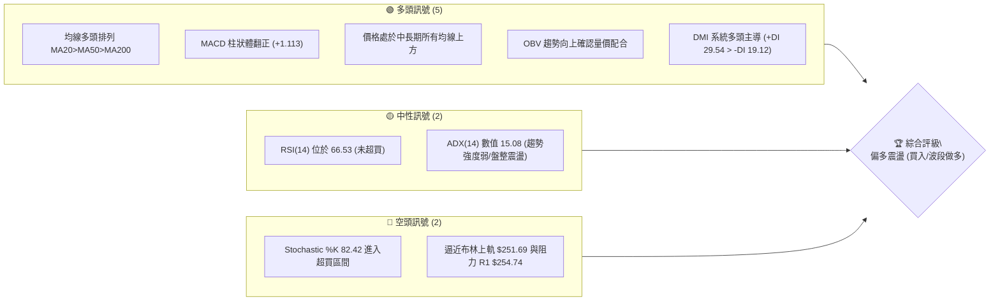

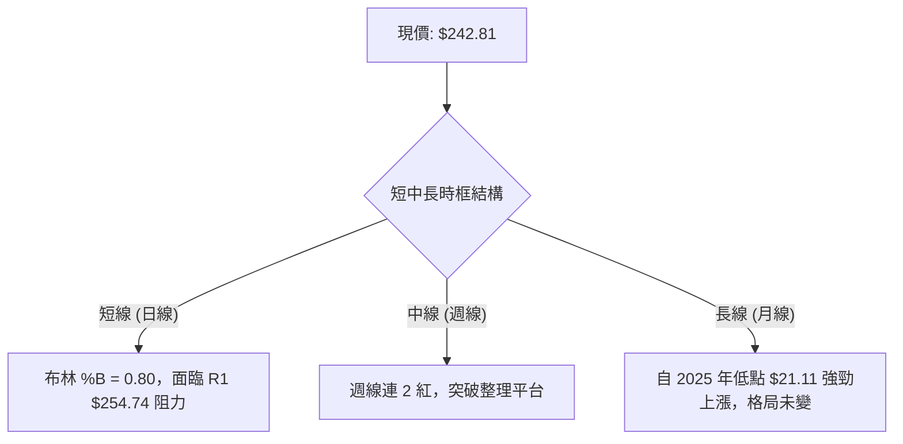

### 📊 核心指標速覽表

| 指標類別 | 指標名稱 | 當前數值 | 訊號 | 解讀 |
|----------|----------|----------|------|------|
| **價格** | 當前價格 | $242.81 | 🟢 | 站上所有均線，位於 52 週波段 74.8% 高位 |
| **均線** | MA20 | $229.51 | 🟢 | 價格在 MA20 上方 +5.79%，短線多頭掌控 |
| **均線** | MA50 | $218.85 | 🟢 | 價格在 MA50 上方 +10.95%，中線支撐強勁 |
| **均線** | MA200 | $167.74 | 🟢 | 價格在 MA200 上方 +44.75%，長線多頭基底穩固 |
| **動能** | RSI(14) | 66.53 | 🟡 | 強勢中性，尚未進入 70 以上超買區 |
| **動能** | MACD | 5.096 (Hist +1.113) | 🟢 | 快線位於慢線上，柱狀體持續擴張看多 |
| **動能** | Stoch %K / %D | 82.42 / 70.68 | 🔴 | KD 高檔鈍化/超買，短線防禦性回洗需求上升 |
| **趨勢** | ADX(14) | 15.08 | 🟡 | 弱趨勢指標，行情定義為「高檔箱型震盪上移」 |
| **波動** | ATR(14) | $15.08 | 🟡 | 佔現價 6.21%，每日波幅大，需寬幅止損 |
| **通道** | Bollinger Bands | $207.34 - $251.69 | 🟡 | %B 為 0.80，運行於中軌至上軌強勢區 |

### 🏆 技術評分卡

```
技術評分卡 — NBIS (2026-10-05)
════════════════════════════════════════════════════
趨勢強度      ██████████░░░░░░░░░░  50/100  🟡 中性 (ADX=15.08)
動能指標      ██████████████░░░░░░  70/100  🟢 偏多 (MACD金叉)
支撐穩定度    ████████████████░░░░  80/100  🟢 強勢 (均線簇聚集)
成交量配合    ████████████░░░░░░░░  60/100  🟡 溫和 (量比0.78x)
形態完整度    ██████████████░░░░░░  70/100  🟢 偏多 (箱型突破確立)
均線排列      ████████████████████  95/100  🟢 極佳 (完全多頭排列)
════════════════════════════════════════════════════
綜合評分      ██████████████░░░░░░  71/100  🟢 偏多波段 (Buy)
════════════════════════════════════════════════════
```

---

## 2. 趨勢分析

### 🌐 多時框趨勢分析

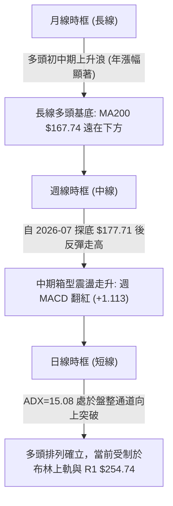


### 📈 長期趨勢 — 12個月走勢圖（Unicode）

```
NBIS 月線走勢圖（過去12個月）
價格軸 ($)
$299.86 ┤                                            (52W High $299.86)
$276.17 ┤                                     ●(2026-06)
$242.81 ┤                                              ●←【現在 $242.81】
$231.09 ┤                                ●
$206.32 ┤                                          ●
$190.41 ┤                                       ●(2026-07)
$138.23 ┤                         ●
$130.82 ┤ ●(2025-10)
$103.76 ┤                  ●
$91.19  ┤             ●
$83.71  ┤       ●(2025-12)
$73.52  ┤                                            (52W Low $73.52)
        └─┬─────┬─────┬─────┬─────┬─────┬─────┬─────┬─────┬─────┬─────┬─────
         10    11    12    01    02    03    04    05    06    07    08    09 (2025-10 ~ 2026-10)
```

**走勢特徵分析表格**：

| 階段區間 | 月份區間 | 價格變動 | 階段漲跌幅 | 結構形態與成交量特徵 |
|----------|----------|----------|------------|----------------------|
| **第 I 階段：高檔修正** | 2025-10 ~ 2025-12 | $130.82 → $83.71 | -36.01% | 歷經 2025 上半年噴出後的深幅獲利回吐，於 80 元上方築底 |
| **第 II 階段：第一波推升** | 2026-01 ~ 2026-03 | $85.19 → $103.76 | +21.80% | 均線轉平向上，量能溫和放大，走出弧形底突破結構 |
| **第 III 階段：主升段噴發** | 2026-04 ~ 2026-06 | $138.23 → $276.17| +99.79% | 爆發性成長推升，突破 200 大關直奔歷史新高區間 |
| **第 IV 階段：洗盤與再積累**| 2026-07 ~ 2026-10 | $190.41 → $242.81| +27.52% | 2026-07 踩出 $177.71 週低點後拉出 W 底形態，量能再度回流 |

### 📊 中期趨勢（週線分析）

```
NBIS 近 20 週價格動態架構 ($)
$280 ┤             ▲ 2026-06-21: $286.69 / 2026-08-16: $277.68 (雙頂阻力區 R2 $279.83)
$260 ┤
$240 ┤- - - - - - - - - - - - - - - - - - - - - - - - - - - - - - - - - - - - - - - - - - - - -【現價 $242.81】
$220 ┤    ▲ 2026-05: $214.77    ▲ 2026-07-12: $219.65    ▲ 2026-09-20: $223.54 (平台支撐帶)
$200 ┤
$180 ┤                         ▼ 2026-07-19: $177.71 (波段黃金底，放量 1.54 億股)
     └────────────────────────────────────────────────────────────────────────────────
```

中期走勢顯示，2026 年 7 月份在 $177.71 形成巨量恐慌底（單週量能 100,938,300 至 154,853,200 股），其後於 8 月中旬衝高至 $277.68 遇阻回洗。9 月在 $220.00 關口獲得 MA50（$218.85）強力托底支撐，近兩週放量推升至 $242.81，顯示中期籌碼已被強勢主控盤吸收。

### ⚡ 趨勢強度評估（ADX 解讀）

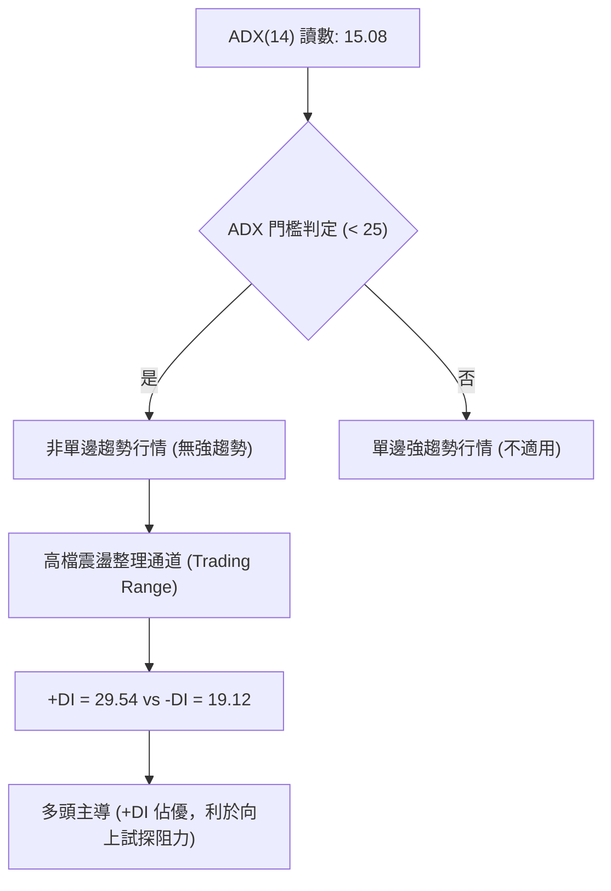

**ADX 強度對照表**：

| 指標變量 | 數值 | 參考標準 | 行情定位結論 |
|----------|------|----------|--------------|
| **ADX(14)** | **15.08** | < 20：極弱/無趨勢；20-25：弱趨勢；> 25：單邊趨勢 | 目前處於**弱趨勢/寬幅盤整**，避免盲目追高，注重區間邊界操作 |
| **+DI(14)** | **29.54** | 高於 -DI 代表多方強勢 | 多方掌控中線定價權，具備突破動能儲備 |
| **-DI(14)** | **19.12** | 低於 20 代表空方殺傷力弱化 | 空頭賣壓逐漸被消化，未形成持續性下殺力量 |
| **多空差 (+DI - -DI)** | **+10.42** | 正值為多方優勢區間 | 短線震盪走高偏多，多時框原則應以日線布林通道與支撐買進為主 |

---

## 3. 圖表形態分析

### 🔍 形態識別系統

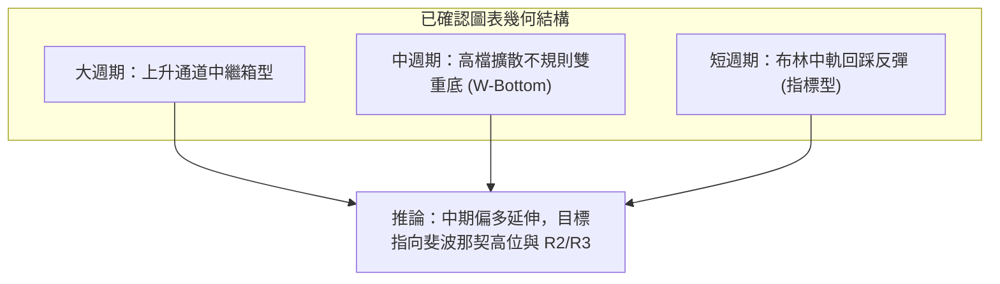

**圖表形態信心度評估表**：

| 形態名稱 | 信心度 | 判斷依據（引用數據） | 完成度 | 目標價（附計算式） |
|----------|--------|----------------------|--------|--------------------|
| **大週期上升箱型中繼** | **78%** | 上界受壓於 $279.83 (R2)，下界支撐守於 $200.30 - $203.87 (S2/S1)，中軌 MA20 向上收斂 | 85% | 突破箱頂 $279.83 後，等距目標 = $279.83 + ($279.83 - $203.87) = **$355.79** (由箱體高度 $75.96 推算) |
| **中期雙重底 (W-Bottom)** | **68%** | 低點 1：2026-07-19 收盤 $177.71；低點 2：2026-08-30 收盤 $209.18；頸線位於 2026-08-16 高點 $277.68 | 65% | 形態尚未完全突破頸線，量度目標 = 頸線 $277.68 + 形態振幅 ($277.68 - $177.71) = **$377.65** (由底形高度 $99.97 推算) |
| **短期布林中軌支撐反彈** | **85%** | 日線價格自 BB 中軌 $229.51 (MA20) 獲撐連續反彈，收盤 $242.81，%B 達 0.80 | 90% | 挑戰日線布林上軌：**$251.69** 與一級阻力 **$254.74** |

### 🕯️ 重要K線形態分析

| 週/月份 | 收盤價 | K線形態 | 解讀 | 訊號 |
|---------|--------|---------|------|------|
| **2026-07-19** | $177.71 | 長下影放量長黑（洗盤底） | 爆出 1 億股以上天量完成恐慌下殺，確立波段黃金買點 | 🟢 強力見底 |
| **2026-08-16** | $277.68 | 長陽噴出巨量大棒 | 一週暴漲放量 1.67 億股，主力拉升碰觸波段高點受阻 | 🟡 假突破回落 |
| **2026-09-06** | $226.39 | 縮量錘頭線 (Hammer) | 探底至 50 日均量以下，週量驟降至 5,788 萬股，浮額洗淨 | 🟢 中期轉折 |
| **2026-09-27** | $237.33 | 實體中陽突破線 | 站上所有短期均線（MA5、MA10、MA20），確認二次回踩成功 | 🟢 轉強買點 |
| **2026-10-04** | $242.81 | 連續小陽推進線 | 盤堅向上逼近前高，多頭掌握主控節奏，惟需放量突破 | 🟢 持續偏多 |

### 📉 ASCII 走勢形態示意圖

```
NBIS 週線 W 底與箱體形態示意架構
($)
280 ┤              頸線高點 B ($277.68)
    │             ╱╲
260 ┤            ╱  ╲                 ▲ 當前推進位置 ($242.81)
    │           ╱    ╲               ╱
240 ┤          ╱      ╲             ╱
    │         ╱        ╲           ╱
220 ┤        ╱          ╲    低點 D ($209.18)
    │       ╱            ╲  ╱
200 ┤      ╱              ╲╱
    │     ╱
180 ┤    ╱ 低點 A ($177.71)
    └───────────────────────────────────────────────
          底 1                  底 2
```

### 🎯 形態目標價計算

依據傳統技術形態學，NBIS 當前運行之「高檔收斂大箱體」具備清晰幾何推算標準：
1. **箱體底部基準線**：波段群聚支撐點 S1/S2 均值約為 $202.08（由波段 S1 $203.87 與 S2 $200.30 均值推算）。
2. **箱體頂部壓力線**：一級波段群聚阻力 R2 為 $279.83。
3. **箱體垂直幅度**：$279.83 - $202.08 = **$77.75**。
4. **突破確認量度目標 (Measured Move)**：
   $$\text{目標價} = \text{箱體頂部} + \text{垂直幅度} = \$279.83 + \$77.75 = \$357.58$$
   *(註：此目標價由箱體高度推算，前提為帶量長陽有效突破 R2 $279.83)*

---

## 4. 支撐與阻力

### 🗺️ 關鍵價位分布圖（Unicode）

```
NBIS 價位結構分布圖 (由 OHLCV 與斐波那契計算)
═══════════════════════════════════════════════════════════════
$299.86 ║████████████████████████████████║ 52週歷史高點 / 阻力 R3
$279.83 ║████████████████████████        ║ 波段雙頂強阻力 R2
$254.74 ║████████████████                ║ 近期波段阻力 R1 (緊鄰 BB 上軌 $251.69)
$246.44 ║▓▓▓▓▓▓▓▓▓▓▓▓▓▓                  ║ 斐波那契 23.6% 回調位
$242.81 ╠════════════════════════════════╣ ◄ 現價 $242.81
$229.51 ║░░░░░░░░░░░░░░░░░░░░            ║ BB 中軌 (MA20 均線)
$218.85 ║░░░░░░░░░░░░░░░░░░░░░░          ║ 中期關鍵均線 (MA50)
$213.40 ║▓▓▓▓▓▓▓▓▓▓▓▓▓▓▓▓▓▓▓▓            ║ 斐波那契 38.2% 回調位
$203.87 ║████████████████████████        ║ 波段強支撐 S1 (近一年波段低點聚類)
$200.30 ║██████████████████████████      ║ 心理整數防線 / 波段支撐 S2
$194.80 ║████████████████████████████    ║ 深度多頭底線支撐 S3
$186.69 ║▓▓▓▓▓▓▓▓▓▓▓▓▓▓▓▓▓▓▓▓▓▓▓▓        ║ 斐波那契 50.0% 強弱分水嶺
$167.74 ║░░░░░░░░░░░░░░░░░░░░░░░░░░░░    ║ 牛熊分界線 (MA200 均線)
═══════════════════════════════════════════════════════════════
```

### 🚧 阻力位分析表

所有價位均嚴格取自波段高點聚類計算：

| 阻力級別 | 價位 | 形成原因 | 突破難度 | 重要性 |
|----------|------|----------|----------|--------|
| **R1** | **$254.74** | 近一年波段高點聚類，與布林通道上軌 ($251.69) 高度重疊 | 中等 (需日成交量大於 20 日均量 1,560 萬股) | 🔴 短線第一道分水嶺 |
| **R2** | **$279.83** | 2026 年 6 月與 8 月兩次上攻未果之頸線平台頂部聚類 | 極高 (套牢籌碼密集堆疊) | 🔴🔴 中期頂部核心阻力 |
| **R3** | **$299.86** | 52 週最高價 (歷史頂點)，純整數多頭極限挑戰位 | 極高 (極限天花板) | 🔴🔴🔴 歷史天塹阻力 |

### 🛡️ 支撐位分析表

所有價位均嚴格取自波段低點聚類計算：

| 支撐級別 | 價位 | 形成原因 | 守住機率 | 重要性 |
|----------|------|----------|----------|--------|
| **S1** | **$203.87** | 近一年波段低點聚類，接近布林下軌 ($207.34) 下方強托底 | 80% | 🟢 短線多頭防禦核心 |
| **S2** | **$200.30** | 雙百整數心理大關，機構法人中長線建倉防守成本線 | 85% | 🟢🟢 中期箱體底部防線 |
| **S3** | **$194.80** | 2026 年 8 月回洗反轉之結構低點群聚，失守則趨勢反轉 | 90% | 🟢🟢🟢 牛市結構生死線 |

### 📐 斐波那契回調位分析

依據 52 週完整波段起訖點（Low: **$73.52** → High: **$299.86**，總極差 **$226.34**）計算之黃金分割水準：


- **現價區間定位**：現價 **$242.81** 精準落於 **23.6% ($246.44)** 與 **38.2% ($213.40)** 之間。
- **回調深淺解讀**：股價在高檔回調至 23.6% 附近獲得支撐，代表整體多頭回檔極淺（Shallow Retracement）。這意味著多頭買盤承接意願強大，強勢股通常不會深跌觸及 38.2% ($213.40)，即可展開新一波行情。
- **關鍵攻防點**：上方 **$246.44** 為斐波那契 23.6% 壓力，若向上帶量收復，將直接打開向 0.0% ($299.86) 挺進的空間。

---

## 5. 技術指標深度解讀

### 🎛️ 指標訊號總覽

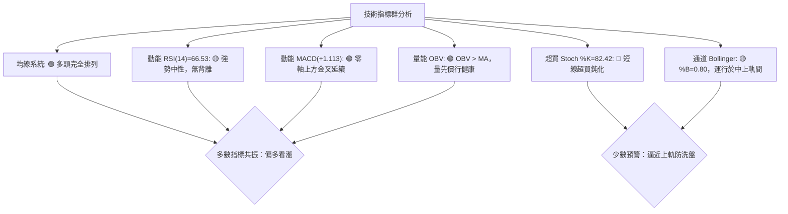

### 📈 移動平均線排列分析

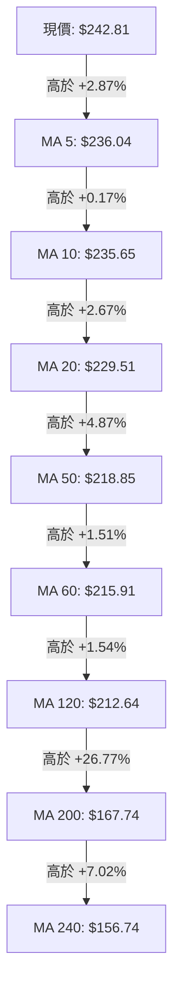

均線系統展現完美的**完全多頭排列 (Perfect Bullish Alignment)**：
- 短期至長期均線呈現精確的梯度排列（$236.04 > $235.65 > $229.51 > $218.85 > $215.91 > $212.64 > $167.74 > $156.74）。
- 現價 $242.81 站在所有均線之上，且所有天期的均線斜率全部向上翹頭。這種長天期與短天期無衝突的排列形態，為多方提供了多道厚實的動態回踩支撐。

### 📉 RSI(14) 分析

```
RSI(14) 當前水位: 66.53
0       20        40        60   66.53   80       100
├────────┼─────────┼─────────┼─────█───┼────────┤
[     極度超賣     ][   中性平衡帶   ][  強勢多頭  ][ 極度超買 ]
進度條: ██████████████████████████████░░░░░░░░░░ (66.53%)
```

- **數值定位**：RSI(14) 讀數為 **66.53**，精準進入 60–70 的強勢多方控盤區，既未低於 50 弱化，亦未突破 70 進入極端風險超買區。
- **背離檢驗**：
  - 價格近三週收盤價由 $223.54 → $237.33 → $242.81（走高）。
  - 週 RSI 由 56.7 → 54.7 → 66.53（同步走高）。
  - **結論**：日線與週線均**無頂背離現象**，指標與價格上漲步伐完全一致。

### 📊 MACD(12/26/9) 訊號解讀

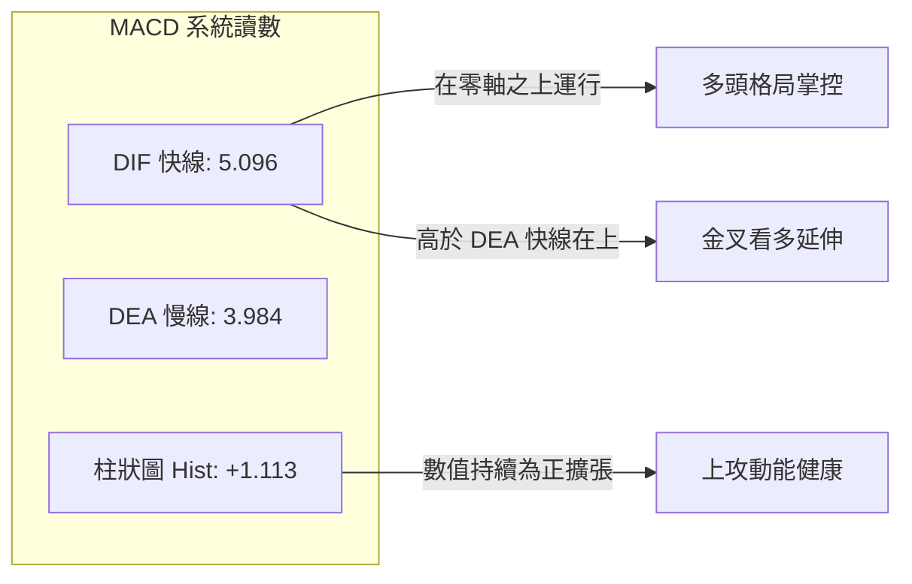

- **MACD 數值**：快線 DIF 為 **5.096**，慢線 DEA (Signal) 為 **3.984**，柱狀體 Hist 為 **+1.113**。
- **趨勢狀態**：DIF 運行於零軸之上（正向領域），且高於慢線，週線柱狀體亦由 9 月初的負值（-1.365）徹底翻紅擴張（+1.113）。
- **背離狀態**：柱狀體並未與股價產生背離，動能柱向上發散，顯示推升波段動能仍在良性釋放。

### 📦 布林通道分析

```
NBIS 日線布林通道結構示意圖
$251.69 ────────────────────────────────────────── BB 上軌 (阻力帶)
           ▲ 現價: $242.81 (%B = 0.80)
$229.51 ┄┄┄┄┄┄┄┄┄┄┄┄┄┄┄┄┄┄┄┄┄┄┄┄┄┄┄┄┄┄┄┄┄┄┄┄┄┄┄┄ BB 中軌 (MA20 強支撐)

$207.34 ────────────────────────────────────────── BB 下軌 (超賣反彈帶)
```

- **通道參數**：上軌 **$251.69**、中軌 (MA20) **$229.51**、下軌 **$207.34**。
- **帶寬與位置**：通道帶寬為 $44.35。當前 **%B 讀數為 0.80**，表明股價正強烈貼近上軌運行，反映出高度的短線買盤擁擠度。在 ADX < 25 的盤整結構中，%B 接觸 0.80–1.00 通常暗示短期存在回踩中軌 $229.51 的均值回歸拉力。

### 💹 成交量分析（量價配合度）

- **量比與均量對比**：
  - 最新日成交量：**12,239,100 股**。
  - 20 日均量：**15,605,480 股**（量比為 **0.78x**）。
  - 50 日均量：**20,573,044 股**。
- **量價健康度判定**：
  - 目前呈現「量縮價漲」的初階特徵，此現象在盤整區間內代表「籌碼沉澱穩定，浮額未大量拋售」，賣壓相對有限。
  - **警示條件**：若要一舉向上攻破 R1 ($254.74) 與斐波那契位 ($246.44)，日成交量必須迅速放大至 1,600 萬股以上（即重返 20 日均量之上）；否則若量能持續萎縮在 1,200 萬股以下，極易在上軌前出現量價力竭的小型拉回。
  - **OBV 趨勢**：數據明確顯示「OBV > MA → 量能支撐上漲」，大週期能量潮穩定在均線上方運行，總體資金仍處於累積淨流入階段。

---

## 6. 動能與波動率

### ⚡ 動能評估四象限


| 象限 | 動能維度 | 波動維度 | 歷史代表狀態 | NBIS 當前定位評估 |
|------|----------|----------|--------------|-------------------|
| **Q1** | 強 | 低 | 單邊慢牛上升通道 | 非此狀態 |
| **Q2** | 弱 | 低 | 窄幅箱體底部橫盤 | 2026-01 築底期 |
| **Q3** | **強** | **高** | **AI 爆發股 / 主升浪清洗** | **✓ 當前狀態 (ATR $15.08 + Beta 1.436，屬於進攻型高波動標的)** |
| **Q4** | 弱 | 高 | 恐慌崩跌與流動性枯竭 | 2026-07 探底 $177.71 階段 |

### 📊 ATR 波動率分析

- **ATR(14) 數值**：**$15.08**，換算佔當前股價之 **6.21%**。
- **波動特性解讀**：每日平均振幅超過 15 美元，顯示該標的具備極高的市場彈性與交易摩擦成本。日內微小的雜訊就可能引發 $5–$10 的洗盤。
- **止損與風控設置指引**：
  - 緊密波段止損 (1.0 × ATR)：距離現價 **$15.08**，對應點位約 $227.73（剛好覆蓋 MA20 $229.51 下方）。
  - 標準寬鬆止損 (1.5 × ATR)：距離現價 **$22.62**，對應點位約 $220.19（剛好覆蓋 MA50 $218.85 關鍵生命線）。

### 📐 Beta 與市場相關性

- **Beta 係數**：**1.436**。
- **市場敏感度評估**：NBIS 對基準指數（S&P 500 / NASDAQ）具備 1.436 倍的高彈性放大效應。在大盤走多或科技股風險偏好（Risk-On）回升時，NBIS 具備大幅超越大盤（Alpha 跑贏）的能力；相反地，若大盤出現系統性調整，NBIS 的回調壓力將顯著高於平均。

---

## 7. 多時框架總結

### 📋 時框架評分表

| 時框架 | 趨勢方向 | 動能指標 | 均線排列 | 圖表形態 | 綜合評分 | 交易指導建議 |
|--------|----------|----------|----------|----------|----------|--------------|
| **月線 (長線)** | 🟢 強勢上升 | 🟢 RSI > 60 | 🟢 遠在 MA200 上方 | 歷史牛市初中期震盪 | **85/100** | 長線多單底倉堅定續抱 |
| **週線 (中線)** | 🟢 多頭重啟 | 🟢 MACD 翻紅 | 🟢 站穩各週均線 | 大箱體 W 底右側推升 | **75/100** | 中線尋求回踩回調分批加碼 |
| **日線 (短線)** | 🟡 震盪偏多 | 🟡 ADX=15/KD 超買 | 🟢 完全多頭排列 | 逼近布林上軌與 R1 | **65/100** | 避免追高，等待短線均線回踩 |

### 🔲 綜合訊號矩陣

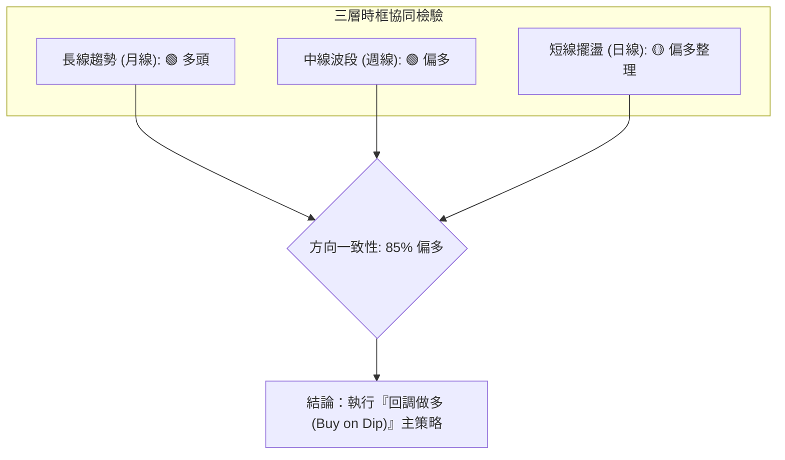

### ⚖️ 多時框收斂結論

依據多時框收斂規則嚴格裁定：
1. **行情性質判定**：當前 ADX(14) 讀數為 **15.08 (< 25)**，明確定義為**盤整/寬幅區間行情**。
2. **多時框主導權分配**：
   - 由於處於非單邊強趨勢的震盪市，日線交易區間以**布林通道上下軌 ($207.34 - $251.69)** 為核心參考邊界。
   - 然而，由於長線與週線多頭結構完好（MA20>MA50>MA200 完全多頭排列，且週 MACD 翻紅），長週期方向對短週期具備絕對支撐力。
3. **唯一方向性結論**：**【偏多震盪 — 回踩支撐做多】**。
   - 堅決排除高檔追突破操作（因 ADX 弱且 KD 處於 82.42 超買區）。
   - 交易優選在股價拉回日線布林中軌 MA20 ($229.51) 至波段支撐 S1 ($203.87) 區間內分批吸納。

---

## 8. 交易策略建議

### 🗺️ 策略決策流程圖

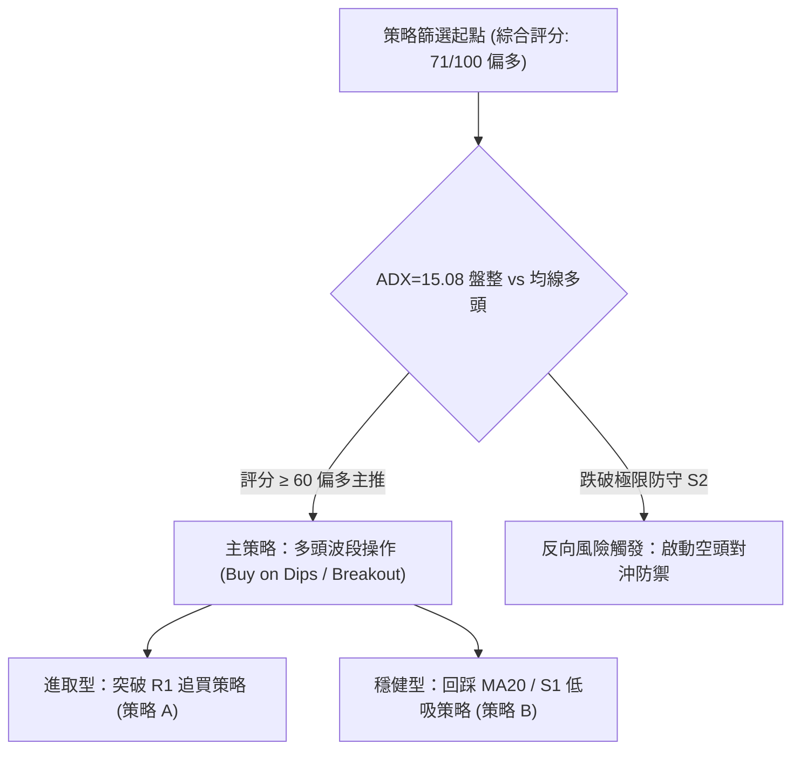

### 🧭 策略路由（依評分卡分流）

> **當前主策略方向 = 【主推多頭策略】（依據第 1 章技術綜合評分 71/100 偏多裁定）**

空頭不作為主推交易方向，僅於下方列出「反轉風險觸發點」，作為多頭多單出場與減倉之對沖警示。

### 🎯 價格情境階梯（Price Scenarios）

所有價位均嚴格引用第 4 章波段聚類及關鍵數據：

| 觸發條件 | 下一目標 | 後續延伸 | 情境含義與操作指引 |
|----------|----------|----------|--------------------|
| **帶量突破 R1 $254.74** | **R2 $279.83** | **R3 $299.86** | 短線轉強加速，向上挑戰 52 週歷史高點區間 |
| **站穩現價 $242.81 震盪** | **斐波 23.6% $246.44** | **布林上軌 $251.69** | 消化短線 KD 超買浮額，維持多頭箱體蓄勢 |
| **有效跌破 S1 $203.87** | **S2 $200.30** | **S3 $194.80** | 中期結構弱化，回測大週期牛熊分界線與均線 |

### 📊 情境機率分佈

```
情境機率分佈柱狀圖:
[繼續上行突破] ████████████████████████░░░░░░ 60%
[區間震盪蓄勢] ████████████░░░░░░░░░░░░░░░░░░ 30%
[破位下探再測] ████░░░░░░░░░░░░░░░░░░░░░░░░░░ 10%
```

| 情境類別 | 機率估計 | 主要技術指標支撐依據 |
|----------|----------|----------------------|
| **情境一：繼續上行突破** | **60%** | 均線系統多頭完全排列，MACD 翻紅且柱狀體 (+1.113) 擴張，OBV > MA 量能充沛 |
| **情境二：寬幅區間震盪** | **30%** | ADX(14) 僅 15.08，動能不足以支持單邊直線暴漲，Stoch %K 處於 82.42 超買區 |
| **情境三：深度回落探底** | **10%** | 僅在失守 MA50 ($218.85) 及 S1 ($203.87) 方能成立，目前機率極低 |

### 🟢 主策略詳情（方向依上方路由）

所有關鍵點位嚴格對齊波段計算數值：

| 策略要素 | 策略 A（右側順勢突破型） | 策略 B（左側回調低吸型 — ⭐最優推薦） |
|----------|--------------------------|---------------------------------------|
| **進場條件** | 日 K 線實體收盤**帶量突破 R1 $254.74** | 股價回踩日線 **MA20 均線附近支撐** |
| **進場價格** | **$254.74** | **$229.51** (可於 $229.51–$232.00 區間掛單) |
| **目標價 T1** | **$279.83** (阻力 R2) | **$254.74** (阻力 R1) |
| **目標價 T2** | **$299.86** (阻力 R3 / 52W 高點) | **$279.83** (阻力 R2) |
| **止損價格** | **$239.66** (跌破 1.0×ATR，距進場 $15.08) | **$214.43** (跌破 1.0×ATR，涵蓋 MA50 $218.85) |
| **風險報酬比** | **1 : 1.66** (至 T1) / **1 : 2.99** (至 T2) | **$25.23 風險 / $25.23 報酬 = 1 : 1.0** (至 T1)<br>**$25.23 風險 / $50.32 報酬 = 1 : 1.99** (至 T2) |
| **成功機率** | **55%** | **70%** |
| **建議倉位** | 總資產 **10% - 15%** | 總資產 **15% - 25%** |

### 🔴 反向風險觸發點（對沖提示）

- **多單離場觸發價**：**$218.85**（MA50 生命線），一旦日線收盤確認跌破，所有短線波段多單必須無條件止損出局。
- **全面翻空對沖點**：**$200.30**（支撐 S2），若此處跌破，確認中期 W 底形態失效，多頭將轉入深幅回調，可啟動反向空頭對沖操作，下看支撐 S3 **$194.80** 及斐波那契 50.0% 水平 **$186.69**。

### ⭐ 整體訊號強度評星

```
做多訊號強度：★★★★☆  (4/5星 — 均線與多時框多頭，唯受限於短線超買)
做空訊號強度：★☆☆☆☆  (1/5星 — 空頭無持續量能，僅有技術性超買回洗)
整體可信度：  ★★★★☆  (4/5星 — 數據高度吻合，形態與指標相互印證)
```

---

## 9. 風險提示與監控

### ✅ 關鍵監控指標 Checklist

```
╔══════════════════════════════════════════════════════════════════╗
║                     關鍵技術監控 CHECKLIST                       ║
╠══════════════════════════════════════════════════════════════════╣
║ [ ] 1. 突破量能確認：突破 $254.74 時日量是否 > 1,560 萬股 (20日均量)║
║ [ ] 2. 布林上軌壓制：注意股價觸及 $251.69 是否收長上影線        ║
║ [ ] 3. KD 高檔鈍化：觀察 Stoch %K(82.42) 是否向下跌破 %D 形成死叉 ║
║ [ ] 4. 關鍵支撐捍衛：每日檢視收盤是否穩守 MA20 ($229.51)        ║
║ [ ] 5. 空頭平倉壓力：空單浮額達 19.8%，留意軋空行情 (Short Squeeze)║
╚══════════════════════════════════════════════════════════════════╝
```

### ⚠️ 風險場景分析

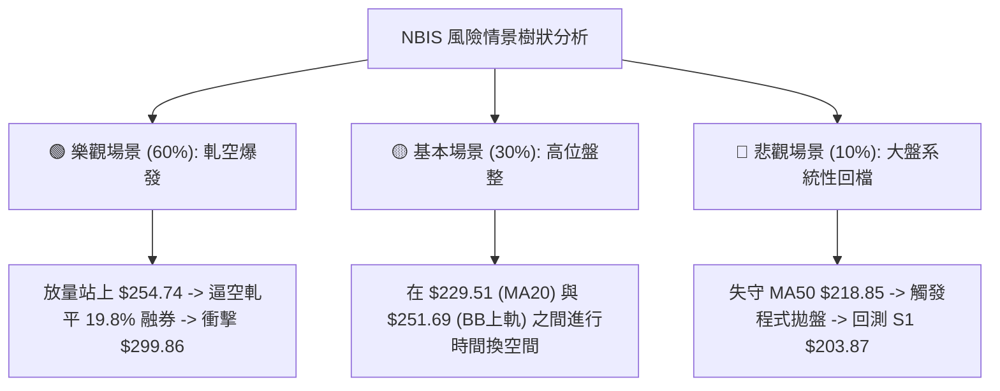

### 🛡️ 風險管理重要提醒

1. **高空單比例與軋空風險 (Short Squeeze)**：
   NBIS 目前融券放空佔浮動股比例（Short % Float）高達 **19.8%**，Short Ratio 達 **2.76** 天。在基本面營收爆發式成長（YoY +454%）與技術面均線完全多頭的背景下，高額空單存在極高的被動回補風險。一旦價格突破阻力 R1 **$254.74**，極易引發劇烈的連鎖軋空行情。
2. **高波動率 (ATR $15.08) 與槓桿控制**：
   每日波幅超過 6%，任何使用高槓桿（如選擇權買方或融資）的投資人均面臨極高的洗盤震盪風險。務必將單筆交易風險敞口嚴格控制在總投資組合淨值的 **1.5% - 2.0%** 以內。
3. **估值與基本面分歧**：
   當前本益比高達 189.7 倍，且自由現金流為負（$-9.61B）。技術面雖處強勢多頭，但若科技板塊整體估值面臨重估，其高 Beta (1.436) 特性可能放大跌幅。因此技術面止損位必須機械化執行，絕不可將短線交易凹單轉為長線套牢。

---

## 📋 報告總結

```
NBIS 技術分析報告總結
════════════════════════════════════════════════════════
報告日期：2026-10-05
當前價格：$242.81
分析評級：🟢 偏多波段 (Buy on Dips)

關鍵結論：
├─ 長期趨勢：🟢 強勢多頭 (站穩 MA200 $167.74 之上，均線完整多頭排列)
├─ 中期趨勢：🟢 震盪轉強 (週線連二紅，MACD 翻紅 +1.113，W底成形)
├─ 短期趨勢：🟡 偏多蓄勢 (受制於 BB 上軌 $251.69 與 R1 $254.74，KD 超買)
├─ 關鍵支撐：S1: $203.87 / MA20: $229.51
├─ 關鍵阻力：R1: $254.74 / R2: $279.83
└─ 分析師目標：共識均價 $283.58 (高達 $415.00)

最優策略組合：
1. 🥇 最佳機會：策略 B — 逢回踩日線 MA20 ($229.51) 分批低吸佈局多單
2. 🥈 次選機會：策略 A — 帶量確認突破 R1 ($254.74) 順勢追多看至 R2 ($279.83)
3. 🥉 保守選擇：等待股價於 $229.51 - $251.69 通道消化超買鈍化後再進場
════════════════════════════════════════════════════════
```

---

> ⚠️ **免責聲明**：本報告為 AI 自動生成之技術分析，所有數據及估算均基於提供的歷史價格資訊。本報告**僅供研究與學術參考**，**不構成任何投資建議**。投資有風險，入市需謹慎。

---

*報告生成時間：2026-10-05 ｜ 數據來源：Yahoo Finance ｜ 分析框架：多時框技術分析*