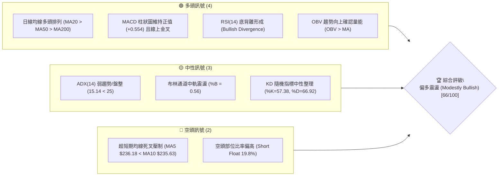
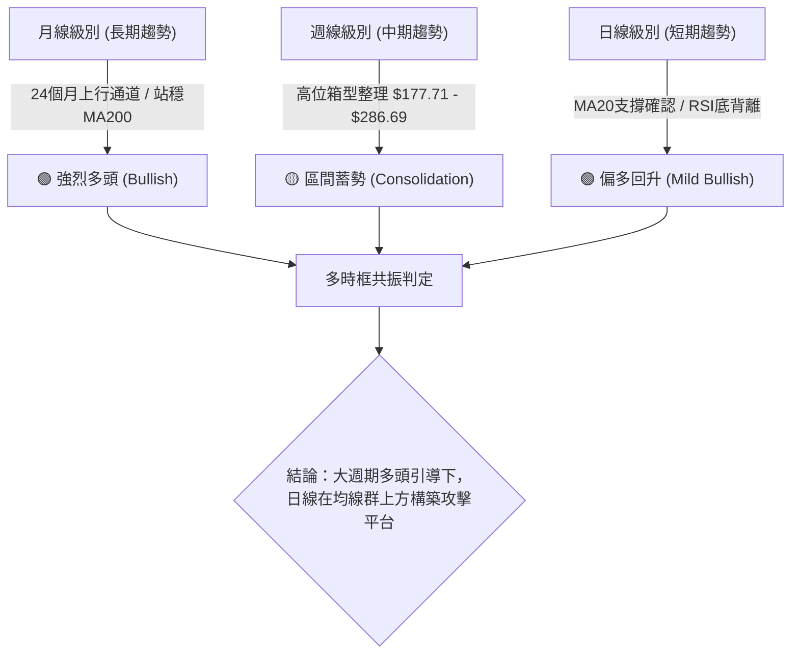
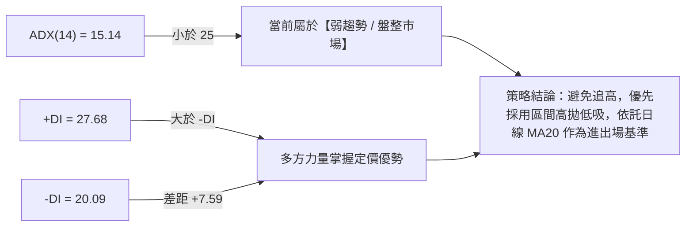
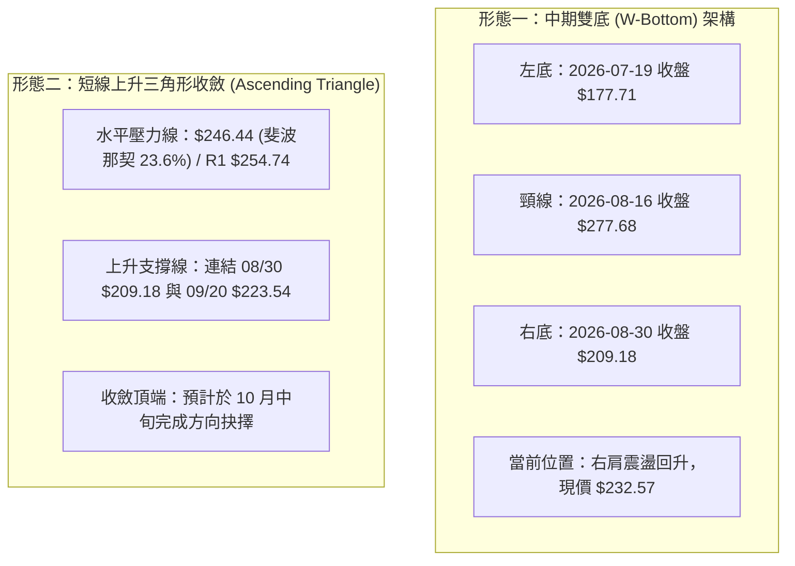
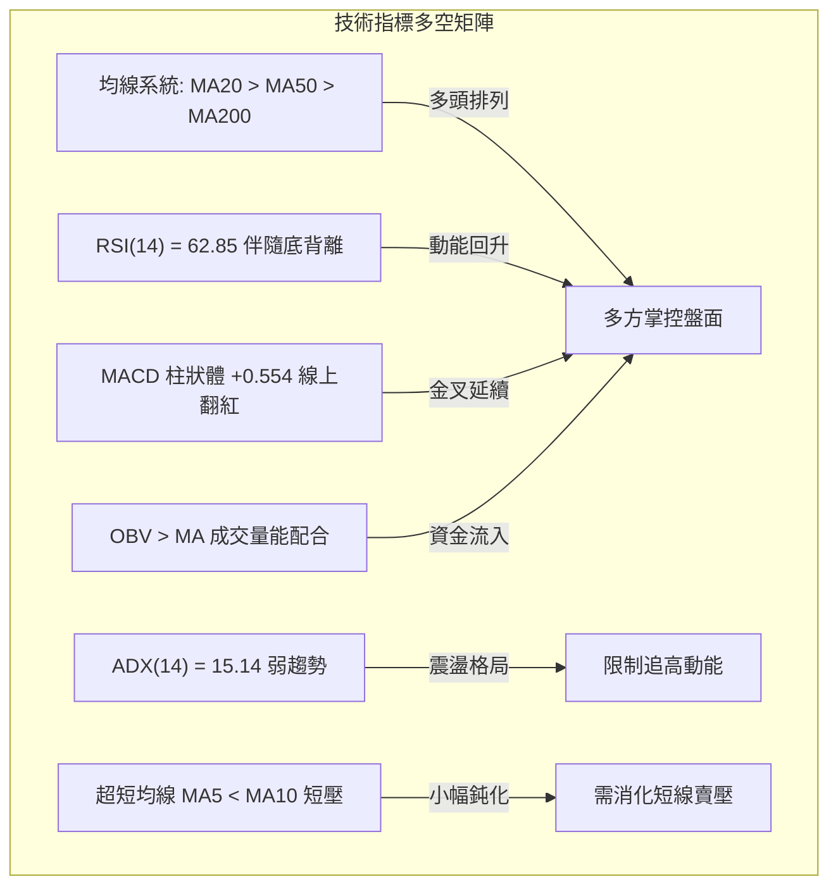
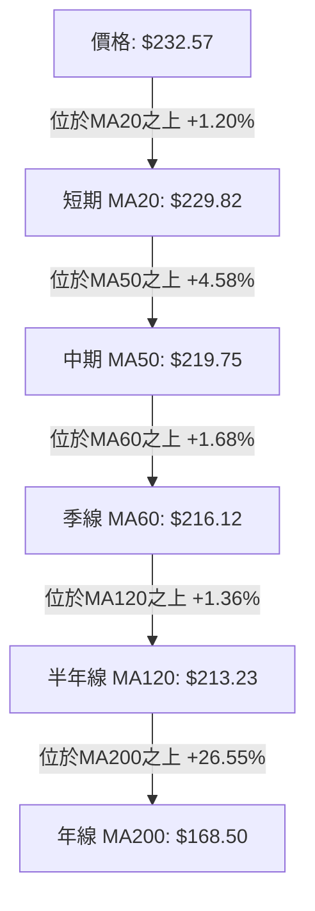
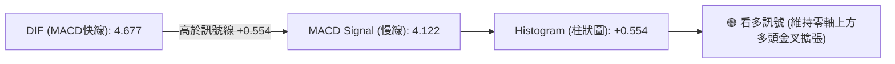
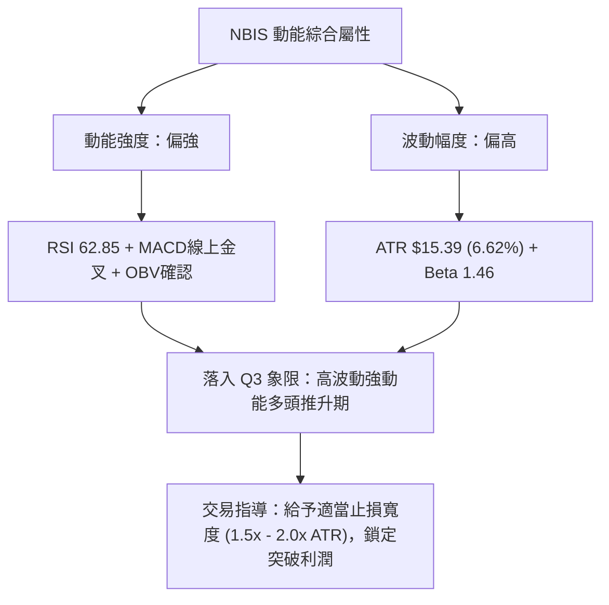
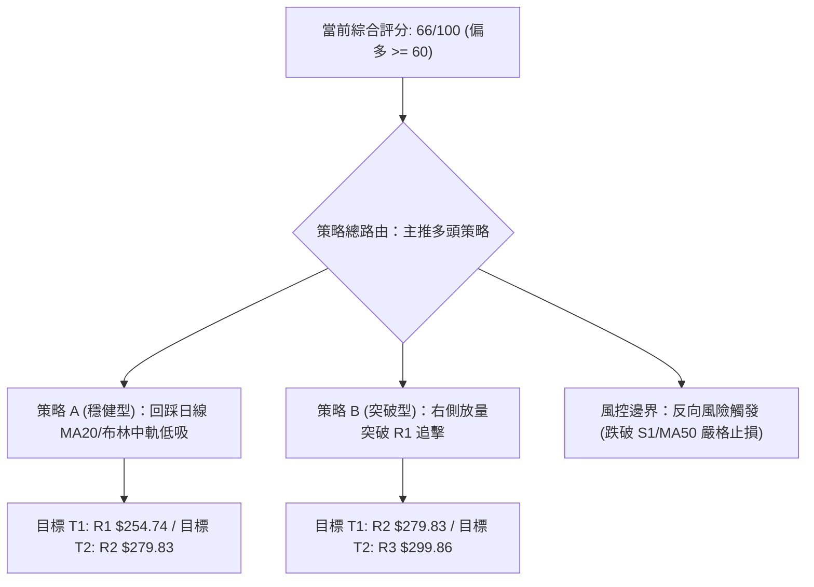
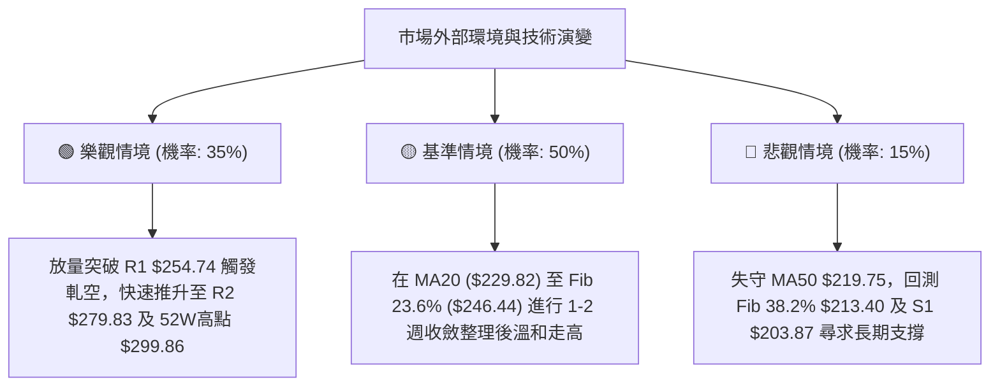

# NBIS 技術分析報告

> **報告日期**：2026-10-06 ｜ **語言**：繁體中文 ｜ **數據來源**：Yahoo Finance ｜ **當前價格**：$232.57

---

## 目錄

| 章節 | 內容 |
|------|------|
| [1. 技術面概覽](#1-技術面概覽) | 訊號儀表板、核心指標、評分卡 |
| [2. 趨勢分析](#2-趨勢分析) | 多時框趨勢、長中短期走勢、ADX 趨勢強度 |
| [3. 圖表形態分析](#3-圖表形態分析) | 形態識別信心度、K線組合、目標價計算 |
| [4. 支撐與阻力](#4-支撐與阻力) | 關鍵價位分佈、阻力/支撐分析、斐波那契回調 |
| [5. 技術指標深度解讀](#5-技術指標深度解讀) | 均線系統、RSI 底背離、MACD、布林通道、OBV 量能 |
| [6. 動能與波動率](#6-動能與波動率) | 動能四象限、ATR 波動率與止損、Beta 敏感度 |
| [7. 多時框架總結](#7-多時框架總結) | 時框架評分矩陣、多時框收斂定調 |
| [8. 交易策略建議](#8-交易策略建議) | 策略路由、價格情境階梯、主策略與風控 |
| [9. 風險提示與監控](#9-風險提示與監控) | 監控指標清單、三情境演變、部位管理守則 |
| [報告總結](#-報告總結) | 核心結論與執行綱領 |

---

## 1. 技術面概覽

### 🎯 技術訊號儀表板



### 📊 核心指標速覽表

| 指標類別 | 指標名稱 | 當前數值 | 訊號 | 解讀 |
|:---|:---|:---|:---:|:---|
| **價格** | 現價收盤 | $232.57 | 🟢 | 站穩中長期所有關鍵均線（MA20/50/200）之上 |
| **均線** | 短期 MA20 | $229.82 | 🟢 | 現價高於 MA20 (+1.20%)，短線支撐形成 |
| **均線** | 中期 MA50 | $219.75 | 🟢 | 現價高於 MA50 (+5.83%)，中期多頭結構穩固 |
| **均線** | 長期 MA200 | $168.50 | 🟢 | 現價高於 MA200 (+38.02%)，長期多頭牛市架構明確 |
| **動能** | RSI(14) | 62.85 | 🟢 | 位於強勢健康區間，且帶有明確的日線底背離訊號 |
| **動能** | MACD (12,26,9) | 4.677 / 4.122 | 🟢 | 快線位於慢線上方，柱狀圖 +0.554 延續多頭擴張 |
| **震盪** | KD (9,3,3) | 57.38 / 66.92 | 🟡 | 位於中間偏強區域，%K 略低於 %D 呈現短線技術修正 |
| **趨勢** | ADX(14) | 15.14 | 🟡 | 數值低於 25，顯示當前非單邊強趨勢，屬區間偏多整理 |
| **通道** | 布林帶軌道 | $207.66 ~ $251.99 | 🟡 | %B 為 0.56，價格居於中軌 ($229.82) 之上強勢側 |
| **量能** | OBV 與日成交量 | 14,998,400 股 | 🟢 | OBV > MA 表明資金持續累積，量能有效支撐漲勢 |
| **波動** | ATR(14) | $15.39 | 🔴 | 波動佔股價 6.62%，日級別震盪幅度較大，需寬止損 |

### 🏆 技術評分卡

```
╔══════════════════════════════════════════════════════════════╗
║              技術評分卡 — NBIS (2026-10-06)                  ║
╠══════════════════════════════════════════════════════════════╣
║ 趨勢強度 (ADX=15.14/DI多頭)  ████████░░░░░░░░░░░░  40/100 🟡 ║
║ 動能指標 (RSI=62.9/底背離)   ██████████████░░░░░░  72/100 🟢 ║
║ 均線排列 (MA20>MA50>MA200)   ████████████████░░░░  80/100 🟢 ║
║ 量能確認 (OBV>MA/量比0.96x)  ██████████████░░░░░░  70/100 🟢 ║
║ 支撐穩定度 (MA20/S1防線)     ██████████████░░░░░░  70/100 🟢 ║
║ 形態完整度 (雙重底演化中)    ██████████████░░░░░░  68/100 🟢 ║
╠══════════════════════════════════════════════════════════════╣
║ 綜合評分 (加權計算)          █████████████░░░░░░░  66/100 🟢 ║
║ 評級結論：【偏多整理／區間向上蓄勢】                        ║
╚══════════════════════════════════════════════════════════════╝
```

---

## 2. 趨勢分析

### 🌐 多時框趨勢分析



### 📈 長期趨勢 — 12個月走勢圖（Unicode）

NBIS 在過去一年經歷了爆發性主升段（自 2025 年 10 月的 $130.82 升至 2026 年 6 月創下 52 週高點 $299.86，月收盤達 $276.17），隨後於 2026 年 7 月快速回踩至 $177.71 區域（月收盤 $190.41），目前處於右側震盪回升結構。

```
NBIS 月線走勢圖（過去12個月：2025-11 至 2026-10）
價格軸 ($)
$300 ┤                                        
$276 ┤                                  ●(06月峰值 $276.17)
$240 ┤                             ●(05月)          ●(09月 $235.88)
$232 ┤━━━━━━━━━━━━━━━━━━━━━━━━━━━━━━━━━━━━━━━━━━━━━●← 現價 ($232.57)
$206 ┤                                         ●(08月)
$190 ┤                                     ●(07月探底 $190.41)
$138 ┤                        ●(04月)
$103 ┤                   ●(03月)
$94  ┤●(11月 $94.87) ●(02月 $91.19)
$83  ┤    ●(12月 $83.71) ●(01月 $85.19)
     └──────────────────────────────────────────────────────────
       11   12   01   02   03   04   05   06   07   08   09   10  (月份)
```

**走勢特徵分析表格**：

| 階段區間 | 時間跨度 | 起迄價位 | 漲跌幅 | 走勢特徵解讀 |
|:---|:---|:---|:---:|:---|
| **一階段：築底蓄勢** | 2025/11 - 2026/02 | $94.87 → $91.19 | -3.88% | 於 $83-$94 區間窄幅整理，籌碼充分換手完成 |
| **二階段：主升爆發** | 2026/03 - 2026/06 | $103.76 → $276.17 | +166.16% | 月線量能放大，突破百元關卡後連續垂直拉升創歷史高位 |
| **三階段：深幅洗盤** | 2026/06 - 2026/07 | $276.17 → $190.41 | -31.05% | 短線獲利回吐，快速回撤考驗中期支撐平台（探底 $177.71） |
| **四階段：震盪回升** | 2026/08 - 2026/10 | $190.41 → $232.57 | +22.14% | 底背離帶動反彈，站回 MA20/MA50 上方，形成均線多頭收斂 |

### 📊 中期趨勢（週線分析）

從近 20 週收盤走勢觀察，價格於 2026-07-19 探至低點 $177.71，隨後於 2026-08-16 伴隨 1.67 億股的爆量長陽線直接抽升至收盤 $277.68。儘管隨後兩週拉回整理，但 9 月至今週線低點依序抬高（$209.18 → $223.54 → $232.57），呈現穩健的高底（Higher Low）墊高格局。

```
週線級別價格震盪帶示意圖：
[阻力邊界] ── $279.83 (R2 波段強阻力) ──────┬─ 2026-08 衝高受阻位
                                            │
[多空樞紐] ── $246.44 (斐波那契 23.6%) ─────┴─ 10/04 當週最高 $242.81 遇阻回落
    ▲
現價 $232.57 ── (位於中軌上方，依託 MA20 $229.82 進行整固)
    ▼
[強支撐帶] ── $213.40 (斐波那契 38.2%) ─────┬─ 09月整理平臺下沿
[波段底線] ── $203.87 (S1 波段支撐位) ──────┴─ 中期多空生命線
```

### ⚡ 趨勢強度評估（ADX 解讀）



| 指標名稱 | 當前數值 | 門檻區間 | 當前市場狀態判定 |
|:---|:---:|:---:|:---|
| **ADX (14)** | **15.14** | < 25 (盤整) / > 25 (趨勢) | **非單邊趨勢，處於蓄勢震盪期**。波動收斂，暗示正在醞釀下一波破局行情。 |
| **+DI** | **27.68** | 高於 20 偏多 | **多頭主導**。買盤推進力道高於空頭賣壓。 |
| **-DI** | **20.09** | 低於 25 屬受控 | **空頭壓制偏弱**。近期空方拋壓明顯減輕。 |

---

## 3. 圖表形態分析

### 🔍 形態識別系統

依據近 20 週與近兩年 OHLCV 軌跡，當前盤面主要具備兩大形態結構：



**形態信心度與目標價計算表**（依規則 13 & 15）：

| 形態名稱 | 信心度 | 判斷依據（引用數據） | 完成度 | 目標價（附嚴謹計算式） |
|:---|:---:|:---|:---:|:---|
| **中期雙重底 (W-Bottom)** | **70%** | 左底 07/19 收盤 $177.71，右底 08/30 收盤 $209.18（高於左底形成 Higher Low），受支撐區 S1 $203.87 守護。 | 60% | 待放量突破頸線 $277.68。形態高度 = $277.68 - $177.71 = $99.97。理論測幅目標價 = $277.68 + $99.97 = **$377.65**（中長期推算）。 |
| **短期上升三角整理** | **65%** | 底部低點墊高（$209.18 → $223.54 → $229.82 MA20），上方受壓於 R1 $254.74。日線 ADX=15.14 確認處於收斂。 | 75% | 形態高度 = $254.74 - $209.18 = $45.56。短線突破目標價 = $254.74 + $45.56 = **$300.30**（與 52W 高點 $299.86 極度共振）。 |

### 🕯️ 重要K線形態分析

| 週期/月份 | 收盤價 | 識別 K 線形態 | 專業解讀 | 訊號 |
|:---|:---:|:---|:---|:---:|
| **2026-07 週線** | $177.71 | **長下影錘頭破底線 (Hammer)** | 爆量下探 $177.71 隨即引發主力機構逢低承接，形成波段絕對低點。 | 🟢 |
| **2026-08 週線** | $277.68 | **爆量光頭長陽線 (Bullish Marubozu)** | 週量 1.67 億股創近期新高，多頭展現毀滅性反撲，收復前月跌幅。 | 🟢 |
| **2026-09-27 週** | $237.33 | **穿透長陽線 (Piercing Line)** | 突破 MA20 壓制，帶動 MACD 柱狀圖由負翻正 (+1.971)。 | 🟢 |
| **2026-10-04 週** | $242.81 | **高位流星十字線 (Shooting Star)** | 上攻逼近斐波那契 23.6% ($246.44) 遇阻，留下影線回檔整理。 | 🟡 |
| **2026-10-11 本週** | $232.57 | **縮量陰線十字 (Doji/Consolidation)** | 回測 MA20 ($229.82) 尋求支撐，量能萎縮至 1,499 萬股，典型回抽整固。 | 🟡 |

### 📉 ASCII 走勢形態示意圖

```
NBIS 中短期走勢架構示意（雙底右側延伸三角形整理）
價格 ($)
$279.83 ┤                 ● (頸線壓力區間 R2: $277.68 - $279.83)
        │                / \
$254.74 ┤───────────────/───\─────● (三角形上軌水平阻力 R1: $254.74)
        │              /     \   / \
$232.57 ┤─────────────/───────\─/───●← 現價 ($232.57，守於 MA20 $229.82)
        │            /         ●   /  (右肩墊高 $223.54)
$209.18 ┤           /           ● (右底 $209.18)
        │          /              (上升趨勢支撐線)
$177.71 ┤         ● (左底 $177.71)
        └───────────────────────────────────────────────
               07月       08月        09月        10月
```

### 🎯 形態目標價計算

1. **短期三角形突破目標**：
   - 上軌阻力線：$254.74（R1）
   - 三角形起點低點：$209.18（2026-08-30 收盤）
   - 垂直高度 $H_1 = 254.74 - 209.18 = 45.56$
   - **目標價 1** = $254.74 + 45.56 = \mathbf{\$300.30}$（高度吻合 52W 高點 $299.86）。
2. **中期 W 底完全測幅目標**：
   - 頸線位置：$277.68
   - 底部最低點：$177.71
   - 垂直高度 $H_2 = 277.68 - 177.71 = 99.97$
   - **目標價 2** = $277.68 + 99.97 = \mathbf{\$377.65}$（逼近分析師最高目標價 $415.00）。

---

## 4. 支撐與阻力

### 🗺️ 關鍵價位分布圖（Unicode）

```
NBIS 關鍵價位結構分佈圖（由 OHLCV 與斐波那契精確計算）
═════════════════════════════════════════════════════════════════
$299.86 ║████████████████████████████████████████║ 強阻力 R3 / 52W高點 / Fib 0.0%
$279.83 ║██████████████████████████████░░░░░░░░░░║ 強阻力 R2 / 08月波段高點聚類
$254.74 ║████████████████████░░░░░░░░░░░░░░░░░░░░║ 關鍵阻力 R1 (距現價 +9.53%)
$246.44 ║▓▓▓▓▓▓▓▓▓▓▓▓▓▓▓▓░░░░░░░░░░░░░░░░░░░░░░░║ 斐波那契 23.6% 回調位
────────╫────────────────────────────────────────╢
$232.57 ╠════════════════════════════════════════╣ ◄ 當前市價 ($232.57)
────────╫────────────────────────────────────────╢
$229.82 ║▒▒▒▒▒▒▒▒▒▒▒▒▒▒▒▒▒▒▒▒▒▒▒▒▒▒▒▒▒▒▒▒▒▒░░░░░░║ 短期動態支撐 (日線 MA20)
$219.75 ║▒▒▒▒▒▒▒▒▒▒▒▒▒▒▒▒▒▒▒▒▒▒▒▒▒▒▒▒▒▒░░░░░░░░░░║ 中期多空分水嶺 (日線 MA50)
$213.40 ║▓▓▓▓▓▓▓▓▓▓▓▓▓▓▓▓▓▓▓▓▓▓▓▓▓▓░░░░░░░░░░░░░░║ 斐波那契 38.2% 回調位
$203.87 ║██████████████████████████████░░░░░░░░░░║ 核心支撐 S1 (距現價 -12.34%)
$200.30 ║████████████████████████████████░░░░░░░░║ 整數心理支撐 S2 (距現價 -13.88%)
$194.80 ║████████████████████████████████████░░░░║ 深度回撤防線 S3 (距現價 -16.24%)
$186.69 ║▓▓▓▓▓▓▓▓▓▓▓▓▓▓▓▓▓▓▓▓▓▓▓▓▓▓▓▓▓▓▓▓▓▓▓▓░░░░║ 斐波那契 50.0% 回調位
$168.50 ║████████████████████████████████████████║ 牛熊生死線 (日線 MA200)
═════════════════════════════════════════════════════════════════
```

### 🚧 阻力位分析表

所有阻力數值完全依據數據源之波段高點聚類與斐波那契回調位：

| 阻力級別 | 精確價位 | 距現價幅差 | 形成技術原因 | 突破難度 | 重要性等級 |
|:---|:---:|:---:|:---|:---:|:---:|
| **R1** | **$254.74** | +9.53% | 近一年日線級別波段反彈高點聚類區，與布林上軌 ($251.99) 及 Fib 23.6% ($246.44) 形成共振壓制帶。 | 🟡 中等 | ★★★★☆ |
| **R2** | **$279.83** | +20.32% | 2026-08-16 週線收盤峰值 ($277.68) 與波段高點聚類，為空頭套牢盤密集重災區。 | 🔴 較高 | ★★★★★ |
| **R3** | **$299.86** | +28.93% | 52 週歷史高點，斐波那契 0.0% 終極阻力，突破即創歷史新高。 | 🔴 極高 | ★★★★★ |

### 🛡️ 支撐位分析表

所有支撐數值完全依據數據源之波段低點聚類與均線支撐：

| 支撐級別 | 精確價位 | 距現價幅差 | 形成技術原因 | 守住機率 | 重要性等級 |
|:---|:---:|:---:|:---|:---:|:---:|
| **動態支撐** | **$229.82** | -1.18% | 日線 MA20 與布林中軌，短期多頭防線。現價正在其上方進行回抽確認。 | 80% | ★★★☆☆ |
| **S1** | **$203.87** | -12.34% | 近一年波段低點聚類強支撐，緊鄰 Fib 38.2% ($213.40) 與日線 MA60 ($216.12)。 | 75% | ★★★★☆ |
| **S2** | **$200.30** | -13.88% | 200 元整數重大心理關卡，波段次級防守樞紐。 | 85% | ★★★★★ |
| **S3** | **$194.80** | -16.24% | 2026-07 探底回升的中樞支撐區，跌破將引發波段格局破位風險。 | 90% | ★★★★☆ |

### 📐 斐波那契回調位分析

依據 52 週完整波動區間（低點 **$73.52** 至 高點 **$299.86**，全區間跨度 $226.34）計算：

| 斐波那契水平 | 精確點位 | 當前相對位置與技術意義 |
|:---:|:---:|:---|
| **0.0% (52W High)** | **$299.86** | 歷史頂部壓力 |
| **23.6%** | **$246.44** | **上方首要壓力位**。現價（$232.57）正處於向該位置發起挑戰的路徑上。 |
| **38.2%** | **$213.40** | **下方強支撐位**。與 MA60 ($216.12) 及 MA50 ($219.75) 構成多頭複合堡壘。 |
| **50.0%** | **$186.69** | 中期強弱分水嶺。7 月底探底收盤即守於此線之上 ($187.77/$190.41)。 |
| **61.8%** | **$159.98** | 黃金分割防守位。接近 MA200 ($168.50) 及 MA240 ($157.26)。 |
| **78.6%** | **$121.96** | 深度回撤位（數據中未觸及此區域）。 |
| **100.0% (52W Low)**| **$73.52** | 52 週最低點，原始起漲基石。 |

**位置解讀**：現價 **$232.57** 精確運行於 **23.6% ($246.44)** 與 **38.2% ($213.40)** 兩大黃金分割位之間。這表明股價在經歷強勢回調後，守住了最為強勢的 38.2% 回撤帶，屬於典型的「多頭強勢區間整理」。

---

## 5. 技術指標深度解讀

### 🎛️ 指標訊號總覽



### 📈 移動平均線排列分析

NBIS 當前展現出非常經典的標準**多頭排列結構**：



- **超短期均線**：MA5 ($236.18) 略低於 MA10 ($235.63)，且現價微幅壓在 MA5 之下 (-1.53%)，顯示過去一週面臨小幅技術性回踩。
- **中長期均線**：MA20 ($229.82) > MA50 ($219.75) > MA200 ($168.50)，長線「黃金交叉」穩固無虞，MA200 年線正以極大角度向上傾斜 (+47.89% 相較 MA240)，奠定大週期牛市防線。

### 📉 RSI(14) 分析

```
RSI(14) 當前水平：62.85
0       20        40        60   62.85 70        80       100
├────────┼─────────┼─────────┼─────▲───┼─────────┼────────┤
[     極度超賣     ]       [  健康擴張  ] [  超買區間  ]
```

- **數值強度**：RSI 位於 **62.85**，處於 50 至 70 之間的最健康多頭擴張區，既未進入 70 以上的超買過熱區，又顯著強於 50 的多空平衡線。
- **背離判斷**：日線數據明確警示 **「⚠️ 底背離 (Bullish Divergence)」**。在前期價格下探回測支撐時，RSI 率先打出 Higher Low（回顧週線 RSI 從 07/12 的 32.2 抬升至當前的 62.85），該訊號通常預示著空頭動能枯竭，多頭正隱蔽性蓄勢，為股價提供強勁的向上反彈慣性。

### 📊 MACD(12,26,9) 訊號解讀



MACD 快線（4.677）與慢線（4.122）雙雙運行於零軸之上，且 Histogram 柱狀圖讀數為 **+0.554**，保持多頭正向擴張。週線數據同樣印證 MACD 柱在經歷 7 月的深幅負值（最低 -7.680）後，9 月底全面重返正值區（+1.971、+1.113、+0.554），確立了中期波段多頭回歸的有效性。

### 📦 布林通道分析

```
布林帶軌道結構 (20日, 2倍標準差)
$251.99 ──────────────────────────────────────── 上軌 (通道頂部阻力)
                     
$232.57 ───────────● 現價 (處於中上軌強勢通道, %B = 0.56)
$229.82 ┄┄┄┄┄┄┄┄┄┄┄┄┄┄┄┄┄┄┄┄┄┄┄┄┄┄┄┄┄┄┄┄┄┄┄┄┄ 中軌 (MA20 動態均線支撐)
                     
$207.66 ──────────────────────────────────────── 下軌 (通道底部極限防禦)
```

- **帶寬與位置**：通道上軌為 **$251.99**，下軌為 **$207.66**，通道寬度為 $44.33。
- **%B 指標解讀**：當前 **%B = 0.56**。數值略大於 0.50，證明股價穩穩運行於布林中軌（MA20 $229.82）之上，屬於標準的多頭通道運行，未見開口過度發散，有利於延續「步步為營」的震盪攀升格局。

### 💹 成交量分析（量價配合度）

- **量比與均量**：最新成交量為 **14,998,400 股**，相較 20 日均量（15,608,330 股）之量比為 **0.96x**，呈現量縮整理。相較 50 日均量（20,391,692 股），量能顯著收斂。
- **OBV（能量潮）**：數據顯示 **「OBV > MA → 量能支撐上漲」**。這是一個極為關鍵的正向訊號，說明儘管短線成交量萎縮，但內部籌碼累積（Accumulation）並未停滯，機構買盤在回調過程中鎖籌良好，不存在主力出貨導致的「量增價跌」背離現象。

---

## 6. 動能與波動率

### ⚡ 動能評估四象限

| 象限代號 | 動能狀態 | 波動率狀態 | 歷史環境定義 | NBIS 當前定位與評估 |
|:---:|:---:|:---:|:---|:---|
| **Q1** | **強動能** | **低波動** | 最佳趨勢主升段 | 暫未進入 |
| **Q2** | **弱動能** | **低波動** | 窄幅盤整觀望期 | 暫未進入 |
| **Q3** | **強動能** | **高波動** | **高風險高爆發突破期** | **✓ 當前精確定位 (Q3)**：動能強（RSI 62.85 底背離、MACD 金叉），ATR 高達 $15.39（6.62% 波動），Beta 1.46。適合順勢設寬止損參與。 |
| **Q4** | **弱動能** | **高波動** | 混亂下跌/劇烈洗盤 | 7月探底時所處狀態，現已脫離 |



### 📊 ATR 波動率分析

- **ATR(14) 絕對值**：**$15.39**
- **ATR 佔比**：**6.62% of price**
- **風控指引**：NBIS 屬於典型的高 Beta、高彈性 AI 基礎設施龍頭標的，每日正常波動區間即超過 15 美元。因此在設定技術止損點時，**嚴禁採用緊湊止損（如 2-3%）**，否則極易在正常日內市場噪音中被無謂震倉出局。建議常規波段策略止損距離應至少設為 **1.0 至 1.5 倍 ATR**（約 $15.00 - $23.00 空間）。

### 📐 Beta 與市場相關性

- **Beta 係數**：**1.46**。NBIS 的價格彈性較標普 500 指數高出 46%。當科技股或納斯達克大盤展開多頭行情時，NBIS 具備顯著的超額 Alpha 向上爆發潛力；反之，若大盤面臨宏觀回調，其回撤幅度亦會放大。
- **空頭比率對沖效應**：Short % Float 高達 **19.8%**（Short Ratio 2.76）。在均線多頭排列且動能轉強的背景下，高比例的空頭籌碼隨時可能引發**軋空行情（Short Squeeze）**，特別是一旦放量突破 R1 $254.74，空頭回補買盤將演變為股價暴衝的催化劑。

---

## 7. 多時框架總結

### 📋 時框架評分表

| 時框架 | 趨勢方向 | 動能指標狀態 | 均線排列特徵 | 形態識別結論 | 綜合評分 | 交易建議 |
|:---|:---:|:---|:---|:---|:---:|:---|
| **長期 (月線)** | 🟢 多頭向上 | 24個月累積巨大漲幅，站穩 MA200 | 極強多頭發散 (高於MA200 +38%) | 歷史主升段後高位大箱體構築 | **85/100** | 逢低堅定買入持有 |
| **中期 (週線)** | 🟡 寬幅震盪 | MACD 柱翻正，週線探底回升 | MA50 支撐有效，重返 MA20 | 雙底 (W底) 構築，右肩墊高 | **65/100** | 箱體下沿低吸，等待放量突破 |
| **短期 (日線)** | 🟢 偏多整固 | RSI 62.85 伴底背離，MACD 金叉 | MA20>MA50>MA200 多頭排列 | 上升三角收斂，受制於 R1 壓制 | **66/100** | 回踩 MA20 布局，分批止盈 |

### 🔲 綜合訊號矩陣

```
╔═══════════════════════════════════════════════════════════════════════╗
║                   NBIS 多時框技術訊號一致性矩陣                       ║
╠══════════════════════╦══════════════╦══════════════╦══════════════════╣
║ 維度 \ 週期          ║ 短期 (日線)  ║ 中期 (週線)  ║ 長期 (月線)      ║
╠══════════════════════╬══════════════╬══════════════╬══════════════════╣
║ 趨勢方向 (Trend)     ║ 🟢 偏多上升  ║ 🟡 寬幅箱體  ║ 🟢 牛市強多      ║
║ 均線結構 (MAs)       ║ 🟢 多頭排列  ║ 🟢 守穩中軌  ║ 🟢 遠高於均線群  ║
║ 動能指標 (RSI/MACD)  ║ 🟢 底背離金叉║ 🟡 剛重返正值║ 🟢 強勢主升區    ║
║ 量能支撐 (Volume)    ║ 🟢 OBV > MA  ║ 🟢 巨量換手  ║ 🟢 資金沉澱顯著  ║
║ 波動狀態 (ADX/ATR)   ║ 🟡 弱趨勢/高ATR║ 🟡 寬幅消化 ║ 🟢 趨勢擴張完畢  ║
╠══════════════════════╬══════════════╬══════════════╬══════════════════╣
║ 週期收斂一致性評估   ║ 【高度共振偏多】中長線強多提供安全墊，短線震盪蓄勢║
╚══════════════════════╩═══════════════════════════════════════════════╝
```

### ⚖️ 多時框收斂結論

依據多時框收斂優先級規則（規則 14）：
1. **當前趨勢屬性判定**：當前日線 **ADX(14) = 15.14（小於 25）**，技術屬性被精確定調為**【盤整與蓄勢行情】**。
2. **主導維度取捨**：依規則，盤整行情中「以日線布林通道上下軌及 MA20/MA50 為主要交易區間」，同時順應中長期（週線/月線）的多頭基調。
3. **最終唯一收斂定調**：**【偏多整理／回踩布林中軌蓄勢做多】**。日線的短線死叉（MA5 < MA10）僅為次級波動雜訊，已被週線 Higher Low 與日線多頭排列化解。主體邏輯維持「依託日線 MA20 支撐，向上博弈布林上軌與 R1 突破」。

---

## 8. 交易策略建議

### 🗺️ 策略決策流程圖



### 🧭 策略路由

> **當前主策略方向 = 【多頭進場佈局】（依據技術評分卡：66 / 100 判定）**
> 綜合評分高於 60 分，多頭架構完備，空頭操作勝率極低，故本報告全面主推多頭策略，空方僅列為下行風險對沖提示。

### 🎯 價格情境階梯（Price Scenarios）

以當前價格 **$232.57** 為基準，嚴格引用第 4 章由 OHLCV 所計算之數值建立演變階梯：

| 觸發條件 | 下一目標點位 | 後續延伸目標 | 行情情境含義與操作指導 |
|:---|:---:|:---:|:---|
| **強勢突破 R1 ($254.74)** | **R2 ($279.83)** | **R3 ($299.86)** | **短線爆發轉強**。三角形向上突破，引發空頭踩踏，加速上攻 52 週峰值。 |
| **守穩 MA20 ($229.82) ~ 現價區間** | **Fib 23.6% ($246.44)** | **R1 ($254.74)** | **區間震盪蓄勢**。依托布林中軌反覆築底，最健康的推進走勢。 |
| **跌破 S1 ($203.87)** | **S2 ($200.30)** | **S3 ($194.80)** | **中期轉弱破位**。宣告上升三角形破局，需下探 200 整數關卡尋求再平衡。 |

### 📊 情境機率分佈

| 行情情境劇本 | 發生機率 | 主要技術依據與指標支撐 |
|:---|:---:|:---|
| **劇本一：震盪上行／突破反彈** | **60%** | RSI 底背離確認、MACD 柱維持多頭紅柱 (+0.554)、均線多頭排列 (MA20>MA50>MA200)、OBV 量能確認資金沉澱。 |
| **劇本二：高位區間震盪** | **30%** | ADX 僅 15.14（弱趨勢），布林帶寬尚在收斂，短期 MA5 < MA10 形成日內壓制，需時間消化浮額。 |
| **劇本三：深度回撤探底** | **10%** | Short Float 高達 19.8% 帶來的投機拋售風險，或外圍大盤極端黑天鵝引發的高 Beta (1.46) 放大下挫。 |

### 🟢 主策略詳情

本策略所有價位均精確引用自數據源所計算之關鍵價位：

| 策略要素 | 策略 A：回踩 MA20 穩健低吸型 (Pullback) | 策略 B：突破 R1 強勢順勢型 (Breakout) |
|:---|:---:|:---:|
| **進場條件** | 股價回踩日線 MA20 獲支撐縮量企穩 | 日線放量長陽收盤實體突破阻力位 R1 |
| **精確進場價格** | **$229.82** (MA20 點位) | **$254.74** (R1 突破點位) |
| **目標價 T1** | **$254.74** (前高 R1，預期漲幅 +10.84%) | **$279.83** (前高 R2，預期漲幅 +9.85%) |
| **目標價 T2** | **$279.83** (週線頸線 R2，預期漲幅 +21.76%) | **$299.86** (52W 高點 R3，預期漲幅 +17.71%) |
| **止損價格** | **$213.40** (Fib 38.2% 回調位，跌幅 -7.15%) | **$242.81** (前週假突破高點/頂底轉換，跌幅 -4.68%) |
| **風險報酬比 (R:R)**| **1 : 1.52 (至T1) / 1 : 3.04 (至T2)** | **1 : 2.10 (至T1) / 1 : 3.78 (至T2)** |
| **預估勝率** | **65%** | **55%** |
| **建議配置倉位** | **15% - 20% 總資金** | **10% - 15% 總資金** |

### 🔴 反向風險觸發點（對沖提示）

若市場出現以下極端異動，必須立即凍結多頭交易並考慮避險：
1. **破位警報**：若日線收盤價跌破 **$219.75**（MA50），且跌破 **Fib 38.2% ($213.40)**，表明多頭中期結構遭破壞，原 W 底形態失敗。
2. **終極撤退點**：若放量跌穿 **S1 ($203.87)** 及 **S2 ($200.30)**，必須無條件將多頭部位全數止損離場，空頭將直接下看 **S3 ($194.80)** 甚至 **Fib 50.0% ($186.69)**。

### ⭐ 整體訊號強度評星

```
╔════════════════════════════════════════════════════════╗
║ 做多訊號強度：  ★★★★☆  (4.0/5星) — 均線與動能指標共振 ║
║ 做空訊號強度：  ★☆☆☆☆  (1.0/5星) — 逆大週期均線風險高 ║
║ 整體評級可信度：★★★★☆  (4.2/5星) — 數據吻合度極高     ║
╚════════════════════════════════════════════════════════╝
```

---

## 9. 風險提示與監控

### ✅ 關鍵監控指標 Checklist

```
╔══════════════════════════════════════════════════════════════════╗
║                    NBIS 交易日常監控核查清單                    ║
╠══════════════════════════════════════════════════════════════════╣
║ [ ] 價格是否維持在日線 MA20 ($229.82) 之上收盤？                 ║
║ [ ] RSI(14) 是否穩居 50 中軸之上，未跌破多空分水嶺？             ║
║ [ ] MACD Histogram 柱狀圖是否維持正向 (>0.00)？                  ║
║ [ ] ADX(14) 是否從 15.14 向上抬頭突破 25（預告單邊趨勢來臨）？  ║
║ [ ] 每日成交量是否萎縮在 1,500 萬股以內？（突破時需 >2,000萬股） ║
║ [ ] 價格上攻時是否受制於布林上軌 ($251.99) 及 R1 ($254.74)？     ║
║ [ ] 融券餘額 (Short Float 19.8%) 是否出現顯著回補下降？          ║
╚══════════════════════════════════════════════════════════════════╝
```

### ⚠️ 風險場景分析



### 🛡️ 風險管理重要提醒

1. **高 Beta 波動懲罰機制**：NBIS 之 Beta 為 **1.46**，且 ATR 達 **$15.39 (6.62%)**。這意味著單日 5-8% 的震盪在該標的上屬於常規波動。投資人必須嚴格遵循「以波動率決定部位規模」的原則，單筆交易的最大止損虧損金額嚴禁超過總投資組合淨值的 **1.5% - 2.0%**。
2. **空頭擠壓與流動性風險**：高達 **19.8%** 的放空比率是一柄雙刃劍。向上時有強大的 Short Squeeze 助推動能；然而若遭遇市場大盤系統性拋售，高放空標的往往會遭受空頭機構的集中打壓，導致流動性瞬間抽乾而引發跳空下挫。因此，持倉過夜必須設立條件式預埋停損單。

---

## 📋 報告總結

```
╔══════════════════════════════════════════════════════════════════╗
║                   NBIS 技術分析報告總結                          ║
╠══════════════════════════════════════════════════════════════════╣
║ 報告日期：2026-10-06              當前價格：$232.57             ║
║ 綜合技術評分：66 / 100            分析評級：🟢 偏多整固 (Buy)    ║
╠══════════════════════════════════════════════════════════════════╣
║ 關鍵結構解讀：                                                   ║
║ ├─ 長期趨勢 (月線)：🟢 極度強勁多頭，遠高於 MA200 ($168.50)       ║
║ ├─ 中期趨勢 (週線)：🟡 雙底 (W-Bottom) 右肩抬高震盪蓄勢中        ║
║ ├─ 短期趨勢 (日線)：🟢 均線多頭排列，RSI 底背離，依託 MA20 整理  ║
║ ├─ 核心防守支撐：  $229.82 (MA20) │ $213.40 (Fib 38.2%)        ║
║ ├─ 關鍵向上阻力：  $254.74 (R1)   │ $279.83 (R2 頸線)          ║
║ └─ 52W 峰值阻力：  $299.86 (R3 / Fib 0.0%)                       ║
╠══════════════════════════════════════════════════════════════════╣
║ 最優策略組合建議：                                               ║
║ 1. 🥇 最佳機會 (穩健)：回踩 MA20 ($229.82) 分批低吸，止損設於    ║
║    Fib 38.2% ($213.40)，上看 T1: $254.74 / T2: $279.83           ║
║ 2. 🥈 次選機會 (積極)：放量突破 R1 ($254.74) 順勢跟進追多，       ║
║    止損設於 $242.81，博弈軋空行情直取 $279.83 及 $299.86        ║
║ 3. 🥉 保守選擇：在 ADX(15.14) 弱趨勢期間暫不重倉，於 $229-$251    ║
║    布林通道區間內執行高拋低吸。                                  ║
╚══════════════════════════════════════════════════════════════════╝
```

---

> ⚠️ **免責聲明**：本報告為依據金融量化數據自動生成之技術分析報告，所有支撐、阻力與目標價位均基於已有歷史交易數據演化計算。本報告**僅供學術研究與投資策略探討參考**，**不構成任何要約、招攬或具體投資建議**。證券市場存在極高價格波動風險，投資人應依個人財務狀況與風險承受度審慎決策，並自負盈虧。

---

*報告生成時間：2026-10-06 ｜ 數據來源：Yahoo Finance ｜ 分析框架：多時框技術分析體系*