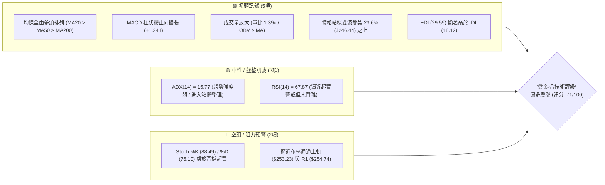
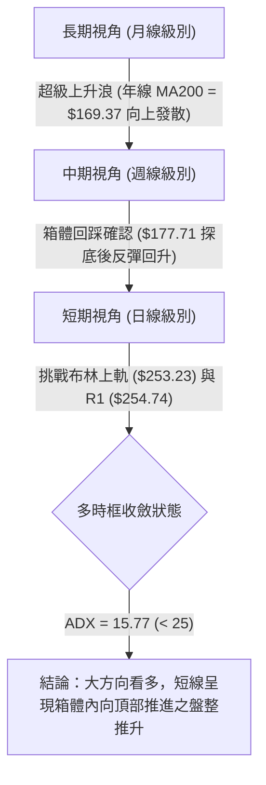
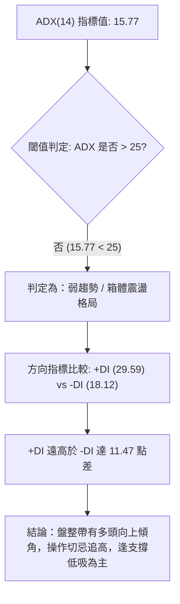
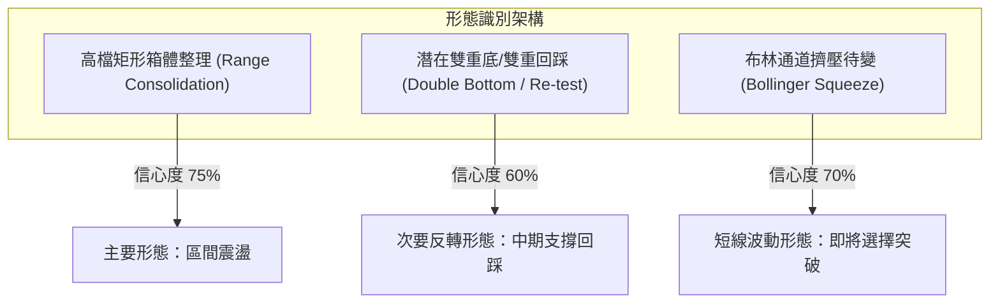
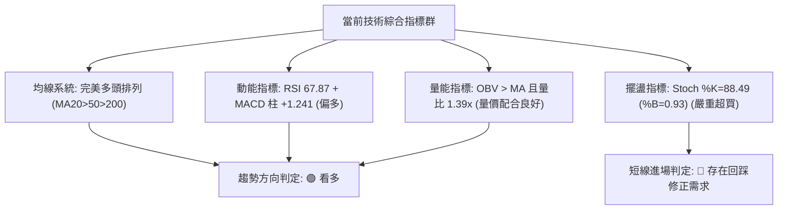
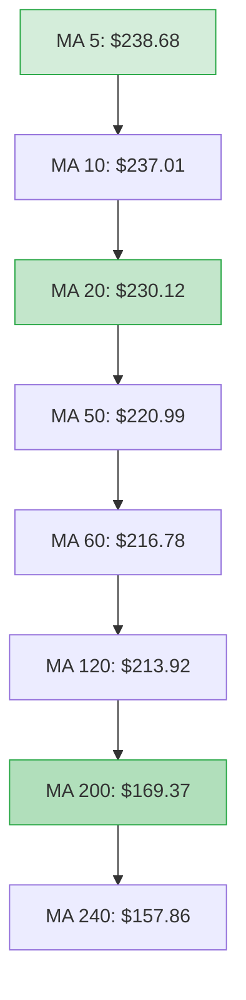
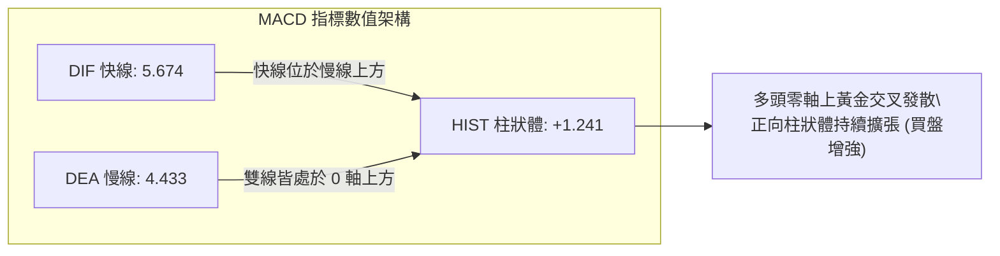
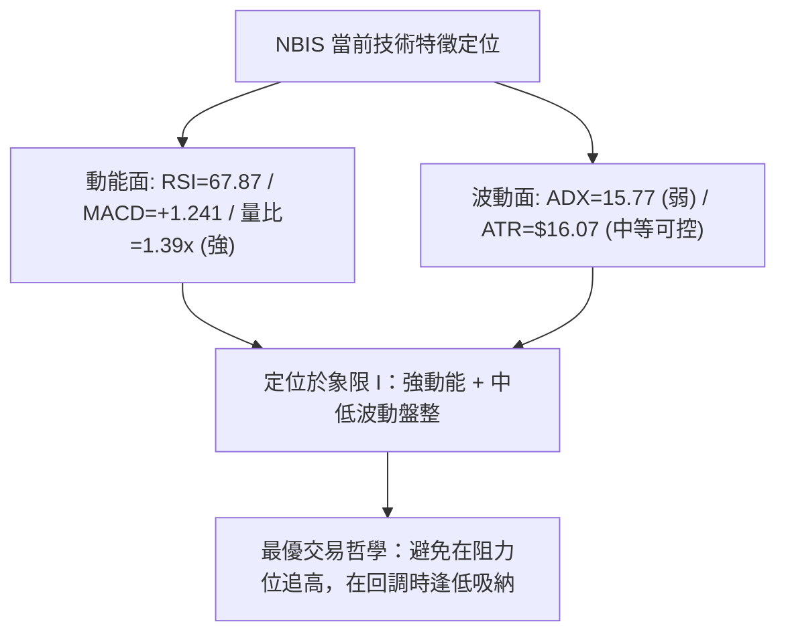
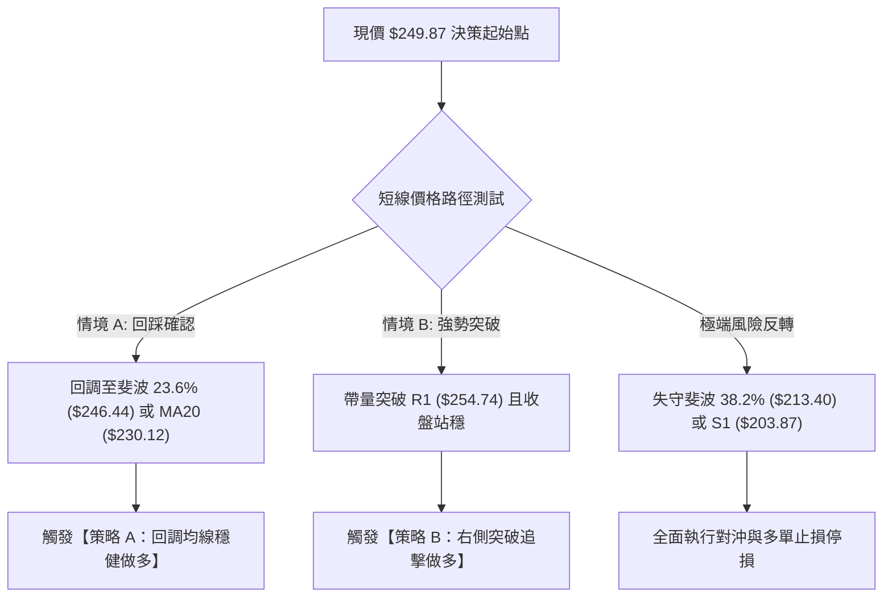
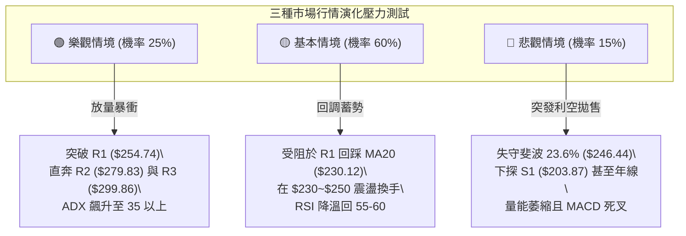

# NBIS 技術分析報告

> **報告日期**：2026-10-07 ｜ **語言**：繁體中文 ｜ **數據來源**：Yahoo Finance ｜ **當前價格**：$249.87

---

## 目錄

| 章節 | 內容 |
|------|------|
| [1. 技術面概覽](#1-技術面概覽) | 訊號儀表板、核心指標、評分卡 |
| [2. 趨勢分析](#2-趨勢分析) | 多時框趨勢、長中短期走勢、ADX解讀 |
| [3. 圖表形態分析](#3-圖表形態分析) | 形態識別信心度、K線組合、目標價計算 |
| [4. 支撐與阻力](#4-支撐與阻力) | 關鍵價位結構、阻力/支撐表、斐波那契回調 |
| [5. 技術指標深度解讀](#5-技術指標深度解讀) | 均線系統、RSI/MACD背離檢驗、布林通道、OBV |
| [6. 動能與波動率](#6-動能與波動率) | 動能四象限、ATR波動度與止損量化、Beta相關性 |
| [7. 多時框架總結](#7-多時框架總結) | 時框架矩陣、ADX收斂規則、方向性結論 |
| [8. 交易策略建議](#8-交易策略建議) | 策略路由、價格情境階梯、主推交易策略、風報比 |
| [9. 風險提示與監控](#9-風險提示與監控) | 監控Checklist、三情境壓力測試、風控規則 |

---

## 1. 技術面概覽

### 🎯 技術訊號儀表板



### 📊 核心指標速覽表

| 指標類別 | 指標名稱 | 當前數值 | 訊號 | 解讀 |
|----------|----------|----------|------|------|
| **價格** | 當前收盤價 | $249.87 | 🟢 多頭 | 位於 52 週區間 77.9%，守穩近期波段高檔 |
| **均線** | MA20 | $230.12 | 🟢 多頭 | 現價高於 MA20 達 +8.58%，短中期均線向上發散 |
| **均線** | MA50 | $220.99 | 🟢 多頭 | 現價高於 MA50 達 +13.07%，中期生命線結構穩健 |
| **均線** | MA200 | $169.37 | 🟢 多頭 | 遠高於長期年線 (+47.53%)，長期牛市架構明確 |
| **動能** | RSI(14) | 67.87 | 🟡 中性偏強 | 處於強勢多頭區間，未出現頂背離，具備上衝動能 |
| **動能** | MACD (12,26,9) | 5.674 / 4.433 | 🟢 多頭 | MACD 大於訊號線，Hist 柱狀體 +1.241 延續多方動能 |
| **隨機指標** | Stoch %K / %D | 88.49 / 76.10 | 🔴 超買預警 | 短線進入嚴重超買區，隨時面臨乖離修正壓力 |
| **趨勢強度** | ADX / ±DI | 15.77 (+DI: 29.59) | 🟡 盤整趨勢 | ADX < 25 代表非單邊暴衝行情，為震盪趨堅走勢 |
| **通道指標** | 布林通道 %B | 0.93 (上軌 $253.23) | 🟡 阻力壓制 | 貼近上軌運行，短線向上空間受 R1 ($254.74) 限制 |
| **量能指標** | 最新成交量 / 量比 | 21.38M (1.39x) | 🟢 放量配合 | 高於 20 日均量 (15.35M)，OBV > MA 量先價行 |
| **波動度** | ATR(14) | $16.07 (6.43%) | 🟡 高波動性 | 日內平均振幅達 $16.07，操作須預留足夠止損緩衝 |

### 🏆 技術評分卡

```
╔══════════════════════════════════════════════════════════════════╗
║              NBIS 綜合技術評分卡 (2026-10-07)                     ║
╠══════════════════════════════════════════════════════════════════╣
║ 趨勢方向 (Trend)     ████████████████░░░░  80/100  🟢 強勢多頭   ║
║ 趨勢強度 (ADX/Stren) ████████░░░░░░░░░░░░  40/100  🟡 弱勢盤整   ║
║ 動能指標 (Momentum)  ██████████████░░░░░░  70/100  🟢 偏多微超買 ║
║ 支撐穩定度 (Support) ██████████████░░░░░░  72/100  🟢 斐波回測穩 ║
║ 成交量配合 (Volume)  ████████████████░░░░  80/100  🟢 價量齊揚   ║
║ 均線排列 (MA Align)  ██████████████████░░  90/100  🟢 完美多頭   ║
║ 形態結構 (Patterns)  ████████████░░░░░░░░  62/100  🟡 箱體突破前 ║
╠══════════════════════════════════════════════════════════════════╣
║ 綜合技術得分         ██████████████░░░░░░  71/100  🟢 偏多進攻   ║
╚══════════════════════════════════════════════════════════════════╝
```

---

## 2. 趨勢分析

### 🌐 多時框趨勢分析



### 📈 長期趨勢 — 12個月走勢圖（Unicode）

以下為 NBIS 過去 12 個月（2025-11 至 2026-10）收盤價走勢路徑：

```
NBIS 月線走勢圖（2025-11 至 2026-10）
價格軸 ($)
$300 ┤                                           (52W高點 $299.86)
$275 ┤                                  ● 276.17
$250 ┤                                        ▲───────● 249.87(現價)
$225 ┤                             ● 231.09   │   ● 235.88
$200 ┤                                        ● 190.41│
$175 ┤                                                ● 206.32
$150 ┤                        ● 138.23
$125 ┤               ● 103.76
$100 ┤ ● 94.87   ● 91.19
 $75 ┤     ● 83.71 ● 85.19 (52W低點 $73.52)
  $0 └─┬─────┬─────┬─────┬─────┬─────┬─────┬─────┬─────┬─────┬─────┬─────┬───
     11月   12月  01月  02月  03月  04月  05月  06月  07月  08月  09月 10月
     (25)  (25)  (26)  (26)  (26)  (26)  (26)  (26)  (26)  (26)  (26) (26)
```

**歷史波段特徵分析表**：

| 階段區間 | 時間跨度 | 價格起訖 | 區間漲跌幅 | 波段特徵與技術意義 |
|----------|----------|----------|------------|--------------------|
| **築底蓄勢期** | 2025-11 ~ 2026-02 | $94.87 → $91.19 | -3.88% | 在 $73.52 ~ $95.00 築起堅固底部，完成籌碼換手 |
| **主升浪爆發期** | 2026-02 ~ 2026-06 | $91.19 → $276.17 | **+202.85%** | 伴隨營收大幅成長，均線發散，形成 52 週最高價 $299.86 |
| **獲利回吐修正** | 2026-06 ~ 2026-07 | $276.17 → $190.41 | -31.05% | 高檔快速去槓桿，週線級別急跌至最低 $177.71 (觸及 50% 回調位) |
| **次級反彈盤整** | 2026-07 ~ 2026-10 | $190.41 → $249.87 | **+31.23%** | 底部墊高，站上 23.6% 斐波那契位 ($246.44)，目前逼近 R1 |

### 📊 中期趨勢（週線分析）

從近 20 週收盤數據觀察：
- **關鍵底部確認**：2026-07-19 當週收盤 $177.71 形成中期底部，隨後成交量在 2026-08-02 放大至 1.54 億股，確認低檔強烈買盤介入。
- **波段高點壓制**：2026-08-16 週收盤衝高至 $277.68（MACD 柱狀體達 +9.868），但隨即出現週線回調，未能突破前高 $299.86。
- **收斂三角形盤整**：近 4 週收盤價由 $223.54 連續遞增至 $237.33、$242.81、乃至本週的 $249.87，週線 RSI 由 54.7 回升至 67.9，MACD 柱狀體翻正為 +1.241，顯示中期結構已重回多方主控。

### ⚡ 趨勢強度評估（ADX 解讀）



| 指標變數 | 當前讀數 | 基準閾值 | 狀態評估 | 實戰交易含義 |
|----------|----------|----------|----------|--------------|
| **ADX(14)** | **15.77** | 25.00 | 弱勢/無單邊趨勢 | 市場尚未進入單邊噴發趨勢，不宜使用激進突破追價策略 |
| **+DI (多頭動能)** | **29.59** | 20.00 | 多頭佔優 | 買方推升力道依然主導市場定價權 |
| **-DI (空頭動能)** | **18.12** | 20.00 | 空方疲弱 | 空頭賣壓受到有效吸收，回調幅度有限 |
| **DI 差值 (+DI - -DI)** | **+11.47** | 0.00 | 多頭擴張 | 多方力量持續增強，為後續 ADX 拐頭向上突破 25 奠定基礎 |

---

## 3. 圖表形態分析

### 🔍 形態識別系統



**形態信心度與目標價計算表**（依據嚴格規則 15）：

| 形態名稱 | 信心度 | 判斷依據（引用數據） | 完成度 | 目標價計算式與精確數值 |
|----------|--------|----------------------|--------|------------------------|
| **高檔寬幅矩形箱體** | **75%** | 箱體頂部受制於 R2 ($279.83) 及前高，底部支撐於 S1 ($203.87)，當前價格 $249.87 處於箱體上半部 | **70%** | 若向上有效突破箱頂 $279.83，量度目標 = 箱頂 $279.83 + (箱頂 $279.83 - 箱底 $203.87) = **$355.79**（數據庫未突破，暫列推算） |
| **次級回踩雙底 (W底)** | **60%** | 兩次回調低點分別為 2026-07 週收盤 $177.71 與 2026-08 低點 $187.97，頸線位於 2026-08-16 高點 $277.68 | **55%** | 頸線 $277.68 + (頸線 $277.68 - 底部平均 $182.84) = **$372.52**（尚未突破頸線，僅具結構參考性） |
| **布林上軌極限壓制** | **85%** | %B 達到 0.93，現價 $249.87 距離布林上軌 $253.23 僅 $3.36，受制於 R1 $254.74 | **90%** | 回測中軌目標 = MA20 基準值 **$230.12** |

### 🕯️ 重要K線形態分析

| 週期/月份 | 收盤價 ($) | 識別之K線形態 | 量價技術解讀 | 訊號方向 |
|-----------|------------|---------------|--------------|----------|
| **2026-06** | $276.17 | 高檔長上影避雷針 | 歷史高點 $299.86 處遭遇強烈獲利拋壓，多頭力竭 | 🔴 強烈看跌反轉 |
| **2026-07** | $190.41 | 大陰線破位放量 | 單月重挫 $85.76，快速尋找 50% 斐波那契回調支撐 | 🔴 恐慌性殺盤 |
| **2026-08** | $206.32 | 帶長下影探底陽線 | 週量高達 1.67 億股，主力資金在 $180 附近大舉建倉接盤 | 🟢 多頭落底訊號 |
| **2026-09** | $235.88 | 中陽線實體推進 | 實體收復 60 日與 20 日均線，呈現階梯式溫和放量上升 | 🟢 趨勢重啟確認 |
| **2026-10 (當前)** | $249.87 | 逼近前高之小陽線 | 越過斐波 23.6% ($246.44)，但實體縮小，面臨 R1 阻力防線 | 🟡 謹慎偏多觀望 |

### 📉 ASCII 走勢形態示意圖

```
NBIS 箱體震盪整理與當前受阻示意圖
══════════════════════════════════════════════════════════════════
$299.86 ┬────────────────────────────────────────────── 52W 高點 / R3
        │               ▲ (2026-06 衝高假突破)
$279.83 ┼───────[R2]────┼────────────────────────────── 箱體上邊界 R2
        │               │       ▲ (2026-08 反彈次高 $277.68)
$254.74 ┼───────[R1]────┼───────┼───────▲ ($253.23 布林上軌 / 現價阻力)
$249.87 ┼─(現價)────────┼───────┼───────●────── 當前價格位置 (%B=0.93)
$230.12 ┼───────[MA20]──┼───────┼───────┼────── 布林中軌支撐
        │               │       │       │
$203.87 ┼───────[S1]────┴───────┴───────┴────── 箱體下邊界 S1
        │           ▼ (2026-07 最低 $177.71)
$169.37 ┴───────[MA200]──────────────────────── 年線多頭長期防線
══════════════════════════════════════════════════════════════════
```

### 🎯 形態目標價計算

根據高檔箱體震盪形態的量度規則：
1. **箱體上限基準**：阻力區間 R2 即為有效箱頂 **$279.83**。
2. **箱體下限基準**：近一年波段低點聚類支撐 S1 為 **$203.87**。
3. **箱體垂直高度**：$279.83 - $203.87 = **$75.96**。
4. **向上突破量度目標**：若日線級別收盤價帶量突破 R2 ($279.83)，依據標準形態等幅測量：
   $$\text{Target} = \$279.83 + \$75.96 = \mathbf{\$355.79}$$
5. **當前局限性**：由於 ADX 僅 15.77，箱體內缺乏單邊暴衝動能，現階段首要關注目標為回歸中軌 **$230.12** 或測試 R1 **$254.74**。

---

## 4. 支撐與阻力

### 🗺️ 關鍵價位分布圖（Unicode）

```
NBIS 關鍵價位結構分布圖 (由 OHLCV 歷史聚類計算)
══════════════════════════════════════════════════════════════════
$299.86 ║████████████████████████████████║ 歷史天花板 / 52W 高點 (R3)
        ║                                ║
$279.83 ║████████████████████████        ║ 強阻力 / 箱體上沿 (R2)
        ║                                ║
$254.74 ║████████████████                ║ 短線第一阻力聚類 (R1)
$253.23 ╟────────────────────────────────╢ 布林通道上軌
$249.87 ╠════════════════════════════════╣ ◄ 當前市價 ($249.87)
$246.44 ╟┄┄┄┄┄┄┄┄┄┄┄┄┄┄┄┄┄┄┄┄┄┄┄┄┄┄┄┄┄╢ 斐波那契 23.6% 回調關鍵位
        ║                                ║
$230.12 ║▓▓▓▓▓▓▓▓▓▓▓▓▓▓▓▓▓▓▓▓            ║ 布林中軌 / MA20 短期動態支撐
$213.40 ╟┄┄┄┄┄┄┄┄┄┄┄┄┄┄┄┄┄┄┄┄┄┄┄┄┄┄┄┄┄╢ 斐波那契 38.2% 回調位
$203.87 ║████████████████████            ║ 強支撐 S1 (近一年波段低點聚類)
$200.30 ║████████████████████████        ║ 整數關卡強支撐 S2
$194.80 ║████████████████████████████    ║ 極限波段回調防線 S3
══════════════════════════════════════════════════════════════════
```

### 🚧 阻力位分析表

價位嚴格引用技術數據聚類算得之數值：

| 阻力級別 | 價格 ($) | 距現價幅動 | 歷史形成原因與技術意義 | 突破難度 | 重要性等級 |
|----------|----------|------------|------------------------|----------|------------|
| **R1** | **$254.74** | +1.95% | 近一年密集震盪次高點；與布林通道上軌 ($253.23) 形成雙重阻力共振 | 中等 | 🟡 短線突破防線 |
| **R2** | **$279.83** | +11.99% | 2026-08-16 反彈高點 ($277.68) 與歷史次高換手密集群 | 極高 | 🔴 中期結構分水嶺 |
| **R3** | **$299.86** | +20.01% | 52 週歷史天花板 ($299.86)；整數心理大關 $300 | 堡壘級 | 🔴 歷史絕對阻力 |

### 🛡️ 支撐位分析表

價位嚴格引用技術數據聚類算得之數值：

| 支撐級別 | 價格 ($) | 距現價幅動 | 歷史形成原因與技術意義 | 守住機率 | 重要性等級 |
|----------|----------|------------|------------------------|----------|------------|
| **S1** | **$203.87** | -18.41% | 近一年波段密集低點聚類區；回調首道強防禦陣地 | 75% | 🟢 中期生命線 |
| **S2** | **$200.30** | -19.84% | 整數心理防線 $200.00 之核心流動性緩衝區 | 85% | 🟢 多頭反轉底線 |
| **S3** | **$194.80** | -22.04% | 2026-07 恐慌拋壓後之實體收盤密集帶 | 90% | 🟢 極端防禦防線 |

### 📐 斐波那契回調位分析

依據 52 週完整極端區間（低點 **$73.52** 至 高點 **$299.86**，落差共 $226.34）進行回調測算：

| 斐波那契回調層級 | 計算價位 ($) | 距現價距離 | 技術解讀與當前位置相互關係 |
|------------------|--------------|------------|----------------------------|
| **0.0% (52W High)** | **$299.86** | +20.01% | 本輪牛市週期的極限高點阻力 |
| **23.6%** | **$246.44** | -1.37% | **當前價格 ($249.87) 剛剛站上此處！** 轉換為短線關鍵支撐 |
| **38.2%** | **$213.40** | -14.60% | 介於 MA50 ($220.99) 與 MA120 ($213.92) 之間的重要支撐帶 |
| **50.0%** | **$186.69** | -25.29% | 歷史多空平衡分水嶺；2026-07-26 週收盤 $187.77 於此精準止跌 |
| **61.8%** | **$159.98** | -35.98% | 黃金分割黃金支撐；靠近 240 日均線 ($157.86) |
| **78.6%** | **$121.96** | -51.19% | 深度修正防守位 |
| **100.0% (52W Low)**| **$73.52** | -70.58% | 52 週最低點，原始起漲平台 |

**位置解讀**：現價 $249.87 成功跨越 23.6% 回調位 ($246.44)，這表明從 $299.86 至 $177.71 的中級調整已完成超過 76% 的幅度修復。只要日線收盤不破 $246.44，技術結構即處於「極度強勢回調完成區」，目標直接鎖定 0.0% 原點 $299.86。

---

## 5. 技術指標深度解讀

### 🎛️ 指標訊號總覽



### 📈 移動平均線排列分析



| 均線規格 | 當前數值 ($) | 價格相對位置 | 正負乖離率 (%) | 均線歷史斜率特徵 | 技術信號 |
|----------|--------------|--------------|----------------|------------------|----------|
| **MA 5** | $238.68 | 價格在其上方 | +4.69% | 急速向上拉升，短期動能爆發 | 🟢 強烈看多 |
| **MA 10** | $237.01 | 價格在其上方 | +5.43% | 斜率穩步向上，短線支撐強勁 | 🟢 強烈看多 |
| **MA 20** | $230.12 | 價格在其上方 | +8.58% | 剛突破前波盤整，加速發散 | 🟢 看多 |
| **MA 50** | $220.99 | 價格在其上方 | +13.07% | 中期基線持續抬高 | 🟢 看多 |
| **MA 60** | $216.78 | 價格在其上方 | +15.26% | 經過打底後重新上翹 | 🟢 看多 |
| **MA 120** | $213.92 | 價格在其上方 | +16.80% | 構築堅固半年線護城河 | 🟢 看多 |
| **MA 200** | $169.37 | 價格在其上方 | +47.53% | 長期多頭定海神針 | 🟢 長線極多 |
| **MA 240** | $157.86 | 價格在其上方 | +58.28% | 年線保持 45 度向上仰角 | 🟢 長線極多 |

### 📉 RSI(14) 分析

當前數值：**67.87**
```
RSI(14) 當前強度刻度：
0 ──────── 30 ──────────────── 50 ──────── 67.87 ── 70 ──────── 100
[  超賣區  ] [    弱勢盤整區    ] [   強勢區   ] █  [ 超買警戒區 ]
進度條: ████████████████████████████████░░░░░░░░ (67.87%)
```
- **區間評估**：RSI 處於 60-70 的典型「主升推動強勢區間」，既有充足動能，又未正式突破 70 進入極端過熱狀態。
- **背離檢驗結論**：
  - **頂背離判定**：**無明顯背離（結論：否定）**。價格從 2026-09-27 之 $237.33 上漲至當前 $249.87，RSI 同步由 54.7 上升至 67.87，指標與價格創高方向完全一致，並未出現「價創新高而指標走低」的頂背離現象。
  - **底背離判定**：2026-07-12 低點 $219.65 (RSI 32.2) 與 2026-09-06 低點 $226.39 (RSI 33.3) 形成健康的階梯墊高，確立多頭結構。

### 📊 MACD(12, 26, 9) 訊號解讀


- **MACD 線**：**5.674**
- **Signal 線**：**4.433**
- **柱狀體 (Histogram)**：**+1.241**（較前一週之 +1.113 進一步擴大）
- **解讀**：DIF 穩穩維持在 DEA 之上且位於零軸上方，柱狀體連續多週呈現正值並溫和擴張，顯示多頭動能處於主動推進階段，尚未顯現任何力竭翻空跡象。

### 📦 布林通道分析

```
布林通道與現價空間示意圖 (帶寬帶值)
══════════════════════════════════════════════════════════════════
$253.23 ─── 上軌 ─────────────────────────────────────── (阻力極限)
$249.87 ─── 現價 (▲ %B = 0.93，逼近上軌，乖離過大)
        │
        │   通道寬度 (Bandwidth): $253.23 - $207.02 = $46.21
        │
$230.12 ─── 中軌 (MA20) ──────────────────────────────── (動態回踩目標)
        │
        │
$207.02 ─── 下軌 ─────────────────────────────────────── (安全邊界)
══════════════════════════════════════════════════════════════════
```
- **布林上軌**：**$253.23**
- **布林中軌 (MA20)**：**$230.12**
- **布林下軌**：**$207.02**
- **%B 指標值**：**0.93**（0 代表下軌，0.5 代表中軌，1.0 代表上軌）
- **解讀**：%B 高達 0.93，表示價格已極度逼近上軌（僅差 $3.36），在技術統計上處於超買邊界。若無法放量突破 R1 ($254.74) 使通道開口向上喇叭口擴張，價格高機率面臨向中軌 $230.12 的均值回歸回調。

### 💹 成交量分析（量價配合度）

- **最新成交量**：**21,375,600 股**
- **20日均量**：**15,345,660 股**（量比達到 **1.39x**，明顯高於基準）
- **50日均量**：**20,457,188 股**
- **能量潮 (OBV) 分析**：數據明確標示 **OBV > MA**。
  - **量價確認結論**：成交量在股價攀升至 $249.87 過程中同步超越 20 日與 50 日均量，OBV 保持在其均線之上，這說明近期的推升具有法人資金實質買盤支撐，**無「量價背離」**，屬於量增價漲的良性多頭推進。

---

## 6. 動能與波動率

### ⚡ 動能評估四象限

| 象限 | 動能維度 (Momentum) | 波動率維度 (Volatility) | 標的所屬狀態 | 策略處方 |
|------|---------------------|-------------------------|--------------|----------|
| **象限 I (Q1)** | **強動能 (+DI高, MACD多)** | **低/中波動 (ADX < 25)** | ◀ **NBIS 目前落點** | **穩健趨勢回踩買進** |
| **象限 II (Q2)**| 弱動能 (MACD翻空) | 低波動 (通道窄化) | - | 觀望等待打破平衡 |
| **象限 III (Q3)**| 強動能 (單邊噴發) | 極高波動 (ATR暴增) | - | 緊縮動態追蹤止損 |
| **象限 IV (Q4)**| 弱動能 (破位下殺) | 高波動 (恐慌拋售) | - | 嚴禁介入，逢反彈放空 |



### 📊 ATR 波動率分析

- **ATR(14)**：**$16.07**
- **ATR 佔比 (波動率百分比)**：$16.07 / $249.87 = **6.43%**
- **量化風控與止損設定建議**：
  - 日內正常噪音波動空間為 $\pm \$16.07$。任何短線多單止損必須設置在 $1.0 \times \text{ATR}$ 之外，以避免被正常市場隨機噪聲掃出場。
  - **短線防守緩衝**：$1.5 \times \text{ATR} = 1.5 \times \$16.07 = \mathbf{\$24.11}$。
  - **波段進場保護位**：自現價向下減去 $1.5 \times \text{ATR}$ 得到約 **$225.76**，剛好覆蓋 MA50 ($220.99) 與 MA20 ($230.12) 之間的重要支撐帶。

### 📐 Beta 與市場相關性

- **Beta 係數**：**1.46**
- **解讀**：NBIS 具備典型高成長、高彈性 AI 基礎設施標的之屬性。其波動率為大盤標普 500 指數的 1.46 倍。在大盤走多時具備顯著超額收益 (Alpha)，但在大盤回調或市場流動性緊縮時，其下行速度亦會放大 46%。部位配置上限應控制在總資金之 10%–15% 以內，避免組合淨值承受過大下行回撤。

---

## 7. 多時框架總結

### 📋 時框架評分表

| 時框架 | 趨勢方向 | 動能狀態 | 均線排列 | 圖表形態 | 綜合評分 | 戰術建議 |
|--------|----------|----------|----------|----------|----------|----------|
| **月線 (長期)** | 🟢 多頭 | 🟢 極強 (24個月自$21攀升) | 🟢 遠超 MA200 | 底部脫離大主升 | **85/100** | 戰略性長期持股 |
| **週線 (中期)** | 🟢 多頭 | 🟢 轉強 (MACD柱連續擴張) | 🟢 均線多頭修復 | $177 W底成形反彈 | **75/100** | 逢波段回調加碼 |
| **日線 (短期)** | 🟡 震盪偏多 | 🔴 超買 (%B=0.93 / Stoch高檔) | 🟢 短天期MA全多 | 面臨 R1 $254.74 阻力 | **60/100** | 暫停追高，待回踩 |

### 🔲 綜合訊號矩陣

```
時框收斂訊號矩陣表
══════════════════════════════════════════════════════════════════
維度            短期 (日線)        中期 (週線)        長期 (月線)
──────────────────────────────────────────────────────────────────
趨勢方向        🟡 震盪偏多        🟢 穩定上升        🟢 宏觀牛市
動能表現        🔴 嚴重超買警戒    🟢 柱狀體翻正擴張  🟢 歷史高動能
成交量配合      🟢 溫和放大(1.39x) 🟢 量能沉澱回升    🟢 巨量換手完成
阻力支撐        🔴 抵達上軌 R1     🟢 站上斐波 23.6%  🟢 守穩年線 MA200
══════════════════════════════════════════════════════════════════
一致性判定      短線受制於通道頂，中長期全面看多，需等待共振突破
══════════════════════════════════════════════════════════════════
```

### ⚖️ 多時框收斂結論

依據多時框收斂規則（嚴格要求 14）：
1. **行情性質判定**：當前 **ADX(14) = 15.77 (< 25)**，系統明確判定當前處於**「盤整行情（震盪行情）」**，而非單邊非理性暴衝行情。
2. **時框優先級收斂**：在 ADX < 25 的盤整結構下，交易邏輯應以**日線布林通道上下軌（$207.02 ~ $253.23）**與**關鍵支撐阻力位（S1 $203.87 ~ R1 $254.74）**作為核心操作邊界。中長期均線（MA50 $220.99、MA200 $169.37）則定錨整體多頭基調。
3. **唯一收斂結論**：**【偏多震盪，拒絕追高，佈局回踩】**。
   - 儘管均線與長線全面偏多，但由於現價 $249.87 距離布林上軌 $253.23 與 R1 阻力 $254.74 僅有不到 2% 空間，且 Stoch 進入 88 超買區，日線級別存在高機率的技術性回踩中軌 MA20 ($230.12) 之需求。主策略鎖定「回調低吸」為主軸。

---

## 8. 交易策略建議

### 🗺️ 策略決策流程圖



### 🧭 策略路由（依評分卡分流）

> **當前主策略方向 = 【主推多頭策略（波段回調低吸為主，右側突破為輔）】**
> *(依據第 1 章技術評分卡 71/100 偏多進攻評分判定，得分 ≥ 60，嚴格執行單一多頭主架構)*

### 🎯 價格情境階梯（Price Scenarios）

價位嚴格引用第 4 章及關鍵價位 OHLCV 聚類數值：

| 觸發條件 | 下一目標 | 後續延伸 | 情境含義與操作指引 |
|----------|----------|----------|--------------------|
| **有效突破 R1 ($254.74)** | **R2 ($279.83)** | **R3 ($299.86)** | **短線突破轉強**：布林通道向上打開喇叭口，挑戰歷史天花板 |
| **站穩現價區間 ($246.44~$254.74)** | **$253.23 (上軌)** | — | **高檔強勢震盪**：消化超買賣壓，等待 ADX 重新抬頭 |
| **跌破 S1 ($203.87)** | **S2 ($200.30)** | **S3 ($194.80)** | **中期趨勢轉弱**：跌破波段多頭防線，回測年線支撐防禦帶 |

### 📊 情境機率分佈

| 價格情境 | 發生機率 | 主要技術指標依據 |
|----------|----------|------------------|
| **高檔回調後繼續上行** | **60%** | 均線完美多頭排列；OBV 量能支撐；MACD 柱狀體處於正擴張 (+1.241) |
| **高檔區間震盪整理** | **25%** | ADX 僅 15.77 顯示單邊動能不足；布林上軌 ($253.23) 與 R1 形成壓制 |
| **深幅回落探底 (回測S1)**| **15%** | Stoch %K=88.49 超買引發恐慌性多殺多，但下方 MA50/MA200 支撐厚實 |

### 🟢 主策略詳情

本報告依據嚴格規定給出精確數值策略，嚴禁模糊區間：

| 策略要素 | 策略 A（穩健型：回調低吸買入） | 策略 B（進取型：突破追擊買入） |
|----------|--------------------------------|--------------------------------|
| **進場條件** | 股價回踩布林中軌 MA20 獲得支撐出下影線 | 日線收盤價帶量突破 R1 阻力位確認 |
| **進場價格** | **$230.12** | **$255.50** (確認站上 R1 $254.74) |
| **第一目標 (T1)** | **$254.74** (前期高點 R1) | **$279.83** (箱體強阻力 R2) |
| **第二目標 (T2)** | **$279.83** (強阻力 R2) | **$299.86** (52週歷史高點 R3) |
| **止損價格** | **$213.40** (跌破 38.2% 斐波那契位) | **$246.44** (假突破跌回 23.6% 斐波位) |
| **風險報酬比** | **1 : 2.97** (風險 $16.72，目標2獲利 $49.71) | **1 : 2.69** (風險 $9.06，目標1獲利 $24.33) |
| **預估勝率** | **65%** | **55%** |
| **建議倉位** | **總資金之 12%** | **總資金之 8%** |

### 🔴 反向風險觸發點（對沖提示）

- **多頭結構失效閥值**：若日線收盤價跌破 **$213.40**（38.2% 斐波那契回調位），宣告短期上升趨勢結束。
- **全面空頭反轉確認**：若跌破 **S1 ($203.87)**，意味著高檔雙頂或多重頂形態確立，投資人應立即清空多頭部位，或建立適度反向空頭對沖避險。

### ⭐ 整體訊號強度評星

```
做多訊號強度：★★★★☆  (4.0/5星 — 均線與量能極佳，僅受制於短線超買)
做空訊號強度：★☆☆☆☆  (1.0/5星 — 逆大勢做空風險極大，僅限日內短沖)
整體可信度：  ★★★★☆  (4.2/5星 — 多時框指標一致性高，數據聚類完整)
```

---

## 9. 風險提示與監控

### ✅ 關鍵監控指標 Checklist

```
╔══════════════════════════════════════════════════════════════════╗
║              NBIS 交易日常技術監控清單 (Checklist)               ║
╠══════════════════════════════════════════════════════════════════╣
║ [ ] 價格是否有效站穩斐波那契 23.6% ($246.44) 之上？              ║
║ [ ] 日線收盤價是否挑戰突破布林通道上軌 ($253.23) 與 R1 ($254.74)？║
║ [ ] 成交量是否持續維持在 20 日均量 (15.35M 股) 之上？           ║
║ [ ] RSI(14) 是否突破 70 進入極端過熱，或出現高檔鈍化？           ║
║ [ ] MACD Histogram 柱狀體是否由正轉負 (警惕翻綠死叉)？          ║
║ [ ] ADX(14) 是否由 15.77 拐頭突破 25，確認單邊噴發趨勢開啟？     ║
║ [ ] 是否跌破 MA20 動態生命線 ($230.12)？                         ║
╚══════════════════════════════════════════════════════════════════╝
```

### ⚠️ 風險場景分析



### 🛡️ 風險管理重要提醒

1. **ATR 波動管理原則**：NBIS 之 ATR 高達 $16.07（佔股價 6.43%），單日上下波動 $20 屬正常現象。持倉時萬不可滿倉操作，單筆交易虧損金額切勿超過總投資組合淨值的 **1.5%**。
2. **Beta 槓桿防護**：Beta 達 1.46，在 Nasdaq 科技股指數出現 2% 以上單日回調時，NBIS 可能遭遇 3%–5% 之急跌，建議在重要總體經濟數據公布日前夕減碼短線投機部位。
3. **空頭部位警示**：目前全市場空頭部位比例（Short % Float）達到 **19.8%**，空頭回補天數（Short Ratio）為 2.76 天。此高空頭比例意味著若股價強勢突破 R1 ($254.74)，隨時可能誘發大規模「軋空狂潮（Short Squeeze）」，盲目逆勢猜頂放空將面臨無限下檔風險。

---

## 📋 報告總結

```
╔══════════════════════════════════════════════════════════════════╗
║                    NBIS 技術分析報告總結                          ║
╠══════════════════════════════════════════════════════════════════╣
║ 報告日期：2026-10-07              當前價格：$249.87              ║
║ 技術評級：🟢 偏多震盪 (71/100)    市場狀態：高檔蓄勢 / 箱體運行  ║
╠══════════════════════════════════════════════════════════════════╣
║ 關鍵維度結論：                                                   ║
║ ├─ 長期趨勢：🟢 強烈看多 (MA200 = $169.37 向上發散，牛市確立)    ║
║ ├─ 中期趨勢：🟢 偏多回升 (站穩斐波 23.6% $246.44，量能回升)      ║
║ ├─ 短期趨勢：🟡 震盪超買 (受制於布林上軌 $253.23 與 R1 $254.74)   ║
║ ├─ 關鍵支撐：S1 = $203.87 ｜ 動態支撐 MA20 = $230.12            ║
║ ├─ 關鍵阻力：R1 = $254.74 ｜ R2 = $279.83 ｜ R3 = $299.86      ║
║ └─ 法人共識目標價：$282.53 (高點目標看至 $410.00)                 ║
╠══════════════════════════════════════════════════════════════════╣
║ 最優交易策略組合：                                               ║
║ 1. 🥇 最佳機會 (穩健買點)：等待價格回測 MA20 ($230.12) 逢低進場  ║
║    目標 T1: $254.74 / T2: $279.83 ｜ 止損: $213.40 (風報比 1:2.97)║
║ 2. 🥈 次選機會 (突破追擊)：帶量實體陽線突破 R1 ($255.50) 右側追買║
║    目標 T1: $279.83 / T2: $299.86 ｜ 止損: $246.44 (風報比 1:2.69)║
║ 3. 🥉 保守選擇：空手觀望，靜待日線 RSI 回落至 50-55 區間再行定奪 ║
╚══════════════════════════════════════════════════════════════════╝
```

---

> ⚠️ **免責聲明**：本報告為依據標準技術分析模型與歷史量價數據生成之專業研報，所有數據、均線、斐波那契回調位及圖表形態均嚴格按歷史價格資訊測算。本報告**僅供學術研究與投資決策參考**，**不構成直接買賣邀約或保證獲利之投資建議**。金融市場瞬息萬變，高 Beta 與高動能股票具備實質波動風險，投資人應獨立評估風險並嚴格執行資金管理紀律。

---

*報告生成時間：2026-10-07 ｜ 數據來源：Yahoo Finance ｜ 分析框架：多時框量化技術分析 (Multi-Timeframe Technical Analysis)*