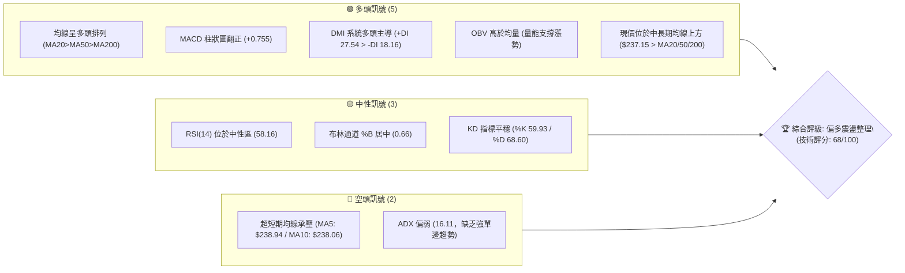
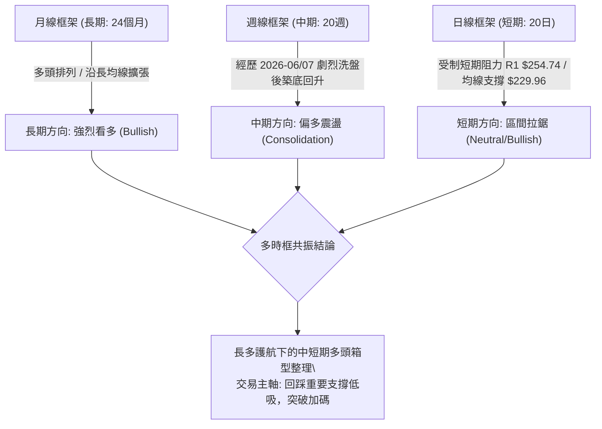
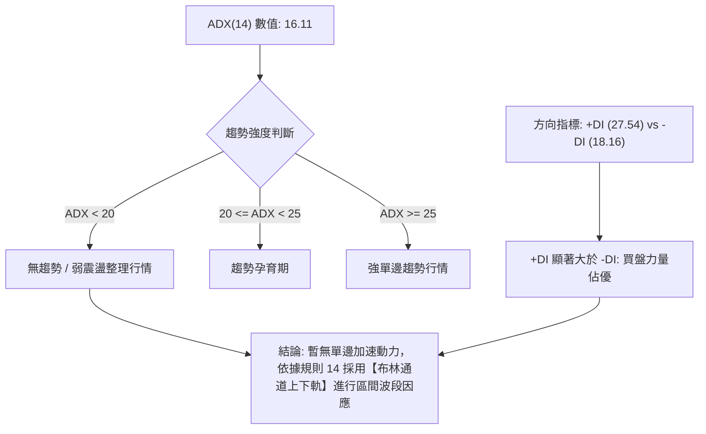
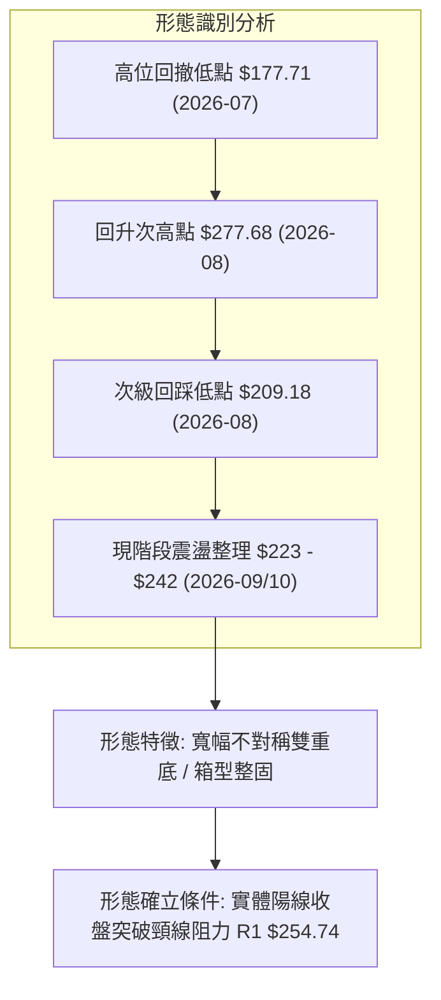
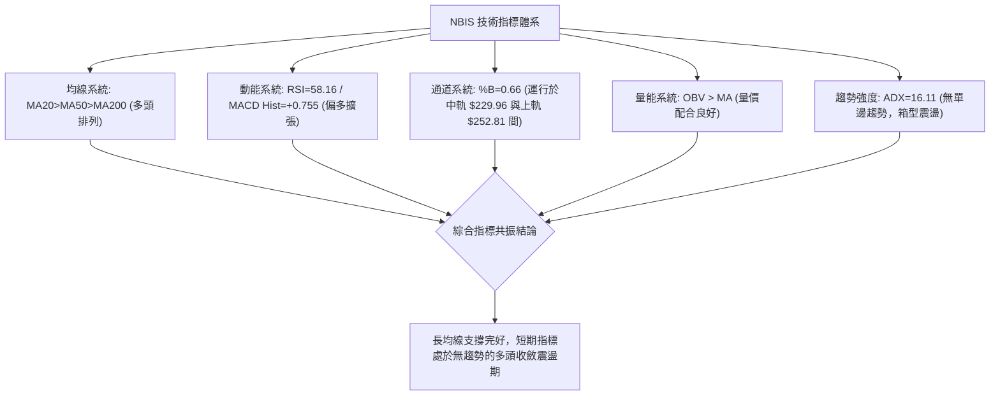
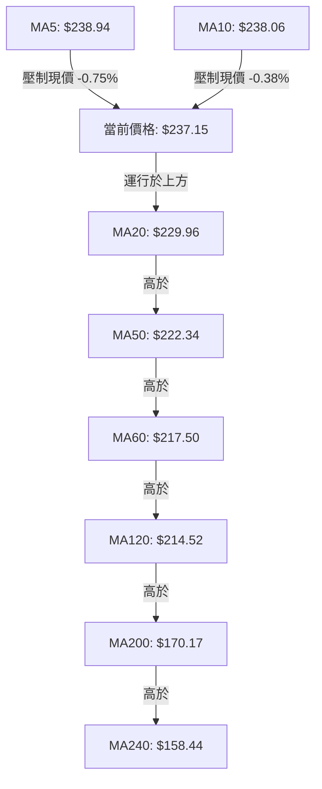
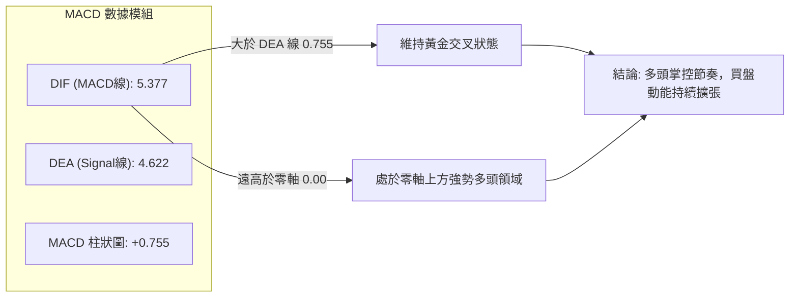
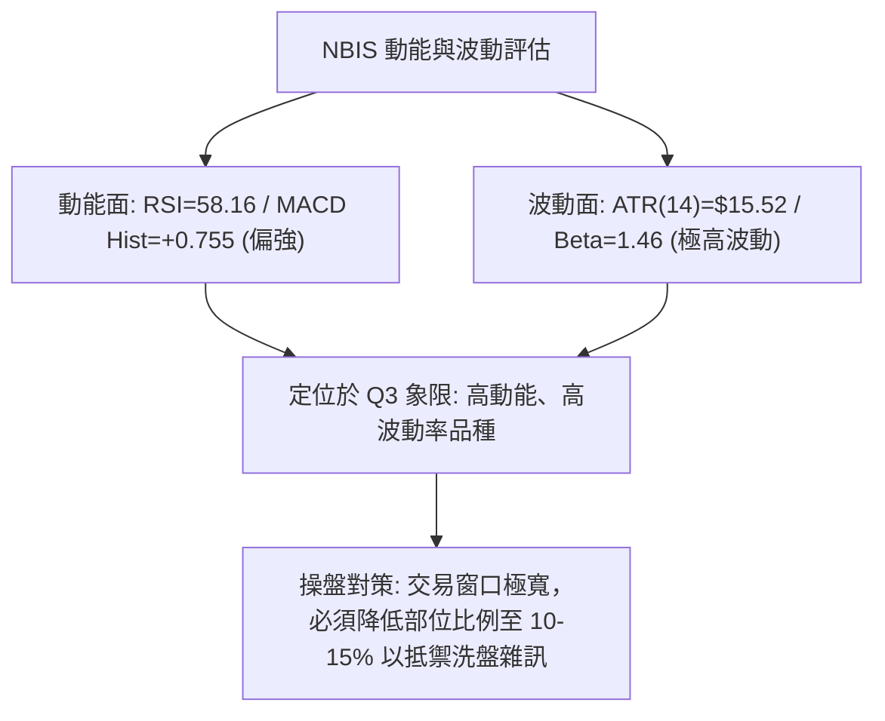
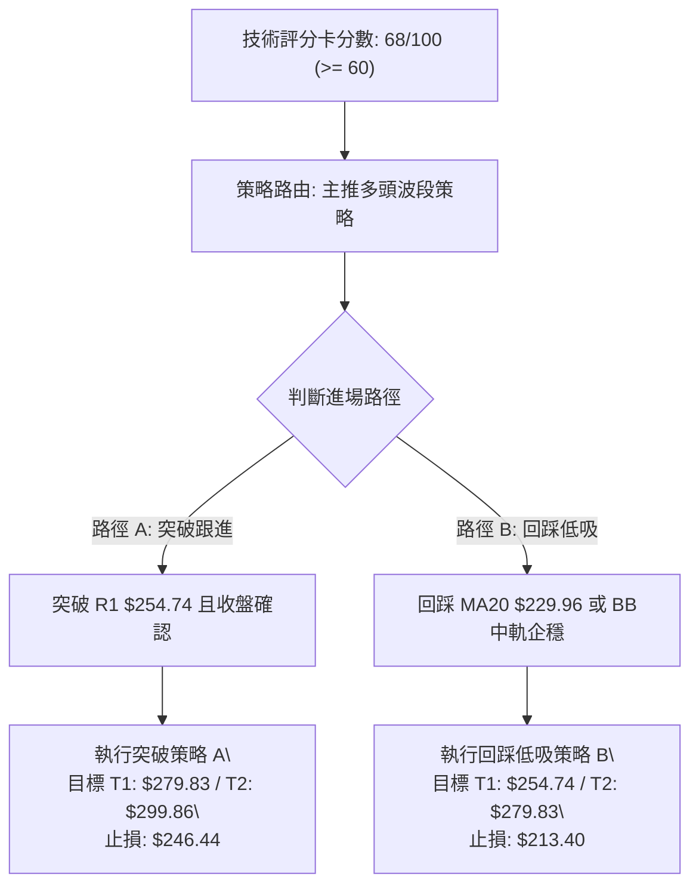
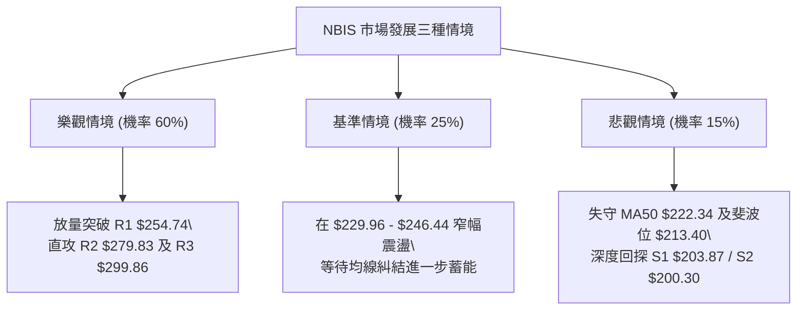

# NBIS 技術分析報告

> **報告日期**：2026-10-08 ｜ **語言**：繁體中文 ｜ **數據來源**：Yahoo Finance ｜ **當前價格**：$237.15

---

## 目錄

| 章節 | 內容 |
|------|------|
| [1. 技術面概覽](#1-技術面概覽) | 訊號儀表板、核心指標、評分卡 |
| [2. 趨勢分析](#2-趨勢分析) | 多時框趨勢、長中短期走勢 |
| [3. 圖表形態分析](#3-圖表形態分析) | 形態識別、K線組合、目標價 |
| [4. 支撐與阻力](#4-支撐與阻力) | 關鍵價位、斐波那契回調 |
| [5. 技術指標深度解讀](#5-技術指標深度解讀) | MA/RSI/MACD/布林/成交量 |
| [6. 動能與波動率](#6-動能與波動率) | 動能評估、ATR、Beta |
| [7. 多時框架總結](#7-多時框架總結) | 時框架評分矩陣 |
| [8. 交易策略建議](#8-交易策略建議) | 多空策略、風險報酬比 |
| [9. 風險提示與監控](#9-風險提示與監控) | 監控指標、風險場景 |

---

## 1. 技術面概覽

### 🎯 技術訊號儀表板



### 📊 核心指標速覽表

| 指標類別 | 指標名稱 | 當前數值 | 訊號 | 解讀 |
|----------|----------|----------|:----:|------|
| **價格** | 當前價格 | $237.15 | 🟢 | 位於52週區間 72.3% 高位，整體結構強勢 |
| **均線** | MA20 | $229.96 | 🟢 | 現價高於 MA20 達 +3.13%，短期動能守穩 |
| **均線** | MA50 | $222.34 | 🟢 | 現價高於 MA50 達 +6.66%，中期多頭架構完好 |
| **均線** | MA200 | $170.17 | 🟢 | 現價高於 MA200 達 +39.36%，長期牛市基準線穩固 |
| **動能** | RSI(14) | 58.16 | 🟡 | 位於 50–60 健康擴張區，未見超買或超賣 |
| **動能** | MACD | 5.377 / Hist +0.755 | 🟢 | 快慢線均在零軸上方，柱狀圖維持正向擴張 |
| **動能** | Stoch %K/%D | 59.93 / 68.60 | 🟡 | 中性健康收斂，無鈍化或嚴重背離跡象 |
| **趨勢** | ADX(14) | 16.11 | 🟡 | ADX < 25 代表進入次級波段震盪盤整行情 |
| **趨勢** | DMI (+DI/-DI) | 27.54 / 18.16 | 🟢 | +DI 明顯高於 -DI，買方力道依然佔據主導地位 |
| **通道** | 布林通道 | 軌道 $207.11–$252.81 | 🟡 | %B 為 0.66，運行於中軌與上軌之間 |
| **波動** | ATR(14) | $15.52 (6.54%) | 🔴 | 波動幅度極大，風控需保留足夠安全距離 |
| **量能** | 成交量比 | 1.14x (17.92M / 15.67M) | 🟢 | 量能溫和放大，OBV 保持上升斜率 |

### 🏆 技術評分卡

```
╔══════════════════════════════════════════════════════════════╗
║                技術評分卡 — NBIS (2026-10-08)                ║
╠══════════════════════════════════════════════════════════════╣
║ 趨勢強度      ██████████░░░░░░░░░░  50/100  🟡 (ADX=16.11 盤整)║
║ 動能指標      ██████████████░░░░░░  70/100  🟢 (MACD正向/RSI健)║
║ 支撐穩定度    ████████████████░░░░  80/100  🟢 (均線密集托底)  ║
║ 成交量配合    ██████████████░░░░░░  70/100  🟢 (OBV>MA 量價配合)║
║ 形態完整度    ████████████░░░░░░░░  60/100  🟡 (寬幅區間修復)  ║
║ 均線排列      ████████████████░░░░  80/100  🟢 (MA20>50>200排列)║
╠══════════════════════════════════════════════════════════════╣
║ 綜合評分      █████████████░░░░░░░  68/100  🟢 偏多整固格局   ║
╚══════════════════════════════════════════════════════════════╝
```

---

## 2. 趨勢分析

### 🌐 多時框趨勢分析



### 📈 長期趨勢 — 12個月走勢圖（Unicode）

```
NBIS 月線收盤走勢圖（過去12個月：2025-10 至 2026-10）
價格軸 ($)
$280 ┤                                      ● (2026-06: 276.17)
$260 ┤
$240 ┤                                  ●             ●   ● (現價 237.15)
$220 ┤                              ● (2026-05)
$200 ┤                                            ● (2026-07: 190.41)
$180 ┤
$160 ┤
$140 ┤  ● (2025-10: 130.82)     ● (2026-04: 138.23)
$120 ┤                      ●
$100 ┤      ●           ●
 $80 ┤          ●   ● (2025-12: 83.71 低點)
     └────────────────────────────────────────────────────────
       10  11  12  01  02  03  04  05  06  07  08  09  10 (月)
       2025年                  2026年
```

#### 走勢特徵分析表格

| 階段區間 | 時間跨度 | 價格起訖 | 漲跌幅 | 結構特徵與量價解讀 |
|:---|:---:|:---:|:---:|:---|
| **第一階段：高位獲利回吐** | 2025-10 ~ 2025-12 | $130.82 → $83.71 | -36.01% | 歷經暴漲後的估值修正，尋求波段底部（52W低點聚類在 $73.52） |
| **第二階段：蓄勢築底起爆** | 2026-01 ~ 2026-03 | $85.19 → $103.76 | +21.80% | 底部換手充分，機構籌碼重聚，均線收斂向上 |
| **第三階段：主升浪狂飆** | 2026-04 ~ 2026-06 | $138.23 → $276.17 | +99.79% | AI伺服器題材催化，成交爆發式放大，逼近歷史高位 $299.86 |
| **第四階段：深度洗盤震盪** | 2026-07 ~ 2026-08 | $190.41 → $206.32 | +8.36% | 急跌清洗高位追價浮額，週線最低觸及 $177.71 後強勁拉回 |
| **第五階段：修復回升整理** | 2026-09 ~ 2026-10 | $235.88 → $237.15 | +0.54% | 於 $220–$250 區間建立穩固籌碼密集區，均線恢復多頭排列 |

### 📊 中期趨勢（週線分析）

中期走勢自 2026 年 7 月份見週收盤低點 $177.71（2026-07-19）後展開震盪修復。近 8 週收盤價穩步抬升至 $220.00 之上，形成「低點墊高（Higher Lows）」的次級牛市節奏。

```
NBIS 週線關鍵價位攻防走勢示意圖
$300 ┤                                  ┌─ 52W 歷史極值高點 $299.86
$280 ┤                   ▲ 週收 $277.68  ├─ 波段阻力 R2 $279.83
$260 ┤                  ╱ ╲             ├─ 短期突破阻力 R1 $254.74
$240 ┤     ▲ 週收 $240.30   ╲  ┌───●────┼─ 當前價格 $237.15 (震盪區間核心)
$220 ┤    ╱ ╲                 ╱         ├─ MA50 防守位 $222.34
$200 ┤   ╱   ╲               ╱          ├─ 中期重要支撐區 S1 $203.87 / S2 $200.30
$180 ┤  ╱     ▼ 週收 $177.71─┘           └─ 斐波那契 50.0% 支撐 $186.69 / S3 $194.80
     └──────────────────────────────────
       06月        07月      08月   09-10月 (2026)
```

### ⚡ 趨勢強度評估（ADX 解讀）



| 指標名稱 | 當前數值 | 門檻區間 | 趨勢狀態判定 | 操盤意義 |
|:---|:---:|:---:|:---:|:---|
| **ADX(14)** | 16.11 | < 25 | 弱趨勢 / 寬幅箱型震盪 | 忌追高殺跌，趨勢跟隨策略易反覆停損，宜區間低吸高拋 |
| **+DI** | 27.54 | > 25 | 多頭動能處於活躍區 | 買方在回調時承接意願濃厚，回檔空間相對受限 |
| **-DI** | 18.16 | < 20 | 空頭動能衰退鈍化 | 空方無力發起持續性崩盤攻擊，跌破關鍵支撐難度高 |

---

## 3. 圖表形態分析

### 🔍 形態識別系統



#### 形態信心度與目標價計算表

| 形態類別 | 信心度 | 判斷依據（引用數據） | 完成度 | 形態目標價（附精確計算式） |
|:---|:---:|:---|:---:|:---|
| **寬幅不對稱雙底 (Double Bottom)** | 62% | 第一次波段低點於 2026-07-19 週收 $177.71，第二次回調低點於 2026-08-30 週收 $209.18（底底高）。頸線阻力鎖定在波段高點 R1 $254.74。 | 75% | **理論目標價** = 頸線 $254.74 + 形態高度 ($254.74 - $209.18 = $45.56) = **$300.30**（與 52W 高點聚類 R3 $299.86 極度共振）。 |
| **布林通道中軌支撐反彈形態** | 78% | 現價 $237.15 穩固站於 BB中軌 $229.96 之上，%B 達到 0.66，中軌維持微幅上揚斜率。 | 90% | **通道上軌目標價** = **$252.81**（對應布林通道上軌實際數值）。 |
| **頭肩底形態 (Inverse H&S)** | 35% | 數據中左肩與右肩對稱性不足，成交量分佈不均勻，不符合嚴格頭肩結構標準。 | 20% | *訊號不足，僅做指標型解讀，不預設目標價。* |

### 🕯️ 重要K線形態分析

| 週/月份 | 收盤價 | K線組合形態 | 技術面解讀 | 訊號方向 |
|:---|:---:|:---|:---|:---:|
| **2026-07-19 (週)** | $177.71 | 長下影探底大陰線 | 恐慌盤釋放完畢，單週成交量放大至 100.93M，下測支撐尋底 | 🟡 止跌信號 |
| **2026-08-16 (週)** | $277.68 | 突破長陽爆量線 | 單週成交天量 167.49M，MACD 柱狀圖暴增至 +9.868，多頭主升 | 🟢 強烈看多 |
| **2026-08-23 (週)** | $219.13 | 高位長陰回吐線 | 獲利了結盤湧出，成交量達 141.70M，確立 $279.83 (R2) 為強阻力 | 🔴 空頭反撲 |
| **2026-09-27 (週)** | $237.33 | 實體中陽築底線 | 成交量 79.31M 穩步萎縮，收復 MA20，MACD 柱轉正至 +1.971 | 🟢 轉強信號 |
| **2026-10-04 (週)** | $242.81 | 上影試盤陽十字線 | 測試上方 $246.44 斐波那契回調位阻力，買盤高位承接謹慎 | 🟡 震盪整理 |
| **2026-10-11 (當前)** | $237.15 | 窄幅縮量整理星線 | 54.40M 縮量回踩，多空於短期均線密集區達成動態平衡 | 🟢 蓄勢整固 |

### 📉 ASCII 走勢形態示意圖

```
NBIS 日/週線「箱型築底與雙底潛伏」形態結構示意圖
價格軸 ($)
$280 ┤                             [波段高點聚類 R2: $279.83]
     │                                ╭─╮
$260 ┤─── 頸線突破阻力位 R1 $254.74 ───╭╯ ╰╮───────── 阻力警戒線
     │                               │   │
$240 ┤- - - - - - - - - - - - - - - -│- -╰╮- - - - ◄ 現價 $237.15
     │               ╭╮              │    ╰─╮ (當前窄幅蓄勢)
$220 ┤───────────────╯╰╮─────────────╯──────┴─ 中期防守 MA50: $222.34
     │                 │
$200 ┤                 ╰─╮ (次低點: $209.18 / 支撐 S1 $203.87)
     │                   │
$180 ┤ ╰────────╮        │
     │          ╰────────╯ (初次探底最低點: $177.71 / S3 $194.80 區域)
     └──────────────────────────────────────────────────────────
```

### 🎯 形態目標價計算

根據寬幅雙重底型結構（以次級低點 $209.18 作為右底基準點）：
- **頸線參考阻力位**：取自 OHLCV 高點聚類 **R1 = $254.74**。
- **右底低點支撐位**：取自 2026-08-30 波段回調低點收盤價 **$209.18**。
- **形態垂直高度 ($H$)**：
  $$H = \text{頸線}(R1) - \text{形態低點} = \$254.74 - \$209.18 = \$45.56$$
- **第一形態等幅測距目標價 ($T_1$)**：
  $$T_1 = \text{頸線}(R1) + H = \$254.74 + \$45.56 = \$300.30$$
  *註：此推算數值與 52 週歷史高點 $299.86（聚類阻力 R3）完全吻合，驗證該位置為強阻力聚焦點。*

---

## 4. 支撐與阻力

### 🗺️ 關鍵價位分布圖（Unicode）

```
NBIS 價位結構分布圖（引用 OHLCV 聚類計算數值）
═════════════════════════════════════════════════════════════════════════════════
$299.86 ║██████████████████████████████║ 強阻力 R3 (52W歷史高點 / 形態極限目標)
$279.83 ║████████████████████          ║ 波段阻力 R2 (近一年次高波段聚類點)
$254.74 ║████████████████████████      ║ 關鍵突破阻力 R1 (雙底頸線 / BB上軌區域)
$246.44 ║▓▓▓▓▓▓▓▓▓▓▓▓▓▓▓▓              ║ 次級阻力 (斐波那契 23.6% 回調位)
────────╫──────────────────────────────╫─────────────────────────────────────────
$237.15 ╠══════════════════════════════╣ ◄ 當前市價 (52W區間 72.3% 分位)
────────╫──────────────────────────────╫─────────────────────────────────────────
$229.96 ║▓▓▓▓▓▓▓▓▓▓▓▓▓▓▓▓▓▓            ║ 短期動能支撐 (MA20 / 布林中軌)
$222.34 ║▓▓▓▓▓▓▓▓▓▓▓▓▓▓▓▓▓▓▓▓          ║ 中期生命線 (MA50 均線位置)
$213.40 ║██████████████                ║ 重要回調支撐 (斐波那契 38.2% 回調位)
$203.87 ║██████████████████████        ║ 核心支撐 S1 (近一年波段低點聚類)
$200.30 ║████████████████████████      ║ 強支撐 S2 (整數關卡 / 波段密集成交底)
$194.80 ║██████████████████████████    ║ 極限防守支撐 S3 (下破則長期轉弱)
═════════════════════════════════════════════════════════════════════════════════
```

### 🚧 阻力位分析表

| 阻力級別 | 價位 | 形成原因與數據來源 | 突破難度 | 重要性 |
|:---:|:---:|:---|:---:|:---:|
| **R1** | **$254.74** | 近一年波段高點聚類、鄰近布林上軌 ($252.81) | 🟡 中等 | ★★★★☆ |
| **R2** | **$279.83** | 2026年8月中旬爆量反彈天花板 (週收盤 $277.68 區域) | 🔴 偏高 | ★★★★★ |
| **R3** | **$299.86** | 52週歷史高點、形態垂直測距完全共振位 ($300.30) | 🔴 極高 | ★★★★★ |

### 🛡️ 支撐位分析表

| 支撐級別 | 價位 | 形成原因與數據來源 | 守住機率 | 重要性 |
|:---:|:---:|:---|:---:|:---:|
| **S1** | **$203.87** | 近一年波段低點聚類、位於布林下軌 ($207.11) 邊緣防線 | 🟢 85% | ★★★★☆ |
| **S2** | **$200.30** | 重大心理整數關口、8月震盪密集換手區下緣 | 🟢 90% | ★★★★★ |
| **S3** | **$194.80** | 近一年極端波段低點聚類、多頭最後防線 | 🟢 95% | ★★★★★ |

### 📐 斐波那契回調位分析

依據 52 週完整波動區間（最低點 **$73.52** → 最高點 **$299.86**，落差共計 **$226.34**），各回調位階梯如下：

| 斐波那契比率 | 對應精確價位 | 相對現價距離 | 技術意涵解讀與籌碼結構 |
|:---:|:---:|:---:|:---|
| **0.0%** | **$299.86** | +26.44% | 52W 最高點（阻力 R3），歷史套牢籌碼峰值 |
| **23.6%** | **$246.44** | +3.92% | **上方即時壓制位**：現價落於 23.6% 與 38.2% 區間，站上此位將確認突破箱體 |
| **38.2%** | **$213.40** | -10.01% | **下方重要支撐位**：牛市強勢拉回的黃金防守位，緊鄰 MA60 ($217.50) |
| **50.0%** | **$186.69** | -21.28% | 多空平衡分水嶺，7月中旬暴跌低點之主要承接帶 |
| **61.8%** | **$159.98** | -32.54% | 深度黃金分割防守位，緊靠 MA240 ($158.44) 與 MA200 ($170.17) |
| **78.6%** | **$121.96** | -48.57% | 歷史牛熊轉換關鍵位，跌破代表牛市週期終結 |
| **100.0%**| **$73.52** | -69.00% | 52W 最低點，歷史結構性底部 |

*位置判定：當前價格 $237.15 運行於 **23.6% ($246.44)** 與 **38.2% ($213.40)** 之間，屬於強勢多頭整理常態。*

---

## 5. 技術指標深度解讀

### 🎛️ 指標訊號總覽



### 📈 移動平均線排列分析



#### 均線數據明細表

| 均線名稱 | 數值 | 距現價百分比 | 均線斜率與走勢狀態 | 多空判定 |
|:---|:---:|:---:|:---|:---:|
| **MA 5** | $238.94 | -0.75% | 短線微幅向下交叉形成微壓 | 🔴 極短壓制 |
| **MA 10** | $238.06 | -0.38% | 連續 3 日走平收斂 | 🟡 短線鈍化 |
| **MA 20** | $229.96 | +3.13% | 穩定向上傾斜，提供即時動態支撐 | 🟢 看多 |
| **MA 50** | $222.34 | +6.66% | 中期基線持續抬高，回踩有力支撐點 | 🟢 看多 |
| **MA 60** | $217.50 | +9.04% | 穩健上行，與 MA50 形成雙重防火牆 | 🟢 看多 |
| **MA 120** | $214.52 | +10.55% | 長期多頭平滑支撐帶 | 🟢 看多 |
| **MA 200** | $170.17 | +39.36% | 長期牛熊分水嶺，基底極為厚實 | 🟢 強烈看多 |
| **MA 240** | $158.44 | +49.68% | 超長期趨勢底線，提供底層估值安全邊際 | 🟢 強烈看多 |

### 📉 RSI(14) 分析

```
RSI(14) 動能分佈位置標記
0        20        30        50     58.16      70        80       100
├────────┼─────────┼─────────┼────────┼────────┼─────────┼─────────┤
│ 極度超賣│   超賣區 │ 偏弱區間│ 均衡點 │當前位置│  偏強超買│ 極度超買│
└────────┴─────────┴─────────┴────────┴────────┴─────────┴─────────┘
當前強度進度條：[██████████████░░░░░░░░░░] 58.16%
```

- **超買超賣判斷**：RSI(14) 讀數為 **58.16**，處於 50–70 的健康擴張通道內，遠未觸及 70 以上的超買警戒區，亦遠高於 30 以下的超賣區，顯示多頭具備繼續上攻的動能儲備。
- **背離分析結論**：
  - **頂背離審查**：近期價格從 2026-09-20 的 $223.54 升至當前 $237.15，週線 RSI 相應由 56.7 微幅上揚至 58.2，日線動能同步伴隨，未出現「價格創新高而 RSI 創次低」的頂背離現象。
  - **底背離審查**：8月中旬探底至 $209.18 時 RSI 守在 50 上方，未破前低，亦無底背離形成。
  - **結論**：指標與價格走勢同步運行，無背離反轉隱患。

### 📊 MACD(12/26/9) 訊號解讀



MACD 線 ($5.377$) 明顯運行於訊號線 ($4.622$) 上方，Histogram 柱狀圖為 **+0.755**，連續維持綠柱正值。雙線位於零軸上方，確立大格局多頭掌控。短期柱狀體並未出現急速收縮，動能表現平穩。

### 📦 布林通道分析

```
NBIS 布林通道 (20, 2) 價位相對位置示意圖
價格 ($)
$252.81 ┬────────────────────────────────────────── BB 上軌 (阻力壓制區)
        │
$237.15 ┼───────────── ◄ 現價 ($237.15, %B = 0.66)
        │
$229.96 ┼────────────────────────────────────────── BB 中軌 (MA20 動態支撐)
        │
$207.11 ┴────────────────────────────────────────── BB 下軌 (極限通道支撐)
```

- **通道帶寬與形態**：上軌 $252.81、下軌 $207.11，帶寬落差 $45.70。通道呈現平行微幅向上延伸形態，尚未發生擠壓（Squeeze）或極端喇叭口張開。
- **%B 指標意涵**：當前 %B 數值為 **0.66**，表明價格處於通道中軌與上軌之間（0.5 為中軌，1.0 為上軌），多方力量稍微偏強但尚未進入極端超買警戒區。

### 💹 成交量分析（量價配合度）

```
成交量指標分析看板
═══════════════════════════════════════════════════════
當日最新成交量:   17,923,600 股
20日移動平均量:   15,672,070 股  (量比: 1.14x 🟢 溫和放大)
50日移動平均量:   20,238,484 股
OBV 能量潮狀態:   OBV > MA20均線 🟢 能量潮向上確認
═══════════════════════════════════════════════════════
```

- **量價關係解讀**：最新單日成交量為 17.92M，量比達到 20 日均量的 **1.14 倍**，呈現價穩量微增格局。
- **OBV 趨勢配合度**：能量潮（On-Balance Volume）斜率向上且穿越其均線，代表資金在回調時逢低吸納，並未出現「量增價跌」的主力出貨徵兆。週線層面上，10月成交量由8月份天量（167.49M）大幅冷卻至 54.40M–65.18M 區間，屬於典型的洗盤量縮整理狀態。

---

## 6. 動能與波動率

### ⚡ 動能評估四象限

| 象限代號 | 動能維度 | 波動維度 | 代表特徵 | NBIS 判定狀態 | 行動指導 |
|:---:|:---:|:---:|:---|:---:|:---|
| **Q1** | 強 (High) | 低 (Low) | 穩定單邊主升浪 | — | 最佳順勢持倉 |
| **Q2** | 弱 (Low) | 低 (Low) | 窄幅無聊牛皮市 | — | 觀望休整 |
| **Q3** | **強 (High)** | **高 (High)** | **高波動擴張/劇烈洗盤** | **✓ 當前所處位置** | **嚴設止損，拉大防守，控制部位** |
| **Q4** | 弱 (Low) | 高 (High) | 劇烈陰跌無承接 | — | 堅決離場防禦 |



### 📊 ATR 波動率分析

- **ATR(14) 當前值**：**$15.52**，佔當前股價之比重高達 **6.54%**。
- **風控止損距離建議**：
  - **超短線交易者（1.0 × ATR）**：建議安全停損幅度為 $\$15.52$（即以市價計算下移至約 $\$221.63$ 附近，直逼 MA50 支撐）。
  - **波段操盤者（1.5 × ATR）**：建議停損保護間距為 $\$23.28$（\$15.52 \times 1.5），即回撤停損點位落於 $\$213.87$。
  - **中長線持股者（2.0 × ATR）**：建議停損保護間距為 $\$31.04$，落於 $\$206.11$（接近 S1 聚類支撐 $203.87）。

### 📐 Beta 與市場相關性

- **Beta 係數**：**1.46**。
- **市場敏感度評估**：NBIS 之價格彈性顯著高於大盤（S&P 500 / 納斯達克 100）達 46%。當科技類股指數上漲 1% 時，該股預期上漲約 1.46%；反之，大盤回調 1% 時，NBIS 易產生 1.46% 以上的重挫回撤。操作上務必將總體市場氣氛納入風控考量。

---

## 7. 多時框架總結

### 📋 時框架評分表

| 時框架 | 趨勢方向 | 動能狀態 | 均線排列 | 形態結構 | 綜合評分 | 戰術建議 |
|:---|:---:|:---:|:---:|:---:|:---:|:---|
| **長期 (月線)** | 🟢 強烈看多 | 強烈擴張 (24M大漲) | 多頭排列 (MA200向上) | 長期多頭上升通道 | **85 / 100** | 戰略性逢回做多 |
| **中期 (週線)** | 🟢 偏多整固 | 震盪修復 (RSI 58.2) | 均線交叉向上聚集 | 寬幅不對稱雙重底蓄勢 | **70 / 100** | 逢低布局底倉 |
| **短期 (日線)** | 🟡 區間震盪 | 中性微強 (MACD翻正) | 短均微壓 / 中短均托底 | 箱型收斂 ($229-$246) | **60 / 100** | 嚴格區間高拋低吸 |

### 🔲 綜合訊號矩陣

```
╔══════════════════════════════════════════════════════════════════════════════╗
║                    NBIS 多時框架訊號矩陣收斂分析                             ║
╠══════════════════════════════════════════════════════════════════════════════╣
║ 趨勢維度: [長期: 牛市] ──► [中期: 築底整固] ──► [短期: 均線密集盤整]         ║
║ 訊號一致性: 75% 傾向多頭 (長中短期均線未見空頭反轉信號)                      ║
║ 衝突點分析: 短期均線 MA5 ($238.94) / MA10 ($238.06) 存在短壓，而中期 MA20/50 ║
║             提供強烈托底，導致價格在 $230 - $246 區間呈現壓縮走勢。          ║
╚══════════════════════════════════════════════════════════════════════════════╝
```

### ⚖️ 多時框收斂結論

> **依嚴格要求規則 14 進行優先級收斂**：
> 1. **行情定性**：當前 **ADX(14) 數值為 16.11 (< 25)**，嚴格定義為**盤整整理行情**。
> 2. **主導原則**：依規則 14，盤整行情必須以**日線布林通道上下軌（下軌 $207.11 ～ 上軌 $252.81）及日線關鍵高低點聚類**為核心交易區間。
> 3. **方向性收斂結論**：**【偏多震盪整理（Bullish Consolidation）】**。
> 4. **取捨邏輯**：月線與週線大格局維持牛市（MA20>MA50>MA200 多頭排列，MACD 處於正向），日線無方向性的微幅拉鋸屬於大週期多頭中的蓄勢洗盤階段。因此，第 8 章之主交易策略確立為**「依託中軌支撐逢低吸納，並以布林上軌及 R1 作為首選目標」的多頭波段策略**。

---

## 8. 交易策略建議

### 🗺️ 策略決策流程圖



### 🧭 策略路由（依評分卡分流）

**當前主策略方向 = 【主推多頭策略】（依綜合技術評分 68 / 100，處於 ≥ 60 偏多區間）**

### 🎯 價格情境階梯（Price Scenarios）

| 觸發條件 | 下一目標 | 後續延伸 | 情境含義 |
|:---|:---:|:---:|:---|
| **向上突破 R1 $254.74** | **R2 $279.83** | **R3 $299.86** | 雙底頸線突破確立，展開新一輪波段主升攻擊 |
| **站穩現價區間 ($229.96–$246.44)** | **BB 上軌 $252.81** | **R1 $254.74** | 日線箱體健康消化浮額，多頭控盤維持震盪盤堅 |
| **向下跌破 S1 $203.87** | **S2 $200.30** | **S3 $194.80** | 中期築底失敗，進入防守模式，回測斐波那契 50% |

### 📊 情境機率分佈

| 情境類別 | 機率預估 | 主要技術依據 |
|:---|:---:|:---|
| **情境一：震盪盤堅並向上挑戰 R1/R2** | **60%** | 均線多頭排列完整、MACD維持翻紅(+0.755)、OBV量能穩健支撐 |
| **情境二：維持在布林中下軌區間震盪** | **25%** | ADX僅16.11趨勢微弱、短期MA5/10均線壓制、成交量尚未爆發 |
| **情境三：跌破 S1/S2 展開深幅回調** | **15%** | ATR波動率高達6.54%、大盤Beta波動放大若逢利空恐引發回撤 |

### 🟢 主策略詳情（方向：多頭主導）

所有價位均嚴格取自數據庫計算之聚類數值與斐波那契點位：

| 策略要素 | 策略 A（強勢突破追擊策略） | 策略 B（穩健回踩低吸策略 — 首選） |
|:---|:---:|:---:|
| **操作邏輯** | 突破雙底頸線與阻力密集區 | 回踩布林通道中軌及 MA20 支撐企穩 |
| **進場條件** | 日K線突破且實體收高於 R1 | 盤中拉回測試 MA20 獲得承接收十字星/陽線 |
| **進場價格** | **$254.74** | **$229.96** |
| **停損價格** | **$246.44** *(跌破23.6%斐波位)* | **$213.40** *(跌破38.2%斐波位防線)* |
| **目標價 T1** | **$279.83** *(引用 R2 波段阻力)* | **$254.74** *(引用 R1 關鍵阻力)* |
| **目標價 T2** | **$299.86** *(引用 R3 / 52W高點)* | **$279.83** *(引用 R2 波段阻力)* |
| **風險空間** | $\$8.30$ ($-3.26\%$) | $\$16.56$ ($-7.20\%$) |
| **潛在利潤 T1** | $\$25.09$ ($+9.85\%$) | $\$24.78$ ($+10.78\%$) |
| **潛在利潤 T2** | $\$45.12$ ($+17.71\%$) | $\$49.87$ ($+21.69\%$) |
| **風險報酬比 (T1)** | **1 : 3.02** 🟢 | **1 : 1.50** 🟡 |
| **風險報酬比 (T2)** | **1 : 5.44** 🟢 | **1 : 3.01** 🟢 |
| **成功機率估計** | 55% | 65% |
| **建議倉位** | 10% (資金規模) | 15% (資金規模) |

### 🔴 反向風險觸發點（對沖提示）

- **多頭結構破壞點**：若日K線收盤價跌破 **$213.40（斐波那契 38.2% 回調位）**，宣告當前雙底形態構建失敗，需將所有多單部位減半。
- **全線止損點**：若收盤價帶量下破 **$203.87（關鍵支撐 S1）** 及 **$200.30（強支撐 S2）**，意味著中級上升行情遭逆轉，所有多頭應無條件離場觀望，激進者可啟動反向空頭避險。

### ⭐ 整體訊號強度評星

```
做多訊號強度：★★★★☆  (4/5星 — 均線與動能指標高度支持)
做空訊號強度：★☆☆☆☆  (1/5星 — 僅有極短線小均線壓力)
整體可信度：  ★★★★☆  (4/5星 — 籌碼沉澱充分，量價配合)
```

---

## 9. 風險提示與監控

### ✅ 關鍵監控指標 Checklist

```
╔══════════════════════════════════════════════════════════════════════════════╗
║                     NBIS 每日操盤監控清單 (Checklist)                        ║
╠══════════════════════════════════════════════════════════════════════════════╣
║ [ ] 價格是否成功收復短期均線壓力 MA5 ($238.94) 與 MA10 ($238.06)             ║
║ [ ] RSI(14) 是否能維持在 55 之上，向 65 強勢區挺進 (防範掉破 50 弱勢軸)      ║
║ [ ] MACD Histogram 柱狀圖是否持續維持在零軸上方正增長 (當前 +0.755)          ║
║ [ ] 每日成交量是否放大突破 20 日均量 15.67M 股 (放量方能攻克 R1 $254.74)     ║
║ [ ] 布林通道中軌 MA20 ($229.96) 是否在盤中拉回時發揮有效彈性托底作用         ║
║ [ ] 盤中是否異常下破 $213.40 (斐波那契 38.2%) 警戒防守線                      ║
╚══════════════════════════════════════════════════════════════════════════════╝
```

### ⚠️ 風險場景分析



### 🛡️ 風險管理重要提醒

1. **極高日常波動風險**：ATR 達到 **$15.52（6.54%）**，單日振幅極為劇烈。切勿使用重倉或過高槓桿合約交易，單筆進場承擔之總資金回撤應嚴格控制在 1%–2% 範圍內。
2. **Beta 聯動效應**：NBIS Beta 高達 **1.46**，具備強烈的高科技類股貝塔屬性，在美國聯準會利率政策動向或科技巨頭財報公布期間，須嚴防大盤系統性波動造成的流動性滑點。
3. **區間操作紀律**：當前 ADX 為 16.11，市場缺乏單邊趨勢性動力。在未確認實體大陽線收盤突破 R1 **$254.74** 之前，切忌在區間上軌附近盲目追高，交易以逢低承接勝率最高。

---

## 📋 報告總結

```
╔══════════════════════════════════════════════════════════════════════════════╗
║                       NBIS 技術分析報告總結                                  ║
╠══════════════════════════════════════════════════════════════════════════════╣
║ 報告日期：2026-10-08                                                         ║
║ 當前價格：$237.15                                                            ║
║ 分析評級：🟢 偏多整固 (Bullish Consolidation) / 技術評分: 68分               ║
║                                                                              ║
║ 關鍵技術結論：                                                               ║
║ ├─ 長期趨勢：🟢 強烈看多 (MA200 $170.17 遠落於下方，牛市格局穩固)             ║
║ ├─ 中期趨勢：🟢 偏多築底 (雙底不對稱形態逐步確立，週線階梯抬高)              ║
║ ├─ 短期趨勢：🟡 區間震盪 (受阻短期均線，ADX=16.11 盤整整理)                   ║
║ ├─ 關鍵支撐：$229.96 (MA20) │ $213.40 (斐波38.2%) │ $203.87 (S1波段聚類)    ║
║ ├─ 關鍵阻力：$246.44 (斐波23.6%) │ $254.74 (R1頸線) │ $279.83 (R2波段頂)     ║
║ └─ 機構共識目標：$282.53 (最高看至 $410.00，評級維持 Buy)                    ║
║                                                                              ║
║ 最優策略組合：                                                               ║
║ 1. 🥇 最佳機會：策略 B — 回踩 MA20 $229.96 低吸，止損 $213.40，目標 $254.74/ ║
║                 $279.83 (盈虧比高達 1:3.01)                                  ║
║ 2. 🥈 次選機會：策略 A — 帶量實體站穩 R1 $254.74 右側追買，目標直指 $279.83  ║
║ 3. 🥉 保守選擇：空倉者耐心等待股價回測斐波 38.2% ($213.40) 附近再行分批佈局   ║
╚══════════════════════════════════════════════════════════════════════════════╝
```

---

> ⚠️ **免責聲明**：本報告為技術分析研究，所有數據、支撐阻力位及模型估算均基於歷史價格與量價關係計算。本報告**僅供研究與學術參考**，**不構成任何形式的投資買賣建議**。金融市場具有高度風險，投資人應獨立評估風險並自負盈虧。

---

*報告生成時間：2026-10-08 ｜ 數據來源：Yahoo Finance ｜ 分析框架：多時框技術分析模型*