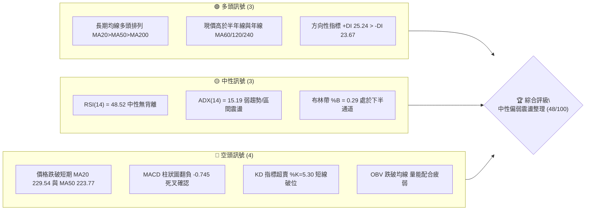
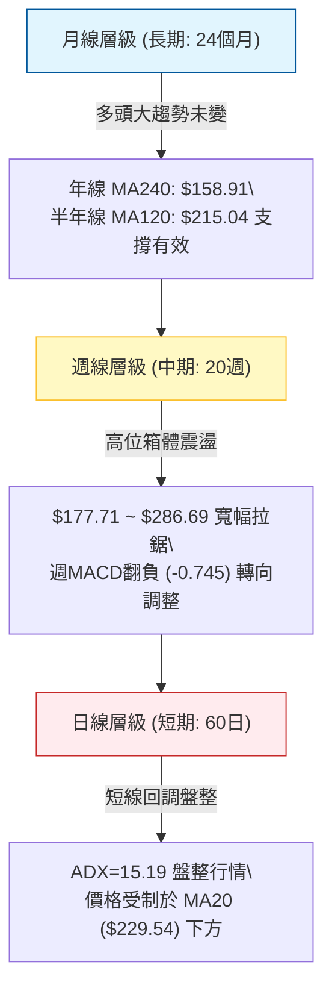
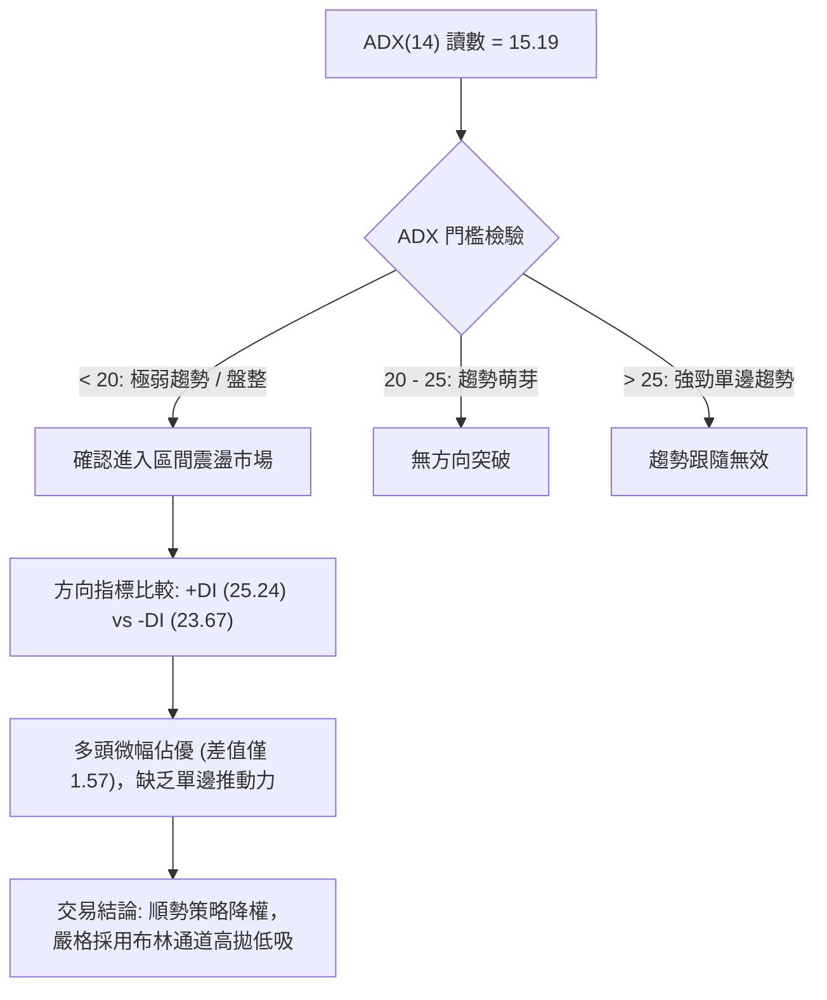
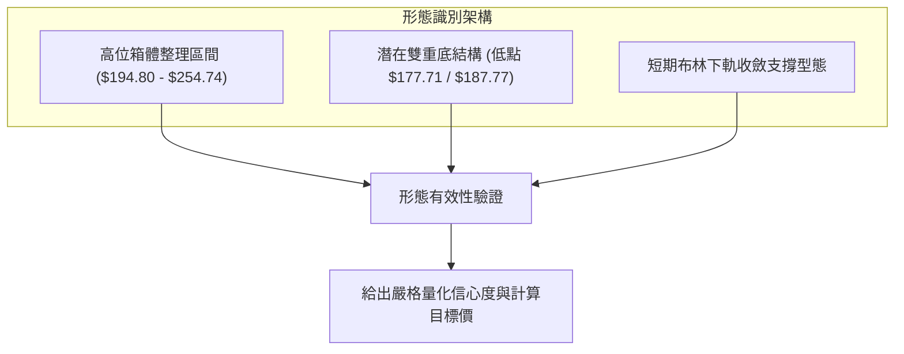
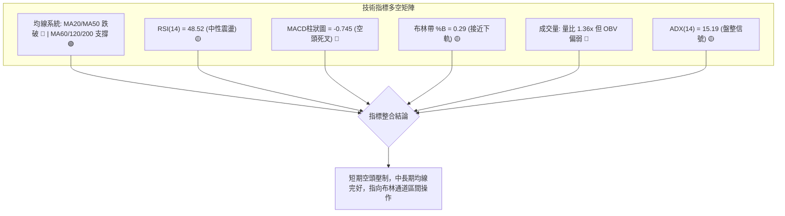
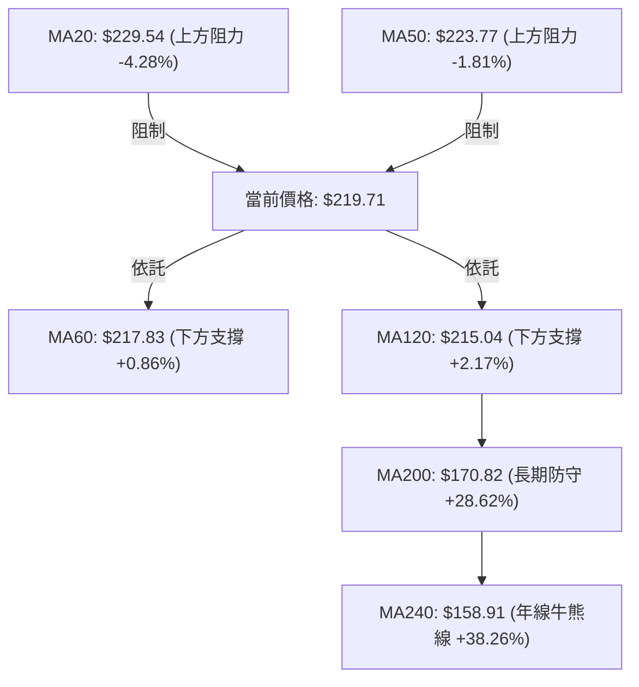
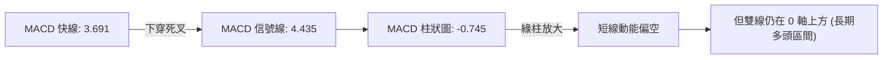
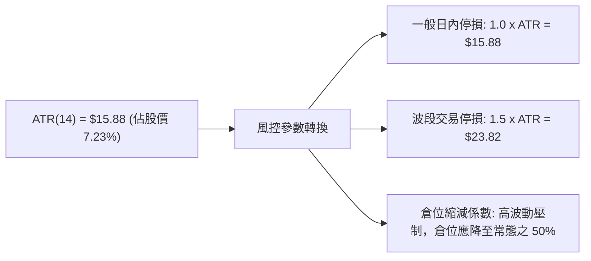
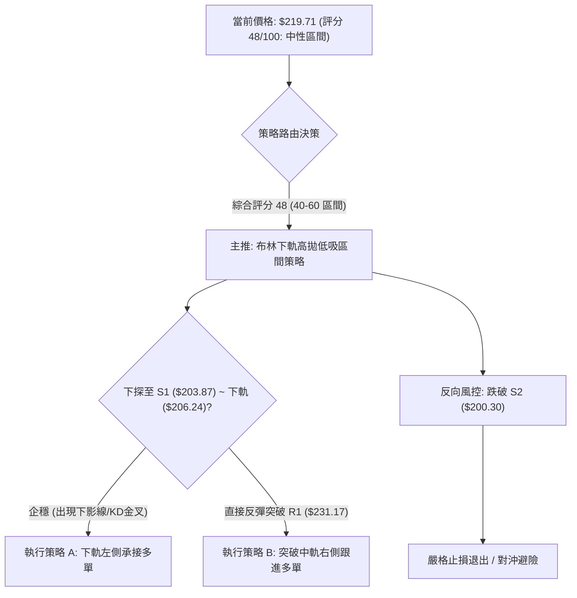
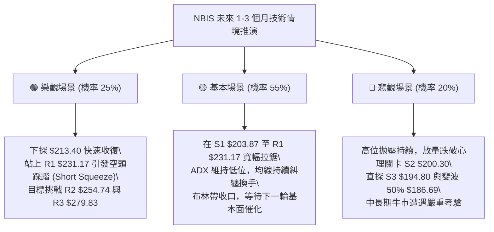

# NBIS 技術分析報告

> **報告日期**：2026-10-09 ｜ **語言**：繁體中文 ｜ **數據來源**：Yahoo Finance ｜ **當前價格**：$219.71

---

## 目錄

| 章節 | 內容 |
|------|------|
| [1. 技術面概覽](#1-技術面概覽) | 訊號儀表板、核心指標、評分卡 |
| [2. 趨勢分析](#2-趨勢分析) | 多時框趨勢、長中短期走勢 |
| [3. 圖表形態分析](#3-圖表形態分析) | 形態識別、K線組合、目標價 |
| [4. 支撐與阻力](#4-支撐與阻力) | 關鍵價位、斐波那契回調 |
| [5. 技術指標深度解讀](#5-技術指標深度解讀) | MA/RSI/MACD/布林/成交量 |
| [6. 動能與波動率](#6-動能與波動率) | 動能評估、ATR、Beta |
| [7. 多時框架總結](#7-多時框架總結) | 時框架評分矩陣 |
| [8. 交易策略建議](#8-交易策略建議) | 多空策略、風險報酬比 |
| [9. 風險提示與監控](#9-風險提示與監控) | 監控指標、風險場景 |

---

## 1. 技術面概覽

### 🎯 技術訊號儀表板



### 📊 核心指標速覽表

| 指標類別 | 指標名稱 | 當前數值 | 訊號 | 解讀 |
|----------|----------|----------|------|------|
| **價格** | 當前價格 | $219.71 | 🟡 | 位於52週區間64.6%處，自高點回調但守住長期中樞 |
| **均線** | MA20 | $229.54 | 🔴 | 價格低於MA20 (-4.28%)，短線承壓於中軌 |
| **均線** | MA50 | $223.77 | 🔴 | 價格跌破中期MA50 (-1.81%)，轉為短期阻力 |
| **均線** | MA200 | $170.82 | 🟢 | 價格遠高於長期MA200 (+28.62%)，長期牛市架構完好 |
| **動能** | RSI(14) | 48.52 | 🟡 | 處於40–60中性偏弱區間，多空博弈均勻無背離 |
| **動能** | MACD柱 | -0.745 | 🔴 | MACD線(3.691)下穿信號線(4.435)，空頭佔優 |
| **動能** | Stoch %K/%D | 5.30 / 51.24 | 🔴 | %K嚴重超賣，顯示短線急跌後具備技術反抽條件 |
| **趨勢強度** | ADX(14) | 15.19 | 🟡 | ADX < 25，確認進入無明確單邊趨勢的盤整行情 |
| **波動** | ATR(14) | $15.88 | 🟡 | 日波動率達7.23%，維持高波動特性，風控距離需放寬 |
| **量能** | 成交量比 | 1.36x | 🔴 | 成交量放大但OBV < MA，顯示空頭拋壓主導量能 |

### 🏆 技術評分卡

```
╔══════════════════════════════════════════════════════════════╗
║                技術評分卡 — NBIS (2026-10-09)                 ║
╠══════════════════════════════════════════════════════════════╣
║ 趨勢強度 (ADX<25 盤整)    ██████░░░░░░░░░░░░░░  30/100  🔴   ║
║ 動能指標 (RSI中性/MACD翻空)████████░░░░░░░░░░░░  40/100  🟡   ║
║ 支撐穩定度 (守住斐波38.2%) ██████████████░░░░░░  70/100  🟢   ║
║ 成交量配合 (OBV疲軟放量跌) ████████░░░░░░░░░░░░  40/100  🟡   ║
║ 形態完整度 (大區間箱體)    ████████████░░░░░░░░  60/100  🟡   ║
║ 均線排列 (長多短空交織)    ██████████░░░░░░░░░░  50/100  🟡   ║
╠══════════════════════════════════════════════════════════════╣
║ 綜合評分                  █████████░░░░░░░░░░░  48/100  中性  ║
╚══════════════════════════════════════════════════════════════╝
```

---

## 2. 趨勢分析

### 🌐 多時框趨勢分析



依多時框收斂規則（規則14）：當前日線 ADX(14) 為 15.19（< 25），**當前市場定性為典型的「盤整行情」**。在此環境下，單邊趨勢突破指標失效，以日線布林通道上下軌（$206.24 ~ $252.84）與波段支撐阻力為核心交易框架。

### 📈 長期趨勢 — 12個月走勢圖（Unicode）

```
NBIS 月線收盤走勢圖（2025-11 至 2026-10）
價格軸 ($)
$280 ┤                                  ● $276.17 (2026-06 高點)
$260 ┤
$240 ┤                                      ● $235.88
$220 ┤                             ● $231.09        ● $219.71 (當前)
$200 ┤                                          ● $206.32
$180 ┤                                      ● $190.41
$140 ┤                         ● $138.23
$120 ┤
$100 ┤ ● $94.87           ● $103.76
$80  ┤     ● $83.71   ● $91.19
     └─┬─────┬─────┬─────┬─────┬─────┬─────┬─────┬─────┬─────┬─────┬─────
     11月   12月  01月  02月  03月  04月  05月  06月  07月  08月  09月  10月
     (2025)       (2026)
```

#### 走勢特徵分析表格

| 階段 | 時間區間 | 起止價位 | 漲跌幅 | 走勢特徵與結構解讀 |
|------|----------|----------|--------|--------------------|
| 築底蓄勢期 | 2025-11 ~ 2026-02 | $94.87 → $91.19 | -3.88% | 在 $83.71 ~ $94.87 區間形成堅實底部平台，完成籌碼換手 |
| 主升浪加速期 | 2026-03 ~ 2026-06 | $103.76 → $276.17 | +166.16% | 連續4個月大陽線放量暴漲，創歷史波段新高 $299.86，AI基建溢價爆發 |
| 寬幅震盪回調期 | 2026-07 ~ 2026-10 | $190.41 → $219.71 | +15.39% | 劇烈洗盤，7月深跌至 $177.71 週低點後快速拉回，構築高位收斂箱體 |

### 📊 中期趨勢（週線分析）

從近 20 週數據觀察，NBIS 呈現典型的巨幅震盪盤整格局。2026 年 6 月創下週收盤高點 $286.69，隨後於 7 月 19 日當週暴跌至收盤 $177.71，8 月 16 日當週強勁反彈至收盤 $277.68，隨後再度回落。

```
NBIS 週線波段架構示意圖
$300 ┬─ 52W 最高點 $299.86 ────────────────────────── (歷史強阻力)
     │       ▲ 2026-06-21 ($286.69)
$270 ┼───────┴─────────────────── ▲ 2026-08-16 ($277.68 週收盤阻力)
     │
$240 ┼─────────────────── 現價上方阻力區 R1 $231.17 / R2 $254.74
$220 ┼─────── 現價: $219.71 ── (斐波那契 38.2% $213.40 支撐帶)
     │
$200 ┼─────────────────── 關鍵支撐 S1 $203.87 / S2 $200.30
     │
$170 ┴─────── ▼ 2026-07-19 ($177.71 中期波段防守底線)
```

### ⚡ 趨勢強度評估（ADX 解讀）



| 參數 | 數值 | 狀態 | 技術解讀 |
|------|------|------|----------|
| **ADX(14)** | 15.19 | 弱趨勢/盤整 | 遠低於 25 臨界線，顯示單邊推動力竭盡，市場處於無序波動與蓄勢狀態 |
| **+DI** | 25.24 | 多頭微佔優 | 多頭力量仍未潰散，高於空頭力量 |
| **-DI** | 23.67 | 空頭反撲 | 空頭動能與多頭基本持平，形成拉鋸戰 |
| **DI差值** | +1.57 | 均衡偏多 | 差值微小，禁止在此階段進行追漲殺跌型單邊趨勢交易 |

---

## 3. 圖表形態分析

### 🔍 形態識別系統



#### 形態識別與信心度評估表

| 形態 | 信心度 | 判斷依據（引用數據） | 完成度 | 目標價（附計算式） |
|------|--------|----------------------|--------|--------------------|
| **高位箱體整理** | **78%** | 價格在近 12 週內受阻於 R2 $254.74，下獲 S1 $203.87 支撐，均線糾纏 | 85% | 向上突破箱頂 R2 $254.74 後：目標 = $254.74 + ($254.74 - $203.87) = **$305.61**（數據中波段高點阻力為 R3 **$279.83**） |
| **中期雙重底 (W底)** | **58%** | 週線 2026-07-19 低點 $177.71 與 2026-08-09 低點 $187.97，頸線為 2026-08-16 收盤 $277.68 | 60% (已大幅回撤) | 頸線 $277.68 未能穩固站上，形態高度 = $277.68 - $177.71 = $99.97；目標價理論值 $377.65。但目前跌回頸線下方，信心度偏低 |
| **短期布林軌道回踩** | **72%** | 現價 $219.71 跌破中軌 $229.54，逼近下軌 $206.24 與 S1 $203.87 | 90% | 下軌反抽目標即中軌 MA20 = **$229.54**，進一步看 R1 **$231.17** |

### 🕯️ 重要K線形態分析

| 日期/月份 | 收盤價 | K線形態 | 解讀 | 訊號 |
|-----------|--------|---------|------|------|
| **2026-06** | $276.17 | 月線長上影大陽線 | 盤中衝擊 52W 高點 $299.86 後巨幅回吐，顯示高檔賣壓極重 | 🔴 見頂滯漲 |
| **2026-07** | $190.41 | 月線長下影大陰線 | 快速砸盤至 $177.71 後收復失地，多頭在 $180 附近展現極強承接力 | 🟢 長期探底回升 |
| **2026-08** | $206.32 | 震盪十字星伴隨天量 | 週成交量爆出 1.67 億股天量，多空在中軸激戰，洗盤性質明顯 | 🟡 多空均衡 |
| **2026-09** | $235.88 | 中陽線突破 | 價格重回短期均線之上，動能試圖轉強但量能未創歷史新高 | 🟢 短線轉多 |
| **2026-10 (當前)** | $219.71 | 短線連陰回吐棒 | 自 10-04 當週 $242.81 快速殺跌至 $219.71，短線回踩布林下半部 | 🔴 短期拉回 |

### 📉 ASCII 走勢形態示意圖

```
高位箱體整理區間走勢示意（日線/週線維度）
$260 ┤               ▲ 阻力高點聚類 R2: $254.74
     │              / \     ▲
$240 ┤             /   \   / \        ▲ 頸線壓制 R1: $231.17
     │            /     \ /   \      / \
$220 ┤───────────/─────── V ───\────/───● 現價: $219.71 (斐波 38.2%: $213.40)
     │          /               \  /
$200 ┤         /                 \/ 支撐低點聚類 S1: $203.87 / S2: $200.30
     │        /
$180 ┤       ▼ 中期強低點 ($177.71)
     └──────────────────────────────────────────────────────────
```

### 🎯 形態目標價計算

根據日線箱體震盪形態測算：
1. **箱體上限（阻力線）**：取近一年波段高點聚類 **R2 = $254.74**。
2. **箱體下限（支撐線）**：取近一年波段低點聚類 **S1 = $203.87**。
3. **箱體垂直高度**：$254.74 - $203.87 = **$50.87**。
4. **有效突破目標價**：
   - **向上突破 R2 ($254.74)**：$254.74 + $50.87 = **$305.61**（在數據關鍵價位中，對應最終波段阻力為 R3 **$279.83** 及歷史高點 **$299.86**）。
   - **向下跌破 S1 ($203.87)**：$203.87 - $50.87 = **$153.00**（在數據中，對應長期年線 MA240 **$158.91** 及斐波那契 61.8% **$159.98** 支撐）。

---

## 4. 支撐與阻力

### 🗺️ 關鍵價位分布圖（Unicode）

```
NBIS 價位結構分布圖
═════════════════════════════════════════════════════════════════
$299.86 ║██████████████████████████████████████║ 52W 最高點 / 斐波 0.0%
$279.83 ║██████████████████████████████        ║ 強阻力 R3 (+27.37%)
$254.74 ║████████████████████████              ║ 重要阻力 R2 (+15.94%)
$246.44 ║██████████████████                    ║ 斐波那契 23.6% 回調位
$231.17 ║██████████████                        ║ 近期阻力 R1 (+5.21%)
$229.54 ║──────────────────────────────────────║ 布林中軌 (MA20)
════════╠══════════════════════════════════════╣ ◄ 當前價格 $219.71
$213.40 ║▓▓▓▓▓▓▓▓▓▓▓▓▓▓▓▓                      ║ 斐波那契 38.2% 回調位
$206.24 ║▓▓▓▓▓▓▓▓▓▓▓▓▓▓▓▓▓▓▓▓                  ║ 布林通道下軌
$203.87 ║████████████████████████              ║ 關鍵支撐 S1 (-7.21%)
$200.30 ║██████████████████████████            ║ 整數心理支撐 S2 (-8.83%)
$194.80 ║████████████████████████████          ║ 強防守支撐 S3 (-11.34%)
$186.69 ║████████████████████████████████      ║ 斐波那契 50.0% 回調位
$170.82 ║████████████████████████████████████  ║ 牛熊分界線 (MA200)
═════════════════════════════════════════════════════════════════
```

### 🚧 阻力位分析表

| 阻力級別 | 價位 | 形成原因 | 突破難度 | 重要性 |
|----------|------|----------|----------|--------|
| **R1** | **$231.17** | 近期波段高點密集區，疊加 MA20 ($229.54) 下壓處 | 🟡 中等 | 短期多空分水嶺，站穩方能化解空頭下殺動能 |
| **R2** | **$254.74** | 近一年波段密集高點聚類，接近布林上軌 ($252.84) 與斐波 23.6% ($246.44) | 🔴 高 | 中期箱體震盪上頂，需日成交量突破 2,000 萬股方可衝破 |
| **R3** | **$279.83** | 2026-08-16 週收盤高點 ($277.68) 聚類，歷史天量被套籌碼區 | 🔴 極高 | 波段牛市重啟之關鍵天花板，臨近 52W 高點 $299.86 |

### 🛡️ 支撐位分析表

| 支撐級別 | 價位 | 形成原因 | 守住機率 | 重要性 |
|----------|------|----------|----------|--------|
| **S1** | **$203.87** | 近一年波段低點聚類，重疊布林下軌 ($206.24) 緩衝區 | 🟢 70% | 短線多頭防禦第一線，跌破則預示短線調整加深 |
| **S2** | **$200.30** | 近一年波段低點聚類，兼具 $200 整數關卡心理支撐 | 🟢 75% | 多頭核心心理底線，具備極強右側買盤支撐 |
| **S3** | **$194.80** | 近一年強波段低點聚類，接近 2026-07/08 月收盤平台 ($190.41) | 🟢 85% | 中期生命線，跌破將下探斐波 50% ($186.69) 與 MA200 |

### 📐 斐波那契回調位分析

依據 52 週絕對低點 **$73.52** 至 52 週絕對高點 **$299.86** 的波段黃金分割測算：

| 斐波那契層級 | 精確價位 | 相對現價位置 | 技術意義與多空意義解讀 |
|--------------|----------|--------------|------------------------|
| **0.0% (高點)** | $299.86 | +36.48% | 52 週歷史天花板，絕對阻力 |
| **23.6%** | $246.44 | +12.17% | 弱勢回調強阻力位，位於 R1 與 R2 之間 |
| **38.2%** | **$213.40** | **-2.87%** | **黃金分割第一回調支撐位**。現價 $219.71 緊貼此線上運行，是目前多頭最直接依託的結構性支撐 |
| **50.0%** | $186.69 | -15.03% | 多空中軸平衡線，2026 年 7 月低點 ($177.71) 曾在此位置下方迅速收回 |
| **61.8%** | $159.98 | -27.19% | 牛市生死分界線（黃金回撤極限），重疊 MA240 ($158.91) |
| **78.6%** | $121.96 | -44.49% | 深幅回撤防守位（當前無破位風險） |
| **100.0% (低點)** | $73.52 | -66.54% | 52 週絕對起漲點 |

**解讀結論**：當前現價 $219.71 精準落於 **23.6% ($246.44)** 與 **38.2% ($213.40)** 之間。38.2% 回調位 $213.40 為牛市強勢拉回的常態防線，只要週線收盤不破 $213.40，中長期多頭架構便維持健康。

---

## 5. 技術指標深度解讀

### 🎛️ 指標訊號總覽



### 📈 移動平均線排列分析



均線系統展現出高度「長短撕裂」的特徵：
- **短期均線**：MA5 ($236.42)、MA10 ($235.68) 與 MA20 ($229.54) 呈現空頭排列且向下發散，現價受制於短天期均線壓制。
- **中期均線**：現價在 MA60 ($217.83) 與 MA120 ($215.04) 處獲得微幅支撐，顯示 2–4 個月持有者成本區在此形成天然緩衝。
- **長期均線**：MA20 ($229.54) > MA50 ($223.77) > MA200 ($170.82)，大週期均線呈現標準多頭排列，確認長期上升趨勢未受實質破壞。

### 📉 RSI(14) 分析

```
RSI(14) 指標狀態進度條：
0 ────── 超賣(30) ────────────────── 中性(50) ────────────────── 超買(70) ────── 100
[████████████████████████░░░░░░░░░░░░░░░░░░░░░░░░░] 48.52
```

- **當前數值**：**48.52**，處於中性水準。
- **區間評估**：既未進入 70 以上的超買極值區，亦未觸及 30 以下的超賣深淵。目前在 45–55 的平衡帶震盪，符合 ADX 指向的盤整特性。
- **背離判斷**：
  - **頂背離**：無。前高 $277.68 時 RSI 達 67.2，近期高點 $242.81 時 RSI 達 66.5，價格高點降低伴隨 RSI 同步降低，未形成頂背離。
  - **底背離**：無。近兩週價格自 $242.81 回調至 $219.71，RSI 由 66.5 回落至 48.5，指標同步拉回，屬正常能量釋放。
- **結論**：RSI 處於良性蓄勢期，未發出極端反轉警告。

### 📊 MACD(12/26/9) 訊號解讀



- **MACD 快線**：3.691
- **信號線 (Signal)**：4.435
- **柱狀圖 (Histogram)**：**-0.745**（🔴 看空訊號）
- **背離與動能解讀**：
  MACD 快線在 0 軸上方下穿信號線，柱狀圖轉為負值（-0.745），構成短線「零軸上死叉」。這通常反映強勢行情中的深度回調，而非趨勢徹底逆轉。週線級別 MACD 柱連續兩週由正轉負（+1.113 轉為 -0.745），確認中期動能處於修正週期，至少需要 1–2 週的低位震盪方能重新聚集上攻動能。

### 📦 布林通道分析

```
NBIS 布林通道 (20, 2) 結構圖
$252.84 ┬──────────────────────────────────────────── BB 上軌 (阻力帶)
        │
$240.00 ┼
        │
$229.54 ┼──────────────────────────────────────────── BB 中軌 / MA20 (多空分水嶺)
        │
$219.71 ┼─────────◄ 當前價格 ($219.71, %B = 0.29)
        │
$206.24 ┴──────────────────────────────────────────── BB 下軌 (支撐帶)
```

- **上軌**：$252.84
- **中軌 (MA20)**：$229.54
- **下軌**：$206.24
- **帶寬與位置 (%B)**：%B 為 **0.29**（0=下軌，1=上軌）。現價 $219.71 處於下軌至中軌之間的中下部。
- **解讀**：由於 ADX 為 15.19，通道上下軌具有高度邊界約束力。現價距下軌 $206.24 僅有約 6.1% 空間，而距中軌有 4.5% 空間，顯示下行空間受下軌與 S1 ($203.87) 緊密壓制，逐步進入「超跌反彈」概率較高的防守區間。

### 💹 成交量分析（量價配合度）

- **最新成交量**：21,849,400 股
- **20日均量**：16,118,075 股（量比 1.36x）
- **50日均量**：19,882,556 股
- **量價特徵**：最新交易日成交量達到 2,185 萬股，量比為 1.36 倍，屬於「放量下跌」。放量下殺反映在跌破 MA20 與 MA50 時引發了部分短線止損盤。
- **OBV 能量潮解讀**：數據顯示「OBV < MA → 量能疲弱」。OBV 處於均線下方，說明在近幾週的震盪中，資金主力並未進行積極的吸籌，成交量的放大更偏向於籌碼派發與被動接盤。因此，量能端尚未發出底部放量反轉的確認訊號。

---

## 6. 動能與波動率

### ⚡ 動能評估四象限

| 象限 | 動能維度 | 波動率維度 | NBIS 當前歸屬 | 戰術含義與評估 |
|------|----------|------------|:-------------:|----------------|
| **Q1 (主升浪)** | 強動能 (RSI>60, MACD金叉) | 低/適中波動 (ATR%<5%) | ❌ | 最佳牛市跟隨機會（非當前） |
| **Q2 (蓄勢期)** | 弱動能 (RSI 40–60, MACD死叉) | 低波動 (ATR%<5%) | ❌ | 謹慎觀望，等待突破 |
| **Q3 (洗盤震盪)** | **中弱動能 (MACD翻負, ADX<25)** | **高波動 (ATR%=7.23%, Beta=1.46)** | **✅ 當前狀態** | **高波動/低趨勢：典型洗盤行情，禁止重倉單邊突破追單，僅宜網格或邊界低吸** |
| **Q4 (恐慌出逃)** | 極弱動能 (RSI<30, 破位) | 高波動 (ATR%>8%) | ❌ | 避免進場，恐慌殺跌 |

### 📊 ATR 波動率分析



- **數值**：**$15.88**（佔當前股價的 **7.23%**）。
- **解讀**：每日平均波動高達 16 美元左右，屬於極高波動標的。這意味著正常的日間隨機雜訊極易觸發過於狹窄的止損點。
- **風控指引**：
  - 日內操作防守寬度不得小於 $16.00。
  - 波段持倉安全防守距離建議設在 1.5 倍 ATR（約 $23.80）以上，否則極易在布林通道內部的正常洗盤中被震盪出局。

### 📐 Beta 與市場相關性

- **Beta 係數**：**1.46**
- **市場屬性**：高彈性、高貝塔成長股。當美股大盤（標普500 / 納斯達克100）上漲 1% 時，該股預期上漲 1.46%；大盤回調 1% 時，該股平均下跌 1.46%。
- **空頭部位特徵**：Short Ratio 2.76，Short % Float 高達 **19.8%**。高達近 20% 的流通股被做空，結合 1.46 的高 Beta 特性，一旦股價觸底反彈並站上重要阻力（如 R1 $231.17），極易引發劇烈的軋空（Short Squeeze）行情。

---

## 7. 多時框架總結

### 📋 時框架評分表

| 時框架 | 趨勢方向 | 動能狀態 | 均線排列 | 圖表形態 | 綜合評分 | 戰術建議 |
|--------|----------|----------|----------|----------|:--------:|----------|
| **月線 (長期)** | 🟢 強烈看多 | 🟢 充沛 | 🟢 MA240多頭 | 長期主升浪回調 | **80/100** | 核心長多底倉繼續持有，背靠 $170 堅定持股 |
| **週線 (中期)** | 🟡 箱體震盪 | 🔴 MACD柱轉負 | 🟡 MA20糾纏 | 寬幅收斂箱體 | **50/100** | 在 $200–$255 區間高拋低吸，不追單邊單 |
| **日線 (短期)** | 🔴 弱勢回調 | 🔴 KD超賣/MACD死叉 | 🔴 跌破MA20/50 | 下軌回踩測試 | **38/100** | 短線等待回踩下軌確認企穩，尋求右側買點 |

### 🔲 綜合訊號矩陣

```
時框架訊號矩陣對照
維度            短期 (日線)       中期 (週線)       長期 (月線)
─────────────────────────────────────────────────────────────
趨勢方向        🔴 偏空回調       🟡 橫盤震盪       🟢 多頭主導
動能指標        🔴 動能衰竭       🟡 中性偏弱       🟢 強勢續航
均線排列        🔴 短均線反壓     🟡 糾纏黏合       🟢 完美多頭
量能配合        🔴 放量下跌       🟡 天量後萎縮     🟢 堆量健康
結構邊界        下探布林下軌      考驗箱體下沿      回踩斐波38.2%
```

### ⚖️ 多時框收斂結論

> **依據「嚴格要求 14」之收斂裁決**：
> 1. **趨勢/盤整判定**：當前 ADX(14) 讀數為 **15.19**（< 25），嚴格判定為**「盤整行情」**。
> 2. **主導維度**：趨勢跟隨無效，中短期主要交易信號收斂至**日線布林通道上下軌（$206.24 ~ $252.84）**與支撐阻力聚類區。
> 3. **衝突化解**：雖然長期均線（MA200 $170.82）極度看多，但短期受制於 MA20/MA50 跌破與放量下殺壓制。在盤整架構下，中長期牛市提供「下檔支撐的堅定安全墊」，而短期空頭動能提供「向下軌靠攏的動能」。
> 4. **唯一方向結論**：**中性偏弱震盪整理，下軌逢低防守（中性觀望 48/100）**。

---

## 8. 交易策略建議

### 🗺️ 策略決策流程圖



### 🧭 策略路由（依評分卡分流）

**當前主策略方向 = 中性震盪區間操作（依綜合評分 48/100）**
依規則 14 與綜合評分（48/100 處於 40–60 中性區間），市場既無單邊做多條件，亦無深跌破位依據。主策略定位為**「布林下軌至中軌之區間操作，嚴密等待邊界確認」**。

### 🎯 價格情境階梯（Price Scenarios）

所有價位均嚴格引用第 4 章波段計算數據：

| 觸發條件 | 下一目標 | 後續延伸 | 情境含義 |
|----------|----------|----------|----------|
| **強勢突破 R1 $231.17** | **R2 $254.74** | **R3 $279.83** | **短線轉強**：重回 MA20 上方，打開向上軌與箱頂攻擊空間 |
| **守住現價至 S1 區間** | **中軌 $229.54** | **R1 $231.17** | **區間震盪**：在斐波 38.2% ($213.40) 與 S1 ($203.87) 獲得支撐回抽中軌 |
| **放量跌破 S1 $203.87** | **S2 $200.30** | **S3 $194.80** | **中期轉弱**：跌破布林下軌，考驗整數關卡與中期箱體底線 |

### 📊 情境機率分佈

| 情境 | 機率 | 主要依據 |
|------|:----:|----------|
| **情境一：下探下軌後反彈震盪** | **55%** | ADX=15.19 確立盤整，布林下軌 $206.24 與 S1 $203.87 提供雙重支撐，Stoch %K=5.30 嚴重超賣具備反彈動能 |
| **情境二：直接突破中軌上行** | **25%** | +DI (25.24) 仍微高於 -DI (23.67)，機構持股 69.8%，空頭回補（Short Float 19.8%）可能引發突發反彈 |
| **情境三：跌破 S2 深度探底** | **20%** | OBV 疲軟，成交量大於均量下殺，若跌破 $200.30 支撐將引發技術性停損潮 |

### 🟢 主策略詳情（區間操作多頭方案）

所有關鍵點位嚴格引用自數據清單：

| 策略要素 | 策略 A（下軌邊界低吸 — 穩健型） | 策略 B（右側突破跟進 — 積極型） |
|----------|----------------------------------|----------------------------------|
| **進場條件** | 價格回踩布林下軌與 S1 企穩 | 放量突破並日線收盤站上 R1 |
| **進場價格** | **$206.24**（布林下軌附近掛單） | **$231.17**（突破 R1 確認進場） |
| **目標價 T1** | **$229.54**（布林中軌 / MA20） | **$254.74**（波段阻力 R2） |
| **目標價 T2** | **$254.74**（阻力 R2 / 箱頂） | **$279.83**（強阻力 R3） |
| **止損價格** | **$194.80**（強支撐 S3 下方防守） | **$219.71**（跌回現價 / 突破起點） |
| **風險空間** | $206.24 - $194.80 = $11.44 | $231.17 - $219.71 = $11.46 |
| **報酬空間 (T1)**| $229.54 - $206.24 = $23.30 | $254.74 - $231.17 = $23.57 |
| **風險報酬比** | **1 : 2.04** | **1 : 2.06** |
| **成功機率** | **65%** | **55%** |
| **建議倉位** | **10% ~ 15%** | **10%** |

### 🔴 反向風險觸發點（對沖與風控提示）

若出現以下訊號，主推區間偏多反彈策略**立即失效**，應轉為防守或執行空頭對沖：
1. **破位止損觸發**：日線收盤價**跌破 S2 $200.30**，特別是跌破 **S3 $194.80**，確認箱體下沿支撐徹底崩解。
2. **量能惡化**：日成交量超過 3,000 萬股大陰線摜破 $200.30，且 OBV 加速下行。
3. **對沖目標**：跌破 S3 $194.80 後，空頭下一延伸目標為斐波那契 50% **$186.69** 及 MA200 **$170.82**。

### ⭐ 整體訊號強度評星

```
做多訊號強度：★★☆☆☆  (2/5星 - 需等待下軌支撐確認)
做空訊號強度：★★☆☆☆  (2/5星 - 長期均線強支撐，賠率不佳)
整體可信度：  ★★★☆☆  (3/5星 - ADX<25 震盪指標具備較高參考性)
```

---

## 9. 風險提示與監控

### ✅ 關鍵監控指標 Checklist

```
╔══════════════════════════════════════════════════════════════╗
║                   NBIS 技術面日常監控清單                    ║
╠══════════════════════════════════════════════════════════════╣
║ [ ] 價格能否守住斐波那契 38.2% 回調位 ($213.40)              ║
║ [ ] 布林通道下軌 ($206.24) 是否出現止跌 K 線（錘子線/孕線）  ║
║ [ ] 日成交量是否萎縮至 20 日均量 ($1,611 萬股) 以下（惜售）  ║
║ [ ] RSI(14) 能否在 40 附近獲得支撐並重新金叉向上             ║
║ [ ] Stoch %K 能否從 5.30 超賣區由下往上穿越 %D (51.24)       ║
║ [ ] MACD 柱狀圖負值 (-0.745) 是否開始逐日縮短收斂            ║
║ [ ] 空頭指標 Short Float (19.8%) 是否出現空頭回補跡象        ║
╚══════════════════════════════════════════════════════════════╝
```

### ⚠️ 風險場景分析



### 🛡️ 風險管理重要提醒

1. **ATR 波動適應性倉位管理**：NBIS 之 ATR 高達 **$15.88**（7.23%），此類標的萬萬不可重倉搏弈。建議單筆交易承擔之風險不應超過投資組合總資產的 **1.0%**。以 10 萬美元賬戶為例，單筆最大允許虧損為 1,000 美元；若止損幅度為 $11.44（如策略 A），則最大持倉股數應嚴格限制在 87 股以內（約 $18,000 市值，即總倉位 18% 以下）。
2. **財報與 AI 產業事件風險**：公司本益比偏高（Trailing P/E 171.65），EV/Sales 達 46.03，估值高度依賴 AI 算力基建的高增長預期。技術分析雖顯示中長期牛市架構，但任何超預期的產業 Capex 縮減消息均可能直接引發技術支撐擊穿，跌破 S3 $194.80 必須無條件執行風控。
3. **做空擠壓雙刃劍**：空頭比例高達 19.8%，空頭回補將帶來劇烈暴漲，而逼空未果則會加劇滾動拋壓。嚴禁在支撐未確認前盲目左側重倉「抄底」。

---

## 📋 報告總結

```
╔══════════════════════════════════════════════════════════════╗
║                   NBIS 技術分析報告總結                      ║
╠══════════════════════════════════════════════════════════════╣
║ 報告日期：2026-10-09                                         ║
║ 當前價格：$219.71                                            ║
║ 分析評級：⚖️ 中性偏弱震盪整理 (評分 48/100)                  ║
║                                                              ║
║ 關鍵結論：                                                   ║
║ ├─ 長期趨勢：🟢 完好多頭排列 (MA200 $170.82 穩固向上)         ║
║ ├─ 中期趨勢：🟡 寬幅箱體震盪 (受制於 $254.74 箱頂壓制)       ║
║ ├─ 短期趨勢：🔴 跌破短期均線 (考驗斐波 38.2% 與下軌支撐)     ║
║ ├─ 關鍵支撐：S1: $203.87 ｜ S2: $200.30 ｜ S3: $194.80       ║
║ ├─ 關鍵阻力：R1: $231.17 ｜ R2: $254.74 ｜ R3: $279.83       ║
║ └─ 分析師目標共識：$283.60 (覆蓋區間 $84.00 - $410.00)       ║
║                                                              ║
║ 最優策略組合：                                               ║
║ 1. 🥇 最佳機會：回踩布林下軌 $206.24 / S1 $203.87 分批輕倉低吸║
║ 2. 🥈 次選機會：突破站穩 R1 $231.17 右側進場，博弈空頭回補   ║
║ 3. 🥉 保守選擇：場外觀望，等待日線 KD 超賣金叉與 MACD 翻紅   ║
╚══════════════════════════════════════════════════════════════╝
```

---

> ⚠️ **免責聲明**：本報告為技術分析研究，所有數據、圖表及價位估算均基於歷史量價數據與量化指標。本報告**僅供研究與學術參考**，**不構成任何要約、招攬或投資建議**。高 Beta 與高空頭比例個股具備高度波動風險，投資人應獨立評估風險並嚴格執行風控紀律。

---

*報告生成時間：2026-10-09 ｜ 數據來源：Yahoo Finance ｜ 分析框架：多時框技術分析體系*