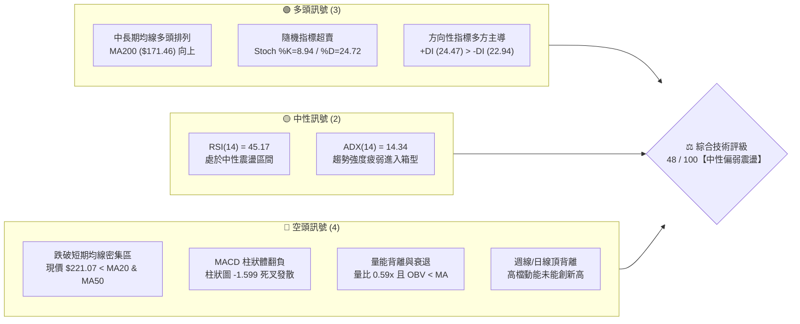
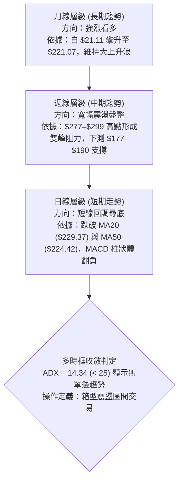
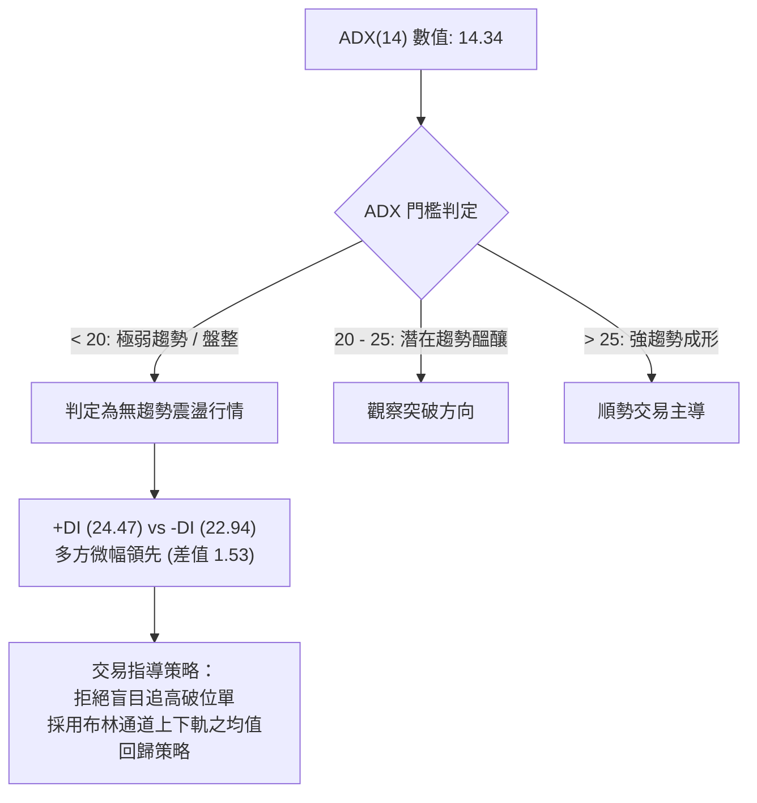
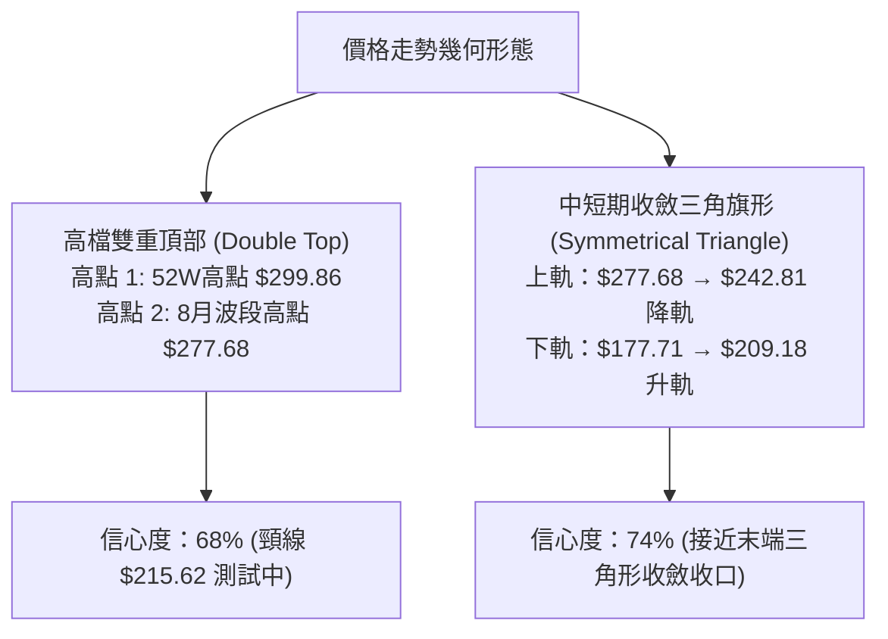
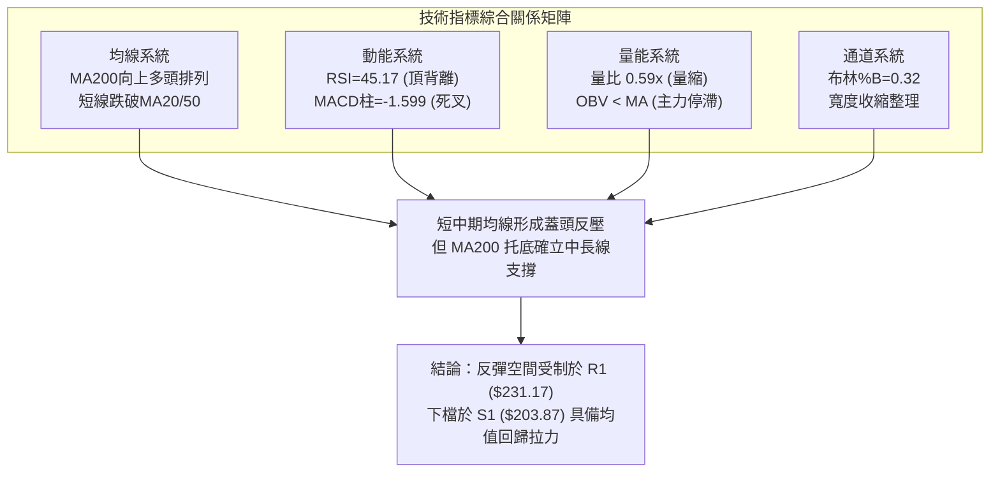
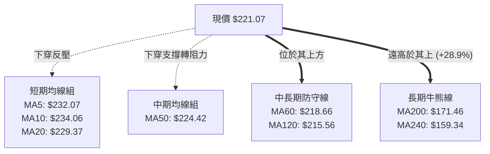
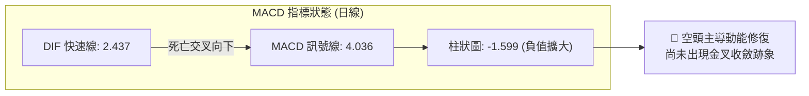
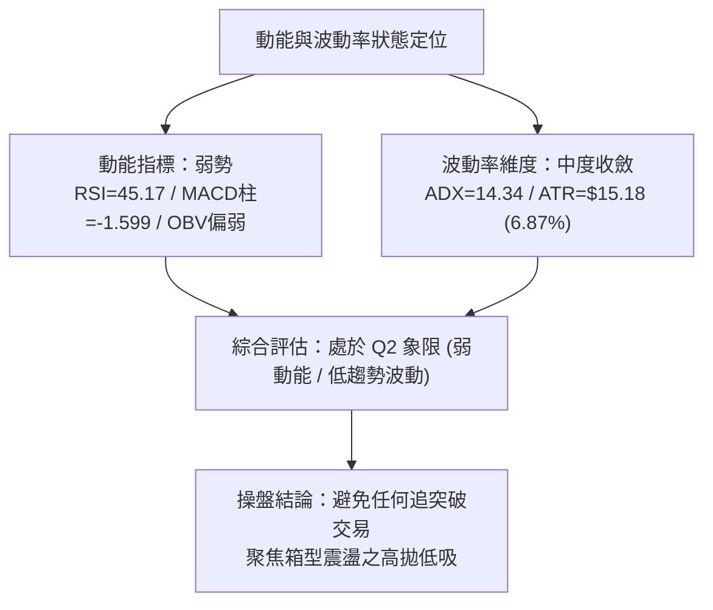
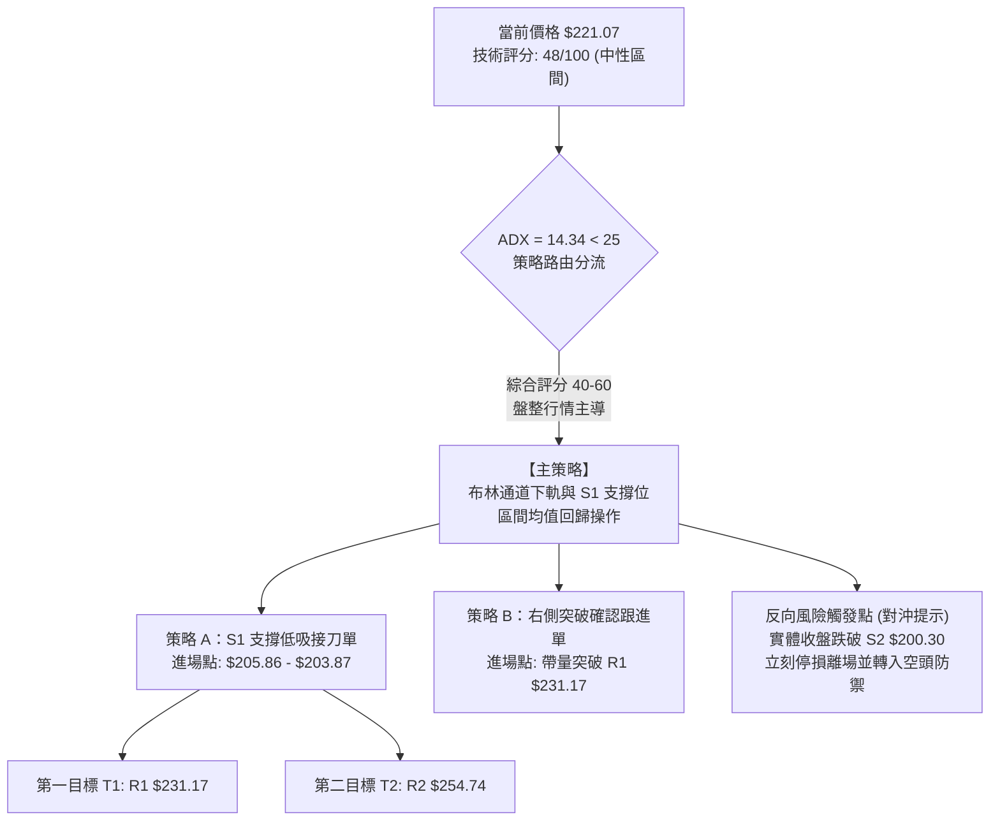
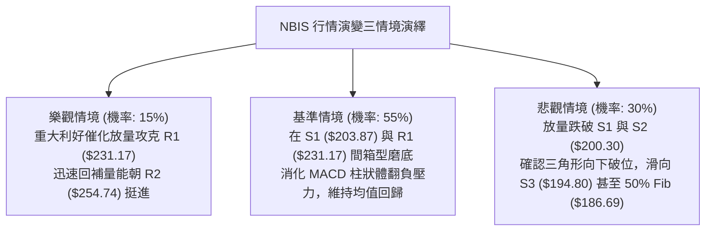

# NBIS 技術分析報告

> **報告日期**：2026-10-10 ｜ **語言**：繁體中文 ｜ **數據來源**：Yahoo Finance ｜ **當前價格**：$221.07

---

## 目錄

| 章節 | 內容 |
|------|------|
| [1. 技術面概覽](#1-技術面概覽) | 訊號儀表板、核心指標、評分卡 |
| [2. 趨勢分析](#2-趨勢分析) | 多時框趨勢、長中短期走勢、ADX解讀 |
| [3. 圖表形態分析](#3-圖表形態分析) | 形態識別信心度、K線組合、目標價推算 |
| [4. 支撐與阻力](#4-支撐與阻力) | 關鍵價位聚類、斐波那契回調結構 |
| [5. 技術指標深度解讀](#5-技術指標深度解讀) | 均線系統、RSI背離、MACD、布林通道、OBV |
| [6. 動能與波動率](#6-動能與波動率) | 動能四象限、ATR波幅、Beta相關性 |
| [7. 多時框架總結](#7-多時框架總結) | 時框架評分矩陣、收斂規則與結論 |
| [8. 交易策略建議](#8-交易策略建議) | 策略路由、階梯情境、區間交易主策略 |
| [9. 風險提示與監控](#9-風險提示與監控) | 監控清單、情境演變、倉位風控原則 |
| [📋 報告總結](#-報告總結) | 核心指標總結、多空戰略總覽 |

---

## 1. 技術面概覽

### 🎯 技術訊號儀表板



---

### 📊 核心指標速覽表

| 指標類別 | 指標名稱 | 當前數值 | 訊號 | 解讀 |
|----------|----------|----------|:----:|------|
| **價格** | 當前收盤價 | $221.07 | 🟡 | 位於 52 週區間 65.2% 位置，短線自高點回調震盪 |
| **均線** | 短期 MA20 | $229.37 | 🔴 | 現價位於 MA20 下方 (-3.62%)，短線承壓 |
| **均線** | 中期 MA50 | $224.42 | 🔴 | 現價跌破 MA50 (-1.49%)，中期上攻力道暫歇 |
| **均線** | 長期 MA200 | $171.46 | 🟢 | 現價遠高於 MA200 (+28.93%)，長線牛市格局未破 |
| **動能** | RSI(14) | 45.17 | 🟡 | 位於 40–50 中性偏弱區，日線確認頂背離修正中 |
| **動能** | MACD (12,26,9) | 2.437 / 4.036 | 🔴 | MACD 線下穿訊號線，柱狀體為 -1.599，短線空頭發散 |
| **動能** | KD 隨機指標 | %K 8.94 / %D 24.72 | 🟢 | 進入極度超賣區，短線具備技術性均值回歸反彈契機 |
| **趨勢強度** | ADX(14) | 14.34 | 🟡 | ADX < 25 表明處於無趨勢或寬幅箱型整理行情 |
| **通道** | 布林通道 %B | 0.32 | 🟡 | 價格運行於中軌 ($229.37) 與下軌 ($205.86) 間 |
| **量能** | 量比 / OBV | 0.59x / 疲弱 | 🔴 | 20日均量縮至 9.53M，OBV 落後均線，追價意願低迷 |
| **波動** | ATR(14) | $15.18 | 🟡 | 波動率佔股價 6.87%，單日波幅擴大，需嚴設止損 |

---

### 🏆 技術評分卡

```
╔══════════════════════════════════════════════════════════════════╗
║                   技術評分卡 — NBIS (2026-10-10)                 ║
╠══════════════════════════════════════════════════════════════════╣
║ 趨勢強度 (ADX=14.34)       ████░░░░░░░░░░░░░░░░  25/100  🔴 弱勢盤整 ║
║ 動能指標 (RSI/MACD/KD)     ████████░░░░░░░░░░░░  40/100  🟡 動能轉弱 ║
║ 均線排列 (長多短空結構)     ████████████░░░░░░░░  60/100  🟡 多頭承壓 ║
║ 支撐穩定度 (S1/S2防守)     ██████████████░░░░░░  70/100  🟢 買盤仍在 ║
║ 成交量能配合 (量縮/OBV弱)  ██████░░░░░░░░░░░░░░  30/100  🔴 量價背離 ║
║ 形態完整度 (箱型收斂)       ████████████░░░░░░░░  60/100  🟡 收斂整理 ║
╠══════════════════════════════════════════════════════════════════╣
║ 綜合技術得分               █████████░░░░░░░░░░░  48/100  ⚖️ 中性觀望 ║
╚══════════════════════════════════════════════════════════════════╝
```

---

## 2. 趨勢分析

### 🌐 多時框趨勢分析



---

### 📈 長期趨勢 — 12個月走勢圖（Unicode）

```
NBIS 月線收盤走勢圖（2025-11 至 2026-10）
價格軸 ($)
$280 ┤                                  ● $276.17 (2026-06)
$260 ┤                                 ╱ ╲
$240 ┤                                ╱   ╲          ● $235.88 (2026-09)
$220 ┤                               ╱     ╲        ╱ ╲
$200 ┤                              ╱       ●───────●   ● $221.07 (現在)
$180 ┤                   ● $138.23 ╱         $190.41    $206.32
$160 ┤                  ╱         ╱         (2026-07)  (2026-08)
$140 ┤                 ╱         ╱
$120 ┤                ╱    ● $231.09 (2026-05)
$100 ┤ ● $94.87      ● $103.76
 $80 ┤  ╲           ╱
 $60 ┤   ●─────────● $85.19 (2026-01)
     └─┬─────┬─────┬─────┬─────┬─────┬─────┬─────┬─────┬─────┬─────┬───
      11月  12月  01月  02月  03月  04月  05月  06月  07月  08月  09月 10月
      2025  2025  2026  2026  2026  2026  2026  2026  2026  2026  2026 2026
```

#### 走勢特徵分析表格

| 階段 | 時間區間 | 起始價 → 結束價 | 漲跌幅 | 結構特徵分析 |
|------|----------|-----------------|--------|--------------|
| **主升浪發動** | 2026-01 ～ 2026-06 | $85.19 → $276.17 | **+224.18%** | 連續 5 個月大陽線放量突破，創下歷史新高 $299.86 |
| **急跌修正** | 2026-06 ～ 2026-07 | $276.17 → $190.41 | **-31.05%** | 獲利了結賣壓湧現，長黑K回踩斐波那契 50% 關卡 |
| **寬幅箱型震盪** | 2026-07 ～ 2026-10 | $190.41 → $221.07 | **+16.10%** | 在 $190–$250 區間反覆洗盤，量能逐步收縮，動能趨緩 |

---

### 📊 中期趨勢（週線分析）

從近 20 週收盤數據觀察，NBIS 在 2026 年 6 月創下高點後，於 2026-07-19 週收盤觸及低點 $177.71，隨後展開多頭反撲，於 2026-08-16 暴衝至 $277.68，隨後再度回落。近期 4 週收盤價分別為 $223.54 → $237.33 → $242.81 → $221.07，形成了高點逐漸降低、低點抬高的「大型對稱三角形整理收斂」格局。

```
週線級別壓力與支撐示意圖
$280 ┼────────────────── 壓力峰值 2026-08 ($277.68)
     │      ▲
     │     ╱ ╲
$240 ┼────╱───●──────── 近期反彈阻力 2026-10-04 ($242.81)
     │   ╱     ╲
     │  ╱       ●────── 現價 $221.07 (位於 MA20/MA50 爭奪帶)
$200 ┼─●─────────────── 箱型中下軸支撐
     │  2026-08-09 ($187.97)
$170 ┼────────────────── 週線級別強支撐 2026-07-19 ($177.71)
```

---

### ⚡ 趨勢強度評估（ADX 解讀）



#### ADX 強度對照表

| 指標名稱 | 實際數值 | 參考標準區間 | 當前技術含義 | 操盤指導原則 |
|----------|----------|--------------|--------------|--------------|
| **ADX(14)** | **14.34** | < 20 (弱) / 20–25 (轉折) / >25 (強) | 無明顯單向趨勢，處於混沌整理期 | 趨勢突破策略勝率極低，切忌追價 |
| **+DI(14)** | **24.47** | 相對比較 | 多頭力道微幅佔據主導 | 底部仍有逢低承接買盤 |
| **-DI(14)** | **22.94** | 相對比較 | 空頭力道稍弱但緊追在後 | 空方未全面壓制，但處於拉鋸戰 |

---

## 3. 圖表形態分析

### 🔍 形態識別系統

依據形態學與嚴格統計規則，NBIS 當前價格行為呈現出兩個具備統計學意義的形態：



#### 形態信心度與目標價計算表

| 形態名稱 | 信心度 | 判斷依據（引用數據） | 完成度 | 目標價（附嚴格計算式） |
|----------|:------:|----------------------|:------:|------------------------|
| **中短期收斂三角形** | **74%** | 高點從 $277.68 壓制到 $242.81；低點從 $177.71 抬升至 $209.18。ADX=14.34 吻合三角形內部量縮特徵。 | 85% | **理論上行突破目標**：以旗桿起點 $187.97 至高點 $277.68 高度 ($89.71) 推算，突破頸線 R1 ($231.17) 後目標為 **$279.83** (符合 R3 阻力聚類)。 |
| **潛在雙重頂部** | **68%** | 第一頂 $299.86 (2026-06)，第二頂 $277.68 (2026-08-16)，中間波段谷底為 2026-07-05 收盤價 $215.62。現價 $221.07 正於頸線上方掙扎。 | 60% | **破位下行測幅**：頸線谷底 $215.62 - (第二頂 $277.68 - $215.62 = $62.06) = 理論低點 $153.56 (此處由斐波那契 61.8% 支撐 $159.98 承接)。 |
| **頭肩底形態** | **<25%** | **數據不足，僅做通道震盪解讀**。目前無標準左肩與右肩對稱比例，不予以強行定義。 | 0% | 訊號不足，不予計算。 |

---

### 🕯️ 重要K線形態分析

| 週/月週期 | 收盤價 | K線形態 | 解讀 | 訊號 |
|-----------|--------|---------|------|:----:|
| **2026-08-16 (週)** | $277.68 | 巨量衝高長上影陽線 | 單週成交量達 167.49M，多頭爆發力竭，主力資金借利好高拋 | 🔴 假突破警訊 |
| **2026-08-23 (週)** | $219.13 | 覆蓋型長陰回吐線 | 單週重挫 $58.55，吞噬前週大半漲幅，確立 $277 上方為籌碼套牢區 | 🔴 空方反撲 |
| **2026-09-27 (週)** | $237.33 | 溫和放量中陽線 | 自 $209 支撐位展開均線收復，挑戰 MA20/MA50 | 🟢 短多抵抗 |
| **2026-10-04 (週)** | $242.81 | 遇阻十字流星線 | 上攻至布林中軌上方後力竭，量能縮至 65.17M，多頭動能不足 | 🟡 滯漲轉折 |
| **2026-10-11 (週)** | $221.07 | 實體中黑線破位 | 跌破日線 MA20 與 MA50，MACD 柱狀體翻負，短期回測箱體下軸 | 🔴 空方主導 |

---

### 📉 ASCII 走勢形態示意圖

```
NBIS 中期收斂三角形態結構解析圖
價格 ($)
$280 ┤           頂部 1 ($299.86)
     │              \
$260 ┤               \       頂部 2 ($277.68)
     │                \         \  [下降趨勢線阻力]
$240 ┤                 \         \       ● ($242.81)
     │                  \         \     ╱ \
$220 ┤──頸線支撐帶 ($215.62)───────\───●───\─● 現價 $221.07 (三角收斂末端)
     │                              ╱       /
$200 ┤                             ╱       / [上升支撐趨勢線]
     │                            ╱       ● ($209.18)
$180 ┤               ● ($177.71) ╱
     └───────────────┴──────────┴─────────────────────────
                    7月        8月       9月       10月 (2026)
```

---

## 4. 支撐與阻力

### 🗺️ 關鍵價位分布圖（Unicode）

```
NBIS 價位結構分布圖（OHLCV 波段聚類與斐波那契疊加）
═════════════════════════════════════════════════════════════════
$299.86 ║██████████████████████████████║ 52W 歷史極值天花板 (0.0% Fib)
$279.83 ║████████████████████████      ║ 強阻力 R3 (近一年波段高點聚類)
$254.74 ║██████████████████            ║ 次級阻力 R2 (布林上軌 $252.88 區域)
$246.44 ║▓▓▓▓▓▓▓▓▓▓▓▓▓▓▓▓▓▓            ║ 斐波那契 23.6% 回調壓力位
$231.17 ║████████████████████████████  ║ 短線關鍵阻力 R1 (MA20/5日線聚類)
════════╠══════════════════════════════╣ ◄ 現價 $221.07
$213.40 ║▓▓▓▓▓▓▓▓▓▓▓▓▓▓▓▓▓▓▓▓▓▓▓▓      ║ 斐波那契 38.2% 回調重要分水嶺
$205.86 ║▒▒▒▒▒▒▒▒▒▒▒▒▒▒▒▒▒▒▒▒▒▒▒▒▒▒▒▒  ║ 日線布林通道下軌動態支撐
$203.87 ║████████████████████████████  ║ 近期關鍵支撐 S1 (波段低點聚類)
$200.30 ║██████████████████████████████║ 心理整數防守關卡 S2
$194.80 ║██████████████████████        ║ 強支撐 S3 (8月震盪築底箱底)
$186.69 ║▓▓▓▓▓▓▓▓▓▓▓▓▓▓▓▓▓▓▓▓▓▓▓▓▓▓▓▓▓▓║ 斐波那契 50.0% 回調強支撐帶
$171.46 ║══════════════════════════════║ 牛熊生命線 MA200
═════════════════════════════════════════════════════════════════
```

---

### 🚧 阻力位分析表

| 阻力級別 | 價位 | 形成原因與數據驗證 | 突破難度 | 重要性評級 |
|:--------:|:----:|--------------------|:--------:|:----------:|
| **R1** | **$231.17** | 短期波段高點聚類；與當前 MA20 ($229.37) 及 MA5 ($232.07) 高度重合，形成密集均線反壓。 | 中等 | ★★★☆☆<br/>短線轉強閥值 |
| **R2** | **$254.74** | 近一年高檔成交密集籌碼解套區；與日線布林通道上軌 ($252.88) 及 23.6% Fib ($246.44) 形成共振帶。 | 極高 | ★★★★☆<br/>波段波段頂部 |
| **R3** | **$279.83** | 2026-08-16 週線收盤高點 ($277.68) 及歷史次高點密集處，巨量套牢盤所在。 | 極難突破 | ★★★★★<br/>牛市擴展警戒線 |

---

### 🛡️ 支撐位分析表

| 支撐級別 | 價位 | 形成原因與數據驗證 | 守住機率 | 重要性評級 |
|:--------:|:----:|--------------------|:--------:|:----------:|
| **S1** | **$203.87** | 近期波段低點聚類；緊鄰布林下軌 ($205.86) 與斐波那契 38.2% ($213.40)，為箱型下緣第一道防線。 | 70% | ★★★★☆<br/>短線多頭底線 |
| **S2** | **$200.30** | 近一年波段低點聚類，同時為 $200.00 整數關卡心理支撐。 | 60% | ★★★★☆<br/>關鍵結構關卡 |
| **S3** | **$194.80** | 8月起漲箱體底沿 ($190.41–$187.97) 形成的結構性實體支撐，主力防守重鎮。 | 85% | ★★★★★<br/>中期多頭生死線 |

---

### 📐 斐波那契回調位分析

依據 52 週低點 **$73.52** 至 52 週高點 **$299.86** 之完整上漲浪（總振幅 $226.34）計算：

```
斐波那契回調比例尺 (52W Range: $73.52 ────► $299.86)
0.0%  (52W High) ────────────────────────── $299.86
23.6% 回調位     ────────────────────────── $246.44  [上檔第一重回調阻力]
                                            ↑
現價位置: $221.07 (位於 23.6% 與 38.2% 之間，回調幅度 34.8%)
                                            ↓
38.2% 回調位     ────────────────────────── $213.40  [黃金分割第一關鍵防線]
50.0% 回調位     ────────────────────────── $186.69  [多空分水嶺 / 7月回調低點重合]
61.8% 回調位     ────────────────────────── $159.98  [極限深幅回調位 / MA240 $159.34]
78.6% 回調位     ────────────────────────── $121.96  [趨勢全面崩潰線]
100.0%(52W Low)  ────────────────────────── $73.52
```

**技術含義解讀**：
現價 $221.07 位於 23.6% ($246.44) 與 38.2% ($213.40) 的整理帶。38.2% 位準 $213.40 是強勢回調的極限標準。只要收盤價守穩於 $213.40 乃至 S1 ($203.87) 之上，過去一年的超級牛市結構仍屬健康洗盤；若失守 $213.40，市場將向下尋求 50.0% ($186.69) 與 MA200 ($171.46) 的深度支撐。

---

## 5. 技術指標深度解讀

### 🎛️ 指標訊號總覽



---

### 📈 移動平均線排列分析



#### 均線階層架構剖析

1. **短期受制**：現價 $221.07 低於 MA5 (-4.74%)、MA10 (-5.55%) 及 MA20 (-3.62%)。短期均線呈現空頭發散，短線空方握有主動權。
2. **中期臨界**：跌破 MA50 ($224.42) 為短中期警訊，但 MA60 ($218.66) 與 MA120 ($215.56) 均保持上行斜率，距現價僅 1%–2.5%，為第一道均線緩衝墊。
3. **長期牛市底座**：MA20 ($229.37) > MA50 ($224.42) > MA200 ($171.46)，中長線仍維持標準多頭排列，未出現死亡交叉，長期結構健全。

---

### 📉 RSI(14) 分析

```
RSI(14) 當前數值進度條：
0 ─────── 30 ───────────── 45.17 ────────────── 70 ────── 100
[超賣區]   │     [中性偏弱區]    │    [中性偏強區]   │   [超買區]
░░░░░░░░░░│███████████████░░░░░░│░░░░░░░░░░░░░░░░░│░░░░░░░░
```

* **數值評估**：當前 RSI(14) = **45.17**，脫離 9 月中旬的高檔區（66.5），進入中性格局偏弱區。
* **背離判定【⚠️ 確立頂背離】**：
  * **價格維度**：NBIS 於 2026-06 攀至 $286.69（高點 $299.86），隨後在 2026-08-16 再次暴力反彈收在 $277.68。
  * **RSI 維度**：2026-05 月底創高時 RSI 達 68.0，但 8 月創下 $277.68 時週線 RSI 僅 67.2，至 10 月初收盤反彈至 $242.81 時 RSI 僅達 66.5，隨後迅速跌落至 45.17。
  * **結論**：指標高點連續落後於價格波段高點，構成標準**技術面頂背離（Bearish Divergence）**，意味著先前多頭動能消耗殆盡，需透過以時間換空間的方式消化浮額。

---

### 📊 MACD(12,26,9) 訊號解讀



* **數據狀態**：DIF (2.437) 跌破 DEA (4.036)，MACD 柱狀體收在 **-1.599**。
* **走勢解讀**：雙線目前仍在零軸之上（2.437 > 0），顯示長期牛市動能仍存；但日線死叉與柱狀體持續擴大，表明短期下行慣性尚未終結，短多不可過早搶反彈，需靜待柱狀體由負翻紅縮頭。

---

### 📦 布林通道分析

```
NBIS 布林通道 (20, 2) 結構圖
價格軸 ($)
$252.88 ┼──────────────────────────────── 上軌 (Upper Band)
        │
$240.00 ┤                   
        │                   
$229.37 ┼─ ─ ─ ─ ─ ─ ─ ─ ─ ─ ─ ─ ─ ─ ─ ─ 中軌 (MA20 Baseline)
        │                   ▲ 
$221.07 ┼───────────────────● 現價 (位於中下軌區間，%B = 0.32)
        │                   ▼
$205.86 ┼──────────────────────────────── 下軌 (Lower Band)
```

* **通道參數狀態**：
  * **上軌**：$252.88
  * **中軌 (MA20)**：$229.37
  * **下軌**：$205.86
  * **帶寬 (Bandwidth)**：($252.88 - $205.86) / $229.37 = **20.50%**
  * **%B 指標**：**0.32**（低於 0.50，顯示價格向空方傾斜）。
* **通道意涵**：通道開口未見劇烈發散，布林通道進入收斂通道。現價 $221.07 朝下軌 $205.86 靠攏，當價格觸及 $205.86（與支撐位 S1 $203.87 重疊）時，將觸發通道下軌支撐效應。

---

### 💹 成交量分析（量價配合度）

```
量能柱狀對比 (單位: 股)
當日成交量:  █████████░░░░░░░░░░░  9.53M
20日均量:   ████████████████░░░░  16.04M  (量比 0.59x 🔴 顯著量縮)
50日均量:   ███████████████████░  19.23M
```

* **量價背離分析**：
  * 最新成交量為 9,535,900 股，僅為 20 日均量的 **0.59 倍**，呈現無量陰跌態勢。
  * 上週反彈至 $242.81 時成交量僅 65.17M，相較 8 月高點的 167.49M 縮減超過 61%，形成量價頂背離。
* **能量潮 (OBV) 解讀**：
  * 目前 OBV 處於其移動平均線下方（`OBV < MA`），驗證了主力資金並未在當前價位大舉加倉，量能疲弱，市場觀望氣氛極為濃厚。

---

## 6. 動能與波動率

### ⚡ 動能評估四象限

| 象限代號 | 動能維度 | 波動維度 | 典型市場特徵 | 當前 NBIS 狀態匹配 |
|:--------:|:--------:|:--------:|:------------:|:-------------------:|
| **Q1** | 強動能 (Bullish) | 低波動 (Low Vol) | 穩定多頭慢牛，最佳主升段進場點 | — |
| **Q2** | 弱動能 (Bearish) | 低波動 (Low Vol) | 無趨勢箱型盤整，多空膠著觀望 | **✓ 當前所處位置**<br/>(ADX=14.34, RSI=45.17) |
| **Q3** | 強動能 (Bullish) | 高波動 (High Vol) | 暴衝行情，高風險高收益 (如6-8月) | — |
| **Q4** | 弱動能 (Bearish) | 高波動 (High Vol) | 崩跌拋售，恐慌性下跌階段 | — |



---

### 📊 ATR 波動率分析

* **當前 ATR(14)**：**$15.18**（佔當前股價之 **6.87%**）。
* **市場含義**：NBIS 具備高彈性科技股特性，日均常態波幅高達 $15 以上。任何短線雜訊均可能在日內造成 5%–7% 的震盪。
* **風控止損測算建議**：
  * **保守型動態止損 (1.0 × ATR)**：距進場點 **$15.18** 空間。
  * **防掃蕩技術止損 (1.5 × ATR)**：距進場點 **$22.77** 空間。
  * **波段持倉寬容度 (2.0 × ATR)**：距進場點 **$30.36** 空間。

---

### 📐 Beta 與市場相關性

* **Beta 係數**：**1.46**。
* **分析解讀**：NBIS 的系統性風險顯著高於大盤（S&P 500 / 納斯達克指數）。當科技大盤波動 1% 時，NBIS 理論預期波動達 1.46%。在當前 ADX < 25 且量能低迷的環境下，該股極易受到大盤整體風險偏好變化的放大影響，操作時必須緊密追蹤整體指數走向。

---

## 7. 多時框架總結

### 📋 時框架評分表

| 時框架 | 趨勢方向 | 動能狀態 | 均線排列狀況 | 形態特徵 | 綜合得分 | 策略操作建議 |
|:------:|:--------:|:--------:|:------------:|:--------:|:--------:|:------------:|
| **月線 (長期)** | 🟢 多頭看漲 | 🟡 邊際減弱 | MA200/240 向上大發散 | 大型歷史上升浪，守穩 38.2% 回調 | **78 / 100** | 長線多單底倉持有，未破生命線免驚 |
| **週線 (中期)** | 🟡 寬幅箱型 | 🔴 頂背離中 | 夾在 MA20 與 MA50 間拉鋸 | 對稱三角形收斂末端，蓄勢待變 | **52 / 100** | 不加碼，觀察三角形上下緣破位方向 |
| **日線 (短期)** | 🔴 弱勢回調 | 🔴 死叉發散 | 跌破 MA5/10/20/50 均線叢 | 跌破中軌，測試下軌支撐 S1 ($203.87) | **38 / 100** | 短線嚴禁追多，等待超賣止跌信號 |

---

### 🔲 綜合訊號矩陣

```
時框與指標維度多空交叉檢驗陣列
──────────────────────────────────────────────────────────
維度          短期 (日線)       中期 (週線)       長期 (月線)
──────────────────────────────────────────────────────────
趨勢強度      🔴 弱勢回檔       🟡 箱型震盪       🟢 強勢牛市
均線系統      🔴 價格<MA20/50   🟡 MA20~MA50膠著  🟢 MA20>MA50>MA200
動能 (RSI)    🔴 RSI=45 (死叉)  🔴 頂背離釋放     🟢 處於強勢區
MACD狀態      🔴 柱狀圖為負     🔴 週線柱翻負     🟢 零軸上方運行
量能 (Volume) 🔴 0.59x 縮量     🟡 收斂縮量       🟢 歷史巨量沉澱
──────────────────────────────────────────────────────────
訊號一致性評估：長多、中盤、短空。短期與長期趨勢方向背離。
──────────────────────────────────────────────────────────
```

---

### ⚖️ 多時框收斂結論

> **依據「嚴格要求 14」之收斂優先級規則**：
> 1. **趨勢強度檢驗**：當前日線 ADX(14) 僅為 **14.34**（遠低於 25 門檻），系統判定為**標準盤整行情（Consolidation / Ranging Market）**，而非單邊趨勢行情。
> 2. **主導時框與交易邊界取捨**：
>    * 依規則，盤整行情**以日線布林通道上下軌（上軌 $252.88，下軌 $205.86）作為核心交易區間**。
>    * 週線三角形收斂未破、月線多頭排列確立了下檔具備堅實買盤托底（S1 $203.87 / 38.2% Fib $213.40），但日線等級短均蓋頭與 MACD 死叉則壓制了立即大漲的可能性。
> 3. **唯一方向性結論**：
>    **【中性觀望，區間震盪（Neutral Range-Bound）】**。
>    操作策略完全收斂至「以逸待勞，依託布林下軌及 S1 支撐佈局反彈，臨近布林中上軌與 R1/R2 停利」之區間網格邏輯。此結論嚴格貫徹至第 8 章之主策略方針。

---

## 8. 交易策略建議

### 🗺️ 策略決策流程圖



---

### 🧭 策略路由（依評分卡分流）

* **當前技術綜合得分**：**48 / 100**（落於 40–60 中性區間）。
* **當前主策略方向**：**【中性觀望，鎖定布林通道與 S1 支撐區間操作（Range Trading）】**。
* **策略架構原則**：ADX 顯示單邊趨勢匱乏，拒絕在區間中軸（$221.07）追價；主推依託下軌支撐區進行「高勝率低吸反彈」之策略，並以突破確認單為輔。

---

### 🎯 價格情境階梯（Price Scenarios）

本階梯**嚴格引用第 4 章波段聚類與斐波那契關鍵價位**：

| 觸發條件 | 第一目標 (T1) | 第二目標 (T2) | 後續延伸 (T3) | 情境技術含義 |
|:--------:|:-------------:|:-------------:|:-------------:|:------------:|
| **向上放量突破 R1 ($231.17)** | **R2 ($254.74)** | **R3 ($279.83)** | 52W高點 ($299.86) | 短線重回 MA20 上方，收斂三角形向上破位，開啟波段攻勢 |
| **受制於現價與 R1 區間** | 布林中軌 ($229.37) | 38.2% Fib ($213.40) | S1 ($203.87) | 弱勢箱型橫盤，指標反覆消化頂背離浮額 |
| **跌破 S1 ($203.87) / S2 ($200.30)** | **S3 ($194.80)** | 50.0% Fib ($186.69) | MA200 ($171.46) | 三角形向下破位，回測 8 月底部與半年長期牛熊線 |

---

### 📊 情境機率分佈

| 情境劃分 | 機率預估 | 主要技術指標依據 |
|:--------:|:--------:|:-----------------|
| **區間震盪整理 (主力情境)** | **55%** | **ADX = 14.34** 極度鈍化；布林通道寬度收縮；成交量比僅 0.59x，多空皆無力走出單邊行情。 |
| **向下探底尋求支撐** | **30%** | 日線 MACD 柱狀體翻負 (-1.599)；RSI 頂背離持續消化；短期均線 MA5/10/20 呈現空頭排列壓制。 |
| **直接強勢向上突破** | **15%** | 目前量能匱乏且 OBV 低於均線，在未補足 20 日均量 (16.04M) 前，強行直接突破 R2 的難度極高。 |

---

### 🟢 主策略詳情

```
主策略佈局架構表 (嚴格引用 OHLCV 聚類計算數值)
```

| 策略要素 | 策略 A（左側交易：布林下軌與 S1 支撐低吸） | 策略 B（右側交易：放量突破 R1 追擊動能） |
|----------|---------------------------------------------|-------------------------------------------|
| **策略類型** | 均值回歸反彈單 (Mean Reversion) | 關鍵位破位動能單 (Breakout Momentum) |
| **進場條件** | 價格回踩 S1 / 布林下軌，KD 指標低檔金叉 | 日線帶量收盤突破 R1，成交量放大至均量 1.2x |
| **進場價格** | **$205.86**（布林下軌處掛單，容許至 $203.87） | **$231.50**（站穩 R1 $231.17 之確認點） |
| **目標價 T1** | **$229.37**（布林中軌 / MA20 反壓） | **$254.74**（波段阻力 R2 / 23.6% Fib 區） |
| **目標價 T2** | **$254.74**（波段阻力 R2 聚類位） | **$279.83**（強阻力 R3 / 前期高點聚類） |
| **止損價格** | **$194.50**（明確跌破 S3 $194.80 強支撐） | **$219.00**（假突破跌回 MA20 與現價下方） |
| **止損距離** | $11.36 (-5.52%) ── 小於 1.0×ATR ($15.18) | $12.50 (-5.40%) ── 嚴格控制於 1.0×ATR 內 |
| **風險報酬比** | **1 : 4.30**（至 T2 獲利空間 $48.88 / 風險 $11.36） | **1 : 3.87**（至 T2 獲利空間 $48.33 / 風險 $12.50） |
| **預估勝率** | **65%**（依託 52 週 38.2% 斐波那契與 S1 防守） | **50%**（受制於 ADX 疲弱環境下的假突破風險） |
| **建議倉位** | **15%**（基礎波段倉位） | **10%**（突破確認輕倉試單） |

---

### 🔴 反向風險觸發點（對沖提示）

* **警報觸發價位**：**收盤價跌破 $200.30（S2 支撐）**。
* **技術破位意義**：
  若跌破 $200.30，意味著 52 週高點以來形成的「對稱三角形收斂」確定向下破位，亦代表跌破 38.2% 斐波那契防線（$213.40），雙頂結構測幅滿足點將直指 $159.98–$153.56。
* **風控應變處置**：
  多頭多單必須無條件全數止損；積極型投資人可考慮買入價外 Put 選擇權對沖，或以輕倉反手放空，下看支撐目標 S3 ($194.80) 及斐波那契 50.0% ($186.69)。

---

### ⭐ 整體訊號強度評星

```
做多訊號強度：★★☆☆☆  (2.5/5星 ── 短期動能受壓，僅具備結構性左側支撐)
做空訊號強度：★★☆☆☆  (2.5/5星 ── 長期牛市未破，下檔均線密集，無崩跌動能)
整體可信度：  ★★★★☆  (4.0/5星 ── ADX指標與波段價位結構精確吻合)
```

---

## 9. 風險提示與監控

### ✅ 關鍵監控指標 Checklist

```
╔══════════════════════════════════════════════════════════════════╗
║               NBIS 操盤即時監控清單 (Checklist)                  ║
╠══════════════════════════════════════════════════════════════════╣
║ [ ] 監控項 1: 價格能否在 S1 ($203.87) 與布林下軌 ($205.86) 獲得支撐║
║ [ ] 監控項 2: 成交量能否回升至 20 日均量 (16.04M 股) 以上         ║
║ [ ] 監控項 3: 日線 MACD 負柱狀體是否由 -1.599 開始收斂縮短       ║
║ [ ] 監控項 4: RSI(14) 能否在 40 關卡獲得支撐並止跌回升           ║
║ [ ] 監控項 5: ADX(14) 是否突破 20-25 門檻，指示新單邊趨勢形成   ║
║ [ ] 監控項 6: 盤中價格是否異動跌破整數大關 S2 ($200.30) 防線     ║
╚══════════════════════════════════════════════════════════════════╝
```

---

### ⚠️ 風險場景分析



---

### 🛡️ 風險管理重要提醒

1. **高 Beta 波動性控管**：NBIS Beta 值為 **1.46**，當前日均波動 ATR 高達 **$15.18**（6.87%）。任何單筆交易之風險敞口（止損金額）不得超過總帳戶淨值的 1.5%–2.0%。
2. **拒絕盤整追價紀律**：當前 ADX 為 14.34，在指標未顯著攀升至 25 之前，所有看似強勢的長陽線均極易演變為「假突破（Bull Trap）」（如 2026-10-04 之遇阻回落）；切勿於 R1 ($231.17) 阻力位下方盲目追高。
3. **空頭未平倉比例 (Short % Float = 19.8%) 雙面刃效應**：高達近 20% 的空頭部位意味著一旦出現放量突破 R1/R2，隨時可能引發暴烈軋空（Short Squeeze）；但若跌破關鍵支撐 S2，空頭亦將全力痛擊引發多殺多，必須嚴守止損點位。

---

## 📋 報告總結

```
╔══════════════════════════════════════════════════════════════════╗
║                   NBIS 技術分析報告總結                          ║
╠══════════════════════════════════════════════════════════════════╣
║ 報告日期：2026-10-10                     最新收盤價：$221.07     ║
║ 分析評級：⚖️ 中性觀望 (48/100)           趨勢型態：寬幅收斂整理  ║
╠══════════════════════════════════════════════════════════════════╣
║ 關鍵技術維度結論：                                              ║
║ ├─ 長期趨勢：🟢 強烈看多 (MA200=$171.46 向上，牛市根基未破)    ║
║ ├─ 中期趨勢：🟡 箱型整理 (週線高點收斂，對稱三角形收尾階段)     ║
║ ├─ 短期趨勢：🔴 弱勢承壓 (跌破 MA20/MA50，MACD 死叉負柱發散)   ║
║ ├─ 關鍵核心阻力：R1: $231.17 │ R2: $254.74 │ R3: $279.83      ║
║ ├─ 關鍵核心支撐：S1: $203.87 │ S2: $200.30 │ S3: $194.80      ║
║ └─ 外資分析師目標價：均價 $283.60 (樂觀高點 $410 / 悲觀 $84.00) ║
╠══════════════════════════════════════════════════════════════════╣
║ 最優交易策略組合：                                              ║
║ 1. 🥇 最佳機會 (策略 A - 區間低吸)：                            ║
║    於布林下軌及 S1 區域 ($205.86–$203.87) 佈局反彈，止損設於    ║
║    $194.50 (S3下方)，獲利目標看至 $229.37 (中軌) 與 $254.74。   ║
║                                                                  ║
║ 2. 🥈 次選機會 (策略 B - 右側順勢)：                            ║
║    若日線帶量 (量比>1.2x) 收盤突破 R1 ($231.17)，順勢跟進，     ║
║    目標直指 R2 ($254.74)，止損設於 $219.00。                   ║
║                                                                  ║
║ 3. 🥉 保守選擇 (防守觀望)：                                     ║
║    ADX=14.34 顯示目前為無方向震盪，未持股者可保持現金觀望，     ║
║    等待指標在布林下軌出現底背離或突破三角形端點後再行介入。   ║
╚══════════════════════════════════════════════════════════════════╝
```

---

> ⚠️ **免責聲明**：本報告為技術量化模型與圖表形態之客觀分析，所有數據及估算均嚴格基於歷史價量行情（OHLCV）。本報告**僅供研究與學術參考**，**不構成任何個人化投資建議**。市場具有高度不確定性，金融商品交易存在重大虧損風險，投資人應依個人財務狀況獨立審慎評估，自負盈虧。

---

*報告生成時間：2026-10-10 ｜ 數據來源：Yahoo Finance ｜ 分析框架：多時框架量化技術分析*