<details>
<summary>📊 靜態圖表 (點擊展開)</summary>
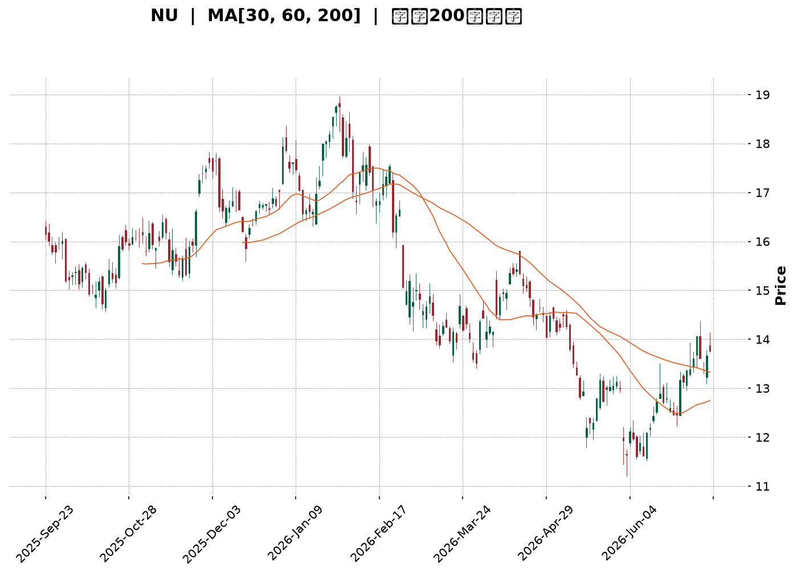
</details>

<html>
<head><meta charset="utf-8" /></head>
<body>
    <div style="height:500px; width:100%;">                        <script>window.PlotlyConfig = {MathJaxConfig: 'local'};</script>
        <script charset="utf-8" src="https://cdn.plot.ly/plotly-3.7.0.min.js" integrity="sha256-jvTGqxNp8AGWEcvNLVuKr+8j5dGe9Yw51LQkmDH+IYA=" crossorigin="anonymous"></script>                <div id="candlestick-chart" class="plotly-graph-div" style="height:100%; width:100%;"></div>            <script>                window.PLOTLYENV=window.PLOTLYENV || {};                                if (document.getElementById("candlestick-chart")) {                    Plotly.newPlot(                        "candlestick-chart",                        [{"close":{"dtype":"f8","bdata":"AAAAYGYmMEAAAABgjwIwQAAAACBcjy9AAAAAIFyPL0AAAABgZuYvQAAAAGCPAjBAAAAAoEdhLkAAAADgo3AuQAAAAGC4ni5AAAAAYI\u002fCLkAAAABgj0IuQAAAACCF6y5AAAAAoHC9LkAAAABACtctQAAAAMD1KC5AAAAAgOvRLUAAAAAAKVwuQAAAAIDCdS1AAAAAAAAALkAAAACA69EuQAAAAEDhei5AAAAAgOtRLkAAAADAzMwvQAAAAIAUri9AAAAAAAAAMEAAAAAAKdwvQAAAAEAKFzBAAAAAIFwPMEAAAAAAKRwwQAAAAKBHITBAAAAAoJmZL0AAAAAghSswQAAAAKBH4S9AAAAAoHC9L0AAAADAHgUwQAAAAADXYzBAAAAAgBQuMEAAAACAFC4vQAAAAADXoy9AAAAAQDMzL0AAAAAA16MuQAAAAIDrUS9AAAAAANejLkAAAAAgrscvQAAAAEAK1y9AAAAAACmcMEAAAAAAAEAxQAAAAADXYzFAAAAAQOF6MUAAAAAAKZwxQAAAAOCjcDFAAAAAYGamMUAAAABAM7MwQAAAAGC4njBAAAAAgBSuMEAAAADgo7AwQAAAAIDr0TBAAAAAYGbmMEAAAABgZqYwQAAAAEAzMzBAAAAA4FG4L0AAAADAHkUwQAAAAEAKVzBAAAAAYLieMEAAAABgj8IwQAAAAKBwvTBAAAAAYI\u002fCMEAAAADA9agwQAAAAKBH4TBAAAAAoHC9MEAAAADAHgUxQAAAAOCj8DFAAAAAACncMUAAAAAAAIAxQAAAAAApnDFAAAAAgMJ1MUAAAACAPQoxQAAAACBcjzBAAAAAANejMEAAAAAAKZwwQAAAAKCZmTBAAAAA4FH4MEAAAACgcD0xQAAAAAAAADJAAAAAgD0KMkAAAACAFC4yQAAAAMDMjDJAAAAAYI\u002fCMkAAAABgj8IyQAAAAAAAwDFAAAAAACkcMkAAAABguB4yQAAAAMAeBTFAAAAAIFzPMEAAAABgZmYxQAAAAMDMjDFAAAAAgOuRMUAAAADA9WgxQAAAAIA9CjFAAAAAgOvRMEAAAACA69EwQAAAACCFKzFAAAAAgOtRMUAAAAAgrocxQAAAAOCjMDBAAAAAIK6HMEAAAABgZqYwQAAAAGC4Hi5AAAAAgML1LUAAAACgR2EuQAAAAMAehS1AAAAAAAAALkAAAAAA16MtQAAAAMD1KC1AAAAAQApXLUAAAABgj8ItQAAAAEDh+ixAAAAA4KPwK0AAAAAgrscrQAAAAIA9iixAAAAAAACALEAAAADgo\u002fArQAAAAIDrUSxAAAAAoEfhK0AAAAAAKVwtQAAAAKBHYSxAAAAAANejLEAAAACAPQosQAAAAEAzMytAAAAAwB4FK0AAAACgcL0sQAAAAKBH4SxAAAAAwMxMLEAAAADAHoUsQAAAAMDMTCxAAAAAwB4FLUAAAACgcL0tQAAAACCF6y1AAAAAYGbmLUAAAABAM7MuQAAAAIAUri5AAAAAACncLkAAAACAFK4uQAAAAEAzMy5AAAAAoJkZLkAAAABAM7MtQAAAACCF6yxAAAAAwB4FLUAAAAAgrkctQAAAAAAAAC1AAAAA4HoULEAAAACAwvUsQAAAAKBH4SxAAAAAgOtRLEAAAAAAAIAsQAAAAIDC9SxAAAAAwB6FLEAAAACgmZkrQAAAAAAAACtAAAAAgD2KKkAAAAAA16MpQAAAAAAp3ClAAAAAoEdhKEAAAADgepQoQAAAAOB6lChAAAAA4HqUKUAAAACA61EqQAAAAIDCdSlAAAAAgML1KUAAAAAgXA8qQAAAAKCZGSpAAAAAYI9CKkAAAABA4fopQAAAAAAp3CdAAAAAIK5HJ0AAAACgcD0oQAAAAOCj8CdAAAAAQDMzJ0AAAABgj8InQAAAAKBwPSdAAAAAgBQuKEAAAACgR2EoQAAAAAAp3ChAAAAA4KNwKUAAAAAgrscpQAAAACCFaylAAAAA4HqUKUAAAACAFC4pQAAAACCF6yhAAAAAIIXrKEAAAABAClcqQAAAAGCPQipAAAAA4FG4KkAAAAAgrscqQAAAAOBROCtAAAAAYLgeLEAAAADgUTgrQAAAAKBwvSpAAAAAQApXK0AAAADAHoUrQA=="},"high":{"dtype":"f8","bdata":"AAAAwMxsMEAAAABguF4wQAAAAOBRGDBAAAAAoHD9L0AAAACgmRkwQAAAAOCjMDBAAAAAwMwMMEAAAADAzMwuQAAAAAAAwC5AAAAAQOH6LkAAAADgehQvQAAAAAAAAC9AAAAAwPUoL0AAAABgZuYuQAAAAKBwPS5AAAAAoEdhLkAAAAAAVo4uQAAAAGC4ni5AAAAAYLgeLkAAAAAgrkcvQAAAAIAULi9AAAAAIIXrLkAAAAAA1yMwQAAAAKBHITBAAAAAoJlZMEAAAACA6xEwQAAAAMAeRTBAAAAAoHA9MEAAAADAHkUwQAAAAAAAgDBAAAAAoHAdMEAAAAAghWswQAAAAGBmZjBAAAAAAADAL0AAAADgUTgwQAAAAMDMjDBAAAAAAACAMEAAAACA6zEwQAAAAGCPQjBAAAAAoHC9L0AAAACgmVkvQAAAAOCjcC9AAAAAQDMTMEAAAADAHgUwQAAAACBcDzBAAAAAwMysMEAAAACgR2ExQAAAAIAUjjFAAAAAIFyPMUAAAABACtcxQAAAAOBRuDFAAAAA4KPQMUAAAABA4boxQAAAAEAzEzFAAAAAQOG6MEAAAACgmdkwQAAAAAApHDFAAAAAIFwPMUAAAACA6xExQAAAAMAehTBAAAAAwPUoMEAAAADgIlswQAAAAOBReDBAAAAAoEehMEAAAADgetQwQAAAAMD1yDBAAAAAYI\u002fCMEAAAAAgXM8wQAAAAEDhGjFAAAAAwMzsMEAAAAAgXA8xQAAAAICVIzJAAAAAYLheMkAAAABgj8IxQAAAAIC+nzFAAAAAgOsRMkAAAAAghWsxQAAAAIDrETFAAAAA4KOwMEAAAADgUfgwQAAAAGAOrTBAAAAA4KNQMUAAAACAPYoxQAAAAAAAADJAAAAA4KMQMkAAAABgj0IyQAAAACBcjzJAAAAAwPXIMkAAAABA4foyQAAAAGC4njJAAAAAQAp3MkAAAABgZqYyQAAAAIA9KjJAAAAAYI8iMUAAAAAghWsxQAAAAEAK1zFAAAAAACm8MUAAAACgcP0xQAAAAMDMjDFAAAAAoEfhMEAAAAAAAAAxQAAAAEDhejFAAAAA4KNwMUAAAABACpcxQAAAAMD1aDFAAAAAQAqXMEAAAACgmdkwQAAAAKBH4S9AAAAAYGZmLkAAAABAi6wuQAAAAGC4Hi5AAAAAgMK1LkAAAADAzEwuQAAAAEAzcy1AAAAAgOuRLUAAAACAPUouQAAAAKBH4S1AAAAAQDOzLEAAAABguJ4sQAAAAKBwvSxAAAAA4HoULUAAAADAzIwsQAAAAAAAgCxAAAAAwMxMLEAAAABACtctQAAAAMAeBS1AAAAAoEdhLUAAAABgZqYsQAAAAGBm5itAAAAAgOuRK0AAAACA69EsQAAAAKCZmS1AAAAAgML1LEAAAAAgrscsQAAAAIDrUSxAAAAAwEnMLkAAAAAAKdwtQAAAAOB6FC5AAAAAIFwPLkAAAADgo\u002fAuQAAAAGC4Hi9AAAAAoEchL0AAAABguJ4vQAAAAEAzsy5AAAAAIFyPLkAAAADgo3AuQAAAAADXoy1AAAAA4HoULUAAAAAghastQAAAAEAKVy1AAAAAwB4FLUAAAABguB4tQAAAAIDrUS1AAAAA4KPwLEAAAACgR+EsQAAAAKCZGS1AAAAAQDMzLUAAAADA9agsQAAAAMD16CtAAAAAACkcK0AAAACAPYoqQAAAAEAKVypAAAAAIFzPKEAAAADAzMwoQAAAAMDMzChAAAAAoJmZKUAAAACgmZkqQAAAAMAehSpAAAAAoEchKkAAAAAAKVwqQAAAAEDheipAAAAAAACAKkAAAADAzEwqQAAAACCFayhAAAAAQOF6J0AAAACAFG4oQAAAAEAzsyhAAAAAoJkZKEAAAACA6xEoQAAAAIAULihAAAAAgBQuKEAAAADgepQoQAAAAGCPQilAAAAAoJmZKUAAAAAgrgcrQAAAAMD1KCpAAAAAoHA9KkAAAACA65EpQAAAAOCjcClAAAAAgD1KKUAAAACAFK4qQAAAAKCZmSpAAAAAIK7HKkAAAAAAKdwrQAAAAAAAgCtAAAAAYLgeLEAAAABgj8IsQAAAAOB6FCtAAAAAIFyPK0AAAAAgrkcsQA=="},"hovertemplate":"\u003cb\u003e%{x|%Y-%m-%d}\u003c\u002fb\u003e\u003cbr\u003e\u958b: $%{open:.2f}\u003cbr\u003e\u9ad8: $%{high:.2f}\u003cbr\u003e\u4f4e: $%{low:.2f}\u003cbr\u003e\u6536: $%{close:.2f}\u003cextra\u003e\u003c\u002fextra\u003e","low":{"dtype":"f8","bdata":"AAAAIK4HMEAAAACg8dIvQAAAAIDCdS9AAAAAoJkZL0AAAADA9agvQAAAAMDMTC9AAAAAgOtRLkAAAACAPQouQAAAAOBROC5AAAAAAABALkAAAACAPQouQAAAAKCZGS5AAAAAgMJ1LkAAAABgj8ItQAAAAEAK1y1AAAAAIK5HLUAAAADgUbgtQAAAAEBeOi1AAAAAYLgeLUAAAABguB4uQAAAACBcTy5AAAAAgOsRLkAAAACAwnUuQAAAACAEli9AAAAAQArXL0AAAAAA16MvQAAAAAAp3C9AAAAAANcDMEAAAABgj8IvQAAAAIAU7i9AAAAAYGZmL0AAAADgepQvQAAAAIAUri9AAAAAYGbmLkAAAADAzMwvQAAAAMDMDDBAAAAAIIULMEAAAADgUfguQAAAAADXoy5AAAAAAAAAL0AAAADAHoUuQAAAAKBHYS5AAAAAoJmZLkAAAABgj4IuQAAAACBcjy9AAAAAAClcL0AAAADA9egwQAAAAEAzMzFAAAAAIK5HMUAAAABA4XoxQAAAAIA9SjFAAAAAAClcMUAAAACgmZkwQAAAAOBReDBAAAAAAAJLMEAAAABACncwQAAAAEAzszBAAAAAoJmZMEAAAACgR6EwQAAAAIAULjBAAAAAgBQuL0AAAADAIBAwQAAAAEBiUDBAAAAAoJlZMEAAAAAgXI8wQAAAAGBmpjBAAAAAACmcMEAAAACAPYowQAAAAIAUrjBAAAAAgMK1MEAAAABgZqYwQAAAAIA9KjFAAAAAIFzPMUAAAAAgrmcxQAAAAGC4XjFAAAAAANdjMUAAAADAHgUxQAAAAIA9ajBAAAAAwMxsMEAAAACAQYAwQAAAAIAUTjBAAAAAoJlZMEAAAACA6xExQAAAAOB6VDFAAAAAgMK1MUAAAABgZuYxQAAAAKCZGTJAAAAAAClcMkAAAACgcD0yQAAAAIDCtTFAAAAAgMK1MUAAAABACtcxQAAAAAAA4DBAAAAAwMyMMEAAAABgj8IwQAAAAEAKNzFAAAAAgD0KMUAAAACgmVkxQAAAAIDCtTBAAAAAYLheMEAAAABACpcwQAAAAEAK1zBAAAAAwB7lMEAAAAAghSsxQAAAAOB6FDBAAAAAoHC9L0AAAAAA14MwQAAAAOB6FC5AAAAAYGZmLUAAAABguJ4sQAAAAEAKVyxAAAAAoJmZLUAAAADgUTgtQAAAAOBReCxAAAAAgMJ1LEAAAAAgXA8tQAAAAGCPwixAAAAAYI\u002fCK0AAAACgR6ErQAAAAGC4HixAAAAA4FF4LEAAAADgetQrQAAAACBcDytAAAAA4HqUK0AAAADgo3AsQAAAAIDrUSxAAAAAIIVrLEAAAAAAKdwrQAAAAOB6FCtAAAAAgOvRKkAAAABgZmYrQAAAAAAp3CxAAAAAAAKrK0AAAADA9SgsQAAAAIAUritAAAAAgOvRLEAAAADAzMwsQAAAACBcjy1AAAAAQDMzLUAAAACgcD0uQAAAAKCZmS5AAAAA4HqULkAAAABguJ4uQAAAAAAp3C1AAAAA4KPwLUAAAABAClctQAAAAIDrkSxAAAAAoEdhLEAAAACgmRktQAAAAIDCtSxAAAAA4HoULEAAAACgmRksQAAAAGCPwixAAAAAgBQuLEAAAABAClcsQAAAAKBwfSxAAAAAwPVoLEAAAAAAAIArQAAAAEAK1ypAAAAAwB6FKkAAAAAgrocpQAAAAIAUrilAAAAAIFyPJ0AAAABguB4oQAAAACCF6ydAAAAAwPWoKEAAAABguB4pQAAAACCFaylAAAAAwMxMKUAAAAAAKdwpQAAAACCuxylAAAAAQOH6KUAAAACA69EpQAAAAKBH4SZAAAAAYGZmJkAAAAAA16MnQAAAAGC43idAAAAAoJkZJ0AAAAAgXE8nQAAAAOBROCdAAAAAwB4FJ0AAAAAgrgcoQAAAACBcjyhAAAAA4KPwKEAAAADgepQpQAAAAAApXClAAAAAYGZmKUAAAAAAAAApQAAAAKBH4ShAAAAAgMJ1KEAAAAAA1+MoQAAAAEDh+ilAAAAAoEfhKUAAAAAAAIAqQAAAAGDjpSpAAAAAgOvRKkAAAADgUTgrQAAAAEAKlypAAAAAIIUrKkAAAABA4XorQA=="},"name":"\u50f9\u683c","open":{"dtype":"f8","bdata":"AAAAwMxMMEAAAACAFC4wQAAAAAAp3C9AAAAAACncL0AAAABgZuYvQAAAACCF6y9AAAAAwMwMMEAAAACAPYouQAAAACBcjy5AAAAAoHC9LkAAAACA69EuQAAAAAApXC5AAAAAIFwPL0AAAADgUbguQAAAAMD1KC5AAAAAQDOzLUAAAAAAAAAuQAAAAOB6lC5AAAAAIK5HLUAAAABgj0IuQAAAAEAzsy5AAAAAANejLkAAAADAHoUuQAAAAEAKFzBAAAAAQOE6MEAAAAAghesvQAAAAGBm5i9AAAAAgOsRMEAAAAAAKRwwQAAAAOCjMDBAAAAAoJmZL0AAAADgUbgvQAAAAGC4XjBAAAAAANejL0AAAACgmRkwQAAAAEAKFzBAAAAAgMJ1MEAAAACAPQowQAAAAAAp3C5AAAAA4FF4L0AAAADAzMwuQAAAAMDMjC5AAAAAgBSuL0AAAACAwrUuQAAAAAAAADBAAAAAQArXL0AAAABA4fowQAAAAADXYzFAAAAAgBRuMUAAAACAwrUxQAAAAEAzszFAAAAAYGamMUAAAABAM7MxQAAAAGC43jBAAAAAwB5lMEAAAACgmZkwQAAAAEDhujBAAAAAIK7nMEAAAABgZgYxQAAAAAAAgDBAAAAAQAoXMEAAAABgZiYwQAAAAKCZWTBAAAAAIIVrMEAAAADgo7AwQAAAAEAzszBAAAAAoHC9MEAAAACAPaowQAAAAMAexTBAAAAAYLjeMEAAAAAgXA8xQAAAAIAULjFAAAAAYLgeMkAAAABguJ4xQAAAAEAKlzFAAAAAgBSuMUAAAACgmVkxQAAAACBcDzFAAAAA4KOQMEAAAAAAAMAwQAAAAIDrkTBAAAAAAClcMEAAAABgjyIxQAAAAIA9qjFAAAAAAAAAMkAAAADAzAwyQAAAAAApXDJAAAAAYI+iMkAAAADgetQyQAAAACCuhzJAAAAAoHC9MUAAAAAgrmcyQAAAAOB6FDJAAAAA4HrUMEAAAAAghSsxQAAAAOCjcDFAAAAAYGYmMUAAAACA6\u002fExQAAAAMD1iDFAAAAAoHC9MEAAAAAAAMAwQAAAAEAz8zBAAAAAANcjMUAAAABAMzMxQAAAAAAAQDFAAAAA4KMwMEAAAAAA14MwQAAAAEAK1y9AAAAA4KNwLUAAAAAghessQAAAAAApXC1AAAAAoHD9LUAAAAAAKdwtQAAAAGCPAi1AAAAAgOvRLEAAAABA4XotQAAAAAAAgC1AAAAAYGZmLEAAAAAA1yMsQAAAAKBwPSxAAAAAwMzMLEAAAADgo3AsQAAAAAApXCtAAAAAoHA9LEAAAACgR6EsQAAAAOBR+CxAAAAAYI9CLUAAAABgj0IsQAAAAIDCdStAAAAAIIVrK0AAAACgmZkrQAAAAIAULi1AAAAAAAAALEAAAABgj0IsQAAAAEAzMyxAAAAAIIVrLkAAAADAHgUtQAAAAAAp3C1AAAAAgBSuLUAAAABgj0IuQAAAACCF6y5AAAAAIK7HLkAAAABguJ4vQAAAAEDhei5AAAAA4FE4LkAAAAAAKVwuQAAAAGC4ni1AAAAAQArXLEAAAAAgrkctQAAAAOB6FC1AAAAAgML1LEAAAADgelQsQAAAAIDrUS1AAAAAIK7HLEAAAAAA16MsQAAAAAAAAC1AAAAAAAAALUAAAACgmZksQAAAAGCPwitAAAAAQArXKkAAAAAghWsqQAAAAEAzsylAAAAAQIkBKEAAAADAzMwoQAAAAOB6VChAAAAAgBSuKEAAAADgUTgpQAAAAMDMTCpAAAAAIK4HKkAAAAAghespQAAAAOCj8ClAAAAAoJkZKkAAAAAAAAAqQAAAAEDh+idAAAAAwMxMJ0AAAABgj8InQAAAAEAzMyhAAAAAwB4FKEAAAADgo3AnQAAAAKCZmSdAAAAAANcjJ0AAAABAClcoQAAAAIAUrihAAAAAwB4FKUAAAADgepQpQAAAACBcDypAAAAAIFyPKUAAAACAPQopQAAAAKCZGSlAAAAAgML1KEAAAAAA1+MoQAAAAMAehSpAAAAAYLgeKkAAAAAgXI8qQAAAAKBH4SpAAAAAAClcK0AAAABguB4sQAAAAGCPwipAAAAA4KNwKkAAAABgj8IrQA=="},"x":["2025-09-23T00:00:00-04:00","2025-09-24T00:00:00-04:00","2025-09-25T00:00:00-04:00","2025-09-26T00:00:00-04:00","2025-09-29T00:00:00-04:00","2025-09-30T00:00:00-04:00","2025-10-01T00:00:00-04:00","2025-10-02T00:00:00-04:00","2025-10-03T00:00:00-04:00","2025-10-06T00:00:00-04:00","2025-10-07T00:00:00-04:00","2025-10-08T00:00:00-04:00","2025-10-09T00:00:00-04:00","2025-10-10T00:00:00-04:00","2025-10-13T00:00:00-04:00","2025-10-14T00:00:00-04:00","2025-10-15T00:00:00-04:00","2025-10-16T00:00:00-04:00","2025-10-17T00:00:00-04:00","2025-10-20T00:00:00-04:00","2025-10-21T00:00:00-04:00","2025-10-22T00:00:00-04:00","2025-10-23T00:00:00-04:00","2025-10-24T00:00:00-04:00","2025-10-27T00:00:00-04:00","2025-10-28T00:00:00-04:00","2025-10-29T00:00:00-04:00","2025-10-30T00:00:00-04:00","2025-10-31T00:00:00-04:00","2025-11-03T00:00:00-05:00","2025-11-04T00:00:00-05:00","2025-11-05T00:00:00-05:00","2025-11-06T00:00:00-05:00","2025-11-07T00:00:00-05:00","2025-11-10T00:00:00-05:00","2025-11-11T00:00:00-05:00","2025-11-12T00:00:00-05:00","2025-11-13T00:00:00-05:00","2025-11-14T00:00:00-05:00","2025-11-17T00:00:00-05:00","2025-11-18T00:00:00-05:00","2025-11-19T00:00:00-05:00","2025-11-20T00:00:00-05:00","2025-11-21T00:00:00-05:00","2025-11-24T00:00:00-05:00","2025-11-25T00:00:00-05:00","2025-11-26T00:00:00-05:00","2025-11-28T00:00:00-05:00","2025-12-01T00:00:00-05:00","2025-12-02T00:00:00-05:00","2025-12-03T00:00:00-05:00","2025-12-04T00:00:00-05:00","2025-12-05T00:00:00-05:00","2025-12-08T00:00:00-05:00","2025-12-09T00:00:00-05:00","2025-12-10T00:00:00-05:00","2025-12-11T00:00:00-05:00","2025-12-12T00:00:00-05:00","2025-12-15T00:00:00-05:00","2025-12-16T00:00:00-05:00","2025-12-17T00:00:00-05:00","2025-12-18T00:00:00-05:00","2025-12-19T00:00:00-05:00","2025-12-22T00:00:00-05:00","2025-12-23T00:00:00-05:00","2025-12-24T00:00:00-05:00","2025-12-26T00:00:00-05:00","2025-12-29T00:00:00-05:00","2025-12-30T00:00:00-05:00","2025-12-31T00:00:00-05:00","2026-01-02T00:00:00-05:00","2026-01-05T00:00:00-05:00","2026-01-06T00:00:00-05:00","2026-01-07T00:00:00-05:00","2026-01-08T00:00:00-05:00","2026-01-09T00:00:00-05:00","2026-01-12T00:00:00-05:00","2026-01-13T00:00:00-05:00","2026-01-14T00:00:00-05:00","2026-01-15T00:00:00-05:00","2026-01-16T00:00:00-05:00","2026-01-20T00:00:00-05:00","2026-01-21T00:00:00-05:00","2026-01-22T00:00:00-05:00","2026-01-23T00:00:00-05:00","2026-01-26T00:00:00-05:00","2026-01-27T00:00:00-05:00","2026-01-28T00:00:00-05:00","2026-01-29T00:00:00-05:00","2026-01-30T00:00:00-05:00","2026-02-02T00:00:00-05:00","2026-02-03T00:00:00-05:00","2026-02-04T00:00:00-05:00","2026-02-05T00:00:00-05:00","2026-02-06T00:00:00-05:00","2026-02-09T00:00:00-05:00","2026-02-10T00:00:00-05:00","2026-02-11T00:00:00-05:00","2026-02-12T00:00:00-05:00","2026-02-13T00:00:00-05:00","2026-02-17T00:00:00-05:00","2026-02-18T00:00:00-05:00","2026-02-19T00:00:00-05:00","2026-02-20T00:00:00-05:00","2026-02-23T00:00:00-05:00","2026-02-24T00:00:00-05:00","2026-02-25T00:00:00-05:00","2026-02-26T00:00:00-05:00","2026-02-27T00:00:00-05:00","2026-03-02T00:00:00-05:00","2026-03-03T00:00:00-05:00","2026-03-04T00:00:00-05:00","2026-03-05T00:00:00-05:00","2026-03-06T00:00:00-05:00","2026-03-09T00:00:00-04:00","2026-03-10T00:00:00-04:00","2026-03-11T00:00:00-04:00","2026-03-12T00:00:00-04:00","2026-03-13T00:00:00-04:00","2026-03-16T00:00:00-04:00","2026-03-17T00:00:00-04:00","2026-03-18T00:00:00-04:00","2026-03-19T00:00:00-04:00","2026-03-20T00:00:00-04:00","2026-03-23T00:00:00-04:00","2026-03-24T00:00:00-04:00","2026-03-25T00:00:00-04:00","2026-03-26T00:00:00-04:00","2026-03-27T00:00:00-04:00","2026-03-30T00:00:00-04:00","2026-03-31T00:00:00-04:00","2026-04-01T00:00:00-04:00","2026-04-02T00:00:00-04:00","2026-04-06T00:00:00-04:00","2026-04-07T00:00:00-04:00","2026-04-08T00:00:00-04:00","2026-04-09T00:00:00-04:00","2026-04-10T00:00:00-04:00","2026-04-13T00:00:00-04:00","2026-04-14T00:00:00-04:00","2026-04-15T00:00:00-04:00","2026-04-16T00:00:00-04:00","2026-04-17T00:00:00-04:00","2026-04-20T00:00:00-04:00","2026-04-21T00:00:00-04:00","2026-04-22T00:00:00-04:00","2026-04-23T00:00:00-04:00","2026-04-24T00:00:00-04:00","2026-04-27T00:00:00-04:00","2026-04-28T00:00:00-04:00","2026-04-29T00:00:00-04:00","2026-04-30T00:00:00-04:00","2026-05-01T00:00:00-04:00","2026-05-04T00:00:00-04:00","2026-05-05T00:00:00-04:00","2026-05-06T00:00:00-04:00","2026-05-07T00:00:00-04:00","2026-05-08T00:00:00-04:00","2026-05-11T00:00:00-04:00","2026-05-12T00:00:00-04:00","2026-05-13T00:00:00-04:00","2026-05-14T00:00:00-04:00","2026-05-15T00:00:00-04:00","2026-05-18T00:00:00-04:00","2026-05-19T00:00:00-04:00","2026-05-20T00:00:00-04:00","2026-05-21T00:00:00-04:00","2026-05-22T00:00:00-04:00","2026-05-26T00:00:00-04:00","2026-05-27T00:00:00-04:00","2026-05-28T00:00:00-04:00","2026-05-29T00:00:00-04:00","2026-06-01T00:00:00-04:00","2026-06-02T00:00:00-04:00","2026-06-03T00:00:00-04:00","2026-06-04T00:00:00-04:00","2026-06-05T00:00:00-04:00","2026-06-08T00:00:00-04:00","2026-06-09T00:00:00-04:00","2026-06-10T00:00:00-04:00","2026-06-11T00:00:00-04:00","2026-06-12T00:00:00-04:00","2026-06-15T00:00:00-04:00","2026-06-16T00:00:00-04:00","2026-06-17T00:00:00-04:00","2026-06-18T00:00:00-04:00","2026-06-22T00:00:00-04:00","2026-06-23T00:00:00-04:00","2026-06-24T00:00:00-04:00","2026-06-25T00:00:00-04:00","2026-06-26T00:00:00-04:00","2026-06-29T00:00:00-04:00","2026-06-30T00:00:00-04:00","2026-07-01T00:00:00-04:00","2026-07-02T00:00:00-04:00","2026-07-06T00:00:00-04:00","2026-07-07T00:00:00-04:00","2026-07-08T00:00:00-04:00","2026-07-09T00:00:00-04:00","2026-07-10T00:00:00-04:00"],"type":"candlestick"},{"hovertemplate":"MA30: $%{y:.2f}\u003cextra\u003e\u003c\u002fextra\u003e","line":{"color":"#2196F3","dash":"dash","width":2},"mode":"lines","name":"MA30","x":["2025-09-23T00:00:00-04:00","2025-09-24T00:00:00-04:00","2025-09-25T00:00:00-04:00","2025-09-26T00:00:00-04:00","2025-09-29T00:00:00-04:00","2025-09-30T00:00:00-04:00","2025-10-01T00:00:00-04:00","2025-10-02T00:00:00-04:00","2025-10-03T00:00:00-04:00","2025-10-06T00:00:00-04:00","2025-10-07T00:00:00-04:00","2025-10-08T00:00:00-04:00","2025-10-09T00:00:00-04:00","2025-10-10T00:00:00-04:00","2025-10-13T00:00:00-04:00","2025-10-14T00:00:00-04:00","2025-10-15T00:00:00-04:00","2025-10-16T00:00:00-04:00","2025-10-17T00:00:00-04:00","2025-10-20T00:00:00-04:00","2025-10-21T00:00:00-04:00","2025-10-22T00:00:00-04:00","2025-10-23T00:00:00-04:00","2025-10-24T00:00:00-04:00","2025-10-27T00:00:00-04:00","2025-10-28T00:00:00-04:00","2025-10-29T00:00:00-04:00","2025-10-30T00:00:00-04:00","2025-10-31T00:00:00-04:00","2025-11-03T00:00:00-05:00","2025-11-04T00:00:00-05:00","2025-11-05T00:00:00-05:00","2025-11-06T00:00:00-05:00","2025-11-07T00:00:00-05:00","2025-11-10T00:00:00-05:00","2025-11-11T00:00:00-05:00","2025-11-12T00:00:00-05:00","2025-11-13T00:00:00-05:00","2025-11-14T00:00:00-05:00","2025-11-17T00:00:00-05:00","2025-11-18T00:00:00-05:00","2025-11-19T00:00:00-05:00","2025-11-20T00:00:00-05:00","2025-11-21T00:00:00-05:00","2025-11-24T00:00:00-05:00","2025-11-25T00:00:00-05:00","2025-11-26T00:00:00-05:00","2025-11-28T00:00:00-05:00","2025-12-01T00:00:00-05:00","2025-12-02T00:00:00-05:00","2025-12-03T00:00:00-05:00","2025-12-04T00:00:00-05:00","2025-12-05T00:00:00-05:00","2025-12-08T00:00:00-05:00","2025-12-09T00:00:00-05:00","2025-12-10T00:00:00-05:00","2025-12-11T00:00:00-05:00","2025-12-12T00:00:00-05:00","2025-12-15T00:00:00-05:00","2025-12-16T00:00:00-05:00","2025-12-17T00:00:00-05:00","2025-12-18T00:00:00-05:00","2025-12-19T00:00:00-05:00","2025-12-22T00:00:00-05:00","2025-12-23T00:00:00-05:00","2025-12-24T00:00:00-05:00","2025-12-26T00:00:00-05:00","2025-12-29T00:00:00-05:00","2025-12-30T00:00:00-05:00","2025-12-31T00:00:00-05:00","2026-01-02T00:00:00-05:00","2026-01-05T00:00:00-05:00","2026-01-06T00:00:00-05:00","2026-01-07T00:00:00-05:00","2026-01-08T00:00:00-05:00","2026-01-09T00:00:00-05:00","2026-01-12T00:00:00-05:00","2026-01-13T00:00:00-05:00","2026-01-14T00:00:00-05:00","2026-01-15T00:00:00-05:00","2026-01-16T00:00:00-05:00","2026-01-20T00:00:00-05:00","2026-01-21T00:00:00-05:00","2026-01-22T00:00:00-05:00","2026-01-23T00:00:00-05:00","2026-01-26T00:00:00-05:00","2026-01-27T00:00:00-05:00","2026-01-28T00:00:00-05:00","2026-01-29T00:00:00-05:00","2026-01-30T00:00:00-05:00","2026-02-02T00:00:00-05:00","2026-02-03T00:00:00-05:00","2026-02-04T00:00:00-05:00","2026-02-05T00:00:00-05:00","2026-02-06T00:00:00-05:00","2026-02-09T00:00:00-05:00","2026-02-10T00:00:00-05:00","2026-02-11T00:00:00-05:00","2026-02-12T00:00:00-05:00","2026-02-13T00:00:00-05:00","2026-02-17T00:00:00-05:00","2026-02-18T00:00:00-05:00","2026-02-19T00:00:00-05:00","2026-02-20T00:00:00-05:00","2026-02-23T00:00:00-05:00","2026-02-24T00:00:00-05:00","2026-02-25T00:00:00-05:00","2026-02-26T00:00:00-05:00","2026-02-27T00:00:00-05:00","2026-03-02T00:00:00-05:00","2026-03-03T00:00:00-05:00","2026-03-04T00:00:00-05:00","2026-03-05T00:00:00-05:00","2026-03-06T00:00:00-05:00","2026-03-09T00:00:00-04:00","2026-03-10T00:00:00-04:00","2026-03-11T00:00:00-04:00","2026-03-12T00:00:00-04:00","2026-03-13T00:00:00-04:00","2026-03-16T00:00:00-04:00","2026-03-17T00:00:00-04:00","2026-03-18T00:00:00-04:00","2026-03-19T00:00:00-04:00","2026-03-20T00:00:00-04:00","2026-03-23T00:00:00-04:00","2026-03-24T00:00:00-04:00","2026-03-25T00:00:00-04:00","2026-03-26T00:00:00-04:00","2026-03-27T00:00:00-04:00","2026-03-30T00:00:00-04:00","2026-03-31T00:00:00-04:00","2026-04-01T00:00:00-04:00","2026-04-02T00:00:00-04:00","2026-04-06T00:00:00-04:00","2026-04-07T00:00:00-04:00","2026-04-08T00:00:00-04:00","2026-04-09T00:00:00-04:00","2026-04-10T00:00:00-04:00","2026-04-13T00:00:00-04:00","2026-04-14T00:00:00-04:00","2026-04-15T00:00:00-04:00","2026-04-16T00:00:00-04:00","2026-04-17T00:00:00-04:00","2026-04-20T00:00:00-04:00","2026-04-21T00:00:00-04:00","2026-04-22T00:00:00-04:00","2026-04-23T00:00:00-04:00","2026-04-24T00:00:00-04:00","2026-04-27T00:00:00-04:00","2026-04-28T00:00:00-04:00","2026-04-29T00:00:00-04:00","2026-04-30T00:00:00-04:00","2026-05-01T00:00:00-04:00","2026-05-04T00:00:00-04:00","2026-05-05T00:00:00-04:00","2026-05-06T00:00:00-04:00","2026-05-07T00:00:00-04:00","2026-05-08T00:00:00-04:00","2026-05-11T00:00:00-04:00","2026-05-12T00:00:00-04:00","2026-05-13T00:00:00-04:00","2026-05-14T00:00:00-04:00","2026-05-15T00:00:00-04:00","2026-05-18T00:00:00-04:00","2026-05-19T00:00:00-04:00","2026-05-20T00:00:00-04:00","2026-05-21T00:00:00-04:00","2026-05-22T00:00:00-04:00","2026-05-26T00:00:00-04:00","2026-05-27T00:00:00-04:00","2026-05-28T00:00:00-04:00","2026-05-29T00:00:00-04:00","2026-06-01T00:00:00-04:00","2026-06-02T00:00:00-04:00","2026-06-03T00:00:00-04:00","2026-06-04T00:00:00-04:00","2026-06-05T00:00:00-04:00","2026-06-08T00:00:00-04:00","2026-06-09T00:00:00-04:00","2026-06-10T00:00:00-04:00","2026-06-11T00:00:00-04:00","2026-06-12T00:00:00-04:00","2026-06-15T00:00:00-04:00","2026-06-16T00:00:00-04:00","2026-06-17T00:00:00-04:00","2026-06-18T00:00:00-04:00","2026-06-22T00:00:00-04:00","2026-06-23T00:00:00-04:00","2026-06-24T00:00:00-04:00","2026-06-25T00:00:00-04:00","2026-06-26T00:00:00-04:00","2026-06-29T00:00:00-04:00","2026-06-30T00:00:00-04:00","2026-07-01T00:00:00-04:00","2026-07-02T00:00:00-04:00","2026-07-06T00:00:00-04:00","2026-07-07T00:00:00-04:00","2026-07-08T00:00:00-04:00","2026-07-09T00:00:00-04:00","2026-07-10T00:00:00-04:00"],"y":{"dtype":"f8","bdata":"AAAAAAAA+H8AAAAAAAD4fwAAAAAAAPh\u002fAAAAAAAA+H8AAAAAAAD4fwAAAAAAAPh\u002fAAAAAAAA+H8AAAAAAAD4fwAAAAAAAPh\u002fAAAAAAAA+H8AAAAAAAD4fwAAAAAAAPh\u002fAAAAAAAA+H8AAAAAAAD4fwAAAAAAAPh\u002fAAAAAAAA+H8AAAAAAAD4fwAAAAAAAPh\u002fAAAAAAAA+H8AAAAAAAD4fwAAAAAAAPh\u002fAAAAAAAA+H8AAAAAAAD4fwAAAAAAAPh\u002fAAAAAAAA+H8AAAAAAAD4fwAAAAAAAPh\u002fAAAAAAAA+H8AAAAAAAD4fyIiIsJnGC9AZmZmlm4SL0AzMzOjKRUvQAAAALDkFy9Ad3d3520ZL0De3d29nxovQLy7u\u002fsbIS9AzczMXAEyL0CrqqrqUTgvQDMzMyMGQS9AVVVVVcdEL0BERER0BUgvQERERERvSy9AAAAA0JRKL0Dv7u7OIlsvQDMzM9N4aS9A3t3dPXyGL0BVVVU10KkvQM3MzOw11y9Aq6qqmsQAMEBERESUihMwQN7d3Y1QJjBAq6qqCpA7MEC8u7urY0IwQLy7u5sLSTBAd3d3F9lOMEBmZmZWVVUwQLy7uwuQWzBA3t3dDbtiMEAzMzOzVmcwQO\u002fu7p7vZzBAERERsXJoMEBVVVUlTWkwQN7d3fW2bDBAzczMXB1zMECrqqrqbXkwQBEREYFqfDBAiYiIiF2BMEC8u7v7foowQGZmZpaKkzBARERE9ESdMECamZmpxqswQGZmZmY7vzBA3t3dHejUMEDv7u42peIwQLy7uxMR8TBAVVVV7VH4MEBVVVUth\u002fYwQLy7uwNy7zBAmpmZAUfoMEARERF5vt8wQO\u002fu7naT2DBAMzMz+8XSMECJiIigYdcwQAAAAEgo4zBAd3d3P8PuMEC8u7szevswQJqZmXE9CjFAVVVVrRwaMUAzMzMLHiwxQJqZmRFYOTFAVVVVRYtMMUCJiIioVFwxQERERCQiYjFAMzMzM8FjMUDNzMxMN2kxQFVVVcUgcDFA3t3dPQp3MUBERESkcH0xQLy7uyvOfjFA7+7u7nx\u002fMUBmZmYGyH0xQO\u002fu7u41dzFAiYiISJpyMUAiIiLS23IxQImIiMi9ZjFAvLu7K85eMUAzMzMzelsxQO\u002fu7matTjFAvLu7E4NAMUCamZkJZTQxQO\u002fu7n6xJDFAd3d39+ETMUBVVVVlO\u002f8wQKuqqkoM4jBAmpmZaUrFMEC8u7tzIakwQHd3dz98hjBAVVVVVZxdMEAAAACoDTQwQDMzM3tbFjBAzczMXNbqL0C8u7u7AqQvQDMzMzMzcy9Aq6qq+jdCL0Dv7u4ezBMvQO\u002fu7g502i5Ad3d3l\u002fyiLkBVVVV1IWkuQN7d3d1rLi5AIiIiQu71LUC8u7sLHswtQN7d3X2GnS1AzczMjGxnLUAzMzOznS8tQM3MzMzMDC1AiYiISFPqLECJiIhY8sssQAAAAHA9yixA3t3dXbrJLEC8u7trdcwsQKuqqnpb1ixA3t3dLbLdLECJiIgYkuYsQDMzMwNy7yxAIiIiQu71LEAAAAAwa\u002fUsQN7d3R3o9CxAmpmZaR\u002f+LEBmZmY27AotQImIiBjZDi1Ad3d3l0MLLUAAAADQ9xMtQGZmZia\u002fGC1AiYiIWIAcLUBVVVWlKRUtQM3MzKwcGi1AiYiIiBYZLUBmZmZWVRUtQN7d3W2gEy1Aq6qq2ocPLUDNzMzME\u002fUsQDMzM4NO2yxAREREJNu5LEBEREQUPJgsQN7d3Z19eCxAIiIi0iJbLEB3d3e38z0sQCIiIrLkFyxAIiIiokX2K0BVVVVlrc4rQLy7uzuYpytAERERYVeAK0AiIiISPFgrQBERESEiIitAzczMnO\u002fnKkDv7u4OWLkqQFVVVRXZjipAmpmZGS9dKkCamZl5FC4qQAAAAJDt\u002fClAIiIi4qXbKUCJiIi4kLQpQGZmZuZCkilAIiIicq95KUBERESEeWIpQFVVVUVERClA3t3dvS0rKUC8u7srhxYpQHd3d1fHBClAVVVVZfT2KEAiIiKS7fwoQCIiImJXAClAERERMU8UKUCrqqoqFScpQFVVVVWcPSlAzczMDElTKUAREREh91opQFVVVVXjZSlA3t3d\u002falxKUCamZlpH34pQA=="},"type":"scatter"},{"hovertemplate":"MA60: $%{y:.2f}\u003cextra\u003e\u003c\u002fextra\u003e","line":{"color":"#9C27B0","dash":"dash","width":2},"mode":"lines","name":"MA60","x":["2025-09-23T00:00:00-04:00","2025-09-24T00:00:00-04:00","2025-09-25T00:00:00-04:00","2025-09-26T00:00:00-04:00","2025-09-29T00:00:00-04:00","2025-09-30T00:00:00-04:00","2025-10-01T00:00:00-04:00","2025-10-02T00:00:00-04:00","2025-10-03T00:00:00-04:00","2025-10-06T00:00:00-04:00","2025-10-07T00:00:00-04:00","2025-10-08T00:00:00-04:00","2025-10-09T00:00:00-04:00","2025-10-10T00:00:00-04:00","2025-10-13T00:00:00-04:00","2025-10-14T00:00:00-04:00","2025-10-15T00:00:00-04:00","2025-10-16T00:00:00-04:00","2025-10-17T00:00:00-04:00","2025-10-20T00:00:00-04:00","2025-10-21T00:00:00-04:00","2025-10-22T00:00:00-04:00","2025-10-23T00:00:00-04:00","2025-10-24T00:00:00-04:00","2025-10-27T00:00:00-04:00","2025-10-28T00:00:00-04:00","2025-10-29T00:00:00-04:00","2025-10-30T00:00:00-04:00","2025-10-31T00:00:00-04:00","2025-11-03T00:00:00-05:00","2025-11-04T00:00:00-05:00","2025-11-05T00:00:00-05:00","2025-11-06T00:00:00-05:00","2025-11-07T00:00:00-05:00","2025-11-10T00:00:00-05:00","2025-11-11T00:00:00-05:00","2025-11-12T00:00:00-05:00","2025-11-13T00:00:00-05:00","2025-11-14T00:00:00-05:00","2025-11-17T00:00:00-05:00","2025-11-18T00:00:00-05:00","2025-11-19T00:00:00-05:00","2025-11-20T00:00:00-05:00","2025-11-21T00:00:00-05:00","2025-11-24T00:00:00-05:00","2025-11-25T00:00:00-05:00","2025-11-26T00:00:00-05:00","2025-11-28T00:00:00-05:00","2025-12-01T00:00:00-05:00","2025-12-02T00:00:00-05:00","2025-12-03T00:00:00-05:00","2025-12-04T00:00:00-05:00","2025-12-05T00:00:00-05:00","2025-12-08T00:00:00-05:00","2025-12-09T00:00:00-05:00","2025-12-10T00:00:00-05:00","2025-12-11T00:00:00-05:00","2025-12-12T00:00:00-05:00","2025-12-15T00:00:00-05:00","2025-12-16T00:00:00-05:00","2025-12-17T00:00:00-05:00","2025-12-18T00:00:00-05:00","2025-12-19T00:00:00-05:00","2025-12-22T00:00:00-05:00","2025-12-23T00:00:00-05:00","2025-12-24T00:00:00-05:00","2025-12-26T00:00:00-05:00","2025-12-29T00:00:00-05:00","2025-12-30T00:00:00-05:00","2025-12-31T00:00:00-05:00","2026-01-02T00:00:00-05:00","2026-01-05T00:00:00-05:00","2026-01-06T00:00:00-05:00","2026-01-07T00:00:00-05:00","2026-01-08T00:00:00-05:00","2026-01-09T00:00:00-05:00","2026-01-12T00:00:00-05:00","2026-01-13T00:00:00-05:00","2026-01-14T00:00:00-05:00","2026-01-15T00:00:00-05:00","2026-01-16T00:00:00-05:00","2026-01-20T00:00:00-05:00","2026-01-21T00:00:00-05:00","2026-01-22T00:00:00-05:00","2026-01-23T00:00:00-05:00","2026-01-26T00:00:00-05:00","2026-01-27T00:00:00-05:00","2026-01-28T00:00:00-05:00","2026-01-29T00:00:00-05:00","2026-01-30T00:00:00-05:00","2026-02-02T00:00:00-05:00","2026-02-03T00:00:00-05:00","2026-02-04T00:00:00-05:00","2026-02-05T00:00:00-05:00","2026-02-06T00:00:00-05:00","2026-02-09T00:00:00-05:00","2026-02-10T00:00:00-05:00","2026-02-11T00:00:00-05:00","2026-02-12T00:00:00-05:00","2026-02-13T00:00:00-05:00","2026-02-17T00:00:00-05:00","2026-02-18T00:00:00-05:00","2026-02-19T00:00:00-05:00","2026-02-20T00:00:00-05:00","2026-02-23T00:00:00-05:00","2026-02-24T00:00:00-05:00","2026-02-25T00:00:00-05:00","2026-02-26T00:00:00-05:00","2026-02-27T00:00:00-05:00","2026-03-02T00:00:00-05:00","2026-03-03T00:00:00-05:00","2026-03-04T00:00:00-05:00","2026-03-05T00:00:00-05:00","2026-03-06T00:00:00-05:00","2026-03-09T00:00:00-04:00","2026-03-10T00:00:00-04:00","2026-03-11T00:00:00-04:00","2026-03-12T00:00:00-04:00","2026-03-13T00:00:00-04:00","2026-03-16T00:00:00-04:00","2026-03-17T00:00:00-04:00","2026-03-18T00:00:00-04:00","2026-03-19T00:00:00-04:00","2026-03-20T00:00:00-04:00","2026-03-23T00:00:00-04:00","2026-03-24T00:00:00-04:00","2026-03-25T00:00:00-04:00","2026-03-26T00:00:00-04:00","2026-03-27T00:00:00-04:00","2026-03-30T00:00:00-04:00","2026-03-31T00:00:00-04:00","2026-04-01T00:00:00-04:00","2026-04-02T00:00:00-04:00","2026-04-06T00:00:00-04:00","2026-04-07T00:00:00-04:00","2026-04-08T00:00:00-04:00","2026-04-09T00:00:00-04:00","2026-04-10T00:00:00-04:00","2026-04-13T00:00:00-04:00","2026-04-14T00:00:00-04:00","2026-04-15T00:00:00-04:00","2026-04-16T00:00:00-04:00","2026-04-17T00:00:00-04:00","2026-04-20T00:00:00-04:00","2026-04-21T00:00:00-04:00","2026-04-22T00:00:00-04:00","2026-04-23T00:00:00-04:00","2026-04-24T00:00:00-04:00","2026-04-27T00:00:00-04:00","2026-04-28T00:00:00-04:00","2026-04-29T00:00:00-04:00","2026-04-30T00:00:00-04:00","2026-05-01T00:00:00-04:00","2026-05-04T00:00:00-04:00","2026-05-05T00:00:00-04:00","2026-05-06T00:00:00-04:00","2026-05-07T00:00:00-04:00","2026-05-08T00:00:00-04:00","2026-05-11T00:00:00-04:00","2026-05-12T00:00:00-04:00","2026-05-13T00:00:00-04:00","2026-05-14T00:00:00-04:00","2026-05-15T00:00:00-04:00","2026-05-18T00:00:00-04:00","2026-05-19T00:00:00-04:00","2026-05-20T00:00:00-04:00","2026-05-21T00:00:00-04:00","2026-05-22T00:00:00-04:00","2026-05-26T00:00:00-04:00","2026-05-27T00:00:00-04:00","2026-05-28T00:00:00-04:00","2026-05-29T00:00:00-04:00","2026-06-01T00:00:00-04:00","2026-06-02T00:00:00-04:00","2026-06-03T00:00:00-04:00","2026-06-04T00:00:00-04:00","2026-06-05T00:00:00-04:00","2026-06-08T00:00:00-04:00","2026-06-09T00:00:00-04:00","2026-06-10T00:00:00-04:00","2026-06-11T00:00:00-04:00","2026-06-12T00:00:00-04:00","2026-06-15T00:00:00-04:00","2026-06-16T00:00:00-04:00","2026-06-17T00:00:00-04:00","2026-06-18T00:00:00-04:00","2026-06-22T00:00:00-04:00","2026-06-23T00:00:00-04:00","2026-06-24T00:00:00-04:00","2026-06-25T00:00:00-04:00","2026-06-26T00:00:00-04:00","2026-06-29T00:00:00-04:00","2026-06-30T00:00:00-04:00","2026-07-01T00:00:00-04:00","2026-07-02T00:00:00-04:00","2026-07-06T00:00:00-04:00","2026-07-07T00:00:00-04:00","2026-07-08T00:00:00-04:00","2026-07-09T00:00:00-04:00","2026-07-10T00:00:00-04:00"],"y":{"dtype":"f8","bdata":"AAAAAAAA+H8AAAAAAAD4fwAAAAAAAPh\u002fAAAAAAAA+H8AAAAAAAD4fwAAAAAAAPh\u002fAAAAAAAA+H8AAAAAAAD4fwAAAAAAAPh\u002fAAAAAAAA+H8AAAAAAAD4fwAAAAAAAPh\u002fAAAAAAAA+H8AAAAAAAD4fwAAAAAAAPh\u002fAAAAAAAA+H8AAAAAAAD4fwAAAAAAAPh\u002fAAAAAAAA+H8AAAAAAAD4fwAAAAAAAPh\u002fAAAAAAAA+H8AAAAAAAD4fwAAAAAAAPh\u002fAAAAAAAA+H8AAAAAAAD4fwAAAAAAAPh\u002fAAAAAAAA+H8AAAAAAAD4fwAAAAAAAPh\u002fAAAAAAAA+H8AAAAAAAD4fwAAAAAAAPh\u002fAAAAAAAA+H8AAAAAAAD4fwAAAAAAAPh\u002fAAAAAAAA+H8AAAAAAAD4fwAAAAAAAPh\u002fAAAAAAAA+H8AAAAAAAD4fwAAAAAAAPh\u002fAAAAAAAA+H8AAAAAAAD4fwAAAAAAAPh\u002fAAAAAAAA+H8AAAAAAAD4fwAAAAAAAPh\u002fAAAAAAAA+H8AAAAAAAD4fwAAAAAAAPh\u002fAAAAAAAA+H8AAAAAAAD4fwAAAAAAAPh\u002fAAAAAAAA+H8AAAAAAAD4fwAAAAAAAPh\u002fAAAAAAAA+H8AAAAAAAD4fwAAAIAj9C9ARERE\u002fKnxL0Dv7u724fMvQN7d3U2p+C9AiYiIUNT\u002fL0DNzMzkXgMwQHd3dz98BjBAd3d3Gy8NMECJiIj4UxMwQAAAANQGGjBAd3d3T9QfMEDe3d2x5CcwQERERIR5MjBA7+7uQhk9MEAzMzNPG0gwQKuqqr7mUjBAIiIiBshdMEAAAACkt2UwQBEREX2GbTBAIiIizoV0MECrqqqGpHkwQGZmZgJyfzBA7+7uAiuHMEAiIiKm4owwQN7d3fEZljBAd3d3K86eMEARERHFZ6gwQKuqqr7msjBAmpmZ3Wu+MEAzMzNfuskwQERERNij0DBAMzMz+37aMEDv7u7m0OIwQBEREY1s5zBAAAAASG\u002frMEC8u7ubUvEwQDMzM6NF9jBAMzMz4zP8MEAAAADQ9wMxQBEREWEsCTFAmpmZ8WAOMUAAAABYxxQxQKuqqqo4GzFAMzMzM8EjMUCJiIiEwCoxQCIiIm7nKzFAiYiIDJArMUBERESwACkxQFVVVbUPHzFAq6qqCmUUMUBVVVXBEQoxQO\u002fu7nqi\u002fjBAVVVV+VPzMEDv7u6CTuswQFVVVUma4jBAiYiI1AbaMEC8u7vTTdIwQImIiNhcyDBAVVVVgdy7MECamZnZFbAwQGZmZsbZpzBA3t3dOfugMEAzMzMDK5cwQO\u002fu7t7djTBAREREmG6CMEAiIiKujnkwQGZmZmatbjBAzczMRERkMEB3d3evAFkwQFVVVQ0CSzBAAAAACDo9MEAiIiKG6zEwQO\u002fu7pb8IjBAd3d3RygTMEDe3d1VVQUwQO\u002fu7i4k7S9AAAAA0PfTL0B3d3dfc8EvQO\u002fu7h7Msy9Aq6qqQmClL0B3d3e\u002fn5ovQERERDzfjy9AZmZmDruCL0CamZlxhHIvQEREREzFWS9Aq6qqikFAL0C8u7sL1yMvQGZmZk7wAC9AIiIiCqzcLkAzMzPDg7kuQHd3dwfInS5AIiIi+gx7LkDe3d1F\u002fVsuQM3MzCz5RS5AmpmZKVwvLkAiIiLiehQuQN7d3V1I+i1AAAAAkAneLUDe3d1lO78tQN7d3SUGoS1AZmZmDruCLUBERETsmGAtQImIiIBqPC1AiYiI2KMQLUC8u7vj7OMsQFVVVTWlwixAVVVVDbuiLEAAAAAI84QsQBERERERcSxAAAAAAABgLECJiIhokU0sQDMzM9v5PixAd3d3xwQvLEBVVVUVZx8sQCIiIhLKCCxAd3d37+7uK0B3d3efYdcrQJqZmZngwStAmpmZQaetK0AAAABYgJwrQERERFTjhStAzczMvHRzK0BERERERGQrQGZmZgaBVStAVVVV5RdLK0DNzMyU0TsrQBEREXkwLytAMzMzIyIiK0ARERFB7hUrQKuqquIzDCtAAAAAID4DK0B3d3evAPkqQKuqqvLS7SpAq6qqKhXnKkB3d3efqN8qQJqZmfkM2ypAd3d37zXXKkBERERsdcwqQLy7uwPkvipAAAAA0PezKkB3d3dnZqYqQA=="},"type":"scatter"},{"hovertemplate":"MA200: $%{y:.2f}\u003cextra\u003e\u003c\u002fextra\u003e","line":{"color":"#FF6F00","dash":"solid","width":2},"mode":"lines","name":"MA200","x":["2025-09-23T00:00:00-04:00","2025-09-24T00:00:00-04:00","2025-09-25T00:00:00-04:00","2025-09-26T00:00:00-04:00","2025-09-29T00:00:00-04:00","2025-09-30T00:00:00-04:00","2025-10-01T00:00:00-04:00","2025-10-02T00:00:00-04:00","2025-10-03T00:00:00-04:00","2025-10-06T00:00:00-04:00","2025-10-07T00:00:00-04:00","2025-10-08T00:00:00-04:00","2025-10-09T00:00:00-04:00","2025-10-10T00:00:00-04:00","2025-10-13T00:00:00-04:00","2025-10-14T00:00:00-04:00","2025-10-15T00:00:00-04:00","2025-10-16T00:00:00-04:00","2025-10-17T00:00:00-04:00","2025-10-20T00:00:00-04:00","2025-10-21T00:00:00-04:00","2025-10-22T00:00:00-04:00","2025-10-23T00:00:00-04:00","2025-10-24T00:00:00-04:00","2025-10-27T00:00:00-04:00","2025-10-28T00:00:00-04:00","2025-10-29T00:00:00-04:00","2025-10-30T00:00:00-04:00","2025-10-31T00:00:00-04:00","2025-11-03T00:00:00-05:00","2025-11-04T00:00:00-05:00","2025-11-05T00:00:00-05:00","2025-11-06T00:00:00-05:00","2025-11-07T00:00:00-05:00","2025-11-10T00:00:00-05:00","2025-11-11T00:00:00-05:00","2025-11-12T00:00:00-05:00","2025-11-13T00:00:00-05:00","2025-11-14T00:00:00-05:00","2025-11-17T00:00:00-05:00","2025-11-18T00:00:00-05:00","2025-11-19T00:00:00-05:00","2025-11-20T00:00:00-05:00","2025-11-21T00:00:00-05:00","2025-11-24T00:00:00-05:00","2025-11-25T00:00:00-05:00","2025-11-26T00:00:00-05:00","2025-11-28T00:00:00-05:00","2025-12-01T00:00:00-05:00","2025-12-02T00:00:00-05:00","2025-12-03T00:00:00-05:00","2025-12-04T00:00:00-05:00","2025-12-05T00:00:00-05:00","2025-12-08T00:00:00-05:00","2025-12-09T00:00:00-05:00","2025-12-10T00:00:00-05:00","2025-12-11T00:00:00-05:00","2025-12-12T00:00:00-05:00","2025-12-15T00:00:00-05:00","2025-12-16T00:00:00-05:00","2025-12-17T00:00:00-05:00","2025-12-18T00:00:00-05:00","2025-12-19T00:00:00-05:00","2025-12-22T00:00:00-05:00","2025-12-23T00:00:00-05:00","2025-12-24T00:00:00-05:00","2025-12-26T00:00:00-05:00","2025-12-29T00:00:00-05:00","2025-12-30T00:00:00-05:00","2025-12-31T00:00:00-05:00","2026-01-02T00:00:00-05:00","2026-01-05T00:00:00-05:00","2026-01-06T00:00:00-05:00","2026-01-07T00:00:00-05:00","2026-01-08T00:00:00-05:00","2026-01-09T00:00:00-05:00","2026-01-12T00:00:00-05:00","2026-01-13T00:00:00-05:00","2026-01-14T00:00:00-05:00","2026-01-15T00:00:00-05:00","2026-01-16T00:00:00-05:00","2026-01-20T00:00:00-05:00","2026-01-21T00:00:00-05:00","2026-01-22T00:00:00-05:00","2026-01-23T00:00:00-05:00","2026-01-26T00:00:00-05:00","2026-01-27T00:00:00-05:00","2026-01-28T00:00:00-05:00","2026-01-29T00:00:00-05:00","2026-01-30T00:00:00-05:00","2026-02-02T00:00:00-05:00","2026-02-03T00:00:00-05:00","2026-02-04T00:00:00-05:00","2026-02-05T00:00:00-05:00","2026-02-06T00:00:00-05:00","2026-02-09T00:00:00-05:00","2026-02-10T00:00:00-05:00","2026-02-11T00:00:00-05:00","2026-02-12T00:00:00-05:00","2026-02-13T00:00:00-05:00","2026-02-17T00:00:00-05:00","2026-02-18T00:00:00-05:00","2026-02-19T00:00:00-05:00","2026-02-20T00:00:00-05:00","2026-02-23T00:00:00-05:00","2026-02-24T00:00:00-05:00","2026-02-25T00:00:00-05:00","2026-02-26T00:00:00-05:00","2026-02-27T00:00:00-05:00","2026-03-02T00:00:00-05:00","2026-03-03T00:00:00-05:00","2026-03-04T00:00:00-05:00","2026-03-05T00:00:00-05:00","2026-03-06T00:00:00-05:00","2026-03-09T00:00:00-04:00","2026-03-10T00:00:00-04:00","2026-03-11T00:00:00-04:00","2026-03-12T00:00:00-04:00","2026-03-13T00:00:00-04:00","2026-03-16T00:00:00-04:00","2026-03-17T00:00:00-04:00","2026-03-18T00:00:00-04:00","2026-03-19T00:00:00-04:00","2026-03-20T00:00:00-04:00","2026-03-23T00:00:00-04:00","2026-03-24T00:00:00-04:00","2026-03-25T00:00:00-04:00","2026-03-26T00:00:00-04:00","2026-03-27T00:00:00-04:00","2026-03-30T00:00:00-04:00","2026-03-31T00:00:00-04:00","2026-04-01T00:00:00-04:00","2026-04-02T00:00:00-04:00","2026-04-06T00:00:00-04:00","2026-04-07T00:00:00-04:00","2026-04-08T00:00:00-04:00","2026-04-09T00:00:00-04:00","2026-04-10T00:00:00-04:00","2026-04-13T00:00:00-04:00","2026-04-14T00:00:00-04:00","2026-04-15T00:00:00-04:00","2026-04-16T00:00:00-04:00","2026-04-17T00:00:00-04:00","2026-04-20T00:00:00-04:00","2026-04-21T00:00:00-04:00","2026-04-22T00:00:00-04:00","2026-04-23T00:00:00-04:00","2026-04-24T00:00:00-04:00","2026-04-27T00:00:00-04:00","2026-04-28T00:00:00-04:00","2026-04-29T00:00:00-04:00","2026-04-30T00:00:00-04:00","2026-05-01T00:00:00-04:00","2026-05-04T00:00:00-04:00","2026-05-05T00:00:00-04:00","2026-05-06T00:00:00-04:00","2026-05-07T00:00:00-04:00","2026-05-08T00:00:00-04:00","2026-05-11T00:00:00-04:00","2026-05-12T00:00:00-04:00","2026-05-13T00:00:00-04:00","2026-05-14T00:00:00-04:00","2026-05-15T00:00:00-04:00","2026-05-18T00:00:00-04:00","2026-05-19T00:00:00-04:00","2026-05-20T00:00:00-04:00","2026-05-21T00:00:00-04:00","2026-05-22T00:00:00-04:00","2026-05-26T00:00:00-04:00","2026-05-27T00:00:00-04:00","2026-05-28T00:00:00-04:00","2026-05-29T00:00:00-04:00","2026-06-01T00:00:00-04:00","2026-06-02T00:00:00-04:00","2026-06-03T00:00:00-04:00","2026-06-04T00:00:00-04:00","2026-06-05T00:00:00-04:00","2026-06-08T00:00:00-04:00","2026-06-09T00:00:00-04:00","2026-06-10T00:00:00-04:00","2026-06-11T00:00:00-04:00","2026-06-12T00:00:00-04:00","2026-06-15T00:00:00-04:00","2026-06-16T00:00:00-04:00","2026-06-17T00:00:00-04:00","2026-06-18T00:00:00-04:00","2026-06-22T00:00:00-04:00","2026-06-23T00:00:00-04:00","2026-06-24T00:00:00-04:00","2026-06-25T00:00:00-04:00","2026-06-26T00:00:00-04:00","2026-06-29T00:00:00-04:00","2026-06-30T00:00:00-04:00","2026-07-01T00:00:00-04:00","2026-07-02T00:00:00-04:00","2026-07-06T00:00:00-04:00","2026-07-07T00:00:00-04:00","2026-07-08T00:00:00-04:00","2026-07-09T00:00:00-04:00","2026-07-10T00:00:00-04:00"],"y":{"dtype":"f8","bdata":"AAAAAAAA+H8AAAAAAAD4fwAAAAAAAPh\u002fAAAAAAAA+H8AAAAAAAD4fwAAAAAAAPh\u002fAAAAAAAA+H8AAAAAAAD4fwAAAAAAAPh\u002fAAAAAAAA+H8AAAAAAAD4fwAAAAAAAPh\u002fAAAAAAAA+H8AAAAAAAD4fwAAAAAAAPh\u002fAAAAAAAA+H8AAAAAAAD4fwAAAAAAAPh\u002fAAAAAAAA+H8AAAAAAAD4fwAAAAAAAPh\u002fAAAAAAAA+H8AAAAAAAD4fwAAAAAAAPh\u002fAAAAAAAA+H8AAAAAAAD4fwAAAAAAAPh\u002fAAAAAAAA+H8AAAAAAAD4fwAAAAAAAPh\u002fAAAAAAAA+H8AAAAAAAD4fwAAAAAAAPh\u002fAAAAAAAA+H8AAAAAAAD4fwAAAAAAAPh\u002fAAAAAAAA+H8AAAAAAAD4fwAAAAAAAPh\u002fAAAAAAAA+H8AAAAAAAD4fwAAAAAAAPh\u002fAAAAAAAA+H8AAAAAAAD4fwAAAAAAAPh\u002fAAAAAAAA+H8AAAAAAAD4fwAAAAAAAPh\u002fAAAAAAAA+H8AAAAAAAD4fwAAAAAAAPh\u002fAAAAAAAA+H8AAAAAAAD4fwAAAAAAAPh\u002fAAAAAAAA+H8AAAAAAAD4fwAAAAAAAPh\u002fAAAAAAAA+H8AAAAAAAD4fwAAAAAAAPh\u002fAAAAAAAA+H8AAAAAAAD4fwAAAAAAAPh\u002fAAAAAAAA+H8AAAAAAAD4fwAAAAAAAPh\u002fAAAAAAAA+H8AAAAAAAD4fwAAAAAAAPh\u002fAAAAAAAA+H8AAAAAAAD4fwAAAAAAAPh\u002fAAAAAAAA+H8AAAAAAAD4fwAAAAAAAPh\u002fAAAAAAAA+H8AAAAAAAD4fwAAAAAAAPh\u002fAAAAAAAA+H8AAAAAAAD4fwAAAAAAAPh\u002fAAAAAAAA+H8AAAAAAAD4fwAAAAAAAPh\u002fAAAAAAAA+H8AAAAAAAD4fwAAAAAAAPh\u002fAAAAAAAA+H8AAAAAAAD4fwAAAAAAAPh\u002fAAAAAAAA+H8AAAAAAAD4fwAAAAAAAPh\u002fAAAAAAAA+H8AAAAAAAD4fwAAAAAAAPh\u002fAAAAAAAA+H8AAAAAAAD4fwAAAAAAAPh\u002fAAAAAAAA+H8AAAAAAAD4fwAAAAAAAPh\u002fAAAAAAAA+H8AAAAAAAD4fwAAAAAAAPh\u002fAAAAAAAA+H8AAAAAAAD4fwAAAAAAAPh\u002fAAAAAAAA+H8AAAAAAAD4fwAAAAAAAPh\u002fAAAAAAAA+H8AAAAAAAD4fwAAAAAAAPh\u002fAAAAAAAA+H8AAAAAAAD4fwAAAAAAAPh\u002fAAAAAAAA+H8AAAAAAAD4fwAAAAAAAPh\u002fAAAAAAAA+H8AAAAAAAD4fwAAAAAAAPh\u002fAAAAAAAA+H8AAAAAAAD4fwAAAAAAAPh\u002fAAAAAAAA+H8AAAAAAAD4fwAAAAAAAPh\u002fAAAAAAAA+H8AAAAAAAD4fwAAAAAAAPh\u002fAAAAAAAA+H8AAAAAAAD4fwAAAAAAAPh\u002fAAAAAAAA+H8AAAAAAAD4fwAAAAAAAPh\u002fAAAAAAAA+H8AAAAAAAD4fwAAAAAAAPh\u002fAAAAAAAA+H8AAAAAAAD4fwAAAAAAAPh\u002fAAAAAAAA+H8AAAAAAAD4fwAAAAAAAPh\u002fAAAAAAAA+H8AAAAAAAD4fwAAAAAAAPh\u002fAAAAAAAA+H8AAAAAAAD4fwAAAAAAAPh\u002fAAAAAAAA+H8AAAAAAAD4fwAAAAAAAPh\u002fAAAAAAAA+H8AAAAAAAD4fwAAAAAAAPh\u002fAAAAAAAA+H8AAAAAAAD4fwAAAAAAAPh\u002fAAAAAAAA+H8AAAAAAAD4fwAAAAAAAPh\u002fAAAAAAAA+H8AAAAAAAD4fwAAAAAAAPh\u002fAAAAAAAA+H8AAAAAAAD4fwAAAAAAAPh\u002fAAAAAAAA+H8AAAAAAAD4fwAAAAAAAPh\u002fAAAAAAAA+H8AAAAAAAD4fwAAAAAAAPh\u002fAAAAAAAA+H8AAAAAAAD4fwAAAAAAAPh\u002fAAAAAAAA+H8AAAAAAAD4fwAAAAAAAPh\u002fAAAAAAAA+H8AAAAAAAD4fwAAAAAAAPh\u002fAAAAAAAA+H8AAAAAAAD4fwAAAAAAAPh\u002fAAAAAAAA+H8AAAAAAAD4fwAAAAAAAPh\u002fAAAAAAAA+H8AAAAAAAD4fwAAAAAAAPh\u002fAAAAAAAA+H8AAAAAAAD4fwAAAAAAAPh\u002fAAAAAAAA+H8Urkdh5XAuQA=="},"type":"scatter"}],                        {"template":{"data":{"barpolar":[{"marker":{"line":{"color":"rgb(17,17,17)","width":0.5},"pattern":{"fillmode":"overlay","size":10,"solidity":0.2}},"type":"barpolar"}],"bar":[{"error_x":{"color":"#f2f5fa"},"error_y":{"color":"#f2f5fa"},"marker":{"line":{"color":"rgb(17,17,17)","width":0.5},"pattern":{"fillmode":"overlay","size":10,"solidity":0.2}},"type":"bar"}],"carpet":[{"aaxis":{"endlinecolor":"#A2B1C6","gridcolor":"#506784","linecolor":"#506784","minorgridcolor":"#506784","startlinecolor":"#A2B1C6"},"baxis":{"endlinecolor":"#A2B1C6","gridcolor":"#506784","linecolor":"#506784","minorgridcolor":"#506784","startlinecolor":"#A2B1C6"},"type":"carpet"}],"choropleth":[{"colorbar":{"outlinewidth":0,"ticks":""},"type":"choropleth"}],"contourcarpet":[{"colorbar":{"outlinewidth":0,"ticks":""},"type":"contourcarpet"}],"contour":[{"colorbar":{"outlinewidth":0,"ticks":""},"colorscale":[[0.0,"#0d0887"],[0.1111111111111111,"#46039f"],[0.2222222222222222,"#7201a8"],[0.3333333333333333,"#9c179e"],[0.4444444444444444,"#bd3786"],[0.5555555555555556,"#d8576b"],[0.6666666666666666,"#ed7953"],[0.7777777777777778,"#fb9f3a"],[0.8888888888888888,"#fdca26"],[1.0,"#f0f921"]],"type":"contour"}],"heatmap":[{"colorbar":{"outlinewidth":0,"ticks":""},"colorscale":[[0.0,"#0d0887"],[0.1111111111111111,"#46039f"],[0.2222222222222222,"#7201a8"],[0.3333333333333333,"#9c179e"],[0.4444444444444444,"#bd3786"],[0.5555555555555556,"#d8576b"],[0.6666666666666666,"#ed7953"],[0.7777777777777778,"#fb9f3a"],[0.8888888888888888,"#fdca26"],[1.0,"#f0f921"]],"type":"heatmap"}],"histogram2dcontour":[{"colorbar":{"outlinewidth":0,"ticks":""},"colorscale":[[0.0,"#0d0887"],[0.1111111111111111,"#46039f"],[0.2222222222222222,"#7201a8"],[0.3333333333333333,"#9c179e"],[0.4444444444444444,"#bd3786"],[0.5555555555555556,"#d8576b"],[0.6666666666666666,"#ed7953"],[0.7777777777777778,"#fb9f3a"],[0.8888888888888888,"#fdca26"],[1.0,"#f0f921"]],"type":"histogram2dcontour"}],"histogram2d":[{"colorbar":{"outlinewidth":0,"ticks":""},"colorscale":[[0.0,"#0d0887"],[0.1111111111111111,"#46039f"],[0.2222222222222222,"#7201a8"],[0.3333333333333333,"#9c179e"],[0.4444444444444444,"#bd3786"],[0.5555555555555556,"#d8576b"],[0.6666666666666666,"#ed7953"],[0.7777777777777778,"#fb9f3a"],[0.8888888888888888,"#fdca26"],[1.0,"#f0f921"]],"type":"histogram2d"}],"histogram":[{"marker":{"pattern":{"fillmode":"overlay","size":10,"solidity":0.2}},"type":"histogram"}],"mesh3d":[{"colorbar":{"outlinewidth":0,"ticks":""},"type":"mesh3d"}],"parcoords":[{"line":{"colorbar":{"outlinewidth":0,"ticks":""}},"type":"parcoords"}],"pie":[{"automargin":true,"type":"pie"}],"scatter3d":[{"line":{"colorbar":{"outlinewidth":0,"ticks":""}},"marker":{"colorbar":{"outlinewidth":0,"ticks":""}},"type":"scatter3d"}],"scattercarpet":[{"marker":{"colorbar":{"outlinewidth":0,"ticks":""}},"type":"scattercarpet"}],"scattergeo":[{"marker":{"colorbar":{"outlinewidth":0,"ticks":""}},"type":"scattergeo"}],"scattergl":[{"marker":{"line":{"color":"#283442"}},"type":"scattergl"}],"scattermapbox":[{"marker":{"colorbar":{"outlinewidth":0,"ticks":""}},"type":"scattermapbox"}],"scattermap":[{"marker":{"colorbar":{"outlinewidth":0,"ticks":""}},"type":"scattermap"}],"scatterpolargl":[{"marker":{"colorbar":{"outlinewidth":0,"ticks":""}},"type":"scatterpolargl"}],"scatterpolar":[{"marker":{"colorbar":{"outlinewidth":0,"ticks":""}},"type":"scatterpolar"}],"scatter":[{"marker":{"line":{"color":"#283442"}},"type":"scatter"}],"scatterternary":[{"marker":{"colorbar":{"outlinewidth":0,"ticks":""}},"type":"scatterternary"}],"surface":[{"colorbar":{"outlinewidth":0,"ticks":""},"colorscale":[[0.0,"#0d0887"],[0.1111111111111111,"#46039f"],[0.2222222222222222,"#7201a8"],[0.3333333333333333,"#9c179e"],[0.4444444444444444,"#bd3786"],[0.5555555555555556,"#d8576b"],[0.6666666666666666,"#ed7953"],[0.7777777777777778,"#fb9f3a"],[0.8888888888888888,"#fdca26"],[1.0,"#f0f921"]],"type":"surface"}],"table":[{"cells":{"fill":{"color":"#506784"},"line":{"color":"rgb(17,17,17)"}},"header":{"fill":{"color":"#2a3f5f"},"line":{"color":"rgb(17,17,17)"}},"type":"table"}]},"layout":{"annotationdefaults":{"arrowcolor":"#f2f5fa","arrowhead":0,"arrowwidth":1},"autotypenumbers":"strict","coloraxis":{"colorbar":{"outlinewidth":0,"ticks":""}},"colorscale":{"diverging":[[0,"#8e0152"],[0.1,"#c51b7d"],[0.2,"#de77ae"],[0.3,"#f1b6da"],[0.4,"#fde0ef"],[0.5,"#f7f7f7"],[0.6,"#e6f5d0"],[0.7,"#b8e186"],[0.8,"#7fbc41"],[0.9,"#4d9221"],[1,"#276419"]],"sequential":[[0.0,"#0d0887"],[0.1111111111111111,"#46039f"],[0.2222222222222222,"#7201a8"],[0.3333333333333333,"#9c179e"],[0.4444444444444444,"#bd3786"],[0.5555555555555556,"#d8576b"],[0.6666666666666666,"#ed7953"],[0.7777777777777778,"#fb9f3a"],[0.8888888888888888,"#fdca26"],[1.0,"#f0f921"]],"sequentialminus":[[0.0,"#0d0887"],[0.1111111111111111,"#46039f"],[0.2222222222222222,"#7201a8"],[0.3333333333333333,"#9c179e"],[0.4444444444444444,"#bd3786"],[0.5555555555555556,"#d8576b"],[0.6666666666666666,"#ed7953"],[0.7777777777777778,"#fb9f3a"],[0.8888888888888888,"#fdca26"],[1.0,"#f0f921"]]},"colorway":["#636efa","#EF553B","#00cc96","#ab63fa","#FFA15A","#19d3f3","#FF6692","#B6E880","#FF97FF","#FECB52"],"font":{"color":"#f2f5fa"},"geo":{"bgcolor":"rgb(17,17,17)","lakecolor":"rgb(17,17,17)","landcolor":"rgb(17,17,17)","showlakes":true,"showland":true,"subunitcolor":"#506784"},"hoverlabel":{"align":"left"},"hovermode":"closest","mapbox":{"style":"dark"},"paper_bgcolor":"rgb(17,17,17)","plot_bgcolor":"rgb(17,17,17)","polar":{"angularaxis":{"gridcolor":"#506784","linecolor":"#506784","ticks":""},"bgcolor":"rgb(17,17,17)","radialaxis":{"gridcolor":"#506784","linecolor":"#506784","ticks":""}},"scene":{"xaxis":{"backgroundcolor":"rgb(17,17,17)","gridcolor":"#506784","gridwidth":2,"linecolor":"#506784","showbackground":true,"ticks":"","zerolinecolor":"#C8D4E3"},"yaxis":{"backgroundcolor":"rgb(17,17,17)","gridcolor":"#506784","gridwidth":2,"linecolor":"#506784","showbackground":true,"ticks":"","zerolinecolor":"#C8D4E3"},"zaxis":{"backgroundcolor":"rgb(17,17,17)","gridcolor":"#506784","gridwidth":2,"linecolor":"#506784","showbackground":true,"ticks":"","zerolinecolor":"#C8D4E3"}},"shapedefaults":{"line":{"color":"#f2f5fa"}},"sliderdefaults":{"bgcolor":"#C8D4E3","bordercolor":"rgb(17,17,17)","borderwidth":1,"tickwidth":0},"ternary":{"aaxis":{"gridcolor":"#506784","linecolor":"#506784","ticks":""},"baxis":{"gridcolor":"#506784","linecolor":"#506784","ticks":""},"bgcolor":"rgb(17,17,17)","caxis":{"gridcolor":"#506784","linecolor":"#506784","ticks":""}},"title":{"x":0.05},"updatemenudefaults":{"bgcolor":"#506784","borderwidth":0},"xaxis":{"automargin":true,"gridcolor":"#283442","linecolor":"#506784","ticks":"","title":{"standoff":15},"zerolinecolor":"#283442","zerolinewidth":2},"yaxis":{"automargin":true,"gridcolor":"#283442","linecolor":"#506784","ticks":"","title":{"standoff":15},"zerolinecolor":"#283442","zerolinewidth":2}}},"xaxis":{"rangeslider":{"visible":false},"title":{"text":"\u65e5\u671f"}},"font":{"size":11},"title":{"text":"NU  |  MA(30\u002f60\u002f200)  |  \u6700\u8fd1200\u4ea4\u6613\u65e5"},"yaxis":{"title":{"text":"\u80a1\u50f9 (USD)"}},"hovermode":"x unified","height":500},                        {"responsive": true}                    )                };            </script>        </div>
</body>
</html>

# NU 技術分析報告

> **報告日期**：2026-07-11 ｜ **語言**：繁體中文 ｜ **數據來源**：Yahoo Finance ｜ **當前價格**：$13.76

---

## 目錄

| 章節 | 內容 |
|------|------|
| [1. 技術面概覽](#1-技術面概覽) | 訊號儀表板、核心指標、評分卡 |
| [2. 趨勢分析](#2-趨勢分析) | 多時框趨勢、長中短期走勢 |
| [3. 圖表形態分析](#3-圖表形態分析) | 形態識別、K線組合、目標價 |
| [4. 支撐與阻力](#4-支撐與阻力) | 關鍵價位、斐波那契回調 |
| [5. 技術指標深度解讀](#5-技術指標深度解讀) | MA/RSI/MACD/布林/成交量 |
| [6. 動能與波動率](#6-動能與波動率) | 動能評估、ATR、Beta |
| [7. 多時框架總結](#7-多時框架總結) | 時框架評分矩陣 |
| [8. 交易策略建議](#8-交易策略建議) | 多空策略、風險報酬比 |
| [9. 風險提示與監控](#9-風險提示與監控) | 監控指標、風險場景 |

---

## 1. 技術面概覽

### 🎯 技術訊號儀表板

NU 目前技術面呈現短期偏多，但中長期趨勢面臨挑戰。多數動能指標顯示買方力量佔優，但長期均線仍構成上方阻力。

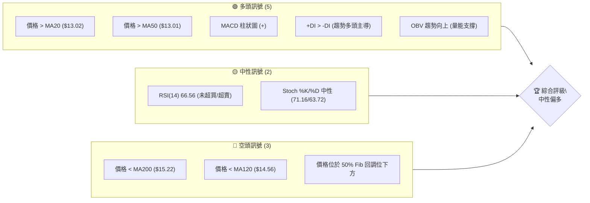

### 📊 核心指標速覽表

| 指標類別 | 指標名稱 | 當前數值 | 訊號 | 解讀 |
|----------|----------|----------|------|------|
| **價格** | 當前價格 | $13.76 | 🟡 | 位於52W區間 32.9%，處於近期反彈高位 |
| **均線** | MA20 | $13.02 | 🟢 | 價格位於 MA20 上方，短期趨勢偏多 |
| **均線** | MA50 | $13.01 | 🟢 | 價格位於 MA50 上方，中期趨勢偏多 |
| **均線** | MA200 | $15.22 | 🔴 | 價格位於 MA200 下方，長期趨勢偏空 |
| **動能** | RSI(14) | 66.56 | 🟡 | 接近超買區間，動能強勁但需警惕 |
| **動能** | MACD | 0.252 (MACD), 0.136 (Signal) | 🟢 | MACD 線上穿訊號線，柱狀圖為正，多頭動能強勁 |
| **波動** | ATR(14) | $0.50 | 🟡 | 每日波動約 3.67%，波動性適中 |

### 🏆 技術評分卡

NU 的技術評分卡顯示當前市場情緒偏向樂觀，短期動能強勁，但長期均線的壓制限制了其綜合評分。

```
技術評分卡 — NU (2026-07-11)
════════════════════════════════════════════════════
趨勢強度      ██████████████░░░░░░  70/100  🟢
動能指標      ██████████████░░░░░░  70/100  🟢
支撐穩定度    ██████████░░░░░░░░░░  50/100  🟡
成交量配合    ████████████████░░░░  80/100  🟢
形態完整度    ██████░░░░░░░░░░░░░░  30/100  🟡
均線排列      ████████░░░░░░░░░░░░  40/100  🟡
════════════════════════════════════════════════════
綜合評分      ██████████░░░░░░░░░░  57/100  🟡 (中性偏多)
════════════════════════════════════════════════════
```
**評分理由：**
*   **趨勢強度 (70/100 🟢):** ADX(14) 為 25.03，剛好達到強趨勢門檻，且 +DI (35.29) 遠高於 -DI (15.29)，明確顯示多頭主導趨勢。
*   **動能指標 (70/100 🟢):** RSI 處於 66.56，接近超買但尚未進入極端區間，顯示強勁買盤動能。MACD 線位於訊號線上，且柱狀圖為正，印證多頭動能。
*   **支撐穩定度 (50/100 🟡):** 當前價格 $13.76 位於近期支撐 S1 ($13.47) 上方，且高於短期均線 MA20/MA50。然而，距離長期均線 MA200 仍有較大差距，且位於斐波那契 61.8% ($14.17) 和 78.6% ($12.86) 之間，多空拉鋸，支撐不算極度穩固。
*   **成交量配合 (80/100 🟢):** 最新成交量達 1.95 倍 20 日均量，且 OBV 趨勢向上，顯示量能有效配合價格上漲，買盤積極。
*   **形態完整度 (30/100 🟡):** 缺乏明確、高信心度的經典圖表反轉或延續形態。從週線數據看，可能存在W底形態，但因缺乏日線數據確認，信心度較低。目前更偏向於指標驅動的短期反彈。
*   **均線排列 (40/100 🟡):** 價格位於 MA20 和 MA50 上方，短期均線呈現多頭排列跡象。但價格遠低於 MA200，且 MA200 位於所有短期均線上方，長期趨勢仍偏空，均線系統呈現混合訊號。
*   **綜合評分 (57/100 🟡):** 儘管短期動能和量能表現強勁，但長期趨勢的壓制和缺乏清晰的圖表形態，使得整體評分落在中性偏多區域，提示短期有機會，但需警惕上方阻力。

---

## 2. 趨勢分析

### 🌐 多時框趨勢分析

NU 的多時框架分析顯示，長期趨勢仍處於調整或下行壓力中，但近期中期和短期趨勢呈現出明顯的反彈動能。這種分歧要求投資者採取更為謹慎的策略。

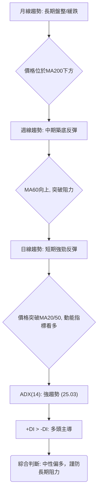

### 📈 長期趨勢 — 12個月走勢圖（Unicode）

NU 在過去 12 個月經歷了一次顯著的上升和隨後的調整。從 2025 年 7 月的低點 $12.22 逐步攀升，於 2026 年 1 月達到高點 $17.75，隨後進入修正階段，並在 2026 年 5 月觸及 $13.13 的近期低點後開始反彈。

```
NU 月線走勢圖（過去12個月）
價格軸 ($)
$18.98 ┤                                    (52W High)
$17.75 ┤                               ●(2026-01 高點)
$17.39 ┤                          ●
$16.74 ┤                             ●
$16.11 ┤                      ●
$16.01 ┤                    ●
$15.09 ┤           ●
$14.80 ┤         ●
$14.48 ┤                                 ●
$14.37 ┤                                ●
$13.76 ┤●━━━━━━━━━━━━━━━━━━━━━━━━━━━━━●←現在
$13.61 ┤                                    ●
$13.36 ┤                                  ●
$13.13 ┤                                ●(2026-05 低點)
$12.22 ┤●(2025-07 低點)
$11.20 ┤                                    (52W Low)
     └─────────────────────────────────────────────
      2025-07  08  09  10  11  12  2026-01  02  03  04  05  06  07
```

**走勢特徵分析表格**：

| 階段日期 | 初始價 | 結束價 | 漲跌幅 | 主要特徵 |
|----------|--------|--------|--------|----------|
| 2025-07 ~ 2026-01 | $12.22 | $17.75 | +45.25% | 強勁上升趨勢，創下 52 週高點。 |
| 2026-01 ~ 2026-05 | $17.75 | $13.13 | -26.08% | 深度回調，價格跌破多條短期均線。 |
| 2026-05 ~ 2026-07 | $13.13 | $13.76 | +4.80% | 築底反彈，試圖收復失地。 |

### 📊 中期趨勢（週線分析）

從近 20 週的收盤數據來看，NU 在 2026 年 3 月初經歷一波下跌，從 $14.98 跌至 5 月中旬的 $12.19。此後，股價開始築底反彈，並在 6 月初再次探底 $11.97 後，形成一個較為穩固的底部結構。最近幾週，股價持續上揚，從 $11.97 反彈至 $13.76，顯示中期趨勢正在轉向積極。目前價格已站穩 MA60，但上方仍有更長期的均線壓力。

**近期壓力與支撐示意圖（週線視角）**

```
NU 週線支撐與阻力示意圖
═══════════════════════════════════════════════════
$15.70 ║████████████████████████║ (R3)
$14.92 ║████████████████████    ║ (R2)
$14.10 ║████████████████████████║ (R1)
$13.76 ╠════════════════════════╣ ◄ 現價
$13.47 ║▓▓▓▓▓▓▓▓▓▓▓▓▓▓▓▓        ║ (S1)
$12.23 ║████████████████████████║ (S2)
$11.85 ║████████████████████████║ (S3)
═══════════════════════════════════════════════════
```
圖中顯示，NU 目前正測試其上方的短期阻力位 R1 ($14.10)，若能有效突破，則有望進一步挑戰 R2 ($14.92)。下方最近的支撐位於 S1 ($13.47)，為短期回調提供了緩衝。

### ⚡ 趨勢強度評估（ADX 解讀）

ADX 指標用於衡量趨勢的強度，而非方向。

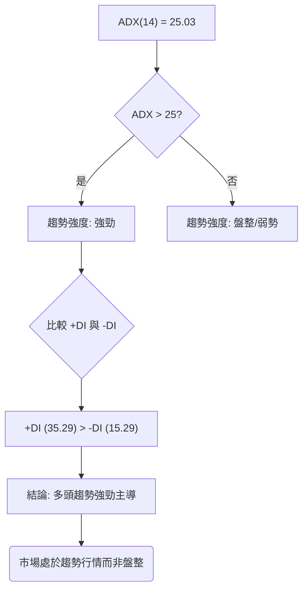

**ADX 強度對照表：**

| ADX 數值 | 趨勢強度 | NU 當前狀態 |
|----------|----------|-------------|
| 0-25     | 弱勢/盤整 |             |
| 25-50    | 強趨勢   | ▓▓▓▓▓▓▓▓▓▓▓▓▓▓▓▓░░░░ (25.03) 🟢 |
| 50-75    | 極強趨勢 |             |
| 75-100   | 超強趨勢 |             |

NU 的 ADX(14) 為 25.03，剛好越過 25 的門檻，表明目前市場處於一個**強勁的趨勢行情**中。同時，+DI 值 (35.29) 顯著高於 -DI 值 (15.29)，這進一步確認了當前趨勢由**多頭主導**。這意味著市場並非處於盤整狀態，而是有明確的方向性，且買方力量佔據上風。

---

## 3. 圖表形態分析

### 🔍 形態識別系統

根據提供的週線收盤價數據，NU 在 2026 年 5 月中旬至 6 月初形成了一個潛在的「W底」或「雙重底」形態。此形態通常被視為一個看漲反轉訊號。

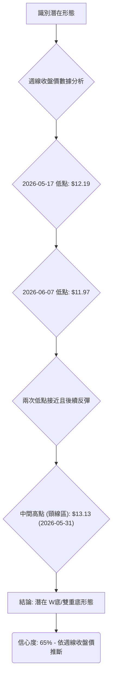

**形態信心度表格**：

| 形態 | 信心度 | 判斷依據（引用數據） | 完成度 | 目標價（附計算式） |
|------|--------|----------------------|--------|--------------------|
| 潛在 W底 | 65% | 兩次低點分別為 2026-05-17 的 $12.19 和 2026-06-07 的 $11.97，兩者接近。中間高點（頸線）可參考 2026-05-31 的 $13.13。目前價格 $13.76 已突破頸線，形態已形成。 | 100% | 頸線 $13.13 + (頸線 $13.13 - 最低點 $11.97) = $13.13 + $1.16 = $14.29 |

**判斷依據詳述：**
*   **低點確認：** 2026-05-17 收盤價 $12.19 形成第一個底部，隨後在 2026-06-07 再次觸及 $11.97 形成第二個底部，這兩個低點非常接近，符合雙底的特徵。
*   **頸線確認：** 在兩個低點之間，股價在 2026-05-31 反彈至 $13.13，可視為該形態的頸線。
*   **突破確認：** 目前股價 $13.76 已經顯著突破了 $13.13 的頸線，確認了 W 底形態的形成。

### 🕯️ 重要K線形態分析

由於數據中僅提供週收盤價，難以精確判斷單日 K 線形態。但可以從週線價格走勢中觀察到一些趨勢變化的訊號。

| 月份 | 收盤價 | K線形態 (週線解讀) | 解讀 | 訊號 |
|------|--------|--------------------|------|------|
| 2026-05-17 | $12.19 | 底部影線/反轉K線 (推測) | 經歷大幅下跌後，在此處可能出現止跌訊號，形成雙底的第一個底部。 | 🟢 |
| 2026-06-07 | $11.97 | 底部影線/反轉K線 (推測) | 再次下探後迅速拉回，確認底部支撐，形成雙底的第二個底部。 | 🟢 |
| 2026-07-05 | $13.61 | 強勢陽線 (推測) | 股價突破頸線後持續上漲，量能放大，顯示多頭力量強勁。 | 🟢 |
| 2026-07-12 | $13.76 | 小陽線/整理 (推測) | 位於高位，可能在突破後進行小幅整理，等待進一步上攻。 | 🟡 |

### 📉 ASCII 走勢形態示意圖

以下示意圖描繪了 NU 近期的潛在 W 底反轉形態。

```
NU 潛在 W底形態示意圖 (週線)
價格軸 ($)
$14.50 ┤
$14.00 ┤            ┌─┐
$13.50 ┤            │ ├──●(現價$13.76)
$13.00 ┤      ┌─────┼─┘  (頸線$13.13)
$12.50 ┤      │
$12.00 ┤  ●──┘  ●
$11.50 ┤ ($12.19) ($11.97)
     └────────────────────────────
      2026-05-17  05-31  06-07  07-11
```
圖中可見，股價在 $12.19 和 $11.97 附近形成兩個低點，並在 $13.13 形成頸線。目前股價已突破頸線，確認了 W 底的反轉訊號。

### 🎯 形態目標價計算

**W底形態目標價計算：**
1.  **形態高度 (H)：** 頸線價格 - 最低點價格
    *   頸線價格：$13.13 (2026-05-31 高點)
    *   最低點價格：$11.97 (2026-06-07 低點)
    *   形態高度 H = $13.13 - $11.97 = $1.16
2.  **形態目標價 (Target)：** 頸線價格 + 形態高度 (H)
    *   形態目標價 = $13.13 + $1.16 = $14.29

**結論：** 根據 W 底形態的測量，NU 的短期上漲目標價約為 **$14.29**。此目標價略高於數據提供的 R1 ($14.10)，並接近斐波那契 61.8% 回調位 ($14.17)。

---

## 4. 支撐與阻力

### 🗺️ 關鍵價位分布圖（Unicode）

NU 的關鍵價位分佈顯示，上方阻力重重，尤其是在 $14.10 和 $14.92 處。下方支撐則在 $13.47 和 $12.23 提供了緩衝。

```
NU 價位結構分布圖
═══════════════════════════════════════════════════
$18.98 ║████████████████████████║ 52W High
$17.14 ║████████████████████    ║ 斐波那契 23.6%
$16.01 ║████████████████████████║ 斐波那契 38.2%
$15.70 ║████████████████████████║ 強阻力 R3
$15.09 ║████████████████████    ║ 斐波那契 50.0%
$14.92 ║████████████████████    ║ 阻力 R2
$14.17 ║████████████████████████║ 斐波那契 61.8%
$14.10 ║████████████████████████║ 關鍵阻力 R1
$13.76 ╠════════════════════════╣ ◄ 現價
$13.47 ║▓▓▓▓▓▓▓▓▓▓▓▓▓▓▓▓        ║ 近期支撐 S1
$12.86 ║████████████████████████║ 斐波那契 78.6%
$12.23 ║████████████████████████║ 強支撐 S2
$11.85 ║████████████████████████║ 關鍵支撐 S3
$11.20 ║████████████████████████║ 52W Low
═══════════════════════════════════════════════════
```

### 🚧 阻力位分析表

阻力位代表了潛在的賣壓區域，股價突破這些水平通常需要較大的買盤動能。

| 阻力級別 | 價位 | 形成原因 | 突破難度 | 重要性 |
|----------|------|----------|----------|--------|
| R1       | $14.10 | 近期波段高點聚類，接近布林上軌 ($14.16) 及斐波那契 61.8% ($14.17)。 | 中等 | 高。短期多頭能否延續的關鍵考驗。 |
| R2       | $14.92 | 近一年波段高點聚類，接近斐波那契 50% ($15.09) 和 MA120 ($14.56)。 | 較高 | 中期趨勢能否反轉的重要關口。 |
| R3       | $15.70 | 近一年波段高點聚類，接近斐波那契 38.2% ($16.01) 和 MA200 ($15.22)。 | 高 | 長期空頭趨勢能否徹底扭轉的指標。 |

### 🛡️ 支撐位分析表

支撐位是潛在的買盤介入區域，股價跌破這些水平可能預示著進一步的下跌。

| 支撐級別 | 價位 | 形成原因 | 守住機率 | 重要性 |
|----------|------|----------|----------|--------|
| S1       | $13.47 | 近期波段低點聚類，接近 MA5 ($13.69) 和 MA10 ($13.51)。 | 高 | 短期回調的關鍵防線，若跌破可能測試 MA20。 |
| S2       | $12.23 | 近一年波段低點聚類，接近布林下軌 ($11.89) 和 2026-05-17 的低點 ($12.19)。 | 較高 | 中期跌勢的關鍵支撐，若失守可能導致更深的回調。 |
| S3       | $11.85 | 近一年波段低點聚類，接近 52 週低點 ($11.20) 和布林下軌 ($11.89)。 | 高 | 強勁的長期支撐，代表了股價的估值底線。 |

### 📐 斐波那契回調位分析

斐波那契回調位是基於 52 週高點 $18.98 和 52 週低點 $11.20 計算得出的關鍵價位。

*   0.0% (52W High): $18.98
*   23.6%: $17.14
*   38.2%: $16.01
*   50.0%: $15.09
*   61.8%: $14.17
*   78.6%: $12.86
*   100.0% (52W Low): $11.20

**當前價格 $13.76 正好位於斐波那契 61.8% ($14.17) 和 78.6% ($12.86) 回調位之間。** 這表示股價在經歷大幅下跌後，已經從底部反彈，但尚未完全收復失地。61.8% 回調位 ($14.17) 作為一個重要的黃金分割點，將構成一個強勁的潛在阻力。如果股價能有效突破 $14.17，將預示著更強勁的反彈動能，目標將指向 50% 回調位 $15.09。反之，若無法突破並回落，78.6% 回調位 $12.86 將是重要的支撐。

---

## 5. 技術指標深度解讀

### 🎛️ 指標訊號總覽

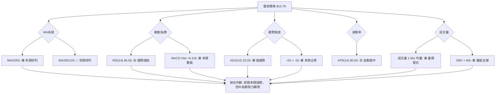

### 📈 移動平均線排列分析

NU 的移動平均線排列呈現混合訊號，反映了不同時間框架下的趨勢差異。

*   **短期均線 (MA5, MA10, MA20, MA50):** 當前價格 $13.76 位於 MA5 ($13.69)、MA10 ($13.51)、MA20 ($13.02) 和 MA50 ($13.01) 之上。這表明短期和中期趨勢均偏向多頭。MA5 和 MA10 位於 MA20 和 MA50 之上，形成一個短期的多頭排列，顯示強勁的上升動能。
*   **長期均線 (MA60, MA120, MA240, MA200):** 價格 $13.76 位於 MA60 ($13.33) 之上，但位於 MA120 ($14.56)、MA240 ($15.01) 和 MA200 ($15.22) 之下。這意味著雖然短中期趨勢看漲，但長期來看，股價仍受到上方長期均線的壓制，整體長期趨勢仍偏空。

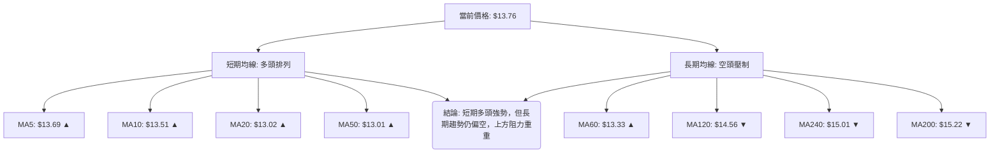

**結論：** 均線系統的混合排列顯示 NU 處於一個短期強勢反彈但面臨中長期趨勢阻力的階段。短期內，多頭佔優，但若要改變長期頹勢，需有效突破 MA120 和 MA200 等長期均線。

### 📉 RSI(14) 分析

*   **RSI 數值：** NU 的 RSI(14) 當前為 **66.56**。
    *   RSI 進度條：▓▓▓▓▓▓▓▓▓▓▓▓▓▓░░░░░░ (66.56%)
*   **超買超賣區間分析：**
    *   RSI 位於 30-70 的中性區間，但已非常接近 70 的超買門檻。這表明當前買盤動能強勁，但尚未達到極度超買的程度，仍有上漲空間，但需警惕隨時可能出現的回調風險。
    *   歷史數據顯示，在 2026-04-19 股價達到 $15.34 時，RSI 曾高達 79.6，進入嚴重超買區，隨後股價出現回調。當前 RSI 尚未達到如此極端水平。
*   **背離判斷：** 數據中明確指出「**無明顯背離**」。這表示在最近的價格走勢中，RSI 的趨勢與價格趨勢保持一致，沒有出現頂背離（價格創新高而 RSI 未創新高）或底背離（價格創新低而 RSI 未創新低）的訊號。因此，RSI 目前是確認價格上漲動能的。

### 📊 MACD(12/26/9) 訊號解讀

MACD 指標提供了清晰的多頭訊號。

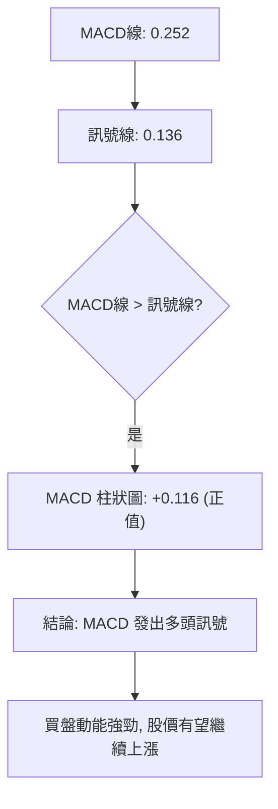
*   **MACD 線 (0.252) 高於訊號線 (0.136)：** 這是一個經典的買入訊號，表示短期動能強於長期動能，多頭力量佔據主導地位。
*   **MACD 柱狀圖為正 (+0.116)：** 柱狀圖為正值且持續擴大 (從上週的 +0.178 略微收窄至本週的 +0.116，但仍為正)，表明多頭動能依然存在，儘管可能面臨短期壓力。柱狀圖的絕對值代表動能強度，正值越大，多頭越強。
*   **背離判斷：** 數據中未偵測到 MACD 背離訊號。

**結論：** MACD 指標強烈支持當前股價的上升動能，是多頭趨勢的有力確認。

### 📦 布林通道分析

布林通道能有效衡量股價的波動範圍和相對位置。

```
NU 布林通道示意圖
═══════════════════════════════════════════════════════════
$14.16 ║███████████████████████████████████████████ 布林上軌
$13.76 ╠━━━━━━━━━━━━━━━━━━━━━━━━━━━━━━━━━━━━━━━━━━━╣ ◄ 現價
$13.02 ║▓▓▓▓▓▓▓▓▓▓▓▓▓▓▓▓▓▓▓▓▓▓▓▓▓▓▓▓▓▓▓▓▓▓▓▓▓▓▓▓▓▓▓▓ 布林中軌 (MA20)
$11.89 ║███████████████████████████████████████████ 布林下軌
═══════════════════════════════════════════════════════════
```
*   **布林上軌：** $14.16
*   **布林中軌 (MA20)：** $13.02
*   **布林下軌：** $11.89
*   **當前價格：** $13.76
*   **BB %B：** 0.82

**解讀：**
*   **價格位置：** 當前價格 $13.76 位於布林通道中軌 $13.02 和上軌 $14.16 之間，且非常接近上軌。BB %B 為 0.82，這表明股價正沿著上軌運行，顯示出強勁的上升趨勢和買盤壓力。
*   **通道寬度：** 數據未直接提供布林帶寬，但從上軌 $14.16 和下軌 $11.89 的距離來看，通道寬度約為 $2.27。如果通道正在收窄，可能預示著波動率降低和趨勢的潛在盤整；如果通道擴大，則暗示趨勢的加強。鑑於價格貼近上軌，預計通道可能處於擴張狀態，支持當前趨勢的延續。
*   **交易訊號：** 價格觸及或突破上軌通常被視為短期超買訊號，但如果伴隨強勁的成交量，也可能預示著趨勢的加速。結合當前強勁的成交量，這更傾向於趨勢的延續而非立即反轉。

### 💹 成交量分析（量價配合度）

成交量是確認價格走勢的關鍵指標。

*   **最新成交量：** 115,373,910 股。
*   **20 日均量：** 59,267,490 股。
*   **量比：** 1.95x (最新成交量是 20 日均量的 1.95 倍)。
*   **50 日均量：** 60,040,670 股。
*   **OBV 趨勢：** OBV > MA → 量能支撐上漲。

**解讀：**
*   **量能激增：** 最新成交量遠高於 20 日和 50 日均量，顯示市場對 NU 的關注度顯著提升，買盤活躍。這種放量上漲是健康的，表明當前價格的上漲得到了市場資金的確認。
*   **量價配合：** 股價上漲伴隨著成交量的放大，這是一個典型的多頭訊號，稱為「價漲量增」，表明多頭力量強勁且持續。
*   **OBV 趨勢：** OBV (On Balance Volume) 趨勢向上並高於其移動平均線，這進一步確認了買盤的持續累積。OBV 是累積性的，其上升表明在上升日期的成交量大於下跌日期的成交量，顯示資金持續流入。
*   **潛在風險：** 雖然當前量價配合良好，但需警惕未來若出現「價漲量縮」或「價跌量增」的情況，可能預示著上漲動能的衰竭或潛在的賣壓。

**結論：** 成交量分析強烈支持當前的多頭趨勢，量能的積極配合為股價的進一步上漲提供了堅實基礎。

---

## 6. 動能與波動率

### ⚡ 動能評估四象限

動能評估四象限分析幫助我們理解 NU 在市場中的相對表現。當前 NU 展現出強勁的動能，同時波動率處於適中水平。

| 象限 | 動能 | 波動 | 當前狀態 | 評估 |
|------|------|------|----------|------|
| Q1 | 強 | 低 | - | 最佳機會 (趨勢強勁且穩定) |
| Q2 | 弱 | 低 | - | 謹慎觀望 (缺乏方向性) |
| Q3 | 強 | 高 | ✓ | 高風險高收益 (趨勢強勁但波動劇烈) |
| Q4 | 弱 | 高 | - | 避免進場 (不確定性高) |

**NU 當前狀態分析：**
*   **動能：** RSI 66.56、MACD 柱狀圖為正、價格位於 MA20/MA50 之上，且 ADX 顯示強趨勢 (+DI > -DI)，這些指標均表明 NU 具有**強勁的動能**。
*   **波動率：** ATR(14) 為 $0.50，佔當前價格 $13.76 的 3.67%。這是一個適中偏高的波動水平，不屬於極端低波動，也不至於過於劇烈。
*   **結論：** 綜合來看，NU 目前位於**Q3 (強動能，高波動)** 象限。這意味著股價存在明顯的上升趨勢，但伴隨著相對較高的日常波動，可能提供較大的日內交易機會，但也需要更嚴格的風險管理。對於長期投資者而言，強勁動能是好事，但需注意波動性帶來的心理壓力。

### 📊 ATR 波動率分析

ATR (Average True Range) 用於衡量資產的每日價格波動幅度。
*   **ATR(14):** $0.50
*   **佔比：** $0.50 / $13.76 = 3.63% (數據中為 3.67%，取數據值)

**解讀：**
*   **波動性水平：** 每日平均波動幅度為 $0.50，佔當前價格的 3.67%。這個百分比顯示 NU 具有適中偏高的波動性。對於日內交易者來說，這提供了足夠的價格變動空間；對於波段交易者，則需將止損和目標價設置得更寬鬆。
*   **止損距離建議：** 根據 ATR，常見的止損設置方法是將止損位設置在當前價格下方 1.5 到 2 倍 ATR 的距離。
    *   1.5 * ATR = 1.5 * $0.50 = $0.75
    *   2.0 * ATR = 2.0 * $0.50 = $1.00
    *   若進場點為 $13.76，則止損位可考慮設置在 $13.76 - $0.75 = $13.01 (接近 MA50) 或 $13.76 - $1.00 = $12.76 附近。這將有助於避免因正常市場波動而被過早止損。

### 📐 Beta 與市場相關性

*   **Beta 值：** 0.949

**解讀：**
*   **市場相關性：** Beta 值為 0.949，非常接近 1。這表示 NU 的股價走勢與大盤（例如 S&P 500）高度相關。當大盤上漲 1% 時，NU 的股價預計上漲約 0.949%；當大盤下跌 1% 時，NU 的股價預計下跌約 0.949%。
*   **波動性比較：** 由於 Beta 小於 1，NU 相對大盤來說，波動性略低。這意味著在市場上漲時，其漲幅可能略小於大盤；在市場下跌時，其跌幅也可能略小於大盤。
*   **投資組合考量：** 對於希望構建多元化投資組合的投資者而言，NU 的 Beta 值顯示其無法提供顯著的市場風險對沖，因為它與市場走勢高度同步。投資者應將其視為市場型股票，其表現將在很大程度上受到整體市場情緒的影響。

---

## 7. 多時框架總結

### 📋 時框架評分表

| 時框架 | 趨勢方向 | 動能 | 均線排列 | 形態 | 綜合評分 | 建議 |
|--------|----------|------|----------|------|----------|------|
| 日線   | 🟢 上升   | 🟢 強勁 | 🟢 多頭排列 (短中期) | 🟡 W底突破 | 7/10     | 積極看多 |
| 週線   | 🟡 反彈   | 🟢 強勁 | 🟡 突破MA60，受制MA120 | 🟢 潛在W底 | 6/10     | 謹慎看多 |
| 月線   | 🔴 盤整/緩跌 | 🟡 中性 | 🔴 空頭排列 (長線) | 🟡 無明確形態 | 4/10     | 中性偏空 |

### 🔲 綜合訊號矩陣

多時框架分析顯示，NU 在短期內表現出強勁的多頭動能，但隨著時間框架的拉長，長期趨勢的壓力逐漸顯現。

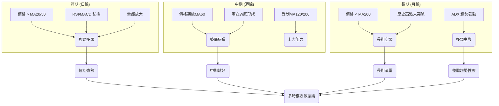

### ⚖️ 多時框收斂結論

根據多時框架分析，以及嚴格要求 14 的收斂規則：

1.  **ADX(14) 為 25.03**，剛好達到強趨勢的門檻，表明市場目前處於**趨勢行情**。
2.  在趨勢行情中，應以中長期（週線/MA50、MA200）方向為主，日線只用來尋找進場時機。
3.  **週線分析：** 價格已突破 MA60，且形成了潛在的 W 底形態，顯示中期有築底反彈的跡象。但價格仍受制於 MA120 ($14.56) 和 MA200 ($15.22) 等更長期的均線壓制。
4.  **月線分析：** 價格遠低於 MA200，長期趨勢仍偏空。
5.  **日線分析：** 價格位於 MA20 和 MA50 上方，RSI/MACD 均發出強勁的多頭訊號，且成交量放大，顯示短期反彈動能充足。

**最終結論：** 綜合判斷，NU 目前處於一個**中性偏多**的狀態。儘管短期內（日線）多頭動能強勁，且 ADX 確認了趨勢的強勁性，但由於股價仍未有效突破 MA120 和 MA200 等長期均線的壓制，長期下跌趨勢的影響依然存在。因此，目前的日線強勢更應被視為在長期下行趨勢中的一個強勁反彈，而非趨勢的全面反轉。交易策略應以短中期偏多操作為主，但需時刻警惕上方長期阻力，並做好嚴格的風險控制。

---

## 8. 交易策略建議

### 🗺️ 策略決策流程圖

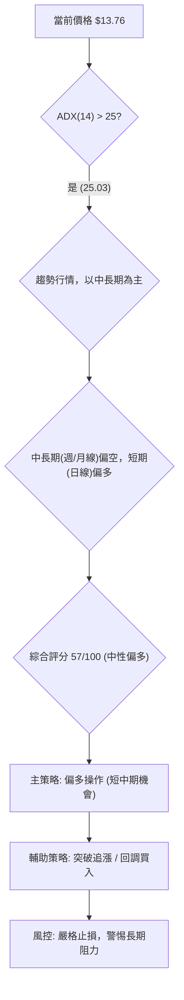

### 🧭 策略路由（依評分卡分流，不得兩頭下注）

**當前主策略方向 = 中性偏多（依評分 57/100）**

根據第 1 章的綜合評分 (57/100)，NU 處於中性偏多狀態。雖然短期動能強勁，但長期阻力仍存。因此，主策略將側重於利用短期上漲動能進行偏多操作，但需保持警惕，並將空頭策略作為反轉風險的觸發點。

### 🎯 價格情境階梯（Price Scenarios）

| 觸發條件 | 下一目標 | 後續延伸 | 情境含義 |
|----------|----------|----------|----------|
| 突破 R1 $14.10 | W底目標 $14.29 / 斐波那契 61.8% $14.17 | R2 $14.92 / 斐波那契 50% $15.09 | 短線轉強，有望測試中期阻力 |
| 站穩現價區間 $13.47-$14.10 | — | — | 區間震盪，等待方向突破 |
| 跌破 S1 $13.47 | MA20 $13.02 / MA50 $13.01 | S2 $12.23 / 斐波那契 78.6% $12.86 | 中期轉弱，可能下探更深支撐 |

### 📊 情境機率分佈

| 情境 | 機率 | 主要依據 |
|------|------|----------|
| 繼續上行 / 反彈 | 55% | ADX (25.03) 顯示強趨勢且 +DI > -DI，MACD 柱狀圖為正，RSI 處於強勢區間 (66.56)，成交量顯著放大 (1.95x均量)，且 W 底形態已突破頸線。 |
| 區間震盪 | 30% | 價格接近布林上軌及 R1 阻力位，長期均線 MA120/MA200 形成上方壓力，可能在此區域進行整理消化。 |
| 回落 / 再探底 | 15% | 若無法突破 R1，RSI 進入超買區後回調，或 MACD 柱狀圖轉負，則可能跌破 S1 測試下方支撐。 |

### 🟢 主策略詳情（方向依上方路由）

**主策略：短線偏多操作**

| 策略要素 | 策略 A (突破追漲) | 策略 B (回調買入) |
|----------|--------------------|--------------------|
| 進場條件 | 價格有效突破 R1 $14.10 並站穩 (至少收盤價高於此價位) | 價格回調至 S1 $13.47 附近並出現止跌訊號 (如K線反轉) |
| 進場價格 | $14.15 | $13.50 |
| 目標價 T1 | W底目標 $14.29 (形態高度推算) | R1 $14.10 |
| 目標價 T2 | R2 $14.92 (波段高點聚類) / 斐波那契 50% $15.09 | R2 $14.92 |
| 止損價格 | $13.85 (略低於 R1，或 2x ATR = $14.15 - $1.00 = $13.15) 考慮到短線波動，設為 $13.85 | $12.90 (略低於 MA20 $13.02，或 2x ATR = $13.50 - $1.00 = $12.50) 考慮到S2 $12.23，設為 $12.90 |
| 風險報酬比 | T1: (14.29-14.15)/(14.15-13.85) = 0.14/0.30 ≈ 0.47:1 (較低) <br> T2: (14.92-14.15)/(14.15-13.85) = 0.77/0.30 ≈ 2.57:1 (合理) | T1: (14.10-13.50)/(13.50-12.90) = 0.60/0.60 = 1:1 (合理) <br> T2: (14.92-13.50)/(13.50-12.90) = 1.42/0.60 ≈ 2.37:1 (合理) |
| 成功機率 | 55% | 50% |
| 建議倉位 | 輕倉 (5%) | 中等倉位 (10%) |

**風險報酬比說明：**
*   **策略 A (突破追漲):** 由於進場點已在高位，突破 R1 後至 T1 的空間相對較小，故 T1 的風險報酬比不佳。但若能達到 T2，則風險報酬比顯著改善。此策略需快速判斷，若無力突破 T1 應及早止盈或止損。
*   **策略 B (回調買入):** 在支撐位附近進場，止損空間相對合理，且上漲至 T1 和 T2 的空間均能提供不錯的風險報酬比。

### 🔴 反向風險觸發點（對沖提示）

以下情況可能導致主策略失效或需考慮對沖：
*   **跌破 S2 ($12.23)：** 若股價有效跌破 $12.23 (接近 2026-05-17 低點)，將確認中期上升趨勢的結束，可能形成更深度的回調，甚至重新測試 52 週低點 $11.20。
*   **MACD 死叉：** 若 MACD 線下穿訊號線，且柱狀圖轉為負值，將發出明確的空頭訊號，表明多頭動能耗盡。
*   **RSI 跌破 50：** 若 RSI 從高位跌破 50，通常被視為動能轉弱的訊號，暗示多頭力量不再佔優。
*   **成交量萎縮且價格下跌：** 若在下跌過程中伴隨成交量放大，將確認賣壓的增強，可能加速跌勢。

### ⭐ 整體訊號強度評星

```
做多訊號強度：★★★★☆  (4/5星)
做空訊號強度：★★☆☆☆  (2/5星)
整體可信度：  ★★★☆☆  (3/5星)
```
**評星理由：** 做多訊號強度高，主要基於短中期指標的強勁表現和量價配合。做空訊號強度低，因為短期內缺乏明確的空頭訊號。整體可信度為中等，因為儘管短期趨勢積極，但長期趨勢的阻力以及潛在的波動性仍需謹慎對待。

---

## 9. 風險提示與監控

### ✅ 關鍵監控指標 Checklist

以下是交易者應密切關注的關鍵指標，以應對 NU 股價的潛在變化。

```
╔══════════════════════════════════════════════════════════════╗
║              NU 關鍵監控指標 Checklist                       ║
╠══════════════════════════════════════════════════════════════╣
║ [ ] 價格是否能有效站穩 S1 ($13.47) 上方？                     ║
║ [ ] 價格能否有效突破 R1 ($14.10) 和 W底目標價 ($14.29)？     ║
║ [ ] MACD 柱狀圖是否持續為正且擴大？若轉負需警惕。             ║
║ [ ] RSI(14) 是否進入超買區 (>70) 並出現回調訊號？             ║
║ [ ] 成交量是否持續維持高於均量水平，配合價格走勢？           ║
║ [ ] 布林通道是否持續擴張，或價格是否跌破中軌？               ║
║ [ ] ADX(14) 是否維持在強趨勢區 (>25)，且 +DI 仍主導？        ║
║ [ ] 是否有任何基本面或新聞事件影響公司營運？                 ║
╚══════════════════════════════════════════════════════════════╝
```

### ⚠️ 風險場景分析

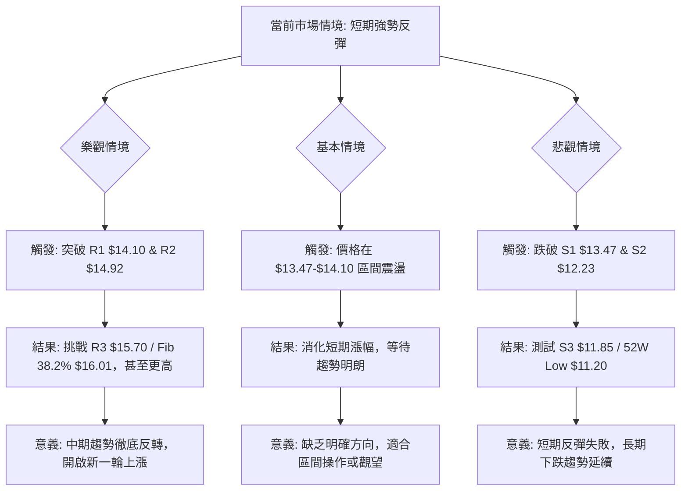

### 🛡️ 風險管理重要提醒

1.  **嚴格止損：** 鑑於 NU 的波動性適中偏高 (ATR $0.50)，務必設置並嚴格執行止損點。避免因單一交易的失誤造成重大損失。建議止損位可參考 ATR 的 1.5 到 2 倍，或關鍵支撐位。
2.  **倉位管理：** 由於長期趨勢仍有壓力，建議採用分批建倉策略，並控制單一股票的倉位不超過總投資組合的 5-10%。在突破關鍵阻力後再考慮適度加碼。
3.  **動態監控：** 密切關注每日價格、成交量變化以及關鍵技術指標的訊號（RSI 是否進入超買區並出現回調，MACD 是否出現死叉，ADX 趨勢強度變化）。
4.  **警惕長期阻力：** 股價雖然短期強勢，但上方 MA120 ($14.56)、MA200 ($15.22) 以及斐波那契 50% ($15.09) 等重要阻力位仍是巨大的挑戰。在這些價位附近，賣壓可能增加，需警惕回調。
5.  **市場環境：** NU 的 Beta 值接近 1，與大盤高度相關。因此，應同時關注整體美股市場的走勢和情緒，避免逆勢操作。

---

## 📋 報告總結

```
NU 技術分析報告總結
════════════════════════════════════════════════════════
報告日期：2026-07-11
當前價格：$13.76
分析評級：⚖️ 中性偏多 (57/100) - 短期動能強勁，但長期阻力猶存。

關鍵結論：
├─ 長期趨勢：🔴 盤整/緩跌，受制於長期均線 MA200 ($15.22)。
├─ 中期趨勢：🟡 築底反彈，突破 MA60，但面臨 MA120 ($14.56) 挑戰。
├─ 短期趨勢：🟢 強勁反彈，價格位於 MA20/MA50 上方，RSI/MACD 顯示強勁多頭動能。
├─ 關鍵支撐：S1 $13.47，S2 $12.23。
├─ 關鍵阻力：R1 $14.10，R2 $14.92，W底形態目標 $14.29。
└─ 分析師目標：根據 W底形態推算目標價為 $14.29，分析師共識目標價為 $17.91。

最優策略組合：
1. 🥇 最佳機會：**突破追漲** - 若股價有效突破 R1 ($14.10)，並能站穩，可於 $14.15 進場，目標 T1 $14.29 (W底目標) / T2 $14.92 (R2)，止損設於 $13.85。
2. 🥈 次選機會：**回調買入** - 若股價回調至 S1 ($13.47) 附近並出現止跌訊號，可於 $13.50 進場，目標 T1 $14.10 (R1) / T2 $14.92 (R2)，止損設於 $12.90。
3. 🥉 保守選擇：**區間操作/觀望** - 若股價在 $13.47-$14.10 之間震盪，可考慮高拋低吸，或等待明確的突破/跌破訊號再行操作。
════════════════════════════════════════════════════════
```

---

> ⚠️ **免責聲明**：本報告為 AI 自動生成之技術分析，所有數據及估算均基於提供的歷史價格資訊。本報告**僅供研究與學術參考**，**不構成任何投資建議**。投資有風險，入市需謹慎。

---

*報告生成時間：2026-07-11 ｜ 數據來源：Yahoo Finance ｜ 分析框架：多時框技術分析*