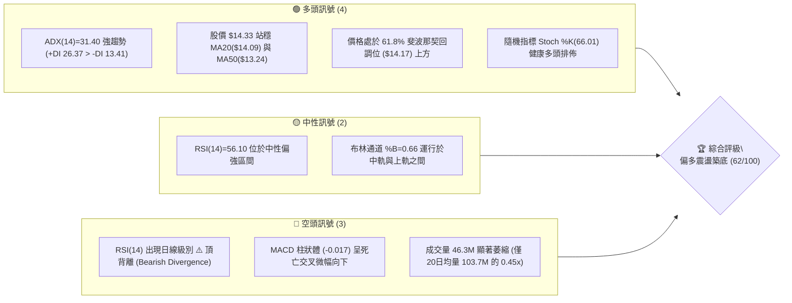
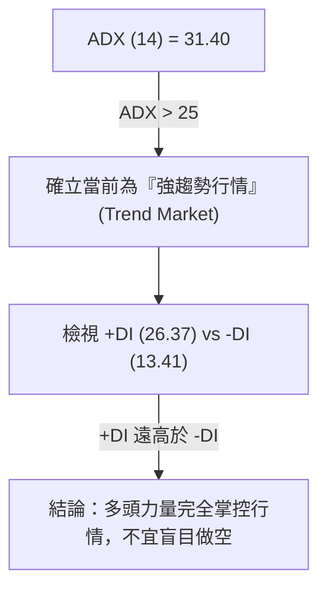
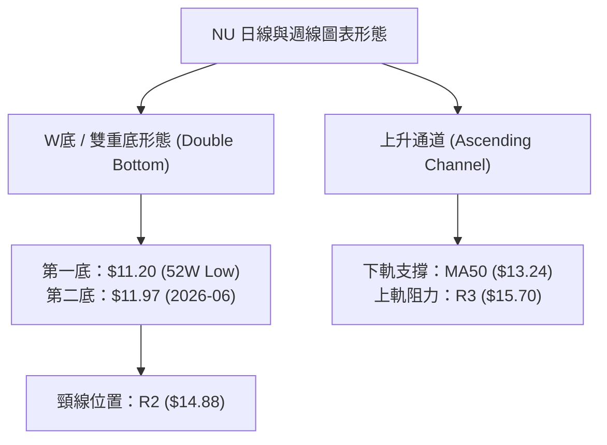
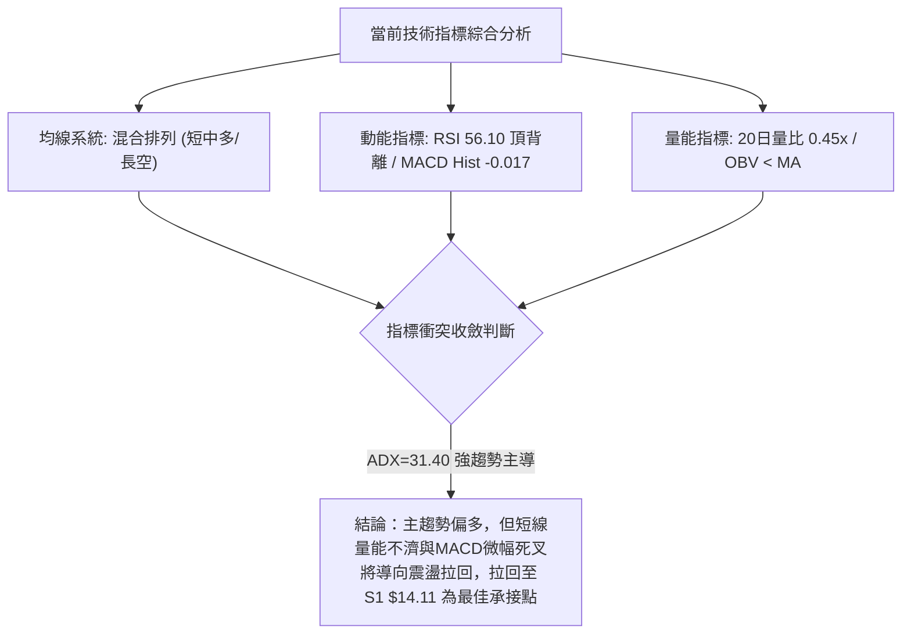
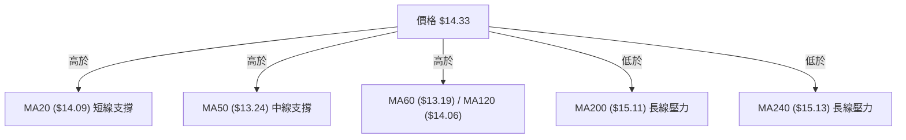
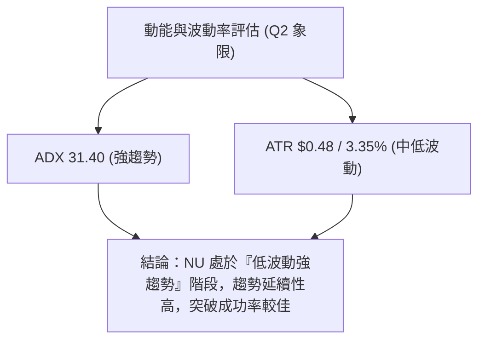
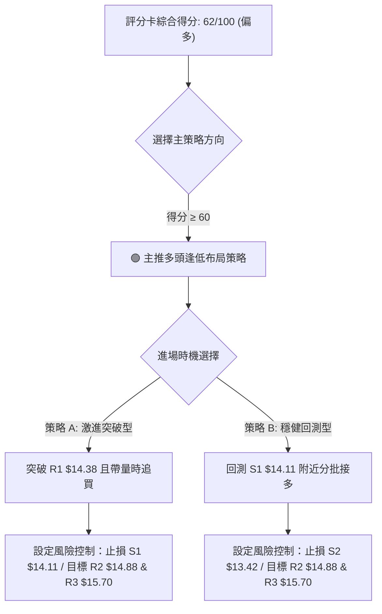
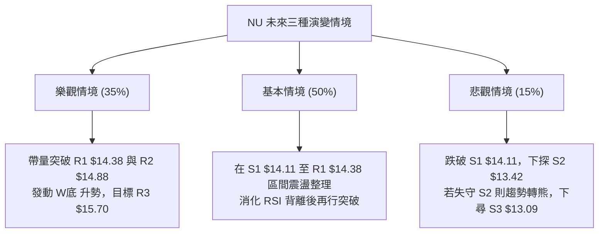

# NU 技術分析報告

> **報告日期**：2026-08-05 ｜ **語言**：繁體中文 ｜ **數據來源**：Yahoo Finance ｜ **當前價格**：$14.33

---

## 目錄

| 章節 | 內容 |
|------|------|
| [1. 技術面概覽](#1-技術面概覽) | 訊號儀表板、核心指標、評分卡 |
| [2. 趨勢分析](#2-趨勢分析) | 多時框趨勢、長中短期走勢、ADX強弱評估 |
| [3. 圖表形態分析](#3-圖表形態分析) | 形態識別、信心度評估、K線組合與目標價 |
| [4. 支撐與阻力](#4-支撐與阻力) | 關鍵價位結構、斐波那契回調層級分析 |
| [5. 技術指標深度解讀](#5-技術指標深度解讀) | 均線系統、RSI/MACD背離、布林通道與量能 |
| [6. 動能與波動率](#6-動能與波動率) | 動能四象限、ATR風險距離、Beta相關性 |
| [7. 多時框架總結](#7-多時框架總結) | 時框架矩陣與多時框優先級收斂 |
| [8. 交易策略建議](#8-交易策略建議) | 策略路由、價格情境階梯、進出場與風報比 |
| [9. 風險提示與監控](#9-風險提示與監控) | 關鍵監控Checklist、三情境演練、風控守則 |

---

## 1. 技術面概覽

### 🎯 技術訊號儀表板



### 📊 核心指標速覽表

| 指標類別 | 指標名稱 | 當前數值 | 訊號 | 解讀 |
|----------|----------|----------|------|------|
| **價格** | 當前收盤價 | $14.33 | 🟡 | 位於52週區間 ($11.20–$18.98) 之 40.2% 位置 |
| **均線** | MA20 / MA50 | $14.09 / $13.24 | 🟢 | 股價站於短中期均線上方，呈多頭排列 |
| **均線** | MA200 | $15.11 | 🔴 | 股價低於長期年線，長線壓制尚未化解 |
| **動能** | RSI(14) | 56.10 | 🟡 | 中性偏強，但存在頂背離風險 |
| **動能** | MACD (12,26,9) | 0.310 / Sig: 0.327 | 🔴 | MACD Hist (-0.017) 死叉，短期修正中 |
| **趨勢** | ADX(14) / +DI / -DI | 31.40 / 26.37 / 13.41 | 🟢 | ADX > 25 具強趨勢，+DI 主導多頭方向 |
| **波動** | ATR(14) / BB %B | $0.48 (3.35%) / 0.66 | 🟡 | 每日波動中等，布林中上軌間震盪 |
| **量能** | 20日量比 / OBV | 0.45x / OBV < MA | 🔴 | 突破缺乏大量配合，量能暫顯疲弱 |

### 🏆 技術評分卡

```
╔══════════════════════════════════════════════════════════════════╗
║                    技術評分卡 — NU (2026-08-05)                   ║
╠══════════════════════════════════════════════════════════════════╣
║  趨勢強度 (ADX/+DI) ████████████████░░░░  80/100  🟢 強勢多頭   ║
║  動能指標 (RSI/MACD)██████████░░░░░░░░░░  50/100  🟡 死叉背離   ║
║  支撐穩定度 (S1/S2)  ██████████████░░░░░░  70/100  🟢 61.8%守住  ║
║  成交量配合 (OBV)    ██████░░░░░░░░░░░░░░  30/100  🔴 量能大幅萎縮 ║
║  形態完整度 (W底)    ██████████████░░░░░░  70/100  🟢 底部結構成型 ║
║  均線排列 (短中長期) ████████████░░░░░░░░  60/100  🟡 短多長空交錯 ║
╠══════════════════════════════════════════════════════════════════╣
║  綜合評分            ████████████4░░░░░░░  62/100  偏多震盪 (BUY)║
╚══════════════════════════════════════════════════════════════════╝
```

---

## 2. 趨勢分析

### 🌐 多時框趨勢分析

```mermaid
graph TD
    A["月線層級 (Long-Term)"] -->|"2026-01 創高 $17.75 後回檔，回測 $11.20 後反彈"| B["月線：大區間震盪築底 (中性)"]
    C["週線層級 (Mid-Term)"] -->|"突破 $11.97 底部，站上 MA20("$14.09") 與 MA50("$13.24")"| D["週線：偏多反彈 (強勢)"]
    E["日線層級 (Short-Term)"] -->|"面臨 R1 $14.38 阻力，MACD微幅死叉"| F["日線：高位窄幅整合 (中性偏多)"]
    
    B --> G["多時框收斂：ADX=31.40 強趨勢主導，週線多頭佔優，日線逢拉回找買點"]
    D --> G
    F --> G
```

### 📈 長期趨勢 — 12個月走勢圖（Unicode）

```
NU 月線走勢圖（過去12個月：2025-08 至 2026-08）
價格軸 ($)
$18.00 ┤                               ●(2026-01: $17.75 高點)
$17.00 ┤                   ●       ●
$16.00 ┤               ●       ●
$15.00 ┤       ●
$14.00 ┤●━━━━━━━━━━━━━━━━━━━━━━━━━━━━━━━━━━━━━━━━━━━━━━━━━● $14.33 (現在)
$13.00 ┤                                           ●       ●
$12.00 ┤                                       ●
$11.00 ┤                                               ●(2026-06 低點 $11.97 / 52W低 $11.20)
       └─────────────────────────────────────────────────────────────
        08  09  10  11  12  01  02  03  04  05  06  07  08 (月份)
```

**走勢特徵分析表格**：

| 階段 | 時間區間 | 價格變動 | 階段特徵與技術含義 |
|------|----------|----------|--------------------|
| **主升段** | 2025-08 至 2026-01 | $14.80 ➔ $17.75 | 震盪一路上行，於 2026-01 創下 $17.75 波段高點，買盤非常強勁。 |
| **深幅回檔** | 2026-02 至 2026-06 | $17.75 ➔ $11.97 | 受市場獲利了結與市場情緒影響，大幅回撤至 $11.97（接近52週低點 $11.20）。 |
| **築底反彈** | 2026-06 至 2026-08 | $11.97 ➔ $14.33 | 於 $11.97 強力反彈，連續突破 MA20 ($14.09) 與 MA50 ($13.24)，重回多頭掌控。 |

### 📊 中期趨勢（週線分析）

近20週資料顯示，NU 在 2026-06-07 觸及週線收盤低點 $11.97 後迅速拉升，於 2026-07-19 成交量放大至 7.62億股，顯示機構資金在 $13.00–$13.60 區間積極建倉。目前週線 RSI 維持在 56.1，MACD 柱狀體位於正值邊緣，中期上升趨勢軌道完整。

### ⚡ 趨勢強度評估（ADX 解讀）



| 指標 | 當前數值 | 趨勢門檻 | 評估結論 |
|------|----------|----------|----------|
| **ADX(14)** | **31.40** | > 25.0 (強趨勢) | 🟢 強烈趨勢行情，技術指標順勢操作效益高 |
| **+DI** | **26.37** | > -DI | 🟢 買方主導市場動能 |
| **-DI** | **13.41** | < +DI | 🟢 賣方壓制力道衰退 |

---

## 3. 圖表形態分析

### 🔍 形態識別系統



**形態信心度與目標價計算**：

| 形態名稱 | 信心度 | 判斷依據（引用數據） | 完成度 | 目標價計算公式與精確數值 |
|----------|--------|----------------------|--------|--------------------------|
| **雙重底 (W底)** | **70%** | 第一底 $11.20、第二底 $11.97，頸線設於 R2 $14.88。近期收盤 $14.33 逼近頸線。 | 85% | **頸線 $14.88 + (頸線 $14.88 - 第一底 $11.20) = $18.56** <br/>*(註：第一目標價先看 R3 $15.70)* |
| **上升通道** | **65%** | 股價自 $11.97 沿 MA20 ($14.09) 一路墊高，高低點持續向上。 | 75% | **通道上軌目標：R3 $15.70** |

### 🕯️ 重要K線形態分析

| 日期/週別 | 收盤價 | K線形態 | 解讀 | 訊號 |
|-----------|--------|---------|------|------|
| **2026-06-07** | $11.97 | 底部長下影鎚子線 | 賣壓竭盡，機構主力資金強烈進場抄底 | 🟢 強烈買進 |
| **2026-07-19** | $13.59 | 帶量突破黑棒洗盤 | 當週成交量達 7.62 億股，換手充分，洗清浮籌 | 🟢 多頭續強 |
| **2026-08-09** | $14.33 | 高位十字星/窄幅孕線 | 股價受制於 R1 $14.38，多空在 R1 關前短兵相接 | 🟡 觀望等待突破 |

### 📉 ASCII 走勢形態示意圖

```
NU 雙重底 (W-Bottom) 與 突破頸線示意圖
$15.70 ┤                                                    [目標價 R3]
$14.88 ┤───────────────────────┬─────────────────────────── [頸線 R2]
$14.38 ┤                       │            ● (現價 $14.33)
$14.09 ┤                       │       ●──● (MA20支撐)
$13.24 ┤                  ●    │  ●──● (MA50支撐)
$12.00 ┤             ●──●  └─●─┘
$11.20 ┤● (底一 $11.20)      (底二 $11.97)
       └─────────────────────────────────────────────────────
```

---

## 4. 支撐與阻力

### 🗺️ 關鍵價位分布圖（Unicode）

```
NU 價位結構分布圖 (現價: $14.33)
════════════════════════════════════════════════════════════
$18.98 ║████████████████████████████████║ 52週高點 (0.0% Fib)
$17.14 ║██████████████████████          ║ 23.6% Fib 回調位
$16.01 ║██████████████████              ║ 38.2% Fib 回調位
$15.70 ║████████████████                ║ 強阻力 R3 (近一年高點聚類)
$15.11 ║██████████████                  ║ MA200 年線壓力 / 50.0% Fib ($15.09)
$14.88 ║████████████                    ║ 阻力 R2 (W底頸線)
$14.38 ║████████                        ║ 關鍵阻力 R1 (當前前高)
$14.33 ╠════════════════════════════════╣ ◄ 當前價格 ($14.33)
$14.17 ║▓▓▓▓▓▓▓▓▓▓▓▓▓▓▓▓▓▓▓▓            ║ 61.8% Fib 關鍵黃金支撐位
$14.11 ║▓▓▓▓▓▓▓▓▓▓▓▓▓▓▓▓                ║ 近期強支撐 S1
$13.42 ║▓▓▓▓▓▓▓▓▓▓                      ║ 關鍵支撐 S2 (波段低點)
$13.09 ║▓▓▓▓▓▓                          ║ 強支撐 S3 / 78.6% Fib ($12.86)
$11.20 ║▓▓▓▓                            ║ 52週低點 (100.0% Fib)
════════════════════════════════════════════════════════════
```

### 🚧 阻力位分析表

| 阻力級別 | 精確價位 | 形成原因 | 突破難度 | 重要性 |
|----------|----------|----------|----------|--------|
| **R1** | **$14.38** | 近一年波段高點聚類 / 日線短線高點 | 🟡 中等 (需成交量增至 80M 以上) | ★★★☆☆ |
| **R2** | **$14.88** | W底頸線壓力 / 布林通道上軌 ($14.83) 疊加區 | 🔴 偏高 (多頭中期強弱分水嶺) | ★★★★☆ |
| **R3** | **$15.70** | 波段高點聚類 / 逼近 MA200 ($15.11) 與 38.2% Fib ($16.01) | 🔴 極高 (重度解套賣壓區) | ★★★★★ |

### 🛡️ 支撐位分析表

| 支撐級別 | 精確價位 | 形成原因 | 守住機率 | 重要性 |
|----------|----------|----------|----------|--------|
| **S1** | **$14.11** | 近一年波段低點聚類 / MA20 ($14.09) 與 61.8% Fib ($14.17) | 🟢 80% (多頭短期防線) | ★★★★☆ |
| **S2** | **$13.42** | 波段低點聚類 / 布林下軌 ($13.35) 與 MA50 ($13.24) 護盤區 | 🟢 85% (中期多頭生命線) | ★★★★★ |
| **S3** | **$13.09** | 波段低點聚類 / 近 78.6% Fib ($12.86) | 🟢 90% (強烈機構買盤防禦帶) | ★★★★☆ |

### 📐 斐波那契回調位分析

依 52 週高低點（$18.98 ➔ $11.20）計算之斐波那契層級如下：
*   **0.0% (52W High)**: $18.98
*   **23.6%**: $17.14
*   **38.2%**: $16.01
*   **50.0%**: $15.09 *(與 MA200 $15.11 重合，形成極強雙重阻力)*
*   **61.8%**: $14.17 *(黃金分割支撐位)*
*   **78.6%**: $12.86
*   **100.0% (52W Low)**: $11.20

**現價位置解讀**：當前股價 **$14.33** 精確落於 **61.8% ($14.17)** 與 **50.0% ($15.09)** 之間。股價已成功站上 61.8% 的 $14.17 黃金分割位，代表自 $11.20 啟動的反彈已由技術性修復轉化為結構性回升，只要不跌破 $14.17（或 S1 $14.11），多頭目標直指 50.0% ($15.09) 及 R3 ($15.70)。

---

## 5. 技術指標深度解讀

### 🎛️ 指標訊號總覽



### 📈 移動平均線排列分析



*   **均線狀態**：短中期均線（MA5/MA20/MA50/MA60/MA120）全數呈現多頭向上扣抵，且股價穩定運行於 MA20 ($14.09) 之上。
*   **關鍵交會**：上方最大均線壓力為 MA200 ($15.11) 與 MA240 ($15.13)。此區間也是 50% 斐波那契回調位 ($15.09) 所在，多頭若要開啟大牛市，必須帶量突破 $15.11–$15.13 壓力牆。

### 📉 RSI(14) 分析

*   **當前數值**：**56.10** `███████████░░░░░░░░░ 56%`（處於 30–70 中性偏多區間）。
*   **⚠️ 頂背離警訊 (Bearish Divergence)**：
    數據顯示，股價在近幾週嘗試創高逼近 $14.38（R1），但日線 RSI 峰值卻較前波高點微幅下滑，顯示短期上行動能有所減退，此為典型的「頂背離」現象。這解釋了為何股價在 $14.33 附近步調放緩，短線需進行籌碼換手以化解背離壓力。

### 📊 MACD(12,26,9) 訊號解讀

*   **MACD 快線**：0.310
*   **MACD 慢線 (Signal)**：0.327
*   **MACD 柱狀體 (Hist)**：**-0.017** 🔴
*   **解讀**：MACD 快線微幅跌破慢線形成死叉，柱狀體轉負 (-0.017)。然而，考慮到快慢線仍位於零軸上方（0.310 > 0），此死叉屬於「零軸上方的強勢整理」，非轉熊訊號，預示股價將進行回測支撐的震盪走勢。

### 📦 布林通道分析

```
NU 布林通道型態示意圖 (BB Width: $1.48)
$14.83 ┤─────────────────────────────────── 上軌 (BB Upper)
$14.33 ┤                        ● (現價, %B = 0.66)
$14.09 ┤─────────────────────────────────── 中軌 (MA20)
$13.35 ┤─────────────────────────────────── 下軌 (BB Lower)
```

*   **BB 上軌**：$14.83（靠近 R2 $14.88）
*   **BB 中軌 (MA20)**：$14.09（靠近 S1 $14.11）
*   **BB 下軌**：$13.35（靠近 S2 $13.42）
*   **%B 指標**：**0.66**（代表股價處於布林通道中軌上方，屬於多頭掌控區域）。當前帶寬正常，無暴擠現象，預期股價將在中軌 $14.09 與上軌 $14.83 之間維持通道震盪。

### 💹 成交量分析（量價配合度）

*   **最新成交量**：46,347,569 股
*   **20日均量**：103,690,838 股 (量比僅 **0.45x**)
*   **OBV 趨勢**：OBV < MA，顯示近期價格雖震盪走高，但成交量未能及時跟上，呈「量價背離」態勢。
*   **結論**：缺乏量能配合的突破容易演變成假突破，因此股價在突破 R1 ($14.38) 或 R2 ($14.88) 時，日成交量必須放大至 80M–100M 以上，方能確立有效突破。

---

## 6. 動能與波動率

### ⚡ 動能評估四象限

| 象限 | 動能強度 | 波動率水準 | NU當前位置 | 交易含義與操作策略 |
|------|----------|------------|------------|--------------------|
| **Q1** | 強 (ADX>25) | 高 (ATR>4%) | — | 高風險高收益，順勢突破 |
| **Q2** | **強 (ADX=31.40)** | **低/中 (ATR=3.35%)** | **✓ NU 歸屬此區** | **最佳操作象限：趨勢明確且波動可控，適合逢拉回低吸** |
| **Q3** | 弱 (ADX<25) | 低 (ATR<3%) | — | 盤整帶，適合高拋低吸 |
| **Q4** | 弱 (ADX<25) | 高 (ATR>4%) | — | 無趨勢混亂區，應避免進場 |



### 📊 ATR 波動率分析

*   **ATR(14)**：**$0.48**（占股價比例 3.35%）。
*   **止損距離建議**：
    *   **短線交易 (1.5x ATR)**：$0.48 × 1.5 = **$0.72**
    *   **波段交易 (2.0x ATR)**：$0.48 × 2.0 = **$0.96**
*   **運用**：若於現價 $14.33 進場，波段止損設於 $14.33 - $0.72 = $13.61（或直接採用結構止損位 S1 $14.11 / S2 $13.42）。

### 📐 Beta 與市場相關性

*   **Beta 係數**：**0.942**
*   **解讀**：NU 的波動度與美股大盤（S&P 500）幾乎同步（Beta 接近 1.0）。在總體市場無重大黑天鵝的前提下，NU 的個股技術面形態可信度極高，受極端異常波動干擾的風險較低。

---

## 7. 多時框架總結

### 📋 時框架評分表

| 時框架 | 趨勢方向 | 動能狀態 | 均線排列 | 形態結構 | 綜合評分 | 交易建議 |
|--------|----------|----------|----------|----------|----------|----------|
| **月線 (Long)** | 🟡 區間震盪 | 中性 (RSI~50) | 混和 (受制年線) | 大型大底打底中 | **55/100** | 長線分批建倉 |
| **週線 (Mid)** | 🟢 偏多上升 | 偏強 (+DI> -DI) | 多頭 (站上MA20/50) | W底右側反彈 | **70/100** | 中線逢低加碼 |
| **日線 (Short)** | 🟡 高位整理 | 微弱 (MACD死叉) | 短多 (站上MA20) | 關前震盪受阻 R1 | **60/100** | 短線等待回測 S1 |

### 🔲 綜合訊號矩陣

```
┌─────────────────────────────────────────────────────────┐
│              NU 多時框架訊號一致性矩陣                  │
├─────────────┬──────────────┬──────────────┬─────────────┤
│  時間框架   │   趨勢方向   │   核心支撐   │  核心阻力   │
├─────────────┼──────────────┼──────────────┼─────────────┤
│  日線 (日)  │  🟡 震盪整理 │  S1 $14.11   │  R1 $14.38  │
│  週線 (週)  │  🟢 多頭主導 │  S2 $13.42   │  R2 $14.88  │
│  月線 (月)  │  🟡 大幅打底 │  S3 $13.09   │  R3 $15.70  │
└─────────────┴──────────────┴──────────────┴─────────────┘
```

### ⚖️ 多時框收斂結論

依據多時框收斂規則：
1. **行情性質**：當前 ADX(14) = 31.40 (>25)，確立為**強趨勢行情**。
2. **主導時框**：以**週線與中長期均線（MA20/MA50）**方向為主導。週線 +DI (26.37) 遠大於 -DI (13.41)，且價格穩定高於 MA20 ($14.09) 與 MA50 ($13.24)，確立**中長期趨勢偏多**。
3. **日線角色**：日線 RSI 頂背離與 MACD 微幅死叉，僅代表**短線面臨 R1 $14.38 阻力的消化整理**，不改變中期多頭格局。
4. **唯一收斂結論**：**偏多震盪築底（整體技術評分 62/100）**。策略應以「逢回測 S1 $14.11 / S2 $13.42 做多」為主軸。

---

## 8. 交易策略建議

### 🗺️ 策略決策流程圖



### 🧭 策略路由

*   **當前主策略方向 = 🟢 多頭佈局策略（依綜合評分 62/100）**
*   **策略邏輯**：ADX 強趨勢多頭主導，短線拉回為正常技術性修復，偏多操作勝率較高。空頭操作僅作為反轉風險對沖提示。

### 🎯 價格情境階梯 (Price Scenarios)

| 觸發條件 | 下一目標價 | 後續延伸目標 | 情境含義與操作指引 |
|----------|------------|--------------|--------------------|
| **強勢突破 R1 $14.38** | **R2 $14.88** | **R3 $15.70** | 短線整理結束，W底頸線衝刺開啟 |
| **站穩 S1 $14.11 區間** | **R1 $14.38** | **R2 $14.88** | 區間蓄勢震盪，以時間換取空間 |
| **跌破 S1 $14.11** | **S2 $13.42** | **S3 $13.09** | 中期拉回尋找 MA50 支撐，多頭防守 |

### 📊 情境機率分佈

| 情境劇本 | 估計機率 | 主要技術依據 |
|----------|----------|--------------|
| **情境一：震盪後向上突破 (突破 R1/R2)** | **55%** | ADX=31.40 強趨勢、+DI 主導、股價企穩 61.8% Fib ($14.17) 上方 |
| **情境二：S1 至 R1 區間狹幅震盪** | **30%** | 成交量萎縮 (0.45x)、MACD 柱狀體微負 (-0.017) 需時間化解 |
| **情境三：向下回測 S2 支撐** | **15%** | RSI 頂背離引發進一步獲利了結賣壓 |

### 🟢 主策略詳情

| 策略要素 | 策略 A（激進突破型） | 策略 B（穩健拉回型） |
|----------|----------------------|----------------------|
| **策略定位** | 突破 R1 追價買進 | 回測 S1 支撐低吸 |
| **進場觸發條件** | 日K收盤突破 R1 $14.38 且量能 > 80M | 股價拉回至 S1 $14.11 附近出現止跌訊號 |
| **建議進場價格** | **$14.40** | **$14.15** |
| **第一目標價 (T1)** | **$14.88** (阻力 R2 / W底頸線) | **$14.88** (阻力 R2) |
| **第二目標價 (T2)** | **$15.70** (阻力 R3 / 接近MA200) | **$15.70** (阻力 R3) |
| **硬止損價格** | **$14.05** (跌破 S1 $14.11 與 61.8% Fib) | **$13.38** (跌破 S2 $13.42 與 MA50) |
| **單筆風險金額** | $0.35 / 股 | $0.77 / 股 |
| **潛在報酬金額** | $1.30 / 股 (以 T2 計算) | $1.55 / 股 (以 T2 計算) |
| **風險報酬比 (R:R)** | **3.71 : 1** 🟢 | **2.01 : 1** 🟢 |
| **預估成功機率** | 55% | 65% |
| **建議資金倉位** | 10% – 15% | 15% – 20% |

### 🔴 反向風險觸發點（對沖與避險提示）

*   **多頭停損/撤退觸發價**：收盤價無條件**跌破 S2 $13.42**（代表跌破 MA50 與布林下軌）。
*   **操作指示**：若跌破 S2，多頭應立即清倉觀望，此時 W 底形態宣告失效，股價可能進一步下探 S3 $13.09 或 52週低點 $11.20。

### ⭐ 整體訊號強度評星

```
做多訊號強度：  ★★██☆  (3.8/5星) 🟢 ADX強趨勢加持
做空訊號強度：  ★☆☆☆☆  (1.2/5星) 🔴 逆趨勢風險高
整體交易可信度：★★★█☆  (3.8/5星) 🟢 支撐明確，風報比佳
```

---

## 9. 風險提示與監控

### ✅ 關鍵監控指標 Checklist

```
╔══════════════════════════════════════════════════════════════════╗
║                    NU 技術面每日監控 CHECKLIST                   ║
╠══════════════════════════════════════════════════════════════════╣
║ [ ] 1. 股價是否突破 R1 ($14.38)：收盤突破為短線起漲訊號。       ║
║ [ ] 2. 61.8% Fib ($14.17) 與 S1 ($14.11) 是否守住：防線不可失。 ║
║ [ ] 3. 成交量是否回升：突破 R1/R2 時成交量需 > 80,000,000 股。   ║
║ [ ] 4. MACD 柱狀體 (-0.017) 是否止跌翻紅：觀察死叉修復進度。     ║
║ [ ] 5. ADX(14) 是否維持在 25 以上：確保強趨勢環境未受破壞。     ║
╚══════════════════════════════════════════════════════════════════╝
```

### ⚠️ 風險場景分析



### 🛡️ 風險管理重要提醒

1. **嚴禁無量追高**：當前成交量僅 46.3M（20日均量的 0.45x），在未見大膽買盤遞增前，切忌於 R1 ($14.38) 關前盲目追漲。
2. **嚴格執行 ATR 止損**：以波段交易而言，S1 ($14.11) 為極佳的防守點，停損點建議設於 $14.05，控制單筆虧損在 2.5% 以內。
3. **留意長線年線壓力**：MA200 ($15.11) 屬於強重力壓制區，若股價順利到達 $14.88–$15.09 區間，應適度減碼獲利了結 50% 倉位。

---

## 📋 報告總結

```
╔══════════════════════════════════════════════════════════════════╗
║                   NU 技術分析報告總結與建議                      ║
════════════════════════════════════════════════════════════════════
  報告日期：2026-08-05
  當前價格：$14.33
  技術評級：偏多震盪築底 (評分: 62/100)

  關鍵技術指標數據摘要：
  ├─ 趨勢指標：ADX(14) = 31.40 (強趨勢), +DI = 26.37 > -DI = 13.41
  ├─ 均線系統：MA20 ($14.09) < 現價 < MA200 ($15.11)，短中多長空
  ├─ 動能指標：RSI(14) = 56.10 (⚠️頂背離), MACD Hist = -0.017 (微幅死叉)
  ├─ 關鍵支撐：S1 = $14.11 ｜ S2 = $13.42 ｜ S3 = $13.09
  ├─ 關鍵阻力：R1 = $14.38 ｜ R2 = $14.88 ｜ R3 = $15.70
  └─ 斐波那契：處於 61.8% ($14.17) 與 50.0% ($15.09) 關鍵區間

  最優策略執行建議：
  1. 🥇 最佳首選：策略 B (穩健拉回型)
     ➔ 待股價拉回至 S1 $14.11 附近進場 ($14.15)，止損 $13.38，目標 $14.88 / $15.70
  2. 🥈 次選機會：策略 A (激進突破型)
     ➔ 帶量突破 R1 $14.38 後追價進場 ($14.40)，止損 $14.05，目標 $14.88 / $15.70
════════════════════════════════════════════════════════════════════
```

---

> ⚠️ **免責聲明**：本報告為 AI 自動生成之技術分析，所有數據及估算均基於提供的歷史價格資訊。本報告**僅供研究與學術參考**，**不構成任何投資建議**。投資有風險，入市需謹慎。

---

*報告生成時間：2026-08-05 ｜ 數據來源：Yahoo Finance ｜ 分析框架：多時框技術分析*