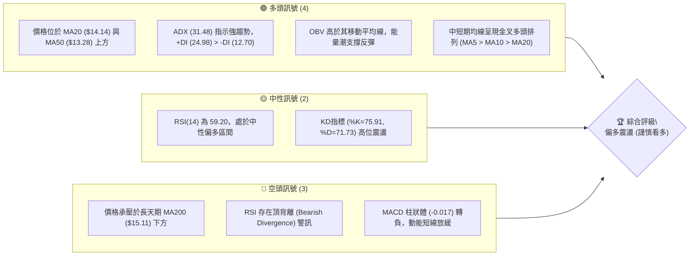
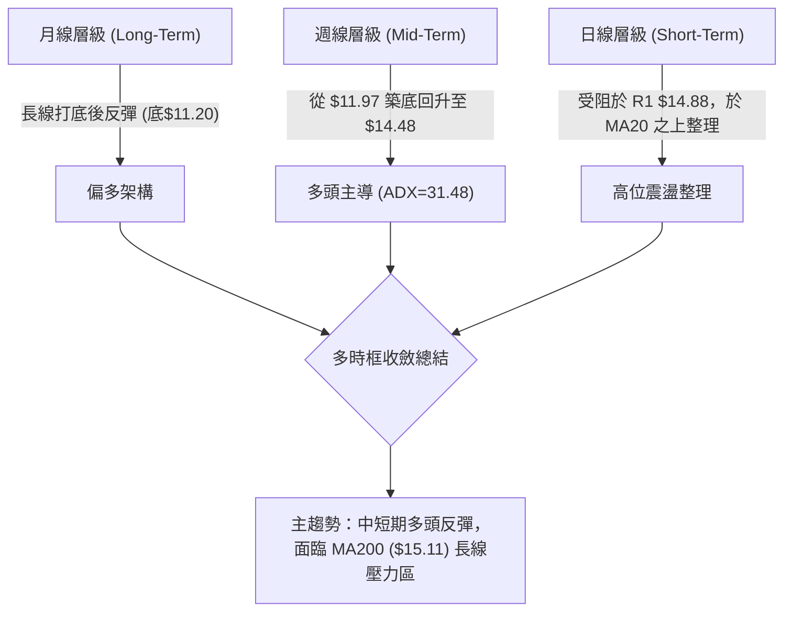
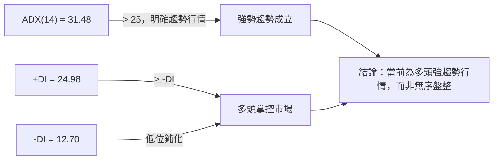
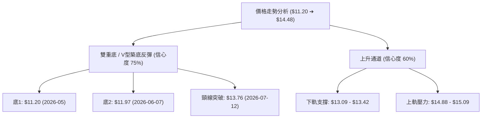
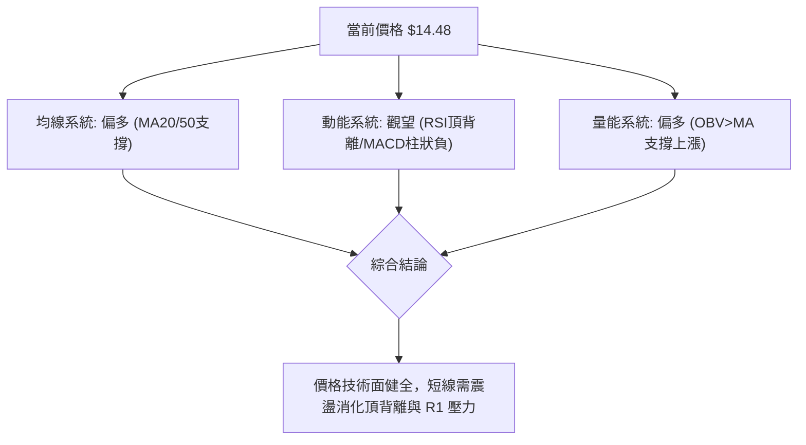
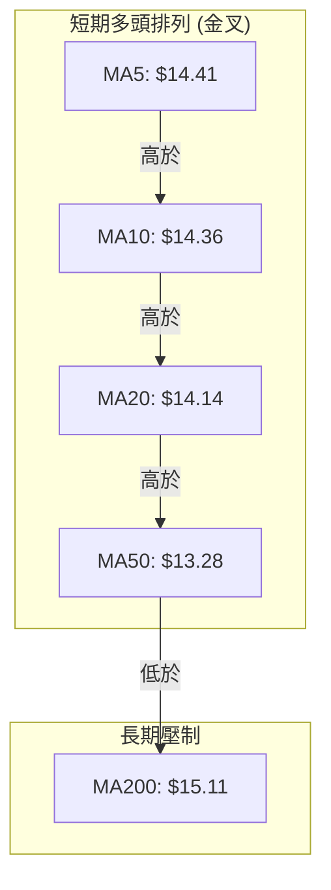
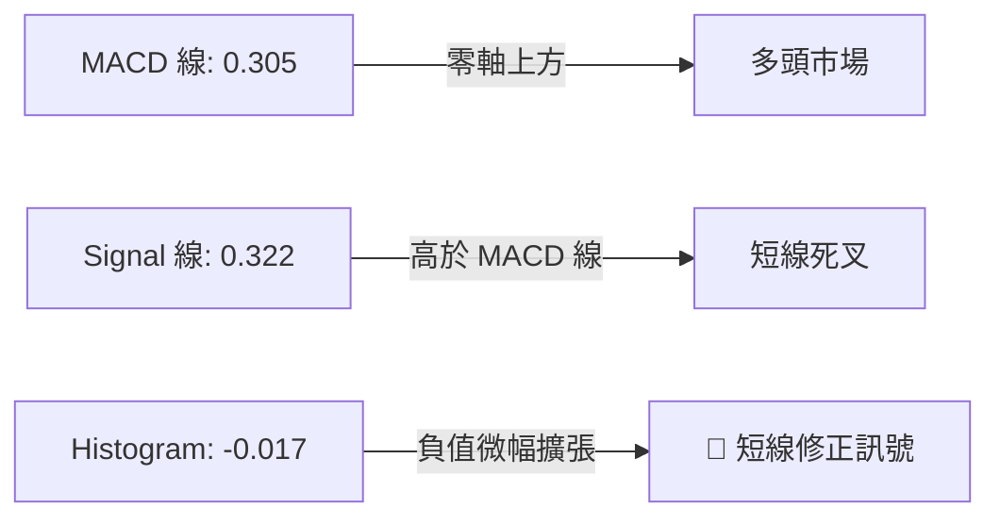
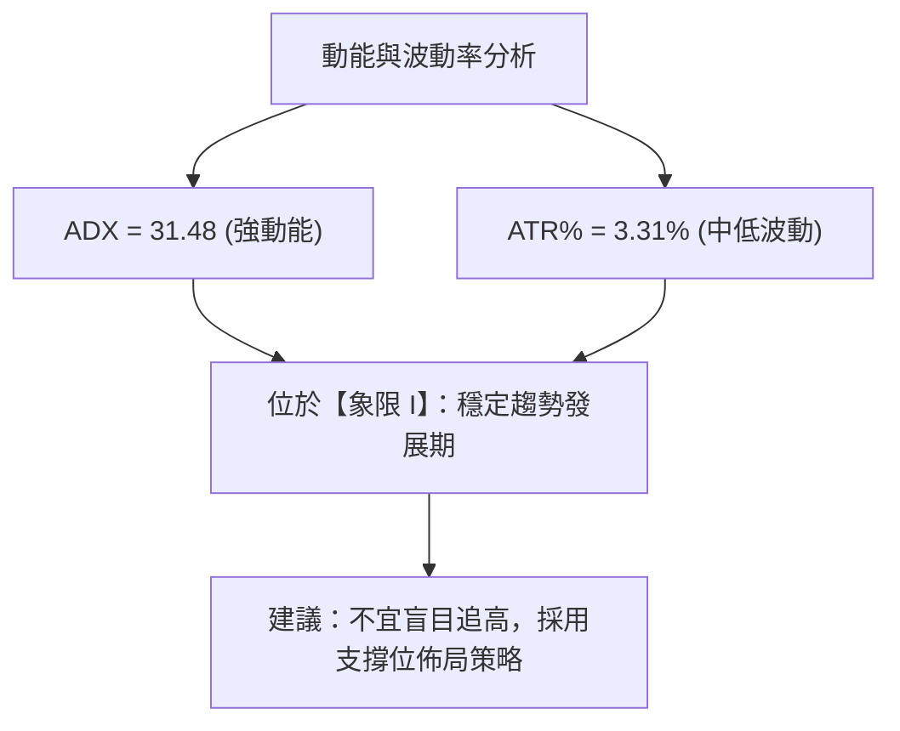
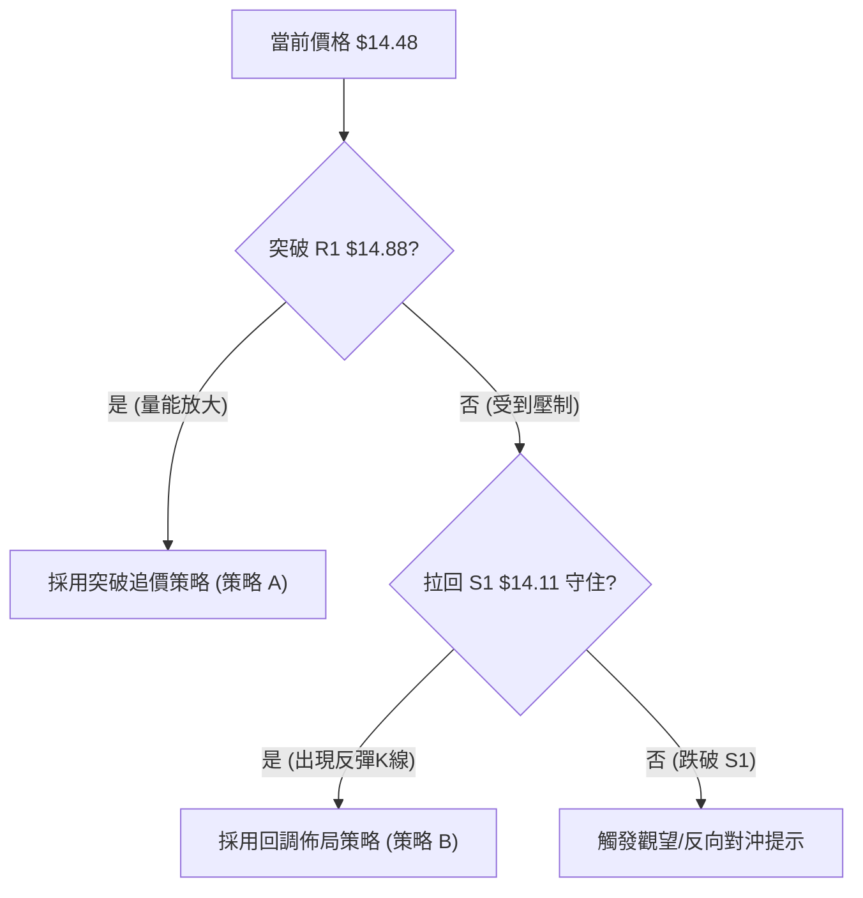
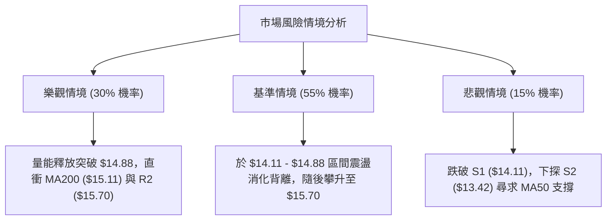

# NU 技術分析報告

> **報告日期**：2026-08-06 ｜ **語言**：繁體中文 ｜ **數據來源**：Yahoo Finance ｜ **當前價格**：$14.48

---

## 目錄

| 章節 | 內容 |
|------|------|
| [1. 技術面概覽](#1-技術面概覽) | 訊號儀表板、核心指標、評分卡 |
| [2. 趨勢分析](#2-趨勢分析) | 多時框趨勢、長中短期走勢 |
| [3. 圖表形態分析](#3-圖表形態分析) | 形態識別、K線組合、目標價 |
| [4. 支撐與阻力](#4-支撐與阻力) | 關鍵價位、斐波那契回調 |
| [5. 技術指標深度解讀](#5-技術指標深度解讀) | MA/RSI/MACD/布林/成交量 |
| [6. 動能與波動率](#6-動能與波動率) | 動能評估、ATR、Beta |
| [7. 多時框架總結](#7-多時框架總結) | 時框架評分矩陣 |
| [8. 交易策略建議](#8-交易策略建議) | 多空策略、風險報酬比 |
| [9. 風險提示與監控](#9-風險提示與監控) | 監控指標、風險場景 |

---

## 1. 技術面概覽

### 🎯 技術訊號儀表板



### 📊 核心指標速覽表

| 指標類別 | 指標名稱 | 當前數值 | 訊號 | 解讀 |
|----------|----------|----------|------|------|
| **價格** | 當前價格 | $14.48 | 🟢 | 位於52週區間 $11.20–$18.98 之 42.2% 位置 |
| **均線** | MA20 | $14.14 | 🟢 | 價格在MA20上方 (+2.39%)，短線支撐強勁 |
| **均線** | MA50 | $13.28 | 🟢 | 價格在MA50上方 (+9.04%)，中期趨勢偏多 |
| **均線** | MA200 | $15.11 | 🔴 | 價格在MA200下方 (-4.17%)，長線反彈面臨壓力 |
| **動能** | RSI(14) | 59.20 | 🟡 | 健康多頭區間，但留意日/週線層級之頂背離 |
| **動能** | MACD | 0.305 | 🔴 | MACD線高於零軸，但柱狀體(-0.017)顯示短線拉回 |
| **波動** | ATR(14) | $0.48 | 🟡 | 日波幅約 3.31%，波動度處於中等合理水平 |

### 🏆 技術評分卡

```
╔══════════════════════════════════════════════════════════════╗
║                技術評分卡 — NU (2026-08-06)                 ║
╠══════════════════════════════════════════════════════════════╣
║ 趨勢強度      ▓▓▓▓▓▓▓▓▓▓▓▓▓▓█░░░░░  72/100  🟢 強勢 (+DI主導)║
║ 動能指標      ▓▓▓▓▓▓▓▓▓▓▓░░░░░░░░░  55/100  🟡 中性 (MACD微轉負)║
║ 支撐穩定度    ▓▓▓▓▓▓▓▓▓▓▓▓▓▓░░░░░░  70/100  🟢 強勁 (S1=$14.11)║
║ 成交量配合    ▓▓▓▓▓▓▓▓▓▓▓░░░░░░░░░  58/100  🟡 中性 (量比 0.63x)║
║ 形態完整度    ▓▓▓▓▓▓▓▓▓▓▓▓░░░░░░░░  60/100  🟡 區間打底完成反彈║
║ 均線排列      ▓▓▓▓▓▓▓▓▓▓▓▓▓░░░░░░░  65/100  🟢 短期多頭/長期空頭║
╠══════════════════════════════════════════════════════════════╣
║ 綜合評分      ▓▓▓▓▓▓▓▓▓▓▓▓▓░░░░░░░  63/100  🟢 偏多震盪      ║
╚══════════════════════════════════════════════════════════════╝
```

---

## 2. 趨勢分析

### 🌐 多時框趨勢分析



### 📈 長期趨勢 — 12個月走勢圖（Unicode）

```
NU 月線走勢圖（2025-08 至 2026-08）
價格軸 ($)
$18.00 ┤                               ● $17.75 (高點)
$17.00 ┤                     ● $17.39
$16.00 ┤             ● $16.01
$15.00 ┤ ● $14.80                           ● $14.98             ● $14.48 (現在)
$14.00 ┤                                             ● $14.37  ● $14.33
$13.00 ┤                                                         ● $13.13
$12.00 ┤                                                                
$11.00 ┤
       └─┬───────┬───────┬───────┬───────┬───────┬───────┬───────┬───────┬
        08/25   10/25   12/25   02/26   04/26   05/26   06/26   07/26   08/26
```

#### 走勢特徵分析表格

| 時間段 | 收盤價範圍 | 漲跌特徵 | 成交量與動能配合度 |
|--------|------------|----------|--------------------|
| **2025-08 ~ 2026-01** | $14.80 ➔ $17.75 | 強勢主升段，創下波段高點 $17.75 | 動能強勁，MACD 與價格同步創高 |
| **2026-02 ~ 2026-05** | $14.98 ➔ $13.13 | 深幅回調，向下尋求 52 週低點區間支撐 | 賣壓釋放，五月最低觸及 $11.20 波段低點 |
| **2026-06 ~ 2026-08** | $13.36 ➔ $14.48 | 築底完成，展開 V 型/雙底回升 | OBV 止跌回升，+DI 向上擴張主導行情 |

### 📊 中期趨勢（週線分析）

```
NU 週線壓力與支撐結構示意圖
────────────────────────────────────────────────────────
$18.98 ┤ ════════════════════════════════════════  52週最高點 (0.0% Fib)
$17.14 ┤ ────────────────────────────────────────  23.6% Fib
$16.49 ┤ ----------------------------------------  強阻力 R3
$15.70 ┤ ----------------------------------------  阻力 R2
$15.11 ┤ ════════════════════════════════════════  MA200 長期反轉關鍵位
$14.88 ┤ ----------------------------------------  關鍵阻力 R1 (布林上軌 $14.82)
$14.48 ┤ ◄───【當前價格 $14.48】
$14.11 ┤ ----------------------------------------  近階段支撐 S1 (MA20 $14.14 / 61.8% Fib $14.17)
$13.42 ┤ ----------------------------------------  強支撐 S2 (MA50 $13.28 / 布林下軌 $13.46)
$13.09 ┤ ----------------------------------------  次級支撐 S3
$11.20 ┤ ════════════════════════════════════════  52週最低點 (100.0% Fib)
────────────────────────────────────────────────────────
```

### ⚡ 趨勢強度評估（ADX 解讀）



| 指標參數 | 當前數值 | 臨界值比較 | 市場狀態解讀 |
|----------|----------|------------|--------------|
| **ADX (14)** | 31.48 | > 25.0 (強趨勢) | 市場具備明確單邊動能，趨勢策略勝率高 |
| **+DI** | 24.98 | > -DI (12.70) | 買盤力量顯著佔優，買方控制盤勢 |
| **-DI** | 12.70 | 低位滑落 | 賣方拋壓已被吸收，空頭無抵抗力 |

---

## 3. 圖表形態分析

### 🔍 形態識別系統



#### 形態信心度評估表

| 形態名稱 | 信心度 | 判斷依據（引用數據） | 完成度 | 目標價（附計算式） |
|----------|--------|----------------------|--------|--------------------|
| **雙重底 (W-Bottom)** | **75%** | 兩次低點 $11.20 與 $11.97 形成明確支撐，並於 7 月突破頸線 $13.76 | 90% | **第一目標價 $16.32**<br>*(計算：頸線 $13.76 + (頸線 $13.76 - 底1 $11.20) = $16.32，對應 R3 $16.49 區間)* |
| **上升通道 (Ascending Channel)** | **60%** | 低點持續墊高（$11.97 ➔ $12.19 ➔ $13.59），價格沿著 MA20 軌道推進 | 70% | **通道上軌目標 $15.09**<br>*(對應 50% 斐波那契回調位 $15.09 與 MA200 $15.11)* |

### 🕯️ 重要K線形態分析

| 日期 / 週別 | 收盤價 | K線形態 | 解讀 | 訊號 |
|-------------|--------|---------|------|------|
| **2026-06-07** | $11.97 | 長下影錘子線 | 低檔強烈抵抗，止跌回升關鍵K線 | 🟢 強烈買進 |
| **2026-07-19** | $13.59 | 爆量長十字星 | 7.62億股高量拉回換手，清洗浮碼 | 🟡 中性換手 |
| **2026-08-02** | $14.33 | 實體陽線 | 站穩 $14.00 關卡，多頭重掌發球權 | 🟢 看多 |
| **2026-08-09** | $14.48 | 小陽線高位整理 | 逼近 R1 $14.88 壓力區，多頭步步為營 | 🟢 小幅看多 |

### 📉 ASCII 走勢形態示意圖

```
NU 雙重底形態與反彈軌跡
===================================================================
$16.32 ┤                                           [形態測幅目標 $16.32]
$15.11 ┤                                    ...... MA200 壓力
$14.88 ┤                              ┌───┐  [阻力位 R1]
$14.48 ┤                             ─┘   └─◄ 現價 $14.48
$13.76 ┤                 ┌───┐      /        [雙底頸線 $13.76 - 已突破]
$12.50 ┤        ┌──┐    /     \    /
$11.97 ┤       /    └───┘      └───┘         [右腳 $11.97]
$11.20 ┤ ─────┴───────────────────────────── [左腳 $11.20 (52W Low)]
===================================================================
```

---

## 4. 支撐與阻力

### 🗺️ 關鍵價位分布圖（Unicode）

```
NU 價位結構分布圖
═══════════════════════════════════════════════════
$18.98 ║████████████████████████║ 52週最高點 (0.0% Fib)
$17.14 ║████████████████        ║ 23.6% Fib 回調位
$16.49 ║████████████████████████║ 強阻力 R3
$15.70 ║████████████            ║ 阻力 R2
$15.11 ║████████████████████████║ MA200 均線 / 50% Fib ($15.09)
$14.88 ║████████████████████    ║ 關鍵阻力 R1 / 布林上軌 ($14.82)
$14.48 ╠════════════════════════╣ ◄ 現價 $14.48
$14.11 ║▓▓▓▓▓▓▓▓▓▓▓▓▓▓▓▓▓▓▓▓▓▓▓▓║ 近期支撐 S1 / MA20 ($14.14) / 61.8% Fib ($14.17)
$13.42 ║████████████████████    ║ 強支撐 S2 / MA50 ($13.28) / 布林下軌 ($13.46)
$13.09 ║████████████████████████║ 次級支撐 S3
$11.20 ║████████████████████████║ 52週最低點 (100.0% Fib)
═══════════════════════════════════════════════════
```

### 🚧 阻力位分析表

| 阻力級別 | 價位 | 形成原因 | 突破難度 | 重要性 |
|----------|------|----------|----------|--------|
| **阻力 R1** | **$14.88** | 近一年波段高點聚類、布林通道上軌 ($14.82) | 🟡 中等 | 短線多空分水嶺，突破將挑戰 $15.00 大關 |
| **阻力 R2** | **$15.70** | 波段高點聚類、接近 MA200 ($15.11) 後的延伸賣壓區 | 🔴 較高 | 中期轉強之核心解套壓力區 |
| **阻力 R3** | **$16.49** | 近一年重要高點聚類、38.2% Fib ($16.01) 上方 | 🔴 極高 | 多頭波段攻勢終極目標區 |

### 🛡️ 支撐位分析表

| 支撐級別 | 價位 | 形成原因 | 守住機率 | 重要性 |
|----------|------|----------|----------|--------|
| **支撐 S1** | **$14.11** | 波段低點聚類、MA20 ($14.14)、61.8% Fib ($14.17) | 🟢 80% | 短線極重要防線，失守將轉為震盪 |
| **支撐 S2** | **$13.42** | 波段低點聚類、MA50 ($13.28)、布林下軌 ($13.46) | 🟢 85% | 中期趨勢防線，跌破則回升結構破壞 |
| **支撐 S3** | **$13.09** | 近一年強低點聚類、78.6% Fib ($12.86) 上方 | 🟢 90% | 長線空頭防守防線 |

### 📐 斐波那契回調位分析

依據 52 週高低點區間（$11.20 ➔ $18.98，全幅 $7.78）進行回調位定位：

```
斐波那契分佈與現價相對位置：
  0.0%  (52W High)   $18.98  ─── 長線終極壓力
 23.6%              $17.14  ─── 波段強勢區
 38.2%              $16.01  ─── 中期多頭目標
 50.0%              $15.09  ─── 多空多時框收斂交會點 (與 MA200 $15.11 重疊)
-------------------------------------------------------------------------
 61.8%              $14.17  ───【當前價格 $14.48 位於 50% 與 61.8% 之間】
-------------------------------------------------------------------------
 78.6%              $12.86  ─── 底層強支撐區
100.0%  (52W Low)    $11.20  ─── 長線築底鐵板
```

**解讀**：現價 $14.48 已成功站上黃金分割 61.8% 回調位（$14.17），代表波段回升動能獲得實質確認。上方首要挑戰為 50% 關鍵反轉點（$15.09），該位置亦為 MA200 ($15.11) 沉積區，屬於多空殊死戰的核心戰場。

---

## 5. 技術指標深度解讀

### 🎛️ 指標訊號總覽



### 📈 移動平均線排列分析



*   **均線狀態**：混合排列。短中天期（MA5/10/20/50/60/120）全數呈現多頭多點金叉上揚，MA60 達到 +9.73% 的乖離率；惟長天期 MA200 ($15.11) 與 MA240 ($15.14) 仍對價格形成上方蓋頂壓力。

### 📉 RSI(14) 分析

*   **當前數值**：**59.20**
    ```
    RSI(14) 強勢度進度條：
    [0] ─────────── [30] ══════════ [59.20] ═══════ [70] ─────────── [100]
                         超賣區         當前(強勢區)     超買區
    ```
*   **背離分析**：**⚠️ 頂背離 (Bearish Divergence)**。
    週線數據顯示，2026-07-05 價格為 $13.61 時 RSI 高達 79.0，而當價格推升至 $14.48 時，RSI 回落至 59.20。這表明價格雖創高，但推升動能正在減弱，短線需防範拉回測試 S1 ($14.11) 的風險。

### 📊 MACD(12/26/9) 訊號解讀



*   **解讀**：MACD雙線保持在零軸上方運行，確認中期多頭趨勢未變。惟柱狀體轉負 (-0.017) 顯示短期向上衝刺動能不足，價格呈現高位狹幅整理或斜率趨緩。

### 📦 布林通道分析

```
NU 布林通道型態示意圖
═══════════════════════════════════════════════════
$14.82 ┤ ───────────────────────────────────────── BB 上軌 (壓力區)
$14.48 ┤ ───────────────●───────────────────────── 現價 (%B = 0.75)
$14.14 ┤ ───────────────────────────────────────── BB 中軌 (MA20 支撐)
$13.46 ┤ ───────────────────────────────────────── BB 下軌 (強支撐)
═══════════════════════════════════════════════════
```

*   **通道狀態**：當前 %B 為 **0.75**，價格位於中軌與上軌之間的強勢區間。通道寬度保持穩定，未見擠壓突破，預示價格將沿著中軌 ($14.14) 向上軌 ($14.82) 進行震盪推升。

### 💹 成交量分析（量價配合度）

*   **最新成交量**：65,766,152 股
*   **20日均量**：103,950,498 股（**量比：0.63x**）
*   **OBV 趨勢**：`OBV > MA`
*   **解讀**：短線成交量萎縮至均量 63%，顯示市場進入觀望狀態，買盤追高意願降低，但亦無強烈拋盤。OBV 仍維持在均線之上，說明波段主力資金並未撤出，量能對中期上漲趨勢仍具支撐作用。

---

## 6. 動能與波動率

### ⚡ 動能評估四象限

| 象限區分 | 動能強度 (ADX) | 波動率 (ATR%) | NU 當前狀態 | 交易戰術評估 |
|----------|----------------|---------------|-------------|--------------|
| **象限 I** | 強 (>25) | 低 (<4%) | **✓ 當前象限** | **高勝率趨勢續航**：適合順勢做多，拉回支撐點進場 |
| **象限 II** | 弱 (<25) | 低 (<4%) | — | 區間高拋低吸 |
| **象限 III**| 強 (>25) | 高 (>4%) | — | 高風險突破追價 |
| **象限 IV** | 弱 (<25) | 高 (>4%) | — | 避免交易/觀望 |



### 📊 ATR 波動率分析

*   **ATR(14)**：**$0.48**（佔當前股價 3.31%）
*   **止損距離建議**：
    *   **緊密止損 (1.0x ATR)**：$0.48 ➔ 距進場點預留 $0.48 空間
    *   **標準止損 (1.5x ATR)**：$0.72 ➔ 距進場點預留 $0.72 空間（推薦）
    *   **寬鬆止損 (2.0x ATR)**：$0.96 ➔ 防範大盤異常波動

### 📐 Beta 與市場相關性

*   **Beta 係數**：**0.942**
*   **解讀**：NU 的波動度與美股大盤（S&P 500）幾乎保持同步（極接近 1.0）。在沒有個股特大利多/利空驅動下，其價格將高度受整體大盤風險偏好影響。

---

## 7. 多時框架總結

### 📋 時框架評分表

| 時框架 | 趨勢方向 | 動能 | 均線排列 | 形態 | 綜合評分 | 建議 |
|--------|----------|------|----------|------|----------|------|
| **月線 (Long-Term)** | 🟡 中性打底 | 🟡 中性 | 🔴 空頭排列 | 雙底打底中 | **55/100** | 長線築底完成，等待突破 MA200 |
| **週線 (Mid-Term)** | 🟢 多頭趨勢 | 🟢 偏多 | 🟢 多頭初成 | 突破頸線回測 | **70/100** | 逢拉回支撐做多 |
| **日線 (Short-Term)** | 🟢 高位整理 | 🔴 短線修正 | 🟢 多頭排列 | 承壓於 R1 | **62/100** | 守住 S1 保持看多 |

### 🔲 綜合訊號矩陣

```
                     日線 (Short)     週線 (Mid)      月線 (Long)
均線結構              🟢 多頭         🟢 多頭         🔴 空頭
RSI 狀態              🟡 頂背離       🟢 強勢區       🟡 中性區
MACD 狀態             🔴 柱狀轉負     🟢 金叉向上     🟡 零軸附近
ADX 趨勢強度          🟢 強趨勢       🟢 強趨勢       🟡 無明確趨勢
方向收斂結論           🟢 偏多         🟢 偏多         🟡 震盪底
```

### ⚖️ 多時框收斂結論

依據多時框收斂規則，當前 ADX(14) 為 31.48 (>25)，市場由**強趨勢行情**主導。因此，交易決策應以中短期（週線/MA20/MA50）的多頭方向為主，日線出現的 MACD 柱狀體微負與 RSI 頂背離僅視為短線創高後的過熱修正，不改變整體多頭趨勢。

**最終方向性結論：偏多震盪（主推逢低做多）**

---

## 8. 交易策略建議

### 🗺️ 策略決策流程圖



### 🧭 策略路由

> **當前主策略方向 = 🟢 多頭策略 (綜合評分 63/100，具備多頭趨勢條件)**

### 🎯 價格情境階梯 (Price Scenarios)

| 觸發條件 | 下一目標 | 後續延伸 | 情境含義 |
|----------|----------|----------|----------|
| **突破 R1 $14.88** | R2 $15.70 | R3 $16.49 | 多頭強勢發動，向上挑戰 MA200 $15.11 |
| **站穩現價區間 ($14.11–$14.88)** | — | — | 消化高位賣壓，進行蓄勢整理 |
| **跌破 S1 $14.11** | S2 $13.42 | S3 $13.09 | 短線轉弱，回測 MA50 支撐區 |

### 📊 情境機率分佈

| 情境 | 機率 | 主要依據 |
|------|------|----------|
| **繼續上行 / 突破反彈** | **55%** | ADX=31.48 展現強趨勢、+DI 主導、OBV 支撐 |
| **區間震盪整理** | **30%** | RSI 頂背離待消化、成交量放緩 (量比 0.63x) |
| **深幅回調再探底** | **15%** | 受到 MA200 ($15.11) 強大心理壓制 |

### 🟢 主策略詳情

#### 策略 A：突破順勢追多 (Breakout Long)
*   **適用情境**：日線收盤價強勢突破阻力 R1 ($14.88) 且成交量放大。

#### 策略 B：逢低回調做多 (Pullback Long) — ⭐️ 主推策略
*   **適用情境**：股價回調至 S1 ($14.11) 附近獲得支撐時買進。

| 策略要素 | 策略 A (突破追多) | 策略 B (回調做多) |
|----------|-------------------|-------------------|
| **進場條件** | 日線突破並站穩 $14.88 | 回落至 $14.11–$14.17 區間出現止跌訊號 |
| **進場價格** | **$14.90** | **$14.15** |
| **目標價 T1** | **$15.70** (+5.37%) | **$14.88** (+5.16%) |
| **目標價 T2** | **$16.49** (+10.67%) | **$15.70** (+10.95%) |
| **止損價格** | **$14.11** (-5.30%) | **$13.42** (-5.16%) |
| **風險報酬比** | **2.01 : 1** | **2.12 : 1** |
| **成功機率** | 55% | 65% |
| **建議倉位** | 15% | **25%** |

### 🔴 反向風險觸發點（對沖提示）

若股價放量跌破強支撐 **S2 ($13.42)**，則宣告雙底反彈結構失效，多頭策略應立即止損出場；若持有多頭現貨者，可考慮開立等量空單進行對沖，下一下行目標看至 **S3 ($13.09)** 及 52 週低點 **$11.20**。

### ⭐ 整體訊號強度評星

```
做多訊號強度：★★★☆☆  (3.5/5星)
做空訊號強度：★★☆☆☆  (2.0/5星)
整體可信度：  ★★★☆☆  (3.5/5星)
```

---

## 9. 風險提示與監控

### ✅ 關鍵監控指標 Checklist

```
╔══════════════════════════════════════════════════════════════╗
║                   每日交易監控清單 Checklist                 ║
╠══════════════════════════════════════════════════════════════╣
║ [ ] 價格是否維持在 MA20 ($14.14) 之上                        ║
║ [ ] RSI(14) 能否突破 60 並解除頂背離警訊                    ║
║ [ ] MACD 柱狀體 (當前 -0.017) 是否重新翻紅                   ║
║ [ ] 突破 R1 ($14.88) 時，日成交量是否超過 1.03 億股 (20日均量)║
║ [ ] 大盤 Beta (0.942) 是否引發整體金融板塊回檔               ║
╚══════════════════════════════════════════════════════════════╝
```

### ⚠️ 風險場景分析



### 🛡️ 風險管理重要提醒

1.  **嚴格執行止損**：當前股價接近 R1 ($14.88) 壓力區，多頭進場必須以 **S1 ($14.11)** 或 **S2 ($13.42)** 為嚴格止損點，單筆交易虧損不得超過總資產的 2%。
2.  **防止追高風險**：因 RSI 存在頂背離現象，切忌在 $14.88 壓力位下方盲目追高，建議採用策略 B 之回調分批佈局模式。
3.  **注意 MA200 壓制**：$15.09–$15.11 區間匯集了 50% 斐波那契回調位與 MA200 均線，歷史上屬於強解套賣壓區，價格首次觸及該區間時宜適度減碼獲利了結。

---

## 📋 報告總結

```
╔══════════════════════════════════════════════════════════════╗
║                   NU 技術分析報告總結                        ║
╠══════════════════════════════════════════════════════════════╣
║ 報告日期：2026-08-06                                         ║
║ 當前價格：$14.48                                             ║
║ 分析評級：🟢 偏多震盪 (買入/逢低佈局)                        ║
║                                                              ║
║ 關鍵結論：                                                   ║
║ ├─ 長期趨勢：🟡 打底回升 (底點 $11.20 已現，面臨 MA200 壓力) ║
║ ├─ 中期趨勢：🟢 多頭主導 (ADX=31.48，+DI 主導強趨勢)         ║
║ ├─ 短期趨勢：🟡 高位整理 (承壓於 R1 $14.88，RSI 頂背離消化中) ║
║ ├─ 關鍵支撐：S1 $14.11 / S2 $13.42                           ║
║ ├─ 關鍵阻力：R1 $14.88 / R2 $15.70                           ║
║ └─ 分析師共識目標：$17.98 (買入評級)                        ║
║                                                              ║
║ 最優策略組合：                                               ║
║ 1. 🥇 最佳機會：策略 B (回調至 $14.15 佈局做多，目標 $15.70)║
║ 2. 🥈 次選機會：策略 A (強勢突破 $14.88 後追多，目標 $16.49)║
║ 3. 🥉 保守選擇：等待股價突破並站穩 MA200 ($15.11) 後順勢加碼 ║
╚══════════════════════════════════════════════════════════════╝
```

---

> ⚠️ **免責聲明**：本報告為 AI 自動生成之技術分析，所有數據及估算均基於提供的歷史價格資訊。本報告**僅供研究與學術參考**，**不構成任何投資建議**。投資有風險，入市需謹慎。

---

*報告生成時間：2026-08-06 ｜ 數據來源：Yahoo Finance ｜ 分析框架：多時框技術分析*