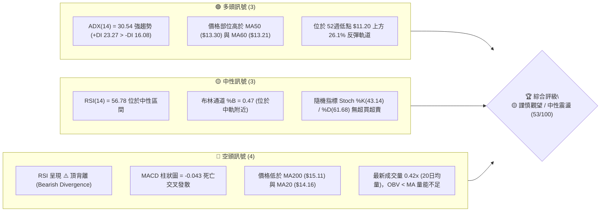
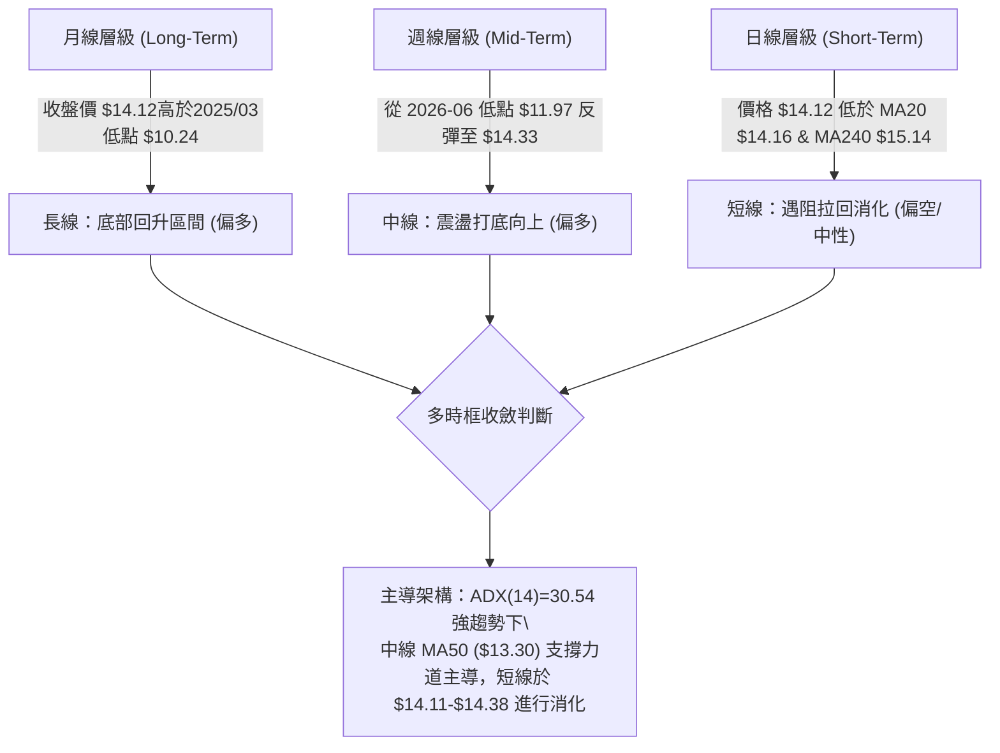
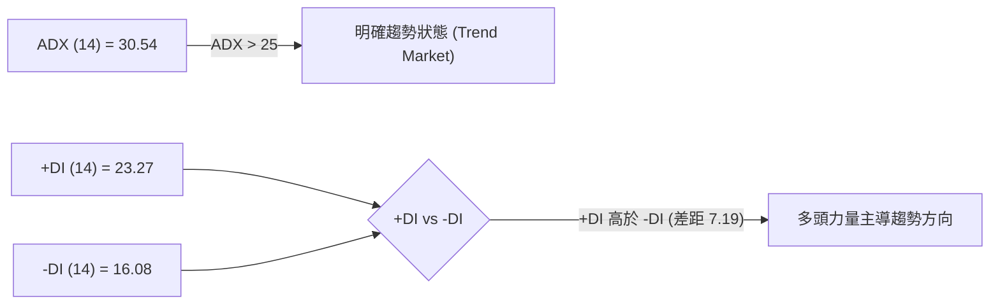
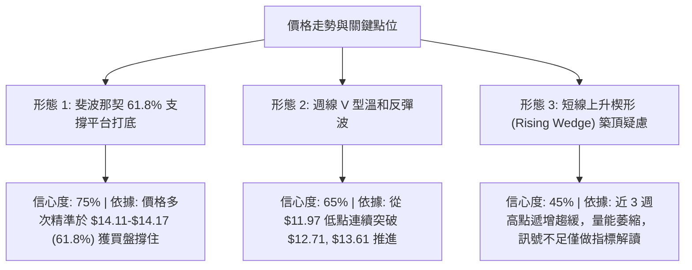
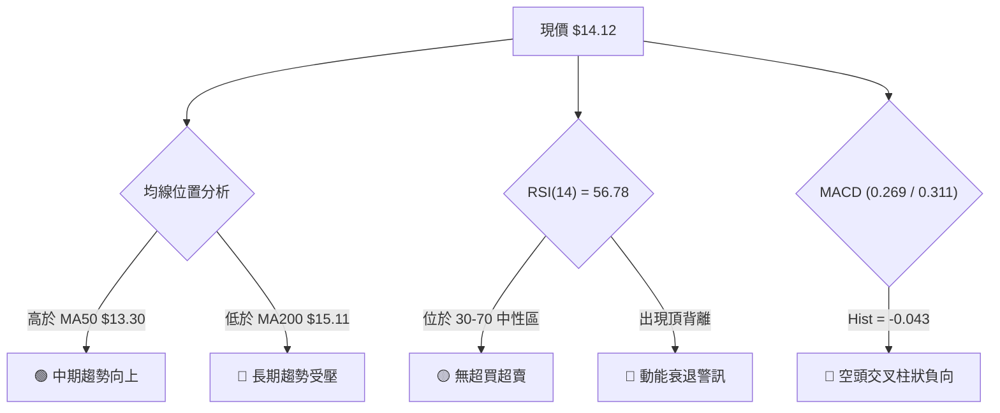
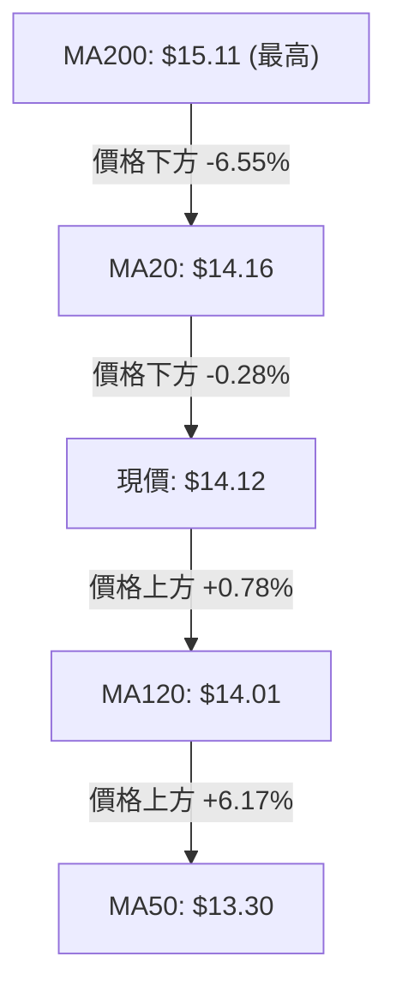
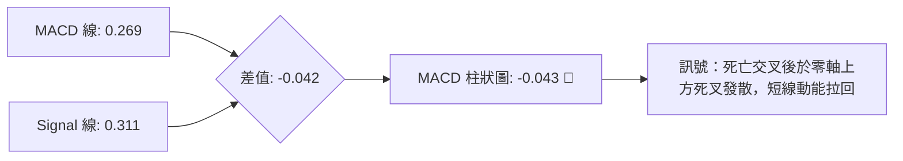
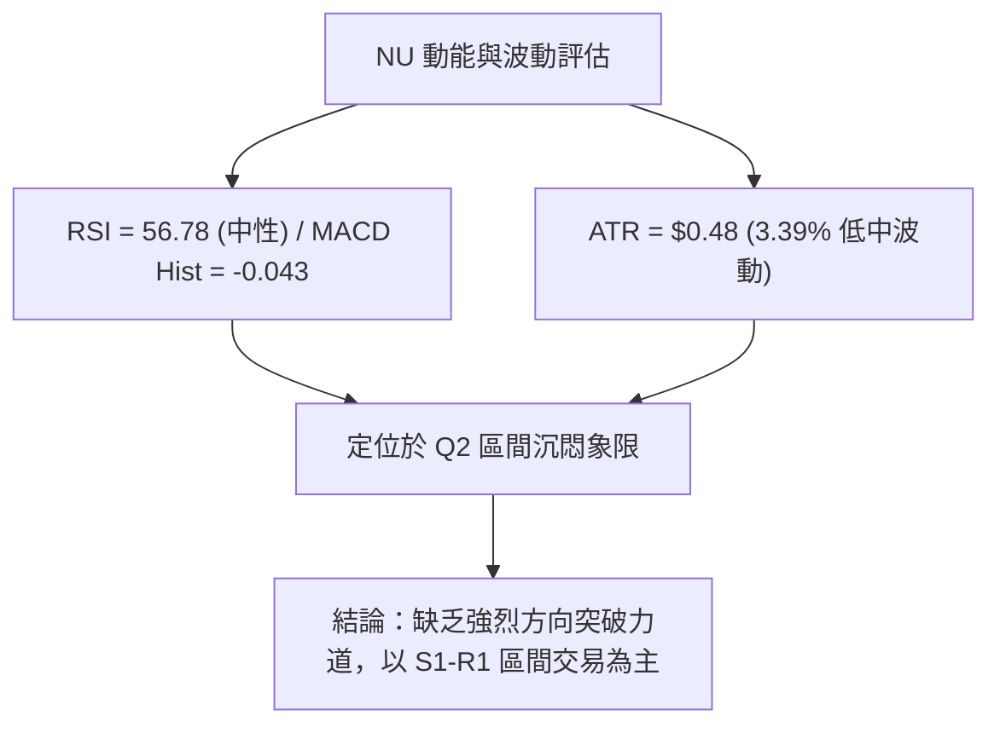
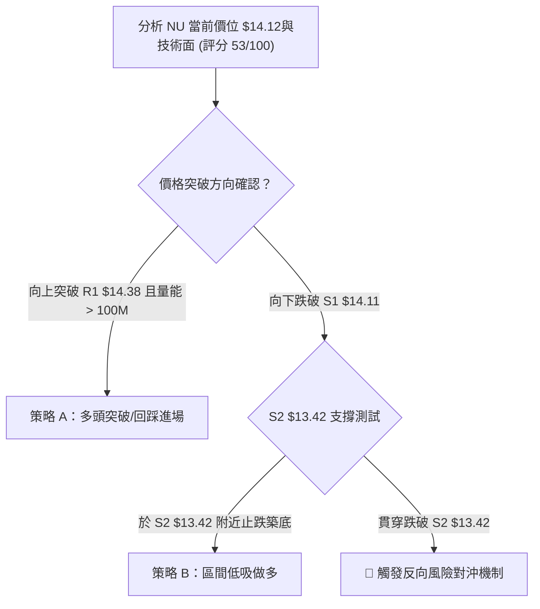
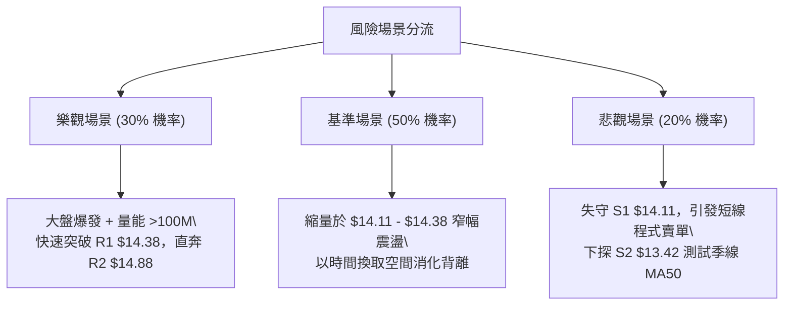

# NU 技術分析報告

> **報告日期**：2026-08-07 ｜ **語言**：繁體中文 ｜ **數據來源**：Yahoo Finance ｜ **當前價格**：$14.12

---

## 目錄

| 章節 | 內容 |
|------|------|
| [1. 技術面概覽](#1-技術面概覽) | 訊號儀表板、核心指標、評分卡 |
| [2. 趨勢分析](#2-趨勢分析) | 多時框趨勢、長中短期走勢 |
| [3. 圖表形態分析](#3-圖表形態分析) | 形態識別、K線組合、目標價 |
| [4. 支撐與阻力](#4-支撐與阻力) | 關鍵價位、斐波那契回調 |
| [5. 技術指標深度解讀](#5-技術指標深度解讀) | MA/RSI/MACD/布林/成交量 |
| [6. 動能與波動率](#6-動能與波動率) | 動能評估、ATR、Beta |
| [7. 多時框架總結](#7-多時框架總結) | 時框架評分矩陣 |
| [8. 交易策略建議](#8-交易策略建議) | 多空策略、風險報酬比 |
| [9. 風險提示與監控](#9-風險提示與監控) | 監控指標、風險場景 |

---

## 1. 技術面概覽

### 🎯 技術訊號儀表板



### 📊 核心指標速覽表

| 指標類別 | 指標名稱 | 當前數值 | 訊號 | 解讀 |
|----------|----------|----------|------|------|
| **價格** | 當前價格 | $14.12 | 🟡 中性 | 處於 52 週區間 ($11.20–$18.98) 的 37.5% 分位 |
| **均線** | MA20 | $14.16 | 🔴 短期偏空 | 現價略低於 MA20 (-0.28%)，短線承壓 |
| **均線** | MA50 | $13.30 | 🟢 中期偏多 | 現價高於 MA50 (+6.17%)，中期下檔具支撐 |
| **均線** | MA200 | $15.11 | 🔴 長期偏空 | 現價低於 MA200 (-6.55%)，長線牛熊分界尚未收復 |
| **動能** | RSI(14) | 56.78 | 🔴 背離警訊 | 數值雖溫和，但高檔呈現頂背離結構 |
| **動能** | MACD | -0.043 (Hist) | 🔴 空頭發散 | MACD 線 (0.269) 跌破 Signal (0.311) |
| **動能** | ADX(14) | 30.54 | 🟢 趨勢明確 | ADX > 25 具趨勢強度，+DI (23.27) > -DI (16.08) |
| **波動** | ATR(14) | $0.48 | 🟡 中等波動 | 佔股價 3.39%，每日平均波幅具適度交易空間 |
| **量能** | 20日量比 | 0.42x | 🔴 量能匱乏 | 日成交 42.66M 遠低於 20日均量 101.19M |

### 🏆 技術評分卡

```
╔══════════════════════════════════════════════════════════════╗
║                技術評分卡 — NU (2026-08-07)                 ║
╠══════════════════════════════════════════════════════════════╣
║ 趨勢強度      ▓▓▓▓▓▓▓▓▓▓▓▓▓▓░░░░░░  70/100  🟢 強趨勢 (ADX>25)║
║ 動能指標      ▓▓▓▓▓▓▓▓▓░░░░░░░░░░░  45/100  🔴 MACD柱狀負向  ║
║ 支撐穩定度    ▓▓▓▓▓▓▓▓▓▓▓▓▓░░░░░░░  65/100  🟢 緊貼 S1 $14.11║
║ 成交量配合    ▓▓▓▓▓▓▓▓░░░░░░░░░░░░  40/100  🔴 量比僅 0.42x  ║
║ 形態完整度    ▓▓▓▓▓▓▓▓▓▓▓░░░░░░░░░  55/100  🟡 斐波 61.8% 震盪 ║
║ 均線排列      ▓▓▓▓▓▓▓▓▓░░░░░░░░░░░  45/100  🔴 價格位於MA200下║
╠══════════════════════════════════════════════════════════════╣
║ 綜合評分      ▓▓▓▓▓▓▓▓▓▓▓░░░░░░░░░  53/100  🟡 中性觀望/區間 ║
╚══════════════════════════════════════════════════════════════╝
```

---

## 2. 趨勢分析

### 🌐 多時框趨勢分析



### 📈 長期趨勢 — 12個月走勢圖（Unicode）

```
NU 月線走勢圖（過去 12 個月：2025-09 至 2026-08）
價格軸 ($)
$18.00 ┤                               ● $17.75 (2026-01 頂部)
$17.00 ┤                  ● $17.39    │
$16.00 ┤     ● $16.01 ● $16.11  ● $16.74│
$15.00 ┤● $14.80                       ● $14.98
$14.00 ┤                                    ● $14.37 ● $14.48       ● $14.33 ● $14.12 (現價)
$13.00 ┤                                                       ● $13.13 ● $13.36
$12.00 ┤
       └───────────────────────────────────────────────────────────────────────────►
         09/25  10/25  11/25  12/25  01/26  02/26  03/26  04/26  05/26  06/26  07/26  08/26
```

#### 走勢特徵分析表

| 階段 | 時間區間 | 收盤價變動 | 階段漲跌幅 | 走勢特徵與量能結構 |
|------|----------|------------|------------|--------------------|
| 1. 多頭衝刺 | 2025-08 ~ 2026-01 | $14.80 → $17.75 | +19.93% | 月線連續陽線推進，攻至波段高點 $17.75，多頭強勢 |
| 2. 高檔修正 | 2026-01 ~ 2026-03 | $17.75 → $14.37 | -19.04% | 遭遇獲利了結賣壓，連續兩月大陰線下挫，跌破 MA200 |
| 3. 探底築底 | 2026-04 ~ 2026-05 | $14.48 → $13.13 | -9.32% | 跌勢擴大，於 2026-06 初下探 $11.97 週線極限低點 |
| 4. 底部反彈 | 2026-06 ~ 2026-08 | $13.36 → $14.12 | +5.69% | 週線連續溫和反彈，攻至 $14.33 後遭遇 R1 ($14.38) 阻力 |

### 📊 中期趨勢（週線分析）

從近 20 週數據觀察，NU 在 2026-06-07 觸及週收盤低點 $11.97（週成交量放大至 473.47M 形成恐慌拋售底），隨後展開 8 週的震盪反彈，最高於 2026-08-02 觸及 $14.33 週收盤高點。

```
週線震盪反彈通道示意圖：
$15.00 ┤                                  [R1 阻力位 $14.38]
$14.50 ┤                             ● $14.33
$14.00 ┤                        ● $13.76    ● $14.12 (現價)
$13.50 ┤                   ● $13.61
$13.00 ┤              ● $13.17
$12.50 ┤         ● $12.71
$12.00 ┤    ● $11.97 [S3 支撐區 $13.09 / 52W低點 $11.20]
       └──────────────────────────────────────────────►
         06/07  06/21  07/05  07/19  08/02  現價
```

### ⚡ 趨勢強度評估（ADX 解讀）



| 指標名稱 | 當前數值 | 臨界值 | 狀態評估 | 交易意涵 |
|----------|----------|--------|----------|----------|
| **ADX(14)** | 30.54 | 25.00 | 🟢 強趨勢 | 排除低波動無方向盤整，市場具備明確方向動能 |
| **+DI(14)** | 23.27 | - | 🟢 多頭買盤 | 多頭買盤力量優於空頭 |
| **-DI(14)** | 16.08 | - | 🟢 空頭回撤 | 空頭賣壓相對受控 |
| **DI 差值** | +7.19 | 0.00 | 🟢 多頭勝出 | 趨勢方向仍由多頭控盤，但需注意短線動能消耗 |

---

## 3. 圖表形態分析

### 🔍 形態識別系統



#### 形態信心度與目標價計算表

| 形態名稱 | 信心度 | 判斷依據（引用數據） | 完成度 | 目標價計算式 | 目標價 |
|----------|--------|----------------------|--------|--------------|--------|
| **斐波那契 61.8% 築底** | **75%** | 價格回測 52 週區間之 61.8% 回調位 $14.17，且在 S1 $14.11 取得撐壓 | 85% | 支撐點 $14.11 + (52W高點 $18.98 - 61.8% $14.17) | **$18.92** |
| **週線 V 型溫和反彈** | **65%** | 底部 $11.97 確立後，一路攻克 MA50 ($13.30) | 70% | 底部 $11.97 + (突破點 $13.42 - $11.97) = $14.87 | **$14.88** (即 R2) |
| **短線上升楔形** | **45%** | 訊號不足，僅做指標型解讀 (量能不足 0.42x) | 30% | 不適用（信心度 < 50% 不強行預測） | **N/A** |

### 🕯️ 重要 K 線形態分析

| 日期/週期 | 收盤價 | K 線形態 | 技術特徵與解讀 | 多空訊號 |
|-----------|--------|----------|----------------|----------|
| **2026-06-07 (週)** | $11.97 | 帶長下影大陰線 | 爆出 473.47M 巨量，形成長下影線，確立 52 週低點附近之恐慌拋售底 | 🟢 極強利空出盡 |
| **2026-07-05 (週)** | $13.61 | 長陽突破線 | 突破 MA50 ($13.30) 限制，RSI 升至 79.0 短線超買，動能強勁 | 🟢 多頭進攻 |
| **2026-07-19 (週)** | $13.59 | 爆量十字星 (Doji) | 成交量衝高至 762.06M 歷史天量，收盤微幅拉回，高檔多空激烈交戰 | 🟡 多空分歧 |
| **2026-08-09 (週)** | $14.12 | 縮量小陰線 | 當前週成交量縮至 190.46M，價格回測 MA20 ($14.16) 附近，動能停滯 | 🔴 短線動能衰退 |

### 📉 ASCII 走勢形態示意圖

```
NU 近期斐波那契 61.8% 平台打底與 R1 阻力形態示意圖
═══════════════════════════════════════════════════════════════════════
$14.88 ┤                                                     [R2 阻力]
$14.38 ┤                                       ▲ 頂部受阻 (08/02 $14.33)
$14.17 ┤--------------------------------------● 現價 $14.12 (Fib 61.8%)
$14.11 ┤======================================■ S1 支撐位
$13.42 ┤                       ▲ (07/05 $13.61)
$13.09 ┤                  ▲ (06/28 $13.17)
$11.97 ┤   ● 恐慌底 (06/07)
═══════════════════════════════════════════════════════════════════════
```

### 🎯 形態目標價計算

以已確認的 **週線 V 型溫和反彈形態**（信心度 65%）進行目標價推估：
1. **形態基底（波段低點）**：$11.97
2. **頸線/關鍵突破位**：S2 波段支撐翻轉位 $13.42
3. **形態高度**：$13.42 - $11.97 = $1.45
4. **第一目標價 (T1)**：突破點 $13.42 + $1.45 = **$14.87**（高度契合數據中的阻力位 **R2: $14.88**）
5. **第二目標價 (T2)**：若進一步突破 R2，依斐波那契 38.2% 回調位推算，目標指向 **R3: $15.70**（高點聚類）

---

## 4. 支撐與阻力

### 🗺️ 關鍵價位分布圖（Unicode）

```
NU 價位結構分布圖（嚴格引用 OHLCV 計算數據）
═══════════════════════════════════════════════════════════════════
$18.98 ║████████████████████████████████████████║ 52週最高點 (0.0%)
$17.14 ║████████████████████████               ║ 斐波那契 23.6% 回調位
$16.01 ║████████████████                       ║ 斐波那契 38.2% 回調位
$15.70 ║███████████████                         ║ 強阻力 R3 (+11.15%)
$15.11 ║████████████                            ║ MA200 牛熊分界線
$15.09 ║████████████                            ║ 斐波那契 50.0% 回調位
$14.88 ║████████                                ║ 阻力 R2 (+5.40%)
$14.38 ║████                                    ║ 關鍵阻力 R1 (+1.84%)
$14.17 ║----------------------------------------║ 斐波那契 61.8% 回調位
$14.12 ╠════════════════════════════════════════╣ ◄ 當前價格 $14.12
$14.11 ║▓▓▓▓                                    ║ 關鍵支撐 S1 (-0.11%)
$13.52 ║▓▓▓▓▓▓▓                                 ║ 布林通道下軌
$13.42 ║▓▓▓▓▓▓▓▓▓▓                              ║ 強支撐 S2 (-4.93%)
$13.30 ║▓▓▓▓▓▓▓▓▓▓▓                             ║ MA50 生命線
$13.09 ║▓▓▓▓▓▓▓▓▓▓▓▓▓                           ║ 關鍵支撐 S3 (-7.33%)
$12.86 ║▓▓▓▓▓▓▓▓▓▓▓▓▓▓▓                         ║ 斐波那契 78.6% 回調位
$11.20 ║▓▓▓▓▓▓▓▓▓▓▓▓▓▓▓▓▓▓▓▓▓▓▓▓▓▓▓▓▓▓▓▓▓▓▓▓▓▓▓▓║ 52週最低點 (100.0%)
═══════════════════════════════════════════════════════════════════
```

### 🚧 阻力位分析表

| 阻力級別 | 精確價位 | 距現價幅度和形成原因 | 突破難度 | 技術重要性 |
|----------|----------|----------------------|----------|------------|
| **R1** | **$14.38** | **+1.84%** ｜ 近一年波段高點聚類與 MA5 ($14.34) / MA10 ($14.35) 壓力 | 🟡 中等 | 短線突破關鍵，收復方能打開反彈空間 |
| **R2** | **$14.88** | **+5.40%** ｜ 布林通道上軌 ($14.81) 與近一年高點重疊區 | 🔴 偏高 | 中期強阻力，多頭短線獲利了結點 |
| **R3** | **$15.70** | **+11.15%** ｜ 接近 MA200 ($15.11) 與 50% 斐波位 ($15.09) 之密集壓力帶 | 🔴 極高 | 翻多長期牛市的核心解套賣壓區 |

### 🛡️ 支撐位分析表

| 支撐級別 | 精確價位 | 距現價幅度和形成原因 | 守住機率 | 技術重要性 |
|----------|----------|----------------------|----------|------------|
| **S1** | **$14.11** | **-0.11%** ｜ 近一年波段低點聚類，緊貼現價與 61.8% 斐波位 ($14.17) | 🟢 70% | 極短線防線，失守將下探布林下軌 |
| **S2** | **$13.42** | **-4.93%** ｜ 波段低點聚類，鄰近 MA50 ($13.30) 與 MA60 ($13.21) 支撐區 | 🟢 85% | 中期生命線，多頭守護波段結構的核心底線 |
| **S3** | **$13.09** | **-7.33%** ｜ 近一年強波段低點，接近 78.6% 斐波位 ($12.86) | 🟢 90% | 長期防禦關卡，破位將面臨 52週低點 $11.20 |

### 📐 斐波那契回調位分析

基於 52 週高點 **$18.98** 至 52 週低點 **$11.20** 之完整波段（價差 $7.78）計算：

```
斐波那契階梯與當前位置：
0.0%  (52W High) : $18.98
23.6%            : $17.14
38.2%            : $16.01
50.0%            : $15.09  ◄── MA200 ($15.11) 雙重重疊阻力
61.8% (黃金分割) : $14.17  ◄── 現價 $14.12 緊貼於此（位於 61.8% 與 78.6% 之間）
78.6%            : $12.86  ◄── 接近 S3 ($13.09) 支撐
100.0%(52W Low)  : $11.20
```

**解讀**：現價 **$14.12** 精準卡在 61.8% 回調位 ($14.17) 附近（僅差 -0.35%）。61.8% 通常為波段修正或反彈的最關鍵「黃金分割支撐/阻力轉換位」。若現價能穩住 $14.11 (S1) 並成功站回 $14.17 上方，技術面將確立 $11.20 反彈至此為有效打底；反之若跌破 $14.11，則將回測 78.6% ($12.86) 與 S2/S3 區域。

---

## 5. 技術指標深度解讀

### 🎛️ 指標訊號總覽



### 📈 移動平均線排列分析



#### 均線數據明細與狀態

| 均線名稱 | 數值 | 與現價距離 | 走勢方向 | 排列狀態與技術意涵 |
|----------|------|------------|----------|--------------------|
| **MA5** | $14.34 | -1.53% | ▼ 下降 | 短線極短壓，阻礙向上攻勢 |
| **MA10** | $14.35 | -1.62% | ▼ 下降 | 短線扣高壓力，形成 $14.35–$14.38 蓋頂 |
| **MA20** | $14.16 | -0.31% | ▼ 下降 | 月線微幅壓制，布林中軌所在 |
| **MA50** | $13.30 | +6.17% | ▲ 上升 | **季線強支撐**，中期多頭堡壘 |
| **MA120** | $14.01 | +0.78% | ▲ 上升 | 半年線下檔支撐，形成現價雙重保護 |
| **MA200** | $15.11 | -6.55% | ▼ 下降 | 年線長期壓力，混合排列的主因 |

**綜合評價**：當前均線呈現「短空、中多、長空」的**混合排列（Consolidation）**。現價夾在上方 MA200/MA20 與下方 MA120/MA50 之間的狹窄區間。

### 📉 RSI(14) 分析

- **當前數值**：**56.78**
- **強度進度條**：▓▓▓▓▓▓▓▓▓▓▓▓░░░░░░░░ 56.78% (中性偏多區間)
- **背離判斷**：⚠️ **頂背離 (Bearish Divergence)**。
  - **細節解析**：觀察 2026-07-05 至 2026-08-02 週線數據，價格由 $13.61 創高至 $14.33，但週線 RSI 卻由 **79.0** 降至 **58.5** (最新 56.8)。價格高點向上推升，指標高點卻逐波走低，顯示買盤追高意願減弱，屬於典型的**看空背離**，預示短線隨時有回測支撐需求。

### 📊 MACD(12/26/9) 訊號解讀



- **MACD 線**：0.269（位於零軸上方，反映中線自 $11.97 反彈之多頭基調）
- **Signal 線**：0.311
- **MACD 柱狀圖**：**-0.043**（由正轉負，紅柱向下擴展）
- **交叉狀態**：MACD 線向下穿過 Signal 線發散，確認短線進入拉回修正週期。

### 📦 布林通道分析

```
NU 布林通道位置示意圖 (BB Period: 20, StdDev: 2)
═══════════════════════════════════════════════════════════════
$14.81 ┤-------------------------------------- BB 上軌 (阻力 R2 附近)
       │
$14.16 ┤────────────────────────────────────── BB 中軌 (MA20)
$14.12 ┤● 現價 (BB %B = 0.47)
       │
$13.52 ┤-------------------------------------- BB 下軌 (接近 S2 $13.42)
═══════════════════════════════════════════════════════════════
```

- **通道寬度**：上軌 $14.81 - 下軌 $13.52 = $1.29 (寬度 9.13%)，通道維持適度寬度。
- **%B 指標**：**0.47**，表明價格極度接近布林中軌（0.50），市場處於均衡震盪狀態，既未超買也未超賣。

### 💹 成交量分析（量價配合度）

```
成交量對比示意圖：
最新成交量  : ████ 42.66M
20日平均成交: ██████████ 101.19M (量比: 0.42x) 🔴 量能嚴重急凍
50日平均成交: ████████ 77.92M
```

- **量價關係解讀**：現價於 $14.12 震盪時成交量僅 42.66M，僅為 20 日均量的 42%。同時 **OBV 趨勢** 顯示 `OBV < MA`，代表資金流入動能不足。無量反彈極易遭遇 R1 ($14.38) 賣壓而回落，需見日成交量回升至 100M 以上，方能確認突破有效性。

---

## 6. 動能與波動率

### ⚡ 動能評估

| 象限分類 | 動能強度 (RSI/MACD) | 波動率 (ATR) |NU 當前位置 | 策略建議 |
|----------|---------------------|--------------|------------|----------|
| **Q1: 趨勢爆發** | 強 (RSI > 60) | 低 (ATR% < 3.0%) | — | 突破順勢加碼 |
| **Q2: 區間沉悶** | 弱 (RSI 40-60) | 低 (ATR% < 3.5%) | **✓ NU 現狀** | **低買高賣 / 觀望** |
| **Q3: 高洗盤區** | 強 (RSI > 60) | 高 (ATR% > 4.0%) | — | 緊帶止損追踪 |
| **Q4: 築底恐慌** | 弱 (RSI < 40) | 高 (ATR% > 4.0%) | — | 左側尋求反轉點 |



### 📊 ATR 波動率分析

- **ATR(14)**：**$0.48**
- **ATR 佔價格比**：**3.39%**
- **止損距離設計建議**：
  - **保守型（1.5x ATR）**：$0.48 × 1.5 = **$0.72**（設於進場點下方 $0.72）
  - **進攻型（1.0x ATR）**：$0.48 × 1.0 = **$0.48**
  - **緊密型（0.8x ATR）**：$0.48 × 0.8 = **$0.38**（適合短線當沖/突破交易）

### 📐 Beta 與市場相關性

- **Beta 係數**：**0.942**
- **解讀**：Beta 極度接近 1.0，代表 NU 與美股大盤（S&P 500）具備高度同步性。大盤若出現系統性拉回，NU 難以獨善其身；若大盤維持多頭，NU 下檔將獲得大盤 Beta 支撐。

---

## 7. 多時框架總結

### 📋 時框架評分表

| 時框架 | 趨勢方向 | 動能狀態 | 均線排列 | 圖表形態 | 綜合評分 | 交易建議 |
|--------|----------|----------|----------|----------|----------|----------|
| **月線 (Long)** | 🟢 底部回升 | 🟡 中性 | 🔴 價在MA200下 | 61.8% 斐波打底 | **60/100** | 長線分批逢低布局 |
| **週線 (Mid)** | 🟢 震盪反彈 | 🔴 RSI 頂背離 | 🟢 價在MA50上 | V 型反彈受阻 | **55/100** | 中線區間操作，守 $13.42 |
| **日線 (Short)** | 🔴 橫盤承壓 | 🔴 MACD 死叉 | 🔴 價在MA20下 | 區間震盪 (無強形態)| **45/100** | 短線觀望，等待突破 R1 |

### 🔲 綜合訊號矩陣

```
                     ┌────────────────────────────────────────┐
                     │           長線 (月線): 偏多            │
                     └───────────────────┬────────────────────┘
                                         │
                     ┌───────────────────┴────────────────────┐
                     │           中線 (週線): 偏多            │
                     └───────────────────┬────────────────────┘
                                         │
                     ┌───────────────────┴────────────────────┐
                     │      短線 (日線): 中性偏空 (拉回)      │
                     └────────────────────────────────────────┘
```

### ⚖️ 多時框收斂結論

依據多時框收斂規則：當前 **ADX(14) = 30.54 (>25)**，市場處於**強趨勢架構**，因此交易方向應以**中長期（週線/MA50 $13.30）向上趨勢為主導**，日線短線拉回僅視為尋求進場點的過程。

**最終方向性收斂結論**：**🟡 中性觀望 / 區間震盪蓄勢**。
- **主控因素**：中線在 MA50 ($13.30) 與 S2 ($13.42) 具強撐，長期 61.8% 斐波位 ($14.17) 打底明確；但短線受到 MA20 ($14.16) 壓制、RSI 頂背離與 MACD 柱狀圖負向發散影響，價格將在 **S1 ($14.11) 至 R1 ($14.38)** 之間縮量整理，等待方向突破。

---

## 8. 交易策略建議

### 🗺️ 策略決策流程圖



### 🧭 策略路由

> **當前主策略方向 = 🟡 區間低吸 / 突破確認做多（依技術綜合評分 53/100 分流）**

由於評分處於 40–60 區間，市場屬於典型震盪蓄勢格局，策略以**區間操作與突破確認**為主，嚴格依據關鍵價位執行：

### 🎯 價格情境階梯（Price Scenarios）

| 觸發條件 | 下一目標價 | 後續延伸目標 | 情境技術含義 |
|----------|------------|--------------|--------------|
| **放量突破 R1 $14.38** | **R2 $14.88** | **R3 $15.70** | 短線拉回結束，攻克 MA20，重啟中線多頭攻勢 |
| **維持在 $14.11 - $14.38 震盪** | **$14.17** | **$14.35** | 消化 RSI 頂背離賣壓，量縮整理蓄勢 |
| **跌破 S1 $14.11** | **S2 $13.42** | **S3 $13.09** | 短線回測 MA50 季線支撐，中線多頭面臨考驗 |

### 📊 情境機率分佈

```
情境機率分佈圖：
[1] 區間震盪蓄勢 (40-60區間)  : ████████████████████ 50%
[2] 突破 R1 上攻反彈           : ████████████ 30%
[3] 跌破 S1 回測 S2 季線       : ████████ 20%
```

- **區間震盪 (50%)**：ADX 雖然 >25，但短線成交量急速萎縮 (0.42x)，MACD 與 RSI 訊號矛盾，極易在中軌附近橫盤。
- **突破上攻 (30%)**：中長線偏多架構 (+DI > -DI) 提供支撐，只需大盤配合放量即可攻 R2。
- **回落探底 (20%)**：RSI 頂背離之技術拉回需求。

### 🟢 主策略詳情

#### 策略 A：突破順勢做多（適合進攻型交易者）
- **進場條件**：日 K 線收盤價實體**突破 R1 $14.38**，且當日成交量突破 20 日均量 (101.19M)。
- **進場價格**：**$14.40**（突破確認點）
- **目標價 T1**：**$14.88** (阻力 R2，預估獲利 +3.33%)
- **目標價 T2**：**$15.70** (阻力 R3，預估獲利 +9.03%)
- **止損價格**：**$14.11** (跌破 S1 止損，風險 -2.01%)
- **風險報酬比**：
  - 至 T1 = 1 : 1.66
  - 至 T2 = **1 : 4.48**
- **建議倉位**：15% - 20%

#### 策略 B：低吸布局做多（適合保守型交易者）
- **進場條件**：價格拉回至 **S2 $13.42** (接近 MA50 $13.30) 附近，出現止跌陽線。
- **進場價格**：**$13.45**
- **目標價 T1**：**$14.11** (S1 轉阻力位，預估獲利 +4.91%)
- **目標價 T2**：**$14.88** (阻力 R2，預估獲利 +10.63%)
- **止損價格**：**$12.95** (跌破 S3 $13.09 止損，風險 -3.72%)
- **風險報酬比**：
  - 至 T1 = 1 : 1.32
  - 至 T2 = **1 : 2.86**
- **建議倉位**：20% - 25%

### 🔴 反向風險觸發點（對沖提示）

- **做空/對沖觸發條件**：若價格放量跌破 **S2 $13.42** 且 MA50 ($13.30) 失守。
- **空頭第一目標**：**S3 $13.09**
- **空頭第二目標**：**斐波那契 78.6% 回調位 $12.86**
- **對沖止損**：$13.70

### ⭐ 整體訊號強度評星

```
做多訊號強度：★★★☆☆  (3/5星)  — 中線趨勢保護，但短線缺乏量能
做空訊號強度：★★☆☆☆  (2/5星)  — 下檔受 MA50 與 61.8% 斐波層層保護
整體可信度：  ★★★★☆  (4/5星)  — 價位與指標高度收斂，關鍵位明確
```

---

## 9. 風險提示與監控

### ✅ 關鍵監控指標 Checklist

```
╔══════════════════════════════════════════════════════════════╗
║                  每日盤後技術監控 Checklist                  ║
╠══════════════════════════════════════════════════════════════╣
║ [ ] 1. 收盤價是否突破阻力 R1 $14.38 或跌破支撐 S1 $14.11    ║
║ [ ] 2. 日成交量是否回升至 101.19M (20日均量) 以上           ║
║ [ ] 3. MACD 柱狀圖 (-0.043) 是否停止擴大並出現抽綠/縮紅      ║
║ [ ] 4. RSI(14) 能否重新站回 60 以上並解除頂背離警訊          ║
║ [ ] 5. 價格與 MA20 ($14.16) 及 MA50 ($13.30) 之相對位置變化 ║
╚══════════════════════════════════════════════════════════════╝
```

### ⚠️ 風險場景分析



### 🛡️ 風險管理重要提醒

1. **嚴格控制量能假突破風險**：當前成交量僅 42.66M (量比 0.42x)，若無量上衝至 R1 ($14.38) 附近，切勿盲目追高，防範形成假突破雙重頂。
2. **波段資金風控**：單一股票部位建倉不超過總資產 20%，嚴格執行 1.0x - 1.5x ATR（約 $0.48 - $0.72）之止損 Discipline。
3. **個股與大盤連動**：NU Beta 為 0.942，需密切關注金融板塊及美股大盤動向，若大盤重挫，應優先將止損點上移至進場保本點。

---

## 📋 報告總結

```
╔══════════════════════════════════════════════════════════════╗
║                  NU 技術分析報告總結                         ║
════════════════════════════════════════════════════════════════
報告日期：2026-08-07
當前價格：$14.12
分析評級：🟡 謹慎觀望 / 區間震盪蓄勢 (技術評分 53/100)

關鍵價位速查：
├─ 長期趨勢：🟢 偏多 (52週區間 37.5% 分位，61.8% 斐波 $14.17 打底)
├─ 中期趨勢：🟢 偏多 (位於 MA50 $13.30 與 MA120 $14.01 上方)
├─ 短期趨勢：🔴 偏空 (受到 MA20 $14.16 壓制，MACD 死叉與 RSI 背離)
├─ 關鍵支撐：S1: $14.11 ｜ S2: $13.42 ｜ S3: $13.09
├─ 關鍵阻力：R1: $14.38 ｜ R2: $14.88 ｜ R3: $15.70
└─ 分析師共識目標價：$17.98 (機構目標區間 $10.00 - $22.00)

最優策略路線圖：
1. 🥇 首選策略（突破做多）：放量突破 R1 $14.38 後進場，目標 R2 $14.88 / R3 $15.70，止損 S1 $14.11
2. 🥈 次選策略（低吸做多）：回測 S2 $13.42 (MA50 季線) 築底進場，目標 $14.11 / $14.88，止損 $12.95
3. 🥉 觀望策略：於 $14.11 - $14.38 區間內保持觀望，等待縮量整理完成
╚══════════════════════════════════════════════════════════════╝
```

---

> ⚠️ **免責聲明**：本報告為 AI 自動生成之技術分析，所有數據及估算均基於嚴格之歷史價格與指標計算。本報告**僅供研究與學術參考**，**不構成任何投資建議與買賣撮合**。投資有風險，入市需謹慎，請獨立評估個人風險承受能力。

---

*報告生成時間：2026-08-07 ｜ 數據來源：Yahoo Finance ｜ 分析框架：多時框技術分析系統*