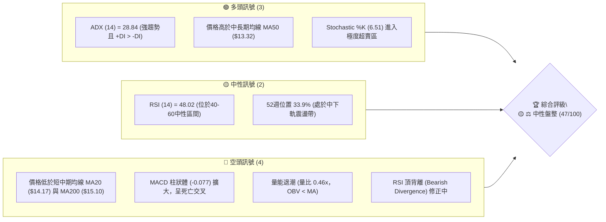
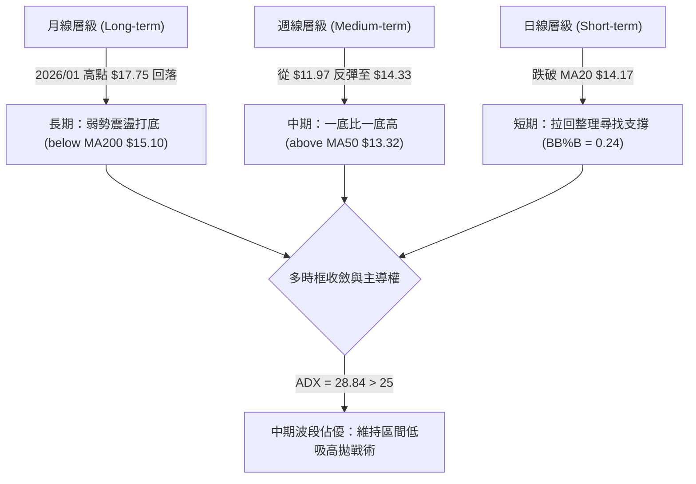
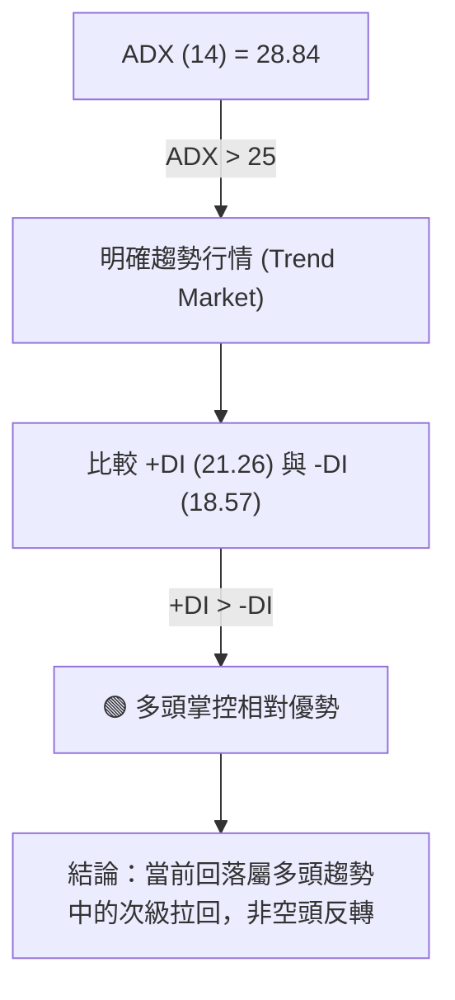
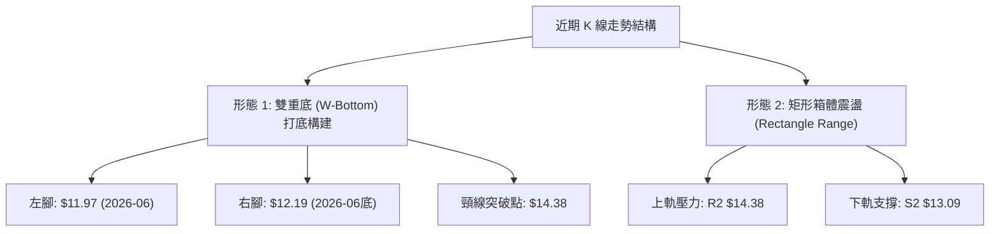
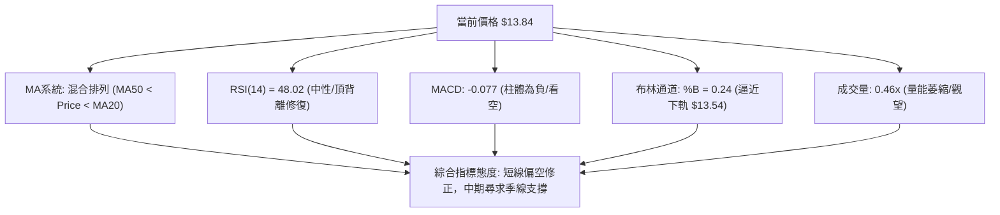
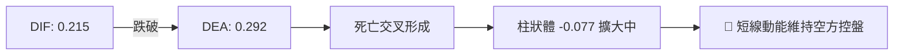
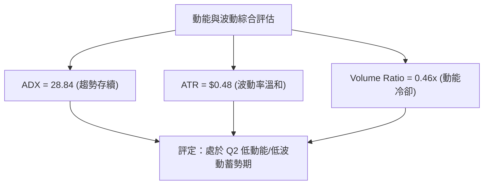
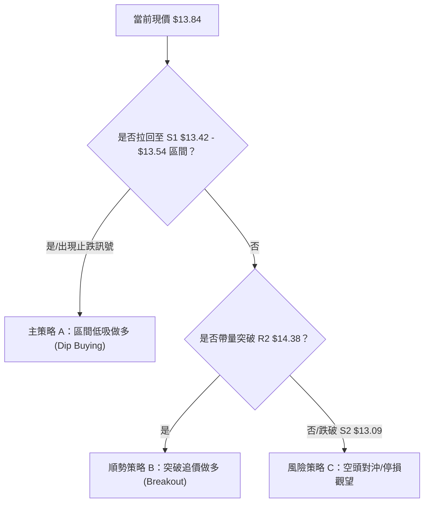
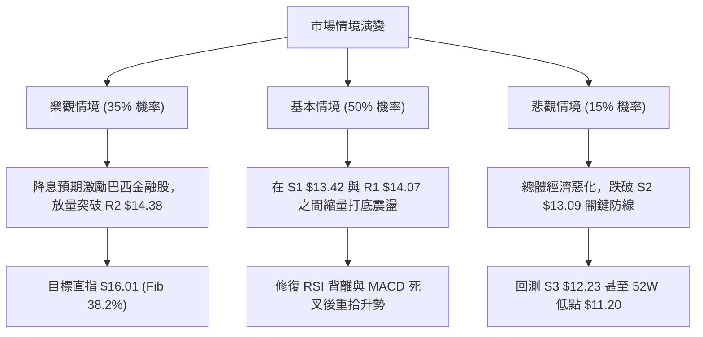

# NU 技術分析報告

> **報告日期**：2026-08-08 ｜ **語言**：繁體中文 ｜ **數據來源**：Yahoo Finance ｜ **當前價格**：$13.84

---

## 目錄

| 章節 | 內容 |
|------|------|
| [1. 技術面概覽](#1-技術面概覽) | 訊號儀表板、核心指標、評分卡 |
| [2. 趨勢分析](#2-趨勢分析) | 多時框趨勢、長中短期走勢 |
| [3. 圖表形態分析](#3-圖表形態分析) | 形態識別、K線組合、目標價 |
| [4. 支撐與阻力](#4-支撐與阻力) | 關鍵價位、斐波那契回調 |
| [5. 技術指標深度解讀](#5-技術指標深度解讀) | MA/RSI/MACD/布林/成交量 |
| [6. 動能與波動率](#6-動能與波動率) | 動能評估、ATR、Beta |
| [7. 多時框架總結](#7-多時框架總結) | 時框架評分矩陣 |
| [8. 交易策略建議](#8-交易策略建議) | 多空策略、風險報酬比 |
| [9. 風險提示與監控](#9-風險提示與監控) | 監控指標、風險場景 |

---

## 1. 技術面概覽

### 🎯 技術訊號儀表板



### 📊 核心指標速覽表

| 指標類別 | 指標名稱 | 當前數值 | 訊號 | 解讀 |
|----------|----------|----------|------|------|
| **價格** | 當前收盤價 | $13.84 | 🟡 中性 | 處於 52 週區間 $11.20 - $18.98 之 33.9% 位置 |
| **均線** | MA20 (月線) | $14.17 | 🔴 看空 | 價格跌破 MA20，短期承壓（距現價 +2.38%） |
| **均線** | MA50 (季線) | $13.32 | 🟢 看多 | 價格守於 MA50 之上，中期支撐仍存（距現價 -3.76%） |
| **均線** | MA200 (年線) | $15.10 | 🔴 看空 | 價格位於 MA200 下方，長期趨勢未扭轉偏弱（距現價 +9.10%） |
| **動能** | RSI(14) | 48.02 | 🟡 中性 | 位於 30-70 中性區，但伴隨⚠️頂背離訊號 |
| **動能** | MACD(12,26,9) | -0.077 | 🔴 看空 | DIF(0.215) < DEA(0.292)，柱狀圖持續轉負 |
| **超買賣** | Stochastic %K/%D | 6.51 / 41.85 | 🟢 醞釀反彈 | %K 進入極度超賣區（<10），短期隨時有技術性反彈 |
| **趨勢強度**| ADX(14) | 28.84 | 🟢 強趨勢 | ADX > 25 且 +DI(21.26) > -DI(18.57)，多頭格局尚存 |
| **波動** | ATR(14) | $0.48 | 🟡 中波動 | 佔股價 3.44%，日均波幅約 $0.48 |
| **通道** | 布林通道 %B | 0.24 | 🔴 偏弱 | 逼近布林下軌 $13.54，處於下軌與中軌之間 |
| **量能** | 當日/20日均量 | 0.46x | 🔴 價跌量縮 | 44.96M vs 97.88M，量能極度萎縮，買盤觀望 |

### 🏆 技術評分卡

```
╔══════════════════════════════════════════════════════════════════╗
║                   技術評分卡 — NU (2026-08-08)                   ║
╠══════════════════════════════════════════════════════════════════╣
║ 趨勢強度 (ADX/+DI) ▓▓▓▓▓▓▓▓▓▓▓▓░░░░░░░░  60/100  🟢 偏多趨勢仍在 ║
║ 動能指標 (RSI/MACD)▓▓▓▓▓▓▓▓░░░░░░░░░░░░  40/100  🔴 短線動能轉弱 ║
║ 支撐穩定度 (S1/MA50)▓▓▓▓▓▓▓▓▓▓▓▓▓▓░░░░░░  70/100  🟢 季線防線堅固 ║
║ 成交量配合 (OBV/量比)▓▓▓▓▓▓░░░░░░░░░░░░░░  30/100  🔴 量能顯著萎縮 ║
║ 形態完整度 (箱體/W底)▓▓▓▓▓▓▓▓▓▓░░░░░░░░░░  50/100  🟡 構建區間底部 ║
║ 均線排列 (混合排列)▓▓▓▓▓▓▓▓░░░░░░░░░░░░  40/100  🔴 糾結且承壓於MA20║
╠══════════════════════════════════════════════════════════════════╣
║ 綜合評分          ▓▓▓▓▓▓▓▓▓░░░░░░░░░░░  47/100  🟡 ⚖️ 中性觀望║
╚══════════════════════════════════════════════════════════════════╝
```

---

## 2. 趨勢分析

### 🌐 多時框趨勢分析



### 📈 長期趨勢 — 12個月走勢圖（Unicode）

```
NU 12個月價格走勢圖（2025-09 至 2026-08）
價格軸 ($)
$18.00 ┤                     ● (17.75)
$17.00 ┤             ●   ●
$16.00 ┤ ●   ●   ●   
$15.00 ┤                 ●
$14.00 ┤                         ●       ●   ●←【現價 $13.84】
$13.00 ┤                             ●   ●
$12.00 ┤                                 ●
       └─┬───┬───┬───┬───┬───┬───┬───┬───┬───┬───┬───┐
        09  10  11  12  01  02  03  04  05  06  07  08 (月份)
```

#### 走勢特徵分析表格：

| 階段 | 時間區間 | 價格變動 | 漲跌幅 | 趨勢特徵與量能配合 |
|------|----------|----------|--------|--------------------|
| **衝高期** | 2025-09 ~ 2026-01 | $16.01 ➔ $17.75 | +10.87% | 多頭強勢推進，創下波段高點 $17.75，機構大舉鎖碼。 |
| **修正期** | 2026-01 ~ 2026-03 | $17.75 ➔ $14.37 | -19.04% | 獲利了結賣壓湧現，連續跌破 MA20 與 MA50。 |
| **尋底期** | 2026-04 ~ 2026-06 | $14.48 ➔ $11.97 | -17.33% | 震盪破底，於 2026-06 觸及波段極低點 $11.97（接近52W低點$11.20）。 |
| **築底反彈**| 2026-06 ~ 2026-08 | $11.97 ➔ $13.84 | +15.62% | 底部買盤進駐，放量反彈至 $14.33 後遭遇 MA200 壓制拉回。 |

### 📊 中期趨勢（週線分析）

中期走勢顯示 NU 在 2026 年 6 月初打出 $11.97 低點後，展開一波高低點逐步墊高的「上升通道」或「雙底」反彈格局。

```
中期阻力與支撐格局示意圖
$15.10 ───────────────────────────────────────── (MA200 / 強阻力帶)
$14.38 ─────────────────▲─────────────────────── (R2 近期波段高點壓制)
$13.84 ─────────────────●─────────────────────── (現價)
$13.32 ───────────────────────────────────────── (MA50 / 季線強支撐)
$12.23 ─────────────────▼─────────────────────── (S3 前波轉折強支撐)
```

### ⚡ 趨勢強度評估（ADX 解讀）



| 指標項 | 數據 | 趨勢門檻 | 判斷結論 |
|--------|------|----------|----------|
| **ADX** | 28.84 | > 25.0 | 🟢 存在具體的波段趨勢，非完全無方向盤整 |
| **+DI** | 21.26 | - | 🟢 多方力量強度 |
| **-DI** | 18.57 | - | 🔴 空方力量強度（+DI 高於 -DI 約 2.69） |

---

## 3. 圖表形態分析

### 🔍 形態識別系統



#### 形態信心度評估表：

| 形態名稱 | 信心度 | 判斷依據（引用數據） | 完成度 | 目標價（附計算式） |
|----------|--------|----------------------|--------|--------------------|
| **雙重底 (W-Bottom)** | 60% | 兩次底部低點位於 $11.97 與 $12.19，未破前低 $11.20；頸線為 $14.38。 | 70% | 頸線 $14.38 + 形態高度($14.38 - $11.97 = $2.41) = **$16.79** |
| **矩形震盪箱體** | 80% | 價格受限於 $13.09 (S2) 至 $14.38 (R2) 區間內運行近 2 個月。 | 90% | 箱體突破目標：$14.38 + ($14.38 - $13.09 = $1.29) = **$15.67** |

### 🕯️ 重要 K 線形態分析

| 日期/週別 | 收盤價 | K線形態 | 解讀 | 訊號 |
|-----------|--------|---------|------|------|
| **2026-06-07** | $11.97 | 長下影錘子線 | 探底爆量（473.4M）獲強烈護盤，確立階段性底部。 | 🟢 強買訊 |
| **2026-07-19** | $13.59 | 爆量長十字星 | 巨量（762.0M）多空劇烈對峙，籌碼換手換班。 | 🟡 觀望 |
| **2026-08-02** | $14.33 | 受阻流星線 | 衝高至 $14.38 遇阻回落，上方賣壓沉重。 | 🔴 賣壓現 |
| **2026-08-09** | $13.84 | 縮量黑 K 線 | 量能急凍（248.4M），多頭攻勢暫緩，進行技術性修正。 | 🔴 弱修正 |

### 📉 ASCII 走勢形態示意圖

```
        NU 雙底與箱體震盪形態示意圖
        
$14.88 ─────────────────────────────────────── R3 (強壓力區)
                頸線阻力 R2 $14.38
$14.38 ───────────▲─────────▲───────────────── 突破則確立 W 底
                 / \       / \
$13.84 ─────────/───\─────/───●─────────────── (現價)
               /     \   /     \
$13.09 ───────/───────\─/───────\───────────── S2 (箱體下軌)
             /         ▼         \
$11.97 ─────● (左腳)   $12.19 (右腳)───────── S3 上方轉折區
```

### 🎯 形態目標價計算

1. **雙底形態（若成功突破頸線 $14.38）**：
   - 頸線價格：$14.38
   - 形態底部：$11.97
   - 形態高度：$14.38 - $11.97 = $2.41
   - **理論目標價** = $14.38 + $2.41 = **$16.79**（恰好逼近 2025-12 月線收盤價 $16.74）

2. **箱體突破（若突破高點 $14.38）**：
   - 箱體高點：$14.38，箱體低點：$13.09
   - 箱體垂直高度：$1.29
   - **最小測量目標價** = $14.38 + $1.29 = **$15.67**

---

## 4. 支撐與阻力

### 🗺️ 關鍵價位分布圖（Unicode）

```
NU 關鍵價位結構分布圖
════════════════════════════════════════════════════════════════
$18.98 ║████████████████████████████████████████║ 52週高點 (0.0%)
$17.14 ║████████████████████████                ║ Fib 23.6% 回調位
$16.01 ║████████████████                        ║ Fib 38.2% / 前波高點
$15.09 ║████████████                            ║ Fib 50.0% / MA200 ($15.10)
$14.88 ║████████                                ║ 強阻力 R3
$14.38 ║████                                    ║ 阻力 R2 (箱體上軌 / 頸線)
$14.07 ║██                                      ║ 關鍵阻力 R1 (MA20 $14.17 附近)
$13.84 ╠════════════════════════════════════════╣ ◄ 現價 $13.84
$13.42 ║▓▓▓▓▓▓▓▓                                ║ 近期關鍵支撐 S1 (季線 $13.32 防線)
$13.09 ║▓▓▓▓▓▓▓▓▓▓▓▓▓▓▓▓                        ║ 強支撐 S2 (箱體下軌)
$12.86 ║▓▓▓▓▓▓▓▓▓▓▓▓▓▓▓▓▓▓▓▓                    ║ Fib 78.6% 回調位
$12.23 ║▓▓▓▓▓▓▓▓▓▓▓▓▓▓▓▓▓▓▓▓▓▓▓▓▓▓▓▓            ║ 堅固支撐 S3 (W底右腳轉折)
$11.20 ║▓▓▓▓▓▓▓▓▓▓▓▓▓▓▓▓▓▓▓▓▓▓▓▓▓▓▓▓▓▓▓▓▓▓▓▓▓▓▓▓║ 52週低點 (100.0%)
════════════════════════════════════════════════════════════════
```

### 🚧 阻力位分析表

| 阻力級別 | 價位 | 形成原因 | 突破難度 | 重要性 |
|----------|------|----------|----------|--------|
| **R1** | $14.07 | 近一年波段高點聚類、MA20 ($14.17) 重疊區 | 🟡 中等 | 短線多空分水嶺，站上始能化解短線拉回壓力 |
| **R2** | $14.38 | 近一年波段高點聚類、W底頸線壓制 | 🔴 困難 | 中期多頭樞紐，突破將開啟波段上行空間 |
| **R3** | $14.88 | 近一年波段高點聚類、布林上軌 ($14.80) 區域 | 🔴 極難 | 解套賣壓重災區，需強大成交量支撐 |

### 🛡️ 支撐位分析表

| 支撐級別 | 價位 | 形成原因 | 守住機率 | 重要性 |
|----------|------|----------|----------|--------|
| **S1** | $13.42 | 近一年波段低點聚類、接近 MA50 ($13.32) | 🟢 70% | 短線防禦核心，跌破則宣告短期回檔加深 |
| **S2** | $13.09 | 近一年波段低點聚類、矩形箱體下軌 | 🟢 85% | 中期關鍵防線，維持區間震盪底限 |
| **S3** | $12.23 | 近一年波段低點聚類、W底右腳起漲轉折點 | 🟢 95% | 結構性多頭防線，不容有失 |

### 📐 斐波那契回調位分析

依據 52 週高低點（$11.20 ➔ $18.98，全波段幅差 $7.78）計算之標準斐波那契回調位：

- **0.0% (52W High)**: $18.98
- **23.6%**: $17.14
- **38.2%**: $16.01
- **50.0%**: $15.09
- **61.8%**: $14.17
- **78.6%**: $12.86
- **100.0% (52W Low)**: $11.20

**現價解讀**：現價 **$13.84** 落在 **61.8% ($14.17)** 與 **78.6% ($12.86)** 之間。
61.8% ($14.17) 為黃金分割的極度關鍵位，恰與 MA20 ($14.17) 完全重合，形成**強烈上方反壓**。若股價向上突破 $14.17，代表全波段回檔結束；若受阻，股價可能向下尋求 78.6% ($12.86) 及 S2 ($13.09) 的黃金支撐。

---

## 5. 技術指標深度解讀

### 🎛️ 指標訊號總覽



### 📈 移動平均線排列分析

```
MA 5   : $14.24  ▼  (短期下彎)
MA 10  : $14.33  ▼  (短期下彎)
MA 20  : $14.17  ▼  (月線下彎，股價於下方)
MA 50  : $13.32  ▲  (季線向上，股價於上方)
MA 120 : $13.99  ▼  (半年線扣高位)
MA 200 : $15.10  ▼  (年線下彎，長線壓制)
```

**解讀**：短天期均線（MA5、10、20）呈現「死叉向下」之混亂壓制狀態，股價受阻於 MA20 ($14.17)；但中期均線 MA50 ($13.32) 保持上升趨勢，形成下方支撐墊。當前處於**均線擠壓收斂期**。

### 📉 RSI(14) 分析

```
RSI(14) 強度：[▓▓▓▓▓▓▓▓▓▓░░░░░░░░░░] 48.02 / 100
```

- **區間定位**：RSI 現為 48.02，處於 30-70 的中性無方向區間。
- **背離判斷**：數據顯示存在 **⚠️ 頂背離 (Bearish Divergence)**。在前幾週股價試圖上攻 $14.33 時，RSI 未能同步創出新高（週線 RSI 從 79.0 回落至 48.0），預示上攻動能衰竭，目前正處於背離後的修正期。

### 📊 MACD(12/26/9) 訊號解讀

- **DIF (MACD 線)**: 0.215
- **DEA (Signal 線)**: 0.292
- **MACD 柱狀體**: **-0.077**（紅色柱體擴大）



### 📦 布林通道分析

```
布林上軌 : $14.80  ════════════════════════════════════
中軌(MA20): $14.17  ────────────────────────────────────
當前價格 : $13.84  ─────────● ( %B = 0.24 )
布林下軌 : $13.54  ════════════════════════════════════
```

- **帶寬與位置**：%B 為 **0.24**，代表股價已回落至通道下半區，距離下軌 $13.54 僅剩 $0.30 空間（約 2.1%）。
- **通道策略**：通道寬度（$14.80 - $13.54 = $1.26）相對收窄，代表波動率正在壓縮。若股價在下軌 $13.54 獲支撐，將迎來向中軌 $14.17 的均值回歸。

### 💹 成交量分析（量價配合度）

- **最新成交量**：44,959,515 股
- **20日均量**：97,878,781 股（**量比 0.46x**，大幅萎縮）
- **OBV 趨勢**：`OBV < MA`，顯示能量潮指標處於均線下方。

**量價解讀**：股價從 $14.33 拉回至 $13.84 的過程中，成交量呈急劇縮減（0.46x），呈現典型的**「價跌量縮」**籌碼洗盤特徵，表明市場主控資金並未失控拋售，而是散戶追高意願低落致買盤縮手。

---

## 6. 動能與波動率

### ⚡ 動能評估

| 象限 | 動能強度 | 波動率 | 當前狀態 | 評估與策略 |
|------|----------|--------|----------|------------|
| **Q1 (高動能/低波動)** | 強 | 低 | - | 最佳突破買點 |
| **Q2 (低動能/低波動)** | 弱 | 低 | **✓ (當前區域)** | **築底沉澱期：量縮震盪，等待方向突破** |
| **Q3 (高動能/高波動)** | 強 | 高 | - | 追價高風險高收益 |
| **Q4 (低動能/高波動)** | 弱 | 高 | - | 恐慌殺跌，嚴格避開 |



### 📊 ATR 波動率分析

- **ATR(14)**：**$0.48**
- **ATR 百分比**：**3.44%**
- **交易風控含義**：
  - **日內合理波幅**：$13.84 ± $0.48 ($13.36 ~ $14.32)
  - **建議止損距離**：採用 1.5 倍 ATR = $0.72，或 2.0 倍 ATR = $0.96。

### 📐 Beta 與市場相關性

- **Beta 係數**：**0.942**
- **解讀**：NU 與大盤（S&P 500）呈高度正相關，波動幅度略低於大盤（0.942）。整體市場氣氛若轉佳，將有利於 NU 隨大盤展開系統性反彈。

---

## 7. 多時框架總結

### 📋 時框架評分表

| 時框架 | 趨勢方向 | 動能指標 | 均線排列 | 形態結構 | 綜合評分 | 交易建議 |
|--------|----------|----------|----------|----------|----------|----------|
| **月線 (Long)** | 🟡 震盪 | 45/100 | 🔴 跌破MA240 | 🟡 大箱體下軌 | **45/100** | 偏空打底，靜待扭轉 |
| **週線 (Mid)** | 🟢 偏多 | 55/100 | 🟢 站穩MA50 | 🟢 雙底打底中 | **60/100** | 逢低布局，看好反彈 |
| **日線 (Short)**| 🔴 修正 | 38/100 | 🔴 均線死叉壓制| 🔴 區間回落 | **38/100** | 短線觀望，等待止跌 |

### 🔲 綜合訊號矩陣

```
           短期 (日線)    中期 (週線)    長期 (月線)
趨勢方向：    🔴 下降        🟢 上升        🟡 橫盤
動能狀態：    🔴 轉弱        🟡 中性        🔴 偏弱
買賣訊號：   [等待止跌]     [低吸布局]     [觀望持有]
```

### ⚖️ 多時框收斂結論

根據**多時框收斂規則**：ADX(14) 為 **28.84 (>25)**，代表當前市場處於**「強趨勢/波段主導行情」**。
依優先級應以**中期（週線/MA50 $13.32）**的方向為主，日線短線拉回僅作為「尋找優質進場點」的工具。

**唯一方向性結論**：**中性偏多（逢低承接）**。股價短期雖承壓於 MA20 ($14.17)，但中期守穩 MA50 ($13.32) 及強支撐 S1 ($13.42)，短線過度賣超（Stoch %K=6.51）將引發向下測壓後的技術性反彈。

---

## 8. 交易策略建議

### 🗺️ 策略決策流程圖



### 🧭 策略路由

**當前主策略方向 = 🟡 區間低吸 / 逢低做多（依綜合評分 47/100 與 ADX 趨勢收斂）**

### 🎯 價格情境階梯（Price Scenarios）

| 觸發條件 | 下一目標 | 後續延伸 | 情境含義 |
|----------|----------|----------|----------|
| **突破 R2 $14.38** | R3 $14.88 | Fib 38.2% $16.01 | 雙底突破，確立中期牛市重啟 |
| **突破 R1 $14.07** | R2 $14.38 | R3 $14.88 | 短線轉強，化解 MA20 壓制 |
| **站穩 S1 $13.42** | R1 $14.07 | R2 $14.38 | 區間震盪蓄勢，高拋低吸區 |
| **跌破 S2 $13.09** | S3 $12.23 | 52W 低點 $11.20 | 區間破位，中期結構轉弱 |

### 📊 情境機率分佈

| 情境 | 機率 | 主要依據 |
|------|------|----------|
| **S1 支撐有效，反彈上攻** | **50%** | Stoch 極度超賣(%K=6.51)、MA50($13.32)強支撐、ADX+DI強於-DI |
| **區間震盪 ($13.42 - $14.07)**| **35%** | 20日均量大幅萎縮(量比0.46x)、RSI於48區間橫盤 |
| **跌破 S2 探底 ($12.23)** | **15%** | MACD 死亡交叉擴大、突破失敗賣壓 |

### 🟢 主策略詳情

#### 🥇 主策略 A：區間下軌低吸做多（首選）

- **進場條件**：股價回落至 S1 ($13.42) 至布林下軌 ($13.54) 區間，出現 15 min / 日線止跌 K 線（如下影線或陽吞噬）。
- **進場價格**：**$13.50**（預掛於 $13.42 - $13.54 帶）
- **止損價格**：**$13.00**（跌破 S2 $13.09 觸發止損，防禦約 1.04 倍 ATR）
- **目標價 T1**：**$14.07**（R1 / MA20 位置，預期獲利 +4.22%）
- **目標價 T2**：**$14.38**（R2 / 頸線位置，預期獲利 +6.52%）
- **風險報酬比**：
  - 針對 T1：($14.07 - $13.50) / ($13.50 - $13.00) = $0.57 / $0.50 = **1.14 : 1**
  - 針對 T2：($14.38 - $13.50) / ($13.50 - $13.00) = $0.88 / $0.50 = **1.76 : 1**
- **成功機率**：**65%**
- **建議倉位**：**15% - 20%**

#### 🥈 主策略 B：帶量突破順勢做多（次選）

- **進場條件**：日線收盤價強勢突破 R2 ($14.38) 且成交量放大至 20 日均量 1.2 倍以上。
- **進場價格**：**$14.45**
- **止損價格**：**$13.95**（設於突破點 R1 $14.07 下方）
- **目標價 T1**：**$14.88**（R3 位置）
- **目標價 T2**：**$16.01**（Fib 38.2% 位置）
- **風險報酬比**：
  - 針對 T2：($16.01 - $14.45) / ($14.45 - $13.95) = $1.56 / $0.50 = **3.12 : 1**
- **成功機率**：**55%**
- **建議倉位**：**10% - 15%**

### 🔴 反向風險觸發點（對沖與停損提示）

若股價未能在 S1 ($13.42) 止跌，且以長黑 K 跌破 **S2 ($13.09)**：
- **含義**：宣告矩形箱體支撐失守，W 底格局破壞。
- **動作**：多頭應全面停損出場；短線對沖者可酌量建立空單，下看 **S3 ($12.23)**，止損設於 $13.35。

### ⭐ 整體訊號強度評星

```
做多訊號強度：★★★☆☆  (3.0/5星)
做空訊號強度：★★☆☆☆  (2.0/5星)
整體可信度：  ★★★☆☆  (3.5/5星)
```

---

## 9. 風險提示與監控

### ✅ 關鍵監控指標 Checklist

```
╔══════════════════════════════════════════════════════════════════╗
║                    關鍵監控指標 CHECKLIST                        ║
╠══════════════════════════════════════════════════════════════════╣
║ [ ] MA20 扣抵位置：監控股價能否在 3 日內重新站上 $14.17          ║
║ [ ] S1 防線攻防：$13.42 - $13.54 區間之量能與下影線支撐力道      ║
║ [ ] MACD 柱狀體：觀察 -0.077 是否開始縮小（收斂轉折訊號）        ║
║ [ ] 成交量回溫：日成交量是否回升至 20日均量 (97.88M) 之上        ║
║ [ ] 關鍵阻力突破：R2 $14.38 是否伴隨機構大單買盤進駐            ║
╚══════════════════════════════════════════════════════════════════╝
```

### ⚠️ 風險場景分析



### 🛡️ 風險管理重要提醒

1. **嚴格控制單筆風險**：單筆交易虧損金額切勿超過總本金的 **1.5% - 2.0%**。若以 $13.50 進場、止損設於 $13.00（每股風險 $0.50），每 10,000 美元本金建議最大交易股數為 300-400 股。
2. **警惕量能陷阱**：目前成交量僅 44.96M（量比 0.46x），無量上攻容易形成假突破，未見放量（> 90M）前切勿在高位追價。
3. **財報與宏觀事件防範**：金融科技股對拉丁美洲（巴西/墨西哥）利率政策敏感度極高，需同步關注巴西央行利率決議。

---

## 📋 報告總結

```
╔══════════════════════════════════════════════════════════════════╗
║                   NU 技術分析報告總結                            ║
════════════════════════════════════════════════════════════════════
報告日期：2026-08-08
當前價格：$13.84
分析評級：🟡 ⚖️ 中性觀望 / 逢低承接 (47/100)

關鍵結論：
├─ 長期趨勢：🔴 弱勢打底（受制於 MA200 $15.10）
├─ 中期趨勢：🟢 穩健反彈（守穩 MA50 $13.32，高低點墊高）
├─ 短期趨勢：🔴 回檔修正（跌破 MA20 $14.17，MACD死叉）
├─ 關鍵支撐：S1 $13.42 ｜ S2 $13.09 ｜ S3 $12.23
├─ 關鍵阻力：R1 $14.07 ｜ R2 $14.38 ｜ R3 $14.88
└─ 分析師目標：均價 $17.98 (最高 $22.00 / 最低 $10.00)

最優策略組合：
1. 🥇 首選策略：於 $13.42 - $13.54 區間掛單買進，止損 $13.00，目標 $14.07 / $14.38
2. 🥈 次選策略：靜待帶量突破 R2 $14.38 後追價進場，目標 $16.01
3. 🥉 風險防範：若日線收盤跌破 $13.09，多頭全數退場觀望
════════════════════════════════════════════════════════════════════
```

---

> ⚠️ **免責聲明**：本報告為 AI 自動生成之技術分析，所有數據及估算均基於提供的歷史價格資訊。本報告**僅供研究與學術參考**，**不構成任何投資建議**。投資有風險，入市需謹慎。

---

*報告生成時間：2026-08-08 ｜ 數據來源：Yahoo Finance ｜ 分析框架：多時框技術分析*