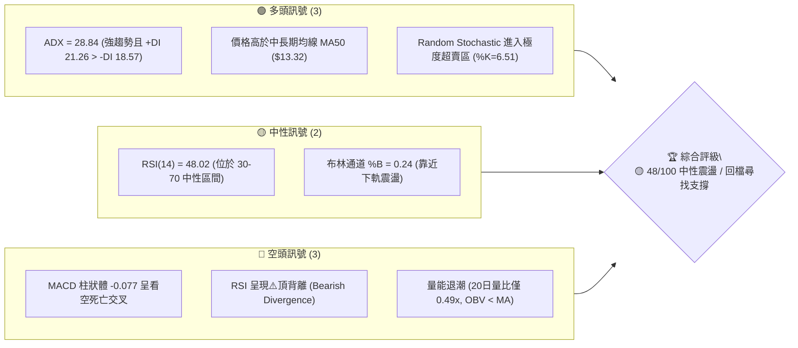
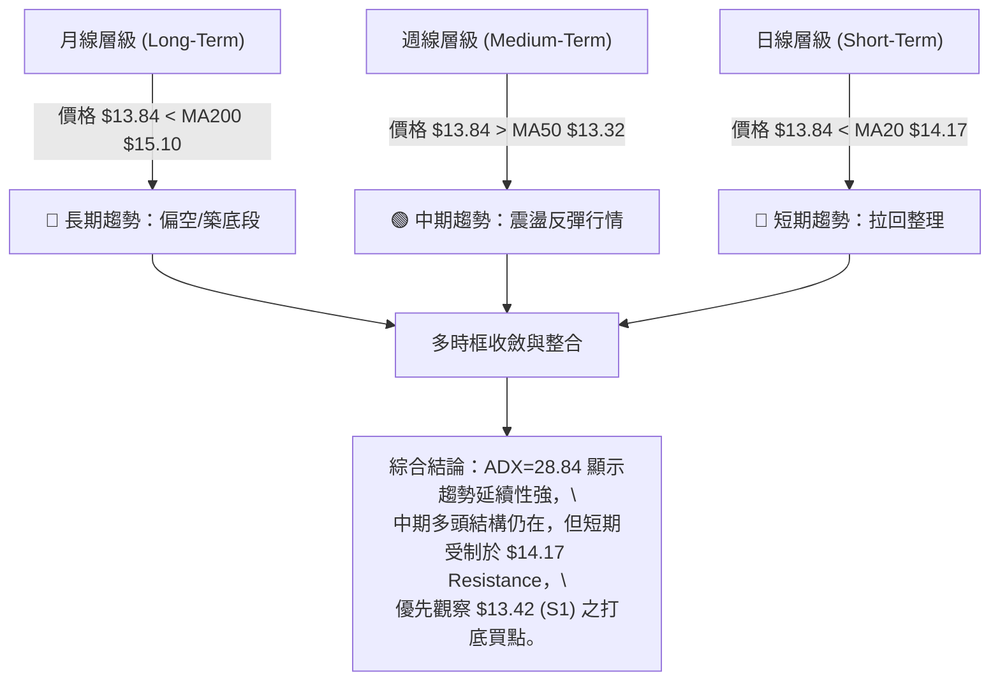
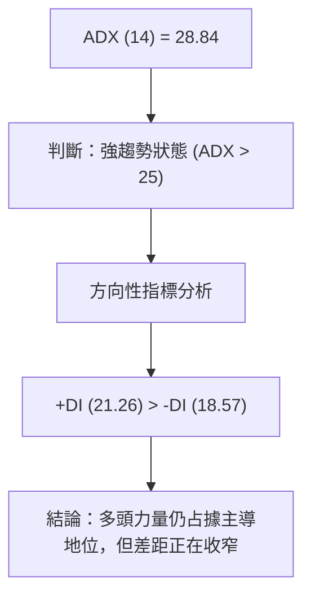
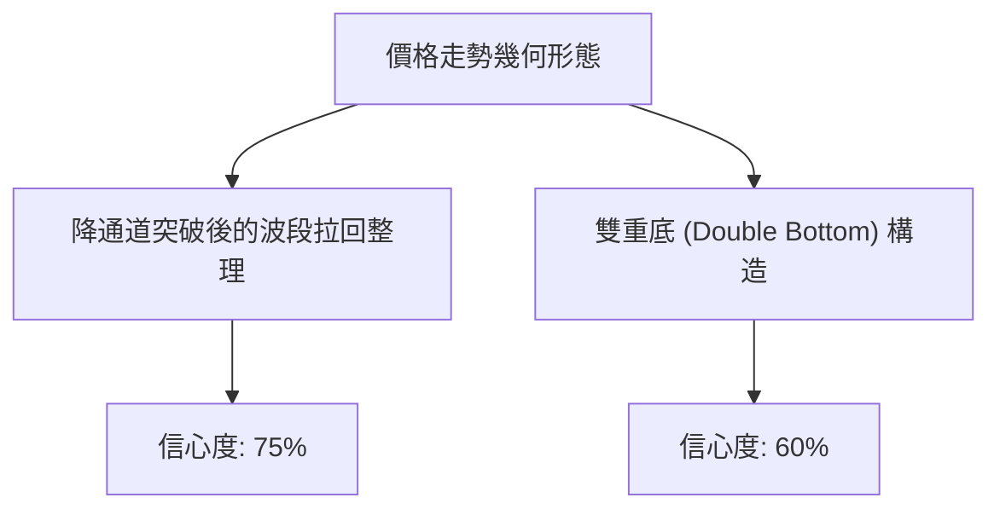
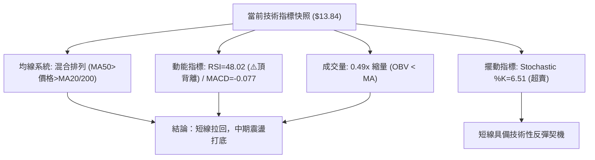
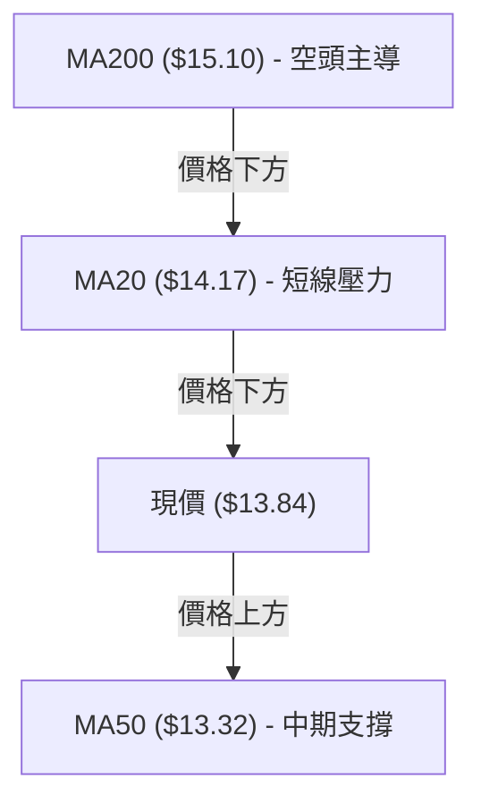
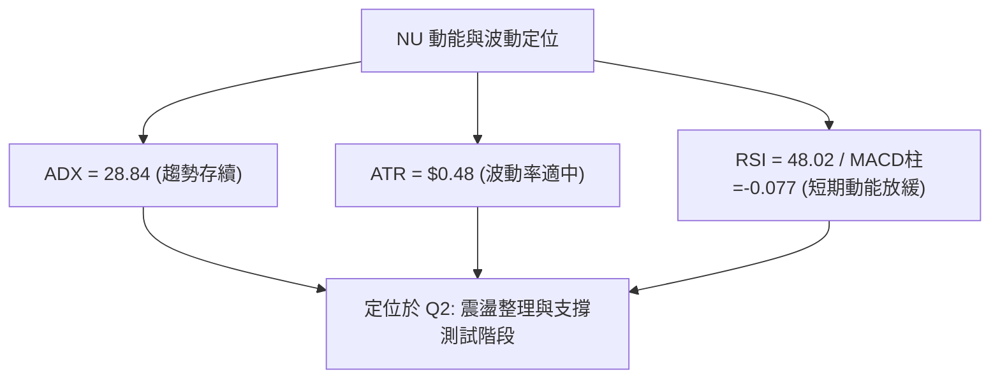
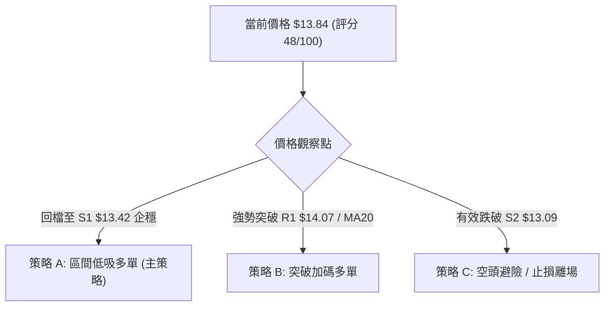
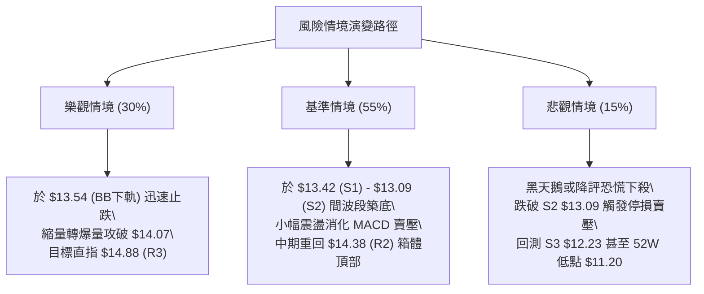

# NU 技術分析報告

> **報告日期**：2026-08-09 ｜ **語言**：繁體中文 ｜ **數據來源**：Yahoo Finance ｜ **當前價格**：$13.84

---

## 目錄

| 章節 | 內容 |
|------|------|
| [1. 技術面概覽](#1-技術面概覽) | 訊號儀表板、核心指標、評分卡 |
| [2. 趨勢分析](#2-趨勢分析) | 多時框趨勢、長中短期走勢 |
| [3. 圖表形態分析](#3-圖表形態分析) | 形態識別、K線組合、目標價 |
| [4. 支撐與阻力](#4-支撐與阻力) | 關鍵價位、斐波那契回調 |
| [5. 技術指標深度解讀](#5-技術指標深度解讀) | MA/RSI/MACD/布林/成交量 |
| [6. 動能與波動率](#6-動能與波動率) | 動能評估、ATR、Beta |
| [7. 多時框架總結](#7-多時框架總結) | 時框架評分矩陣 |
| [8. 交易策略建議](#8-交易策略建議) | 多空策略、風險報酬比 |
| [9. 風險提示與監控](#9-風險提示與監控) | 監控指標、風險場景 |

---

## 1. 技術面概覽

### 🎯 技術訊號儀表板



### 📊 核心指標速覽表

| 指標類別 | 指標名稱 | 當前數值 | 訊號 | 解讀 |
|----------|----------|----------|------|------|
| **價格** | 當前價格 | $13.84 | 🟡 中性 | 處於 52 週區間 ($11.20 - $18.98) 之 33.9% 位置 |
| **均線** | MA20 (月線) | $14.17 | 🔴 看空 | 當前價格在 MA20 下方 (-2.32%)，短線承壓 |
| **均線** | MA50 (季線) | $13.32 | 🟢 看多 | 當前價格在 MA50 上方 (+3.90%)，中期支撐尚存 |
| **均線** | MA200 (年線) | $15.10 | 🔴 看空 | 當前價格在 MA200 下方 (-8.34%)，長期趨勢偏弱 |
| **動能** | RSI(14) | 48.02 | 🔴 看空 | 位於中性區，但存在⚠️頂背離訊號，動能放緩 |
| **動能** | MACD (12,26,9) | -0.077 (柱狀) | 🔴 看空 | MACD (0.215) 低於 Signal (0.292)，動能轉負 |
| **波動** | ATR (14) | $0.48 | 🟡 中性 | 日均波動率 3.44%，屬於標準中等波動區間 |

### 🏆 技術評分卡

```
╔══════════════════════════════════════════════════════════════════╗
║                   技術評分卡 — NU (2026-08-09)                    ║
╠══════════════════════════════════════════════════════════════════╣
║ 趨勢強度      ▓▓▓▓▓▓▓▓▓▓▓▓▓░░░░░░░  65/100  🟢 趨勢明確(ADX>25) ║
║ 動能指標      ▓▓▓▓▓▓▓▓░░░░░░░░░░░░  40/100  🔴 MACD柱狀負向/背離 ║
║ 支撐穩定度    ▓▓▓▓▓▓▓▓▓▓▓▓░░░░░░░░  60/100  🟢 S1($13.42)支撐強勁 ║
║ 成交量配合    ▓▓▓▓▓▓░░░░░░░░░░░░░░  30/100  🔴 量能萎縮/OBV走弱   ║
║ 形態完整度    ▓▓▓▓▓▓▓▓▓▓░░░░░░░░░░  50/100  🟡 頻道區間震盪整理   ║
║ 均線排列      ▓▓▓▓▓▓▓▓░░░░░░░░░░░░  42/100  🔴 價格夾在MA50與MA20間║
╠══════════════════════════════════════════════════════════════════╣
║ 綜合評分      ▓▓▓▓▓▓▓▓▓█░░░░░░░░░░  48/100  🟡 中性觀望 / 區間操作║
╚══════════════════════════════════════════════════════════════════╝
```

---

## 2. 趨勢分析

### 🌐 多時框趨勢分析



### 📈 長期趨勢 — 12個月走勢圖（Unicode）

```
NU 月線走勢圖（過去12個月 2025-08 至 2026-08）
價格軸 ($)
$18.00 ┤                                 ●(2026-01 $17.75)
$17.00 ┤                         ●
$16.00 ┤                 ●   ●
$15.00 ┤ ●                                   ●
$14.00 ┤     ●                   ●               ●←現在 ($13.84)
$13.00 ┤         ●   ●                           ●
$12.00 ┤                 ●
       └─┬───┬───┬───┬───┬───┬───┬───┬───┬───┬───┬───┬───┐
        08  09  10  11  12  01  02  03  04  05  06  07  08  (月份)
```

**走勢特徵分析表格**：

| 時間段 | 收盤價區間 | 變動趨勢 | 成交量/動能特徵 | 核心驅動要素 |
|--------|------------|----------|------------------|--------------|
| **2025-08 ~ 2025-11** | $14.80 → $17.39 | 🟢 強勢主升段 | 漲勢帶量，多頭主力進駐 | 季報盈餘超預期，新用戶增長 |
| **2025-12 ~ 2026-01** | $16.74 → $17.75 | 🟢 創高頂部區 | 見歷史高點 $18.98 後動能竭盡 | 高位獲利結案賣壓浮現 |
| **2026-02 ~ 2026-05** | $14.98 → $13.13 | 🔴 快速修正段 | 跌破 MA200，空頭主導 | 總體宏觀利率疑慮，降評潮 |
| **2026-06 ~ 2026-08** | $13.36 → $13.84 | 🟡 低檔震盪築底 | 於 $11.20 止跌後打底，量能縮減 | 籌碼沉澱，法人評級分化 |

### 📊 中期趨勢（週線分析）

```
NU 週線阻力與支撐結構示意圖
===================================================================
 $18.98 ────────────────────────────────────── 52週最高點 (0.0% Fib)
 $15.09 ───[阻力 R3 / Fib 50.0%]────────────── MA200 壓力區
 $14.38 ───[阻力 R2 / 布林上軌]─────────────── 波段高點聚類
 $14.07 ───[阻力 R1 / MA20 $14.17]─────────── 短線關卡
 $13.84 ───[現價]────────────────────────── 價格位置 (33.9% 52W)
 $13.42 ───[支撐 S1 / 近期低點]────────────── 第一防線
 $13.09 ───[支撐 S2 / MA50 $13.32]─────────── 中期多頭命脈
 $11.20 ────────────────────────────────────── 52週最低點 (100.0% Fib)
===================================================================
```

週線層級顯示，NU 自 2026 年 5 月底觸及 52 週低點 $11.20 後，展開築底反彈。近期最高回升至 2026-08-02 的 $14.33，但隨後在 2026-08-09 回落至 $13.84。目前週線處於 MA50 ($13.32) 之上，中期呈現上升三角形或打底震盪格局。

### ⚡ 趨勢強度評估（ADX 解讀）



| 指標名稱 | 數值 | 門檻基準 | 趨勢解讀 |
|----------|------|----------|----------|
| **ADX** | 28.84 | > 25 (強趨勢) |  بازار處於明確的趨勢行情中，非無序盤整 |
| **+DI** | 21.26 | - | 買盤買進動能 |
| **-DI** | 18.57 | - | 賣盤拋售動能 |
| **DI 差值** | +2.69 | > 0 (多頭勝) | 雖然近期拉回，但多頭大結構尚未被徹底破壞 |

---

## 3. 图表形態分析

### 🔍 形態識別系統



#### 形態信心度與目標價評估表

| 形態類型 | 信心度 | 判斷依據（引用數據） | 完成度 | 目標價計算式與精確數值 |
|----------|--------|----------------------|--------|------------------------|
| **雙重底 (Double Bottom)** | 60% | 第一底為 $11.20 (52W Low)，第二底為 $11.97 (2026-06-07)，頸線位於 R2 $14.38 | 75% | 頸線 $14.38 + (頸線 $14.38 - 低點 $11.97 = $2.41) = **$16.79** (接近 Fib 38.2% $16.01) |
| **箱體震盪 (Rectangle Range)** | 75% | 價格運行於 S1 $13.42 與 R2 $14.38 之間，日線布林通道封閉 | 85% | 突破箱頂 R2 $14.38 + 箱高 ($14.38 - $13.42 = $0.96) = **$15.34** |

*註：由於形態尚未完全確認突破，部分目標價為理論推估。*

### 🕯️ 重要K線形態分析

| 日期/週期 | 收盤價 | K線形態名稱 | 技術面解讀 | 多空訊號 |
|-----------|--------|-------------|------------|----------|
| **2026-07-19 (週)** | $13.59 | 高檔長上影線 | 爆量 7.62 億股衝高回落，顯示 $14.00 上方阻力強勁 | 🔴 空頭抵抗 |
| **2026-07-26 (週)** | $14.09 | 實體中陽線 | 包覆前週上影線，多頭重新奪回主導權 | 🟢 多頭反攻 |
| **2026-08-02 (週)** | $14.33 | 溫和小陽線 | 創近期反彈高點 $14.33，接近 R2 阻力 | 🟡 動能減緩 |
| **2026-08-09 (週)** | $13.84 | 陰線包覆 (Bearish Engulfing) | 回落跌破 MA20 ($14.17)，吞噬前週漲幅 | 🔴 短線拉回 |

### 📉 ASCII 走勢形態示意圖

```
NU 日線級別箱體震盪與形態結構
  $14.88 ────────────────────────────────────── R3 阻力線
            /\
           /  \      /\  R2 $14.38 (箱體頂部)
  $14.38 ─/────\────/──\───────────────────────
         /      \  /    \      /│ (目前價位 $13.84)
  $13.84 ────────\───────\────/─┼────────────── 現價
                  \      /   /  │
  $13.42 ──────────\────/───/───┴────────────── S1 支撐線 (箱體底部)
                    \  /
  $13.09 ────────────\/──────────────────────── S2 強支撐位
```

### 🎯 形態目標價計算

1. **箱體突破目標價**：
   - 箱體高點 (R2) = $14.38
   - 箱體低點 (S1) = $13.42
   - 形態高度 (Height) = $14.38 - $13.42 = $0.96
   - **多頭向上突破目標價** = $14.38 + $0.96 = **$15.34**
   - **空頭向下跌破目標價** = $13.42 - $0.96 = **$12.46**

---

## 4. 支撐與阻力

### 🗺️ 關鍵價位分布圖（Unicode）

```
NU 價位結構分布圖 (由 OHLCV 與歷史數據精確計算)
═══════════════════════════════════════════════════════════
$18.98 ║████████████████████████████████████████║ 52週高點 (Fib 0.0%)
$17.14 ║██████████████████                      ║ Fib 23.6% 回調位
$16.01 ║████████████████████████                ║ Fib 38.2% 回調位
$15.09 ║████████████████████████████            ║ 關鍵阻力 R3 / Fib 50.0%
$14.38 ║████████████████████                    ║ 波段阻力 R2 / BB 上軌
$14.07 ║████████████                            ║ 近期阻力 R1 / MA20 ($14.17)
$13.84 ╠════════════════════════════════════════╣ ◄ 當前收盤價 ($13.84)
$13.42 ║▓▓▓▓▓▓▓▓▓▓▓▓▓▓▓▓▓▓▓▓                    ║ 近期支撐 S1
$13.09 ║████████████████████████                ║ 強支撐 S2 / MA50 ($13.32)
$12.23 ║████████████████████████████████        ║ 極強支撐 S3 / Fib 78.6% ($12.86)
$11.20 ║████████████████████████████████████████║ 52週低點 (Fib 100.0%)
═══════════════════════════════════════════════════════════
```

### 🚧 阻力位分析表

| 阻力級別 | 價位 | 形成原因 | 突破難度 | 重要性 |
|----------|------|----------|----------|--------|
| **R1** | **$14.07** | 近一年波段高點聚類與 MA20 ($14.17) 重疊區 | 🟡 中等 | 短線多空分水嶺，站穩方能擺脫沉悶 |
| **R2** | **$14.38** | 近期（2026-08-02週）高點 $14.33 與布林上軌 $14.80 下緣 | 🔴 較難 | 區間震盪頂部，強大的套牢賣壓區 |
| **R3** | **$14.88** | 斐波那契 50% 回調位 ($15.09) 與 MA200 ($15.10) 下方 | 🔴 極難 | 中長期牛熊分界點，需有爆量配合 |

### 🛡️ 支撐位分析表

| 支撐級別 | 價位 | 形成原因 | 守住機率 | 重要性 |
|----------|------|----------|----------|--------|
| **S1** | **$13.42** | 近一年波段低點聚類，接近布林下軌 ($13.54) | 🟢 70% | 短線防守第一線，跌破則回測 MA50 |
| **S2** | **$13.09** | MA50 ($13.32) 附近波段低點聚類 | 🟢 80% | 中期多頭命脈，回檔最佳低吸位置 |
| **S3** | **$12.23** | 2026年6月中旬波段低點聚類與 Fib 78.6% ($12.86) | 🟢 90% | 長期強烈支撐防線，不容有失 |

### 📐 斐波那契回調位分析

依據 52 週區間的高點 **$18.98** 至低點 **$11.20** 進行斐波那契計算：

- **0.0% (52W High)**: $18.98
- **23.6%**: $17.14
- **38.2%**: $16.01
- **50.0%**: $15.09 — *(關鍵強阻力區，與 MA200 $15.10 高度重疊)*
- **61.8%**: $14.17 — *(黃金分割比例位，目前與 MA20 $14.17 完全重合)*
- **78.6%**: $12.86 — *(下方強支撐保護區)*
- **100.0% (52W Low)**: $11.20

**現價位置解讀**：
當前價格 **$13.84** 精確介於 **Fib 61.8% ($14.17)** 與 **Fib 78.6% ($12.86)** 之間。由於價格目前低於 Fib 61.8% 的 $14.17，技術面上將 $14.17 由支撐轉為阻力；下方第一目標尋求 S1 ($13.42) 及 S2 ($13.09) 之支撐力道。

---

## 5. 技術指標深度解讀

### 🎛️ 指標訊號總覽



### 📈 移動平均線排列分析



| 均線名稱 | 均線數值 | 與現價距離 | 均線扣抵與走勢 | 訊號 |
|----------|----------|------------|----------------|------|
| **MA5** | $14.24 | -2.82% | 拐頭向下，短線壓制 | 🔴 看空 |
| **MA10** | $14.33 | -3.41% | 下行彎頭 | 🔴 看空 |
| **MA20** | $14.17 | -2.32% | 扣抵高價區，持續走平下彎 | 🔴 看空 |
| **MA50** | $13.32 | +3.90% | 扣抵低價區，穩定向上上揚 | 🟢 看多 |
| **MA120** | $13.99 | -1.04% | 走平，處於多空爭奪區 | 🟡 中性 |
| **MA200** | $15.10 | -8.34% | 下彎，長期下行趨勢壓制 | 🔴 看空 |

### 📉 RSI(14) 分析

- **當前 RSI 數值**：`48.02`
- **RSI 強度進度條**：`▓▓▓▓▓▓▓▓▓░░░░░░░░░░░ 48%` (中性區間 30-70)

```
RSI(14) 區間定位
[0]──────────[30]───────★───[70]──────────[100]
  超賣區       買進區   現價    超買區
```

**⚠️ 頂背離判斷 (Bearish Divergence)**：
在 2026-07-05 至 2026-08-02 期間，價格由 $13.61 上漲至 $14.33（創波段新高），然而 RSI 卻由 79.0 降至 58.5（呈現高點降低）。這表明在價格上漲過程中，內部買盤動能已出現顯著衰退，預示著價格隨時可能面臨修正，當前 $13.84 的回檔完全印證了頂背離的空頭預警。

### 📊 MACD(12,26,9) 訊號解讀

- **MACD 線**：`0.215`
- **Signal 線**：`0.292`
- **MACD 柱狀體 (Histogram)**：`-0.077`

```
MACD 柱狀體動能軌跡
+0.178 ┤    █
+0.116 ┤    ██
+0.037 ┤    █
 0.000 ┼────────
-0.077 ┤    █ (看空柱狀體擴大)
```

**解讀**：MACD 線已由上向下穿過 Signal 線形成看空死亡交叉，柱狀體翻負至 `-0.077`，表明多頭掌控力暫時喪失，短線處於空頭控盤的回檔階段。

### 📦 布林通道分析

```
NU 布林通道位置示意圖 ($13.84)
 $14.80 ─── Upper Band (上軌) ─────────────────────────
            │
 $14.17 ─── Middle Band (中軌 / MA20) ──────────────────
            │   ★ 現價 $13.84 (%B = 0.24)
 $13.54 ─── Lower Band (下軌) ─────────────────────────
```

- **BB 上軌**：$14.80
- **BB 中軌 (MA20)**：$14.17
- **BB 下軌**：$13.54
- **%B 指標**：`0.24`

**解讀**：%B 數值為 0.24，顯示價格已回落至布林通道下半區，距離下軌 $13.54 僅一步之遙。通道寬度保持穩定，無暴走開口現象，預計價格將在下軌 $13.54 至 $13.42 (S1) 附近獲得技術性支撐。

### 💹 成交量分析（量價配合度）

- **最新成交量**：`47,648,100` 股
- **20日均量**：`98,013,210` 股
- **量比 (Volume Ratio)**：`0.49x` (嚴重縮量)
- **OBV 趨勢**：`OBV < MA` (能量潮線位於均線下方)

**量價背離與籌碼解讀**：
當前回檔伴隨著顯著縮量（僅為 20 日均量的 49%），說明當前賣壓主要來自短線獲利了結或觀望籌碼，而非主力機構的爆量恐慌性拋售。然而，OBV 低於其移動平均線，反映籌碼累積動能不足，若要開啟新一輪攻勢，必須有超越 8,000 萬股以上的補量確認。

---

## 6. 動能與波動率

### ⚡ 動能評估四象限

| 象限區劃 | 動能強度 | 波動率 | 當前定位 | 評估與策略 |
|----------|----------|--------|----------|------------|
| **Q1 (高動能/低波動)** | 強 | 低 | — | 最佳趨勢續航區 |
| **Q2 (弱動能/低波動)** | 弱 | 低 | **✓ (NU 定位區)** | **整理與累積區：波動率 ATR 3.44%，動能整理，適合逢低佈局** |
| **Q3 (強動能/高波動)** | 強 | 高 | — | 高風險高收益突破區 |
| **Q4 (弱動能/高波動)** | 弱 | 高 | — | 恐慌拋售區 / 避免進場 |



### 📊 ATR 波動率分析

- **ATR(14)**：`$0.48`
- **價格佔比**：`3.44%`
- **動態止損建議**：
  - **短線交易 (1.5x ATR)**：止損距離設為 `$0.72` ($0.48 × 1.5)
  - **波段交易 (2.0x ATR)**：止損距離設為 `$0.96` ($0.48 × 2.0)

### 📐 Beta 與市場相關性

- **Beta 係數**：`0.942`
- **解讀**：NU 的波動度與美股大盤（S&P 500）幾乎同步（Beta 接近 1.0）。在整體市場無系統性風險的前提下，個股將主要受其自身基本面與區域金融（巴西/拉美數位銀行市場）題材驅動。

---

## 7. 多時框架總結

### 📋 時框架評分表

| 時框架 | 趨勢方向 | 動能指標 | 均線排列 | 形態結構 | 綜合評分 | 交易建議 |
|--------|----------|----------|----------|----------|----------|----------|
| **月線 (Long)** | 🔴 偏空 | 🟡 中性 | 🔴 跌破MA200 | 🟡 底部打底 | **42/100** | 長線觀望，等待突破 $15.10 |
| **週線 (Mid)** | 🟢 偏多 | 🟡 中性 | 🟢 站穩MA50 | 🟢 雙底升勢 | **60/100** | 逢低買進，瞄準 R2/R3 |
| **日線 (Short)** | 🔴 偏空 | 🔴 死亡交叉 | 🔴 跌破MA20 | 🔴 區間回檔 | **40/100** | 短線避險，尋求 S1 支撐 |

### 🔲 綜合訊號矩陣

| 技術維度 | 短期 (日線) | 中期 (週線) | 長期 (月線) | 一致性評估 |
|----------|-------------|-------------|-------------|------------|
| **方向 (Direction)** | 下行回檔 | 上升打底 | 築底整理 | 🟡 中短線分歧 |
| **均線 (MA)** | 承壓于 MA20 | 支撐於 MA50 | 受制於 MA200 | 🟡 夾層震盪格局 |
| **動能 (Momentum)** | 看空 (MACD<0) | 中性 (RSI 48) | 轉強 (ADX 28.84) | 🟡 動能過渡期 |

### ⚖️ 多時框收斂結論

根據**多時框收斂規則**，當前 ADX 為 **28.84 (> 25)**，市場處於**強趨勢架構**中，分析應以**中期（週線及 MA50）**方向為主導，日線層級僅作為尋找精確進場時機的工具。

- **主導方向**：中期波段看多（價格仍高於 MA50 $13.32，且 +DI > -DI）。
- **短期修正**：日線受制於 MA20 ($14.17) 及 MACD 死亡交叉，正在進行針對 S1 ($13.42) 的技術性回檔測試。
- **最終收斂結論**：**🟡 中性觀望 / 逢低佈局**。交易者不應在現價 ($13.84) 盲目追空，而應等待價格拉回至強支撐區 S1 ($13.42) 或 S2 ($13.09) 止跌企穩後，建立多頭部位。

---

## 8. 交易策略建議

### 🗺️ 策略決策流程圖



### 🧭 策略路由

**當前主策略方向 = 🟡 區間震盪逢低做多（綜合評分：48/100）**

基於 ADX > 25 且中期 MA50 ($13.32) 支撐有效，雖然短期有頂背離與修正壓力，但整體不具備深跌做空的爆發力。主推策略為**「支撐區低吸多單」**。

### 🎯 價格情境階梯（Price Scenarios）

| 觸發條件 | 下一目標 | 後續延伸 | 情境含義 |
|----------|----------|----------|----------|
| **突破 R1 $14.07** | R2 $14.38 | R3 $14.88 / Fib 50% | 短線拉回結束，多頭重掌控盤權 |
| **站穩現價區間 ($13.54 - $14.17)** | — | — | 布林通道內縮量震盪整理 |
| **跌破 S1 $13.42** | S2 $13.09 / MA50 | S3 $12.23 | 中期反彈結構受損，下尋季線支撐 |

### 📊 情境機率分佈

| 情境 | 機率 | 主要依據 |
|------|------|----------|
| **回落至支撐後反彈 (Up/Rebound)** | **55%** | ADX=28.84 顯示多頭底蘊仍在，MA50 ($13.32) 呈上揚支撐 |
| **區間橫盤震盪 (Range)** | **30%** | 成交量顯著萎縮（量比 0.49x），市場觀望氣氛濃厚 |
| **跌破 S2 深幅回落 (Down)** | **15%** | 短線 RSI 頂背離與 MACD 看空柱狀體壓制 |

### 🟢 主策略詳情

#### 策略 A：S1 支撐區逢低做多（首選）

| 策略要素 | 具體參數與精確價位 | 說明 / 計算依據 |
|----------|--------------------|------------------|
| **進場條件** | 價格回落至 S1 附近出現 K 線止跌訊號 | 日線觸及布林下軌 $13.54 至 S1 區間 |
| **進場價格** | **$13.42** | 精確引用 S1 支撐位 |
| **目標價 T1** | **$14.07** | 精確引用 R1 阻力位 |
| **目標價 T2** | **$14.38** | 精確引用 R2 阻力位 |
| **止損價格** | **$13.09** | 精確引用 S2 支撐位下方 |
| **風險報酬比** | **2.91 : 1** | (T2 $14.38 - 進場 $13.42) / (進場 $13.42 - 止損 $13.09) = $0.96 / $0.33 |
| **勝率估計** | **62%** | 結合 MA50 支撐與 Stoch 超賣修正 |
| **建議倉位** | **15% - 20%** | 中等倉位風險控制 |

#### 策略 B：突破 MA20 右側順勢多單（次選）

| 策略要素 | 具體參數與精確價位 | 說明 / 計算依據 |
|----------|--------------------|------------------|
| **進場條件** | 日 K 線收盤實體強勢突破 R1 並站穩 MA20 | 成交量需放大至 8,000 萬股以上 |
| **進場價格** | **$14.07** | 精確引用 R1 阻力突破位 |
| **目標價 T1** | **$14.38** | 精確引用 R2 阻力位 |
| **目標價 T2** | **$14.88** | 精確引用 R3 阻力位 |
| **止損價格** | **$13.84** | 精確引用當前收盤價（或 S1 $13.42） |
| **風險報酬比** | **3.52 : 1** | (T2 $14.88 - 進場 $14.07) / (進場 $14.07 - 止損 $13.84) = $0.81 / $0.23 |
| **勝率估計** | **55%** | 順勢突破策略 |
| **建議倉位** | **10% - 15%** | 突破確認後加碼 |

### 🔴 反向風險觸發點（對沖提示）

- **關鍵反轉賣壓訊號**：若價格無量反彈至 **$14.07 - $14.17** (MA20) 遭受強烈拋壓且收長上影線，或價格帶量跌破 **$13.09** (S2 / MA50)，則代表中期多頭打底失敗。多頭部位應立即清倉觀望，持股者可考慮進行適度空頭對沖。

### ⭐ 整體訊號強度評星

```
做多訊號強度：★★★☆☆  (3/5星 — 中期支撐尚存，等待短線止跌)
做空訊號強度：★★☆☆☆  (2/5星 — 縮量回檔，缺乏爆量下殺動能)
整體可信度：  ★★★★☆  (4/5星 — 多時框指標與價位一致性高)
```

---

## 9. 風險提示與監控

### ✅ 關鍵監控指標 Checklist

```
╔══════════════════════════════════════════════════════════════════╗
║                    每日交易與風控監控清單                         ║
╠══════════════════════════════════════════════════════════════════╣
║ [ ] 價格是否跌破 S1 ($13.42) 關鍵防線                            ║
║ [ ] 成交量是否放大突破 80,000,000 股 (動能確認)                  ║
║ [ ] MACD 柱狀體是否由負轉正 (-0.077 趨向 0)                      ║
║ [ ] RSI(14) 能否於 40-45 支撐區完成底背離或勾頭向上              ║
║ [ ] 價格能否重新站上 MA20 ($14.17) 扣抵關卡                      ║
╚══════════════════════════════════════════════════════════════════╝
```

### ⚠️ 風險場景分析



### 🛡️ 風險管理重要提醒

1. **嚴格執行止損**：當前處於混合均線排列，短線空頭佔優。多頭進場必須嚴格以 **$13.09 (S2)** 作為鐵血止損點，絕對不可逆勢抗單。
2. **波動率頭寸調整**：當前 ATR 為 `$0.48`，單日最大預期波動約為 3.44%。建議單一交易部位風險暴露金額控制在總資金的 1% - 2% 以內。
3. **量能配合度確認**：目前量比僅 `0.49x`，無量反彈極易遭遇假突破，切忌在無量狀態下於 $14.00 上方追高。

---

## 📋 報告總結

```
╔══════════════════════════════════════════════════════════════════╗
║                     NU 技術分析報告總結                          ║
════════════════════════════════════════════════════════════════════
報告日期：2026-08-09
當前價格：$13.84
分析評級：🟡 中性觀望 / 逢低佈局 (評分: 48/100)

關鍵結論：
├─ 長期趨勢：🔴 偏空 (價格 $13.84 低於 MA200 $15.10)
├─ 中期趨勢：🟢 偏多 (價格高於 MA50 $13.32，ADX 28.84 顯示強趨勢)
├─ 短期趨勢：🔴 修正 (受制於 MA20 $14.17，MACD 柱狀體 -0.077)
├─ 關鍵支撐：S1 $13.42 / S2 $13.09
├─ 關鍵阻力：R1 $14.07 / R2 $14.38 / R3 $14.88
└─ 分析師目標價：均價 $17.98 (最低 $10.00 / 最高 $22.00)

最優策略組合：
1. 🥇 最佳機會：於 S1 $13.42 附近低吸，止損 $13.09，目標看至 $14.38 (風報比 2.91:1)
2. 🥈 次選機會：待日線帶量突破 R1 $14.07 後順勢追多，目標看至 $14.88
3. 🥉 保守選擇：保持現金觀望，等待 MACD 柱狀體轉正及站穩 MA20 後再行建倉
════════════════════════════════════════════════════════════════════
```

---

> ⚠️ **免責聲明**：本報告為 AI 自動生成之技術分析，所有數據及估算均基於提供的歷史價格資訊。本報告**僅供研究與學術參考**，**不構成任何投資建議**。投資有風險，入市需謹慎。

---

*報告生成時間：2026-08-09 ｜ 數據來源：Yahoo Finance ｜ 分析框架：多時框技術分析*