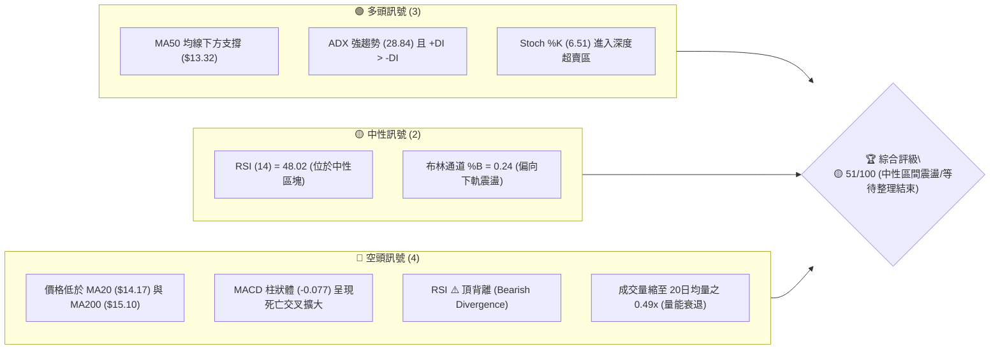
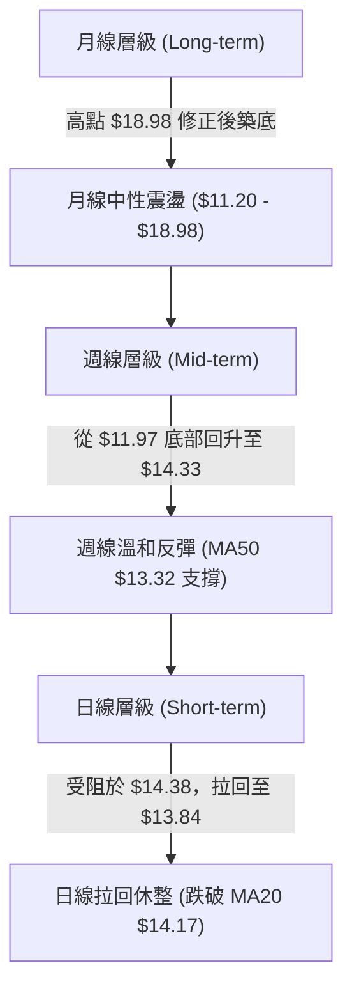
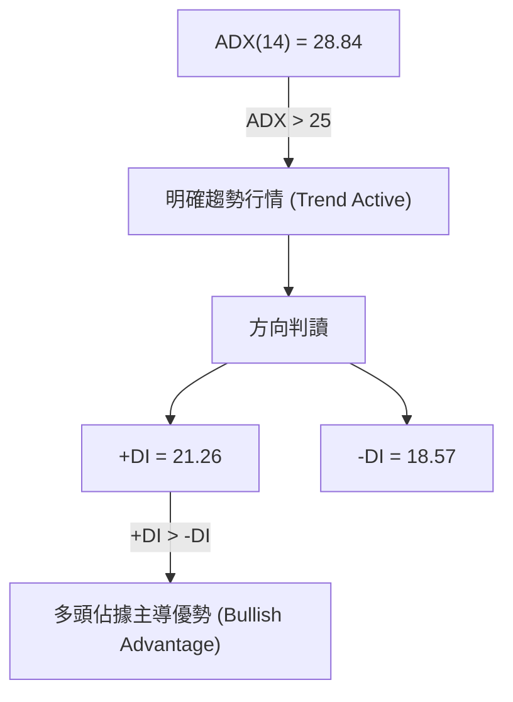
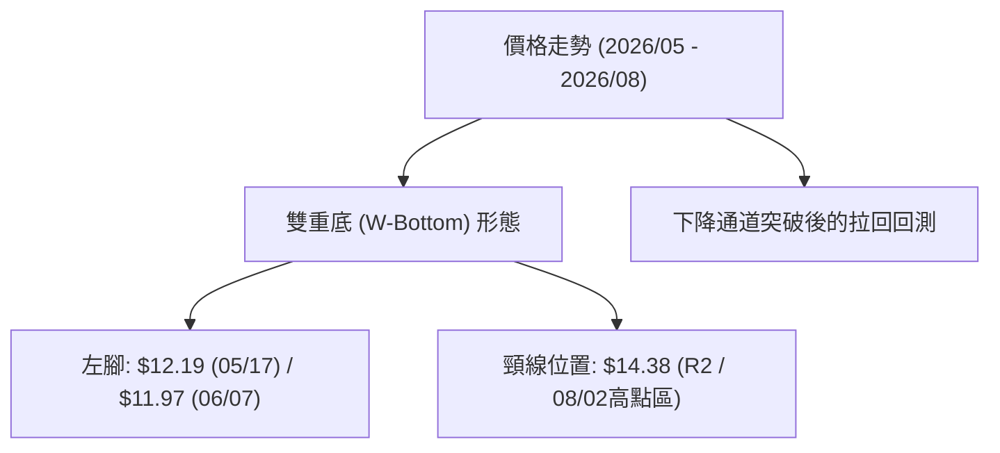
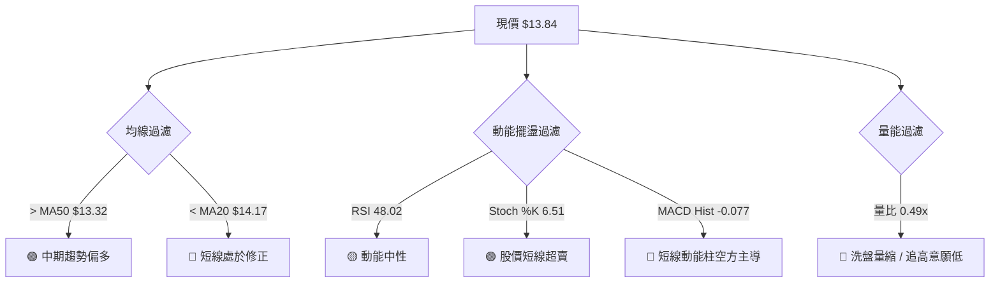
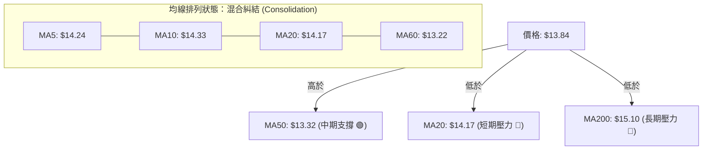
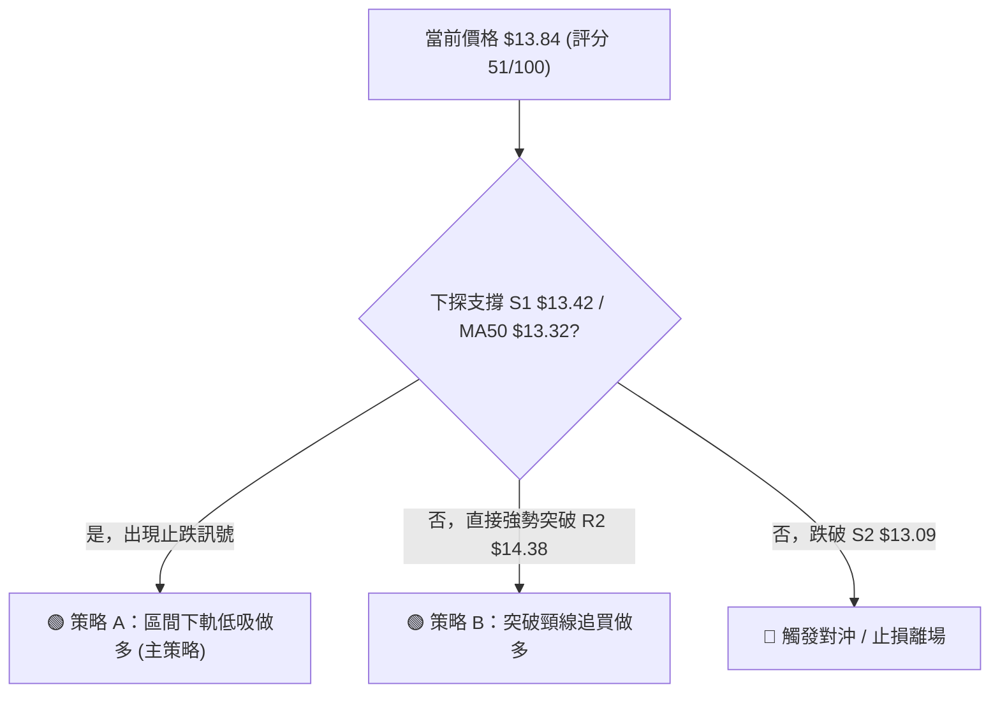
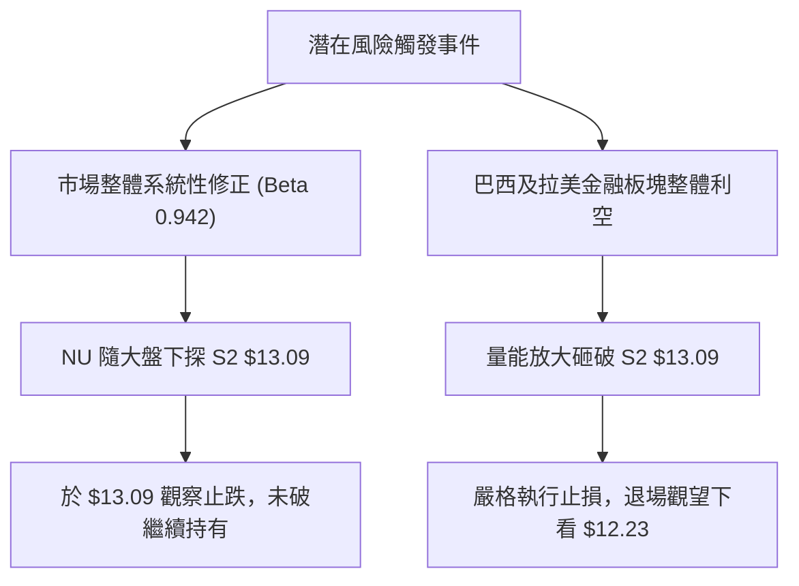

# NU 技術分析報告

> **報告日期**：2026-08-10 ｜ **語言**：繁體中文 ｜ **數據來源**：Yahoo Finance ｜ **當前價格**：$13.84

---

## 目錄

| 章節 | 內容 |
|------|------|
| [1. 技術面概覽](#1-技術面概覽) | 訊號儀表板、核心指標、評分卡 |
| [2. 趨勢分析](#2-趨勢分析) | 多時框趨勢、長中短期走勢 |
| [3. 圖表形態分析](#3-圖表形態分析) | 形態識別、K線組合、目標價 |
| [4. 支撐與阻力](#4-支撐與阻力) | 關鍵價位、斐波那契回調 |
| [5. 技術指標深度解讀](#5-技術指標深度解讀) | MA/RSI/MACD/布林/成交量 |
| [6. 動能與波動率](#6-動能與波動率) | 動能評估、ATR、Beta |
| [7. 多時框架總結](#7-多時框架總結) | 時框架評分矩陣 |
| [8. 交易策略建議](#8-交易策略建議) | 多空策略、風險報酬比 |
| [9. 風險提示與監控](#9-風險提示與監控) | 監控指標、風險場景 |

---

## 1. 技術面概覽

### 🎯 技術訊號儀表板



### 📊 核心指標速覽表

| 指標類別 | 指標名稱 | 當前數值 | 訊號 | 解讀 |
|----------|----------|----------|------|------|
| **價格** | 當前價格 | $13.84 | 🟡 中性 | 位於 52 週區間 ($11.20 - $18.98) 之 33.9% 位置 |
| **均線** | MA20 | $14.17 | 🔴 看空 | 價格位於 MA20 下方 (-2.32%)，短線承壓 |
| **均線** | MA50 | $13.32 | 🟢 看多 | 價格位於 MA50 上方 (+3.90%)，中期支撐尚存 |
| **均線** | MA200 | $15.10 | 🔴 看空 | 價格位於 MA200 下方 (-8.34%)，長期趨勢偏弱 |
| **動能** | RSI(14) | 48.02 | 🟡 中性 | 位於 30-70 中性區，但伴隨⚠️頂背離警訊 |
| **動能** | MACD | -0.077 (柱) | 🔴 看空 | MACD (0.215) 低於 Signal (0.292)，動能放緩 |
| **動能** | Stoch %K | 6.51 | 🟢 看多 | 進入極度超賣區 (%K=6.51, %D=41.85)，具反彈契機 |
| **波動** | ATR(14) | $0.48 | 🟡 中性 | 日波動率 3.44%，整體波動度維持適中水準 |

### 🏆 技術評分卡

```
╔══════════════════════════════════════════════════════════════╗
║                技術評分卡 — NU (2026-08-10)                   ║
╠══════════════════════════════════════════════════════════════╣
║ 趨勢強度      ▓▓▓▓▓▓▓▓▓▓▓▓░░░░░░░░  58/100  🟡 中性偏強 (ADX>25)║
║ 動能指標      ▓▓▓▓▓▓▓▓░░░░░░░░░░░░  42/100  🔴 動能轉弱      ║
║ 支撐穩定度    ▓▓▓▓▓▓▓▓▓▓▓▓▓░░░░░░░  65/100  🟢 13.32/13.42穩固║
║ 成交量配合    ▓▓▓▓▓▓▓░░░░░░░░░░░░░  38/100  🔴 量能顯著萎縮  ║
║ 形態完整度    ▓▓▓▓▓▓▓▓▓▓░░░░░░░░░░  50/100  🟡 築底整理階段  ║
║ 均線排列      ▓▓▓▓▓▓▓▓▓░░░░░░░░░░░  48/100  🟡 混合糾結排列  ║
╠══════════════════════════════════════════════════════════════╣
║ 綜合評分      ▓▓▓▓▓▓▓▓▓▓░░░░░░░░░░  51/100  🟡 中性觀望/區間 ║
╚══════════════════════════════════════════════════════════════╝
```

---

## 2. 趨勢分析

### 🌐 多時框趨勢分析



### 📈 長期趨勢 — 12個月走勢圖（Unicode）

```
NU 過去 12 個月收盤價走勢圖 (2025-08 至 2026-08)
價格軸 ($)
$18.00 ┤                               ● $17.75 (2026-01 頂部)
$17.00 ┤                     ● $17.39
$16.00 ┤             ● $16.01
$15.00 ┤     ● $14.80                    ● $14.98
$14.00 ┤                                         ● $14.37  ● $14.33
$13.00 ┤                                                 ● $13.13   ● $13.84 (現價)
$12.00 ┤
       └─┬───────┬───────┬───────┬───────┬───────┬───────┬───────┬───
       2025-08  09      11      2026-01  02      04      05      08
```

#### 走勢特徵分析表格

| 時間階段 | 區間價格變化 | 漲跌幅 | 走勢特徵描述 |
|----------|--------------|--------|--------------|
| **2025-08 ~ 2026-01** | $14.80 ➔ $17.75 | +19.93% | 主升段多頭波段，突破 $17.00 關卡最高摸至 $18.98 |
| **2026-01 ~ 2026-03** | $17.75 ➔ $14.37 | -19.04% | 獲利賣壓湧現，長期均線 MA200 跌破，轉入中期修正 |
| **2026-04 ~ 2026-05** | $14.48 ➔ $13.13 | -9.32%  | 探底尋求支撐，最深於 2026-06 觸及 52 週低點 $11.20 / $11.97 區域 |
| **2026-06 ~ 2026-08** | $11.97 ➔ $13.84 | +15.62% | 雙重底打底完成後展開強勁築底反彈，目前於 $13.84 進行高位消化 |

### 📊 中期趨勢（週線分析）

近 20 週數據顯示，NU 在 2026 年 5 月中旬至 6 月初於 **$11.97 - $12.19** 構築了極其堅實的中期底部，其後多頭量能爆發（2026-07-19 當週成交量達 7.62 億股），推升價格最高回升至 2026-08-02 的 **$14.33**。目前收盤於 **$13.84**，仍穩定站在週線 MA50（$13.32）與波段支撐 S1（$13.42）之上，整體中期結構保持「低點不破、震盪墊高」的反彈格局。

```
週線壓力支撐構造示意圖
$14.88 ────────────────────────────────────── 強阻力 R3
$14.38 ────────────────────────────────────── 關鍵波段高點 R2
$14.07 ────────────────────────────────────── 近期短壓 R1
$13.84 ───► [ 當前價格 ]
$13.42 ────────────────────────────────────── 短線回檔支撐 S1
$13.32 ────────────────────────────────────── MA50 均線防線
$13.09 ────────────────────────────────────── 波段關鍵強支撐 S2
```

### ⚡ 趨勢強度評估（ADX 解讀）



*   **ADX 數值分析**：ADX 為 **28.84**（> 25），顯示市場處於**具備方向性的趨勢行情**中，非純粹無方向之死寂盤整。
*   **方向指標解讀**：+DI（21.26）持續高於 -DI（18.57），證明過去兩個月的反彈動能依然發揮作用，多頭控制權並未完全喪失。
*   **多時框收斂**：雖然日線短線回檔（跌破 MA20 $14.17），但因 ADX > 25 且週線主趨勢向向上，**交易策略應優先尊重中期均線（MA50 $13.32）方向，逢拉回尋找做多機會，而非盲目追空**。

---

## 3. 圖表形態分析

### 🔍 形態識別系統



#### 形態信心度與目標價評估表

| 形態名稱 | 信心度 | 判斷依據（引用數據） | 完成度 | 形態目標價計算式 | 目標價位 |
|----------|--------|----------------------|--------|------------------|----------|
| **雙重底 (W-Bottom)** | **60%** | 兩次低點 $12.19 與 $11.97 均獲量能支撐（見 S3 $12.23 區域）；頸線設於 R2（$14.38） | 75% | 頸線 $14.38 + (頸線 $14.38 - 低點 $11.97) = $14.38 + $2.41 | **$16.79** |
| **矩形震盪箱體** | **70%** | 箱頂為 R2（$14.38），箱底為 S2（$13.09），價格於 $13.84 箱體中樞徘徊 | 90% | 箱頂 $14.38 + (箱頂 $14.38 - 箱底 $13.09) = $14.38 + $1.29 | **$15.67** |

*註：若雙重底無法突破 $14.38 頸線，則自動收斂為 $13.09 - $14.38 之箱體震盪行情。*

### 🕯️ 重要K線形態分析

| 月份/週期 | 收盤價 | K線形態 | 技術面解讀 | 訊號 |
|-----------|--------|---------|------------|------|
| **2026-06-07** | $11.97 | 長下影錘子線 | 週成交量爆出 4.73 億股，低位強烈砸盤後被主力大筆接走 | 🟢 底訊號 |
| **2026-07-19** | $13.59 | 爆量長陽巨柱 | 週成交量衝高至 7.62 億股，確立突破 $13.00 關卡 | 🟢 多頭確立 |
| **2026-08-02** | $14.33 | 高位十字星/流星 | 衝高觸及 $14.38 (R2) 後獲利結算賣壓出現，顯示高點阻力強勁 | 🔴 短線拉回 |
| **2026-08-09** | $13.84 | 中陰線下探 | 配合量縮（2.51億股），回測 MA20 與 S1 支撐區域 | 🟡 正常回檔 |

### 📉 ASCII 走勢形態示意圖

```
NU 雙重底 (W-Bottom) 與箱體運作構造
$14.88 ┤                                       [目標位 2: $15.67 / $16.79]
$14.38 ┤                     頸線 R2 ───● (08/02 衝高 $14.33 受阻)
$13.84 ┤                                 ＼  ● (現價 $13.84)
$13.42 ┤         ● (頸線回測點 S1)         ＼/
$13.09 ┤─────────┼───────────────────────────● 箱體底界 S2
$12.19 ┤  ● (左腳 05/17)
$11.97 ┤         ● (右腳 06/07)
       └────────────────────────────────────────────────────────
```

### 🎯 形態目標價計算

根據雙重底（W-Bottom）之幾何測量規則：
1. **形態高度 ($H$)** = 頸線阻力（R2 $14.38） - 形態最低點（$11.97） = **$2.41**
2. **第一階段保守目標價** = 頸線 $14.38 + (50% \times H = \$1.205) = **$15.585**（接近斐波那契 50.0% 回調位 $15.09 至 38.2% $16.01 區間）
3. **第二階段完整目標價** = 頸線 $14.38 + H (\$2.41) = **$16.79**（接近斐波那契 23.6% 回調位 $17.14）

---

## 4. 支撐與阻力

### 🗺️ 關鍵價位分布圖（Unicode）

```
NU 價位結構分布圖 (按 OHLCV 精確計算)
════════════════════════════════════════════════════════════
$18.98 ║████████████████████████████████████████║ 52週最高點 (0.0%)
$17.14 ║██████████████████████                  ║ 斐波那契 23.6%
$16.01 ║████████████████                        ║ 斐波那契 38.2%
$15.10 ║████████████                            ║ MA200 長期強壓
$14.88 ║██████████                              ║ 強阻力 R3 (78.6% 近一年波段高點)
$14.38 ║██████                                  ║ 阻力 R2 (頸線阻力 / 波段高點)
$14.07 ║████                                    ║ 近期阻力 R1 (MA20 附近)
$13.84 ╠════════════════════════════════════════╣ ◄ 當前價格 $13.84
$13.42 ║▓▓▓▓                                    ║ 近期支撐 S1 (近期波段低點)
$13.32 ║▓▓▓▓▓▓                                  ║ MA50 均線防禦位
$13.09 ║▓▓▓▓▓▓▓▓                                ║ 強支撐 S2 (箱體底界)
$12.23 ║▓▓▓▓▓▓▓▓▓▓▓▓                            ║ 極強支撐 S3 (W底左腳區域)
$11.20 ║▓▓▓▓▓▓▓▓▓▓▓▓▓▓▓▓▓▓▓▓                    ║ 52週最低點 (100.0%)
════════════════════════════════════════════════════════════
```

### 🚧 阻力位分析表

| 阻力級別 | 精確價位 | 距現價幅 | 形成原因與技術意涵 | 突破難度 | 重要性 |
|----------|----------|----------|--------------------|----------|--------|
| **阻力 R1** | **$14.07** | +1.66% | 近期日線波段高點聚類，緊鄰 MA20 ($14.17) | 🟡 中等 | 短線多空分水嶺 |
| **阻力 R2** | **$14.38** | +3.90% | 週線反彈高點、W底頸線阻力位 | 🔴 偏高 | 中期轉強關鍵鎖鑰 |
| **阻力 R3** | **$14.88** | +7.53% | 近一年波段高點密集區，靠近布林帶上軌 ($14.80) | 🔴 極高 | 多頭波段攻勢目標 |

### 🛡️ 支撐位分析表

| 支撐級別 | 精確價位 | 距現價幅 | 形成原因與技術意涵 | 守住機率 | 重要性 |
|----------|----------|----------|--------------------|----------|--------|
| **支撐 S1** | **$13.42** | -3.01% | 近一年波段低點聚類，接近 MA50 ($13.32) | 🟢 高 | 短線多頭防禦第一線 |
| **支撐 S2** | **$13.09** | -5.46% | 箱體底部界線，多次下探均獲得買盤防守 | 🟢 極高 | 中期結構不破壞界線 |
| **支撐 S3** | **$12.23** | -11.63% | 前期 W 底強烈買盤發起點，歷史成交密集區 | 🟢 極高 | 長線鐵板底部 |

### 📐 斐波那契回調位分析

依據 52 週高點 **$18.98** 至 52 週低點 **$11.20** 之完整波段進行計算：

| 斐波那契層級 | 精確價位 | 與現價 ($13.84) 之關係與技術解讀 |
|--------------|----------|----------------------------------|
| **0.0%** (52W High) | **$18.98** | 歷史極限高點阻力 |
| **23.6%** | **$17.14** | 多頭強勢復甦目標位 |
| **38.2%** | **$16.01** | 中期反彈黃金分割阻力 |
| **50.0%** | **$15.09** | 多空中性回調位（與 MA200 $15.10 完美重合，具極強解套賣壓） |
| **61.8%** | **$14.17** | **關鍵黃金分割位**（與 MA20 $14.17 完美重疊！目前現價壓制於此下方） |
| **78.6%** | **$12.86** | 深調強支撐位（位於 S2 $13.09 下方） |
| **100.0%** (52W Low) | **$11.20** | 絕對底部 |

*   **當前位置解讀**：現價 **$13.84** 精確落於 **61.8% ($14.17)** 與 **78.6% ($12.86)** 回調位之間。61.8% ($14.17) 同時是 MA20 所在地，成為當前短線反彈的最直接卡口；若能收復 $14.17，價格將向上挑戰 50.0% ($15.09)。

---

## 5. 技術指標深度解讀

### 🎛️ 指標訊號總覽



### 📈 移動平均線排列分析



*   **短中長期 MA 數據對照**：
    *   **短線 MA**：MA5 ($14.24)、MA10 ($14.33)、MA20 ($14.17)。價格目前全面低於短均線，短線呈現回檔向下整理。
    *   **中線 MA**：MA50 ($13.32)、MA60 ($13.22)。價格穩穩站於其上，中線支撐性強。
    *   **長線 MA**：MA120 ($13.99)、MA200 ($15.10)、MA240 ($15.14)。長均線位於上方呈下壓姿態。

### 📉 RSI(14) 分析

*   **RSI 當前數值**：**48.02**
    ```
    RSI(14) 強度：█████████░░░░░░░░░░░ 48.02% (中性區間)
    [0 極度超賣 --- 30 超賣區 --- 50 中性線 --- 70 超買區 --- 100 極度超買]
                                   ▲ (當前 48.02)
    ```
*   **超買超賣與背離判讀**：
    *   RSI 於 2026-07-05 曾高達 **79.0**（嚴重超買），隨後價格雖於 08-02 再度刷出 $14.33 高點，但 RSI 僅回升至 **58.5**，呈現典型的 **⚠️ 頂背離 (Bearish Divergence)**。
    *   頂背離訊號發揮作用，導致了最近一週價格由 $14.33 回落至 $13.84。目前 RSI 回落至 48.02 中性線附近，背離壓力已獲得部分釋放。

### 📊 MACD(12/26/9) 訊號解讀

*   **DIF (MACD 線)**：`0.215`
*   **DEA (Signal 線)**：`0.292`
*   **MACD 柱狀體 (Histogram)**：`-0.077` (🔴 看空)

```
MACD 柱狀體走勢趨勢 (近期數據)
2026-06-28: +0.137  ███████
2026-07-05: +0.178  █████████
2026-07-12: +0.116  ██████
2026-07-19: +0.034  ██
2026-07-26: +0.037  ██
2026-08-02: +0.001  ░
2026-08-09: -0.077  ▓▓▓ (死亡交叉，空頭柱狀體擴大)
```

*   **解讀**：MACD 線於零軸上方死叉 Signal 線，柱狀體轉負 (-0.077)。這證實短線多頭推進拉回，正在進行指標修正。由於 DIF（0.215）仍維持在零軸之上，此死叉屬於「多頭市場中的中繼回檔」，而非全面崩盤。

### 📦 布林通道分析

```
布林通道結構與現價位置 (ASCII 示意圖)
$14.80 ─────────────── 上軌 (Upper Band)
        │
$14.17 ─────────────── 中軌 (MA20)
        │  ● $13.84 (現價落於中軌與下軌之間, %B = 0.24)
$13.54 ─────────────── 下軌 (Lower Band)
```

*   **通道位置 (%B)**：%B 為 **0.24**，顯示價格已經貼近布林下軌（$13.54）。
*   **帶寬與策略意涵**：通道未出現劇烈張口擴張，屬於標準的「管道內震盪」。當 %B 接近 0.20 且 Stoch %K（6.51）極度超賣時，**下軌 $13.54 至 S1 $13.42 區域具備極強之技術性反彈支撐**。

### 💹 成交量分析（量價配合度）

*   **最新成交量**：47,648,100 股
*   **20日均量**：98,013,210 股（**量比：0.49x**）
*   **OBV 趨勢**：OBV < MA（量能低於均線）
*   **量價關係解讀**：價格從 $14.33 回落至 $13.84 過程中，成交量驟降至 20 日均量的 49%，呈現顯著的**「價跌量縮」**特徵。這表明市場並未出現恐慌性拋盤，賣壓主要來自高位獲利了結與買盤觀望，屬於健康洗盤。

---

## 6. 動能與波動率

### ⚡ 動能評估四象限

| 象限區劃 | 動能強度 (Momentum) | 波動率 (Volatility) |NU 當前位置評估 | 交易策略意涵 |
|----------|---------------------|---------------------|-----------------|--------------|
| **Q1 (右上)** | 強 (RSI>50, MACD>0) | 高 (ATR%>4%) | - | 追價強勢股（風險高） |
| **Q2 (左上)** | 弱 (RSI<50, MACD<0) | 低 (ATR%<3.5%) | **✓ NU 現狀區域** | **回檔沉澱區：尋找低吸買點** |
| **Q3 (左下)** | 弱 (RSI<30) | 高 (ATR%>4%) | - | 恐慌殺盤區（觀望） |
| **Q4 (右下)** | 強 (RSI>60) | 低 (ATR%<3.5%) | - | 穩健主升段（持股） |

### 📊 ATR 波動率分析

*   **ATR(14) 數值**：**$0.48**
*   **ATR 佔比**：**3.44%**
*   **止損與區間設定依據**：
    *   **每日正常波動範圍**：$13.84 \pm \$0.48 \rightarrow [\$13.36, \$14.32]$。
    *   **風控止損距離**：採用 $1.5 \times \text{ATR} = \$0.72$ 的止損空間，可有效避免日常噪訊引發的誤觸止損。

### 📐 Beta 與市場相關性

*   **Beta 係數**：**0.942**
*   **市場相關性解讀**：Beta 接近 1.0（0.942），代表 NU 的系統性風險與美股大盤（S&P 500 / 納斯達克）高度同步。在大盤未出現系統性崩盤前，NU 個股將遵循自身的技術構造進行區間運轉。

---

## 7. 多時框架總結

### 📋 時框架評分表

| 時框架 | 趨勢方向 | 動能指標 | 均線排列 | 形態結構 | 綜合評分 | 操作建議 |
|--------|----------|----------|----------|----------|----------|----------|
| **月線 (Long)** | 🟡 中性震盪 | 🟢 穩定 | 🟡 混合 | 🟢 底部形成 | **62/100** | 偏多思考，長線逢低佈局 |
| **週線 (Mid)** | 🟢 溫和反彈 | 🟡 中性 | 🟢 站穩MA50| 🟢 W底完成 | **58/100** | 逢拉回支撐點做多 |
| **日線 (Short)** | 🔴 短線修正 | 🔴 死叉 | 🔴 跌破MA20| 🟡 布林下軌 | **42/100** | 勿追空，等待打底止跌 |

### 🔲 綜合訊號矩陣

```
時框架訊號收斂矩陣
┌──────────────┬──────────────┬──────────────┬──────────────┐
│  時框架/維度 │   趨勢 (ADX) │   動能 (MACD)│  均線/位置   │
├──────────────┼──────────────┼──────────────┼──────────────┤
│  長期 (月線) │  🟢 偏多     │  🟢 零軸上方 │  🟡 震盪區間 │
│  中期 (週線) │  🟢 28.84強  │  🟡 柱狀微縮 │  🟢 高於MA50 │
│  短期 (日線) │  🔴 跌破短壓 │  🔴 死叉中   │  🔴 低於MA20 │
└──────────────┴──────────────┴──────────────┴──────────────┘
```

### ⚖️ 多時框收斂結論

依據多時框收斂規則：當前 ADX 為 **28.84 (> 25)**，市場處於**強趨勢行情**模式。
因此，**應以中期（週線及 MA50 $13.32）之多頭方向為主導**，日線層級的短線回檔（跌破 MA20 $14.17、MACD 死叉）應視為多頭趨勢中的**「低吸修正期」**，而非轉空崩跌。最終方向性結論定調為：**🟡 中性偏多（區間下軌尋求支撐反彈）**。

---

## 8. 交易策略建議

### 🗺️ 策略決策流程圖



### 🧭 策略路由

**當前主策略方向 = 🟢 區間低吸做多 / 回檔布局（技術評分 51/100，中期趨勢偏多）**

基於 ADX > 25 且中期站穩 MA50（$13.32），短線回檔至布林下軌（$13.54）與波段支撐 S1（$13.42）提供了極佳的風險報酬比進場點。

### 🎯 價格情境階梯 (Price Scenarios)

| 觸發條件 | 下一目標價 | 後續延伸目標 | 情境含義與技術解讀 |
|----------|------------|--------------|--------------------|
| **突破 R2 $14.38** | R3 $14.88 | Fib 38.2% $16.01 | W底頸線成功突破，開啟新一輪主升波段 |
| **突破 R1 $14.07** | R2 $14.38 | R3 $14.88 | 收復 MA20，短線修正結束，多頭重掌兵權 |
| **守住 S1 $13.42** | R1 $14.07 | R2 $14.38 | 於 MA50 與 S1 獲得支撐，維持箱體內震盪 |
| **跌破 S2 $13.09** | S3 $12.23 | 52W Low $11.20 | 箱體破底，中期反彈結構失效，轉入偏空探底 |

### 📊 情境機率分佈

```
情境機率分佈圖
1. 區間震盪後反彈上行 (60%) ▓▓▓▓▓▓▓▓▓▓▓▓▓▓▓▓▓▓▓▓▓▓▓▓▓▓▓▓▓▓
2. 直接突破 R2 向上 (25%)   ▓▓▓▓▓▓▓▓▓▓▓░░░░░░░░░░░░░░░░░
3. 跌破 S2 深幅拉回 (15%)   ▓▓▓▓▓░░░░░░░░░░░░░░░░░░░░░░░
```

| 情境劇本 | 機率 | 主要技術依據 |
|----------|------|--------------|
| **區間震盪後反彈** | **60%** | ADX>25 且 +DI>-DI，Stoch %K (6.51) 超賣，S1 ($13.42) 與 MA50 ($13.32) 疊加強支撐 |
| **強勢直接突破** | **25%** | 外圍市場大漲帶動，或量能瞬間放大超越 20 日均量 |
| **跌破向下深調** | **15%** | MACD 死叉擴大，若量能異常放大砸破 $13.09 箱底 |

### 🟢 主策略詳情

| 策略要素 | 策略 A：S1/MA50 支撐低吸做多 (首選) | 策略 B：突破頸線 R2 追買做多 (次選) |
|----------|-------------------------------------|-------------------------------------|
| **進場條件** | 價格回檔至 $13.42 - $13.54 區間，日線見止跌K線 | 日線收盤價強勢實體突破 R2 $14.38，成交量>1億股 |
| **進場價格** | **$13.48** (S1 與下軌間之中點) | **$14.42** (突破 R2 後小幅確認) |
| **目標價 T1** | **$14.07** (R1 阻力位) | **$14.88** (R3 阻力位) |
| **目標價 T2** | **$14.38** (R2 阻力位) | **$16.01** (斐波那契 38.2% 回調位) |
| **止損價格** | **$13.00** (精確設於 S2 $13.09 下方) | **$14.00** (設於 R1 $14.07 轉支撐下方) |
| **風險報酬比**| **1 : 1.88** (至T2計算: 風險$0.48 / 獲利$0.90) | **1 : 3.79** (至T2計算: 風險$0.42 / 獲利$1.59) |
| **成功機率** | **65%** | **55%** |
| **建議倉位** | **15% - 20%** | **10% - 15%** |

### 🔴 反向風險觸發點（對沖提示）

*   **觸發條件**：若日線收盤價跌破 **S2 ($13.09)**，代表多頭結構遭破壞。
*   **應對動作**：多頭部位全面止損離場，短線可輕倉對沖做空，目標下看 **S3 ($12.23)**。

### ⭐ 整體訊號強度評星

```
做多訊號強度：★★★☆☆  (3.5/5星 - 中期趨勢良好，等待短線止跌)
做空訊號強度：★★☆☆☆  (2.0/5星 - 受限於 MA50 與 S1 密集支撐)
整體可信度：  ★★██☆  (4.0/5星 - 多時框數據與關鍵價位高度重合)
```

---

## 9. 風險提示與監控

### ✅ 關鍵監控指標 Checklist

```
╔══════════════════════════════════════════════════════════════╗
║                   每日交易風控監控清單                        ║
╠══════════════════════════════════════════════════════════════╣
║ [ ] 價格防線：是否跌破 S1 ($13.42) 或 MA50 ($13.32)          ║
║ [ ] 壓力突破：是否放量突破 R1 ($14.07) 及 MA20 ($14.17)      ║
║ [ ] 動能修復：Stoch %K 是否於超賣區 (<20) 出現黃金交叉       ║
║ [ ] 指標轉強：MACD 柱狀體是否由負轉趨平微升 (>-0.077)        ║
║ [ ] 成交量能：回升時成交量是否大於 20日均量 (9,800萬股)       ║
╚══════════════════════════════════════════════════════════════╝
```

### ⚠️ 風險場景分析



### 🛡️ 風險管理重要提醒

1.  **嚴格執行止損紀律**：目前價格離關鍵支撐 S1 ($13.42) 及 S2 ($13.09) 極近，切勿在跌破 $13.00 後硬扛單。
2.  **避免追高**：在價格未有效突破 R1 ($14.07) 前，短線反彈皆可能遭遇 MA20 ($14.17) 壓制，嚴禁在 $14.00 - $14.17 區域追漲。
3.  **資金管理建議**：單一股票總倉位不宜超過總投資組合之 **20%**，單次交易風險控制在總資金的 **1% - 2%** 範圍內。

---

## 📋 報告總結

```
╔══════════════════════════════════════════════════════════════╗
║                   NU 技術分析報告總結                         ║
════════════════════════════════════════════════════════════════
 報告日期：2026-08-10
 當前價格：$13.84
 分析評級：🟡 51/100 (中性偏多 / 區間低吸整理)

 關鍵結論：
 ├─ 長期趨勢：🟡 中性震盪 ($11.20 - $18.98 大箱體)
 ├─ 中期趨勢：🟢 溫和反彈 (站穩 MA50 $13.32，ADX 28.84 趨勢偏多)
 ├─ 短期趨勢：🔴 修正拉回 (受阻於 R2 $14.38，跌破 MA20 $14.17)
 ├─ 關鍵支撐：S1 $13.42 / MA50 $13.32 / S2 $13.09
 ├─ 關鍵阻力：R1 $14.07 / MA20 $14.17 / R2 $14.38
 └─ 分析師目標：$17.98 (買入共識, 22家機構)

 最優策略組合：
 1. 🥇 最佳機會：等待價格拉回至 $13.42 - $13.54 (S1/布林下軌) 佈局做多
                 (目標價 $14.07 / $14.38，止損位 $13.00)
 2. 🥈 次選機會：若強勢突破 R2 $14.38，順勢追買做多
                 (目標價 $14.88 / $16.01，止損位 $14.00)
 3. 🥉 保守選擇：等待 MACD 柱狀體轉正且收復 MA20 ($14.17) 後再行入場
╚══════════════════════════════════════════════════════════════╝
```

---

> ⚠️ **免責聲明**：本報告為 AI 自動生成之技術分析，所有數據及估算均基於提供的歷史價格資訊與市場數據。本報告**僅供研究與學術參考**，**不構成任何投資建議或買賣邀約**。投資有風險，入市需謹慎，請投資人自行評估風險並承擔交易結果。

---

*報告生成時間：2026-08-10 ｜ 數據來源：Yahoo Finance ｜ 分析框架：多時框技術分析*