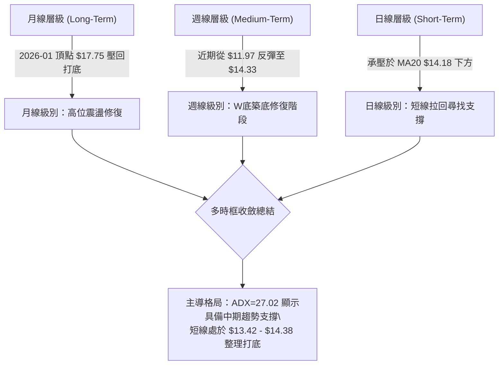
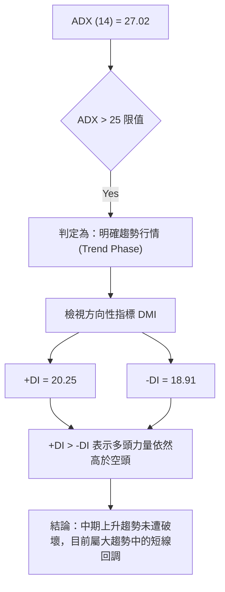
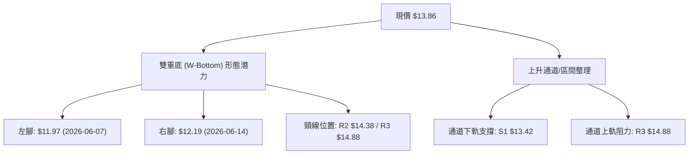
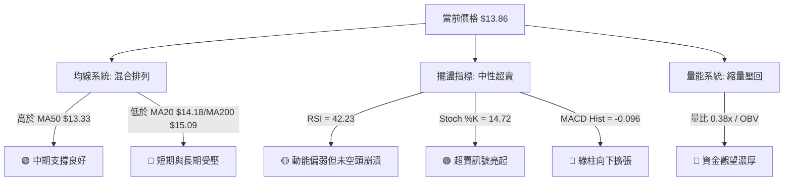
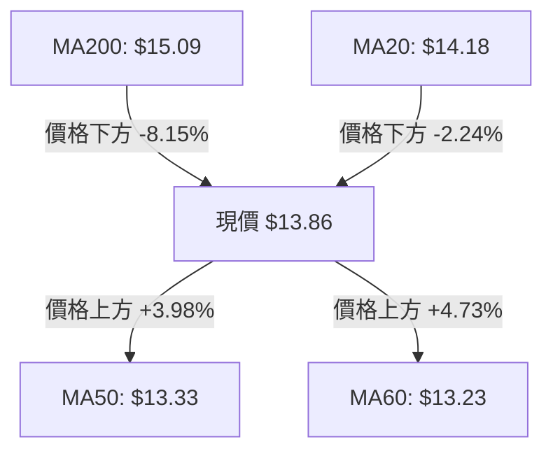
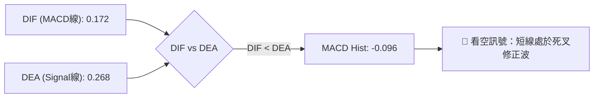
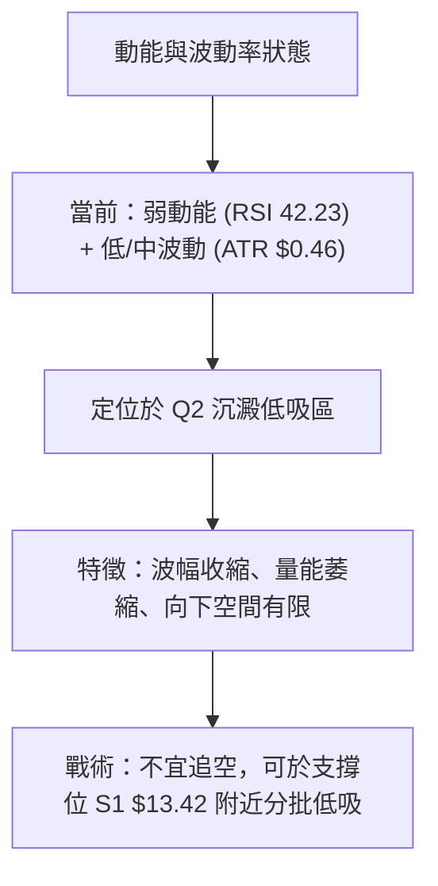
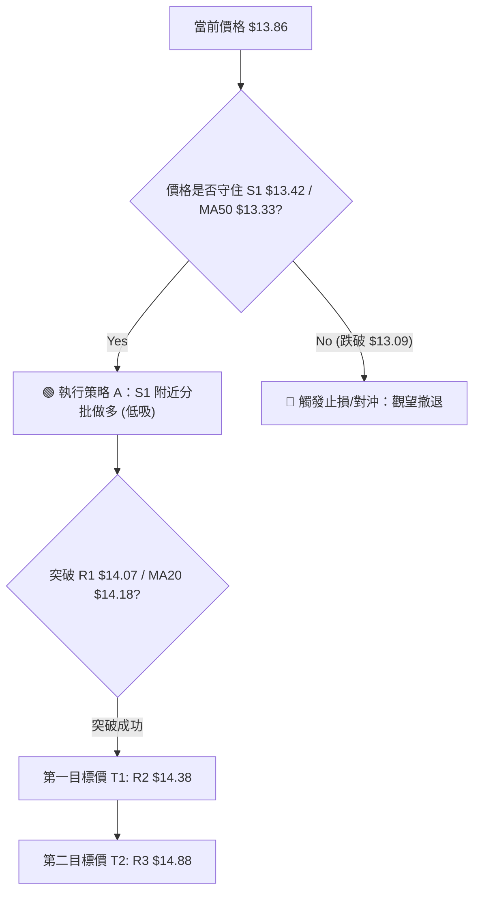
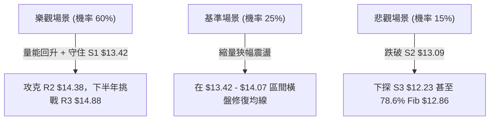

# NU 技術分析報告

> **報告日期**：2026-08-11 ｜ **語言**：繁體中文 ｜ **數據來源**：Yahoo Finance ｜ **當前價格**：$13.86

---

## 目錄

| 章節 | 內容 |
|------|------|
| [1. 技術面概覽](#1-技術面概覽) | 訊號儀表板、核心指標、評分卡 |
| [2. 趨勢分析](#2-趨勢分析) | 多時框趨勢、長中短期走勢 |
| [3. 圖表形態分析](#3-圖表形態分析) | 形態識別、K線組合、目標價 |
| [4. 支撐與阻力](#4-支撐與阻力) | 關鍵價位、斐波那契回調 |
| [5. 技術指標深度解讀](#5-技術指標深度解讀) | MA/RSI/MACD/布林/成交量 |
| [6. 動能與波動率](#6-動能與波動率) | 動能評估、ATR、Beta |
| [7. 多時框架總結](#7-多時框架總結) | 時框架評分矩陣 |
| [8. 交易策略建議](#8-交易策略建議) | 多空策略、風險報酬比 |
| [9. 風險提示與監控](#9-風險提示與監控) | 監控指標、風險場景 |

---

## 1. 技術面概覽

### 🎯 技術訊號儀表板

```mermaid
graph LR
    subgraph BULL ["🟢 多頭訊號 (4)"]
        B1["ADX(14) = 27.02 趨勢明確"]
        B2["+DI(20.25) > -DI(18.91) 多頭主導"]
        B3["價格在 MA50($13.33) 與 MA60($13.23) 之上"]
        B4["Stoch %K(14.72) 超賣區潛在反彈"]
    end
    subgraph NEUTRAL ["🟡 中性訊號 (2)"]
        N1["RSI(14) = 42.23 中性偏弱"]
        N2["布林通道 %B = 0.24 位於下軌區間"]
    end
    subgraph BEAR ["🔴 空頭訊號 (4)"]
        D1["價格處於 MA20($14.18) 與 MA200($15.09) 下方"]
        D2["MACD Hist = -0.096 柱狀體看空"]
        D3["20日量比 0.38x 買盤萎縮"]
        D4["OBV < MA 量能結構疲弱"]
    end
    BULL --> VERDICT{"🏆 綜合評級\\n中性偏空震盪打底 (48/100)"}
    NEUTRAL --> VERDICT
    BEAR --> VERDICT
```



### 📊 核心指標速覽表

| 指標類別 | 指標名稱 | 當前數值 | 訊號 | 解讀 |
|----------|----------|----------|------|------|
| **價格** | 當前價格 | $13.86 | 🟡 中性 | 位於 52 週高低區間 34.2% 位置 |
| **均線** | MA20 | $14.18 | 🔴 看空 | 價格落在 MA20 下方 (-2.24%) |
| **均線** | MA50 | $13.33 | 🟢 看多 | 價格落在 MA50 上方 (+3.98%) |
| **均線** | MA200 | $15.09 | 🔴 看空 | 價格落在 MA200 下方 (-8.15%) |
| **動能** | RSI(14) | 42.23 | 🟡 中性 | 進入偏弱區間，無明顯背離 |
| **動能** | MACD | 0.172 / Hist -0.096 | 🔴 看空 | MACD 快線下穿慢線，柱狀圖呈負向擴張 |
| **動能** | Stoch %K/%D | 14.72 / 21.46 | 🟢 看多 | 進入嚴重超賣區，短線隨時有跌深反彈需求 |
| **趨勢** | ADX(14) / DMI | 27.02 (+DI 20.25 / -DI 18.91) | 🟢 看多 | ADX > 25 具趨勢強度，+DI 高於 -DI 多頭仍占優 |
| **通道** | 布林通道 | 上軌 $14.78 / 下軌 $13.57 | 🟡 中性 | %B 為 0.24，向布林下軌尋求支撐 |
| **波動** | ATR(14) | $0.46 (3.30%) | 🟡 中性 | 每日波幅適中，有利於風險控制 |
| **成交量**| 最新量比 | 0.38x (35.79M / 93.15M) | 🔴 看空 | 回調過程中急遽縮量，顯示市場追價意願不足 |

### 🏆 技術評分卡

```
╔══════════════════════════════════════════════════════════════════╗
║                   技術評分卡 — NU (2026-08-11)                   ║
╠══════════════════════════════════════════════════════════════════╣
║ 趨勢強度      █████████████░░░░░░░  65/100  🟢 強趨勢 (ADX>25)   ║
║ 動能指標      ████████░░░░░░░░░░░░  40/100  🔴 MACD看空/RSI偏弱  ║
║ 支撐穩定度    ██████████████░░░░░░  70/100  🟢 守住 S1 $13.42    ║
║ 成交量配合    ██████░░░░░░░░░░░░░░  30/100  🔴 量能萎縮/OBV偏弱  ║
║ 形態完整度    ██████████░░░░░░░░░░  50/100  🟡 寬幅區間震盪構造  ║
║ 均線排列      ████████░░░░░░░░░░░░  40/100  🔴 夾在MA50與MA200間 ║
╠══════════════════════════════════════════════════════════════════╣
║ 綜合評分      █████████░░░░░░░░░░░  48/100  🟡 觀望 / 區間操作   ║
╚══════════════════════════════════════════════════════════════════╝
```

---

## 2. 趨勢分析

### 🌐 多時框趨勢分析



### 📈 長期趨勢 — 24個月走勢圖（Unicode）

```
NU 月線走勢圖（2024-08 至 2026-08）
價格 ($)
18.00 ┤                                 ●(2026-01 $17.75)
17.00 ┤                             ●
16.00 ┤                         ●       ●
15.00 ┤ ●           ●                               ●
14.00 ┤     ●               ●                           ●(現價 $13.86)
13.00 ┤         ●       ●               ●
12.00 ┤             ●                               ●
11.00 ┤                 ●
10.00 ┤                     ●(2025-03 $10.24)
      └─┬───┬───┬───┬───┬───┬───┬───┬───┬───┬───┬───┬───┬───► 月份
       24-08  11  25-01 03  05  07  09  11  26-01 03  05  07 08
```

#### 走勢特徵分析表格

| 階段 | 時間區間 | 價格變動 | 核心走勢特徵 | 技術面意涵 |
|------|----------|----------|--------------|------------|
| 階段一 | 2024-08 ~ 2025-03 | $14.97 → $10.24 | 回落探底，回撤幅度達 -31.6% | 完成前期籌碼清理，於 $10.24 築起長期底部 |
| 階段二 | 2025-03 ~ 2026-01 | $10.24 → $17.75 | 震盪主升段，漲幅達 +73.3% | 多頭強勢主導，突破多重均線，創下波段高點 |
| 階段三 | 2026-01 ~ 2026-05 | $17.75 → $13.13 | 獲利賣壓湧現，修正至 MA50 附近 | 估值修復與技術面指標過熱校正 |
| 階段四 | 2026-05 ~ 2026-08 | $13.13 → $13.86 | 於 $11.97 - $14.33 區間打底反彈 | 進入築底打底階段，等待動能重新聚集 |

### 📊 中期趨勢（週線分析）

從近 20 週收盤走勢可見，NU 在 2026 年 6 月初跌至低點 $11.97（週成交量達 4.73 億股）後出現強烈止跌買盤，隨後週線展開升浪，於 2026-08-02 週收盤攻至 $14.33。

```
週線支撐與阻力壓力構型示意圖
$14.88 ┼───────────────────────────────── [R3 強阻力區]
$14.38 ┼───────────────● (08-02高點 $14.33)─── [R2 波段阻力]
$14.07 ┼───────────●───────────────────── [R1 短線阻力]
$13.86 ┼─────────★ (當前現價 $13.86)─────────
$13.42 ┼───────────────────────────────── [S1 短線支撐]
$13.09 ┼───────────────────────────────── [S2 強支撐區]
```

### ⚡ 趨勢強度評估（ADX 解讀）



#### ADX 與 DMI 綜合對照表

| 指標項 | 當前數值 | 臨界標準 | 狀態評估 | 交易策略指導 |
|--------|----------|----------|----------|--------------|
| **ADX(14)** | 27.02 | > 25.0 | 🟢 具備顯著趨勢強度 | 順勢操作，逢拉回支撐位尋找做多點 |
| **+DI** | 20.25 | - | 🟢 多頭控制力偏優 | 買方仍掌握中期主導權 |
| **-DI** | 18.91 | - | 🟡 空頭力道稍遜 | 賣方壓制力有限，尚未形成下行趨勢 |
| **DI 差值**| +1.34 | > 0 | 🟢 正向淨動能 | 多頭防線未破 |

---

## 3. 圖表形態分析

### 🔍 形態識別系統



#### 形態識別信心度評估表

| 形態名稱 | 信心度 | 判斷依據（引用數據） | 完成度 | 目標價（附計算式） |
|----------|--------|----------------------|--------|--------------------|
| **週線雙底 (W-Bottom)** | 65% | 第一腳 $11.97 (06-07)、第二腳 $12.19 (06-14) 均獲巨量止跌；頸線設於 R2 $14.38。 | 75% | 頸線 $14.38 + (頸線 $14.38 - 低點 $11.97) = **$16.79**（註：未列於關鍵價位表，此為形態推算值） |
| **日線布林收窄整理** | 80% | 布林上軌 $14.78 / 下軌 $13.57 縮口，價格位於 $13.86。 | 85% | 向上突破看 R3 $14.88；向下跌破看 S2 $13.09。 |

### 🕯️ 重要K線形態分析

| 日期 / 週期 | 收盤價 | K線形態 | 技術解讀 | 訊號強度 |
|-------------|--------|---------|----------|----------|
| 2026-06-07 週 | $11.97 | 巨量長下影錘子線 | 成交量達 4.73 億股，強烈跌深反彈止跌訊號 | 🟢🟢🟢 |
| 2026-07-19 週 | $13.59 | 爆量震盪吸收線 | 成交量高達 7.62 億股，籌碼高檔充分換手 | 🟢🟢 |
| 2026-08-02 週 | $14.33 | 受阻中陽線 | 試圖挑戰 R2 $14.38 阻力，留有上影線 | 🟡 |
| 2026-08-09 週 | $13.84 | 縮量陰線壓回 | 價格拉回至 MA20 $14.18 下方，但成交量萎縮至 2.51 億股 | 🟡 |
| 近日（即時）| $13.86 | 十字微陽線 | 於 S1 $13.42 上方狹幅震盪，等待方向突破 | 🟡 |

### 📉 ASCII 走勢形態示意圖

```
        NU 雙底 (W-Bottom) 構造與突破路徑示意圖
        
  阻力位 R3 $14.88 ───────────────────────────────────────┐
  阻力位 R2 $14.38 ───────────● (08-02 觸及 $14.33)──────┤ (頸線區)
                              /   \                     │
  當前現價 $13.86 ───────────/─────● (目前位置 $13.86)───┤
                            /                           │
  支撐位 S1 $13.42 ────────/                            │
                          /                             │
  最低點區域 $12.00 ──●─────                             │ (雙底構型)
                    左腳 $11.97    右腳 $12.19          │
                    (06-07)        (06-14)              ┘
```

### 🎯 形態目標價計算

1. **雙底形態量測目標價**：
   - 頸線位置：R2 $14.38
   - 形態底部最低價：$11.97
   - 形態垂直高度：$14.38 - $11.97 = $2.41
   - 理論目標價計算：$14.38 + $2.41 = **$16.79**（由形態高度推算，非關鍵價位表列值）

2. **區間突破目標價**：
   - 若守穩 S1 $13.42 並向上突破 R1 $14.07，首要技術目標直接指向上方阻力位 **R2 $14.38**，進一步目標為 **R3 $14.88**。

---

## 4. 支撐與阻力

### 🗺️ 關鍵價位分布圖（Unicode）

```
NU 價位結構分布圖 (截至 2026-08-11)
════════════════════════════════════════════════════════════
$18.98 ║████████████████████████████████████████║ 52W High / 0.0% Fib
$17.14 ║████████████████████████████            ║ 23.6% Fib
$16.01 ║██████████████████                      ║ 38.2% Fib
$15.09 ║████████████████████████████████        ║ MA200 / 50.0% Fib
$14.88 ║████████████████████████                ║ 阻力位 R3 (+7.38%)
$14.38 ║████████████████                        ║ 阻力位 R2 (+3.75%)
$14.18 ║▓▓▓▓▓▓▓▓▓▓▓▓▓▓▓▓                        ║ MA20 / BB中軌
$14.07 ║██████████                              ║ 阻力位 R1 (+1.52%)
$13.86 ╠════════════════════════════════════════╣ ◄ 當前價格 $13.86
$13.57 ║░░░░░░░░░░░░░░░░                        ║ BB下軌
$13.42 ║▓▓▓▓▓▓▓▓▓▓▓▓▓▓▓▓▓▓▓▓                    ║ 支撐位 S1 (-3.15%)
$13.33 ║▓▓▓▓▓▓▓▓▓▓▓▓▓▓▓▓                        ║ MA50 均線支撐
$13.09 ║████████████████████████████            ║ 支撐位 S2 (-5.59%)
$12.86 ║██████████████████                      ║ 78.6% Fib
$12.23 ║████████████████████████████████████    ║ 支撐位 S3 (-11.76%)
$11.20 ║████████████████████████████████████████║ 52W Low / 100.0% Fib
════════════════════════════════════════════════════════════
```

### 🚧 阻力位分析表

| 阻力級別 | 精確價位 | 與現價距離 | 形成原因（波段高點聚類 / 均線） | 突破難度 | 重要性 |
|----------|----------|------------|----------------------------------|----------|--------|
| **R1** | **$14.07** | +1.52% | 短線波段高點聚類、接近 MA5 ($14.13) | 🟡 中等 | 短線多空強弱分水嶺 |
| **R2** | **$14.38** | +3.75% | 近一年高點聚類、2026-08-02 週高點附近 | 🔴 較高 | 中線關鍵頸線壓力位 |
| **R3** | **$14.88** | +7.38% | 密集波段反彈高點、接近布林上軌 ($14.78) | 🔴 高 | 強阻力，突破將開啟大波段 |

### 🛡️ 支撐位分析表

| 支撐級別 | 精確價位 | 與現價距離 | 形成原因（波段低點聚類 / 均線） | 守住機率 | 重要性 |
|----------|----------|------------|----------------------------------|----------|--------|
| **S1** | **$13.42** | -3.15% | 近一年波段低點聚類、接近 MA50 ($13.33) | 🟢 80% | 短線第一道關鍵防線 |
| **S2** | **$13.09** | -5.59% | 強波段低點聚類、近78.6% Fib ($12.86) | 🟢 85% | 中期關鍵結構支撐位 |
| **S3** | **$12.23** | -11.76%| 2026-05/06 密集止跌波段低點聚類 | 🟢 90% | 長期強支撐，跌破趨勢轉空 |

### 📐 斐波那契回調位分析

基於 52 週高低區間（高點 **$18.98**，低點 **$11.20**）計算之斐波那契回調位：

- **0.0% (52W High)**: **$18.98**
- **23.6%**: **$17.14**
- **38.2%**: **$16.01**
- **50.0%**: **$15.09** (與 MA200 $15.09 精確重合，形成長期強壓力)
- **61.8%**: **$14.17** (與 MA20 $14.18 精確重合，當前短期分水嶺)
- **78.6%**: **$12.86**
- **100.0% (52W Low)**: **$11.20**

**技術解讀**：
當前價格 **$13.86** 恰好落在 **61.8% ($14.17)** 與 **78.6% ($12.86)** 回調位之間。61.8% 的 $14.17 與 MA20 ($14.18) 精確交會，構成現價上方的即時壓制；而下方的 $12.86 則位於 S2 ($13.09) 下方，提供堅實的中長期退路支撐。

---

## 5. 技術指標深度解讀

### 🎛️ 指標訊號總覽



### 📈 移動平均線排列分析



#### 移動平均線數據對照表

| 均線名稱 | 當前價位 | 與現價偏離度 | 均線走勢 | 短期/中期意涵 |
|----------|----------|--------------|----------|----------------|
| **MA 5** | $14.13 | -1.88% | ▼ 下行 | 極短線面臨下壓 |
| **MA 10** | $14.26 | -2.81% | ▼ 下行 | 短線扣高壓制 |
| **MA 20** | $14.18 | -2.24% | ▼ 下行 | 月線反壓，突破才能轉強 |
| **MA 50** | $13.33 | +3.98% | ▲ 上升 | 季線支撐，中期多頭堡壘 |
| **MA 60** | $13.23 | +4.73% | ▲ 上升 | 季線下方雙重支撐 |
| **MA 120**| $13.96 | -0.72% | ▼ 微跌 | 半年線交會，貼近現價 |
| **MA 200**| $15.09 | -8.44% | ▼ 下行 | 長期年線壓制，多頭長遠目標 |

### 📉 RSI(14) 分析

```
RSI(14) 當前數值: 42.23
0 ─────────── 30 ──────────────── 50 ───────────────── 70 ────────── 100
[ 超賣區 ]    │  ███████████████░░  │                  │  [ 超買區 ]
              └────── 42.23 ────────┘
```

- **超買超賣判讀**：RSI 目前為 42.23，未進入 <30 超賣區，亦未達 >70 超買區，屬於偏弱的中性整理格局。
- **背離判讀**：對照近期 20 週 RSI 與價格走勢，RSI 從 2026-07-05 的 79.0 高點回落至 42.23，與價格同步拉回，**無明顯頂背離或底背離**現象。

### 📊 MACD(12/26/9) 訊號解讀



- **DIF 線**：0.172，維持在零軸上方，顯示整體大格局未轉為全面空頭。
- **Signal 線**：0.268。
- **柱狀圖 (Hist)**：-0.096，呈現負向綠柱，顯示短線修正動能仍在釋放，需等待綠柱縮短出現金叉。

### 📦 布林通道分析

```
NU 布林通道型態示意圖 (BB Period: 20, StdDev: 2)
════════════════════════════════════════════════════════════
$14.78 ┤ ────────────────────────────────── [BB 上軌]
       │
$14.18 ┤ ─────────────────● (MA20 中軌) ─── [BB 中軌]
$13.86 ┤ ────────★ (當前價格 $13.86, %B=0.24)
       │
$13.57 ┤ ────────────────────────────────── [BB 下軌]
════════════════════════════════════════════════════════════
```

- **%B 指標**：0.24，表明價格接近布林帶下軌（0 代表下軌，0.5 代表中軌）。
- **帶寬現狀**：上軌 $14.78 與下軌 $13.57 間距僅 $1.21，通道呈收斂狀態，暗示波動率有所壓縮，後續有待量波爆發。

### 💹 成交量分析（量價配合度）

- **最新成交量**：35,785,677 股。
- **20日均量**：93,151,704 股。
- **量比 (Volume Ratio)**：0.38x，大幅縮量。
- **量價配合**：價格由 $14.33 回落至 $13.86 過程中伴隨成交量顯著萎縮（量縮價跌），顯示市場並無恐慌性拋盤，賣壓主要來自缺乏買盤跟進的「無量陰跌」。
- **OBV 趨勢**：OBV < MA，能量潮指標低於其均線，反映資金多頭突破意願暫時不足。

---

## 6. 動能與波動率

### ⚡ 動能評估四象限

| 象限區間 | 動能強度 (RSI/MACD) | 波動率 (ATR/BB帶寬) | NU 當前狀態定位 | 交易戰術評估 |
|----------|---------------------|---------------------|-----------------|--------------|
| **Q1: 攻擊區** | 強 (RSI > 55) | 高 (ATR 高) | - | 突破追價，順勢加碼 |
| **Q2: 沉澱區** | 弱 (RSI < 50) | 低 (ATR 低) | **✓ (當前位置)** | **區間打底，低吸佈局** |
| **Q3: 爆發區** | 強 (RSI > 55) | 低 (ATR 低) | - | 關注通道突破點 |
| **Q4: 風險區** | 弱 (RSI < 40) | 高 (ATR 高) | - | 嚴格止損，觀望為主 |



### 📊 ATR 波動率分析

- **ATR(14) 數值**：**$0.46**
- **波幅百分比**：**3.30%** (以現價 $13.86 計算)
- **風控止損應用**：
  - **1.0x ATR 止損距離**：$0.46 → 短線止損設於入場價下方 $0.46。
  - **1.5x ATR 止損距離**：$0.69 → 波段止損設於入場價下方 $0.69。

### 📐 Beta 與市場相關性

- **Beta 係數**：**0.942**
- **市場相關性解讀**：Beta 非常接近 1.0，表明 NU 的波動性與大盤（S&P 500 / 整體美股市場）高度同步。在大盤未出現系統性崩盤前，NU 個股具備優異的跟隨性與β收益能力。

---

## 7. 多時框架總結

### 📋 時框架評分表

| 時框架 | 趨勢方向 | 動能狀態 | 均線排列 | 圖表形態 | 綜合評分 | 戰術建議 |
|--------|----------|----------|----------|----------|----------|----------|
| **月線 (Long)** | 🟢 多頭修復 | 🟡 中性整理 | 🟢 位於 MA50 上方 | 長期底部型態 | **65 / 100** | 長線逢低買入 |
| **週線 (Medium)**| 🟢 雙底築底 | 🟢 ADX=27 強趨勢 | 🟡 混合排列 | W底頸線壓制 | **58 / 100** | 中線分批佈局 |
| **日線 (Short)** | 🔴 短線拉回 | 🔴 MACD死叉/縮量 | 🔴 低於 MA20 | 布林下軌震盪 | **40 / 100** | 短線等待止跌 |

### 🔲 綜合訊號矩陣

```
┌─────────────────┬──────────────────┬──────────────────┬──────────────────┐
│ 維度 \ 時框架   │ 日線 (Short-Term) │ 週線 (Medium)    │ 月線 (Long-Term) │
├─────────────────┼──────────────────┼──────────────────┼──────────────────┤
│ 趨勢方向        │ 🔴 偏空拉回      │ 🟢 雙底抬升      │ 🟢 上升通道      │
│ 動能指標        │ 🔴 MACD負向      │ 🟢 ADX 27.02     │ 🟡 RSI 50附近    │
│ 關鍵價位位置    │ 🟡 接近 S1 $13.42 │ 🟢 遠高於 S3     │ 🟢 遠高於 52W Low│
│ 量能配合        │ 🔴 縮量 0.38x    │ 🟢 突破曾爆量    │ 🟢 長期量能溫和  │
└─────────────────┴──────────────────┴──────────────────┴──────────────────┘
```

### ⚖️ 多時框收斂結論

依據多時框收斂規則：當前 **ADX(14) = 27.02 (>25)**，市場處於**明確趨勢行情**。
在此狀態下，應以**中期（週線/MA50 $13.33）的方向為主要依歸**，日線短線拉回僅視為尋找優質進場點的機會。

**唯一方向性結論**：**中長線偏多，短線區間整理打底 (48/100)**。
主策略方向定為：**【低吸做多】策略**（於 S1 $13.42 附近逢低佈局）。

---

## 8. 交易策略建議

### 🗺️ 策略決策流程圖



### 🧭 策略路由

**當前主策略方向 = 🟢 低吸做多 / 區間操作（綜合評分 48/100，中線 ADX 趨勢保護）**

基於 ADX = 27.02 多頭趨勢保護，配合 Stoch %K(14.72) 嚴重超賣，現價 $13.86 距離下檔關鍵支撐 S1 $13.42 及 MA50 $13.33 極近，下行空間受限，具備極佳的風險報酬比。

### 🎯 價格情境階梯 (Price Scenarios)

| 觸發條件 | 下一目標 | 後續延伸 | 情境含義 |
|----------|----------|----------|----------|
| **突破 R1 $14.07** | R2 $14.38 | R3 $14.88 | 短線反彈轉強，挑戰 W 底頸線 |
| **站穩 S1 $13.42 - $13.86** | R1 $14.07 | MA20 $14.18 | 區間震盪築底，消化短線拋壓 |
| **跌破 S2 $13.09** | S3 $12.23 | 52W Low $11.20 | 中期構造破壞，進入深幅修正 |

### 📊 情境機率分佈

| 情境 | 機率 | 主要依據 |
|------|------|----------|
| **A. 築底反彈 (主情境)** | **60%** | ADX 27.02 強趨勢，+DI > -DI，Stoch 超賣，MA50 $13.33 強支撐 |
| **B. 區間橫盤** | **25%** | 成交量萎縮（量比 0.38x），MACD 綠柱尚待收斂 |
| **C. 向下破位** | **15%** | 均線短線死叉壓制，若大盤出現系統性風險 |

### 🟢 主策略詳情（多頭低吸策略）

| 策略要素 | 策略 A（穩健型 - 支撐低吸） | 策略 B（突破型 - 順勢加碼） |
|----------|─────────────────────────────|─────────────────────────────|
| **進場條件** | 價格拉回至 S1 $13.42 附近出現止跌訊號 | 強勢突破 R1 $14.07 且站穩 MA20 $14.18 |
| **進場價格** | **$13.45** (S1 $13.42 附近) | **$14.10** |
| **目標價 T1**| **$14.38** (阻力位 R2) | **$14.88** (阻力位 R3) |
| **目標價 T2**| **$14.88** (阻力位 R3) | **$16.01** (38.2% Fib) |
| **止損價格** | **$13.05** (跌破 S2 $13.09 止損) | **$13.75** (跌破 MA50/入場點下方) |
| **風險報酬比**| **(14.38-13.45)/(13.45-13.05) = 2.325 : 1** | **(14.88-14.10)/(14.10-13.75) = 2.23 : 1** |
| **勝率估計** | 60% | 55% |
| **建議倉位** | 15% - 20% | 10% - 15% |

### 🔴 反向風險觸發點（對沖提示）

若價格跌破關鍵支撐 **S2 $13.09** 且日線收低於此位，宣告雙底築底失敗，應立即執行多頭止損；下看 **S3 $12.23**。

### ⭐ 整體訊號強度評星

```
做多訊號強度：★★★☆☆  (3/5星 — 支撐強勁，動能待確認)
做空訊號強度：★★☆☆☆  (2/5星 — 缺乏急跌量能，下方支撐密集)
整體可信度：  ★★★★☆  (4/5星 — 多時框數據高度收斂)
```

---

## 9. 風險提示與監控

### ✅ 關鍵監控指標 Checklist

```
╔══════════════════════════════════════════════════════════════════╗
║                   NU 關鍵指標監控清單 (Checklist)               ║
╠══════════════════════════════════════════════════════════════════╣
║ [ ] 價位監控：是否守穩 S1 $13.42 及 MA50 $13.33                  ║
║ [ ] 價位突破：是否向上有效突破 R1 $14.07 及 MA20 $14.18          ║
║ [ ] 量能變化：成交量是否回升至 20日均量 (93.15M) 之 0.8x 以上     ║
║ [ ] 動能修復：MACD 柱狀圖 (Hist -0.096) 是否開始縮短             ║
║ [ ] 超賣反彈：Stoch %K (14.72) 是否向上金叉 %D (21.46)          ║
║ [ ] 趨勢維持：ADX(14) 能否維持在 25 以上                        ║
╚══════════════════════════════════════════════════════════════════╝
```

### ⚠️ 風險場景分析



### 🛡️ 風險管理重要提醒

1. **倉位控管**：當前股價處於 MA20 與 MA50 之間的夾層區間，單一策略總建倉比例不宜超過總資金的 20%。
2. **止損紀律**：嚴格執行以精確價位為基準的止損（如 S2 破位 $13.05），切忌盲目扛單。
3. **事件風險**：留意分析師目標價（平均 **$17.98**）與評級動向，防止個股財報或總體巴西/拉美金融政策波動帶來的跳空風險。

---

## 📋 報告總結

```
╔══════════════════════════════════════════════════════════════════╗
║                     NU 技術分析報告總結                          ║
════════════════════════════════════════════════════════════════════
報告日期：2026-08-11
當前價格：$13.86
分析評級：🟡 觀望 / 低吸做多 (技術評分: 48/100)

關鍵結論：
├─ 長期趨勢：🟢 偏多 (位於 52W 低點 $11.20 向上反彈通道中)
├─ 中期趨勢：🟢 偏多 (ADX 27.02 具強度，+DI > -DI，MA50 $13.33 支撐強)
├─ 短期趨勢：🔴 偏空 (低於 MA20 $14.18，MACD 柱狀圖 -0.096 修正中)
├─ 關鍵支撐：S1 $13.42 / S2 $13.09
├─ 關鍵阻力：R1 $14.07 / R2 $14.38 / R3 $14.88
└─ 分析師目標價：均價 $17.98 (潛在漲幅 +29.7%)

最優策略組合：
1. 🥇 最佳機會：逢拉回至 S1 $13.42 附近建倉做多，止損 $13.05，目標 $14.38。
2. 🥈 次選機會：突破 R1 $14.07 / MA20 $14.18 後追價加碼，目標 $14.88。
3. 🥉 保守選擇：等待 MACD 綠柱縮短並出現日線金叉後再行進場。
════════════════════════════════════════════════════════════════════
```

---

> ⚠️ **免責聲明**：本報告為 AI 自動生成之技術分析，所有數據及估算均基於提供的歷史價格資訊。本報告**僅供研究與學術參考**，**不構成任何投資建議**。投資有風險，入市需謹慎。

---

*報告生成時間：2026-08-11 ｜ 數據來源：Yahoo Finance ｜ 分析框架：多時框技術分析*