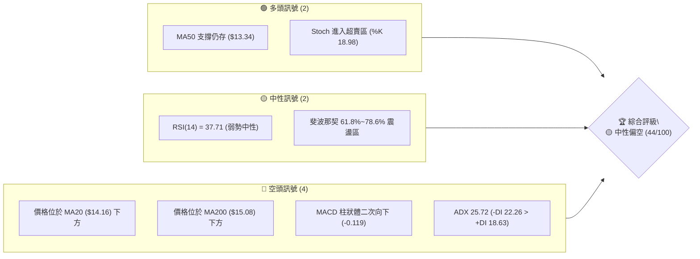
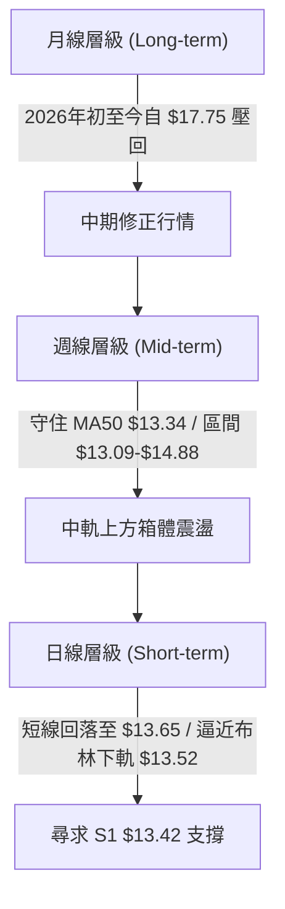
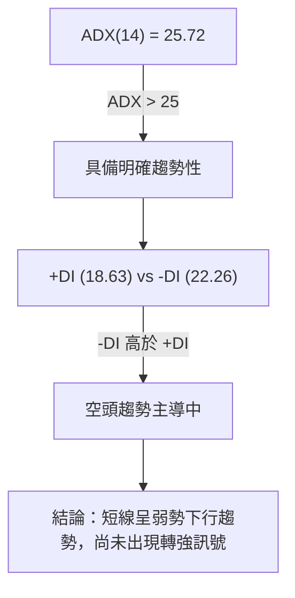
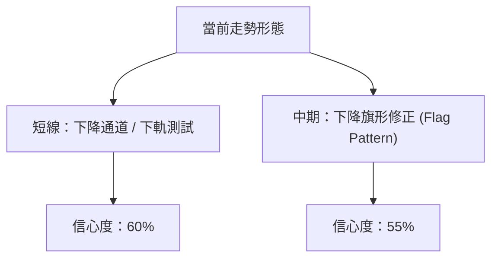
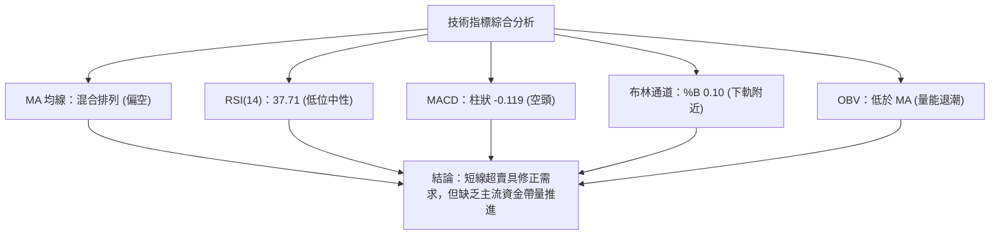
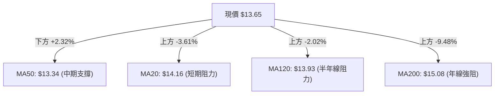
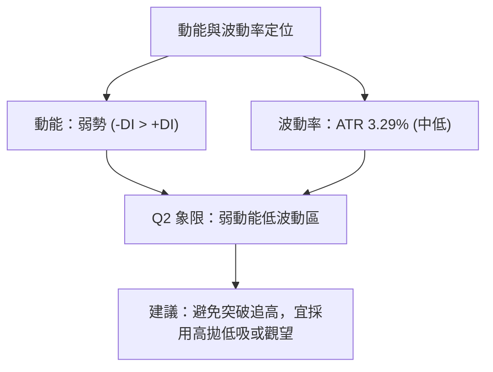
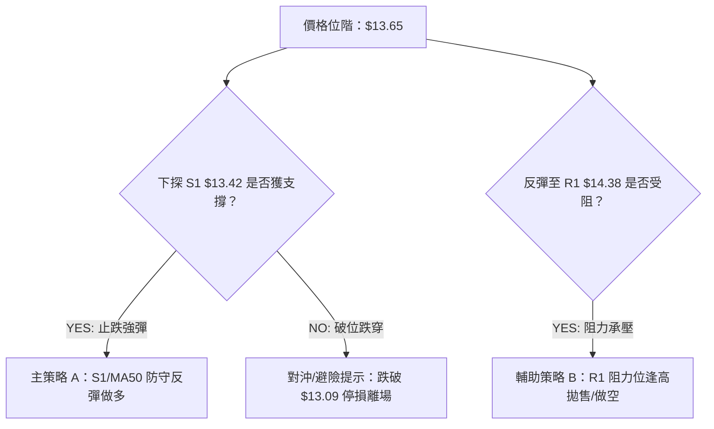
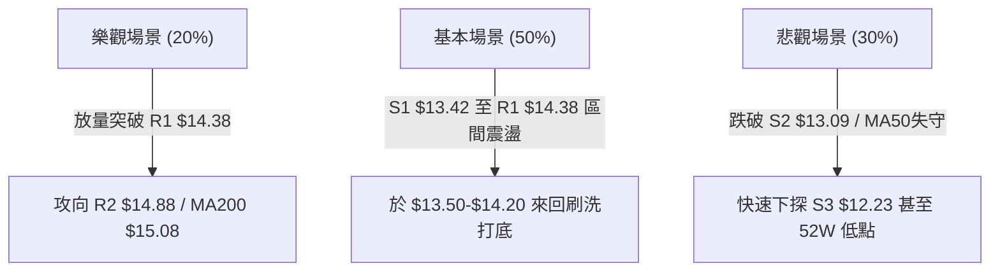

# NU 技術分析報告

> **報告日期**：2026-08-12 ｜ **語言**：繁體中文 ｜ **數據來源**：Yahoo Finance ｜ **當前價格**：$13.65

---

## 目錄

| 章節 | 內容 |
|------|------|
| [1. 技術面概覽](#1-技術面概覽) | 訊號儀表板、核心指標、評分卡 |
| [2. 趨勢分析](#2-趨勢分析) | 多時框趨勢、長中短期走勢 |
| [3. 圖表形態分析](#3-圖表形態分析) | 形態識別、K線組合、目標價 |
| [4. 支撐與阻力](#4-支撐與阻力) | 關鍵價位、斐波那契回調 |
| [5. 技術指標深度解讀](#5-技術指標深度解讀) | MA/RSI/MACD/布林/成交量 |
| [6. 動能與波動率](#6-動能與波動率) | 動能評估、ATR、Beta |
| [7. 多時框架總結](#7-多時框架總結) | 時框架評分矩陣 |
| [8. 交易策略建議](#8-交易策略建議) | 多空策略、風險報酬比 |
| [9. 風險提示與監控](#9-風險提示與監控) | 監控指標、風險場景 |

---

## 1. 技術面概覽

### 🎯 技術訊號儀表板



### 📊 核心指標速覽表

| 指標類別 | 指標名稱 | 當前數值 | 訊號 | 解讀 |
|----------|----------|----------|------|------|
| **價格** | 當前價格 | $13.65 | 🟡 | 位於52週區間 31.5% 位置，屬於中低位震盪 |
| **均線** | MA20 | $14.16 | 🔴 | 價格在MA20下方 (-3.61%)，短線承壓 |
| **均線** | MA50 | $13.34 | 🟢 | 價格在MA50上方 (+2.32%)，中期防線未破 |
| **均線** | MA200 | $15.08 | 🔴 | 價格在MA200下方 (-9.48%)，長期趨勢受阻 |
| **動能** | RSI(14) | 37.71 | 🟡 | 無背離，接近超賣區但尚未出現轉強訊號 |
| **動能** | MACD | -0.119 | 🔴 | MACD (0.120) < Signal (0.238)，空頭控盤 |
| **動能** | Stoch %K | 18.98 | 🟢 | %K(18.98) 與 %D(13.40) 位於低位，具短線反彈契機 |
| **波動** | ATR(14) | $0.45 | 🟡 | 日波動率 3.29%，屬於中等波動強度 |
| **趨勢** | ADX(14) | 25.72 | 🔴 | ADX > 25 具趨勢性，-DI(22.26) > +DI(18.63) 顯示空頭主導 |
| **量能** | OBV | 低於MA | 🔴 | 量能遞減，法人與大戶資金觀望氛圍濃厚 |

### 🏆 技術評分卡

```
╔══════════════════════════════════════════════════════════════╗
║                技術評分卡 — NU (2026-08-12)                   ║
╠══════════════════════════════════════════════════════════════╣
║ 趨勢強度      ▓▓▓▓▓▓▓▓░░░░░░░░░░░░  45/100  🔴 空頭佔優      ║
║ 動能指標      ▓▓▓▓▓▓░░░░░░░░░░░░░░  35/100  🔴 動能低迷      ║
║ 支撐穩定度    ▓▓▓▓▓▓▓▓▓▓▓▓░░░░░░░░  60/100  🟡 接近S1/MA50   ║
║ 成交量配合    ▓▓▓▓▓▓▓▓░░░░░░░░░░░░  40/100  🔴 量能退潮      ║
║ 形態完整度    ▓▓▓▓▓▓▓▓▓▓░░░░░░░░░░  50/100  🟡 區間箱體修正  ║
║ 均線排列      ▓▓▓▓▓▓░░░░░░░░░░░░░░  35/100  🔴 死亡交叉下壓  ║
╠══════════════════════════════════════════════════════════════╣
║ 綜合評分      ▓▓▓▓▓▓▓▓▓░░░░░░░░░░░  44/100  🟡 中性偏空      ║
╚══════════════════════════════════════════════════════════════╝
```

---

## 2. 趨勢分析

### 🌐 多時框趨勢分析



### 📈 長期趨勢 — 12個月走勢圖（Unicode）

```
NU 月線走勢圖（2025-08 至 2026-08）
價格軸 ($)
$18.00 ┤                               ● $17.75 (2026-01 高點)
$17.00 ┤                     ● $17.39  │
$16.00 ┤          ● $16.01   │         │
$15.00 ┤    ● $14.80  │      │         │     ● $14.98
$14.00 ┤    │         │      │         │     │     ● $14.33
$13.00 ┤    │         │      │         │     │     │     ● $13.65 (現價)
$12.00 ┤    │         ● $12.22         │     │     ● $13.13
$11.00 ┤    │                          │     │
       └────┴─────────┴──────┴─────────┴─────┴─────┴───────────
           25-08     25-09  25-11    26-01  26-02 26-05  26-08
```

#### 走勢特徵分析表

| 階段 | 時間區間 | 收盤區間 | 變動特徵 | 關鍵技術驅動因素 |
|------|----------|----------|----------|------------------|
| **拉升期** | 2025-08 ~ 2026-01 | $14.80 → $17.75 | +19.9% 震盪上攻 | 強勁基本面利多帶動，攻克各大短期均線 |
| **修正期** | 2026-02 ~ 2026-05 | $17.75 → $13.13 | -26.0% 快速拉回 | 獲利了結賣壓湧現，相繼跌破 MA20 與 MA200 |
| **築底震盪**| 2026-06 ~ 2026-08 | $11.97 → $13.65 | 底部反彈後回測 | 在 52W 低點 $11.20 上方形成築底，目前於 $13.65 橫盤 |

### 📊 中期趨勢（週線分析）

```
週線支撐阻力結構示意圖
===================================================
 $15.70 ─── [阻力 R3] (中期反轉強壓力)
 $14.88 ─── [阻力 R2] / 布林帶上軌 $14.81
 $14.38 ─── [阻力 R1] / MA20 $14.16 重疊帶 (短線反彈瓶頸)
 $13.65 ─── [目前價格] (向下尋求防線)
 $13.42 ─── [支撐 S1] (短線關鍵波段支撐)
 $13.09 ─── [支撐 S2] / MA50 $13.34 (中期多頭最後防線)
 $12.23 ─── [支撐 S3] (深遠回調防禦點)
===================================================
```

### ⚡ 趨勢強度評估（ADX 解讀）



#### ADX 強度指標對照表

| 指標項 | 數據值 | 評估區間 | 趨勢判定 |
|--------|--------|----------|----------|
| **ADX 數值** | 25.72 | > 25 (強趨勢) | 市場由單向動能引導，非無序盤整 |
| **+DI (多頭動能)** | 18.63 | 弱勢區 (< 20) | 買盤力道收斂，無力推升股價 |
| **-DI (空頭動能)** | 22.26 | 主導區 (> +DI) | 賣壓佔據上風，持續對價格施壓 |

---

## 3. 圖表形態分析

### 🔍 形態識別系統



#### 形態識別與信心度評估表

| 形態名稱 | 信心度 | 判斷依據（引用數據） | 完成度 | 目標價計算式 |
|----------|--------|----------------------|--------|--------------|
| **下降通道 (Descending Channel)** | 60% | 股價受制於 MA20 ($14.16)，向下測試 S1 ($13.42) 與布林下軌 ($13.52) | 75% | 通道破位目標 = S1 $13.42 - 通道高 $0.96 = $12.46 (貼近 S3 $12.23) |
| **中期箱體震盪 (Range Box)** | 55% | 股價交錯於 MA50 ($13.34) 與 R1 ($14.38) 之間，成交量縮減 | 80% | 突破箱體頂部 = R1 $14.38 + 箱體高 $0.96 = $15.34 |

*註：由於目前幾何形態尚未完全爆發，無標準大型頭肩頂/底，本報告主要基於通道與指標型態做解讀。*

### 🕯️ 重要K線形態分析

| 月份 | 收盤價 | K線形態 | 解讀 | 訊號 |
|------|--------|---------|------|------|
| **2026-05** | $13.13 | 長陰回落 | 跌破多頭防線，空頭完全主導市場 | 🔴 |
| **2026-06** | $13.36 | 低位十字星 | 於 $11.97 週線低點止跌，展現打底跡象 | 🟡 |
| **2026-07** | $14.33 | 溫和中陽線 | 嘗試反彈衝高，攻克 MA50 但受制於 MA200 | 🟢 |
| **2026-08** | $13.65 | 上影線回撤 | 衝高回落，受壓於 MA20 ($14.16)，再度尋求下軌支撐 | 🔴 |

### 📉 ASCII 走勢形態示意圖

```
        NU 日線下降通道與關鍵位階示意圖
$14.88 ───┤ R2 (前高阻力帶)
          │    \
$14.38 ───┤     \  R1 阻力 (MA20 重疊點 $14.16)
          │      \   *
$13.65 ───┤───────\*─── (當前價格 $13.65)
          │         \  * 布林下軌 $13.52
$13.42 ───┤──────────\*── S1 關鍵支撐區
          │            \
$13.09 ───┤─────────────*── S2 / MA50 ($13.34) 支撐帶
```

### 🎯 形態目標價計算

1. **多頭反轉突破目標（若有效突破 R1 $14.38）**：
   - 形態高度：R1 ($14.38) - S1 ($13.42) = $0.96
   - 向上測算目標：$14.38 + $0.96 = **$15.34**（接近 MA200 $15.08 與 斐波那契 50.0% $15.09）

2. **空頭向下破位目標（若有效跌破 S1 $13.42）**：
   - 向下測算目標：$13.42 - $0.96 = **$12.46**（逼近 S3 $12.23 與 斐波那契 78.6% $12.86）

---

## 4. 支撐與阻力

### 🗺️ 關鍵價位分布圖（Unicode）

```
NU 價位結構分布圖 (2026-08-12)
════════════════════════════════════════════════════════════
$18.98 ║████████████████████████████████████████  52W High / 0.0% Fib
$17.14 ║████████████████████████████          23.6% Fib
$16.01 ║████████████████████                  38.2% Fib
$15.70 ║██████████████████████                強阻力 R3
$15.09 ║████████████████                      MA200 / 50.0% Fib
$14.88 ║██████████████                        阻力 R2 / BB 上軌 $14.81
$14.38 ║██████████                            關鍵阻力 R1 / MA20 $14.16
$13.65 ╠══════════════════════════════════════ ◄ 現價 ($13.65)
$13.42 ║▓▓▓▓▓▓▓▓                              關鍵支撐 S1 / BB 下軌 $13.52
$13.09 ║████████████                          強支撐 S2 / MA50 $13.34
$12.86 ║████████                              78.6% Fib
$12.23 ║████████████████                      深遠支撐 S3
$11.20 ║██████████████████████████████████████  52W Low / 100.0% Fib
════════════════════════════════════════════════════════════
```

### 🚧 阻力位分析表

| 阻力級別 | 價位 | 形成原因 | 突破難度 | 重要性 |
|----------|------|----------|----------|--------|
| **R1** | $14.38 | 近一年波段高點聚類、貼近 MA20 ($14.16) | 🟡 中等 | 短線多空分水嶺，突破方能擺脫弱勢 |
| **R2** | $14.88 | 波段反彈高點聚類、接近布林上軌 ($14.81) | 🔴 偏高 | 中期波段壓力，多頭主控權測試點 |
| **R3** | $15.70 | 密集成交區套牢帶、靠近 MA200 ($15.08) | 🔴 極高 | 長線趨勢反轉關鍵阻力，強壓區 |

### 🛡️ 支撐位分析表

| 支撐級別 | 價位 | 形成原因 | 守住機率 | 重要性 |
|----------|------|----------|----------|--------|
| **S1** | $13.42 | 近一年波段低點聚類、接近布林下軌 ($13.52) | 🟢 65% | 短線防禦核心，跌破將下探 MA50 |
| **S2** | $13.09 | 近一年波段低點聚類、貼近 MA50 ($13.34) | 🟢 75% | 中期多頭命脈，必須堅守之防線 |
| **S3** | $12.23 | 前期打底低點聚類區 | 🟢 85% | 長線強支撐，若失守將試探52W低點 |

### 📐 斐波那契回調位分析

| 回調比例 | 價位 | 當前相對位置與技術意義 |
|----------|------|------------------------|
| **0.0%** | $18.98 | 52 週最高點 |
| **23.6%**| $17.14 | 長線轉強臨界點 |
| **38.2%**| $16.01 | 中期反轉壓力位 |
| **50.0%**| $15.09 | 多空中性軸線（與 MA200 $15.08 高度重疊） |
| **61.8%**| $14.17 | 黃金分割強壓力（與 MA20 $14.16 / R1 $14.38 重疊） |
| **78.6%**| $12.86 | 深遠回調防禦位（位於 S2 $13.09 下方） |
| **100.0%**| $11.20 | 52 週最低點 |

*當前價格判讀*：現價 **$13.65** 落在 **61.8% ($14.17)** 與 **78.6% ($12.86)** 之間的黃金回調密集承壓區，受到 61.8% 上方強壓阻縮，短線在 78.6% 上方尋求支撐。

---

## 5. 技術指標深度解讀

### 🎛️ 指標訊號總覽



### 📈 移動平均線排列分析



- **短均線壓制**：MA5 ($13.99)、MA10 ($14.16)、MA20 ($14.16) 呈空頭向下，壓制短線反彈。
- **中均線支撐**：MA50 ($13.34) / MA60 ($13.25) 向上扣抵，為當前多頭最後依託。
- **長均線下挫**：MA200 ($15.08) 與 MA240 ($15.13) 遠高於現價，長期大趨勢尚未扭轉。

### 📉 RSI(14) 分析

```
RSI(14) 動能進度條
0 [▓▓▓▓▓▓▓▓▓▓▓▓▓▓▓░░░░░░░░░░░░░░░░░░░░] 100
             37.71 (低位偏弱)
```

- **現況**：RSI 位於 37.71，處於 30-50 弱勢區間。
- **背離檢測**：近期價格從 $14.33 回落至 $13.65，RSI 同步自 58.5 下滑至 37.7，**無明顯頂背離或底背離**。
- **解讀**：未達 <30 極端超賣，但屬於偏弱格局，需要 RSI 重新跨越 50 才能確認短線止跌。

### 📊 MACD(12,26,9) 訊號解讀

- **DIF 快線**：0.120
- **DEA 慢線**：0.238
- **MACD 柱狀體**：-0.119 (🔴 空頭控盤)
- **分析**：快線向下穿過慢線形成死亡交叉後，柱狀體負值擴大（-0.077 → -0.119），顯示短期空頭修正動能仍在釋放中。

### 📦 布林通道分析

```
            NU 布林通道型態示意圖
 $14.81 ─── Upper Band (上軌)
 $14.16 ─── Middle Band (MA20 中軌)
 $13.65 ─── Price (現價 - %B = 0.10)
 $13.52 ─── Lower Band (下軌)
```

- **通道寬度**：上軌 $14.81 與下軌 $13.52 帶寬約 $1.29，通道呈平行微幅向下延伸。
- **%B 位置**：0.10，價格極度貼近下軌（$13.52），通常代表短線過度賣超，具備向中軌（$14.16）均值回歸的技術性反彈需求。

### 💹 成交量分析（量價配合度）

- **最新成交量**：74.04M，低於 20日均量 89.22M（量比 0.83x）。
- **OBV 走勢**：OBV 低於其移動平均線，顯示資金持續呈現淨流出。
- **量價解讀**：股價回落過程量能未暴增，顯示無恐慌性拋售；但同時無擴量扣抵現象，買盤追高意願不足，屬「無量陰跌」型態。

---

## 6. 動能與波動率

### ⚡ 動能評估四象限

| 象限 | 動能強度 | 波動率 | 當前狀態 | 評估與策略方向 |
|------|----------|--------|----------|----------------|
| **Q1** | 強動能 (ADX>25) | 高波動 | — | 追漲殺跌/順勢突破 |
| **Q2** | 弱動能 (+DI< -DI) | 中低波動 | **✓ NU 當前位置** | **觀望築底 / 逢高避險 / 區間低吸** |
| **Q3** | 強動能 | 低波動 | — | 穩健趨勢續抱 |
| **Q4** | 弱動能 | 高波動 | — | 高風險避開 |



### 📊 ATR 波動率分析

- **ATR(14)**：$0.45（佔股價 3.29%）
- **每日預期波動區間**：$13.20 ～ $14.10
- **風控止損參考**：
  - 短線動態止損（1.5x ATR）：$0.68
  - 中線動態止損（2.0x ATR）：$0.90

### 📐 Beta 與市場相關性

- **Beta 係數**：0.942
- **解讀**：NU 與美股大盤（S&P 500）波動同步率極高（接近 1.0）。大盤若發生系統性拉回，NU 難以獨善其身；反之若大盤止跌反彈，NU 將跟隨大盤出現技術性修復。

---

## 7. 多時框架總結

### 📋 時框架評分表

| 時框架 | 趨勢方向 | 動能指標 | 均線排列 | 圖表形態 | 綜合評分 | 建議策略 |
|--------|----------|----------|----------|----------|----------|----------|
| **月線 (Long)** | 🟡 震盪整理 | RSI 50+ 轉平 | 守住大週期 | 橫盤打底 | **55/100** | 長線分批布局 |
| **週線 (Mid)** | 🟢 守住 MA50 | MACD 零軸附近| MA50 向上 | 箱體中下軌 | **50/100** | 中線逢低承接 |
| **日線 (Short)**| 🔴 弱勢修正 | RSI 37.7 / MACD<0 | 跌破 MA20 | 貼近布林下軌 | **38/100** | 短線嚴控倉位 |

### 🔲 綜合訊號矩陣

```
      時框架訊號收斂矩陣
┌──────────┬───────────┬───────────┐
│  時框架  │  多頭訊號  │  空頭訊號  │
├──────────┼───────────┼───────────┤
│  月 線   │  MA50強   │  前高退潮 │
│  週 線   │  S2堅固   │  R1/MA20壓│
│  日 線   │  超賣修正 │  ADX趨勢空│
└──────────┴───────────┴───────────┘
```

### ⚖️ 多時框收斂結論

依據多時框收斂規則（ADX 25.72 > 25，屬於趨勢行情），當前由**中長期層級主導**。
雖然日線動能偏空且低於 MA20 ($14.16)，但週線與月線均堅守在 MA50 ($13.34) 及 S1/S2 支撐帶 ($13.09-$13.42) 上方。

**最終方向性結論**：**🟡 中性偏空 / 區間弱勢震盪**。短線有下尋 S1/S2 支撐需求，但中線未破壞多頭防線，不宜盲目過度追空，建議以「支撐區低吸反彈」或「阻力區逢高避險」之區間思維因應。

---

## 8. 交易策略建議

### 🗺️ 策略決策流程圖



### 🧭 策略路由

**當前主策略方向 = 🟡 區間震盪 / 逢支撐做多反彈（綜合評分：44/100）**

基於評分 44/100 處於中性區間，且價格極度靠近布林下軌（$13.52）與 S1（$13.42），下行空間受限，策略主推**「支撐位高勝率反彈多單」**，配合**「阻力位空單對沖」**。

### 🎯 價格情境階梯 (Price Scenarios)

| 觸發條件 | 下一目標 | 後續延伸 | 情境含義 |
|----------|----------|----------|----------|
| **突破 R1 $14.38** | R2 $14.88 | R3 $15.70 | 短線轉強，空頭停損，多頭掌控局勢 |
| **站穩現價 $13.65** | R1 $14.38 | — | 區間底部震盪，積蓄反彈動能 |
| **跌破 S1 $13.42** | S2 $13.09 | S3 $12.23 | 中期防線失守，測試年內低點區域 |

### 📊 情境機率分佈

| 情境 | 機率 | 主要依據 |
|------|------|----------|
| **區間震盪反彈 (S1↔R1)** | **50%** | RSI 接近超賣，布林帶下軌支撐，日線無暴量拋售 |
| **繼續下尋 S2/S3** | **30%** | MACD 柱狀擴大，ADX 空頭主導 (-DI > +DI) |
| **直接突破 R1 上攻** | **20%** | 成交量未放大，MA20 下壓明顯，缺乏強烈催化劑 |

### 🟢 主策略詳情

| 策略要素 | 策略 A (主推：S1 支撐低吸多單) | 策略 B (輔助：R1 阻力高拋空單) |
|----------|--------------------------------|--------------------------------|
| **進場條件** | 價格觸及 S1 $13.42-$13.50 區間且出現止跌訊號 | 價格反彈至 R1 $14.16-$14.38 阻力帶受阻 |
| **進場價格** | **$13.45** | **$14.25** |
| **目標價 T1** | **$14.16** (MA20 重疊處) | **$13.52** (布林下軌) |
| **目標價 T2** | **$14.38** (R1 阻力位) | **$13.09** (S2 強支撐) |
| **止損價格** | **$12.95** (跌破 S2 $13.09 確信點) | **$14.65** (突破 R1 後上方空間) |
| **風險報酬比** | **1.46 : 1** ［(14.18-13.45)/(13.45-12.95)］ | **1.82 : 1** ［(14.25-13.52)/(14.65-14.25)］ |
| **預估成功率** | **58%** | **52%** |
| **建議倉位** | **10% - 15%** (輕倉試探) | **5% - 10%** (避險對沖) |

### 🔴 反向風險觸發點（對沖提示）

- **多頭停損風控觸發**：若收盤價強勢**跌破 $13.09 (S2)**，代表 MA50 宣告失守，多頭應立即清倉觀望，嚴防跌向 S3 ($12.23)。
- **空頭翻多風控觸發**：若股價放量**突破 $14.38 (R1)** 並站穩，代表空頭結構破壞，空頭應強制平倉。

### ⭐ 整體訊號強度評星

```
做多訊號強度：★★☆☆☆  (2.5/5星 - 靠近支撐但無爆量)
做空訊號強度：★★★☆☆  (3.0/5星 - 均線壓制但受限下軌)
整體可信度：  ★★★☆☆  (3.5/5星 - 數據完整，區間清晰)
```

---

## 9. 風險提示與監控

### ✅ 關鍵監控指標 Checklist

```
╔══════════════════════════════════════════════════════════════╗
║                   每日交易風險監控清單                         ║
╠══════════════════════════════════════════════════════════════╣
║ [ ] 價格是否跌破 S1 ($13.42)？ ── 破位則開啟下行通道          ║
║ [ ] RSI(14) 是否跨越 50？ ── 跨越代表短線動能轉強            ║
║ [ ] MACD 柱狀體是否止跌收縮？ ── 收縮為綠柱縮短買點          ║
║ [ ] 成交量是否突破 20日均量 (89.22M)？ ── 擴量方能有效突破    ║
║ [ ] 價格是否站上 MA20 ($14.16)？ ── 站上為擺脫弱勢訊號        ║
╚══════════════════════════════════════════════════════════════╝
```

### ⚠️ 風險場景分析



### 🛡️ 風險管理重要提醒

1. **嚴禁高位追漲**：由於 MA20 ($14.16) 與 R1 ($14.38) 蓋頂，接近阻力區時切勿盲目追高。
2. **倉位精細控制**：目前 ADX > 25 且 -DI 占優，大趨勢尚未扭轉，整體持股倉位不宜超過 **20%**。
3. **嚴格執行止損**：以 ATR $0.45 估算，若單日回撤超過 **$0.50 - $0.70**，應無條件執行風控機制。

---

## 📋 報告總結

```
╔══════════════════════════════════════════════════════════════╗
║                   NU 技術分析報告總結                        ║
════════════════════════════════════════════════════════════════
報告日期：2026-08-12
當前價格：$13.65
分析評級：🟡 中性偏空 (弱勢區間震盪)

關鍵結論：
├─ 長期趨勢：🔴 偏空 (位於 MA200 $15.08 下方 -9.48%)
├─ 中期趨勢：🟢 守住 (位於 MA50 $13.34 上方 +2.32%)
├─ 短期趨勢：🔴 弱勢 (位於 MA20 $14.16 下方 -3.61%)
├─ 關鍵支撐：S1 $13.42 ｜ S2 $13.09
├─ 關鍵阻力：R1 $14.38 ｜ R2 $14.88
└─ 分析師目標價：均價 $17.98 (潛在空間 +31.7%)

最優策略組合：
1. 🥇 最佳機會：於 S1 $13.42-$13.50 附近尋求輕倉低吸反彈，目標 $14.16。
2. 🥈 次選機會：反彈至 R1 $14.25 附近受阻時，進行短線避險對沖。
3. 🥉 保守選擇：等待股價放量突破 R1 $14.38 或跌破 S2 $13.09 後，順勢跟進。
╚══════════════════════════════════════════════════════════════╝
```

---

> ⚠️ **免責聲明**：本報告為 AI 自動生成之技術分析，所有數據及估算均基於提供的歷史價格資訊。本報告**僅供研究與學術參考**，**不構成任何投資建議**。投資有風險，入市需謹慎。

---

*報告生成時間：2026-08-12 ｜ 數據來源：Yahoo Finance ｜ 分析框架：多時框技術分析*