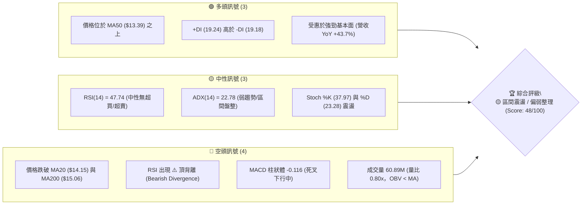
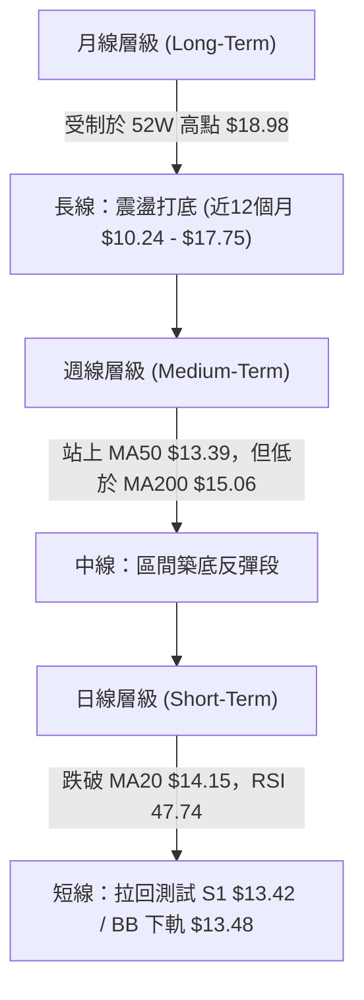
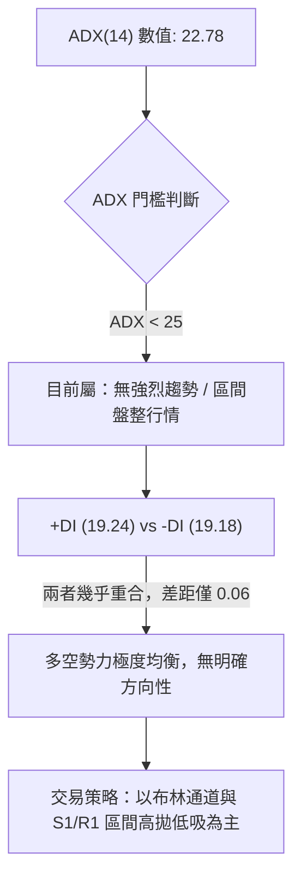
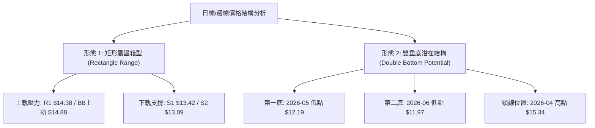
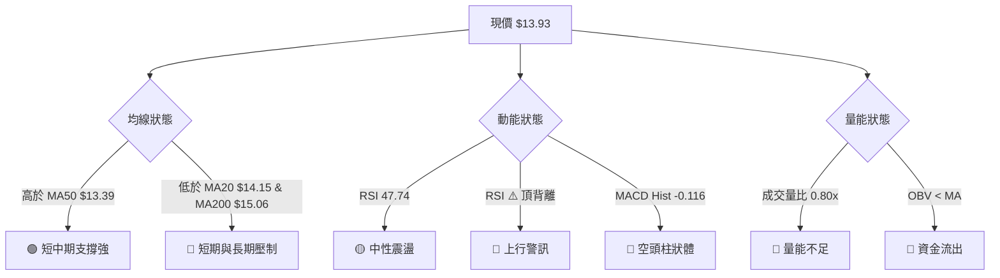
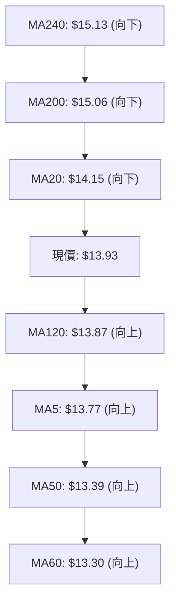
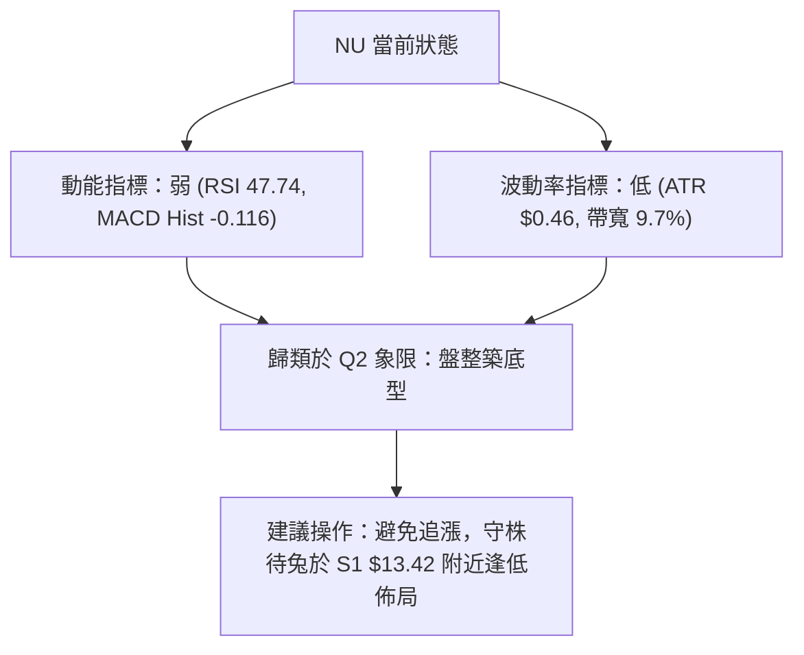
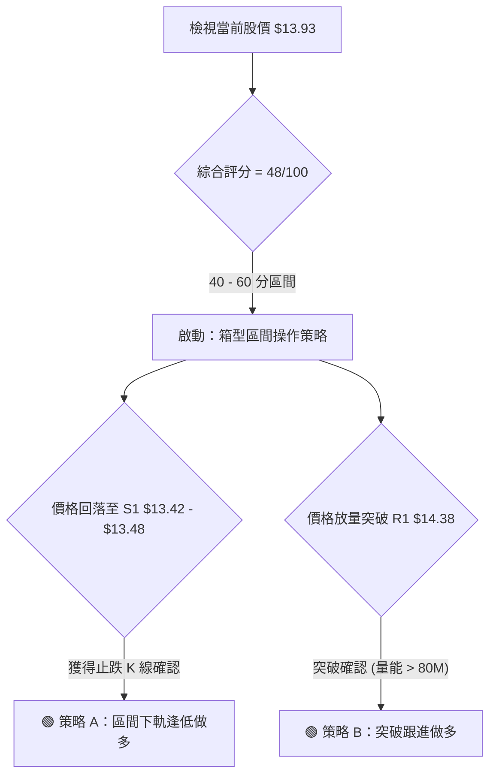
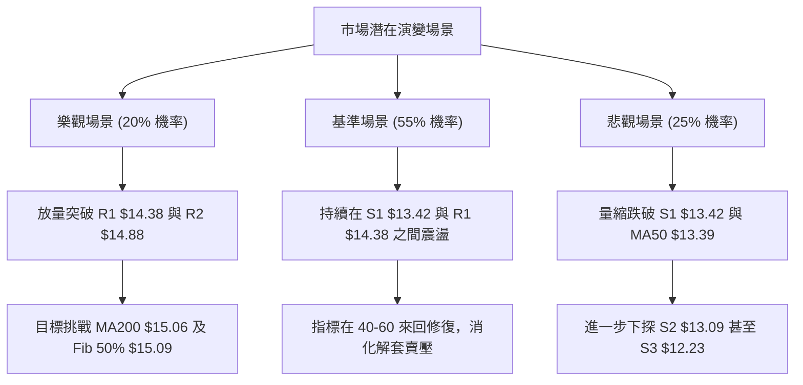

# NU 技術分析報告

> **報告日期**：2026-08-14 ｜ **語言**：繁體中文 ｜ **數據來源**：Yahoo Finance ｜ **當前價格**：$13.93

---

## 目錄

| 章節 | 內容 |
|------|------|
| [1. 技術面概覽](#1-技術面概覽) | 訊號儀表板、核心指標、評分卡 |
| [2. 趨勢分析](#2-趨勢分析) | 多時框趨勢、長中短期走勢 |
| [3. 圖表形態分析](#3-圖表形態分析) | 形態識別、K線組合、目標價 |
| [4. 支撐與阻力](#4-支撐與阻力) | 關鍵價位、斐波那契回調 |
| [5. 技術指標深度解讀](#5-技術指標深度解讀) | MA/RSI/MACD/布林/成交量 |
| [6. 動能與波動率](#6-動能與波動率) | 動能評估、ATR、Beta |
| [7. 多時框架總結](#7-多時框架總結) | 時框架評分矩陣 |
| [8. 交易策略建議](#8-交易策略建議) | 多空策略、風險報酬比 |
| [9. 風險提示與監控](#9-風險提示與監控) | 監控指標、風險場景 |

---

## 1. 技術面概覽

### 🎯 技術訊號儀表板



### 📊 核心指標速覽表

| 指標類別 | 指標名稱 | 當前數值 | 訊號 | 解讀 |
|----------|----------|----------|------|------|
| **價格** | 當前價格 | $13.93 | 🟡 中性 | 處於 52 週區間 ($11.20 - $18.98) 之 35.1% 分位 |
| **均線** | MA20 | $14.15 | 🔴 空頭 | 價格位於 20 日均線下方 -1.57%，短線承壓 |
| **均線** | MA50 | $13.39 | 🟢 多頭 | 價格位於 50 日均線上點 +4.03%，中軌提供支撐 |
| **均線** | MA200 | $15.06 | 🔴 空頭 | 價格位於 200 日均線下方 -7.50%，長期趨勢偏弱 |
| **動能** | RSI(14) | 47.74 | 🟡 中性 | 位於 30-70 中性區間，但存在⚠️頂背離隱憂 |
| **動能** | MACD (12,26,9) | -0.116 (Hist) | 🔴 空頭 | MACD(0.060) 跌破 Signal(0.176)，動能轉弱 |
| **波動** | ATR(14) | $0.46 | 🟡 中性 | 日波動率 3.31%，屬於正常區間震盪幅度 |
| **量能** | 20日均量比 | 0.80x | 🔴 空頭 | 當日成交量 60.89M 低於均量 76.55M，追高意願不足 |

### 🏆 技術評分卡

```
╔══════════════════════════════════════════════════════════════╗
║                技術評分卡 — NU (2026-08-14)                  ║
╠══════════════════════════════════════════════════════════════╣
║ 趨勢強度      ████████░░░░░░░░░░░░  40/100  🟡 中性盤整        ║
║ 動能指標      ████████░░░░░░░░░░░░  42/100  🔴 MACD死叉       ║
║ 支撐穩定度    ██████████████░░░░░░  70/100  🟢 MA50/S1強韌     ║
║ 成交量配合    ████████░░░░░░░░░░░░  40/100  🔴 量能萎縮       ║
║ 形態完整度    ██████████░░░░░░░░░░  50/100  🟡 箱型震盪中     ║
║ 均線排列      ████████░░░░░░░░░░░░  45/100  🔴 糾結且MA200在上 ║
╠══════════════════════════════════════════════════════════════╣
║ 綜合評分      ██████████░░░░░░░░░░  48/100  🟡 觀望/區間操作   ║
╚══════════════════════════════════════════════════════════════╝
```

---

## 2. 趨勢分析

### 🌐 多時框趨勢分析



### 📈 長期趨勢 — 12個月走勢圖（Unicode）

```
NU 月線走勢圖（過去12個月 2025-08 至 2026-08）
價格軸 ($)
$18.00 ┤                                   ● $17.75 (高點 2026-01)
$17.00 ┤                         ● $17.39  │
$16.00 ┤                ● $16.01 │         │
$15.00 ┤       ● $14.80 │        │         │   ● $14.98
$14.00 ┤       │        │        │         │   │       ● $14.33
$13.00 ┤       │        │        │         │   │   ● $13.13│   ● $13.93 (現在)
$12.00 ┤ ● $12.22       │        │         │   │   │       │   │
$11.00 ┤ ┴──────────────┴────────┴─────────┴───┴───┴───────┴───┴───────
月份:   25-07   25-08    25-09    25-11    26-01 26-02 26-05   26-07 26-08
```

#### 過去 12 個月走勢特徵分析

| 階段 | 時間區間 | 價格變動區間 | 漲跌幅 | 走勢特徵分析 |
|------|----------|--------------|--------|--------------|
| 第一階段 | 2025-07 ~ 2025-11 | $12.22 → $17.39 | +42.3% | 主升段多頭推進，量能持續放大，突破中期阻力 |
| 第二階段 | 2025-12 ~ 2026-01 | $16.74 → $17.75 | +6.0%  | 創下波段高點 $17.75，但追高買盤開始出現乏力 |
| 第三階段 | 2026-02 ~ 2026-05 | $17.75 → $13.13 | -26.0% | 劇烈修復拉回，相繼跌破季線與年線，探尋下檔支撐 |
| 第四階段 | 2026-06 ~ 2026-08 | $11.97 → $13.93 | +16.4% | 低檔回升，於 $12.00-$13.00 形成築底，目前於 $13.93 震盪 |

### 📊 中期趨勢（週線分析）

中期走勢顯示，NU 在 2026 年 5 月底至 6 月初曾短暫探底至 52 週低點聚類區間（約 $11.97 - $12.19），隨後展開強勁的反彈波段，最高於 2026 年 8 月初拉升至 $14.33。然而，最近兩週成交量連續下降（從 2.71 億股降至 2.20 億股），且 MACD 週線柱狀圖出現萎縮（從 +0.001 轉為 -0.116），顯示中期反彈在觸及 **R1 $14.38** 前夕遭遇強烈獲利解套賣壓。

### ⚡ 趨勢強度評估（ADX 解讀）



---

## 3. 圖表形態分析

### 🔍 形態識別系統



#### 圖表形態信心度評估表

| 形態名稱 | 信心度 (%) | 判斷依據（引用數據） | 完成度 (%) | 形態目標價（附計算式） |
|----------|------------|----------------------|------------|------------------------|
| **矩形震盪箱型** | **85%** | 價格受限於 $13.42 (S1) 與 $14.38 (R1) 區間，ADX=22.78 < 25 | 90% | 區間上軌 $14.38，下軌 $13.42 |
| **W底 (雙重底)** | **45%** | 兩次打底 $12.19 與 $11.97，但尚未突破頸線 $15.34 | 40% | 訊號不足（信心度 < 50%），暫不採用高階推算 |
| **下降旗形突破** | **35%** | 5月大跌後的反彈斜率高，但量能無法放量配合 | 30% | 訊號不足，僅做指標型區間解讀 |

### 🕯️ 重要 K 線形態分析

| 日期 / 週別 | 收盤價 | K 線形態 | 解讀 | 訊號 |
|-------------|--------|----------|------|------|
| 2026-07-19  | $13.59 | 爆量長上影線 | 週量高達 7.62 億股，上方解套賣壓沉重，形成短線頭部阻力 | 🔴 看空 |
| 2026-08-02  | $14.33 | 中陽線反彈 | 試圖收復 MA20，但未獲續航量能支援 | 🟡 中性 |
| 2026-08-09  | $13.84 | 陰線包覆 | 回吐前週漲幅，重新跌破 MA20 ($14.15) | 🔴 看空 |
| 2026-08-16  | $13.93 | 十字星震盪 | 當前位於 MA5 ($13.77) 上方，短線呈多空拉鋸狀態 | 🟡 中性 |

### 📉 ASCII 走勢形態示意圖

```
NU 日線矩形箱型與均線交織圖
  $15.06 ┤......................................................[MA200 長線阻力]
  $14.88 ┤------------------------------------------------------[R2 阻力 / BB上軌 $14.83]
  $14.38 ┤======================================================[R1 區間頂部阻力]
  $14.15 ┤.......................[MA20 / BB中軌]..............
  $13.93 ┤                       ★ 現價 ($13.93)
  $13.42 ┤======================================================[S1 區間底部支撐 / BB下軌 $13.48]
  $13.39 ┤.......................[MA50 關鍵均線支撐]............
  $13.09 ┤------------------------------------------------------[S2 強支撐]
```

### 🎯 形態目標價計算

基於高信心度（85%）的**矩形箱型震盪形態**推算：
*   **箱型高度 (H)** = R1 ($14.38) - S1 ($13.42) = **$0.96**
*   **向上突破目標價 (T1_Up)** = R1 ($14.38) + 箱型高度 ($0.96) = **$15.34** (恰與 2026-04-19 週高點 $15.34 完美重合)
*   **向上突破延伸目標 (T2_Up)** = R2 ($14.88) + 箱型高度 ($0.96) = **$15.84** (逼近 R3 $15.70)
*   **向下跌破目標價 (T1_Down)** = S1 ($13.42) - 箱型高度 ($0.96) = **$12.46** (接近 S3 $12.23)

---

## 4. 支撐與阻力

### 🗺️ 關鍵價位分布圖（Unicode）

```
NU 價位結構分布圖 (以當前價 $13.93 為基準)
═══════════════════════════════════════════════════════════════
$18.98 ║████████████████████████████████████████║ 52週最高點 (0.0% Fib)
$17.14 ║████████████████████████████            ║ 23.6% 斐波那契回調位
$16.01 ║████████████████████                    ║ 38.2% 斐波那契 / 波段高點
$15.70 ║██████████████████                      ║ 強阻力 R3 (+12.67%)
$15.09 ║██████████████                          ║ 50.0% 斐波那契 / MA200 ($15.06)
$14.88 ║████████████                            ║ 阻力 R2 (+6.84%) / BB上軌 ($14.83)
$14.38 ║████████                                ║ 關鍵阻力 R1 (+3.23%)
$14.17 ║██████                                  ║ 61.8% 斐波那契黃金分割
$13.93 ╠════════════════════════════════════════╣ ◄ 當前價格 ($13.93)
$13.42 ║▓▓▓▓▓▓▓▓                                ║ 關鍵支撐 S1 (-3.64%) / MA50 ($13.39)
$12.86 ║▓▓▓▓▓▓▓▓▓▓▓▓                            ║ 78.6% 斐波那契回調位
$13.09 ║▓▓▓▓▓▓▓▓▓▓▓▓▓▓                          ║ 強支撐 S2 (-6.07%)
$12.23 ║▓▓▓▓▓▓▓▓▓▓▓▓▓▓▓▓▓▓                      ║ 遠端支撐 S3 (-12.20%)
$11.20 ║▓▓▓▓▓▓▓▓▓▓▓▓▓▓▓▓▓▓▓▓▓▓▓▓▓▓▓▓▓▓          ║ 52週最低點 (100.0% Fib)
═══════════════════════════════════════════════════════════════
```

### 🚧 阻力位分析表

| 阻力級別 | 價位 | 形成原因 | 突破難度 | 重要性 |
|----------|------|----------|----------|--------|
| **阻力 R1** | **$14.38** | 近一年波段高點聚類、接近 2026-08-02 反彈高點 $14.33 | 🟡 中等 | 🟢 短線多空分水嶺 |
| **阻力 R2** | **$14.88** | 近一年高點聚類、布林通道上軌 ($14.83) 重合區 | 🔴 偏高 | 🟡 中期箱型頂部 |
| **阻力 R3** | **$15.70** | 近一年高點聚類、MA200 ($15.06) 與 50% Fib ($15.09) 之上重壓 | 🔴 極高 | 🔴 長線牛熊反轉點 |

### 🛡️ 支撐位分析表

| 支撐級別 | 價位 | 形成原因 | 守住機率 | 重要性 |
|----------|------|----------|----------|--------|
| **支撐 S1** | **$13.42** | 近一年波段低點聚類、MA50 ($13.39) 與 BB下軌 ($13.48) 形成共振 | 🟢 75% | 🟢 短線防守核心 |
| **支撐 S2** | **$13.09** | 近一年波段低點聚類、近20週密集成交區底線 ($13.13) | 🟢 85% | 🟡 中期防線 |
| **支撐 S3** | **$12.23** | 近一年波段低點聚類、5月週線低點 $12.19 聚類區 | 🟢 90% | 🔴 長線最後防線 |

### 📐 斐波那契回調位分析

依據 52 週高低點區間（**$11.20 → $18.98**，全幅高低差 $7.78）計算之標準回調位：

*   **0.0% (52W High)**: $18.98
*   **23.6%**: $17.14
*   **38.2%**: $16.01
*   **50.0%**: $15.09
*   **61.8% (黃金分割)**: $14.17
*   **78.6%**: $12.86
*   **100.0% (52W Low)**: $11.20

**現價解讀**：當前價格 **$13.93** 精確落在 **61.8% ($14.17)** 與 **78.6% ($12.86)** 兩大關鍵回調位之間（位處全區間的 35.1% 位置）。價位目前受制於 61.8% 回調位 ($14.17)，顯示市場正處於深幅回調後的底部打底階段，若能有效放量突破 $14.17，將打開通往 50.0% 回調位 ($15.09) 的空間。

---

## 5. 技術指標深度解讀

### 🎛️ 指標訊號總覽



### 📈 移動平均線排列分析



*   **短期均線 (MA5/MA10/MA20)**：MA5 ($13.77) 雖然向上微升，但價格交織於 MA10 ($14.05) 與 MA20 ($14.15) 下方，短期均線呈現「混合纏繞」狀態。
*   **中期均線 (MA50/MA60/MA120)**：MA50 ($13.39) 與 MA60 ($13.30) 均呈上揚趨勢，提供強大的中期支撐，為多頭構築屏障。
*   **長期均線 (MA200/MA240)**：MA200 ($15.06) 與 MA240 ($15.13) 呈現空頭排列且持續向下傾斜，顯示長線套牢壓力極重。

### 📉 RSI(14) 分析

*   **當前數值**：**47.74**（進度條：█████████░░░░░░░░░░░ 47.7%）
*   **狀態評估**：位於 30–70 中性區間，尚未進入超買（>70）或超賣（<30）極端。
*   **背離分析**：系統標註 **⚠️ 頂背離 (Bearish Divergence)**。在 7 月底至 8 月初，價格嘗試反彈至 $14.33，但 RSI 峰值卻由前期的高點（如 7 月初高達 79.0）顯著下降至 58.5 與 47.74，顯示價格雖有反彈，但內部推進動能嚴重衰退，警示短線隨時有回測下方支撐風險。

### 📊 MACD(12,26,9) 訊號解讀

*   **DIF (MACD 線)**：0.060
*   **DEA (Signal 線)**：0.176
*   **MACD Histogram (柱狀體)**：**-0.116** 🔴
*   **解讀**：DIF 已跌破 DEA 形成死叉，柱狀體呈負值擴張狀態（自 0.001 降至 -0.116）。此現象確認了從 $14.33 回落的短線修正波段仍在進行中，下行壓力尚未完全釋放。

### 📦 布林通道分析

```
NU 日線布林通道示意圖
  $14.83 ┤------------------------------------ 布林上軌 ( Upper Band )
         │
  $14.15 ┤------------------------------------ 布林中軌 ( MA20 )
  $13.93 ┤             ★ 現價 (%B = 0.34)
  $13.48 ┤------------------------------------ 布林下軌 ( Lower Band )
```

*   **通道寬度**：上軌 $14.83，下軌 $13.48，帶寬為 $1.35 (約 9.7%)，呈現收斂擠壓態勢。
*   **%B 位置**：**0.34**（位於中軌與下軌之間）。這表明價格偏向下軌運行，屬於區間內的弱勢整理狀態，下軌 **$13.48** 與 S1 **$13.42** 形成第一重強防守區。

### 💹 成交量分析（量價配合度）

*   **當日成交量**：60,887,729 股
*   **20日均量**：76,552,671 股（量比：**0.80x**）
*   **OBV 能量潮**：**OBV < MA**，量能持續低於均量線。
*   **量價關係結論**：最近數週在價格上揚時成交量未顯著放大（7/19 當週達 7.62 億股後量能迅速腰斬至 2.20 億股），反彈過程呈現「無量空抬」，顯示機構法人（機構持股高達 82.7%）當前觀望氣氛濃厚，缺乏追高意願。

---

## 6. 動能與波動率

### ⚡ 動能評估四象限

| 象限 | 動能強度 | 波動率 | 當前位置 | 策略涵義 |
|------|----------|--------|----------|----------|
| **Q1 (強動能 / 低波動)** | 強 | 低 | — | 最佳趨勢續漲區 |
| **Q2 (弱動能 / 低波動)** | 弱 | 低 | **✓ NU 當前位置** | **低位築底震盪，適合高拋低吸** |
| **Q3 (強動能 / 高波動)** | 強 | 高 | — | 突破暴漲/洗盤區 |
| **Q4 (弱動能 / 高波動)** | 弱 | 高 | — | 恐慌殺跌危險區 |



### 📊 ATR 波動率分析

*   **ATR(14)**：**$0.46**（占當前股價 3.31%）
*   **交易應用說明**：
    *   **日內合理波幅**：$13.93 ± $0.46 → [$13.47, $14.39]（與 S1 $13.42 / R1 $14.38 極度吻合）。
    *   **波動率止損距離 (1.5 x ATR)**：1.5 × $0.46 = **$0.69**。
    *   **波段止損距離 (2.0 x ATR)**：2.0 × $0.46 = **$0.92**。

### 📐 Beta 與市場相關性

*   **Beta 係數**：**0.942**
*   **特性分析**：Beta 接近 1.0，說明 NU 的波動步調與美股大盤（S&P 500）保持一致，不具備極端的個股防禦性，也不屬於高 Beta 投機股。大盤整體環境的穩定對於 NU 能否守住 S1 $13.42 具有關鍵作用。

---

## 7. 多時框架總結

### 📋 時框架評分表

| 時框架 | 趨勢方向 | 動能指標 | 均線排列 | 形態結構 | 綜合評分 | 建議操作 |
|--------|----------|----------|----------|----------|----------|----------|
| **日線 (Daily)** | 🔴 弱勢 | 🔴 MACD死叉 | 🔴 價格跌破MA20 | 🟡 箱型中軌下方 | 42 / 100 | 觀望 / 逢低吸納 |
| **週線 (Weekly)**| 🟢 築底反彈 | 🟡 柱狀圖收縮 | 🟢 站上 MA50 | 🟡 潛在 W 底打底 | 58 / 100 | 中線持股偏多 |
| **月線 (Monthly)**| 🟡 長期震盪 | 🟡 RSI 中性 | 🔴 承壓於 MA200 | 🟡 52W 區間中下段 | 50 / 100 | 區間波段操作 |

### 🔲 綜合訊號矩陣

```
╔══════════════════════════════════════════════════════════════╗
║                   多時框訊號一致性矩陣                       ║
╠══════════════════════════════════════════════════════════════╣
║ 短期 (日線): 🔴 空頭修整 ────┐                               ║
║ 中期 (週線): 🟢 偏多築底 ────┼─► 衝突收斂結果: 🟡 區間震盪    ║
║ 長期 (月線): 🟡 區間中性 ────┘   (ADX 22.78 < 25 主導規則)    ║
╚══════════════════════════════════════════════════════════════╝
```

### ⚖️ 多時框收斂結論

依據多時框收斂規則，由於 **ADX(14) = 22.78 (< 25)**，市場處於典型的**盤整行情（Ranging Market）**。在此行情下，中長期的 MA200 ($15.06) 構成上方硬天花板，而週線 MA50 ($13.39) 則形成下方硬地板。日線訊號雖然呈現 MACD 死叉與 RSI 頂背離等短線修正訊號，但受限於低波動環境，下行空間受限於布林下軌 **$13.48** 與 **S1 $13.42**。

**最終方向性結論**：**🟡 區間震盪中性觀望（強烈建議在 $13.42 - $14.38 箱型內進行低吸高拋操作）**。

---

## 8. 交易策略建議

### 🗺️ 策略決策流程圖



### 🧭 策略路由

**當前主策略方向 = 🟡 箱型區間震盪操作（技術評分：48 / 100）**

基於 48 分的中性評分，市場當前既無強烈的單邊暴漲動能，亦無崩盤風險，最佳策略為**等待價格回落至箱型底部築底時低吸，或等待放量突破關鍵阻力後順勢跟進**。

### 🎯 價格情境階梯（Price Scenarios）

| 觸發條件 | 第一目標價 | 第二目標價 | 情境含義 |
|----------|------------|------------|----------|
| **強勢突破 R1 $14.38** | R2 $14.88 | R3 $15.70 | 短線多頭重組，試圖挑戰 MA200 牛熊線 |
| **守住現價～S1區間** | R1 $14.38 | R2 $14.88 | 繼續維持 $13.42 - $14.38 區間震盪 |
| **有效跌破 S1 $13.42** | S2 $13.09 | S3 $12.23 | 短線轉弱，回測前波打底支撐區 |

### 📊 情境機率分佈

| 情境劇本 | 估計機率 | 主要技術依據 |
|----------|----------|--------------|
| **箱型區間震盪** | **55%** | ADX 22.78 顯示弱趨勢，布林帶寬擠壓，量能萎縮 |
| **回落測試 S1/S2** | **25%** | MACD 柱狀體 -0.116 死叉、RSI 頂背離、價格低於 MA20 |
| **向上突破 R1/R2** | **20%** | 營收 YoY +43.7% 強勁基本面支撐，機構持股達 82.7% |

### 🟢 主策略詳情

#### 策略 A：區間下軌逢低做多（低吸策略 - 主推）

```
╔══════════════════════════════════════════════════════════════╗
║ 策略 A 示意圖 (逢低吸納)                                     ║
║                                                              ║
║ $14.38 ───────────────────────────── 目標價 T1 (R1)          ║
║ $14.15 ───────────────────────────── MA20 壓力               ║
║ $13.93 ─┐ (現價觀望)                                         ║
║         └─► 回落測試                                         ║
║ $13.42~13.48 ─────────────────────── 進場區間 (S1 / BB下軌)  ║
║ $12.96 ───────────────────────────── 嚴格止損點 (S1 - 1xATR) ║
╚══════════════════════════════════════════════════════════════╝
```

| 策略要素 | 策略 A（下軌逢低買入） | 策略 B（突破跟進買入） |
|----------|────────────────────────|────────────────────────|
| **進場條件** | 價格回落至 $13.42 - $13.48 止跌 | 日收盤價實體突破 R1 $14.38 且日量 > 80M |
| **買入價格** | **$13.45** | **$14.42** |
| **目標價 T1** | **$14.38** (R1 阻力位) | **$14.88** (R2 阻力位) |
| **目標價 T2** | **$14.88** (R2 阻力位) | **$15.34** (形態推算目標價) |
| **止損價格** | **$12.96** (S1 $13.42 - 1xATR $0.46) | **$13.96** (跌回突破點 $14.38 - 1xATR) |
| **上行空間 / 下行風險**| +$0.93 / -$0.49 | +$0.92 / -$0.46 |
| **風險報酬比 (R/R)** | **1.90 : 1** 🟢 | **2.00 : 1** 🟢 |
| **估計成功率** | **65%** | **55%** |
| **建議資金倉位** | **15% - 20%** (輕倉/中等倉位) | **10% - 15%** (突破試探倉) |

### 🔴 反向風險觸發點（對沖與風控提示）

*   **多頭停損 / 對沖觸發**：若日收盤價**跌破 S2 $13.09**，宣告箱型支撐失效，應即刻出清多頭部位，甚至進行反向避險對沖，下檔目標看至 **S3 $12.23**。
*   **空頭回補觸發**：若價格強勢**站穩 MA200 $15.06**，代表長線空頭走勢扭轉，所有空頭或對沖部位必須無條件停損出場。

### ⭐ 整體訊號強度評星

```
做多訊號強度：★★★☆☆  (3/5星 — 支撐強勁但缺乏攻擊量能)
做空訊號強度：★★☆☆☆  (2/5星 — 受到MA50與基本面強烈支撐)
整體可信度：  ████████████░░░░░░░░  (6/10星 — 區間震盪可信度高)
```

---

## 9. 風險提示與監控

### ✅ 關鍵監控指標 Checklist

```
╔══════════════════════════════════════════════════════════════╗
║              NU 每日交易前技術監控 Check List                 ║
╠══════════════════════════════════════════════════════════════╣
║ [ ] 價格是否觸及 S1 $13.42 支撐區？ (若是，觀察15分K線止跌)  ║
║ [ ] 價格是否突破 R1 $14.38 阻力區？ (若是，檢查成交量是否>80M)║
║ [ ] MACD 柱狀體 (當前-0.116) 是否出現底背離收縮？             ║
║ [ ] RSI(14) (當前47.74) 是否跌破 40 轉弱或突破 55 轉強？      ║
║ [ ] 成交量是否回升至 20 日均量 (76.55M) 之上？               ║
║ [ ] 布林通道帶寬是否開始擴張？ (%B 超出 0.15~0.85 範圍)       ║
╚══════════════════════════════════════════════════════════════╝
```

### ⚠️ 風險場景分析



### 🛡️ 風險管理重要提醒

1.  **成交量陷阱**：NU 近期頻繁出現「無量反彈」與「爆量長上影線」（如 7/19 當週），切忌在未放量突破 **R1 $14.38** 的情況下於區間中軌 ($13.93 - $14.15) 追高。
2.  **停損紀律**：區間交易之關鍵在於嚴格執行止損。策略 A 止損設於 **$12.96**（跌破 S1 $13.42 且給予 1xATR $0.46 緩衝），若觸及必須果斷執行。
3.  **大盤連動性**：Beta 為 0.942，需密切觀察美股整體金融板塊（KRE / XLF）之走勢，若板塊整體回檔，NU 單獨突破阻力之機率極低。

---

## 📋 報告總結

```
╔══════════════════════════════════════════════════════════════╗
║                   NU 技術分析報告總結                        ║
════════════════════════════════════════════════════════════════
報告日期：2026-08-14
當前價格：$13.93
綜合評級：🟡 48/100 (區間震盪 / 觀望築底)

關鍵價位速查：
├─ 長期趨勢：🔴 偏弱 (受制於 MA200 $15.06)
├─ 中期趨勢：🟢 偏多築底 (受支撐於 MA50 $13.39)
├─ 短期趨勢：🔴 回落整理 (MACD 柱狀體 -0.116)
├─ 關鍵支撐：S1 $13.42 ｜ S2 $13.09 ｜ S3 $12.23
├─ 關鍵阻力：R1 $14.38 ｜ R2 $14.88 ｜ R3 $15.70
└─ 分析師目標價：共識買入 (Target Mean: $17.98)

最優交易策略：
1. 🥇 首選機會：策略 A — 回落至 S1 $13.42 ~ $13.48 區間低吸做多
   • 進場: $13.45 ｜ 止損: $12.96 ｜ 目標1: $14.38 ｜ 風報比: 1.90 : 1
2. 🥈 次選機會：策略 B — 放量突破 R1 $14.38 後順勢追多
   • 進場: $14.42 ｜ 止損: $13.96 ｜ 目標1: $14.88 ｜ 風報比: 2.00 : 1
3. 🥉 保守選擇：觀望等待 ADX > 25 且價格突破布林通道擠壓區
════════════════════════════════════════════════════════════════
```

---

> ⚠️ **免責聲明**：本報告為 AI 自動生成之技術分析，所有數據及估算均嚴格基於提供之歷史價格與技術指標資訊。本報告**僅供研究與學術參考**，**不構成任何投資建議或買賣邀約**。金融市場投資具有風險，投資人應自行承擔交易風險並獨立作出投資決策。

---

*報告生成時間：2026-08-14 ｜ 數據來源：Yahoo Finance ｜ 分析框架：多時框技術分析系統*