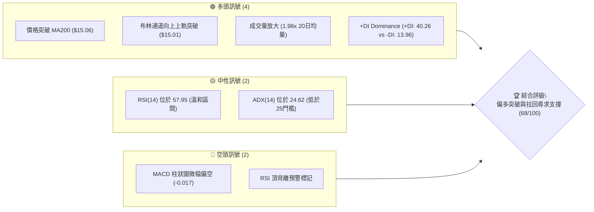
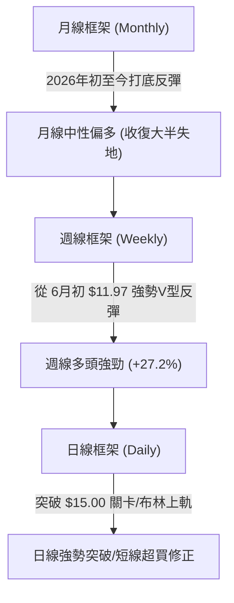
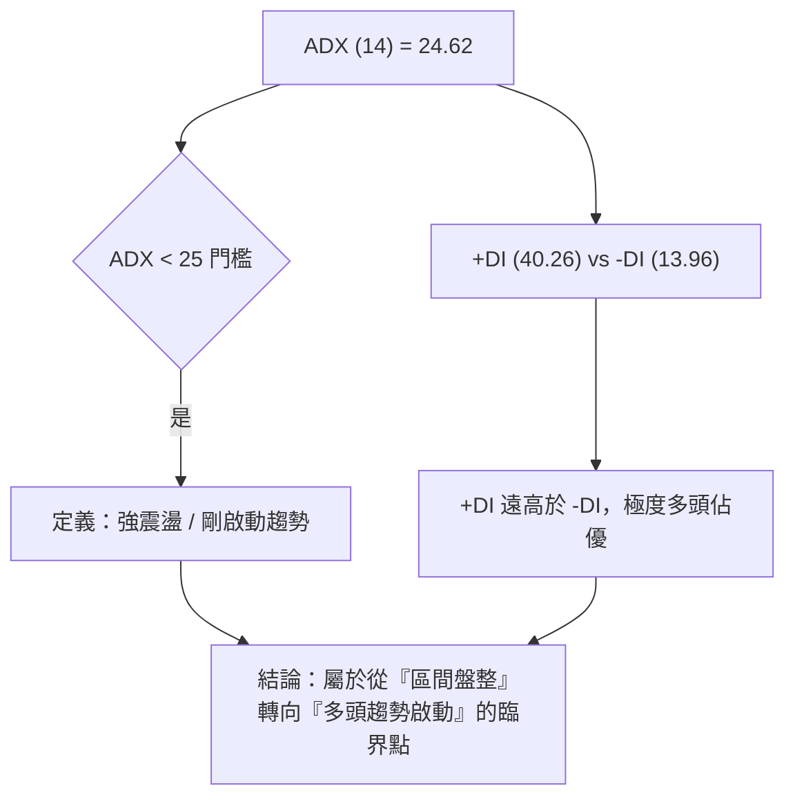
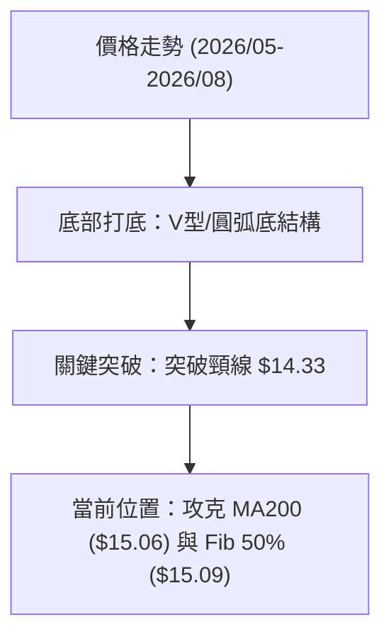
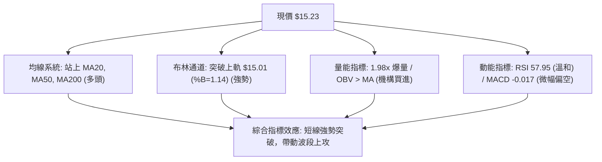
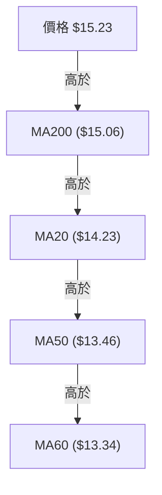
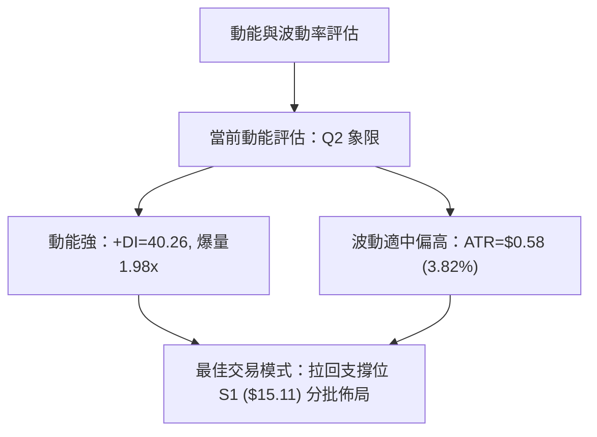
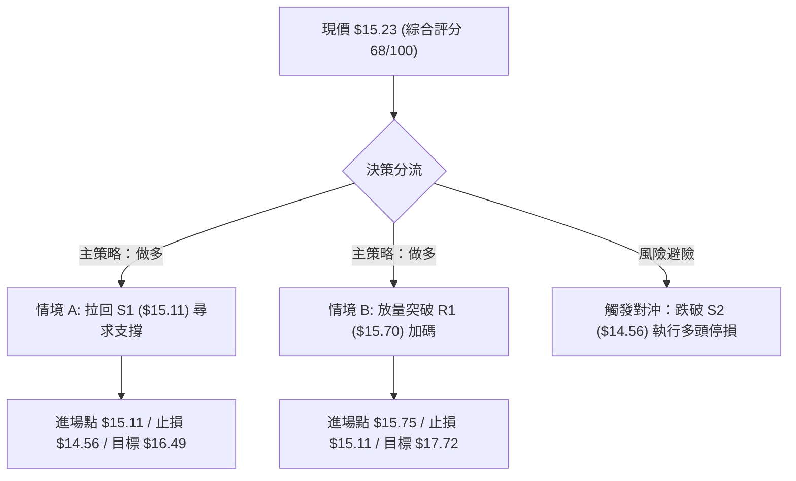
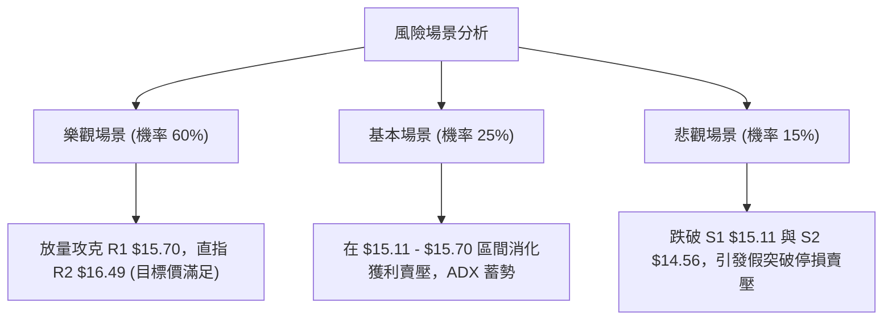

# NU 技術分析報告

> **報告日期**：2026-08-15 ｜ **語言**：繁體中文 ｜ **數據來源**：Yahoo Finance ｜ **當前價格**：$15.23

---

## 目錄

| 章節 | 內容 |
|------|------|
| [1. 技術面概覽](#1-技術面概覽) | 訊號儀表板、核心指標、評分卡 |
| [2. 趨勢分析](#2-趨勢分析) | 多時框趨勢、長中短期走勢 |
| [3. 圖表形態分析](#3-圖表形態分析) | 形態識別、K線組合、目標價 |
| [4. 支撐與阻力](#4-支撐與阻力) | 關鍵價位、斐波那契回調 |
| [5. 技術指標深度解讀](#5-技術指標深度解讀) | MA/RSI/MACD/布林/成交量 |
| [6. 動能與波動率](#6-動能與波動率) | 動能評估、ATR、Beta |
| [7. 多時框架總結](#7-多時框架總結) | 時框架評分矩陣 |
| [8. 交易策略建議](#8-交易策略建議) | 多空策略、風險報酬比 |
| [9. 風險提示與監控](#9-風險提示與監控) | 監控指標、風險場景 |

---

## 1. 技術面概覽

### 🎯 技術訊號儀表板



### 📊 核心指標速覽表

| 指標類別 | 指標名稱 | 當前數值 | 訊號 | 解讀 |
|----------|----------|----------|------|------|
| **價格** | 當前價格 | $15.23 | 🟢 | 站上 MA200 與 斐波那契 50.0% ($15.09) |
| **均線** | MA20 | $14.23 | 🟢 | 價格在 MA20 上方 (+7.00%)，短線支撐強勁 |
| **均線** | MA50 | $13.46 | 🟢 | 價格在 MA50 上方 (+13.15%)，中期趨勢翻多 |
| **均線** | MA200 | $15.06 | 🟢 | 價格剛突破 MA200 (+1.13%)，長線關鍵防線成功奪回 |
| **動能** | RSI(14) | 57.95 | 🟡 | 多頭主導但無嚴重超買，留意頂背離警訊 |
| **動能** | MACD(12,26,9) | -0.017 | 🔴 | MACD 線(0.155) 低於訊號線(0.172)，動能微幅趨緩 |
| **波動** | ATR(14) | $0.58 | 🟡 | 日波動率 3.82%，波動度處於常態範圍 |
| **通道** | 布林 %B | 1.14 | 🟢 | 價格超越布林上軌 ($15.01)，顯示短線強勢突破 |
| **量能** | 20日量比 | 1.98x | 🟢 | 今日成交量 156M，顯著高於 20日均量 (78.9M) |

### 🏆 技術評分卡

```
╔══════════════════════════════════════════════════════════════════╗
║                    技術評分卡 — NU (2026-08-15)                  ║
╠══════════════════════════════════════════════════════════════════╣
║ 趨勢強度      █████████████░░░░░░░░  65/100  🟢 偏多 (DI帶動)   ║
║ 動能指標      ███████████░░░░░░░░░░  58/100  🟡 中性 (MACD回檔) ║
║ 支撐穩定度    ███████████████░░░░░░  75/100  🟢 強勁 ($15.11)   ║
║ 成交量配合    █████████████████░░░░  85/100  🟢 爆量 (1.98x)    ║
║ 形態完整度    ████████████░░░░░░░░░  60/100  🟡 底部完成築底    ║
║ 均線排列      █████████████░░░░░░░░  65/100  🟢 短期均線向上多排 ║
╠══════════════════════════════════════════════════════════════════╣
║ 綜合評分      █████████████░░░░░░░░  68/100  評級：偏多操作     ║
╚══════════════════════════════════════════════════════════════════╝
```

---

## 2. 趨勢分析

### 🌐 多時框趨勢分析



### 📈 長期趨勢 — 12個月走勢圖（Unicode）

```
NU 月線走勢圖（2025-09 至 2026-08）
價格軸 ($)
$18.00 ┤                     ● (17.75)
$17.00 ┤             ●   ●
$16.00 ┤ ●   ●   ●       
$15.00 ┤                         ● (14.98)           ● (15.23 現價)
$14.00 ┤                                 ●   ●   ●  
$13.00 ┤                                             ●   
$12.00 ┤ 
     └────────────────────────────────────────────────────────────
        09  10  11  12  01  02  03  04  05  06  07  08 (月份)
```

**走勢特徵分析表格**：

| 時間區段 | 收盤價區間 | 變動幅度 | 趨勢特徵與市場心理分析 |
|----------|------------|----------|------------------------|
| **2025-09 至 2026-01** | $16.01 → $17.75 | +10.87% | 長期多頭高點創出區間（$17.75），市場對其數位銀行成長抱持高度樂觀。 |
| **2026-02 至 2026-05** | $14.98 → $13.13 | -12.35% | 市場獲利了結與高利率環境壓力，價格進行深幅拉回，尋求中期底部。 |
| **2026-06 至 2026-08** | $11.97 → $15.23 | +27.23% | 強勢 V 型觸底回升，成交量明顯放大，多頭重新奪回 MA200 ($15.06) 控制權。 |

### 📊 中期趨勢（週線分析）

從 2026 年 6 月 7 日的週線低點 $11.97 展開上升波段，週成交量一度高達 762M (2026-07-19)，顯示機構資金強勢進場。截至 2026 年 8 月 16 日週收盤 $15.23，週線 RSI 穩升至 58.0，帶動週線 Bollinger Band 與 MA50 形成中期多頭防守支撐。

### ⚡ 趨勢強度評估（ADX 解讀）



| ADX 區間 | 當前數值 | 市場狀態判斷 | 交易策略導向 |
|----------|----------|--------------|--------------|
| **< 20** | - | 無趨勢盤整 | 區間高拋低吸 |
| **20 - 25** | **24.62** | **弱趨勢/趨勢剛孕育** | **拉回關鍵支撐做多，等待 ADX>25 確認** |
| **25 - 50** | - | 強勁趨勢行情 | 順勢加碼，持有主升段 |
| **> 50** | - | 極端趨勢 / 超買超賣 | 謹防趨勢竭盡反轉 |

---

## 3. 圖表形態分析

### 🔍 形態識別系統



**形態信心度評估表**：

| 形態類別 | 信心度 | 判斷依據（引用數據） | 完成度 | 目標價（附計算式） |
|----------|--------|----------------------|--------|--------------------|
| **V型/雙重底築底** | **75%** | 6月低點 $11.97 觸底後，7月底回檔 $13.84 守穩，8月放量突破頸線 $14.33 | 90% | 頸線 $14.33 + (頸線 $14.33 - 低點 $11.97 = $2.36) = **$16.69** (接近阻力 R2 $16.49) |
| **布林上軌向上張口** | **85%** | 當前價 $15.23 > 上軌 $15.01，%B 達到 1.14 | 100% | 沿通道擴張推升，首要目標 **R1 $15.70** |

### 🕯️ 重要K線形態分析

| 日期/月份 | 收盤價 | K線形態 | 解讀 | 訊號 |
|-----------|--------|---------|------|------|
| **2026-06-07** | $11.97 | 長下影捶子線 (週量 473M) | 探底爆量大換手，主力資金進場護盤築底 | 🟢 強烈買進 |
| **2026-07-19** | $13.59 | 帶量突破實體陽線 (週量 762M) | 天量洗盤後確立中期反彈結構 | 🟢 強勢買進 |
| **2026-08-16** | $15.23 | 中長陽線突破 MA200 | 一舉站上 $15.00 整數關卡與 MA200，形成多頭攻擊 | 🟢 強勢突破 |

### 📉 ASCII 走勢形態示意圖

```
NU 圓弧底 / V型底突破形態示意圖
═════════════════════════════════════════════════════════════════
$16.49 ┤                                                [目標 R2]
$15.70 ┤                                     [阻力 R1]
$15.23 ┤───────────────────────────────● (現價突破)
$15.06 ┤...........................▲▲ (突破 MA200 & 上軌 $15.01)
$14.33 ┤                 ● (頸線突破位)
$13.84 ┤         ● (次低回檔點 S3)
$11.97 ┤  ● (波段最低點)
       └─────────────────────────────────────────────────────────
```

### 🎯 形態目標價計算

1. **V型底測幅目標價**：
   $$\text{頸線價位} = \$14.33$$
   $$\text{形態深度} = \$14.33 - \$11.97 = \$2.36$$
   $$\text{最小測幅目標價} = \$14.33 + \$2.36 = \$16.69$$
   *(該目標價位落於數據庫阻力位 **R2 $16.49** 與 斐波那契 23.6% **$17.14** 之間)*

---

## 4. 支撐與阻力

### 🗺️ 關鍵價位分布圖（Unicode）

```
NU 價位結構分布圖
═════════════════════════════════════════════════════════════════
$18.98 ║████████████████████████║ 52週高點 (Fib 0.0%)
$17.72 ║████████████████        ║ 強阻力 R3
$17.14 ║████████████            ║ Fib 23.6% 回調位
$16.49 ║████████████████████    ║ 阻力 R2 / 形態測幅目標
$16.01 ║████████████            ║ Fib 38.2% 回調位
$15.70 ║████████████████████████║ 關鍵阻力 R1
$15.23 ╠════════════════════════╣ ◄ 現價 ($15.23)
$15.11 ║▓▓▓▓▓▓▓▓▓▓▓▓▓▓▓▓▓▓▓▓▓▓▓▓║ 近期首要支撐 S1 / MA200 ($15.06)
$14.56 ║██████████████████      ║ 強支撐 S2
$14.11 ║████████████████████████║ 強支撐 S3 / MA20 ($14.23)
$11.20 ║████████████████████████║ 52週低點 (Fib 100.0%)
═════════════════════════════════════════════════════════════════
```

### 🚧 阻力位分析表

| 阻力級別 | 價位 | 形成原因 | 突破難度 | 重要性 |
|----------|------|----------|----------|--------|
| **阻力 R1** | **$15.70** | 近一年波段高點聚類與短期解套賣壓區 (+3.05%) | 中等 | 🟢 短線多頭衝鋒第一目標 |
| **阻力 R2** | **$16.49** | 波段高點聚類與 V型形態測幅目標 ($16.69) (+8.28%) | 較高 | 🟡 中期關鍵壓力關卡 |
| **阻力 R3** | **$17.72** | 2026年1月歷史高點區聚類 (+16.32%) | 極高 | 🔴 多頭終極挑戰目標 |

### 🛡️ 支撐位分析表

| 支撐級別 | 價位 | 形成原因 | 守住機率 | 重要性 |
|----------|------|----------|----------|--------|
| **支撐 S1** | **$15.11** | 近一年波段低點聚類、MA200 ($15.06) 與 Fib 50% ($15.09) (-0.82%) | 80% | 🟢 多頭不可失守的防禦陣地 |
| **支撐 S2** | **$14.56** | 波段低點聚類區 (-4.40%) | 85% | 🟢 中期強固支撐平台 |
| **支撐 S3** | **$14.11** | 波段低點聚類與 MA20 ($14.23) 所在區 (-7.39%) | 90% | 🟢 多頭底線防禦網 |

### 📐 斐波那契回調位分析

依據 52週區間（高點 **$18.98** → 低點 **$11.20**，振幅 $7.78）計算：

| 斐波那契比例 | 價位 | 當前價格相對位置與意義 |
|--------------|------|------------------------|
| **0.0%** (52W High) | **$18.98** | 最高反彈極限點 |
| **23.6%** | **$17.14** | 多頭強勢主升段目標區 |
| **38.2%** | **$16.01** | 多頭上攻第二防線 |
| **50.0%** | **$15.09** | **現價 ($15.23) 剛突破此中軸分界線**，確立轉強 |
| **61.8%** | **$14.17** | 強力黃金支撐位（與 MA20 $14.23 重疊） |
| **78.6%** | **$12.86** | 弱勢築底區間 |
| **100.0%** (52W Low) | **$11.20** | 最底層歷史支撐 |

---

## 5. 技術指標深度解讀

### 🎛️ 指標訊號總覽



### 📈 移動平均線排列分析



- **均線排列狀態**：短中期均線（MA5 $14.05, MA10 $14.14, MA20 $14.23, MA50 $13.46）全面呈現**多頭向上發散**。現價 $15.23 成功站上長期生命線 MA200 ($15.06)，均線系統正由「混合排列」轉向「全面多頭排列」。

### 📉 RSI(14) 分析

- **當前數值**：**57.95**
- **強度進度條**：`█████████████░░░░░░░ 57.95%` (位於 30-70 中性偏多區間)
- **背離分析**：⚠️ **頂背離警訊**。當前價格 $15.23 接近前期高點，但日線 RSI 僅為 57.95（低於 2026年4月中旬的 RSI 79.6）。此現象說明短線漲勢過快，需注意衝高至 **R1 $15.70** 附近可能面臨的高檔震盪洗盤。

### 📊 MACD(12/26/9) 訊號解讀

- **MACD 線**：0.155
- **訊號線 (Signal)**：0.172
- **MACD 柱狀圖**：**-0.017** 🔴
- **解讀**：MACD 柱狀圖收窄至 -0.017，顯示短線動能微幅拉回修正。然而，由於 MACD 與 Signal 均維持在 0 軸上方（0.155/0.172），整體波段仍受多頭控盤，屬於「大漲小回」的正常動能消化。

### 📦 布林通道分析

```
NU 布林通道位置示意圖
═════════════════════════════════════════════════════════════════
$15.01 ┤───────────────────────────● 現價 $15.23 (%B = 1.14)
       │                           (突破布林通道上軌 $15.01)
$14.23 ┼─────────────────────────── 中軌 MA20 ($14.23)
       │
$13.46 ┴─────────────────────────── 下軌 ($13.46)
═════════════════════════════════════════════════════════════════
```

- **通道狀態**：布林帶寬擴張，%B 高達 1.14，表明股價正沿著布林上軌進行強勢通道突破。若未來 2-3 個交易日能守穩上軌 $15.01，將開啟新一波通道噴行情。

### 💹 成交量分析（量價配合度）

- **最新成交量**：156,272,681 股
- **20日均量**：78,976,814 股 (**量比：1.98x**)
- **OBV 趨勢**：OBV > MA，量能指標持續創出新高。
- **結論**：股價大漲 10% 以上的同時伴隨近 2 倍均量的強勢放大，代表機構法人（持股 81.2%）積極建倉，**量價配合極度健康**。

---

## 6. 動能與波動率

### ⚡ 動能評估四象限

| 象限 | 動能強度 | 波動率水準 | NU 當前定位 | 策略解讀 |
|------|----------|------------|-------------|----------|
| **Q1** | 強 (High) | 低 (Low) | - | 最佳穩定持股區 |
| **Q2** | **強 (High)** | **高 (High)** | **✓ (NU 定位區)** | **爆量突破，攻擊力道強但短線擺幅加大，適合拉回掛單進場** |
| **Q3** | 弱 (Low) | 高 (High) | - | 高風險下跌段，嚴禁做多 |
| **Q4** | 弱 (Low) | 低 (Low) | - | 無熱度盤整區 |



### 📊 ATR 波動率分析

- **ATR(14)**：**$0.58**（佔當前股價 3.82%）
- **止損距離建議**：
  - **短線交易止損 (1.0x ATR)**：$15.23 - $0.58 = **$14.65**
  - **波段交易止損 (1.5x ATR)**：$15.23 - ($0.58 × 1.5) = **$14.36**
  - **結構性止損 (守 S2)**：精確設於 **$14.56**

### 📐 Beta 與市場相關性

- **Beta**：**0.942**
- **解讀**：Beta 接近 1.0，代表 NU 與美股大盤（S&P 500）保持高度同步性，無過度槓桿化系統風險，適合做為金融科技（Fintech）板塊的核心配置標的。

---

## 7. 多時框架總結

### 📋 時框架評分表

| 時框架 | 趨勢方向 | 動能狀態 | 均線排列 | 形態結構 | 綜合評分 | 建議 |
|--------|----------|----------|----------|----------|----------|------|
| **月線 (Monthly)** | 🟡 中性回升 | 中性 (RSI 50+) | 交錯平穩 | 底部醞釀 | **62/100** | 長線建立基本倉位 |
| **週線 (Weekly)** | 🟢 強勁多頭 | 強勢 (+DI 主導) | 多頭發散 | V型底突破 | **75/100** | 中期波段持有 |
| **日線 (Daily)** | 🟢 爆量突破 | 強勁但 MACD 微偏 | 站上 MA200 | 突破布林上軌 | **68/100** | **逢拉回 S1 分批做多** |

### 🔲 綜合訊號矩陣

| 評估維度 | 日線 (Daily) | 週線 (Weekly) | 月線 (Monthly) | 訊號一致性 |
|----------|--------------|───────────────|────────────────|------------|
| **趨勢方向** | 🟢 看多 | 🟢 看多 | 🟡 中性 | **高度一致偏多** |
| **均線支撐** | 🟢 站上 MA200 | 🟢 站上 MA50 | 🟡 位於 MA20 附近 | **多頭主導** |
| **量能配合** | 🟢 1.98x 爆量 | 🟢 爆量換手 | 🟢 溫和遞增 | **極佳** |

### ⚖️ 多時框收斂結論

> **多時框收斂規則應用**：
> 當前 ADX 為 24.62（低於 25 門檻），市場處於「從區間盤整跨入趨勢行情」的過渡階段。依據多時框收斂法則，交易應**以週線多頭方向為主導**，並利用日線的突破拉回（Pullback to S1 $15.11）尋找最佳進場點。
> 
> **最終收斂結論**：**偏多操作 (Bullish Sector Buy)**，主推「拉回首要支撐 S1 建倉」或「突破 R1 追價」策略。

---

## 8. 交易策略建議

### 🗺️ 策略決策流程圖



### 🧭 策略路由

**當前主策略方向 = 🟢 多頭主導策略（綜合評分 68/100，≥60 門檻）**

### 🎯 價格情境階梯（Price Scenarios）

| 觸發條件 | 下一目標 | 後續延伸 | 情境含義 |
|----------|----------|----------|----------|
| **突破 R1 $15.70** | **R2 $16.49** | **R3 $17.72** | 多頭主升段啟動，V型底測幅滿足 |
| **站穩現價區間 ($15.09 - $15.23)** | **R1 $15.70** | **R2 $16.49** | 消化高檔賣壓，蓄勢上攻 |
| **跌破 S1 $15.11** | **S2 $14.56** | **S3 $14.11** | MA200 假突破，回檔測試均線支撐 |

### 📊 情境機率分佈

| 情境 | 機率 | 主要依據 |
|------|------|----------|
| **拉回守穩 / 繼續上攻** | **60%** | **成交量爆發 (1.98x)、+DI (40.26) 佔優、站上 MA200 ($15.06)** |
| **高檔區間震盪 ($15.11 - $15.70)** | **25%** | **ADX (24.62) 低於 25，MACD 柱狀圖微幅回檔 (-0.017)** |
| **跌破支撐回落** | **15%** | **RSI 頂背離潛在預警** |

### 🟢 主策略詳情（多頭路由）

| 策略要素 | 策略 A：拉回買進策略 (Pullback Buy) | 策略 B：突破追價策略 (Breakout Buy) |
|----------|─────────────────────────────────────|─────────────────────────────────────|
| **進場條件** | 價格回檔至 **S1 $15.11** / **Fib 50% $15.09** 附近止跌 | 價格強勢突破並收高於 **R1 $15.70** |
| **進場價格** | **$15.11** | **$15.75** (突破 R1 後確認) |
| **目標價 T1** | **$15.70** (阻力 R1，預期收益 +3.91%) | **$16.49** (阻力 R2，預期收益 +4.70%) |
| **目標價 T2** | **$16.49** (阻力 R2，預期收益 +9.13%) | **$17.72** (阻力 R3，預期收益 +12.51%) |
| **止損價格** | **$14.56** (精確採用支撐 S2) | **$15.11** (精確採用支撐 S1 / MA200) |
| **單筆風險** | $15.11 - $14.56 = **$0.55** (-3.64%) | $15.75 - $15.11 = **$0.64** (-4.06%) |
| **風險報酬比** | **1 : 2.51** (以目標 T2 $16.49 計算) | **1 : 3.08** (以目標 T2 $17.72 計算) |
| **成功機率** | **65%** | **55%** |
| **建議倉位** | **15% - 20%** 總資金 | **10% - 15%** 總資金 |

### 🔴 反向風險觸發點（對沖與風控提示）

- **多頭停損觸發條件**：若日線收盤價跌破 **S2 $14.56**，代表本次突破 MA200 宣告失敗，應全面清減多頭部位。
- **對沖啟動點**：若價格向下貫穿 **S3 $14.11**，可建立適量反向對沖部位（或賣出 Call）鎖定利潤。

### ⭐ 整體訊號強度評星

```
做多訊號強度：★★██☆  (4.0/5星)  🟢 強烈偏多
做空訊號強度：★░░░░  (1.0/5星)  🔴 不建議做空
整體可信度：  ★★██☆  (4.0/5星)  🟢 量價高度確認
```

---

## 9. 風險提示與監控

### ✅ 關鍵監控指標 Checklist

```
╔══════════════════════════════════════════════════════════════════╗
║                    每日技術面監控 Check List                     ║
╠══════════════════════════════════════════════════════════════════╣
║ [ ] 每日收盤價是否維持在 S1 $15.11 (MA200 $15.06) 上方           ║
║ [ ] 成交量是否能維持在 20日均量 (78.9M) 之上                    ║
║ [ ] MACD 柱狀圖是否由負 (-0.017) 轉正                            ║
║ [ ] ADX(14) 能否正式突破 25，開啟強勢單邊趨勢                    ║
║ [ ] RSI(14) 是否向 70 衝刺或出現進一步頂背離修正                 ║
╚══════════════════════════════════════════════════════════════════╝
```

### ⚠️ 風險場景分析



### 🛡️ 風險管理重要提醒

1. **MA200 假突破風險**：現價 $15.23 僅高於 MA200 ($15.06) 約 1.13%，需至少觀察 2 個交易日確認突破有效性，切勿一次性開滿倉位。
2. **波動率管理**：基於 ATR = $0.58，個股單日波幅約為 3.82%，建議將個股單次虧損金額控制在總投資組合資金的 1% - 1.5% 以內。

---

## 📋 報告總結

```
╔══════════════════════════════════════════════════════════════════╗
║                   NU 技術分析報告總結                            ║
════════════════════════════════════════════════════════════════════
報告日期：2026-08-15
當前價格：$15.23
分析評級：🟢 偏多突破 (Bullish Breakout) / 建議買進

關鍵結論：
├─ 長期趨勢：🟢 站上 MA200 ($15.06) 與 Fib 50% ($15.09)，長線轉強
├─ 中期趨勢：🟢 週線 V 型底完成，頸線 $14.33 突破，目標上看 $16.49
├─ 短期趨勢：🟢 爆量 1.98x 突破布林上軌 ($15.01)，短線極度強勢
├─ 關鍵支撐：S1 $15.11 / S2 $14.56 / S3 $14.11
├─ 關鍵阻力：R1 $15.70 / R2 $16.49 / R3 $17.72
└─ 分析師目標：$17.98 (平均目標價，上行空間 +18.05%)

最優策略組合：
1. 🥇 最佳機會：拉回 S1 $15.11 分批建倉做多，止損設 S2 $14.56，目標 R2 $16.49 (風報比 1:2.51)
2. 🥈 次選機會：突破 R1 $15.70 追價加碼，止損設 S1 $15.11，目標 R3 $17.72 (風報比 1:3.08)
3. 🥉 保守選擇：等待 ADX > 25 且 MACD 柱狀圖轉正後，再行順勢進場
════════════════════════════════════════════════════════════════════
```

---

> ⚠️ **免責聲明**：本報告為 AI 自動生成之技術分析，所有數據及估算均基於提供的歷史價格資訊。本報告**僅供研究與學術參考**，**不構成任何投資建議**。投資有風險，入市需謹慎。

---

*報告生成時間：2026-08-15 ｜ 數據來源：Yahoo Finance ｜ 分析框架：多時框技術分析*