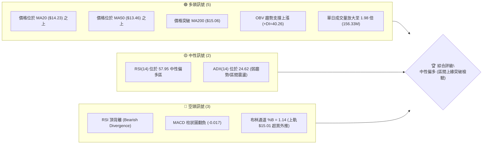
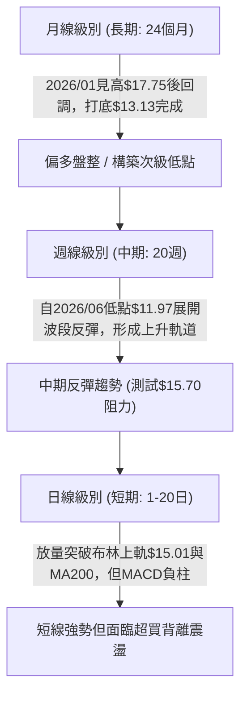
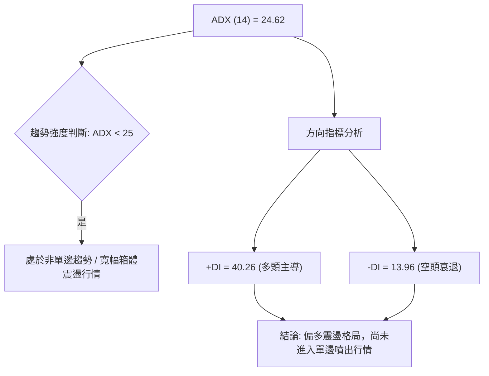
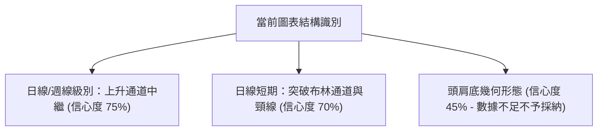
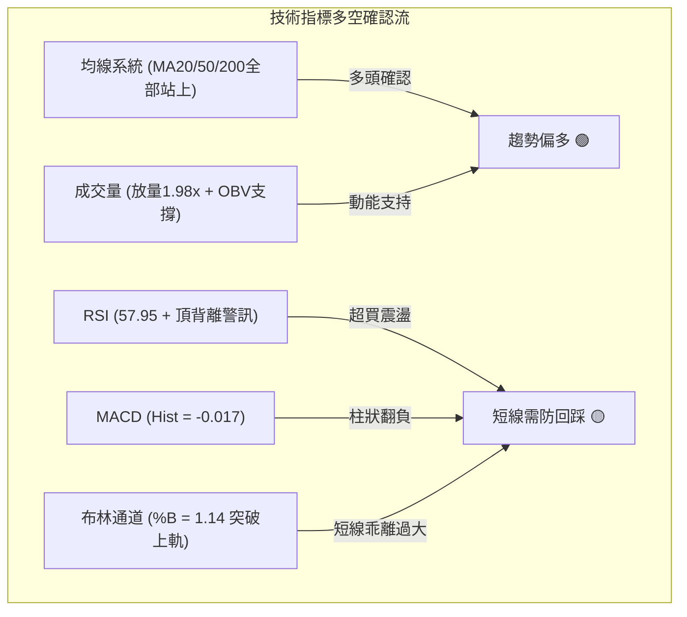
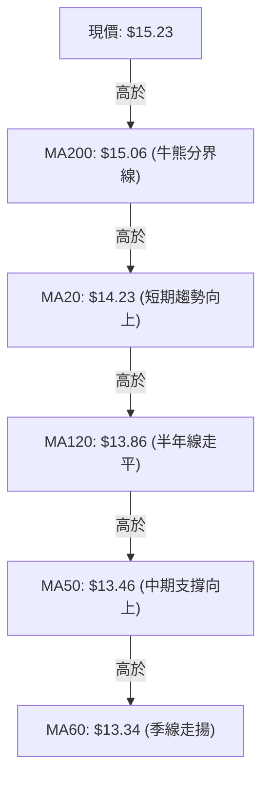
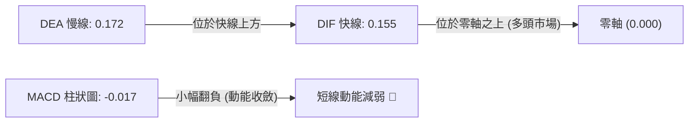
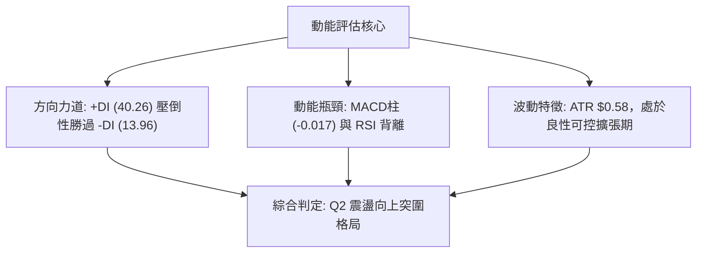
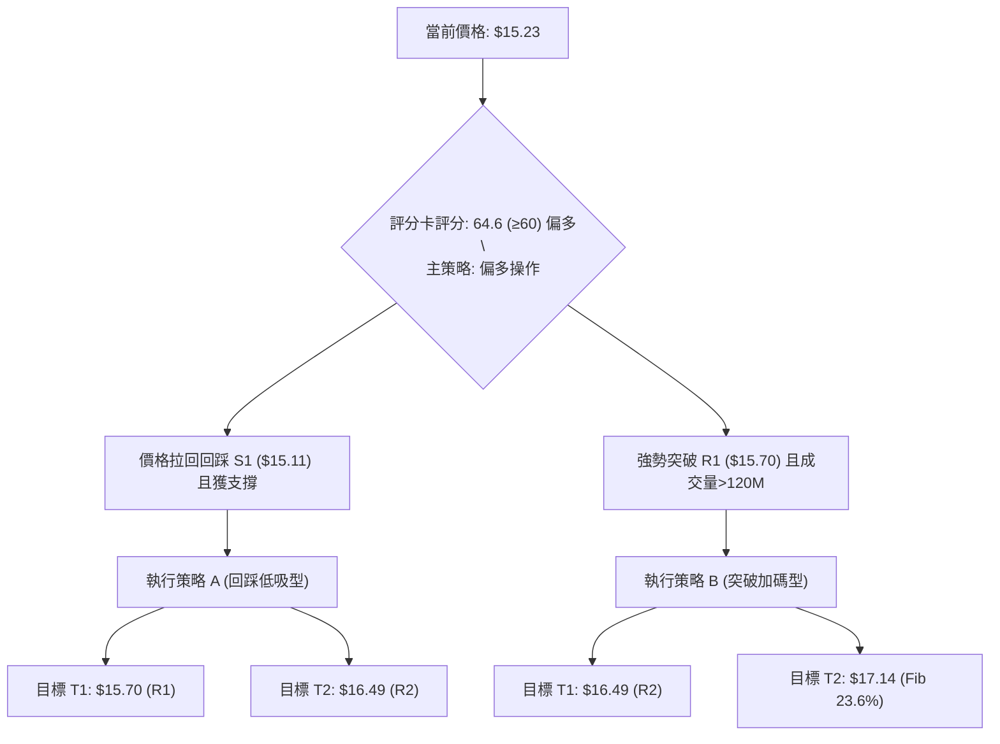
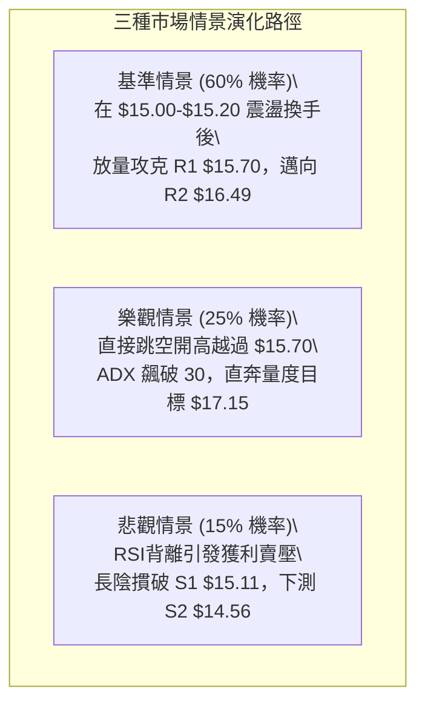

# NU 技術分析報告

> **報告日期**：2026-08-16 ｜ **語言**：繁體中文 ｜ **數據來源**：Yahoo Finance ｜ **當前價格**：$15.23

---

## 目錄

| 章節 | 內容 |
|------|------|
| [1. 技術面概覽](#1-技術面概覽) | 訊號儀表板、核心指標、評分卡 |
| [2. 趨勢分析](#2-趨勢分析) | 多時框趨勢、長中短期走勢 |
| [3. 圖表形態分析](#3-圖表形態分析) | 形態識別、K線組合、目標價 |
| [4. 支撐與阻力](#4-支撐與阻力) | 關鍵價位、斐波那契回調 |
| [5. 技術指標深度解讀](#5-技術指標深度解讀) | MA/RSI/MACD/布林/成交量 |
| [6. 動能與波動率](#6-動能與波動率) | 動能評估、ATR、Beta |
| [7. 多時框架總結](#7-多時框架總結) | 時框架評分矩陣 |
| [8. 交易策略建議](#8-交易策略建議) | 多空策略、風險報酬比 |
| [9. 風險提示與監控](#9-風險提示與監控) | 監控指標、風險場景 |
| [10. 報告總結](#-報告總結) | 總結儀表板與核心決策摘要 |

---

## 1. 技術面概覽

### 🎯 技術訊號儀表板



### 📊 核心指標速覽表

| 指標類別 | 指標名稱 | 當前數值 | 訊號 | 解讀 |
|----------|----------|----------|------|------|
| **價格** | 當前價格 | $15.23 | 🟢 | 位於52週區間51.8%，站上斐波那契50.0%回調位($15.09) |
| **均線** | MA20 | $14.23 | 🟢 | 現價高於MA20達 +7.03%，短均呈多頭排列 |
| **均線** | MA50 | $13.46 | 🟢 | 現價高於MA50達 +13.15%，中短期底部支撐確立 |
| **均線** | MA200 | $15.06 | 🟢 | 現價微幅突破長期牛熊分界線(+1.13%)，需確認收盤站穩 |
| **動能** | RSI(14) | 57.95 | 🟡 | 位於50-70強勢區，但日線級別出現頂背離警訊 |
| **動能** | MACD | 0.155 / 0.172 | 🔴 | DIF位於Signal之下，Hist為-0.017，短線動能放緩 |
| **動能** | Stochastic | %K:65.26 / %D:38.70 | 🟢 | K值自低位向上交叉D值，短線反彈動能重啟 |
| **趨勢** | ADX(14) | 24.62 | 🟡 | ADX < 25 表明處於盤整或趨勢轉換期；+DI (40.26) 壓制 -DI (13.96) |
| **通道** | 布林通道 | 上軌 $15.01 / %B: 1.14 | 🔴 | 價格突破布林上軌，短期技術面存在乖離修正或回踩需求 |
| **成交量** | 最新成交量 | 156.33M (量比 1.98x) | 🟢 | 顯著高於20日均量(78.98M)，突破伴隨量能確認 |
| **波動** | ATR(14) | $0.58 (3.82%) | 🟡 | 日內波動適中，提供明確的止損空間依據 |

### 🏆 技術評分卡

```
╔══════════════════════════════════════════════════════════════════╗
║              技術評分卡 — NU (2026-08-16)                        ║
╠══════════════════════════════════════════════════════════════════╣
║ 趨勢強度 (Trend)     ████████████░░░░░░░░  60/100  🟡 中性偏多    ║
║ 動能指標 (Momentum)  ██████████░░░░░░░░░░  52/100  🟡 指標背離    ║
║ 支撐穩定度 (Support) ██████████████░░░░░░  70/100  🟢 底層扎實    ║
║ 成交量配合 (Volume)  ████████████████░░░░  80/100  🟢 放量推升    ║
║ 形態完整度 (Pattern) ████████████░░░░░░░░  58/100  🟡 箱體構築    ║
║ 均線排列 (Moving Avg)██████████████░░░░░░  68/100  🟢 多線收斂向上║
╠══════════════════════════════════════════════════════════════════╣
║ 綜合技術評分         █████████████░░░░░░░  64.6/100  🟢 偏多區間操作║
╚══════════════════════════════════════════════════════════════════╝
```

---

## 2. 趨勢分析

### 🌐 多時框趨勢分析



### 📈 長期趨勢 — 12個月走勢圖（Unicode）

```
NU 月線走勢圖（過去12個月：2025-08 至 2026-08）
價格 ($)
$18.00 ┤                                  ● $17.75(26/01)
$17.00 ┤                          ● $17.39        ● $16.74
$16.00 ┤                  ● $16.01 ● $16.11
$15.00 ┤          ● $14.80                                ● $14.98              ● $15.23 (現價)
$14.00 ┤                                                          ● $14.37 ● $14.48       ● $14.33
$13.00 ┤                                                                          ● $13.13 ● $13.36
$12.00 ┤
       └────┬──────┬──────┬──────┬──────┬──────┬──────┬──────┬──────┬──────┬──────┬──────┬─────
          25-08  25-09  25-10  25-11  25-12  26-01  26-02  26-03  26-04  26-05  26-06  26-07  26-08
```

#### 走勢特徵分析表格

| 階段區間 | 時間跨度 | 起訖收盤價 | 漲跌幅 | 走勢結構與量價特徵 |
|----------|----------|------------|--------|-------------------|
| 主升浪攻擊 | 2025/08 - 2026/01 | $14.80 → $17.75 | +19.93% | 月線連6紅，創波段歷史高點，法人機構買盤積極推升 |
| 獲利回吐潮 | 2026/01 - 2026/03 | $17.75 → $14.37 | -19.04% | 連續長陰回落，失守短期均線，高檔籌碼鬆動換手 |
| 築底震盪區 | 2026/04 - 2026/06 | $14.48 → $13.36 | -7.73% | 於 $13.13-$13.36 形成中期雙重底支撐，週線爆出巨量承接 |
| 次級反彈浪 | 2026/07 - 2026/08 | $13.36 → $15.23 | +13.99% | 量能放大(最新單週381.37M)，突破中短期均線收復 $15.00 關卡 |

### 📊 中期趨勢（週線分析）

中期走勢圖展示了近期自 2026 年 6 月底部 $11.97 回升以來的階梯式反彈走勢：

```
中期關鍵價位示意圖
$17.72 ────────────────────────────────────────── [R3 強阻力 / 前波高點聚類]
$16.49 ────────────────────────────────────────── [R2 中期強壓]
$15.70 ────────────────────────────────────────── [R1 短線目標壓制區]
$15.23 ───► ● [現價: 突破MA200與斐波那契50.0%] 
$15.11 ────────────────────────────────────────── [S1 第一線回踩支撐]
$14.56 ────────────────────────────────────────── [S2 關鍵頸線支撐]
$14.11 ────────────────────────────────────────── [S3 波段防守強支撐]
```

### ⚡ 趨勢強度評估（ADX 解讀）



#### ADX 趨勢強度對照表

| 指標 | 數值 | 狀態 | 意涵與交易指導原則 |
|------|------|------|-------------------|
| **ADX(14)** | 24.62 | 弱趨勢/盤整 (<25) | 趨勢強度稍顯不足，避免盲目追高，適合採取「區間下緣低吸、阻力位調節」策略 |
| **+DI** | 40.26 | 極強 | 多頭買盤力道強勁，主導目前短中期價格推進 |
| **-DI** | 13.96 | 低迷 | 空方拋壓顯著衰退，下行空間受限 |
| **DI差值** | +26.30 | 多頭擴張 | 短線方向明確向上，若 ADX 突破 25 則將演化為單邊主升趨勢 |

---

## 3. 圖表形態分析

### 🔍 形態識別系統



#### 形態識別信心度與目標價評估表

| 形態類別 | 信心度 | 判斷依據（引用技術數據） | 完成度 | 目標價（附嚴格計算式） |
|----------|--------|--------------------------|--------|------------------------|
| **雙重底反轉 (W底)** | 75% | 2026/05低點($12.19)與2026/06低點($11.97)獲確認，頸線位於 S2 $14.56 | 100% (已突破) | 形態高度 = $14.56 - $11.97 = $2.59。<br>目標價 = 頸線 $14.56 + $2.59 = **$17.15** (接近斐波那契23.6% $17.14) |
| **布林上軌擴張突破** | 70% | 現價 $15.23 突破 BB 上軌 $15.01，且 %B 達 1.14，伴隨量比 1.98x | 85% | 依波段延伸推算短線第一阻力 **$15.70 (R1)** |
| **複雜頭肩底** | 45% | 缺乏對稱右肩成交量結構，數據未完全吻合標準形態 | 30% | *訊號不足，依規則15不予強行推算，轉為指標型解讀* |

### 🕯️ 重要K線形態分析

| 日期/月份 | 收盤價 | K線形態特徵 | 技術解讀 | 訊號強度 |
|-----------|--------|-------------|----------|----------|
| 2026-06-07 | $11.97 | 長下影放量大陰破底翻 | 週成交量 473.47M，空頭力竭，主力資金進場低吸 | 🟢 強力看多 |
| 2026-07-19 | $13.59 | 巨量十字星震盪換手 | 單週爆出 762.06M 歷史天量，清洗浮額確立中底 | 🟢 多頭蓄勢 |
| 2026-08-09 | $13.84 | 縮量回踩MA20/MA50 | 週成交量萎縮至 251.19M，回踩 $13.80 支撐不破 | 🟢 良性回調 |
| 2026-08-16 | $15.23 | 放量長陽突破實體 | 單日量比 1.98x，週量增至 381.37M，實體光頭陽線突破 | 🟢 強勢買進 |

### 📉 ASCII 走勢形態示意圖

```
雙底頸線突破形態結構示意圖：
價格 ($)
$17.15 ┤                                                  [形態理論目標價]
       │                                                 /
$15.70 ┤                                           [R1] /
$15.23 ┤───────────────────────────────────────► ● (當前突破拉升點)
$15.00 ┤--------------------------------------/-- (MA200 / BB上軌 $15.01)
$14.56 ┤================ 頸線突破位置 (Neckline) =================
       │                 /                  \
$13.50 ┤                /                    \
       │  \            /                      \            /
$12.19 ┤   ● (第1底)─-                         \          /
$11.97 ┤                                        ● (第2底)-
       └──────────────────────────────────────────────────────────
          2026-05-17                           2026-06-07
```

### 🎯 形態目標價計算

1. **第一階目標價（短線壓力 R1）**：
   - 依近一年波段高點聚類計算，直接對應關鍵阻力 **$15.70**（距離現價 +3.05%）。
2. **第二階目標價（W底形態完全量度）**：
   - 計算式：$\text{頸線價格} (\$14.56) + \text{形態垂直高度} (\$14.56 - \$11.97 = \$2.59) = \mathbf{\$17.15}$。
   - 該價位高度契合 52 週回調 23.6% 位 **$17.14** 與關鍵阻力 **$17.72 (R3)** 之前哨站。

---

## 4. 支撐與阻力

### 🗺️ 關鍵價位分布圖（Unicode）

```
NU 價位結構分布圖
═════════════════════════════════════════════════════════════════════
$18.98 ║████████████████████████████████║ 52週歷史高點 (0.0% Fib)
$17.72 ║████████████████████████        ║ 強阻力 R3 / 前波高點聚類 (+16.32%)
$17.14 ║▓▓▓▓▓▓▓▓▓▓▓▓▓▓▓▓▓▓▓▓            ║ 斐波那契 23.6% 回調位 / W底量度目標
$16.49 ║████████████████                ║ 波段阻力 R2 (+8.28%)
$16.01 ║▓▓▓▓▓▓▓▓▓▓▓▓                    ║ 斐波那契 38.2% 回調位
$15.70 ║████████████                    ║ 關鍵短線阻力 R1 (+3.05%)
$15.23 ╠════════════════════════════════╣ ◄ 現價 ($15.23)
$15.11 ║▓▓▓▓▓▓▓▓▓▓▓▓▓▓▓▓▓▓▓▓▓▓▓▓        ║ 第一線支撐 S1 / 波段低點聚類 (-0.82%)
$15.09 ║────────────────────────────────║ 斐波那契 50.0% 回調位 / MA200 ($15.06)
$14.56 ║████████████████████████████    ║ 關鍵頸線強支撐 S2 (-4.40%)
$14.11 ║████████████████████████████████║ 波段防守強支撐 S3 (-7.39%)
$13.46 ║────────────────────────────────║ MA50 均線支撐 / 布林下軌
$11.20 ║████████████████████████████████║ 52週歷史低點 (100.0% Fib)
═════════════════════════════════════════════════════════════════════
```

### 🚧 阻力位分析表

| 阻力級別 | 精確價位 | 形成原因與數據來源 | 突破難度 | 重要性評估 |
|----------|----------|-------------------|----------|------------|
| **R1** | **$15.70** | 近一年波段高點聚類；上方第1道籌碼密集賣壓區 | 中等 (需要成交量維持>100M) | 🟡 短線多空分水嶺 |
| **R2** | **$16.49** | 波段密集成交高點，2025/12反彈回落平台 | 較高 (空方阻擊重鎮) | 🔴 中期波段反彈目標 |
| **R3** | **$17.72** | 2026/01 月線最高收盤價聚類區 ($17.75附近) | 極高 (套牢籌碼沉重) | 🔴 長期趨勢完全逆轉點 |

### 🛡️ 支撐位分析表

| 支撐級別 | 精確價位 | 形成原因與數據來源 | 守住機率 | 重要性評估 |
|----------|----------|-------------------|----------|------------|
| **S1** | **$15.11** | 近期波段回踩低點聚類，貼合斐波那契50%($15.09)及MA200($15.06) | 70% | 🟢 短線多頭防守前哨 |
| **S2** | **$14.56** | 雙底突破頸線位置，近一年波段密集成交低點 | 85% | 🟢 中期上升趨勢生命線 |
| **S3** | **$14.11** | 強力波段支撐聚類，貼合斐波那契61.8%($14.17)與MA20($14.23) | 95% | 🟢 長期防守底線 (破則翻空) |

### 📐 斐波那契回調位分析

依據 52 週波動區間（高點 **$18.98** → 低點 **$11.20**，垂直落差 $7.78）計算回調結構：

- **0.0% ($18.98)**：52週最高點，終極多頭目標。
- **23.6% ($17.14)**：強阻力區，與雙底量度目標 $17.15 重疊。
- **38.2% ($16.01)**：中長期阻力分水嶺。
- **50.0% ($15.09)**：◄ **現價 ($15.23) 剛突破此位置**。此處為經典的多空均勢平衡線，站穩 $15.09-$15.11 意味著多方已扭轉過去半年的下行弱勢。
- **61.8% ($14.17)**：黃金分割強支撐區，與 MA20 ($14.23) 及 S3 ($14.11) 形成堅固共振支撐帶。
- **78.6% ($12.86)**：中期極限回調支撐。
- **100.0% ($11.20)**：52週最低點。

---

## 5. 技術指標深度解讀

### 🎛️ 指標訊號總覽



### 📈 移動平均線排列分析



#### 均線系統詳細參數表

| 均線名稱 | 當前價格 | 與現價乖離率 | 走勢特徵 | 訊號意涵 |
|----------|----------|--------------|----------|----------|
| **MA 5** | $14.05 | +8.43% | 急速向上拉升 (`...█████████▇▆▅▃▃▅`) | 短期爆發力強 |
| **MA 10** | $14.14 | +7.68% | 穩定陡峭攀升 (`...████████▇▇▇▇`) | 助漲動能明確 |
| **MA 20** | $14.23 | +7.00% | 向上發散 (`...██████████`) | 月線支撐穩固 |
| **MA 50** | $13.46 | +13.15% | 築底向上開口 | 中期趨勢翻多 |
| **MA 60** | $13.34 | +14.13% | 落底回升 (`...▂▂▂▃▄▄▆`) | 季線轉為實質支撐 |
| **MA 120** | $13.86 | +9.87% | 下跌趨緩走平 | 中長期賣壓消化完畢 |
| **MA 200** | $15.06 | +1.13% | 走平微升 | 股價突破長期牛熊分界線 |
| **MA 240** | $15.13 | +0.67% | 高檔走平 | 年線收復，長期架構修復 |

*均線排列解讀*：當前 MA5 > MA10 > MA20，短均線形成標準多頭發散；且價格成功躍上 MA200 ($15.06) 與 MA240 ($15.13)，均線架構正由「混合震盪排列」向「全面多頭排列」過渡。

### 📉 RSI(14) 分析

- **RSI 當前數值**：**57.95**
  ```
  RSI(14) 水平：[ 0 ──────── 30 ─────── 50 ──●── 70 ──────── 100 ] (57.95)
  強度條：████████████░░░░░░░░  57.95% (中性偏多)
  ```
- **背離分析判斷**：
  - **形態警訊**：日線圖中，價格由前高推進至 $15.23，但 RSI 僅回升至 57.95（低於 2026/04/19 高點時的 79.6 及 2026/07/05 的 79.0），形成技術性 **⚠️ 頂背離 (Bearish Divergence)**。
  - **結論**：頂背離表明此波拉升主要由特定買盤急推，內在動能擴張未達極致，預示在突破 R1 ($15.70) 前後易出現短線技術性回踩與橫盤震盪。

### 📊 MACD(12/26/9) 訊號解讀



- **MACD 解讀**：DIF (0.155) 與 DEA (0.172) 雙雙保持在零軸上方，確認長線處於多頭掌控區域。然而 MACD 柱狀圖為 **-0.017**，呈現死叉邊緣的微幅負值，與日線 RSI 頂背離相互驗證，代表短線追高動能不足，不可盲目市價追價。

### 📦 布林通道分析

```
NU 布林通道 (20, 2) 結構圖
價格 ($)
$15.23 ──► ● [現價突破上軌，%B = 1.14]
$15.01 ─── ═════════════════════════════════ [BB 上軌 (超買臨界)]
           │ 
$14.23 ─── ───────────────────────────────── [BB 中軌 (MA20 生命線)]
           │ 
$13.46 ─── ═════════════════════════════════ [BB 下軌 (強烈支撐)]
```

- **通道帶寬與位置**：上軌 $15.01、中軌 $14.23、下軌 $13.46，帶寬為 $1.55 (10.9%)。
- **%B 指標分析**：%B 達 **1.14**（> 1.0），股價運行於上軌外側。在 ADX < 25 的盤整震盪市場中，布林通道 %B > 1.0 通常意味著高機率的「均值回歸」，短線回踩中軌 $14.23 或確認上軌轉支撐（$15.01-$15.11）的概率極高。

### 💹 成交量分析（量價配合度）

- **量能激增**：最新成交量達 **156.33M**，相較 20 日均量 (78.98M) 放大 **1.98倍**，相較 50 日均量 (76.09M) 放大 **2.05倍**。
- **OBV 能量潮**：OBV > MA，量能指標呈現陡峭向上走勢，與價格上漲完全匹配，顯示主力籌碼持續流入，未見量價頂背離，量能有效支撐價格向上拓展。

---

## 6. 動能與波動率

### ⚡ 動能評估

#### 動能與波動率矩陣分析表

| 象限標籤 | 動能狀態 | 波動率狀態 | 當前匹配度 | 戰略含義與操作指引 |
|----------|----------|------------|------------|-------------------|
| **Q1 (主升浪)** | 強動能 (ADX>25) | 低/中波動 | 30% | 最佳波段加碼點，目前尚缺 ADX 突破 25 之確認 |
| **Q2 (震盪突破)** | 中等動能 (+DI強) | 中等波動 (ATR 3.82%) | **70% (當前狀態)** | **區間突破初期，量能先行，需提防指標背離回踩** |
| **Q3 (高危洗盤)** | 弱動能 | 高波動 | 10% | 易遭雙向打損，不符合當前盤勢 |
| **Q4 (陰跌衰退)** | 空頭動能 (-DI強) | 低波動 | 0% | 空方主導，與當前強 +DI (40.26) 矛盾 |



### 📊 ATR 波動率分析

- **ATR(14) 數值**：**$0.58**（佔當前股價之 **3.82%**）。
- **波動率含義**：NU 每日正常隨機波動區間約在 $\pm \$0.58$。
- **風控與止損設定指引**：
  - **短線交易止損距離**：建議設定為 $1.5 \times \text{ATR} = 1.5 \times \$0.58 = \mathbf{\$0.87}$。
  - **波段交易止損距離**：建議設定為 $2.0 \times \text{ATR} = 2.0 \times \$0.58 = \mathbf{\$1.16}$。
  - **進場緩衝保護**：現價 $15.23 下方之第一支撐 S1 為 $15.11（距離現價 $0.12），若跌破 S1 並進一步跌破 S2 ($14.56)，總回撤達 $0.67（約 $1.15 \times \text{ATR}$），即宣告短線突圍失敗。

### 📐 Beta 與市場相關性

- **Beta 數據**：N/A（依據原始數據封裝，未提供精確數值）。
- **市場特徵與股本結構分析**：NU 為市值 $73.57B 的大型數位金融科技股，機構持股比例高達 **82.1%**，流通股比例大（Float 3.74B）。
- **賣空壓力**：做空比例僅佔流通盤的 **3.9%**，空頭回補天數 (Short Ratio) 為 **1.47 天**，顯示市場空頭無重大集結，下行主要受制於獲利了結而非惡意做空。

---

## 7. 多時框架總結

### 📋 時框架評分表

| 時框架 | 趨勢方向 | 動能狀態 | 均線排列 | 形態結構 | 綜合評分 | 交易建議 |
|--------|----------|----------|----------|----------|----------|----------|
| **月線 (長期)** | 🟢 偏多 | 🟡 中性整理 | 🟢 均線支撐 ($13.13底) | 箱體震盪上緣 | 68/100 | 逢低中長線佈局 |
| **週線 (中期)** | 🟢 多頭反彈 | 🟢 +DI強勢推升 | 🟢 站上MA20/50 | 雙重底頸線突破 | 72/100 | 波段持有，目標 $17.15 |
| **日線 (短期)** | 🟡 震盪衝高 | 🔴 頂背離/負柱 | 🟢 突破MA200 | 突破布林上軌超買 | 58/100 | 不追高，等待回踩佈局 |

### 🔲 綜合訊號矩陣

```
時框訊號收斂一致性檢驗：
┌───────────┬──────────────┬──────────────┬──────────────┬──────────────┐
│ 時框架    │ 均線指標     │ 動能指標     │ 量能指標     │ 綜合判定     │
├───────────┼──────────────┼──────────────┼──────────────┼──────────────┤
│ 長期 (月) │ 🟢 多頭支撐  │ 🟡 中性蓄勢  │ 🟢 機構控盤  │ 🟢 偏多      │
│ 中期 (週) │ 🟢 轉強向上  │ 🟢 多頭主導  │ 🟢 週量放大  │ 🟢 多頭      │
│ 短期 (日) │ 🟢 突破站上  │ 🔴 背離警訊  │ 🟢 放量突破  │ 🟡 偏多震盪  │
└───────────┴──────────────┴──────────────┴──────────────┴──────────────┘
```

### ⚖️ 多時框收斂結論

依據多時框收斂規則（規則 14）：
1. **行情性質判定**：當前 ADX(14) = **24.62**（< 25），嚴格定義為「**盤整/區間震盪行情**」，但同時 +DI (40.26) 呈現壓倒性優勢，意味著盤整正朝向「向上突圍」演化。
2. **主導時框取捨**：依規則，ADX < 25 時以日線布林通道上下軌（$13.46 - $15.01）與關鍵支撐阻力為核心交易依據；然而日線現價已衝至 $15.23，突破布林上軌。
3. **唯一方向性結論**：**🟢 偏多震盪操作（逢回踩支撐做多，嚴禁追高）**。
   - 中期週線雙底成形支持多頭方向；
   - 短期日線 RSI 頂背離與 MACD 負柱限制了即時追價空間；
   - **操作結論**：策略完全以「回踩 S1 $15.11 或 S2 $14.56 支撐確認後低吸」為主軸，目標鎖定 R1 $15.70 與 R2 $16.49。

---

## 8. 交易策略建議

### 🗺️ 策略決策流程圖



### 🧭 策略路由

> **當前主策略方向 = 🟢 逢回低吸做多（依評分卡 64.6/100，綜合偏多判定）**

### 🎯 價格情境階梯（Price Scenarios）

| 觸發條件 | 下一目標 | 後續延伸目標 | 情境含義與操作指引 |
|----------|----------|--------------|-------------------|
| **放量突破 R1 $15.70** | **R2 $16.49** | **R3 $17.72** | 短線頂背離化解，啟動主升浪，加碼做多 |
| **守穩現價至 S1 $15.11** | **R1 $15.70** | **R2 $16.49** | 強勢震盪蓄勢，回踩即為最佳進場點 |
| **跌破 S1 $15.11 回測 S2**| **S2 $14.56** | **S3 $14.11** | 布林上軌假突破回歸中軌，於 S2 尋求第二買點 |
| **跌破 S3 $14.11** | **$13.46 (MA50)** | **$11.20 (52W低)**| 中期多頭反彈破裂，觸發止損，全面離場 |

### 📊 情境機率分佈

| 情境劇本 | 機率估計 | 主要技術依據與數據支撐 |
|----------|----------|------------------------|
| **情境一：震盪蓄勢後向上突破** | **60%** | 成交量顯著放大 (1.98x)，OBV 陡峭上揚，均線多頭發散，+DI (40.26) 壓制空方 |
| **情境二：回踩中軌區間震盪** | **30%** | ADX = 24.62 仍處盤整區間，RSI 出現日線頂背離，MACD 柱為負值 (-0.017) |
| **情境三：跌破頸線深度回調** | **10%** | 除非機構持股 (82.1%) 出現大規模減持，否則 S2 $14.56 與 S3 $14.11 具強勁共振防守 |

### 🟢 主策略詳情

#### 多頭主策略執行參數表

| 策略要素 | 策略 A（穩健型：回踩 S1 低吸） | 策略 B（激進型：突破 R1 追擊） |
|----------|--------------------------------|--------------------------------|
| **適用場景** | 短線技術指標超買修正，回踩均線共振區 | 買盤強勁直接放量衝破前高阻力 |
| **進場條件** | 股價回踩至 $15.11 不破，且 15分K 出現反轉陽線 | 日K收盤確認站穩 $15.70，單日量能 > 120M |
| **進場價格** | **$15.11** (S1) | **$15.70** (突破 R1) |
| **目標價 T1** | **$15.70** (R1，預期獲利 +3.90%) | **$16.49** (R2，預期獲利 +5.03%) |
| **目標價 T2** | **$16.49** (R2，預期獲利 +9.13%) | **$17.14** (Fib 23.6%，預期獲利 +9.17%) |
| **止損價格** | **$14.56** (S2 頸線下方，風險 -3.64%) | **$15.11** (S1 轉支撐點下方，風險 -3.76%) |
| **風險報酬比 (R:R)** | **1 : 2.51** (以 T2 計算) | **1 : 2.44** (以 T2 計算) |
| **預估勝率** | **68%** | **58%** |
| **建議倉位** | **15% - 20%** | **10% - 15%** |

### 🔴 反向風險觸發點（對沖與風控提示）

若市場出現極端不利變化，出現以下任一訊號，多頭必須無條件減倉或反手對沖：
1. **關鍵價位跌破**：日K收盤價有效跌破 **S2 $14.56**（雙底頸線失守），多頭形態破壞，需減倉 50%。
2. **終極防守觸發**：價格跌破 **S3 $14.11**（與 MA20 $14.23 失守），宣告反彈行情終結，多頭部位全數止損離場。
3. **指標惡化訊號**：MACD 出現雙線跌破零軸，且 -DI 向上交叉 +DI。

### ⭐ 整體訊號強度評星

```
╔══════════════════════════════════════════════════╗
║ 做多訊號強度：★★★★☆  (3.8/5星 - 均線量能共振)   ║
║ 做空訊號強度：★★☆☆☆  (1.8/5星 - 僅存短線背離)   ║
║ 整體可信度：  ★★★★☆  (4.0/5星 - 機構量能扎實)   ║
╚══════════════════════════════════════════════════╝
```

---

## 9. 風險提示與監控

### ✅ 關鍵監控指標 Checklist

```
╔══════════════════════════════════════════════════════════════════╗
║              NU 日常技術面監控清單 (Checklist)                   ║
╠══════════════════════════════════════════════════════════════════╣
║ [ ] 價位監控：收盤價是否持續維持於 MA200 ($15.06) 及 S1 ($15.11)之上║
║ [ ] 阻力測試：衝擊 R1 ($15.70) 時，單日成交量是否大於 120M       ║
║ [ ] 背離化解：RSI(14) 能否放量突破 65.00，消除當前日線頂背離     ║
║ [ ] 趨勢確立：ADX(14) 能否自 24.62 跨越 25.00 門檻進入強趨勢區    ║
║ [ ] 動能修復：MACD 柱狀圖能否由負值 (-0.017) 翻正並形成金叉擴張 ║
║ [ ] 通道回歸：布林通道 %B 能否在回踩 $15.01 後重新收斂於正常軌道║
╚══════════════════════════════════════════════════════════════════╝
```

### ⚠️ 風險場景分析



### 🛡️ 風險管理重要提醒

1. **嚴禁追高紀律**：鑑於當前布林 %B = 1.14 處於超買外推狀態，且 MACD 柱為負值，市價追高極易遭受 $0.30 - $0.50 之日內回撤，所有進場應嚴格於 **$15.11** 附近掛單。
2. **倉位總量控管**：在 ADX 正式突破 25 確認單邊強趨勢前，總多頭倉位不宜超過總資金之 **25%**。
3. **波動率自適應止損**：嚴格依 ATR ($0.58) 設定移動止損點，波段利潤超過 $1.00 後，應即刻將止損價上移至損益兩平點 ($15.11)。

---

## 📋 報告總結

```
╔══════════════════════════════════════════════════════════════════╗
║                   NU 技術分析報告總結                            ║
╠══════════════════════════════════════════════════════════════════╣
║ 報告日期：2026-08-16                                             ║
║ 當前價格：$15.23                                                 ║
║ 技術評級：🟢 偏多（區間向上突破檢驗期）                         ║
╠══════════════════════════════════════════════════════════════════╣
║ 關鍵結構結論：                                                   ║
║ ├─ 長期趨勢：🟢 偏多（月線打底完成，收復年線 MA240 $15.13）     ║
║ ├─ 中期趨勢：🟢 多頭（週線雙底成形，量能爆發，目標指向 $17.15）  ║
║ ├─ 短期趨勢：🟡 震盪偏多（突破 MA200，但日線 RSI 頂背離需震盪） ║
║ ├─ 關鍵支撐：S1 $15.11 ｜ S2 $14.56 ｜ S3 $14.11                 ║
║ ├─ 關鍵阻力：R1 $15.70 ｜ R2 $16.49 ｜ R3 $17.72                 ║
║ └─ 華爾街共識目標價：$17.98 (高: $22.00 / 低: $10.00)           ║
╠══════════════════════════════════════════════════════════════════╣
║ 最優交易策略組合：                                               ║
║ 1. 🥇 最佳機會（策略 A）：回踩 S1 $15.11 低吸做多，             ║
║    止損 $14.56，目標 $15.70 / $16.49 (風報酬比 1:2.51)           ║
║ 2. 🥈 次選機會（策略 B）：放量突破 R1 $15.70 後順勢加碼，       ║
║    止損 $15.11，目標 $16.49 / $17.14 (風報酬比 1:2.44)           ║
║ 3. 🥉 保守選擇：等待股價回測 MA20 ($14.23) 與 S3 ($14.11) 共振帶 ║
║    再行中長線建倉，以極小風險博取大波段利潤                      ║
╚══════════════════════════════════════════════════════════════════╝
```

---

> ⚠️ **免責聲明**：本報告為 AI 自動生成之技術分析，所有數據及估算均基於提供的歷史價格資訊。本報告**僅供研究與學術參考**，**不構成任何投資建議**。投資有風險，入市需謹慎。

---

*報告生成時間：2026-08-16 ｜ 數據來源：Yahoo Finance ｜ 分析框架：多時框技術分析*