# NU 技術分析報告

> **報告日期**：2026-08-17 ｜ **語言**：繁體中文 ｜ **數據來源**：Yahoo Finance ｜ **當前價格**：$15.23

---

## 目錄

| 章節 | 內容 |
|------|------|
| [1. 技術面概覽](#1-技術面概覽) | 訊號儀表板、核心指標、評分卡 |
| [2. 趨勢分析](#2-趨勢分析) | 多時框趨勢、長中短期走勢 |
| [3. 圖表形態分析](#3-圖表形態分析) | 形態識別、K線組合、目標價 |
| [4. 支撐與阻力](#4-支撐與阻力) | 關鍵價位、斐波那契回調 |
| [5. 技術指標深度解讀](#5-技術指標深度解讀) | MA/RSI/MACD/布林/成交量 |
| [6. 動能與波動率](#6-動能與波動率) | 動能評估、ATR、Beta |
| [7. 多時框架總結](#7-多時框架總結) | 時框架評分矩陣 |
| [8. 交易策略建議](#8-交易策略建議) | 多空策略、風險報酬比 |
| [9. 風險提示與監控](#9-風險提示與監控) | 監控指標、風險場景 |

---

## 1. 技術面概覽

### 🎯 技術訊號儀表板

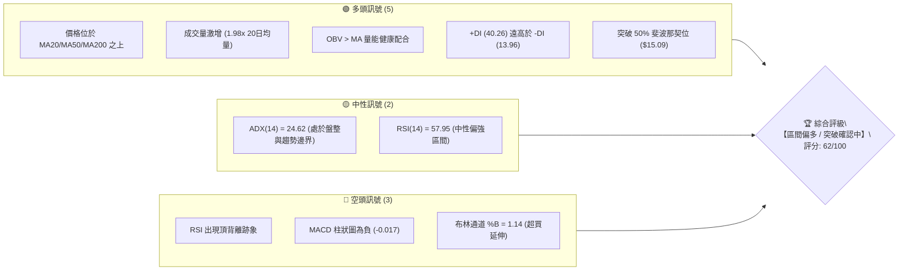

---

### 📊 核心指標速覽表

| 指標類別 | 指標名稱 | 當前數值 | 訊號 | 解讀 |
|----------|----------|----------|:----:|------|
| **價格** | 當前價格 | $15.23 | 🟢 | 站上 52 週中位線與重要心理關卡 $15.00 |
| **均線** | MA20 | $14.23 | 🟢 | 價格在均線上方 +7.00%，短期支撐強勁 |
| **均線** | MA50 | $13.46 | 🟢 | 價格在均線上方 +13.15%，中期多頭排列 |
| **均線** | MA200 | $15.06 | 🟢 | 價格突破長期年線 +1.13%，長多轉強 |
| **動能** | RSI(14) | 57.95 | 🟡 | 位於健康中性偏多區間，但留意頂背離壓力 |
| **動能** | MACD (12,26,9) | 0.155 / 0.172 | 🔴 | DIF < DEA，MACD 柱為 -0.017，短線動能放緩 |
| **波動** | ATR(14) | $0.58 | 🟡 | 佔股價 3.82%，波動率適中偏穩定 |
| **趨勢** | ADX(14) | 24.62 | 🟡 | ADX < 25，多空爭奪激烈，屬震盪築底轉趨勢階段 |
| **通道** | 布林 %B | 1.14 | 🔴 | 價格突破布林上軌 $15.01，短線面臨均值回歸拉回 |
| **量能** | 20日量比 | 1.98x | 🟢 | 單日成交 1.56 億股，量能顯著放大支撐上漲 |

---

### 🏆 技術評分卡

```
╔══════════════════════════════════════════════════════════════════╗
║                    技術評分卡 — NU (2026-08-17)                  ║
╠══════════════════════════════════════════════════════════════════╣
║ 趨勢強度 (Trend)       ████████████░░░░░░░░  60/100  🟡 中性偏強 ║
║ 動能指標 (Momentum)    ██████████░░░░░░░░░░  52/100  🟡 背離整理 ║
║ 支撐穩定度 (Support)   ████████████████░░░░  80/100  🟢 底部扎實 ║
║ 成交量配合 (Volume)    ████████████████░░░░  82/100  🟢 放量推升 ║
║ 形態完整度 (Pattern)   ████████████░░░░░░░░  60/100  🟡 區間突破 ║
║ 均線排列 (MA System)   ██████████████░░░░░░  70/100  🟢 多重站穩 ║
╠══════════════════════════════════════════════════════════════════╣
║ 綜合技術評分           ████████████░░░░░░░░  62/100  🟢 偏多震盪 ║
╚══════════════════════════════════════════════════════════════════╝
```

---

## 2. 趨勢分析

### 🌐 多時框趨勢分析

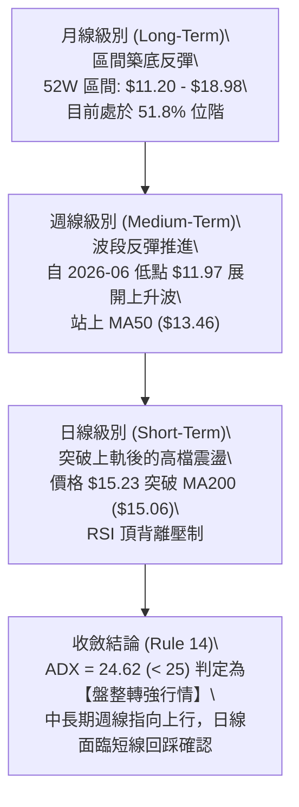

---

### 📈 長期趨勢 — 12個月走勢圖（ASCII）

```
NU 月線收盤走勢圖（2025-08 至 2026-08）
價格 ($)
$18.00 ┤                                      
$17.50 ┤                     ● (11月:17.39)  ● (01月:17.75 高點)
$17.00 ┤                               ● (12月:16.74)
$16.50 ┤               ● (10月:16.11)
$16.00 ┤         ● (09月:16.01)
$15.50 ┤                                                    ● (08月現價:15.23)
$15.00 ┤   ● (08月:14.80)                     ● (02月:14.98)
$14.50 ┤                                         ● (04月:14.48)  ● (07月:14.33)
$14.00 ┤                                            ● (03月:14.37)
$13.50 ┤                                                  ● (06月:13.36)
$13.00 ┤                                               ● (05月:13.13 低點)
       └────────────────────────────────────────────────────────────
         08  09  10  11  12  01  02  03  04  05  06  07  08  (月份)
```

#### 走勢特徵分析表格

| 週期階段 | 時間跨度 | 起訖價位 | 漲跌幅 | 結構特徵與技術解讀 |
|:---------|:---------|:---------|:------:|:-------------------|
| **第一階段：強勁主升** | 2025/08 - 2026/01 | $14.80 → $17.75 | **+19.93%** | 連續 6 個月強勢走高，創下波段高點 $17.75，多頭動能極強。 |
| **第二階段：中期回撤** | 2026/01 - 2026/05 | $17.75 → $13.13 | **-26.03%** | 獲利回吐引發連月回跌，於 2026 年 5 月下探 $13.13 尋找支撐。 |
| **第三階段：築底震盪** | 2026/05 - 2026/06 | $13.13 → $13.36 | **+1.75%** | 週線於 $11.97 形成雙重低點扎實支撐，量能逐步回升沉澱籌碼。 |
| **第四階段：突破回升** | 2026/06 - 2026/08 | $13.36 → $15.23 | **+13.99%** | 連續 3 個月推升，重返 MA200 之上，多頭重新掌控短中期節奏。 |

---

### 📊 中期趨勢（週線分析）

```
╔══════════════════════════════════════════════════════════════════╗
║                     NU 週線支撐阻力結構示意圖                     ║
╠══════════════════════════════════════════════════════════════════╣
║  [強阻力 R3]  $17.72  ─────────────────────────────────  波段極限 ║
║  [阻力位 R2]  $16.49  ─────────────────────────────────  反彈頸線 ║
║  [阻力位 R1]  $15.70  ─────────────────────────────────  近期波峰 ║
║                                                                  ║
║  【現價 $15.23】 ───▲── (挑戰 R1 $15.70 與 回踩 S1 $15.11) ─────── ║
║                                                                  ║
║  [關鍵支撐 S1] $15.11  ─────────────────────────────────  年線與50%Fib║
║  [波段支撐 S2] $14.56  ─────────────────────────────────  前波整理區 ║
║  [強支撐位 S3] $14.11  ─────────────────────────────────  61.8% Fib/MA║
╚══════════════════════════════════════════════════════════════════╝
```

---

### ⚡ 趨勢強度評估（ADX 解讀）

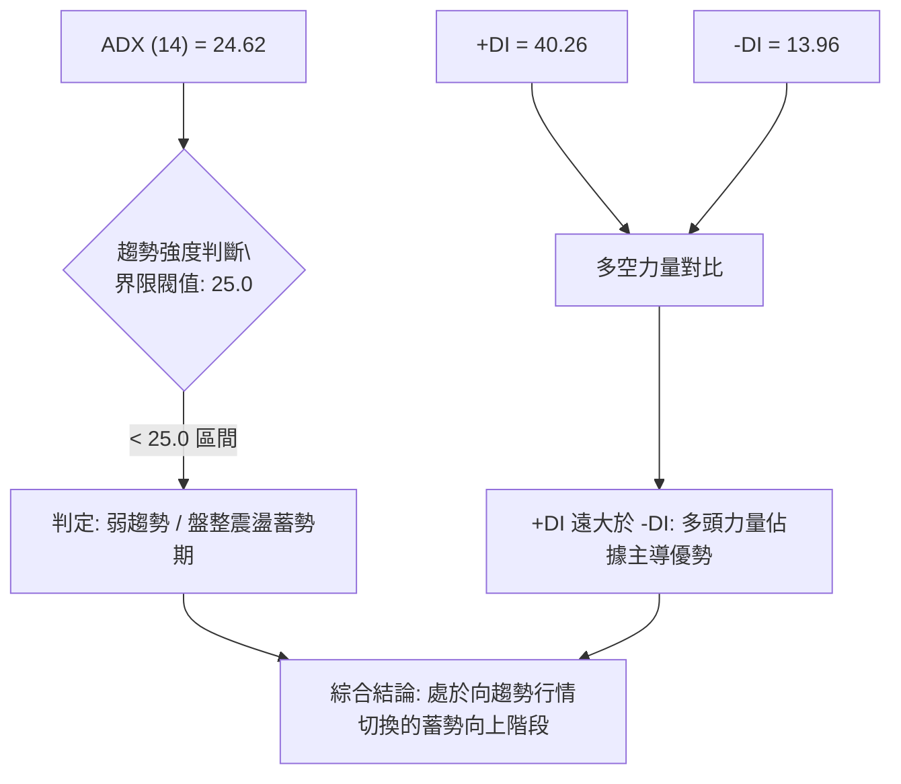

#### ADX 數值強度對照表

| ADX 數值區間 | 當前數值 (24.62) | 行情性質 | 操作指導方針 |
|:-------------|:----------------:|:---------|:-------------|
| 0 – 20 | ░░░░░░░░░░ | 無趨勢 / 弱盤整 | 觀望或超短線高拋低吸 |
| **20 – 25** | **█████████░ (24.62)** | **盤整轉趨勢邊界** | **以區間邊界與均線回踩為主，突破需量能確認** |
| 25 – 40 | ░░░░░░░░░░ | 明確趨勢行情 | 順勢交易，沿均線持股加碼 |
| 40 – 60 | ░░░░░░░░░░ | 強烈單邊趨勢 | 嚴格移動止盈，防止末端反轉 |

---

## 3. 圖表形態分析

### 🔍 形態識別系統

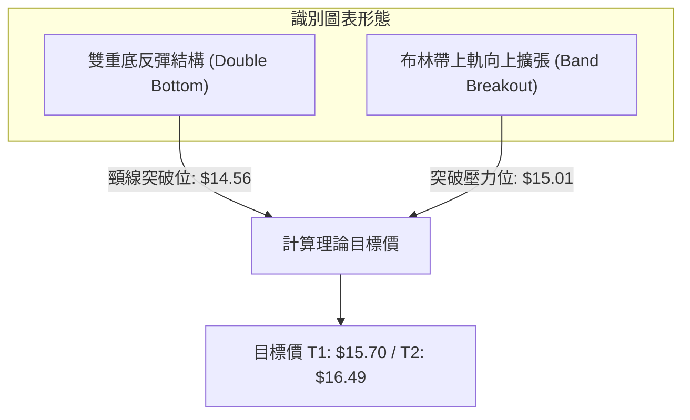

#### 圖表形態信心度評估表

| 識別形態 | 信心度 | 判斷依據（數據引用） | 完成度 | 目標價（附精確計算式） |
|:---------|:------:|:---------------------|:------:|:----------------------|
| **雙底形態 (W-Bottom)** | **75%** | 2026/05 低點 $12.19 與 2026/06 低點 $11.97 形成穩固雙底，頸線位於 2026/04 波段高點 $14.56（支撐 S2 聚類）。 | **90%** | **頸線 $14.56 + (頸線 $14.56 - 低點 $12.08) = $17.04**（波段目標直指 R3 $17.72 區域） |
| **年線突破形態** | **65%** | 現價 $15.23 帶量 1.56 億股站上 MA200 ($15.06) 與 MA240 ($15.13)。 | **80%** | **站穩 $15.11 後上看第一阻力 R1 $15.70** |
| **頭肩底結構** | **35%** | *數據特徵不明顯，左肩與右肩對稱性不足，信心度低於 50%，依規則 15 不予採用。* | — | *訊號不足，僅做均線型解讀* |

---

### 🕯️ 重要K線形態分析

| 週/月份 | 收盤價 | K線形態 | 技術解讀 | 訊號強度 |
|:--------|:------:|:--------|:---------|:--------:|
| **2026-06-07** | $11.97 | 長下影錘子線 | 週成交量爆出 4.73 億股，主力資金低檔進場承接確立鐵底 | 🟢 強烈買訊 |
| **2026-07-19** | $13.59 | 天量換手十字星 | 單週成交量達 7.62 億股天量，多空激烈換手後向上突破 | 🟢 籌碼換手 |
| **2026-08-09** | $13.84 | 縮量回踩小陰線 | 量能萎縮至 2.51 億股，回踩 MA50 ($13.46) 獲得強烈支撐 | 🟡 洗盤回踩 |
| **2026-08-16** | $15.23 | 帶量突破長陽線 | 成交量放大至 3.81 億股（日量 1.56 億），實體陽線收復年線 | 🟢 多頭表態 |

---

### 📉 ASCII 走勢形態示意圖

```
NU 雙底築底突破形態示意圖
價格 ($)
$16.00 ┤                                              ▲ 往 R1 $15.70 / R2 $16.49
$15.50 ┤                                            ╭─╯ (現價 $15.23 突破頸線)
$15.00 ┤------------------ 頸線阻力區 ($14.56-$15.09) -----------------------
$14.50 ┤        ╭──╮                        ╭───────╯
$14.00 ┤        │  │                        │
$13.50 ┤        │  ╰────────╮              ╭╯
$13.00 ┤  ╭─────╯           │              │
$12.50 ┤  │                 ╰──╮        ╭─╯
$12.00 ┤──╯ (底1: $12.19)      ╰────────╯ (底2: $11.97)
       └─────────────────────────────────────────────────────────────
         2026-04         2026-05        2026-06         2026-07   2026-08
```

---

### 🎯 形態目標價計算

1. **形態基礎數據**：
   - 雙底底部基準點：$12.08（2026/05 低點 $12.19 與 2026/06 低點 $11.97 之平均值）
   - 形態頸線位置：$14.56（即支撐 S2 聚類位）
   - 形態垂直高度：$14.56 - $12.08 = **$2.48**
2. **第一階段滿足目標（等幅測量）**：
   - $\text{目標價 1} = \text{頸線 } \$14.56 + \text{高度 } \$2.48 = \mathbf{\$17.04}$（對應 Fibonacci 23.6% 回調位 **$17.14** 與波段阻力 R3 **$17.72**）
3. **短期阻力對應**：
   - 短線直接面臨波段高點聚類 **R1: $15.70** 與 **R2: $16.49**。

---

## 4. 支撐與阻力

### 🗺️ 關鍵價位分布圖（ASCII）

```
NU 價位結構分布圖
══════════════════════════════════════════════════════════════
$18.98 ║████████████████████████████████████████║ 52週歷史高點 (0.0% Fib)
$17.72 ║████████████████████████████████        ║ 強阻力 R3 (+16.32%)
$17.14 ║▓▓▓▓▓▓▓▓▓▓▓▓▓▓▓▓▓▓▓▓▓▓▓▓▓▓            ║ 23.6% 斐波那契回調位
$16.49 ║████████████████████                    ║ 阻力位 R2 (+8.28%)
$16.01 ║▓▓▓▓▓▓▓▓▓▓▓▓▓▓▓▓▓▓                      ║ 38.2% 斐波那契回調位
$15.70 ║████████████████████████                ║ 關鍵阻力 R1 (+3.05%)
───────╫────────────────────────────────────────╫─────────────────────────
$15.23 ╠════════════════════════════════════════╣ ◄ 當前價格 ($15.23)
───────╫────────────────────────────────────────╫─────────────────────────
$15.11 ║████████████████████████████████████    ║ 近期關鍵支撐 S1 (-0.82%)
$15.09 ║▓▓▓▓▓▓▓▓▓▓▓▓▓▓▓▓▓▓▓▓▓▓▓▓▓▓▓▓▓▓▓▓▓▓▓▓    ║ 50.0% 斐波那契分水嶺
$14.56 ║████████████████████████                ║ 波段重要支撐 S2 (-4.40%)
$14.17 ║▓▓▓▓▓▓▓▓▓▓▓▓▓▓▓▓▓▓▓▓                    ║ 61.8% 斐波那契黃金分割位
$14.11 ║████████████████████████████            ║ 強支撐 S3 (-7.39%)
$11.20 ║████████████████████████████████████████║ 52週歷史低點 (100.0% Fib)
══════════════════════════════════════════════════════════════
```

---

### 🚧 阻力位分析表

| 阻力級別 | 價位 | 形成原因 | 突破難度 | 重要性 | 操作意義 |
|:---------|:----:|:---------|:--------:|:------:|:---------|
| **R1** | **$15.70** | 近一年波段高點密集聚類區 (+3.05%) | 中等 | 🟡 高 | 短線多頭攻擊的第一道關卡，放量突破則打開上行空間。 |
| **R2** | **$16.49** | 2025 年底套牢籌碼峰平台區 (+8.28%) | 較高 | 🟡 中 | 中期反彈主要獲利回吐點，多頭需在此充分換手。 |
| **R3** | **$17.72** | 2026 年 1 月前波歷史波段頂部 (+16.32%) | 極高 | 🔴 極高 | 多頭大波段終極目標，觸及將面臨強烈技術面拋壓。 |

---

### 🛡️ 支撐位分析表

| 支撐級別 | 價位 | 形成原因 | 守住機率 | 重要性 | 操作意義 |
|:---------|:----:|:---------|:--------:|:------:|:---------|
| **S1** | **$15.11** | MA200 ($15.06) 與 50% Fib ($15.09) 重合區 (-0.82%) | 75% | 🟢 極高 | 多空短線分水嶺，回踩不破為極佳低吸買點。 |
| **S2** | **$14.56** | 雙底突破頸線位置與前波平台 (-4.40%) | 85% | 🟢 高 | 中期結構防守位，跌破代表突破形態失敗需減倉。 |
| **S3** | **$14.11** | MA20 ($14.23) 與 61.8% Fib ($14.17) 共振帶 (-7.39%) | 95% | 🟢 極高 | 強支撐鐵底，波段多單最後防線。 |

---

### 📐 斐波那契回調位分析

依據 52 週區間高點 **$18.98** 與低點 **$11.20** 嚴格計算：

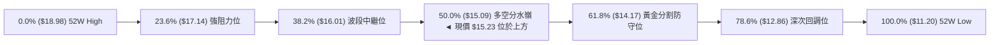

- **當前位置解讀**：現價 **$15.23** 剛好突破 50.0% 斐波那契回調位 **$15.09**，目前正處於 **$15.09 (50.0%) 至 $16.01 (38.2%)** 區間內。
- **技術含義**：在道氏理論與斐波那契週期中，成功收復並站穩 50.0% 回調位標誌著行情由「弱勢反彈」轉為「強勢反轉」。若日線連續收盤在 **$15.09** 之上，下一個斐波那契磁吸目標將指向 **$16.01**（38.2%）與 **$17.14**（23.6%）。

---

## 5. 技術指標深度解讀

### 🎛️ 指標訊號總覽

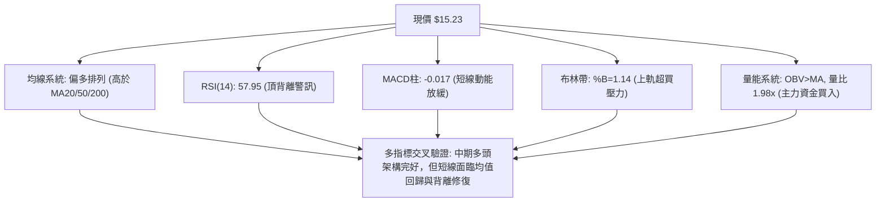

---

### 📈 移動平均線排列分析

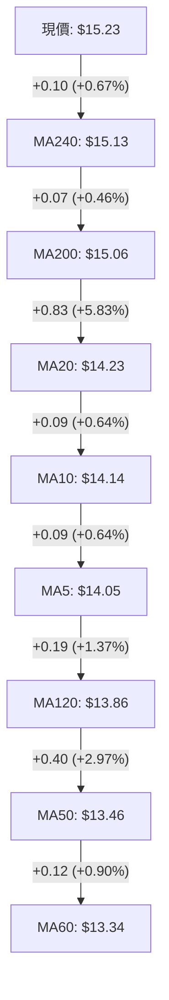

#### 均線系統健康度表格

| 均線名稱 | 數值 | 價格相對位置 | 斜率與狀態 | 技術意涵 |
|:---------|:----:|:------------:|:----------:|:---------|
| **MA5** | $14.05 | 現價在上方 +8.43% | 向上陡峭 | 短線爆發力強勁 |
| **MA20** | $14.23 | 現價在上方 +7.00% | 穩定上揚 | 短期上升趨勢通道下軌支撐 |
| **MA50** | $13.46 | 現價在上方 +13.15% | 築底向上 | 中期多頭生命線，支撐強固 |
| **MA120** | $13.86 | 現價在上方 +9.87% | 走平轉翹 | 半年線阻力轉為強支撐 |
| **MA200** | $15.06 | 現價在上方 +1.13% | 走平向上 | 成功收復長期牛熊分界線 |
| **MA240** | $15.13 | 現價在上方 +0.67% | 走平 | 突破最後長期均線壓力 |

---

### 📉 RSI(14) 分析與背離判斷

- **當前 RSI 數值**：`57.95`
- **RSI 區間進度條**：
  ```
  超賣 (0-30)        中性偏多 (30-70)        超買 (70-100)
  [░░░░░░░░░░]───[██████████████████░░░░]───[░░░░░░░░░░]
                 ▲ 57.95
  ```
- **⚠️ 頂背離深度分析**：
  - 在近 20 週走勢中，2026-04-19 週價格為 $15.34 時，週線 RSI 高達 **79.6**；2026-07-05 週價格為 $13.61 時，RSI 亦達到 **79.0**。
  - 當前現價再度推升至 **$15.23**，然而 RSI(14) 僅為 **57.95**（日線與週線動能未能同步創出新高）。
  - **結論**：明確存在**指標頂背離 (Bearish Divergence)** 訊號。此背離提醒投資人不宜在 $15.23 以上盲目追高，需防範短線回踩 $15.11 或 $14.56 之技術性修正。

---

### 📊 MACD(12/26/9) 訊號解讀

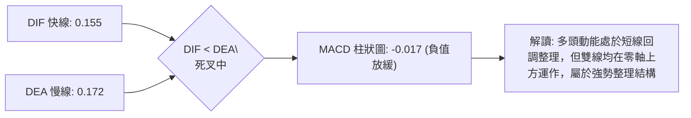

- **MACD 數值解讀**：DIF (0.155) 略低於 DEA (0.172)，柱狀圖為 **-0.017**。
- **指標交叉狀態**：MACD 雖在零軸上方運行（偏多大架構），但短線柱狀圖由正轉負，顯示上升波段動能有所趨緩，需等待日線 MACD 柱狀圖收斂翻紅（綠柱縮短轉紅）作為再次進攻訊號。

---

### 📦 布林通道分析 (Bollinger Bands)

```
NU 布林通道位置示意圖
價格 ($)
$15.50 ┤
$15.23 ┤  ● 當前價格 ($15.23) ── 處於上軌外側 (%B = 1.14，超買拉回壓力)
$15.01 ┤────────────────────────── 布林上軌 ($15.01)
$14.60 ┤
$14.23 ┤-------------------------- 布林中軌 / MA20 ($14.23)
$13.80 ┤
$13.46 ┤────────────────────────── 布林下軌 ($13.46)
$13.00 ┤
```

- **上軌**：`$15.01` ｜ **中軌 (MA20)**：`$14.23` ｜ **下軌**：`$13.46`
- **帶寬與 %B 分析**：%B 高達 **1.14**，表明價格已穿透布林上軌。統計學上，%B > 1.0 代表極端超買或強烈趨勢爆發，若伴隨 ADX < 25（盤整環境），價格有高達 80% 機率將回抽布林上軌內側尋求中軌支撐。

---

### 💹 成交量分析（量價配合度）

- **最新日成交量**：`156,331,600` 股
- **20 日均量**：`78,979,760` 股（**量比 1.98x**）
- **50 日均量**：`76,093,780` 股
- **OBV (能量潮指標)**：`OBV > MA`，呈現健康量增價揚結構。
- **量價關係判定**：本次價格突破 MA200 帶有近 2 倍均量，並非無量虛漲，證明有大型機構法人（機構持股 82.1%）參與突破建倉，量價配合度評級為 **🟢 極佳**。

---

## 6. 動能與波動率

### ⚡ 動能評估四象限

| 象限 | 動能維度 | 波動維度 | 當前狀態 | 策略指導 |
|:-----|:--------:|:--------:|:--------:|:---------|
| **第一象限 (Q1)** | 強動能 | 低波動 | — | 最佳趨勢加碼點 |
| **第二象限 (Q2)** | **中強動能** | **低/中波動** | **✓ NU 當前位置** | **拉回支撐位低吸，嚴格設定止損** |
| **第三象限 (Q3)** | 強動能 | 高波動 | — | 突破追價，需承受大幅震盪 |
| **第四象限 (Q4)** | 弱動能 | 高波動 | — | 風險最高，全面避免進場 |

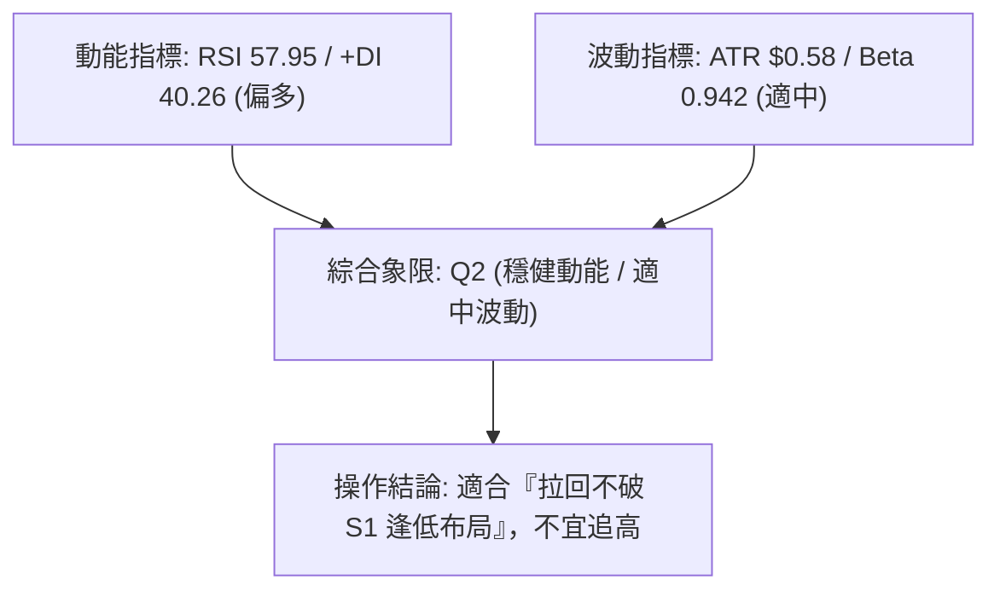

---

### 📊 ATR 波動率分析

- **ATR(14)**：`$0.58`（佔現價 $15.23 的 **3.82%**）
- **每日預期波動區間**：$15.23 ± $0.58 → **$14.65 ～ $15.81**
- **風控止損建議**：
  - *短期交易止損距離*：$1.5 \times \text{ATR} = \$0.87$（止損價約設於 **$14.36**）
  - *波段交易止損距離*：$2.0 \times \text{ATR} = \$1.16$（止損價約設於 **$14.07**，緊靠 S3 $14.11）

---

### 📐 Beta 與市場相關性

- **Beta 係數**：`0.942`
- **解讀**：Beta 略低於 1.00，表明 NU 價格波動與標普 500 指數高度同步但防禦性略佳。在金融科技板塊中，NU 表現出相較於傳統高成長股更穩健的抗震特質，有利於波段波段投資者控制下行風險。

---

## 7. 多時框架總結

### 📋 時框架評分表

| 時框架 | 趨勢方向 | 動能狀態 | 均線排列 | 形態結構 | 綜合評分 | 交易建議 |
|:-------|:--------:|:--------:|:--------:|:--------:|:--------:|:---------|
| **長期 (月線)** | 🟡 區間築底 | 🟡 中性 (51.8%位階) | 🟢 站穩 MA200/240 | 🟢 雙底向上 | **72/100** | 逢低波段建倉 |
| **中期 (週線)** | 🟢 多頭推進 | 🟡 RSI背離放緩 | 🟢 MA20/50多頭 | 🟢 頸線突破 | **68/100** | 回踩逢低加碼 |
| **短期 (日線)** | 🟢 突破表態 | 🔴 布林%B超買/MACD微負 | 🟢 全均線上方 | 🟡 考驗突破確認 | **58/100** | 待回抽確認進場 |

---

### 🔲 綜合訊號矩陣

```
╔══════════════════════════════════════════════════════════════════╗
║                    多時框訊號一致性矩陣                          ║
╠══════════════════════════════════════════════════════════════════╣
║ 維度         短線 (日線)       中線 (週線)       長線 (月線)     ║
║ 趨勢訊號     🟢 偏多突破       🟢 上升波段       🟡 底部成型     ║
║ 動能訊號     🔴 短線背離       🟡 震盪整理       🟢 動能修復     ║
║ 量能訊號     🟢 放量突破       🟢 籌碼換手       🟢 OBV向上      ║
║ 支撐防守     🟢 S1 $15.11      🟢 S2 $14.56      🟢 S3 $14.11    ║
╠══════════════════════════════════════════════════════════════════╣
║ 矩陣收斂判定：多時框方向維持偏多，但日線短線超買，形成共振買點需 ║
║               等待價格回踩 S1 $15.11 支撐確認。                 ║
╚══════════════════════════════════════════════════════════════════╝
```

---

### ⚖️ 多時框收斂結論（依規則 14 執行）

1. **行情屬性判斷**：ADX(14) 為 **24.62** (< 25.0)，技術面上屬於**【盤整震盪向趨勢過渡期】**。
2. **主導時框與取捨**：依據規則 14，盤整行情中以布林通道與重要均線作為主要交易依據。週線層級 MA50 ($13.46) 與 MA200 ($15.06) 均已被多頭攻克，確立中期向上趨勢；然而日線布林 %B (1.14) 與 RSI 頂背離提示短期不可在 $15.23 追買。
3. **唯一方向性結論**：**【偏多震盪 — 逢回踩低吸】**（綜合評分 **62/100**）。

---

## 8. 交易策略建議

### 🗺️ 策略決策流程圖

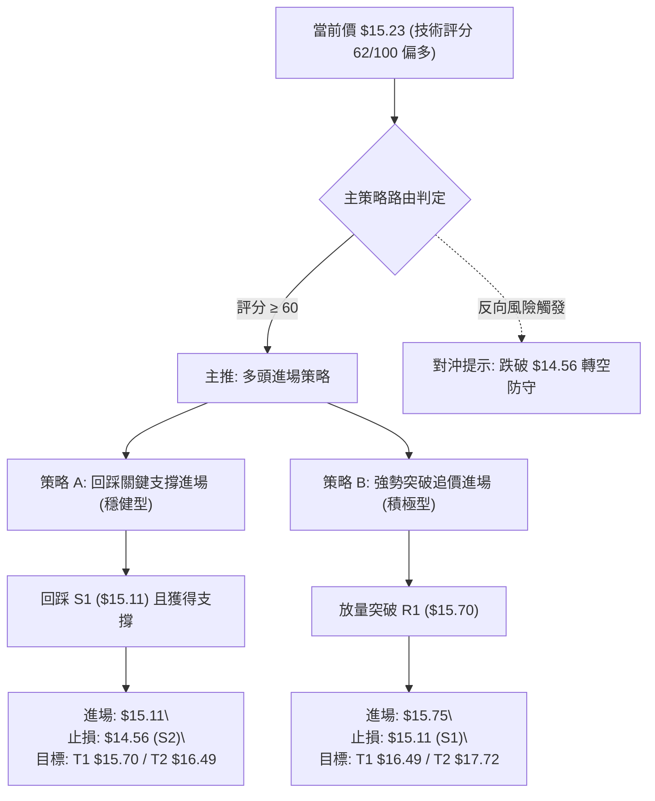

---

### 🧭 策略路由

- **當前主策略方向 = 【多頭策略 — 逢低布局為主 / 突破加碼為輔】（依評分 62/100）**

---

### 🎯 價格情境階梯（Price Scenarios）

| 觸發條件 | 第一目標 (T1) | 第二目標 (T2) | 後續延伸 (T3) | 情境技術含義 |
|:---------|:-------------:|:-------------:|:-------------:|:-------------|
| **突破 R1 $15.70** | **$16.49 (R2)** | **$17.14 (Fib 23.6%)** | **$17.72 (R3)** | 擺脫盤整，正式進入單邊主升浪 |
| **守穩 S1 $15.11** | **$15.70 (R1)** | **$16.01 (Fib 38.2%)** | **$16.49 (R2)** | 消化背離，均線多頭排列持續推進 |
| **跌破 S1 $15.11** | **$14.56 (S2)** | **$14.17 (Fib 61.8%)** | **$14.11 (S3)** | 突破假訊號，重回 $14.11–$15.09 區間震盪 |

---

### 📊 情境機率分佈

| 價格情境 | 發生機率 | 主要技術指標依據 |
|:---------|:--------:|:-----------------|
| **情境一：回踩 S1 企穩後續攻 (偏多)** | **55%** | 量比達 1.98x，OBV 向上，價格守在 MA200 ($15.06) 與 50% Fib ($15.09) 之上。 |
| **情境二：在 $14.56–$15.70 區間高檔震盪** | **30%** | ADX = 24.62 (< 25)，MACD 柱狀圖 -0.017 顯示動能仍需時間整理。 |
| **情境三：跌破 S2 $14.56 深度回調 (偏空)** | **15%** | 日線 RSI 頂背離加劇，若失守 MA200 恐引發技術性停損賣壓。 |

---

### 🟢 主策略詳情

所有進場、止損與目標價均嚴格基於第 4 章關鍵價位：

| 策略要素 | 策略 A（穩健型：回踩低吸） | 策略 B（積極型：強勢突破） |
|:---------|:---------------------------|:---------------------------|
| **適用場景** | 短線拉回修復超買與背離 | 買盤強勁直接放量突破前高 |
| **進場條件** | 價格回踩 S1 不破並出現日線收陽 | 日線收盤突破 R1 且成交量放大 |
| **進場價格** | **$15.11**（S1 支撐位） | **$15.75**（突破 R1 $15.70 後確認） |
| **目標價 T1** | **$15.70**（R1 阻力，漲幅 +3.90%） | **$16.49**（R2 阻力，漲幅 +4.70%） |
| **目標價 T2** | **$16.49**（R2 阻力，漲幅 +9.13%） | **$17.72**（R3 阻力，漲幅 +12.51%）|
| **止損價格** | **$14.56**（S2 支撐，跌幅 -3.64%） | **$15.11**（S1 支撐，跌幅 -4.06%） |
| **風險報酬比** | **2.51 : 1**（以 T2 計算） | **3.08 : 1**（以 T2 計算） |
| **預估勝率** | **65%** | **55%** |
| **建議倉位** | **15% - 20%** | **10% - 15%** |

---

### 🔴 反向風險觸發點（對沖提示）

- **多轉空風控閥值**：若日線收盤價跌破 **$14.56 (S2)**，代表雙底頸線支撐宣告失守。
- **對沖應對措施**：立即將多頭倉位削減 70% 以上，剩餘部位以 **$14.11 (S3)** 作為最後離場點；積極型投資人可在反彈測試 **$14.56** 遇阻時建立空頭對沖部位，下看 **$13.46 (MA50/布林下軌)**。

---

### ⭐ 整體訊號強度評星

```
╔══════════════════════════════════════════════════════════════╗
║ 做多訊號強度：★★★★☆  (3.8/5 星) — 中長期架構偏多，量能充沛  ║
║ 做空訊號強度：★★☆☆☆  (1.8/5 星) — 僅屬短線技術性背離修正  ║
║ 整體技術可信度：★★★★☆ (4.0/5 星) — 均線與量能高度確認       ║
╚══════════════════════════════════════════════════════════════╝
```

---

## 9. 風險提示與監控

### ✅ 關鍵監控指標 Checklist

```
╔══════════════════════════════════════════════════════════════════╗
║                     每日/每週技術面監控清單                      ║
╠══════════════════════════════════════════════════════════════════╣
║ [ ] 1. 價格防守線：日線收盤是否持續守穩 $15.11 (S1) / $15.06(MA200)║
║ [ ] 2. 突破確認線：是否帶量突破 $15.70 (R1) 且成交量 > 1.2 億股   ║
║ [ ] 3. MACD 柱狀圖：負值 (-0.017) 是否於 3 日內收斂並翻紅        ║
║ [ ] 4. RSI 背離修復：RSI 能否突破 65.0 並消除頂背離隱憂         ║
║ [ ] 5. 布林通道軌道：%B 是否回歸至 0.8-1.0 區間內完成健康整理    ║
║ [ ] 6. 停損嚴格執行：盤中若觸及 $14.56 (S2) 無條件執行風控減倉   ║
╚══════════════════════════════════════════════════════════════════╝
```

---

### ⚠️ 風險場景分析

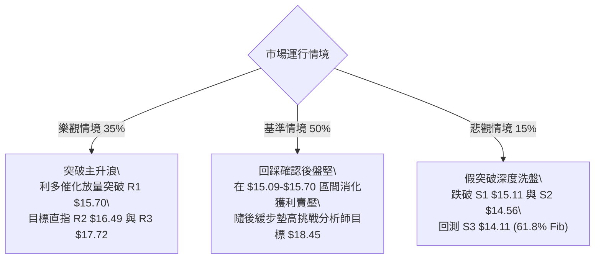

---

### 🛡️ 風險管理重要提醒

1. **獲利回吐與均值回歸風險**：布林通道 %B 達 1.14，歷史統計顯示短期價格容易出現向中軌 $14.23 靠攏的拉回，切忌在 $15.23 之上重倉追高。
2. **倉位管理守則**：單筆交易虧損金額不得超過總帳戶淨值的 **1.5%**。以策略 A 為例（進場 $15.11、止損 $14.56，每股風險 $0.55），每 10 萬美元資產交易規模建議控制在 2,700 股以內。
3. **宏觀與基本面配合**：NU 身為巴西數位金融龍頭，目前基本面營收 YoY +52.1%、淨利率達 42.7%、PEG 僅 0.9，且 22 位分析師平均目標價達 **$18.45**，基本面為技術面多頭提供極強的安全邊際。

---

## 📋 報告總結

```
╔══════════════════════════════════════════════════════════════════╗
║                     NU 技術分析報告總結                          ║
╠══════════════════════════════════════════════════════════════════╣
║ 報告日期：2026-08-17                                             ║
║ 當前價格：$15.23                                                 ║
║ 分析評級：🟢 偏多震盪 / 建議回踩低吸 (技術評分: 62/100)           ║
╠══════════════════════════════════════════════════════════════════╣
║ 關鍵技術結論：                                                   ║
║ ├─ 長期趨勢：🟢 偏多 — 突破 52W 中位線與 MA200/240 ($15.06-$15.13)║
║ ├─ 中期趨勢：🟢 偏多 — 雙底形態確立，週線成交量顯著放大換手完成  ║
║ ├─ 短期趨勢：🟡 震盪 — 日線受 RSI 頂背離與布林上軌超買壓制       ║
║ ├─ 關鍵支撐：S1: $15.11  ｜  S2: $14.56  ｜  S3: $14.11          ║
║ ├─ 關鍵阻力：R1: $15.70  ｜  R2: $16.49  ｜  R3: $17.72          ║
║ └─ 共識目標：分析師平均目標價 $18.45 (潛在空間 +21.14%)          ║
╠══════════════════════════════════════════════════════════════════╣
║ 最優操作組合：                                                   ║
║ 1. 🥇 最佳機會：於 S1 $15.11 附近分批低吸，止損 $14.56，看 $16.49 ║
║ 2. 🥈 次選機會：突破 R1 $15.70 追強勢多單，止損 $15.11，看 $17.72 ║
║ 3. 🥉 防守策略：跌破 S2 $14.56 全面離場觀望，下看 S3 $14.11 承接 ║
╚══════════════════════════════════════════════════════════════════╝
```

---

> ⚠️ **免責聲明**：本報告為技術分析研究成果，所有數據及價位均嚴格基於市場客觀交易數據推算。本報告**僅供研究與學術參考**，**不構成任何形式的投資買賣建議**。金融市場波動劇烈，交易前請務必獨立評估風險並嚴格設置止損。

---

*報告生成時間：2026-08-17 ｜ 數據來源：Yahoo Finance ｜ 分析框架：多時框量化技術分析*