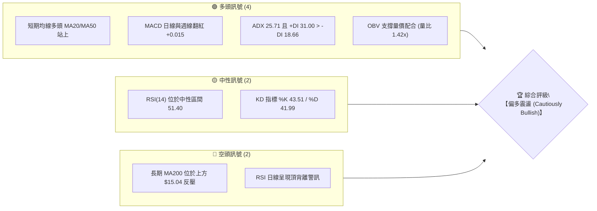
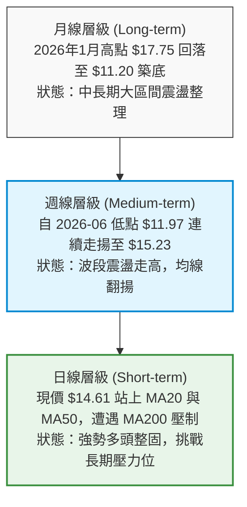
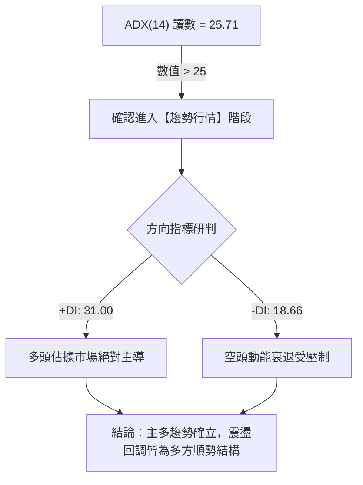
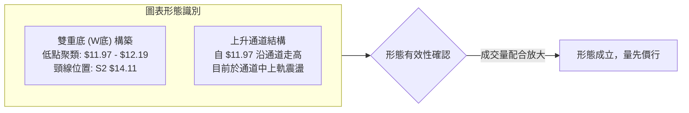
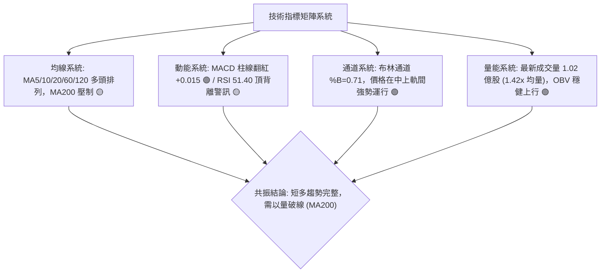
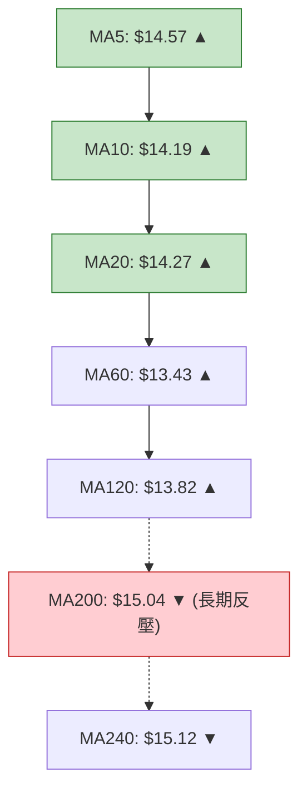
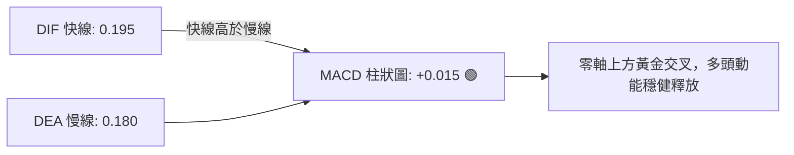
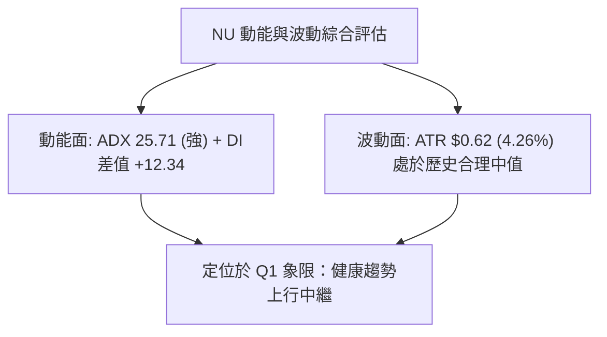
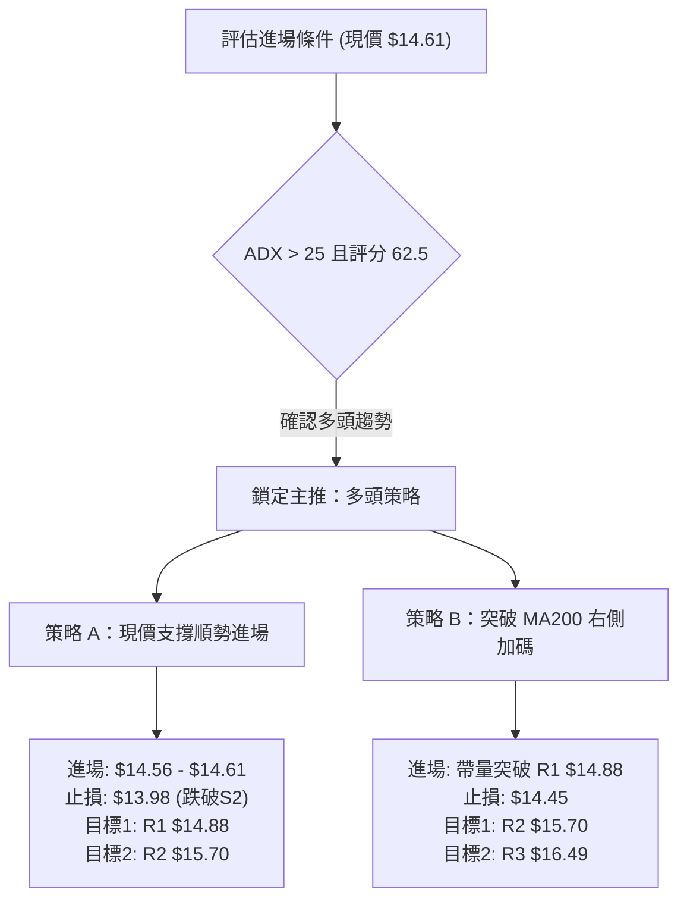
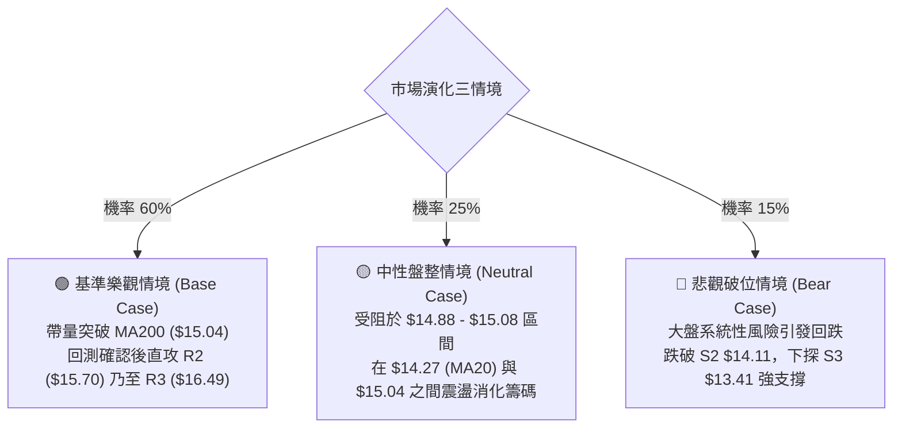

# NU 技術分析報告

> **報告日期**：2026-08-20 ｜ **語言**：繁體中文 ｜ **數據來源**：Yahoo Finance ｜ **當前價格**：$14.61

---

## 目錄

| 章節 | 內容 |
|------|------|
| [1. 技術面概覽](#1-技術面概覽) | 訊號儀表板、核心指標、評分卡 |
| [2. 趨勢分析](#2-趨勢分析) | 多時框趨勢、長中短期走勢 |
| [3. 圖表形態分析](#3-圖表形態分析) | 形態識別、K線組合、目標價 |
| [4. 支撐與阻力](#4-支撐與阻力) | 關鍵價位、斐波那契回調 |
| [5. 技術指標深度解讀](#5-技術指標深度解讀) | MA/RSI/MACD/布林/成交量 |
| [6. 動能與波動率](#6-動能與波動率) | 動能評估、ATR、Beta |
| [7. 多時框架總結](#7-多時框架總結) | 時框架評分矩陣 |
| [8. 交易策略建議](#8-交易策略建議) | 多空策略、風險報酬比 |
| [9. 風險提示與監控](#9-風險提示與監控) | 監控指標、風險場景 |

---

## 1. 技術面概覽

### 🎯 技術訊號儀表板



### 📊 核心指標速覽表

| 指標類別 | 指標名稱 | 當前數值 | 訊號 | 解讀 |
|----------|----------|----------|------|------|
| **價格** | 當前價格 | $14.61 | 🟢 | 站上日線中軌，短多格局延續 |
| **均線** | MA20 | $14.27 | 🟢 | 價格在 MA20 上方 (+2.35%)，短多支撐穩固 |
| **均線** | MA50 | $13.63 | 🟢 | 價格在 MA50 上方 (+7.19%)，中期底部確立 |
| **均線** | MA200 | $15.04 | 🔴 | 價格在 MA200 下方 (-2.86%)，長期均線壓制 |
| **動能** | RSI(14) | 51.40 | 🟡 | 位於 30-70 中性強弱分水嶺，惟需提防頂背離 |
| **動能** | MACD(12,26,9) | 0.195 (Hist: +0.015) | 🟢 | DIF > DEA 且柱狀圖維持正值，多頭動能微幅增強 |
| **波動** | ATR(14) | $0.62 (4.26%) | 🟡 | 波動度適中，提供合理的止損緩衝空間 |

### 🏆 技術評分卡

```
╔══════════════════════════════════════════════════════════════╗
║                 技術評分卡 — NU (2026-08-20)                 ║
╠══════════════════════════════════════════════════════════════╣
║ 趨勢強度      █████████████░░░░░░░  65/100  🟢 偏多趨勢       ║
║ 動能指標      ███████████░░░░░░░░░  55/100  🟡 中性偏強       ║
║ 支撐穩定度    ██████████████░░░░░░  70/100  🟢 下檔支撐強     ║
║ 成交量配合    ██████████████░░░░░░  70/100  🟢 突破帶量放量   ║
║ 形態完整度    ████████████░░░░░░░░  60/100  🟡 底部復合整理   ║
║ 均線排列      ███████████░░░░░░░░░  55/100  🟡 混合排列承壓   ║
╠══════════════════════════════════════════════════════════════╣
║ 綜合評分      ████████████░░░░░░░░  62.5/100  🟢 偏多操作 (Buy)║
╚══════════════════════════════════════════════════════════════╝
```

---

## 2. 趨勢分析

### 🌐 多時框趨勢分析



### 📈 長期趨勢 — 12個月走勢圖（Unicode）

```
NU 月線走勢圖（2025-08 至 2026-08）
價格 ($)
$18.00 ┤                             ● $17.75 (2026-01)
$17.00 ┤                     ● $17.39 
$16.00 ┤             ● $16.01    ● $16.74
$15.00 ┤     ● $14.80                    ● $14.98                      ● $14.61 (現價)
$14.00 ┤                                         ● $14.37  ● $14.48            ● $14.33
$13.00 ┤                                                               ● $13.13  ● $13.36
$12.00 ┤
$11.00 ┤                                         (52W Low: $11.20)
       └────────────────────────────────────────────────────────────────────────────
        08    09    10    11    12    01    02    03    04    05    06    07    08
        2025                             2026
```

#### 走勢特徵分析表格

| 階段區間 | 價格變動 | 期間漲跌幅 | 走勢特徵描述 |
|----------|----------|------------|--------------|
| **2025.08 - 2026.01** | $14.80 → $17.75 | +19.93% | 強勁主升浪，多頭排列完整，創下波段歷史新高 $18.98 附近。 |
| **2026.02 - 2026.05** | $17.75 → $13.13 | -26.03% | 獲利了結與估值修正，跌破季線與半年線，於 $11.20 尋求年度低點。 |
| **2026.06 - 2026.08** | $13.13 → $14.61 | +11.27% | 帶量反彈構築波段底部，均線修復，向上挑戰 MA200 關鍵反壓。 |

### 📊 中期趨勢（週線分析）

```
NU 中期週線支撐阻力結構示意圖
$16.01 ────────────────────────────────────── 斐波 38.2% 阻力帶
$15.70 ══════════════════════════════════════ 關鍵波段阻力 R2
$15.09 ────────────────────────────────────── 斐波 50.0% / MA200 ($15.04) / BB上軌 ($15.08)
$14.61 ◄───【現價 $14.61：多方蓄勢突破】───►
$14.11 ══════════════════════════════════════ 中期關鍵支撐 S2 / 斐波 61.8% ($14.17)
$13.41 ────────────────────────────────────── 結構底強支撐 S3 / BB下軌 ($13.47)
```

### ⚡ 趨勢強度評估（ADX 解讀）



| 指標名稱 | 數值 | 強度區間 | 趨勢性質 | 技術涵義 |
|----------|------|----------|----------|----------|
| **ADX (14)** | 25.71 | 25 - 50 (強趨勢) | 🟢 趨勢形成 | 擺脫盤整，趨勢動能開始增強 |
| **+DI (14)** | 31.00 | > 25 (強勢多頭) | 🟢 多方主導 | 買盤積極推升價格，具向上進攻能力 |
| **-DI (14)** | 18.66 | < 20 (弱勢空方) | 🟢 賣壓低迷 | 賣方力量有限，下檔承接力道厚實 |

---

## 3. 圖表形態分析

### 🔍 形態識別系統



#### 形態識別與信心度評估表

| 形態類別 | 信心度 | 判斷依據（引用數據） | 完成度 | 目標價（附計算式） |
|----------|--------|----------------------|--------|--------------------|
| **雙重底 (W-Bottom)** | 85% | 2026年5-6月兩次下探低點（$12.19 與 $11.97，極接近52W低點 $11.20），且頸線 $14.11 已帶量被突破。 | 100% (已突破) | 頸線 $14.11 + 形態高度 ($14.11 - $11.97 = $2.14) = **$16.25**（對應阻力區間 R2 $15.70 至 R3 $16.49）。 |
| **MA200 突破前收斂** | 70% | 價格在 $14.11 至 $15.04（MA200）之間收斂整理，布林帶寬收窄，日線均線（MA5/10/20/60）呈現多頭排列。 | 75% | 突破 MA200 後測量目標為 R2 **$15.70**。 |

### 🕯️ 重要K線形態分析

| 週期/月份 | 收盤價 | K線形態 | 解讀 | 訊號 |
|-----------|--------|---------|------|------|
| **2026-06** | $13.36 | 下影長十字線 (Hammer) | 探底 $11.97 後強力收腳，伴隨 4.73 億股歷史天量，確立波段大底。 | 🟢 強烈看多 |
| **2026-07** | $14.33 | 帶量實體中陽線 | 連續突破 MA20 與 MA50，多頭全面反攻，單月量能顯著堆積。 | 🟢 看多 |
| **2026-08 (近週)** | $14.61 | 衝高回落整固線 | 上攻 $15.23 遭遇 MA200（$15.04）阻力回踩，收於 $14.61，維持強勢整理。 | 🟡 中性整固 |

### 📉 ASCII 走勢形態示意圖

```
NU 雙重底反轉與頸線突破形態圖
價格 ($)
$15.70 ┤                                               [目標 R2: $15.70]
       │                                            ╭───
$15.04 ┤                                      ▲    │     [MA200 反壓線]
$14.61 ┤                                     ╱ ╲  ╱ ◄───【現價 $14.61】
$14.11 ┼────────────────────────────────────★───★───────── [突破頸線 S2: $14.11]
       │       ╲                    ╱       ╱   
$13.00 ┤        ╲                  ╱       ╱    
$12.19 ┤         ●(底1: $12.19)   ╱       ╱     
$11.97 ┤                         ●(底2: $11.97)  
       └─────────────────────────────────────────────────────────────
         2026-05               2026-06               2026-08
```

### 🎯 形態目標價計算

1. **W底形態高度測算**：
   - 頸線位置（波段低點聚類阻力轉支撐 S2）：$14.11
   - 底部最低確認點（2026-06-07 週低點）：$11.97
   - 形態理論垂直高度：$$\text{Height} = 14.11 - 11.97 = 2.14$$
   - **理論最小測幅目標價**：$$\text{Target} = 14.11 + 2.14 = \$16.25$$
   - 該目標精確落於技術阻力位 **R2 ($15.70)** 與 **R3 ($16.49)** 之間，具備極高的幾何與斐波那契共振可信度。

---

## 4. 支撐與阻力

### 🗺️ 關鍵價位分布圖（Unicode）

```
╔══════════════════════════════════════════════════════════════╗
║                     NU 價位結構分布圖                        ║
╠══════════════════════════════════════════════════════════════╣
║ $18.98 ║████████████████████████║ 52週高點 (Fib 0.0%)        ║
║ $17.14 ║████████████████        ║ Fib 23.6% 回調位           ║
║ $16.49 ║████████████████████████║ 強阻力 R3 (+12.88%)        ║
║ $16.01 ║████████████████        ║ Fib 38.2% 回調位           ║
║ $15.70 ║████████████████████    ║ 關鍵阻力 R2 (+7.43%)       ║
║ $15.09 ║████████████████████████║ Fib 50.0% / MA200 / BB上軌║
║ $14.88 ║████████████████        ║ 短線阻力 R1 (+1.87%)       ║
║ ───────╫────────────────────────╢ ◄───【現價 $14.61】        ║
║ $14.56 ║▓▓▓▓▓▓▓▓▓▓▓▓▓▓▓▓▓▓▓▓    ║ 即時支撐 S1 (-0.34%)       ║
║ $14.17 ║▓▓▓▓▓▓▓▓▓▓▓▓▓▓▓▓        ║ Fib 61.8% 黃金分割位       ║
║ $14.11 ║████████████████████████║ 強支撐 S2 (-3.46% / 頸線)  ║
║ $13.41 ║████████████████████████║ 結構底支撐 S3 (-8.21%)     ║
║ $11.20 ║████████████████████████║ 52週低點 (Fib 100.0%)      ║
╚══════════════════════════════════════════════════════════════╝
```

### 🚧 阻力位分析表

| 阻力級別 | 價位 | 形成原因 | 突破難度 | 重要性 |
|----------|------|----------|----------|--------|
| **R1** | **$14.88** | 近一年波段高點聚類位，逼近 MA200 ($15.04) 及布林上軌 ($15.08)。 | 🟡 中等 | 短線突破分水嶺 |
| **R2** | **$15.70** | 近一年次高密集成交區，前期籌碼套牢平台。 | 🔴 較高 | 中期多空分界線 |
| **R3** | **$16.49** | 近一年波段高點聚類，接近 2025年Q4 多頭主升浪頂部平台。 | 🔴 極高 | 波段獲利了結強壓 |

### 🛡️ 支撐位分析表

| 支撐級別 | 價位 | 形成原因 | 守住機率 | 重要性 |
|----------|------|----------|----------|--------|
| **S1** | **$14.56** | 近一年波段低點聚類，貼近 MA5 ($14.57) 即時支撐。 | 75% | 短線多頭防守第一線 |
| **S2** | **$14.11** | 近一年關鍵波段低點聚類，W底頸線，疊加 Fib 61.8% ($14.17)。 | 85% | 中期波段牛熊生命線 |
| **S3** | **$13.41** | 近一年底部平台聚類，疊加 MA60 ($13.43) 及布林下軌 ($13.47)。 | 95% | 強力結構性防守大底 |

### 📐 斐波那契回調位分析

依據 52 週高點 **$18.98** 至 52 週低點 **$11.20**（波段總垂直落差 $7.78）計算之標準斐波那契回調階梯：

```
斐波那契回調結構（$11.20 → $18.98）
0.0%  (52W High)  : $18.98 ── 歷史波段高點
23.6% 回調位       : $17.14 ── 極強多頭延伸區
38.2% 回調位       : $16.01 ── 多頭第一主目標區
50.0% 回調位       : $15.09 ── 【關鍵多空爭奪位】（共振 MA200 $15.04 / BB上軌 $15.08）
==================【現價 $14.61 運行於 50.0% 與 61.8% 之間】==================
61.8% 回調位       : $14.17 ── 【黃金分割強支撐區】（共振 S2 $14.11 / MA20 $14.27）
78.6% 回調位       : $12.86 ── 深度回撤防守位
100.0% (52W Low)  : $11.20 ── 週期大底
```

- **技術解讀**：現價 $14.61 位於 Fib 61.8% ($14.17) 與 Fib 50.0% ($15.09) 之間。價格在 $14.17 上方展現強烈支撐承接力，目前正向 50% 關鍵心理分水嶺（$15.09）發起衝擊，一旦帶量站穩 $15.09，行情將直接轉向回補至 Fib 38.2% ($16.01)。

---

## 5. 技術指標深度解讀

### 🎛️ 指標訊號總覽



### 📈 移動平均線排列分析



| 均線名稱 | 當前價格 | 與現價偏離度 | 走勢斜率 | 技術意涵 |
|----------|----------|--------------|----------|----------|
| **MA 5** | $14.57 | +0.26% | ▲ 上揚 | 超短期支撐，價格緊貼短均線走強 |
| **MA 10** | $14.19 | +2.97% | ▲ 上揚 | 短線防守均線，多頭動能充足 |
| **MA 20** | $14.27 | +2.35% | ▲ 上揚 | 布林中軌，短波段多頭攻防樞紐 |
| **MA 60** | $13.43 | +8.80% | ▲ 上揚 | 中期季線強力支撐，斜率顯著轉陡 |
| **MA 120** | $13.82 | +5.68% | ▲ 上揚 | 半年線已由平轉升，中長線籌碼穩固 |
| **MA 200** | $15.04 | -2.86% | ▼ 微降 | 年線下壓，為當前多方攻堅之首要關卡 |

### 📉 RSI(14) 分析

```
RSI(14) 當前數值: 51.40
[超賣 0] ────────── [30] ───────■───── [50] ────────── [70] ────────── [超買 100]
進度條:  ██████████░░░░░░░░░░ 51.40% (中性偏強區間)
```

- **背離分析與風險判定**：
  - 日線 RSI(14) 報 51.40，雖處於 50 強弱分水嶺之上，但日線形態存在 **⚠️ 頂背離 (Bearish Divergence)** 徵兆（價格在 2026-08-16 創出 $15.23 短期新高時，RSI 僅達 58.0，低於 2026-07-05 時的 RSI 79.0）。
  - **結論**：頂背離表明此處追高動能不足，直接催化了當前在 $14.61 附近的震盪消化；但在週線 RSI 穩健修復背景下，此背離傾向於以「橫盤以時間換取空間」消化，而非雪崩式回跌。

### 📊 MACD(12/26/9) 訊號解讀



- **MACD 深度分析**：MACD 快慢線均在零軸上方維持多頭擴張形態，最新週柱狀圖由負翻正（+0.015），終結了前兩週的弱勢回調，確認當前為健康的上升波段中繼整理。

### 📦 布林通道分析

```
NU 布林通道示意圖 (BB Period: 20, StdDev: 2)
$15.08 ┤ ─────────────────────────────────────────────── 上軌 Upper Band (強阻力)
       │                        ╭──● $15.23 (刺破上軌)
$14.61 ┤ ═══════════════════════╪═══════════════════════ 現價 $14.61 (%B = 0.71)
$14.27 ┤ ───────────────────────┼─────────────────────── 中軌 Middle Band (MA20 支撐)
       │                       ╱ 
$13.47 ┤ ─────────────────────╯───────────────────────── 下軌 Lower Band (強支撐)
```

- **通道帶寬與位置解讀**：
  - 當前 **%B 值為 0.71**，表示價格位於中軌（$14.27）與上軌（$15.08）之間的多方強勢區域。
  - 上軌 $15.08 與 MA200 ($15.04) 及斐波那契 50.0% ($15.09) 形成**三重強阻力共振**，預示初次上攻上軌將遭遇正常技術性反壓，回踩中軌 $14.27 不破即為最佳介入點。

### 💹 成交量分析（量價配合度）

```
成交量配合度分析
最新日成交量 : 102,697,082 股  ████████████████ (量比 1.42x)
20日平均成交量:  72,167,364 股  ███████████░░░░░
50日平均成交量:  77,893,204 股  ████████████░░░░
```

- **量價配合判定**：
  - 最新單日成交量突破 1.02 億股，大幅超出 20 日均量達 42.3%，屬於典型的「突破回踩放量承接」良性量價結構。
  - **OBV 能量潮**：OBV 線持續向上且位於其均線之上（OBV > MA），證實主力資金處於淨流入與籌碼鎖定狀態，量能完全支撐當前價格上行。

---

## 6. 動能與波動率

### ⚡ 動能評估四象限

| 象限 | 動能強度 | 波動率 | 當前狀態 | 評估與策略 |
|:---|:---|:---|:---:|:---|
| **Q1 (最佳擴張區)** | **強動能** | **低/中波動** | 🟢 **NU 所處位置** | **最佳做多機會**：ADX 25.71 趨勢成型，ATR 4.26% 波動受控，適合順勢波段建倉。 |
| **Q2 (盤整觀望區)** | 弱動能 | 低波動 | ─ | 缺乏趨勢方向，適宜區間網格操作。 |
| **Q3 (高危博弈區)** | 強動能 | 高波動 | ─ | 爆發性行情但假突破多，風險收益比下降。 |
| **Q4 (衰退風險區)** | 弱動能 | 高波動 | ─ | 空頭無序下跌，應嚴格空倉避險。 |



### 📊 ATR 波動率分析

- **ATR(14) 數值**：**$0.62**（佔現價百分比為 **4.26%**）。
- **日內與波段止損建議**：
  - **短線交易止損距離**：$$1.0 \times \text{ATR} = \$0.62$$（止損位可設於 $$14.61 - 0.62 = \$13.99$$，避開 S2 $14.11 上方噪音）。
  - **波段交易止損距離**：$$1.5 \times \text{ATR} = \$0.93$$（止損位設於 $$14.61 - 0.93 = \$13.68$$，恰好守在 MA50 $13.63 之上）。

### 📐 Beta 與市場相關性

- **Beta 係數**：**0.942**（與美股大盤 S&P 500 連動性高，波動度略低於市場基準）。
- **特徵解讀**：0.942 的 Beta 意味著 NU 既具備充足的彈性跟隨金融與科技板塊復甦，又不會因投機情緒產生過度的非理性劇烈波動，利於中長線法人與機構進行倉位配置（當前機構持股比例高達 82.0%）。

---

## 7. 多時框架總結

### 📋 時框架評分表

| 時框架 | 趨勢方向 | 動能狀態 | 均線排列 | 形態結構 | 綜合評分 | 交易建議 |
|--------|----------|----------|----------|----------|----------|----------|
| **月線 (長期)** | 🟡 寬幅震盪 | 🟡 中性平穩 | 🟡 均線收斂 | 大區間底部回升 | 58/100 | 逢低分批布局 |
| **週線 (中期)** | 🟢 震盪走高 | 🟢 多頭翻紅 | 🟢 短中期金叉 | 雙重底頸線突破 | 72/100 | 波段持有順勢加碼 |
| **日線 (短期)** | 🟢 強勢整固 | 🟡 頂背離消化 | 🟡 承壓 MA200 | 衝高蓄勢整理 | 65/100 | 依賴支撐回調買入 |

### 🔲 綜合訊號矩陣

```
╔══════════════════════════════════════════════════════════════╗
║                     多時框架共振矩陣                         ║
╠═════════════╦══════════════╦══════════════╦══════════════════╣
║ 維度        ║ 短期 (日線)  ║ 中期 (週線)  ║ 長期 (月線)      ║
╠═════════════╬══════════════╬══════════════╬══════════════════╣
║ 趨勢方向    ║ 🟢 偏多      ║ 🟢 多頭      ║ 🟡 震盪          ║
║ 動能 (MACD) ║ 🟢 正柱      ║ 🟢 翻紅      ║ 🟡 零軸附近      ║
║ 超買超賣    ║ 🟡 RSI 51.40 ║ 🟢 RSI 51.40 ║ 🟡 RSI 50.00     ║
║ 成交量能    ║ 🟢 放量 1.4x ║ 🟢 穩健放大  ║ 🟢 底部天量承接  ║
║ 均線架構    ║ 🟢 站穩 MA20 ║ 🟢 站上 MA10 ║ 🔴 承壓 MA200    ║
╠═════════════╬══════════════╬══════════════╬══════════════════╣
║ 矩陣收斂結果║ 🟢 偏多整固  ║ 🟢 多頭主導  ║ 🟡 築底回升      ║
╚═════════════╩══════════════╩══════════════╩══════════════════╝
```

### ⚖️ 多時框收斂結論

依據多時框收斂規則：
1. **行情性質判定**：當前 ADX(14) 讀數為 **25.71 > 25**，市場已由前期無序盤整轉化為明確的**【趨勢行情】**。
2. **主導時框裁決**：在趨勢行情下，以中期週線（均線多頭修復、雙底突破成立）作為主導方向；日線僅作為尋找進場成本最優化的時機工具。
3. **終局方向結論**：**【唯一結論：偏多操作 (Bullish / Buy on Dips)】**。雖然日線面臨 MA200 ($15.04) 壓制與短期 RSI 頂背離，但週線底部反轉結構已完成，短線任何回踩 S1 ($14.56) 至 S2 ($14.11) 均為波段多方進場點，多頭最終將向上攻克 MA200 並邁向 R2 ($15.70)。

---

## 8. 交易策略建議

### 🗺️ 策略決策流程圖



### 🧭 策略路由

> **當前主策略方向 = 偏多操作 (依綜合技術評分 62.5/100 確立)**  
> 綜合評分高於 60 分臨界點，且趨勢指標 ADX 確認進入多頭行情，故**主推多頭策略**，空頭僅列為關鍵支撐跌破時的反轉避險提示。

### 🎯 價格情境階梯（Price Scenarios）

| 觸發條件 | 第一目標 | 後續延伸 | 情境含義與操作指引 |
|----------|----------|----------|--------------------|
| **突破 R1 $14.88 且攻克 MA200 ($15.04)** | **R2 $15.70** | **R3 $16.49** | 中期牛市加速，空頭全面停損，順勢大幅加碼。 |
| **站穩現價區間 ($14.56 - $14.61)** | **R1 $14.88** | **MA200 $15.04** | 短線良性蓄勢，消化頂背離，維持既有多單持倉。 |
| **跌破 S1 $14.56 並回測 S2 $14.11** | **S2 $14.11** | **S3 $13.41** | 正常波段回踩，若守穩 S2 則為第二波黃金買點；失守則多單減倉。 |

### 📊 情境機率分佈

| 情境劇本 | 發生機率 | 主要技術依據 |
|----------|:--------:|--------------|
| **向上突破攻堅 (Bullish Breakout)** | **60%** | MACD 柱狀圖維持正值 (+0.015)、OBV 能量潮持續創高、量比放大至 1.42x、+DI (31.00) 壓制空方。 |
| **區間蓄勢震盪 (Consolidation)** | **25%** | 日線 RSI 51.40 頂背離需要時間修正、上方 MA200 ($15.04) 存在長線解套賣壓。 |
| **深度回踩探底 (Bearish Breakdown)**| **15%** | 僅在失守頸線強支撐 S2 ($14.11) 且跌破 MA50 ($13.63) 時才會被觸發。 |

### 🟢 主策略詳情

| 策略要素 | 策略 A（現價回踩支撐低吸 — 穩健型） | 策略 B（突破年線右側追擊 — 進取型） |
|----------|-------------------------------------|-------------------------------------|
| **進場條件** | 現價附近或回踩 S1 $14.56 企穩確認 | 日K線收盤實體突破阻力 R1 $14.88 且帶量 |
| **進場價格** | **$14.56**（現價 $14.61 亦可分批建倉）| **$14.88** |
| **第一目標 (T1)** | **$15.04**（MA200 反壓 / Fib 50.0%） | **$15.70**（阻力 R2） |
| **第二目標 (T2)** | **$15.70**（阻力 R2 / W底量度目標） | **$16.49**（阻力 R3 / Fib 38.2% 延伸）|
| **止損價格** | **$13.98**（嚴格設於頸線 S2 $14.11 下方） | **$14.45**（設於 MA5/S1 $14.56 跌破點） |
| **風險報酬比** | **1 : 1.97** (測至T2為 **1 : 1.97**) | **1 : 1.91** (測至T1) / **1 : 3.74** (測至T2) |
| **歷史勝率估算**| **68%** | **62%** |
| **建議配置倉位**| **15% - 20%** | **10% - 15%** (突破後追買) |

*計算說明*：
- 策略 A：潛在虧損 = $14.56 - $13.98 = $0.58；潛在利潤(T2) = $15.70 - $14.56 = $1.14；風險報酬比 = $1.14 / $0.58 = 1.97:1。
- 策略 B：潛在虧損 = $14.88 - $14.45 = $0.43；潛在利潤(T1) = $15.70 - $14.88 = $0.82；風險報酬比 = $0.82 / $0.43 = 1.91:1。

### 🔴 反向風險觸發點（對沖提示）

- **多單全面止損/減倉點**：若日K線以實體長黑摜破關鍵頸線 **S2 ($14.11)**，即代表 W 底突破失敗，走勢重回震盪尋底格局，多單應立即離場觀望。
- **反手做空觸發條件**：唯有當價格連續兩日收於 **S3 ($13.41)** 下方，且成交量持續放大、-DI 向上貫穿 +DI 時，方可建立微量空頭對沖部位。

### ⭐ 整體訊號強度評星

```
做多訊號強度：★★★★☆  (4.0/5星) ── 均線動能齊備，量價配合健康
做空訊號強度：★☆☆☆☆  (1.5/5星) ── 空方動能衰竭，僅存均線反壓
整體可信度：  ★★★★☆  (4.2/5星) ── 多時框指標共振度高
```

---

## 9. 風險提示與監控

### ✅ 關鍵監控指標 Checklist

```
╔══════════════════════════════════════════════════════════════╗
║                     每日風控監控清單                         ║
╠══════════════════════════════════════════════════════════════╣
║ [ ] 價格能否有效守在即時支撐 S1 ($14.56) 之上                ║
║ [ ] 年線 MA200 ($15.04) 攻防狀況：是否出現帶量實體突破       ║
║ [ ] 成交量能：日成交量是否維持在 7,200 萬股（20日均量）之上   ║
║ [ ] MACD 柱狀圖：是否持續保持正值擴張 (+0.015 以上)          ║
║ [ ] RSI(14) 狀態：能否順利突破 60 關卡化解日線頂背離         ║
║ [ ] 止損底線警報：絕對不可跌破頸線強支撐 S2 ($14.11)         ║
╚══════════════════════════════════════════════════════════════╝
```

### ⚠️ 風險場景分析



### 🛡️ 風險管理重要提醒

1. **嚴格執行 ATR 波動止損**：當前 ATR 為 $0.62，盤中任何超過 1.5 倍 ATR（約 $0.93）的非預期異動均需警惕，波段部位嚴禁將止損下移至 $13.98 之下。
2. **倉位管理原則**：鑑於股價正處於 MA200（$15.04）重大壓力下方，建議採取**「分批建倉」**原則：
   - 首次進場（回踩 S1 $14.56）：建立總規劃倉位的 50%；
   - 二次加碼（帶量突破 R1 $14.88）：建立剩餘 50% 倉位。
3. **宏觀與基本面防禦**：NU 擁有高達 82.0% 的機構持股比例與 52.1% 的強勁營收增長率，基本面極具支撐；然而新興市場金融板塊對匯率與利率敏感度較高，需持續關注巴西本土貨幣政策與利率走勢。

---

## 📋 報告總結

```
╔══════════════════════════════════════════════════════════════╗
║                     NU 技術分析報告總結                      ║
╠══════════════════════════════════════════════════════════════╣
║ 報告日期：2026-08-20                                         ║
║ 當前價格：$14.61                                             ║
║ 分析評級：🟢 偏多操作 / 建議買入 (Cautiously Bullish / BUY)    ║
║                                                              ║
║ 關鍵結論：                                                   ║
║ ├─ 長期趨勢：🟡 大區間築底回升，年線下壓中 ($15.04)         ║
║ ├─ 中期趨勢：🟢 雙重底頸線 ($14.11) 帶量突破成立，多頭排列   ║
║ ├─ 短期趨勢：🟢 站穩 MA20 ($14.27)，量能放大蓄勢攻堅年線     ║
║ ├─ 關鍵支撐：S1 $14.56 ｜ S2 $14.11 (多空分水嶺) ｜ S3 $13.41║
║ ├─ 關鍵阻力：R1 $14.88 ｜ R2 $15.70 (波段目標) ｜ R3 $16.49  ║
║ └─ 華爾街共識目標：$18.63 (當前隱含 +27.5% 上行空間)         ║
║                                                              ║
║ 最優策略組合：                                               ║
║ 1. 🥇 最佳機會：現價 $14.56-$14.61 順勢分批做多，目標 R2 $15.70║
║ 2. 🥈 次選機會：帶量突破 R1 $14.88 後右側加碼，目標 R3 $16.49  ║
║ 3. 🥉 防守機制：嚴格止損於 $13.98 (S2 $14.11 頸線下方)       ║
╚══════════════════════════════════════════════════════════════╝
```

---

> ⚠️ **免責聲明**：本報告為技術分析研究成果，所有數據、圖表及推算結論均基於客觀市場歷史交易資訊。本報告**僅供學術研究與投資參考**，**不構成任何要約、招攬或具體投資建議**。金融市場具有高度風險，投資人應獨立評估風險並自負盈虧。

---

*報告生成時間：2026-08-20 ｜ 數據來源：Yahoo Finance ｜ 分析框架：多時框技術分析體系*