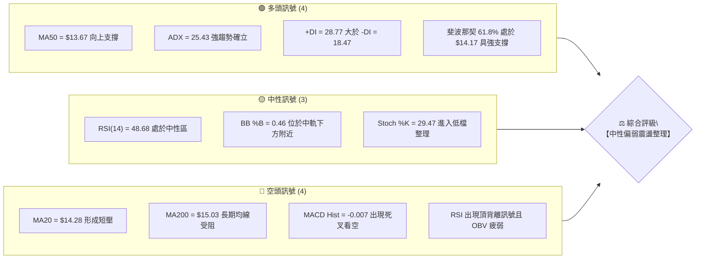
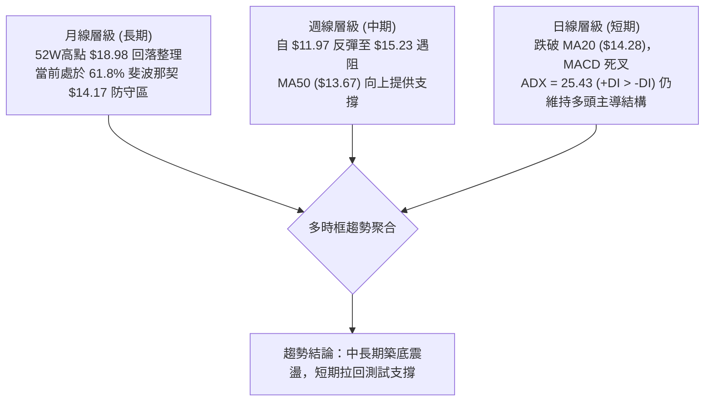
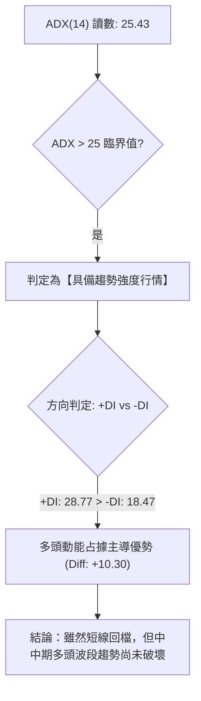
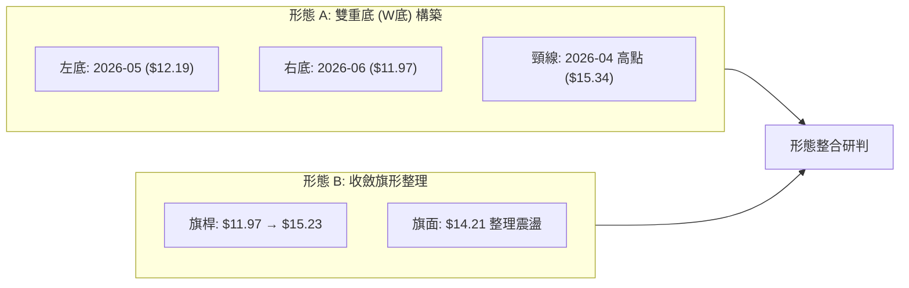
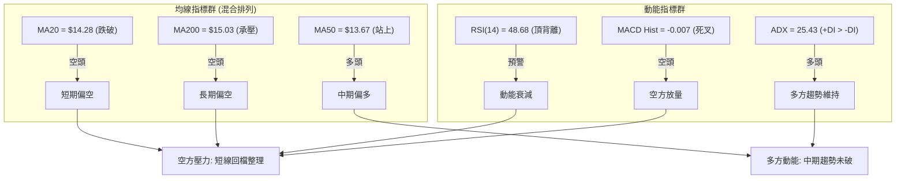
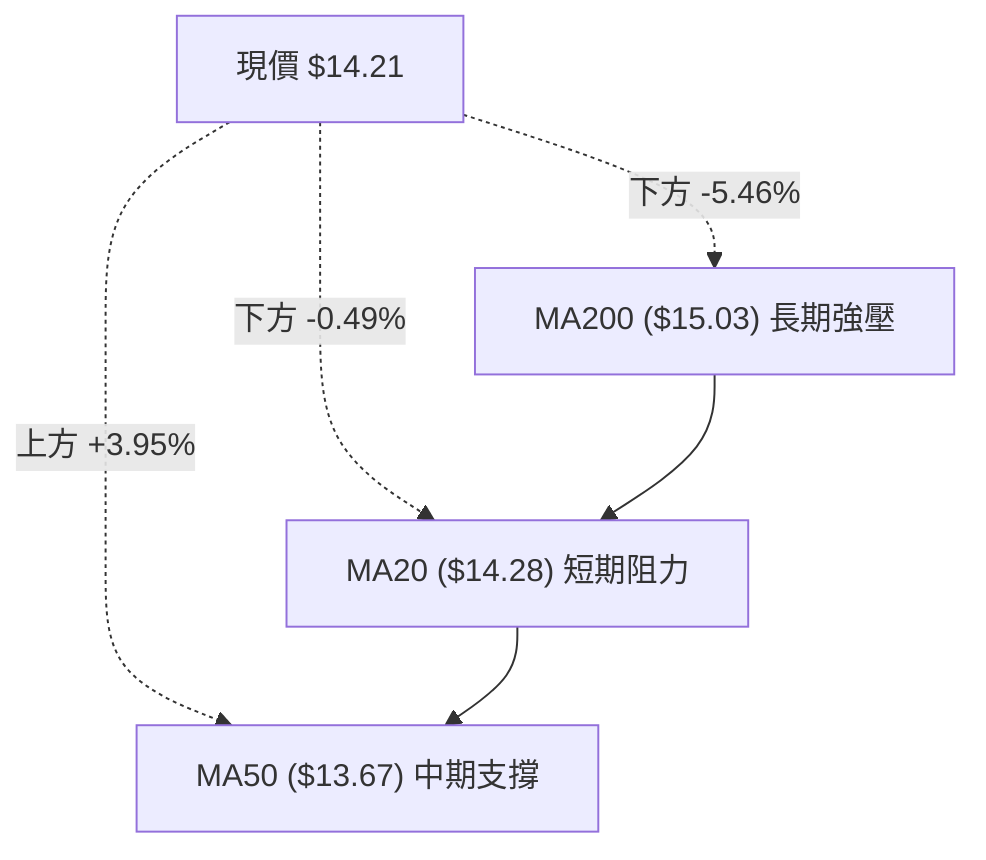
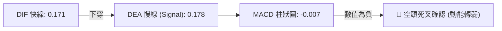
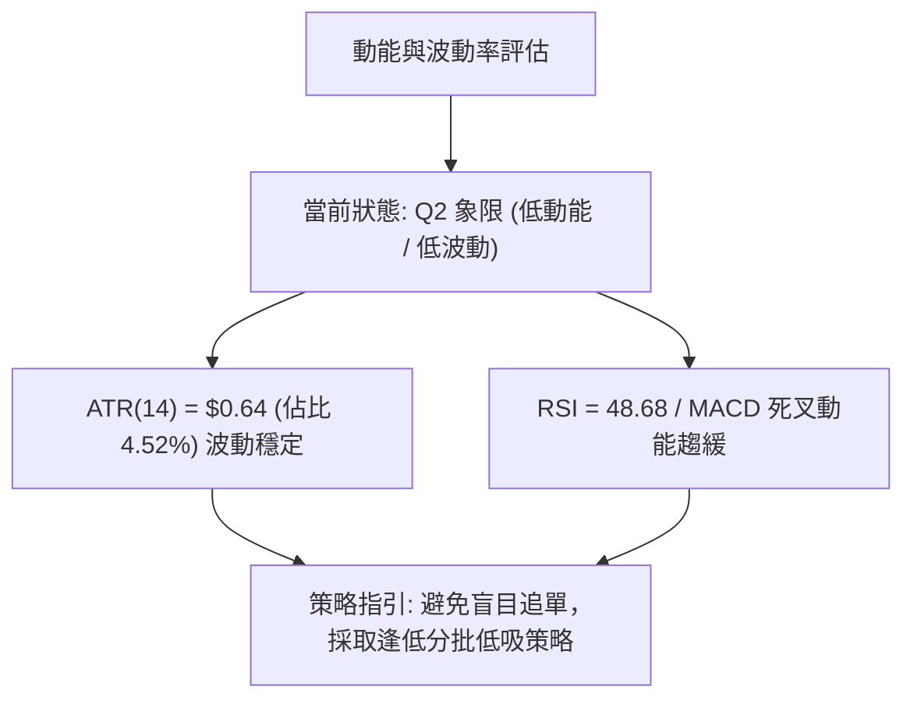
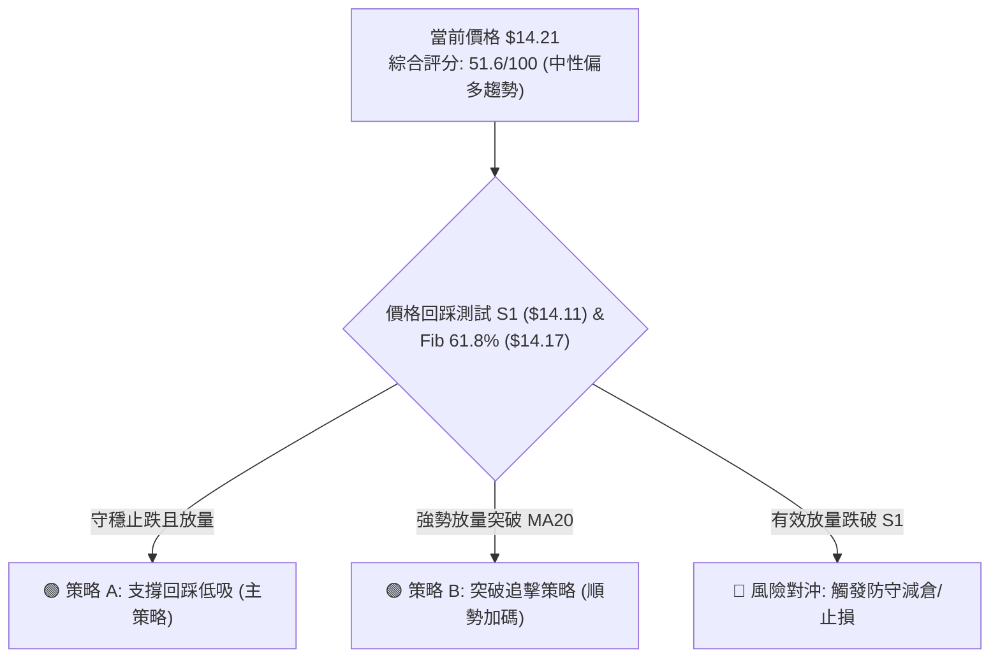
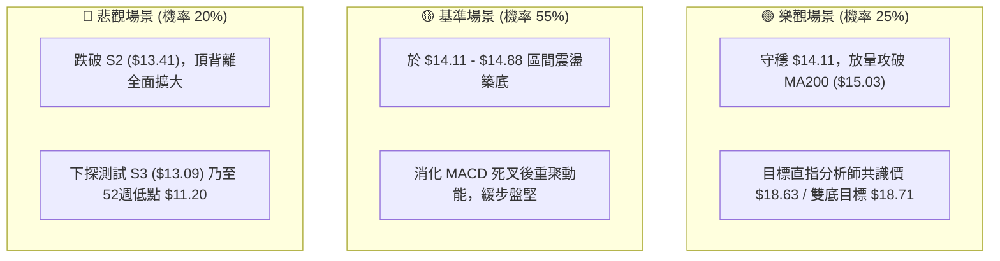

# NU 技術分析報告

> **報告日期**：2026-08-21 ｜ **語言**：繁體中文 ｜ **數據來源**：Yahoo Finance ｜ **當前價格**：$14.21

---

## 目錄

| 章節 | 內容 |
|------|------|
| [1. 技術面概覽](#1-技術面概覽) | 訊號儀表板、核心指標、評分卡 |
| [2. 趨勢分析](#2-趨勢分析) | 多時框趨勢、長中短期走勢 |
| [3. 圖表形態分析](#3-圖表形態分析) | 形態識別、K線組合、目標價 |
| [4. 支撐與阻力](#4-支撐與阻力) | 關鍵價位、斐波那契回調 |
| [5. 技術指標深度解讀](#5-技術指標深度解讀) | MA/RSI/MACD/布林/成交量 |
| [6. 動能與波動率](#6-動能與波動率) | 動能評估、ATR、Beta |
| [7. 多時框架總結](#7-多時框架總結) | 時框架評分矩陣 |
| [8. 交易策略建議](#8-交易策略建議) | 多空策略、風險報酬比 |
| [9. 風險提示與監控](#9-風險提示與監控) | 監控指標、風險場景 |

---

## 1. 技術面概覽

### 🎯 技術訊號儀表板



### 📊 核心指標速覽表

| 指標類別 | 指標名稱 | 當前數值 | 訊號 | 解讀 |
|----------|----------|----------|------|------|
| **價格** | 當前價格 | $14.21 | 🟡 | 位於 52 週區間之 38.7%，短線處於回檔測試區 |
| **均線** | MA20 | $14.28 | 🔴 | 現價位於 20 日均線下方（-0.49%），短線承壓 |
| **均線** | MA50 | $13.67 | 🟢 | 現價高於 50 日均線（+3.95%），中期多頭結構尚存 |
| **均線** | MA200 | $15.03 | 🔴 | 現價低於 200 日均線（-5.46%），長線仍處空頭壓制區 |
| **動能** | RSI(14) | 48.68 | 🟡 | 位於 30–70 中性區間，但帶有頂背離警示 |
| **動能** | MACD | 0.171 / 0.178 | 🔴 | 柱狀圖為 -0.007，DIF 跌破 DEA，動能出現死叉轉弱 |
| **動能** | ADX(14) | 25.43 | 🟢 | 趨勢強度 > 25，且 +DI(28.77) > -DI(18.47)，趨勢動能偏多 |
| **動能** | 隨機指標 | %K 29.47 / %D 35.79 | 🟡 | 接近超賣邊界，短線下行動能正在趨緩 |
| **通道** | 布林通道 | $13.47 – $15.08 | 🟡 | %B 為 0.46，價格由中軌（$14.28）向下軌回落尋求支撐 |
| **量能** | 最新量/20日均量 | 80.52M / 67.13M | 🟡 | 量比 1.20x，但 OBV < MA，反彈量能略顯疲弱 |
| **波動** | ATR(14) | $0.64 | 🟡 | 佔股價 4.52%，每日波動適中，提供操作緩衝空間 |

### 🏆 技術評分卡

```
╔══════════════════════════════════════════════════════════════╗
║                技術評分卡 — NU (2026-08-21)                  ║
╠══════════════════════════════════════════════════════════════╣
║ 趨勢強度 (ADX/+DI)    ██████████████░░░░░░  68/100  🟢 偏多  ║
║ 動能指標 (RSI/MACD)   ████████░░░░░░░░░░░░  42/100  🔴 偏弱  ║
║ 支撐穩定度 (Fib/S1)   █████████████░░░░░░░  65/100  🟢 良好  ║
║ 成交量配合 (OBV/Vol)  ████████░░░░░░░░░░░░  40/100  🔴 疲弱  ║
║ 形態完整度 (區間整理) ███████████░░░░░░░░░  55/100  🟡 中性  ║
║ 均線排列 (混合纏繞)   ████████░░░░░░░░░░░░  40/100  🔴 偏空  ║
╠══════════════════════════════════════════════════════════════╣
║ 綜合技術評分          ██████████░░░░░░░░░░  51.6/100 🟡 中性 ║
╚══════════════════════════════════════════════════════════════╝
```

---

## 2. 趨勢分析

### 🌐 多時框趨勢分析



### 📈 長期趨勢 — 12個月走勢圖（Unicode）

```
NU 月線收盤走勢圖（2025-08 至 2026-08）
價格 ($)
$18.00 ┤                                  ● $17.75 (高點 2026-01)
$17.00 ┤                          ● $17.39
$16.00 ┤                  ● $16.11
$15.00 ┤  ● $14.80                                ● $14.98
$14.00 ┤                                                  ● $14.21 (現價)
$13.00 ┤                                          ● $13.13
$12.00 ┤
$11.00 ┤
       └─────────────────────────────────────────────────────────────
         08/25  10/25   11/25   12/25    01/26    03/26   05/26    08/26
```

**12個月走勢特徵分析表格**：

| 階段 | 時間區間 | 起始/結束價位 | 漲跌幅 | 主要特徵與結構 |
|------|----------|---------------|--------|----------------|
| **波段主升浪** | 2025-08 → 2026-01 | $14.80 → $17.75 | +19.93% | 多頭排列順暢，月線連續收陽，觸及波段頂部 $17.75 |
| **波段回調浪** | 2026-01 → 2026-05 | $17.75 → $13.13 | -26.03% | 自高檔獲利了結回落，跌破 MA200，最低探至 $11.97（週線低點）|
| **震盪築底浪** | 2026-05 → 2026-08 | $13.13 → $14.21 | +8.22% | 於 $13.09–$13.41 區間確認支撐，逐步回升至斐波那契 61.8% |

### 📊 中期趨勢（週線分析）

```
NU 週線支撐阻力結構圖
══════════════════════════════════════════════════════════════════
$15.70 ── R3 波段強阻力 ─────────────────────────────────────────
$15.23 ── 前週高點阻力（2026-08-16）
$15.03 ── MA200 長期均線壓制位
$14.38 ── R1 近期阻力 / MA20 ($14.28)
$14.21 ── 現價 (落於 Fib 61.8% $14.17 上方)
$14.11 ── S1 近期第一道波段支撐
$13.67 ── MA50 中期生命線
$13.41 ── S2 強支撐位 / 布林下軌 ($13.47)
══════════════════════════════════════════════════════════════════
```

### ⚡ 趨勢強度評估（ADX 解讀）



| 指標 | 數值 | 參考門檻 | 狀態解讀 |
|------|------|----------|----------|
| **ADX(14)** | 25.43 | > 25 進入強趨勢 | 趨勢初具動能，脫離低動能無方向盤整 |
| **+DI** | 28.77 | 數值高於 25 | 買盤推動力維持正向 |
| **-DI** | 18.47 | 數值低於 20 | 賣壓尚未全面失控 |
| **綜合判定** | **多頭主導** | 差值 +10.30 | 中期回檔為健康修正，優先順應週線多方結構 |

---

## 3. 圖表形態分析

### 🔍 形態識別系統



**形態信心度評估表**：

| 形態名稱 | 信心度 | 判斷依據（引用真實數據） | 完成度 | 目標價（附嚴格計算式） |
|----------|--------|--------------------------|--------|------------------------|
| **雙重底 (W-Bottom)** | **65%** | 2026-05 低點 $12.19 與 2026-06 低點 $11.97 形成雙底支撐（接近波段低點），頸線位於 2026-04-19 高點 $15.34 | 75% | 形態高度 = $15.34 - $11.97 = $3.37。<br/>突破目標 = $15.34 + $3.37 = **$18.71**（接近 52W 高點 $18.98） |
| **上升旗形 (Bull Flag)** | **55%** | 自 2026-06 低點 $11.97 拉升至 2026-08 高點 $15.23，近期於 $13.84–$14.38 窄幅回洗 | 60% | 旗桿高度 = $15.23 - $11.97 = $3.26。<br/>旗形突破目標 = $14.21 + $3.26 = **$17.47** |

### 🕯️ 重要K線形態分析

| 週/月份 | 收盤價 | K線形態 | 解讀 | 多空訊號 |
|---------|--------|---------|------|----------|
| **2026-06-07** | $11.97 | 長下影長陰破底翻 | 探底至 52W 低點 $11.20 附近獲巨量（4.73億股）承接 | 🟢 破底翻反轉 |
| **2026-07-19** | $13.59 | 天量十字星（7.62億股） | 高檔換手巨量，主力於 MA50 上方換手對倒 | 🟡 換手中性 |
| **2026-08-16** | $15.23 | 帶上影大陽線 | 向上挑戰 MA200 ($15.03) 遭空頭解套盤反壓 | 🟡 假突破受阻 |
| **2026-08-23** | $14.21 | 中陰回吐線 | 跌破 5日均線（$14.63）回測 61.8% 斐波那契防守位 | 🔴 短線修正 |

### 📉 ASCII 走勢形態示意圖

```
NU 雙底與旗形演變示意圖
價格 ($)
$15.34 ┬───────────────● 頸線阻力位 ($15.34) ──────● $15.23 (測試頸線)
       │              / \                         / \
$14.21 ┼─────────────/───\───────────────────────/───● 現價 ($14.21)
       │            /     \                     /
$13.00 ┤           /       \                   /
       │          /         ● 2026-05 ($13.13)/
$12.00 ┤         /           \               /
       │  ● 左底 ($12.19)      ● 右底 ($11.97)
$11.20 ┴── 52週低點 ───────────────────────────────────────────
```

### 🎯 形態目標價計算

1. **雙重底測幅目標價**：
   - 形態底部最低點：$11.97
   - 形態頸線確認點：$15.34
   - 垂直高度（H）：$15.34 - $11.97 = **$3.37**
   - 向上突破測幅目標（T_double）：$15.34 + $3.37 = **$18.71**（與 52週高點 $18.98 及分析師共識平均目標價 $18.63 具備極高共振性）

2. **短線旗形回檔支撐確認點**：
   - 回檔支撐測試點：Fib 61.8% = **$14.17** 及 S1 = **$14.11**。

---

## 4. 支撐與阻力

### 🗺️ 關鍵價位分布圖（Unicode）

```
NU 關鍵價位結構分布圖
═════════════════════════════════════════════════════════════════
$15.70 ║████████████████████████║ 強阻力 R3 (波段高點聚集區 +10.45%)
$15.09 ║▓▓▓▓▓▓▓▓▓▓▓▓▓▓▓▓▓▓▓▓    ║ 斐波那契 50.0% / MA200 ($15.03)
$14.88 ║████████████████████    ║ 阻力 R2 (近期多頭反彈高壓區 +4.73%)
$14.38 ║████████████████████████║ 關鍵阻力 R1 (短線波段高點 +1.20%)
$14.28 ║------------------------║ 布林中軌 / MA20 重合阻力線
$14.21 ╠════════════════════════╣ ◄ 當前價格 $14.21
$14.17 ║........................║ 斐波那契 61.8% 關鍵黃金分割支撐
$14.11 ║▓▓▓▓▓▓▓▓▓▓▓▓▓▓▓▓        ║ 近期支撐 S1 (波段低點聚類 -0.74%)
$13.67 ║▒▒▒▒▒▒▒▒▒▒▒▒▒▒▒▒▒▒▒▒    ║ MA50 中期趨勢支撐線
$13.41 ║████████████████████████║ 強支撐 S2 (波段結構防守位 -5.63%)
$13.09 ║████████████████████████║ 極限強支撐 S3 (底部強支撐 -7.92%)
═════════════════════════════════════════════════════════════════
```

### 🚧 阻力位分析表

| 阻力級別 | 精確價位 | 距現價幅幅 | 形成原因與技術共振 | 突破難度 | 重要性 |
|----------|----------|------------|--------------------|----------|--------|
| **R1** | **$14.38** | +1.20% | 近一年波段高點聚類，且上方緊貼 MA20 ($14.28) 與 MA5 ($14.63) | 🟡 中等 | ★★★☆☆ |
| **R2** | **$14.88** | +4.73% | 波段籌碼密集區，接近布林上軌 ($15.08) 與 MA200 ($15.03) | 🔴 較高 | ★★★★☆ |
| **R3** | **$15.70** | +10.45% | 近一年多頭極限波段高點聚類，前波套牢密集成交區 | 🔴 極高 | ★★★★★ |

### 🛡️ 支撐位分析表

| 支撐級別 | 精確價位 | 距現價幅幅 | 形成原因與技術共振 | 守住機率 | 重要性 |
|----------|----------|------------|--------------------|----------|--------|
| **S1** | **$14.11** | -0.74% | 近一年波段低點聚類，緊鄰 52週斐波那契 61.8% ($14.17) | 🟢 70% | ★★★★☆ |
| **S2** | **$13.41** | -5.63% | 波段低點聚類，與布林下軌 ($13.47) 及 MA60 ($13.45) 完美重疊 | 🟢 85% | ★★★★★ |
| **S3** | **$13.09** | -7.92% | 近一年波段強低點，中期多空分水嶺防守底線 | 🟢 95% | ★★★★★ |

### 📐 斐波那契回調位分析

依據 52 週極值區間（低點 **$11.20** → 高點 **$18.98**），計算所得斐波那契回調位如下：

```
斐波那契回調層級分布（52週區間）
0.0%  (52W High) ─── $18.98
23.6% ────────────── $17.14
38.2% ────────────── $16.01
50.0% ────────────── $15.09 (緊鄰 MA200 $15.03)
61.8% ────────────── $14.17 ◄◄ 現價 $14.21 落於此線上方 (+0.04)
78.6% ────────────── $12.86
100.0%(52W Low)  ─── $11.20
```

- **位置解讀**：現價 **$14.21** 精確運行在 **50.0% ($15.09)** 與 **61.8% ($14.17)** 之間。
- **深度意涵**：在道氏理論與斐波那契架構中，61.8%（$14.17）是黃金回調的「最後防線」。現價在 $14.17 處出現反覆回踩確認，只要日線收盤不實體跌破 $14.11 (S1)，整體回調仍屬於強勢回踩結構。

---

## 5. 技術指標深度解讀

### 🎛️ 指標訊號總覽



### 📈 移動平均線排列分析



- **短天期與長天期 MA 走勢細節**：
  - **MA5 ($14.63)** 快速下彎，短線形成扣高壓力。
  - **MA10 ($14.20)** 與現價基本重合，提供微幅短線支撐。
  - **MA60 ($13.45)** 與 **MA120 ($13.82)** 維持向上發散，顯示中長線低檔買盤紮實。
  - **結論**：當前均線處於「短空、月中、長空」的典型區間收斂形態，需放量突破 MA20 ($14.28) 才能解除短線下行警報。

### 📉 RSI(14) 分析

```
RSI(14) 當前數值：48.68
[超賣 0] ────────── [30] ────── [48.68] ────── [70] ────────── [100 超買]
                         ██████████░░░░░░░░░░ 48.68%
```

- **指標狀態**：RSI 位於 48.68，處於 30–70 的中性平衡區。
- **背離分析**：系統偵測到 **⚠️ 頂背離 (Bearish Divergence)**。2026-08-16 股價觸及波段高點 $15.23 時，RSI 僅達 58.0，顯著低於 2026-07-05 股價 $13.61 時的 RSI 79.0。這表明此波衝高屬於動能減弱的衰竭性上攻，直接引發了本週回落至 $14.21 的修正。

### 📊 MACD(12/26/9) 訊號解讀



- **解讀**：DIF (0.171) 微幅下穿 Signal (0.178)，柱狀圖翻負至 **-0.007**。雖然死叉位置處於零軸上方（屬於強勢拉回死叉），但顯示短線回檔尚未結束，需等待柱狀圖收斂翻紅。

### 📦 布林通道分析

```
NU 布林通道空間示意圖 (20日, 2.0σ)
══════════════════════════════════════════════════════════════
$15.08 ── BB 上軌 ───────────────────────────────────────────
$14.28 ── BB 中軌 (MA20 阻力) ──────────────────────────────
$14.21 ── 現價位置 (%B = 0.46)
$13.47 ── BB 下軌 (支撐區間) ────────────────────────────────
══════════════════════════════════════════════════════════════
```

- **通道帶寬與位置**：BB 上軌為 **$15.08**，下軌為 **$13.47**，帶寬為 $1.61（11.3%）。
- **%B 指標分析**：%B 為 **0.46**，現價跌破中軌 $14.28，朝向布林下軌 $13.47 尋求支撐。若在 $14.11–$14.17 止跌，布林中軌將由阻力轉為收斂中樞。

### 💹 成交量分析（量價配合度）

- **量能結構**：最新單日成交量為 **80,521,677 股**，相較於 20日均量 67,128,049 股，量比達到 **1.20x**，呈現放量回檔。
- **OBV 能量潮**：當前 OBV < MA，顯示在回檔過程中主力資金承接力道略顯消極，資金呈現溫和流出狀態，尚未出現量價齊揚的右側攻擊訊號。

---

## 6. 動能與波動率

### ⚡ 動能評估四象限

| 象限 | 動能強度 | 波動率狀態 | 當前股票歸屬 | 技術特徵解讀 |
|------|----------|------------|--------------|--------------|
| **Q1 (高動能/低波動)** | 強 | 低 | — | 穩定多頭主升段 |
| **Q2 (低動能/低波動)** | 弱 | 低 | **✓ 歸屬於此** | **處於回檔整理階段，跌勢收斂，適合區間高拋低吸** |
| **Q3 (高動能/高波動)** | 強 | 高 | — | 爆發性突破或急跌洗盤 |
| **Q4 (低動能/高波動)** | 弱 | 高 | — | 無序震盪，容易雙向侵蝕本金 |



### 📊 ATR 波動率分析

- **ATR(14) 數值**：**$0.64**（佔當前股價之 4.52%）。
- **止損與波動區間建議**：
  - **日內正常波動區間**：$14.21 ± $0.64 → **[$13.57, $14.85]**。
  - **短線防守止損距離**：建議設置 1.0 倍 ATR（即 $0.64），對應止損參考位為 $14.21 - $0.64 = **$13.57**（高於強支撐 S2 $13.41）。
  - **波段交易止損距離**：建議設置 1.5 倍 ATR（即 $0.96），對應止損參考位為 $14.21 - $0.96 = **$13.25**（高於極限支撐 S3 $13.09）。

### 📐 Beta 與市場相關性

- **Beta 係數**：**0.942**。
- **市場特徵分析**：Beta 略低於 1.00，顯示 NU 走勢與美股大盤（S&P 500）具備高度連動性，但波動幅度相對大盤稍微平穩。在金融板塊中，其 82.0% 的機構持股比例與 3.9% 的偏低空單比例（Short % Float），大幅降低了遭遇軋空或踩踏式崩跌的非系統性風險。

---

## 7. 多時框架總結

### 📋 時框架評分表

| 時框架 | 趨勢方向 | 動能狀態 | 均線排列 | 形態結構 | 綜合評分 | 操作建議 |
|--------|----------|----------|----------|----------|----------|----------|
| **月線 (長期)** | 🟡 震盪整理 | 🟡 中性 (Fib 61.8%) | 🔴 跌破 MA200 | 大級別回檔測試 | 50/100 | 長期分批逢低佈局 |
| **週線 (中期)** | 🟢 震盪偏多 | 🟢 ADX=25.43 多頭 | 🟢 站穩 MA50 | 雙底/旗形構築中 | 62/100 | 順勢逢回做多 |
| **日線 (短期)** | 🔴 短線回檔 | 🔴 MACD死叉/背離 | 🔴 跌破 MA20 | 回踩 S1 測試支撐 | 42/100 | 等待回踩止跌訊號 |

### 🔲 綜合訊號矩陣

```
╔══════════════════════════════════════════════════════════════╗
║                   多時框架綜合訊號共振矩陣                   ║
╠══════════════╦════════════════╦════════════════╦═════════════╣
║ 分析維度     ║ 短期 (日線)    ║ 中期 (週線)    ║ 長期 (月線) ║
╠══════════════╬════════════════╬════════════════╬═════════════╣
║ 趨勢方向     ║ 🔴 空頭承壓    ║ 🟢 多頭波段    ║ 🟡 寬幅震盪 ║
║ 均線系統     ║ 🔴 跌破 MA20   ║ 🟢 站上 MA50   ║ 🔴 承壓MA200║
║ 動能指標     ║ 🔴 MACD 死叉   ║ 🟢 +DI > -DI   ║ 🟡 RSI 中性 ║
║ 關鍵位置     ║ 🟡 逼近 S1     ║ 🟢 守住 Fib61.8║ 🟢 遠離 52W低║
╚══════════════╩════════════════╩════════════════╩═════════════╝
```

### ⚖️ 多時框收斂結論

依據多時框收斂規則（規則 14）：
1. **趨勢/盤整判定**：當前 **ADX(14) = 25.43 > 25**，且 **+DI (28.77) 顯著高於 -DI (18.47)**，市場確立為**「趨勢行情」**而非無序盤整。
2. **主導時框權重**：在 ADX > 25 的趨勢行情下，依規則以**中長期（週線／MA50）趨勢為主導方向**，日線級別的指標弱化（MACD 死叉、跌破 MA20）僅視為**上升波段中的短期拉回尋求進場時機**。
3. **唯一方向性結論**：**【中期震盪偏多，短線拉回尋求支撐】**。第 8 章之交易策略將以**逢低做多為主策略**，並以精確關鍵價位嚴格控管下行風險。

---

## 8. 交易策略建議

### 🗺️ 策略決策流程圖



### 🧭 策略路由

**當前主策略方向 = 【區間偏多操作 — 逢低佈局】（依技術評分 51.6/100 及 ADX 多頭趨勢）**

### 🎯 價格情境階梯（Price Scenarios）

| 觸發條件 | 第一目標 | 第二延伸目標 | 情境技術含義 |
|----------|----------|--------------|--------------|
| **向上突破 R1 $14.38** | R2 **$14.88** | R3 **$15.70** | 短線整理結束，多頭重啟上攻挑戰 MA200 |
| **守穩 S1 $14.11 – Fib $14.17** | R1 **$14.38** | R2 **$14.88** | 於黃金分割位獲得支撐，延續週線上升波段 |
| **跌破 S1 $14.11** | S2 **$13.41** | S3 **$13.09** | 短線回調加深，向下測試布林下軌與 MA60 |

### 📊 情境機率分佈

| 情境劇本 | 預估機率 | 主要技術依據 |
|----------|----------|--------------|
| **情境一：守穩反彈上行** | **55%** | ADX=25.43 多頭主導、Fib 61.8% ($14.17) 具備強支撐、MA50 向上支撐 |
| **情境二：區間窄幅震盪** | **30%** | 布林通道收口、RSI=48.68 處於中性區、成交量配合度稍顯不足 |
| **情境三：跌破深幅回調** | **15%** | RSI 頂背離發酵、MACD 柱狀圖翻負、OBV 疲弱持續放量跌破 |

### 🟢 主策略詳情

依據本報告第 4 章計算之關鍵價位，規劃兩套具體執行策略：

| 策略要素 | 策略 A：關鍵支撐低吸策略（左側/主策略） | 策略 B：突破加碼策略（右側/順勢） |
|----------|-----------------------------------------|-----------------------------------|
| **進場條件** | 回踩 Fib 61.8% / S1 企穩出現下影線時進場 | 實體 K 線放量突破 R1 且收盤站上 MA20 |
| **精確進場點** | **$14.15**（介於 S1 $14.11 與 Fib $14.17）| **$14.40**（確認突破 R1 $14.38） |
| **目標價 T1** | **$14.88**（R2 阻力位，預期收益 +5.16%） | **$15.09**（Fib 50.0% / MA200 壓制） |
| **目標價 T2** | **$15.70**（R3 強阻力，預期收益 +10.95%）| **$15.70**（R3 強阻力，預期收益 +9.03%） |
| **精確止損點** | **$13.67**（MA50 支撐跌破，風險 -3.39%） | **$14.11**（跌回 S1 支撐下方，風險 -2.01%）|
| **風險報酬比** | **3.23 : 1**（以 T2 計算：1.55 / 0.48） | **4.48 : 1**（以 T2 計算：1.30 / 0.29） |
| **勝率評估** | **65%** | **60%** |
| **建議倉位** | **15% - 20%** | **10% - 15%**（突破確認後加碼） |

### 🔴 反向風險觸發點（對沖提示）

- **多頭結構破壞點**：若日線收盤價**實體跌破 S2 ($13.41)**，代表雙底與旗形架構全面失效，中短期趨勢轉空。
- **對沖處置建議**：跌破 $13.41 時應全面出清多頭部位，或利用反向標的進行 100% 避險對沖，下看 S3 ($13.09) 乃至 52週低點 ($11.20)。

### ⭐ 整體訊號強度評星

```
╔══════════════════════════════════════════════════════════════╗
║ 做多訊號強度：  ★★★☆☆  (3.2/5 星 - 具備盈虧比優勢)           ║
║ 做空訊號強度：  ★★☆☆☆  (2.1/5 星 - 受限於中期均線支撐)       ║
║ 整體訊號可信度：★★★★☆  (4.0/5 星 - 數據收斂度高)             ║
╚══════════════════════════════════════════════════════════════╝
```

---

## 9. 風險提示與監控

### ✅ 關鍵監控指標 Checklist

```
╔══════════════════════════════════════════════════════════════╗
║               NU 技術面日常監控清單 (Checklist)               ║
╠══════════════════════════════════════════════════════════════╣
║ [ ] 價格是否跌破斐波那契 61.8% 防守線 $14.17                 ║
║ [ ] 價格能否放量站回 MA20 ($14.28) 及突破 R1 ($14.38)        ║
║ [ ] MACD 柱狀圖（當前 -0.007）是否收斂翻紅                   ║
║ [ ] RSI(14) 是否跌破 45 進入弱勢區                           ║
║ [ ] 單日成交量是否放大至 8,000 萬股以上且收陽線 (確認主力進駐)║
║ [ ] ADX(14) 是否持續維持在 25 以上且 +DI 保持領先            ║
╚══════════════════════════════════════════════════════════════╝
```

### ⚠️ 風險場景分析



### 🛡️ 風險管理重要提醒

1. **嚴格執行資金管理**：單筆交易承擔之最大虧損金額不得超過總帳戶資產之 **1.5% - 2.0%**。
2. **波動率緩衝設置**：NU 的日 ATR 為 **$0.64 (4.52%)**，盤中出現 ±3% 左右的震盪屬於常態，切忌將止損點設定過於狹窄（如小於 $0.20），以免遭到市場日常雜訊洗盤出場。
3. **重大事件防範**：需隨時追蹤巴西及拉美地區之宏觀利率環境變化與金融監管動向，基本面高達 82.0% 的機構持股是中長期的定海神針，但短期技術回檔仍需依價位紀律操作。

---

## 📋 報告總結

```
╔══════════════════════════════════════════════════════════════════╗
║                   NU 技術分析報告總結評估卡                     ║
╠══════════════════════════════════════════════════════════════════╣
║ 報告日期：2026-08-21                                            ║
║ 當前價格：$14.21                                                 ║
║ 技術評級：⚖️【中性偏多 — 逢低吸納】 (評分: 51.6/100)              ║
╠══════════════════════════════════════════════════════════════════╣
║ 關鍵結論：                                                       ║
║ ├─ 長期趨勢：🟡 中性震盪 (落於 52週 38.7% 分位，承壓 MA200)      ║
║ ├─ 中期趨勢：🟢 偏多主導 (ADX=25.43, +DI=28.77, 站穩 MA50 $13.67)║
║ ├─ 短期趨勢：🔴 震盪拉回 (MACD死叉 -0.007, 承壓 MA20 $14.28)     ║
║ ├─ 關鍵支撐：S1: $14.11 ｜ Fib 61.8%: $14.17 ｜ S2: $13.41       ║
║ ├─ 關鍵阻力：R1: $14.38 ｜ R2: $14.88 ｜ MA200: $15.03           ║
║ └─ 機構目標：分析師共識平均目標價 $18.63 (22位分析師評級 Buy)    ║
╠══════════════════════════════════════════════════════════════════╣
║ 最優策略組合：                                                   ║
║ 1. 🥇 最佳機會 (策略 A)：$14.15 附近分批低吸，止損 $13.67，       ║
║                         目標看至 $14.88 / $15.70 (風報比 3.23:1) ║
║ 2. 🥈 次選機會 (策略 B)：突破 $14.38 (R1) 順勢加碼，上看 $15.09   ║
║ 3. 🥉 保守選擇：等待股價放量站上 MA200 ($15.03) 後再行右側介入   ║
╚══════════════════════════════════════════════════════════════════╝
```

---

> ⚠️ **免責聲明**：本報告為 AI 自動生成之技術分析，所有數據及估算均基於提供的歷史價格與量化技術指標。本報告**僅供研究與學術參考**，**不構成任何投資建議**。投資有風險，入市需謹慎。

---

*報告生成時間：2026-08-21 ｜ 數據來源：Yahoo Finance ｜ 分析框架：多時框技術分析體系*