# NU 技術分析報告

> **報告日期**：2026-08-24 ｜ **語言**：繁體中文 ｜ **數據來源**：Yahoo Finance ｜ **當前價格**：$14.58

---

## 目錄

| 章節 | 內容 |
|------|------|
| [1. 技術面概覽](#1-技術面概覽) | 訊號儀表板、核心指標、評分卡 |
| [2. 趨勢分析](#2-趨勢分析) | 多時框趨勢、長中短期走勢、ADX解讀 |
| [3. 圖表形態分析](#3-圖表形態分析) | 形態識別、K線組合、目標價推算 |
| [4. 支撐與阻力](#4-支撐與阻力) | 關鍵價位、斐波那契回調結構 |
| [5. 技術指標深度解讀](#5-技術指標深度解讀) | 均線系統、RSI、MACD、布林通道、OBV |
| [6. 動能與波動率](#6-動能與波動率) | 動能四象限、ATR波動分析、Beta敏感度 |
| [7. 多時框架總結](#7-多時框架總結) | 時框矩陣、多時框收斂結論 |
| [8. 交易策略建議](#8-交易策略建議) | 策略路由、情境階梯、進出場規劃 |
| [9. 風險提示與監控](#9-風險提示與監控) | 監控清單、情境推演、風控規則 |
| [📋 報告總結](#-報告總結) | 總結儀表板與最優策略 |

---

## 1. 技術面概覽

### 🎯 技術訊號儀表板

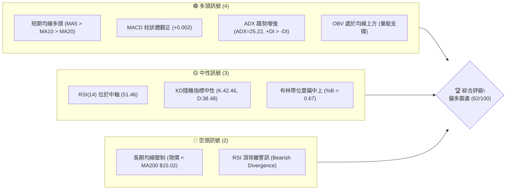

---

### 📊 核心指標速覽表

| 指標類別 | 指標名稱 | 當前數值 | 訊號 | 解讀 |
|:---|:---|:---|:---:|:---|
| **現價結構** | 當前收盤價 | **$14.58** | 🟢 | 站上 MA20（$14.30）與 MA50（$13.73），維持短中期反彈結構 |
| **短期均線** | MA20 (月線) | **$14.30** | 🟢 | 現價高於 MA20 +1.96%，提供短線下檔動態支撐 |
| **中期均線** | MA50 (季線) | **$13.73** | 🟢 | 現價高於 MA50 +6.19%，中期底部墊高確立 |
| **長期均線** | MA200 (年線) | **$15.02** | 🔴 | 現價低於 MA200 -2.93%，上方存在長期籌碼套牢壓力區 |
| **超長均線** | MA240 | **$15.12** | 🔴 | 位於現價上方 -3.57%，與 MA200 形成雙重長期均線反壓 |
| **動能擺盪** | RSI(14) | **51.46** | 🟡 | 位於 30–70 中性強弱分水嶺之上，但需留意頂背離訊號 |
| **指數平滑** | MACD (12,26,9)| **+0.002** (Hist) | 🟢 | DIF(0.180) 剛上穿 Signal(0.179)，多頭微幅發力 |
| **隨機指標** | Stoch %K / %D | **42.46 / 38.48** | 🟡 | %K 上穿 %D 形成中軸金叉，短線具備蓄勢向上動能 |
| **趨勢強度** | ADX (14) | **25.22** | 🟢 | ADX > 25 確認進入趨勢行情，+DI(27.05) 明顯主導 -DI(17.14) |
| **波動區間** | 布林帶 %B | **0.67** | 🟢 | 股價運行於中軌（$14.30）與上軌（$15.11）之間的多頭通道 |
| **市場波動** | ATR(14) | **$0.67** (4.58%) | 🟡 | 日均波動幅度約 4.58%，提供波段止損與風控設置基準 |
| **量能趨勢** | 成交量 / 20日均量| **66.02M / 65.86M** | 🟢 | 量比 1.00x，量能溫和持平，OBV > MA 維持量能支撐結構 |

---

### 🏆 技術評分卡

```
╔══════════════════════════════════════════════════════════════╗
║             技術評分卡 — NU (2026-08-24)                     ║
╠══════════════════════════════════════════════════════════════╣
║ 趨勢強度 (ADX & DI)     ██████████████░░░░░░  70/100  🟢 看多 ║
║ 動能指標 (RSI & MACD)   ████████████░░░░░░░░  60/100  🟡 中性 ║
║ 支撐穩定度 (S1-S3防守)   ██████████████░░░░░░  70/100  🟢 看多 ║
║ 成交量配合 (OBV & 均量) ████████████░░░░░░░░  60/100  🟢 看多 ║
║ 形態完整度 (雙底反彈)   ██████████████░░░░░░  70/100  🟢 看多 ║
║ 均線排列 (短多長空)     ████████░░░░░░░░░░░░  40/100  🔴 承壓 ║
╠══════════════════════════════════════════════════════════════╣
║ 綜合評分                ████████████░░░░░░░░  62/100  偏多震盪 ║
╚══════════════════════════════════════════════════════════════╝
```

---

## 2. 趨勢分析

### 🌐 多時框趨勢分析

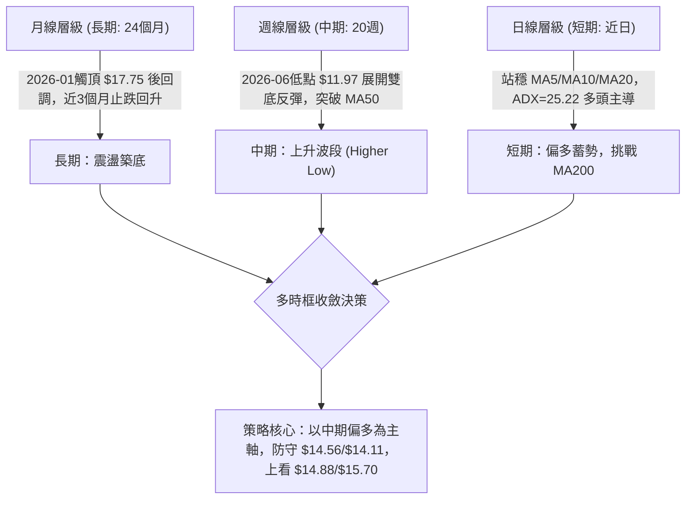

---

### 📈 長期趨勢 — 12個月走勢圖（Unicode）

```
NU 月線走勢圖（2025-08 至 2026-08）
價格軸 ($)
$18.00 ┤                               ● $17.75 (2026-01)
$17.00 ┤                     ● $17.39       ● $16.74
$16.00 ┤           ● $16.01  ● $16.11
$15.00 ┤ ● $14.80                                ● $14.98       ● $14.58 (現價)
$14.00 ┤                                              ● $14.37  ● $14.48  ● $14.33
$13.00 ┤                                                           ● $13.13  ● $13.36
$12.00 ┤
$11.00 ┤
       └──────────────────────────────────────────────────────────────────────────
         08/25 09/25 10/25 11/25 12/25 01/26 02/26 03/26 04/26 05/26 06/26 07/26 08/26
```

#### 走勢特徵階段分析

| 階段區間 | 價格變動 | 期間漲跌幅 | 走勢特徵與技術意義 |
|:---|:---:|:---:|:---|
| **第一階段：強勁主升段**<br>(2025-08 ~ 2026-01) | $14.80 → $17.75 | **+19.93%** | 沿短期均線連續推升，創下波段高點 $17.75，逼近52週歷史高點 $18.98。 |
| **第二階段：中期回撤探底**<br>(2026-01 ~ 2026-06) | $17.75 → $11.97 | **-32.56%** | 形成連續走低格局，跌破各級均線並回測52週低點區域（最低收盤價 $11.97）。 |
| **第三階段：築底復甦回升**<br>(2026-06 ~ 2026-08) | $11.97 → $14.58 | **+21.80%** | 週線級別帶量反彈，相繼收復 MA20（$14.30）與 MA50（$13.73），形成扎實底部。 |

---

### 📊 中期趨勢（週線分析）

```
近 20 週關鍵支撐阻力結構圖 ($)
$15.70 ┼─────────────────────────────────── [R2 阻力區]
$15.34 ┼─────────● (04/19 高點)
$15.23 ┼─────────────────────────────● (08/16 週高點)
$15.02 ┼═══════════════════════════════════ [MA200 長期多空分水嶺]
$14.88 ┼─────────────────────────────────── [R1 阻力區]
$14.58 ┼───────────────────────────────● [現價]
$14.11 ┼─────────────────────────────────── [S2 / 斐波 61.8%]
$13.41 ┼─────────────────────────────────── [S3 / 布林下軌]
$11.97 ┼───────────────● (06/07 週低點，雙底支撐)
```

從近期20週走勢觀察：
1. **底部確立**：2026-05-17（$12.19）與 2026-06-07（$11.97）形成波段雙重底。
2. **量能釋放**：2026-07-19 單週暴增至 7.62 億股，主力換手極為積極，推動價格自 $13.50 震盪走高至 $15.23。
3. **回後買點**：上週（08-16）衝高 $15.23 後回落，本週收於 $14.58，有效守住 S1 關鍵支撐 $14.56 與 MA20 $14.30。

---

### ⚡ 趨勢強度評估（ADX 解讀）

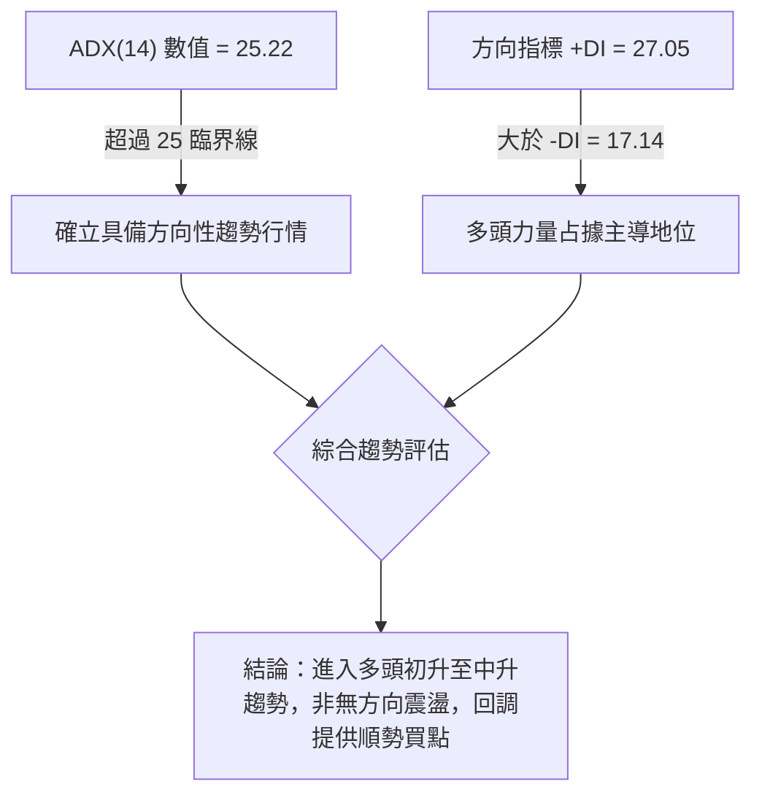

| 指標名稱 | 當前數值 | 門檻區間 | 技術解讀 | 趨勢狀態 |
|:---|:---:|:---:|:---|:---:|
| **ADX (14)** | **25.22** | > 25.00 | 突破 25 門檻，表明盤整格局結束，行情進入實質趨勢發展階段 | 🟢 趨勢成型 |
| **+DI (多頭力量)** | **27.05** | > 25.00 | 多方買盤動能充沛，居於主導進攻地位 | 🟢 多方占優 |
| **-DI (空頭力量)** | **17.14** | < 20.00 | 空方賣壓衰竭，未構成系統性威脅 | 🟢 空方受抑 |

---

## 3. 圖表形態分析

### 🔍 形態識別系統

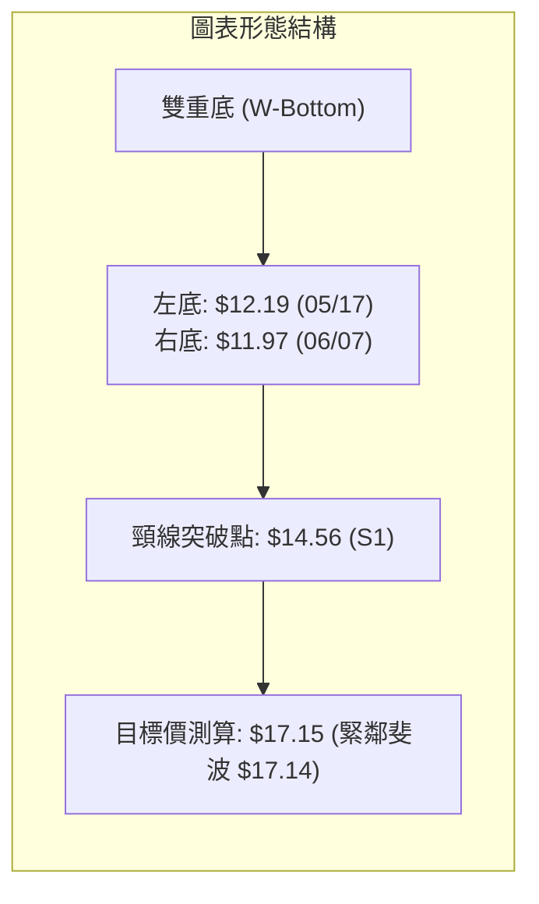

#### 形態信心度與目標價測算

| 識別形態 | 信心度 | 判斷依據（引用數據） | 完成度 | 目標價（附嚴謹計算式） |
|:---|:---:|:---|:---:|:---|
| **雙重底<br>(W-Bottom)** | **75%** | 2026年5月中旬低點 $12.19 與6月上旬低點 $11.97 構成雙底支撐；7月帶大量（7.62億股）突破波段頸線 $14.56。 | **85%** | **第一目標價 $17.15**<br>計算式：頸線 $14.56 + (頸線 $14.56 - 形態最低點 $11.97) = $14.56 + $2.59 = **$17.15**（精準契合斐波那契 23.6% 回調位 $17.14） |
| **上升旗形 / 收斂三角** | **60%** | 自 08-16 創波段高點 $15.23 後，股價回踩 $14.58 進行旗面整理，量能維持於 20MA（66M）水平，未見失控拋壓。 | **65%** | **突破目標價 $15.70**<br>計算式：旗桿起點 $13.84 至旗頂 $15.23（高度 $1.39），若自突破點 $14.58 發力，目標為 $14.58 + $1.39 = **$15.97**（先受阻於波段阻力 R2 **$15.70**） |

---

### 🕯️ 重要K線形態分析

| 觀測時點 | 收盤價 | K線形態 | 量能配合 | 技術解讀與未來訊號 | 訊號方向 |
|:---|:---:|:---|:---:|:---|:---:|
| **2026-06-07 週** | **$11.97** | 長下影錘頭線 (Hammer) | 473.47M (放量) | 探底52週低點區域後強勁買盤介入，確立波段大底。 | 🟢 強烈看多 |
| **2026-07-19 週** | **$13.59** | 爆量換手十字星 | 762.06M (波段最大量) | 主力資金大規模建倉換手，為後續突破提供能量儲備。 | 🟢 籌碼換手 |
| **2026-08-16 週** | **$15.23** | 倒錘頭 / 帶長上影長陽 | 381.42M (溫和) | 測試 MA200（$15.02）及 R1 阻力後短線獲利回吐。 | 🟡 短線受阻 |
| **2026-08-23 週** | **$14.58** | 縮量陰十字回踩 | 412.66M (平穩) | 回踩頸線 $14.56 獲支撐，屬於典型「突破後回抽確認」。 | 🟢 蓄勢待發 |

---

### 📉 ASCII 走勢形態示意圖

```
雙重底（W-Bottom）及突破回抽結構示意圖
價格
$15.50 ┤                                         ● 8/16高點 $15.23
$15.00 ┤                                        / \
$14.56 ┤───────────────── [頸線 S1 $14.56] ─────/───● 8/23現價 $14.58 (回抽確認)
$14.00 ┤        ● 04/26 ($14.51)               /
$13.50 ┤       / \                            /
$13.00 ┤      /   \            ● 05/31 ($13.13)
$12.50 ┤     /     \          / \            /
$12.00 ┤    /       ● ($12.19)   \          /
$11.50 ┤   /         左底         ● ($11.97)
       └─────────────────────────── 右底 ──────────────────────
          4月        5月中旬       6月上旬      7月中旬     8月下旬
```

---

## 4. 支撐與阻力

### 🗺️ 關鍵價位分布圖（Unicode）

```
NU 價位結構分布圖
═══════════════════════════════════════════════════════════════════
$18.98 ║██████████████████████████████║ 52週歷史高點 / 斐波 0.0%
$17.14 ║████████████████████          ║ 形態第一目標價 / 斐波 23.6%
$16.42 ║████████████████████████      ║ 強阻力 R3 (+12.65%)
$16.01 ║██████████████████            ║ 斐波 38.2% 回調位
$15.70 ║████████████████              ║ 中期阻力 R2 (+7.65%)
$15.09 ║████████████████████████      ║ 斐波 50.0% 中軸 / 緊鄰 MA200 ($15.02)
$14.88 ║██████████████                ║ 短線關鍵阻力 R1 (+2.07%)
╠══════╬══════════════════════════════╣ ◄ 現價 $14.58
$14.56 ║▓▓▓▓▓▓▓▓▓▓▓▓▓▓▓▓▓▓▓▓▓▓▓▓▓▓▓▓  ║ 即時波段支撐 S1 (-0.14%) / 雙底頸線
$14.17 ║▓▓▓▓▓▓▓▓▓▓▓▓▓▓▓▓▓▓▓▓          ║ 斐波 61.8% 黃金分割強支撐
$14.11 ║▓▓▓▓▓▓▓▓▓▓▓▓▓▓▓▓▓▓▓▓▓▓▓▓      ║ 核心防守支撐 S2 (-3.26%)
$13.41 ║▓▓▓▓▓▓▓▓▓▓                    ║ 強支撐 S3 (-8.02%) / 近布林下軌
$11.20 ║██████████████████████████████║ 52週歷史低點 / 斐波 100.0%
═══════════════════════════════════════════════════════════════════
```

---

### 🚧 阻力位分析表

| 阻力級別 | 精確價位 | 距現價空間 | 形成原因與籌碼聚類 | 突破難度 | 重要性權重 |
|:---|:---:|:---:|:---|:---:|:---:|
| **R1 (短線阻力)** | **$14.88** | **+2.07%** | 近一年次級波段高點密集成交區，多頭首要衝刺關卡。 | 🟡 中等 (需日成交量 > 70M) | ★★★☆☆ |
| **R2 (中期阻力)** | **$15.70** | **+7.65%** | 2025年秋季平台整理下沿與反彈高點聚類區，具較大套牢賣壓。 | 🔴 較高 (需週成交量 > 350M) | ★★★★☆ |
| **R3 (強阻力)** | **$16.42** | **+12.65%** | 2025年12月密集頭部成交帶，強大多頭波段延伸目標。 | 🔴 極高 (需強勁基本面/催化劑) | ★★★★★ |

---

### 🛡️ 支撐位分析表

| 支撐級別 | 精確價位 | 距現價空間 | 形成原因與籌碼聚類 | 守住機率 | 重要性權重 |
|:---|:---:|:---:|:---|:---:|:---:|
| **S1 (即時支撐)** | **$14.56** | **-0.14%** | 近期突破之雙底頸線位置，日線級別第一線防守樞紐。 | **75%** | ★★★★☆ |
| **S2 (核心支撐)** | **$14.11** | **-3.26%** | 近一年波段低點聚類，緊鄰斐波那契 61.8%（$14.17）與 MA20（$14.30）。 | **85%** | ★★★★★ |
| **S3 (強支撐)** | **$13.41** | **-8.02%** | 60日均線（MA60 $13.47）與布林下軌（$13.49）重疊之多頭生命線。 | **92%** | ★★★★★ |

---

### 📐 斐波那契回調位分析

依據 52 週完整波動區間（高點 **$18.98** → 低點 **$11.20**，垂直落差 $7.78）計算：

| 斐波那契回調比率 | 精確價位 | 技術意義與多空互動解讀 | 現價所處相對位置 |
|:---|:---:|:---|:---:|
| **0.0% (52W High)** | **$18.98** | 歷史極值高點，長期終極牛市目標。 | +30.18% |
| **23.6%** | **$17.14** | 第一回撤阻力，亦為雙底形態測算目標價 $17.15 之重合區。 | +17.56% |
| **38.2%** | **$16.01** | 強勢回調阻力位，跌破後轉為上行重大反壓。 | +9.81% |
| **50.0% (中軸)** | **$15.09** | 多空中長期強弱分水嶺，與年線 MA200（$15.02）高度共振。 | +3.50% |
| **61.8% (黃金分割)** | **$14.17** | **多頭防守關鍵位**；目前現價已成功站上此位上方。 | **-2.81% (已收復)** |
| **78.6%** | **$12.86** | 深度回撤防線，先前 5–6 月築底回升之關鍵跳板。 | -11.80% |
| **100.0% (52W Low)** | **$11.20** | 52週波段低點，長期底部絕對支撐。 | -23.18% |

> 📌 **黃金分割解讀**：現價 **$14.58** 正處於 **61.8%（$14.17）** 與 **50.0%（$15.09）** 之間。股價成功克服 61.8% 關鍵回撤位，標誌著自 $11.20 的回升已擺脫「弱勢反彈」範疇，正式轉向挑戰 50% 中軸（$15.09）及 MA200（$15.02）的「趨勢反轉段」。

---

## 5. 技術指標深度解讀

### 🎛️ 指標訊號總覽

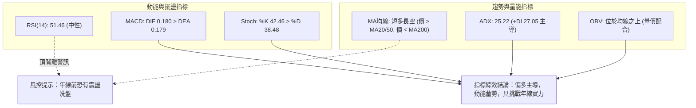

---

### 📈 移動平均線排列分析

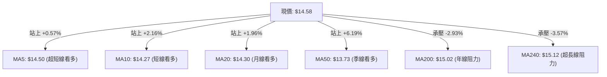

| 均線名稱 | 當前價格 | 與現價差距 | 均線趨勢斜率 | 技術信號 |
|:---|:---:|:---:|:---:|:---:|
| **MA 5** | **$14.50** | +0.57% | 向上翻揚 (▅▆██▇) | 🟢 短線買氣旺盛 |
| **MA 10** | **$14.27** | +2.16% | 強勢上行 (▆▇▇▇█) | 🟢 短線支撐扎實 |
| **MA 20** | **$14.30** | +1.96% | 穩定上行 (███████) | 🟢 月線級別支撐 |
| **MA 50** | **$13.73** | +6.19% | 止跌反轉向上 | 🟢 季線轉強 |
| **MA 60** | **$13.47** | +8.20% | 築底揚升 (▅▆▆▇██) | 🟢 中期趨勢翻多 |
| **MA 120** | **$13.81** | +5.55% | 走平回升 (▁▁▁▁) | 🟢 半年線收復 |
| **MA 200** | **$15.02** | -2.93% | 緩步走平 | 🔴 上方關鍵壓制 |
| **MA 240** | **$15.12** | -3.57% | 走平微跌 (████▇▇) | 🔴 長線頭部防線 |

> **均線結構診斷**：短期均線呈現標準多頭排列（MA5 > MA10 且現價 > MA20 > MA50），但長期均線（MA200 $15.02、MA240 $15.12）在上方形成「蓋頭反壓」，目前處於**短多對抗長空**之均線收斂期。

---

### 📉 RSI(14) 深度分析

```
RSI(14) 動能進度條
0 ──────────── 30 ────────────── 50 ────────────── 70 ─────────── 100
[超賣區]       [弱勢區]          │   [強勢區]       [超買區]
░░░░░░░░░░░░░░░░░░░░░░░░░░░░░░░░░█▓▓▓░░░░░░░░░░░░░░░░░░░░░░░░░░░░░
當前數值: 51.46 (位於強弱分水嶺之上，多方微幅占優)
```

*   **指標狀態**：RSI(14) 為 **51.46**，脫離弱勢區間（<50），顯示買盤重新進駐。
*   **背離研判**：數據提示存在 **⚠️ 頂背離 (Bearish Divergence)** 隱憂。股價於 08-16 週創下反彈高點 $15.23，但 RSI 僅達到 58.0，低於 07-05 股價 $13.61 時的 RSI 79.0。這表明**上攻動能有所衰減，直接向上突破 MA200 的爆發力可能不足，預期將以震盪洗盤方式消化賣壓**。

---

### 📊 MACD(12,26,9) 訊號解讀

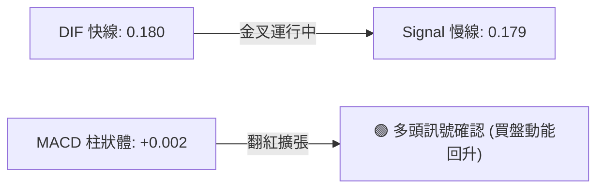

*   **DIF 與 Signal**：DIF（0.180）剛自上方穿越 Signal（0.179），柱狀體由負轉正（**+0.002**）。
*   **意義**：在週線級別經歷 08-09（-0.077）及 08-16（-0.017）的動能收斂後，本週柱狀體正式翻紅，確認短線回調結束，重啟多頭推升浪。

---

### 📦 布林通道分析（Bollinger Bands）

```
布林通道結構與現價相對位置 ($)
$15.11 ┼──────────────────────────────── 上軌 (Upper Band)
       │                        
$14.58 ┼───────────────────● 現價 (%B = 0.67，位於中軌與上軌間)
       │                        
$14.30 ┼──────────────────────────────── 中軌 (Middle Band = MA20)
       │                        
$13.49 ┼──────────────────────────────── 下軌 (Lower Band)
```

*   **通道寬度**：上軌 **$15.11**，中軌 **$14.30**，下軌 **$13.49**，帶寬約 $1.62（11.3%）。
*   **通道位置 %B**：**0.67**，表明價格處於中軌至上軌之間的健康多頭推進通道中。
*   **運行規律**：中軌 $14.30 為回調極限支撐，上軌 $15.11 則與年線 MA200（$15.02）及斐波 50%（$15.09）形成強烈共振壓制區。

---

### 💹 成交量與 OBV 分析（量價配合度）

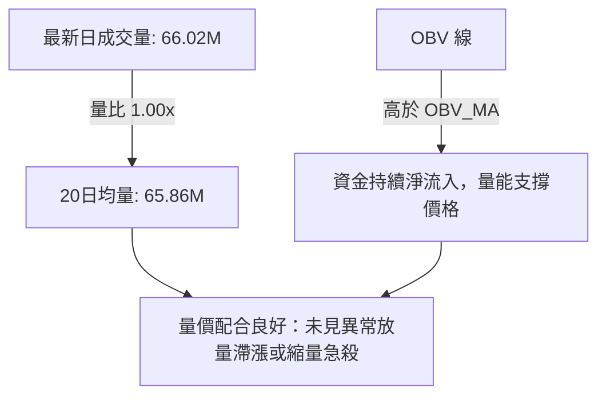

*   **量能配合**：最新成交量 66.02M 股與 20日均量 65.86M 股基本持平（量比 1.00x），籌碼沉澱穩定。
*   **OBV 趨勢**：能量潮指標明確運行於其移動平均線上方（OBV > MA），證實 7 月以來的反彈具備實質買盤支撐，非單純空頭回補。

---

## 6. 動能與波動率

### ⚡ 動能評估四象限

| 象限分類 | 動能特徵 | 波動特徵 | 當前狀態評估 | 策略應對建議 |
|:---|:---:|:---:|:---:|:---|
| **Q1：動能爆發區** | 強動能 (ADX>30) | 低波動 (ATR<3%) | ❌ 未落入 | 突破追價最佳時機 |
| **Q2：穩健趨勢區** | **中強動能 (ADX=25.22)** | **中等波動 (ATR=4.58%)** | **✓ 當前定位 (NU)** | **順勢回踩做多，分批建倉** |
| **Q3：高風險博弈區** | 強動能 (ADX>30) | 高波動 (ATR>6%) | ❌ 未落入 | 嚴控倉位，波段快進快出 |
| **Q4：混沌盤整區** | 弱動能 (ADX<20) | 低波動 (ATR<3%) | ❌ 未落入 | 觀望或網格區間低吸高拋 |

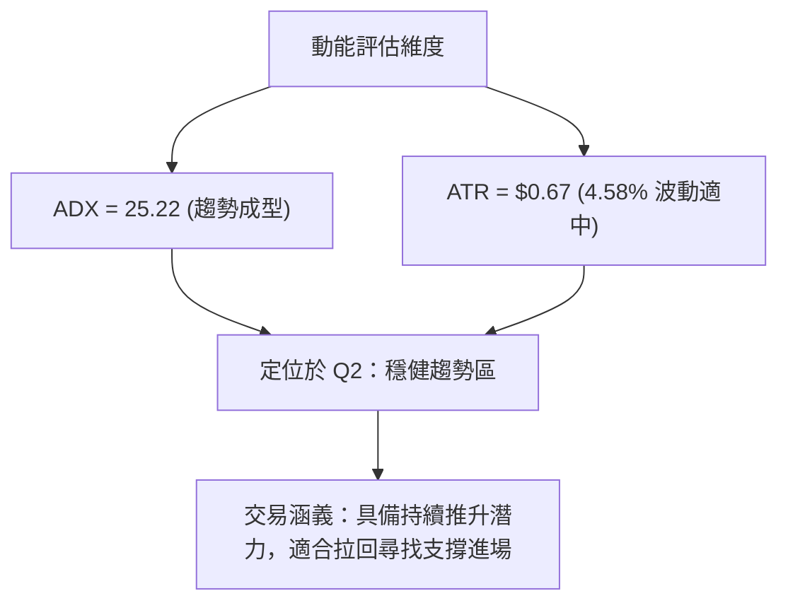

---

### 📊 ATR 波動率分析

*   **ATR(14) 數值**：**$0.67**（佔現價比重 **4.58%**）。
*   **每日理論波動區間**：現價 $14.58 ± $0.67 → **[$13.91 ~ $15.25]**。
*   **風控與止損設定建議**：
    *   **短線止損距離 (1.0x ATR)**：$14.58 - $0.67 = **$13.91**（略低於 S2 $14.11）。
    *   **波段防守距離 (0.7x ATR)**：$14.58 - ($0.67 × 0.7) = $14.58 - $0.47 = **$14.11**（精準契合核心支撐 S2）。

---

### 📐 Beta 與市場相關性

*   **Beta 係數**：**0.942**。
*   **特性解讀**：Beta 略低於 1.00，表明 NU 與美股大盤（標普500指數）維持高度同步，但系統性波動幅度微幅小於大盤。適合做為金融科技板塊之核心中長期多頭配置標的。

---

## 7. 多時框架總結

### 📋 時框架評分表

| 時框架 | 趨勢方向 | 動能狀態 | 均線排列狀況 | 形態結構 | 綜合評分 | 操作建議 |
|:---|:---:|:---:|:---|:---|:---:|:---|
| **日線 (短期)** | 🟢 偏多 | 🟡 中性蓄勢 (RSI 51.5) | 多頭排列 (價>MA5>10>20) | 旗形整理回抽 S1 | **70/100** | 依托 $14.56/$14.11 逢低做多 |
| **週線 (中期)** | 🟢 偏多 | 🟢 轉強 (MACD柱翻紅) | 轉強突破 (突破 MA50) | 雙重底確立向上 | **75/100** | 波段持有，目標看 $15.70/$17.14 |
| **月線 (長期)** | 🟡 震盪 | 🟡 消化回調 | 承壓 (價 < MA200/240) | 自高點回撤後首度反彈 | **45/100** | 年線 $15.02 前分批獲利 |

---

### 🔲 綜合訊號矩陣

```
訊號維度評估矩陣
─────────────────────────────────────────────────────────────────
[均線系統]   短多 🟢  │  中多 🟢  │  長空 🔴  ──→  評估：短中推升面臨長線壓制
[動能擺盪]   RSI 🟡  │  MACD 🟢  │  KD  🟡  ──→  評估：MACD金叉，具上衝動能
[量能趨勢]   OBV 🟢  │  量比 🟢  │  換手 🟢  ──→  評估：底部換手扎實，量能健康
[形態支撐]   雙底 🟢  │  頸線 🟢  │  斐波 🟢  ──→  評估：守穩 61.8%，多頭掌握主導權
─────────────────────────────────────────────────────────────────
多時框加權結論：偏多主導 (整體信心度 65%)
```

---

### ⚖️ 多時框收斂結論

依據多時框收斂規則：
1. **行情屬性判斷**：ADX(14) 為 **25.22**（>25），確認市場已由盤整行情轉入**趨勢行情**；+DI（27.05）大幅高於 -DI（17.14），多頭主導趨勢確立。
2. **主導時框收斂**：在趨勢行情下，以**中期週線向上突破雙底**為主導方向，日線短期的震盪回調（RSI頂背離與旗形整理）僅作為尋找逢低買入（Buy on Dip）的進場時機。
3. **最終唯一結論**：**【謹慎偏多】**。股價回抽頸線 $14.56 確認支撐有效，順勢看好突破 R1（$14.88）並挑戰年線/斐波50%共振區（$15.02~$15.09），最終朝 R2（$15.70）與形態目標（$17.14）推進。

---

## 8. 交易策略建議

### 🗺️ 策略決策流程圖

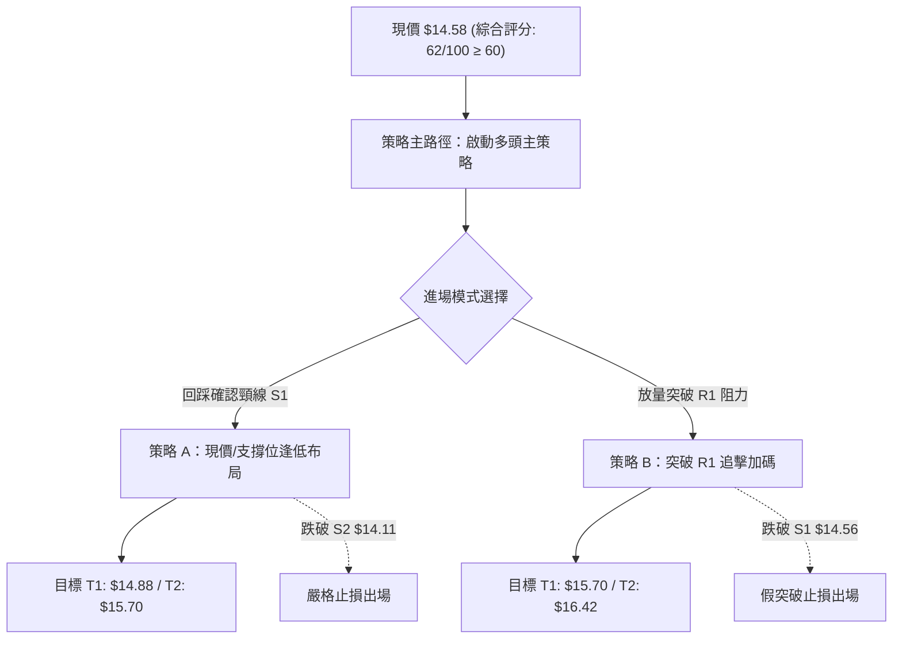

> 🧭 **策略路由確認**：綜合評分 **62/100**（≥60），**主推多頭策略**。

---

### 🎯 價格情境階梯（Price Scenarios）

| 觸發條件 | 關鍵觸發價位 | 下一目標價 | 後續延伸目標 | 情境技術涵義 |
|:---|:---:|:---:|:---:|:---|
| **強勢突破** | 突破 **R1 $14.88** | **R2 $15.70** | **R3 $16.42** | 突破年線與短期反壓，確認主升段展開 |
| **區間蓄勢** | 守穩 **S1 $14.56** | **R1 $14.88** | **MA200 $15.02** | 於頸線上窄幅換手，消化頂背離賣壓 |
| **深度回踩** | 跌破 **S1 $14.56** | **S2 $14.11** | **S3 $13.41** | 測試黃金分割與月線支撐，尋求二次築底 |

---

### 📊 情境機率分佈

| 預期情境 | 發生機率 | 主要技術依據與指標支撐 |
|:---|:---:|:---|
| **繼續上行 / 反彈突破** | **55%** | ADX=25.22 多頭主導、MACD柱狀體翻紅（+0.002）、OBV維持均線上方，週線雙底完成。 |
| **區間震盪 / 消化均線** | **30%** | RSI(14)=51.46 存在頂背離隱憂，上方臨近 MA200（$15.02）重壓，需時間橫盤整固。 |
| **跌破下行 / 再次探底** | **15%** | 除非美股大盤突發系統性風險，否則在 S2（$14.11）與 MA50（$13.73）重重防護下深度回落機率低。 |

---

### 🟢 主策略詳情

| 策略要素 | 策略 A（現價/回調逢低進場） | 策略 B（強勢突破追擊進場） |
|:---|:---|:---|
| **策略邏輯** | 依託雙底頸線 S1 與 MA20 支撐低吸 | 確認帶量站上 R1 阻力後順勢追擊 |
| **進場條件** | 現價 $14.58 或回踩 $14.56 企穩 | 日K線收盤突破 $14.88 且日成交量 > 70M |
| **進場價格** | **$14.58**（回調區間：$14.56~$14.58） | **$14.88**（突破買入） |
| **第一目標 (T1)**| **$14.88**（波段阻力 R1，潛在 +2.06%） | **$15.70**（中期阻力 R2，潛在 +5.51%） |
| **第二目標 (T2)**| **$15.70**（中期阻力 R2，潛在 +7.68%） | **$16.42**（強阻力 R3，潛在 +10.35%） |
| **止損價格** | **$14.11**（跌破 S2 支撐，虧損 -3.22%） | **$14.56**（跌破頸線 S1，虧損 -2.15%） |
| **風險報酬比** | **1 : 2.38**（以 T2 測算：$1.12 / $0.47） | **1 : 2.56**（以 T1 測算：$0.82 / $0.32） |
| **成功機率** | **65%** | **60%** |
| **建議倉位** | **15% ~ 20%** 基礎倉位 | **10% ~ 15%** 加碼倉位 |

---

### 🔴 反向風險觸發點（對沖提示）

若出現以下情況，多頭主策略立即失效，應果斷執行減倉或反向避險：
1. **關鍵支撐失守**：若日K線收盤**跌破 S2 $14.11**（且跌破斐波 61.8% $14.17），意味雙底形態失敗，多頭趨勢遭到破壞。
2. **均線死叉出現**：若 MA5 下穿 MA20 形成死叉，且 ADX 跌破 20，轉為無方向弱勢盤整。
3. **風控動作**：觸發 $14.11 止損後，多頭全面離場觀望；空手者可待股價回落至 **S3 $13.41** 附近再行評估。

---

### ⭐ 整體訊號強度評星

```
╔════════════════════════════════════════════════════╗
║  做多訊號強度：★★★★☆  (4.0/5星) — 偏多主導，量價配合良好 ║
║  做空訊號強度：★★☆☆☆  (2.0/5星) — 空頭受抑，僅屬短壓 ║
║  整體可信度：  ★★★★☆  (4.0/5星) — 數據完整，共振度高 ║
╚════════════════════════════════════════════════════╝
```

---

## 9. 風險提示與監控

### ✅ 關鍵監控指標 Checklist

```
╔══════════════════════════════════════════════════════════════════╗
║                    每日盤面監控清單 (Checklist)                  ║
╠══════════════════════════════════════════════════════════════════╣
║ [ ] 價格是否維持在 S1 $14.56 頸線之上？                          ║
║ [ ] RSI(14) 是否順利突破 60 並化解頂背離警訊？                   ║
║ [ ] 日成交量是否維持在 20日均量 (65.86M) 以上？                  ║
║ [ ] MACD 柱狀體是否持續放大 (+0.002 以上擴張)？                  ║
║ [ ] 價格挑戰 MA200 ($15.02) 與 R1 ($14.88) 時是否出現放量滯漲？  ║
║ [ ] ADX(14) 是否持續運行於 25 之上 (+DI 保持主導)？              ║
╚══════════════════════════════════════════════════════════════════╝
```

---

### ⚠️ 風險場景推演

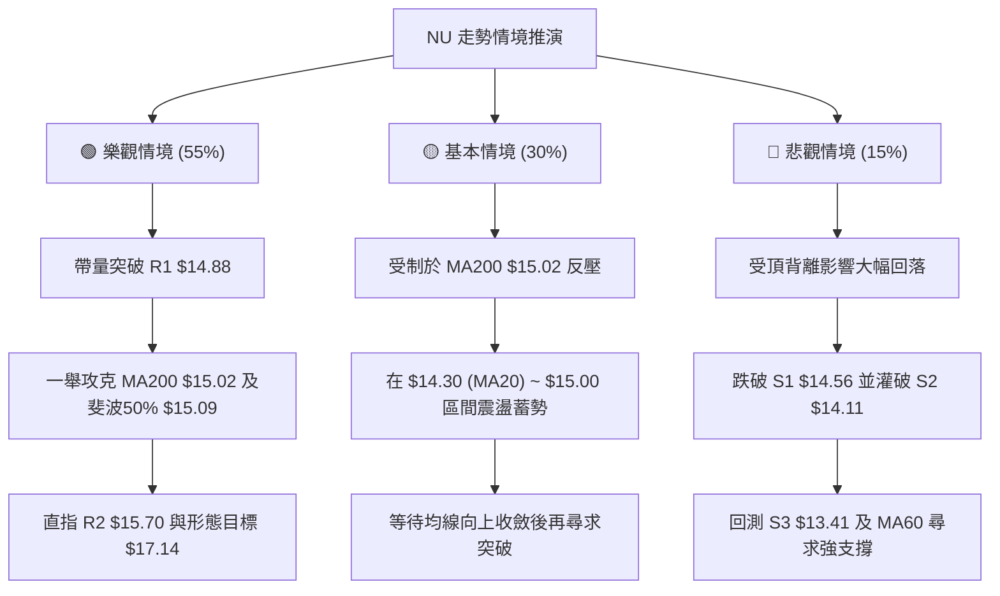

---

### 🛡️ 風險管理重要提醒

1. **年線壓制效應**：年線 **MA200（$15.02）** 歷史上具備強大籌碼心理反壓。初次挑戰時切忌追高，應以突破後回抽確認（Pullback）或回調支撐（Dip）作為核心買點。
2. **倉位管理守則**：單一個股總持倉建議不超過投資組合總資金之 **20%**。本策略初次進場建議配置 **15%**，待突破 $14.88 並確認站穩後，再行追加剩餘 **5%** 倉位。
3. **嚴格執行止損**：以 **S2 $14.11** 為絕對防守線，跌破無條件停損，單筆交易本金最大虧損控制在投資組合淨值的 **1.0%** 以內。

---

## 📋 報告總結

```
╔══════════════════════════════════════════════════════════════════╗
║                    NU 技術分析報告總結                           ║
╠══════════════════════════════════════════════════════════════════╣
║ 報告日期：2026-08-24                                             ║
║ 當前價格：$14.58                                                 ║
║ 分析評級：🟢 偏多震盪 / 逢低做多 (綜合評分: 62/100)               ║
╠══════════════════════════════════════════════════════════════════╣
║ 關鍵結論：                                                       ║
║ ├─ 長期趨勢：🟡 築底反彈，承壓於年線 MA200 ($15.02)              ║
║ ├─ 中期趨勢：🟢 雙重底確立，MACD翻紅，週線級別Higher Low成型    ║
║ ├─ 短期趨勢：🟢 站穩 MA5/10/20，回抽頸線 $14.56 支撐有效         ║
║ ├─ 關鍵支撐：S1 $14.56 │ S2 $14.11 │ S3 $13.41                 ║
║ ├─ 關鍵阻力：R1 $14.88 │ R2 $15.70 │ R3 $16.42                 ║
║ └─ 分析師目標：共識均價 $18.78 (22位分析師評級 Buy)              ║
╠══════════════════════════════════════════════════════════════════╣
║ 最優策略組合：                                                   ║
║ 1. 🥇 最佳機會 (策略 A)：現價 $14.58 布局，止損 $14.11，          ║
║    目標看 $14.88 / $15.70 (風酬比 1:2.38)                        ║
║ 2. 🥈 次選機會 (策略 B)：突破 $14.88 追擊，止損 $14.56，          ║
║    目標看 $15.70 / $16.42 (風酬比 1:2.56)                        ║
║ 3. 🥉 保守選擇：等待股價回測 S2 $14.11 / MA20 $14.30 出現止跌     ║
║    K線訊號後再行介入                                             ║
╚══════════════════════════════════════════════════════════════════╝
```

---

> ⚠️ **免責聲明**：本報告為 AI 自動生成之技術分析研究，所有數據、圖表及價位推算均基於歷史量價數據與量化指標模型。本報告**僅供研究與學術參考**，**不構成任何要約、招攬或投資建議**。金融市場投資具有高風險性，投資人應獨立評估風險並自負盈虧。

---

*報告生成時間：2026-08-24 ｜ 數據來源：Yahoo Finance ｜ 分析框架：多時框技術分析體系*