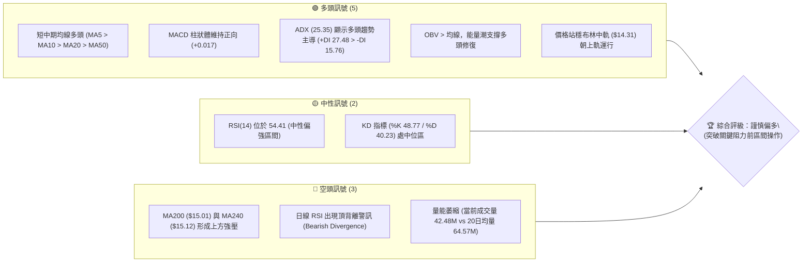
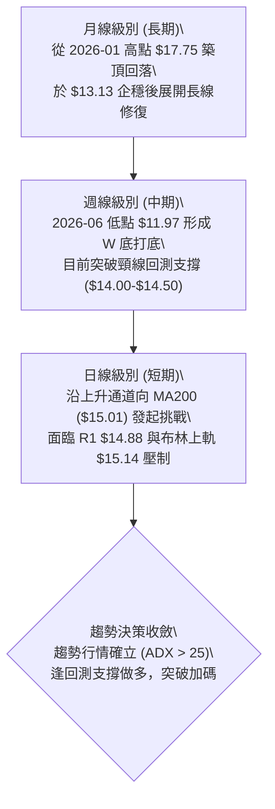
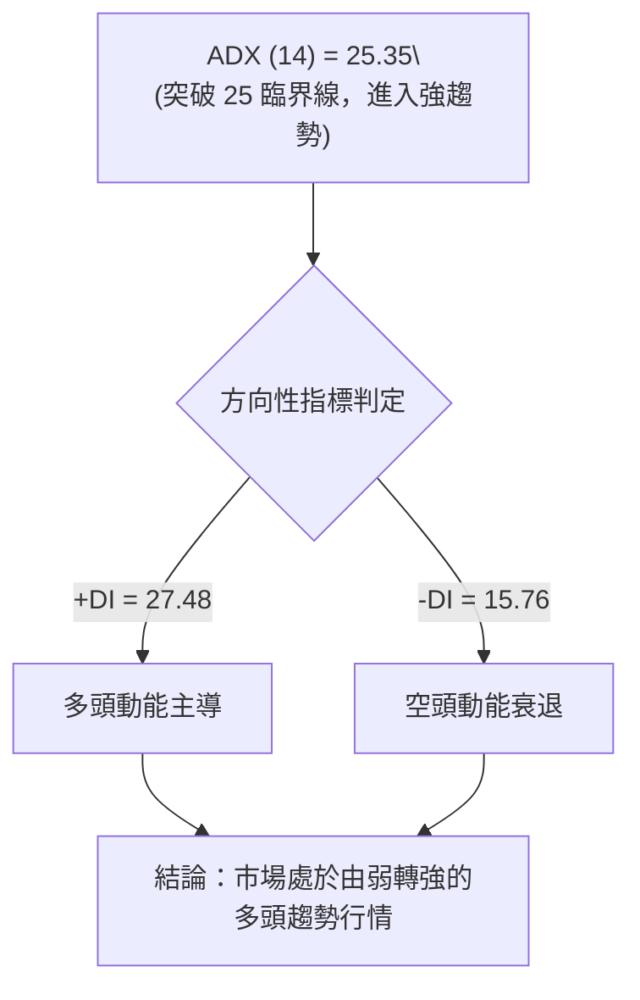
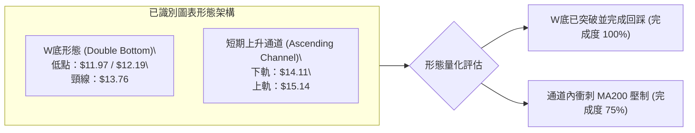
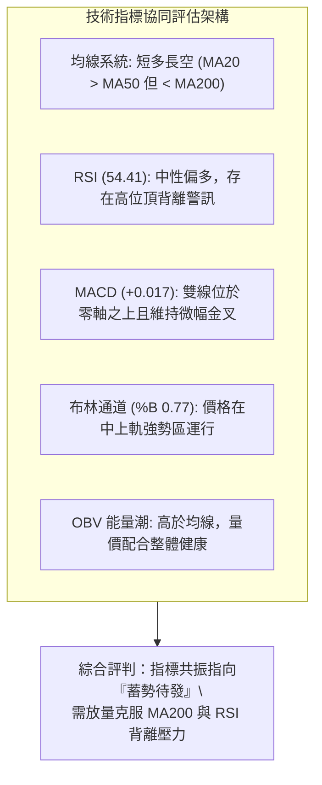
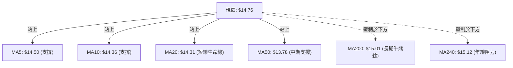
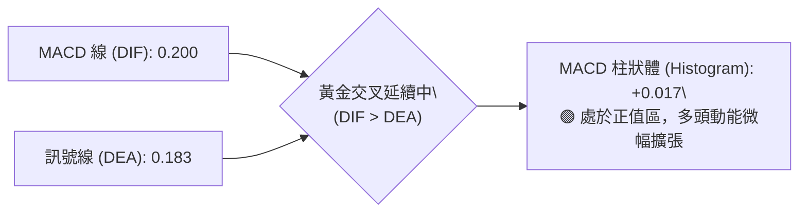
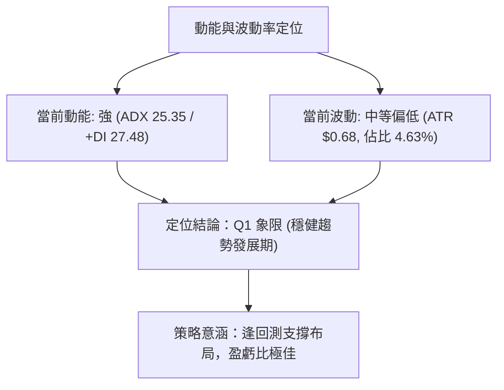
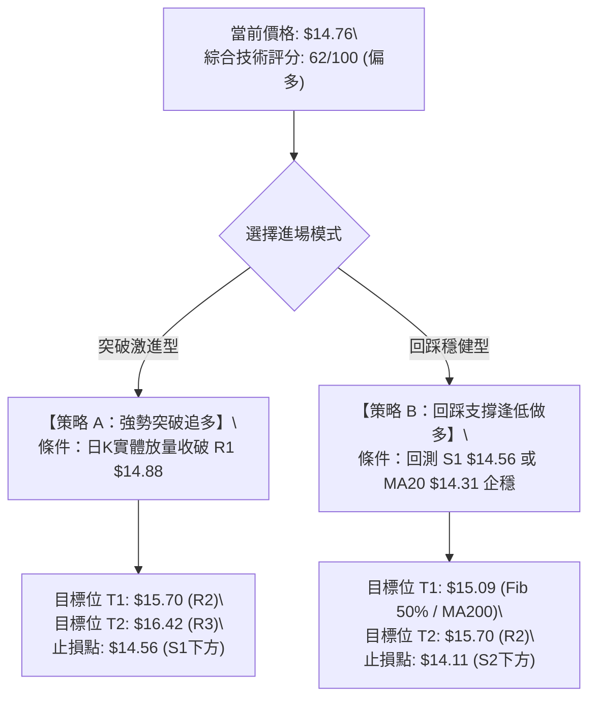
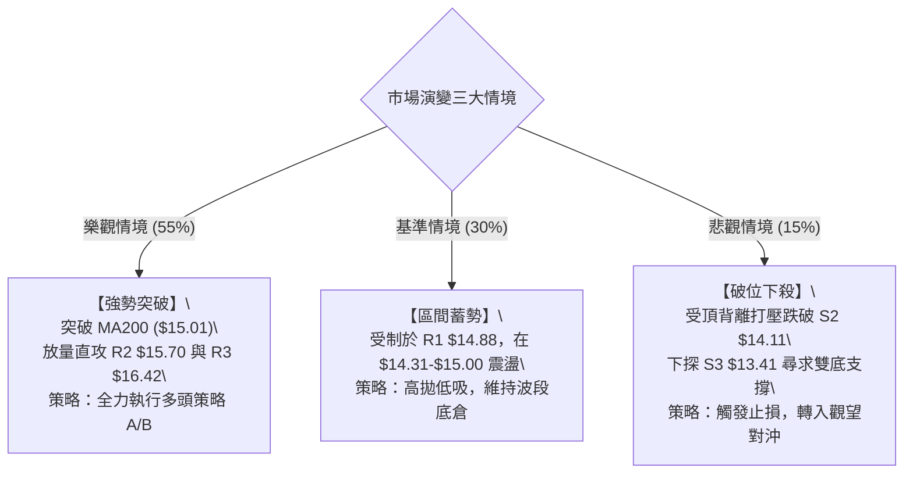

# NU 技術分析報告

> **報告日期**：2026-08-25 ｜ **語言**：繁體中文 ｜ **數據來源**：Yahoo Finance ｜ **當前價格**：$14.76

---

## 目錄

| 章節 | 內容 |
|------|------|
| [1. 技術面概覽](#1-技術面概覽) | 訊號儀表板、核心指標、評分卡 |
| [2. 趨勢分析](#2-趨勢分析) | 多時框趨勢、長中短期走勢 |
| [3. 圖表形態分析](#3-圖表形態分析) | 形態識別、K線組合、目標價 |
| [4. 支撐與阻力](#4-支撐與阻力) | 關鍵價位、斐波那契回調 |
| [5. 技術指標深度解讀](#5-技術指標深度解讀) | MA/RSI/MACD/布林/成交量 |
| [6. 動能與波動率](#6-動能與波動率) | 動能評估、ATR、Beta |
| [7. 多時框架總結](#7-多時框架總結) | 時框架評分矩陣、收斂結論 |
| [8. 交易策略建議](#8-交易策略建議) | 主策略詳情、情境階梯、風險報酬比 |
| [9. 風險提示與監控](#9-風險提示與監控) | 監控指標、情境分析、風控準則 |

---

## 1. 技術面概覽

### 🎯 技術訊號儀表板



### 📊 核心指標速覽表

| 指標類別 | 指標名稱 | 當前數值 | 訊號 | 解讀 |
|:---|:---|:---|:---:|:---|
| **價格** | 當前價格 | $14.76 | 🟢 | 站上多數短中期均線，處於反彈上升通道 |
| **均線** | MA20 | $14.31 | 🟢 | 現價高於 MA20 (+3.13%)，短多結構穩固 |
| **均線** | MA50 | $13.78 | 🟢 | 中期生命線向上傾斜，具備堅實動能支撐 |
| **均線** | MA200 | $15.01 | 🔴 | 現價低於長期牛熊線 (-1.67%)，面臨重壓 |
| **動能** | RSI(14) | 54.41 | 🟡 | 位於 50 強弱分水嶺之上，但需注意頂背離 |
| **動能** | MACD | 0.200 / +0.017 | 🟢 | 快慢線維持黃金交叉，多頭動能微幅擴張 |
| **波動** | ATR(14) | $0.68 | 🟡 | 每日波幅佔比約 4.63%，屬於正常震盪水平 |
| **趨勢** | ADX(14) | 25.35 | 🟢 | 進入強趨勢門檻 (>25)，+DI 強勢領先 |
| **通道** | 布林 %B | 0.77 | 🟢 | 運行於中軌 ($14.31) 與上軌 ($15.14) 偏多區間 |

### 🏆 技術評分卡

```
╔══════════════════════════════════════════════════════════════════╗
║               技術評分卡 — NU (2026-08-25)                      ║
╠══════════════════════════════════════════════════════════════════╣
║ 趨勢強度 (Trend)     ████████████░░░░░░░░  62/100  🟢 偏多主導   ║
║ 動能指標 (Momentum)  ██████████░░░░░░░░░░  54/100  🟡 中性偏強   ║
║ 支撐穩定度 (Support) ██████████████░░░░░░  70/100  🟢 底部紮實   ║
║ 成交量配合 (Volume)  ████████░░░░░░░░░░░░  42/100  🔴 量能遞減   ║
║ 形態完整度 (Pattern) ████████████░░░░░░░░  60/100  🟡 通道修復   ║
║ 均線排列 (MA System) ████████████░░░░░░░░  60/100  🟡 混合排列   ║
╠══════════════════════════════════════════════════════════════════╣
║ 綜合技術評分         ████████████░░░░░░░░  62/100  🟢 謹慎看多   ║
╚══════════════════════════════════════════════════════════════════╝
```

---

## 2. 趨勢分析

### 🌐 多時框趨勢分析



### 📈 長期趨勢 — 12個月走勢圖（Unicode）

```
NU 月線走勢圖（過去12個月：2025-08 至 2026-08）
價格 ($)
$18.00 ┤                     ● ($17.75 歷史波段高點)
$17.00 ┤                 ●   │
$16.00 ┤         ●   ●   │   │
$15.00 ┤ ●       │   │   │   │   ●
$14.00 ┤ │       │   │   │   │   │   ●   ●       ●   ● ($14.76 現價)
$13.00 ┤ │       │   │   │   │   │   │   │   ●   │   │
$12.00 ┤ │       │   │   │   │   │   │   │   │   │   │
       └─┼───┼───┼───┼───┼───┼───┼───┼───┼───┼───┼───┼──
         08  09  10  11  12  01  02  03  04  05  06  07  08 (2025-2026)
```

**走勢特徵分析表格**：

| 階段區間 | 時間跨度 | 價格區間 | 累計漲跌幅 | 走勢特徵解讀 |
|:---|:---|:---|:---:|:---|
| **主升攻擊段** | 2025-08 ~ 2026-01 | $14.80 → $17.75 | +19.93% | 月線級別大五浪衝頂，機構籌碼集中推升 |
| **深幅回調段** | 2026-01 ~ 2026-05 | $17.75 → $13.13 | -26.03% | 獲利了結盤湧出，跌破所有短期均線尋求支撐 |
| **築底反彈段** | 2026-05 ~ 2026-08 | $13.13 → $14.76 | +12.41% | 於 52W 低點上方構建雙底結構，展開波段修復 |

### 📊 中期趨勢（週線分析）

```
NU 週線阻力與支撐區間結構
$16.42 ───────────────────────────────────── 阻力 R3 (前期破位頸線)
$15.70 ───────────────────────────────────── 阻力 R2 (反彈高點聚類)
$15.01 ------------------------------------- MA200 / Fib 50.0% ($15.09)
$14.76 ======[ 當前價格 $14.76 震盪區間 ]======
$14.56 ───────────────────────────────────── 支撐 S1 (週線短支撐)
$14.11 ───────────────────────────────────── 支撐 S2 (Fib 61.8% $14.17 密集共振區)
$13.41 ───────────────────────────────────── 支撐 S3 (強支撐底線 / 雙底頸線)
```

中期走勢顯示，NU 自 2026 年 6 月第一週於 $11.97 觸底後，週線展開強烈反彈，連續收出帶量陽線。目前價格已越過 20 週均線，且 MACD 柱狀體由負翻正至 +0.017，表明中期修正行情結束，逐步轉入多頭回升結構。

### ⚡ 趨勢強度評估（ADX 解讀）



**ADX 趨勢強度對照矩陣**：

| 指標變量 | 數值 | 狀態門檻 | 趨勢屬性判定 | 策略指導意義 |
|:---|:---:|:---:|:---|:---|
| **ADX (14)** | **25.35** | > 25.0 | **強趨勢確立 (Trend Mode)** | 趨勢跟隨策略優於區間震盪策略 |
| **+DI (14)** | **27.48** | 高於 -DI | **多方佔優 (Bullish Dominance)** | 順勢逢低做多，避免主動逆勢摸頂 |
| **-DI (14)** | **15.76** | 低於 20.0 | **空方潰散 (Bearish Exhaustion)** | 下方空頭回補力道強，支撐有效性高 |

---

## 3. 圖表形態分析

### 🔍 形態識別系統



**形態信心度量化分析表**：

| 形態名稱 | 信心度 | 判斷依據（引用數據） | 完成度 | 目標價（附精確計算式） |
|:---|:---:|:---|:---:|:---|
| **中期雙底 (W-Bottom)** | **85%** | 2026-05-17 低點 $12.19 與 2026-06-07 低點 $11.97 築成雙底；突破 2026-07-12 頸線高點 $13.76 | 100% | 頸線 $13.76 + (頸線 $13.76 - 最低點 $11.97 = $1.79) = **$15.55** (已逼近阻力 R2 $15.70) |
| **短線上行通道** | **70%** | 低點自 $13.13、$13.84 連續墊高；高點自 $14.33 擴展至 $15.23 | 75% | 通道上軌對齊布林上軌與阻力位 = **$15.14 ~ $15.70** |
| **頭肩底結構** | **45%** | 左肩 $12.19、頭部 $11.97、右肩 $12.71，但右肩反彈速度過快，非典型結構 | 40% | *訊號信心不足 (<50%)，僅作參考不予推算* |

### 🕯️ 重要K線形態分析

| 日期 / 週期 | 收盤價 | K線形態 | 解讀 | 訊號 |
|:---|:---:|:---|:---|:---:|
| **2026-06-07 (週)** | $11.97 | **長下影錘頭線 (Hammer)** | 473.46M 巨量恐慌盤洗出，多方於 $11.20 52W低點上方強力承接 | 🟢 強多 |
| **2026-07-19 (週)** | $13.59 | **巨量換手十字星 (Doji)** | 762.06M 歷史級週成交量，多空於 $13.50 激烈交鋒，主力換手吸籌完畢 | 🟢 偏多 |
| **2026-08-16 (週)** | $15.23 | **高位流星線 (Shooting Star)** | 衝擊 MA200 ($15.01) 與斐波那契 50.0% ($15.09) 後遇阻回落，留下影線 | 🔴 短空 |
| **2026-08-30 (當前)** | $14.76 | **縮量企穩陽線** | 守穩 S1 $14.56，多方於日線 MA20 之上重整旗鼓，醞釀二次突破 | 🟢 偏多 |

### 📉 ASCII 走勢形態示意圖

```
NU 雙底突破與短期上升通道示意圖
價格 ($)
$15.70 ┤                                                 [阻力 R2 / W底目標]
$15.23 ┤                                     ▲ (波段高點)
$15.01 ┼- - - - - - - - - - - - - - - - - - ╱ - - - - - [MA200 牛熊分界]
$14.76 ┤                                   ● (現價 $14.76)
$14.56 ┤                             ╱   ╱
$14.11 ┤                       ╱   ╱   ● (回踩 S1/S2)
$13.76 ┼- - - - - - - - - - - ● - - - - - - - - - - - - [雙底頸線突破點]
$13.13 ┤                 ╱   │
$12.19 ┤   ● (左底)     ╱    │
$11.97 ┤   │     ● (右底)    │
       └───┴─────┴───────────┴─────────────────────────────
          05-17 06-07       07-12                     08-25
```

### 🎯 形態目標價計算

依據標準圖表測量法則（Measured Move Principle）：
1. **W底形態高度**：頸線價格 $13.76 - 右底極值 $11.97 = **$1.79**。
2. **第一理論目標價 (T1)**：突破點 $13.76 + 形態高度 $1.79 = **$15.55**（與數據庫阻力位 R2 **$15.70** 高度聚類）。
3. **延伸等長測量目標價 (T2)**：若有效站穩 MA200 ($15.01)，依上升通道寬度推算下一波段目標為斐波那契 38.2% 回調位 **$16.01**，進一步延伸目標為阻力位 R3 **$16.42**。

---

## 4. 支撐與阻力

### 🗺️ 關鍵價位分布圖（Unicode）

```
NU 價位結構分布圖
══════════════════════════════════════════════════════════════════════
$16.42 ║██████████████████████████████║ 強阻力 R3 (前期破位密集成交區)
$16.01 ║██████████████████            ║ 阻力位 (Fibonacci 38.2%)
$15.70 ║████████████████████          ║ 阻力 R2 (W底測幅目標區)
$15.14 ║████████████████████████      ║ 布林通道上軌
$15.01 ║████████████████████████████  ║ 長期生命線 MA200 / Fib 50.0% ($15.09)
$14.88 ║██████████████████████████████║ 關鍵阻力 R1 (短線突破觸發點)
$14.76 ╠══════════════════════════════╣ ◄ 現價 $14.76
$14.56 ║▓▓▓▓▓▓▓▓▓▓▓▓▓▓▓▓▓▓▓▓          ║ 近期支撐 S1 (短線防守點)
$14.31 ║▓▓▓▓▓▓▓▓▓▓▓▓▓▓▓▓▓▓▓▓▓▓▓▓      ║ 布林中軌 / MA20
$14.11 ║██████████████████████████████║ 強支撐 S2 / Fib 61.8% ($14.17)
$13.48 ║████████████████              ║ 布林通道下軌
$13.41 ║██████████████████████████████║ 戰略強支撐 S3 (波段多空防線)
══════════════════════════════════════════════════════════════════════
```

### 🚧 阻力位分析表

所有價位均精確引用 OHLCV 計算聚類與歷史數據：

| 阻力級別 | 價位 | 形成原因與技術共振 | 突破難度 | 重要性評級 |
|:---|:---:|:---|:---:|:---:|
| **R1** | **$14.88** | 距離現價僅 +0.83%，為近兩週日線反彈高點聚類，短線多空爭奪樞紐 | 🟡 中等 | ★★★☆☆ |
| **R2** | **$15.70** | 距離現價 +6.33%，W底測幅目標 ($15.55) 與 2025 年底震盪平台重疊區 | 🔴 較高 | ★★★★☆ |
| **R3** | **$16.42** | 距離現價 +11.27%，近一年重大破位起跌點，上方套牢籌碼極為密集 | 🔴 極高 | ★★★★★ |

### 🛡️ 支撐位分析表

| 支撐級別 | 價位 | 形成原因與技術共振 | 守住機率 | 重要性評級 |
|:---|:---:|:---|:---:|:---:|
| **S1** | **$14.56** | 距離現價 -1.36%，近 5 日波段低點聚類，對齊 MA5 ($14.50) 保護帶 | 🟢 80% | ★★★☆☆ |
| **S2** | **$14.11** | 距離現價 -4.44%，與斐波那契 61.8% ($14.17) 及 MA10 ($14.36) 共振 | 🟢 75% | ★★★★☆ |
| **S3** | **$13.41** | 距離現價 -9.15%，近一年波段絕對低點聚類，對齊 MA60 ($13.50) 及布林下軌 | 🟢 90% | ★★★★★ |

### 📐 斐波那契回調位分析

依據 52 週波動極值區間（低點 $11.20 → 高點 $18.98，總波幅 $7.78）計算之標準黃金分割位：

| 斐波那契級別 | 精確價位 | 現價相對位置 | 結構意義與關鍵解讀 |
|:---|:---:|:---:|:---|
| **0.0% (52W High)** | **$18.98** | +28.59% | 歷史牛市頂部，長線最終多頭目標 |
| **23.6%** | **$17.14** | +16.12% | 強勢回調極限阻力位，2026-01 月線平台 |
| **38.2%** | **$16.01** | +8.47% | 中期多空強弱分水嶺，2025-09 收盤位聚類 |
| **50.0%** | **$15.09** | +2.24% | **核心中樞壓制**，與 MA200 ($15.01) 形成雙重阻力共振 |
| **61.8% (黃金分割)**| **$14.17** | -4.00% | **牛熊黃金防守位**，現價目前成功運行於該位之上 |
| **78.6%** | **$12.86** | -12.87% | 深幅回調防線，下破則意味著破底危機 |
| **100.0% (52W Low)**| **$11.20** | -24.12% | 52 週週期底部支撐點 |

*解讀：現價 $14.76 穩固夾於 61.8% ($14.17) 與 50.0% ($15.09) 之間。技術上，只要多方能守住 $14.17 黃金分割位，當前回調均屬多頭健康蓄勢，後續一旦放量向上穿透 $15.09，將打開直通 $16.01 的上升空間。*

---

## 5. 技術指標深度解讀

### 🎛️ 指標訊號總覽



### 📈 移動平均線排列分析



**均線狀態明細表**：

| 均線名稱 | 數值 | 現價偏離度 | 走勢斜率與狀態 | 技術意涵 |
|:---|:---:|:---:|:---:|:---|
| **MA 5** | $14.50 | +1.78% | ▲ 向上微升 | 超短線多頭防守第一線 |
| **MA 10** | $14.36 | +2.77% | ▲ 陡峭向上 | 短線助漲支撐強勁 |
| **MA 20** | $14.31 | +3.13% | ▲ 持續向上 | 20日布林中軌，短多防守核心 |
| **MA 50** | $13.78 | +7.11% | ▲ 穩定向上 | 中期底倉成本區，支撐力極強 |
| **MA 60** | $13.50 | +9.31% | ▲ 拐頭向上 | 季線轉多，確立波段底部 |
| **MA 120**| $13.81 | +6.86% | ▲ 震盪走平 | 半年線壓制解除，轉化為中期支撐 |
| **MA 200**| $15.01 | -1.67% | ▼ 緩步下移 | 長期多空分水嶺，當前首要突破目標 |
| **MA 240**| $15.12 | -2.36% | ▼ 震盪走低 | 年線重大壓力帶 ($15.01 - $15.12) |

### 📉 RSI(14) 分析

- **當前數值**：**54.41**
- **區間定位**：`[0] ────────── [30] ─────█──── [70] ────────── [100]`（數值 54.41，處於 50-70 溫和多頭區）
- **背離診斷**：⚠️ **日線頂背離 (Bearish Divergence)**。
  - *分析*：價格在 2026-08-16 創出 $15.23 短期波段新高時，RSI 僅達 58.0，低於 2026-07-05 高點時的 79.0。這表明短期上攻動能有所放緩，需要經過目前的縮量盤整洗盤（當前回調至 54.41），將指標消化至中性水平後方有利於再次衝擊 $15.00 大關。

### 📊 MACD(12/26/9) 訊號解讀



MACD 雙線維持在零軸上方運行，且柱狀體在經歷 2026-08-09 的短暫回調 (-0.077) 後迅速翻紅（當前 +0.017），確認市場買盤力量並未瓦解，屬於標準的強勢回調確認訊號。

### 📦 布林通道分析

```
NU 布林通道 (Bollinger Bands, 20, 2) 結構圖
$15.14 ───────────────────────────────────── BB 上軌 (Upper Band)
       │                        
$14.76 ┼─────────────────────── ● [現價 $14.76, %B = 0.77]
       │                        
$14.31 ───────────────────────────────────── BB 中軌 (MA20)
       │
$13.48 ───────────────────────────────────── BB 下軌 (Lower Band)
```

- **布林帶寬度 (Bandwidth)**：($15.14 - $13.48) / $14.31 = **11.60%**（通道處於收斂後的溫和擴張期）。
- **%B 位置**：**0.77**（介於 0.5 與 1.0 之間，表明價格強勢貼近上軌運行，但尚未進入 >1.0 的超買極端區，具備進一步推升空間）。

### 💹 成交量分析（量價配合度）

1. **當日成交量**：42,478,250 股。
2. **均量對比**：相較於 20 日均量 (64,570,448) 量比為 **0.66x**，相較於 50 日均量 (78,786,653) 出現明顯縮量。
3. **OBV (能量潮)**：OBV 指標持續位於其均線之上，這表明在 2026-07 換手量（7.62億股）爆發後，當前的縮量下跌或震盪為典型的「**縮量蓄勢洗盤**」，主力機構籌碼鎖定度高（機構持股佔比達 82.0%），量價結構依然支撐後市上漲。

---

## 6. 動能與波動率

### ⚡ 動能評估四象限

| 象限 | 動能維度 (ADX / MACD) | 波動維度 (ATR / BBW) | 當前歸屬 | 戰術評價與執行策略 |
|:---:|:---:|:---:|:---:|:---|
| **第一象限 (Q1)** | **強動能** (ADX > 25) | **低/中波動** (ATR 4.63%) | **✓ NU 處於此區** | **最佳波段機會**：趨勢穩定擴展，下檔風險可控，宜順勢持股或突破加碼 |
| **第二象限 (Q2)** | **弱動能** (ADX < 25) | **低波動** | — | **謹慎觀望**：盤整收斂，等待方向選擇 |
| **第三象限 (Q3)** | **強動能** (ADX > 25) | **高波動** (ATR > 8%) | — | **高風險高收益**：主升段噴射，需嚴格緊盯移動止盈 |
| **第四象限 (Q4)** | **弱動能** (ADX < 25) | **高波動** | — | **避免進場**：無序震盪，容易遭雙向洗盤巴頭 |



### 📊 ATR 波動率分析

- **ATR(14) 絕對數值**：**$0.68**
- **ATR 相對百分比**：$0.68 / $14.76 = **4.63%**
- **風控參數設定指引**：
  - **超短線當沖止損**：1.0 × ATR = **$0.68**（建議止損空間置於現價下方 $0.68 處）
  - **波段交易止損 (Swing Stop)**：1.5 × ATR = 1.5 × $0.68 = **$1.02**（對應關鍵防守價位 **$13.74**，正好覆蓋 MA50 $13.78 與前低支撐帶）
  - **合理日內預期波幅區間**：$14.08 ~ $15.44

### 📐 Beta 與市場相關性

- **Beta 係數**：**0.942**（與標普500/大盤走勢高度同步，波動幅度略小於市場平均，具備良好的防守與跟漲屬性）。
- **機構持股比例**：**82.0%**（高機構持股意味著盤面異動多受基本面與大資金主導，技術支撐阻力位之有效性與信賴度極高）。
- **空頭比例 (Short % Float)**：**3.9%** (Short Ratio 1.47)，空頭回補壓力適中，無顯著擠壓風險，走勢完全回歸技術常態驅動。

---

## 7. 多時框架總結

### 📋 時框架評分表

| 時框架 | 趨勢方向 | 動能狀態 | 均線排列 | 圖表形態 | 綜合評分 | 交易建議方向 |
|:---|:---:|:---:|:---:|:---|:---:|:---|
| **月線級別 (長期)** | 🟡 寬幅震盪 | 50 (中性) | 混合 (回測長期均線) | $17.75 頂部回調修復 | **58/100** | 長線底倉持有 |
| **週線級別 (中期)** | 🟢 震盪轉強 | 62 (翻紅) | 站穩 MA20 向上擴展 | W底突破回踩完畢 ($13.76) | **68/100** | 中期波段做多 |
| **日線級別 (短期)** | 🟢 震盪偏多 | 58 (多方) | 短均多頭，受制 MA200 | 上升通道挑戰阻力 R1 | **62/100** | 逢低買入 / 突破加碼 |

### 🔲 綜合訊號矩陣

```
╔══════════════════════════════════════════════════════════════════╗
║                    多時框訊號收斂矩陣                           ║
╠══════════════════════════════════════════════════════════════════╣
║ 維度         短期 (日線)         中期 (週線)         長期 (月線) ║
╠══════════════════════════════════════════════════════════════════╣
║ 趨勢方向     🟢 上升通道         🟢 W底反彈回升      🟡 區間震盪 ║
║ 均線系統     🟡 受制 MA200       🟢 站上 20週線      🟡 測試長均 ║
║ 動能指標     🟡 RSI 頂背離       🟢 MACD 柱翻正      🟡 處中位區 ║
║ 量價結構     🔴 縮量整理         🟢 底部巨量換手     🟢 籌碼沉澱 ║
║ 關鍵位置     測試 R1 $14.88      守穩 S1 $14.56      高於 S3 $13.41║
╚══════════════════════════════════════════════════════════════════╝
```

### ⚖️ 多時框收斂結論

依據多時框收斂規則：
1. **趨勢/盤整判定**：當前 ADX(14) 數值為 **25.35 (> 25)**，且 +DI (27.48) 顯著大於 -DI (15.76)，宣告市場正式脫離低波動盤整，進入**多頭趨勢主導行情**。
2. **時框優先級**：以中期週線（W底成型、MACD翻正）為核心主導方向；日線級別的短期指標頂背離與縮量，僅視為上衝 MA200 ($15.01) 前的良性震盪洗盤，應用於精確捕捉拉回進場點。
3. **唯一方向性結論**：**【謹慎偏多（Cautiously Bullish）】**—— 堅決以做多策略為主軸，嚴禁在關鍵支撐上方盲目做空。

---

## 8. 交易策略建議

### 🗺️ 策略決策流程圖



### 🧭 策略路由

> **當前主策略方向 = 主推多頭策略（依綜合評分 62/100 確立多頭主導路由）**

### 🎯 價格情境階梯（Price Scenarios）

價位嚴格引用關鍵價位與斐波那契計算成果：

| 觸發條件 | 第一目標 | 後續延伸目標 | 情境技術含義 |
|:---|:---:|:---:|:---|
| **有效放量突破 R1 $14.88** | **R2 $15.70** | **R3 $16.42** | 突破 MA200 ($15.01) 與 Fib 50.0% ($15.09)，確立中期反轉主升浪 |
| **於 $14.31 ~ $14.88 區間震盪** | — | — | 消化 RSI 頂背離與 MA200 壓制，進行以時間換空間之籌碼沉澱 |
| **放量跌破 S1 $14.56** | **S2 $14.11** | **S3 $13.41** | 短線上升通道遭到破壞，回踩 Fib 61.8% ($14.17) 尋求強支撐 |

### 📊 情境機率分佈

```
╔══════════════════════════════════════════════════════════════════╗
║ 情境機率分配                                                     ║
╠══════════════════════════════════════════════════════════════════╣
║ 突破上行 / 展開反彈   ███████████░░░░░░░░░  55% (MACD金叉/ADX強勢)║
║ 窄幅區間震盪蓄勢     ██████░░░░░░░░░░░░░░  30% (消化頂背離/量能縮)║
║ 回落跌破 S1 深幅探底 ███░░░░░░░░░░░░░░░░░  15% (受制於MA200重壓) ║
╚══════════════════════════════════════════════════════════════════╝
```

### 🟢 主策略詳情

所有價位與風控點嚴格鎖定於 OHLCV 聚類數據：

| 策略要素 | 策略 A（強勢突破追多） | 策略 B（回踩逢低做多） |
|:---|:---|:---|
| **策略類型** | 順勢突破交易 (Breakout) | 支撐回踩交易 (Pullback Buy) |
| **進場條件** | 1小時/日線級別收盤價實體突破 R1 並伴隨成交量放大 | 價格回踩 S1 或 MA20 出現下影線止跌K線訊號 |
| **進場價格** | **$14.90** (確認突破 R1 $14.88) | **$14.56** (S1 支撐位掛單或右側買入) |
| **止損價格** | **$14.50** (跌破 MA5 與 S1 關鍵低點) | **$14.10** (跌破 S2 $14.11 與 Fib 61.8%) |
| **目標價 T1** | **$15.70** (阻力 R2 / W底測幅目標) | **$15.09** (Fib 50.0% / MA200 重壓區) |
| **目標價 T2** | **$16.42** (阻力 R3 / 前期密集成交區) | **$15.70** (阻力 R2) |
| **潛在空間** | T1: +5.37% / T2: +10.20% | T1: +3.64% / T2: +7.83% |
| **承受風險** | -2.68% ($0.40 風險敞口) | -3.16% ($0.46 風險敞口) |
| **風險報酬比 (R:R)**| **1 : 2.01** (以 T1 計) / **1 : 3.81** (以 T2 計) | **1 : 1.15** (以 T1 計) / **1 : 2.48** (以 T2 計) |
| **預估勝率** | **58%** | **65%** |
| **建議倉位** | 總資金之 **10% ~ 15%** | 總資金之 **15% ~ 20%** |

### 🔴 反向風險觸發點（對沖與風控提示）

若出現以下訊號，證明多頭邏輯被證偽，應立即終止多頭策略並考慮避險：
1. **關鍵點位破位**：日線收盤價跌破強支撐 **S2 ($14.11)** 與黃金分割位 **$14.17**。
2. **指標惡化訊號**：MACD 柱狀體於零軸上方死叉轉負，同時日線 RSI 跌破 45 關鍵強弱分界點。
3. **對沖操作標準**：跌破 $14.11 後，可利用反彈至 $14.30 附近建立保護性空單或買入 Put 期權，下檔防守目標直指 S3 **$13.41**。

### ⭐ 整體訊號強度評星

```
做多訊號強度：★★★★☆  (4/5星 — 均線與形態支撐堅實，等待突破 MA200)
做空訊號強度：★★☆☆☆  (2/5星 — 下方支撐層層密布，逆勢做空勝率低)
整體技術可信度：★★★★☆  (4/5星 — 機構持股82%，技術形態結構高度標準)
```

---

## 9. 風險提示與監控

### ✅ 關鍵監控指標 Checklist

```
╔══════════════════════════════════════════════════════════════════╗
║                     每日交易監控清單 (Checklist)                 ║
╠══════════════════════════════════════════════════════════════════╣
║ [ ] 價格是否成功衝破並站穩 R1 $14.88 與 MA200 $15.01             ║
║ [ ] 日成交量是否回升至 20日均量 (64.57M 股) 之上                 ║
║ [ ] RSI(14) 能否化解頂背離並突破 60 關口                         ║
║ [ ] 回測時 S1 $14.56 與 MA20 $14.31 是否提供實質買盤支撐         ║
║ [ ] MACD 柱狀體是否持續保持在正值區 (+0.017 以上)                ║
║ [ ] 跌破 S2 $14.11 時是否果斷執行止損風控                        ║
╚══════════════════════════════════════════════════════════════════╝
```

### ⚠️ 風險場景分析



### 🛡️ 風險管理重要提醒

1. **嚴禁於阻力位下方追價**：現價 $14.76 距離 R1 $14.88 僅 0.83%，且上方緊鄰 MA200 ($15.01) 重壓帶。未出現放量突破前切忌追高，應優先選擇於 S1 ($14.56) 附近逢低掛單。
2. **倉位管理原則**：單筆交易虧損上限嚴格控制在總投資組合淨值的 **1.0% ~ 1.5%** 以內。按策略 B 止損空間 $0.46 計算，每萬美元資金交易量不宜超過 300 股。
3. **波動率保護**：當前 ATR 為 $0.68，盤中劇烈波動屬常態，止損單設置應預留至少 1.0 倍 ATR 空間，避免遭盤中雜訊掃單出場。

---

## 📋 報告總結

```
╔══════════════════════════════════════════════════════════════════╗
║                   NU 技術分析報告總結                            ║
╠══════════════════════════════════════════════════════════════════╣
║ 報告日期：2026-08-25                                             ║
║ 當前價格：$14.76                                                 ║
║ 分析評級：🟢 謹慎偏多 / 逢低做多 (Cautiously Bullish)            ║
╠══════════════════════════════════════════════════════════════════╣
║ 關鍵結論：                                                       ║
║ ├─ 長期趨勢：🟡 築底修復階段，長期牛熊線 MA200 ($15.01) 面臨大考 ║
║ ├─ 中期趨勢：🟢 週線 W底完成 ($11.97/$12.19)，目標直指 $15.70    ║
║ ├─ 短期趨勢：🟢 運行於上升通道內，指標蓄勢，短線受制於 R1 $14.88  ║
║ ├─ 關鍵支撐：S1 $14.56 / S2 $14.11 / S3 $13.41                   ║
║ ├─ 關鍵阻力：R1 $14.88 / R2 $15.70 / R3 $16.42                   ║
║ └─ 華爾街共識目標價：$18.78 (22位分析師，評級為 Buy)             ║
╠══════════════════════════════════════════════════════════════════╣
║ 最優策略執行方案：                                               ║
║ 1. 🥇 最佳機會（策略 B）：回踩 S1 $14.56 企穩做多，目標看 $15.70 ║
║ 2. 🥈 次選機會（策略 A）：放量突破 R1 $14.88 順勢加碼追多        ║
║ 3. 🥉 防守底線：跌破 S2 $14.11 無條件止損離場                   ║
╚══════════════════════════════════════════════════════════════════╝
```

---

> ⚠️ **免責聲明**：本報告為技術分析研究成果，所有數據指標及圖表模型均基於歷史價格與成交量運算推演。本報告**僅供研究與學術參考**，**不構成任何形式的要約或投資買賣建議**。金融市場投資具有高度風險，投資人應獨立評估風險並自負盈虧。

---

*報告生成時間：2026-08-25 ｜ 數據來源：Yahoo Finance ｜ 分析框架：多時框技術分析體系*