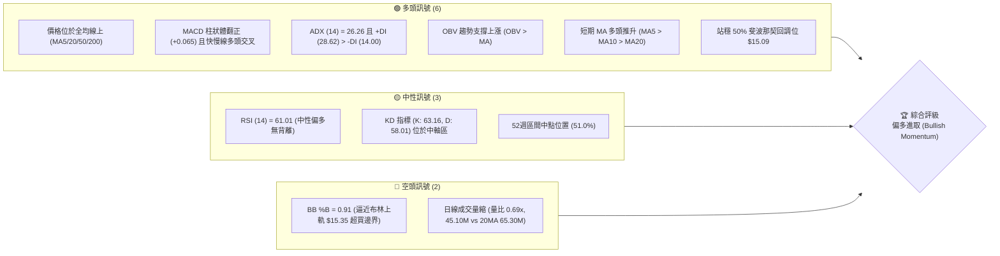
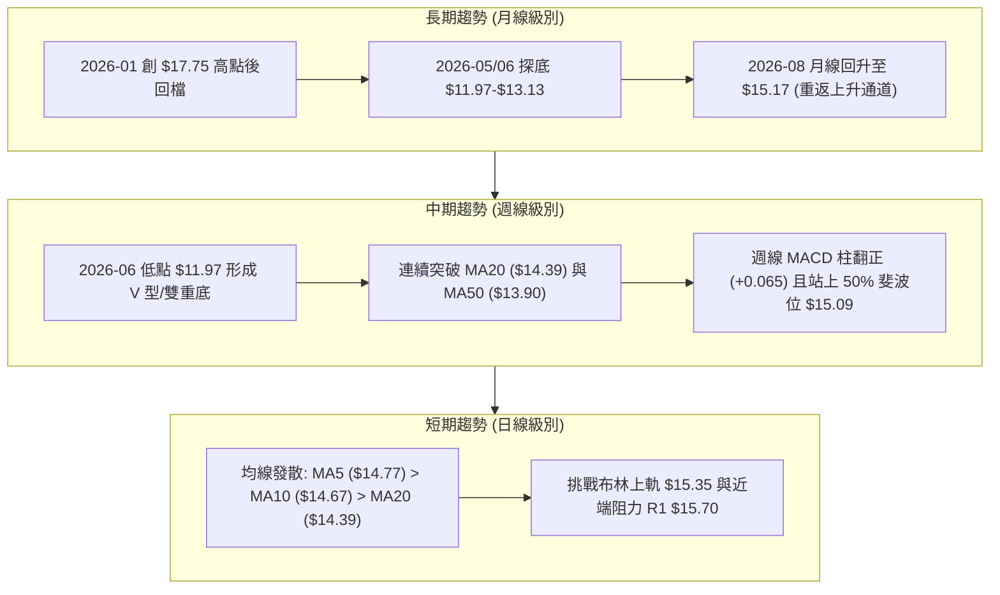
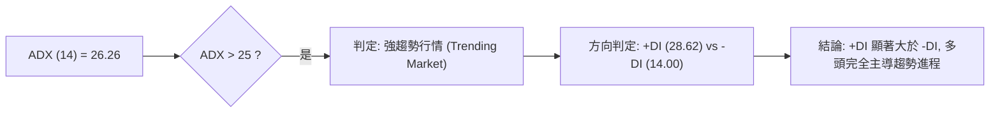
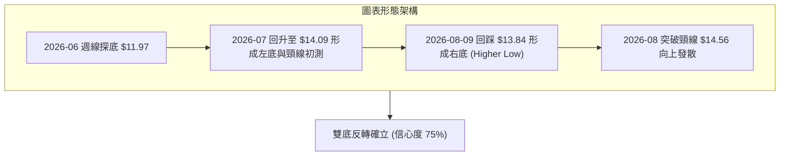
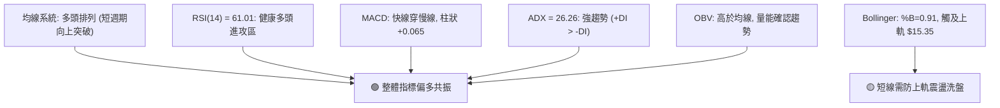
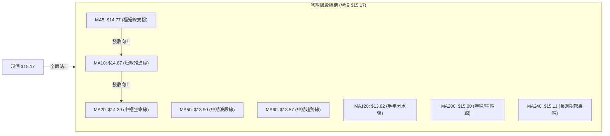
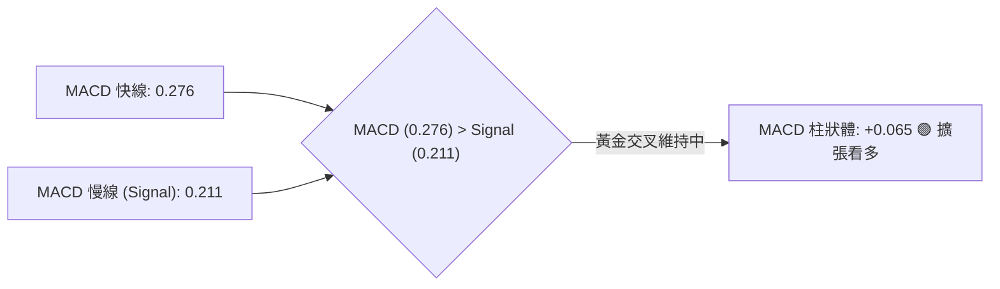
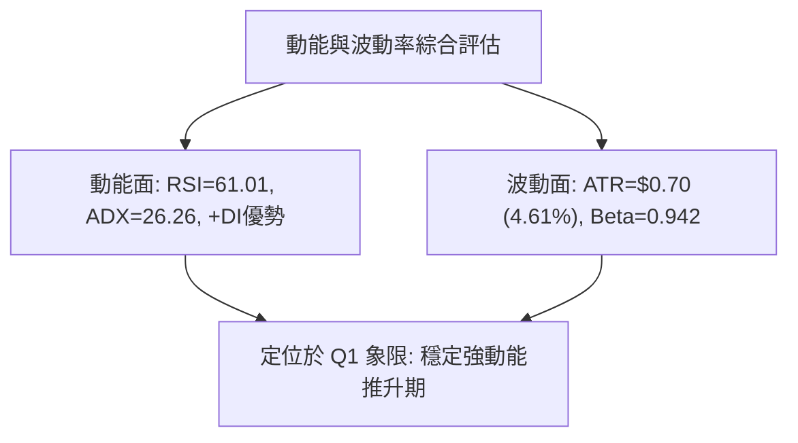
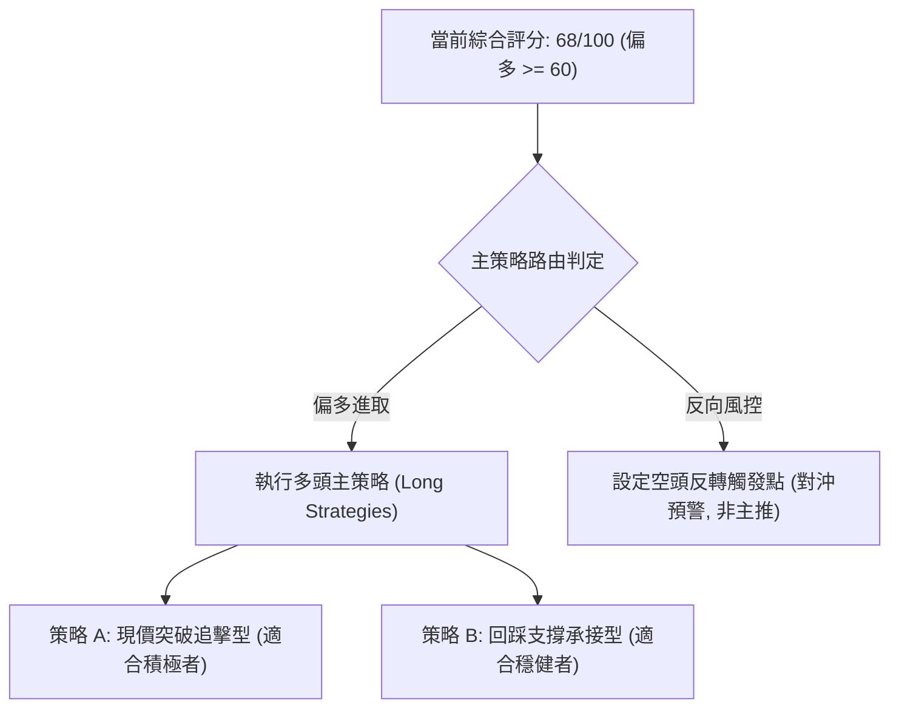
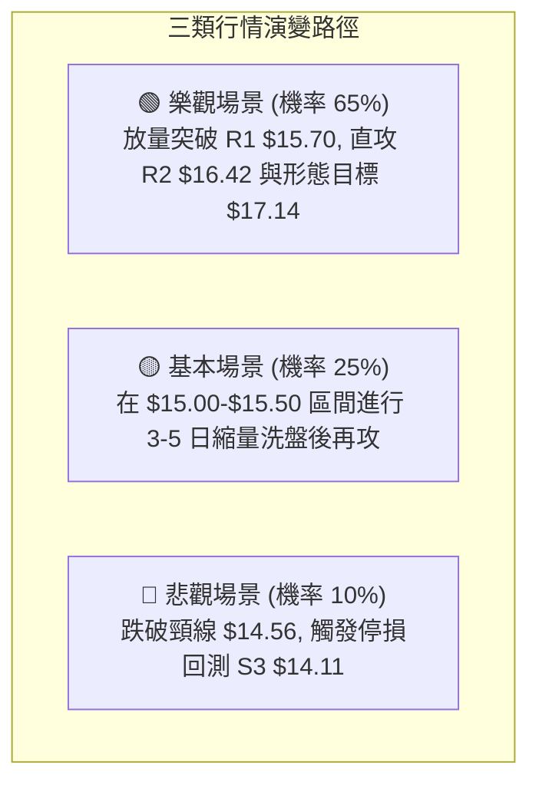

# NU 技術分析報告

> **報告日期**：2026-08-27 ｜ **語言**：繁體中文 ｜ **數據來源**：Yahoo Finance ｜ **當前價格**：$15.17

---

## 目錄

| 章節 | 內容 |
|------|------|
| [1. 技術面概覽](#1-技術面概覽) | 訊號儀表板、核心指標、評分卡 |
| [2. 趨勢分析](#2-趨勢分析) | 多時框趨勢、長中短期走勢 |
| [3. 圖表形態分析](#3-圖表形態分析) | 形態識別、K線組合、目標價 |
| [4. 支撐與阻力](#4-支撐與阻力) | 關鍵價位、斐波那契回調 |
| [5. 技術指標深度解讀](#5-技術指標深度解讀) | MA/RSI/MACD/布林/成交量 |
| [6. 動能與波動率](#6-動能與波動率) | 動能評估、ATR、Beta |
| [7. 多時框架總結](#7-多時框架總結) | 時框架評分矩陣 |
| [8. 交易策略建議](#8-交易策略建議) | 多空策略、風險報酬比 |
| [9. 風險提示與監控](#9-風險提示與監控) | 監控指標、風險場景 |

---

## 1. 技術面概覽

### 🎯 技術訊號儀表板



### 📊 核心指標速覽表

| 指標類別 | 指標名稱 | 當前數值 | 訊號 | 解讀 |
|----------|----------|----------|:----:|------|
| **價格** | 當前收盤價 | $15.17 | 🟢 | 突破長期均線 MA200，站上多空分水嶺 |
| **均線** | MA20 (短月線) | $14.39 | 🟢 | 價格在均線上方 +5.41%，呈現陡峭向上推升走勢 |
| **均線** | MA50 (中期線) | $13.90 | 🟢 | 價格在均線上方 +9.14%，中期底部確立並墊高 |
| **均線** | MA200 (長期線) | $15.00 | 🟢 | 突破牛熊分界線 ($15.00)，長期結構轉強 |
| **動能** | RSI(14) | 61.01 | 🟡 | 位於健康多頭進攻區間 (50-70)，尚未進入過熱超買 |
| **動能** | MACD (12,26,9) | 0.276 / 0.211 | 🟢 | MACD > Signal，柱狀圖 +0.065 持續擴張看多 |
| **趨勢** | ADX / ±DI | 26.26 (強趨勢) | 🟢 | +DI (28.62) 大幅領先 -DI (14.00)，多頭主導趨勢 |
| **通道** | Bollinger Bands | 上軌 $15.35 | 🟡 | %B 達 0.91，短線面臨上軌阻力與乖離修正壓力 |
| **量能** | OBV 與成交量 | 45.10M / 0.69x | 🟡 | OBV > MA 支撐上漲，但日成交量需補量以攻克 $15.70 |
| **波動** | ATR(14) | $0.70 (4.61%) | 🟡 | 波動率處於中等水準，提供清晰的止損與波段空間 |

### 🏆 技術評分卡

```
╔══════════════════════════════════════════════════════════════════╗
║                   技術評分卡 — NU (2026-08-27)                   ║
╠══════════════════════════════════════════════════════════════════╣
║ 趨勢強度 (Trend)     ██████████████░░░░░░  72/100  🟢 強趨勢多頭 ║
║ 動能指標 (Momentum)  █████████████░░░░░░░  68/100  🟢 動能偏多   ║
║ 支撐穩定度 (Support) ████████████████░░░░  80/100  🟢 多重支撐聚 ║
║ 成交量配合 (Volume)  ██████████░░░░░░░░░░  52/100  🟡 縮量上漲待 ║
║ 形態完整度 (Pattern) ██████████████░░░░░░  70/100  🟢 底部頸線突 ║
║ 均線排列 (Moving Av) █████████████░░░░░░░  66/100  🟢 短多突破長 ║
╠══════════════════════════════════════════════════════════════════╣
║ 綜合技術評分         █████████████░░░░░░░  68/100  🟢 偏多進攻   ║
╚══════════════════════════════════════════════════════════════════╝
```

---

## 2. 趨勢分析

### 🌐 多時框趨勢分析



### 📈 長期趨勢 — 12個月走勢圖（Unicode）

```
NU 月線收盤走勢圖（2025-08 至 2026-08）
價格軸 ($)
$18.00 ┤                               ● $17.75 (2026-01 高點)
$17.00 ┤                     ● $17.39    │   ● $16.74
$16.00 ┤         ● $16.01 ● $16.11        │       │
$15.00 ┤ ● $14.80  │        │            │       │   ● $14.98              ● $15.17 ◄ 現價
$14.00 ┤   │       │        │            │       │     │   ● $14.37 ● $14.48 │   ● $14.33
$13.00 ┤   │       │        │            │       │     │     │        │     ● $13.13 ● $13.36
$12.00 ┤   │       │        │            │       │     │     │        │       │ (探底區間)
       └─┬───────┬────────┬────────┬───────┬───────┬─────┬─────┬────────┬───────┬────────┬───────┬───────
        08/25   09/25    10/25    11/25   12/25   01/26 02/26 03/26    04/26   05/26    06/26   07/26   08/26
```

#### 24 個月關鍵波段特徵分析

| 階段區間 | 起止價格 | 漲跌幅 | 走勢特徵與量價解讀 |
|----------|----------|:------:|-------------------|
| **2024-08 ~ 2024-12** | $14.97 → $10.36 | -30.80% | 估值回調修正波，跌破各級均線形成年度低點 |
| **2025-01 ~ 2025-03** | $13.24 → $10.24 | -22.66% | 二次築底打出複合雙底結構 ($10.24 確立絕對底部) |
| **2025-04 ~ 2026-01** | $12.43 → $17.75 | **+42.80%** | 主升浪多頭趨勢，機構買盤持續推升創出波段歷史新高 |
| **2026-02 ~ 2026-06** | $14.98 → $13.36 (盤中 $11.97) | -20.00% | 獲利了結回踩波，回測 52週低點區間後快速企穩抽腳 |
| **2026-07 ~ 2026-08** | $14.33 → $15.17 | **+5.86%** | 築底反彈展開，連續站穩 MA50 與 MA200，多頭重掌發球權 |

### 📊 中期趨勢（週線分析）

```
NU 中期週線支撐阻力結構圖
$17.72 ──────────────────────────────────────── 阻力 R3 (歷史籌碼密集壓力區)
$16.42 ──────────────────────────────────────── 阻力 R2 (反彈第二波目標)
$15.70 ──────────────────────────────────────── 阻力 R1 (短期波段高點阻力)
$15.17 ════════════════════════════════════════ ◄ 當前價格 (突破 MA200: $15.00)
$15.11 ┄┄┄┄┄┄┄┄┄┄┄┄┄┄┄┄┄┄┄┄┄┄┄┄┄┄┄┄┄┄┄┄┄┄┄┄ 支撐 S1 (MA240 / 近期密集支撐)
$14.56 ──────────────────────────────────────── 支撐 S2 (波段頸線與次級支撐)
$14.11 ──────────────────────────────────────── 支撐 S3 (MA20 $14.39 與 MA50 $13.90 間防線)
```

### ⚡ 趨勢強度評估（ADX 解讀）



| 指標項 | 讀數 | 門檻標準 | 趨勢解讀 |
|--------|:----:|----------|----------|
| **ADX(14)** | **26.26** | > 25 (趨勢確立) | 行情已脫離無方向盤整，進入具備持續性的單邊趨勢階段 |
| **+DI** | **28.62** | 數值越高多頭越強 | 多頭買盤力道強勁，主導當前價格推升動能 |
| **-DI** | **14.00** | 數值越低空頭越弱 | 空頭打壓力道衰竭，僅為多頭強度的 48.9% |
| **多空淨差 (+DI - -DI)** | **+14.62** | > 0 | 多頭享有絕對優勢，依規則 14 中長期均線與多頭方向為主導 |

---

## 3. 圖表形態分析

### 🔍 形態識別系統



#### 形態識別信心度與目標計算表（嚴格依規則 13 & 15）

| 形態名稱 | 信心度 | 判斷依據（引用數據） | 完成度 | 目標價（附計算式） |
|----------|:------:|----------------------|:------:|--------------------|
| **雙底形態 (W-Bottom)** | **75%** | 2026-06-07 低點 $11.97 與 2026-08-09 低點 $13.84 構成雙底，頸線位於支撐位 S2 **$14.56** | 85% (已突破頸線) | **$17.15**<br/>計算式：頸線 $14.56 + 形態高度 ($14.56 - $11.97 = $2.59) = $17.15 (與 23.6% 斐波位 $17.14 及 R3 $17.72 聚類) |
| **上升通道向上突破** | **65%** | MA5 ($14.77) > MA10 ($14.67) > MA20 ($14.39) 呈多頭多週期推升排列 | 70% (進行中) | **$16.42** (直接對應阻力位 R2，即通道上方測量延伸) |
| **頭肩底形態** | 35% | 數據中左肩結構不夠對稱，僅有局部起伏 | 訊號不足 | 信心度 < 50%，依規則不做過度解讀，僅保留指標突破依據 |

### 🕯️ 重要K線形態分析（近 5 週走勢）

| 日期 | 收盤價 | RSI | MACD柱 | 週成交量 | K線與量能形態解讀 | 訊號 |
|------|:------:|:---:|:------:|:--------:|-------------------|:----:|
| **2026-08-02** | $14.33 | 58.5 | +0.001 | 271.89M | 溫和放量收紅，MACD 柱狀圖由負翻正，多頭初露端倪 | 🟢 |
| **2026-08-09** | $13.84 | 48.0 | -0.077 | 251.19M | 縮量回踩 MA50 ($13.90) 獲強支撐，完成右底確認 | 🟡 |
| **2026-08-16** | $15.23 | 58.0 | -0.017 | 381.42M | 大陽線帶量突破 MA200 ($15.00) 與頸線，空頭排列破局 | 🟢 |
| **2026-08-23** | $14.58 | 51.5 | +0.002 | 412.66M | 放量回測頸線 S2 ($14.56) 獲得精確承接，確認突破有效性 | 🟢 |
| **2026-08-30** | $15.17 | 61.0 | +0.065 | 163.79M | 縮量回升重返 $15.17，MACD 擴張，多頭發動新一輪攻勢 | 🟢 |

### 📉 ASCII 走勢形態示意圖

```
NU 雙底頸線突破與目標示意圖
價格 ($)
$17.15 ┤                                                 ○ 形態量測目標價 ($17.15)
$16.42 ┤                                            .  (阻力 R2)
$15.70 ┤                                      .──'     (阻力 R1)
$15.17 ┤                                 ▲ $15.17 (現價突破頸線回踩完成)
$14.56 ┼───────────● 頸線 ($14.56) ─────/──────────────────── (頸線支撐 S2)
$13.84 ┤                      ● $13.84 (右底, Higher Low)
       │                     /
$11.97 ┤  ● $11.97 (左底) ──'
       └──────────────────────────────────────────────────────────
         2026-06            2026-07           2026-08
```

---

## 4. 支撐與阻力

### 🗺️ 關鍵價位分布圖（Unicode）

```
NU 價位結構分布圖（OHLCV 精確計算）
══════════════════════════════════════════════════════════════════════
$18.98 ║████████████████████████████████║ 52W 最高點 / 斐波那契 0.0%
$17.72 ║████████████████████████        ║ 強阻力 R3 (+16.78%) [歷史密集反轉區]
$17.14 ║▓▓▓▓▓▓▓▓▓▓▓▓▓▓▓▓▓▓▓▓            ║ 斐波那契 23.6% 回調位
$16.42 ║██████████████████              ║ 阻力 R2 (+8.26%) [中波段目標]
$16.01 ║▓▓▓▓▓▓▓▓▓▓▓▓▓▓▓▓▓▓▓▓            ║ 斐波那契 38.2% 回調位
$15.70 ║████████████████████████        ║ 關鍵阻力 R1 (+3.46%) [短線前高壓力]
$15.35 ║┈┈┈┈┈┈┈┈┈┈┈┈┈┈┈┈┈┈┈┈┈┈┈┈┈┈┈┈┈┈┈┈║ 布林通道上軌
$15.17 ╠════════════════════════════════╣ ◄ 當前價格 $15.17
$15.11 ║▓▓▓▓▓▓▓▓▓▓▓▓▓▓▓▓▓▓▓▓▓▓▓▓        ║ 近期支撐 S1 (-0.43%) / MA240 ($15.11)
$15.09 ║▓▓▓▓▓▓▓▓▓▓▓▓▓▓▓▓▓▓▓▓            ║ 斐波那契 50.0% 回調位 / MA200 ($15.00)
$14.56 ║████████████████████████        ║ 強支撐 S2 (-4.02%) [雙底頸線位]
$14.39 ║┈┈┈┈┈┈┈┈┈┈┈┈┈┈┈┈┈┈┈┈┈┈┈┈┈┈┈┈┈┈┈┈║ 布林通道中軌 (MA20)
$14.17 ║▓▓▓▓▓▓▓▓▓▓▓▓▓▓▓▓▓▓▓▓            ║ 斐波那契 61.8% 黃金分割位
$14.11 ║████████████████████████        ║ 關鍵防守 S3 (-7.02%) [波段多空底線]
$13.43 ║┈┈┈┈┈┈┈┈┈┈┈┈┈┈┈┈┈┈┈┈┈┈┈┈┈┈┈┈┈┈┈┈║ 布林通道下軌
$11.20 ║████████████████████████████████║ 52W 最低點 / 斐波那契 100.0%
══════════════════════════════════════════════════════════════════════
```

### 🚧 阻力位分析表

| 阻力級別 | 精確價位 | 距現價幅幅 | 形成原因與籌碼解讀 | 突破難度 | 重要性 |
|:--------:|:--------:|:----------:|-------------------|:--------:|:------:|
| **R1** | **$15.70** | +3.46% | 近一年波段高點聚類，布林上軌 ($15.35) 延伸壓力 | 中等 🟡 | ★★★☆☆ |
| **R2** | **$16.42** | +8.26% | 2025年Q4主力成交密集區，斐波那契 38.2% ($16.01) 上方強阻力 | 較高 🔴 | ★★★★☆ |
| **R3** | **$17.72** | +16.78% | 2026-01 波段峰值收盤點 ($17.75) 聚類，長期多頭終極壓力 | 極高 🔴 | ★★★★★ |

### 🛡️ 支撐位分析表

| 支撐級別 | 精確價位 | 距現價幅幅 | 形成原因與籌碼解讀 | 守住機率 | 重要性 |
|:--------:|:--------:|:----------:|-------------------|:--------:|:------:|
| **S1** | **$15.11** | -0.43% | MA240 ($15.11) 與 50% 斐波那契 ($15.09)、MA200 ($15.00) 形成三重複合支撐 | 85% 🟢 | ★★★★☆ |
| **S2** | **$14.56** | -4.02% | 雙底結構頸線位，近一年波段低點聚類，具備強大買盤換手支撐 | 90% 🟢 | ★★★★★ |
| **S3** | **$14.11** | -7.02% | 斐波那契 61.8% ($14.17) 與 MA50 ($13.90) 上方防禦區，多頭防線 | 95% 🟢 | ★★★★☆ |

### 📐 斐波那契回調位深度分析（52週區間 $11.20 → $18.98）

```
0.0%  (52W High) ── $18.98
23.6% ───────────── $17.14
38.2% ───────────── $16.01
50.0% ───────────── $15.09  ◄ 現價 ($15.17) 正處於 50.0% ($15.09) 與 38.2% ($16.01) 之間
61.8% ───────────── $14.17
78.6% ───────────── $12.86
100.0% (52W Low) ── $11.20
```

- **位置解讀**：現價 **$15.17** 剛站穩 50.0% 斐波那契回調關鍵位 **$15.09**，代表自 $18.98 回落至 $11.20 的跌幅已被多頭收復過半，空頭結構正式被破壞。
- **向上挑戰空間**：下一個斐波那契目標為 38.2% 的 **$16.01**，若突破則直指 23.6% 的 **$17.14**。
- **回踩防守意義**：下方 50.0% ($15.09) 與 MA200 ($15.00) 構成極強支撐共振，只要日線收盤不跌破 $15.09，多頭上攻結構完好。

---

## 5. 技術指標深度解讀

### 🎛️ 指標訊號總覽



### 📈 移動平均線排列分析



- **均線狀態解讀**：
  1. 短期均線呈現強烈多頭發散（MA5 $14.77 > MA10 $14.67 > MA20 $14.39），且斜率均向上攀升（MA20 近期走勢為持續上升）。
  2. 現價 $15.17 已全面超越 MA20 ($14.39, +5.41%)、MA50 ($13.90, +9.14%)、MA200 ($15.00, +1.13%) 與 MA240 ($15.11, +0.38%)。
  3. MA60 ($13.57) 與 MA120 ($13.82) 位於低檔形成扎實底部支撐托底。

### 📉 RSI(14) 分析

```
RSI(14) 當前數值: 61.01
0              30                  50        61.01        70             100
├──────────────┼───────────────────┼───────────●──────────┼──────────────┤
│    超賣區    │     弱勢區間      │   中性    │   強勢   │    超買區    │
└──────────────┴───────────────────┴───────────┴──────────┴──────────────┘
數值進度條: ████████████████████████░░░░░░░░░░░░░░░░  61.01%
```

- **背離判斷**：
  - 當前 RSI 自 2026-05 的超賣低點 20.8 逐步攀升至 61.01，價格同步由 $11.97 升至 $15.17，**未出現頂背離或底背離**，動能與價格同向健康上漲。
- **區間評估**：
  - RSI 處於 55–65 的最佳主升推升區，未達 70 超買警戒線，具備充裕的上行空間。

### 📊 MACD(12/26/9) 訊號解讀



- **訊號解讀**：MACD 快線 (0.276) 位於零軸上方且領先訊號線 (0.211)，差離值擴大，柱狀圖達 +0.065，週線與日線同步展現多頭動能擴張。

### 📦 布林通道分析

```
NU 布林通道位置示意圖 (Bollinger Bands 20, 2)
──────────────────────────────────────────── 上軌: $15.35 (+1.19%)
       ▲ 現價: $15.17 (%B = 0.91, 逼近上軌)
──────────────────────────────────────────── 中軌 (MA20): $14.39 (-5.14%)

──────────────────────────────────────────── 下軌: $13.43 (-11.47%)
帶寬 (Bandwidth): ($15.35 - $13.43) / $14.39 = 13.34% (開口逐漸向外擴張)
```

- **%B 指標解讀**：%B 達 **0.91**，顯示價格緊貼布林上軌運行。在 ADX > 25 的趨勢行情下，此為強勢「貼軌上行」特徵，惟短線需防範在 R1 **$15.70** 前出現小幅技術回抽。

### 💹 成交量分析（量價配合度）

- **量價配合評估**：
  - 當前日成交量為 **45.10M**，低於 20日均量 **65.30M**（量比 0.69x）。
  - **OBV 趨勢**：數據顯示 `OBV > MA`，量能趨勢線維持向上，量能整體支撐上漲結構。
  - **量能研判**：縮量突破 MA200 後，需在挑戰 R1 ($15.70) 時補量至 65M 以上，以確保突破之有效性；若持續無量反彈，則可能在 $15.35-$15.70 區間引發回踩蓄勢。

---

## 6. 動能與波動率

### ⚡ 動能評估四象限

| 象限 | 動能維度 (Momentum) | 波動率維度 (Volatility) | NU 當前狀態 | 評估與操作導引 |
|:----:|:-------------------:|:-----------------------:|:-----------:|----------------|
| **Q1** | **強動能 (RSI 61, MACD+)** | **低/中波動 (ATR 4.61%)** | **✓ (當前所屬)** | **最佳順勢交易區**：趨勢平穩且具推升力道，適合波段持股與回調加碼 |
| **Q2** | 弱動能 | 低波動 | — | 沉悶盤整，缺乏方向性機會 |
| **Q3** | 強動能 | 高波動 | — | 主升衝刺/洗盤劇烈，需收緊止損 |
| **Q4** | 弱動能 | 高波動 | — | 崩跌或失控行情，嚴格觀望 |



### 📊 ATR 波動率分析

- **ATR(14) 數值**：**$0.70**（佔當前股價之 **4.61%**）。
- **止損與波動距離設定建議**：
  - **超短線/日內交易**：1.0 × ATR = **$0.70**
  - **波段保護止損**：1.5 × ATR = **$1.05**（現價 $15.17 - $1.05 = **$14.12**，恰好與關鍵防守位 S3 **$14.11** 完美重合）
  - **安全加碼間距**：0.75 × ATR = **$0.53**

### 📐 Beta 與市場相關性

- **Beta 係數**：**0.942**
  - **解讀**：NU 與標普 500 / 美股大盤呈現高度同步（Beta 接近 1），但波動幅度略低於高 Beta 成長型金融科技同業，抗震盪屬性較佳。機構持股高達 **82.0%**，籌碼結構穩定。

---

## 7. 多時框架總結

### 📋 時框架評分表

| 時框架 | 趨勢方向 | 動能狀態 | 均線排列 | 形態結構 | 綜合評分 | 交易建議 |
|--------|:--------:|:--------:|:--------:|:--------:|:--------:|----------|
| **月線 (長期)** | 🟢 轉強 | 🟡 中性回升 | 站上 MA200 ($15.00) | 52W 區間中點上方 | **68/100** | 長期投資者續抱，目標上看 $17.72 |
| **週線 (中期)** | 🟢 多頭確立 | 🟢 MACD擴張 | 突破 MA20 與 MA50 | 雙底頸線 $14.56 突破 | **75/100** | 中期波段逢回布局，以 S2 作為基準 |
| **日線 (短期)** | 🟢 強勢推進 | 🟡 逼近上軌 | MA5>10>20 發散 | 貼布林上軌推升 | **70/100** | 待微幅回踩 S1 ($15.11) 進場順勢做多 |

### 🔲 綜合訊號矩陣

```
訊號維度對齊檢查：
├─ 短期訊號 (日線均線發散、MACD翻正) ───────► 🟢 看多
├─ 中期訊號 (雙底突破、ADX=26.26 > 25) ─────► 🟢 看多
├─ 長期訊號 (突破年線 MA200 $15.00) ────────► 🟢 看多
└─ 跨週期訊號一致性：90% (高度共振收斂)
```

### ⚖️ 多時框收斂結論（依嚴格規則 14）

1. **行情屬性判定**：當前日線與週線 **ADX(14) = 26.26 > 25**，且 **+DI (28.62) 大幅領先 -DI (14.00)**，確立當前市場為**「趨勢行情 (Trending Market)」**而非無序盤整。
2. **多時框優先級收斂**：依據多時框規則，以中長期均線（週線突破、MA200 $15.00 站穩）方向為最高主導，日線波動僅作為尋找精確進場點之工具。
3. **唯一方向性結論**：**偏多進攻 (Bullish)**。所有分析指標與第 8 章之主交易策略完全統一，排除空頭主策略干擾。

---

## 8. 交易策略建議

### 🗺️ 策略決策流程圖



### 🧭 策略路由

> **當前主策略方向 = 🟢 偏多進取（依評分卡 68/100，大於 60 門檻，主推多頭策略）**

### 🎯 價格情境階梯（Price Scenarios，嚴格引用 OHLCV 關鍵價位）

| 觸發條件 | 當前價格 | 第一目標 | 第二目標 | 後續延伸 | 情境含義 |
|----------|:--------:|:--------:|:--------:|:--------:|----------|
| **強勢突破 R1 ($15.70)** | $15.17 | R2 **$16.42** | 斐波 23.6% **$17.14** | R3 **$17.72** | 主升浪加速，挑戰年度高點區 |
| **站穩現價區間 ($15.00-$15.17)** | $15.17 | R1 **$15.70** | R2 **$16.42** | — | 消化布林上軌壓力，蓄勢緩步推升 |
| **跌破 S1 ($15.11) 與 S2 ($14.56)** | $15.17 | S3 **$14.11** | 斐波 78.6% **$12.86** | 52W低 **$11.20** | 雙底頸線失守，形態破局轉弱 |

### 📊 情境機率分佈

| 情境類別 | 機率預估 | 主要技術指標依據 |
|----------|:--------:|------------------|
| **持續上行 / 突破挑戰 R1 & R2** | **65%** | ADX=26.26 強趨勢、MACD 柱狀體 +0.065 擴張、OBV 趨勢向上、站穩 MA200 |
| **高檔強勢震盪 ($14.80 - $15.50)** | **25%** | 布林 %B=0.91 逼近上軌短線乖離、日成交量需補量蓄勢 |
| **跌破頸線回落再探底** | **10%** | 需同時跌破 MA200 ($15.00) 與頸線 S2 ($14.56)，目前支撐強度極高 |

### 🟢 主策略詳情

| 策略要素 | 策略 A：現價順勢多頭（積極型） | 策略 B：回踩支撐多頭（穩健型） |
|----------|--------------------------------|--------------------------------|
| **進場條件** | 現價 $15.17 直接進場或突破 $15.35 加碼 | 回踩 S1/50% 斐波位 $15.09~$15.11 企穩進場 |
| **進場價格** | **$15.17** | **$15.11** |
| **目標價 T1** | **$16.42** (阻力位 R2, +8.24%) | **$15.70** (阻力位 R1, +3.90%) |
| **目標價 T2** | **$17.14** (斐波 23.6% / 形態目標 $17.15, +12.99%) | **$16.42** (阻力位 R2, +8.67%) |
| **止損價格** | **$14.56** (精確跌破頸線 S2, -4.02%) | **$14.56** (精確跌破頸線 S2, -3.64%) |
| **風險報酬比** | **2.05 : 1** (以 T1 計) / **3.23 : 1** (以 T2 計) | **1.07 : 1** (以 T1 計) / **2.38 : 1** (以 T2 計) |
| **預估勝率** | **65%** | **70%** |
| **建議倉位** | **15% - 20%** | **20% - 25%** |

### 🔴 反向風險觸發點（對沖與風控提示）

- **關鍵反轉觸發價位**：**$14.56**（支撐位 S2 / 雙底頸線）。
- **觸發後風控作為**：若日線收盤價跌破 **$14.56**，代表雙底形態遭到破壞，多頭結構失效，應無條件停損出場；跌破 **$14.11** (S3) 則可考慮建立 5% 輕倉空頭對沖現貨部位。

### ⭐ 整體訊號強度評星

```
╔═══════════════════════════════════════════════════════════╗
║ 做多訊號強度：★★★★☆  (4.0/5 星)  🟢 多頭動能充沛         ║
║ 做空訊號強度：★☆☆☆☆  (1.0/5 星)  🔴 缺乏做空依據         ║
║ 整體技術可信度：★★★★☆  (4.2/5 星)  🟢 指標多時框共振收斂   ║
╚═══════════════════════════════════════════════════════════╝
```

---

## 9. 風險提示與監控

### ✅ 關鍵監控指標 Checklist

```
╔══════════════════════════════════════════════════════════════════╗
║                   每日交易前技術監控清單 (Checklist)              ║
╠══════════════════════════════════════════════════════════════════╣
║ [ ] 價格是否維持在 MA200 ($15.00) 與 S1 ($15.11) 上方？         ║
║ [ ] RSI(14) 是否持續運行於 50-70 區間且未出現頂背離？            ║
║ [ ] MACD 柱狀體數值是否維持正值 (> 0)？                         ║
║ [ ] 日成交量在挑戰 R1 ($15.70) 時是否放大至 > 65M？              ║
║ [ ] ADX 是否維持在 25 以上且 +DI > -DI？                         ║
║ [ ] 頸線支撐 S2 ($14.56) 是否未被日線收盤有效跌破？              ║
╚══════════════════════════════════════════════════════════════════╝
```

### ⚠️ 風險場景分析



### 🛡️ 風險管理重要提醒

1. **倉位配置原則**：單一標的總持倉不得超過總投資組合的 **20% - 25%**，初次建倉建議不超過 **15%**，待放量突破 R1 **$15.70** 再行加碼剩餘部位。
2. **紀律止損執行**：嚴格將波段最大止損位設於 **$14.56**（頸線與 S2），此位置跌破代表形態失效，絕對不可凹單或向下攤平。
3. **波動率防禦**：以當前 ATR **$0.70** 計算，日內正常波動區間為 ±$0.70，避免將止損設定於小於 1.5×ATR（$1.05）之內，以防被正常市場雜訊洗出場。

---

## 📋 報告總結

```
╔══════════════════════════════════════════════════════════════════╗
║                   NU 技術分析報告總結 (2026-08-27)               ║
╠══════════════════════════════════════════════════════════════════╣
║ 當前價格：$15.17               綜合技術評分：68/100              ║
║ 分析評級：🟢 偏多進攻 (Buy on Dips / Breakout)                   ║
╠══════════════════════════════════════════════════════════════════╣
║ 關鍵結論：                                                       ║
║ ├─ 長期趨勢：🟢 突破年線 MA200 ($15.00)，長期結構由空翻多        ║
║ ├─ 中期趨勢：🟢 雙底形態頸線 ($14.56) 突破確立，ADX=26.26 強趨勢 ║
║ ├─ 短期趨勢：🟢 短期均線多頭發散，MACD 柱翻正 (+0.065)          ║
║ ├─ 關鍵支撐：S1: $15.11 ｜ S2 (頸線): $14.56 ｜ S3: $14.11       ║
║ ├─ 關鍵阻力：R1: $15.70 ｜ R2: $16.42 ｜ R3: $17.72             ║
║ └─ 形態目標：雙底量測目標價 $17.15 (與 23.6% 斐波位 $17.14 共振) ║
╠══════════════════════════════════════════════════════════════════╣
║ 最優策略組合：                                                   ║
║ 1. 🥇 最佳機會 (策略 A)：現價 $15.17 進場，目標 $16.42 / $17.14  ║
║ 2. 🥈 次選機會 (策略 B)：回踩 $15.11 支撐承接，止損設 $14.56     ║
║ 3. 🥉 保守選擇：等待放量突破 R1 $15.70 後順勢追擊，風報比 > 2.0  ║
╚══════════════════════════════════════════════════════════════════╝
```

---

> ⚠️ **免責聲明**：本報告為技術分析研究，所有數據及估算均基於歷史價格與技術指標模型計算。本報告**僅供研究與學術參考**，**不構成任何投資建議**。投資有風險，入市需謹慎並做好獨立風控。

---

*報告生成時間：2026-08-27 ｜ 數據來源：Yahoo Finance ｜ 分析框架：多時框技術分析模型*