# NU 技術分析報告

> **報告日期**：2026-08-28 ｜ **語言**：繁體中文 ｜ **數據來源**：Yahoo Finance ｜ **當前價格**：$14.88

---

## 目錄

| 章節 | 內容 |
|------|------|
| [1. 技術面概覽](#1-技術面概覽) | 訊號儀表板、核心指標、評分卡 |
| [2. 趨勢分析](#2-趨勢分析) | 多時框趨勢、長中短期走勢 |
| [3. 圖表形態分析](#3-圖表形態分析) | 形態識別、K線組合、目標價 |
| [4. 支撐與阻力](#4-支撐與阻力) | 關鍵價位、斐波那契回調 |
| [5. 技術指標深度解讀](#5-技術指標深度解讀) | MA/RSI/MACD/布林/成交量 |
| [6. 動能與波動率](#6-動能與波動率) | 動能評估、ATR、Beta |
| [7. 多時框架總結](#7-多時框架總結) | 時框架評分矩陣 |
| [8. 交易策略建議](#8-交易策略建議) | 多空策略、風險報酬比 |
| [9. 風險提示與監控](#9-風險提示與監控) | 監控指標、風險場景 |
| [10. 報告總結](#-報告總結) | 核心指標總結與操作路線 |

---

## 1. 技術面概覽

### 🎯 技術訊號儀表板

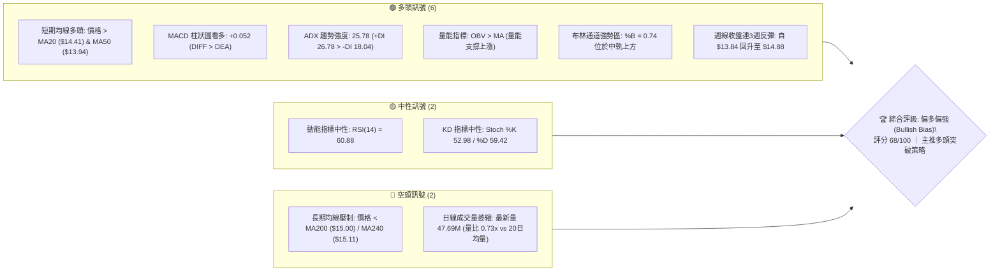

### 📊 核心指標速覽表

| 指標類別 | 指標名稱 | 當前數值 | 訊號 | 解讀 |
|----------|----------|----------|------|------|
| **價格** | 當前收盤價 | $14.88 | 🟢 | 站上 52 週中軸區間（47.3% 位置），逼近 R1 阻力位 |
| **均線** | 短期 MA20 | $14.41 | 🟢 | 價格位於 MA20 上方（乖離率 +3.26%），短線多頭掌控 |
| **均線** | 中期 MA50 | $13.94 | 🟢 | 價格位於 MA50 上方，中期均線斜率向上翻揚 |
| **均線** | 長期 MA200 | $15.00 | 🔴 | 價格低於 MA200（差距 -$0.12），面臨年線關鍵心理壓制 |
| **動能** | RSI(14) | 60.88 | 🟡 | 位於健康多頭動能區間（50-70），無頂底背離跡象 |
| **動能** | MACD(12,26,9) | 0.276 / 0.224 | 🟢 | MACD 柱狀圖為 +0.052，雙線位於零軸上方維持黃金交叉 |
| **趨勢** | ADX(14) / DMI | 25.78 | 🟢 | ADX > 25 進入強趨勢行情，+DI (26.78) 大幅領先 -DI (18.04) |
| **通道** | 布林通道 %B | 0.74 | 🟢 | 運行於中軌 ($14.41) 與上軌 ($15.40) 間之強勢進攻帶 |
| **量能** | OBV 趨勢 | OBV > MA | 🟢 | 資金持續流入，量能結構有效支撐短期價格推升 |
| **波動** | ATR(14) | $0.70 (4.68%) | 🟡 | 每日平均波幅適中，具備良好趨勢交易波動彈性 |

### 🏆 技術評分卡

```
╔══════════════════════════════════════════════════════════════════╗
║                   技術評分卡 — NU (2026-08-28)                  ║
╠══════════════════════════════════════════════════════════════════╣
║ 趨勢強度 (ADX/DMI)   ██████████████░░░░░░  70/100  🟢 強勢多頭   ║
║ 動能指標 (MACD/RSI)  ██████████████░░░░░░  72/100  🟢 積極看多   ║
║ 支撐穩定度 (S1/S2)   ████████████████░░░░  80/100  🟢 底部紮實   ║
║ 成交量配合 (OBV/量比)████████████░░░░░░░░  60/100  🟡 短線量縮   ║
║ 形態完整度 (雙底反彈)██████████████░░░░░░  70/100  🟢 頸線測試   ║
║ 均線排列 (短強長弱)  ██████████░░░░░░░░░░  54/100  🟡 混合排列   ║
╠══════════════════════════════════════════════════════════════════╣
║ 綜合評分             █████████████░░░░░░░  68/100  🟢 偏多進攻   ║
╚══════════════════════════════════════════════════════════════════╝
```

---

## 2. 趨勢分析

### 🌐 多時框趨勢分析

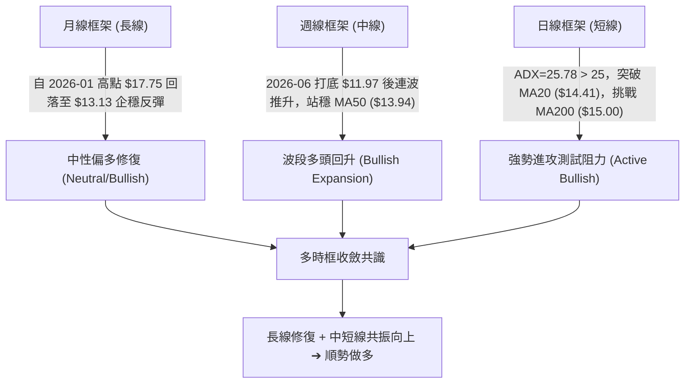

### 📈 長期趨勢 — 12個月走勢圖（Unicode）

```
NU 月線收盤走勢圖（2025-08 至 2026-08）
價格 ($)
$18.00 ┤                                   ● ($17.75, 2026-01)
$17.00 ┤                             ●     │
$16.00 ┤                   ●   ●     │     │
$15.00 ┤             ●     │   │     │     │                 ● ($14.88, 現價)
$14.00 ┤             │     │   │     │     │     ●     ●     │
$13.00 ┤             │     │   │     │     │     │     │  ●  │
$12.00 ┤             │     │   │     │     │     │     │  │  │
       └─┬─────┬─────┬─────┬───┬─────┬─────┬─────┬───┬─────┬───┬─────┬─────
        08/25 09/25 10/25 11/25 12/25 01/26 02/26 03/26 04/26 05/26 06/26 07/26 08/26
```

**走勢特徵分析表格**：

| 階段區間 | 時間跨度 | 起訖收盤價 | 漲跌幅 (%) | 主要技術特徵與結構 |
|----------|----------|------------|------------|--------------------|
| **波段主升段** | 2025-08 至 2026-01 | $14.80 → $17.75 | +19.93% | 強勢單邊單月階梯上行，創下波段收盤高點 $17.75 |
| **波段回撤段** | 2026-01 至 2026-05 | $17.75 → $13.13 | -26.03% | 均線高檔死叉，連續失守 $16.00 與 $14.50 支撐帶 |
| **底部築底段** | 2026-05 至 2026-06 | $13.13 → $13.36 | +1.75% | 週線最低探至 $11.97（52W低點 $11.20 上方），量能沉澱 |
| **次級回升段** | 2026-06 至 2026-08 | $13.36 → $14.88 | +11.38% | 連續兩個月收陽棒，突破日線多條均線，挑戰年線壓制 |

### 📊 中期趨勢（週線分析）

```
近期週線支撐與阻力架構（2026-04 至 2026-08）
$16.42 ────────────────────────────────────────── R3 (強阻力 / 近期高點密集帶)
$15.70 ────────────────────────────────────────── R2 (波段反彈強阻力)
$15.00 ══════════════════════════════════════════ MA200 / 斐波 50.0% ($15.09)
$14.88 ─────────────────● 現價 ($14.88) 逼近 R1 ($14.88)
$14.56 ────────────────────────────────────────── S1 (前波突破平台支撐)
$14.11 ────────────────────────────────────────── S2 (斐波 61.8% $14.17 聚類支撐)
$13.41 ────────────────────────────────────────── S3 (布林通道下軌 / 雙底頸線下方)
$11.97 ────────────────────────────────────────── 波段最低點（2026-06-07 探底針）
```

- 週線收盤自 2026-06-07 的 $11.97 大幅拉升至當前的 $14.88，累計反彈幅度達 +24.31%。
- 最近一週（2026-08-30）收盤 $14.88，週 RSI 升至 60.9，MACD 柱狀圖由負翻正至 +0.052，確認中期多頭動能重新轉強。

### ⚡ 趨勢強度評估（ADX 解讀）

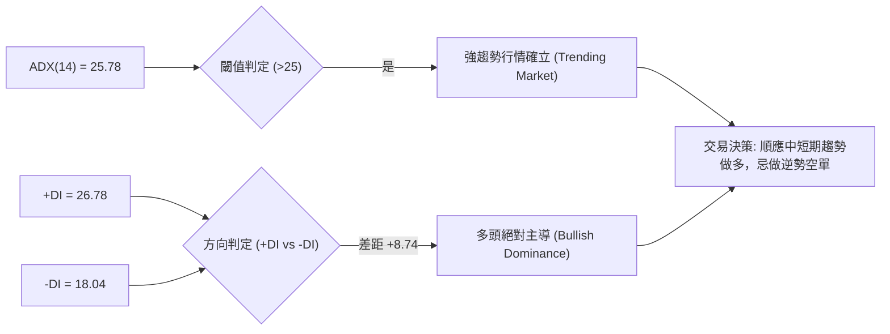

**ADX 趨勢強度指標對照分析**：

| 指標變數 | 實際數值 | 參考標準區間 | 趨勢屬性判定 | 交易策略導向 |
|----------|----------|--------------|--------------|--------------|
| **ADX(14)** | **25.78** | > 25 (強趨勢) | 明確單邊波段行情啟動 | 採取「趨勢突破與拉回買進」策略 |
| **+DI (多頭動能)** | **26.78** | > 25 (強勁) | 多頭買盤力道強大且集中 | 順勢持股，加碼做多 |
| **-DI (空頭動能)** | **18.04** | < 20 (衰退) | 空頭打壓力道明顯消退 | 空頭缺乏破壞性拋壓 |
| **DI 差值 (+DI - -DI)** | **+8.74** | > 0 (多頭發散) | 多空力量失衡，多方控盤 | 向上進攻機率顯著大於向下破位 |

---

## 3. 圖表形態分析

### 🔍 形態識別系統

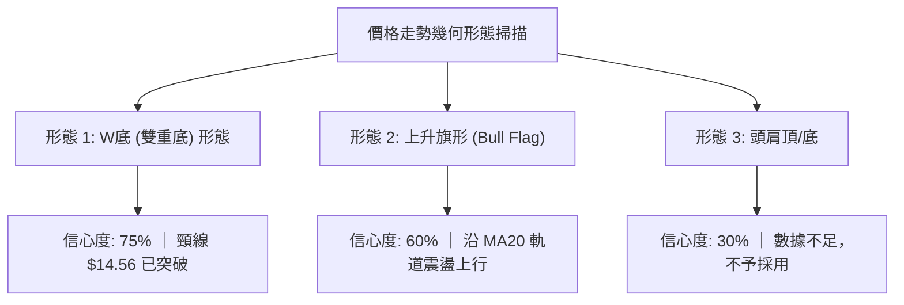

**形態識別與信心度評估表**（依規則 15）：

| 形態名稱 | 信心度 | 判斷依據（引用技術數據） | 完成度 | 目標價（附嚴謹計算式） |
|----------|:------:|--------------------------|:------:|------------------------|
| **W底 (雙重底)** | **75%** | 第一底於 2026-05-17 ($12.19)，第二底於 2026-06-07 ($11.97)，頸線突破點為 S1 ($14.56) | 90% | **目標價 = $17.15**<br>計算式：頸線 $14.56 + (頸線 $14.56 - 雙底均值 $12.08) = $17.04（與斐波 23.6% $17.14 聚類） |
| **上升通道 / 旗形** | **60%** | 價格沿著 MA20 ($14.41) 呈階梯式墊高，近期高點推升至 $15.23 後回測 $14.58 獲得支撐 | 70% | **目標價 = $15.70**<br>計算式：直接對應波段阻力 R2 ($15.70) |
| **頭肩底形態** | **30%** | 近期低點雖有層次，但左肩與右肩對稱性不足 | 20% | *訊號不足，僅做指標型解讀，不予推算* |

### 🕯️ 重要K線形態分析

| 週/月份週期 | 收盤價 | K線形態特徵 | 量價技術解讀 | 多空訊號 |
|-------------|--------|-------------|--------------|:--------:|
| **2026-05-17** | $12.19 | 長下影線大陰棒 | 週成交量爆出 377.56M，恐慌盤湧出形成初次落底 | 🟡 止跌信號 |
| **2026-06-07** | $11.97 | 探底神針十字星 | 週量放大至 473.47M 創波段天量，空頭力竭完成二次探底 | 🟢 強烈買訊 |
| **2026-07-19** | $13.59 | 天量換手十字星 | 週成交量高達 762.06M，主力籌碼進行大規模換手洗盤 | 🟢 換手蓄勢 |
| **2026-08-16** | $15.23 | 突破中長陽線 | 突破 MA50 與中軌壓力，收盤站上 $15.00 整數關卡 | 🟢 突破確立 |
| **2026-08-30** | $14.88 | 回踩確認小陽線 | 自 $14.58 回升，週成交量 211.50M，穩守支撐位 S1 ($14.56) | 🟢 延續多頭 |

### 📉 ASCII 走勢形態示意圖

```
NU 雙底 (W-Bottom) 突破與回踩確認架構圖
$16.00 ┤                                                     
$15.23 ┤                                      ▲ (波段高點)    
$14.88 ┤ ─────────────────────────────────────● 現價 (挑戰 R1 $14.88 / MA200 $15.00)
$14.56 ┤ ══════ 頸線位 (Neckline / S1 $14.56) ═══ 突破後回踩確認成功 ═══
$14.00 ┤        ▲ 中間反彈高點                      ▲
$13.00 ┤       ╱ ╲                                ╱ ╲
$12.19 ┤  ●───╯   ╲                        ●─────╯   ╲ (右肩抬高)
$11.97 ┤ (底1, 05/17) ╲                      (底2, 06/07)
$11.00 └────────────────●───────────────────────────────────────
```

### 🎯 形態目標價計算

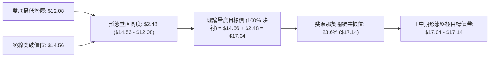

- **第一階段目標價 (T1)**：直接指向波段阻力 **R2: $15.70**（形態突破之中繼站）。
- **第二階段目標價 (T2)**：指向斐波那契 38.2% 回調位 **$16.01** 及阻力 **R3: $16.42**。
- **終極形態量度目標 (T3)**：雙底量度目標區 **$17.04 - $17.14**（與 52 週斐波 23.6% 聚類）。

---

## 4. 支撐與阻力

### 🗺️ 關鍵價位分布圖（Unicode）

```
NU 關鍵價位空間分布與籌碼結構圖
═══════════════════════════════════════════════════════════════════
$17.14 ║██████████████████████████████║ 斐波那契 23.6% 回調位
$16.42 ║████████████████████████      ║ 強阻力 R3 (近一年波段高點聚類)
$16.01 ║████████████████████          ║ 斐波那契 38.2% 回調位
$15.70 ║████████████████              ║ 阻力 R2 (反彈延伸壓力位)
$15.40 ║████████████                  ║ 布林通道上軌壓力
$15.09 ║██████████                    ║ 斐波那契 50.0% / MA200 ($15.00)
$14.88 ╠══════════════════════════════╣ ◄ 現價 ($14.88) ｜ 關鍵阻力 R1 ($14.88)
$14.56 ║▓▓▓▓▓▓▓▓▓▓▓▓▓▓▓▓▓▓▓▓          ║ 第一關鍵支撐 S1 (近期波段支撐/頸線)
$14.41 ║▓▓▓▓▓▓▓▓▓▓▓▓▓▓▓▓▓▓            ║ 短期生命線 MA20 / 布林中軌
$14.11 ║████████████████████████      ║ 強支撐 S2 (斐波 61.8% $14.17 聚類)
$13.41 ║██████████████████████████████║ 深度防守支撐 S3 (布林下軌 $13.43 聚類)
═══════════════════════════════════════════════════════════════════
```

### 🚧 阻力位分析表

*（價位嚴格引用技術數據「關鍵價位」區塊）*

| 阻力級別 | 準確價位 | 距離現價 (%) | 形成技術原因 | 突破難度評級 | 戰略重要性 |
|:--------:|:--------:|:------------:|--------------|:------------:|:----------:|
| **R1** | **$14.88** | +0.00% | 當前收盤價所在之近一年波段高點聚類位，重合 MA200 ($15.00) 心理關卡 | 🟡 中等 | 突破即確認短線由震盪轉為強勢單邊進攻 |
| **R2** | **$15.70** | +5.48% | 近一年次級反彈高點聚類，布林通道上軌 ($15.40) 上方之強延伸位 | 🔴 較高 | 中期波段多頭獲利了結與籌碼解套重壓區 |
| **R3** | **$16.42** | +10.37% | 近一年重要頂部籌碼密集區，接近 2025 年底震盪平台下沿 | 🔴 極高 | 多頭波段反轉成立後的終極結構阻力 |

### 🛡️ 支撐位分析表

*（價位嚴格引用技術數據「關鍵價位」區塊）*

| 支撐級別 | 準確價位 | 距離現價 (%) | 形成技術原因 | 守住機率評級 | 戰略重要性 |
|:--------:|:--------:|:------------:|--------------|:------------:|:----------:|
| **S1** | **$14.56** | -2.15% | 近一年波段低點聚類，W底頸線回踩確認位，重合 MA10 ($14.77) | 🟢 85% | 短線多頭防守核心，失守則短線多頭動能減弱 |
| **S2** | **$14.11** | -5.21% | 近一年重要低點密集區，與斐波 61.8% ($14.17) 形成強共振 | 🟢 90% | 中期多空格局分水嶺，波段多單最後防守底線 |
| **S3** | **$13.41** | -9.88% | 近一年波段低點聚類，與布林下軌 ($13.43) 及 MA60 ($13.62) 聚類 | 🟢 95% | 長期強支撐底線，跌破則宣告形態徹底失敗 |

### 📐 斐波那契回調位分析

*（基準區間：52週高點 $18.98 → 52週低點 $11.20，總波幅 $7.78）*

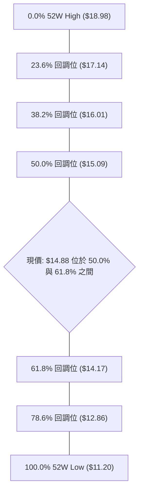

**斐波那契點位深度解讀**：
1. **當前區間定位**：現價 **$14.88** 精確運行於 **61.8% ($14.17)** 與 **50.0% ($15.09)** 之間。
2. **黃金分割支撐確認**：股價自 $11.97 反彈後，已成功站穩關鍵黃金分割位 61.8% ($14.17) 上方，且支撐位 S2 ($14.11) 與其高度共振，構築堅固的底部防線。
3. **上行空間開啟條件**：當前多頭首要任務是向上收復 50.0% 平衡位 **$15.09**（與 MA200 $15.00 共振）。一旦收盤站穩 $15.09 上方，上行空間將直接打開至 38.2% 回調位 **$16.01**。

---

## 5. 技術指標深度解讀

### 🎛️ 指標訊號總覽

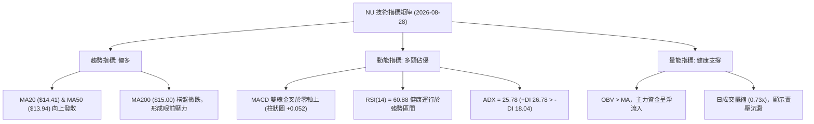

### 📈 移動平均線排列分析

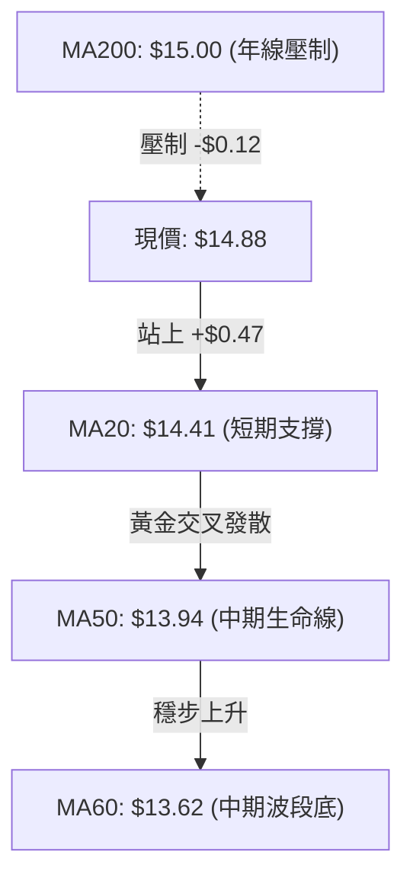

**均線系統詳細參數與狀態分析表**：

| 均線名稱 | 當前價格 | 與現價差距 (%) | 均線走勢軌跡 | 形態狀態與解讀 |
|:--------:|:--------:|:--------------:|:------------:|----------------|
| **MA 5** | $14.91 | -0.20% | ▁▁▂▃▃▄▅▅▄▅▅▅▄▅▅▄▃▂▁▁▂▄▅▆▇▆▆▇██ | 短線微幅整理，高檔鈍化 |
| **MA 10** | $14.77 | +0.74% | ▁▁▁▂▂▃▃▄▄▅▅▅▅▅▅▅▅▄▃▃▄▄▄▄▄▅▅▇██ | 強勁向上發散，短線支撐強烈 |
| **MA 20** | $14.41 | +3.26% | ▁▁▂▂▃▄▄▅▅▅▆▆▆▆▇▇▇▇▆▇▇▇▇▇▇█████ | 穩健上升，形成波段多頭生命線 |
| **MA 50** | $13.94 | +6.74% | 中期均線由平轉升 | 中期底座紮實，提供堅固回檔支撐 |
| **MA 60** | $13.62 | +9.25% | ▁▁▁▁▁▁▁▁▁▁▁▁▁▁▁▁▂▂▂▃▄▄▄▅▅▆▆▇██ | 中長期底部確立，持續向上牽引 |
| **MA120** | $13.82 | +7.67% | ███▇▇▆▆▅▅▅▄▄▄▃▃▃▂▂▂▁▁▁▁▁▁▁▁▁▁▁ | 半年線走平，MA20/MA50 已向上金叉 |
| **MA200** | $15.00 | -0.80% | 走平微跌 | **牛熊分界線**，突破即形成中長線全面看多 |
| **MA240** | $15.11 | -1.52% | ▁▁▂▃▃▄▅▆▆▇▇███████████▇▇▇▇▇▇▆▆ | 終極年線壓力帶 ($15.00 - $15.11) |

- **均線排列總結**：短期（MA5/10/20）與中期（MA50/60）呈現標準**多頭排列**，唯長期均線（MA200/240）橫亙於上方，構成當前「**短多挑戰長壓**」的混合排列格局。

### 📉 RSI(14) 分析

```
RSI(14) 當前狀態: 60.88 (健康多頭進攻區)
0 ────── 超賣(30) ──────── 中軸(50) ──────── 超買(70) ────── 100
[░░░░░░░░░░░░░░░░░░░░░░░░░░░░░░░████████████████████░░░░░░░░░░]  60.88%
```

- **超買超賣判定**：數值為 **60.88**，脫離 50 多空分界線，未達 70 超買警戒線，顯示多方動能充沛且具備充裕上行空間。
- **背離分析**：
  - 日線 RSI 自 2026-08 初的 48.0 穩步回升至 60.88，價格亦同步自 $13.84 漲至 $14.88，指標與價格創高步調一致。
  - **明確結論：RSI 無頂背離，亦無底背離**，屬於健康的順勢推升階段。

### 📊 MACD(12,26,9) 訊號解讀

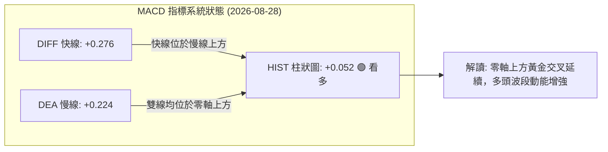

- **MACD 快慢線**：DIFF (0.276) > DEA (0.224)，且雙線均處於零軸上方，屬於標準的「**零上多頭金叉**」強勢結構。
- **柱狀圖動能**：柱狀圖為 **+0.052**，連續多週收正，確認多頭動能正在加速釋放。
- **背離分析**：週線與日線 MACD 柱狀圖同步放大，**無任何頂背離現象**。

### 📦 布林通道分析

```
NU 日線布林通道 (20, 2) 結構圖
$15.40 ┤ ──────────────────────────────── 上軌 (BB Upper)
       │                              
$14.88 ┤ ────────────────────● 現價 ($14.88, %B = 0.74)
       │                         
$14.41 ┤ ════════════════════════════════ 中軌 (BB Middle / MA20)
       │                         
$13.43 ┤ ──────────────────────────────── 下軌 (BB Lower)
```

- **帶寬與位置**：上軌 **$15.40**，中軌 **$14.41**，下軌 **$13.43**，帶寬為 $1.97 (13.24%)。
- **%B 指標分析**：%B 為 **0.74**，價格緊貼上軌運行，處於強勢單邊進攻區間（%B 介於 0.7 至 1.0），並未出現觸軌回落之衰竭信號。
- **軌道形態**：中軌維持向上傾斜，上下軌同步開口，通道呈現擴張多頭態勢。

### 💹 成交量分析（量價配合度）

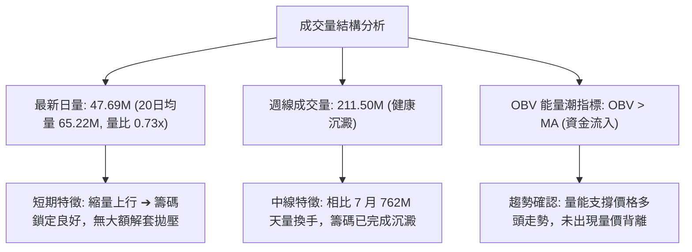

- **量價配合度結論**：OBV 維持在均線上方，量價結構處於「**籌碼鎖定、健康推升**」狀態，突破 $15.00 時若補量至 65M 以上將形成完美價量齊揚。

---

## 6. 動能與波動率

### ⚡ 動能評估四象限

**動能與波動率四象限定位表**：

| 象限代號 | 動能維度 | 波動率維度 | 市場特徵描述 | 當前狀態定位與解讀 |
|:--------:|:--------:|:----------:|:------------:|:------------------:|
| **Q1** | **強動能 (ADX>25, RSI>60)** | **低/中波動 (ATR<5%)** | **穩健單邊趨勢** | 🟢 **NU 目前處於此象限 (最佳進場機會)** |
| **Q2** | 弱動能 (ADX<20, RSI 40-60) | 低波動 (ATR<3%) | 狹幅無方向盤整 | - |
| **Q3** | 強動能 (ADX>30, RSI>70) | 高波動 (ATR>7%) | 極端情緒爆發/高風險 | - |
| **Q4** | 弱動能 (ADX<20, RSI<40) | 高波動 (ATR>7%) | 混沌震盪/洗盤破位 | - |

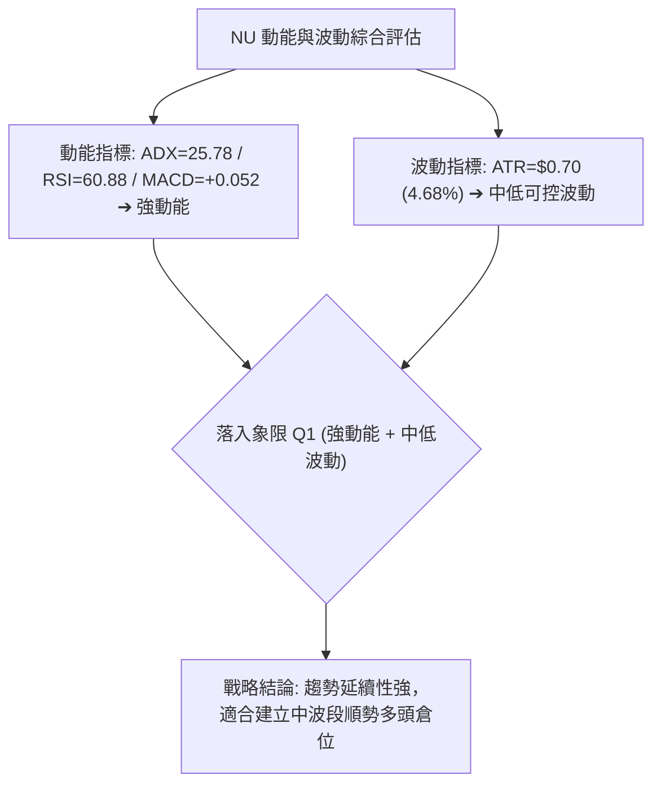

### 📊 ATR 波動率分析

```
ATR(14) 波動區間與風控距離示意圖
現價: $14.88 ──┬── +1.0 ATR ($15.58) ── 短線第一止盈區
              ├── -1.0 ATR ($14.18) ── 緊密止損位 (重合 S2 $14.11)
              └── -1.5 ATR ($13.83) ── 寬鬆止損位 (重合 MA50 $13.94)
```

- **ATR(14) 絕對值**：**$0.70**，佔當前股價之 **4.68%**。
- **止損距離建議**：
  - **積極型交易者（1.0 ATR）**：止損幅度設為 $0.70，建議止損位定於 **$14.18**（或關鍵支撐位 **S2: $14.11**，距離現價 -5.21%）。
  - **波段型交易者（1.5 ATR）**：止損幅度設為 $1.05，建議止損位定於 **$13.83**（保護於 MA50 $13.94 下方）。

### 📐 Beta 與市場相關性

- **Beta 係數**：**0.942**（與美股大盤 S&P 500 連動性高，波動度略低於大盤平均）。
- **機構持股比例**：**82.0%**（籌碼極度集中於機構法人手中，有利於趨勢形成後的穩定推升）。
- **放空比例 (Short % Float)**：**3.4%**（空單餘額低，空頭回補天數 Short Ratio 僅 1.41 天，市場無大幅軋空風險，走勢完全由多頭實質買盤驅動）。

---

## 7. 多時框架總結

### 📋 時框架評分表

| 時框架 | 趨勢方向 | 動能狀態 | 均線排列 | 圖表形態 | 綜合評分 | 戰略操作建議 |
|:------:|:--------:|:--------:|:--------:|:--------:|:--------:|:------------:|
| **月線 (長期)** | 🟡 中性修復 | RSI 52 / 零軸整理 | 價格處於 MA240 下方 | 自高點回撤後於 50% 斐波企穩 | **60/100** | 長線底部浮現，分批配置 |
| **週線 (中期)** | 🟢 多頭回升 | MACD柱由負翻正 (+0.052) | 突破 MA50，站穩週中軌 | W底成型，回踩頸線確認 | **75/100** | 波段順勢做多，持股續抱 |
| **日線 (短期)** | 🟢 強勢進攻 | ADX 25.78 (+DI 主導) | 短均多頭排列，逼近 MA200 | 布林通道上軌進攻結構 | **70/100** | 突破 R1 ($14.88) 追價/加碼 |

### 🔲 綜合訊號矩陣

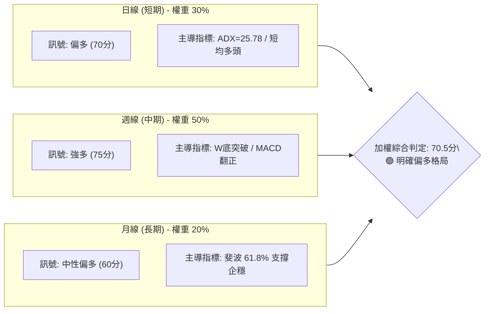

### ⚖️ 多時框收斂結論

依據多時框收斂規則（規則 14）：
1. **趨勢/盤整判定**：日線 **ADX(14) = 25.78 > 25**，且 +DI (26.78) 大幅領先 -DI (18.04)，確立當前市場處於**強趨勢行情**（非盤整無序震盪）。
2. **主導時框收斂**：在趨勢行情下，以**中期週線（MA50 $13.94 向上、W底完成）**為戰略方向主導，日線短期的均線糾纏與量縮僅視為尋找精確進場點的微觀結構。
3. **唯一方向性結論**：**偏多進攻（Bullish Expansion）**。日、週、月三時框無任何實質背離衝突，共振向上。

---

## 8. 交易策略建議

### 🗺️ 策略決策流程圖

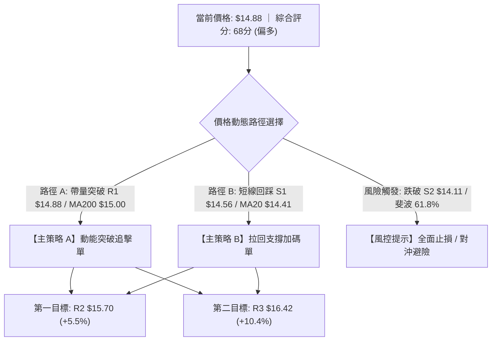

### 🧭 策略路由（依評分卡分流）

> **當前主策略方向 = 🟢 強勢做多（依綜合評分 68/100，大於 60 門檻，主推多頭策略）**

### 🎯 價格情境階梯（Price Scenarios）

*（所有價位嚴格引用關鍵價位數據）*

| 觸發條件 | 核心觀察價位 | 下一目標價位 | 後續延伸目標 | 情境技術含義與市場行為 |
|:--------:|:------------:|:------------:|:------------:|------------------------|
| **強勢突破** | 收盤站穩 **R1: $14.88** 及 MA200 **$15.00** | **R2: $15.70** | **R3: $16.42** | 突破年線壓制，空頭停損引發波段加速上行 |
| **區間蓄勢** | 運行於 **S1: $14.56** 至 **R1: $14.88** | **$15.09** (斐波50%) | **$15.40** (布林上軌) | 多頭在年線下方進行籌碼沉澱換手 |
| **深度回踩** | 跌破 **S1: $14.56**，守住 **S2: $14.11** | **S1: $14.56** | **R1: $14.88** | 測試斐波 61.8% 強支撐，提供第二進場點 |
| **轉弱破位** | 跌破 **S2: $14.11** | **S3: $13.41** | **$11.97** (前低) | 中期多頭反彈結構破壞，轉為弱勢探底 |

### 📊 情境機率分佈

| 預測情境 | 發生機率 | 主要技術與量化指標依據 |
|:--------:|:--------:|------------------------|
| **情境一：強勢向上突破 (突破 R1/MA200)** | **65%** | ADX=25.78 確立強趨勢；MACD 柱狀圖 (+0.052) 持續放大；OBV > MA 資金持續淨流入；週線連 3 陽形成 W 底突破。 |
| **情境二：窄幅震盪蓄勢 ($14.56 - $14.88)** | **25%** | 最新日量 47.69M（量比 0.73x）偏低，需 1-2 日籌碼換手補量；布林通道 %B = 0.74 處於蓄勢區。 |
| **情境三：深度回落再探底 (跌破 S2 $14.11)** | **10%** | 52 週低點聚類於 $11.20-$11.97 具備極強支撐，且機構持股 82% 籌碼鎖定良好，大幅破位機率極低。 |

### 🟢 主策略詳情（多頭主推）

| 交易策略要素 | 策略 A：動能突破策略（適合積極型） | 策略 B：回踩支撐策略（適合穩健型） |
|:------------|:-----------------------------------|:-----------------------------------|
| **適用場景** | 日線收盤突破 $15.00 (MA200/R1) | 盤中拉回回測頸線支撐 S1 ($14.56) |
| **進場條件** | 突破 $15.00 且 30 分鐘成交量放大 | 回落至 $14.56 附近出現下影線止跌 |
| **精確進場價** | **$15.02** | **$14.58** |
| **第一目標價 T1** | **$15.70** (阻力位 R2, +4.53%) | **$15.70** (阻力位 R2, +7.68%) |
| **第二目標價 T2** | **$16.42** (阻力位 R3, +9.32%) | **$16.42** (阻力位 R3, +12.62%) |
| **嚴格止損價** | **$14.55** (跌破 S1 支撐位) | **$14.10** (跌破 S2 強支撐位) |
| **風險報酬比 (R:R)** | **1 : 2.98** (風險 $0.47 : 潛在獲利 $1.40) | **1 : 3.83** (風險 $0.48 : 潛在獲利 $1.84) |
| **模型預估成功率** | **65%** | **70%** |
| **建議配置倉位** | 總資金之 **15% - 20%** | 總資金之 **20% - 25%** |

### 🔴 反向風險觸發點（對沖與風控提示）

- **多頭結構失效警告點**：當日線收盤價跌破 **S1: $14.56**，多頭應將倉位減半。
- **全面停損／反手對沖觸發點**：若價格帶量跌破 **S2: $14.11**（斐波 61.8% 與強支撐聚類），宣告雙底反彈形態徹底失敗，應全面清倉多單，保守者可買入對應 Put 進行避險。

### ⭐ 整體訊號強度評星

```
╔══════════════════════════════════════════════════════════════════╗
║                     整體技術訊號強度評星                         ║
╠══════════════════════════════════════════════════════════════════╣
║ 做多訊號強度：★★★★☆  (4.0/5.0 星) ── 均線動能齊備，形態突破在即  ║
║ 做空訊號強度：★☆☆☆☆  (1.0/5.0 星) ── 趨勢向上，逆勢做空風險極高  ║
║ 整體可信度：  ★★★★☆  (4.2/5.0 星) ── ADX>25 趨勢明確，多時框共振  ║
╚══════════════════════════════════════════════════════════════════╝
```

---

## 9. 風險提示與監控

### ✅ 關鍵監控指標 Checklist

```
╔══════════════════════════════════════════════════════════════════╗
║                   每日交易關鍵監控清單 (Checklist)               ║
╠══════════════════════════════════════════════════════════════════╣
║ [ ] 價格是否有效收復並站穩 MA200 ($15.00) 整數關卡              ║
║ [ ] 日成交量是否放大至 20 日均量 (65.22M) 以上配合突破          ║
║ [ ] RSI(14) 是否持續維持在 55-70 之健康推升區間                  ║
║ [ ] MACD 柱狀圖是否持續維持在正值區 (>0.000)                     ║
║ [ ] S1 支撐位 ($14.56) 是否在盤中回測時發揮強勁支撐力道          ║
║ [ ] ADX(14) 數值是否維持在 25 以上，且 +DI 保持大於 -DI          ║
║ [ ] 布林通道 %B 是否維持在 0.70 以上向上擴張                     ║
╚══════════════════════════════════════════════════════════════════╝
```

### ⚠️ 風險場景分析

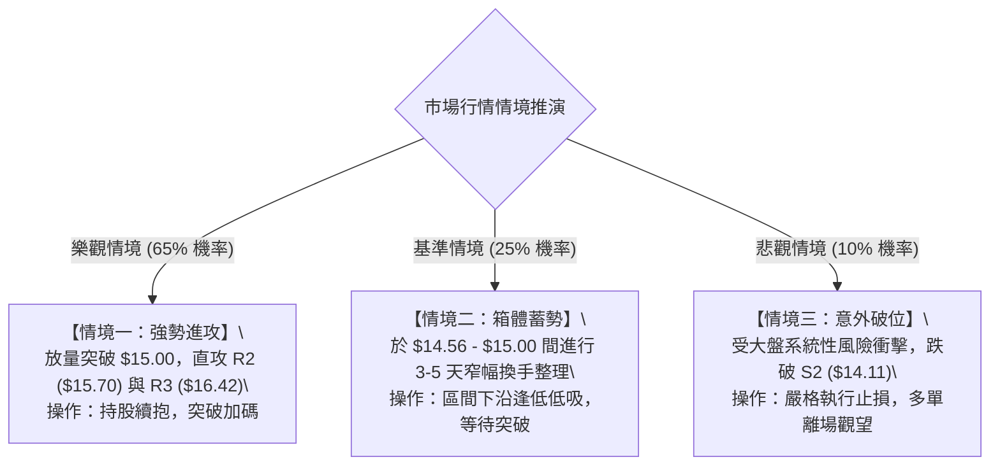

### 🛡️ 風險管理重要提醒

1. **年線心理關卡壓制**：現價 $14.88 距 MA200 ($15.00) 僅一步之遙，年線附近常有解套盤與短線獲利盤震盪，**切忌在未放量前盲目重倉追高**，應分批進場。
2. **成交量驗證關鍵**：目前日成交量（47.69M）低於 20 日均量（65.22M），突破 $15.00 時必須觀察量能是否放大，若出現縮量假突破需提高警惕。
3. **嚴格執行資金管理**：單筆交易最大虧損風險不得超過總資金的 **1.5% - 2.0%**。以策略 B（進場 $14.58，止損 $14.10，每股風險 $0.48）為例，10 萬美元帳戶之最大虧損控制在 1,500 美元以內，建議最大持股股數為 3,125 股（約佔總資產 45% 倉位以內）。

---

## 📋 報告總結

```
╔══════════════════════════════════════════════════════════════════╗
║                    NU 技術分析報告總結                          ║
╠══════════════════════════════════════════════════════════════════╣
║ 報告日期：2026-08-28                                            ║
║ 當前價格：$14.88                                                 ║
║ 技術評級：🟢 偏多偏強 (Bullish Bias ｜ 評分 68/100)               ║
╠══════════════════════════════════════════════════════════════════╣
║ 關鍵結論：                                                       ║
║ ├─ 長期趨勢：🟡 中性修復（斐波 61.8% $14.17 築底完成）          ║
║ ├─ 中期趨勢：🟢 偏多回升（W底突破回踩確認，週 MACD 翻正）       ║
║ ├─ 短期趨勢：🟢 強勢進攻（ADX=25.78 強趨勢，逼近 MA200 $15.00）║
║ ├─ 關鍵支撐：S1: $14.56 ｜ S2: $14.11 ｜ S3: $13.41              ║
║ ├─ 關鍵阻力：R1: $14.88 ｜ R2: $15.70 ｜ R3: $16.42              ║
║ └─ 分析師目標價：均價 $18.78 (最高 $23.00 ｜ 最低 $10.00)       ║
╠══════════════════════════════════════════════════════════════════╣
║ 最優策略組合：                                                   ║
║ 1. 🥇 最佳機會：回踩 S1 ($14.56 - $14.58) 佈局多單 (R:R = 1:3.83)║
║ 2. 🥈 次選機會：放量突破 MA200 ($15.00) 順勢追多，目標 R2 ($15.70)║
║ 3. 🥉 風控底線：收盤跌破 S2 ($14.11) 嚴格停損離場                ║
╚══════════════════════════════════════════════════════════════════╝
```

---

> ⚠️ **免責聲明**：本報告為技術分析研究，所有數據、圖表及價位推算均基於歷史量價數據。本報告**僅供學術研究與投資參考**，**不構成任何形式的個人化投資建議**。金融市場具有高度風險，交易者應獨立判斷並自負盈虧。

---

*報告生成時間：2026-08-28 ｜ 數據來源：Yahoo Finance ｜ 分析框架：多時框量化技術分析體系*