# NU 技術分析報告

> **報告日期**：2026-08-30 ｜ **語言**：繁體中文 ｜ **數據來源**：Yahoo Finance ｜ **當前價格**：$14.30

---

## 目錄

| 章節 | 內容 |
|------|------|
| [1. 技術面概覽](#1-技術面概覽) | 訊號儀表板、核心指標、評分卡 |
| [2. 趨勢分析](#2-趨勢分析) | 多時框趨勢、長中短期走勢 |
| [3. 圖表形態分析](#3-圖表形態分析) | 形態識別、K線組合、目標價 |
| [4. 支撐與阻力](#4-支撐與阻力) | 關鍵價位、斐波那契回調 |
| [5. 技術指標深度解讀](#5-技術指標深度解讀) | MA/RSI/MACD/布林/成交量 |
| [6. 動能與波動率](#6-動能與波動率) | 動能評估、ATR、Beta |
| [7. 多時框架總結](#7-多時框架總結) | 時框架評分矩陣 |
| [8. 交易策略建議](#8-交易策略建議) | 多空策略、風險報酬比 |
| [9. 風險提示與監控](#9-風險提示與監控) | 監控指標、風險場景 |

---

## 1. 技術面概覽

### 🎯 技術訊號儀表板

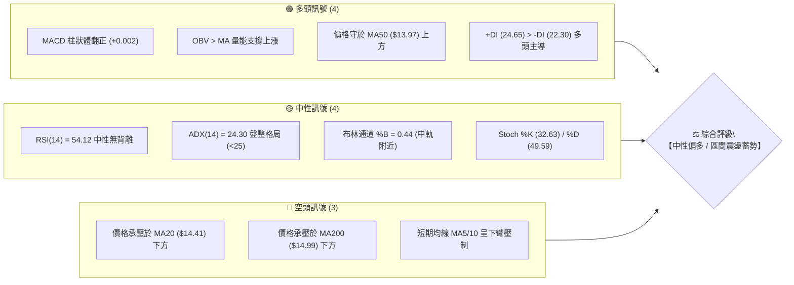

### 📊 核心指標速覽表

| 指標類別 | 指標名稱 | 當前數值 | 訊號 | 解讀 |
|:---|:---|:---|:---:|:---|
| **價格** | 當前價格 | $14.30 | 🟡 | 位於52週區間 39.8%，處於中低檔震盪築底階段 |
| **均線** | MA20 (月線) | $14.41 | 🔴 | 現價位於 MA20 下方 -0.76%，短線面臨中軌反壓 |
| **均線** | MA50 (季線) | $13.97 | 🟢 | 現價位於 MA50 上方 +2.36%，中期波段具備支撐 |
| **均線** | MA200 (年線) | $14.99 | 🔴 | 現價位於 MA200 下方 -4.60%，長期多空分水嶺承壓 |
| **動能** | RSI(14) | 54.12 | 🟡 | 處於 30–70 中性強弱區間，未出現超買或超賣 |
| **動能** | MACD (12,26,9) | 0.227 / 0.225 | 🟢 | DIF 線維持於 Signal 線上方，柱狀體翻正 (+0.002) |
| **趨勢** | ADX(14) | 24.30 | 🟡 | ADX < 25 表明處於弱趨勢／箱體盤整，非單邊行情 |
| **通道** | 布林帶 (%B) | 0.44 | 🟡 | 位於中軌 ($14.41) 與下軌 ($13.42) 之間，波動收縮 |
| **量能** | 成交量 / 20日均量 | 1.18x | 🟢 | 日成交 79.13M，量能略高於均量，OBV 趨勢支撐向上 |
| **波動** | ATR(14) | $0.72 | 🟡 | 每日平均震幅約 5.06%，波動適中，提供操作空間 |

### 🏆 技術評分卡

```
╔══════════════════════════════════════════════════════════════╗
║              技術評分卡 — NU (2026-08-30)                    ║
╠══════════════════════════════════════════════════════════════╣
║ 趨勢強度      ████████░░░░░░░░░░░░  42/100  🟡 弱趨勢/區間盤整║
║ 動能指標      ████████████░░░░░░░░  58/100  🟢 MACD金叉/RSI中性║
║ 支撐穩定度    ██████████████░░░░░░  68/100  🟢 MA50及S1雙重防線║
║ 成交量配合    ████████████░░░░░░░░  62/100  🟢 量能擴增/OBV向上║
║ 形態完整度    ██████████░░░░░░░░░░  52/100  🟡 區間箱體構築中 ║
║ 均線排列      ████████░░░░░░░░░░░░  44/100  🔴 均線糾結混合排列║
╠══════════════════════════════════════════════════════════════╣
║ 綜合評分      ███████████░░░░░░░░░  54.3/100 🟡 中性偏多區間操作║
╚══════════════════════════════════════════════════════════════╝
```

---

## 2. 趨勢分析

### 🌐 多時框趨勢分析

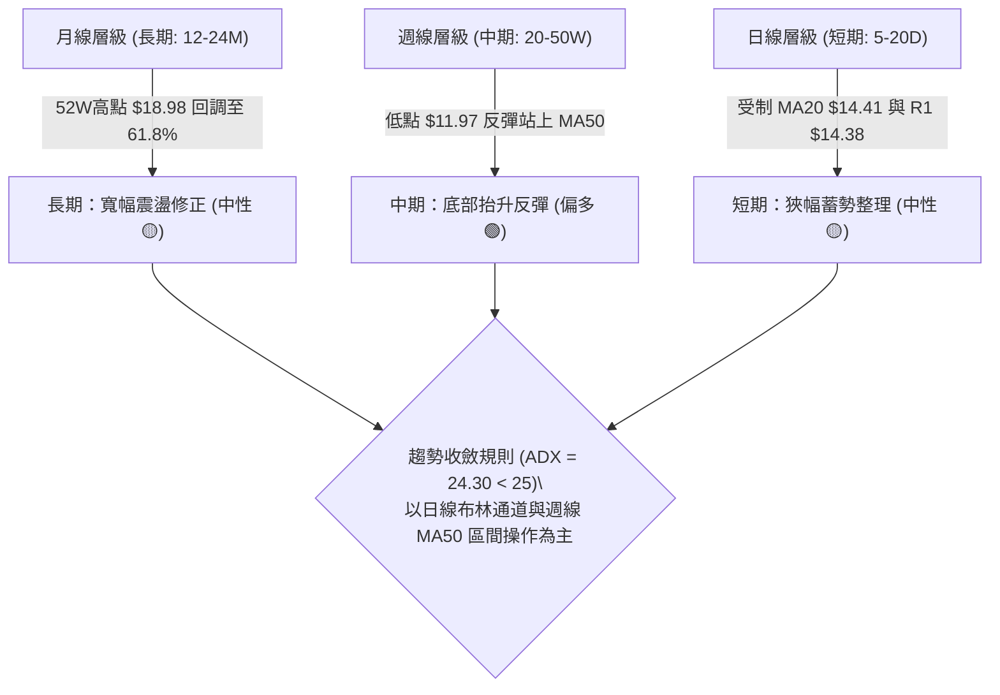

### 📈 長期趨勢 — 12個月走勢圖（Unicode）

```
NU 月線走勢圖（2025-08 至 2026-08）
價格軸 ($)
$18.00 ┤                             ● (2026-01: $17.75)
$17.00 ┤                     ●       │
$16.00 ┤             ●   ●   │       │
$15.00 ┤     ●       │   │   │       │   ● (2026-02: $14.98)
$14.00 ┤     │       │   │   │       │   │       ●   ●       ●   ● (現價 $14.30)
$13.00 ┤     │       │   │   │       │   │       │   │   ●   │   │   │
$12.00 ┤     │       │   │   │       │   │       │   │   │   │   │   │
$11.00 ┤     │       │   │   │       │   │       │   │   │   │   │   │
       └─────┴───────┴───┴───┴───────┴───┴───────┴───┴───┴───┴───┴───┴───
            08      09  10  11      12  01      02  03  04  05  06  07  08
           (2025)                      (2026)
```

#### 走勢特徵分析表格

| 階段 | 時間區間 | 收盤價區間 | 走勢特徵 | 關鍵技術事件 |
|:---|:---|:---|:---|:---|
| **第一階段：多頭推升** | 2025-08 ~ 2026-01 | $14.80 → $17.75 | 階梯式多頭上攻 (+19.9%) | 創下波段高點 $17.75，逼近52W高點 $18.98 |
| **第二階段：中期回撤** | 2026-02 ~ 2026-05 | $17.75 → $13.13 | 震盪回落尋求支撐 (-26.0%) | 跌破多條短均線，於斐波那契 61.8% ($14.17) 處震盪 |
| **第三階段：築底復甦** | 2026-06 ~ 2026-08 | $13.36 → $14.30 | 底部抬升，量能溫和回溫 | 探低後回升至 $14.30，於 MA50 ($13.97) 上方築底 |

### 📊 中期趨勢（週線分析）

近20週數據顯示，NU 於 2026年6月初落入低點（週收盤 $11.97），隨後展現穩定的底部抬升結構：
- **低點抬升**：$11.97 (06-07) → $12.19 (06-14) → $12.71 (06-21) → $13.59 (07-19) → $13.84 (08-09)。
- **動能修復**：週線 RSI 由 5月超賣區的 20.8 顯著修復至目前的 54.1，顯示中期賣壓已出清。
- **均線支撐**：目前收盤價 $14.30 已站回 MA60 ($13.67) 與 MA50 ($13.97) 之上，唯上方 MA200 ($14.99) 仍構成波段反壓。

### ⚡ 趨勢強度評估（ADX 解讀）

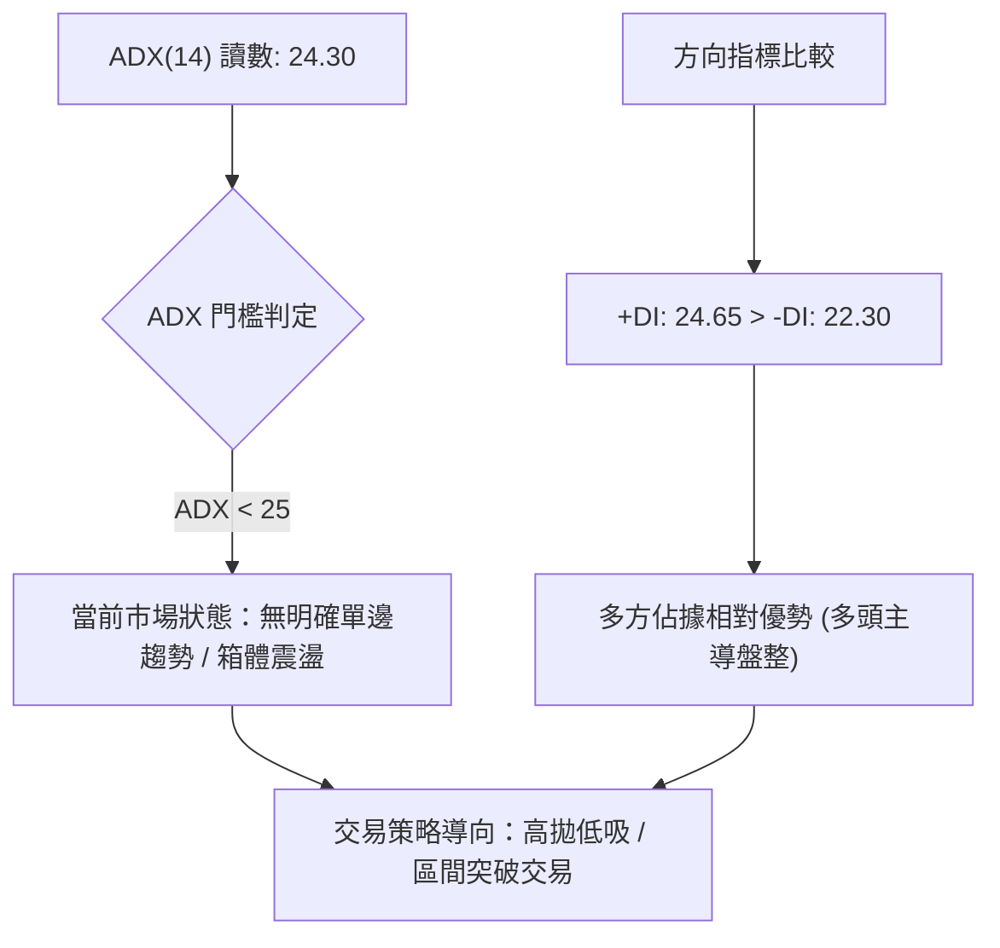

| 指標名稱 | 數值 | 狀態區間 | 技術意義 |
|:---|:---:|:---:|:---|
| **ADX(14)** | **24.30** | 弱趨勢 / 盤整 (<25) | 趨勢強度尚未爆發，單邊突破前以區間震盪對待 |
| **+DI (14)** | **24.65** | 多方進攻線 | 數值高於 -DI，顯示多方買盤略佔上風 |
| **-DI (14)** | **22.30** | 空方防守線 | 空方力量衰退，未見顯著拋壓 |
| **DI 差值** | **+2.35** | 偏多格局 | 多空拉鋸，等待 ADX 向上穿越 25 觸發趨勢行情 |

---

## 3. 圖表形態分析

### 🔍 形態識別系統

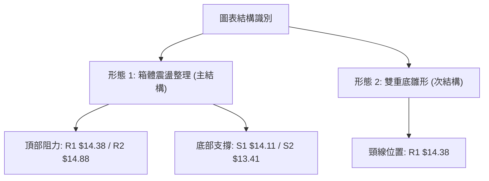

#### 形態信心度評估表

| 形態名稱 | 信心度 | 判斷依據（引用數據） | 完成度 | 目標價（附精確計算式） |
|:---|:---:|:---|:---:|:---|
| **箱體震盪整理** | **78%** | 價格受限於布林帶上軌 $15.39 與下軌 $13.42，且 ADX=24.30 表明盤整 | 85% | 區間上沿 R2: **$14.88**；下沿 S2: **$13.41** |
| **雙重底雛形** | **58%** | 2026-05底收盤 $13.13 與 2026-06底收盤 $13.36 形成抬高雙底 | 65% | 突破頸線 R1 $14.38 + 形態高度($14.38 - $13.13 = $1.25) = **$15.63** (接近 R3 **$15.70**) |
| **均線三角形收斂** | **52%** | 短期 MA5/10/20 糾結於 $14.41–$14.85，下方受 MA50 $13.97 托底 | 70% | 收斂向上突破目標 = R2 **$14.88** |

### 🕯️ 重要K線形態分析

| 週期/月份 | 收盤價 | K線形態 | 解讀 | 訊號 |
|:---|:---:|:---|:---|:---:|
| **2026-05** | $13.13 | 長下影破底洗盤線 | 測試 52W 低點 $11.20 延伸支撐後獲買盤承接 | 🟢 築底訊號 |
| **2026-06** | $13.36 | 低檔紅K孕線 | 價格未創新低，量能收縮，賣壓竭盡 | 🟢 止跌確認 |
| **2026-07** | $14.33 | 中陽實體突破線 | 帶量突破 MA50，確立中期反彈動能 | 🟢 轉強突破 |
| **2026-08 (當前)** | $14.30 | 窄幅十字收斂星 | 於 MA20 ($14.41) 與斐波那契 61.8% ($14.17) 間整理 | 🟡 多空蓄勢 |

### 📉 ASCII 走勢形態示意圖

```
NU 日線/週線形態結構示意圖
價格 ($)
$15.70 ┼───────────────────────────────────────────── 阻力 R3 / 形態理論目標
       │
$14.88 ┼───────────────────╭─╮──────────────────────── 阻力 R2 / 2026-02平台高點
       │                 ╭╯ │
$14.41 ┼─ 頸線 R1 $14.38 ─╭╯  ╰╮  ╭─ MA20 中軌反壓
$14.30 ┼───────────────●──╯   ╰──●◄──── 現價 $14.30（蓄勢突破）
$14.11 ┼──────────────╭╯         ╰╮─────── 支撐 S1 / 斐波 61.8% ($14.17)
       │            ╭╯           ╰╮
$13.41 ┼─ 底部1 ───╭╯             ╰─── 底部2 ─── 支撐 S2 / 布林下軌 $13.42
       │         ╭╯                    ($13.36)
$13.09 ┼────────● ($13.13)───────────────────── 支撐 S3
       └─────────────────────────────────────────
```

### 🎯 形態目標價計算

1. **箱體突破目標價**：
   - 箱體下軌：$13.41 (S2)
   - 箱體上軌（頸線）：$14.38 (R1)
   - 箱體垂直高度：$14.38 - $13.41 = $0.97
   - 向上突破測幅目標：$14.38 + $0.97 = **$15.35**（緊鄰布林上軌 **$15.39** 與阻力 R3 **$15.70** 前哨）。
2. **保守波段目標價**：直接對齊歷史密集聚類阻力位 **$14.88 (R2)** 與 **$15.70 (R3)**。

---

## 4. 支撐與阻力

### 🗺️ 關鍵價位分布圖（Unicode）

```
╔══════════════════════════════════════════════════════════════╗
║                   NU 關鍵價位分佈結構圖                      ║
╠══════════════════════════════════════════════════════════════╣
║ $18.98 ║██████████████████████████████║ 52週最高點 (0.0%)    ║
║ $17.14 ║████████████████████          ║ 斐波那契 23.6% 回調  ║
║ $16.01 ║██████████████████████        ║ 斐波那契 38.2% 回調  ║
║ $15.70 ║████████████████████████████  ║ 強阻力位 R3 (+9.76%) ║
║ $15.09 ║██████████████████            ║ 斐波那契 50.0% / MA200║
║ $14.88 ║████████████████████          ║ 波段阻力 R2 (+4.07%) ║
║ $14.38 ║██████████████████████████████║ 關鍵阻力 R1 (+0.56%) ║
║ $14.30 ╠══════════════════════════════╣ ◄── 當前市價 ($14.30) ║
║ $14.17 ║▓▓▓▓▓▓▓▓▓▓▓▓▓▓▓▓▓▓▓▓▓▓▓▓▓▓▓▓▓▓║ 斐波那契 61.8% 核心區║
║ $14.11 ║▓▓▓▓▓▓▓▓▓▓▓▓▓▓▓▓▓▓▓▓▓▓        ║ 近期支撐 S1 (-1.36%) ║
║ $13.97 ║▓▓▓▓▓▓▓▓▓▓▓▓▓▓▓▓▓▓▓▓          ║ MA50 季線關鍵防線    ║
║ $13.41 ║██████████████████████████████║ 強支撐位 S2 (-6.22%) ║
║ $13.09 ║████████████████████          ║ 區間防守 S3 (-8.50%) ║
║ $11.20 ║██████████████████████████████║ 52週最低點 (100.0%)  ║
╚══════════════════════════════════════════════════════════════╝
```

### 🚧 阻力位分析表

| 阻力級別 | 價位 | 形成原因 | 突破難度 | 重要性 |
|:---|:---:|:---|:---:|:---:|
| **R1 (關鍵阻力)** | **$14.38** | 近一年波段高點聚類、貼近日線 MA20 ($14.41) | 中等 | 🟢🟢🟢 極高 (短線轉強閥值) |
| **R2 (波段阻力)** | **$14.88** | 2026年2月與8月中旬反彈高點聚類、臨近 MA200 ($14.99) | 較高 | 🟢🟢 很高 (波段目標) |
| **R3 (強阻力位)** | **$15.70** | 近一年大型密集成交套牢區、接近布林上軌 | 很高 | 🟢🟢 核心壓力 (中期多空翻轉點) |

### 🛡️ 支撐位分析表

| 支撐級別 | 價位 | 形成原因 | 守住機率 | 重要性 |
|:---|:---:|:---|:---:|:---:|
| **S1 (近期支撐)** | **$14.11** | 近期回踩低點聚類、緊鄰斐波那契 61.8% ($14.17) | 75% | 🟢🟢🟢 極高 (短期防守底線) |
| **S2 (強支撐位)** | **$13.41** | 6月低檔整理平台、布林通道下軌 ($13.42) 重合區 | 85% | 🟢🟢🟢 關鍵防線 (波段安全墊) |
| **S3 (深層支撐)** | **$13.09** | 5月波段起漲低點聚類、52週低點前最後一道防線 | 92% | 🟢🟢 極強支撐 (中長線進場點) |

### 📐 斐波那契回調位分析

依據 52 週波動區間（高點 **$18.98** → 低點 **$11.20**，垂直波動空間 **$7.78**）計算之精確回調位：

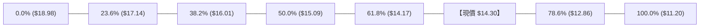

- **當前位置解讀**：現價 **$14.30** 精確運行於 **50.0% ($15.09)** 與 **61.8% ($14.17)** 黃金分割區間內。
- **技術意涵**：在道氏理論與斐波那契架構中，回調至 61.8% 處通常為多頭回撤的「黃金支撐位」。NU 現價守於 $14.17 之上，並在 $14.11 (S1) 展現支撐聚類，表明自 $18.98 的回調已被多方有效承接，正在進行結構性修復。

---

## 5. 技術指標深度解讀

### 🎛️ 指標訊號總覽

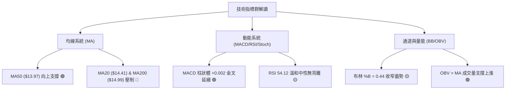

### 📈 移動平均線排列分析

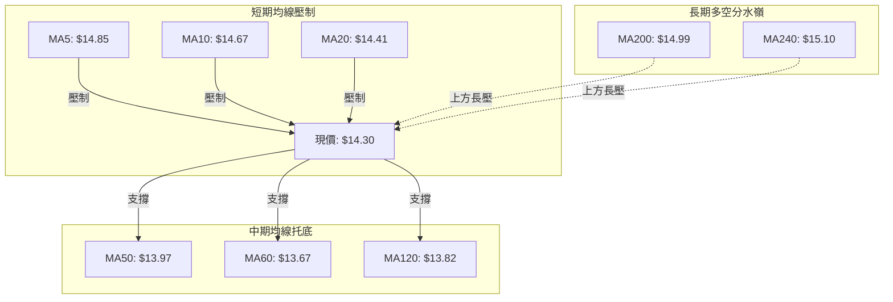

| 週期 | 均線數值 | 現價偏離度 | 排列狀態 | 走勢趨勢解讀 |
|:---|:---:|:---:|:---:|:---|
| **MA 5** | $14.85 | -3.70% | 下方 🔴 | 短線急跌後壓制，需放量收復 |
| **MA 10** | $14.67 | -2.55% | 下方 🔴 | 短期防線下移，構成第一層動態阻力 |
| **MA 20** | $14.41 | -0.76% | 下方 🔴 | 月線反壓，突破後將帶動短均線金叉 |
| **MA 50** | $13.97 | +2.36% | 上方 🟢 | 季線穩健上行，發揮強大波段托底作用 |
| **MA 60** | $13.67 | +4.64% | 上方 🟢 | 中期多頭基石，連續多週未跌破 |
| **MA 120** | $13.82 | +3.50% | 上方 🟢 | 半年線走平回升，多空轉換過渡中 |
| **MA 200** | $14.99 | -4.60% | 下方 🔴 | 牛熊分界線，突破 $14.99 將確立長期牛市回歸 |

### 📉 RSI(14) 分析

- **當前讀數**：**54.12**
- **進度條展示**：
  ```
  超賣 (0)                      中軸 (50)           超買 (100)
  ├───┼───┼───┼───┼───┼───┼───┼───┼───█───┼───┼───┼───┼───┤
  0  10  20  30  40  50      ▲     70  80  90 100
                          54.12
  ```
- **背離分析**：
  - **日線/週線背離檢驗**：RSI 讀數 54.12 與價格走勢保持同步。在 5月低點 ($11.97/$13.13) 時 RSI 為 20.8，隨後價格震盪抬升至 $14.30，RSI 亦回升至 54.12，**未出現頂背離或底背離**。
  - **結論**：指標處於健康中性常態區，既無超買獲利了結壓力，亦無超賣恐慌拋售，後續具備充足的上攻動能空間。

### 📊 MACD(12,26,9) 訊號解讀

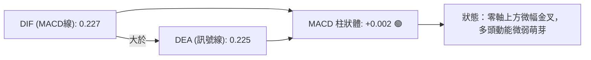

- **數值狀態**：DIF (0.227) > DEA (0.225)，柱狀體讀數為 **+0.002**。
- **背離檢驗**：MACD 自 8月中旬回調後於零軸上方止跌重新微幅翻紅，柱狀體維持在正值區間，**無頂背離現象**，確認多頭動能架構未被破壞。

### 📦 布林通道分析

```
NU 布林通道 (BB 20, 2) 結構圖
價格 ($)
$15.39 ┼──────────────────────────────── 上軌 (Upper Band)
       │
$14.41 ┼──────────────────────────────── 中軌 (MA20 SMA)
$14.30 ┼───────────────● ◄─────────────── 現價 ($14.30，位於中下軌區間，%B = 0.44)
       │
$13.42 ┼──────────────────────────────── 下軌 (Lower Band)
       └────────────────────────────────
```

- **通道帶寬**：上軌 **$15.39**，下軌 **$13.42**，帶寬約 13.7%，處於歷史收縮區。
- **%B 指標解讀**：**%B = 0.44**，價格緊貼中軌下方蓄勢。根據布林通道收口特性，窄幅震盪預示即將迎來方向性選擇，若放量站上中軌 $14.41，將向上軌 $15.39 發起衝擊。

### 💹 成交量分析（量價配合度）

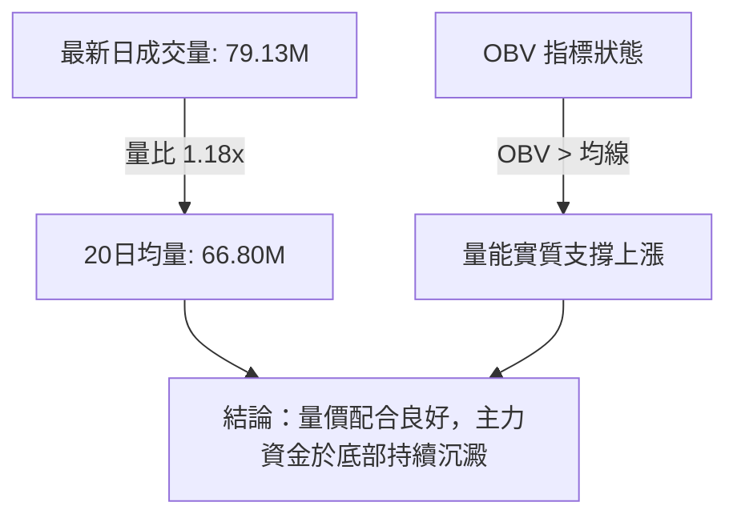

- **成交量對比**：最新成交量 79,130,400 股，相較 20 日均量 66,795,485 股呈現溫和放大（量比 1.18x）。
- **OBV 能量潮**：OBV 線持續運行於其均線之上，表明籌碼由散戶流向機構（機構持股高達 82.0%），成交量有效確認了 $13.97–$14.11 區間的支撐強度。

---

## 6. 動能與波動率

### ⚡ 動能評估四象限

| 象限 | 動能強度 (Momentum) | 波動率 (Volatility) | 當前狀態 | 交易策略指導 |
|:---:|:---:|:---:|:---:|:---|
| **Q1** | 強 (High) | 低 (Low) | - | 穩健單邊牛市，順勢加碼 |
| **Q2** | **弱 / 中性 (Neutral)** | **低 / 適中 (Moderate)** | **✓ (NU 當前象限)** | **區間震盪整理，布林軌道高拋低吸** |
| **Q3** | 強 (High) | 高 (High) | - | 突破加速期，高風險高回報 |
| **Q4** | 弱 (Low) | 高 (High) | - | 恐慌拋售期，嚴格觀望防守 |

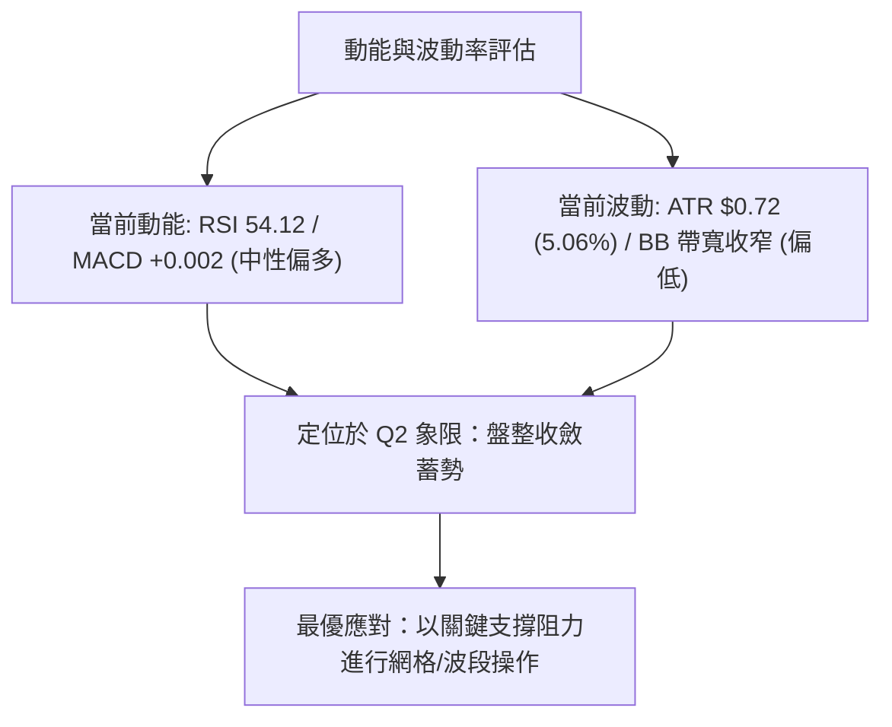

### 📊 ATR 波動率分析

- **ATR(14) 數值**：**$0.72**（佔現價 5.06%）。
- **止損距離建議**：
  - **短線交易（1.0 × ATR）**：安全止損緩衝距離為 $0.72，對應進場防守位。
  - **波段交易（1.5 × ATR）**：安全止損緩衝距離為 $1.08。
  - **實戰應用**：若於 $14.11 (S1) 附近進場，止損設置於 $13.41 (S2) 下方，間距約 $0.70–$0.90，完美符合 1.0–1.25 倍 ATR 範疇，兼顧風控與防震盪洗盤。

### 📐 Beta 與市場相關性

- **Beta 係數**：**0.942**
- **市場屬性分析**：Beta 略低於 1.00，顯示 NU 走勢與美股大盤（S&P 500）具備高度同步性，但波動幅度略微溫和。在系統性大盤震盪時具備一定防禦性，個股走勢高度依賴自身基本面催化與技術面關鍵位突破。

---

## 7. 多時框架總結

### 📋 時框架評分表

| 時框架 | 趨勢方向 | 動能狀態 | 均線排列 | 形態結構 | 綜合評分 | 操作建議 |
|:---|:---:|:---:|:---:|:---:|:---:|:---|
| **日線 (Daily)** | 🟡 橫向盤整 | MACD微幅金叉 / RSI 54.12 | 混合糾結 (承壓MA20) | 箱體整理 (%B=0.44) | **52/100** | 區間操作，靜待突破 |
| **週線 (Weekly)** | 🟢 震盪走高 | RSI自低檔回升至54 / 柱狀體翻正 | 站上 MA50/60，承壓 MA200 | 底部抬升抬高雙底 | **62/100** | 波段偏多，逢低佈局 |
| **月線 (Monthly)** | 🟡 寬幅拉回 | 處於歷史中位區間 | 守於長期均線上 | 52W區間 39.8% 處築底 | **56/100** | 長線中性偏多，分批建倉 |

### 🔲 綜合訊號矩陣

```
╔══════════════════════════════════════════════════════════════╗
║               多時框架綜合訊號矩陣                           ║
╠══════════════╦══════════════╦══════════════╦═════════════════╣
║ 維度         ║ 短期 (日線)  ║ 中期 (週線)  ║ 長期 (月線)     ║
╠══════════════╬══════════════╬══════════════╬═════════════════╣
║ 趨勢方向     ║ 🟡 橫盤蓄勢  ║ 🟢 溫和多頭  ║ 🟡 寬幅震盪     ║
║ 動能指標     ║ 🟢 MACD金叉  ║ 🟢 動能修復  ║ 🟡 均值回歸     ║
║ 支撐阻力結構 ║ 承壓 R1/MA20 ║ 守穩 S1/MA50 ║ 守穩 61.8% 斐波 ║
║ 量能配合度   ║ 🟢 量比 1.18x║ 🟢 OBV向上   ║ 🟢 機構持股 82% ║
╚══════════════╩══════════════╩══════════════╩═════════════════╝
```

### ⚖️ 多時框收斂結論

依據多時框收斂法則：
1. **當前趨勢判定**：ADX(14) 讀數為 **24.30 (<25)**，明確定義當前處於**盤整收斂行情**而非單邊趨勢行情。
2. **主導時框權重**：盤整市況下，以**日線布林通道 ($13.42–$15.39)** 為主要震盪交易邊界，並以**週線 MA50 ($13.97)** 及**斐波那契 61.8% ($14.17)** 作為波段多空防守基石。
3. **唯一方向性結論**：**【中性偏多，區間震盪蓄勢】**。短期因承壓於 MA20 ($14.41) 與 R1 ($14.38)，將維持在 $14.11–$14.88 區間內進行籌碼換手；但中期受 MA50 與雙重底雛形支撐，向上突破機率顯著大於向下破位。

---

## 8. 交易策略建議

### 🗺️ 策略決策流程圖

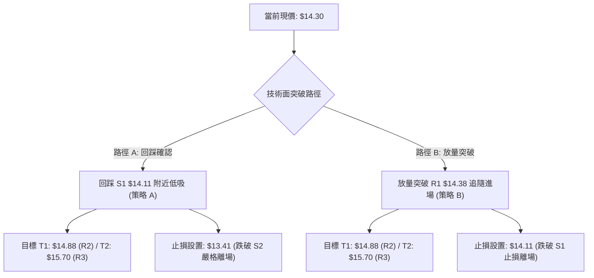

### 🧭 策略路由

> **當前主策略方向 = 中性偏多區間操作（綜合評分 54.3/100，介於 40–60 區間）**
> *操作策略以「區間下沿低吸」為主、「向上突破加碼」為輔，嚴格圍繞關鍵支撐阻力執行。*

### 🎯 價格情境階梯（Price Scenarios）

| 觸發條件 | 第一目標 | 第二延伸目標 | 情境技術含義 |
|:---|:---:|:---:|:---|
| **放量突破 R1 ($14.38)** | **R2 ($14.88)** | **R3 ($15.70)** | 站上日線 MA20 與頸線，短線全面轉強，挑戰 MA200 |
| **維持於現價區間 ($14.11–$14.38)** | — | — | 布林通道內縮量窄幅震盪，沉澱均線乖離率 |
| **有效跌破 S1 ($14.11)** | **S2 ($13.41)** | **S3 ($13.09)** | 考驗 MA50 ($13.97) 及布林下軌，中期走勢轉弱重回築底 |

### 📊 情境機率分佈

| 運行情境 | 預估機率 | 主要技術依據 |
|:---|:---:|:---|
| **向上反彈 / 突破上攻** | **50%** | MACD 柱狀體翻正 (+0.002)、OBV 走高、守於 MA50 ($13.97) 上方 |
| **箱體區間震盪** | **35%** | ADX = 24.30 (<25) 顯示無單邊動能、布林通道帶寬收窄蓄勢 |
| **向下回落 / 跌破防線** | **15%** | 短期 MA5/10/20 壓制，若跌破斐波 61.8% ($14.17) 則引發技術停損 |

### 🟢 主策略詳情

| 策略要素 | 策略 A（區間下沿低吸 — 穩健型） | 策略 B（突破追隨進場 — 積極型） |
|:---|:---|:---|
| **策略類型** | 支撐位回踩低吸 | 關鍵阻力放量突破 |
| **進場條件** | 價格回踩 S1 $14.11 獲得支撐且日K收陽 | 帶量突破 R1 $14.38 且日收盤站穩 |
| **進場價格** | **$14.11** | **$14.38** |
| **目標價 T1** | **$14.88** (阻力 R2，預期收益 +5.46%) | **$14.88** (阻力 R2，預期收益 +3.48%) |
| **目標價 T2** | **$15.70** (阻力 R3，預期收益 +11.27%) | **$15.70** (阻力 R3，預期收益 +9.18%) |
| **止損價格** | **$13.41** (跌破強支撐 S2) | **$14.11** (跌破近期支撐 S1) |
| **風險報酬比** | **1 : 2.27** (以 T2 計算) | **1 : 4.89** (以 T2 計算) |
| **估計勝率** | **65%** | **55%** |
| **建議倉位** | **15% – 20%** | **10% – 15%** |

### 🔴 反向風險觸發點（風控與對沖提示）

- **關鍵失效點位**：若日收盤價跌破 **$13.41 (S2)**，代表雙重底形態徹底破壞，價格將回測 **$13.09 (S3)** 甚至 52W 低點 **$11.20**。
- **對沖操作觸發**：若跌破 $13.97 (MA50)，多頭倉位應主動減半；跌破 $13.41 應全數止損離場，空方可建立輕倉空單對沖下行風險。

### ⭐ 整體訊號強度評星

```
╔══════════════════════════════════════════════════════════════╗
║ 做多訊號強度：  ★★★☆☆  (3.5/5 星 — 支撐強固，蓄勢突破)      ║
║ 做空訊號強度：  ★★☆☆☆  (2.0/5 星 — 賣壓衰竭，下行空間有限)  ║
║ 整體技術可信度：★★★★☆  (4.0/5 星 — 價位聚類清晰，量價配合)  ║
╚══════════════════════════════════════════════════════════════╝
```

---

## 9. 風險提示與監控

### ✅ 關鍵監控指標 Checklist

```
╔══════════════════════════════════════════════════════════════╗
║                   NU 每日交易監控清單                        ║
╠══════════════════════════════════════════════════════════════╣
║ [ ] 價格是否放量突破關鍵阻力 R1: $14.38                     ║
║ [ ] 價格是否守穩近期關鍵支撐 S1: $14.11 (斐波 61.8%)         ║
║ [ ] MA20 ($14.41) 中軌是否由反壓轉為支撐                     ║
║ [ ] MACD 柱狀體是否持續放大擴展 (> +0.02)                    ║
║ [ ] 日成交量是否維持於 20日均量 (66.80M) 之上               ║
║ [ ] ADX(14) 是否向上突破 25，觸發趨勢加速行情                ║
╚══════════════════════════════════════════════════════════════╝
```

### ⚠️ 風險場景分析

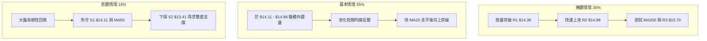

### 🛡️ 風險管理重要提醒

1. **嚴格執行資金管理**：NU 單日波動 ATR 達 $0.72 (5.06%)，單筆交易最大虧損建議控制在總資金的 1.0%–1.5% 內。
2. **警惕 MA200 長期反壓**：MA200 ($14.99) 與斐波那契 50% ($15.09) 構成強大解套賣壓帶，在該位置附近切勿盲目追高，應適度獲利了結。
3. **機構倉位變動風險**：機構持股高達 82.0%，需密切關注大宗交易與機構評級變動（近期多數給予 Buy / Outperform，共識目標價為 $18.78）。

---

## 📋 報告總結

```
╔══════════════════════════════════════════════════════════════╗
║                 NU 技術分析報告總結                          ║
╠══════════════════════════════════════════════════════════════╣
║ 報告日期：2026-08-30          當前現價：$14.30               ║
║ 分析評級：⚖️ 中性偏多區間操作 (蓄勢待發)                     ║
╠══════════════════════════════════════════════════════════════╣
║ 關鍵結論：                                                   ║
║ ├─ 長期趨勢：🟡 中性修正 (於 52W 區間 39.8% 處築底)          ║
║ ├─ 中期趨勢：🟢 震盪走高 (站穩 MA50 $13.97，底部抬升)        ║
║ ├─ 短期趨勢：🟡 箱體蓄勢 (受制 MA20 $14.41 與 R1 $14.38)    ║
║ ├─ 關鍵支撐：S1: $14.11 ｜ S2: $13.41 ｜ S3: $13.09          ║
║ ├─ 關鍵阻力：R1: $14.38 ｜ R2: $14.88 ｜ R3: $15.70          ║
║ └─ 共識目標：分析師平均目標價 $18.78 (高 $23.00 / 低 $10.00) ║
╠══════════════════════════════════════════════════════════════╣
║ 最優策略組合：                                               ║
║ 1. 🥇 最佳機會：回踩 S1 $14.11 低吸，停損設於 S2 $13.41 下方 ║
║ 2. 🥈 次選機會：放量突破 R1 $14.38 順勢進場，目標看 R2 $14.88║
║ 3. 🥉 保守選擇：等待站穩 MA200 ($14.99) 後再行波段加碼       ║
╚══════════════════════════════════════════════════════════════╝
```

---

> ⚠️ **免責聲明**：本報告為技術分析研究成果，所有數據及模型推演均基於歷史價格與成交量資訊。本報告**僅供學術研究與投資參考**，**不構成任何形式的個人化投資建議或買賣邀約**。金融市場瞬息萬變，投資人應獨立審慎評估風險並自負盈虧。

---

*報告生成時間：2026-08-30 ｜ 數據來源：Yahoo Finance ｜ 分析框架：資深多時框量化技術分析*