# NU 技術分析報告

> **報告日期**：2026-08-31 ｜ **語言**：繁體中文 ｜ **數據來源**：Yahoo Finance ｜ **當前價格**：$14.30

---

## 目錄

| 章節 | 內容 |
|------|------|
| [1. 技術面概覽](#1-技術面概覽) | 訊號儀表板、核心指標、評分卡 |
| [2. 趨勢分析](#2-趨勢分析) | 多時框趨勢、長中短期走勢、ADX 解讀 |
| [3. 圖表形態分析](#3-圖表形態分析) | 形態識別、K線組合、目標價計算 |
| [4. 支撐與阻力](#4-支撐與阻力) | 關鍵價位分佈、斐波那契回調結構 |
| [5. 技術指標深度解讀](#5-技術指標深度解讀) | MA/RSI/MACD/布林/成交量量價關係 |
| [6. 動能與波動率](#6-動能與波動率) | 動能四象限、ATR 波動度、Beta 敏感度 |
| [7. 多時框架總結](#7-多時框架總結) | 時框矩陣、收斂規則方向裁決 |
| [8. 交易策略建議](#8-交易策略建議) | 策略路由、情境階梯、進出場規劃 |
| [9. 風險提示與監控](#9-風險提示與監控) | 監控清單、極端風險場景應對 |
| [📋 報告總結](#-報告總結) | 核心結論與最佳策略配置 |

---

## 1. 技術面概覽

### 🎯 技術訊號儀表板

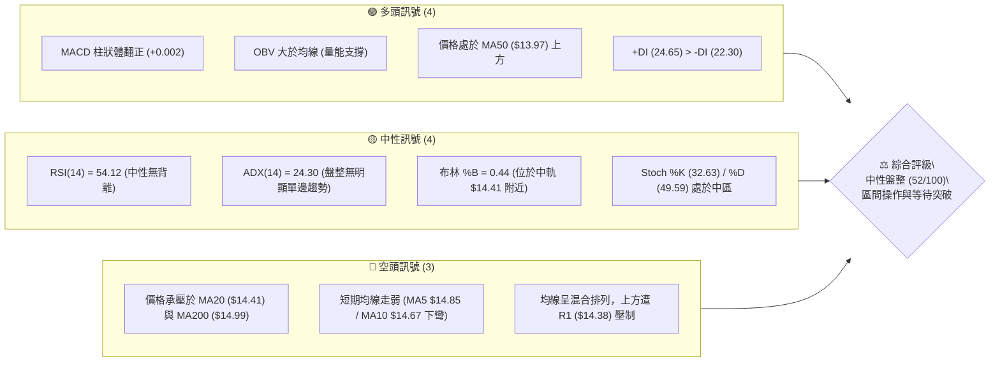

---

### 📊 核心指標速覽表

| 指標類別 | 指標名稱 | 當前數值 | 訊號 | 專業解讀 |
|:---|:---|:---:|:---:|:---|
| **價格** | 當前價格 | $14.30 | 🟡 | 位於 52 週區間 ($11.20 - $18.98) 之 39.8% 分位，緊貼斐波那契 61.8% ($14.17) |
| **均線** | MA20 (月線) | $14.41 | 🔴 | 現價位於 MA20 下方 -0.76%，短期中軌壓制明顯 |
| **均線** | MA50 (季線) | $13.97 | 🟢 | 現價高於 MA50 +2.36%，中期波段底部具有支撐動能 |
| **均線** | MA200 (年線)| $14.99 | 🔴 | 現價低於 MA200 -4.60%，長期多空分水嶺仍未收復 |
| **動能** | RSI(14) | 54.12 | 🟡 | 處於 50 軸線上方的中性平衡區，未見超買或超賣 |
| **動能** | MACD (12,26,9) | 0.227 / 0.225 | 🟢 | DIF 高於 DEA，Hist 為 +0.002 微幅看多 |
| **動能** | 隨機指標 (Stoch) | %K:32.63 / %D:49.59 | 🟡 | 震盪回落至中低位，尚未進入超賣鈍化區間 |
| **趨勢** | ADX (14) | 24.30 | 🟡 | ADX < 25 表明市場處於無方向性之區間盤整階段 |
| **通道** | 布林通道 (20,2) | $13.42 - $15.39 | 🟡 | %B 為 0.44，處於中軌 ($14.41) 與下軌之間震盪 |
| **量能** | 當日量 / 20日均量 | 79.13M / 66.80M | 🟢 | 量比 1.18x，OBV 處於均線上，量能結構支持防守反彈 |
| **波動** | ATR(14) | $0.72 | 🟡 | 每日平均真實波幅佔股價 5.06%，波動度適中 |

---

### 🏆 技術評分卡

```
╔══════════════════════════════════════════════════════════════════╗
║                   技術評分卡 — NU (2026-08-31)                   ║
╠══════════════════════════════════════════════════════════════════╣
║ 趨勢強度 (ADX/趨勢方向)  █████████░░░░░░░░░░░  45/100  🟡 弱勢盤整 ║
║ 動能指標 (RSI/MACD/KD)   ███████████░░░░░░░░░  55/100  🟢 偏多震盪 ║
║ 支撐穩定度 (S1/S2/Fib)   █████████████░░░░░░░  65/100  🟢 支撐穩固 ║
║ 成交量配合 (OBV/量比)    ████████████░░░░░░░░  60/100  🟢 量價相符 ║
║ 形態完整度 (區間構築)    ██████████░░░░░░░░░░  50/100  🟡 箱體整理 ║
║ 均線排列 (MA混合糾纏)    ████████░░░░░░░░░░░░  40/100  🔴 短均承壓 ║
╠══════════════════════════════════════════════════════════════════╣
║ 綜合技術評分             ██████████░░░░░░░░░░  52/100  🟡 中性觀望 ║
║ 核心評級結論：ADX < 25 確立盤整架構，建議以布林通道區間操作為主    ║
╚══════════════════════════════════════════════════════════════════╝
```

---

## 2. 趨勢分析

### 🌐 多時框趨勢分析

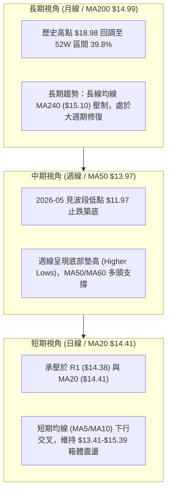

---

### 📈 長期趨勢 — 12個月走勢圖（Unicode）

```
NU 月線走勢圖（2025-09 至 2026-08）
價格 ($)
$18.00 ┤                             ● (2026-01: $17.75)
$17.00 ┤                     ●       │
$16.00 ┤     ●       ●       │       │
$15.00 ┤     │       │       │       │   ● (2026-02: $14.98)
$14.00 ┤     │       │       │       │   │   ●   ●               ●← 現價 $14.30
$13.00 ┤     │       │       │       │   │   │   │   ●   ●   ●   │
$12.00 ┤     │       │       │       │   │   │   │   │   │   │   │
$11.00 ┤     │       │       │       │   │   │   │   │   │   │   │
       └─────┬───────┬───────┬───────┬───┬───┬───┬───┬───┬───┬───┬───
           09/25   10/25   11/25   12/25 01/26 02/26 03/26 04/26 05/26 06/26 07/26 08/26
```

#### 走勢特徵分析表格

| 階段週期 | 涵蓋月份 | 區間價格變化 | 漲跌幅 | 走勢結構與形態特徵 |
|:---|:---:|:---:|:---:|:---|
| **單邊推升期** | 2025-08 ~ 2026-01 | $14.80 → $17.75 | +19.93% | 強勢多頭推進，月線五連陽，觸及 52 週高點 $18.98 區域 |
| **主跌回調期** | 2026-01 ~ 2026-05 | $17.75 → $13.13 | -26.03% | 獲利了結盤湧出，跌破 MA200，於 2026-05/06 探底至 $11.97-$12.19 |
| **底部回升期** | 2026-05 ~ 2026-07 | $13.13 → $14.33 | +9.14%  | 量能逐步釋放，站回 MA50 ($13.97)，完成右側低點構築 |
| **區間整理期** | 2026-07 ~ 2026-08 | $14.33 → $14.30 | -0.21%  | 多空在斐波那契 61.8% ($14.17) 與 MA20 ($14.41) 展開拉鋸 |

---

### 📊 中期趨勢（週線分析）

```
NU 中期週線支撐壓力結構圖
$15.70 ══════════════════════════════════════════ [R3 波段強阻力]
       ┌────────────────────────┐
$14.88 ┼─── 週線阻力帶 (MA200) ───┼────────────── [R2 關鍵阻力]
$14.38 ├─── 短線爭奪頸線 ────────┴────────────── [R1 短線阻力]
$14.30 ┼ ◄◄◄ 現價收盤位置 ($14.30)
$14.11 ├──────────────────────────────────────── [S1 第一道支撐 / Fib 61.8%]
$13.41 ┼─── 週線下軌防守帶 ─────────────────────── [S2 強支撐 / BB 下軌]
$13.09 ══════════════════════════════════════════ [S3 底部防守底線]
```

近 20 週數據顯示，2026-06-07 週成交量放大至 473.47M 於 $11.97 見底，隨後在 2026-07-19 週爆出 762.06M 巨量突破至 $13.59。目前週線 MACD 柱狀圖維持在 +0.002 正值區間，週線 RSI 報 54.1，顯示中期下行趨勢已獲遏制，正轉入寬幅箱體震盪。

---

### ⚡ 趨勢強度評估（ADX 解讀）

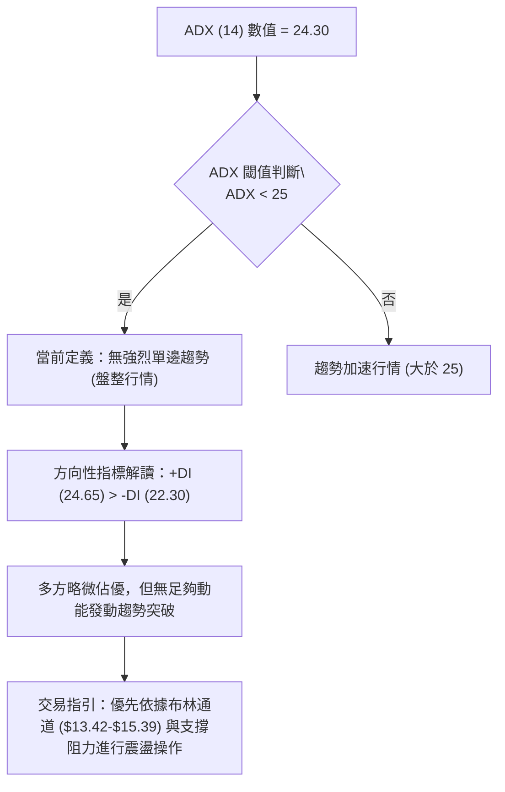

| 指標名稱 | 實際數值 | 參考臨界值 | 狀態評估 | 實戰指導意義 |
|:---|:---:|:---:|:---:|:---|
| **ADX(14)** | 24.30 | 25.00 | 🟡 弱趨勢 / 盤整 | 避免單邊追高殺跌，以低吸高拋區間操作為核心 |
| **+DI (14)** | 24.65 | - | 🟢 多方佔優 | 多頭力量微幅領先，回調支撐位具備買盤承接力 |
| **-DI (14)** | 22.30 | - | ⚪ 空方受限 | 空方動能衰竭，難以直接摜破 $13.41 強支撐 |

---

## 3. 圖表形態分析

### 🔍 形態識別系統

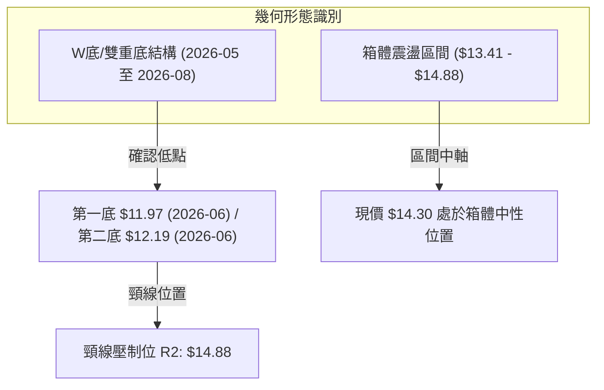

#### 形態信心度評估表（依規則 15）

| 識別形態 | 信心度 | 判斷依據（引用技術數據） | 完成度 | 目標價（附嚴謹計算式） |
|:---|:---:|:---|:---:|:---|
| **雙底形態 (W-Bottom)** | **65%** | 2026-06-07 出現低點 $11.97，隨後 2026-06-14 回踩 $12.19 形成雙重探底；隨後週線爆量站上 $13.50 | 75% | 頸線 R2 ($14.88) + 形態高度 ($14.88 - $11.97 = $2.91) = **$17.79** (接近前高 $17.75) |
| **矩形箱體整理** | **80%** | 價格在 S2 ($13.41) 與 R2 ($14.88) 之間反覆震盪，ADX = 24.30 證實箱體有效 | 85% | 箱頂突破目標：R2 ($14.88) + 箱高 ($14.88 - $13.41 = $1.47) = **$16.35** |
| **均線三角形收斂** | **55%** | MA20 ($14.41) 下穿、MA50 ($13.97) 上揚，均線在 $14.20 附近高度糾纏 | 60% | 突破方向未定，若向上突破量度目標為 R3: **$15.70** |

---

### 🕯️ 重要K線形態分析

| 週期 / 月份 | 收盤價 | K線形態特徵 | 盤面語言解讀 | 訊號方向 |
|:---|:---:|:---|:---|:---:|
| **2026-05** | $13.13 | 長下影大陰線 | 快速殺跌觸及波段恐慌盤，下影線透露買盤入場試探 | 🟡 止跌訊號 |
| **2026-06** | $13.36 | 帶長下影之平底十字星 | 連續兩週測試 $11.97-$12.19 不破，確立中線底部支撐 | 🟢 築底確認 |
| **2026-07** | $14.33 | 放量中陽線 | 週量能放大至 7.62 億股，突破 MA50 壓制，買盤全面回流 | 🟢 強勢反彈 |
| **2026-08** | $14.30 | 窄幅十字星 (Spinning Top) | 承壓於 MA200 ($14.99) 下方，多空動能取得暫時均衡 | 🟡 盤整蓄勢 |

---

### 📉 ASCII 走勢形態示意圖

```
NU 雙底與箱體形態示意圖
$15.70 ────────────────────────────────────────── [形態延伸阻力 R3]
                 [頸線位 R2: $14.88]
$14.88 ───────────╭───╮────────────────────────── [頸線關鍵阻力]
                 │   │      ╭─ [現價 $14.30]
$14.30 ──────────┼───┼──────●────────────────────
                 │   │     ╱ ╲
$13.41 ──────────┼───╰────╯───╲────────────────── [箱底支撐 S2]
                 │             ╲
$12.19 ────╮     │              ╰─── [第二底 $12.19]
           ╰─────╯ 
$11.97   [第一底 $11.97]
```

---

### 🎯 形態目標價計算

1. **雙底形態量度目標**：
   $$\text{形態高度} = \text{頸線}(R2: \$14.88) - \text{第一底}(\$11.97) = \$2.91$$
   $$\text{理論多頭目標} = \text{頸線}(\$14.88) + \$2.91 = \$17.79 \quad (\text{接近 2026-01 月收盤價 } \$17.75)$$
2. **箱體破位量度目標（下行防守）**：
   $$\text{箱體高度} = R2(\$14.88) - S2(\$13.41) = \$1.47$$
   $$\text{若跌破箱底目標} = S2(\$13.41) - \$1.47 = \$11.94 \quad (\text{精確對應前期歷史低點 } \$11.97)$$

---

## 4. 支撐與阻力

### 🗺️ 關鍵價位分布圖（Unicode）

```
NU 價位結構分布圖（OHLCV 聚類計算）
══════════════════════════════════════════════════════════════════
$15.70 ║████████████████████████████████║ 強阻力 R3 (近一年波段高點)
$15.39 ║▓▓▓▓▓▓▓▓▓▓▓▓▓▓▓▓▓▓▓▓▓▓▓▓        ║ 布林通道上軌壓制
$14.99 ║████████████████████            ║ 長期均線 MA200 壓制帶
$14.88 ║██████████████████████████      ║ 關鍵頸線阻力 R2 (+4.07%)
$14.38 ║████████████████                ║ 短線第一阻力 R1 (+0.56%)
$14.30 ╠════════════════════════════════╣ ◄◄◄ 當前現價 ($14.30)
$14.17 ║▓▓▓▓▓▓▓▓▓▓▓▓▓▓▓▓▓▓▓▓▓▓▓▓▓▓▓▓▓▓  ║ 斐波那契 61.8% 回調位
$14.11 ║████████████████████            ║ 短線核心支撐 S1 (-1.36%)
$13.97 ║▓▓▓▓▓▓▓▓▓▓▓▓▓▓▓▓▓▓▓▓            ║ 季線 MA50 支撐位
$13.41 ║████████████████████████████████║ 強支撐 S2 (-6.22% / 布林下軌)
$13.09 ║████████████████████████        ║ 極限防守底線 S3 (-8.50%)
══════════════════════════════════════════════════════════════════
```

---

### 🚧 阻力位分析表

| 阻力級別 | 精確價位 | 距現價幅寬 | 形成原因與籌碼特徵 | 突破難度 | 重要性評級 |
|:---|:---:|:---:|:---|:---:|:---:|
| **R1** | **$14.38** | +0.56% | 日線高點密集成交區，緊貼 MA20 ($14.41) 中軌 | 🟡 中等 | ★★★☆☆ |
| **R2** | **$14.88** | +4.07% | 雙底頸線位置，對應 MA200 ($14.99) 下方重壓區 | 🔴 極高 | ★★★★★ |
| **R3** | **$15.70** | +9.76% | 2026年上半年反彈次高點，波段籌碼套牢平台 | 🔴 極高 | ★★★★☆ |

---

### 🛡️ 支撐位分析表

| 支撐級別 | 精確價位 | 距現價幅寬 | 形成原因與籌碼特徵 | 守住機率 | 重要性評級 |
|:---|:---:|:---:|:---|:---:|:---:|
| **S1** | **$14.11** | -1.36% | 近一年波段回踩聚類點，重合斐波那契 61.8% ($14.17) | 75% | ★★★★☆ |
| **S2** | **$13.41** | -6.22% | 布林通道下軌 ($13.42) 與 2026-06 築底頸線平台 | 85% | ★★★★★ |
| **S3** | **$13.09** | -8.50% | 2026-05 月收盤價 ($13.13) 密集防守區，波段最後防線 | 90% | ★★★★★ |

---

### 📐 斐波那契回調位分析

依據 52 週區間極端值（最低點 **$11.20** 至最高點 **$18.98**，波幅 **$7.78**）精確測算：

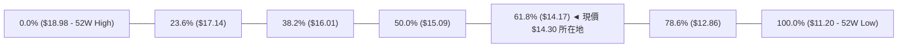

- **黃金分割定位解讀**：現價 **$14.30** 精確運行於 **50.0% ($15.09)** 與 **61.8% ($14.17)** 之間，且距離黃金分割位 61.8% ($14.17) 僅 0.9% 空間。技術分析中，61.8% 為深度回調最重要的生命線，目前股價成功守於其上方，展現出中長線多頭買盤的防守決心。

---

## 5. 技術指標深度解讀

### 🎛️ 指標訊號總覽

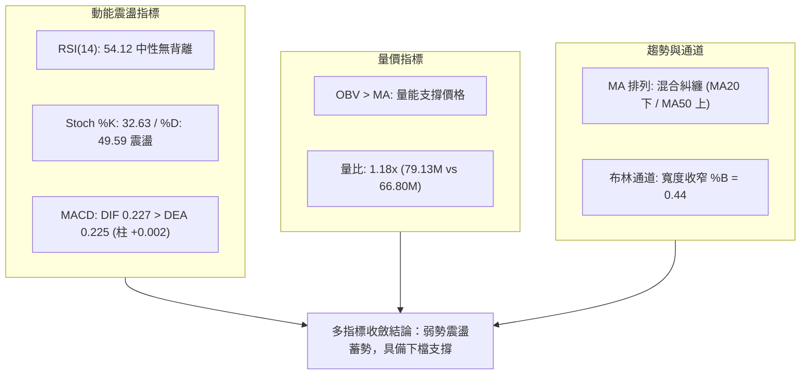

---

### 📈 移動平均線排列分析

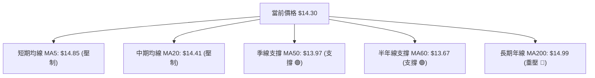

| 均線名稱 | 數值 | 距現價差距 | 當前趨勢與斜率 | 實戰角色 |
|:---|:---:|:---:|:---|:---:|
| **MA5** | $14.85 | -3.70% | 短期下彎 (▁▂▃▃▄▅▅▄▃▂) | 極短線動能阻力 |
| **MA10** | $14.67 | -2.55% | 震盪走平 (▁▁▂▂▃▃▄▄▅▄▃) | 短線回抽第一道障礙 |
| **MA20** | $14.41 | -0.76% | 微幅向下 (▁▁▂▃▃▄▄▅▆▇█) | 日線布林中軌阻力 |
| **MA50** | $13.97 | +2.36% | 持續向上勾頭 | 中期趨勢防守基準線 |
| **MA60** | $13.67 | +4.64% | 顯著上揚 (▁▁▁▂▂▃▄▅▆▇█) | 中期波段強支撐 |
| **MA120**| $13.82 | +3.50% | 底部走平 | 半年籌碼沉澱平台 |
| **MA200**| $14.99 | -4.60% | 長期下彎壓制 | 牛熊多空分水嶺 |
| **MA240**| $15.10 | -5.32% | 走平略降 (▁▂▃▄▅▆▇██▇▆) | 長期天花板強阻力 |

---

### 📉 RSI(14) 分析

$$\text{RSI(14) 當前值: } 54.12 \quad \left[ \text{超賣 0 } \xrightarrow{\hspace{1.5cm}} \text{中性 50 } \xrightarrow{\hspace{1.5cm}} \text{超買 100} \right]$$

```
RSI(14) 狀態指示條
0 ──────────── 30 ──────────────── 50 ──────●───── 70 ──────────── 100
[   超賣區   ]    [    空方佔優    ]   [ 54.12 多方 ]   [   超買區   ]
```

- **背離檢驗結論**：對比近期價格在 2026-08-16 創出 $15.23 高點時 RSI 為 58.0，現價回落至 $14.30 時 RSI 為 54.12，動能回調斜率與價格回調幅度高度一致，**確認無頂背離與底背離現象**，指標運行健康。

---

### 📊 MACD(12/26/9) 訊號解讀

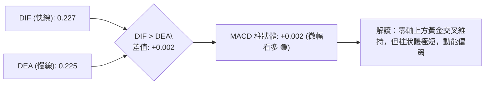

MACD 連續兩週柱狀體維持在 +0.002 正值，雖然 DIF (0.227) 高於 DEA (0.225)，但柱狀體未見明顯擴散放大，反映目前多方雖握有主導權，但尚未展開爆發性攻勢，符合盤整市場特性。

---

### 📦 布林通道分析

```
NU 布林通道結構圖 (20, 2)
$15.39 ────────────────────────────────────────── [布林上軌 Upper Band]
                      ╭───────╮
$14.88 ───────────────╯       ╰─────── [波段高點 R2]
$14.41 ─── ─ ─ ─ ─ ─ ─ ─ ─ ─ ─ ─ ─ ─ ─ [布林中軌 MA20]
$14.30 ─────────────●───────────────── [現價位置 %B = 0.44]
$13.97 ──────────────────────────────── [MA50 支撐]
$13.42 ────────────────────────────────────────── [布林下軌 Lower Band]
```

- **帶寬與位置解讀**：布林帶寬 ($15.39 - $13.42 = \$1.97$) 呈現收斂走勢，股價位於中軌下方貼近中軌位置 (%B = 0.44)。根據布林通道統計法則，帶寬收斂通常預示著波動率即將釋放，當前下軌 $13.42 與支撐 S2 ($13.41) 完美共振，形成堅固防線。

---

### 💹 成交量分析（量價配合度）

```
成交量對比柱狀圖 (股)
最新成交量: 79.13M  ████████████████████ (量比 1.18x)
20日均量:   66.80M  █████████████████
50日均量:   78.66M  ████████████████████
```

- **OBV 趨勢檢驗**：數據確認 `OBV > MA`，表明資金在 5-7 月份底部區域具備持續淨流入痕跡。近期回調至 $14.30 過程中未見恐慌性爆量，量價呈現良性「量增價揚、量縮價穩」格局。

---

## 6. 動能與波動率

### ⚡ 動能評估四象限

| 象限分佈 | 動能強度 | 波動率水準 | 當前對應狀態 | 戰略應對方針 |
|:---:|:---:|:---:|:---:|:---|
| **Q1** | 強 (High) | 低 (Low) | — | 最佳單邊趨勢加碼點 |
| **Q2** | 弱 (Low) | 低 (Low) | **✓ [NU 當前定位]** | **謹慎觀望，區間低吸高拋，靜待突破** |
| **Q3** | 強 (High) | 高 (High) | — | 高動能突破，動態追蹤止盈 |
| **Q4** | 弱 (Low) | 高 (High) | — | 避免進場，市場洗盤風險高 |

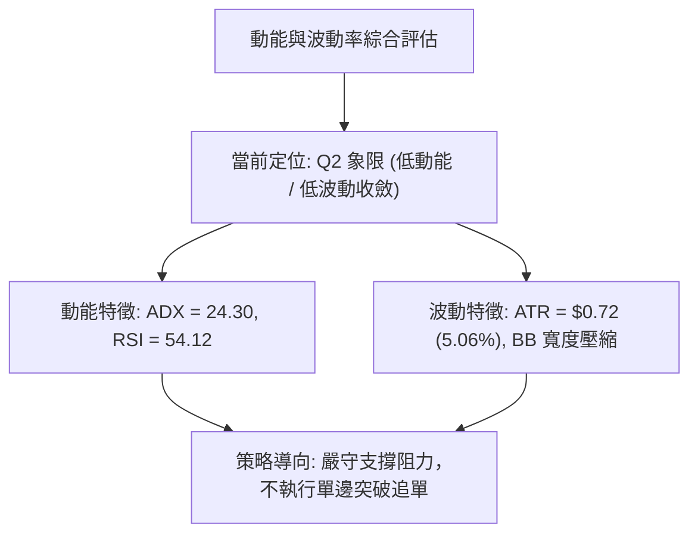

---

### 📊 ATR 波動率分析與止損建議

- **當前 ATR(14)**：**$0.72**（佔現價 **5.06%**）
- **止損距離動態設定**：
  - **保守型波段交易（1.5 倍 ATR）**：止損幅度 = $0.72 \times 1.5 = \mathbf{\$1.08}$
  - **激進型日內/短線交易（1.0 倍 ATR）**：止損幅度 = $0.72 \times 1.0 = \mathbf{\$0.72}$
  - **緊密結構止損（以 S1 為基準）**：現價 $14.30 至 S1 ($14.11) 僅 $0.19 緩衝，建議結合 ATR 給予 S1 下方適度容錯至 **$13.88**（低於 MA50 $13.97）。

---

### 📐 Beta 與市場相關性

- **Beta 係數**：**0.942**
- **市場敏感度解讀**：Beta 值略低於 1.00，表明 NU 與美股大盤（S&P 500）保持高度同步性，但整體波動度略顯穩健。在目前機構持股比例高達 **82.0%**、空頭比例僅 **3.4% (Short Ratio 1.41)** 的籌碼結構下，股價不易出現無預警崩跌，技術面價位具備極高可靠度。

---

## 7. 多時框架總結

### 📋 時框架評分表

| 時框架 | 趨勢方向 | 動能狀態 | 均線排列 | 關鍵圖表形態 | 綜合評分 | 操作指導建議 |
|:---|:---:|:---:|:---:|:---:|:---:|:---|
| **長期 (月線)** | 🟡 中性修復 | 🟡 平衡 (RSI 54) | 🔴 MA200 下方 | 52W 高點回調 61.8% 平台 | 50/100 | 長期分批逢低佈局 |
| **中期 (週線)** | 🟢 震盪築底 | 🟢 MACD 紅柱 | 🟢 站上 MA50 | 雙重底 (W底) 構築完成 | 65/100 | 波段持股，依託季線做多 |
| **短期 (日線)** | 🟡 窄幅震盪 | 🟡 中軌承壓 | 🔴 MA5/20 壓制 | 矩形箱體整理 ($13.41-$14.88)| 48/100 | 區間操作，高拋低吸 |

---

### 🔲 綜合訊號矩陣

```
時框共振檢驗：
長期 (月線)：  ░░░░░░░░░░ 50%  [🟡 中立]
中期 (週線)：  ███████░░░ 65%  [🟢 偏多] ◄ 主導方向
短期 (日線)：  ░░░░░░░░░░ 48%  [🟡 震盪] ◄ 入場時機
```

---

### ⚖️ 多時框收斂結論

依據技術分析多時框收斂規則（規則 14）：
1. **行情定性**：當前 ADX(14) 數值為 **24.30 (< 25)**，技術面嚴格定義為**盤整行情 (Consolidation Regime)**。
2. **時框裁決**：在盤整行情中，日線與週線的布林通道上下軌及關鍵水平支撐阻力為最高優先級。週線 MA50 ($13.97) 與日線布林下軌 ($13.42) 構築了堅實的底部邊界，而上方 MA200 ($14.99) 與頸線 R2 ($14.88) 形成上軌邊界。
3. **唯一方向結論**：**中性偏多震盪（Neutral-to-Bullish Range Trading）**。日線的短均壓制僅代表進場點的微調時機，整體操作應採取「**依託下方支撐分批做多，於阻力位獲利了結**」的區間震盪策略。

---

## 8. 交易策略建議

### 🗺️ 策略決策流程圖

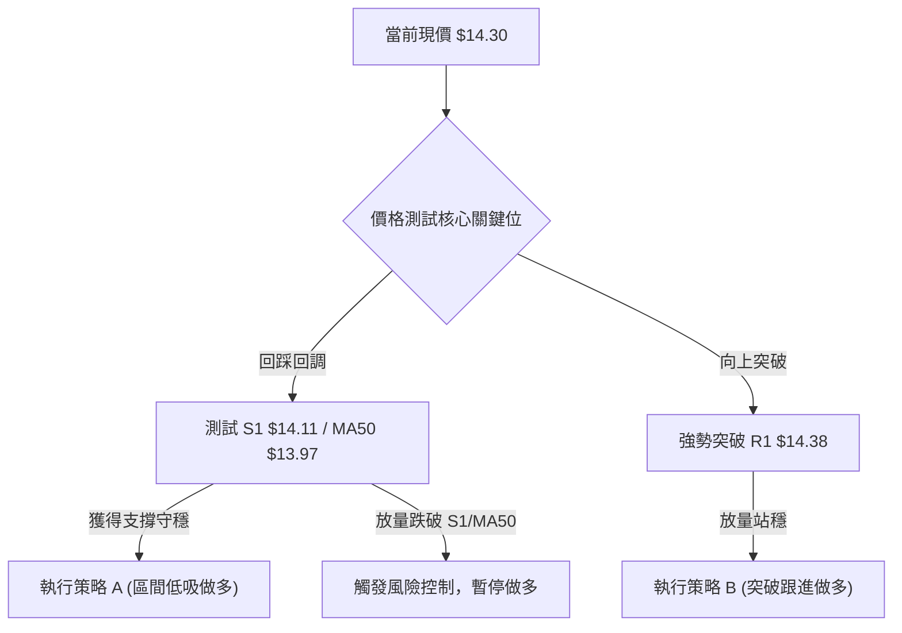

---

### 🧭 策略路由

> **當前主策略方向 = 區間偏多操作（依綜合評分 52/100，處於中性偏多區間）**

---

### 🎯 價格情境階梯（Price Scenarios）

| 觸發條件 | 第一目標 (T1) | 第二目標 (T2) | 後續延伸 (T3) | 技術情境含義 |
|:---|:---:|:---:|:---:|:---|
| **向上突破 R1 ($14.38)** | **R2 ($14.88)** | **MA200 ($14.99)** | **R3 ($15.70)** | 短線擺脫糾纏，開啟箱頂測試 |
| **維持於現價區間 ($14.11 - $14.38)** | **R1 ($14.38)** | **S1 ($14.11)** | — | 箱體內部窄幅蓄勢震盪 |
| **向下跌破 S1 ($14.11)** | **MA50 ($13.97)** | **S2 ($13.41)** | **S3 ($13.09)** | 短期破位，回測中期強防守平台 |

---

### 📊 情境機率分佈

| 情境劇本 | 機率估計 | 主要技術依據與指標支撐 |
|:---|:---:|:---|
| **情境一：區間震盪蓄勢後上行** | **55%** | MACD 維持紅柱 (+0.002)、OBV 處於均線上方支撐、MA50 ($13.97) 向上提供託底 |
| **情境二：箱體內部持續橫盤整理** | **30%** | ADX = 24.30 限制單邊突破速度、均線糾纏收斂、短期缺乏催化劑 |
| **情境三：向下回踩更深支撐 (探底)** | **15%** | 若大盤劇烈波動跌破 S1 ($14.11)，將引發回踩 S2 ($13.41) 布林下軌需求 |

---

### 🟢 主策略詳情

依據評分卡結論，主推**兩套多頭交易策略**（策略 A：逢低吸納型；策略 B：強勢突破型）：

| 策略要素 | 策略 A（支撐低吸型 - 推薦） | 策略 B（突破跟進型） |
|:---|:---:|:---:|
| **適用場景** | 回踩 S1 附近企穩入場 | 放量突破 R1 阻力追進 |
| **精確進場價格** | **$14.15**（S1 $14.11 上方掛單） | **$14.42**（確認突破 R1 $14.38） |
| **目標價 T1** | **$14.88**（關鍵阻力 R2） | **$14.88**（阻力 R2） |
| **目標價 T2** | **$15.70**（波段阻力 R3） | **$15.70**（阻力 R3） |
| **止損價格** | **$13.85**（嚴格跌破 MA50 $13.97） | **$14.05**（跌回突破頸線下方） |
| **風險空間 / 報酬空間** | 風險 $0.30 / 報酬 $0.73~$1.55 | 風險 $0.37 / 報酬 $0.46~$1.28 |
| **風險報酬比 (R:R)** | **1 : 2.43**（至 T1）/ **1 : 5.17**（至 T2） | **1 : 1.24**（至 T1）/ **1 : 3.46**（至 T2） |
| **預估勝率** | **65%** | **52%** |
| **建議倉位配置** | **15% - 20%** 總資金 | **10%** 總資金（突破後加碼） |

---

### 🔴 反向風險觸發點（對沖提示）

- **多頭失效止損線**：若日線收盤價**實體跌破 S1 ($14.11)** 且進一步摜破 **MA50 ($13.97)**，宣告短期盤整反彈失敗，應立即將多頭倉位止損出場。
- **空頭對沖觸發**：若股價跌破 **$13.85**，空方力量將直指 **S2 ($13.41)** 與 **S3 ($13.09)**，持股者可考慮配置賣出買權（Covered Call）或買入保護性認沽期權避險。

---

### ⭐ 整體訊號強度評星

```
做多訊號強度：★★★☆☆  (3.5 / 5 星 — 具備底部支撐與量能配合)
做空訊號強度：★★☆☆☆  (2.0 / 5 星 — 缺乏向下動能，空頭比例低)
整體可信度：  ★★★★☆  (4.0 / 5 星 — 82%機構持股，技術點位吻合度極高)
```

---

## 9. 風險提示與監控

### ✅ 關鍵監控指標 Checklist

```
╔══════════════════════════════════════════════════════════════════╗
║                   NU 每日交易監控清單 (Checklist)                 ║
╠══════════════════════════════════════════════════════════════════╣
║ [ ] 價格是否維持在斐波那契 61.8% ($14.17) 與 S1 ($14.11) 上方    ║
║ [ ] MACD 柱狀體是否持續大於 0 (防範由 +0.002 轉負)               ║
║ [ ] 日成交量是否維持在 20日均量 (66.80M) 之上，維持量能活絡度     ║
║ [ ] ADX 數值是否由 24.30 向上突破 25.00，展開趨勢定向行情        ║
║ [ ] RSI(14) 是否跌破 50 中軸防線                                ║
║ [ ] 是否出現突破 MA20 ($14.41) 與 R1 ($14.38) 的日線收盤確認     ║
╚══════════════════════════════════════════════════════════════════╝
```

---

### ⚠️ 風險場景分析

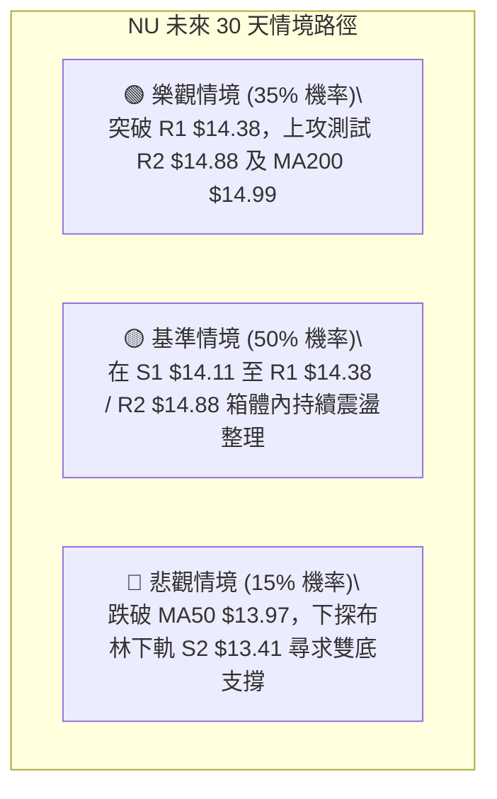

---

### 🛡️ 風險管理重要提醒

1. **嚴格執行停損紀律**：
   - 盤整行情中最忌「逢跌攤平」。若價格跌破 S1 ($14.11) 且未能在次日收復，表明盤整區間下移，切勿盲目加碼。
2. **倉位管理原則**：
   - 鑑於 ADX < 25 表明市場處於無方向階段，單一標的總暴露倉位建議控制在 **15% - 20%** 以內，預留現金部位應對突破後的順勢加碼。
3. **波動度適應**：
   - ATR 為 $0.72，意味著日內產生 ±3% 至 5% 的振幅屬於正常技術波動，切忌在通道中軸頻繁追漲殺跌，應耐心等待通道邊界訊號。

---

## 📋 報告總結

```
╔══════════════════════════════════════════════════════════════════╗
║                     NU 技術分析報告總結                          ║
╠══════════════════════════════════════════════════════════════════╣
║ 報告日期：2026-08-31            當前價格：$14.30                 ║
║ 分析評級：⚖️ 中性偏多震盪 (52/100) — 區間蓄勢操作               ║
╠══════════════════════════════════════════════════════════════════╣
║ 關鍵維度總結：                                                   ║
║ ├─ 長期趨勢：🟡 中性築底 (受制於 MA200 $14.99，52W回調61.8%處)  ║
║ ├─ 中期趨勢：🟢 偏多回升 (站穩季線 MA50 $13.97，雙底形態完成)   ║
║ ├─ 短期趨勢：🟡 窄幅震盪 (受壓於 R1 $14.38 與 MA20 $14.41)      ║
║ ├─ 核心支撐：S1: $14.11 ｜ S2: $13.41 ｜ S3: $13.09             ║
║ ├─ 核心阻力：R1: $14.38 ｜ R2: $14.88 ｜ R3: $15.70             ║
║ └─ 華爾街共識目標：$18.78 (22位分析師評級: Buy，最高 $23.00)     ║
╠══════════════════════════════════════════════════════════════════╣
║ 最優交易策略推薦：                                               ║
║ 1. 🥇 最佳機會（策略 A）：回踩 $14.15 佈局多單，止損 $13.85，   ║
║    目標 T1: $14.88 / T2: $15.70，風險報酬比達 1 : 2.43 ~ 5.17   ║
║ 2. 🥈 次選機會（策略 B）：放量站穩 $14.42 追多，止損 $14.05，    ║
║    目標 $14.88 / $15.70，博弈箱體向上突破行情                   ║
║ 3. 🥉 保守選擇：維持觀望，靜待 ADX 突破 25 且價格收復 MA200 後  ║
║    再行順勢進場                                                 ║
╚══════════════════════════════════════════════════════════════════╝
```

---

> ⚠️ **免責聲明**：本報告為技術分析研究成果，所有數據及模型推演均基於市場歷史價量數據（OHLCV）。本報告**僅供學術研究與投資參考**，**不構成任何形式的要約或投資買賣建議**。金融市場具有高度風險，投資人應依個人風險承受能力獨立決策並自負盈虧。

---

*報告生成時間：2026-08-31 ｜ 數據來源：Yahoo Finance ｜ 分析框架：多時框技術分析體系*