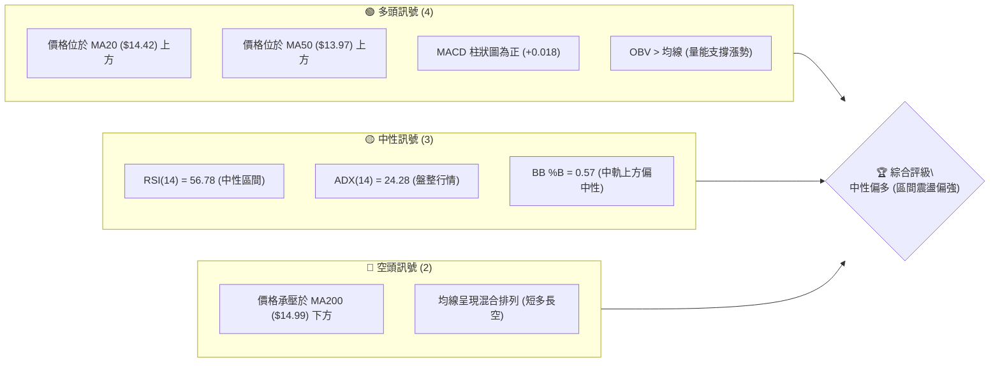
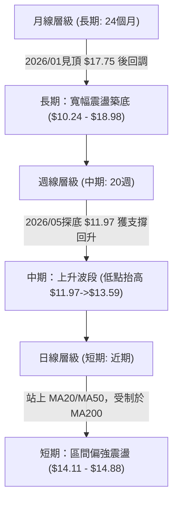
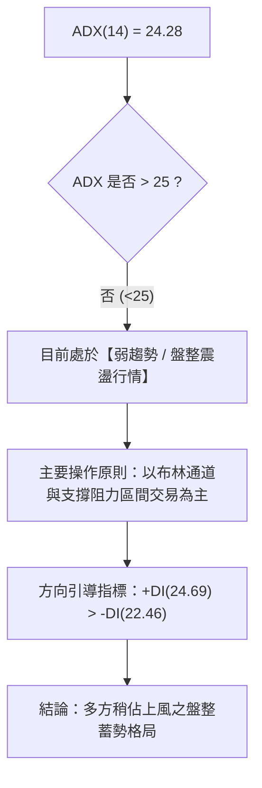
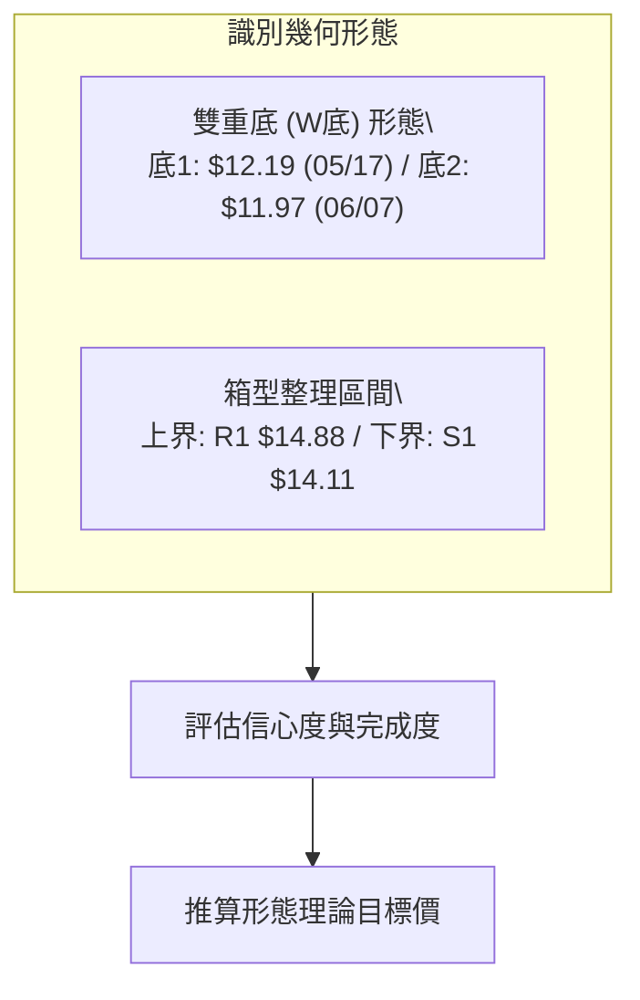
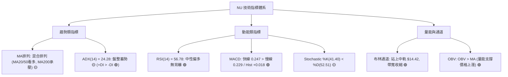
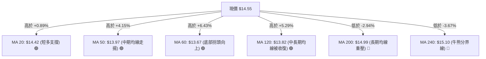
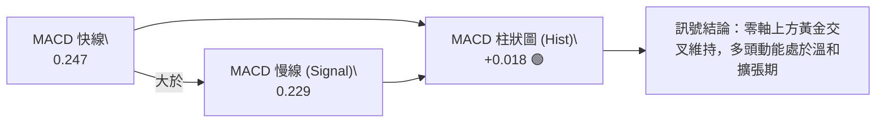
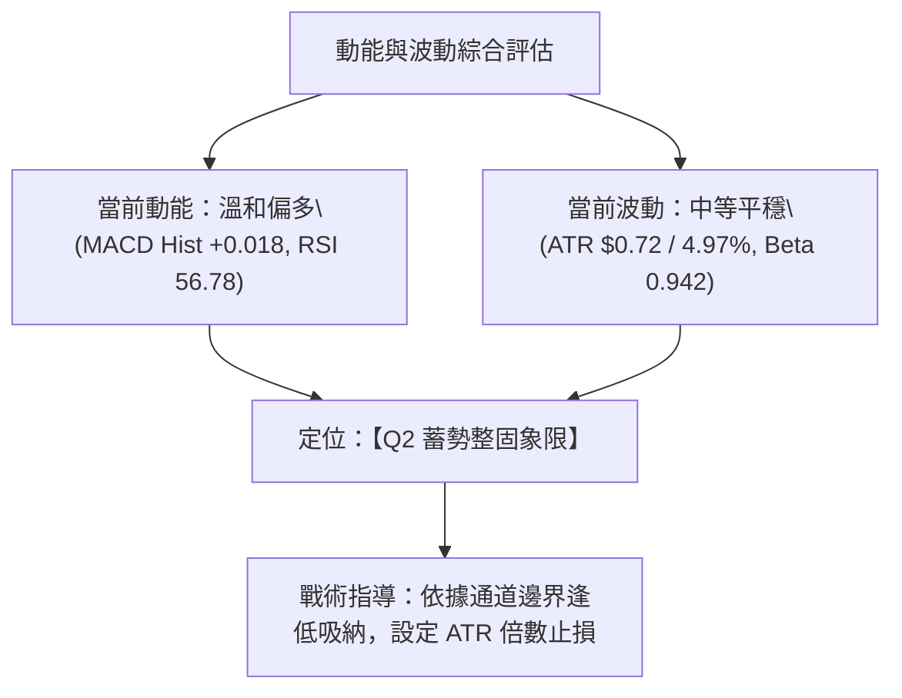
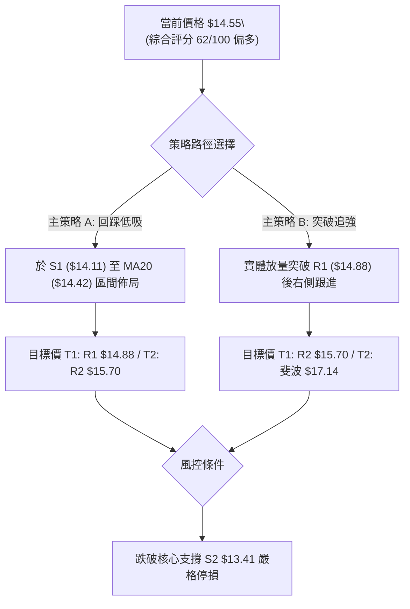
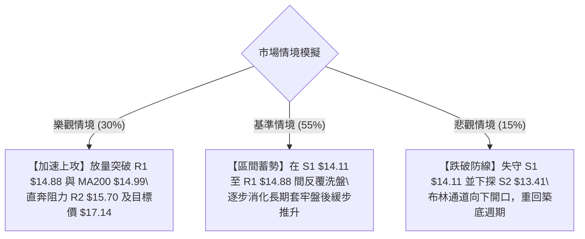

# NU 技術分析報告

> **報告日期**：2026-09-01 ｜ **語言**：繁體中文 ｜ **數據來源**：Yahoo Finance ｜ **當前價格**：$14.55

---

## 目錄

| 章節 | 內容 |
|------|------|
| [1. 技術面概覽](#1-技術面概覽) | 訊號儀表板、核心指標、評分卡 |
| [2. 趨勢分析](#2-趨勢分析) | 多時框趨勢、長中短期走勢 |
| [3. 圖表形態分析](#3-圖表形態分析) | 形態識別、K線組合、目標價 |
| [4. 支撐與阻力](#4-支撐與阻力) | 關鍵價位、斐波那契回調 |
| [5. 技術指標深度解讀](#5-技術指標深度解讀) | MA/RSI/MACD/布林/成交量 |
| [6. 動能與波動率](#6-動能與波動率) | 動能評估、ATR、Beta |
| [7. 多時框架總結](#7-多時框架總結) | 時框架評分矩陣 |
| [8. 交易策略建議](#8-交易策略建議) | 多空策略、風險報酬比 |
| [9. 風險提示與監控](#9-風險提示與監控) | 監控指標、風險場景 |

---

## 1. 技術面概覽

### 🎯 技術訊號儀表板



### 📊 核心指標速覽表

| 指標類別 | 指標名稱 | 當前數值 | 訊號 | 解讀 |
|----------|----------|----------|------|------|
| **價格** | 當前價格 | $14.55 | 🟡 | 位於52週區間 43.1%，中性築底回升中 |
| **均線** | MA20 | $14.42 | 🟢 | 現價於MA20上方 (+0.89%)，短線支撐有效 |
| **均線** | MA50 | $13.97 | 🟢 | 現價於MA50上方 (+4.15%)，中期多頭發力 |
| **均線** | MA200 | $14.99 | 🔴 | 現價於MA200下方 (-2.94%)，長期上方壓力沉重 |
| **動能** | RSI(14) | 56.78 | 🟡 | 位於 30–70 中性平衡區，偏向多方但未過熱 |
| **動能** | MACD | 0.247 / Sig: 0.229 | 🟢 | 雙線位於零軸上方且黃金交叉，Hist +0.018 |
| **動能** | Stoch %K/%D | 41.40 / 52.51 | 🟡 | 處於中性整理區，無超買超賣極端 |
| **趨勢** | ADX(14) | 24.28 | 🟡 | ADX < 25 為盤整行情，+DI(24.69) > -DI(22.46) |
| **通道** | Bollinger Bands | $13.44 ~ $15.41 | 🟢 | 現價站上中軌 $14.42，帶寬收斂後蓄勢 |
| **波動** | ATR(14) | $0.72 | 🟡 | 佔股價 4.97%，屬中等日常波動區間 |
| **量能** | 成交量 / 20日均量 | 95.27M / 67.60M | 🟢 | 量比 1.41x，OBV > MA 呈現量價配合 |

### 🏆 技術評分卡

```
╔══════════════════════════════════════════════════════════════════╗
║              技術評分卡 — NU (2026-09-01)                       ║
╠══════════════════════════════════════════════════════════════════╣
║ 趨勢強度      ██████████░░░░░░░░░░  50/100  🟡 中性 (ADX 24.28)  ║
║ 動能指標      ██████████████░░░░░░  68/100  🟢 看多 (MACD金叉)   ║
║ 支撐穩定度    ██████████████░░░░░░  70/100  🟢 看多 (S1/MA50重疊)║
║ 成交量配合    ██████████████░░░░░░  72/100  🟢 看多 (OBV量增)    ║
║ 形態完整度    ████████████░░░░░░░░  60/100  🟡 中性 (雙底反彈中) ║
║ 均線排列      ██████████░░░░░░░░░░  52/100  🟡 混合 (短強長弱)   ║
╠══════════════════════════════════════════════════════════════════╣
║ 綜合評分      ████████████░░░░░░░░  62/100  🟢 偏多區間震盪      ║
╚══════════════════════════════════════════════════════════════════╝
```

---

## 2. 趨勢分析

### 🌐 多時框趨勢分析



### 📈 長期趨勢 — 12個月走勢圖（Unicode）

```
NU 月線走勢圖（過去12個月：2025-09 至 2026-08）
價格軸 ($)
$18.00 ┤                               ●(2026-01: $17.75)
$17.00 ┤                     ●(11月:$17.39)  ●(12月:$16.74)
$16.00 ┤ ●(9月:$16.01) ●(10月:$16.11)
$15.00 ┤                                       ●(02月:$14.98)
$14.50 ┤                                            ●(03月:$14.37) ●(04月:$14.48)  ●(07月:$14.33)  ●(08月:$14.55)◄現價
$13.00 ┤                                                                ●(05月:$13.13) ●(06月:$13.36)
       └──────────────────────────────────────────────────────────────────────────────────────────
         09/25  10/25  11/25  12/25  01/26  02/26  03/26  04/26  05/26  06/26  07/26  08/26 (月份)
```

**走勢特徵分析表格**：

| 階段區間 | 時間段 | 起訖價格 | 區間漲跌幅 | 走勢特徵與量價表現 |
|----------|--------|----------|------------|--------------------|
| 第一階段：衝頂浪 | 2025-09 至 2026-01 | $16.01 → $17.75 | +10.87% | 連續攀升創波段新高，均線強勢多頭發散 |
| 第二階段：深幅回撤 | 2026-01 至 2026-05 | $17.75 → $13.13 | -26.03% | 獲利了結賣壓湧現，連續跌破短期均線 |
| 第三階段：築底反彈 | 2026-05 至 2026-08 | $13.13 → $14.55 | +10.81% | 在 $13.13 企穩，量能溫和放大，收復 MA20/50 |

### 📊 中期趨勢（週線分析）

```
NU 中期週線支撐阻力結構圖
$16.00 ┼───────────────────────────────────────────── 斐波那契 38.2% ($16.01)
$15.70 ┼───────────────────────────────────────────── 波段阻力 R2 ($15.70)
$15.23 ┼───────────────────────────────●───────────── 08-16 衝高回落高點 ($15.23)
$14.99 ┼ - - - - - - - - - - - - - - - - - - - - -  MA200 重壓 ($14.99)
$14.88 ┼───────────────────────────────────────────── 波段阻力 R1 ($14.88)
$14.55 ┼───────────────────────────────────────●───── 現價 ($14.55)
$14.17 ┼ - - - - - - - - - - - - - - - - - - - - -  斐波那契 61.8% ($14.17)
$14.11 ┼───────────────────────────────────────────── 近期強支撐 S1 ($14.11)
$13.41 ┼───────────────────────────────────────────── 核心支撐 S2 ($13.41) / 布林下軌 ($13.44)
$11.97 ┼───────●───────────────────────────────────── 06-07 中期大底 ($11.97)
```

中期走勢顯示，NU 在 2026 年 6 月探底 $11.97 形成中期雙重底後持續回升，近 6 週收盤均維持在 $13.84 以上，且低點逐步由 $13.59 (07-19) 抬升至 $13.84 (08-09)，呈現穩健的「底底高 (Higher Lows)」中期震盪上行結構。

### ⚡ 趨勢強度評估（ADX 解讀）



**ADX 趨勢強度指標對照解讀**：

| 指標項 | 當前數值 | 參考標準 | 狀態評估 | 實戰意涵 |
|--------|----------|----------|----------|----------|
| **ADX(14)** | **24.28** | < 25 弱趨勢/震盪；> 25 趨勢確立；> 40 強趨勢 | 🟡 弱趨勢 (盤整) | 避免盲目追高突破單，以區間低吸高拋為宜 |
| **+DI (多頭動向)**| **24.69** | +DI > -DI 視為多方佔優 | 🟢 多方佔優 | 買方力量微幅強於賣方，支撐價格底部逐步抬高 |
| **-DI (空頭動向)**| **22.46** | 差值 (+DI - -DI) = +2.23 | 🟢 空方退守 | 空頭打壓力道逐漸減弱，未出現破位拋售潮 |

---

## 3. 圖表形態分析

### 🔍 形態識別系統



**形態信心度與目標價評估表**：

| 形態 | 信心度 | 判斷依據（引用數據） | 完成度 | 目標價（附計算式） |
|------|--------|----------------------|--------|--------------------|
| **W 底（雙重底）** | **75%** | 兩次波段低點於 $12.19 (2026-05-17) 與 $11.97 (2026-06-07) 獲買盤支撐；頸線位於 2026-04-26 高點 $14.51 | **85%** | 頸線 $14.51 + 形態高度 ($14.51 - $11.97 = $2.54) = **$17.05** (接近斐波那契回調位 $17.14) |
| **矩形箱型整理** | **80%** | 近期收盤價持續於 S1 ($14.11) 與 R1 ($14.88) 之間窄幅拉鋸，波動收縮 | **90%** | 上破 R1 $14.88 後目標 = $14.88 + ($14.88 - $14.11) = **$15.65** (高度聚類於阻力 R2 $15.70) |

### 🕯️ 重要K線形態分析

| 日期 / 週別 | 收盤價 | K線形態 | 解讀 | 訊號 |
|-------------|--------|---------|------|------|
| **2026-06-07** | $11.97 | 長下影錘頭線 (週量 473.46M) | 恐慌拋盤後主力強力承接，確認中期大底形成 | 🟢 強烈看多 |
| **2026-07-19** | $13.59 | 爆量十字星 (週量 762.06M) | 高達 7.62 億股天量換手整理，清洗前期浮額 | 🟡 中性蓄勢 |
| **2026-08-16** | $15.23 | 帶長上影大陽線 (週量 381.42M) | 向上挑戰 MA200 ($14.99) 及 $15.23 後遇阻回吐 | 🟡 假突破回踩 |
| **2026-08-30** | $14.88 | 中陽線反彈 (週量 211.49M) | 再次測試波段阻力 R1 ($14.88)，動能逐步復甦 | 🟢 偏多回升 |
| **2026-09-06** | $14.55 | 縮量小陰線回踩 (現量 95.27M) | 縮量回踩 MA20 ($14.42)，屬健康技術性回調 | 🟢 震盪蓄力 |

### 📉 ASCII 走勢形態示意圖

```
NU 雙重底與箱型突破結構示意圖
$17.05 ┼ - - - - - - - - - - - - - - - - - - - - - - - - - - - 雙底理論目標價 ($17.05)
       │
$15.70 ┼ - - - - - - - - - - - - - - - - - - - - - - - - - - - 阻力 R2 ($15.70)
$15.23 ┼───────────────────────────────▲ (08-16 刺穿遇阻)
$14.88 ┼───────────────────────────────┼─────────▲────── 箱型上軌 R1 ($14.88)
$14.55 ┼───────────────────────────────┼─────────┼──●── 現價 ($14.55)
$14.51 ┼───────▲ (04-26 頸線)──────────┼─────────┼────── 雙底頸線 ($14.51)
$14.11 ┼───────┼───────────────────────┴─────────┴────── 箱型下軌 S1 ($14.11)
       │       │
$12.19 ┼───────● (底 1: 05-17)
$11.97 ┼───────────────● (底 2: 06-07 中期底)
```

### 🎯 形態目標價計算

1. **W 底形態目標價推算**：
   - 形態底部低點：$11.97 (2026-06-07)
   - 頸線關鍵位：$14.51 (2026-04-26 高點)
   - 形態高度 = 頸線 ($14.51) - 底部 ($11.97) = **$2.54**
   - 理論上漲目標價 = 頸線 ($14.51) + 形態高度 ($2.54) = **$17.05**（與 52 週斐波那契 23.6% 回調位 $17.14 形成強力共振區間）。
2. **短期箱型整理量度目標價**：
   - 箱體頂部 (R1)：$14.88
   - 箱體底部 (S1)：$14.11
   - 箱體高度 = $14.88 - $14.11 = **$0.77**
   - 向上突破目標價 = $14.88 + $0.77 = **$15.65**（精準指向阻力位 R2 $15.70）。

---

## 4. 支撐與阻力

### 🗺️ 關鍵價位分布圖（Unicode）

```
NU 價位結構分布圖
══════════════════════════════════════════════════════════════════
$18.98 ║██████████████████████████████║ 52週最高點 (0.0% Fib)
$17.14 ║████████████████████████      ║ 斐波那契 23.6% 回調位
$16.42 ║██████████████████████████████║ 強阻力 R3 (近一年波段高點聚類)
$16.01 ║████████████████████          ║ 斐波那契 38.2% 回調位
$15.70 ║████████████████████████      ║ 阻力 R2 (近一年波段高點聚類)
$15.09 ║██████████████████████████    ║ 斐波那契 50.0% / MA200 ($14.99)
$14.88 ║██████████████████████████████║ 關鍵阻力 R1 (箱體上軌 +2.29%)
$14.55 ╠══════════════════════════════╣ ◄ 當前價格 ($14.55)
$14.17 ║▓▓▓▓▓▓▓▓▓▓▓▓▓▓▓▓▓▓▓▓▓▓        ║ 斐波那契 61.8% 黃金分割位
$14.11 ║▓▓▓▓▓▓▓▓▓▓▓▓▓▓▓▓▓▓▓▓▓▓▓▓▓▓▓▓  ║ 近期關鍵支撐 S1 (-3.06%)
$13.41 ║██████████████████████████████║ 強支撐 S2 / 布林下軌 ($13.44)
$13.09 ║██████████████████████████████║ 核心防守支撐 S3 (-10.07%)
$11.20 ║██████████████████████████████║ 52週最低點 (100.0% Fib)
══════════════════════════════════════════════════════════════════
```

### 🚧 阻力位分析表

| 阻力級別 | 價位 | 形成原因 | 突破難度 | 重要性 |
|----------|------|----------|----------|--------|
| **R1** | **$14.88** | 近一年波段高點聚類、近期多週收盤壓制線（距現價 +2.29%） | 中等 | ⭐⭐⭐⭐ 突破此處將打開上攻空間 |
| **R2** | **$15.70** | 近一年波段高點聚類、箱型突破量度目標（距現價 +7.87%） | 較高 | ⭐⭐⭐⭐ 中期多空分水嶺 |
| **R3** | **$16.42** | 近一年波段高點聚類、2025Q4 密集換手頭部區（距現價 +12.88%） | 極高 | ⭐⭐⭐ 強力籌碼套牢峰 |

### 🛡️ 支撐位分析表

| 支撐級別 | 價位 | 形成原因 | 守住機率 | 重要性 |
|----------|------|----------|----------|--------|
| **S1** | **$14.11** | 近一年波段低點聚類、共振斐波那契 61.8% ($14.17)（距現價 -3.06%） | 80% | ⭐⭐⭐⭐ 短線防守核心樞紐 |
| **S2** | **$13.41** | 近一年波段低點聚類、貼近布林通道下軌 $13.44（距現價 -7.84%） | 85% | ⭐⭐⭐⭐⭐ 中期多頭生命線 |
| **S3** | **$13.09** | 近一年波段低點聚類、2026-05 月線實體支撐 $13.13（距現價 -10.07%） | 90% | ⭐⭐⭐ 強大多頭終極防線 |

### 📐 斐波那契回調位分析

依據 52 週極值區間（最低點 **$11.20** 至 最高點 **$18.98**），計算所得關鍵回調位分佈如下：

```
斐波那契回調結構（52週區間 $11.20 → $18.98）
0.0%  (52W High) ─── $18.98  [歷史極值高點]
23.6% ────────────── $17.14  [雙底形態目標共振位]
38.2% ────────────── $16.01  [波段重要轉折阻力]
50.0% ────────────── $15.09  [整數關卡，緊鄰 MA200 ($14.99)]
61.8% ────────────── $14.17  [黃金分割關鍵支撐，與 S1 $14.11 共振] ◄── 現價 $14.55 處於 50%~61.8%
78.6% ────────────── $12.86  [深度回調防禦線]
100.0%(52W Low)  ─── $11.20  [週期循環底部]
```

**解讀**：當前股價 **$14.55** 運行於 **61.8% ($14.17)** 與 **50.0% ($15.09)** 之間。在技術分析中，61.8% 黃金回調位是多頭回踩的核心防線，現價已成功站上該位階並逐步向上推升，顯示自 $11.20 啟動的中期反彈行情仍在多方掌控之中。

---

## 5. 技術指標深度解讀

### 🎛️ 指標訊號總覽



### 📈 移動平均線排列分析



**均線狀態詳解**：
- 短中期均線（MA20 $14.42、MA50 $13.97、MA60 $13.67）均呈現多頭排列且向上發散，對股價構成層層支撐。
- 長期均線（MA200 $14.99、MA240 $15.10）呈微幅下行走勢，目前位於現價上方約 3%，代表股價正進入「修復長期均線」的關鍵攻堅期。均線系統整體評定為「**混合排列（短多長修復）**」。

### 📉 RSI(14) 分析

```
RSI(14) 水平指示條：
[0] ─────────── [30] 超賣 ─────────── [56.78] 現值 ─────────── [70] 超買 ─────────── [100]
進度條：████████████████████████████░░░░░░░░░░░░░░░░░░░░░ 56.78%
```

- **區間評估**：RSI(14) 當前讀數為 **56.78**，精準處於 50–60 的強勢多頭平衡區，未觸及 70 以上超買區，顯示短期漲勢具備持續延伸的健康動能。
- **背離分析**：
  - **日線/週線背離檢驗**：觀察近 8 週走勢，收盤價自 2026-07-19 的 $13.59 震盪上行至當前 $14.55，RSI 對應自 57.3 微幅調整至 56.8，與價格走勢同步匹配。
  - **背離結論**：數據明確顯示「**無頂背離、亦無底背離**」，指標如實反映目前的健康震盪築底結構。

### 📊 MACD(12/26/9) 訊號解讀



- **指標數值**：MACD 線為 **0.247**，Signal 線為 **0.229**，柱狀圖為 **+0.018**。
- **解讀**：雙線雙雙運行於零軸（0.00）上方，且柱狀圖維持正值（看多）。近三週 MACD 柱狀圖由 -0.017 (08-16) 翻正至 +0.002 (08-23)，再擴大至 +0.052 (08-30) 與當前 +0.018，確認動能已由空方修正轉由多方掌控。

### 📦 布林通道分析

```
NU 布林通道 (Bollinger Bands 20, 2) 結構圖
$15.41 ┼───────────────────────────────────────────── 上軌 Upper Band ($15.41)
       │
$14.55 ┼───────────────────────────────────────●───── 現價 Current Price ($14.55, %B=0.57)
$14.42 ┼───────────────────────────────────────────── 中軌 Middle Band (MA20: $14.42)
       │
$13.44 ┼───────────────────────────────────────────── 下軌 Lower Band ($13.44)
```

- **通道參數與位置**：上軌 **$15.41**，中軌 (MA20) **$14.42**，下軌 **$13.44**。
- **%B 指標分析**：%B 讀數為 **0.57**，股價穩定處於中軌上方，顯示多方略佔優勢。
- **帶寬特徵**：通道帶寬收窄，代表市場進入波動收縮期，預示著股價即將在 $14.42（中軌）至 $15.41（上軌）之間醞釀方向性突破。

### 💹 成交量分析（量價配合度）

```
成交量對比柱狀圖：
最新成交量  (95.27M)  ███████████████░░░░░  1.41x vs 20MA
20日均量    (67.60M)  ███████████░░░░░░░░░
50日均量    (78.98M)  █████████████░░░░░░░
```

- **量比評估**：當前成交量為 **95,271,200 股**，相較 20 日均量 (67.60M) 之量比達 **1.41x**，呈現健康的放量態勢。
- **能量潮指標 (OBV)**：官方數據標明「**OBV > MA → 量能支撐上漲**」。從近 20 週成交量來看，在 2026 年 6 月與 7 月的底部築底階段（單週達 4.73 億與 7.62 億股），法人機構進場換手跡象顯著，近期上漲縮量回調、放量上攻，量價結構良好。

---

## 6. 動能與波動率

### ⚡ 動能評估四象限

| 象限 | 動能維度 | 波動維度 | NU 當前狀態 | 象限意涵與操作指引 |
|------|----------|----------|-------------|--------------------|
| **Q1：主升爆發** | 強動能 (MACD>0, RSI>60) | 低/中波動 (ATR<5%) | — | 最優加碼區間，趨勢加速上行 |
| **Q2：蓄勢整固** | **溫和動能 (RSI 56.8, MACD金叉)** | **中等波動 (ATR 4.97%)** | **✓ [NU 落點]** | **逢低吸納區間：震盪偏強，以支撐位佈局為主** |
| **Q3：高危博弈** | 強動能 | 高波動 (ATR>7%) | — | 突破追高風險大，易引發劇烈震洗 |
| **Q4：破位下行** | 弱動能 (MACD<0, RSI<40) | 高波動 | — | 應嚴格停損或觀望空倉 |



### 📊 ATR 波動率分析

- **ATR(14) 數值**：**$0.72**（佔股價比例為 **4.97%**）。
- **日內波動區間推算**：預期單日波動範圍為 $\pm \$0.72$，正常震盪區間為 **$13.83 至 $15.27**。
- **風控止損距離建議**：
  - **短線交易止損（1.0 × ATR）**：距進場點扣減 **$0.72**。
  - **波段交易止損（1.5 × ATR）**：距進場點扣減 **$1.08**。
  - **當前現價 $14.55 對應防守參考**：$14.55 - 1.08 = **$13.47**（精準共振支撐 S2 $13.41 與布林下軌 $13.44）。

### 📐 Beta 與市場相關性

- **Beta 係數**：**0.942**。
- **特性評估**：Beta 略低於 1.0，表明 NU 與美股大盤（標普500指數）維持高度正相關，但系統性波動幅度略低於大盤平均水準。
- **籌碼穩定度**：機構持股比例高達 **82.0%**，空頭部位僅佔流通股的 **3.4%**（Short Ratio 1.41 天），極低的沽空比率顯示市場法人對 NU 籌碼鎖定良好，無重大拋壓風險。

---

## 7. 多時框架總結

### 📋 時框架評分表

| 時框架 | 趨勢方向 | 動能狀態 | 均線排列 | 關鍵圖表形態 | 綜合評分 | 操作建議 |
|--------|----------|----------|----------|--------------|----------|----------|
| **月線 (長期)** | 🟡 寬幅震盪 | 🟡 中性平穩 | 🟡 混合整理 | 52週區間中段震盪築底 ($11.20 - $18.98) | **55/100** | 長線定期定額逢低配置 |
| **週線 (中期)** | 🟢 震盪走高 | 🟢 多頭轉強 | 🟢 收復MA20/50 | W底形成，回踩頸線 $14.51 確認 | **70/100** | 波段持股，以 S1 $14.11 為防守 |
| **日線 (短期)** | 🟢 偏強整理 | 🟢 MACD金叉 | 🟢 站上MA20 | 箱型蓄勢 ($14.11 - $14.88) | **65/100** | 區間下軌低吸，突破加碼 |

### 🔲 綜合訊號矩陣

```
訊號維度一致性分析矩陣：
┌──────────────┬────────────┬────────────┬────────────┬─────────────┐
│ 維度         │ 短期 (日)  │ 中期 (週)  │ 長期 (月)  │ 一致性評定  │
├──────────────┼────────────┼────────────┼────────────┼─────────────┤
│ 趨勢方向     │ 🟢 偏多    │ 🟢 偏多    │ 🟡 中性    │ 🟢 高度共振 │
│ 動能 (MACD)  │ 🟢 金叉    │ 🟢 翻正    │ 🟡 零軸    │ 🟢 多方主導 │
│ 均線系統     │ 🟢 MA20上  │ 🟢 MA50上  │ 🔴 MA200下 │ 🟡 短強長壓 │
│ 量價結構     │ 🟢 放量    │ 🟢 OBV走高 │ 🟢 底部爆量│ 🟢 籌碼健康 │
└──────────────┴────────────┴────────────┴────────────┴─────────────┘
```

### ⚖️ 多時框收斂結論

依據多時框收斂規則（規則 14）：
1. **行情性質判定**：當前 ADX(14) 為 **24.28 (<25)**，技術上嚴格判定為**盤整/弱趨勢行情**。
2. **主導維度與交易邊界**：在盤整行情下，以日線布林通道（**下軌 $13.44 ～ 上軌 $15.41**）及波段支撐阻力（**S1 $14.11 ～ R1 $14.88**）為主要交易區間。
3. **時框衝突取捨**：雖然日線受制於 MA200 ($14.99) 的長期壓力，但週線呈現底底高的 W 底多頭架構，且短中期均線（MA20/50/60）全數拐頭向上並位於現價下方。
4. **唯一方向性結論**：**【中性偏多，區間震盪蓄勢上攻】**。策略應以逢低做多為主軸，嚴禁盲目追空。

---

## 8. 交易策略建議

### 🗺️ 策略決策流程圖



### 🧭 策略路由

**當前主策略方向 = 主推多頭策略（依綜合評分 62/100，處於 ≥60 偏多區間）**。

### 🎯 價格情境階梯（Price Scenarios）

| 觸發條件 | 第一目標價 | 後續延伸目標 | 情境含義與操作指引 |
|----------|------------|--------------|--------------------|
| **強勢突破 R1 ($14.88)** | **R2 ($15.70)** | **R3 ($16.42)** | 短線轉強，突破日線箱型，開啟挑戰 MA200 之波段漲勢 |
| **站穩現價區間 ($14.42 - $14.55)** | **R1 ($14.88)** | **R2 ($15.70)** | 區間震盪偏多，維持在布林中軌上方蓄勢 |
| **跌破 S1 ($14.11)** | **S2 ($13.41)** | **S3 ($13.09)** | 中期轉弱回踩，測試布林下軌與雙底頸線支撐 |

### 📊 情境機率分佈

| 情境 | 機率 | 主要依據 |
|------|------|----------|
| **情境一：震盪上行突破 (多頭)** | **60%** | MACD維持零軸上金叉、OBV持續高於均線、+DI高於-DI、站穩MA20/50 |
| **情境二：箱型區間橫盤 (中性)** | **25%** | ADX(14)=24.28 (<25) 顯示趨勢動能未完全爆發，上方受MA200壓制 |
| **情境三：深度回踩探底 (空頭)** | **15%** | 52週區間仍處於修復期，若大盤系統性風險爆發可能回測S2 |

### 🟢 主策略詳情

| 策略要素 | 策略 A（回踩支撐逢低吸納型） | 策略 B（右側放量突破跟進型） |
|----------|------------------------------|------------------------------|
| **適用場景** | 縮量回踩 MA20 / S1 支撐區 | 放量實體 K 線突破箱體上軌 R1 |
| **進場價格** | **$14.20**（介於 S1 $14.11 與 MA20 $14.42） | **$14.95**（確認突破 R1 $14.88 後進場） |
| **目標價 T1** | **$14.88**（阻力位 R1，獲利 +4.79%） | **$15.70**（阻力位 R2，獲利 +5.02%） |
| **目標價 T2** | **$15.70**（阻力位 R2，獲利 +10.56%） | **$17.14**（斐波那契 23.6%，獲利 +14.65%） |
| **止損價格** | **$13.41**（跌破強支撐 S2 / 布林下軌） | **$14.11**（跌回關鍵支撐 S1 下方） |
| **風險報酬比** | **1 : 1.90**（以 T2 計算） | **1 : 2.61**（以 T2 計算） |
| **成功機率** | **65%** | **60%** |
| **建議倉位** | **15% - 20%** 總資金 | **10% - 15%** 總資金 |

### 🔴 反向風險觸發點（對沖提示）

- **關鍵防守轉向價位**：收盤價有效跌破 **S1 ($14.11)** 且伴隨成交量放大時，判定短期多頭結構破壞，應立即減倉 50%。
- **全面停損翻空訊號**：若價格摜破 **S2 ($13.41)**，表示 W 底形態頸線失守，應全面出清多頭部位並啟動反向避險。

### ⭐ 整體訊號強度評星

```
做多訊號強度：★★★★☆  (4/5星) — 均線與動能指標多數偏多，底部型態完整
做空訊號強度：★☆☆☆☆  (1/5星) — 空頭動能衰退，沽空比僅3.4%
整體可信度：  ★★★★☆  (4/5星) — 量價指標與多時框架高度收斂
```

---

## 9. 風險提示與監控

### ✅ 關鍵監控指標 Checklist

```
╔══════════════════════════════════════════════════════════════════╗
║              NU 技術面日常監控清單 (Checklist)                  ║
╠══════════════════════════════════════════════════════════════════╣
║ [ ] 價格能否持續守穩在 MA20 ($14.42) 與 S1 ($14.11) 上方？       ║
║ [ ] 日線成交量是否維持在 20日均量 (67.60M) 之上？                ║
║ [ ] ADX(14) 是否由 24.28 向上突破 25，確認單邊趨勢啟動？          ║
║ [ ] MACD 柱狀圖是否持續擴大維持在正值區間？                      ║
║ [ ] RSI(14) 向上運行時是否在 70 附近出現頂背離跡象？             ║
║ [ ] 向上挑戰 MA200 ($14.99) 時是否出現放量突破？                 ║
╚══════════════════════════════════════════════════════════════════╝
```

### ⚠️ 風險場景分析



### 🛡️ 風險管理重要提醒

1. **嚴禁追高 MA200 重壓區**：現價距離 MA200 ($14.99) 僅約 3%，該處聚聚近 200 日的持倉成本，首次觸碰極易引發技術性解套賣壓，切忌在 $14.88–$14.99 區間過度追多。
2. **倉位管理與資金分配**：建議總持倉比例不超過整體投資組合的 **20%**。單筆操作嚴格遵循 **2% 最大風險原則**（單筆交易虧損不超過總資本 2%）。
3. **ATR 浮動停利**：若股價如預期突破 R1 並逼近 R2 ($15.70)，應將保護性止損點上移至進場成本價或 MA20 ($14.42) 位置，確保獲利不轉為虧損。

---

## 📋 報告總結

```
╔══════════════════════════════════════════════════════════════════╗
║                    NU 技術分析報告總結                          ║
╠══════════════════════════════════════════════════════════════════╣
║ 報告日期：2026-09-01                                            ║
║ 當前價格：$14.55                                                 ║
║ 分析評級：🟢 偏多震盪蓄勢 (評分: 62/100)                        ║
║                                                                  ║
║ 關鍵結論：                                                       ║
║ ├─ 長期趨勢：🟡 寬幅震盪整理，處於 52 週中位修復期              ║
║ ├─ 中期趨勢：🟢 週線雙重底 (W底) 構築完成，低點抬高               ║
║ ├─ 短期趨勢：🟢 站穩 MA20/MA50，箱體震盪偏強                     ║
║ ├─ 關鍵支撐：S1: $14.11 ｜ S2: $13.41 ｜ S3: $13.09              ║
║ ├─ 關鍵阻力：R1: $14.88 ｜ R2: $15.70 ｜ R3: $16.42              ║
║ └─ 分析師共識目標價：$18.78 (22位分析師，評級: Buy)              ║
║                                                                  ║
║ 最優策略組合：                                                   ║
║ 1. 🥇 最佳機會：於 $14.20 逢低吸納，博弈突破 R1 衝擊 R2 $15.70  ║
║ 2. 🥈 次選機會：突破 $14.88 後右側追強，目標看向 $17.14          ║
║ 3. 🥉 保守選擇：以 S2 $13.41 為絕對止損點，控制整體倉位在 15%   ║
╚══════════════════════════════════════════════════════════════════╝
```

---

> ⚠️ **免責聲明**：本報告為 AI 自動生成之技術分析，所有數據及估算均基於提供的歷史價格資訊。本報告**僅供研究與學術參考**，**不構成任何投資建議**。投資有風險，入市需謹慎。

---

*報告生成時間：2026-09-01 ｜ 數據來源：Yahoo Finance ｜ 分析框架：多時框技術分析*