# NU 技術分析報告

> **報告日期**：2026-09-02 ｜ **語言**：繁體中文 ｜ **數據來源**：Yahoo Finance ｜ **當前價格**：$14.46

---

## 目錄

| 章節 | 內容 |
|------|------|
| [1. 技術面概覽](#1-技術面概覽) | 訊號儀表板、核心指標、評分卡 |
| [2. 趨勢分析](#2-趨勢分析) | 多時框趨勢、長中短期走勢、ADX解讀 |
| [3. 圖表形態分析](#3-圖表形態分析) | 形態識別、信心度、K線組合、目標價推算 |
| [4. 支撐與阻力](#4-支撐與阻力) | 關鍵價位分佈、阻力/支撐表、斐波那契回調 |
| [5. 技術指標深度解讀](#5-技術指標深度解讀) | MA/RSI/MACD/布林通道/量價配合度 |
| [6. 動能與波動率](#6-動能與波動率) | 動能四象限、ATR波動分析、Beta市場關聯 |
| [7. 多時框架總結](#7-多時框架總結) | 時框架評分矩陣、多時框收斂定調 |
| [8. 交易策略建議](#8-交易策略建議) | 策略路由、價格情境階梯、進出場規劃 |
| [9. 風險提示與監控](#9-風險提示與監控) | 關鍵監控清單、風險場景樹、風控法則 |
| [10. 報告總結](#10-報告總結) | 結論摘要儀表板與最優策略組合 |

---

## 1. 技術面概覽

### 🎯 技術訊號儀表板

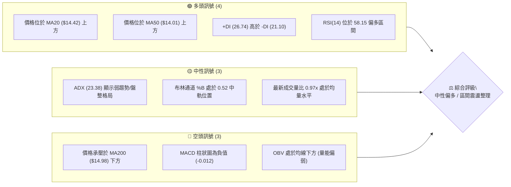

### 📊 核心指標速覽表

| 指標類別 | 指標名稱 | 當前數值 | 訊號 | 解讀 |
|:---|:---|:---|:---:|:---|
| **價格** | 當前收盤價 | $14.46 | 🟡 | 位於52週區間 41.9% 位置，處於區間震盪中軸 |
| **均線** | 短期 MA20 | $14.42 | 🟢 | 價格站於 MA20 之上 (+0.26%)，短線具備下檔支撐 |
| **均線** | 中期 MA50 | $14.01 | 🟢 | 價格高於 MA50 (+3.21%)，中期底部結構抬升 |
| **均線** | 長期 MA200 | $14.98 | 🔴 | 價格低於 MA200 (-3.47%)，長期均線上方形成壓制 |
| **動能** | RSI(14) | 58.15 | 🟡 | 處於 30-70 中性偏多區間，無超買或超賣跡象 |
| **動能** | MACD 柱狀圖 | -0.012 | 🔴 | MACD (0.214) 略低於 Signal (0.226)，動能微幅收斂 |
| **趨勢** | ADX(14) | 23.38 | 🟡 | ADX < 25 表明無強烈單邊趨勢，屬於區間箱體運行 |
| **通道** | 布林通道 %B | 0.52 | 🟡 | 緊貼中軌 $14.42，帶寬處於中性收斂狀態 |
| **波動** | ATR(14) | $0.72 | 🟡 | 日波動率 4.99%，提供標準止損與波段操作空間 |
| **量能** | 20日均量比 | 0.97x | 🔴 | OBV < MA，量能未出現爆發性配合，以存量博弈為主 |

### 🏆 技術評分卡

```
╔══════════════════════════════════════════════════════════════╗
║              NU 技術評分卡 (2026-09-02)                       ║
╠══════════════════════════════════════════════════════════════╣
║ 趨勢強度 (Trend)      █████████░░░░░░░░░░░  46/100  🟡 中性  ║
║ 動能指標 (Momentum)   ███████████░░░░░░░░░  54/100  🟡 中性  ║
║ 支撐穩定度 (Support)  █████████████░░░░░░░  65/100  🟢 偏多  ║
║ 成交量配合 (Volume)   ████████░░░░░░░░░░░░  40/100  🔴 偏弱  ║
║ 形態完整度 (Pattern)  ████████████░░░░░░░░  58/100  🟡 中性  ║
║ 均線排列 (MA Align)   ██████████░░░░░░░░░░  50/100  🟡 混合  ║
╠══════════════════════════════════════════════════════════════╣
║ 綜合技術評分          ██████████░░░░░░░░░░  52/100  🟡 區間  ║
║ 核心定調：盤整蓄勢格局 (ADX=23.38 < 25)，建議以區間波段應對   ║
╚══════════════════════════════════════════════════════════════╝
```

---

## 2. 趨勢分析

### 🌐 多時框趨勢分析

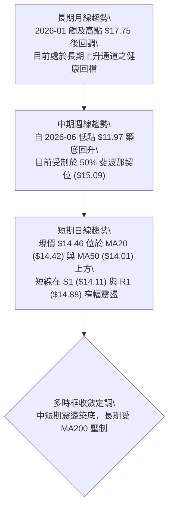

### 📈 長期趨勢 — 12個月走勢圖（Unicode）

```
NU 月線收盤走勢圖（2025-09 至 2026-09）
價格 ($)
$18.00 ┤                               ● (2026-01: $17.75)
$17.00 ┤                     ● (17.39) 
$16.00 ┤ ● (16.01)  ● (16.11)
$15.00 ┤                                       ● (14.98)           ● (14.55)
$14.00 ┤                                           ● (14.37) ● (14.48)   ● (14.46 現價)
$13.00 ┤                                                       ● (13.13) ● (13.36)
$12.00 ┤
       └─┬─────────┬─────────┬─────────┬─────────┬─────────┬─────────┬─────────┬─────────┬─────────┬─────────┬─────────┬──
       09/25     10/25     11/25     12/25     01/26     02/26     03/26     04/26     05/26     06/26     07/26     08/26   09/26
```

#### 走勢特徵分析表格

| 階段區間 | 起止價格 | 漲跌幅 | 走勢特徵描述 |
|:---|:---|:---:|:---|
| **2025-09 ～ 2026-01** | $16.01 → $17.75 | +10.87% | 強勢多頭主升段，創下波段收盤新高 $17.75 (52W 高點為 $18.98) |
| **2026-01 ～ 2026-05** | $17.75 → $13.13 | -26.03% | 獲利了結回吐段，跌破多條短期均線，於 2026-06 觸及波段低點 |
| **2026-06 ～ 2026-09** | $13.36 → $14.46 | +8.23%  | 築底震盪回升段，站穩 MA50 ($14.01)，進入收斂三角形/箱體整理 |

### 📊 中期趨勢（週線分析）

```
近期週線支撐與阻力結構示意圖
$16.00 ┤------------------------------------ [斐波那契 38.2% 回調位: $16.01]
$15.70 ┤------------------------------------ [關鍵阻力 R2: $15.70]
$15.09 ┤------------------------------------ [斐波那契 50.0% / MA200: $14.98-$15.09]
$14.88 ┤==================================== [關鍵阻力 R1: $14.88]
$14.46 ┤                  ◄─── [當前價格: $14.46]
$14.17 ┤------------------------------------ [斐波那契 61.8% / S1: $14.11-$14.17]
$13.44 ┤==================================== [布林下軌 / 關鍵支撐 S2: $13.41-$13.44]
$13.09 ┤------------------------------------ [關鍵支撐 S3: $13.09]
```

### ⚡ 趨勢強度評估（ADX 解讀）

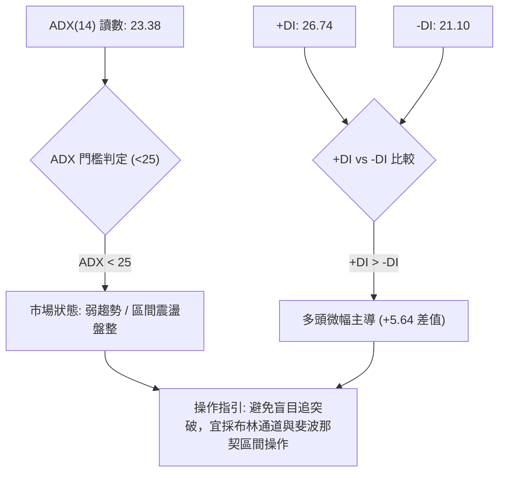

#### ADX 趨勢強度對照表

| 指標 | 數值 | 參考門檻 | 狀態判斷 | 交易意涵 |
|:---|:---:|:---:|:---:|:---|
| **ADX(14)** | 23.38 | 25.00 | 🟡 弱趨勢/盤整 | 行情不具備單邊爆發力，均線易反覆糾纏 |
| **+DI** | 26.74 | - | 🟢 多方力量 | 多方買盤佔據相對優勢 |
| **-DI** | 21.10 | - | 🔴 空方力量 | 空方拋壓已從 5-6 月的高峰顯著退潮 |
| **方向主導** | +DI 領先 | 差值 +5.64 | 🟢 多方微弱控盤 | 偏多震盪，下檔有承接力，但上攻動能有限 |

---

## 3. 圖表形態分析

### 🔍 形態識別系統

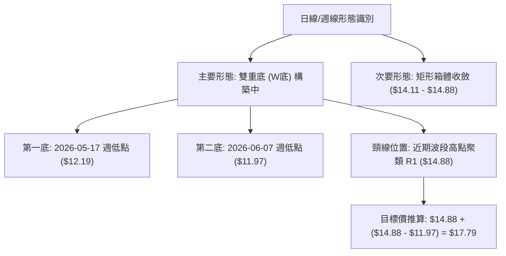

#### 形態信心度與參數表

| 形態名稱 | 信心度 | 判斷依據（引用數據） | 完成度 | 目標價（附計算式） |
|:---|:---:|:---|:---:|:---|
| **雙重底 (W底)** | 68% | 2026-05 週收盤 $12.19 與 2026-06 週收盤 $11.97 形成雙底，隨後收盤站上 MA50 ($14.01) | 75% | 頸線 $14.88 + 形態高度 ($14.88 - $11.97 = $2.91) = **$17.79** |
| **矩形箱體震盪** | 82% | 價格在 S1 ($14.11) 與 R1 ($14.88) 之間反覆震盪 4 週，ADX=23.38 支持盤整 | 90% | 箱頂突破目標: $14.88 + ($14.88 - $14.11) = **$15.65** (接近 R2 $15.70) |
| **布林帶收斂突破** | 45% | 布林帶寬收縮，%B 為 0.52，但成交量比 0.97x 尚不足以確認單邊破位 | 30% | 訊號不足，僅做指標型解讀 |

### 🕯️ 重要K線形態分析

| 週期/日期 | 收盤價 | K線形態 | 解讀 | 訊號 |
|:---|:---:|:---|:---|:---:|
| **2026-06-07 (週)** | $11.97 | 探底長下影線 | 於 52W 低點 $11.20 上方形成強支撐，爆量 4.73 億股確立波段底部 | 🟢 強烈看多 |
| **2026-07-05 (週)** | $13.61 | 連續陽線拉升 | 突破 60MA，RSI 上衝至 79.0，確立中期反彈動能 | 🟢 看多 |
| **2026-08-16 (週)** | $15.23 | 衝高回落長上影 | 觸及 50% 斐波那契回調位 ($15.09) 及 MA200 ($14.98) 遇阻回吐 | 🔴 短線看空 |
| **2026-09-02 (即時)** | $14.46 | 窄幅十字星/小陰線 | 貼近 MA20 ($14.42) 整理，買賣雙方勢均力敵，等待突破確認 | 🟡 中性觀望 |

### 📉 ASCII 走勢形態示意圖

```
NU 雙重底與矩形整理形態示意圖
$16.00 ┤
$15.70 ┤                                          [箱體向上突破測幅: $15.65 / R2 $15.70]
$14.88 ┤                  頸線/箱頂 (R1) ─────────┬─────────● ($14.88)
$14.46 ┤                                          │         ◄── 現價 $14.46
$14.11 ┤                                 箱底 (S1) ┴─────────
$13.50 ┤                    ● ($13.13)
$12.00 ┤        ● ($12.19)             ● ($11.97)
       │         第一底                  第二底
       └─────────┬──────────────────────┬────────────────────────► 時間
              2026-05                2026-06                   2026-09
```

### 🎯 形態目標價計算

1. **雙重底形態完整測幅**：
   - 形態底部低點：$11.97（2026-06-07 週收盤）
   - 形態頸線位置：$14.88（關鍵阻力 R1）
   - 形態高度：$14.88 - $11.97 = $2.91
   - 形態理論目標價 = 頸線 $14.88 + $2.91 = **$17.79**（接近 2026-01 波段高點 $17.75）

2. **短線矩形箱體突破測幅**：
   - 箱頂阻力：$14.88（R1）
   - 箱底支撐：$14.11（S1）
   - 箱體垂直高度：$14.88 - $14.11 = $0.77
   - 第一等距目標價 = $14.88 + $0.77 = **$15.65**（精確對應關鍵阻力 R2 $15.70）

---

## 4. 支撐與阻力

### 🗺️ 關鍵價位分布圖（Unicode）

```
NU 關鍵價位結構分布圖
═════════════════════════════════════════════════════════════════
$18.98 ║████████████████████████████████████║ 52週最高點 (52W High / Fib 0.0%)
$17.14 ║████████████████████████            ║ 斐波那契 23.6% 回調位
$16.42 ║████████████████                    ║ 強阻力 R3 (近一年波段高點聚類)
$16.01 ║██████████████                      ║ 斐波那契 38.2% 回調位
$15.70 ║██████████████████████              ║ 阻力 R2 (箱體測幅 / 波段高點聚類)
$15.09 ║████████████████                    ║ 斐波那契 50.0% / MA200 ($14.98) 密集壓制
$14.88 ║████████████████████████████        ║ 關鍵阻力 R1 (頸線位置 / +2.92%)
$14.46 ╠════════════════════════════════════╣ ◄─── 當前現價 ($14.46)
$14.17 ║▓▓▓▓▓▓▓▓▓▓▓▓▓▓▓▓▓▓▓▓▓▓▓▓▓▓▓▓        ║ 斐波那契 61.8% 黃金分割回調位
$14.11 ║▓▓▓▓▓▓▓▓▓▓▓▓▓▓▓▓▓▓▓▓▓▓▓▓▓▓▓▓▓▓▓▓    ║ 近期關鍵支撐 S1 (波段低點聚類 / -2.46%)
$13.44 ║████████████████████████████        ║ 布林通道下軌 ($13.44)
$13.41 ║████████████████████████████████    ║ 強支撐 S2 (波段低點聚類 / -7.26%)
$13.09 ║████████████████████████████████████║ 核心防守支撐 S3 (-9.51%)
$11.20 ║████████████████████████████████████║ 52週最低點 (52W Low / Fib 100.0%)
═════════════════════════════════════════════════════════════════
```

### 🚧 阻力位分析表

| 阻力級別 | 精確價位 | 距離現價 | 形成原因（依據數據聚類） | 突破難度 | 重要性 |
|:---|:---:|:---:|:---|:---:|:---:|
| **R1** | **$14.88** | +2.92% | 近一年波段高點聚類、雙底頸線、MA5 ($14.84) 壓制 | 🟡 中等 | ★★★★☆ |
| **R2** | **$15.70** | +8.54% | 近一年密集套牢區高點聚類、箱體突破等距測幅位 | 🔴 較高 | ★★★★☆ |
| **R3** | **$16.42** | +13.58% | 2025 年第四季歷史整理平台密集峰區 | 🔴 極高 | ★★★☆☆ |

### 🛡️ 支撐位分析表

| 支撐級別 | 精確價位 | 距離現價 | 形成原因（依據數據聚類） | 守住機率 | 重要性 |
|:---|:---:|:---:|:---|:---:|:---:|
| **S1** | **$14.11** | -2.46% | 近期波段低點聚類、共振 61.8% 斐波那契位 ($14.17) 與 MA50 ($14.01) | 🟢 75% | ★★★★★ |
| **S2** | **$13.41** | -7.26% | 近一年波段強支撐聚類、布林下軌 ($13.44) 匯聚處 | 🟢 85% | ★★★★☆ |
| **S3** | **$13.09** | -9.51% | 2026-05 月線級別大底支撐區 | 🟢 95% | ★★★☆☆ |

### 📐 斐波那契回調位分析

> 計算基準：52週波動區間（低點 **$11.20** → 高點 **$18.98**，垂直落差 $7.78）

| 回調比例 | 精確價位 | 相對現價位置 | 技術意義與市場心理 |
|:---:|:---:|:---:|:---|
| **0.0% (52W High)** | **$18.98** | +31.26% | 歷史牛市極限高點，中長期多頭終極目標 |
| **23.6%** | **$17.14** | +18.53% | 強勢回檔阻力區，若突破則確立多頭主升段重啟 |
| **38.2%** | **$16.01** | +10.72% | 弱勢反彈阻力位，2025-09 月線收盤價匯聚處 |
| **50.0%** | **$15.09** | +4.36% | **多空中樞分水嶺**，緊鄰 MA200 ($14.98)，為多頭能否轉強之關鍵 |
| **61.8%** | **$14.17** | -2.01% | **黃金分割支撐位**，現價 ($14.46) 守穩其上，中期多頭結構未破壞 |
| **78.6%** | **$12.86** | -11.07% | 深幅回調防守線，跌破則預示將重測 52W 低點 |
| **100.0% (52W Low)** | **$11.20** | -22.55% | 52週週期底部，強烈價值投資買盤錨定點 |

**解讀**：現價 **$14.46** 正處於 **61.8% ($14.17)** 與 **50.0% ($15.09)** 的黃金通道之間。只要收盤不有效跌破 $14.17/$14.11，技術結構即處於良性的「黃金分割回踩確認」階段。

---

## 5. 技術指標深度解讀

### 🎛️ 指標訊號總覽

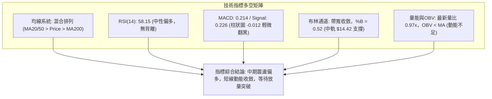

### 📈 移動平均線排列分析

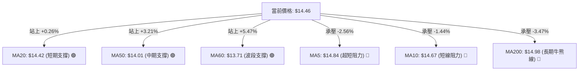

#### 均線系統明細表

| 均線名稱 | 數值 | 偏離率 | 走勢特徵 | 訊號解讀 |
|:---|:---:|:---:|:---|:---:|
| **MA 5** | $14.84 | -2.56% | 衝高回落向下扣減 | 🔴 短期壓制 |
| **MA 10** | $14.67 | -1.44% | 走平微跌 | 🔴 短線阻力 |
| **MA 20** | $14.42 | +0.26% | 向上攀升，提供動態支撐 | 🟢 短期看多 |
| **MA 50** | $14.01 | +3.21% | 穩健向上，中期多頭基石 | 🟢 中期看多 |
| **MA 60** | $13.71 | +5.47% | 底部持續上移 | 🟢 底部穩固 |
| **MA 120** | $13.82 | +4.67% | 走平回升 | 🟢 半年線走多 |
| **MA 200** | $14.98 | -3.47% | 緩步下行，牛熊分界線 | 🔴 長期壓制 |
| **MA 240** | $15.10 | -4.23% | 下行斜率減緩 | 🔴 年線阻力 |

**排列結論**：均線呈現「短中期多頭（MA20/MA50/MA60）vs 長期空頭（MA200/MA240）」的**混合夾心排列**。價格被夾在 MA20 ($14.42) 與 MA200 ($14.98) 之間，意味著此處必須經過充分換手蓄勢，方能展開方向性突破。

### 📉 RSI(14) 分析

```
RSI(14) 讀數儀表盤：58.15
0 ──────────── 30 ────────────────────── 58.15 ──────────── 70 ──────────── 100
超賣區間        弱勢區間                  當前值 (中性偏多)   超買區間
進度展示：███████████████████████░░░░░░░░░░░░░░░░ 58.15%
```

- **區間評估**：RSI(14) 目前為 **58.15**，既未觸及 >70 超買警戒，亦遠高於 <30 超賣水準，處於健康的多頭主導常態震盪區。
- **背離分析**：
  - 價格於 2026-08 創反彈高點 $15.23 時，週線 RSI 為 58.0；目前價格 $14.46，RSI 為 58.15，**無頂背離或底背離跡象**。
  - 動能與價格走勢同步，表明當前回檔純屬健康的技術性消化。

### 📊 MACD(12/26/9) 訊號解讀

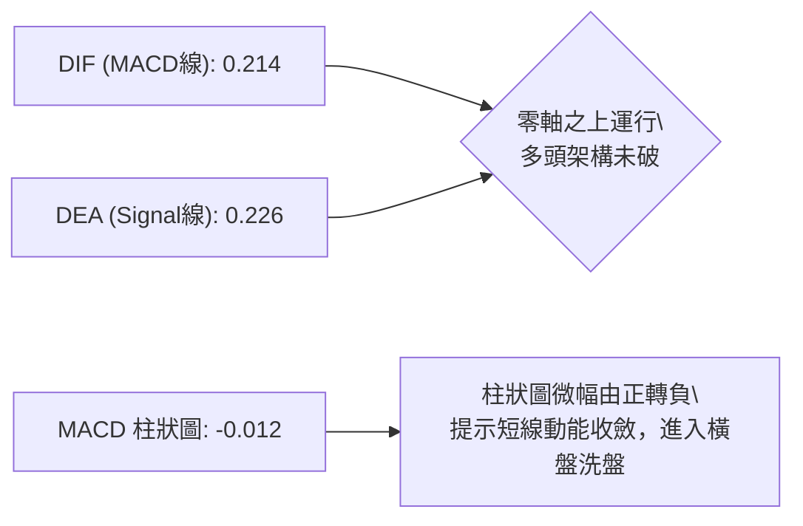

- **MACD 線**：0.214
- **訊號線 (Signal)**：0.226
- **柱狀圖 (Histogram)**：-0.012（微幅負值）
- **解讀**：DIF 與 DEA 均維持在零軸上方，確認自 6 月以來的反彈波段仍屬多頭範疇；惟柱狀圖出現 -0.012 之微弱死叉，反映短線上衝 R1 ($14.88) 遇阻後的動能遞減，預示短期以橫向盤整替代大幅下跌。

### 📦 布林通道分析

```
布林通道 (20, 2) 結構圖
$15.41 ┤---------------------------------------- 上軌 (Upper Band: $15.41)
       │
$14.46 ┤======================================== 當前價格 ($14.46, %B = 0.52)
$14.42 ┤---------------------------------------- 中軌 / MA20 (Middle Band: $14.42)
       │
$13.44 ┤---------------------------------------- 下軌 (Lower Band: $13.44)
```

- **上軌**：$15.41
- **中軌 (MA20)**：$14.42
- **下軌**：$13.44
- **帶寬與位置**：%B 為 **0.52**，現價幾乎精準貼合布林中軌 $14.42。布林通道帶寬收窄，表明前期波動率已快速衰減，市場正在中軌凝聚共識，通常預示著未來 1-2 週內將出現由波動收縮轉向波動擴張的突破行情。

### 💹 成交量分析（量價配合度）

```
成交量對比
最新日成交量  : 67,501,000  █████████████████░░░ (0.97x)
20日平均成交量: 69,454,650  ██████████████████░░ (基準 1.00x)
50日平均成交量: 78,997,010  ████████████████████ (中長期量能)
```

- **量比與換手**：最新成交量 67.50M 股，相較於 20 日均量 69.45M 股，量比為 **0.97x**，屬於典型的「縮量盤整」狀態。
- **OBV 能量潮**：當前 OBV 處於其均線下方，顯示主力資金在現階段以觀望與小幅洗盤為主，並未出現激進建倉或恐慌派發。
- **量價背離檢驗**：自 7-8 月巨量反彈（週成交量達 4-7 億股）後，近期回檔呈現量縮態勢（最新週量 1.62 億股），符合「漲有量、跌無量」的良性整理特徵。

---

## 6. 動能與波動率

### ⚡ 動能評估四象限

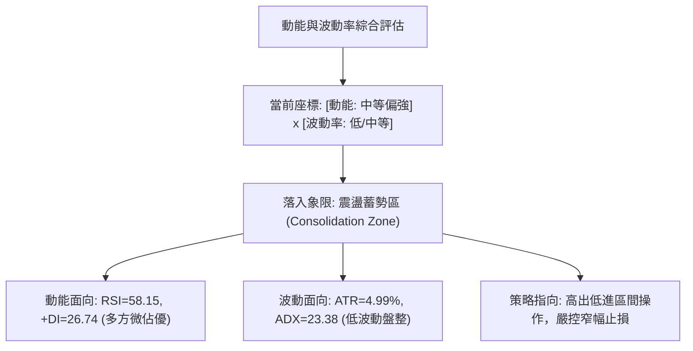

#### 動能/波動狀態矩陣表

| 象限標籤 | 動能狀態 | 波動率狀態 | 當前符合 | 交易決策指引 |
|:---|:---:|:---:|:---:|:---|
| **Q1 (主升機會)** | 強 (RSI>60, ADX>30) | 低/中 (ATR<4%) | — | 最佳順勢突破買點 |
| **Q2 (震盪蓄勢)** | **中/偏強 (RSI 50-60)** | **低/中 (ATR 4.99%, ADX 23.38)** | **✓ (當前狀態)** | **適合區間高拋低吸，等待突破** |
| **Q3 (劇烈博弈)** | 強 (雙向激烈) | 高 (ATR>7%) | — | 減倉觀望，防範假突破 |
| **Q4 (陰跌衰退)** | 弱 (RSI<40, -DI主導) | 高 (放量下挫) | — | 嚴格止損離場，禁止抄底 |

### 📊 ATR 波動率分析

- **ATR(14) 絕對值**：**$0.72**
- **ATR 佔價格比**：**4.99%**
- **止損與波動距離換算**：
  - **1.0x ATR（短線緊密止損）**：$0.72 → 離現價約 $13.74
  - **1.5x ATR（標準波段止損）**：$1.08 → 離現價約 $13.38（完美覆蓋強支撐 S2 $13.41 及布林下軌 $13.44）
  - **2.0x ATR（寬鬆趨勢防守）**：$1.44 → 離現價約 $13.02（覆蓋 S3 $13.09）

### 📐 Beta 與市場相關性

- **Beta 係數**：**0.942**
- **市場敏感度解讀**：NU 的 Beta 值極其貼近大盤（1.00），表明其走勢與美股大盤（標普500/金融板塊）具有高度同步性。在無個股突發重大利好的盤整期，大盤系統性環境將直接決定 NU 能否突破 R1 ($14.88) 或跌破 S1 ($14.11)。

---

## 7. 多時框架總結

### 📋 時框架評分表

| 時框架 | 趨勢方向 | 動能狀態 | 均線系統 | 形態結構 | 綜合評分 | 操作建議 |
|:---|:---:|:---:|:---:|:---:|:---:|:---|
| **日線 (Daily)** | 🟡 橫盤震盪 | 🟡 RSI 58.15 / MACD -0.012 | 🟢 站上 MA20/50 | 🟡 矩形箱體 | **54/100** | 區間內高出低進，以中軌 $14.42 為錨 |
| **週線 (Weekly)** | 🟢 震盪回升 | 🟢 +DI 領先 / 6月大底抬升 | 🟡 突破中短期均線 | 🟢 雙底形態右側 | **62/100** | 逢回踩 61.8% 斐波那契位分批低吸 |
| **月線 (Monthly)** | 🔴 長期回調 | 🔴 遠離 1月高點 $17.75 | 🔴 受制 MA200/240 | 🟡 歷史高檔回檔整理 | **42/100** | 長線持股需等待站穩 $15.00 方可加碼 |

### 🔲 綜合訊號矩陣

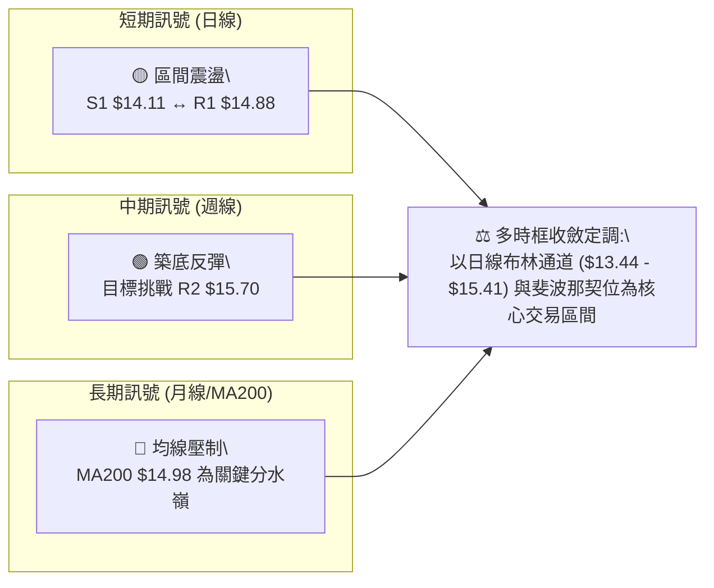

### ⚖️ 多時框收斂結論

依據多時框收斂規則（嚴格要求 14）：
1. **行情性質判定**：當前 ADX(14) 讀數為 **23.38 (<25)**，明確定義當前處於**盤整震盪行情**而非單邊趨勢行情。
2. **主導維度取捨**：由於處於盤整行情，日線布林通道上下軌（**$13.44 ～ $15.41**）及關鍵支撐阻力（**S1 $14.11 ～ R1 $14.88**）構成主要交易邊界，週線的雙底反彈形態則提供下檔支撐的偏多底氣。
3. **唯一收斂結論**：**中性偏多觀望 / 區間震盪波段操作（Neutral-Bullish Range Trading）**。短期內價格難以直接單邊貫穿 MA200 ($14.98)，亦難以實質跌破 S1/S2 重兵防守區，最佳策略為在區間邊界嚴格執行低吸高拋。

---

## 8. 交易策略建議

### 🗺️ 策略決策流程圖

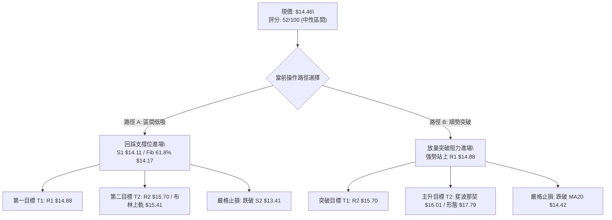

### 🧭 策略路由

> **當前主策略方向 = 區間震盪低吸與突破確認策略（依綜合評分 52/100 定調）**
> 綜合評分處於 40–60 中性區間，市場受制於 ADX < 25 之盤整特性，主推「支撐位回踩低吸（策略 A）」與「關鍵頸線突破跟進（策略 B）」。

### 🎯 價格情境階梯（Price Scenarios）

| 觸發條件 | 下一目標 | 後續延伸目標 | 情境含義與操作指引 |
|:---|:---:|:---:|:---|
| **向上突破 R1 $14.88** | **R2 $15.70** | **R3 $16.42** | 短線轉強，W底頸線確立突破，可追買加碼 |
| **維持現價區間 ($14.11 - $14.88)** | **MA20 $14.42** | **布林上軌 $15.41** | 區間震盪整理，高出低進，以中軌為軸心 |
| **向下跌破 S1 $14.11** | **S2 $13.41** | **S3 $13.09** | 中期轉弱，回測布林下軌及 5-6 月築底平台，宜減倉 |

### 📊 情境機率分佈

| 情境劇本 | 機率估計 | 主要技術指標依據 |
|:---|:---:|:---|
| **情境一：區間震盪整理** | **50%** | ADX(14)=23.38 處於盤整區間；成交量比 0.97x 顯示縮量；布林帶寬收斂 |
| **情境二：震盪走高突破** | **30%** | RSI(14)=58.15 偏多；+DI(26.74) > -DI(21.10)；價格穩居 MA20/MA50 之上 |
| **情境三：回測深幅支撐** | **20%** | MACD 柱狀圖微負 (-0.012)；MA200 ($14.98) 形成中長期壓制 |

### 🟢 主策略詳情

| 策略要素 | 策略 A（區間下緣回踩低吸 - 推薦首選） | 策略 B（突破頸線順勢追價 - 突破確認） |
|:---|:---|:---|
| **進場條件** | 價格回踩至 61.8% 斐波那契位或 S1 出現止跌陽線 | 日線收盤價放量實體突破 R1 阻力位 |
| **精確進場點** | **$14.17**（或 $14.11 - $14.17 區間） | **$14.90**（突破 R1 $14.88 確認） |
| **目標價 T1** | **$14.88**（關鍵阻力 R1 / +5.01%） | **$15.70**（阻力 R2 / +5.37%） |
| **目標價 T2** | **$15.41**（布林通道上軌 / +8.75%） | **$16.01**（38.2% 斐波那契位 / +7.45%） |
| **精確止損點** | **$13.41**（跌破強支撐 S2 及布林下軌 / -5.36%） | **$14.42**（跌破 MA20 中軌轉弱 / -3.22%） |
| **風險報酬比** | **1 : 1.63**（以 T2 計算） | **1 : 2.31**（以 T2 計算） |
| **預估勝率** | **65%** | **55%** |
| **建議倉位** | **15% - 20%**（分批低吸） | **10% - 15%**（突破確認後加碼） |

### 🔴 反向風險觸發點（對沖提示）

- **空頭風險觸發價位**：**日線收盤跌破 S1 ($14.11)** 且伴隨 RSI 跌破 50。
- **風控應對動作**：若跌破 $14.11，意味著短期區間破位，多頭應立即將倉位縮減 50%；若進一步跌破 **S2 ($13.41)**，則多頭結構徹底破壞，應全數停損離場，或建立空頭對沖部位下看 S3 ($13.09)。

### ⭐ 整體訊號強度評星

```
╔══════════════════════════════════════════════════════════════╗
║ 做多訊號強度：  ★★★☆☆  (3.0/5星 - 中期築底完成，等待放量)   ║
║ 做空訊號強度：  ★★☆☆☆  (2.0/5星 - 下檔均線支撐密集)         ║
║ 整體技術可信度：★★★★☆  (4.0/5星 - 價位聚類明確，形態完整)     ║
╚══════════════════════════════════════════════════════════════╝
```

---

## 9. 風險提示與監控

### ✅ 關鍵監控指標 Checklist

```
╔══════════════════════════════════════════════════════════════╗
║              NU 關鍵技術監控清單 (Checklist)                  ║
╠══════════════════════════════════════════════════════════════╣
║ [ ] 監控價位 R1 ($14.88)：是否放量長陽突破，啟動雙底量度升幅    ║
║ [ ] 監控價位 S1 ($14.11)：是否能發揮斐波那契 61.8% 強支撐作用  ║
║ [ ] 監控 MA20 ($14.42)：每日收盤價是否持續站穩布林中軌之上    ║
║ [ ] 監控 MACD 柱狀圖：負值 (-0.012) 是否重新翻紅收斂金叉      ║
║ [ ] 監控 ADX 數值：是否自 23.38 突破 25，提示單邊趨勢來臨      ║
║ [ ] 監控成交量：突破時日成交量是否放大至 8,000 萬股以上 (1.2x) ║
║ [ ] 監控 MA200 ($14.98)：首次觸碰時之拋壓反應與回洗深度       ║
╚══════════════════════════════════════════════════════════════╝
```

### ⚠️ 風險場景分析

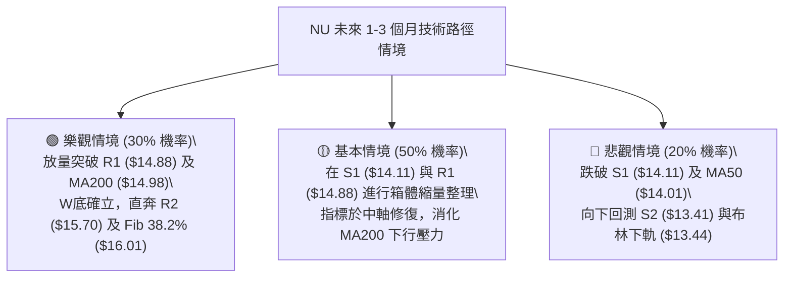

### 🛡️ 風險管理重要提醒

1. **ATR 波動保護**：當前 ATR 為 **$0.72 (4.99%)**，單日正常震盪幅度較大，盤中切忌使用過於狹窄的止損（如 < $0.30），以防被日內雜訊洗盤出場；止損距離應至少維持在 1.5x ATR（約 $1.08）或錨定在關鍵支撐位 **S2 ($13.41)**。
2. **均線夾心風險**：價格位於 MA50 ($14.01) 與 MA200 ($14.98) 的狹窄區間內，均線摩擦成本高，切忌在 $14.70-$14.88 阻力區盲目追高。
3. **倉位管理法則**：在 ADX < 25 之盤整市況下，單一標的總持倉不宜超過總資金之 **20%**，建議採取「底倉 10% + 突破加碼 10%」之金字塔建倉法。

---

## 10. 報告總結

```
╔══════════════════════════════════════════════════════════════════╗
║                    NU 技術分析總結儀表板                         ║
╠══════════════════════════════════════════════════════════════════╣
║ 報告日期：2026-09-02                                             ║
║ 當前價格：$14.46                                                 ║
║ 分析評級：⚖️ 中性偏多 / 區間震盪整理 (評分: 52/100)               ║
╠══════════════════════════════════════════════════════════════════╣
║ 關鍵結論：                                                       ║
║ ├─ 長期趨勢：🟡 中性回檔（2026-01 創 $17.75 後回調，受制 MA200） ║
║ ├─ 中期趨勢：🟢 震盪築底（6月 $11.97 雙底確立，站上 MA50 $14.01） ║
║ ├─ 短期趨勢：🟡 橫盤蓄勢（運行於 S1 $14.11 ↔ R1 $14.88 箱體內）  ║
║ ├─ 核心支撐：S1 $14.11 (近期低點) / S2 $13.41 (強支撐/布林下軌)  ║
║ ├─ 核心阻力：R1 $14.88 (頸線高點) / R2 $15.70 (測幅阻力)         ║
║ └─ 分析師目標價：均價 $18.78 (最低 $10.00 / 最高 $23.00)         ║
╠══════════════════════════════════════════════════════════════════╣
║ 最優策略組合：                                                   ║
║ 1. 🥇 最佳機會（首選）：回踩斐波那契 61.8% 位 $14.17 (S1 $14.11)  ║
║    建立 15% 倉位，止損設於 $13.41，目標看至 $14.88 與 $15.41。  ║
║ 2. 🥈 次選機會（突破）：若放量站上 R1 $14.88，順勢追買 10% 倉位，║
║    止損設於 MA20 $14.42，目標看至 R2 $15.70 與 Fib $16.01。     ║
║ 3. 🥉 保守選擇：在價格突破 $14.88 或跌至 $13.44 前保持空倉觀望。  ║
╚══════════════════════════════════════════════════════════════════╝
```

---

> ⚠️ **免責聲明**：本報告為技術分析研究成果，所有價位、圖表與指標均基於歷史量價數據計算。本報告**僅供研究與學術參考**，**不構成任何要約、招攬或投資建議**。金融市場瞬息萬變，交易決策請務必結合自身風險承受能力並設定嚴格止損。

---

*報告生成時間：2026-09-02 ｜ 數據來源：Yahoo Finance ｜ 分析框架：多時框架量化技術體系*