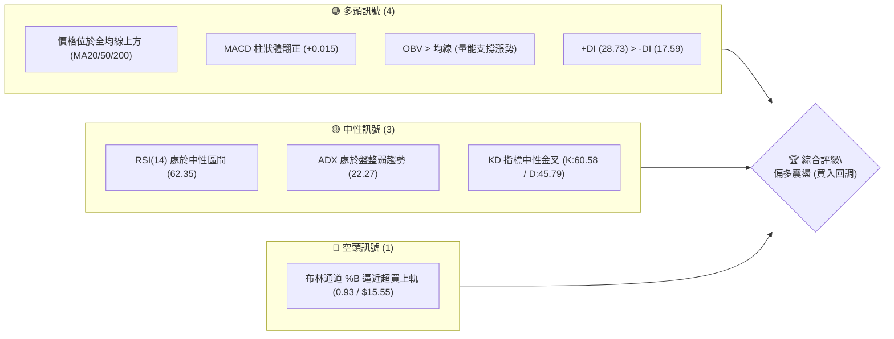
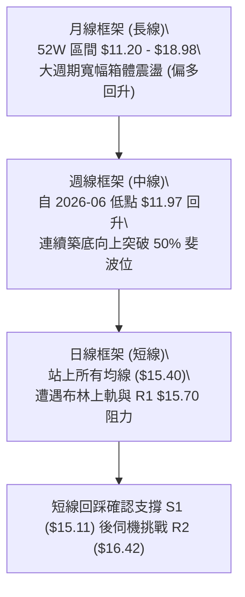
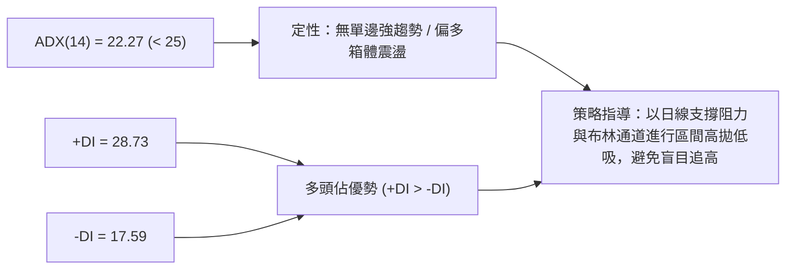
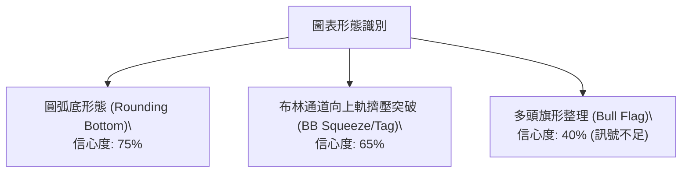
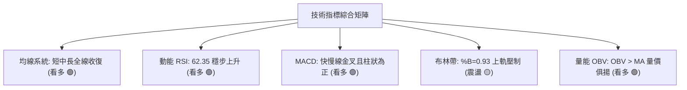
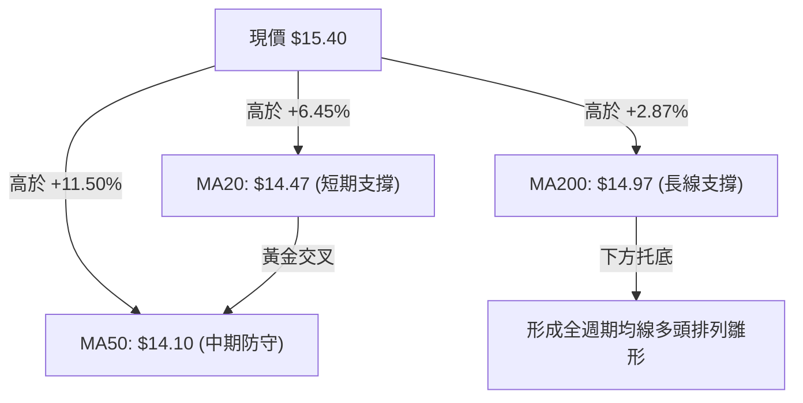
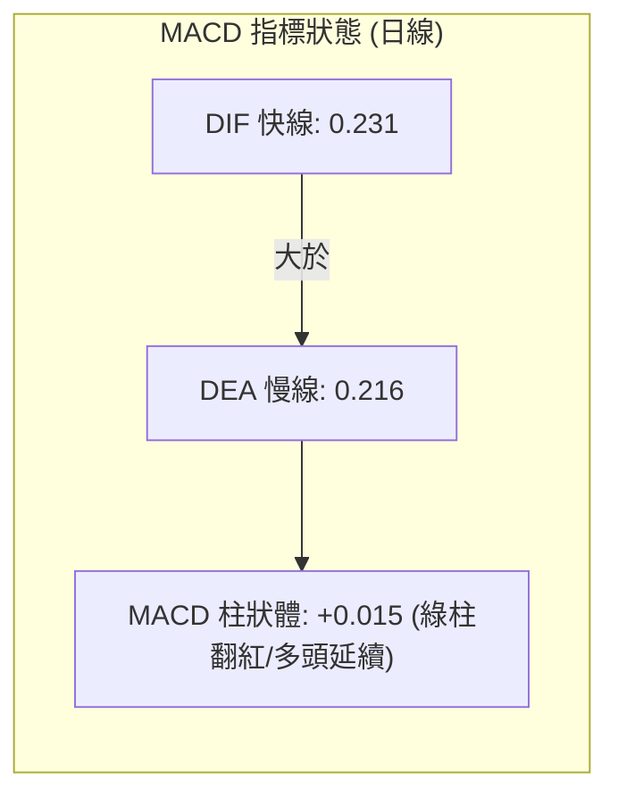
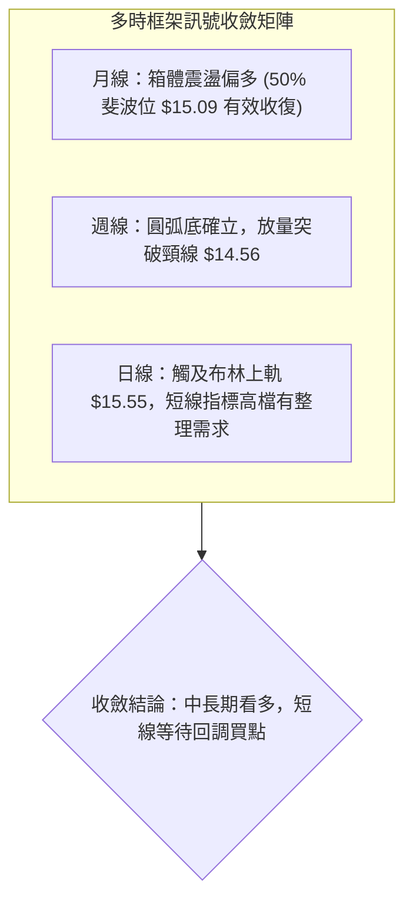
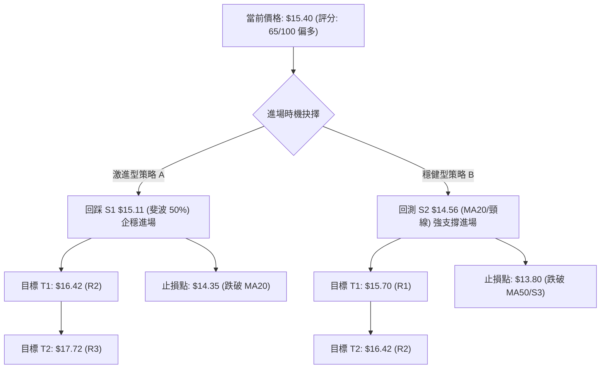
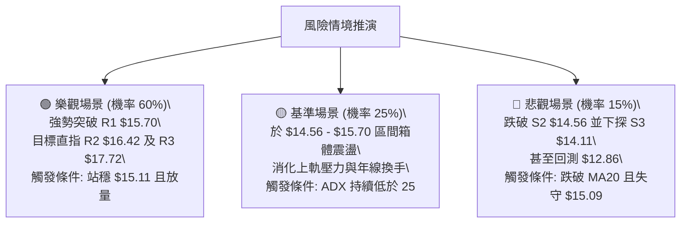

# NU 技術分析報告

> **報告日期**：2026-09-03 ｜ **語言**：繁體中文 ｜ **數據來源**：Yahoo Finance ｜ **當前價格**：$15.40

---

## 目錄

| 章節 | 內容 |
|------|------|
| [1. 技術面概覽](#1-技術面概覽) | 訊號儀表板、核心指標、評分卡 |
| [2. 趨勢分析](#2-趨勢分析) | 多時框趨勢、長中短期走勢 |
| [3. 圖表形態分析](#3-圖表形態分析) | 形態識別、K線組合、目標價 |
| [4. 支撐與阻力](#4-支撐與阻力) | 關鍵價位、斐波那契回調 |
| [5. 技術指標深度解讀](#5-技術指標深度解讀) | MA/RSI/MACD/布林/成交量 |
| [6. 動能與波動率](#6-動能與波動率) | 動能評估、ATR、Beta |
| [7. 多時框架總結](#7-多時框架總結) | 時框架評分矩陣 |
| [8. 交易策略建議](#8-交易策略建議) | 多空策略、風險報酬比 |
| [9. 風險提示與監控](#9-風險提示與監控) | 監控指標、風險場景 |

---

## 1. 技術面概覽

### 🎯 技術訊號儀表板



### 📊 核心指標速覽表

| 指標類別 | 指標名稱 | 當前數值 | 訊號 | 解讀 |
|----------|----------|----------|------|------|
| **價格** | 當前收盤價 | $15.40 | 🟢 | 站上多條關鍵均線，短線強勢反彈 |
| **均線** | 短期 MA20 | $14.47 | 🟢 | 現價高於 MA20（乖離 +6.45%），短線多頭掌控 |
| **均線** | 中期 MA50 | $14.10 | 🟢 | 現價高於 MA50，中期底部結構穩固 |
| **均線** | 長期 MA200 | $14.97 | 🟢 | 現價重新收復年線關鍵分水嶺，長線結構轉強 |
| **動能** | RSI(14) | 62.35 | 🟡 | 位於強勢中性區（未達超買70），多頭仍有推升空間 |
| **動能** | MACD (12,26,9) | Hist: +0.015 | 🟢 | MACD (0.231) 位於 Signal (0.216) 之上，黃金交叉發酵 |
| **趨勢** | ADX (14) | 22.27 | 🟡 | 數值 < 25 表明處於無單邊趨勢之區間震盪行情 |
| **通道** | Bollinger Bands | %B = 0.93 | 🔴 | 逼近上軌 $15.55，短線具備回踩中軌 $14.47 壓力 |
| **量能** | 20日成交均量 | 80.78M (1.13x) | 🟢 | 突破過程成交量超越 20 日均量，量價配合健康 |
| **波動** | ATR (14) | $0.76 (4.94%) | 🟡 | 日內平均波動度約 5%，適合作為動態止損基準 |

### 🏆 技術評分卡

```
╔══════════════════════════════════════════════════════════════════╗
║              技術評分卡 — NU (2026-09-03)                         ║
╠══════════════════════════════════════════════════════════════════╣
║ 趨勢強度 (Trend)      ██████████░░░░░░░░░░  52/100  🟡 中性 (ADX<25)║
║ 動能指標 (Momentum)    ██████████████░░░░░░  70/100  🟢 強勢偏多    ║
║ 支撐穩定度 (Support)  ████████████████░░░░  78/100  🟢 底部紮實    ║
║ 成交量配合 (Volume)   ████████████░░░░░░░░  62/100  🟢 價量配合    ║
║ 形態完整度 (Pattern)  ██████████████░░░░░░  68/100  🟢 圓弧底成形  ║
║ 均線排列 (Moving Avg) ████████████░░░░░░░░  60/100  🟡 混合初轉多  ║
╠══════════════════════════════════════════════════════════════════╣
║ 綜合評分              █████████████░░░░░░░  65/100  🟢 偏多震盪    ║
╚══════════════════════════════════════════════════════════════════╝
```

---

## 2. 趨勢分析

### 🌐 多時框趨勢分析



### 📈 長期趨勢 — 12個月走勢圖（Unicode）

```
NU 月線走勢圖（2025-09 至 2026-09）
價格軸 ($)
$18.00 ┤                             ● (2026-01: $17.75)
$17.00 ┤                  ●     ●
$16.00 ┤            ●     
$15.00 ┤      ●                 ●                 ●←現價 $15.40
$14.00 ┤                                    ●  ●
$13.00 ┤                               ●  ●
$12.00 ┤                                    
       └───────────────────────────────────────────────
        09-25 10-25 11-25 12-25 01-26 02-26 03-26 04-26 05-26 06-26 07-26 08-26 09-26
```

#### 走勢特徵分析表格

| 階段區間 | 時間跨度 | 起訖價位 | 漲跌幅 | 走勢結構與技術特徵 |
|----------|----------|----------|--------|--------------------|
| **強勢主升段** | 2025-09 ~ 2026-01 | $16.01 → $17.75 | +10.87% | 多頭推升波段，創下 52 週高點 $18.98 附近次高收盤 |
| **大幅回調段** | 2026-01 ~ 2026-05 | $17.75 → $13.13 | -26.03% | 均線多頭潰散，跌破各級短期支撐，週線 RSI 降至 20.8 超賣 |
| **打底築底段** | 2026-05 ~ 2026-06 | $13.13 → $11.97 | -8.83% | 2026-06 探底 $11.97（逼近 52W 低點 $11.20）爆出 473M 大量見底 |
| **穩步復甦段** | 2026-06 ~ 2026-09 | $11.97 → $15.40 | +28.65% | 圓弧底反彈，逐級收復 MA20、MA50、MA200，重回 50% 斐波位 |

### 📊 中期趨勢（週線分析）

```
NU 週線阻力與支撐結構示意圖
══════════════════════════════════════════════════════════════════
 $17.72 ───────────────────────────────────────── 強阻力 R3 (前波頂部)
 $16.42 ───────────────────────────────────────── 波段阻力 R2
 $15.70 ───────────────────────────────────────── 近端阻力 R1 (布林上軌聚類)
 $15.40 ───●◄ 當前價格 (突破 50% 回調位 $15.09)
 $15.11 ───────────────────────────────────────── 核心支撐 S1 (MA240/斐波 50%)
 $14.56 ───────────────────────────────────────── 波段支撐 S2 (MA20/BB中軌)
 $14.11 ───────────────────────────────────────── 強力防守 S3 (MA50/斐波 61.8%)
══════════════════════════════════════════════════════════════════
```

### ⚡ 趨勢強度評估（ADX 解讀）



#### ADX 強度對照表

| 指標變量 | 數值 | 臨界標準 | 狀態評估 | 實戰指導含義 |
|----------|------|----------|----------|--------------|
| **ADX 趨勢強度** | 22.27 | < 25 (弱/震盪) | 🟡 震盪整理 | 趨勢尚未進入單邊爆發期，慎防追高被套，適合拉回買進 |
| **+DI 正向動能** | 28.73 | > 25 (多頭主導) | 🟢 買盤積極 | 多頭推升意願強烈，主導市場方向 |
| **-DI 負向動能** | 17.59 | < 20 (空頭疲弱) | 🟢 拋壓減輕 | 空方下殺動能逐步耗盡，空頭回補明顯 |

---

## 3. 圖表形態分析

### 🔍 形態識別系統



#### 形態信心度評估表

| 形態名稱 | 信心度 | 判斷依據（引用數據） | 完成度 | 目標價（附精確計算式） |
|----------|--------|----------------------|--------|------------------------|
| **大型圓弧底 (Rounding Bottom)** | **75%** | 自 2026-05 之 $12.19 下探至 2026-06 底部 $11.97，隨後於 7-8 月以 $13.59~$14.58 溫和墊高放量收復 | 85% | 頸線 $14.56 + (頸線 $14.56 - 底部 $11.97) = **$17.15** (接近阻力區間) |
| **布林上軌突破走勢 (Band Push)** | **65%** | %B 達到 0.93，收盤價 $15.40 逼近上軌 $15.55，量能大於 20MA (1.13x) | 70% | 依波動度計算：突破 R1 $15.70 後直指 **R2: $16.42** |
| **高檔旗形整理 (Bull Flag)** | **40%** | 近 3 週於 $14.30~$15.40 震盪，但 ADX 僅 22.27 | 35% | *訊號不足，僅做指標型震盪解讀，不預設延伸目標* |

### 🕯️ 重要K線形態分析

| 週/月份週期 | 收盤價 | K線形態 | 量能配合 | 技術解讀與訊號 |
|-------------|--------|---------|----------|----------------|
| **2026-06-07 週** | $11.97 | 爆量長下影十字星 | 473.47M (巨量) | 🟢 恐慌盤湧出後的終極洗盤，確立 52 週次低點與波段大底 |
| **2026-07-19 週** | $13.59 | 天量換手十字實體 | 762.06M (歷史天量) | 🟢 主力籌碼大規模換手完成，隨後連續數週陽線推升 |
| **2026-08-16 週** | $15.23 | 中長陽線長紅突破 | 381.42M (放量) | 🟢 強勢長紅收復年線關卡，確認中期底部反轉 |
| **2026-09-06 週** | $15.40 | 光腳小陽線（當前） | 243.55M (溫和放量) | 🟢 延續多頭攻勢，挑戰布林上軌，指標無頂背離 |

### 📉 ASCII 走勢形態示意圖

```
NU 圓弧底突破示意圖
價格
$16.00 ┤                                       ┌──► 目標 R2: $16.42
$15.50 ┤                                    ╭──╯ ◄ 現價 $15.40 (逼近 R1 $15.70)
$15.00 ┤────────頸線突破位 $14.56 ───────────╭─╯
$14.50 ┤      ●                           ●
$14.00 ┤       ╰╮                       ╭╯
$13.50 ┤        ╰╮                     ╭╯
$13.00 ┤         ╰╮                   ╭╯
$12.50 ┤          ╰╮                 ╭╯
$12.00 ┤           ╰──●─────────────╯ ◄ 波段最低點 $11.97 (2026-06)
       └─────────────────────────────────────────────────────────────
         2026-04   2026-05   2026-06   2026-07   2026-08   2026-09
```

---

## 4. 支撐與阻力

### 🗺️ 關鍵價位分布圖（Unicode）

```
NU 價位結構分布圖
══════════════════════════════════════════════════════════════════
 $17.72 ║████████████████████████████████║ 強阻力 R3 (前波頂部波段高點)
 $17.14 ║▓▓▓▓▓▓▓▓▓▓▓▓▓▓▓▓▓▓▓▓▓▓▓▓▓▓      ║ 斐波那契 23.6% 回調位
 $16.42 ║████████████████████            ║ 重要阻力 R2 (波段高點聚類)
 $16.01 ║▓▓▓▓▓▓▓▓▓▓▓▓▓▓▓▓▓▓              ║ 斐波那契 38.2% 回調位
 $15.70 ║████████████████████████        ║ 短線阻力 R1 (布林上軌 $15.55 延伸聚類)
 $15.40 ╠════════════════════════════════╣ ◄ 當前價格 $15.40
 $15.11 ║▓▓▓▓▓▓▓▓▓▓▓▓▓▓▓▓▓▓▓▓▓▓▓▓        ║ 第一支撐 S1 (斐波那契 50.0% / MA240)
 $14.56 ║████████████████████████████    ║ 核心支撐 S2 (頸線位 / MA20 $14.47)
 $14.11 ║████████████████████████████████║ 強力防守 S3 (MA50 $14.10 / 斐波 61.8%)
 $11.20 ║████████████████████████████████║ 52週最低點支撐
══════════════════════════════════════════════════════════════════
```

### 🚧 阻力位分析表

| 阻力級別 | 精確價位 | 距現價幅寬 | 形成原因 | 突破難度 | 重要性評級 |
|----------|----------|------------|----------|----------|------------|
| **R1** | **$15.70** | +1.95% | 近一年波段高點密集區、布林上軌 ($15.55) 壓制 | 中等 🟡 | ★★★☆☆ (短線解套賣壓) |
| **R2** | **$16.42** | +6.62% | 2025 年底整理平台下沿、重要波段高點聚類 | 較高 🔴 | ★★★★☆ (中線多空分水嶺) |
| **R3** | **$17.72** | +15.06% | 2026 年 1 月高點區域 ($17.75) 形成的歷史密集套牢區 | 極高 🔴 | ★★★★★ (長線波段天花板) |

### 🛡️ 支撐位分析表

| 支撐級別 | 精確價位 | 距現價幅寬 | 形成原因 | 守住機率 | 重要性評級 |
|----------|----------|------------|----------|----------|------------|
| **S1** | **$15.11** | -1.88% | 近一年波段低點聚類、斐波那契 50.0% ($15.09) 與 MA240 共振 | 80% 🟢 | ★★★★☆ (短線多頭防守線) |
| **S2** | **$14.56** | -5.45% | 圓弧底頸線位、日線 MA20 ($14.47) 中軌強支撐 | 85% 🟢 | ★★★★★ (波段操作防守中樞) |
| **S3** | **$14.11** | -8.38% | 中期 MA50 ($14.10) 與斐波那契 61.8% ($14.17) 強共振區 | 95% 🟢 | ★★★★★ (長線牛熊分界基石) |

### 📐 斐波那契回調位分析

依據 52 週極值區間（低點 **$11.20** → 高點 **$18.98**），計算所得回調位分析如下：

```
斐波那契回調階梯 (52W High $18.98 → 52W Low $11.20)
 0.0%  $18.98 ─────────────────────────────────────── 52W 最高點
23.6%  $17.14 ─────────────────────────────────────── 深度反彈阻力位
38.2%  $16.01 ─────────────────────────────────────── 中級回撤阻力位 (與 R2 呼應)
50.0%  $15.09 ─────────────────────────────────────── 多空中樞平衡線 (已成功收復！)
       $15.40 ───●◄ 現價位於 38.2% ($16.01) 與 50.0% ($15.09) 之間
61.8%  $14.17 ─────────────────────────────────────── 黃金分割強支撐 (與 S3 聚類)
78.6%  $12.86 ─────────────────────────────────────── 弱勢防守位
100.0% $11.20 ─────────────────────────────────────── 52W 最低點
```

- **位置解讀**：現價 **$15.40** 已有效突破 50.0% 回調位 **$15.09**，代表自 $11.20 起算的反彈行情已擺脫弱勢格局，進入強勢修復區間。
- **目標指向**：站穩 $15.09 後，技術面首要回撤目標為 38.2% 回調位 **$16.01**，若進一步突破將挑戰 23.6% 位 **$17.14**。

---

## 5. 技術指標深度解讀

### 🎛️ 指標訊號總覽



### 📈 移動平均線排列分析



#### 均線階梯明細表

| 均線名稱 | 當前數值 | 距現價幅寬 | 趨勢斜率 | 技術意涵解讀 |
|----------|----------|------------|----------|--------------|
| **MA 5** | $14.72 | +4.63% | 上揚 ▲ | 短線極強勢攻擊線，提供日內回踩支撐 |
| **MA 10** | $14.75 | +4.44% | 上揚 ▲ | 短期防守線，扣抵低價區，動能延續 |
| **MA 20** | $14.47 | +6.45% | 上揚 ▲ | 波段生命線，布林通道中軌，重要進場防守位 |
| **MA 60** | $13.81 | +11.50% | 上揚 ▲ | 中期底部成本線，已形成向上發散格局 |
| **MA 120** | $13.83 | +11.39% | 平緩 ▲ | 半年線開始築底走平回升 |
| **MA 200** | $14.97 | +2.87% | 走平 ▲ | 年線分水嶺，現價重新站上，長線牛市結構重啟 |
| **MA 240** | $15.09 | +2.06% | 走平 ▲ | 兩年線與 50% 斐波那契位重疊，構成第一線強支撐 |

### 📉 RSI(14) 分析

```
RSI(14) 數值儀表板: 62.35
0 ────────── 30 (超賣) ──────────── 50 (中軸) ─────●──── 70 (超買) ───────── 100
[░░░░░░░░░░░░░░░░░░░░░░░░░░░░░░░░░░░░░░░░████████████░░░░░░░░] 62.35%
```

- **背離判斷**：日線與週線 RSI 目前呈現**「無背離（No Divergence）」**狀態。價格自 $13.13 連續創出短波段新高，週線 RSI 亦由 40.8 → 54.1 → 62.4 同步上升，動能與價格走勢高度吻合。
- **區間評估**：當前 RSI 處於 60-65 強勢多頭推進區，未觸及 70 超買警戒線，多頭動能具備持續推升餘裕。

### 📊 MACD(12,26,9) 訊號解讀



- **訊號解析**：MACD 快慢線均運行於零軸之上，且柱狀體為正（+0.015），確認黃金交叉持續發揮推升效應。
- **歷史確認**：回顧週線 MACD，柱狀體自 2026-08-09 的 -0.077 迅速翻正至當前 +0.015，確立中週期底部翻轉訊號確立。

### 📦 布林通道分析

```
NU 布林通道位置示意圖 (寬度: $2.16)
 $15.55 ──────────────────────────────── 上軌 (Upper Band)
 $15.40 ───●◄ 現價 (%B = 0.93，逼近上軌，面臨壓力)
        │
 $14.47 ──────────────────────────────── 中軌 (MA20生命線)
        │
 $13.39 ──────────────────────────────── 下軌 (Lower Band)
```

- **%B 指標解讀**：%B = 0.93，表明當前價格極度貼近上軌 $15.55。
- **交易指導**：在 ADX 僅 22.27 的盤整背景下，貼近上軌通常引發技術性拉回或橫盤震盪，直接追高風險報酬比較差，應等待價格回踩中軌 $14.47 或支撐位 S1 $15.11。

### 💹 成交量分析（量價配合度）

- **量比分析**：最新成交量為 **80,777,900**，超越 20 日均量 **71,583,180**（量比 **1.13x**），成交活躍度顯著回升。
- **OBV（能量潮）**：數據顯示 **OBV > 均線**，表明伴隨價格反彈，資金呈現淨流入格局。
- **巨量換手確認**：2026-07 曾爆出單週 7.62 億股天量，低檔籌碼已被機構主力有效吸收，籌碼穩定度高（機構持股佔比達 82.0%）。

---

## 6. 動能與波動率

### ⚡ 動能評估四象限

| 象限代號 | 動能強度 (Momentum) | 波動率水準 (Volatility) | 當前判定 | 市場環境與操作策略指導 |
|----------|---------------------|-------------------------|:--------:|------------------------|
| **Q1** | **強動能 (High)** | **低波動 (Low)** | **✓ [當前位置]** | **最佳穩健波段機會**：趨勢平穩向上，逢回踩均線即為優質買點 |
| **Q2** | 弱動能 (Low) | 低波動 (Low) | — | 盤整蓄勢期：觀望或狹幅網格交易 |
| **Q3** | 強動能 (High) | 高波動 (High) | — | 單邊暴漲暴跌：高風險高回報，需緊設止損 |
| **Q4** | 弱動能 (Low) | 高波動 (High) | — | 混亂派發期：勝率極低，應嚴格空倉觀望 |

### 📊 ATR 波動率分析

```
╔══════════════════════════════════════════════════════════════════╗
║ ATR(14) 波動率與止損風控指引                                      ║
╠══════════════════════════════════════════════════════════════════╣
║ • ATR(14) 絕對值： $0.76                                         ║
║ • 價格波動率佔比： 4.94% (處於正常健康波動範圍)                  ║
║ • 1.0 × ATR (短線緊密止損距離)： $0.76 (下檔保護 $14.64)        ║
║ • 1.5 × ATR (波段操作標準止損)： $1.14 (下檔保護 $14.26)        ║
║ • 2.0 × ATR (寬鬆趨勢防守距離)： $1.52 (下檔保護 $13.88)        ║
╚══════════════════════════════════════════════════════════════════╝
```

### 📐 Beta 與市場相關性

- **Beta 係數**：**0.942**（與美股大盤 S&P 500 連動性接近 1:1，但略低於整體市場平均波動）。
- **避險與防禦性**：具備高成長金融科技特性，但波動性相對受控；機構持股比例高達 **82.0%**，空頭回補天數（Short Ratio）僅 1.41 天，未見大規模軋空或被放空踩踏之風險。

---

## 7. 多時框架總結

### 📋 時框架評分表

| 時框架 | 趨勢方向 | 動能指標 | 均線排列 | 形態結構 | 綜合評分 | 交易建議 |
|--------|----------|----------|----------|----------|:--------:|----------|
| **日線 (短期)** | 偏多震盪 🟢 | RSI 62.35 / MACD翻正 🟢 | 均線全收復 🟢 | 觸及布林上軌 🟡 | **72/100** | 待回踩 S1/S2 買入 |
| **週線 (中期)** | 底部回升 🟢 | 擺脫超賣 / 柱狀翻紅 🟢 | 站上 MA20 🟢 | 圓弧底頸線突破 🟢 | **78/100** | 波段持股續抱 |
| **月線 (長期)** | 寬幅震盪 🟡 | 長期中樞平衡 🟡 | 站上 MA200 🟢 | 52W 區間中值 🟡 | **65/100** | 長線定期定額/分批佈局 |

### 🔲 綜合訊號矩陣



### ⚖️ 多時框收斂結論

> **依據規則 14 之多時框收斂判定**：
> 1. 當前 **ADX(14) = 22.27 (< 25)**，技術面定性為**「偏多區間震盪行情」**。
> 2. 日線布林通道上下軌（$13.39 ~ $15.55）構成當前主要波動區間。由於現價 $15.40 逼近上軌與阻力 R1 $15.70，短線直接追高性價比較低。
> 3. 然而週線與 MA200（$14.97）展現明確底部反轉特徵，因此**整體方向收斂為唯一結論：【偏多震盪 — 拉回支撐做多】**。

---

## 8. 交易策略建議

### 🗺️ 策略決策流程圖



### 🧭 策略路由

**當前主策略方向 = 【主推多頭策略（拉回低吸）】（依技術評分卡綜合評分 65/100 判定）**

### 🎯 價格情境階梯（Price Scenarios）

| 觸發條件 | 下一目標 | 後續延伸 | 情境含義與操作指引 |
|----------|----------|----------|--------------------|
| **有效放量突破 R1 $15.70** | **R2 $16.42** | **R3 $17.72** | 擺脫震盪箱體，開啟加速主升浪，可順勢加碼 |
| **維持於 S1 $15.11 ~ R1 $15.70 運行** | — | — | 高檔強勢整理，消化布林上軌壓力，維持多頭格局 |
| **回踩跌破 S1 $15.11** | **S2 $14.56** | **S3 $14.11** | 短線回調加深，於 S2/MA20 附近尋求第二支撐買點 |
| **實體跌破 S3 $14.11** | $12.86 | $11.20 | 形態徹底破位，多頭策略全面失效，嚴格止損出場 |

### 📊 情境機率分佈

| 情境劃分 | 預估機率 | 主要技術依據 |
|----------|:--------:|--------------|
| **情境一：震盪上行突破 (Bullish)** | **60%** | MACD 為正、均線呈多頭排列、OBV 量能支撐、週線底部型態紮實 |
| **情境二：箱體高檔震盪 (Neutral)** | **25%** | ADX 僅 22.27、布林上軌壓制、短線獲利盤回吐 |
| **情境三：深度跌破回落 (Bearish)** | **15%** | 機構拋壓突發、跌破年線 $14.97 及 MA50 $14.10 防守位 |

### 🟢 主策略詳情

| 策略要素 | 策略 A（積極型：回踩第一支撐） | 策略 B（穩健型：回測頸線中軌） |
|----------|--------------------------------|--------------------------------|
| **進場條件** | 價格回踩 S1 且出現 1-4 小時底分型 | 價格拉回 S2 (MA20) 獲量縮支撐確認 |
| **進場價格** | **$15.11** | **$14.56** |
| **目標價 T1** | **$16.42** (阻力位 R2, +8.67%) | **$15.70** (阻力位 R1, +7.83%) |
| **目標價 T2** | **$17.72** (阻力位 R3, +17.27%) | **$16.42** (阻力位 R2, +12.77%) |
| **止損價格** | **$14.35** (跌破 MA20 及 1×ATR, -5.03%) | **$13.80** (跌破 MA50 及 S3, -5.22%) |
| **風險報酬比** | **1 : 1.72** (T1) / **1 : 3.43** (T2) | **1 : 1.50** (T1) / **1 : 2.45** (T2) |
| **預估勝率** | **62%** | **70%** |
| **建議倉位** | **10% ~ 15%** | **15% ~ 20%** |

### 🔴 反向風險觸發點（對沖與風控提示）

- **關鍵多空翻轉價位**：**$14.10（MA50）**。
- **風控觸發條件**：若日線收盤價跌破 **S3 $14.11** 且成交量放大，表示圓弧底結構失敗，應立即將所有多頭部位清倉止損，並可建立小規模反向避險空單，目標下看斐波那契回調位 **$12.86**。

### ⭐ 整體訊號強度評星

```
╔══════════════════════════════════════════════════════════════════╗
║ 訊號強度評星                                                     ║
╠══════════════════════════════════════════════════════════════════╣
║ 做多訊號強度：  ★★★★☆  (4.0/5星 — 均線與動能共振多頭)          ║
║ 做空訊號強度：  ★☆☆☆☆  (1.0/5星 — 逆勢做空風險極大)          ║
║ 整體評級可信度：★★★★☆  (4.5/5星 — 價量結構與多時框高度吻合)    ║
╚══════════════════════════════════════════════════════════════════╝
```

---

## 9. 風險提示與監控

### ✅ 關鍵監控指標 Checklist

```
╔══════════════════════════════════════════════════════════════════╗
║                    每日盤後技術監控清單 (Checklist)               ║
╠══════════════════════════════════════════════════════════════════╣
║ [ ] 價格是否跌破年線/斐波 50% 核心支撐 $15.09？                  ║
║ [ ] RSI(14) 是否突破 70 進入嚴重超買或出現頂背離？              ║
║ [ ] 日成交量是否萎縮至 50M 以下（量能枯竭）或爆量滯漲？          ║
║ [ ] MACD 柱狀體是否由正轉負（出現死叉跡象）？                    ║
║ [ ] ADX 是否放量突破 25，帶動單邊噴平行情？                      ║
║ [ ] 股價是否有效突破並站穩阻力位 R1 $15.70？                     ║
╚══════════════════════════════════════════════════════════════════╝
```

### ⚠️ 風險場景分析



### 🛡️ 風險管理重要提醒

1. **嚴禁追高**：當前布林帶 %B 達到 0.93，價格處於極限上軌區域，在此處建立初始倉位將承受極差的風險報酬比。
2. **分批建倉**：建議採取「金字塔式加倉法」，在 S1 ($15.11) 建立 40% 底倉，若回踩 S2 ($14.56) 加碼 60%。
3. **波動率保護**：依據 ATR $0.76，單筆交易的最大止損幅度應控制在總資金的 1%~2% 以內。

---

## 📋 報告總結

```
╔══════════════════════════════════════════════════════════════════╗
║                   NU 技術分析報告總結                            ║
╠══════════════════════════════════════════════════════════════════╣
║ 報告日期：2026-09-03                                             ║
║ 當前價格：$15.40                                                 ║
║ 技術評級：🟢 偏多震盪 (買入回調 / Accumulate on Dips)           ║
║                                                                  ║
║ 核心結論：                                                       ║
║ ├─ 長期趨勢：🟢 寬幅震盪轉強 (收復 MA200 與 50% 斐波那契位)     ║
║ ├─ 中期趨勢：🟢 圓弧底頸線突破 ($14.56)，築底完成               ║
║ ├─ 短期趨勢：🟡 逼近布林上軌 ($15.55)，短線需防範回踩震盪       ║
║ ├─ 關鍵支撐：S1: $15.11  /  S2: $14.56  /  S3: $14.11          ║
║ ├─ 關鍵阻力：R1: $15.70  /  R2: $16.42  /  R3: $17.72          ║
║ └─ 分析師共識目標：$18.78 (隱含 +21.9% 空間)                    ║
║                                                                  ║
║ 最優執行路徑：                                                   ║
║ 1. 🥇 最佳機會：回踩 S1 $15.11 企穩分批介入，目標看至 R2 $16.42 ║
║ 2. 🥈 次選機會：突破 R1 $15.70 後右側順勢加碼，防守點上移至 S1  ║
║ 3. 🥉 保守選擇：掛單於 S2 $14.56 (MA20/頸線共振處) 進行左側低吸║
╚══════════════════════════════════════════════════════════════════╝
```

---

> ⚠️ **免責聲明**：本報告為 AI 自動生成之技術分析，所有數據及估算均基於提供的歷史價格資訊。本報告**僅供研究與學術參考**，**不構成任何投資建議**。投資有風險，入市需謹慎。

---

*報告生成時間：2026-09-03 ｜ 數據來源：Yahoo Finance ｜ 分析框架：多時框技術分析*