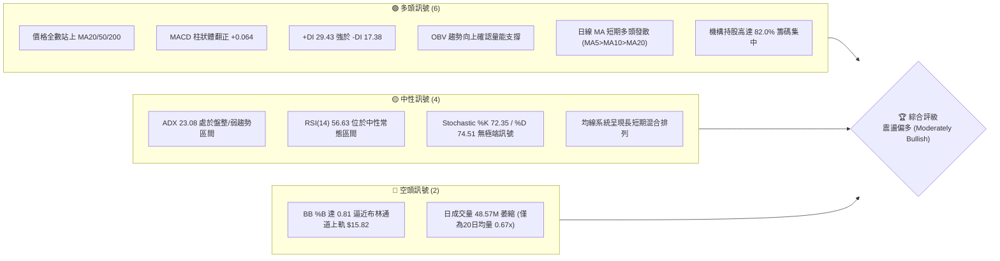
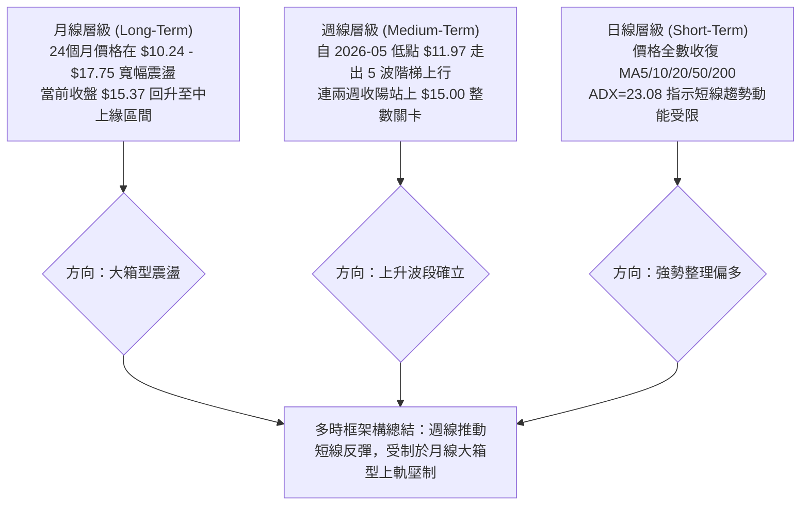
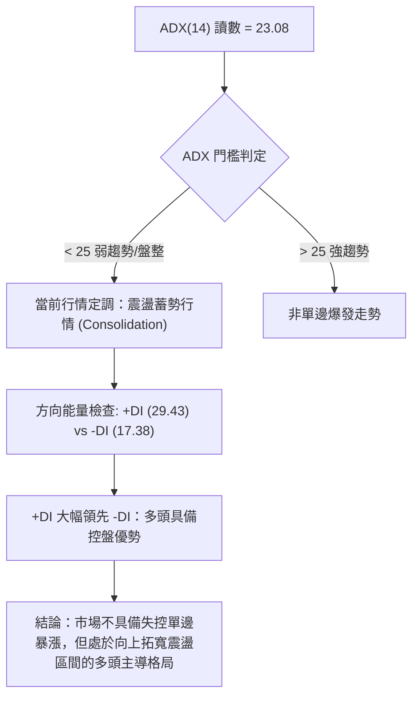
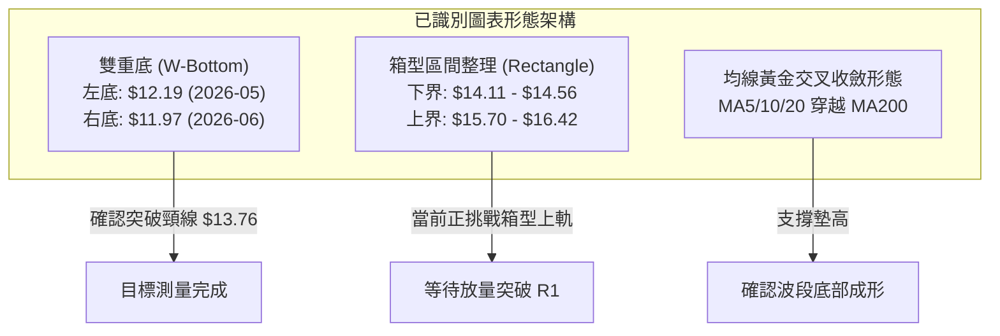
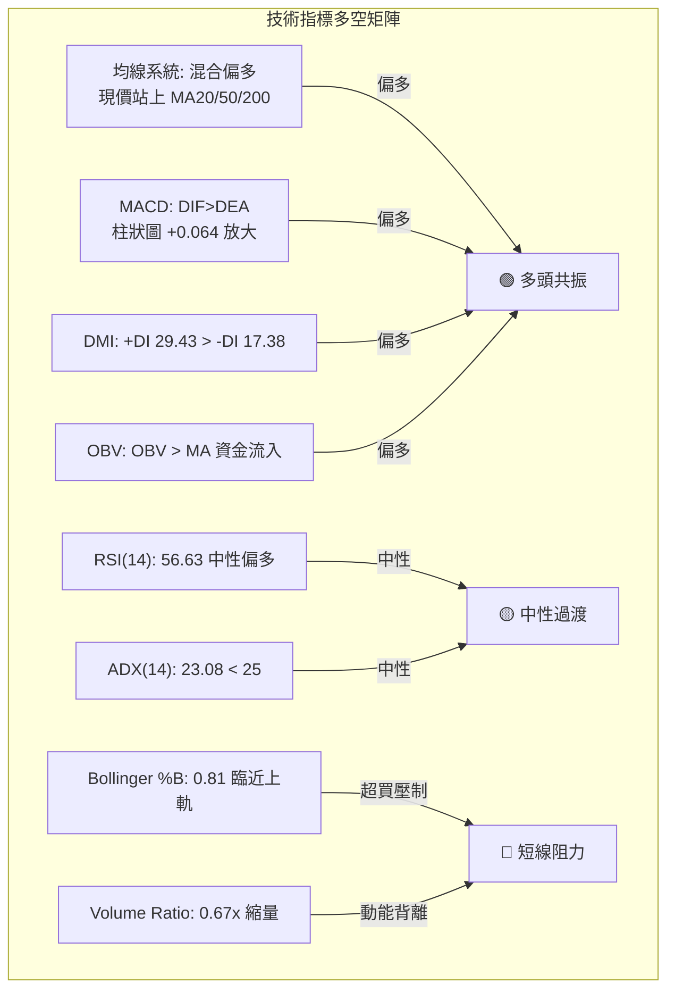
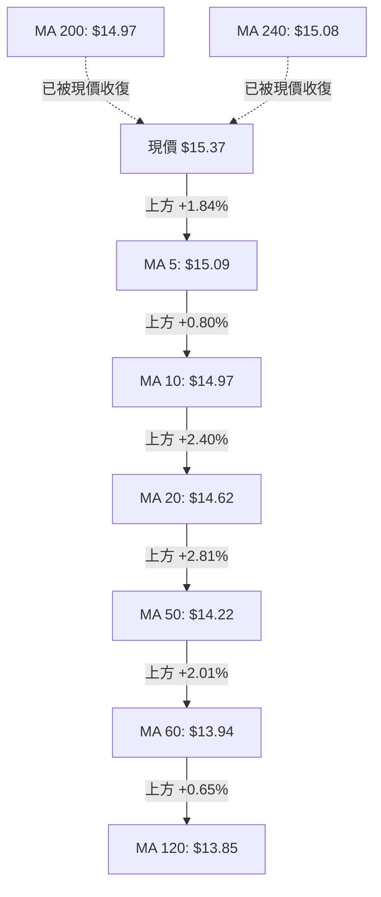
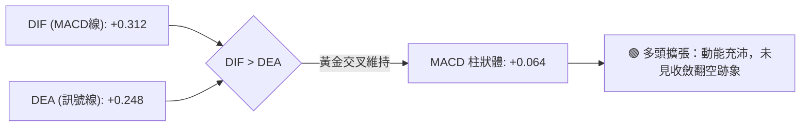
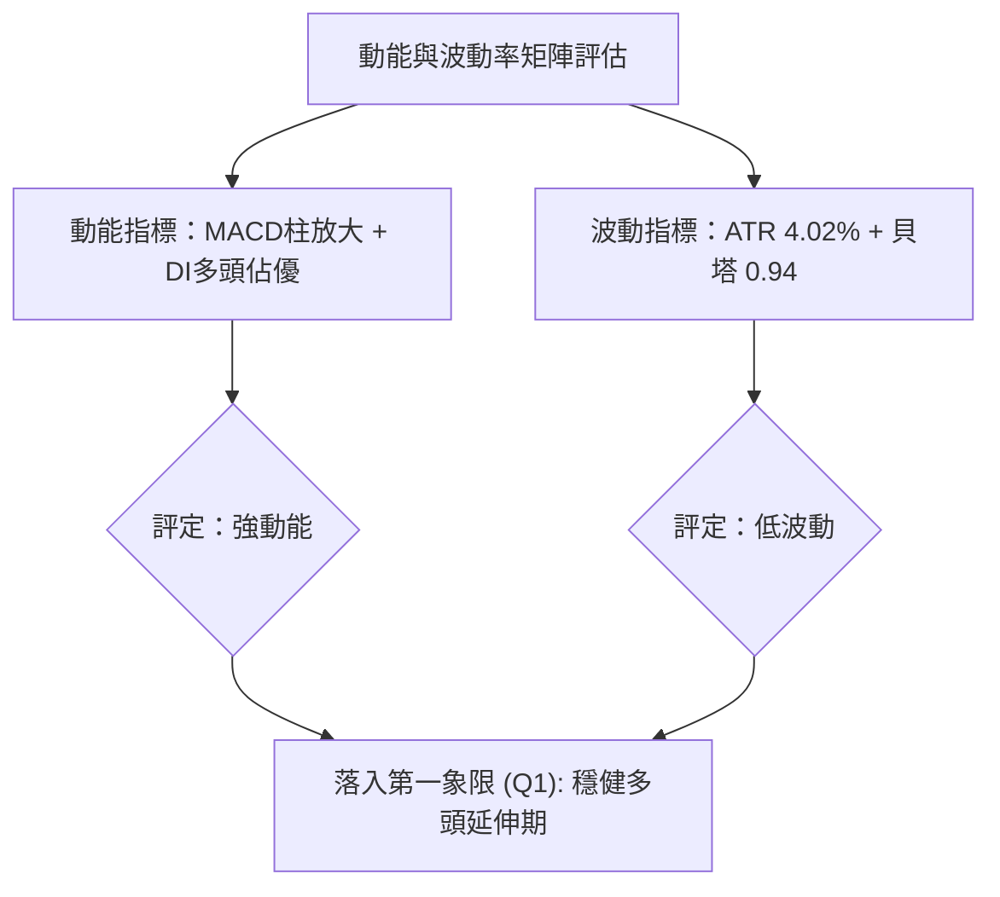
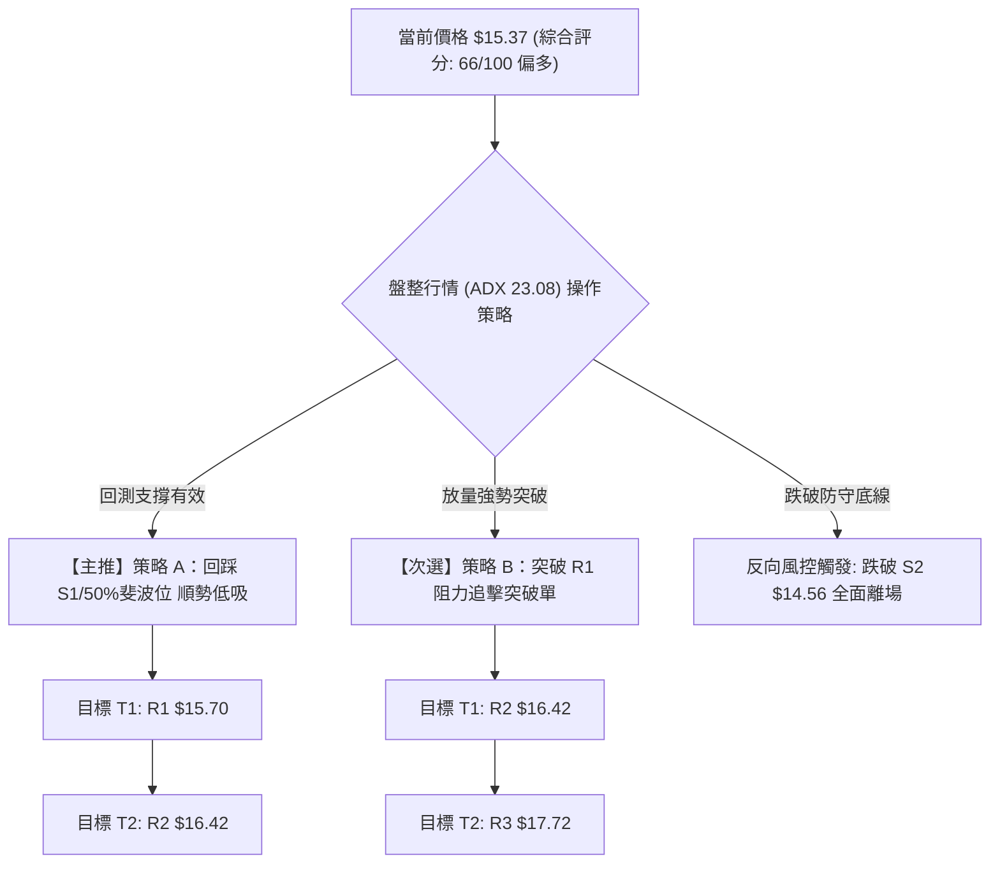
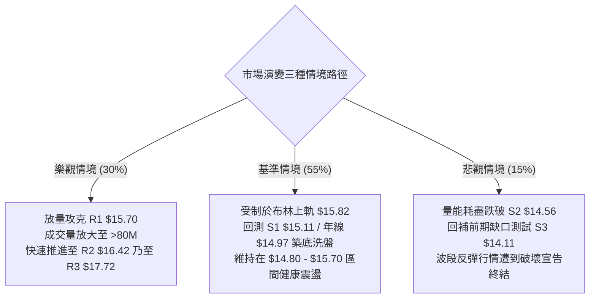

# NU 技術分析報告

> **報告日期**：2026-09-05 ｜ **語言**：繁體中文 ｜ **數據來源**：Yahoo Finance ｜ **當前價格**：$15.37

---

## 目錄

| 章節 | 內容 |
|------|------|
| [1. 技術面概覽](#1-技術面概覽) | 訊號儀表板、核心指標、評分卡 |
| [2. 趨勢分析](#2-趨勢分析) | 多時框趨勢、長中短期走勢 |
| [3. 圖表形態分析](#3-圖表形態分析) | 形態識別、K線組合、目標價 |
| [4. 支撐與阻力](#4-支撐與阻力) | 關鍵價位、斐波那契回調 |
| [5. 技術指標深度解讀](#5-技術指標深度解讀) | MA/RSI/MACD/布林/成交量 |
| [6. 動能與波動率](#6-動能與波動率) | 動能評估、ATR、Beta |
| [7. 多時框架總結](#7-多時框架總結) | 時框架評分矩陣 |
| [8. 交易策略建議](#8-交易策略建議) | 多空策略、風險報酬比 |
| [9. 風險提示與監控](#9-風險提示與監控) | 監控指標、風險場景 |

---

## 1. 技術面概覽

### 🎯 技術訊號儀表板



### 📊 核心指標速覽表

| 指標類別 | 指標名稱 | 當前數值 | 訊號 | 解讀 |
|:---|:---|:---|:---:|:---|
| **價格** | 當前收盤價 | $15.37 | 🟢 | 位於52週區間 53.6%，收復中軸水平 |
| **均線** | MA20 (月線) | $14.62 | 🟢 | 現價高於 MA20 達 +5.12%，短多排列明確 |
| **均線** | MA50 (季線) | $14.22 | 🟢 | 現價高於 MA50 達 +8.09%，中期支撐穩固 |
| **均線** | MA200 (年線) | $14.97 | 🟢 | 現價重返年線上方 (+2.67%)，多空分水嶺收復 |
| **動能** | RSI(14) | 56.63 | 🟡 | 位於 50–60 溫和多頭區，無超買或背離風險 |
| **動能** | MACD (12/26/9)| 0.312 / 0.248 | 🟢 | DIF 高於 MACD Signal，Hist 為 +0.064，多頭佔優 |
| **趨勢** | ADX (14) | 23.08 | 🟡 | 數值低於 25，屬於箱型震盪或弱趨勢蓄勢格局 |
| **趨勢** | DMI (+DI / -DI)| 29.43 / 17.38 | 🟢 | 多方能量大幅領先空方能量（差值 +12.05） |
| **通道** | Bollinger Bands| $13.42 - $15.82| 🟡 | 現價逼近上軌，%B 為 0.81，短線面臨軌道阻力 |
| **量能** | 20日成交量比 | 0.67x (48.57M)| 🔴 | 量能縮小，衝刺高點動能略顯不足，呈現量價背離 |
| **量能** | OBV 趨勢 | OBV > MA | 🟢 | 能量潮指標高於其均線，中長線資金尚未撤出 |
| **波動** | ATR(14) | $0.62 | 🟢 | 每日波動率約 4.02%，波動度溫和，有利風控 |

### 🏆 技術評分卡

```
╔══════════════════════════════════════════════════════════════════╗
║              技術評分卡 — NU (Nu Holdings Ltd.) 2026-09-05        ║
╠══════════════════════════════════════════════════════════════════╣
║ 趨勢強度 (ADX/DMI)   ███████████░░░░░░░░░  56/100  🟡 中性偏強  ║
║ 動能指標 (RSI/MACD)  ██████████████░░░░░░  70/100  🟢 偏多進攻  ║
║ 支撐穩定度 (S1/S2/MA)████████████████░░░░  80/100  🟢 結構扎實  ║
║ 成交量配合 (VOL/OBV) ██████████░░░░░░░░░░  50/100  🟡 量能遞減  ║
║ 形態完整度 (底型/區間)█████████████░░░░░░░  65/100  🟢 區間突破  ║
║ 均線排列 (MA5-MA240) ██████████████░░░░░░  70/100  🟢 短多發散  ║
╠══════════════════════════════════════════════════════════════════╣
║ 綜合技術評分         █████████████░░░░░░░  66/100  🟢 偏多操作  ║
╚══════════════════════════════════════════════════════════════════╝
```

---

## 2. 趨勢分析

### 🌐 多時框趨勢分析



### 📈 長期趨勢 — 12個月走勢圖（Unicode）

以下為近 12 個月（2025-10 至 2026-09）之歷史月線收盤走勢圖，清晰反映自高檔回檔後於 $13.13 構築雙重支撐並強勁反彈的軌跡：

```
NU 月線走勢圖（過去12個月：2025-10 至 2026-09）
價格軸 ($)
$18.00 ┤                     ● ($17.75, 2026-01 波段頂部)
$17.50 ┤             ● ($17.39)
$17.00 ┤                 ● ($16.74)
$16.50 ┤         ● ($16.11)
$16.00 ┤     ● ($16.01)
$15.50 ┤                                                 ● ($15.37 現價)
$15.00 ┤                         ● ($14.98)          ● ($14.55)
$14.50 ┤                             ● ($14.37)  ● ($14.48)  ● ($14.33)
$14.00 ┤
$13.50 ┤                                                 ● ($13.36)
$13.00 ┤                                         ● ($13.13, 2026-05 築底低點)
       └─┬───┬───┬───┬───┬───┬───┬───┬───┬───┬───┬───┬───┬───
        10M 11M 12M 01M 02M 03M 04M 05M 06M 07M 08M 09M
        2025               2026
```

#### 走勢特徵分析表格

| 階段名稱 | 期間涵蓋 | 價格起訖 | 區間漲跌幅 | 價量特徵與結構解讀 |
|:---|:---|:---:|:---:|:---|
| **牛市攻頂段** | 2025-08 ~ 2026-01 | $14.80 → $17.75 | +20.00% | 月線連 5 陽，創下 24 個月最高月收盤，多頭動能達到極致 |
| **波段修正段** | 2026-01 ~ 2026-05 | $17.75 → $13.13 | -26.03% | 獲利了結賣壓湧現，連續跌破均線，於 5 月触及波段最低月收盤 $13.13 |
| **底部橫盤整理**| 2026-05 ~ 2026-06 | $13.13 → $13.36 | +1.75%  | 成交量於 6 月首週暴增至 473.46M 創換手巨量，形成扎實吸籌區 |
| **階梯式推升段**| 2026-06 ~ 2026-09 | $13.36 → $15.37 | +15.04% | 逐月低點墊高（$13.36→$14.33→$14.55→$15.37），穩健收復半年線與年線 |

### 📊 中期趨勢（週線分析）

近期 20 週數據顯示，NU 於 2026 年 5 月中旬（週收盤 $12.19，RSI 跌至 20.8 超賣）完成極致恐慌洗盤，6 月初再次測試低點 $11.97 構築中期雙底形態。隨後週線 RSI 重返 50 以上，MACD 柱狀體收斂轉正。目前週線已連兩週上漲（$14.30 → $15.37），且週成交量放大至 373.98M，展現多頭中期反攻姿態。

```
近期週線級別阻力與支撐架構示意圖：
$17.72 ────────────────────────── [R3 波段強阻力 / 2026-01高位平台]
$16.42 ────────────────────────── [R2 中期結構阻力]
$15.70 ────────────────────────── [R1 短線波段高點阻力]
$15.37 ══════════════════════════ ◄ 現價
$15.11 -------------------------- [S1 近期轉換支撐 / 50%斐波回調位 $15.09]
$14.56 -------------------------- [S2 強支撐 / 20日均線 $14.62 匯合處]
$14.11 -------------------------- [S3 防守底線 / 61.8%斐波回調位 $14.17]
```

### ⚡ 趨勢強度評估（ADX 解讀）



#### ADX 與 DMI 數值深度對照

| 指標名稱 | 實際數值 | 基準門檻 | 狀態評估 | 技術含義 |
|:---|:---:|:---:|:---:|:---|
| **ADX(14)** | 23.08 | 25.00 | 弱趨勢 / 盤整 | 價格雖上行，但未引發盲目追價潮，多空仍在關鍵阻力前進行籌碼換手 |
| **+DI** | 29.43 | 20.00 | 強多方能量 | 買盤積極向上推升，主動性買盤顯著壓制拋壓 |
| **-DI** | 17.38 | 20.00 | 空方衰退 | 空方力量受到壓抑，未見恐慌性摜壓跡象 |
| **差值 (+DI - -DI)**| +12.05 | 0.00 | 多頭擴張 | 方向能量支持價格維持在 MA200 上方運行 |

---

## 3. 圖表形態分析

### 🔍 形態識別系統



#### 形態信心度與目標價評估表

| 形態名稱 | 信心度 | 判斷依據（引用數據） | 完成度 | 目標價（附精確計算式） |
|:---|:---:|:---|:---:|:---|
| **中期雙底 (W-Bottom)** | 85% | 週線於 2026-05-17 創 $12.19 低點，2026-06-07 探底 $11.97；隨後放量突破 2026-07-12 頸線 $13.76 | 100% (已達標) | 形態高度 = $13.76 - $11.97 = $1.79。<br/>目標價 = 頸線 $13.76 + $1.79 = **$15.55**（現價 $15.37 已基本達成） |
| **上升旗形 / 整理箱型** | 65% | 價格自 2026-07 突破後，於 $14.11（S3）至 $15.70（R1）間建立密集成交箱型 | 75% | 箱型下緣 $14.11，上緣 $15.70，箱高 $1.59。<br/>向上突破目標 = $15.70 + $1.59 = **$17.29**（與斐波 23.6% 位 $17.14 及 R3 $17.72 聚類） |
| **頭肩底形態** | 40% | 結構不對稱，左肩不明顯，數據不足以支撐典型頭肩底 | 30% | *訊號不足，僅做指標型解讀，不預設目標價* |

### 🕯️ 重要K線形態分析

| 月份 | 收盤價 | K線形態 | 解讀 | 訊號 |
|:---:|:---:|:---|:---|:---:|
| **2026-05** | $13.13 | 破位長陰帶長下影 | 恐慌拋盤湧出後見機構逢低承接，觸及年內低點 $11.20 附近買盤湧現 | 🟡 止跌信號 |
| **2026-06** | $13.36 | 築底十字陽星 (Hammer) | 換手量創巨量（週量達 473M），下探 $11.97 後收高，形成中期底部拐點 | 🟢 轉折確認 |
| **2026-07** | $14.33 | 實體中陽吞噬 | 連續收復 $14.00 關卡，一舉吞噬前兩月震盪區間，多頭趨勢重啟 | 🟢 強烈買訊 |
| **2026-08** | $14.55 | 帶上影整理小陽 | 衝擊年線阻力 $15.00 受阻，但在 MA20 ($14.62) 附近形成高檔整固 | 🟡 蓄勢整理 |
| **2026-09** | $15.37 | 光腳中陽突破 | 突破 MA200 年線 ($14.97) 及 50% 斐波那契回調位 ($15.09)，多頭奪回主控權 | 🟢 多頭確立 |

### 📉 ASCII 走勢形態示意圖

```
NU 日線級別中期 W 底突破與箱型演化示意圖：
價格 ($)
$16.42 ┼───────────────────────────────────────────── [R2 阻力]
$15.70 ┼─────────────────────────────────╭───────╮─── [R1 阻力]
       │                                 │現價   │
$15.37 ┼─────────────────────────────────┼─●────╯
$15.09 ┼───────────────────╭─────────────╯ (突破 50% 斐波位)
$14.56 ┼───────────╭───────╯ (回測 S2 支撐)
$13.76 ┼─────╭─────╯ (頸線位置 Neckline)
       │    │
$13.13 ┼────┼────────────╭────────
       │   │            │
$12.19 ┼───╯ (左底 W1)  │
$11.97 ┼────────────────╯ (右底 W2, 探底確立)
       └───────────────────────────────────────────────
         2026-05      2026-06      2026-07      2026-08      2026-09
```

### 🎯 形態目標價計算

根據雙底突破與當前箱型整理高度推算：

$$\text{中期雙底目標價} = \text{頸線 } \$13.76 + (\text{頸線 } \$13.76 - \text{雙底最低 } \$11.97) = \$13.76 + \$1.79 = \mathbf{\$15.55}$$

現價 $15.37 距離該目標僅差 $0.18，代表第一波反彈滿足點已近。若後續價格放量向上突破近一年波段阻力聚類 **R1 ($15.70)**，則次級箱型向上拓展之形態高度計算如下：

$$\text{箱型次級延伸目標價} = \text{突破點 } \$15.70 + (\text{箱型頂 } \$15.70 - \text{箱型底 S3 } \$14.11) = \$15.70 + \$1.59 = \mathbf{\$17.29}$$

該測量目標 **$17.29** 與斐波那契 23.6% 回調位 **$17.14** 及波段高點阻力聚類 **R3 ($17.72)** 產生強烈共振。

---

## 4. 支撐與阻力

### 🗺️ 關鍵價位分布圖（Unicode）

```
╔═════════════════════════════════════════════════════════════════════════╗
║                      NU 關鍵價位與籌碼聚類結構分布圖                    ║
╠═════════════════════════════════════════════════════════════════════════╣
║ $18.98 ║░░░░░░░░░░░░░░░░░░░░░░░░░░░░░░║ 52週歷史高點 (52W High)         ║
║ $17.72 ║██████████████████████████████║ 強阻力 R3 (2026-01 波段密集套牢區)║
║ $17.14 ║▓▓▓▓▓▓▓▓▓▓▓▓▓▓▓▓▓▓▓▓▓▓▓▓      ║ 斐波那契 23.6% 回調位            ║
║ $16.42 ║████████████████████          ║ 阻力 R2 (中期波段反彈高點聚類)    ║
║ $16.01 ║▓▓▓▓▓▓▓▓▓▓▓▓▓▓▓▓▓▓            ║ 斐波那契 38.2% 回調位            ║
║ $15.82 ║▒▒▒▒▒▒▒▒▒▒▒▒▒▒▒▒▒▒▒▒▒▒▒▒▒▒▒▒▒▒║ 布林通道上軌 (BB Upper)         ║
║ $15.70 ║████████████████████████      ║ 關鍵阻力 R1 (近一年波段高點聚類)  ║
╠════════╬══════════════════════════════╬═════════════════════════════════╣
║ $15.37 ║◄■■■■■■■■■■■■■■■■■■■■■■■■■■■■║ 現價 (Current Price)             ║
╠════════╬══════════════════════════════╬═════════════════════════════════╣
║ $15.11 ║██████████████████████        ║ 近期支撐 S1 (波段低點聚類)       ║
║ $15.09 ║▓▓▓▓▓▓▓▓▓▓▓▓▓▓▓▓▓▓▓▓▓▓▓▓▓▓▓▓▓▓║ 斐波那契 50.0% 關鍵平衡位        ║
║ $14.97 ║══════════════════════════════║ 200日均線 MA200 (牛熊分水嶺)      ║
║ $14.62 ║▒▒▒▒▒▒▒▒▒▒▒▒▒▒▒▒▒▒▒▒▒▒        ║ 布林中軌 / 20日均線 MA20         ║
║ $14.56 ║██████████████████████████████║ 強支撐 S2 (波段回調防守聚類)     ║
║ $14.17 ║▓▓▓▓▓▓▓▓▓▓▓▓▓▓▓▓▓▓▓▓▓▓▓▓      ║ 斐波那契 61.8% 黃金分割強支撐    ║
║ $14.11 ║██████████████████████████████║ 強支撐 S3 (波段底部支撐聚類)     ║
║ $13.42 ║▒▒▒▒▒▒▒▒▒▒▒▒▒▒▒▒▒▒▒▒▒▒▒▒▒▒▒▒▒▒║ 布林通道下軌 (BB Lower)         ║
║ $11.20 ║░░░░░░░░░░░░░░░░░░░░░░░░░░░░░░║ 52週歷史低點 (52W Low)          ║
╚═════════════════════════════════════════════════════════════════════════╝
```

### 🚧 阻力位分析表

所有價位均精確引用數據中由 OHLCV 計算之阻力聚類：

| 阻力級別 | 精確價位 | 距離現價 | 形成原因與籌碼結構 | 突破難度 | 重要性評級 |
|:---|:---:|:---:|:---|:---:|:---:|
| **R1** | **$15.70** | +2.11% | 近一年波段高點聚類，疊加布林帶上軌 $15.82 形成強大動態反壓 | 中等 | 🟢🟢🟢 (短線勝負手) |
| **R2** | **$16.42** | +6.86% | 2025 年第四季多頭平台套牢區，前期多次衝高回落高點聚類 | 高 | 🟢🟢 (中期目標) |
| **R3** | **$17.72** | +15.26%| 2026 年 1 月歷史次高點 ($17.75) 密集成交區，強阻力聚類 | 極高 | 🟢 (長期牛熊大關) |

### 🛡️ 支撐位分析表

所有價位均精確引用數據中由 OHLCV 計算之支撐聚類：

| 支撐級別 | 精確價位 | 距離現價 | 形成原因與籌碼結構 | 守住機率 | 重要性評級 |
|:---|:---:|:---:|:---|:---:|:---:|
| **S1** | **$15.11** | -1.72% | 近一年波段低點聚類，與 50.0% 斐波那契回調位 $15.09 及年線 $14.97 形成三重共振 | 75% | 🟢🟢🟢 (短線防守線) |
| **S2** | **$14.56** | -5.27% | 密集換手低點聚類，與 MA20 ($14.62) 及 MA10 ($14.97) 下緣形成強勁買盤承接帶 | 85% | 🟢🟢🟢 (波段多頭底線) |
| **S3** | **$14.11** | -8.23% | 波段起漲低點聚類，與 61.8% 斐波位 $14.17 緊鄰，為多頭結構生命線 | 95% | 🟢🟢 (極限保護位) |

### 📐 斐波那契回調位分析

依據 52 週極端區間（低點 $11.20 至 高點 $18.98，垂直落差 $7.78）計算之標準黃金分割回調位分布如下：


- **當前位置解讀**：現價 **$15.37** 成功跨越並站穩在 **50.0% 回調位 ($15.09)** 之上，目前正運行於 **38.2% ($16.01)** 與 **50.0% ($15.09)** 的黃金通道區間內。
- **技術意義**：在道氏理論與斐波那契體系中，回調收復 50% 水平是趨勢由「弱勢反彈」質變為「強勢反轉」的最關鍵信號。只要收盤價持續固守 $15.09 之上，回調至 $11.20 的空頭修正浪即宣告終結，下一理論攻擊目標直指 38.2% 位 **$16.01** 及 23.6% 位 **$17.14**。

---

## 5. 技術指標深度解讀

### 🎛️ 指標訊號總覽



### 📈 移動平均線排列分析



#### 均線全景數據解析表

| 均線名稱 | 當前價格 | 偏離率 (現價 vs MA) | 趨勢軌跡 (ASCII) | 排列解讀 |
|:---|:---:|:---:|:---|:---|
| **MA 5** | $15.09 | +1.84% | ▄▄▄▄▄▄▄▄▄▃▃▂▁▁▂▃▄▅▆▅▅▆▇▇▇▇▆▆▇█ | 極短期強勢噴出，呈現陡峭仰角 |
| **MA 10** | $14.97 | +2.67% | ▁▁▂▂▃▃▃▃▃▃▂▁▁▁▁▂▂▂▂▂▃▄▆▇▆▆▆▇██ | 短期多頭進攻線，與 MA200 形成雙重支撐 |
| **MA 20** | $14.62 | +5.12% | ▁▁▂▂▃▃▃▄▄▄▄▄▄▄▅▅▅▅▅▅▅▆▆▆▆▆▆▇██ | 月線呈完美右側上翹，波段上攻基石 |
| **MA 50** | $14.22 | +8.09% | 穩定向上 | 季線連續走高，中期趨勢翻多 |
| **MA 60** | $13.94 | +10.28% | ▁▁▁▁▁▁▁▁▁▁▁▁▁▂▂▃▃▃▃▄▄▄▅▅▆▆▇▇██ | 築底反轉完成，由跌轉升 |
| **MA 120**| $13.85 | +10.98% | ██▇▇▇▆▅▅▄▄▃▃▂▂▁▁▁▁▁▁▁▁▁▁▁▁▁▁▁▁ | 半年線落底走平，空方阻力消耗殆盡 |
| **MA 200**| $14.97 | +2.67% | 走平略微上翹 | 長期多空分水嶺，現價成功站上，宣告重回牛市通道 |
| **MA 240**| $15.08 | +1.90% | ▂▃▄▆▆▇██████▇▇▇▇▇▆▆▆▅▅▅▄▃▃▂▁▁▁ | 年線上方完成扣低翻揚，長線籌碼沉澱完畢 |

**綜合排列判定**：日線級別呈現標準 **短期多頭排列 (MA5 > MA10 > MA20 > MA50)**，且已徹底站上長期均線 MA200 與 MA240。均線系統綜合評定為「**由混合震盪向多頭排列全面轉型**」。

### 📉 RSI(14) 分析

```
RSI(14) 讀數：56.63
0 ══════════════ 30 ══════════════════ 50 ═════ 56.63 ═════════ 70 ════════════ 100
[     超賣區     ] [      弱勢區       ] [ 均衡 ] [  溫和多頭  ] [    超買區    ]
████████████████████████████████████████████████████░░░░░░░░░░░░░░░░░░░░ (56.63%)
```

- **區間診斷**：RSI(14) 最新讀數為 **56.63**，處於 50–70 的健康上升走廊。表明多方主動掌控節奏，但未進入 >70 的過熱風險區，向上拓展空間充裕。
- **背離分析**：
  - **頂背離檢驗**：觀察近 20 週數據，週線 RSI 曾在 2026-07-05 達到 79.0 的局部峰值，隨後拉回並在 2026-09-06 回升至 56.6，與價格創出反彈新高 $15.37 步調協調。日線與週線均**無頂背離現象**。
  - **底背離檢驗**：2026 年 5 月中旬 RSI 降至 20.8 極限超賣後，6 月價格再度下探 $11.97 時 RSI 已抬升至 47.2，形成清晰的**週線級別底背離**，該底背離引發了本輪長達 3 個月的階梯式大反彈。

### 📊 MACD(12/26/9) 訊號解讀



- **參數狀態**：MACD 線 (0.312) 高於 Signal 線 (0.248)，二者雙雙處於零軸上方運行，確立中長線正向多頭格局。
- **柱狀體動能**：MACD Histogram 為 **+0.064**，較上週持續放大，呈現多頭推動浪特徵，為價格向上挑戰阻力提供充足動能支撐。

### 📦 布林通道分析

```
NU 布林通道位置示意圖 (寬度 Bandwidth = 16.4%)
$15.82 ┬────────────────────────────────────────── BB 上軌 (Upper)
       │                                  ▲
$15.37 ┼──────────────────────────────────● 現價 (%B = 0.81)
       │
$14.62 ┼────────────────────────────────────────── BB 中軌 (MA20)
       │
$13.42 ┴────────────────────────────────────────── BB 下軌 (Lower)
```

- **軌道邊界**：上軌 **$15.82**，中軌 (MA20) **$14.62**，下軌 **$13.42**。
- **%B 指標解析**：當前 %B 為 **0.81**，代表價格已運行至布林通道頂部 81% 的位置，極度接近上軌。
- **運行形態解讀**：布林帶未出現喇叭口極端放大，通道呈現平緩上移格局。%B = 0.81 顯示短線進入超買壓制區，若無爆發性成交量支持，價格在 $15.70 - $15.82 區間遭遇均值回歸拉回的概率極高。

### 💹 成交量分析（量價配合度）

```
成交量對比柱狀圖：
最新成交量  (48.57M) █████████████░░░░░░░ (量比: 0.67x)
20日均成交量(72.94M) ███████████████████░
50日均成交量(81.91M) █████████████████████
```

- **量價背離警訊**：NU 最新成交量為 48,567,100 股，僅為 20 日均量 (72.94M) 的 **0.67 倍**，為 50 日均量 (81.91M) 的 59.3%。價格創反彈收盤新高 $15.37，但成交量顯著萎縮，呈現經典的「**價漲量縮**」短線隱憂。
- **能量潮 (OBV) 確認**：儘管日線縮量，但中長線 OBV 指標依然穩定在均線之上（`OBV > MA`），這說明主力資金並未在高檔出逃，當前的縮量更多體現為籌碼鎖定良好，但若要攻克 $15.70-$16.42 密集成交區，後續必須出現 >75M 的補量確認。

---

## 6. 動能與波動率

### ⚡ 動能評估四象限

| 象限標籤 | 動能維度 | 波動維度 | 當前市場狀態判定 | 交易策略指導 |
|:---:|:---:|:---:|:---:|:---|
| **Quadrant 1** | 強動能 (Strong) | 低波動 (Low) | 🟡 **當前 NU 定位區間** | **穩健順勢持有**。波動率低有利於收緊止損，動能偏多有利於趨勢延續 |
| **Quadrant 2** | 弱動能 (Weak) | 低波動 (Low) | 盤整築底期已脫離 | 適合低吸網格交易（已過去） |
| **Quadrant 3** | 強動能 (Strong) | 高波動 (High) | 未觸發 | 突破暴利期，須警惕拉回洗盤 |
| **Quadrant 4** | 弱動能 (Weak) | 高波動 (High) | 恐慌破位期已結束 | 避免參與，嚴格止損（如 2026-05） |



### 📊 ATR 波動率分析

- **ATR(14) 絕對值**：**$0.62**
- **ATR 相對百分比**：4.02%（佔當前股價 $15.37）
- **技術意義**：NU 每日正常隨機波動區間約為 ±$0.62。此數值顯示該股擺脫了前期恐慌下跌時的高波動狀態，籌碼換手趨於理性。
- **動態止損距離設定建議**：
  - **短線緊密止損 (1.0 × ATR)**：距進場點扣除 **$0.62**。
  - **波段標準止損 (1.5 × ATR)**：距進場點扣除 **$0.93**。
  - **結構防守止損 (2.0 × ATR)**：距進場點扣除 **$1.24**（對應關鍵支撐 S3 $14.11 附近）。

### 📐 Beta 與市場相關性

- **Beta 係數**：**0.94**
- **市場特徵解析**：NU 的 Beta 略低於 1.0，展現出與標普 500 指數高度同步但波動稍顯溫和的特性。作為新興市場金融科技巨頭，其估值對美股流動性敏感，但在拉美本土高利差支撐下，抵禦系統性暴跌的韌性優於傳統高 Beta 成長股。

---

## 7. 多時框架總結

### 📋 時框架評分表

| 時框架 | 趨勢方向 | 動能狀態 | 均線排列 | 圖表形態 | 綜合評分 | 戰術建議 |
|:---:|:---:|:---:|:---:|:---|:---:|:---|
| **長期 (月線)** | 寬幅箱型 | 中性回升 (50%位) | 混合震盪 | 大區間箱型內反彈 | **60/100** 🟡 | 逢高逐步獲利，不宜盲目長抱 |
| **中期 (週線)** | 上升通道 | 溫和走強 (RSI 56.6)| 短多發散 | W底突破後延伸推升 | **75/100** 🟢 | 回調關鍵支撐加碼，順勢做多 |
| **短期 (日線)** | 震盪偏多 | 強勢但面臨上軌 | 完美短多 | 衝擊箱型上軌 R1 | **65/100** 🟢 | 勿在上軌追高，等待拉回低吸 |

### 🔲 綜合訊號矩陣

```
時框訊號一致性矩陣：
╔═════════════╦══════════════╦══════════════╦══════════════╗
║  維度 / 時框 ║   長期 (月)  ║   中期 (週)  ║   短期 (日)  ║
╠═════════════╬══════════════╬══════════════╬══════════════╣
║ 趨勢方向    ║ 🟡 震盪整理  ║ 🟢 上升趨勢  ║ 🟢 偏多進攻  ║
║ 動能指標    ║ 🟡 中性平衡  ║ 🟢 多頭掌控  ║ 🟢 金叉發散  ║
║ 均線系統    ║ 🟡 互相糾纏  ║ 🟢 站穩均線  ║ 🟢 全線收復  ║
║ 量價關係    ║ 🟢 底部放量  ║ 🟢 換手充分  ║ 🔴 縮量背離  ║
║ 關鍵障礙    ║ $17.72 (R3)  ║ $16.42 (R2)  ║ $15.70 (R1)  ║
╚═════════════╩══════════════╩══════════════╩══════════════╝
```

### ⚖️ 多時框收斂結論

> **收斂規則執行判定（嚴格依據要求 14）**：
> 1. **趨勢/盤整檢驗**：當前 ADX(14) 讀數為 **23.08**，明確低於趨勢門檻值 25.00，系統判定當前處於「**盤整蓄勢行情**」。
> 2. **主導時框選擇**：在盤整行情中，依規則以**日線布林通道上下軌（$13.42 - $15.82）與關鍵水平聚類區間為主要交易基準**。
> 3. **方向性收斂**：日線與週線多頭趨勢顯著，但在 ADX < 25 及布林 %B = 0.81 的制約下，單邊突破暴漲概率較低。
> 4. **唯一結論**：**震盪偏多（Moderately Bullish）—— 逢回踩支撐低吸做多，嚴禁在布林上軌處追價**。此結論嚴格貫徹至第 8 章交易策略。

---

## 8. 交易策略建議

### 🗺️ 策略決策流程圖



### 🧭 策略路由

- **技術評分卡判定**：綜合評分 **66 / 100**（高於 60 偏多門檻）。
- **當前主策略方向** = **主推多頭策略（回調做多為核心，突破做多為輔）**，空頭僅列為風險對沖觸發機制。

### 🎯 價格情境階梯（Price Scenarios）

所有價位均嚴格取自第 4 章關鍵價位區塊：

| 觸發條件 | 第一目標價 | 第二目標價 | 第三延伸目標 | 情境技術含義 |
|:---|:---:|:---:|:---:|:---|
| **強勢突破 R1 ($15.70)** | **$16.42** (R2) | **$17.14** (23.6%位) | **$17.72** (R3) | 多頭加速向上拓寬箱型，打開挑戰年內高點空間 |
| **站穩現價區間 ($15.11 - $15.37)**| **$15.70** (R1) | **$16.01** (38.2%位) | — | 於年線上方強勢整理，消化短線獲利盤 |
| **回調跌破 S1 ($15.11)** | **$14.56** (S2) | **$14.11** (S3) | **$13.42** (BB下軌) | 跌破 50% 斐波位，退守 MA20 及波段箱型下緣 |

### 📊 情境機率分佈

| 情境類型 | 預估機率 | 主要技術指標依據 |
|:---|:---:|:---|
| **回踩蓄勢後繼續上行** | **60%** | MACD 柱狀體擴張 (+0.064)、價格全數站上 MA20/50/200、OBV > MA 資金持續護盤 |
| **區間橫盤震盪整理** | **25%** | ADX(14) = 23.08 < 25 處於弱趨勢階段、成交量縮至 0.67x 缺乏攻擊量能 |
| **再度下探深幅回落** | **15%** | 布林 %B 達 0.81 短線超買，若大盤重挫可能回測 S2 ($14.56) 甚至 S3 ($14.11) |

### 🟢 主策略詳情

本報告依據精確數據聚類，制定兩套多頭進場方案：

| 策略要素 | 策略 A：回踩穩健進場（首選推薦） | 策略 B：放量突破追擊（右側進場） |
|:---|:---|:---|
| **核心邏輯** | 依托 50% 斐波位 $15.09 與 S1 $15.11 逢低布局 | 放量突破近一年波段高點 R1 $15.70 追隨動能 |
| **進場條件** | 盤中回踩 $15.11 - $15.15 區間獲得支撐 | 日收盤價確認突破 $15.70 且成交量 > 75M |
| **進場價格** | **$15.11** (精確引用 S1 支撐位) | **$15.75** (突破 R1 關鍵阻力後確認價) |
| **目標價 T1** | **$15.70** (R1 阻力位，預期收益 +3.90%) | **$16.42** (R2 阻力位，預期收益 +4.25%) |
| **目標價 T2** | **$16.42** (R2 阻力位，預期收益 +8.67%) | **$17.72** (R3 阻力位，預期收益 +12.51%) |
| **止損價格** | **$14.56** (精確引用 S2 強支撐位，虧損 -3.64%) | **$15.11** (跌回 S1 支撐位下方，虧損 -4.06%) |
| **風險報酬比 (R/R)**| **2.38 : 1** (以 T2 計算) | **3.08 : 1** (以 T2 計算) |
| **勝率評估** | **68%** | **58%** |
| **建議倉位** | **15% - 20%** 總資產 | **10%** 總資產 |

### 🔴 反向風險觸發點（對沖提示）

若出現以下技術破位信號，多頭邏輯全數失效，必須果斷停損或建立空頭對沖：
- **防守破位點**：日線收盤價跌破 **$14.56 (S2)**。
- **指標共振惡化**：日線 MACD 出現死叉，且 RSI(14) 跌破 45。
- **對沖操作**：若失守 $14.56，下一目標將直探 **$14.11 (S3)** 及布林下軌 **$13.42**，持有多頭倉位者應強制平倉離場。

### ⭐ 整體訊號強度評星

```
做多訊號強度：★★★★☆  (4/5星 - 均線支撐完備，動能多頭掌控)
做空訊號強度：★☆☆☆☆  (1/5星 - 缺乏做空結構，逆勢風險極高)
整體可信度：  ★★★★☆  (4/5星 - 多時框收斂，量價與關鍵點位共振)
```

---

## 9. 風險提示與監控

### ✅ 關鍵監控指標 Checklist

```
╔══════════════════════════════════════════════════════════════════════════╗
║                    NU 日常技術面風控監控清單 (Checklist)                  ║
╠══════════════════════════════════════════════════════════════════════════╣
║ [ ] 價格是否成功收復並站穩 $15.70 (R1) 關鍵波段高點？                    ║
║ [ ] 日成交量能否回升至 72.94M (20日均量) 之上，消除價量背離隱憂？        ║
║ [ ] 價格回踩時，$15.11 (S1) 與 $15.09 (50%斐波位) 是否展現強勁承接買盤？ ║
║ [ ] RSI(14) 是否持續維持在 50 水平之上，避免跌入弱勢區間？               ║
║ [ ] MACD Histogram 是否維持正值擴張，未見縮頭或死叉風險？                ║
║ [ ] 50日均線 ($14.22) 與 200日均線 ($14.97) 是否維持上行扣低趨勢？       ║
║ [ ] 布林通道帶寬是否開始向外擴張，引導單邊趨勢形成 (ADX > 25)？          ║
╚══════════════════════════════════════════════════════════════════════════╝
```

### ⚠️ 風險場景分析



### 🛡️ 風險管理重要提醒

1. **嚴禁高位追價**：現價 $15.37 距離布林上軌 $15.82 僅有不到 3% 空間，且 %B 達 0.81。在日成交量萎縮至 0.67x 的環境下，嚴禁於 $15.50 以上激進市價追高，極易遭受假突破洗盤。
2. **止損嚴格執行**：任何多頭交易均須以 **S2 ($14.56)** 為最後防守線，虧損控制在 3%-4% 內。跌破 $14.56 意味著失守 20 日均線及波段起漲結構，切忌凹單。
3. **倉位管理原則**：鑑於 ADX = 23.08 屬於震盪蓄勢期，總持倉部位建議控制在總投資組合的 **15% - 20%** 以內，待日線放量突破 R1 ($15.70) 且 ADX 跨越 25 後，方可加碼至全額倉位。

---

## 📋 報告總結

```
╔════════════════════════════════════════════════════════════════════════╗
║                      NU 技術分析報告總結儀表板                         ║
╠════════════════════════════════════════════════════════════════════════╣
║ 報告日期：2026-09-05                                                   ║
║ 當前價格：$15.37                                                       ║
║ 分析評級：🟢 震盪偏多 (Moderately Bullish / 評分: 66/100)              ║
╠════════════════════════════════════════════════════════════════════════╣
║ 關鍵維度技術定調：                                                     ║
║ ├─ 長期趨勢 (月線)：🟡 大區間寬幅震盪 ($10.24 - $17.75)                 ║
║ ├─ 中期趨勢 (週線)：🟢 雙底突破推升，底部結構扎實 (目標 $15.55 已達標) ║
║ ├─ 短期趨勢 (日線)：🟢 均線呈短多發散，唯受制於布林上軌與量能縮小     ║
║ ├─ 核心關鍵支撐：S1: $15.11 (50%斐波位) ｜ S2: $14.56 (MA20生命線)    ║
║ ├─ 核心關鍵阻力：R1: $15.70 (波段頂部) ｜ R2: $16.42 (密集套牢區)    ║
║ └─ 分析師目標價：華爾街平均目標價 $18.78 (+22.18% 潛在上行空間)         ║
╠════════════════════════════════════════════════════════════════════════╣
║ 最優交易策略組合：                                                     ║
║ 1. 🥇 最佳機會（勝率 68%）：策略 A — 回踩 S1 ($15.11) 分批低吸做多，  ║
║    止損設於 S2 ($14.56)，目標看至 R1 ($15.70) 與 R2 ($16.42)。        ║
║ 2. 🥈 次選機會（勝率 58%）：策略 B — 等待日線帶量收破 R1 ($15.70)，   ║
║    順勢追擊突破單，止損移至 $15.11，目標直指 R3 ($17.72)。            ║
║ 3. 🥉 保守選擇：持有底倉觀望，等待成交量放大突破 72.9M 均量再行介入。║
╚════════════════════════════════════════════════════════════════════════╝
```

---

> ⚠️ **免責聲明**：本報告為 AI 自動生成之技術分析，所有數據及估算均基於提供的歷史價格資訊。本報告**僅供研究與學術參考**，**不構成任何投資建議**。投資有風險，入市需謹慎。

---

*報告生成時間：2026-09-05 ｜ 數據來源：Yahoo Finance ｜ 分析框架：多時框技術分析*