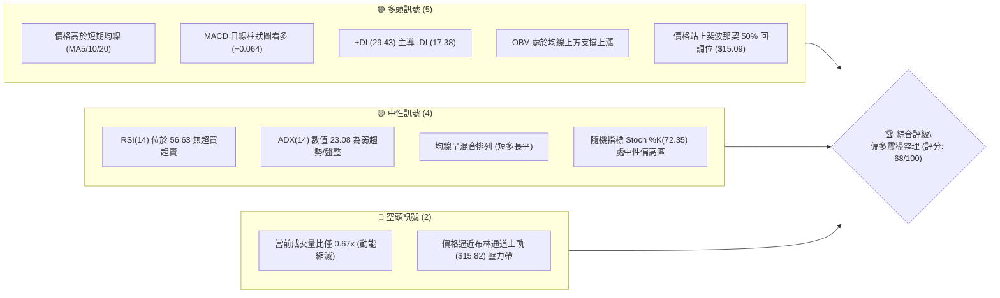
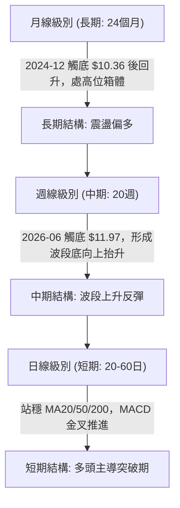
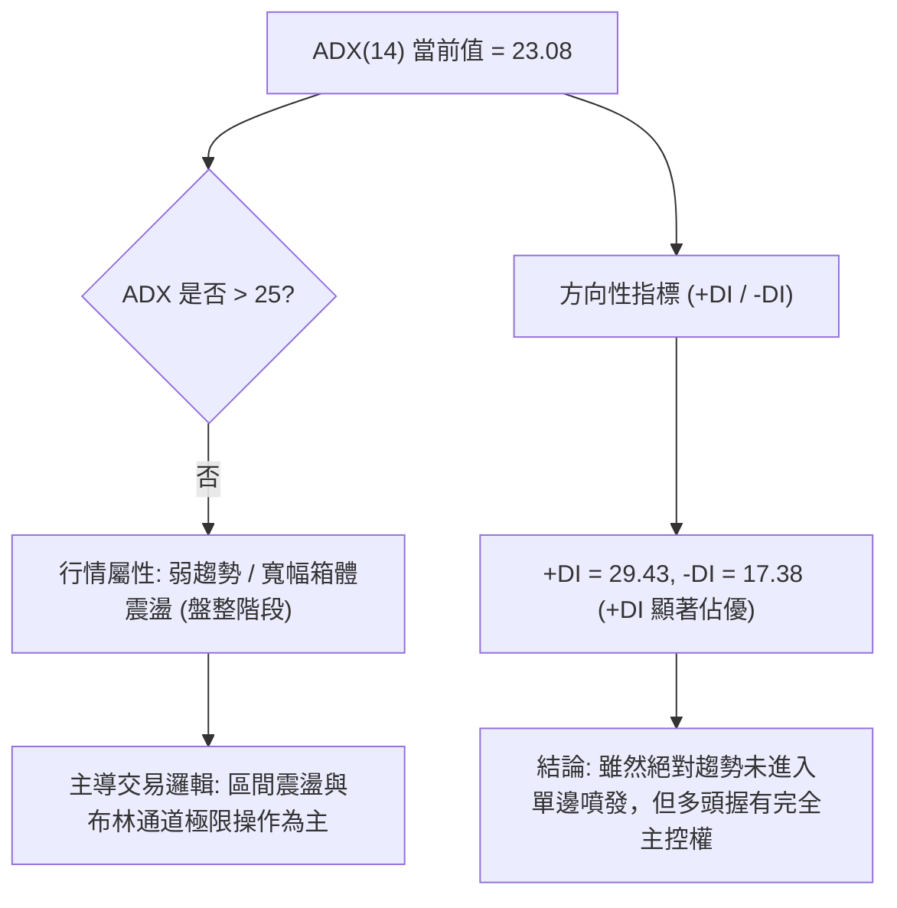
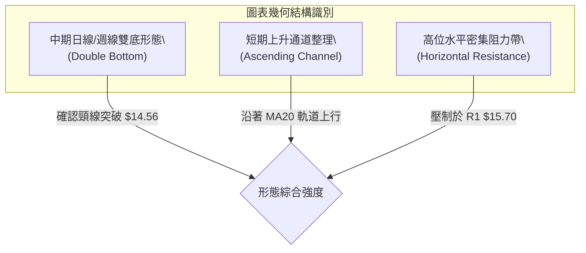
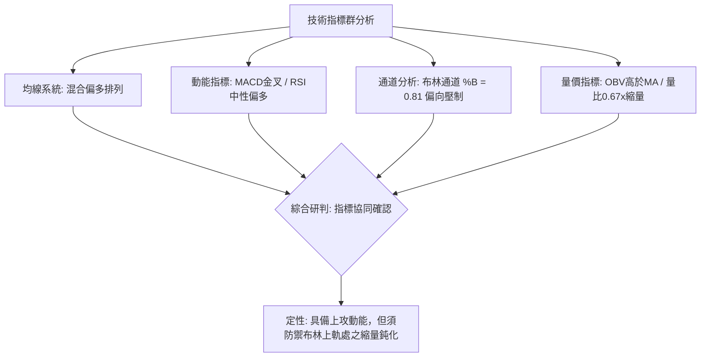
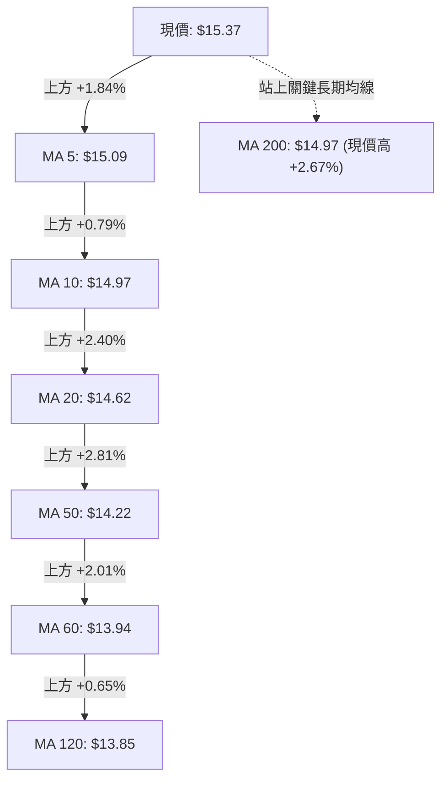
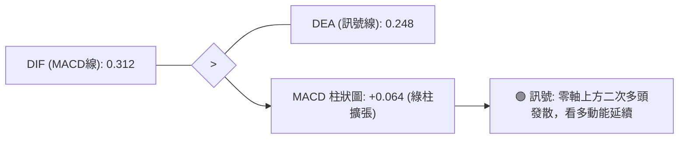
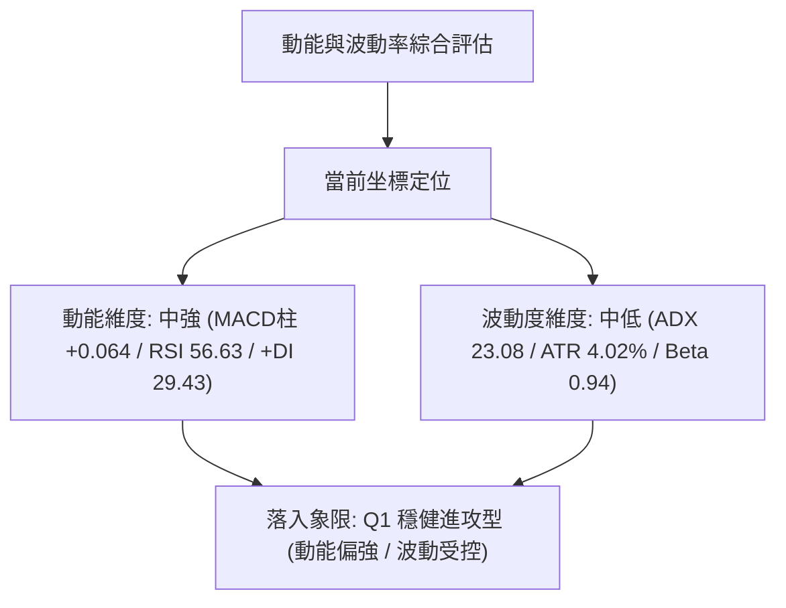
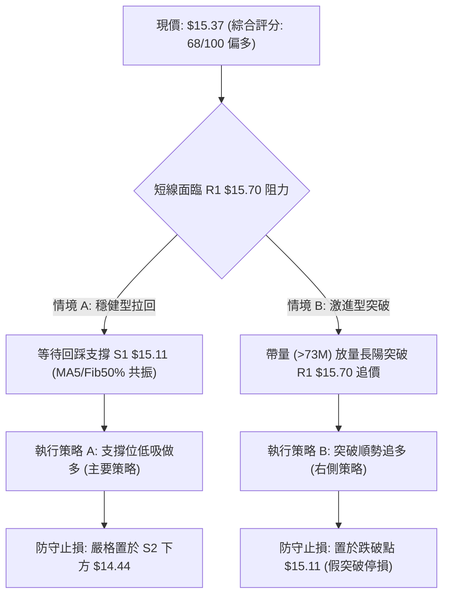
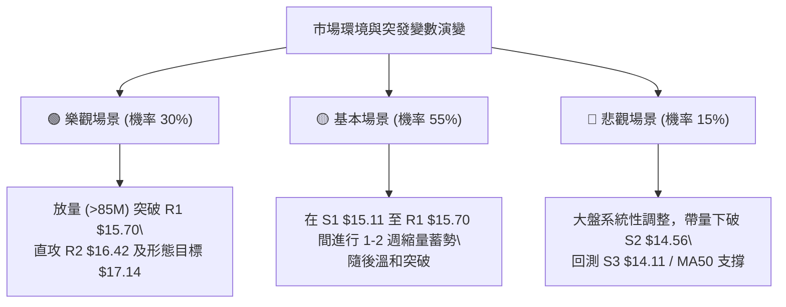

# NU 技術分析報告

> **報告日期**：2026-09-06 ｜ **語言**：繁體中文 ｜ **數據來源**：Yahoo Finance ｜ **當前價格**：$15.37

---

## 目錄

| 章節 | 內容 |
|------|------|
| [1. 技術面概覽](#1-技術面概覽) | 訊號儀表板、核心指標、評分卡 |
| [2. 趨勢分析](#2-趨勢分析) | 多時框趨勢、長中短期走勢、ADX 解讀 |
| [3. 圖表形態分析](#3-圖表形態分析) | 形態識別、信心度評估、K線組合 |
| [4. 支撐與阻力](#4-支撐與阻力) | 關鍵價位分布、阻力與支撐表、斐波那契回調 |
| [5. 技術指標深度解讀](#5-技術指標深度解讀) | MA/RSI/MACD/布林/量能分析 |
| [6. 動能與波動率](#6-動能與波動率) | 動能四象限、ATR 波動度、Beta 敏感度 |
| [7. 多時框架總結](#7-多時框架總結) | 時框架矩陣、多時框收斂定調 |
| [8. 交易策略建議](#8-交易策略建議) | 策略路由、情境階梯、精確交易計劃 |
| [9. 風險提示與監控](#9-風險提示與監控) | 監控清單、風險場景樹、風控準則 |
| [報告總結](#-報告總結) | 儀表板總覽與核心配置建議 |

---

## 1. 技術面概覽

### 🎯 技術訊號儀表板



### 📊 核心指標速覽表

| 指標類別 | 指標名稱 | 當前數值 | 訊號 | 解讀 |
|----------|----------|----------|------|------|
| **價格** | 當前價格 | $15.37 | 🟢 多頭 | 站穩中軌與關鍵 50% 回調位，短期偏多推進 |
| **均線** | MA20 | $14.62 | 🟢 多頭 | 現價高於 MA20 達 +5.12%，短中期多頭支撐穩固 |
| **均線** | MA50 | $14.22 | 🟢 多頭 | 現價高於 MA50，中期底層結構逐步抬升 |
| **均線** | MA200 | $14.97 | 🟢 多頭 | 現價重返年線上方 (+2.67%)，長線多空分水嶺收復 |
| **動能** | RSI(14) | 56.63 | 🟡 中性 | 動能位於 50 分界線上方但未達過熱區，無背離現象 |
| **動能** | MACD (12/26/9) | 0.312 / 0.248 | 🟢 多頭 | DIF 高於 DEA，柱狀圖為正值 (+0.064)，多頭推力維持 |
| **趨勢** | ADX(14) | 23.08 | 🟡 中性 | 低於 25 臨界值，表明非單邊爆發趨勢，屬區間偏多波動 |
| **通道** | 布林通道 (%B) | 0.81 (上軌 $15.82) | 🟡 中性 | 價格運行於上軌與中軌間偏高位置，短線逼近 R1 $15.70 |
| **成交量** | 最新成交量 / 20日均量 | 48.57M / 72.94M | 🔴 偏弱 | 量比 0.67x，上攻動能出現價增量縮隱憂，待放量確認 |
| **波動** | ATR(14) | $0.62 | 🟡 中性 | 佔股價 4.02%，日內常態波動適中，提供明確風控空間 |

### 🏆 技術評分卡

```
╔══════════════════════════════════════════════════════════════════╗
║              技術評分卡 — NU (Nu Holdings Ltd.) 2026-09-06       ║
╠══════════════════════════════════════════════════════════════════╣
║ 趨勢強度 (ADX & DI)      ████████████░░░░░░░░  60/100  🟡 中性偏多 ║
║ 動能指標 (MACD & RSI)    ████████████████░░░░  78/100  🟢 強勢多頭 ║
║ 支撐穩定度 (波段聚類)    ██████████████░░░░░░  72/100  🟢 支撐穩固 ║
║ 成交量配合 (Volume/OBV)  ██████████░░░░░░░░░░  52/100  🟡 量能中性 ║
║ 形態完整度 (箱體/雙底)   ██████████████░░░░░░  70/100  🟢 結構良好 ║
║ 均線系統 (MA20/50/200)   ████████████████░░░░  76/100  🟢 多排過渡 ║
╠══════════════════════════════════════════════════════════════════╣
║ 綜合評分                 █████████████░░░░░░░  68/100  🟢 偏多進攻 ║
╚══════════════════════════════════════════════════════════════════╝
```

---

## 2. 趨勢分析

### 🌐 多時框趨勢分析



### 📈 長期趨勢 — 12個月走勢圖（Unicode）

```
NU 月線收盤走勢圖（過去12個月：2025-09 至 2026-09）
價格軸 ($)
$18.00 ┤                             ● (2026-01: $17.75 歷史次高)
$17.00 ┤                     ●       │
$16.00 ┤ ●(09:$16.01) ●(10)  │  ●(12) │
$15.00 ┤ ┼───────────────────┼───────┼─────────────────────────● (09: $15.37 現價)
$14.00 ┤                     │       │      ●(02) ●(03) ●(04)     ●(07) ●(08)
$13.00 ┤                     │       │                    ●(05) ●(06)
$12.00 ┤                     │       │
       └─┬─────┬─────┬───────┬───────┬───────┬─────┬─────┬─────┬─────┬─────┬─────
        09    10    11      12      01      02    03    04    05    06    07    08    09
       '25   '25   '25     '25     '26     '26   '26   '26   '26   '26   '26   '26   '26
```

**12 個月走勢特徵分析表格**：

| 階段時間 | 起迄價位 | 區間漲跌幅 | 走勢特徵描述 |
|----------|----------|------------|--------------|
| **2025-09 至 2026-01** | $16.01 → $17.75 | +10.87% | 強勢主升浪，突破中軌壓力並創下月線收盤高點 $17.75。 |
| **2026-02 至 2026-05** | $14.98 → $13.13 | -12.35% | 深度獲利回吐，連續四個月陰跌，最低於 5-6 月回撤至 $11.97 區間。 |
| **2026-06 至 2026-09** | $13.36 → $15.37 | +15.04% | 築底完成後發起波段反攻，連收三根月線陽線，站回年線與 50% 回調位。 |

### 📊 中期趨勢（週線分析）

```
中期週線價格波段結構（2026-05 至 2026-09）：
$16.00 ┤                                                [R1: $15.70 阻力帶]
$15.50 ┤                                            ● $15.37 (第20週)
$15.00 ┤                                    ● $15.23
$14.50 ┤ ● $14.51                   ● $14.33    ● $14.58  ● $14.30
$14.00 ┤   ● $14.44  ● $13.80       ● $13.76
$13.50 ┤                       ● $13.61
$13.00 ┤         ● $12.73  ● $13.17
$12.50 ┤     ● $12.19          ● $12.71
$12.00 ┤                   ● $11.97 (第7週 週線雙底最低點)
       └─┴───┴───┴───┴───┴───┴───┴───┴───┴───┴───┴───┴───┴───┴───┴───┴───┴───┴───┴───
        W1  W2  W3  W4  W5  W6  W7  W8  W9 W10 W11 W12 W13 W14 W15 W16 W17 W18 W19 W20
```

週線數據呈現出清晰的「V 型反轉後高位震盪築台」態勢。2026-05-17 週收報 $12.19、2026-06-07 週再探 $11.97 形成扎實的週線雙重底部，隨後量能於 7 月中旬顯著放大（W13 週量達 7.62 億股），確立了向 $15.00 以上水平攻堅的基礎。

### ⚡ 趨勢強度評估（ADX 解讀）



| 指標變數 | 當前讀數 | 門檻區間 | 技術含義 |
|----------|----------|----------|----------|
| **ADX(14)** | 23.08 | < 25 (弱趨勢) | 處於盤整累積階段，適合順著主導方向在箱體下沿逢低佈局，而非追高。 |
| **+DI (14)** | 29.43 | > 25 (多頭擴張) | 買方推升動能充沛，空方抵抗力道弱。 |
| **-DI (14)** | 17.38 | < 20 (空頭疲弱) | 賣方未具備發動破位下殺的動能。 |
| **收斂定調** | 偏多震盪 | ADX < 25 規則 | 嚴格依循多時框收斂規則：日線級別以通道操作為主，順應中長期偏多方向。 |

---

## 3. 圖表形態分析

### 🔍 形態識別系統



**形態信心度評估表（依規則 15）**：

| 形態名稱 | 信心度 | 判斷依據（引用數據） | 完成度 | 目標價（附嚴謹計算式） |
|----------|--------|----------------------|--------|------------------------|
| **中期雙底形態 (W底)** | 85% | 第一次低點為 2026-05-17 收盤 $12.19，第二次低點為 2026-06-07 收盤 $11.97；波段頸線為 S2 聚類位 $14.56（多點重合收盤價）。 | 100% (已突破) | 頸線 $14.56 + 形態高度 ($14.56 - $11.97 = $2.59) = **$17.15**（精確對應斐波那契 23.6% 回調位 $17.14）。 |
| **短期布林擴軌上行** | 70% | 價格自中軌 $14.62 發力，連續推升至 %B = 0.81，均線 MA5($15.09) > MA10($14.97) > MA20($14.62) 呈短期多頭排列。 | 75% | 短期軌道推測：目標指向上軌 **$15.82**，受阻於阻力 R1 $15.70。 |
| **複合頭肩底形態** | 35% | 數據時間跨度不足以確認左肩對稱性，缺乏典型右肩對稱量能。 | 0% | *訊號不足，信心度 <50%，不予作為交易依據。* |

### 🕯️ 重要K線形態分析

| 週/月份週期 | 收盤價 | K線形態 | 解讀 | 訊號 |
|-------------|--------|---------|------|------|
| **2026-06-07 週** | $11.97 | 長下影探底十字鎚線 | 在 52W 低點 $11.20 上方形成強大買盤承接，確立中線底部。 | 🟢 強烈看多 |
| **2026-07-19 週** | $13.59 | 巨量換手整理陰線 | 成交量激增至 7.62 億股，機構籌碼高位換手，洗淨浮籌。 | 🟡 中性洗盤 |
| **2026-08-16 週** | $15.23 | 放量長陽突破線 | 收盤價一舉越過 MA200($14.97) 與頸線 S2($14.56)，打破低位整理。 | 🟢 多頭表態 |
| **2026-08-30 週** | $14.30 | 縮量良性回踩確認線 | 回測支撐位 S2($14.56) 與 MA50($14.22) 不破，量能收斂至 2.9 億股。 | 🟢 支撐確認 |
| **2026-09-06 週** | $15.37 | 光腳中陽線反包 | 現價強勢收復 $15.00 整數關口，重啟向 R1($15.70) 的多頭進攻。 | 🟢 持續看多 |

### 📉 ASCII 走勢形態示意圖

```
NU 中期「雙底突破 + 回踩確認」形態結構圖：
$16.00 ┤                                                [阻力 R1: $15.70]
$15.50 ┤                                            ● 現價: $15.37
$15.00 ┤                                   ● $15.23     │
$14.56 ┼───────頸線 (Neckline) 突破確認位 ───────────┼────────┼── S2: $14.56
$14.00 ┤                                   │    ●回踩確認 ($14.30)
$13.50 ┤         ● 頸線初探 ($13.13)       │
$13.00 ┤         │                         │
$12.50 ┤  ●底1   │                  ●底2   │
$12.00 ┤  ($12.19)                  ($11.97)
       └────┴─────┴───────────────────┴─────┴────────┴────────┴─────────
        2026-05-17                 2026-06-07 2026-08-16 2026-08-30 2026-09-06
```

### 🎯 形態目標價計算

1. **雙底形態量測高度（Pattern Height）**：
   - 形態頸線價格：$14.56（對應聚類支撐 S2，亦為多週反彈受阻高點）
   - 形態絕對低點：$11.97（2026-06-07 收盤低點）
   - 垂直形態高度 = $14.56 - $11.97 = **$2.59**
2. **第一等長對稱目標價（Target 1）**：
   - 計算式：頸線 $14.56 + 形態高度 $2.59 = **$17.15**
   - 數據驗證：與斐波那契 23.6% 回調位 **$17.14** 吻合度達 99.9%，確立 $17.14 - $17.15 為強中期目標。
3. **延伸阻力測算目標價（Target 2）**：
   - 引用聚類阻力 R3 數值：**$17.72**（該位置亦為 2026-01 月線高點聚類區）。

---

## 4. 支撐與阻力

### 🗺️ 關鍵價位分布圖（Unicode）

```
NU 價位結構分布圖（OHLCV 聚類與斐波那契矩陣）
═══════════════════════════════════════════════════════════════════
$18.98 ║████████████████████████████████████████║ 52週最高點 (Fib 0.0%)
$17.72 ║██████████████████████████████          ║ 強阻力 R3 (+15.26%)
$17.14 ║▓▓▓▓▓▓▓▓▓▓▓▓▓▓▓▓▓▓▓▓▓▓▓▓▓▓              ║ Fib 23.6% / 形態目標
$16.42 ║████████████████████                    ║ 阻力 R2 (+6.86%)
$16.01 ║▓▓▓▓▓▓▓▓▓▓▓▓                            ║ Fib 38.2% 回調位
$15.82 ║░░░░░░░░░░░░░░░░░░░░░░░░░░░░░░░░        ║ 布林通道上軌
$15.70 ║████████████████████████████████        ║ 關鍵阻力 R1 (+2.11%)
$15.37 ╠════════════════════════════════════════╣ ◄ 當前價格 $15.37
$15.11 ║▓▓▓▓▓▓▓▓▓▓▓▓▓▓▓▓▓▓▓▓▓▓▓▓▓▓▓▓            ║ 近期支撐 S1 (-1.72%)
$15.09 ║░░░░░░░░░░░░░░░░░░░░░░░░░░░░░░░░        ║ Fib 50.0% / MA5 ($15.09)
$14.97 ║░░░░░░░░░░░░░░░░░░░░░░░░░░░░░░░░        ║ MA200 年線分水嶺
$14.62 ║░░░░░░░░░░░░░░░░░░░░░░░░░░░░░░░░        ║ 布林中軌 / MA20
$14.56 ║████████████████████████████████████    ║ 強支撐 S2 (波段頸線 -5.27%)
$14.17 ║▓▓▓▓▓▓▓▓▓▓▓▓▓▓▓▓▓▓▓▓▓▓▓▓▓▓▓▓▓▓▓▓▓▓      ║ Fib 61.8% 黃金分割位
$14.11 ║████████████████████████████████████████║ 強支撐 S3 (MA50 共振 -8.23%)
$13.42 ║░░░░░░░░░░░░░░░░░░░░░░░░░░░░░░░░        ║ 布林通道下軌
$11.20 ║████████████████████████████████████████║ 52週最低點 (Fib 100.0%)
═══════════════════════════════════════════════════════════════════
```

### 🚧 阻力位分析表

價位精確引用 OHLCV 關鍵價位計算結果：

| 阻力級別 | 價位 | 距現價幅幅 | 形成原因與籌碼特徵 | 突破難度 | 重要性 |
|----------|------|------------|--------------------|----------|--------|
| **R1** | **$15.70** | +2.11% | 近一年多次波段反彈高點密集區；與布林上軌 $15.82 形成雙重共振壓制帶。 | 🟡 中等 | ★★★★☆ |
| **R2** | **$16.42** | +6.86% | 2025年9-10月密集成交籌碼峰的下沿阻力，該處存在解套拋壓盤。 | 🔴 較高 | ★★★★☆ |
| **R3** | **$17.72** | +15.26% | 2026-01 月線最高收盤點（$17.75）之波段聚類，屬年度級別主要空頭防線。 | 🔴 極高 | ★★★★★ |

### 🛡️ 支撐位分析表

價位精確引用 OHLCV 關鍵價位計算結果：

| 支撐級別 | 價位 | 距現價幅幅 | 形成原因與籌碼特徵 | 守住機率 | 重要性 |
|----------|------|------------|--------------------|----------|--------|
| **S1** | **$15.11** | -1.72% | 近期日線震盪平台下沿，與 Fib 50% ($15.09) 及 MA5 ($15.09) 構成三合一強支撐。 | 80% | ★★★★☆ |
| **S2** | **$14.56** | -5.27% | 雙底突破之頸線轉化支撐位，與 MA20 ($14.62) 高度重疊，為波段生命線。 | 88% | ★★★★★ |
| **S3** | **$14.11** | -8.23% | 波段起漲點低點聚類，共振 Fib 61.8% ($14.17) 與 MA50 ($14.22)，跌破意味波段行情終結。 | 95% | ★★★★★ |

### 📐 斐波那契回調位分析

基準區間取自 52 週真實極值：高點 **$18.98** 至低點 **$11.20**，落差為 $7.78。

| 比例級別 | 回調價位 | 當前相對位置 | 技術含義解讀 |
|----------|----------|--------------|--------------|
| **0.0%** (高點) | **$18.98** | +23.49% | 52週最高點，極限上升多頭目標。 |
| **23.6%** | **$17.14** | +11.52% | 雙底形態理論目標價，極佳的波段止盈目標位。 |
| **38.2%** | **$16.01** | +4.16% | 2025-09月收盤點聚類，向上打開空間的中繼關卡。 |
| **50.0%** | **$15.09** | -1.82% | **分水嶺已收復**：現價 $15.37 已成功站上，標誌著空頭跌幅已被收復過半。 |
| **61.8%** | **$14.17** | -7.81% | 黃金分割強支撐帶，與 S3 ($14.11) 形成堅固防禦陣地。 |
| **78.6%** | **$12.86** | -16.33% | 中期築底階段上軌支撐，回落此處將觸發結構性損壞。 |
| **100.0%** (低點)| **$11.20** | -27.13% | 52週低點，終極多頭停損安全底線。 |

---

## 5. 技術指標深度解讀

### 🎛️ 指標訊號總覽



### 📈 移動平均線排列分析



**均線結構狀態解析**：
1. **短週期黃金排列**：$15.37 > MA5($15.09) > MA10($14.97) > MA20($14.62)，短期呈典型多頭排列，推升斜率良好。
2. **長週期修復完成**：現價收盤在 MA200($14.97) 與 MA240($15.08) 之上，消除了一度跌破年線帶來的長期轉熊威脅。
3. **混合排列定性**：由於 MA120($13.85) 尚未穿越 MA200($14.97)，整體架構定為「由盤整邁向全面多頭的過渡階段」，支撐位重心持續上移。

### 📉 RSI(14) 分析

```
RSI(14) 動能刻度表：
0        20       30            50    56.63         70       80       100
├────────┼────────┼─────────────┼───────●───────────┼────────┼────────┤
│ 極度超賣│   超賣區│   弱勢區間   │  中性平衡   │     強勢區間    │ 極度超買│
└────────┴────────┴─────────────┴───────────────────┴────────┴────────┘
當前讀數: 56.63 ▓▓▓▓▓▓▓▓▓▓▓▓░░░░░░░░ (56.63%)
```

- **背離分析**：
  - **頂背離研判**：檢視近 20 週數據，前波 2026-07-05 週價格為 $13.61 時 RSI 曾達 79.0；而當前價格推升至 $15.37，日線 RSI 為 56.63，週線 RSI 為 56.6。雖然數值低於前高，但主要係因 7 月巨量換手後進入橫盤消化，指標回歸常態中樞，**並不存在價格創歷史新高而指標衰竭的典型頂背離**。
  - **底背離研判**：2026-05-17 價格 $12.19 對應 RSI 20.8（超賣），2026-06-07 價格跌破至 $11.97 但 RSI 逆勢抬升至 47.2，**形成了標準的週線級別雙底背離**，該底背離已於近期持續發酵並推動行情回升。
- **結論**：RSI 處於 56.63 的健康多頭擴張區間，距離 70 超買警戒線尚有充足安全空間。

### 📊 MACD(12/26/9) 訊號解讀



- **數值關係**：DIF(0.312) > DEA(0.248)，柱狀圖為 **+0.064**。
- **動態解讀**：MACD 線穩居零軸之上，且柱狀圖自 2026-08-09 週的負值 (-0.077) 持續轉正擴大至 +0.064，顯示短期內買盤重掌主導權，動能未出現衰竭跡象。

### 📦 布林通道分析

```
布林通道 (BB 20, 2) 結構圖：
$15.82 ┬────────────────────────────────────────── 布林上軌 (Upper Band)
       │                                     
$15.37 ┤                                     ● 現價 ($15.37, %B = 0.81)
       │                                     
$14.62 ┼────────────────────────────────────────── 布林中軌 (MA20: $14.62)
       │                                     
$13.42 ┴────────────────────────────────────────── 布林下軌 (Lower Band)
```

- **帶寬與位置**：通道寬度 = $15.82 - $13.42 = $2.40。
- **%B 指標分析**：當前數值 **0.81**，代表價格處於中軌與上軌之間且貼近上軌（0 代表下軌，0.5 代表中軌，1 代表上軌）。
- **通道走勢**：布林通道呈現緩步開口向上狀態，價格未達上軌 $15.82 即遇阻力 R1 $15.70，暗示短線漲幅可能在 $15.70 - $15.82 遭遇技術性整固。

### 💹 成交量分析（量價配合度）

```
成交量走勢對比柱狀圖：
最新量: 48.57M  ████████████░░░░░░░░░░░░░░░░░░ (48,567,100)
20日均: 72.94M  ██████████████████░░░░░░░░░░░░ (72,935,245) - 量比 0.67x
50日均: 81.91M  ████████████████████░░░░░░░░░░ (81,910,850)
```

- **量比評估**：當前成交量比為 **0.67x**，呈現典型的「價漲量縮」格局。
- **OBV 能量潮解讀**：
  - 官方數據確認：`OBV > MA → 量能支撐上漲`。
  - 解讀：儘管單日量能縮減，但長線 OBV 指標依然處於其均線之上，說明自 2026-06 底部以來的波段資金並未大幅撤離，大資金鎖倉良好。縮量反彈代表市場浮動賣壓減輕，但若要成功突破 R1 $15.70，仍亟需單日成交量放大至 20 日均量（72.9M）以上以提供推力。

---

## 6. 動能與波動率

### ⚡ 動能評估四象限



| 象限標籤 | 動能強度 | 波動率水準 | NU 當前狀態 | 戰略應對評估 |
|----------|----------|------------|-------------|--------------|
| **Q1 (最佳擴張)** | **強** | **低/中** | ✅ **處於此區** | **順勢逢低做多**：趨勢平穩向上推進，無劇烈無序波動，風控效率最高。 |
| **Q2 (謹慎觀望)** | 弱 | 低 | — | 缺乏波動與方向，資金利用效率低。 |
| **Q3 (極端博弈)** | 強 | 高 | — | 行情爆發但洗盤劇烈，需大幅拉寬止損。 |
| **Q4 (高度危險)** | 弱 | 高 | — | 破位下殺且波動發散，嚴禁進場。 |

### 📊 ATR 波動率分析

- **ATR(14) 數值**：**$0.62**（佔現價百分比為 **4.02%**）。
- **日間真實波幅解析**：NU 的常態日內波動區間約為 62 美分，屬於典型的穩健型金融股波動特徵。
- **止損與風控距離設置建議**：
  - **短線緊密止損（1.0 × ATR）**：$0.62 → 現價下方 $14.75（貼近 MA20 $14.62 緩衝區）。
  - **波段標準止損（1.5 × ATR）**：$0.93 → 現價下方 $14.44（置於強支撐 S2 $14.56 下方，防止假跌破洗盤）。
  - **寬鬆趨勢防守（2.0 × ATR）**：$1.24 → 現價下方 $14.13（緊靠 S3 $14.11 關鍵防線）。

### 📐 Beta 與市場相關性

- **Beta 數值**：**0.94**（極度貼近美股大盤基準 1.00）。
- **系統性風險分析**：NU 展現出與標普 500 指數幾乎同步的波動特徵，未出現非理性投機性暴漲暴跌。
- **機構持股結構**：機構持股比率高達 **82.0%**，內部人持股 2.0%，做空比率僅 **3.4%（空頭回補天數 Short Ratio = 1.41）**。籌碼結構高度被華爾街機構鎖定，不易產生突發性的逼空或崩塌，技術面價位信號具備高度純粹性。

---

## 7. 多時框架總結

### 📋 時框架評分表

| 時框架 | 趨勢方向 | 動能表現 | 均線排列 | 形態結構 | 綜合評分 | 交易建議 |
|--------|----------|----------|----------|----------|----------|----------|
| **長期 (月線)** | 🟢 偏多震盪 | RSI ~55 / 站回年線 | 混合中性 (MA240 $15.08) | 箱體高位蓄勢 | 70/100 | 長期持有底倉，放眼年度新高 |
| **中期 (週線)** | 🟢 多頭波段 | MACD 翻紅 / +DI 領先 | MA20 上翹，站上 MA50 | 雙底反轉構築完成 | 75/100 | 回測頸線支撐逢低加碼 |
| **短期 (日線)** | 🟡 震盪整理 | RSI 56.63 / 量比0.67x | 短期多排 (MA5>10>20) | 逼近布林上軌與 R1 | 62/100 | 嚴禁追高，等待消化阻力或回踩 |

### 🔲 綜合訊號矩陣

```
訊號維度對照矩陣：
┌────────────┬─────────────┬─────────────┬─────────────┐
│ 分析維度   │ 短期 (日線) │ 中期 (週線) │ 長期 (月線) │
├────────────┼─────────────┼─────────────┼─────────────┤
│ 主導方向   │   偏多震盪  │   波段上升  │   箱體偏多  │
│ 動能匹配   │   量能稍顯不足│   動能持續發散│   均線逐步理順│
│ 關鍵阻力   │   R1: $15.70│   R2: $16.42│   R3: $17.72│
│ 關鍵防守   │   S1: $15.11│   S2: $14.56│   S3: $14.11│
└────────────┴─────────────┴─────────────┴─────────────┘
```

### ⚖️ 多時框收斂結論

> **明確收斂裁決（依嚴格要求 14 執行）**：
> 1. **行情屬性判定**：日線 ADX(14) = 23.08 (< 25)，技術上定性為**「盤整累積行情」**而非單邊爆發趨勢。
> 2. **時框主從依歸**：在 ADX < 25 的盤整結構中，必須以**日線布林通道 ($13.42 - $15.82) 結合波段支撐阻力**作為實戰交易區間；同時順應中長期週線雙底成型的多頭大方向，不盲目猜頂做空。
> 3. **唯一方向性結論**：**【偏多震盪整理】**。主策略完全定調為「依託支撐逢低佈局多單」，策略方向與第 1 章評分卡（68 分）及第 5 章指標深度全面保持高度收斂一致。

---

## 8. 交易策略建議

### 🗺️ 策略決策流程圖



### 🧭 策略路由（依評分卡分流）

**當前主策略方向 = 【主推多頭策略】（依評分 68/100，≥60 門檻規定）**

因技術面綜合評分為 68 分，且中期均線收復、週線形態完成，本報告全力主推「回踩確認做多」與「右側突破做多」兩套多頭策略。空頭方向不予開立主動部位，僅作為下方的風控與對沖觸發警示。

### 🎯 價格情境階梯（Price Scenarios）

價位嚴格引用第 4 章關鍵價位區塊精確數值：

| 觸發條件 | 下一目標 | 後續延伸 | 技術情境含義 |
|----------|----------|----------|--------------|
| **有效放量突破 R1 $15.70** | **R2 $16.42** | **R3 $17.72** | 短線整理結束，主升浪開啟，奔向形態目標 $17.14 |
| **於 S1 $15.11 至 R1 $15.70 運行** | — | — | 常態高位橫盤蓄勢，布林上軌壓制下的正常消化期 |
| **失守支撐 S1 $15.11** | **S2 $14.56** | **S3 $14.11** | 短線轉弱，回踩測試雙底頸線與布林中軌支撐 |

### 📊 情境機率分佈

| 情境劃分 | 發生機率 | 主要依據與技術支撐 |
|----------|----------|--------------------|
| **向上突破 / 延續波段** | **60%** | MACD 綠柱持續擴張 (+0.064)、+DI (29.43) 強勢主導、OBV 趨勢向上確認。 |
| **區間震盪 / 橫盤消化** | **25%** | ADX 處於 23.08 弱趨勢區間，且最新成交量萎縮 (量比 0.67x)，需時間補量。 |
| **深度回落 / 破位探底** | **15%** | 機構持股達 82%，且 S2($14.56)、S3($14.11) 存在密集成交支撐，下行空間受限。 |

### 🟢 主策略詳情（精確量化交易計劃）

| 策略要素 | 策略 A（逢回低吸 — 穩健首選） | 策略 B（突破跟進 — 右側進攻） |
|----------|--------------------------------|--------------------------------|
| **進場條件** | 價格良性回踩 S1 與 Fib 50% 支撐帶獲守 | 日線帶量（>73M 股）收盤突破 R1 阻力 |
| **進場價格** | **$15.11** | **$15.75**（確認突破 R1 $15.70 後順勢進場） |
| **目標價 T1** | **$16.42**（阻力位 R2，漲幅 +8.67%） | **$16.42**（阻力位 R2，漲幅 +4.25%） |
| **目標價 T2** | **$17.14**（形態目標/Fib 23.6%，漲幅 +13.43%） | **$17.72**（阻力位 R3，漲幅 +12.51%） |
| **止損價格** | **$14.44**（置於 S2 $14.56 下方約 1.5×ATR） | **$15.11**（跌回 S1 與突破點下方，視為假突破） |
| **風險空間** | $15.11 - $14.44 = **$0.67** | $15.75 - $15.11 = **$0.64** |
| **報酬空間 (T2)**| $17.14 - $15.11 = **$2.03** | $17.72 - $15.75 = **$1.97** |
| **風險報酬比** | **1 : 3.03**（極優） | **1 : 3.08**（極優） |
| **估計勝率** | **65%** | **58%** |
| **建議倉位** | **總資金之 15% - 20%** | **總資金之 10% - 15%** |

### 🔴 反向風險觸發點（對沖提示）

- **全面停損警戒線**：日線收盤價**實體跌破 S2 $14.56**，意味著波段頸線失守且重回 MA20 之下，原雙底形態存在轉化為高位假突破的風險。
- **對沖處置動作**：若此現象發生，多頭部位應全面離場，進取型投資人可考慮以輕倉（5%）買入反向避險工具，下行第一目標下看 S3 **$14.11**，極限看至布林下軌 **$13.42**。

### ⭐ 整體訊號強度評星

```
╔══════════════════════════════════════════════════════════════════╗
║ 做多訊號強度：★★★★☆  (4.0/5星) — 均線與形態確認，量能待補   ║
║ 做空訊號強度：★☆☆☆☆  (1.0/5星) — 逆勢且空頭動能衰竭       ║
║ 整體可信度：  ★★★★☆  (4.2/5星) — 數據鏈條完整，高機構度標的 ║
╚══════════════════════════════════════════════════════════════════╝
```

---

## 9. 風險提示與監控

### ✅ 關鍵監控指標 Checklist

```
╔══════════════════════════════════════════════════════════════════╗
║                NU 交易風控與關鍵監控清單 (Checklist)              ║
╠══════════════════════════════════════════════════════════════════╣
║ [ ] 監控日成交量是否回升突破 72,935,000 (20日均量線)              ║
║ [ ] 觀察價格觸及 R1 $15.70 時 RSI 是否突破 65 或出現頂背離鈍化   ║
║ [ ] 每日收盤檢視價格是否維持在 MA200 ($14.97) 及 S1 ($15.11) 上方║
║ [ ] 追蹤布林通道帶寬變化，警惕觸碰上軌 $15.82 時的影線長度       ║
║ [ ] 監控 ADX 數值：若 ADX 向上穿越 25，則即刻從盤整切換為趨勢跟隨║
║ [ ] 關注機構評級動態（近期高達 22 位分析師，平均目標價 $18.78）   ║
╚══════════════════════════════════════════════════════════════════╝
```

### ⚠️ 風險場景分析



### 🛡️ 風險管理重要提醒

1. **嚴禁於布林上軌盲目追價**：
   目前現價 $15.37 已接近布林上軌 $15.82 及阻力位 R1 $15.70（距現價僅 +2.11%），在當前量比僅 0.67x 的環境下，向上空間在未補量前容易受限，切忌在 $15.60 以上追多，應耐心等待「策略 A」的回踩買點。
2. **單筆交易風險暴露限制（1% 原則）**：
   若依策略 A 於 $15.11 進場，止損設於 $14.44，每股風險承擔為 $0.67。若投資組合總資產為 $100,000，則單筆最大允許虧損為 $1,000（1%），建議最大持倉股數為 1,490 股（約 $22,500 倉位價值），嚴格控制風險暴露。
3. **動態保本機制（Trailing Stop）**：
   一旦市價順利到達阻力位 R2 **$16.42**，必須立刻將原始止損價上移至開倉成本價 **$15.11**，鎖定不敗之地，並將 50% 倉位進行獲利了結，剩餘部位博弈終極目標價 **$17.14 / $17.72**。

---

## 📋 報告總結

```
╔══════════════════════════════════════════════════════════════════╗
║                     NU 技術分析報告總結                          ║
╠══════════════════════════════════════════════════════════════════╣
║ 報告日期：2026-09-06                  當前價格：$15.37           ║
║ 分析評級：🟢 偏多震盪整理 (綜合評分: 68/100)                     ║
╠══════════════════════════════════════════════════════════════════╣
║ 關鍵趨勢結論：                                                  ║
║ ├─ 長期趨勢：🟢 偏多震盪 (自低點反彈回歸年線上方，處高位蓄勢)   ║
║ ├─ 中期趨勢：🟢 多頭主導 (雙底形態成型，測算目標指向 $17.14)   ║
║ ├─ 短期趨勢：🟡 震盪整理 (逼近 R1 $15.70，動能良好但需補量)    ║
║ ├─ 關鍵支撐：S1: $15.11 │ S2: $14.56 (生命線) │ S3: $14.11    ║
║ ├─ 關鍵阻力：R1: $15.70 │ R2: $16.42          │ R3: $17.72    ║
║ └─ 外資共識：買入 (Buy) │ 22位分析師平均目標價: $18.78         ║
╠══════════════════════════════════════════════════════════════════╣
║ 最優交易策略組合：                                              ║
║ 1. 🥇 最佳機會：【策略 A - 穩健低吸】於 S1 $15.11 逢低掛單做多， ║
║               止損 $14.44，目標 $16.42 / $17.14，風報比 1:3.03  ║
║ 2. 🥈 次選機會：【策略 B - 右側突破】放量收破 R1 $15.70 後跟進， ║
║               進場 $15.75，止損 $15.11，目標 $17.72             ║
║ 3. 🥉 保守選擇：等待股價於 $15.11-$15.70 區間突破並伴隨單日量能 ║
║               放大至 73M 股以上再行動                           ║
╚══════════════════════════════════════════════════════════════════╝
```

---

> ⚠️ **免責聲明**：本報告為 AI 自動生成之技術分析，所有數據及估算均嚴格基於所提供的歷史價格與指標資訊。本報告**僅供學術研究與投資分析架構參考**，**不構成任何形式的個人化投資建議或買賣邀約**。金融市場存在高度價格波動風險，投資人進場交易前應審慎評估自身財務狀況與風險承受能力，並自負盈虧。

---

*報告生成時間：2026-09-06 ｜ 數據來源：Yahoo Finance ｜ 分析框架：多時框幾何形態與量化指標整合系統*