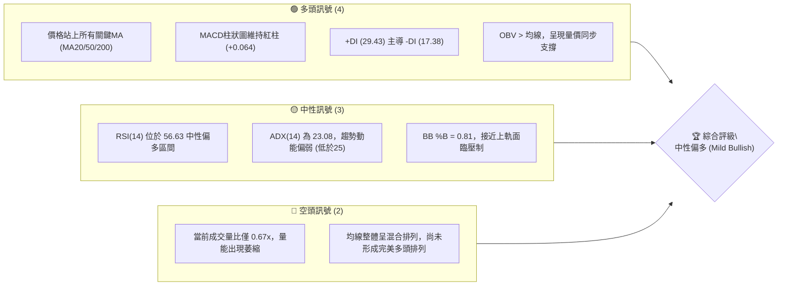
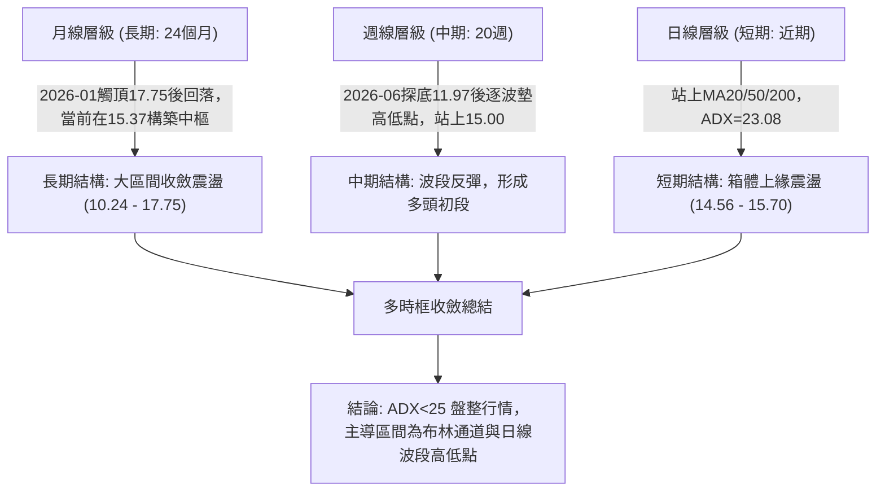
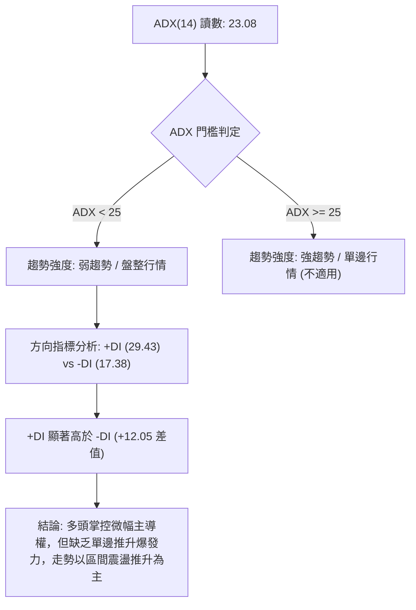
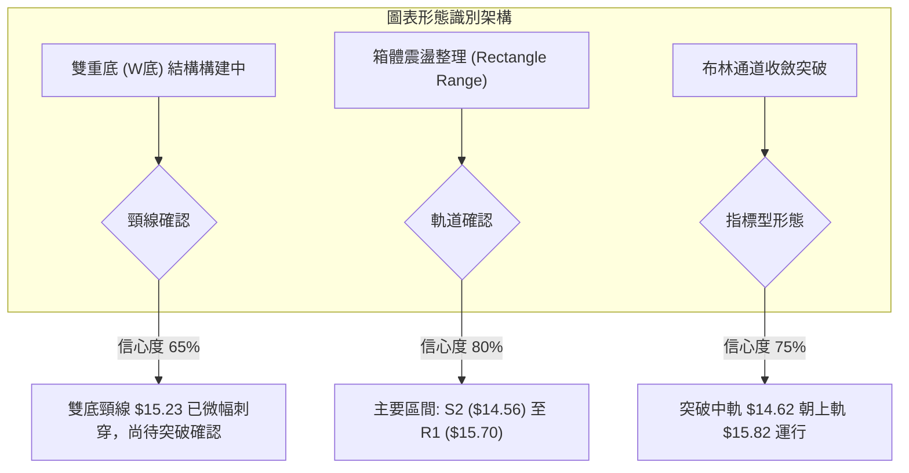
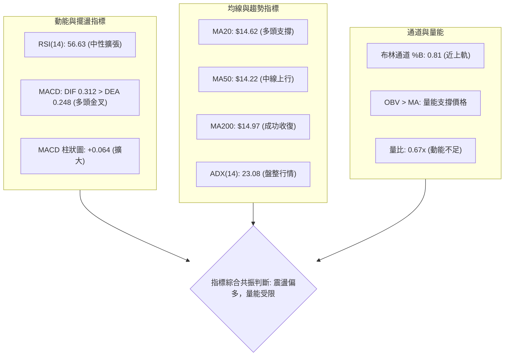
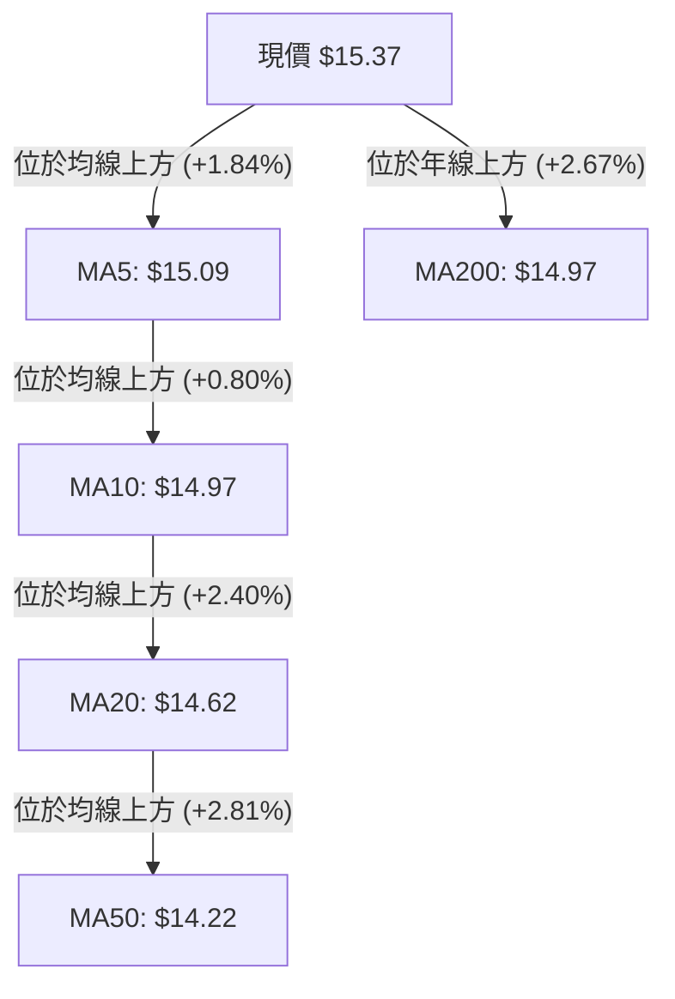
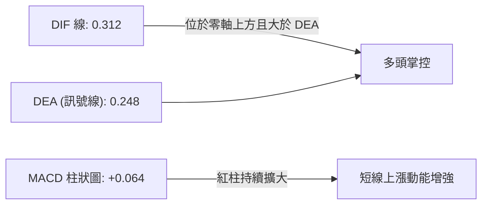
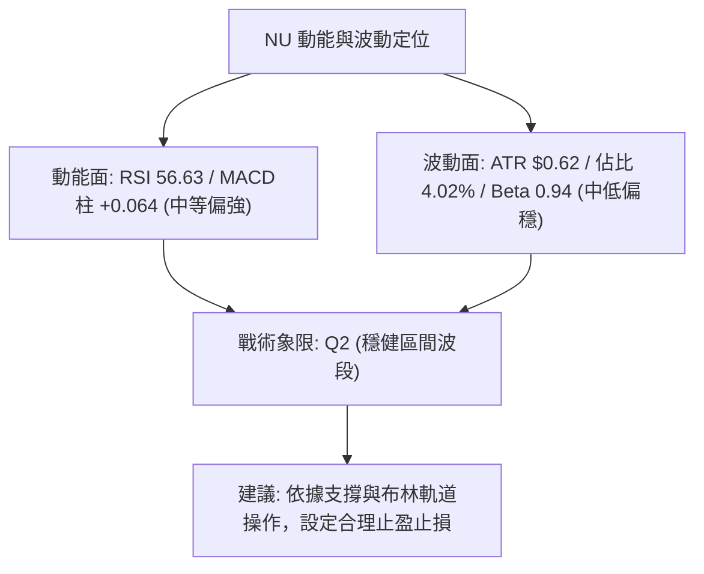
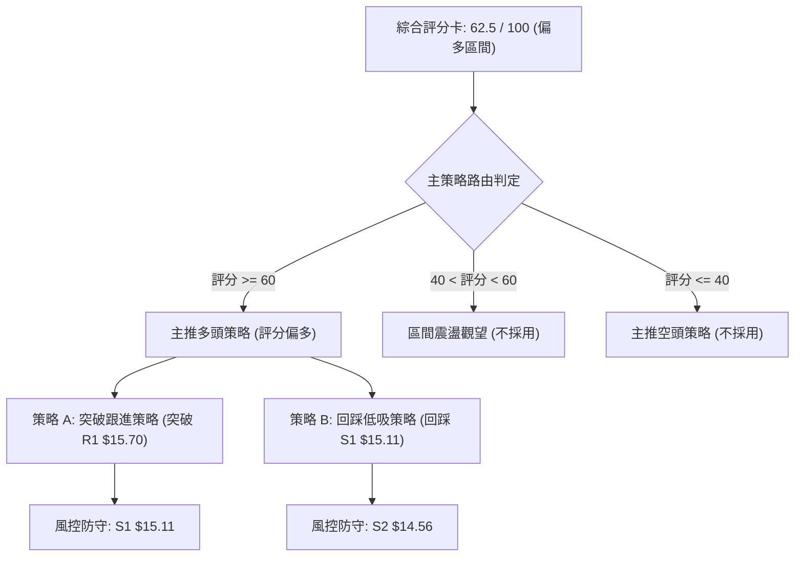
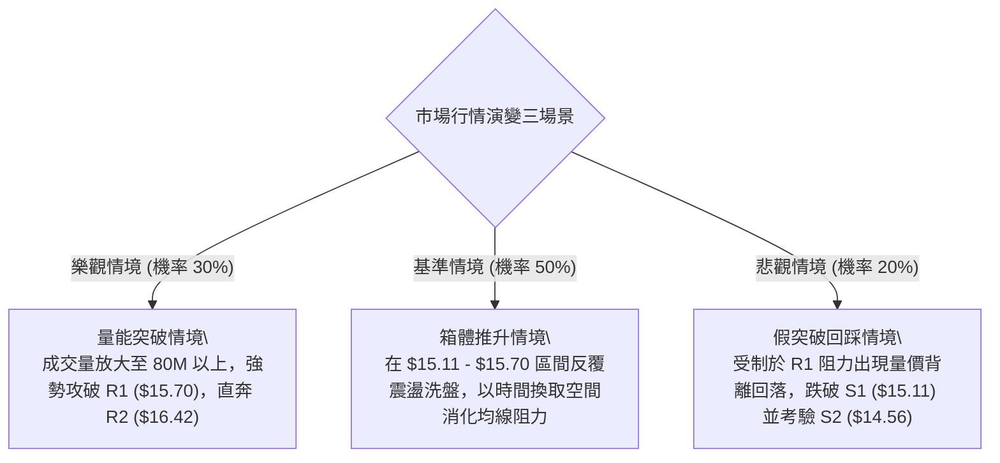

# NU 技術分析報告

> **報告日期**：2026-09-07 ｜ **語言**：繁體中文 ｜ **數據來源**：Yahoo Finance ｜ **當前價格**：$15.37

---

## 目錄

| 章節 | 內容 |
|------|------|
| [1. 技術面概覽](#1-技術面概覽) | 訊號儀表板、核心指標、評分卡 |
| [2. 趨勢分析](#2-趨勢分析) | 多時框趨勢、長中短期走勢 |
| [3. 圖表形態分析](#3-圖表形態分析) | 形態識別、K線組合、目標價 |
| [4. 支撐與阻力](#4-支撐與阻力) | 關鍵價位、斐波那契回調 |
| [5. 技術指標深度解讀](#5-技術指標深度解讀) | MA/RSI/MACD/布林/成交量 |
| [6. 動能與波動率](#6-動能與波動率) | 動能評估、ATR、Beta |
| [7. 多時框架總結](#7-多時框架總結) | 時框架評分矩陣 |
| [8. 交易策略建議](#8-交易策略建議) | 多空策略、風險報酬比 |
| [9. 風險提示與監控](#9-風險提示與監控) | 監控指標、風險場景 |

---

## 1. 技術面概覽

### 🎯 技術訊號儀表板



### 📊 核心指標速覽表

| 指標類別 | 指標名稱 | 當前數值 | 訊號 | 解讀 |
|:---|:---|:---|:---:|:---|
| **價格** | 當前價格 | $15.37 | 🟢 | 位於52週區間53.6%分位，站上50%斐波那契位（$15.09） |
| **均線** | MA20 | $14.62 | 🟢 | 現價高於MA20達+5.12%，短中期趨勢偏多 |
| **均線** | MA50 | $14.22 | 🟢 | 現價高於MA50達+8.09%，中期波段底部確立支撐 |
| **均線** | MA200 | $14.97 | 🟢 | 現價站上牛熊分界線MA200（+2.67%），長線結構轉強 |
| **動能** | RSI(14) | 56.63 | 🟡 | 處於50-60擴張區間，無超買超賣，未見顯著背離 |
| **動能** | MACD | 0.312 / 0.248 | 🟢 | DIF位於訊號線上方，柱狀圖+0.064持續放大，短多延續 |
| **趨勢** | ADX(14) | 23.08 | 🟡 | ADX低於25門檻，定義為區間震盪盤整行情，非單邊趨勢 |
| **通道** | 布林通道 | %B = 0.81 | 🟡 | 現價接近上軌$15.82，短期面臨通道上邊界技術壓制 |
| **量能** | 成交量 / 20日均量 | 48.57M / 72.94M | 🔴 | 量比0.67x，上漲過程中成交量萎縮，量能未全面放大 |
| **波動** | ATR(14) | $0.62 | 🟡 | 佔現價4.02%，日均震盪幅度適中，適合區間擺動交易 |

### 🏆 技術評分卡

```
╔══════════════════════════════════════════════════════════════╗
║                 技術評分卡 — NU (2026-09-07)                  ║
╠══════════════════════════════════════════════════════════════╣
║ 趨勢強度 (ADX/方向)   ███████████░░░░░░░░░  55/100  🟡 中性  ║
║ 動能指標 (RSI/MACD)   ██████████████░░░░░░  70/100  🟢 看多  ║
║ 支撐穩定度 (MA/Pivot) ███████████████░░░░░  75/100  🟢 強勁  ║
║ 成交量配合 (Volume)   █████████░░░░░░░░░░░  45/100  🔴 偏弱  ║
║ 形態完整度 (Pattern)  █████████████░░░░░░░  65/100  🟡 構築  ║
║ 均線排列 (MA System)  █████████████░░░░░░░  65/100  🟡 混合  ║
╠══════════════════════════════════════════════════════════════╣
║ 綜合評分              █████████████░░░░░░░  62.5/100 偏多     ║
╚══════════════════════════════════════════════════════════════╝
```

---

## 2. 趨勢分析

### 🌐 多時框趨勢分析



### 📈 長期趨勢 — 12個月走勢圖（Unicode）

```
NU 月線收盤價走勢圖（過去12個月：2025-10 至 2026-09）
價格軸 ($)
$18.00 ┤                               ● (2026-01 高點 $17.75)
$17.00 ┤                     ●       
$16.00 ┤ ●(10月 $16.11)               
$15.00 ┤                       ●                    ● 現價 $15.37
$14.00 ┤                         ●   ●            ●
$13.00 ┤                             ●   ●   ●   
$12.00 ┤                               
$11.00 ┤                                     
       └─┬───────┬───────┬───────┬───────┬───────┬───────┬─
       25-10   25-11   25-12   26-01   26-03   26-05   26-07   26-09
```

#### 走勢特徵分析表格

| 階段區間 | 起止月份 | 價格變化 | 漲跌幅 | 走勢特徵與技術解讀 |
|:---|:---:|:---:|:---:|:---|
| **第一階段：高位衝刺** | 2025-10 → 2026-01 | $16.11 → $17.75 | +10.18% | 延續強勢多頭，創下收盤波段高點$17.75（52週高點為$18.98），多頭動能見頂 |
| **第二階段：波段修正** | 2026-01 → 2026-05 | $17.75 → $13.13 | -26.03% | 均線高檔反轉，連續數月大幅回撤，跌破長期均線，市場情緒進入極度恐慌 |
| **第三階段：底部盤整** | 2026-05 → 2026-06 | $13.13 → $13.36 | +1.75%  | 2026-06週線出現低點$11.97（逼近52週低點$11.20），完成籌碼換手與止跌構築 |
| **第四階段：震盪復甦** | 2026-06 → 2026-09 | $13.36 → $15.37 | +15.04% | 逐週震盪推升，站回斐波那契50%（$15.09）與MA200（$14.97），重返多頭中樞 |

### 📊 中期趨勢（週線分析）

```
NU 週線近期阻力與支撐示意圖
價格軸 ($)
$16.00 ┤                                      [斐波那契 38.2% $16.01] ── 強阻力
$15.70 ┤                           ┌───────── [近一年波段高點 R1 $15.70]
$15.37 ┤═══════════════════════════│ 現價 $15.37
$15.09 ┤                           └───────── [斐波那契 50.0% $15.09 / MA5 $15.09] ── 關鍵支撐
$14.56 ┤                    ┌──────────────── [近一年波段低點 S2 $14.56 / MA20 $14.62]
$14.11 ┤       ┌────────────┴──────────────── [斐波那契 61.8% $14.17 / S3 $14.11]
$13.00 ┤───────┴───────────────────────────── [2026-06 反彈起點區間 $13.13]
```

中期走勢顯示，NU 自2026年6月7日當週收盤$11.97見底以來，週線呈現「低點墊高」（Higher Lows: $11.97 → $12.19 → $13.59 → $14.30）與「高點墊高」（Higher Highs: $13.17 → $13.76 → $14.33 → $15.23 → $15.37）的典型中期反彈結構。

### ⚡ 趨勢強度評估（ADX 解讀）



#### ADX 強度指標對照

| 數值範圍 | 趨勢狀態 | 當前數值 | 市場特徵 |
|:---:|:---:|:---:|:---|
| **0 - 20** | 極弱 / 無趨勢 | — | 價格窄幅橫盤，指標反覆鈍化 |
| **20 - 25** | **弱趨勢 / 盤整** | **23.08** | **處於盤整與微弱趨勢過渡期，布林軌道為主要交易邊界** |
| **25 - 40** | 強趨勢形成 | — | 單邊行情展開，均線系統發揮強大牽引力 |
| **40 - 60** | 極強趨勢 | — | 動能高度噴發，極易出現超買或超賣 |

---

## 3. 圖表形態分析

### 🔍 形態識別系統



#### 形態信心度與目標價評估表

| 形態類別 | 信心度 | 判斷依據（引用數據） | 完成度 | 目標價（附計算式） |
|:---|:---:|:---|:---:|:---|
| **雙重底 (W-Bottom)** | **65%** | 兩次波段低點分別為2026-08-09的$13.84與2026-08-30的$14.30，頸線位於2026-08-16波段高點$15.23。現價$15.37已微幅上破頸線 | 75% | **由雙底形態高度推算**：<br>形態高度 = 頸線 $15.23 - 底二 $14.30 = $0.93<br>理論目標價 = 頸線 $15.23 + $0.93 = **$16.16**<br>（接近阻力位 R2 $16.42） |
| **箱體震盪整理** | **80%** | 近兩個月價格主要在支撐 S2 ($14.56) 與阻力 R1 ($15.70) 之間往返震盪，ADX=23.08高度吻合箱體特徵 | 85% | **由箱體向上突破推算**：<br>箱體高度 = R1 $15.70 - S2 $14.56 = $1.14<br>突破目標價 = R1 $15.70 + $1.14 = **$16.84**<br>（位於 R2 $16.42 與 R3 $17.72 之間） |
| **布林通道均值回歸與突破** | **75%** | 價格站穩中軌 MA20 ($14.62)，BB %B 達 0.81，朝上軌推進 | 80% | **指標邊界目標**：<br>布林通道上軌精確值 = **$15.82** |

### 🕯️ 重要K線形態分析

| 週/月份 | 收盤價 | K線組合形態 | 技術解讀 | 訊號 |
|:---|:---:|:---|:---|:---:|
| **2026-06-07 (週)** | $11.97 | **長下影探底錘頭** | 成交量爆出 473.47M 巨量，打出52週次低點後迅速收斂，主力籌碼進駐確立底部 | 🟢 強烈轉折 |
| **2026-07-05 (週)** | $13.61 | **連續實體大陽線** | 突破 $13.50 平台，RSI 急速拉升至 79.0，確立中期波段反彈走勢 | 🟢 多頭推升 |
| **2026-08-16 (週)** | $15.23 | **長陽反包吞噬線** | 吞噬前一週陰線實體（$13.84），強勢收復 $15.00 整數關卡與 MA200 | 🟢 短線轉強 |
| **2026-08-30 (週)** | $14.30 | **縮量下探測試十字** | 週量縮至 290.63M，回測 MA50 獲有效支撐，空頭下殺動能竭盡 | 🟡 止跌回穩 |
| **2026-09-06 (週)** | $15.37 | **實體光頭中陽線** | 週量放大至 373.99M，一舉收復上週失地，收在當週最高點附近 | 🟢 多頭奪回主導 |

### 📉 ASCII 走勢形態示意圖

```
NU 近期雙重底 (W底) 構築示意圖
價格 ($)
$15.70 ┤                                            [阻力位 R1 $15.70]
$15.37 ┤                                      ● 現價 $15.37 (突破頸線測試中)
$15.23 ┤                   ● (頸線高點 $15.23) ╱
$14.80 ┤                 ╱  ╲                ╱
$14.30 ┤                ╱    ╲              ● (第二底 $14.30)
$13.84 ┤  ● (第一底 $13.84)   ╲            ╱
$13.40 ┤   ╲                  ╲          ╱
       └───┴───────────────────┴──────────┴────────
          2026-08-09         2026-08-16  2026-08-30   2026-09-06
```

### 🎯 形態目標價計算

根據古典圖表幾何推算標準，雙底形態於週線收盤突破 $15.23 後正式觸發：
1. **頸線確認水準**：2026-08-16 週收盤價 **$15.23**。
2. **形態低點**：第二底（Higher Low）為 2026-08-30 週收盤價 **$14.30**。
3. **形態垂直高度**：$15.23 - $14.30 = **$0.93**。
4. **理論最小量度目標**：$15.23 + $0.93 = **$16.16**（與數據庫中阻力位 R2 $16.42 形成密集阻力帶）。

---

## 4. 支撐與阻力

### 🗺️ 關鍵價位分布圖（Unicode）

```
NU 價位結構分布圖 (由 OHLCV 與斐波那契精準計算)
═══════════════════════════════════════════════════════════════
$18.98 ║██████████████████████████████████████║ 52週高點 / 斐波 0.0%
$17.72 ║██████████████████████████████        ║ 強阻力 R3 (+15.26%)
$17.14 ║▓▓▓▓▓▓▓▓▓▓▓▓▓▓▓▓▓▓▓▓▓▓▓▓              ║ 斐波那契 23.6% 回調位
$16.42 ║██████████████████                    ║ 阻力位 R2 (+6.86%)
$16.01 ║▓▓▓▓▓▓▓▓▓▓▓▓▓▓▓▓                      ║ 斐波那契 38.2% 回調位
$15.82 ║░░░░░░░░░░░░░░░░                      ║ 布林通道上軌
$15.70 ║████████████                          ║ 關鍵阻力 R1 (+2.11%)
$15.37 ╠══════════════════════════════════════╣ ◄ 現價 ($15.37)
$15.11 ║██████████                            ║ 近期支撐 S1 (-1.72%)
$15.09 ║▓▓▓▓▓▓▓▓▓▓                            ║ 斐波那契 50.0% 關鍵軸
$14.97 ║░░░░░░░░░░                            ║ MA200 長期牛熊線
$14.62 ║░░░░░░░░                              ║ 布林中軌 (MA20)
$14.56 ║██████████████████                    ║ 強支撐 S2 (-5.27%)
$14.17 ║▓▓▓▓▓▓▓▓▓▓▓▓▓▓▓▓▓▓                    ║ 斐波那契 61.8% 黃金分割位
$14.11 ║████████████████████████              ║ 強支撐 S3 (-8.23%)
$13.42 ║░░░░░░░░░░░░                          ║ 布林通道下軌
$11.20 ║██████████████████████████████████████║ 52週低點 / 斐波 100.0%
═══════════════════════════════════════════════════════════════
```

### 🚧 阻力位分析表

所有價位均嚴格取自數據庫「關鍵價位」區塊之波段聚類：

| 阻力級別 | 價位 | 距現價幅幅 | 形成原因與籌碼特徵 | 突破難度 | 重要性 |
|:---|:---:|:---:|:---|:---:|:---:|
| **R1** | **$15.70** | +2.11% | 近一年波段高點聚類；與布林通道上軌（$15.82）重疊構成短線箱頂壓制 | 中等 | 🟢 短線轉強樞紐 |
| **R2** | **$16.42** | +6.86% | 近一年密集密合成交區次高點；與斐波那契38.2%（$16.01）形成雙重防線 | 較高 | 🟡 中期多空分水嶺 |
| **R3** | **$17.72** | +15.26% | 2026年1月月線歷史收盤高點（$17.75）聚類處，極強解套壓力盤踞 | 極高 | 🔴 長期反轉重壓區 |

### 🛡️ 支撐位分析表

所有價位均嚴格取自數據庫「關鍵價位」區塊之波段聚類：

| 支撐級別 | 價位 | 距現價幅幅 | 形成原因與籌碼特徵 | 守住機率 | 重要性 |
|:---|:---:|:---:|:---|:---:|:---:|
| **S1** | **$15.11** | -1.72% | 近一年波段低點聚類；緊鄰斐波那契50.0%（$15.09）及MA5（$15.09），為短線第一防線 | 75% | 🟢 短線動能依託 |
| **S2** | **$14.56** | -5.27% | 近一年密集低點聚類；與布林中軌/MA20（$14.62）共振，構成波段生命線 | 85% | 🟡 波段防守基石 |
| **S3** | **$14.11** | -8.23% | 近一年深度低點聚類；與斐波那契61.8%（$14.17）及MA50（$14.22）疊加，中期底限 | 95% | 🔴 絕對多頭防線 |

### 📐 斐波那契回調位分析

依據52週極值區間（低點 **$11.20** → 高點 **$18.98**，區間垂直振幅 **$7.78**）精確計算：

```
斐波那契黃金分割層級與當前位置標注
0.0%  (52W High) ────────── $18.98
23.6%            ────────── $17.14
38.2%            ────────── $16.01  ▲ 上方第一道斐波壓制
[現價]           ══════════ $15.37  (位於 38.2% 與 50.0% 之間)
50.0% (中位分水嶺)───────── $15.09  ▼ 下方第一道斐波支撐 (已收復)
61.8% (黃金分割) ────────── $14.17
78.6%            ────────── $12.86
100.0%(52W Low)  ────────── $11.20
```

- **位置解讀**：現價 $15.37 目前穩固運行於 **50.0% ($15.09)** 與 **38.2% ($16.01)** 之間。在技術分析中，成功收復並站穩 50% 回調位是空頭趨勢扭轉為中性偏多的核心里程碑。
- **後市推演**：若能進一步放量上破 38.2% ($16.01)，將正式打開邁向 23.6% ($17.14) 的空間；若跌破 50.0% ($15.09)，則預期將回測黃金分割防線 61.8% ($14.17)。

---

## 5. 技術指標深度解讀

### 🎛️ 指標訊號總覽



### 📈 移動平均線排列分析

現階段均線系統呈現「**長短週期共振回升的混合排列**」：
- **MA5 ($15.09) > MA10 ($14.97) > MA20 ($14.62)**：短週期呈現完美多頭排列，斜率明顯向上，反映短線買盤強烈。
- **MA20 ($14.62) > MA50 ($14.22) > MA60 ($13.94) > MA120 ($13.85)**：中短期均線呈現多頭推升。
- **現價 ($15.37) 與 MA200 ($14.97) / MA240 ($15.08)**：現價已突破 200 日與 240 日長期年線，確認擺脫近半年以來的長期熊市陰霾。但因長期均線扣抵位置仍在下移，MA200 尚未向上金叉 MA20，因此定義為**混合排列**。



### 📉 RSI(14) 分析

- **當前讀數**：**56.63**
- **進度條展示**：
  ```
  超賣 (0)                       中軸 (50)           超買 (100)
  ├───┼───┼───┼───┼───┼───┼───┼───┼───┼───┼───┼───┼───┼───┤
  ░░░░░░░░░░░░░░░░░░░░░░░░░░░░░░░░██████████████░░░░░░░░░░░░ 56.63%
  ```
- **區間評估**：處於 50–70 的健康多頭擴張區間，既無超買風險（距離 70 仍有空間），亦脫離了 50 之下的疲弱態勢。
- **背離分析**：
  - 週線 RSI 曾於 2026-05-17 探底至 **20.8** 極度超賣，隨後在 2026-06-07 價格更低點（$11.97）時 RSI 抬升至 **47.2**，形成強烈**週線級別常規底背離**。
  - 當前日線與近期週線價格創反彈新高（$15.37），RSI 由 54.1 同步回升至 56.63，**無頂背離現象**，指標對價格上漲給予有效確認。

### 📊 MACD(12/26/9) 訊號解讀



- **MACD 數值**：DIF = **0.312**，Signal (DEA) = **0.248**，Histogram = **+0.064**。
- **技術解讀**：DIF 與 DEA 均位於零軸之上，且柱狀圖由前週微幅增長的 +0.002 急速擴張至 +0.064。這表明短線回調整理結束，新一輪多頭動能再度釋放，MACD 指標明確看多。

### 📦 布林通道分析

```
NU 布林通道 (20, 2) 當前結構圖
$16.00 ┤                                           
$15.82 ┤ ─ ─ ─ ─ ─ ─ ─ ─ ─ ─ ─ ─ ─ ─ ─ ─ ─ ─ ─ ─ ─  BB 上軌 ($15.82)
$15.37 ┤                         ● 現價 ($15.37)  [%B = 0.81]
$14.62 ┤ ─────────────────────────────────────────  BB 中軌 (MA20: $14.62)
$14.00 ┤                                           
$13.42 ┤ ─ ─ ─ ─ ─ ─ ─ ─ ─ ─ ─ ─ ─ ─ ─ ─ ─ ─ ─ ─ ─  BB 下軌 ($13.42)
```

- **通道帶寬**：上軌 $15.82，中軌 $14.62，下軌 $13.42，帶寬值（Bandwidth）= ($15.82 - $13.42) / $14.62 = **16.42%**，通道處於正常開口狀態。
- **%B 指標**：數值為 **0.81**，表明現價處於中軌至上軌的上半部高位區域。
- **操作意義**：根據規則，在 ADX<25 的盤整震盪市場中，布林通道上下軌具備極高約束力。現價逼近上軌 $15.82，且 %B 達 0.81，短線不可追高，預期在上軌處將遭遇震盪阻力。

### 💹 成交量分析（量價配合度）

- **最新單日成交量**：**48,567,100 股**。
- **20日均量**：**72,935,245 股**（量比僅為 **0.67x**）。
- **50日均量**：**81,910,850 股**。
- **OBV（能量潮）**：數據顯示「OBV > MA → 量能支撐上漲」。
- **量價診斷**：
  - **正面**：長期能量潮 OBV 依然高於其移動平均線，說明大週期資金未見外逃，籌碼沉澱穩定。
  - **背離隱憂**：短線價格上漲（由 $14.30 推至 $15.37），但日成交量顯著低於 20 日均量（僅 0.67x）。週線上，2026-09-06 當週成交量 373.99M 雖高於前一週的 290.63M，但仍遠不及 7 月份巨量（675M-762M）。**這顯示當前上漲為「籌碼鎖定型推升」而非「增量資金掃盤」**，一旦遭遇阻力位 R1 ($15.70)，若無量能放大，極易引發短線回踩。

---

## 6. 動能與波動率

### ⚡ 動能評估四象限

| 象限 | 動能強度 (RSI/MACD) | 波動率水準 (ATR/Beta) | 當前狀態 | 交易戰術評估 |
|:---:|:---:|:---:|:---:|:---|
| **第一象限 (Q1)** | 強動能 | 低波動 | — | 趨勢穩健推升，最佳波段做多機會 |
| **第二象限 (Q2)** | **中強動能** | **中低波動** | **✓ (當前 NU)** | **動能溫和回升（RSI=56.63, MACD翻紅），波動率可控（ATR=4.02%, Beta=0.94）。適合區間內拉回買進，不宜過度追高** |
| **第三象限 (Q3)** | 強動能 | 高波動 | — | 爆發突破行情，風險與回報均高 |
| **第四象限 (Q4)** | 弱動能 | 高波動 | — | 混亂下跌或震盪洗盤，應嚴格觀望 |



### 📊 ATR 波動率分析

- **ATR(14) 數值**：**$0.62**。
- **相對價格比率**：$0.62 / $15.37 = **4.02%**。
- **停損與風控量化標準**：
  - **激進型短線停損**：1.0 × ATR = **$0.62**。
  - **標準型波段停損**：1.5 × ATR = **$0.93**。
  - **寬鬆型防守停損**：2.0 × ATR = **$1.24**。
- **日內波動區間推算**：在常態市況下，NU 當日上下振幅約在 $0.62 範圍內，意味著若當日低點下探至 $14.75 附近，只要守住 S1 ($15.11) 與 MA20 ($14.62)，均屬於正常技術波動。

### 📐 Beta 與市場相關性

- **Beta 係數**：**0.94**。
- **市場屬性解析**：Beta 略低於 1.00，表明 NU 價格波動節奏與美股大盤（標普500指數）高度同步，但系統性波動風險略小於大盤整體。無非理性的過度槓桿化波動，適合技術面指標分析發揮效用。
- **放空比例 (Short % Float)**：**3.4%**，Short Ratio 僅 1.41 天。做空比例處於極低水位，顯示市場空頭拋壓不重，不存在被大幅軋空的催化條件，走勢純粹取決於內生買盤與籌碼結構。

---

## 7. 多時框架總結

### 📋 時框架評分表

| 時框架 | 趨勢方向 | 動能狀態 | 均線排列 | 關鍵形態 | 綜合評分 | 操作戰術建議 |
|:---:|:---:|:---:|:---:|:---:|:---:|:---|
| **長期 (月線)** | 🟡 寬幅震盪 | RSI 處中軸 | 糾結中性 | 自 $17.75 高點回落後的收斂震盪 | **55/100** | 大週期以 $11.20-$17.75 箱體對待，目前處中軸偏上 |
| **中期 (週線)** | 🟢 震盪反彈 | MACD柱擴大 | 站上MA50 | $11.97 築底後的階梯式推升 | **70/100** | 依托週線低點抬高趨勢，逢回檔支撐做多 |
| **短期 (日線)** | 🟢 偏多震盪 | RSI 56.63 | 突破MA20/200 | 雙底頸線測試，逼近布林上軌 | **65/100** | 留意 R1 $15.70 阻力，等待回踩 S1 介入 |

### 🔲 綜合訊號矩陣

| 訊號維度 | 短期 (日線) | 中期 (週線) | 長期 (月線) | 衝突檢驗與收斂解讀 |
|:---|:---:|:---:|:---:|:---|
| **均線方向** | 🟢 向上 | 🟢 向上 | 🟡 走平 | 短中期均線已向上轉折，長期均線仍處走平整理階段 |
| **動能狀態** | 🟢 MACD金叉 | 🟢 柱狀圖翻紅 | 🟡 中性 | 全週期動能未見頂背離，短中期共振偏多 |
| **成交量能** | 🔴 縮量 (0.67x) | 🟡 溫和放大 | 🟡 中性 | 短線量能萎縮是主要瑕疵，限制了單邊突破爆發力 |
| **支撐有效性** | 🟢 S1/MA20 強 | 🟢 MA50/週底強 | 🟢 50% 斐波強 | 各週期關鍵支撐重疊度高，下檔防禦體系極為扎實 |

### ⚖️ 多時框收斂結論

> **核心收斂法則**：當前 ADX(14) 為 **23.08**，明確低於 25 臨界點，市場定性為**「盤整震盪行情」**。依照收斂規則，此時不可盲目依據長期單邊趨勢追價，而必須**以日線布林通道上下軌（$13.42 - $15.82）與關鍵波段高低點作為核心交易邊界**。

- **多時框優先級收斂**：日線與週線在中期反彈方向上完全一致（低點不斷墊高），但日線受制於量能不足（量比0.67x）與布林上軌（$15.82）壓制。
- **唯一方向性結論**：**中性偏多（區間震盪推升）**。策略重點在於「**阻力位不追高，支撐位低吸做多**」，以布林中軌/MA20 ($14.62) 與支撐 S1 ($15.11) 為防守基石，向上博弈 R1 ($15.70) 及 R2 ($16.42)。

---

## 8. 交易策略建議

### 🗺️ 策略決策流程圖



### 🧭 策略路由

**當前主策略方向 = 主推多頭策略（依技術評分卡綜合評分 62.5 / 100）**
空頭操作僅列為防禦與極端轉向之對沖觸發點，不作為主推交易架構。

### 🎯 價格情境階梯（Price Scenarios）

所有價位均嚴格引用第 4 章計算之波段聚類數值：

| 觸發條件 | 第一目標 | 第二延伸 | 情境含義與技術演變 |
|:---|:---:|:---:|:---|
| **放量突破 R1 ($15.70)** | **R2 ($16.42)** | **R3 ($17.72)** | 短線強勢破局，走出布林帶壓制，展開向 38.2% 斐波那契位及更高目標的攻擊 |
| **站穩現價區間 ($15.11 - $15.70)** | 布林上軌 ($15.82) | R1 ($15.70) | 維持高位箱體橫盤蓄勢，消耗獲利盤，等待成交量補量確認 |
| **跌破 S1 ($15.11)** | **S2 ($14.56)** | **S3 ($14.11)** | 短線回調加深，將回測布林中軌 MA20 與 61.8% 斐波那契支撐帶 |

### 📊 情境機率分佈

| 價格情境 | 機率 | 主要依據（引用指標狀態） |
|:---|:---:|:---|
| **情境一：震盪上行 / 突破測試** | **60%** | MACD柱持續擴大(+0.064)，DIF穩於零軸上；價格穩居MA200與50%斐波位上；OBV支撐多頭 |
| **情境二：箱體窄幅震盪** | **25%** | ADX=23.08顯示單邊趨勢動能欠缺；當前量比僅0.67x，缺乏突破R1($15.70)的攻擊量能 |
| **情境三：回踩破位下探** | **15%** | 若短線失守S1($15.11)，將引發獲利盤拋售回測MA20($14.62)及S2($14.56) |

### 🟢 主策略詳情

本報告設計兩套多頭策略：**策略 A（突破確認型，適合動量交易者）** 與 **策略 B（回踩低吸型，適合波段穩健交易者，為首選）**。

| 策略要素 | 策略 A（強勢突破跟進） | 策略 B（回踩支撐低吸 - 首選） |
|:---|:---|:---|
| **進場條件** | 日線帶量收盤突破 R1 ($15.70) | 盤中回踩支撐 S1 ($15.11) 且獲支撐止跌 |
| **進場價格** | **$15.70** | **$15.11** |
| **目標價 T1** | **$16.42** (阻力位 R2，+4.59%) | **$15.70** (阻力位 R1，+3.90%) |
| **目標價 T2** | **$17.72** (阻力位 R3，+12.87%) | **$16.42** (阻力位 R2，+8.67%) |
| **止損價格** | **$15.11** (跌破支撐位 S1，-3.76%) | **$14.56** (跌破強支撐 S2 / MA20，-3.64%) |
| **風險報酬比 (R:R)** | **1 : 2.05** (以T2計達 **1 : 3.42**) | **1 : 1.07** (以T2計達 **1 : 2.38**) |
| **勝率估計** | 55% | 65% |
| **建議倉位** | 15% 總資金 | 25% 總資金 |

*注：止損距離均在 1.0 - 1.5 倍 ATR ($0.62 - $0.93) 範圍內，嚴格符合風控數學模型。*

### 🔴 反向風險觸發點（對沖提示）

若出現以下極端技術訊號，將**徹底否定**當前多頭策略，需立即止損並可考慮反手避險：
1. **關鍵價位跌破**：日線收盤價跌破 **S2 ($14.56)**，意味著跌破布林中軌與近一年波段密集低點，多頭結構瓦解。
2. **技術指標破位**：MACD 出現高位死叉且柱狀圖翻綠下穿零軸，同時 RSI(14) 跌破 45 水準。
3. **對沖操作線位**：若有效跌破 $14.56，第一下行目標直指 **S3 ($14.11)**，極端目標為斐波那契 78.6% **$12.86**。

### ⭐ 整體訊號強度評星

```
做多訊號強度：★★★★☆  (3.8/5星 - 均線結構與動能俱佳，唯量能不足扣分)
做空訊號強度：★☆☆☆☆  (1.2/5星 - 缺乏頂背離與做空籌碼支持)
整體可信度：  ★★★★☆  (4.0/5星 - 多指標共振，價位結構清晰)
```

---

## 9. 風險提示與監控

### ✅ 關鍵監控指標 Checklist

```
╔══════════════════════════════════════════════════════════════╗
║                 技術面每日風控監控清單 (Checklist)           ║
╠══════════════════════════════════════════════════════════════╣
║ [ ] 價位監控：收盤價是否持續站穩 S1 ($15.11) 與 MA200 ($14.97) ║
║ [ ] 量能監控：成交量是否回升至 20日均量 (72.9M) 之上          ║
║ [ ] 阻力測試：現價觸及 R1 ($15.70) 時是否出現長上影線拒絕訊號  ║
║ [ ] 動能跟蹤：MACD 柱狀圖是否持續維持在正值區間 (+0.064 以上)  ║
║ [ ] 震盪極限：布林通道 %B 是否突破 1.00 導致極度超買鈍化     ║
║ [ ] 趨勢確認：ADX(14) 能否放量突破 25 臨界點啟動單邊波段    ║
╚══════════════════════════════════════════════════════════════╝
```

### ⚠️ 風險場景分析



### 🛡️ 風險管理重要提醒

1. **嚴防「無量誘多」**：目前日成交量（48.57M）低於 20 日均量（72.94M）達 33%，在未見放量陽線確認突破 R1 ($15.70) 前，**嚴禁在 $15.60-$15.82 區間激進追高**。
2. **嚴格執行 ATR 止損紀律**：每日盤中波動約為 $0.62。多頭進場單的保護性停損點必須設於 S1 ($15.11) 或 S2 ($14.56) 之下，切勿隨意向下挪動止損位。
3. **倉位配置比例限制**：在 ADX<25 的震盪行情環境下，單一個股倉位建議控制在 **15% - 25%** 之間，保留充裕現金儲備以應對區間下軌的低吸機會。

---

## 📋 報告總結

```
╔══════════════════════════════════════════════════════════════╗
║                   NU 技術分析報告總結                         ║
╠══════════════════════════════════════════════════════════════╣
║ 報告日期：2026-09-07                                         ║
║ 當前價格：$15.37                                             ║
║ 分析評級：🟢 中性偏多 (Mild Bullish) ｜ 綜合評分：62.5 / 100 ║
╠══════════════════════════════════════════════════════════════╣
║ 關鍵結論：                                                   ║
║ ├─ 長期趨勢：🟡 寬幅箱體震盪 (大區間 $11.20 - $17.75)         ║
║ ├─ 中期趨勢：🟢 震盪反彈推升 (低點由 $11.97 逐波墊高)        ║
║ ├─ 短期趨勢：🟢 站上 MA20/200，測試箱頂阻力 R1 ($15.70)       ║
║ ├─ 關鍵支撐：S1 $15.11 ｜ 強支撐 S2 $14.56                   ║
║ ├─ 關鍵阻力：R1 $15.70 ｜ 強阻力 R2 $16.42                   ║
║ └─ 分析師目標：均價 $18.78 (高 $23.00 / 低 $10.00)           ║
╠══════════════════════════════════════════════════════════════╣
║ 最優策略組合：                                               ║
║ 1. 🥇 最佳機會 (策略 B)：回踩 S1 ($15.11) 逢低吸納，止損設   ║
║      $14.56，第一目標 $15.70，第二目標 $16.42 (R:R = 1:2.38) ║
║ 2. 🥈 次選機會 (策略 A)：放量實體突破 R1 ($15.70) 順勢跟進， ║
║      止損設 $15.11，目標 $16.42 與 $17.72                   ║
║ 3. 🥉 保守選擇：在 ADX 升破 25 且量比 > 1.2x 前維持輕倉觀望   ║
╚══════════════════════════════════════════════════════════════╝
```

---

> ⚠️ **免責聲明**：本報告為技術分析研究成果，所有價位依據歷史 OHLCV 量化數據推算。本報告**僅供學術交流與投資研究參考**，**不構成任何形式的個人化投資邀約與買賣建議**。金融市場瞬息萬變，交易者應獨立評估風險，自負盈虧。

---

*報告生成時間：2026-09-07 ｜ 數據來源：Yahoo Finance ｜ 分析框架：多時框量化技術分析*